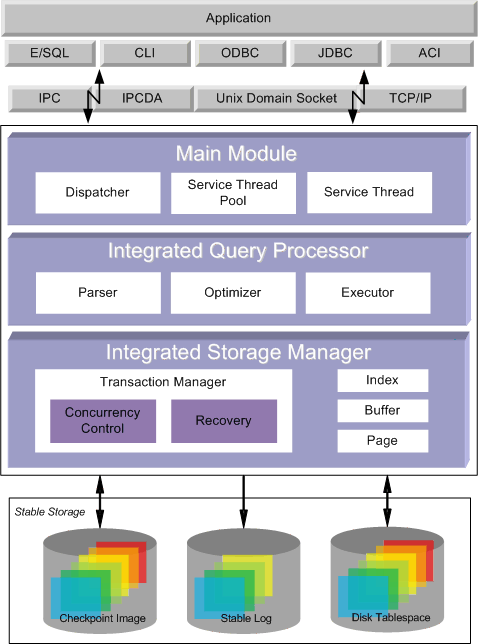

# 1.Altibase 소개

이 장에서는 Altibase를 처음 접하는 사용자들을 위해서 Hybrid DBMS의 등장 배경과 Altibase의 구조 및 특징에 대해서 설명한다.

## Hybrid DBMS개념

이 절은 Altibase에서 선도하고 있는 새로운 개념인 Hybrid Database Management System(이하 Hybrid DBMS)에 대해서 설명한다.

### Hybrid DBMS 등장 배경

Hybrid DBMS의 등장은 데이터를 저장하는 두 가지 대표적인 기억 장치인 메모리와 디스크의 특징과 밀접한 관련이 있다.

첫째, 메모리는 전자 게이트로 구성되어 있고 접근시간이 수 ns(십억 분의 일초) 단위로서 매우 빠르며 접근시간이 균일하고 정전 시에는 데이터가 소실되는 특징을 가지고 있다. 즉, 메모리는 휘발성 저장 매체이다.

반면에, 디스크는 헤드암과 플래터로 구성되어 있다. 디스크 접근시간이 수 us(백만분의 일초)로 메모리에 비해서 상대적으로 느리다. 게다가 접근시간이 균일하지 않다. 최근에 좀 더 대중화된 SSD(Solid State Drives) 조차도 휘발성 메모리에 비해서는 접근 시간이 좀 느리다. 그러나 정전이 되더라도 디스크의 데이터는 영구히 보존되는 특징을 가지고 있다.

둘째, 메모리는 메인보드와 시스템 버스로 연결되어 있어 메인보드의 특성에 따라 최대 저장 크기가 결정 된다. 메인보드에 장착된 CPU가 32비트이면 메모리의 최대 크기는 4GB, CPU가 64비트라고 해도 최대 크기는 현재 수백 GB(십억 바이트)까지만 장착 가능하다. 반면에, 디스크는 메인보드와 I/O버스로 연결되어 있어 메인보드의 특징과 거의 무관하게 수 TB(일조 바이트)까지 구성이 가능하다.

요약하면, 일반적으로 메모리는 디스크에 비해 접근 시간이 수백배 빠르며 성능이 균일한 반면, 정전시 데이터가 소실되고 저장용량에 한계가 있다. 이에 반해, 디스크는 데이터가 영구히 저장되며 저장용량의 한계가 거의 없는 반면, 접근 시간이 느리고 일정하지 않다.

이런 기억장치의 특징에 따라서 DBMS는 디스크에 데이터를 저장하는 Disk-Resident DBMS(이하 DRDBMS)와 메모리에 데이터를 저장하는 Main-Memory DBMS(이하 MMDBMS)가 존재해 왔다. Hybrid DBMS는 이 두 가지 구조의 장점을 수용하고, 단점을 보완하여 개발 되었다.

#### DRDBMS 등장

DRDBMS구조는 데이터가 디스크에 저장되어 있고, DRDBMS가 디스크에 있는 데이터를 메모리 버퍼로 읽어서 응용프로그램에게 전달해 주는 형태이다.

이런 구조는 응용프로그램이 표준 SQL을 통해서 데이터에 접근하고, DBMS가 동시성제어 및 복구를 통해 데이터를 보호하기 때문에 응용프로그램의 개발이 훨씬 간편해지며 데이터 공유가 쉬운 장점이 있다. 또한 데이터가 디스크에 저장되어 있기 때문에 대용량 데이터베이스를 구성할 수 있다. 이런 장점 때문에, 지금까지 전 산업분야에서 DRDBMS가 광범위하게 사용되어 왔다.

하지만, 사회전반에 걸쳐 정보화가 급격히 진전되고 정보처리의 요구 성능이 높아지면서 데이터 처리에 대한 수요는 많았으나, DRDBMS의 낮은 평균 처리속도와 처리속도의 기복(jitter)의 문제 때문에 DRDBMS를 사용하지 못하는 분야가 많았다.

따라서 고성능 및 균일 성능의 데이터 처리를 필요로 하는 산업 분야에서는 지금까지 Custom Designed Memory DB를 사용하였다. 그러나 범용적이지 않고 데이터 관리에 필요한 모든 것을 직접 개발해야 했기 때문에 개발 및 유지보수가 어렵고, 성능, 가용성, 확장성 등에서 문제가 있었다.

#### MMDBMS 등장

MMDBMS의 구조는 데이터가 메모리에 저장되어 있고 MMDBMS가 메모리에 있는 데이터를 읽어서 응용프로그램에 전달하는 형태이다.

이런 구조는 DRDBMS의 장점인 표준 SQL을 통한 데이터 접근, 동시성 제어 및 복구를 통한 데이터 보호, 이를 통한 응용프로그램의 개발과 데이터 공유의 용이성 등의 장점을 그대로 가진다.

또한 MMDBMS는 데이터를 메모리에 저장하기 때문에 디스크에 데이터를 저장하는 DRDBMS에 비해 평균처리 속도가 매우 빠르며 메모리의 특징인 균일한 성능을 보장한다. 따라서 고성능 및 균일 성능의 필요성 때문에 DRDBMS를 사용할 수 없는 분야에서 각광을 받고 있다.

일반적으로 DRDBMS에 비해서 MMDBMS가 갱신 연산은 약 10배, 검색 연산은 약 3배 이상의 성능을 보인다.

갱신 연산이 DRDBMS에 비해서 수백배가 아닌 이유는 MMDBMS도 데이터 보호를 위해서 DRDBMS와 똑같이 로그파일을 디스크에 기록하기 때문이다. 그럼에도 불구하고 MMDBMS의 갱신 연산이 더 빠른 이유는 MMDBMS는 데이터 보호가 DRDBMS에 비해서 훨씬 단순하게 최적화되어 있기 때문이다.

또한 검색 연산이 DRDBMS에 비해서 수백배가 아닌 이유는 DRDBMS도 데이터접근 성능을 높이기 위해 메모리 버퍼를 사용하기 때문이다. 그럼에도 불구하고 MMDBMS의 검색 연산이 더 빠른 이유는 데이터접근이 단순하게 최적화되어 있고, 메모리 접근 시 성능의 기복(jitter)이 없기 때문이다.

이런 고성능 및 균일성능의 장점에도 불구하고 데이터를 메모리에 저장해야 하는 MMDBMS는 정보처리의 요구량이 방대하여 수백 GB이상의 데이터를 저장해야 하는 산업분야에서 다시 한계를 나타내게 되었다.

#### MMDBMS와 DRDBMS 혼용 구조 등장

이런 문제점을 극복하기 위해서 현재 가장 일반적으로 사용되는 구조는 데이터를 구분하여 저장하는 형태이다. 고성능이 필요한 데이터는 MMDBMS에, 대용량이 필요한 데이터는 DRDBMS에 저장함으로써 MMDBMS와 DRDBMS를 혼용한다.

이러한 구조는 MMDBMS와 DRDBMS의 공통정보에 대해서 서로 동기화해야 한다는 문제, MMDBMS와 DRDBMS를 같이 처리해야 하는 응용프로그램은 양쪽에 동시에 접속해서 처리해야 한다는 문제, 또한 장애 복구가 복잡하다는 문제들을 가지고 있다.

하지만 이제까지는 고성능처리와 대용량처리를 함께 처리할 방법이 없었기 때문에, 고성능처리와 대용량 정보처리가 필요한 분야에서는 일반적으로 활용되고 있다.

#### Hybrid DBMS 등장

Hybrid DBMS는 DRDBMS의 구조, MMDBMS의 구조, 그리고 MMDBMS와 DRDBMS가 결합된 구조들의 장점을 수용하고 문제점을 해결하기 위해서 등장하게 되었다.

Hybrid DBMS는 데이터를 구분하여, 고성능이 필요한 데이터는 메모리에, 대용량이 필요한 데이터는 디스크에 저장하되, 이 두 가지 데이터를 처리하는 DBMS는 하나로 통합된 구조를 가지고 있다.

고성능 정보처리와 대용량 정보처리를 하나의 DBMS에서 통합, 처리하는 구조이기 때문에, 앞서 설명한 혼용구조의 동기화 문제, 복잡한 장애처리 문제, 응용프로그램이 복잡해지는 문제를 해결하게 되었다. 또한 MMDBMS 전용, DRDBMS 전용, Hybrid DBMS 등 다양한 구성이 가능하게 되었다.

요약하면, Hybrid DBMS는 고성능 정보처리를 가능하게 하는 MMDBMS와 대용량 정보처리를 가능하게 하는 DRDBMS의 장점을 결합하여 데이터는 구분하여 저장하고 데이터 관리는 통합한 구조이다.

즉, Hybrid DBMS는 효율적인 시간 활용으로 고성능 정보 처리가 가능하고, 효율적인 자원활용으로 대용량 정보처리를 할 수 있게 되었다. Hybrid DBMS는 고성능 및 대용량 정보처리가 모두 필요한 분야를 포함하여 포괄적으로 사용이 가능해졌다.

[그림 1‑1] 고성능 대용량 DBMS구조

## Altibase 특징

고성능 대용량 하이브리드 데이터베이스 시스템인 Altibase에 대한 일반적인 내용을 소개한다. 하이브리드 데이터베이스 시스템으로써 Altibase가 갖는 특징, 구조, 기능 등에 관하여 간략하게 설명한다. 이에 대한 자세한 내용은 Altibase 각각의 세부 매뉴얼을 참조한다.

### 데이터 모델

Altibase의 데이터 모델은 관계 모델 (relational model)을 채택하고 있다. 관계 모델은 세 가지 주요 요소를 포함한다.

구조(structure)는 데이터베이스를 저장하거나 접근하는 객체 단위로 테이블, 뷰, 인덱스 등을 일컫는다. 이들은 곧 연산자의 조작 단위가 된다.

연산(operation)은 데이터베이스의 데이터와 구조를 사용자들이 조작할 수 있도록 허용하는 행위(action)들을 정의한 것으로써 무결성 규칙을 수반한다.

무결성 규칙(integrity rule)은 데이터와 구조에 허용된 연산을 다루기 위한 법칙으로, 데이터와 구조를 보호하기 위한 것이다.

관계 데이터베이스 관리 시스템은 다음과 같은 장점을 제공한다.

-   물리적 데이터와 논리적 데이터 독립성을 유지한다.

-   모든 데이터에 대한 접근이 다양하고 쉽다.

-   데이터베이스 설계가 유연하다.

-   데이터베이스 저장 공간과 데이터의 중복을 줄일 수 있다.

### 엔진 구조 

Altibase는 클라이언트-서버 구조를 제공한다. 클라이언트-서버 구조는 클라이언트가 통신망을 통해 서버에 접근하는 형태로 기존의 RDBMS가 제공하는 방식이다.

Altibase 서버는 내부적으로 다중 쓰레드 구조를 갖고 있다.

### 인터페이스 

Altibase는 기존의 실시간 데이터베이스 시스템과는 달리 범용성을 추구하는 일환으로 산업 표준 인터페이스를 지원한다. Altibase에서 제공하는 데이터베이스 질의어는 SQL92와 SQL99 표준을 따른다.

프로그래밍 인터페이스로는 CLI, ODBC, JDBC, C/C++ Precompiler 등을 지원하고 있으며, 기존에 작성된 데이터베이스 응용 프로그램을 변환할 필요 없이 그대로 사용할 수 있다. Altibase가 지원하는 SQL에 대한 자세한 내용은 *[SQL Reference](https://github.com/ALTIBASE/Documents/blob/master/Manuals/Altibase_7.3/kor/SQL%20Reference.md)* 를 참조한다.

### 다중버전 기법

Altibase는 다중버전 기법(이하 MVCC: Multi-Version Concurrency Control)을 이용한 동시성 제어를 수행한다. 다중 버전 기법은 하나의 데이터에 대해 여러 개의 버전을 유지하여 읽기와 쓰기 연산에 대한 충돌을 없앰으로서 최대의 성능을 발휘할 수 있도록 하는 것이다. 특히, 기존의 row locking 방식의 단점이었던 읽으려고 하는 데이터가 이미 다른 수정 연산에 의해 lock이 걸려 있거나, 수정하려는 데이터를 다른 읽기 연산이 읽는 중이어서 장기간 대기해야 하는 문제점을 제거하였으며, 필요 없는 오래된 데이터를 즉시 회수함으로서 메모리의 낭비를 방지하였다. 다중 버전 기법은 대규모 사용자가 접근하는 환경에서 최적의 성능을 발휘하고, 데이터베이스를 종료하지 않고도 즉시 백업할 수 있는 핫-백업(hot-backup) 시스템을 지원한다.

Altibase는 메모리 테이블과 디스크 테이블에 대해 외형상으로는 같은 기능을 하지만, 서로 다른 방법으로 MVCC를 구현하였다. 메모리 테이블은 레코드의 변경시마다 새로운 버전을 생성하는 out-place MVCC로 구현되어 있으며, 디스크 테이블의 경우는 변경된 데이터를 기존의 레코드에 덮어 쓰고, 변경 이전의 정보를 undo 테이블스페이스에 저장하여 참조하는 in-place MVCC 방식을 채택하고 있다.

### 트랜잭션

Altibase는 Hybrid DBMS의 구조에 맞추어 최고의 성능을 낼 수 있는 트랜잭션 구조와 이와 관련된 다양한 기능을 제공한다. 먼저 데이터베이스 내에서 동시에 수행될 수 있는 트랜잭션의 개수를 프로퍼티를 이용해서 조절할 수 있다. 또한 효율적인 서버 운영을 위해 AUTOCOMMIT 모드를 사용할 수 있다. 그리고 Altibase가 제공하는 트랜잭션의 고립화 수준(isolation level)은 read committed(=0), repeatable read(=1), no phantom read(=2)가 있으며, 사용자의 필요에 맞추어 적절하게 선택하여 사용할 수 있다.

### 로깅

데이터베이스 안정성과 영속성을 위하여 Altibase는 변경된 데이터베이스 내용에 대하여 로깅(logging)을 수행한다. 또한 시스템간의 이중화 (Replication) 작업 때의 성능을 극대화 시키기 위해 최적의 로그를 생성한다.

### 버퍼 풀 (Buffer Pool) 

디스크 테이블스페이스에 접근하는 트랜잭션들의 성능을 향상시키기 위해 디스크에 대한 I/O 회수를 최소화해야 한다. 이를 위해 버퍼 풀을 사용함으로써 이전에 디스크로부터 읽은 페이지들 중 일정 부분을 메모리에 캐시해 두어 디스크에서 다시 읽어들이는 것을 방지한다. 버퍼 풀은 Hot-Cold LRU(Least Recently Used) 알고리즘에 의해 관리된다.

### 더블 라이트 (Double Write) 파일

Altibase 시스템의 페이지 크기와 파일 시스템의 물리적 페이지 크기가 다를 경우, 디스크 I/O 수행 중에 Altibase 서버가 비정상적으로 종료하면 페이지가 온전하지 못한 상태로 남아있을 수 있다.

이런 현상을 방지하기 위하여 Altibase는 페이지를 플러시할 때, 같은 이미지를 디스크의 더블 라이트 파일에 저장한 후, 페이지 원래 위치에 다시 저장한다. 그리고 Altibase를 재구동할 때 더블 라이트 파일의 내용과 실제 페이지의 내용을 비교하여 손상된 페이지를 복구한다.

더블 라이트 기능은 디스크의 결함을 보완해 주지만, 시스템의 성능을 떨어뜨릴 수 있다. 이 기능은 사용자가 성능을 위해 사용하지 않을 수 있다.

### 퍼지&핑퐁 체크포인트 

Altibase는 최근의 데이터베이스 상태를 안전하게 백업(backup) 데이터베이스로 반영하기 위해 퍼지&핑퐁 체크포인트를 수행한다.

메인 메모리 데이터베이스에서의 퍼지 체크포인트(fuzzy checkpoint)는 모든 변경된 데이터 페이지가 백업 데이터베이스로 내려가 현재 수행중인 트랜잭션의 수행에 영향을 미칠 수 있기 때문에 퍼지 체크포인트와 더불어 핑퐁 체크포인트(ping pong checkpoint) 방식을 함께 수행한다. 즉, 백업 데이터베이스를 두 개로 관리함으로써, 체크포인트 과정에서 부하를 줄일 수 있어 트랙잭션 동작이 최대한의 성능을 발휘할 수 있다.

### 저장 프로시저 (Stored Procedure)

저장 프로시저는 입력 인자, 출력 인자, 입출력 인자를 가지고 바디(body) 내에 정의된 조건에 따라 여러 SQL 문을 한번에 수행하는 데이터베이스 프로시저다.

저장 프로시저의 종류는 리턴값 유무에 따라 프로시저와 함수로 나누어 진다. 자세한 내용은 *[Stored Procedures Manual](https://github.com/ALTIBASE/Documents/blob/master/Manuals/Altibase_7.3/kor/Stored%20Procedures%20Manual.md)*을 참고한다.

### 데드락 감지 (Deadlock Detection)

데드락은 트랜잭션간의 리소스 할당이 자동으로 해제될 수 없는 비정상적인 트랜잭션 정지 상태이다. 이러한 경우 일반적으로 데드락을 감지하는 별도의 쓰레드 또는 프로세스를 두게 되는데, 이러한 감지 구조는 필연적으로 일시적인 서비스 중단 사태를 초래한다. Altibase는 별도의 데드락 감지 쓰레드를 두지 않고, 데드락이 발생되는 순간 데드락 상황을 감지하여, 신속히 조치를 취함으로써 어떠한 경우에도 서비스가 중지되지 않도록 하며, 지속적이고 안정적인 데이터베이스 운용을 보장한다.

### 테이블 컴팩션

데이터베이스 운용시, 실제로 특정 메모리 테이블이 필요한 메모리 공간 이상을 차지하는 경우가 발생한다. 주로 대량의 데이터가 삽입 된 후 변경 및 삭제가 이루어지는 경우가 그러하다. 이런 경우 해당 테이블에서 필요 없는 메모리를 시스템으로 반환할 수 있다면, 보다 효율적으로 메모리 사용이 가능하다. 이런 필요로 인해 Altibase는 메모리 테이블에 대해 테이블 단위의 컴팩션(compaction) 기능을 제공하며, 이 기능을 이용하여 메모리 및 테이블의 효율적 관리가 가능하다.

### 데이터베이스 이중화 

Altibase는 시스템의 높은 가용성(high availability)과 무정지(fault tolerance) 시스템을 위하여 로그 기반의 데이터베이스 이중화(replication)를 제공한다. 로그 기반의 이중화 시스템 구조는 트랜잭션 로그를 기반으로 데이터베이스를 이중화시킴으로써, Altibase의 효율성을 높이고 시스템 부하를 줄일 수 있다. 서비스 중인 지역(local) 시스템의 이중화 관리 쓰레드는 로그 데이터를 원격(Remote) 시스템의 이중화 관리 쓰레드에 실시간으로 전달한다. 원격 시스템의 이중화 관리 쓰레드는 전달받은 로그 데이터를 분석하여 이것을 Altibase 서버에게 전달하고 Altibase 서버는 이 내용을 데이터베이스에 반영한다. 이렇게 함으로써 서비스 중인 컴퓨팅 시스템이 중단되었을 때, 시스템 복구 시간이 필요 없이 곧바로 다른 시스템을 사용하여 서비스할 수 있는 체제를 갖추고 있다.

Altibase는 부하 분산(load balancing) 기능도 제공한다. Altibase의 데이터베이스 복제 운영 환경에서, 서비스하는 트랜잭션들을 두 그룹 이상으로 나누어 각각의 트랜잭션이 해당 서버에서 수행되도록 구성하면, 각 서버에서 변경되는 데이터베이스 내용은 이중화를 통해서 상대편 서버에 반영됨으로써 복제된 데이터베이스의 일관성(consistency)을 보장할 수 있다.

### 클라이언트-서버 프로토콜

Altibase를 클라이언트-서버 구조로 운영할 때, 사용자는 응용 시스템의 구성에 적합한 클라이언트-서버 프로토콜을 선택하여 사용할 수 있다. Altibase가 제공하는 통신 프로토콜로는 TCP/IP, IPC, IPCDA와 Unix Domain socket이 있다.

TCP/IP(Transmission Control Protocol/Internet Protocol) 프로토콜은 네트워크 상에서 클라이언트-서버 간에 사용되는 사실상의 표준 통신 프로토콜이다. IPC(Inter Process Communication) 프로토콜은 Altibase가 제공하는 프로토콜로써, 공유메모리(shared memory)를 활용하여 클라이언트와 서버 간에 통신을 하도록 하였다. IPC 방법은 통신 패킷에 대하여 마샬링(marshaling)이 필요 없고 공유 메모리를 이용하기 때문에 다른 통신 프로토콜보다 빠른 통신 속도를 낼 수 있다.

IPCDA는 IPC 기반 통신 방법을 간소화하여 최고의 성능을 내도록 설계되었다. 공유 메모리에 직접 데이터를 읽고 쓰게 하여 메모리 액세스를 최소화하였다. 또한 자체 개발한 스핀락(SpinLock)을 이용하여 프로세스 간 유휴 시간(idle time)을 최소화하였다.

클라이언트 프로그램과 Altibase 서버가 상이한 컴퓨터 시스템에 존재하는 경우에는 인터넷 소켓을 이용한 TCP/IP 프로토콜을 사용하여야 하며, 이들이 동일 컴퓨터 시스템에 존재하는 경우에는 도메인 소켓을 이용한 프로토콜이나 IPC, IPCDA 프로토콜을 사용할 수 있다. 각각의 통신 프로토콜에 대한 성능은 IPCDA, IPC, 도메인 소켓, 인터넷 소켓 순으로 IPCDA가 가장 빠르다. 다만 IPCDA 에서는 LOB 데이터를 지원하지 않는다.

서버와 클라이언트의 통신 방법에 대한 자세한 설명은 '서버/클라이언트 통신'을 참조하기 바란다.

### 데이터베이스 공간

Altibase의 데이터베이스는 데이터베이스의 모든 데이터를 모아 저장하는 하나 이상의 테이블스페이스로 구성되고, 테이블스페이스는 크게 메모리 공간과 디스크 공간으로 나누어진다. Altibase가 생성하는 시스템 테이블스페이스 외에 사용자가 메모리와 디스크 각각의 공간에 테이블스페이스를 추가할 수 있다.

### Direct-Path INSERT

Direct-Path INSERT는 데이터를 입력할 때 페이지의 빈 공간을 찾아 들어가는 대신 새로운 페이지를 만들어 데이터를 입력한다. 즉 데이터를 입력할 때 테이블의 빈 공간(free space)을 사용하지 않고, 테이블스페이스로부터 익스텐트(extent)를 새로 할당받는다.

또한 버퍼 관리자를 사용하지 않고, 전용 버퍼(Private Buffer)를 사용하기 때문에 버퍼 공간에 대하여 여러 트랜잭션과의 경합을 줄인다. 그리고 INSERT를 APPEND 방식으로 수행하여 리두(Redo) 및 언두(Undo)를 하지 않거나 줄여 로깅에 들어가는 비용을 줄인다.

### 데이터베이스 링크

Altibase의 데이터베이스 링크는 지역적으로 분리되어 있으나, 네트워크로 연결된 이기종의 데이터 서버들을 연동하여 개별 데이터들을 통합해 하나의 결과를 생성할 수 있게 한다.

### iSQL

Altibase는 iSQL을 이용해 데이터베이스를 관리할 수 있어 빠르고 간편하게 데이터베이스를 관리할 수 있다.

### altiComp

Altibase는 altiComp 기능을 사용하여 두 데이터베이스를 테이블 단위로 비교, 검사하여 불일치하는 데이터의 정보를 출력하는 기능과 불일치가 발생한 경우 두 데이터베이스를 일치시키는 기능 등을 제공한다.

### iLoader

Altibase는 iLoader 유틸리티를 제공하여, 데이터베이스의 이전이나 테이블 단위의 백업 등을 할 때 테이블 단위로 데이터를 다운로드하거나 업로드할 수 있도록 지원한다.

## Altibase 구조

본 절에서는 Altibase의 클라이언트-서버 구조를 중심으로 한 전체 구성도, 서버 프로세스 내부 구조, 데이터베이스 구조에 관하여 살펴본다.

### 전체 구성도

다음은 Altibase와 애플리케이션이 클라이언트-서버 구조로 구성된 시스템을 도식화한 그림이다. 특히 Altibase 서버 부분을 계층화된 구조(Layered Architecture)로 표현하여 클라이언트의 요청과 데이터가 어떤 흐름으로 처리되는지를 볼 수 있다. 서버 외의 부분은 애플리케이션과 데이터베이스 접근을 위한 드라이버(라이브러리) 및 통신 모듈로 구성된다.

[그림 1‑2] Altibase 구성도

### 서버 프로세스 내부 구조

Altibase 서버 프로세스의 내부 구조를 보면 메인 쓰레드, 디스패처, 로드 밸런서, 서비스 쓰레드 풀, 서비스 쓰레드, 체크 포인트 쓰레드, 세션 관리 쓰레드, 가비지 콜렉션 쓰레드, 로그 플러시 쓰레드, 버퍼 플러시 쓰레드 그리고 아카이브로그 쓰레드가 있다. 각각의 쓰레드는 다음과 같은 일을 수행한다.

#### 메인 쓰레드

모든 쓰레드를 생성/종료시키고 생성한 쓰레드들을 관리한다.

#### 디스패처(Dispatcher)

클라이언트의 연결 요청이 있으면, 서비스 쓰레드 풀(pool)에서 대기 상태에 있는 서비스 쓰레드와 요청한 클라이언트를 연결시킨다.

#### 로드 밸런서(Load Balancer)

각 서비스 쓰레드의 부하를 감지하여 서비스 쓰레드를 추가하거나 삭제하고 태스크를 서비스 쓰레드에 분배한다.

#### 서비스 쓰레드

서비스 쓰레드는 질의를 처리한 후 결과를 클라이언트에 반환한다.

Altibase 서버를 구동하면 Altibase는 설정(altibase.properties) 정보에 명시된 개수만큼 서비스 쓰레드를 생성하여 서비스 쓰레드 풀에 저장한다.

#### 체크포인트 쓰레드 

고장 복구 시에 일의 양을 줄이기 위하여, 주기적 또는 임의로 현재의 데이터베이스 및 시스템에 대한 상황을 데이터파일에 기록하는 쓰레드이다.

#### 세션 관리 쓰레드(Session Manager)

클라이언트와 서비스 쓰레드 간에 연결된 세션의 상태 즉, 이 세션이 단절되었는지의 여부를 감시하는 쓰레드이다.

#### 가비지 콜렉션 쓰레드(Ager)

다중 버전 기법에서는 한 데이터에 대해 필요없는 오래된 데이터가 생성될 수 있다. 가비지 콜렉션 쓰레드(garbage collection thread)는 이러한 데이터가 필요없게 된 순간 그 즉시 메모리 공간을 회수하여, 재사용할 수 있도록 조치를 취함으로서 메모리 사용의 효율성을 극대화한다. 가비지 콜렉션 쓰레드를 Ager라고도 한다.

#### 로그 플러시 쓰레드

로그 플러시 쓰레드(log flush thread)는 데이터베이스 내의 모든 트랜잭션이 생성한 로그를 관리하고, 로그 버퍼에 모여진 다량의 로그 데이터를 로그 디스크에 반영하는 기능을 한다. 디스크에 완전히 반영(sync)된 로그는 데이터베이스 시스템의 장애 및 재해 발생 시에 데이터베이스를 안전하게 복구하는데 사용된다.

#### 버퍼 플러시 쓰레드(Flusher)

버퍼 풀의 모든 메모리가 사용 중이면 디스크 I/O를 발생시켜서 수행중인 트랜잭션에 성능 상의 기복(Jitter) 현상을 일으키게 된다. 버퍼 플러시 쓰레드는 주기적으로 버퍼를 체크하여 일정 양 이상의 가용 버퍼 메모리를 항시 유지하도록 하며, 사용하지 않는 페이지를 디스크에 내리고 메모리를 사용 가능하게 만드는 역할을 한다. 버퍼 플러시 쓰레드를 Flusher라고도 부른다.

#### 아카이브로그 쓰레드

매체 오류에 대한 복구를 지원하기 위해 주기적으로 온라인 로그 파일들을 프로퍼티에 지정된 위치로 복사하는 쓰레드이다. 복사할 경로는 ARCHIVE_DIR 프로퍼티로 지정하면 된다. Altibase가 아카이브 모드로 운영될 때만 동작한다.

[그림 1‑3] Altibase 프로세스의 내부 구조

### 데이터베이스의 물리적 구조

Altibase의 데이터베이스는 물리적으로 로그앵커 파일, 로그 파일, 데이터 파일로 구성되어 있다.

#### 로그앵커 파일

로그앵커 (loganchor) 파일은 데이터 파일과 로그와의 관계를 나타내는 중요한 정보를 포함한다. 이는 로그를 기준으로 한 시점에서 데이터 파일의 총체적인 정보를 나타낸다. 이 파일은 데이터 파일과 함께 중요한 백업 대상이다.

#### 로그 파일

로그 파일(“리두 로그 파일”로 불리기도 함)은 트랜잭션의 원자성(Atomicity)과 영속성(Durability)을 유지하기 위해 사용된다. 원자성은 트랜잭션의 철회(rollback)를 통해 트랜잭션 수행 이전의 상태로 복귀할 수 있도록 하는 것이고, 영속성은 정상적으로 종료(commit)된 트랜잭션이 다양한 데이터베이스 장애로부터 원래의 내용을 복구할 수 있도록 하는 것이다.

로그 파일은 prepare 로그 파일과 active 로그 파일, archive 로그 파일로 구분할 수 있다. Active 로그 파일은 실행중인 트랜잭션의 로그가 기록되는 로그파일이다. Prepare 로그 파일은 로그 기록 성능을 향상시키기 위해 미리 만들어지는 로그 파일로 실제 로그가 기록되기 전까지는 비어있는 상태이다. Archive 로그 파일은 복구를 위하여 백업된 로그 파일로 기록이 완료된 로그 파일들이다.

로그 파일은 현재의 데이터베이스 상태를 가지는 매우 중요한 파일로서, 만일 현재 로그 파일이 손상을 입었을 경우 당시 작업의 유무에 관계없이 데이터베이스 전체가 손상을 입게 된다. 기존 로그 파일은 일반적으로 데이터 파일이 손상될 경우 백업 파일과 함께 데이터베이스를 복구하는데 사용된다.

#### 데이터 파일

데이터 파일 중 SYS_TBS_MEM_DATA에는 기본으로 생성되는 시스템 메모리 테이블스페이스가 저장되며, SYS_TBS_MEM_DIC에는 메타 테이블들이, system001.dbf 파일에는 기본으로 생성되는 디스크 테이블스페이스 (SYS_TBS_DISK_DATA)가 저장된다. 또한 temp001.dbf 파일에는 쿼리 수행 시 중간 결과들이 저장되는 임시 테이블스페이스가 저장되며, undo001.dbf 파일에는 다중버전 기법(MVCC: Multi-Version Concurrency Control)에서 사용되는 이전 이미지 정보들이 저장되는 언두 테이블스페이스가 저장된다.

Altibase는 페이지 단위로 데이터파일 내에서 저장 공간을 관리한다. 페이지는 데이터베이스에 의해 사용되는 데이터의 가장 작은 단위이다.

페이지는 데이터베이스를 관리하기 위한 정보를 담고 있는 카탈로그 페이지와 사용자 데이터를 저장하는 데이터 페이지로 나누어 진다. 카탈로그 페이지는 현재 생성된 데이터베이스에 대한 상세한 명세를 담고 있으며, Altibase의 구동 및 종료 시 데이터베이스의 일관성 검사에 사용된다.

카탈로그 페이지는 데이터베이스에서 사용되는 자기 자신을 제외한 나머지 데이터 페이지에 대한 리스트 및 사용정보를 담고 있으며, 백업 데이터베이스의 가장 첫 번째 페이지에 위치하고 있는 매우 중요한 페이지 영역이다.

데이터 페이지는 실제로 사용자 데이터가 저장되는 영역이며, 페이지 헤더와 페이지 본체(body)로 나누어진다. 페이지 헤더는 서로 간의 리스트를 유지하기 위한 링크 정보와 타입, 그리고 자기 자신의 페이지 번호로 구성되어 있다. 페이지 본체는 여러 개의 슬롯으로 분할된다. 이 슬롯이 실제 데이터가 저장되는 최종 저장소이다.

### 데이터베이스 논리적 구조

Altibase는 논리적으로 메모리와 디스크 테이블스페이스 내에 데이터를 저장하고, 물리적으로는 해당 테이블스페이스와 관련된 데이터파일 내에 저장한다.

Altibase 데이터베이스를 구성하는 각각의 테이블스페이스는 하나 이상의 데이터파일로 구성된다. 단, 하나의 데이터파일은 하나의 테이블스페이스에만 소속된다.

데이터베이스, 테이블스페이스 그리고 데이터파일은 밀접한 관계가 있으며 이 관계를 정리하면 다음과 같다.

데이터베이스는 논리적으로 테이블스페이스라는 저장 단위로 구성되어 있다. 즉, 테이블스페이스는 데이터베이스의 모든 데이터를 저장하는 논리적인 공간이다. 데이터베이스는 물리적으로 데이터파일이라고 불리는 하나 이상의 파일들로 구성된다. 즉, 데이터파일은 데이터베이스의 모든 데이터를 저장하는 물리적 공간이다.

다음 그림은 테이블스페이스와 데이터파일의 관계를 설명한다.

[그림 1‑4] 데이터베이스 논리적 구조

Altibase는 데이터베이스 내의 모든 데이터에 논리적 데이터베이스 영역인 테이블스페이스를 할당한다. 데이터베이스 영역 할당의 단위로는 페이지(page), 익스텐트(extent) 그리고 세그먼트(segment)가 있다.

페이지는 가장 작은 논리적 저장 단위로, 모든 데이터는 페이지 내에 저장된다.

페이지의 논리적인 다음 단계는 익스텐트이다. 즉 일정 개수의 연속적인 페이지들이 모여서 익스텐트라는 데이터베이스 영역을 형성한다.

익스텐트 상위의 논리적 데이터베이스 저장 단계를 세그먼트라고 한다. 하나의 세그먼트는 일련의 익스텐트의 집합이며, 한 세그먼트 내의 모든 익스텐트는 같은 테이블스페이스에 저장된다.

자세한 내용은 "6장 테이블스페이스"를 참조한다.

### 기타 제어 파일들

#### 부트 로그 파일 (altibase_boot.log)

Altibase 서버가 동작된 상태를 기록한다. 이 파일이 기록하고 있는 정보로는 Altibase 구동 및 종료 시 얻어지는 시스템 정보에 대한 세부사항이 있으며, 또한 Altibase의 비정상 종료 시 Altibase의 오류 발생 상태를 기록한다.

#### 프로퍼티 파일 (altibase.properties)

Altibase 서버의 환경 설정을 위한 파일이며 Altibase 서버의 운용 방식과 튜닝에 관한 모든 구성 요소를 포함하고 있다.

#### 에러 메시지 파일

데이터 저장 관리 모듈, 질의 처리 모듈, Altibase 서버 메인 모듈, 그리고 함수 실행이나 데이터 타입과 관련된 오류 메시지를 수록한 파일이다.

