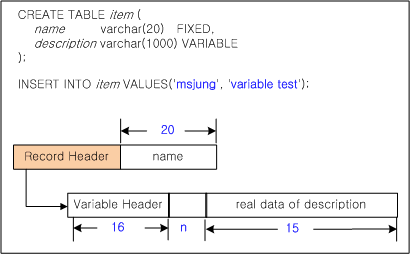
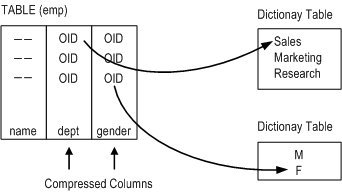

# 5.데이터베이스 객체 및 권한

이 장에서는 Altibase 데이터베이스 내의 객체 관리 및 권한 관리 방법에 대해서 설명한다.

## 데이터베이스 객체 개요

데이터베이스 객체는 특정 스키마에 속하여 관리되는 스키마 객체와 스키마와 관계없이 데이터베이스 전체에서 관리되는 비스키마 객체로 구분할 수 있다. 이 장에서는 스키마 객체와 비스키마 객체를 구분하고 각각에 포함되는 데이터베이스 객체에 대해 설명한다.

### 스키마 객체

스키마란 데이터 또는 객체들의 논리적 집합으로 한 데이터베이스 사용자는 하나의 스키마를 소유하고 SQL문에 의해 관리된다. 이러한 스키마에 포함되는 객체를 스키마 객체라고 하고 Altibase는 다음과 같은 스키마 객체를 제공한다.

#### 테이블(Table) 

테이블은 가장 기본적인 데이터 저장 단위로써 테이블은 칼럼들로 구성된 레코드들의 집합이다. Altibase의 테이블은 데이터의 저장 공간에 따라 메모리 테이블과 디스크 테이블로 구별된다. 그리고 시스템이 생성하고 관리하는 시스템 테이블과 일반 사용자가 생성하는 일반 테이블로 구별될 수도 있다.

이중화 대상 테이블의 경우 테이블 관리가 특별하며 대용량 테이블의 경우에도 주의를 요하는 사항들이 있다.

이에 대해서는 아래의 "테이블" 절에서 자세히 설명한다.

#### 파티션드 테이블(Partitioned Table)

테이블의 데이터를 여러 조각(각 조각을 파티션이라고 한다)으로 나누어 서로 다른 테이블스페이스에 저장하는 경우, 이 테이블을 파티션드 테이블(Partitioned Table)이라고 한다. 대용량 테이블의 경우 파티션드 테이블을 활용하면 데이터 관리가 용이할 것이다.

파티션드 테이블에 대한 자세한 내용은 "7장 파티션드 객체"를 참조한다.

#### 파티션드 인덱스(Partitioned Index) 

인덱스가 파티션되는 여부에 따라 파티션드 인덱스(partitioned index) 또는 논파티션드 인덱스(non partitioned index)로 분류한다. 논파티션드 인덱스는 파티션으로 분할되지 않은 인덱스를 의미하며, 파티션드 인덱스는 파티션드 테이블과 마찬가지로 파티션 조건에 따라 분리한 인덱스를 의미한다.

파티션드 인덱스에 대한 자세한 내용은 "7장 파티션드 객체"를 참조한다.

#### 임시 테이블(Temporary Table) 

하나의 세션 또는 트랜잭션이 유지되는 동안에 데이터를 일시적으로 보관하기 위해 임시 테이블을 사용할 수 있다. 임시 테이블을 이용하면 복잡한 질의를 사용할 때 수행 속도를 높일 수 있다.

임시 테이블은 휘발성 테이블스페이스에만 생성할 수 있다.

#### 큐 테이블(Queue Table) 

Altibase는 메시지 큐잉 기능을 이용하여 데이터베이스와 사용자 프로그램간의 비동기 데이터 통신을 지원한다. 이때 사용되는 큐 테이블은 데이터베이스 객체의 하나로써 일반 테이블과 마찬가지로 DDL과 DML로 제어할 수 있다.

큐 테이블의 개념과 기능에 대해서는 아래의 "큐" 절에서 자세히 설명한다.

#### 제약조건(Constraint) 

제약조건이란 테이블의 데이터 삽입 또는 변경 시 데이터의 일관성을 유지할 수 있도록 부과하는 조건이다.

제약조건의 대상에 따라 칼럼 제약조건과 테이블 제약조건으로 구별할 수 있다. Altibase는 아래의 제약조건을 지원한다.

-   NOT NULL / NULL 제약조건

-   CHECK 제약조건

-   유일 키 (unique key) 제약조건

-   주 키 (primary key) 제약조건

-   외래 키 (foreign key) 제약조건

-   TIMESTAMP 제약조건

#### 인덱스(Index) 

인덱스는 테이블의 특정 칼럼들에 대해 색인을 생성하여 그 테이블의 레코드들에 대한 빠른 접근이 가능하도록 한다. 즉, 인덱스를 사용하여 DML문의 처리 성능을 향상시킬 수 있다.

#### 뷰(View) 

뷰는 실제 데이터 자체는 포함하지 않고, 하나 이상의 테이블, materialized view 또는 뷰를 기반으로 한 논리적 테이블(logical table)이다.

#### Materialized View

Materialized view란 쿼리의 결과를 데이터로 저장하고 있는 데이터베이스 객체이다. 하나 이상의 테이블, 뷰, 및 다른 materialized view에 기반하여 데이터를 구성할 수 있다.

#### 시퀀스(Sequence) 

Altibase는 유일 키를 생성하기 위한 키생성자인 시퀀스를 제공한다.

#### 시노님(Synonym) 

테이블, 시퀀스, 뷰, 저장 프로시저 및 저장 함수에 대한 별칭 (alias)을 부여하여 객체 사용에 대한 투명성을 보장할 수 있는 시노님을 제공한다.

#### 저장 프로시저 및 저장 함수(Stored Procedure or Function) 

저장 프로시저 (Stored Procedure)란 SQL문들과 흐름 제어문, 할당문, 오류 처리 루틴 등으로 구성된 데이터베이스 객체이다. 이를 이용해서 전체 업무 절차를 프로그래밍하여 하나의 모듈로 만든 후 데이터베이스에 영구적으로 저장해 두고, 모듈 이름만을 호출하여 전체 업무 절차를 서버에서 한번에 수행하도록 하는 데이터베이스 객체이다.

하나의 리턴 값을 가지지 않느냐와 가지느냐에 따라 저장 프로시저와 저장 함수로 구별된다.

#### 타입 세트(Type Set) 

타입 세트(Type Set)란 저장 프로시저 및 저장 함수에서 사용하는 사용자 정의 타입들을 한 곳에 모아서 관리하도록 해 주는 데이터베이스 객체이다.

이에 대한 보다 자세한 내용은 *[Stored Procedures Manual](https://github.com/ALTIBASE/Documents/blob/master/Manuals/Altibase_7.3/kor/Stored%20Procedures%20Manual.md)*에서 자세히 설명한다.

#### 데이터베이스 트리거(Database Trigger) 

트리거란 테이블에 데이터가 삽입, 삭제, 또는 갱신될 때 시스템에 의해 작동되어 특정 작업 절차를 자동으로 수행할 수 있도록 하는 저장 프로시저의 한 종류이다. 사용자는 테이블에 대해 제약조건과 트리거를 정의하여 데이터의 일관성을 유지할 수 있다.

#### 데이터베이스 링크(Database Link) 

데이터베이스 링크는 지역적으로 분리되어 있으나 네트워크로 연결된 데이터 서버들을 연동하여 그 데이터들을 통합해서 하나의 결과를 생성할 수 있게 한다.

이에 대해서는 *[Database Link User’s Manual](https://github.com/ALTIBASE/Documents/blob/master/Manuals/Altibase_7.3/kor/DB%20Link%20User's%20Manual.md)*에 더 자세히 기술되어 있다.

#### 외부 프로시저 및 외부 함수(External Procedure or Function) 

외부 프로시저 또는 외부 함수 객체는 사용자 정의 C/C++ 함수와 일대일로 대응하는 데이터베이스 객체이다. 사용자 정의 함수의 실행은 외부 프로시저 또는 외부 함수 객체를 통해 이루어진다. 리턴 값을 가지는 여부에 따라 외부 프로시저와 외부 함수로 구별된다.

자세한 내용은 *[C/C++ External Procedures Manual](https://github.com/ALTIBASE/Documents/blob/master/Manuals/Altibase_7.3/kor/External%20Procedures%20Manual.md)*을 참고하도록 한다.

#### 라이브러리(Library) 

외부 프로시저와 연결된 사용자 정의 C/C++ 함수를 포함하는 동적 라이브러리 파일을 Altibase 서버가 식별할 수 있도록 해야 한다. 이를 위해 Altibase는 동적 라이브러리 파일에 일대일로 대응하는 라이브러리 객체라는 데이터베이스 객체를 제공한다.

자세한 내용은 [*C/C++ External Procedures Manual*](https://github.com/ALTIBASE/Documents/blob/master/Manuals/Altibase_7.3/kor/External%20Procedures%20Manual.md)을 참고하도록 한다.

### 비스키마 객체

특정 스키마에 소속되지 않고 전체 데이터베이스 수준에서 관리되는 객체를 비스키마 객체라고 한다. Altibase는 다음과 같은 비스키마 객체를 제공한다.

#### 디렉터리(Directory) 

저장프로시저의 파일 제어 기능은 운영 체제의 텍스트 파일에 대한 읽기 및 쓰기 기능을 제공한다. 이 기능을 이용하여 사용자는 저장프로시저 실행에 대한 별도의 메시지 등을 파일에 남길 수도 있으며, 파일로 결과를 보고하거나 파일로부터 데이터를 읽어와 테이블에 삽입하는 등 다양한 작업을 수행할 수 있다. 디렉터리 객체는 이러한 저장프로시저에서 접근하는 파일들이 저장되어 있는 디렉터리에 대한 정보를 관리하는데 사용된다.

디렉터리 객체에 대한 자세한 기능은 *[SQL Reference](https://github.com/ALTIBASE/Documents/blob/master/Manuals/Altibase_7.3/kor/SQL%20Reference.md)*를 참고한다.

저장프로시저 내에서의 파일 제어 방법은 *[Stored Procedures Manual](https://github.com/ALTIBASE/Documents/blob/master/Manuals/Altibase_tru/kor/Stored%20Procedures%20Manual.md)*을 참고한다.

#### 이중화(Replication) 

이중화는 시스템이 자동으로 한 지역서버에서 원격 서버로 데이터를 전송하고 복제하여 다른 서버들간의 테이블 데이터를 동일하게 유지해 줄 수 있도록 하는 객체이다.

이중화 관리에 대해서는 *[Replication Manual](https://github.com/ALTIBASE/Documents/blob/master/Manuals/Altibase_7.3/kor/Replication%20Manual.md)*을 참조한다.

#### 테이블스페이스(Tablespace) 

테이블스페이스는 가장 큰 논리적 데이터 저장 단위로 데이터베이스는 여러 개의 테이블스페이스로 나뉘어져 관리된다.

테이블스페이스는 저장공간을 기준으로 크게 메모리 테이블스페이스와 디스크 테이블스페이스로 구분된다. 시스템 테이블스페이스는 데이터베이스 생성시에 자동으로 만들어지며 사용자가 삭제할 수 없다. 또 사용자는 필요에 따라 사용자 테이블스페이스를 자유롭게 생성하거나 삭제할 수 있다.

테이블스페이스 관리에 대한 자세한 내용은 “6장 테이블스페이스”를 참조한다.

#### 사용자(User) 

사용자 계정은 Altibase 접속을 위해 필요하며, 스키마의 소유자이기도 하다. 시스템에 의해 생성되고 전체 시스템의 관리자인 시스템 사용자와 일반 사용자로 구분된다. 일반 사용자의 경우 데이터베이스에 접근하여 데이터를 조작하기 위해서는 적절한 권한이 필요하다.

사용자 권한에 대해서는 아래의 "권한과 롤" 절에서 자세히 설명한다.

#### 작업(Job) 

작업(Job)은 저장 프로시저에 실행 일정을 더한 것이다. JOB 객체를 생성할 때 실행할 저장 프로시저와 실행 시각, 실행 반복 간격 등의 일정을 설정할 수 있다. 생성된 JOB이 자동으로 돌아가도록 하기 위해서는 JOB_SCHEDULER_ENABLE 프로퍼티를 1로 설정해야 한다. JOB의 생성, 변경 및 삭제와 작업 스케줄러에 대한 관리는 SYS 사용자에 의해서만 가능하다.

이에 대해서는 아래의 "작업(Job)" 절에서 자세히 설명한다.

## 테이블

테이블은 가장 기본적인 데이터 저장 단위이다. 테이블은 칼럼들로 구성되며 레코드들을 포함한다. 이 절에서는 테이블과 관련된 용어를 정의하고 테이블 관리 개념과 방법들에 대해 설명한다.

### 메모리 테이블과 디스크 테이블

테이블의 저장 공간에 따라 메모리 테이블과 디스크 테이블로 분류된다. 테이블 생성 시 그 테이블이 속한 테이블스페이스가 메모리 테이블스페이스인지 디스크 테이블스페이스인지에 따라서 메모리 테이블 또는 디스크 테이블이 된다.

### 시스템 테이블과 사용자 테이블

또한 테이블은 시스템이 내부적으로 생성하고 관리하는 시스템 테이블과 사용자에 의해 생성되고 관리되는 사용자 테이블로 분류된다.

데이터 딕셔너리로 알려진 시스템 테이블은, 데이터베이스 객체 정보를 저장하는 메타 테이블과 시스템 프로세스 정보를 저장하는 프로세스 테이블로 분류된다. 프로세스 테이블은 다시 고정 테이블 (fixed table)과 성능 뷰 (performance view)로 분류된다.

메타 테이블과 성능 뷰에 대해서는 *[General Reference-2.The Data Dictionary](https://github.com/ALTIBASE/Documents/blob/master/Manuals/Altibase_7.3/kor/General%20Reference-2.The%20Data%20Dictionary.md)*를 참고한다.

### 대용량 메모리 테이블

대용량 메모리 테이블에 대해 SQL문 수행 시 다음과 같은 주의를 요한다.

#### 대용량 메모리 테이블에 DDL 수행하기

대용량 테이블에 DDL 문을 수행하고자 하는 경우, 그 테이블에 ADD COLUMN 또는 DROP COLUMN을 직접 수행하는 것 보다 iLoader 유틸리티를 이용해서 데이터를 다운로드 받고 그 테이블은 삭제하고 새로운 스키마로 그 테이블을 재 생성한 후에 다운로드 받은 데이터를 iLoader 유틸리티를 이용해서 업로드하는 방식을 권장한다.

#### 대용량 메모리 테이블에 DML 수행하기

데이터 크기가 크지 않은 테이블에 대해 DML을 수행하는 것은 운영자가 잘못된 데이터 조작을 하지 않는 한 Altibase의 성능이나 운용 상에 있어서 크게 문제를 발생시키지 않는다. 그러나 하나의 UPDATE 또는 DELETE 문 수행이 아주 많은 수의 레코드에 영향을 미친다면, 그 DML을 수행하는 트랜잭션은 오랜 시간 동안 진행 중인 상태로 있을 수 있다. 이처럼 오랜 시간 동안 진행 중인 트랜잭션 (long-duration transaction)이 존재하는 경우 Altibase를 운용함에 있어 다음과 같은 심각한 문제를 야기할 수 있다.

##### 테이블에 대한 배타적 접근

트랜잭션의 수행 시간이 길어지면 그 트랜잭션이 획득하고 있는 잠금 (lock) 때문에 그 테이블에 접근하고자 하는 다른 트랜잭션들은 모두 수행을 멈추게 된다. 또한 변경되는 레코드들의 전체 양이 LOCK_ESCALATION_MEMORY_SIZE 프로퍼티에 지정한 값 이상이 되면 lock escalation이 발생하므로, 검색만 하는 트랜잭션이라 하더라도 그 테이블에 대해 접근할 수 없는 경우가 발생할 수도 있다.

##### Altibase 메모리 사용량 증가

Altibase에서 사용되는 모든 레코드 (버전)에는 garbage collector가 삭제해야 할 레코드들을 구분하기 위해 SCN (System Commit Number)이 사용된다. 커밋되지 않은 트랜잭션이 사용하고 있는 SCN보다 작은 SCN을 가지는 레코드에 대해서만 garbage collector는 삭제 작업을 수행한다. 그러므로, 장기간 수행 중인 트랜잭션이 존재하면 garbage collector는 자신이 처리해야 할 레코드가 없는 것으로 간주하고 레코드 삭제 작업을 수행하지 않는다.

따라서, bulk update/delete를 장기간 수행하는 트랜잭션이 존재하는 경우 garbage collector의 동작이 멈추게 되어 불필요한 버전이 계속 쌓이는 현상이 발생하며, 이에 따라 Altibase 메모리 사용량뿐만 아니라 데이터베이스의 크기도 증가하게 된다.

##### 로그 파일의 축적

트랜잭션이 생성하는 로그 파일들은 이중화 또는 재시작 복구를 위해 필요한 로그들을 제외하고는 체크포인트 수행시 디스크에서 삭제된다. 재시작 복구에 필요한 로그 파일은 체크포인트 검사 시 수행 중이던 트랜잭션들이 생성한 로그 파일들 중 가장 오래된 로그 파일을 의미한다.

따라서, 장시간 수행 중인 트랜잭션이 존재하면 체크포인트가 발생하더라도 재시작 복구를 위해 로그 파일들은 지워지지 않는다. 따라서 로그 파일이 저장되는 파일 시스템에 더 이상 로그를 저장하지 못하는 상태가 될 수 있다.

### 페이지 리스트 다중화

메모리 테이블의 경우 여러 개의 트랜잭션이 동시에 수행될 때 하나의 페이지 리스트에서 페이지를 할당받는 과정에서 병목 현상이 발생할 수 있다. 이러한 병목을 제거하기 위하여 테이블에서 사용하는 페이지 리스트를 다중화할 수 있다.

### 이중화된 테이블 

Altibase에서 이중화 대상인 테이블에 대하여 DDL 문의 실행이 가능하지만, 먼저 반드시 다음과 같이 프로퍼티를 설정해야 한다.

-   REPLICATION_DDL_ENABLE 프로퍼티를 1로 설정한다.

-   ALTER SESSION SET REPLICATION으로 설정할 수 있는 REPLICATION 세션 프로퍼티를 NONE 이외의 값으로 설정한다.

이중화 테이블 관리에 대한 자세한 내용은 *[Replication Manual](https://github.com/ALTIBASE/Documents/blob/master/Manuals/Altibase_7.3/kor/Replication%20Manual.md)*을 참조한다.

### 생성

테이블은 CREATE TABLE문을 사용하여 생성할 수 있다.

테이블 생성 시에는 칼럼 정의, 제약조건, 테이블이 저장될 테이블스페이스, 테이블에 삽입할 수 있는 최대 레코드 수, 테이블을 위한 저장 관리자 내 페이지에 대한 공간 활용율, 테이블이나 파티션에 대한 접근 모드 등을 명시할 수 있다.

#### 예제

```
CREATE TABLE book(  
  isbn   CHAR(10) CONSTRAINT const1 PRIMARY,
  title        VARCHAR(50),
  author     VARCHAR(30),
  edition     INTEGER DEFAULT 1,
  publishingyear INTEGER,
  price      NUMBER(10,2),  
  pubcode  CHAR(4)) MAXROWS 2 TABLESPACE user_data;

CREATE TABLE dept_c002
  AS SELECT * FROM employees
  WHERE dno = 4002;
```

#### 메모리 테이블에서 칼럼 정의 시 주의 사항

VARCHAR 데이터 타입의 경우 FIXED 또는 VARIABLE 속성을 사용자가 지정할 수 있다. 사용자가 이 속성을 지정하지 않았다면, 데이터의 길이가 MEMORY_VARIABLE_COLUMN_IN_ROW_SIZE 프로퍼티에 지정한 값 이하인 데이터의 경우 FIXED영역에 저장되고 그렇지 않을 경우 VARIABLE 영역에 저장된다. FIXED영역에 저장될 경우에는 비록 데이터 타입이 VARCHAR일지라도 CHAR 데이터 타입처럼 저장공간을 해당 길이만큼 미리 할당받으며, VARIABLE영역에 저장될 경우에는 데이터 길이만큼만 저장공간에 할당된다. VARCHAR 데이터 타입의 데이터 비교 방식은 FIXED 또는 VARIABLE 속성에 관계 없이 non-blank padding 비교 방식을 따른다.

다음 그림은 FIXED 또는 VARIABLE로 선언된 칼럼이 레코드 내에서 저장되는 방식을 보여준다. FIXED일 경우에는 비록 데이터 타입이 VARCHAR일지라도 CHAR 데이터 타입처럼 메모리상에 미리 해당 길이만큼 할당받으며 VARIABLE일 경우에는 데이터 길이만큼만 메모리 상에 할당된다.



[그림 5-1] VARCHAR 칼럼 구조

테이블 item의 칼럼 name은 VARCHAR(20) FIXED로 선언되었기 때문에 실제 삽입되는 값인 “msjung”의 길이가 6이라 하더라도 레코드 내에서 20바이트만큼 그 공간을 할당받는다.

테이블 item의 칼럼 description은 VARCHAR(1000) VARIABLE로 선언되었기 때문에 실제 삽입되는 값인 “variable test”의 길이인 13바이트만큼 그 공간을 할당받는다. 할당받는 공간은 레코드 내의 연속적인 공간이 아니라 위 그림처럼 별도의 공간<sup>1</sup>이다.

[<sup>1</sup>] VARCHAR 데이터 타입의 VARIABLE속성으로 선언된 칼럼에 데이터를 저장할 때마다 데이터 크기만큼 매번 메모리 할당을 받게 되는 경우 성능에 영향을 줄 수 있다. 그러므로 Altibase는 4K, 8K, 16K 등 내부적으로 정해진 길이의 슬롯을 미리 준비하며, VARCHAR 데이터 타입의 VARIABLE칼럼에 데이터 입력 시 서버는 실제 데이터를 저장할 수 있는 최적의 크기를 갖는 슬롯을 선택하여 데이터를 저장한다.

VARCHAR 데이터 타입의 VARIABLE속성으로 선언된 칼럼은 실제 데이터가 저장된 곳의 위치 정보를 record header에 유지한다. 별도로 저장된 슬롯마다 16 바이트의 variable header와 n개 칼럼의 위치를 저장하기 위한 (n+1)\*2의 추가 공간이 필요하다. 따라서 위 그림의 예제에서 description 칼럼의 값을 저장하기 위해 실제 사용되는 공간은 35바이트이다.

### 변경

ALTER TABLE문, RENAME문을 사용하여 다음과 같은 테이블 정의를 변경할 수 있다.

-   테이블 이름

-   새로운 칼럼 추가

-   기존 칼럼 삭제

-   칼럼 기본 값

-   칼럼 이름

-   제약 조건 추가

-   제약 조건 삭제

-   메모리 테이블 COMPACT

-   최대 허용 레코드 수

-   인덱스 활성 및 비활성

-   테이블 또는 파티션 접근 모드

#### 예제

```
ALTER TABLE book
    ADD COLUMN (isbn CHAR(10) PRIMARY KEY,
    edition INTEGER DEFAULT 1);

ALTER TABLE book
    DROP COLUMN isbn;

ALTER TABLE department
RENAME COLUMN dno TO dcode;
```

ALTER TABLE 문에 대한 자세한 설명은 [*SQL Reference*](https://github.com/ALTIBASE/Documents/blob/master/Manuals/Altibase_7.3/kor/SQL%20Reference.md#alter-table)를 참고한다.

### 삭제

테이블은 DROP TABLE문을 사용하여 삭제할 수 있다.

#### 예제

```
DROP TABLE employees; 
```

### TRUNCATE

테이블의 레코드는 DELETE문을 사용해 삭제할 수도 있지만 TRUNCATE TABLE문을 이용해 삭제할 수도 있다. DELETE문은 내부적으로 레코드를 건건이 삭제하는 것인 반면, TRUNCATE TABLE문은 내부적으로 DROP TABLE문을 수행하고 같은 정의의 테이블을 재생성하는 DDL문이다.

따라서 TRUNCATE TABLE문을 수행하면 그 테이블에 대해 테이블 수준의 잠금 (lock)이 잡히며, TRUNCATE TABLE문이 성공적으로 수행된 이후에는 ROLLBACK문을 사용해도 삭제된 데이터를 복구할 수 없다.

### 데이터 조작

테이블의 레코드들은 다음의 DML문을 사용하여 조작할 수 있다.

-   INSERT

-   DELETE

-   UPDATE

-   SELECT

위에서 언급한 바와 같이 Altibase 운용 중에 대용량의 데이터에 대해 bulk UPDATE/DELETE를 수행하는 것은 위험하기 때문에, Altibase CLI 혹은 전처리기 (APRE C/C++)를 이용하여 응용프로그램 작성 시 각 레코드에 대해 UPDATE/DELETE 작업 수행 후 커밋하는 것이 바람직하다.

다음은 bulk UPDATE/DELETE을 피하고 레코드 각각에 대해 UPDATE작업을 수행하는 C/C++ Precompiler 프로그램의 예이다.

<table>
    <tr>
    	<td>(a) isql 상에서 bulk-update 수행<br/>
iSQL >update t1 set col1=2 where col1 > 1000;
</td>
        <td>(b) APRE C/C++를 이용하여 레코드별 update 수행<br/>
 .......<br/>
EXEC SQL DECLARE update_cursor CURSOR<br/>
FOR<br/>
    select col1 from t1 where col1 > 1000;<br/>
EXEC SQL  OPEN update_cursor;<br/>
while (1)<br/>
{<br/>
    EXEC SQL FETCH update_cursor INTO :t1_col;<br/>
   if (sqlca.sqlcode == SQL_NO_DATA) break;<br/>
    EXEC SQL update t1 set col1=2 <br/>
where col1=:t1_col;<br/>
}<br/>
.......<br/>
</td>
    </tr>
</table>


### 관련 SQL문

테이블에 대해 다음과 같은 SQL문이 지원된다. 이에 대한 자세한 설명은 *[SQL Reference](https://github.com/ALTIBASE/Documents/blob/master/Manuals/Altibase_7.3/kor/SQL%20Reference.md)*를 참조한다.

-   CREATE TABLE

-   ALTER TABLE

-   RENAME TABLE

-   TRUNCATE TABLE

-   LOCK TABLE

-   INSERT

-   DELETE

-   UPDATE

-   SELECT

## 임시 테이블

하나의 세션 또는 트랜잭션이 유지되는 동안에 데이터를 일시적으로 보관하기 위해 임시 테이블을 사용할 수 있다. 임시 테이블(Temporary Table)을 이용하면 복잡한 질의를 사용할 때 수행 속도를 높일 수 있다. 따라서 임시 테이블은 응용 프로그램에서 여러 개의 DML 작업을 실행할 때 생기는 결과 집합을 일시적으로 저장할 때 유용하다.

임시 테이블은 휘발성 테이블스페이스에 생성할 수 있으며, 세션이나 트랜잭션이 종료되면 임시 테이블은 자동으로 truncate된다.

임시 테이블의 정의는 모든 세션에서 볼 수 있지만, 임시 테이블의 데이터는 테이블에 데이터를 입력한 세션에서만 볼 수 있다.

임시 테이블에도 인덱스를 생성할 수 있다. 인덱스 또한 임시적이며 인덱스의 데이터는 인덱스가 생성된 테이블의 데이터와 동일한 세션 또는 트랜잭션 레벨에서 유효하다.

일반 테이블과 달리 임시 테이블과 거기에 생성된 인덱스는 객체 생성 시에 자동으로 세그먼트가 할당되지 않는다. 대신 처음으로 INSERT(또는 CREATE TABLE AS SELECT)가 수행될 때 세그먼트가 할당된다.

트랜잭션에 한정되는 임시 테이블은 동시에 하나의 트랜잭션만 허용한다.

임시 테이블의 데이터는 일시적이기 때문에, 임시 테이블의 데이터는 백업이나 시스템 장애 시 복구가 불가능하다. 따라서 사용자는 장애에 대비하기 위하여 임시 테이블의 데이터를 보존할 수 있는 대안을 직접 개발해야 한다.

#### 제약 사항:

-   임시 테이블은 휘발성 테이블스페이스에만 생성할 수 있다.

### 생성

임시 테이블 생성은 CREATE [GLOBAL] TEMPORARY TABLE 구문을 사용한다. ON COMMIT 절은 테이블의 데이터가 트랜잭션에 한정되는지 또는 세션에 한정되는지를 지정한다. ON COMMIT 절에 대한 자세한 설명은 [*SQL Reference*](https://github.com/ALTIBASE/Documents/blob/master/Manuals/Altibase_7.3/kor/SQL%20Reference.md)를 참고하기 바란다.

또한 임시 테이블은 휘발성 테이블스페이스에만 생성이 가능하므로, TABLESPACE 절에 임시 테이블이 생성될 휘발성 테이블스페이스를 지정해야 한다.

#### 예제

\<질의\> 트랜잭션에 한정되는 임시 테이블을 생성한다:

```
CREATE VOLATILE TABLESPACE my_vol_tbs SIZE 12M AUTOEXTEND ON MAXSIZE 1G;

CREATE TEMPORARY TABLE temp1(i1 INTEGER, i2 VARCHAR(10))
	ON COMMIT DELETE ROWS
	TABLESPACE my_vol_tbs;
```

### 변경

세션에 한정되는 임시 테이블은 세션에 바인딩 되지 않은 경우에만 DDL 작업(ALTER TABLE, DROP TABLE, CREATE INDEX 등)이 허용된다.

트랜잭션에 한정되는 임시 테이블은 바인딩 여부에 상관 없이 DDL 작업이 허용된다.

하지만 Altibase는 DDL 작업을 수행하기 전에 내부적으로 커밋을 먼저 하기 때문에, 임시 테이블에 DDL 작업을 수행하면 그 테이블의 데이터는 사라진다.

#### 예제

\<질의\> 임시 테이블이 세션에 바인딩 되어 있는 상태에서 DDL 작업이 실패하는 것을 보여준다.

```
CREATE VOLATILE TABLESPACE my_vol_tbs SIZE 12M AUTOEXTEND ON MAXSIZE 1G;
CREATE TEMPORARY TABLE temp1(i1 INTEGER, i2 VARCHAR(10))
	ON COMMIT PRESERVE ROWS
	TABLESPACE my_vol_tbs;
INSERT INTO temp1 VALUES (1, 'ABC');

iSQL> ALTER TABLE temp1 ADD CONSTRAINT temp1_pk PRIMARY KEY (i1);
[ERR-31363 : Cannot execute DDL when a temporary table is in use.]
```

### 삭제

임시 테이블은 DROP TABLE 문을 사용하여 삭제할 수 있다.

#### 예제

\<질의\> 임시 테이블 temp1을 삭제한다.

```
DROP TABLE temp1;
```

### 데이터 조작

일반 테이블과 동일하게 INSERT, UPDATE 또는 DELETE 구문을 사용해서 임시 테이블의 데이터를 조작할 수 있다.

### 관련 SQL문

임시 테이블에 대해 다음과 같은 SQL문이 지원된다. 이에 대한 자세한 설명은 *[SQL Reference](https://github.com/ALTIBASE/Documents/blob/master/Manuals/Altibase_7.3/kor/SQL%20Reference.md)*를 참조한다.

-   CREATE TABLE

-   ALTER TABLE

-   RENAME TABLE

-   TRUNCATE TABLE

-   LOCK TABLE

-   INSERT

-   DELETE

-   UPDATE

-   SELECT

## 압축 테이블

압축 테이블이란, 압축 칼럼이 속해 있는 테이블을 의미한다. 사용자가 압축 칼럼을 포함하는 테이블을 생성하면, Altibase 서버는 딕셔너리 테이블과 빠른 검색을 위한 유니크 인덱스를 자동으로 생성한다. 딕셔너리 테이블은 데이터가 실제로 저장되는 테이블을 가리키며, 압축 칼럼마다 하나의 딕셔너리 테이블이 생성된다. 압축 칼럼에 데이터가 입력되거나 변경될 때 실제 데이터는 딕셔너리 테이블에 삽입되며, 압축 칼럼에는 실제 데이터가 저장된 위치를 가리키는 값(아래 그림에서 OID)이 저장된다.



[그림 5‑2] 압축 칼럼과 딕셔너리 테이블 간의 관계

압축 테이블은 칼럼 값이 중복되지 않도록 별도의 테이블에 데이터를 저장하여 관리함으로써 메모리 사용량을 줄일 수 있다. 하지만, 중복되는 칼럼 값이 적을 경우 압축을 위한 부가적인 데이터 저장 공간만 차지하여 오히려 메모리 사용량이 늘어날 수 있으므로 주의가 필요하다.

압축 테이블이 메모리 테이블이든 디스크 테이블이든 상관없이 딕셔너리 테이블은 메모리 테이블스페이스에 생성된다.

### 제약 사항

-   압축 테이블은 메모리 테이블스페이스와 디스크 테이블스페이스에만 생성할 수 있다.
    
-   디스크 압축 테이블의 경우, 압축 칼럼에 OID가 저장된 후에는 해당 트랜잭션을 롤백하더라도 딕셔너리 테이블에 삽입된 데이터는 삭제되지 않고 그대로 유지된다.

### 생성

압축 테이블 생성은 일반 테이블과 동일하게 CREATE TABLE 구문을 사용한다. 다만 COMPRESS 절에 압축할 칼럼의 이름을 명시한다. COMPRESS 절에 대한 자세한 설명은 *[SQL Reference](https://github.com/ALTIBASE/Documents/blob/master/Manuals/Altibase_7.3/kor/SQL%20Reference.md)*를 참고하기 바란다.

#### 예제

\<질의\> department와 position 칼럼을 압축하여 emp 압축 테이블을 생성한다.

```
CREATE TABLE emp (
    name       CHAR( 20 ),
    department CHAR( 20 ),
    position   CHAR( 20 )
) COMPRESS ( department, position );
```

### 변경

일반 테이블과 동일하게 ALTER TABLE문, RENAME문을 사용하여 테이블 정의를 변경할 수 있다. 그리고 COMPRESS 절을 사용하여 압축 칼럼을 추가할 수 있다.

#### 예제

\<질의\> emp 테이블에 salary와 join_date 칼럼을 추가하되, join_date 칼럼을 압축 칼럼으로 추가하라.

```
ALTER TABLE emp
    ADD COLUMN (salary NUMBER, join_date DATE)
 COMPRESS (join_date);
```

### 재구축

ALTER TABLE *table_name* REORGANIZE 구문은 딕셔너리 테이블에서 참조되지 않는 데이터를 제거하여 저장 공간을 정리한다.

압축 테이블에 DELETE 또는 UPDATE 문을 수행하여도 연결된 딕셔너리 테이블의 데이터는 삭제되거나 변경되지 않고, 새로운 데이터만 삽입된다. 따라서 압축 테이블에 DELETE 또는 UPDATE 문을 빈번히 수행하면 딕셔너리 테이블에 참조되지 않는 데이터가 쌓이게 된다. 따라서 불필요한 데이터가 메모리 저장 공간을 차지하지 않도록 재구축하는 것이다.

#### 예제

\<질의\> 압축 테이블 emp에 데이터를 삽입하고 삭제한 후, 테이블을 재구축하는
예제이다.

```
CREATE TABLE emp (
    name       CHAR( 20 ),
    department CHAR( 20 )
) COMPRESS ( department );
INSERT INTO emp VALUES ( 'Park',  'Personel' );
INSERT INTO emp VALUES ( 'Yun',   'Sales'    );
INSERT INTO emp VALUES ( 'Min',   'Personel' );
DELETE FROM emp WHERE name = 'Yun';

ALTER TABLE emp REORGANIZE COLUMN ( department );
```

### 삭제

압축 테이블은 DROP TABLE 문을 사용하여 삭제할 수 있다.

#### 예제

\<질의\> 압축 테이블 temp1을 삭제한다.

```
DROP TABLE temp1;
```

### 데이터 조작

일반 테이블과 동일하게 INSERT, UPDATE 또는 DELETE 구문을 사용해서 압축 테이블의 데이터를 조작할 수 있다.

### 관련 SQL문

압축 테이블에 대해 다음과 같은 SQL문이 지원된다. 이에 대한 자세한 설명은 *[SQL Reference](https://github.com/ALTIBASE/Documents/blob/master/Manuals/Altibase_7.3/kor/SQL%20Reference.md#alter-table)*를 참조한다.

-   CREATE TABLE

-   ALTER TABLE

-   RENAME TABLE

-   TRUNCATE TABLE

-   LOCK TABLE

-   INSERT

-   DELETE

-   UPDATE

-   SELECT

## 큐

Altibase 메시지 큐잉 기능은 데이터베이스와 사용자 프로그램간의 비동기 데이터 통신을 지원한다. 이 때 사용되는 큐 테이블은 데이터베이스 오브젝트의 하나로써 다른 데이터베이스 테이블과 마찬가지로 DDL과 DML구문으로 제어할 수 있다.

### 생성

사용자가 CREATE QUEUE 문장을 이용해서 큐를 생성하면, 데이터베이스에는 사용자가 명시한 이름의 테이블이 생성된다. 이를 큐 테이블이라고 부른다. 큐 테이블은 다음과 같은 구조를 가진다.

| Column name  | Type    | Length         | Default | Description                                     |
|--------------|---------|----------------|---------|-------------------------------------------------|
| MSGID        | BIGINT  | 8              | \-      | 메시지 식별자로 Altibase에 의해 자동으로 부여됨 |
| CORRID       | INTEGER | 4              | 0       | 사용자가 지정한 메시지 식별자                   |
| MESSAGE      | VARCHAR | Message length | \-      | 메시지 텍스트                                   |
| ENQUEUE_TIME | DATE    | 8              | SYSDATE | 메시지가 큐에 들어온 시간                       |

큐 테이블의 이름이나 칼럼 명은 사용자가 임의로 변경할 수 없으며, MSGID 칼럼에는 자동으로 주요 키 (Primary Key)가 생성된다.

유일한 값의 MSGID를 생성하기 Altibase 내부적으로 [QUEUE이름]_NEXT_MSG_ID라는 이름의 시퀀스가 생성된다. 사용자가 해당 시퀀스에 대한 정보를 조회하려면 SYS_TABLES\_ 메타 테이블을 사용하면 된다.

시퀀스는 큐 테이블이 삭제될 때까지 유지되어야 하기 때문에 DROP SEQUENCE 문장으로 삭제되지 않는다.

큐 테이블은 SYS_TABLES\_ 메타 테이블에 TABLE_TYPE이 ‘Q’로 저장된다. 사용자는 필요에 따라서 CREATE INDEX 문장을 이용해서 큐 테이블에 인덱스를 생성할 수 있다.

#### 예제

```
CREATE QUEUE Q1(40);
```

### 변경

CREATE QUEUE 문장으로 생성된 큐 테이블은 ALTER TABLE 등의 문장으로 구조를 변경할 수 없다. 오직 DROP QUEUE 문장으로 삭제될 수만 있다. 단, 사용자는 ENQUEUE/DEQUEUE, DELETE, SELECT 등의 문장으로 데이터 조작은 가능하다.

### 삭제

큐 테이블은 DROP QUEUE 문을 사용하여 삭제할 수 있다.

#### 예제

```
DROP QUEUE Q1;
```

### 데이터 삭제

큐에 적재된 메시지만 모두 삭제하고자 하는 경우에는 TRUNCATE TABLE 문장을 이용할 수 있다.

#### 예제

```
TRUNCATE TABLE Q1;
```

### 데이터 조작

큐 테이블의 레코드들은 다음과 같은 DML문을 사용하여 조작될 수 있다.

-   ENQUEUE

-   DEQUEUE

-   DELETE

-   SELECT

### 관련 SQL문

다음과 같은 SQL문을 제공하며 이에 대한 자세한 설명은 *[SQL Reference](https://github.com/ALTIBASE/Documents/blob/master/Manuals/Altibase_7.3/kor/SQL%20Reference.md)*을 참조한다.

-   CREATE QUEUE

-   DROP QUEUE

-   ENQUEUE

-   DEQUEUE

## 제약조건

제약 조건은 테이블의 데이터 삽입 또는 변경에 제한을 두는 것이다. 이 절에서는 제약조건의 종류와 데이터 일관성을 유지할 수 있도록 제약조건을 관리하는 방법에 대해 설명한다.

### 종류

Altibase는 다음과 같은 종류의 제약조건을 지원한다.

#### NOT NULL/NULL 

NOT NULL은 칼럼에 NULL이 삽입되는 것을 막는 제약조건이다. NOT NULL은 칼럼 단위로 정의할 수 있다. NULL을 명시하면 NULL값을 허용한다. 칼럼에 대해 NOT NULL 을 명시하지 않으면 기본적으로 NULL값을 허용한다.

#### CHECK 제약조건

사용자는 CHECK 제약조건을 명시하여 데이터가 무결성 규칙을 갖도록 할 수 있다. CHECK 제약조건은 하나 또는 두 개 이상의 칼럼에 대해 결과가 참, 거짓, 또는 알 수 없음(NULL)이 될 수 있는 조건을 명시하는 것이다. DML 구문 수행으로 변경되는 칼럼 값이 CHECK 제약조건의 조건 검사에서 거짓으로 평가되면, 그 구문은 실패로 처리된다.

CHECK 제약조건의 검사조건에는 아래와 같은 몇 가지 제한 사항이 있다:

-   SYNONYM, 부질의(subquery), 시퀀스, LEVEL 또는 ROWNUM 등의 모든 의사칼럼(Pseudo Column), 및 SYSDATE 또는 USER_ID 같은 비결정적(Non-deterministic) SQL 함수가 포함될 수 없다.
    
-   PRIOR 연산자를 사용할 수 없다.

-   LOB 타입의 데이터를 사용할 수 없다.

한 칼럼에 여러 개의 CHECK 제약조건을 정의할 수 있다. 단, CHECK 제약조건의 평가 순서는 사용자가 지정할 수 없다. Altibase는 CHECK 조건의 상호 배타적 여부를 확인하지 않으므로, 각 조건이 서로 충돌하지 않게 설계해야 한다.

CHECK 조건에는 아래와 같이 년도 또는 월을 기술하지 않은 DATE 상수가 허용되므로, 사용에 주의가 필요하다:

-   년도를 기술하지 않으면 현재 년도로 설정

-   월을 기술하지 않으면 현재 월로 설정

#### UNIQUE 

하나 이상의 칼럼에 대해 정의할 수 있는 제약조건으로 칼럼 또는 칼럼의 조합에 대해 중복 값이 삽입되는 것을 방지한다. 유일 키 제약조건을 정의하면 내부적으로 유일 키 인덱스가 생성된다.

#### PRIMARY KEY

프라이머리 키 제약조건은 유일 키 제약조건에 NOT NULL 제약조건까지 합쳐진 제약조건이다. 하나 이상의 칼럼에 대해 프라이머리 키 제약조건을 정의할 수 있다. 프라이머리 키가 생성될 때 내부적으로 유일 키 인덱스가 생성된다. 프라이머리 키에 포함되는 어떤 칼럼에도 NULL값을 삽입할 수 없다.

#### FOREIGN KEY

참조 무결성 제약조건 (referential integrity constraint)으로 참조 관계에 있는 테이블 간의 데이터 일관성을 유지할 수 있도록 해 주는 제약조건이다.

#### TIMESTAMP

칼럼의 값에 레코드의 삽입 또는 갱신 시 시스템 시간 값을 설정하는 제약조건이다. 주로 이중화 대상 테이블의 한 칼럼에 대해 이 제약조건을 정의한다.

### 칼럼 제약조건과 테이블 제약조건

칼럼 정의 시 하나의 칼럼에 대해 정의한 제약조건을 칼럼 제약조건이라 하고 여러 개의 칼럼들에 대해 하나의 제약조건을 테이블 정의 하단 부분에 정의하는 것을 테이블 제약조건이라고 한다.

NULL/NOT NULL 제약조건과 TIMESTAMP 제약조건은 칼럼 제약조건으로만 정의할 수 있고, 그 외 제약조건들은 칼럼 제약조건 또는 테이블 제약조건으로 정의할 수 있다.

### 생성

제약조건은 테이블 생성 (CREATE TABLE문) 또는 테이블 변경 (ALTER TABLE문) 시 정의할 수 있다.

제약조건 정의 시 제약조건의 이름을 사용자가 명시할 수 있으며 명시하지 않을 경우 시스템에 의해 자동으로 제약조건의 이름이 부여된다. 인덱스를 필요로 하는 제약조건의 경우 시스템에 의해 자동으로 이름이 부여되어 인덱스가 생성된다.

#### 예제

```
CREATE TABLE inventory(
  subscriptionid CHAR(10),
  isbn CHAR(10),
  storecode CHAR(4),
  purchasedate DATE NOT NULL,
  quantity INTEGER CHECK(quantity < 1000),
  paid CHAR(1),
  PRIMARY KEY(subscriptionid, isbn),
CONSTRAINT fk_isbn FOREIGN KEY(isbn, storecode) REFERENCES book(isbn, storecode))
TABLESPACE user_data;

ALTER TABLE book
ADD CONSTRAINT const1 UNIQUE(bno);
```

### 삭제

ALTER TABLE문을 이용해 정의된 제약조건을 삭제할 수 있다.

#### 예제

```
ALTER TABLE book DROP UNIQUE(bno);
```

### 관련 SQL문

다음과 같은 SQL문을 제공하며 이에 대한 자세한 설명은 *[SQL Reference](https://github.com/ALTIBASE/Documents/blob/master/Manuals/Altibase_7.3/kor/SQL%20Reference.md)*을 참조한다.

-   CREATE TABLE

-   ALTER TABLE

## 인덱스

인덱스는 테이블 내 레코드들에 대한 빠른 접근이 가능하도록 한다. 이 절에서는 인덱스의 Altibase가 지원하는 인덱스의 종류와 속성, 인덱스 객체의 관리 및 활용 방법에 대해 설명한다.

### 인덱스 종류

Altibase는 BTREE, RTREE 의 두 가지 인덱스를 지원한다. RTREE 는 다차원 인덱스로서 공간 질의 시 이용된다.

#### B-tree 인덱스

공간 데이터 타입인 GEOMETRY 타입의 칼럼을 제외한 모든 타입의 칼럼에는 B-Tree 인덱스가 생성된다. B-Tree는 전통적으로 DBMS에서 사용해온 인덱스 구조로써 현재까지 많은 연구를 통해 여러가지 변이를 가지는데, Altibase는 이중 B+-Tree 형태의 인덱스를 지원한다.

B+-Tree는 인덱스의 최하위 레벨에 존재하는 리프 노드 (Leaf Node)들과, 최상위 레벨에 존재하는 루트 노드 (Root Node), 그리고 리프와 루트의 사이에 존재하는 인터널 노드 (Internal Node)들로 구성된다. 키 값들은 모두 리프 노드에만 존재하며, 루트와 인터널 노드는 좌측 자식 노드와 우측 자식 노드의 중간 값인 세퍼레이터 (Separator) 키들을 가진다.

#### R-tree 인덱스

공간 데이터 타입인 GEOMETRY 칼럼에는 R-Tree 인덱스가 생성된다.

R-Tree인덱스를 사용하여 대상 객체 검색시 Altibase는 다음의 과정을 수행한다.

1.  각 공간 객체를 감싸는 최소 사각형인 MBR (Minimum Bounding Rectangle)을 이용하여 일차로 조건 필터링 (Filtering)을 수행한다.
    
2.  이 결과로 남은 객체에 대해 정확한 인덱스 검색 조건을 체크하는 리파인먼트 (Refinement)를 수행한다.

R-Tree의 삽입, 삭제, 노드 스플릿 (Split), 노드 머지 (Merge) 알고리즘은 MBR을 기준으로 한다는 점만 제외하고는 B-Tree와 유사하다.

### 인덱스 속성

인덱스를 생성할 때 키 칼럼 구성 방법, 키 칼럼의 속성 등에 의해 해당 인덱스는 아래와 같은 인덱스 속성을 가진다.

#### 유일 키 인덱스 (Unique Index)

인덱스 칼럼에 대해 중복 값을 허용하지 않는 인덱스이다.

#### 유일 키 (Unique Key)와 프라이머리 키 (Primary Key)

유일 키와 프라이머리 키 모두 중복 값을 허용하지 않는 것은 공통이다. 하지만 널 (NULL)의 허용 여부에 따라 유일 키와 프라이머리 키로 구별된다. 프라이머리 키의 경우 널 (NULL)을 허용하지 않는다.

#### 중복 키 인덱스 (Non-unique Index)

인덱스 칼럼에 대해 중복 값을 허용하는 인덱스이다. 유일 키 옵션을 지정하지 않으면 기본적으로 중복 값을 허용하는 인덱스로 생성된다.

#### 단일 키 인덱스 (Non-composite Index)

인덱스 대상 칼럼이 하나인 인덱스이다.

#### 복합 키 인덱스 (Composite Index)

여러 개의 칼럼들의 조합에 대해 하나의 인덱스를 생성하는 경우 복합 키 인덱스라고 한다.

#### 직접 키 인덱스(Direct Key Index)

일반 인덱스는 인덱스 노드에 레코드의 포인터만 저장하지만, 직접 키 인덱스는 인덱스 노드에 레코드 포인터와 함께 실제 레코드도 저장하기 때문에 인덱스 스캔 비용을 줄일 수 있다.

### 인덱스 관리

인덱스는 테이블의 레코드들에 대한 접근을 빠르게 하기 위해서 사용된다. 인덱스는 해당 테이블로부터 물리적, 논리적으로 독립적인 객체이기 때문에 테이블에 관계없이 생성, 삭제 또는 수정할 수 있다.

테이블의 레코드들이 수정되면 해당 인덱스들도 수정이 된다. 그러므로 필요한 경우에만 인덱스를 생성하고, 테이블에 대한 접근 유형에 따라 인덱스를 변경하거나 삭제하여 최적화된 인덱스를 관리한다.

#### 인덱스 생성

인덱스는 테이블에 존재하는 하나 이상의 칼럼에 대해 생성된다. 인덱스는 테이블 제약조건을 통해서 자동으로 생성될 수도 있고, CREATE INDEX문을 사용해 사용자가 명시적으로 생성할 수도 있다.

##### 예제

테이블 제약조건에 의한 인덱스 생성

```
CREATE TABLE TB1 (C1 INTEGER PRIMARY KEY, C2 INTEGER UNIQUE);
```

테이블 제약조건 변경에 의한 인덱스 생성

```
ALTER TABLE TB1 ADD PRIMARY KEY (C1);
ALTER TABLE TB1 ADD UNIQUE (C2);
```

인덱스 생성시 칼럼 정렬 지정

```
CREATE INDEX TB1_IDX1 ON TB1 (C1 ASC, C2 DESC);
```

인덱스 타입 지정

```
CREATE INDEX TB1_IDX1 ON TB1 (C1) INDEXTYPE IS BTREE ;
```

UNIQUE 인덱스 생성

```
CREATE UNIQUE INDEX TB1_IDX ON TB1 (C1) ;
```

#### 디스크 B-tree 인덱스의 생성 옵션 (NOLOGGING, NOFORCE)

디스크 B-tree 인덱스 생성 시 인덱스 생성과 관련된 로그를 기록하도록 하여 시스템 오류 발생시 복구에 사용할 수 있다. 디스크 B-tree 인덱스를 생성할 때 기록되는 로그 양과 인덱스 생성 소요 시간을 단축하려면, NOLOGGING 옵션을 사용하면 된다.

NOLOGGING 옵션을 사용하면 인덱스가 구축된 후 인덱스의 모든 페이지를 디스크에 즉시 반영해서 인덱스 생성 후에 시스템 고장이 발생하더라도 인덱스의 일관성을 보장할 수 있게 된다.

그러나 NOLOGGING 옵션으로 인덱스를 생성할 때 인덱스 페이지들을 즉시 디스크에 반영하지 않는 NOFORCE 옵션을 함께 명시하면, 인덱스를 구축하는 데 필요한 시간이 감소됨에도 불구하고 시스템이나 미디어 고장이 발생했을 경우 인덱스 일관성이 깨질 수 있다. NOLOGGING과 NOFORCE 옵션을 모두 지정해서 생성된 인덱스의 영속성을 보장하기 위해서는 수동으로 미디어 백업을 수행해야 한다.

|                   | 인덱스 생성시간                                           | 일관성 및 영속성                                                       |
|-------------------|-----------------------------------------------------------|------------------------------------------------------------------------|
| LOGGING           | 인덱스 생성 시간 + 로깅 시간                              | 시스템 고장 및 미디어 고장 시 복구가능                                 |
| NOLOGGING FORCE   | 인덱스 생성 시간 + 인덱스 페이지를 디스크에 기록하는 시간 | 시스템 고장 시 복구 가능하지만, 미디어 고장 시 일관성이 깨어질 수 있음 |
| NOLOGGING NOFORCE | 인덱스 생성 시간                                          | 시스템 고장 및 미디어 고장 시 일관성이 깨어질 수 있음                  |

##### 예제

로깅을 하지 않고 인덱스를 생성하고 인덱스를 디스크에 반영

```
CREATE INDEX TB1_IDX1 ON TB1(C1) NOLOGGING;
```

또는

```
CREATE INDEX TB1_IDX1 ON TB1(C1) NOLOGGING FORCE;
```

로깅을 하지 않고 (NOLOGGING) 인덱스를 생성한 후 디스크에 반영하지 않음 (NOFORCE)

```
CREATE INDEX TB1_IDX1 ON TB1(C1) NOLOGGING NOFORCE;
```

#### 인덱스 변경

인덱스 활성화 여부 속성을 ALTER INDEX문을 사용하여 변경할 수 있다.

#### 인덱스 삭제

인덱스의 삭제는 DROP INDEX문을 사용하여 명시적으로 삭제하거나 관련 제약조건을 삭제하여 묵시적으로 삭제될 수 있다.

##### 예제

```
DROP INDEX emp_idx1;
```

### 인덱스 활용

#### 상향식 인덱스 생성

Altibase는 상향식으로 인덱스를 구축 (Bottom-Up Index Building)한다. 그러므로 데이터를 업로드한 후 인덱스를 생성하는 것이 효율적이다. 테이블에 인덱스가 생성되어 있는 상태에서 대량의 데이터를 삽입할 경우, 레코드가 삽입될 때마다 인덱스에도 반영되므로 성능이 느려진다.

#### 디스크 인덱스의 일관성

NOLOGGING 옵션으로 생성된 디스크 테이블 인덱스의 경우 시스템 고장이나 미디어 고장 발생 시 인덱스의 일관성을 보장할 수 없는 경우가 발생한다. 이런 경우, 디스크 인덱스의 일관성을 V\$DISK_BTREE_HEADER성능 뷰로 확인해야 한다. 만약 IS_CONSISTENT가 ‘F’인 인덱스가 존재한다면 해당 인덱스를 삭제하고 필요할 경우 재생성하여 사용해라.

#### 함수 기반 인덱스 (Function-based Index)

함수 기반 인덱스는 함수 또는 수식의 결과 값을 기반으로 생성하는 인덱스이다. 함수 기반 인덱스 생성에 사용된 것과 동일한 수식이 포함된 질의를 수행할 경우, 이 함수 기반 인덱스가 사용되어 빠른 질의 처리를 기대할 수 있다.

### 관련 SQL문

다음과 같은 SQL문을 제공하며 이에 대한 자세한 설명은 [*SQL Reference*](https://github.com/ALTIBASE/Documents/blob/master/Manuals/Altibase_7.3/kor/SQL%20Reference.md)을 참조한다.

-   CREATE TABLE

-   ALTER TABLE

-   CREATE INDEX

-   ALTER INDEX

-   DROP INDEX

## 뷰

뷰(View)란 하나 이상의 테이블, materialized view 또는 뷰를 기반으로 한 논리적 테이블(logical table)로서, 데이터 자체는 실제로 포함하지 않는다. 이 절에서는 뷰의 관리 방법에 대해 설명한다.

### 베이스 (base) 테이블과 뷰

베이스 테이블이란 뷰가 접근하여 데이터를 읽어 오는 객체 (테이블, materialized view 또는 뷰)이다. 하나의 뷰에 여러 개의 베이스 테이블이 연관될 수 있다.

### 생성

뷰는 CREATE VIEW문을 사용하여 생성할 수 있다.

#### 예제

```
CREATE VIEW avg_sal AS
  SELECT DNO, AVG(salary) emp_avg_sal
  -- salary average of each department
  FROM employees
  GROUP BY dno;
```

### 변경

이미 존재하는 뷰에 대해 뷰의 생성 구문 즉, 뷰 밑에 있는 SELECT쿼리 구문을 변경하고자 하는 경우에는 CREATE OR REPLACE VIEW문을 사용할 수 있다.

#### 예제

```
CREATE OR REPLACE VIEW emp_cus AS
  SELECT DISTINCT o.eno, e.e_lastname, c.c_lastname
  FROM employees e, customers c, orders o
  WHERE e.eno = o.eno AND o.cno = c.cno;
```

### 컴파일

뷰는 베이스 테이블들을 참조하므로 베이스 테이블에 DDL문이 발생하여 베이스 테이블의 정의가 변경되는 경우 관련 뷰들은 수행이 불가능한 무효한 상태가 될 수 있다. 이런 경우 ALTER VIEW문을 COMPILE 옵션과 함께 사용해서 재컴파일하면 유효한 상태로 만들 수 있다.

#### 예제

```
ALTER VIEW avg_sal COMPILE;
```

### 삭제

뷰는 DROP VIEW문을 사용하여 삭제할 수 있다.

#### 예제

```
DROP VIEW avg_sal;
```

### 데이터 조작

일반 테이블과 마찬가지로 뷰에 대해서도 SELECT문으로 데이터를 조회할 수 있고, INSERT, UPDATE 또는 DELETE문으로 데이터를 변경할 수 있다. 뷰에 대한 DML (INSERT, UPDATE, DELETE) 수행으로 베이스 테이블의 데이터를 변경할 수 있는 뷰를 변경 가능 뷰(Updatable View)라고 말한다. 변경 가능 뷰는 베이스 테이블의 행과 뷰의 행이 일대일 관계이어야 한다, 그러나 아래의 요소를 포함하는 뷰는 변경할 수 없다:

-   집계 함수, 분석 함수

-   DISTINCT, ROWNUM 연산자

-   GROUP BY, HAVING절

-   UNION 또는 UNION ALL 등의 집합 연산자

-   select list에 부질의 또는 칼럼 연산

-   FROM 절에 변경 불가능 뷰

-   WHERE 절의 부질의가 FROM 절의 테이블을 참조

-   CONNECT BY 또는 START WITH 절

#### 예제

변경 가능한 뷰 simple_emp를 생성한 후, 이 뷰에 UPDATE를 수행한다. UPDATE 수행 전후의 salary 값이 변경된 것을 알 수 있다.

```
CREATE VIEW simple_emp AS
  SELECT eno, e_lastname, salary
    FROM employees;

iSQL> select * from simple_emp where eno=20;
ENO         E_LASTNAME            SALARY
--------------------------------------------------
20          Blake
1 row selected.

iSQL> update simple_emp set salary=2000 where eno=20;
1 row updated.

iSQL> select * from simple_emp where eno=20;
ENO         E_LASTNAME            SALARY
--------------------------------------------------
20          Blake                 2000
1 row selected.
```

### 관련 SQL문

다음과 같은 SQL문을 제공하며 이에 대한 자세한 설명은 [*SQL Reference*](https://github.com/ALTIBASE/Documents/blob/master/Manuals/Altibase_7.3/kor/SQL%20Reference.md)을 참조한다.

-   CREATE VIEW

-   ALTER VIEW

-   DROP VIEW

-   SELECT

-   INSERT

-   DELETE

-   UPDATE

## Materialized View

Materialized view란 쿼리의 결과를 데이터로 저장하고 있는 데이터베이스 객체이다. 하나 이상의 테이블, 뷰, 및 다른 materialized view에 기반하여 데이터를 구성할 수있다. Materialized view는 이중화 될 수 없다.

이 절에서는 materialized view의 관리 방법에 대해 설명한다.

### 베이스 (base) 테이블과 Materialized view

베이스 테이블이란 materialized view가 접근하여 데이터를 읽어 오는 객체 (테이블, materialized view 또는 뷰)이다. 여러 개의 베이스 테이블이 하나의 materialized view에 연관될 수 있다.

Altibase는 읽기 전용 materialized view만 지원한다. Updatable materialized view와 Writable materialized view는 지원하지 않는다.

### 생성

Materialized view는 CREATE MATERIALIZED VIEW문을 사용하여 생성할 수 있다. 일반 테이블과 마찬가지로 데이터가 저장될 테이블스페이스를 지정할 수는 있으나, 생성 시에 칼럼 정의와 제약 조건은 지정할 수 없다. 단, 생성 후에 "ALTER TABLE *mview_name* ..." 구문을 사용해서 칼럼 정의를 변경하거나 제약 조건을 추가할 수 있다.

#### 예제

```
CREATE MATERIALIZED VIEW avg_sal
    TABLESPACE sys_tbs_mem_data
    BUILD IMMEDIATE
    REFRESH FORCE ON DEMAND
    AS SELECT DNO, AVG(salary) emp_avg_sal
    FROM employees
    GROUP BY dno;
```

### 변경

ALTER MATERIALIZED VIEW문을 사용해서 materialized view의 refresh 방법과 시기를 변경할 수 있다.

Materialized view의 정의 변경은 데이터를 실제 저장하고 있는 materialized view와 동일한 이름의 테이블 정의를 변경해서 가능하다. 단, 이렇게 테이블 정의를 변경하면, materialized view의 refresh 작업이 실패할 수 있다.

#### 예제

\<예제\> Materialized view의 리프레쉬 방법을 변경하라.

```
ALTER MATERIALIZED VIEW avg_sal REFRESH COMPLETE;
```

\<예제\> Materialized view의 정의를 변경하라.

```
ALTER TABLE avg_sal ADD PRIMARY KEY (dno);
```

### Refresh

REFRESH_MATERIALIZED_VIEW 저장 프로시저를 사용해서 사용자가 직접 materialized view의 데이터를 최신 데이터로 갱신할 수 있다.

#### 예제

```
EXEC REFRESH_MATERIALIZED_VIEW('SYS', 'AVG_SAL');
```

### 삭제

Materialized view는 DROP MATERIALIZED VIEW문을 사용하여 삭제할 수 있다.

#### 예제

```
DROP MATERIALIZED VIEW avg_sal;
```

### TRUNCATE

TRUNCATE TABLE문을 사용해서 materialized view에 저장된 데이터를 삭제할 수 있다.

### 데이터 조작

Altibase는 materialized view에 대해서 SELECT만 지원한다.

### 관련 SQL문

Materialized view에 대해 다음과 같은 SQL문을 제공하며, 이에 대한 자세한 설명은 *[SQL Reference](https://github.com/ALTIBASE/Documents/blob/master/Manuals/Altibase_7.3/kor/SQL%20Reference.md)*을 참조한다.

-   CREATE MATERIALIZED VIEW

-   ALTER MATERIALIZED VIEW

-   DROP MATERIALIZED VIEW

Materialized view를 위해 실제 데이터가 유지되는 테이블에 대해 다음과 같은 SQL문을 제공하며, 이에 대한 자세한 설명은 [*SQL Reference*](https://github.com/ALTIBASE/Documents/blob/master/Manuals/Altibase_7.3/kor/SQL%20Reference.md)을 참조한다.

-   ALTER TABLE

-   TRUNCATE TABLE

-   LOCK TABLE

-   SELECT

## 시퀀스

Altibase는 연속된 숫자 값 생성자로써 시퀀스 (sequence) 객체를 제공한다. 시퀀스의 다음 값들은 일관된 성능 보장을 위해 캐싱할 수 있다.

### 시퀀스의 용도

시퀀스 생성자는 디스크 I/O 또는 트랜잭션 잠금의 오버헤드 없이 연속된 유일한 숫자를 생성하기 위해서 다중 사용자 환경에서 특히 유용하다. 예를 들어, 두 사용자가 동시에 orders 테이블에 새로운 레코드를 삽입한다고 가정하자. Order_id 칼럼에 입력될 유일한 주문 번호를 생성하기 위해 시퀀스를 사용하면, 어느 사용자도 다음의 가능한 주문 번호를 입력하기 위해서 다른 사용자를 기다리지 않아도 된다. 시퀀스는 각 사용자를 위해서 유일한 값을 자동으로 생성한다.

시퀀스 (sequence)는 DML 문으로 임의의 칼럼에 입력할 키 값을 생성하기 위해 주로 사용된다. [sequence 이름].NEXTVAL과 [sequence 이름].CURRVAL은 시퀀스에 접근하기 위해 사용된다.

-   [sequence 이름].NEXTVAL은 시퀀스의 다음 값을 구하기 위해 사용된다.

-   [sequence 이름].CURRVAL은 시퀀스의 현재 값을 구하기 위해 사용된다.

시퀀스 생성 후 그 시퀀스에 대해서 최초로 수행하는 연산이 [sequence 이름].CURRVA일 수 없다. [sequence 이름].CURRVA을 사용하기 위해서는 시퀀스 생성 이후 반드시 [sequence 이름].NEXTVAL을 먼저 사용해야 한다.

시퀀스의 다음 값에 접근할 때마다 시퀀스의 값은 내부적으로 명시한 증감분 (increment by)만큼 증가한다. 시퀀스의 증감분은 시퀀스 생성시 명시적으로 그 값이 주어지지 않는 경우 기본적으로 1이다.

### INSERT문에서의 시퀀스 사용

시퀀스를 사용하여 키를 생성하여 레코드를 삽입하는 예제이다.

#### 예제

```
create sequence seq1; 
insert into t1 values (seq1.nextval);
```

위에 예제에서, 시퀀스 생성시 초기값은 1이므로 t1테이블에는 1이 입력되며 시퀀스의 다음 값은 1 증가한 2가 될 것이다.

### 생성

CREATE SEQUENCE문을 사용하여 시퀀스를 생성할 수 있다. 시퀀스 생성 구문에 사용되는 옵션들은 다음과 같다.

-   START WITH  
    시퀀스의 시작 값

-   INCREMENT BY  
    시퀀스의 증감 분

-   MAXVALUE  
    시퀀스의 최대값

-   MINVALUE  
    시퀀스의 최소값

-   CYCLE  
    이 옵션은 시퀀스가 최대값 또는 최소값에 도달했을 때 다음 값을 계속 생성하는 것을 보장한다. 시퀀스는 오름차순 시퀀스인 경우는 최소값부터, 내림차순 시퀀스인 경우는 최대값부터 다시 순환된다.
    
-   CACHE  
    Altibase는 시퀀스 값을 보다 빠르게 액세스하기 위하여 미리 생성하여 메모리에 캐시한다. 이렇게 캐시되는 시퀀스 값의 개수는 CACHE 옵션으로 지정할 수 있다. 시퀀스 캐시는 시퀀스가 처음 참조될 때 채워지며 다음 시퀀스 값을 요청할 때마다 캐시된 시퀀스에서 반환된다. 캐시된 마지막 시퀀스 값을 사용한 이후에 발생한 시퀀스 요청에 대해서는 새로 시퀀스 값을 생성하여 메모리에 캐시하고 그 캐시의 첫번째 값을 반환한다. 시퀀스 생성시 기본 CACHE 값은 20이다.

#### 예제

기본적인 시퀀스 생성하기 (1부터 시작하며 1씩 증가)

```
CREATE SEQUENCE seq1;
```

짝수를 생성하고 0에서 100까지 순환하는 시퀀스 생성하기

```
CREATE SEQUENCE seq1
START WITH 0
INCREMENT BY 2
MAXVALUE 100
CYCLE ;
```

### 변경

ALTER SEQUENCE문을 사용하여 START WITH의 값을 제외한 모든 시퀀스 옵션을 변경할 수 있다.

#### 예제

```
ALTER SEQUENCE seq1
  INCREMENT BY 1
  MINVALUE 0
  MAXVALUE 100;
```

### 삭제

DROP SEQUENCE문을 사용하여 명시한 시퀀스를 삭제할 수 있다.

#### 예제

```
DROP SEQUENCE seq1;
```

### 관련 SQL문

다음과 같은 SQL문을 제공하며 이에 대한 자세한 설명은 [*SQL Reference*](https://github.com/ALTIBASE/Documents/blob/master/Manuals/Altibase_7.3/kor/SQL%20Reference.md)을 참조한다.

-   CREATE SEQUENCE

-   ALTER SEQUENCE

-   DROP SEQUENCE

## 시노님

Altibase는 테이블, 뷰, 시퀀스, 저장 프로시저 및 저장 함수에 대한 별칭(alias)으로써 시노님을 제공한다.

### 시노님의 장점

다음과 같은 경우 데이터베이스 시노님을 사용하면 많은 이점이 있다.

-   특정 객체를 생성한 사용자와 객체의 원래 이름을 숨기고 싶은 경우

-   SQL문의 사용을 단순화하고자 하는 경우

-   사용자 변경에 따른 응용프로그램의 변경을 최소화하고자 하는 경우

### 생성

CREATE SYNONYM문을 사용하여 시노님을 생성할 수 있다.

#### 예제

테이블 dept의 별칭으로 my_dept 시노님을 생성하라.

```
CREATE SYNONYM my_dept FOR dept;
```

### 삭제

DROP SYNONYM문을 사용하여 명시한 시노님을 삭제할 수 있다.

#### 예제

시노님 my_dept를 삭제하라.

```
DROP SYNONYM my_dept;
```

### 관련 SQL문

다음과 같은 SQL문을 제공하며 이에 대한 자세한 설명은 [*SQL Reference*](https://github.com/ALTIBASE/Documents/blob/master/Manuals/Altibase_7.3/kor/SQL%20Reference.md)을 참조한다.

-   CREATE SYNONYM

-   DROP SYNONYM

## 저장 프로시저 및 저장 함수

저장 프로시저 (Stored Procedure)란 SQL문들과 흐름 제어문, 할당문, 오류 처리 루틴 등의 조합하여 전체 업무 절차를 하나의 모듈로 프로그래밍한 것이다. 이 모듈은 데이터베이스에 데이터베이스 객체로서 영구적으로 저장되어, 모듈 이름만을 호출하여 전체 업무 절차를 서버에서 한번에 수행할 수 있다. 이 절에서는 저장 프로시저 관리 방법에 대해 설명한다.

저장 프로시저와 저장 함수는 리턴값 존재 유무에 따라 구별된다. 그 외의 모든 점은 동일하므로, 특별한 언급이 없는 한 모든 설명들은 공통 사항이다.

또한 이 절에서는 저장 프로시저 관리 방법을 보여주는 간단한 예제를 제공한다.

저장 프로시저의 용어와 개념, 자세한 관리 방법에 대해서는 [*Stored Procedures Manual*](https://github.com/ALTIBASE/Documents/blob/master/Manuals/Altibase_7.3/kor/Stored%20Procedures%20Manual.md)을 참조한다.

### 종류

#### 저장 프로시저 (Stored Procedure)

저장 프로시저는 입력 인자, 출력 인자, 입출력 인자를 가지고 바디(body) 내에 정의된 조건에 따라 여러 SQL문을 한번에 수행하는 데이터베이스 객체이다. 리턴값을 가지지 않으며 출력 인자와 입출력 인자들을 통해 클라이언트에게 값을 전달한다.
하나의 리턴 값을 갖지 않기 때문에 다른 SQL문의 expression 내에 피연산자로 사용될 수 없다.

#### 저장 함수 (Stored Function)

저장 함수는 하나의 리턴 값을 가지는 것을 제외하면 저장 프로시저와 동일하다. 저장 프로시저와 달리 하나의 리턴 값을 가지므로 시스템 제공 함수들처럼 다른 SQL문의 expression 내에 피연산자로 사용될 수 있다.

#### 타입 세트 (Type Set) 

저장 프로시저 내에서 사용되는 사용자 정의 타입들을 정의한 집합이다. 이는 주로 저장 프로시저끼리 파라미터 또는 리턴값으로 사용자 정의 타입을 주고받을 때 사용된다.

### 저장 프로시저 관련 SQL 구문

저장 프로시저의 SQL 구문 종류를 살펴보면, 다음과 같다.

<table>
    <tr>
    	<th>종류</th>
    	<th>관련 문장</th>
        <th>설명</th>
    </tr>
    <tr>
    	<td rowspan="3">생성</td>
        <td>CREATE [OR REPLACE] PROCEDURE 문</td>
        <td>새로운 저장 프로시저를 생성하거나 이미 생성된 저장 프로시저의 재정의하는 SQL문이다.</td>
    </tr>
    <tr>
    	<td>CREATE [OR REPLACE] FUNCTION 문</td>
        <td>새로운 저장 함수를 생성하거나 이미 생성된 저장 함수의 재정의하는 SQL문이다.</td>
    </tr>
    <tr>
    	<td>CREATE [OR REPLACE] TYPESET 문</td>
        <td>타입 세트를 생성 또는 변경하는 SQL문이다.</td>
    </tr>
    <tr>
    	<td rowspan="2">변경</td>
        <td>ALTER PROCEDURE 문</td>
        <td>저장 프로시저 생성 이후 관련 객체들의 정의가 변경된다면 현재 저장 프로시저의 실행 계획은 최적화된 상태가 아닐 것이다. 이 경우 이를 재 컴파일하여 최적화된 실행 계획을 재 생성하는 SQL문이다.</td>
    </tr>
    <tr>
    	<td>ALTER FUNCTION 문</td>
        <td>저장 함수 생성 이후 관련 객체들의 정의가 변경된다면 현재 저장 함수의 실행 계획은 최적화된 상태가 아닐 것이다. 이 경우 이를 재 컴파일하여 최적화된 실행 계획을 재 생성하는 SQL문이다.</td>
    </tr>
    <tr>
    	<td rowspan="3">삭제</td>
        <td>DROP PROCEDURE 문</td>
        <td>생성된 저장 프로시저를 삭제하는 SQL문이다.</td>
    </tr>
    <tr>
        <td>DROP FUNCTION 문</td>
        <td>생성된 저장 함수를 삭제하는 SQL문이다.</td>
    </tr>
    <tr>
        <td>DROP TYPESET 문</td>
        <td>생성된 타입 세트를 삭제하는 SQL문이다.</td>
    </tr>
    <tr>
    	<td rowspan="2">실행</td>
        <td>EXECUTE 문</td>
        <td>저장 프로시저 또는 저장 함수를 실행하는 SQL문이다.</td>
    </tr>
    <tr>
        <td>[함수 이름]</td>
        <td>SQL문 내에서 built-in function과 같은 저장 함수를 호출한다.</td>
    </tr>
</table>

[표 5‑1] 저장 프로시저문의 종류

### 생성

저장 프로시저는 CREATE PROCEDURE문을 사용하여 생성할 수 있다.

#### 예제

```
CREATE PROCEDURE proc1
(p1 IN INTEGER, p2 IN INTEGER, p3 IN INTEGER)
AS
  v1 INTEGER;
  v2 t1.i2%type;
  v3 INTEGER;
BEGIN
  SELECT *
  INTO v1, v2, v3
  FROM t1
  WHERE i1 = p1 AND i2 = p2 AND i3 = p3;

  IF v1 = 1 AND v2 = 1 AND v3 = 1 THEN
    UPDATE t1 SET i2 = 7 WHERE i1 = v1;
  ELSIF v1 = 2 AND v2 = 2 AND v3 = 2 then
    UPDATE t1 SET i2 = 7 WHERE i1 = v1;
  ELSIF v1 = 3 AND v2 = 3 AND v3 = 3 then
    UPDATE t1 SET i2 = 7 WHERE i1 = v1;
  ELSIF v1 = 4 AND v2 = 4 AND v3 = 4 then
    UPDATE t1 SET i2 = 7 WHERE i1 = v1;
  ELSE    -- ELSIF v1 = 5 AND v2 = 5 AND v3 = 5 then
    DELETE FROM t1;
  END IF;

  INSERT INTO t1 VALUES (p1+10, p2+10, p3+10);
END;
/
```

### 변경

기존의 저장 프로시저의 이름은 유지하면서 저장 프로시저의 파라미터 또는 본체를 변경하고자 할 때는 CREATE OR REPLACE PROCEDURE문을 사용하여 저장 프로시저를 재생성해야 한다.

#### 예제

```
CREATE OR REPLACE PROCEDURE proc1
(p1 IN INTEGER, p2 IN INTEGER, p3 IN INTEGER)
AS
  v1 INTEGER;
  v2 t1.i2%type;
  v3 INTEGER;
BEGIN
.
.
.
END;
/
```

저장 프로시저에서 참조되는 테이블, 시퀀스, 다른 저장 프로시저 또는 저장 함수의 정의가 변경되어 생성 시의 정의와 달라지면 현재 이 저장 프로시저의 실행 계획으로는 저장 프로시저를 실행할 수 없게 된다. 이 경우 현재 이 저장 프로시저는 무효한 (invalid) 상태라고 한다.

예를 들면 처음 저장 프로시저 생성 시 존재하던 인덱스가 삭제된 경우 이전 실행 계획은 인덱스를 통해 테이블에 접근하도록 계획되어 있으므로 이전 실행 계획을 사용해 테이블에 접근할 수 없게 된다.

ALTER PROCEDURE문은 무효한 저장 프로시저를 재 컴파일하여 유효한 (valid) 상태의 실행 계획을 재 생성하는 데 사용된다.

#### 예제

```
ALTER PROCEDURE proc1 COMPILE;
```

### 삭제

저장 프로시저는 DROP PROCEDURE문을 사용하여 삭제할 수 있다.

#### 예제

```
DROP PROCEDURE proc1;
```

### 관련 SQL문

다음과 같은 SQL문을 제공하며 이에 대한 자세한 설명은 [*Stored Procedures Manual*](https://github.com/ALTIBASE/Documents/blob/master/Manuals/Altibase_7.3/kor/SQL%20Reference.md)을 참조한다.

-   CREATE PROCEDURE

-   CREATE FUNCTION

-   CREATE TYPESET

-   ALTER PROCEDURE

-   ALTER FUNCTION

-   DROP PROCEDURE

-   DROP FUNCTION

-   DROP TYPE SET

-   EXECUTE

-   [함수 이름]

## 트리거

트리거란 테이블에 데이터가 삽입, 삭제, 또는 갱신될 때 시스템에 의해 작동되어 특정 작업 절차를 자동으로 수행하는 저장 프로시저의 한 종류이다. 이 절에서는 트리거 관리 방법에 대해 설명한다.

### 트리거 구성 요소

다음의 트리거 구성요소는 트리거 작동 시점, 트리거 작동 여부, 트리거 작업을 결정한다.

-   트리거 이벤트 (trigger event)  
    수행시 트리거 작동을 유발하는 SQL문을 트리거 이벤트라고 한다.

-   트리거 조건 (trigger condition (WHEN 절))  
    이는 트리거를 작동시키기 위해 만족시켜야 하는 SQL 조건이다.

-   트리거 액션 (trigger action)  
    이는 트리거 조건이 TRUE일 때 트리거가 수행하는 저장 프로시저의 본체(body)이다.

### 트리거 이벤트

트리거 작동을 유발시키는 이벤트로서 다음 세 DML 구문 중 하나를 명시할 수 있다.

-   DELETE  
    해당 테이블의 데이터를 삭제하는 DELETE 구문 수행 시마다 트리거가 동작된다.

-   INSERT  
    해당 테이블의 데이터를 삽입하는 INSERT 구문 수행 시마다 트리거가 동작된다.

-   UPDATE  
    
-   해당 테이블의 데이터를 변경하는 UPDATE 구문 수행 시마다 트리거가 동작된다. UPDATE 트리거 이벤트에 OF 절이 있을 경우, OF 절에 지정된 칼럼의 데이터가 변경될 때만 트리거가 동작된다.

> Note: 데이터베이스의 무결성을 위해 이중화에 의한 테이블의 변경은 트리거 이벤트로 처리되지 않는다.

### 생성

트리거는 CREATE TRIGGER문을 사용하여 생성할 수 있다.

#### 예제

```
CREATE TRIGGER del_trigger
  AFTER DELETE ON orders
  REFERENCING OLD ROW old_row
  FOR EACH ROW
  AS BEGIN
    INSERT INTO log_tbl VALUES(old_row.ono, old_row.cno, old_row.qty, old_row.arrival_date, sysdate);
  END;
/
```

### 변경

존재하는 트리거를 비활성화 시키거나 무효한 상태의 트리거를 재컴파일하는 경우 ALTER TRIGGER문을 사용할 수 있다. 트리거는 처음 생성될 때, 기본적으로 자동 활성화된다. ALTER TRIGGER 구문에 DISABLE과 ENABLE 절을 이용하여 트리거를 비활성화하고 활성화 시킬수 있다.

#### 예제

```
ALTER TRIGGER del_trigger DISABLE;
```

### 삭제

DROP TRIGGER문을 사용해 트리거를 삭제할 수 있다.

#### 예제

```
DROP TRIGGER del_trigger;
```

### 관련 SQL문

다음과 같은 SQL문을 제공하며 이에 대한 자세한 설명은 [*SQL Reference*](https://github.com/ALTIBASE/Documents/blob/master/Manuals/Altibase_7.3/kor/SQL%20Reference.md)을 참조한다.

-   CREATE TRIGGER

-   ALTER TRIGGER

-   DROP TRIGGER

트리거는 저장 프로시저의 한 종류이므로 트리거 본체(body)에 대해서는 [*Stored Procedures Manual*](https://github.com/ALTIBASE/Documents/blob/master/Manuals/Altibase_7.3/kor/Stored%20Procedures%20Manual.md)을 참조한다.

## 작업(Job)

Altibase는 저장 프로시저에 실행 일정을 더한 JOB 객체를 제공한다. JOB 객체를 생성할 때 실행할 저장 프로시저와 실행 시각, 실행 반복 간격 등을 설정할 수 있다.

SYS 사용자만이 JOB을 생성하거나 변경 또는 삭제할 수 있으며, 한 개의 JOB에는 한 개의 프로시저만 등록할 수 있다.

생성된 JOB이 일정에 맞춰 돌아가기 위해서는 JOB 스케줄러가 동작하도록 해 주어야 한다. 작업 스케줄러의 동작은 JOB_SCHEDULER_ENABLE 프로퍼티로 제어할 수 있다.

이 절에서는 우선 작업 스케줄러를 제어하는 방법을 설명하고, 작업(Job) 객체의 생성, 변경 및 삭제하는 방법을 설명한다.

### 작업 스케줄러(Job Scheduler)의 시작 및 종료

JOB 객체를 생성하는 것은 저장 프로시저를 실행할 일정을 등록만 한 것이고, 실제로 일정에 맞춰서 작업이 실행되게 하려면 작업 스케줄러가 동작하도록 해야 한다.

#### 작업 스케줄러 시작

작업 스케줄러를 사용하려면 먼저 아래의 프로퍼티의 값을 변경한다. 만약 JOB_SCHEDULER_ENABLE 프로퍼티의 값을 1로 설정하여도 JOB_THREAD_COUNT 프로퍼티의 값이 0이면 작업 스케줄러가 동작하지 않는다.

-   JOB_SCHEDULER_ENABLE (0 비활성(기본값), 1: 활성)

-   JOB_THREAD_COUNT (기본값: 0)

#### 작업 스케줄러 종료

작업 스케줄러를 종료하려면 JOB_SCHEDULER_ENABLE 프로퍼티의 값을 0으로 변경한다.

#### 제약사항

-   작업 스케줄러는 SYS 사용자만 제어할 수 있다.

-   JOB_THREAD_COUNT 프로퍼티의 값을 변경한 후에는 서버를 재시작한다.

#### 예제

\<질의\> 등록된 JOB이 실행되도록 작업 스케줄러를 시작하라.

```
iSQL> ALTER SYSTEM SET job_scheduler_enable = 1;
Alter success.
```

\<질의\> 작업 스케줄러의 동작을 종료하라.

```
iSQL> ALTER SYSTEM SET job_scheduler_enable = 0;
Alter success.
```

### 작업 생성

CREATE JOB 문을 사용하여 JOB을 생성한다. CREATE JOB 문에서 실행할 저장 프로시저와 실행 시각, 실행 주기를 설정할 수 있다. 등록될 프로시저의 사용자 이름이 생략되면, SYS 사용자로 간주한다.

JOB을 생성하면 기본적으로 DISABLE 상태이며, JOB이 실행 주기에 따라 동작하려면 ENABLE 상태로 변경해야 한다.

자세한 설명은 SQL Reference의 CREATE JOB 구문을 참조하기 바란다.

#### 제약사항

-   작업(JOB)을 생성하기 전에 JOB_SCHEDULER_ENABLE, JOB_THREAD_COUNT 프로퍼티의 값이 0이 아닌 값으로 설정되어 있어야 한다. 프로퍼티에 대한 자세한 설명은 General Reference를 참조하기 바란다.
    
-   한 개의 작업에 한 개의 프로시저만 등록할 수 있다.

#### 예제

\<질의\> proc1 프로시저가 현재 시간에 처음 시작하여 1시간 주기로 작업을 실행 후, 3일 후에 끝나도록 JOB을 생성하라.

```
iSQL> CREATE JOB job1 
EXEC proc1
START sysdate 
END sysdate + 3 
INTERVAL 1 HOUR;
Create success.
```

\<질의\> job1을 생성할 때 ENABLE 옵션을 설정하지 않았다면, job1의 상태는 DISABLE이다. 스케줄러에서 job1을 수행할 수 있도록 ENABLE 상태로 변경하라.

```
iSQL> ALTER JOB job1 SET ENABLE;
Alter success.
```

### 작업 변경

ALTER JOB문을 사용하여 JOB 구문의 정의를 변경할 수 있다. 자세한 설명은 SQL Reference의 ALTER JOB 구문을 참조하기 바란다.

#### 예제

\<질의\> 이름이 job1인 JOB의 시작 시간을 2013년 1월 1일로 변경하라.

```
ALTER JOB job1 SET START to_date('20130101','YYYYMMDD');
```

### 작업 삭제

DROP JOB문을 사용하여 명시한 작업을 삭제할 수 있다.

#### 예제

\<질의\> JOB 객체 job1을 제거하라.

```
DROP JOB job1;
```

### 작업 로그 확인하기

실행된 JOB의 프로시저 수행 실패 시, 에러 코드는 SYS_JOBS_ 메타 테이블의 ERROR_CODE 칼럼에 저장된다. 에러 메시지 등의 자세한 정보는 JOB_MSGLOG_FILE 프로퍼티에 설정된 트레이스 로그 파일(기본: $ALTIBASE_HOME/trc/altibase_job.log)로 저장된다. 단, JOB에 대한 TRCLEVEL 1이 설정된 경우에만 트레이스 로그가 기록되므로, 아래의 쿼리를 통해 TRCLEVEL 1의 FLAG를 확인하도록 한다.

```
iSQL> SELECT * from V$TRACELOG WHERE MODULE_NAME = 'JOB' AND DESCRIPTION != '---';
V$TRACELOG.MODULE_NAME  V$TRACELOG.TRCLEVEL V$TRACELOG.FLAG  V$TRACELOG.POWLEVEL  V$TRACELOG.DESCRIPTION                       
----------------------------------------------------------------------------------------------------------------------------------------------------------
JOB               1           O         1                    JOB Trace Log
...
JOB               99          SUM       1                    Total Sum of Trace Log Values
```

만약, TRCLEVEL 2의 FLAG가 ‘X’이면, 아래의 구문으로 트레이스 로깅 레벨을 변경할 수 있다.

```
ALTER SYSTEM SET job_msglog_flag = <기존값 + 2>;
```

기존 값은 TRCLEVEL 칼럼 값이 99인 레코드의 POWLEVEL 칼럼 값을 조회해서 확인할 수 있다.

### 관련 프로퍼티 및 메타 테이블

작업 스케줄러와 관련된 프로퍼티는 아래와 같다.

-   JOB_SCHEDULER_ENABLE

-   JOB_THREAD_COUNT

-   JOB_THREAD_QUEUE_SIZE

생성된 JOB에 대한 정보는 SYS_JOBS\_ 메타 테이블에서 확인할 수 있다. 프로퍼티와 메타 테이블에 대한 상세한 설명은 [*General Reference-2.The Data Dictionary*](https://github.com/ALTIBASE/Documents/blob/master/Manuals/Altibase_7.3/kor/General%20Reference-2.The%20Data%20Dictionary.md)를 참조한다.

### 관련 SQL문

다음과 같은 SQL문을 제공하며 이에 대한 자세한 설명은 [*SQL Reference*](https://github.com/ALTIBASE/Documents/blob/master/Manuals/Altibase_7.3/kor/SQL%20Reference.md)을 참조한다.

-   CREATE JOB

-   ALTER JOB

-   DROP JOB

## 데이터베이스 사용자

데이터베이스 생성 후 초기 데이터베이스 내에는 시스템 관리자인 SYSTEM_와 SYS 사용자만이 존재한다. 이 사용자들은 DBA (데이터베이스 관리자)이므로 일반 스키마를 구축하여 스키마 객체를 관리하기 위해서는 일반 사용자를 생성해야 한다. 이 절에서는 사용자를 생성하고 관리하는 방법에 대해 설명한다.

### SYSTEM_와 SYS 사용자

SYSTEM_와 SYS 사용자는 데이터베이스 생성시 시스템에 의해 생성되는 시스템 관리자로 일반 사용자와는 구별된다.

시스템 관리자로는 메타 테이블의 소유자로 메타 테이블에 대한 DDL문과 DML문 수행 권한을 가지고 있는 SYSTEM\_ 사용자와, DBA로 일반 테이블에 대해 모든 권한을 가지고 있으며 시스템 수준의 모든 작업을 수행할 수 있는 권한을 기본적으로 가지고 있는 SYS 사용자가 있다.

이들 사용자는 DDL 구문을 사용하여 임의로 변경되거나 삭제될 수 없다.

### 생성

CREATE USER문을 사용하여 사용자를 생성할 수 있다. 이 구문을 실행하려면 CREATE USER 시스템 권한이 있어야 한다. 사용자 생성 시 비밀 번호를 지정하여야 하고, 부가적으로 사용자를 위한 기본 테이블스페이스를 설정할 수 있다.

#### 예제

```
CREATE USER DLR IDENTIFIED BY DLR123
DEFAULT TABLESPACE user_data
TEMPORARY TABLESPACE temp_data
ACCESS sys_tbs_memory ON;
```

### 변경

ALTER USER문을 사용하여 사용자 비밀번호와 해당 사용자의 테이블스페이스 설정을 변경할 수 있다.

#### 예제

사용자 비밀 번호 변경

```
ALTER USER dlr IDENTIFIED BY dlr12345;
```

기본 데이터 테이블스페이스 변경

```
ALTER USER dlr DEFAULT TABLESPACE dlr1_data;
```

임시 테이블스페이스 변경

```
ALTER USER dlr TEMPORARY TABLESPACE dlr1_tmp;
```

특정 테이블스페이스 접근 허용 여부 변경

```
ALTER USER dlr ACCESS dlr2_data ON;
```

### 삭제

사용자를 삭제하고자 하는 경우 DROP USER문을 사용하면 된다. 해당 사용자의 소유로 되어 있는 모든 객체까지 한꺼번에 삭제하고자 할 경우 CASCADE 옵션을 이용하라. 해당 사용자의 스키마 내에 객체가 존재할 때 CASCADE 옵션을 사용하지 않는 경우 DROP USER문 수행 시 오류가 발생한다.

#### 예제

```
DROP USER dlr CASCADE;
```

### 관련 SQL문

다음과 같은 SQL문을 제공하며 이에 대한 자세한 설명은 [*SQL Reference*](https://github.com/ALTIBASE/Documents/blob/master/Manuals/Altibase_7.3/kor/SQL%20Reference.md)을 참조한다.

-   CREATE USER

-   ALTER USER

-   DROP USER

## 권한과 롤

사용자가 데이터베이스 객체 또는 데이터에 접근하기 위해서는 적절한 권한이 필요하다. 이 절에서는 시스템 권한, 객체 권한 및 롤과 이를 관리하는 방법에 대해서 설명한다.

### 종류

Altibase는 시스템 권한, 객체 권한 및 롤을 지원한다.

#### 시스템 권한 (System Privilege) 

시스템 권한은 일반적으로 DBA가 관리한다. 시스템 권한이 있는 사용자는 데이터베이스에 특정한 작업을 수행하거나 모든 스키마에 있는 객체들에 접근할 수 있다.

Altibase가 지원하는 전체 시스템 접근 권한 목록은 다음과 같다. 각 권한에 대한 자세한 설명은 [*SQL Reference*](https://github.com/ALTIBASE/Documents/blob/master/Manuals/Altibase_7.3/kor/SQL%20Reference.md) 을 참조한다.

<table>
    <tr>
    	<th>시스템 권한</th>
        <th>이름</th>
    </tr>
    <tr>
        <td rowspan="3">DATABASE</td>
        <td>ALTER SYSTEM</td>
    </tr>
   <tr>
        <td>ALTER DATABASE</td>
    </tr>
    <tr>
        <td>DROP DATABASE</td>
    </tr>
    <tr>
        <td rowspan="3">INDEX</td>
        <td>CREATE ANY INDEX</td>
    </tr>
   <tr>
        <td>ALTER ANY INDEX</td>
    </tr>
    <tr>
        <td>DROP ANY INDEX</td>
    </tr>
     <tr>
        <td rowspan="4">LIBRARY</td>
        <td>CREATE LIBRARY</td>
    </tr>
   <tr>
        <td>CREATE ANY LIBRARY</td>
    </tr>
    <tr>
        <td>ALTER ANY LIBRARY</td>
    </tr>
    <tr>
        <td>DROP ANY LIBRARY</td>
    </tr>
     <tr>
        <td rowspan="5">PROCEDURE</td>
        <td>CREATE PROCEDURE</td>
    </tr>
   <tr>
        <td>CREATE ANY PROCEDURE</td>
    </tr>
    <tr>
        <td>ALTER ANY PROCEDURE</td>
    </tr>
    <tr>
        <td>DROP ANY PROCEDURE</td>
    </tr>
     <tr>
        <td>EXECUTE ANY PROCEDURE</td>
    </tr>
    <tr>
        <td rowspan="5">SEQUENCE</td>
        <td>CREATE SEQUENCE</td>
    </tr>
   <tr>
        <td>CREATE ANY SEQUENCE</td>
    </tr>
    <tr>
        <td>ALTER ANY SEQUENCE</td>
    </tr>
    <tr>
        <td>DROP ANY SEQUENCE</td>
    </tr>
     <tr>
        <td>SELECT ANY SEQUENCE</td>
    </tr>
    <tr>
        <td rowspan="2">SESSION</td>
        <td>CREATE SESSION</td>
    </tr>
   <tr>
        <td>ALTER SESSION</td>
    </tr>
     <tr>
        <td rowspan="9">TABLE</td>
        <td>CREATE TABLE</td>
    </tr>
   <tr>
        <td>CREATE ANY TABLE</td>
    </tr>
    <tr>
        <td>ALTER ANY TABLE</td>
    </tr>
    <tr>
        <td>DELETE ANY TABLE</td>
    </tr>
     <tr>
        <td>DROP ANY TABLE</td>
    </tr>
     <tr>
        <td>INSERT ANY TABLE</td>
    </tr>
     <tr>
        <td>LOCK ANY TABLE</td>
    </tr>
     <tr>
        <td>SELECT ANY TABLE</td>
    </tr>
     <tr>
        <td>UPDATE ANY TABLE</td>
    </tr>
    <tr>
    	<td rowspan="4">TABLESPACE</td>
        <td>CREATE TABLESPACE</td>
    </tr>
    <tr>
        <td>ALTER TABLESPACE</td>
    </tr>
    <tr>
    	<td>DROP TABLESPACE</td>
    </tr>
    <tr>
    	<td>MANAGE TABLESPACE</td>
    </tr>
	<tr>
    	<td rowspan="3">USER</td>
        <td>CREATE USER</td>
    </tr>
    <tr>
        <td>ALTER USER</td>
    </tr>
    <tr>
    	<td>DROP USER</td>
    </tr>
    <tr>
    	<td rowspan="3">VIEW</td>
        <td>CREATE VIEW</td>
    </tr>
    <tr>
        <td>CREATE ANY VIEW</td>
    </tr>
    <tr>
    	<td>DROP ANY VIEW</td>
    </tr>
    <tr>
    	<td>MISCELLANEOUS</td>
        <td>GRANT ANY PRIVILEGES</td>
    </tr>
    <tr>
    	<td rowspan="4">TRIGGER</td>
        <td>CREATE TRIGGER</td>
    </tr>
    <tr>
        <td>CREATE ANY TRIGGER</td>
    </tr>
    <tr>
    	<td>ALTER ANY TRIGGER</td>
    </tr>
    <tr>
    	<td>DROP ANY TRIGGER</td>
    </tr>
	<tr>
    	<td rowspan="4">MATERIALIZED VIEW</td>
        <td>CREATE MATERIALIZED VIEW</td>
    </tr>
    <tr>
        <td>CREATE ANY MATERIALIZED VIEW</td>
    </tr>
    <tr>
    	<td>ALTER ANY MATERIALIZED VIEW</td>
    </tr>
    <tr>
    	<td>DROP ANY MATERIALIZED VIEW</td>
    </tr>
    <tr>
    	<td rowspan="3">ROLE</td>
        <td>CREATE ROLE</td>
    </tr>
    <tr>
        <td>DROP ANY ROLE</td>
    </tr>
    <tr>
    	<td>GRANT ANY ROLE</td>
    </tr>
     <tr>
        <td rowspan="5">SYNONYM</td>
        <td>CREATE ANY SYNONYM</td>
    </tr>
   <tr>
        <td>CREATE PUBLIC SYNONYM</td>
    </tr>
    <tr>
        <td>CREATE SYNONYM</td>
    </tr>
    <tr>
        <td>DROP ANY SYNONYM</td>
    </tr>
     <tr>
        <td>DROP PUBLIC SYNONYM</td>
    </tr>
     <tr>
    	<td rowspan="3">JOB</td>
        <td>ALTER ANY JOB</td>
    </tr>
    <tr>
        <td>CREATE ANY JOB</td>
    </tr>
    <tr>
    	<td>DROP ANY JOB</td>
    </tr>
    <tr>
        <td rowspan="2">DIRECTORY</td>
        <td>CREATE ANY DIRECTORY</td>
    </tr>
   <tr>
        <td>DROP ANY DIRECTORY</td>
    </tr>
     <tr>
    	<td rowspan="3">DATABASE LINK</td>
        <td>CREATE DATABASE LINK</td>
    </tr>
    <tr>
        <td>CREATE PUBLIC DATABASE LINK</td>
    </tr>
    <tr>
    	<td>DROP PUBLIC DATABASE LINK</td>
    </tr>
</table>

#### 객체 권한 (Object Privilege) 

객체 권한은 객체의 소유자가 관리한다. 이들 권한은 객체에 접근하고 조작하는 것을 관리한다.

Altibase가 지원하는 객체 접근 권한 목록은 다음과 같다.

| Object privilege | Table | Sequence | PSM/ External Procedure | View | directory | External Library |
|------------------|-------|----------|-------------------------|------|-----------|------------------|
| ALTER            | O     | O        |                         |      |           |                  |
| DELETE           | O     |          |                         |      |           |                  |
| EXECUTE          |       |          | O                       |      |           | O                |
| INDEX            | O     |          |                         |      |           |                  |
| INSERT           | O     |          |                         |      |           |                  |
| REFERENCES       | O     |          |                         |      |           |                  |
| SELECT           | O     | O        |                         | O    | O         |                  |
| UPDATE           | O     |          |                         |      | O         |                  |

#### 롤 (Role) 

롤은 권한들의 묶음이다. 여러 개의 권한을 사용자들에게 부여할 때 롤을 사용하는 것이 용이하다. 롤에 대한 자세한 설명과 제약에 대해서는 SQL Reference를 참조한다.

### 권한 부여

GRANT문을 사용하여 특정 사용자 또는 롤에게 명시적으로 권한을 부여할 수 있다.

SYSTEM_와 SYS 사용자의 경우 DBA로서 모든 권한을 갖고 있으며, 일반 사용자 또는 롤에게 임의의 권한을 부여할 수 있다.

일반 사용자의 경우 CREATE USER문을 수행하여 사용자를 생성하면 다음의 권한들이 시스템에 의해 자동으로 부여된다.

-   CREATE SESSION

-   CREATE TABLE

-   CREATE SEQUENCE

-   CREATE PROCEDURE

-   CREATE VIEW

-   CREATE TRIGGER

-   CREATE SYNONYM

-   CREATE MATERIALIZED VIEW

-   CREATE LIBRARY

#### 예제

시스템 권한 부여

```
GRANT ALTER ANY SEQUENCE, INSERT ANY TABLE, SELECT ANY SEQUENCE TO uare5;
GRANT ALTER ANY SEQUENCE, INSERT ANY TABLE, SELECT ANY SEQUENCE TO role1;
```

객체 권한 부여

```
GRANT SELECT, DELETE ON sys.employees TO uare8; 
GRANT SELECT, DELETE ON sys.employees TO role2;
```

### 권한 해제

사용자에게 이미 부여된 권한을 REVOKE문을 사용해 해제할 수 있다.

#### 예제 

시스템 권한 해제

```
REVOKE ALTER ANY TABLE, INSERT ANY TABLE, SELECT ANY TABLE, 
DELETE ANY TABLE FROM uare10;
REVOKE ALTER ANY SEQUENCE, INSERT ANY TABLE FROM role1;
```

객체 권한 해제

```
REVOKE SELECT, DELETE ON sys.employees FROM uare7, uare8;
REVOKE DELETE ON sys.employees FROM role2;
```

### 관련 SQL문

다음과 같은 SQL문을 제공하며 이에 대한 자세한 설명은 [*SQL Reference*](https://github.com/ALTIBASE/Documents/blob/master/Manuals/Altibase_7.3/kor/SQL%20Reference.md)을 참조한다.

-   CREATE ROLE

-   DROP ROLE

-   GRANT

-   REVOKE

