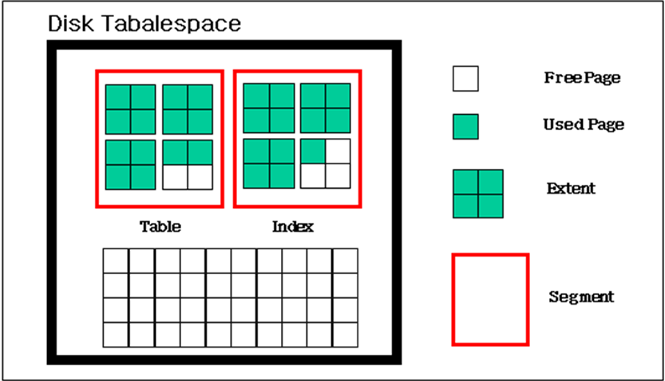

# 6.테이블스페이스

이 장에서는 관리자가 알아야할 테이블스페이스의 개념, 테이블스페이스 구조와 그 사용을 위해서 지원되는 기능에 대해서 설명하고, 효율적인 테이블스페이스 관리를 위해서 관리자들이 알아야 할 정보를 전달한다.

## 테이블스페이스 정의 및 구조

본 절에서는 테이블스페이스가 무엇인지 살펴본다. 또한, 테이블스페이스와 데이터베이스의 관계를 알아보고, 디스크 테이블스페이스, 메모리 테이블스페이스, 휘발성 테이블스페이스들이 각각 어떤 구조를 갖고 있는지 설명한다.

### 테이블스페이스의 정의

테이블스페이스는 테이블, 인덱스 등의 데이터베이스 객체들이 저장되는 논리적인 저장소 (Storage)이다. 데이터베이스는 올바른 운영을 위해 기본적으로 하나 이상의 테이블스페이스를 필요로 한다. 시스템 테이블스페이스는 데이터베이스 생성시 자동으로 생성된다. 그리고 사용자가 임의로 사용자 정의 테이블스페이스를 생성할 수 있다.

Altibase는 사용자 정의 테이블스페이스를 데이터베이스 객체가 디스크에 상주하는 디스크 테이블스페이스와 메모리에 상주하는 메모리 테이블스페이스, 메모리에 상주하면서 로깅을 하지 않는 휘발성 테이블스페이스로 구분해 지원한다. 따라서 사용자는 테이블스페이스에 저장되는 데이터의 특성에 따라 디스크, 메모리, 또는 휘발성 테이블스페이스 중에서 어떤 것을 사용할 것인지 결정할 수 있다.

예를 들어 이력 데이터와 같은 대용량 데이터를 위해서는 디스크 테이블스페이스가 적합하다. 또한 접근 빈도가 높은 소용량 데이터는 메모리 테이블스페이스를, 빠른 처리를 위한 임시 데이터 처리는 휘발성 테이블스페이스를 사용하는 것이 적합하다.

### 데이터베이스와 테이블스페이스의 관계

Altibase 데이터베이스 생성시 4종류의 시스템 테이블스페이스 (시스템 딕셔너리 테이블스페이스, 시스템 데이터 테이블스페이스, 시스템 언두 테이블스페이스, 시스템 임시 테이블스페이스) 들이 자동으로 생성된다.

또한 사용자가 테이블스페이스가 필요할 경우 사용자 정의 테이블스페이스 (디스크, 메모리, 또는 휘발성 테이블스페이스)를 생성할 수 있다. 사용자 정의 테이블스페이스는 데이터 특성에 따라 디스크 또는 메모리에 선택적으로 생성할 수 있다.

[그림 6-1]은 데이터베이스와 테이블스페이스의 관계를 보여준다.


[그림 6‑1] 테이블스페이스와 데이터베이스의 관계

### 디스크 테이블스페이스 구조 

디스크 테이블스페이스는 모든 데이터가 디스크 공간에 저장되는 테이블스페이스이다.
물리적으로는 데이터 파일로 구성되며, 논리적으로 세그먼트, 익스텐트 및 페이지로 구성된다.

#### 물리적 구조

디스크 테이블스페이스는 데이터 파일, 세그먼트와 밀접한 관계를 갖는다. [그림 6-2]는 디스크 테이블스페이스와 데이터 파일 및 세그먼트의 연관 관계를 설명한다.

디스크 테이블스페이스, 데이터 파일 및 세그먼트는 다음과 같은 특징을 갖는다. 디스크 테이블스페이스는 하나 이상의 데이터 파일로 구성되며, 데이터 파일은 운영체제에서 제공되는 파일 형태로 존재한다. 세그먼트는 논리적으로 테이블스페이스에 저장되며, 물리적으로 데이터 파일에 저장된다. 세그먼트는 특정 디스크 테이블스페이스에 종속적이며, 세그먼트가 참조하는 세그먼트는 다른 디스크 테이블스페이스에 저장될 수 있다.


[그림 6‑2] 디스크 테이블스페이스, 데이터 파일, 세그먼트의 연관 관계

#### 논리적 구조

디스크 테이블스페이스는 논리적으로 세그먼트, 익스텐트 및 페이지로 구성된다. 이들의 관계를 살펴보면 아래 그림과 같다.



[그림 6‑3] 디스크 테이블스페이스의 논리적 구조

##### 세그먼트(Segment) 

세그먼트는 익스텐트의 집합으로 테이블스페이스 내의 모든 객체가 여기에 저장된다. 세그먼트는 테이블스페이스 내에서 테이블 또는 인덱스를 할당하는 단위이다. 하나의 테이블 또는 인덱스는 논리적으로 하나의 세그먼트로 볼 수 있다. Altibase에서 사용하는 세그먼트의 종류는 다음과 같다.

| 종 류          | 설 명                                                                                                                                                                                                                                                                |
|----------------|----------------------------------------------------------------------------------------------------------------------------------------------------------------------------------------------------------------------------------------------------------------------|
| Table 세그먼트 | 데이터베이스 안에 데이터를 저장하는 가장 기본적인 수단이다. 한 개의 테이블 세그먼트에는 파티션 되지 않은 테이블의 전체 데이터 또는 파티션드 테이블의 한 파티션의 전체 데이터가 저장될 수 있다. 테이블 생성시 Altibase는 테이블스페이스에 테이블 세그먼트를 할당한다. |
| Index 세그먼트 | 한 개의 인덱스 세그먼트에는 한 인덱스의 모든 데이터 또는 파티션드 인덱스의 한 파티션의 데이터가 저장될 수 있다. 인덱스 생성시 Altibase는 테이블스페이스에 인덱스 세그먼트를 할당한다.                                                                                |
| Undo 세그먼트  | 데이터베이스의 변경을 발생시키는 트랜잭션에 의해 사용된다. Altibase는 테이블 또는 인덱스를 변경하기 전에 변경 전 값 (즉, before-image)을 언두 세그먼트에 저장해 두어, 트랜잭션 롤백시에 변경을 언두할 수 있다.                                                       |
| TSS 세그먼트   | Altibase 내부적으로 관리되는 TSS (Transaction Status Slot)를 관리하기 위한 세그먼트이며, 시스템 언두 테이블스페이스 내에 할당된다.                                                                                                                                   |

[표 6‑1] 세그먼트 종류

각 세그먼트는 내부적으로 프리 (Free) 익스텐트 리스트와 풀 (Full) 익스텐트 리스트를 관리한다. 프리 익스텐트가 부족하면 테이블스페이스에 익스텐트 추가를 요청한다.

##### 익스텐트(Extent) 

디스크 테이블스페이스에서 데이터 오브젝트를 저장하기 위해서 필요한 자원으로 연속된 여러 페이지를 할당하는 단위이다. 데이터를 저장할 때 저장 가능한 프리 페이지 (Free Page)가 부족하면, 테이블스페이스에서 익스텐트 단위로 페이지를 할당받는다.

한 개의 익스텐트는 기본 64개의 페이지 (512KB)로 구성된다. Altibase는 테이블스페이스마다 익스텐트 크기를 다르게 정할 수 있도록 지원한다.

##### 페이지(page) 

테이블과 인덱스의 레코드가 저장되는 최소 단위를 페이지라고 한다. 또한 I/O의 최소 단위이다. Altibase의 페이지 크기는 8KB이다. (Altibase는 다양한 페이지 크기 (multiple page size)의 사용을 지원하지 않는다.)

페이지에 어떤 정보를 저장하느냐 따라 데이터 페이지, 인덱스 페이지, 언두 페이지 등 여러 종류의 페이지가 있다.

페이지의 일반적인 구조와 데이터 저장 방식을 살펴보면 다음과 같다.

*페이지 구조*

페이지는 페이지의 기본 정보와 free slot 등을 관리하기 위한 헤더를 가진다. 레코드는 헤더를 제외한 영역에 저장된다. 페이지는 내부적으로 다음 그림과 같이 5개 영역으로 나누어진다.


[그림 6‑4] 디스크 테이블스페이스의 페이지 구조

-   물리적 헤더 (Physical Header)  
    모든 데이터 페이지에 공통되는 정보를 가지고 있다.

-   논리적 헤더 (Logical Header)  
    페이지의 종류에 따라 필요한 정보를 가지고 있다.

-   빈 공간 (Free Space)  
    새로운 데이터를 저장된다.

-   저장 데이터 (Stored Procedure)  
    페이지 종류에 따라 로우, 인덱스, 언두 레코드 등이 저장된다.

-   페이지 푸터 (Page Footer)  
    페이지의 가장 아래쪽에 위치하며, 페이지의 무결성을 검사하기 위한 정보를 가지고 있다.

*페이지 레코드 저장 방식*

레코드는 페이지의 아래쪽에서 위쪽 (페이지의 시작) 방향으로 채워지며 빈 공간 영역에 저장된다.

페이지의 논리적 헤더는 페이지 아래 방향으로 확장되어 저장된다. 그 크기는 가변적이다.


[그림 6‑5] 페이지 레코드 저장 방식

### 메모리 테이블스페이스 구조

메모리 테이블스페이스는 모든 데이터가 메모리 공간에 저장되는 테이블스페이스이다. 물리적 구조는 체크포인트 이미지 파일로 구성되며, 논리적으로는 페이지와 페이지 리스트들로 구성된다.

#### 물리적 구조

메모리 테이블스페이스는 체크포인트 이미지 파일과 밀접한 관계를 갖는다. 다음 그림에서는 메모리 테이블스페이스, 테이블 및 체크포인트 이미지 파일의 연관 관계를 설명한다.


[그림 6‑6] 메모리 테이블스페이스, 테이블 및 체크포인트 이미지 파일의 연관 관계

메모리 테이블스페이스, 테이블 및 체크포인트는 다음의 특징을 갖는다.

메모리 테이블스페이스는 디스크 테이블스페이스와 달리 데이터를 데이터 파일에 저장하지 않고, 선형적인 메모리 공간에 저장한다. 선형적인 메모리 공간은 페이지 단위로 분할되고, 이 페이지들의 리스트가 테이블을 구성한다. 디스크 테이블스페이스는 디스크 입출력 비용 및 대용량 테이블 관리를 위하여 페이지 단위가 아닌 익스텐트 단위로 관리한다. 세그먼트는 개념적으로 익스텐트의 리스트를 관리하기 위한 논리적인 단위이다.

그러나 메모리 테이블스페이스의 목적은 대용량 데이터의 관리보다 빠른 접근을 지원하는 것이기 때문에, 세그먼트나 익스텐트의 개념이 필요하지 않다. 따라서 메모리 테이블스페이스의 테이블들은 페이지 리스트를 이용하여 관리된다.

메모리 테이블들은 체크포인트시에 물리적으로 체크포인트 이미지 파일에 저장된다. 체크포인트 이미지 파일의 용도는 디스크 테이블스페이스의 데이터 파일의 그것과는 다르다. 디스크 테이블스페이스의 데이터 파일은 객체들을 저장하기 위한 것인 반면, 메모리 테이블스페이스의 체크포인트 이미지 파일은 객체들을 백업하기 위한 것이다. 체크포인트 이미지 파일은 데이터베이스 운영에 직접적으로 필요하지 않다. 하지만 백업 및 복구 시간을 단축하기 위해서는 반드시 필요하다.

체크포인트 시 메모리 공간의 페이지들은 운영 체제에 의해 지원되는 파일에 저장된다. Altibase의 체크포인트 방식은 일명 “핑퐁 (ping-pong) 체크포인팅”으로, 이는 두 벌의 체크포인트 이미지 파일 (0번, 1번)을 유지하며, 체크포인트 발생시마다 0번과 1번 파일을 번갈아가며 사용한다. 또한 각 체크포인트 이미지 파일은 디스크 입출력 비용의 분산을 목적으로 다수의 작은 파일로 분리될 수 있다.

#### 논리적 구조

메모리 테이블스페이스의 논리적 구성 요소에는 페이지 리스트와 페이지가 있다. 이들의 관계를 살펴보면 다음 그림과 같다.


[그림 6‑7] 메모리 테이블스페이스의 논리적 구조

##### 페이지 리스트 (Page List)

페이지 리스트는 메모리 테이블스페이스 내에서 테이블을 구성하는 논리적인 개념이다. 페이지 리스트는 메모리 테이블스페이스의 메모리 공간을 분할한 단위인 페이지의 리스트이다.

메모리 테이블스페이스 객체 중에서 테이블은 페이지 리스트로 유지된다. 인덱스는 데이터베이스의 일관성을 유지하는 대상에 포함되지 않기 때문에 페이지 리스트를 사용하지 않는다. 시스템을 다시 시작할 때 메모리 테이블의 인덱스는 재구축 되는데, 이는 운영중에 인덱스 로깅을 함으로써 발생할 수 있는 부하를 제거한다.

##### 페이지 (Page)

메모리 테이블스페이스의 페이지 구조 및 데이터 저장 방식은 디스크 테이블스페이스의 페이지와 다른 특징을 갖는다.

메모리 테이블스페이스는 디스크 테이블스페이스와 달리 디스크 입출력 비용을 고려할 필요가 없기 때문에 레코드 수정 방식으로 아웃 플레이스 갱신 (out-place update)을 사용한다.

아웃 플레이스 갱신이란 기존 레코드의 이미지를 직접적으로 변경하지 않고, 레코드의 새로운 버전을 위한 공간을 할당받아 처리하는 방식이다. 이러한 갱신 방식은 기존 레코드의 삭제와 새로운 레코드의 삽입 과정으로 이루어지기 때문에 기존 레코드를 재구성하는 비용이 들지 않는다. 또한 기존 레코드의 접근을 직접 할 수 있어 동시성 레벨이 높은 응용 분야에서 빠른 성능을 보장한다.

### 휘발성 테이블스페이스 구조

휘발성 테이블스페이스의 구조는 모든 데이터가 메모리 공간에 저장되는 메모리 테이블스페이스와 동일하다. 그러나 디스크상의 체크포인트 이미지 파일을 가지지 않는다는 점에서 메모리 테이블스페이스와 차이가 있다. 휘발성 테이블스페이스의 데이터는 메모리에만 상주한다.

휘발성 테이블스페이스에서 일어나는 작업들은 디스크 로깅 작업을 수반하지 않고 체크포인트 대상에서도 제외되기 때문에 디스크 입출력이 전혀 없다. 따라서 빠른 성능을 필요로 하는 경우에 휘발성 테이블스페이스가 유용하다. 논리적으로 페이지 리스트와 페이지로 구성된다.

#### 물리적 구조

휘발성 테이블스페이스는 메모리에 데이터베이스 객체를 상주시킨다는 점에서 메모리 테이블스페이스와 동일하다. 그러나 휘발성 테이블스페이스는 체크포인트 이미지 파일을 갖지 않는다.

#### 논리적 구조

메모리 테이블스페이스와 동일하게 페이지 리스트와 페이지로 구성된다.

## 테이블스페이스 분류

Altibase가 제공하는 테이블스페이스는 아래 3가지 기준에 의해서 분류된다. 하나의 테이블스페이스는 아래에 분류된 다수의 속성들을 동시에 가질 수 있다.

-   저장 공간에 따른 분류

-   저장 내용에 따른 분류

-   생성 주체에 따른 분류

### 저장 공간에 따른 분류

Altibase 테이블스페이스는 저장 공간에 따라 다음과 같이 분류된다.

-   메모리 상주 테이블스페이스

-   디스크 테이블스페이스

#### 메모리 상주 테이블스페이스

메모리 상주 테이블스페이스는 로깅 수행 여부 및 디스크 이미지 파일의 존재 여부에 따라 메모리 테이블스페이스와 휘발성 테이블스페이스로 구분된다.

메모리 테이블스페이스는 메모리 기반 객체를 저장하기 위한 테이블스페이스이다. 해당 테이블스페이스 내에 저장되는 모든 객체에 메모리 기반 데이터베이스 기술이 적용됨으로써, 사용자가 실시간으로 데이터에 접근할 수 있다. 그러나 메모리 테이블스페이스의 크기는 시스템의 사용 가능한 물리적 메모리 공간을 초과할 수 없다.

휘발성 테이블스페이스는 디스크 I/O 작업 없이 메모리 기반 객체를 저장하는 테이블스페이스이다. 해당 테이블스페이스 내에 저장되는 모든 객체에 메모리 기반 데이터베이스 기술과 부가적 기술이 적용됨으로써, 사용자가 디스크 I/O 작업 없이 실시간으로 데이터에 접근할 수 있다. 그러나 휘발성 테이블스페이스의 크기는 시스템의 사용 가능한 물리적 메모리 공간을 초과할 수 없고, 데이터베이스 서버 종료시 모든 휘발성 데이터 객체들은 사라진다.

#### 디스크 테이블스페이스

디스크 테이블스페이스는 디스크 기반 객체를 저장하기 위한 테이블스페이스이다. 데이터의 실시간 접근보다는 대용량 데이터를 관리하고 싶은 경우에 사용할 수 있는 테이블스페이스이다. 해당 테이블스페이스에 저장되는 객체들에 대한 접근은 디스크 입출력을 수반한다. 이러한 디스크 입출력 비용이 데이터 접근 시간의 대부분을 차지하기 때문에, 디스크 테이블스페이스는 디스크 입출력 비용을 줄이기 위해서 메모리 버퍼 공간을 사용한다.

### 저장 내용에 따른 분류

테이블스페이스에 저장되는 내용에 따라 다음과 같이 분류된다.

-   딕셔너리 테이블스페이스 (Dictionary Tablespace)

-   언두 테이블스페이스 (Undo Tablespace)

-   임시 테이블스페이스 (Temporary Tablespace)

-   데이터 테이블스페이스 (Data Tablespace)

#### 딕셔너리 테이블스페이스

딕셔너리 테이블스페이스는 데이터베이스 시스템의 운영상 필요한 메타 데이터를 저장하기 위한 테이블스페이스다. 데이터베이스 생성시 시스템에 의해서 생성되는 테이블스페이스이며, 데이터베이스 내에 하나만 존재한다. 사용자는 딕셔너리 테이블스페이스 내에 객체를 생성할 수 없으며, 시스템만이 메타 데이터 유지 관리를 위한 시스템 객체를 생성할 수 있다. 메타 데이터에 대한 빠른 접근을 위하여 딕셔너리 테이블스페이스는 메모리에 존재한다. 딕셔너리 테이블스페이스가 붕괴(crash)된 경우에는 전체 데이터베이스를 운영할 수 없다(백업 및 매체 복구를 이용하여 데이터베이스를 복구시켜야 한다).

#### 언두 테이블스페이스

언두 테이블스페이스는 디스크 객체에 대한 연산이 남긴 언두 이미지(undo image)를 저장하기 위한 테이블스페이스이다. Altibase의 동시성 제어는 MVCC(Multi-Version Concurency Control) 기법이기 때문에 변경 이전의 이미지를 저장할 공간이 필요하다. 이러한 이전 이미지가 언두 테이블스페이스에 저장된다.

언두 테이블스페이스는 시스템에 하나만 존재하며, 데이터베이스 내의 모든 디스크 테이블스페이스에 의해 공유된다. 따라서, 언두 테이블스페이스도 딕셔너리 테이블스페이스와 마찬가지로 시스템 운영상 필수적인 시스템 테이블스페이스이다. 테이블스페이스 단위의 백업이 가능하다.

TRANSACTION_SEGMENT_COUNT 프로퍼티의 설정값이 900을 초과할 경우 언두 테이블스페이스 데이터 파일과 동일한 위치에 txSegEntry.hdr 이라는 파일을 만들어 언두 테이블스페이스의 세그먼트 헤더 정보를 저장한다. Altibase 분산 데이터베이스 시스템에서 분산 트랜잭션 복구 시, 장애 발생 전 언두 테이블스페이스에 접근하려면 이 파일이 필요하므로 언두 테이블스페이스를 백업할 경우 세그먼트 헤더 정보 파일(txSegEntry.hdr)도 함께 백업해야 한다.

#### 임시 테이블스페이스

임시 테이블스페이스는 질의 수행중 생성되는 임시 결과를 저장하기 위한 테이블스페이스이다. 따라서, 트랜잭션이 종료하는 시점에 해당 질의가 남긴 임시 테이블스페이스 내의 모든 데이터들은 사라지게 된다.

이러한 종류의 테이블스페이스는 동시성 제어 및 회복을 위한 로깅 등을 하지 않아 빠른 저장 및 검색이 가능하다. 사용자가 임의로 임시 테이블스페이스를 생성할 수 있으며, 다수의 임시 테이블스페이스가 시스템 내에 존재할 수 있다. 임시 테이블스페이스의 백업은 지원되지 않는다.

#### 데이터 테이블스페이스

데이터 테이블스페이스는 사용자 정의 객체를 저장하기 위한 테이블스페이스이다. 다수의 데이터 테이블스페이스가 시스템 내에 존재할 수 있으며, 사용자는 테이블스페이스에 저장되는 데이터의 특성에 따라 메모리, 휘발성 또는 디스크 테이블스페이스로 생성할 수 있다.

### 생성 주체에 따른 분류

Altibase의 테이블스페이스는 생성 주체에 따라 다음과 같이 분류된다.

-   시스템 테이블스페이스 (System Tablespace)

-   사용자 정의 테이블스페이스( User-defined Tablespace)

#### 시스템 테이블스페이스

시스템 테이블스페이스는 시스템 운영상 필요한 데이터들을 저장하기 위한 테이블스페이스이다. 시스템 딕셔너리 테이블스페이스, 시스템 언두 테이블스페이스, 시스템 데이터 테이블스페이스 및 시스템 임시 테이블스페이스가 이에 해당한다. 시스템 테이블스페이스는 데이터베이스 생성시 만들어지며, 사용자가 명시적으로 테이블스페이스 삭제하거나 이름을 변경할 수 없다. 또한 테이블스페이스 단위의 백업과 매체 복구 수행이 가능하다.

##### 사용자 정의 테이블스페이스

사용자 정의 테이블스페이스는 사용자 정의 객체들의 내용을 저장하기 위한 테이블스페이스이다. 사용자 정의 테이블스페이스 내에 정의된 객체들의 메타 데이터는 딕셔너리 테이블스페이스에 저장된다. 사용자는 명시적으로 사용자 정의 테이블스페이스를 삭제하거나 이름을 변경할 수 있다. 또한 테이블스페이스 단위의 백업 및 복구 수행이 가능하다.

#### 테이블스페이스 목록

데이터베이스가 생성시 다수의 테이블스페이스가 만들어진다. [표 5-2]와 같이 시스템 테이블스페이스, 언두 테이블스페이스, 임시 테이블스페이스, 그리고 사용자가 이용할 수 있는 기본적인 메모리 테이블스페이스와 디스크 테이블스페이스가 생성된다. 추가로 사용자가 ‘CREATE TABLESPACE’문으로 테이블스페이스들을 추가할 수 있다.

| **ID** | **테이블스페이스 종류**          | **저장 공간** | **테이블스페이스 이름** | **생성 시점**                    |
|--------|----------------------------------|---------------|-------------------------|----------------------------------|
| 0      | SYSTEM DICTIONARY TABLESPACE     | 메모리        | SYS_TBS_MEM_DIC         | CREATE DATABASE                  |
| 1      | SYSTEM MEMORY DEFAULT TABLESPACE | 메모리        | SYS_TBS_MEM_DATA        | CREATE DATABASE                  |
| 2      | SYSTEM DISK DEFAULT TABLESPACE   | 디스크        | SYS_TBS_DISK_DATA       | CREATE DATABASE                  |
| 3      | SYSTEM UNDO TABLESPACE           | 디스크        | SYS_TBS_DISK_UNDO       | CREATE DATABASE                  |
| 4      | SYSTEM DISK TEMPORARY TABLESPACE | 디스크        | SYS_TBS_DISK_TEMP       | CREATE DATABASE                  |
| 5이상  | USER MEMORY DATA TABLESPACE      | 메모리        | 사용자 지정             | CREATE MEMORY DATA TABLESPACE    |
| 5이상  | USER DISK DATA TABLESPACE        | 디스크        | 사용자 지정             | CREATE DISK DATA TABLESPACE      |
| 5이상  | USER DISK TEMPORARY TABLESPACE   | 디스크        | 사용자 지정             | CREATE DISK TEMPORARY TABLESPACE |
| 5이상  | USER VOLATILE DATA TABLESPACE    | 메모리        | 사용자 지정             | CREATE VOLATILE DATA TABLESPACE  |

[표 6‑2] 테이블스페이스 목록

### 디스크 테이블스페이스

디스크 테이블스페이스는 모든 데이터가 디스크 공간에 저장되는 테이블스페이스이다. 이 절에서는 디스크의 데이터 페이지를 중심으로 구조 및 로우 데이터의 입력 방식에 대해 살펴본다.

#### 데이터 페이지 구조

Altibase가 데이터베이스의 저장 공간을 관리할 때 사용하는 데이터의 최소 단위를 페이지 (page)라고 한다. 페이지 크기는 8KB이고, 다양한 크기의 페이지 (multiple page size)는 지원되지 않는다.

데이터 페이지 (data page)는 여러 페이지 종류들 중의 한가지로, 로우 데이터 (row data)를 저장한다. 로우 데이터는 페이지 아래부터 채워가며 저장되며, 이 때 빈 공간 영역을 사용한다. 만약 빈 공간의 영역이 충분하지 않다면, 페이지 콤팩트 (page compact) 연산을 수행하여 단편화된 공간을 제거하고 연속된 빈 공간을 확보하도록 한다.


[그림 6‑8] 데이터 페이지의 구조

데이터 페이지의 영역은 위의 그림과 같이 6개의 영역으로 구성된다.

-   물리적 헤더 (Physical Header)  
    이 영역은 페이지 종류에 상관없이 모든 데이터 페이지들에 공통되는 정보를 가지고 있다.

-   TTL (Touched Transaction Layer)  
    이 영역은 MVCC (Multi-Version Concurrency Control) 관련 정보를 가지고 있다.

-   슬롯 디렉터리 (Slot Directory)  
    이 영역은 로우가 저장된 페이지 내에서의 위치 (offset)에 대한 정보를 가지고 있다.

-   빈 공간 (Free Space)  
    이 영역은 입력이나 갱신 등의 연산을 할 때 사용할 수 있는 여유 공간이다.

-   로우 데이터 (Row Data)

-   페이지 푸터 (Page Footer)  
    이 영역은 페이지 구조의 가장 아래쪽에 위치하며, 페이지의 무결성을 확인하기 위한 정보를 가지고 있다.

#### 디스크 테이블스페이스의 공간 관리

디스크 테이블스페이스는 PCTFREE와 PCTUSED 파라미터를 이용하여 수동적으로 관리될 수 있다.

PCTFREE와 PCTUSED 파라미터를 사용해서 로우 데이터에 대한 입력이나 갱신 연산을 할 때 빈 공간의 사용을 제어할 수 있다. 이들 파라미터의 값은 altibase.properties 파일의 PCTFREE와 PCTUSED 프로퍼티의 값으로 지정된다. 또한 테이블 생성(CREATE TABLE…) 또는 변경(ALTER TABLE…) 구문에서 테이블 별로 파라미터 값을 명시할 수도 있다.

##### PCTFREE

PCTFREE는 페이지에 저장되어 있는 로우들이 갱신될 경우에 대비하여 미리 확보해두는 빈 공간의 최소 비율이다.

예를 들어 PCTFREE 값을 20으로 설정하면, 페이지의 80% 공간까지만 입력 (insert)할 수 있고, 나머지 20%의 공간은 기존의 로우들이 갱신될 때 사용을 위해서 남겨둔다.


[그림 6‑9] PCTFREE 와 페이지 구조

##### PCTUSED

PCTUSED는 페이지가 갱신만 가능한 상태에서 다시 삽입이 가능 상태로 가기 위해서 감소해야 할 페이지 내 사용 공간의 최소 비율이다.

PCTFREE 제한에 걸리게 되면, 해당 페이지에는 사용 공간의 비율이 PCTUSED 보다 낮아지기 전까지 새로운 로우를 입력할 수 없고, 이 페이지 내의 빈 공간은 오직 갱신 연산을 위해서만 사용된다. 이 상태는 사용 공간의 비율이 PCTUSED값 아래로 떨어질 때까지 지속된다.


[그림 6‑10] PCTUSED 와 페이지 구조

#### 로우의 구조

로우는 하나 이상의 로우 조각 (row piece)들로 구성된다. 만약 로우 전체가 한 개의 페이지에 저장될 수 있다면, 로우는 하나의 로우 조각으로 저장된다. 그러나 로우 전체를 한 개의 페이지에 저장할 수 없다면, 로우는 여러 개의 로우 조각에 나뉘어서 저장된다. 이들 로우 조각들은 ROWID값에 의해 서로 연결된다 (chained).


[그림 6‑11] 로우 조각의 구조

로우 조각은 로우 헤더 (row header)와 로우 바디(row body)로 구성된다.

로우 헤더에는 18 byte 크기의 헤더 정보가 저장된다. 연결된 로우 조각 (chained row piece)일 경우에는 6 byte의 ROWID 정보가 추가적으로 저장된다.

로우 바디에는 칼럼의 길이 (column length), 칼럼 값 (column value)이 쌍을 이뤄서 연속으로 저장된다. 칼럼 값의 길이가 250 byte 이하이면 칼럼 길이의 저장을 위해서 1byte만 필요하고, 칼럼 값의 길이가 250 byte를 초과하면 칼럼 길이의 저장을 위해서 3byte가 필요하다.

공간을 절약하기 위해서 칼럼 값이 널 (NULL)인 경우 칼럼의 길이 (0)만 저장하고 칼럼 값은 저장하지 않는다. 또한 칼럼 값이 널인 칼럼들이 마지막에 연속으로 올 경우에는 칼럼 값뿐 아니라 칼럼 길이도 저장하지 않는다.

칼럼은 테이블 생성 (CREATE TABLE…) 구문에서 나열한 순서대로 저장된다. 이 때 널을 많이 포함하는 칼럼을 마지막에 배치하면 로우를 저장하는데 필요한 공간을 절약할 수 있다.

#### 로우 체이닝 및 마이그레이션

로우의 데이터가 너무 커서 한 개의 페이지에 저장할 수 없을 때 로우 체이닝 (row chaining)과 로우 마이그레이션 (row migration)이 발생한다.

로우 체이닝은 데이터를 입력할 때 데이터의 크기가 너무 커서 로우가 한 페이지에 저장될 수 없을 때 발생한다. 이 경우에는 로우의 데이터가 여러 개의 페이지에 나누어 저장되고, 이들은 서로 ROWID에 의해 연결된다.

로우 마이그레이션은 한 페이지 내에 저장되었던 로우가 갱신 과정에서 로우의 크기가 페이지의 크기를 넘어가는 경우 발생한다. 이 경우 전체 로우는 새로운 페이지로 마이그레이션 되고, 원래 로우는 옮겨진 로우가 저장된 새로운 위치를 가리키게 된다. 그러나 로우 마이그레이션이 발생하더라도 ROWID는 변경되지 않는다.

로우 체이닝 또는 로우 마이그레이션이 발생하면, DML 처리시에 한 페이지를 더 읽어야 하므로 디스크 I/O로 인한 성능저하가 발생한다.

### 언두 테이블스페이스

언두 테이블스페이스는 데이터베이스에 대한 변경 연산을 철회 (rollback)하는데 필요한 정보를 저장하는 테이블스페이스이다. Altibase는 다중 버전의 동시성 제어 기법 (MVCC)을 사용하기 때문에 변경 이전의 이미지를 저장할 공간이 필요하다.

언두 테이블스페이스는 데이터베이스에 하나만 존재하며, 데이터베이스 내의 모든 디스크 테이블스페이스에 의해 공유된다.

이 절에서는 언두 테이블스페이스의 특징 및 크기 계산 등 언두 테이블스페이스를 어떻게 관리하는지 설명한다.

-   언두 레코드 (Undo Record)

-   언두 테이블스페이스의 특징

-   트랜잭션 세그먼트의 관리

-   세그먼트 공간 재사용

-   언두 테이블스페이스 변경

#### 언두 레코드

데이터베이스는 변경된 트랜잭션을 취소(롤백 또는 언두)하기 위하여 관련 정보들을 유지해야 한다. 이러한 정보들은 주로 트랜잭션이 커밋되기 전에 언두 레코드들로 저장된다.

언두 레코드는 다음과 같은 목적으로 사용된다.

-   트랜잭션 철회 (rollback)

-   데이터베이스 복구

-   읽기 일관성 (Read Consistency) 보장

롤백 구문이 수행되면, 언두 레코드는 커밋되지 않은 트랜잭션에 의한 데이터베이스 변경을 취소하기 위해 사용된다.

또한 언두 레코드는 데이터베이스를 복구하는 동안에도 사용된다. 로그 파일에 기반한 트랜잭션 리두 (redo)에 의해 데이터베이스를 복원한 후, 언두 레코드는 커밋되지 않은 변경에 대해서 취소하기 위해서 사용된다.

그리고 다른 트랜잭션에 의해 변경중인 레코드를 어떤 트랜잭션이 읽을 때, 두 트랜잭션이 동시에 레코드에 접근하여도 레코드가 변경되기 전의 이미지는 언두 레코드에 저장되어 있기 때문에 읽기 일관성을 보장할 수 있다.

#### 언두 테이블스페이스의 특징

언두 테이블스페이스의 특징을 살펴보면 다음과 같다.

-   시스템에 의해 자동으로 관리된다.

-   기본 언두 테이블스페이스 파일은 자동 확장 모드의 undo001.dbf 이다. 데이터 파일의 추가 및 크기 변경이 가능하다.
    
-   온라인 백업 (Online Backup)의 대상이다.

-   TSS 세그먼트와 언두 세그먼트 이외의 데이터베이스 객체는 언두 테이블스페이스에 생성이 불가능하다.
    
-   언두 테이블스페이스는 시스템 테이블스페이스이므로, 테이블스페이스 오프라인 및 제거가 불가능하다.
    
-   서버가 재구동될 때마다 언두 테이블스페이스는 재구성 (Reset)된다.

Altibase는 언두 테이블스페이스의 정보 및 공간을 관리할 때 시스템에 의한 관리 방식을 사용한다. 시스템에 의한 관리 방식이란 기본적으로 언두 테이블스페이스의 세그먼트들과 공간들을 서버가 자동으로 관리하는 것을 의미한다.

언두 테이블스페이스는 데이터베이스 생성 과정에서 생성된다. 언두 테이블스페이스는 시스템 테이블스페이스로써, 데이터베이스내에 하나만 존재할 수 있다. 만약 언두 테이블스페이스가 존재하지 않는다면 부트 로그에 에러 메시지가 출력되고 서버 구동이 실패한다.

언두 테이블스페이스내에서는 트랜잭션 세그먼트 (TSS 세그먼트와 언두 세그먼트)가 관리된다. 사용자는 프로퍼티 TRANSACTION_SEGMENT_COUNT를 사용해서 트랜잭션 세그먼트의 개수를 변경할 수 있다. 사용자가 프로퍼티에서 지정한 개수만큼 TSS 세그먼트와 언두 세그먼트가 각각 생성된다. TRANSACTION_SEGMENT_COUNT 프로퍼티를 255로 설정하였다면, 서버 구동시마다 TSS 세그먼트 255개와 언두 세그먼트 255개가 생성된다.

프로퍼티 파일내에서 트랜잭션 세그먼트를 다른 개수로 변경하였다면, 다음 서버 구동시에 명시된 개수만큼 세그먼트들이 생성될 것이다.

#### 트랜잭션 세그먼트의 관리

트랜잭션 세그먼트란 디스크 변경 트랜잭션에 반드시 필요한 한 개의 TSS 세그먼트와 한 개의 언두 세그먼트로 구성된다.

한 트랜잭션 세그먼트는 한 디스크 변경 트랜잭션에 바인딩 (Binding) 되고, 그 트랜잭션이 완료될 때 언바인딩 (Unbinding) 되기 때문에 다른 트랜잭션에 의해 동시에 공유될 수 없다.

V\$TXSEGS를 조회하면, 트랜잭션 세그먼트의 바인딩 여부를 확인할 수 있다. 디스크 변경 트랜잭션에 해당 트랜잭션 세그먼트가 바인딩되면 V\$TXSEGS에 트랜잭션 세그먼트 ID, 트랜잭션 ID에 해당하는 레코드가 생성되고 바인딩이 해제되면 레코드는 삭제된다.

또한 TSS 세그먼트와 언두 세그먼트의 공간은 트랜잭션이 한 번 사용한 공간에 대해서는 어느 정도 시간이 지나면 재사용할 수 있는 구조로 설계되었다. 따라서 언두 트랜잭션의 공간이 필요한 경우에는 무조건 세그먼트를 생성하여 공간을 확장하는 것이 아니라 기간이 만료된 세그먼트가 다시 사용된다.

TSS 세그먼트의 재사용 단위는 1M이며, 언두 세그먼트는 2M이다.

다음은 언두 테이블스페이스와 관련된 사용자 프로퍼티를 나타낸다.

-   SYS_UNDO_FILE_INIT_SIZE  
    언두 테이블스페이스의 데이터 파일 생성시 초기 크기

-   SYS_UNDO_FILE_MAX_SIZE  
    언두 테이블스페이스의 데이터 파일 최대 크기

-   SYS_UNDO_TBS_NEXT_SIZE  
    언두 테이블스페이스의 데이터 파일 자동 확장 크기

-   SYS_UNDO_TBS_EXTENT_SIZE  
    언두 테이블스페이스 한 익스텐트의 페이지 개수

-   TRANSACTION_SEGMENT_COUNT  
    트랜잭션 세그먼트의 개수

#### 세그먼트의 공간 재사용

트랜잭션 커밋 후에 언두 데이터는 트랜잭션 롤백이나 복구를 목적으로 더 이상 필요하지 않다. 하지만 트랜잭션의 커밋 주기가 긴 Long-Term 트랜잭션은 읽기 일관성을 위해서 언두 데이터에 의존하고 있는 레코드의 이전 버전이 필요하다. 그렇지만 어느 정도 시간이 지나면 읽기 일관성을 위해서도 더 이상 언두 데이터는 필요하지 않게 된다.

따라서 Altibase 데이터베이스는 커밋된 언두 데이터라고 하여도 최소한의 기간 동안만 유지하고, 그 기간이 지나면 그 언두 데이터가 차지했던 공간을 다른 트랜잭션이 재사용할 수 있도록 하고 있다.

만약 커밋된 트랜잭션을 위한 언두 데이터를 가지고 있는 공간에 접근하는 온라인 트랜잭션들이 더 이상 존재하지 않는다면, 해당 언두 공간은 기간이 만료 (Expired)되었다고 한다. 반대로 그 언두 공간에 접근이 가능한 온라인 트랜잭션이 아직 존재한다면, 해당 언두 공간은 기간이 유효 (Unexpired)하다고 한다. 기간이 만료된 언두 공간은 다른 트랜잭션에 의해서 재사용 될수 있으나, 기간이 유효한 언두 공간은 재사용될 수 없다.


[그림 6‑12] 언두 세그먼트의 재사용

위 그림은 언두 세그먼트의 순환 구조가 언두 공간의 재사용을 어떻게 허락하는지를 보여준다.

그림은 언두 공간 \#0부터 시작해서 순서대로 사용되면서 현재(Current)의 언두 공간 \#5을 사용하고 있는 것을 나타낸다. 그리고 다음 차례의 언두 공간 \#0이 만료된 것을 확인하고, 언두 공간 \#5를 모두 사용하면 언두 세그먼트를 더 이상 확장하지 않고 언두 공간 \#0을 재사용한다.


[그림 6‑13] 언두 세그먼트의 확장

그러나 언두 공간 \#0이 유효한 상태라면 위의 그림처럼 언두 세그먼트는 익스텐트를 확장하여 언두 공간 \#6을 추가하게 된다.

이와 같은 세그먼트 공간의 재사용성은 TSS 세그먼트에도 동일하게 적용된다.

#### 언두 테이블스페이스 변경

언두 테이블스페이스는 ALTER TABLESPACE 구문을 사용하여 변경될 수 있다. 그러나 언두 테이블스페이스는 대부분이 시스템에 의해서 관리되므로, 다음과 같은 연산들에 대해서만 사용자가 수행할 수 있다.

-   데이터 파일 추가 및 제거

-   데이터 파일 크기 확장 및 축소

-   데이터 파일의 온라인 백업 시작 및 완료

언두 테이블스페이스에 용량 부족 또는 용량 부족과 관련된 에러가 발생하는 것을 방지하려면, 사용자는 데이터 파일들을 추가하거나 기존 데이터 파일의 크기를 확장해야 한다.

다음은 언두 테이블스페이스에 데이터 파일을 추가하는 예제이다.

```
ALTER TABLESPACE SYS_TBS_DISK_UNDO 
ADD DATAFILE ‘undo002.dbf’ AUTOEXTEND ON NEXT 1M MAXSIZE 2G;
```

ALTER TABLESPACE … DROP DATAFILE 구문으로 데이터 파일을 제거할 수도 있으며, ALTER TABLESPACE ... ALTER DATAFILE… 구문으로 파일의 크기를 확장하거나 축소할 수 있다.

그리고 ALTER TABLESPACE … BEGIN BACKUP 구문으로 데이터 파일의 백업을 시작할 수 있으며, ALTER TABLESPACE … END BACKUP 구문을 사용해서 백업 완료를 할 수 있다.

### 테이블스페이스 상태

테이블스페이스는 서비스 상태에 따라 온라인 (online), 오프라인 (offline), 또는 폐기 (discard) 상태로 있게 된다.

테이블스페이스 중에서 사용자가 생성한 디스크 테이블스페이스와 메모리 테이블스페이스의 상태는 온라인과 오프라인으로 변경할 수 있으나, 휘발성 테이블스페이스와 임시 테이블스페이스의 상태는 변경할 수 없다. 또한 테이블스페이스 내에 이중화가 걸려있는 테이블이 존재할 경우에도 변경 불가능하다.

상태를 변경하기 위해서는 ALTER TABLESPACE … ONLINE 과 ALTER TABLESPACE … OFFLINE 구문을 사용한다. 단, 테이블스페이스의 온라인/오프라인 상태 전이는 메타 (META) 단계와 서비스 (SERVICE) 구동 단계에서만 가능하다.

#### 온라인 (Online)

테이블스페이스와 관련된 모든 자원이 할당되고 준비된 상태이며, 데이터베이스에서 테이블스페이스를 사용할 수 있게 설정된 상태이다. 테이블스페이스와 그 안에 존재하는 테이블과 인덱스에 대해 DML과 DDL을 수행할 수 있다. 만약 온라인 상태인 테이블스페이스와 테이블스페이스에 생성된 테이블 및 인덱스를 일시적으로 사용할 수 없게 하려면 ALTER TABLESPACE … OFFLINE 구문을 실행하면 된다.

#### 오프라인 (Offline)

테이블스페이스와 관련된 모든 자원이 해제된 상태이며, 데이터베이스에서 테이블스페이스를 일시적으로 사용할 수 없게 설정된 상태이다.

테이블스페이스에 존재하는 테이블과 인덱스에 대한 DML과 DDL을 수행할 수 없다. 그러나 테이블스페이스에 대한 DROP TABLESPACE와 ALTER TABLESPACE ONLINE DDL구문은 사용할 수 있다.

테이블스페이스와 그 안에 생성된 테이블과 인덱스를 다시 사용할 수 있는 온라인 상태로 전이하기 위해서는 ALTER TABLESPACE … ONLINE 구문을 사용하면 된다.

메모리 테이블스페이스가 오프라인으로 되면 메모리 테이블스페이스의 객체는 메모리에 적재되지 않기 때문에, 메모리 한계 (메모리 부족) 상황이 발생했을 때 사용자는 메모리 테이블스페이스를 오프라인으로 변경해서 그 상황을 해소할 수 있다.

#### 폐기 (Discard)

데이터의 일관성이 깨진 특정 테이블스페이스 때문에 정상적인 Altibase 구동이 불가능한 경우, 깨진 테이블스페이스를 제외한 나머지에 대해서만이라도 정상적으로 데이터베이스 운영을 할 수 있어야 한다. 이를 위해서 해당 테이블스페이스는 폐기시켜야 한다.

특정 테이블스페이스를 폐기 상태로 전이시키기 위해서는 CONTROL 구동 단계에서 ALTER TABLESPACE … DISCARD 구문을 실행해야 한다.

그러나 한 번 폐기된 테이블스페이스는 제거 (DROP TABLESPACE)만 할 수 있기 때문에 ALTER TABLESPACE … DISCARD 구문을 수행할 때에는 주의해야 한다.

### 테이블스페이스 관리

본 절에서는 Altibase에서 지원하는 테이블스페이스를 관리하는 방법에 대해 설명한다

#### 생성 (CREATE)

테이블스페이스 생성은 SYS 사용자 또는 테이블스페이스 생성 권한을 가진 사용자만 할 수 있다. 테이블스페이스를 생성하려면 CREATE TABLESPACE … SQL 구문을 사용하라. 사용자는 사용자 정의 데이터 테이블스페이스 (User-defined Data Tablespace)만 생성할 수 있다. 즉 시스템 테이블스페이스들은 사용자가 임의로 생성할 수 없다.

디스크 테이블스페이스는 디스크 데이터 테이블스페이스와 디스크 임시 테이블스페이스로 분류된다.

메모리 테이블스페이스는 메모리 데이터 테이블스페이스만 있고, 메모리 임시 테이블스페이스는 없다.

마찬가지로 휘발성 테이블스페이스는 휘발성 데이터 테이블스페이스만 있고, 휘발성 임시 테이블스페이스는 없다.

다음은 테이블스페이스를 생성하는데 사용되는 SQL 구문이다.

```
CREATE [DISK/MEMORY/VOLATILE] [DATA/TEMPORARY] TABLESPACE
```

(1) 테이블스페이스 이름

(2) 디스크 데이터 파일 속성

(3) 디스크 임시 파일 속성

(4) 메모리 테이블스페이스 속성

(5) 휘발성 테이블스페이스 속성;

테이블스페이스에 저장된 객체의 크기 및 접근 빈도수와 같은 특성을 고려해서 메모리, 디스크, 또는 휘발성 테이블스페이스의 생성 여부를 결정해야 한다.

테이블스페이스 생성시 지정할 수 있는 테이블스페이스 속성들은 디스크, 메모리, 또는 휘발성에 따라 다르다. 메모리 테이블스페이스는 여러 개의 데이터 파일로 관리되는 디스크 테이블스페이스와는 달리 객체들이 하나의 선형적인 메모리 공간에 저장된다. 따라서, 디스크 테이블스페이스 생성의 경우 각 데이터 파일에 속성이 적용되지만, 메모리 테이블스페이스의 경우 그 메모리 테이블스페이스 전체에 적용된다. 즉 메모리 테이블스페이스에 초기 크기, 확장될 크기 등이 적용되며, 디스크 테이블스페이스는 데이터 파일에 해당 속성들이 적용된다.

##### 테이블스페이스 이름

테이블스페이스 이름은 유일해야 한다. 동일한 이름의 객체가 두개 이상 생성될 수 없다. 디스크 테이블스페이스의 경우에는 데이터 파일들의 이름을 지정할 수 있지만, 메모리 테이블스페이스의 경우에는 체크포인트 이미지 파일이 저장될 경로만을 지정할 수 있다. 체크포인트 이미지 파일의 이름은 테이블스페이스의 이름을 이용하여 자동으로 만들어진다.

##### 디스크 데이터 파일 속성

데이터 파일 속성은 디스크 데이터 테이블스페이스에만 적용되며, 다음과 같은 구문을 갖는다.

```
DATAFILE [①데이터 파일절
AUTOEXTEND [②자동확장절 
MAXSIZE [③최대크기절] ] ] 
EXTENTSIZE [④익스텐트사이즈절]
```

각 데이터 파일은 다음과 같은 속성을 가질 수 있다.

###### 데이터 파일절

```
DATAFILE {데이터 파일 경로 및 이름} SIZE integer [K/M/G] [REUSE]
```

데이터 파일 경로 및 이름을 지정한다. SIZE절 이하는 생략 가능하다. SIZE절은 데이터 파일이 생성될 때의 초기 데이터 파일의 크기를 명시하는데 사용된다. 각 데이터 파일에는 파일 헤더가 저장된다. SIZE는 파일 헤더 크기 (1 page)를 제외한 나머지 페이지들의 총 크기를 의미한다. 따라서, 지정한 초기 크기와 실제 데이터 파일의 크기가 정확히 일치하지는 않는다. 만약 운영 체제에서 지원하는 최대 파일 크기가 초기 크기보다 작을 경우 에러가 반환될 것이다.

###### 자동확장절

```
AUTOEXTEND [{ON NEXT integer [K/M/G]}/{OFF}]
```

디스크 데이터 파일의 확장 여부를 지정한다. ON일 경우 시스템에 의해서 데이터 파일이 자동으로 확장된다. OFF일 경우 사용자가 명시적으로 파일을 확장해야 한다. 임시 데이터 파일의 확장 단위는 사용자가 NEXT절에 명시할 수 있다.

데이터 파일이 확장될 때 해당 데이터 파일이 속한 테이블스페이스에서 수행되는 모든 연산은 해당 데이터 파일이 확장이 끝날 때까지 대기한다.

###### 최대크기절

```
MAXSIZE {{integer [K/M/G]}/{UNLIMITED}}
```

자동확장절의 부속절로써, 데이터 파일이 확장될수 있는 최대 크기를 의미한다. 초기 크기와 마찬가지로 만약 운영 체제에서 지원하는 최대 파일 크기가 데이터 파일의 최대 크기보다 작을 경우 운영 체제의 최대 파일 크기로 설정된다. UNLIMITED로 설정된 경우에는 데이터 파일이 디스크의 가능한 공간을 모두 사용할 때까지 사이즈가 늘어난다.

###### 익스텐트 사이즈절

```
EXTENTSIZE {{integer [K/M/G]}/{UNLIMITED}}
```

테이블스페이스에 저장되는 세그먼트 (테이블 또는 인덱스)가 할당받는 단위인 익스텐트의 사이즈를 정의한다. 익스텐트 사이즈를 명시하지 않을 경우 기본값으로 512K (64 pages)를 갖는다.

##### 디스크 임시 파일 속성

임시 파일 속성은 디스크 임시 테이블스페이스에만 적용되며, 다음과 같은 구문을 갖는다.

```
TEMPFILE {①임시 파일절}
AUTOEXTEND [②자동확장절
MAXSIZE [③최대크기절] ]
EXTENTSIZE [④익스텐트사이즈절]
```

각 임시 파일은 다음과 같은 속성을 가질 수 있다.

###### 임시 파일절

```
TEMPFILE {데이터 파일 경로 및 이름} SIZE integer [K/M/G] [REUSE]
```

이 절은 임시 파일 경로 및 이름을 지정하며, SIZE절 이하는 생략 가능하다. SIZE절은 임시 파일이 생성될 때의 초기 크기를 명시하는데 사용된다. 각 임시 파일에는 파일 헤더가 저장된다. SIZE는 파일 헤더 크기 (1 page)를 제외한 나머지 페이지들의 총 크기를 의미한다. 따라서, 지정한 초기 크기와 실제 임시 파일의 크기가 정확히 일치하지는 않는다. 만약 운영 체제에서 지원하는 최대 파일 크기가 초기 크기보다 작을 경우 에러가 반환될 것이다.

###### 자동확장절

```
AUTOEXTEND [{ON NEXT integer [K/M/G]}/{OFF}]
```

디스크 임시 파일의 확장 여부를 결정한다. ON일 경우 시스템에 의해서 임시 파일이 자동으로 확장된다. OFF일 경우 사용자가 명시적으로 파일을 확장해야 한다. 임시 파일의 확장 단위는 사용자가 NEXT절에 명시할 수 있다.

###### 최대크기절

```
MAXSIZE {{integer [K/M/G]}/{UNLIMITED}}
```

자동확장절의 부속절로써, 임시 파일이 확장될수 있는 최대 크기를 의미한다. 초기 크기와 마찬가지로 만약 운영 체제에서 지원하는 최대 파일 크기가 임시 파일의 최대크기보다 작을 경우 운영 체제의 최대 파일 크기로 설정된다. UNLIMITED로 설정된 경우에는 임시 파일이 디스크의 가능한 공간을 모두 사용할 때까지 크기가 늘어난다.

###### 익스텐트 사이즈절

```
EXTENTSIZE integer [K/M/G]
```

임시 테이블스페이스에 저장되는 세그먼트 (테이블 또는 인덱스)가 할당받는 단위인 익스텐트의 사이즈를 정의한다. 익스텐트 사이즈를 명시하지 않을 경우 기본값으로 256K (32 pages)를 갖는다.

##### 메모리 테이블스페이스 속성

메모리 테이블스페이스에 적용되는 속성은 디스크 테이블스페이스의 데이터 파일 속성과 유사하지만, 추가적으로 체크포인트 이미지 경로를 포함한다. 구문은 다음과 같다.

```
SIZE {①초기 크기절} 
AUTOEXTEND [②자동확장절 
MAXSIZE [③최대크기절] ]
CHECKPOINT PATH [④체크포인트 이미지 경로절]
```

메모리 테이블스페이스는 다음과 같은 속성을 가질 수 있다.

###### 초기 크기절

```
SIZE integer [K/M/G]
```

메모리 테이블스페이스 생성시 초기에 할당되어야할 메모리 크기를 나타낸다. 이 값은 메모리 테이블스페이스의 기본 확장 단위의 배수여야 한다. (EXPAND_CHUNK_PAGE_COUNT 프로퍼티에 지정한 페이지 개수 \* 메모리 테이블스페이스의 페이지 크기(32KB)<sup>2</sup>)

[<sup>2</sup>]예를 들어 EXPAND_CHUNK_PAGE_COUNT를 128로 지정하였다면, 메모리 테이블스페이스의 기본 확장 크기는 128 \* 32K로 계산되어 4MB가 된다. 그러므로 SIZE로 지정할 수 있는 크기는 4MB의 배수이다.

이 크기는 KiloBytes (K), Megabytes (M), 또는 Gigabytes (G) 단위로 명시할 수 있다. 이 단위를 명시하지 않을 경우 기본 단위는 KiloBytes (K)이다.

###### 자동확장절

```
AUTOEXTEND [{ON NEXT integer [K/M/G]}/{OFF}]
```

메모리 테이블스페이스의 자동 확장 여부를 결정한다. ON일 경우 시스템에 의해서 테이블스페이스가 자동으로 확장되지만, OFF일 경우 사용자가 명시적으로 크기를 확장해야 한다. 확장되는 크기는 사용자가 NEXT절에 명시할 수 있다.

확장되는 크기는 초기 크기와 마찬가지로 EXPAND_CHUNK_PAGE_COUNT 프로퍼티에 설정된 페이지 크기의 배수에 해당하는 크기로 지정하여야 한다.

자동 확장 크기가 너무 작으면 자동확장이 빈번하게 발생할 수 있다. Altibase는 자동확장을 수행할 때 시스템에 존재하는 모든 메모리 테이블스페이스의 현재 크기를 합산하여 MEM_MAX_DB_SIZE 프로퍼티에 지정한 크기보다 작은지 비교한다. 이러한 연산이 빈번하게 수행되면 시스템의 성능이 저하될 수 있다.

###### 최대크기절

```
MAXSIZE {{integer [K/M/G]}/{UNLIMITED}}
```

자동확장절의 부속절로써, 메모리 테이블스페이스가 확장될수 있는 최대 크기를 의미한다. 초기 크기와 마찬가지로 운영 체제에서 제공되는 메모리 공간의 크기를 초과할 수 없다. UNLIMITED로 설정된 경우에는 시스템에 존재하는 모든 메모리 테이블스페이스의 크기를 합친 전체 크기가 MEM_MAX_DB_SIZE 프로퍼티에 지정한 크기를 벗어나지 않는 한도 내에서 테이블스페이스가 자동확장된다.

###### 체크포인트 이미지 경로절

```
CHECKPOINT PATH ‘체크포인트 이미지 경로 리스트’ 
SPLIT EACH integer [K/M/G]
```

체크포인트 이미지 경로는 메모리 테이블스페이스에만 적용된다. Altibase는 메모리 테이블스페이스의 고성능 트랜잭션 처리를 위하여 핑퐁(ping-pong) 체크포인트를 사용한다. 핑퐁 체크포인트를 위해서 두 벌의 체크포인트 이미지가 디스크에 생성된다. 각 체크포인트 이미지는 다수의 파일에 분할되어 저장될 수 있다. 체크포인트 이미지가 분할되는 크기는 SPLIT EACH절에 명시할 수 있다. 분할된 파일은 디스크 입출력 비용을 분산하기 위하여 서로 다른 경로에 저장될 수 있으며, 사용자가 임의로 분할의 크기 및 체크포인트 이미지 파일들이 저장되는 경로들을 지정할 수 있다. 사용자는 체크포인트 이미지 경로를 추가하거나 변경할 수 있지만, 한번 지정된 분할의 크기를 변경할 수는 없다.

##### 휘발성 테이블스페이스 속성

휘발성 테이블스페이스에 적용되는 속성은 체크포인트 이미지 경로를 제외하고는 메모리 테이블스페이스의 속성과 유사하다.

```
SIZE {①초기 크기절} 
AUTOEXTEND [②자동확장절 
MAXSIZE [③최대크기절] ]
```

휘발성 테이블스페이스는 다음과 같은 속성을 가질 수 있다.

###### 초기크기절

```
SIZE  integer [K/M/G]
```

휘발성 테이블스페이스 생성시 초기에 할당되어야할 메모리 크기를 나타낸다. 이 값은 메모리 테이블스페이스의 기본 확장 단위의 배수여야 한다. (EXPAND_CHUNK_PAGE_COUNT 프로퍼티에 지정한 페이지 개수 \* 메모리 테이블스페이스의 페이지 크기(32KB)<sup>3</sup>)

[<sup>3</sup>] 예를 들어 EXPAND_CHUNK_PAGE_COUNT를 128로 지정하였다면, 메모리 테이블스페이스의 기본 확장 크기는 128 \* 32K로 계산되며, 값은 4MB가 된다. 그러므로 SIZE로 지정할 수 있는 크기는 4MB의 배수이다.

이 크기는 KiloBytes (K), Megabytes (M), 또는 Gigabytes (G) 단위로 명시할 수 있다. 이 단위를 명시하지 않을 경우 기본 단위는 KiloBytes (K)이다.

###### 자동확장절

```
AUTOEXTEND [{ON NEXT integer [K/M/G]}/{OFF}]
```

휘발성 테이블스페이스의 자동 확장 여부를 결정한다. ON일 경우 시스템에 의해서 테이블스페이스가 자동으로 확장되지만, OFF일 경우 사용자가 명시적으로 크기를 확장해야 한다. 확장되는 크기는 사용자가 NEXT절에 명시할 수 있다.

확장되는 크기는 초기 크기와 마찬가지로 EXPAND_CHUNK_PAGE_COUNT 프로퍼티에 설정된 페이지 크기의 배수에 해당하는 크기로 지정하여야 한다.

자동 확장 크기가 너무 작으면 자동확장이 너무 빈번하게 발생할 수 있다. Altibase는 자동확장을 수행할 때 시스템에 존재하는 모든 휘발성 테이블스페이스의 현재 크기를 합산하여 VOLATILE_MAX_DB_SIZE 프로퍼티에 지정한 크기보다 작은지 비교한다. 이러한 연산을 빈번하게 수행하면 시스템의 성능이 저하될 수 있다.

###### 최대크기절

```
MAXSIZE {{integer [K/M/G]}/{UNLIMITED}}
```

자동확장절의 부속절로써, 휘발성 테이블스페이스가 확장될수 있는 최대 크기를 의미한다. 초기 크기와 마찬가지로 운영 체제에서 제공되는 메모리 공간의 크기를 초과할 수 없다. UNLIMITED로 설정된 경우에는 시스템에 존재하는 모든 휘발성 테이블스페이스의 크기를 합친 전체 크기가 VOLATILE_MAX_DB_SIZE프로퍼티에 지정한 크기를 벗어나지 않는 한도 내에서 테이블스페이스가 자동확장 된다.

*예제*

Ex.1) 세개의 데이터 파일을 가지는 디스크 데이터 테이블스페이스를 생성한다.

```
iSQL> CREATE DISK DATA TABLESPACE user_data DATAFILE
‘/tmp/tbs1.user’ SIZE 10M AUTOEXTEND ON NEXT 1M MAXSIZE 1G,
‘/tmp/tbs2.user’ SIZE 10M AUTOEXTEND ON NEXT 1M MAXSIZE 500M,
‘/tmp/tbs3.user’ SIZE 10M AUTOEXTEND ON NEXT 1M MAXSIZE 1G;
Create success.
```

Ex.2) 메모리 데이터 테이블스페이스를 생성한다.

```
iSQL> CREATE MEMORY DATA TABLESPACE user_data SIZE 12M
AUTOEXTEND ON  NEXT 4M MAXSIZE 500M
CHECKPOINT PATH ‘/tmp/checkpoint_image_path1’,  ‘/tmp/checkpoint_image_path2’ SPLIT EACH
12M;
Create success.
```

Ex.3) 휘발성 데이터 테이블스페이스를 생성한다.

```
iSQL> CREATE VOLATILE DATA TABLESPACE user_data SIZE 12M
AUTOEXTEND ON NEXT 4M MAXSIZE 500M;
Create success.
```

#### 삭제 (DROP)

테이블스페이스 삭제는 SYS 사용자 또는 테이블스페이스 삭제 권한을 가진 사용자만이 할 수 있다. 테이블스페이스를 삭제하려면 DROP TABLESPACE … SQL 구문을 사용하라. 시스템 테이블스페이스들은 사용자에 의해서 삭제될 수 없다. 테이블스페이스의 삭제는 메모리나 디스크, 휘발성을 명시적으로 구분하지 않으며, 아래와 같은 구문을 갖는다.

```
DROP TABLESPACE {테이블스페이스 이름} 
[{⑴객체 삭제절} [⑵데이터 파일 삭제절] 
[⑶제약사항 삭제절]];
```

테이블스페이스의 이름을 지정하여 삭제를 수행하며 선택할 수 있는 옵션은 아래와 같다. 만약 아래 옵션들을 선택하지 않는다면 테이블스페이스의 스키마만이 로그앵커 (loganchor)에서 삭제된다.

##### 객체 삭제절

```
INCLUDING CONTENTS
```

테이블스페이스내 객체 (테이블 또는 인덱스)들과 객체의 내용을 삭제한다. 만약 테이블스페이스 내에 하나 이상의 객체가 존재한다면 반드시 해당 옵션을 선택해야 한다. 그렇지 않을 경우, 테이블스페이스 삭제 연산은 실패할 것이다.

##### 데이터 파일 삭제절

```
INCLUDING CONTENTS AND DATAFILES
```

객체 삭제절을 명시하였을 경우, 객체의 레코드및 인덱스 키가 삭제되지만 데이터 파일 자체가 삭제되는 것은 아니다. 따라서, 데이터 파일을 지우기 위해서는 데이터 파일 삭제절을 명시해야 한다.

데이터 파일 삭제절은 객체 삭제절의 부속절로써, 테이블스페이스가 가지고 있는 모든 데이터 파일을 물리적으로 삭제한다. 메모리 테이블스페이스의 경우에는 해당 메모리 테이블스페이스의 모든 체크포인트 이미지 파일이 물리적으로 삭제된다.

##### 제약사항 삭제절

```
INCLUDING CONTENTS AND DATAFILES CASCADE CONSTRAINTS
```

객체 삭제절의 부속절로써, 삭제하고자 하는 테이블스페이스 내의 객체들을 참조하는 제약사항 (constraints)이 다른 테이블스페이스에 존재하는 경우 테이블스페이스에 객체가 남아있다는 에러가 발생하며 실패하게 된다. 이럴 경우에 객체와 참조를 삭제하기 위해 CASCADE CONSTRAINTS 절이 사용될 수 있다.

#### 변경 (ALTER)

테이블스페이스 변경은 SYS 사용자 또는 테이블스페이스 삭제 권한을 가진 사용자만이 할 수 있다. 테이블스페이스를 변경하려면 ALTER TABLESPACE … SQL 구문을 사용하라. 이 구문은 기존의 테이블스페이스의 정의, 하나 이상의 데이터 파일 또는 임시 파일의 속성, 또는 메모리 테이블스페이스, 휘발성 테이블스페이스의 속성을 변경하는데 사용된다. 다음은 SQL 구문을 설명한다.

```
ALTER TABLESPACE {테이블스페이스 이름} 
{{⑴디스크 데이터 파일 변경절}/ 
  {⑵디스크 임시 파일 변경절}/
  {⑶메모리 테이블스페이스 변경절}/
  {⑷휘발성 테이블스페이스 변경절}/
  {⑸테이블스페이스 상태 변경절}};
```

##### 디스크 데이터 파일 변경절

이 절은 디스크 시스템 테이블스페이스와 디스크 데이터 테이블스페이스에 사용할 수 있으며, 아래와 같은 옵션을 가진다.

```
ALTER TABLESPACE {테이블스페이스 이름} 
{①테이터파일 추가절/
②데이터 파일 삭제절/
③데이터 파일 크기 변경절/
④데이터 파일 이름 변경절}
```

###### 데이터파일 추가절 

```
ADD {DATAFILE} {데이터 파일절} 
           AUTOEXTEND [자동확장절 
           MAXSIZE [최대크기절] ]
```

이 절은 디스크 테이블스페이스에서 데이터를 저장할 공간을 확장하려 할 때 사용된다. 가능한 옵션은 테이블스페이스 생성시에 데이터 파일에 적용되는 구문과 동일하다.

###### 데이터 파일 삭제절 

```
DROP {DATAFILE} {데이터 파일명}
```

이 절은 디스크 테이블스페이스에서 데이터를 저장할 공간을 축소하려 할때 사용된다. 데이터 파일 추가에 의한 확장은 자유롭게 수행할 수 있지만, 데이터 파일의 삭제는 해당 데이터 파일이 현재 사용중이지 않을 때, 즉 해당 데이터 파일까지 익스텐트가 확장되지 않았을 때만 가능하다.

###### 데이터 파일 크기 변경절

```
ALTER {DATAFILE} {데이터 파일명} 
        {{AUTOEXTEND [자동 확장절]} /
         {SIZE [크기 변경절]}}
```

이 절은 디스크 테이블스페이스에 속하는 각 데이터 파일들의 현재 크기, 최대 크기, 확장 단위 및 자동확장 여부 등을 변경하는 데 사용된다.

명시되는 현재 크기 및 최대 크기는 현재 사용중인 크기보다 커야 한다.

###### 데이터 파일 이름 변경절

```
RENAME {DATAFILE} {기존 데이터 파일 경로및 이름} 
     TO {새로운 데이터 파일 경로및 이름}
```

데이터 파일의 위치를 변경함으로써 테이블스페이스의 데이터가 저장된 파일 시스템을 변경하는 것이다. 이 절은 온라인이나 오프라인에 상관없이 어떤 구동 단계에서도 수행 가능하다. 하지만, 서비스 단계에서는 오프라인 상태인 테이블스페이스에 대해서만 수행할 수 있다.

##### 디스크 임시 파일 변경절

이 절은 디스크 임시 테이블스페이스에만 사용할 수 있다. 아래와 같은 옵션들을 가진다.

```
ALTER TABLESPACE {테이블스페이스 이름} 
         {①임시 파일 추가절/
          ② 임시 파일 삭제절/
          ③ 임시 파일 크기 변경절/
          ④ 임시 파일 이름 변경절}
```

###### 임시 파일 추가절

```
ADD {TEMPFILE} {임시 파일절} 
AUTOEXTEND [자동확장절
MAXSIZE [최대크기절]]
```

이 절은 디스크 임시 테이블스페이스에서 데이터를 저장할 공간을 확장하려 할 때 사용된다. 가능한 옵션은 테이블스페이스 생성시에 데이터 파일에 적용되는 구문과 동일하다.

###### 임시 파일 삭제절

```
DROP {TEMPFILE} {임시 파일명}
```

디스크 임시 테이블스페이스에서 데이터를 저장할 공간을 축소하려 할때 사용한다. 데이터 파일 추가에 의한 확장은 자유롭게 수행할 수 있지만, 데이터 파일의 삭제는 해당 데이터 파일이 현재 사용중이지 않을 때, 즉 해당 데이터 파일까지 익스텐트가 확장되지 않았을 때만 가능하다.

###### 임시 파일 크기 변경절

```
ALTER {TEMPFILE} {임시 파일명} 
        {{AUTOEXTEND [자동 확장절]} /
          {SIZE [크기 변경절]}}
```

이 절은 디스크 임시 테이블스페이스에 속하는 각 임시 파일들의 현재 크기, 최대 크기, 확장 단위 및 자동확장 여부 등을 변경하는 데 사용된다.

명시되는 현재 크기 및 최대 크기는 현재 사용중인 크기보다 커야 한다.

###### 임시 파일 이름 변경절

```
RENAME {TEMPFILE} {기존 임시 파일 경로및 이름} 
        TO {새로운 임시 파일 경로및 이름}
```

임시 파일의 위치를 변경함으로써 테이블스페이스의 데이터가 저장된 파일 시스템을 변경하는 것이다. 해당 기능은 온라인이나 오프라인에 상관없이 어떤 구동 단계에서도 수행 가능하다. 하지만, 서비스 단계에서는 오프라인 상태인 테이블스페이스에 대해서만 수행할 수 있다.

##### 메모리 테이블스페이스 변경절

이는 메모리 시스템 테이블스페이스와 메모리 사용자 정의 테이블스페이스에만 사용될 수 있으며, 아래와 같은 옵션들을 가진다. 체크포인트 경로에 대한 추가, 삭제 및 변경은 어느 구동 단계에서도 수행 가능하다. 그러나 서비스 단계에서는 오프라인 테이블스페이스만 변경이 가능하다.

```
ALTER TABLESPACE {테이블스페이스 이름} 
         {① 체크포인트 경로 추가절/
          ② 체크포인트 경로 삭제절/
          ③ 체크포인트 경로 변경절/
          ④ 테이블스페이스 크기 변경절}
```

###### 체크포인트 경로 추가절

```
ADD CHECKPOINT PATH {디렉터리 경로}
```

체크포인트 이미지 경로를 추가적으로 설정한다.

###### 체크포인트 경로 삭제절

```
DROP CHECKPOINT PATH {디렉터리 경로}
```

기존 체크포인트 이미지 경로를 삭제한다.

###### 체크포인트 경로 변경절

```
RENAME CHECKPOINT PATH {기존 디렉터리 경로} 
        TO {새로운 디렉터리 경로}
```

기존 체크포인트 이미지 경로를 새로운 경로로 변경한다.

###### 테이블스페이스 크기 변경절

```
ALTER 
          {{AUTOEXTEND [자동 확장절]} /
          {SIZE [크기 변경절]}}
```

메모리 테이블스페이스의 최대 크기, 확장 단위, 자동확장 여부 등을 변경한다.

##### 휘발성 테이블스페이스 변경절

이 절은 휘발성 사용자 정의 테이블스페이스만 사용될 수 있으며, 아래와 같은 옵션을 가진다.

```
ALTER TABLESPACE {테이블스페이스 이름} 
         {① 테이블스페이스 크기 변경절}
```

######  테이블스페이스 크기 변경절

```
ALTER 
          {{AUTOEXTEND [자동 확장절]} /
          {SIZE [크기 변경절]}}
```

휘발성 테이블스페이스의 최대 크기, 확장 단위, 자동확장 여부 등을 변경한다.

##### 테이블스페이스 상태 변경절

테이블스페이스의 상태는 온라인과 오프라인이 있으며, 다음과 같은 구문으로 상태를 설정할 수 있다.

```
ALTER TABLESPACE {테이블스페이스 이름} 
         {ONLINE/OFFLINE/DISCARD}
```

온라인 상태는 테이블스페이스에 속한 모든 객체에 사용자가 접근할 수 있는 일반적인 상태이다. 반면 오프라인 상태는 테이블스페이스 관련 DDL을 제외한 다른 연산에 의해 테이블스페이스 객체에 접근할 수 없는 상태이다. 이러한 오프라인 상태를 이용하여 한계 상황 극복이나 서비스 단계에서의 RENAME 연산 등을 할 수 있다. 단 시스템 테이블스페이스는 항상 온라인 상태로 유지되며, 오프라인으로 변경될 수 없다. 휘발성 테이블스페이스에 대해서는 이 구문을 사용할 수 없다.

디스카드 옵션은 Altibase에서 운용중인 여러 테이블스페이스 중 특정 테이블스페이스의 데이터에 오류가 발생<sup>4</sup>하여 Altibase가 기동되지 않는 문제가 발생할 경우에 사용될 수 있다. 해당 테이블스페이스를 디스카드 (DISCARD)함으로써 해당 테이블스페이스를 버리는 대신, 나머지 테이블스페이스로 Altibase를 기동할 수 있다. 한번 디스카드된 테이블스페이스는 제거 (DROP)외에 다른 연산은 사용이 불가하게 되므로, 사용에 신중을 기하여야 한다. 아울러, 테이블스페이스는 오직 컨트롤 (CONTROL) 단계에서만 디스카드 될 수 있다. 이 옵션은 디스크 테이블스페이스와 메모리 데이터 테이블스페이스에 사용될 수 있다.

[<sup>4</sup>] 예를 들어 DBA가 실수로 특정 메모리 테이블스페이스의 체크포인트 이미지 파일을 삭제했다고 가정하자. 이 경우 서버 기동시 해당 메모리 테이블스페이스를 로드할 수 없기 때문에 DBA는 매체 복구를 이용하여 삭제된 체크포인트 이미지를 재생성하는 방법을 먼저 생각해 볼 수 있다. 그러나, 아카이브 로깅을 사용하지 않고 있다면, 매체 복구가 불가능하기 때문에 이 방법은 사용할 수 없을 것이다. 이 때 만약 해당 테이블스페이스를 삭제해도 상관이 없다면, 디스카드 기능을 이용하여 해당 테이블스페이스를 제외하고 DB를 구동한 후 테이블스페이스를 제거하면 된다.

#### 테이블스페이스 백업 및 복구

이번 절에서는 테이블스페이스의 온라인/오프라인 백업의 개념 및 특징을 간략히 설명한다. 백업 및 복구에 대한 자세한 설명은 이 매뉴얼의 해당 장과 [*Getting Started Guide*](https://github.com/ALTIBASE/Documents/blob/master/Manuals/Altibase_7.3/kor/Getting%20Started%20Guide.md)을 참고한다.

##### 테이블스페이스 온라인 백업 (HOT 백업)

테이블스페이스의 온라인 백업은 서비스 제공중인 테이블스페이스에 대한 백업을 하는 것이다. 온라인 백업은 트랜잭션 진행에는 영향을 주지 않기 때문에, 서비스 단계에서 이루어질 수 있다. 온라인 백업은 다음의 몇 가지 특징을 갖는다.

-   온라인 백업은 데이터베이스가 아카이브 로그 모드로 운영될 때만 가능하다.
-   아카이브 로그 모드에서는, 체크포인트와 로그 플러시 (Log Flush) 후에도 로그 파일을 별도의 스토리지에 백업하므로 대용량의 스토리지를 필수로 준비해야 한다.
-   ALTER DATABASE BACKUP 구문을 이용해서 데이터베이스 운영 중에 온라인 백업을 할 수 있다.
-   장애로 인하여 데이터 파일이 손상되거나 지워지는 경우에도 데이터 파일을 현재 시점까지 매체 복구 (media recovery)가 가능하다.

[그림 6‑14] 매체 복구 (Media Recovery)의 개념


-   디스크 테이블스페이스의 데이터 파일 xyz가 손상되었을 경우에 이전에 HOT 백업해 두었던 데이터 파일을 이용해서 복구가 가능하다. 메모리 테이블스페이스의 경우는 이전에 HOT 백업해 두었던 체크포인트 이미지 파일을 이용해서 복구가 가능하다.
    
-   백업해 둔 데이터 파일의 헤더에는 백업 시점에 최종 체크포인트된 SCN(140)과 recovery LSN(32:010)이 있으므로, 이를 기준으로 현재의 최종 체크포인트 SCN (200)까지 데이터 파일을 복원할 수 있다.
    
-   재시작 시점에 온라인 로그의 리두(Redo)와 언두(Undo) 로그를 이용해서 데이터 파일 또는 메모리 테이블스페이스의 가장 최근 상태 이미지로 복구된다

##### 테이블스페이스 오프라인 백업 (Cold 백업)

테이블스페이스의 오프라인 백업은 테이블스페이스의 서비스 진행을 중단하고, 백업하는 형태를 의미한다. 오프라인 백업 방식은 온라인 백업보다 빠르며, 회복에 걸리는 시간을 단축시킨다. 오프라인 백업은 다음과 같은 특징을 갖는다.

-   오프라인 백업은 데이터베이스가 노-아카이브 모드로 운영될 때 가능하다.

-   오프라인 백업이란 데이터베이스 서버를 정상 종료 시킨 후에 데이터 파일, 로그 파일, 로그 앵커(log anchor) 파일 등을 복사하는 방식이다.
    
-   장애로 인하여 데이터 파일이 손상되거나 지워지는 경우에는 최종 오프라인 백업된 시점까지만 복구가 가능하다.

##### 오프라인 복구

복구는 백업 이미지를 바탕으로 데이터베이스를 일관적인 상태로 만드는 과정이다. 복구는 데이터베이스가 온라인 중에는 진행될 수 없으며, 반드시 오프라인으로 진행되어야 한다.

데이터베이스의 서비스를 중지한 상태에서 기존 데이터베이스를 오프라인 백업된 파일로 바꾼 후에 재시작함으로써 복구가 수행된다.

### 테이블스페이스 사용 예제

본 절에서는 메모리 테이블스페이스와 휘발성 테이블스페이스 사용 예제를 살펴본다.

#### 메모리 테이블스페이스

##### 메모리 테이블스페이스 생성 - 기본

메모리테이블스페이스를 생성하는 가장 간편한 방법은 아래와 같이 SIZE절에 초기 크기를 명시하면서 CREATE MEMORY TABLESPACE 구문을 이용하는 것이다.

```
iSQL> CREATE MEMORY TABLESPACE USER_MEM_TBS SIZE 256M; 
Create success.
```

이 경우 기본적으로 자동확장 모드는 OFF가 되며, 테이블스페이스의 크기로 256M의 공간을 한번에 할당받게 된다. 테이블스페이스의 256M의 공간을 모두 사용하게 되어, Altibase 서버 내에서 해당 테이블스페이스에 공간을 추가로 할당<sup>5</sup>하려 할 때, 테이블스페이스 공간이 부족하다는 에러 메시지가 발생한다.

[<sup>5</sup>] 테이블스페이스에 테이블을 생성, 이미 생성되어 있는 테이블에 입력, 또는 테이블의 데이터를 수정하는 경우 테이블스페이스로부터 공간을 추가로 할당받는다.

또한 체크포인트 경로는 기본적으로 MEM_DB_DIR 프로퍼티에 지정한 하나 혹은 그 이상의 체크포인트 경로가 새로 생성된 테이블스페이스을 위한 체크포인트 경로로 사용된다.

altibase.properties 에 아래의 예처럼 두 개의 체크포인트 경로가 명시되어 있다고 가정하자. MEM_DB_DIR프로퍼티의 값이 Altibase 홈 디렉터리 아래의 dbs1와 dbs2, 두 개로 지정되어 있다.

```
# altibase.properties
MEM_DB_DIR    =  ?/dbs1 
MEM_DB_DIR    =  ?/dbs2
```

이와 같은 경우에 다음의 쿼리를 사용해서 앞서 생성한 USER_MEM_TBS테이블스페이스를 위한 체크포인트 경로로 MEM_DB_DIR에 지정한 dbs1과 dbs2가 지정된 것을 확인할 수 있다.

```
iSQL> SELECT CHECKPOINT_PATH 
FROM V$MEM_TABLESPACE_CHECKPOINT_PATHS 
WHERE SPACE_ID = 
  (SELECT SPACE_ID 
   FROM V$MEM_TABLESPACES 
   WHERE SPACE_NAME='USER_MEM_TBS'); 
CHECKPOINT_PATH
---------------------------------------------------
/altibase_home/dbs1
/altibase_home/dbs2
2 rows selected.
```

우선, 체크포인트 경로 안의 파일들을 살펴보자. dbs1 디렉터리 내에 다음과 같이 6개의 파일이 존재하는 것을 볼 수 있다.

```
SYS_TBS_MEM_DATA-0-0 
SYS_TBS_MEM_DATA-1-0 
SYS_TBS_MEM_DIC-0-0 
SYS_TBS_MEM_DIC-1-0 
USER_MEM_TBS-0-0 
USER_MEM_TBS-1-0
```

이 파일들은 모두 메모리 테이블스페이스의 체크포인트 이미지 파일이다. 파일 이름의 형식은 ‘테이블스페이스이름-{Ping Pong번호}-{파일번호}’이다. ‘Ping Pong 번호’는 0또는 1로, 이는 두 개의 체크포인트 이미지 중 핑퐁 체크포인트<sup>6</sup>시에 사용된 하나를 가리킨다. 또한, 각 체크포인트 이미지들을 여러 개의 파일로 나누어 기록하는데, 파일 이름의 맨 마지막 ‘파일번호’가 바로 나누어진 체크포인트 이미지 파일의 번호이며, 0부터 시작하여 1씩 증가한다. 체크포인트 이미지 파일 하나의 크기는 CREATE TABLESPACE 구문의 SPLIT EACH절에 지정된다. 위의 CREATE MEMORY TABLESPACE 구문에서는 SPLIT EACH절을 사용하지 않기 때문에, 기본값으로 DEFAULT_MEM_DB_FILE_SIZE 프로퍼티에 지정된 1GB 단위로 체크포인트 이미지 파일들이 분할될 것이다. 위 세 개의 테이블스페이스에 사용된 공간이 아직 1GB에 도달하지 않았기 때문에, 파일번호는 0까지만 존재하는 것을 볼 수 있다.

[<sup>6</sup>] Altibase는 메모리 상에 존재하는 테이블스페이스의 데이터의 영속성(Durability) 보장을 위해 디스크의 파일에 데이터를 저장한다. 이와 같이 테이블스페이스의 데이터가 저장되는 파일을 체크포인트 이미지라고 한다. Altibase가 사용하는 핑퐁 체크포인트 방식은 두 벌의 체크포인트 이미지를 두고, 하나씩 번갈아 가면서 테이블스페이스의 데이터가 저장된다.

위에서 SYS_TBS_MEM_DIC은 메타 데이터를 지니는 시스템 딕셔너리 테이블스페이스이다. 이 테이블스페이스는 데이터베이스 생성시 자동으로 만들어진다.

SYS_TBS_MEM_DATA는 기본 시스템 데이터 테이블스페이스이다. 사용자가 테이블스페이스를 명시하지 않고 테이블을 생성할 때, 테이블의 데이터는 이 테이블스페이스에 저장된다.

마지막으로, USER_MEM_TBS가 바로 앞서 생성한 사용자 정의 데이터 테이블스페이스이다.

참고로, CREATE MEMORY TABLESPACE 구문에서 SIZE절에 지정하는 초기 크기는 확장 증가 크기의 배수여야 한다. 예를 들어 메모리 테이블스페이스가 확장될 때 증가할 페이지의 개수를 지정하는 EXPAND_CHUNK_PAGE_COUNT프로퍼티의 값이 128이면, 하나의 메모리 페이지는 32KB이므로, 메모리 테이블스페이스의 기본 확장 증가 크기는 4MB(128 \* 32KB)가 된다.

만약 SIZE절에 지정한 크기가 확장 증가 크기로 나누어 떨어지지 않을 경우, 다음과 같이 에러가 발생한다.

```
iSQL> CREATE MEMORY TABLESPACE USER_MEM_TBS SIZE 1M; 
[ERR-110EE : The initial size of the tablespace should be a multiple of expand chunk size ( EXPAND_CHUNK_PAGE_COUNT * PAGE_SIZE(32K) = 4096K )]
```

##### 메모리 테이블스페이스 생성 - 종합

메모리 테이블스페이스의 다양한 생성 방법에 대해 알아본다.

다음은 테이블스페이스의 초기 크기를 256M, 자동확장 모드를 ON으로 하고 한번 확장시마다 128M씩 확장하되, 최대 1G이상 확장되지 않도록 하는 예제이다.

```
iSQL> CREATE MEMORY TABLESPACE USER_MEM_TBS SIZE 256M 
AUTOEXTEND ON NEXT 128M MAXSIZE 1G; 
Create success.
```

이 때, 테이블스페이스의 자동확장 증가 크기는 테이블스페이스의 초기 크기와 마찬가지로 (EXPAND_CHUNK_PAGE_COUNT 프로퍼티 \* 한 페이지의 크기)의 배수로 설정되어야 한다. 자세한 내용은 위의 ‘메모리 테이블스페이스의 생성 - 기본’을 참고한다.

다음과 같이 MAXSIZE를 제한하지 않도록 테이블스페이스를 생성할 수 있다. MAXSIZE절을 지정하지 않는 경우에 UNLIMITED를 지정한 것과 같이 동작한다.

```
iSQL> CREATE MEMORY TABLESPACE USER_MEM_TBS SIZE 256M 
AUTOEXTEND ON NEXT 128M MAXSIZE UNLIMITED; 
Create success.
```

이 경우 USER_MEM_TBS는 시스템에 존재하는 모든 메모리 테이블스페이스에 할당된 크기가 MEM_MAX_DB_SIZE를 벗어나지 않는 한도 내에서 확장된다.

다음과 같이 체크포인트 경로를 명시하여 메모리 테이블스페이스를 생성할 수도 있다.

```
iSQL> CREATE MEMORY TABLESPACE USER_MEM_TBS SIZE 256M 
CHECKPOINT PATH 'dbs1', '/new_disk/dbs2'; 
Create success.
```

위의 예제처럼, 상대경로 dbs1을 체크포인트 경로로 지정하는 것은 \$ALTIBASE_HOME/dbs1을 지정하는 것과 동일하다. 또한, CREATE TABLESPACE 구문에 지정한 체크포인트 경로를 실제로 파일 시스템에 생성하고, 거기에 쓰기와 실행 권한을 주는 작업은 테이블스페이스를 생성하기 전에 DBA가 수동으로 해야 한다.

다음과 같이 체크포인트 이미지 파일의 분할 크기를 결정할 수도 있다.

```
iSQL> CREATE MEMORY TABLESPACE USER_MEM_TBS SIZE 256M 
SPLIT EACH 512M; 
Create success.
```

체크포인트 이미지 파일의 분할 크기 역시 테이블스페이스의 초기크기와 마찬가지로 (EXPAND_CHUNK_PAGE_COUNT 프로퍼티 \* 한 페이지의 크기)의 배수에 해당하는 크기로 지정되어야 한다. 자세한 내용은 ‘메모리 테이블스페이스의 생성 -기본’편을 참고한다.

테이블스페이스를 오프라인(OFFLINE) 상태로 생성해두고, 나중에 해당 테이블스페이스를 사용하기 전에 온라인(ONLINE) 상태로 전이할 수도 있다. 메모리 테이블스페이스의 경우 생성된 크기만큼 시스템의 메모리를 차지하게 되므로, 생성 후 즉시 사용하지 않을 경우, 이와 같은 방법으로 시스템의 리소스를 최적으로 활용할 수 있다.

```
iSQL> CREATE MEMORY TABLESPACE USER_MEM_TBS SIZE 256M
OFFLINE; 
Create success.
iSQL> ALTER TABLESPACE USER_MEM_TBS ONLINE; 
Alter success.
```

지금까지 살펴본 메모리 테이블스페이스 생성 옵션을 조합하여 테이블스페이스를 생성할 수도 있다.

```
iSQL> CREATE MEMORY TABLESPACE USER_MEM_TBS SIZE 256M 
AUTOEXTEND ON NEXT 128M MAXSIZE 1G 
CHECKPOINT PATH 'dbs1', '/new_disk/dbs2'
SPLIT EACH 512M OFFLINE; 
Create success.
```

##### 메모리 테이블스페이스에 체크포인트 경로 추가

이 절에서는 메모리 테이블스페이스에 체크포인트 경로를 추가하는 절차에 대해 알아본다. 메모리 테이블스페이스를 위한 체크포인트 경로는 컨트롤(CONTROL) 구동 단계에서만 설정이 가능하다. 우선 Altibase 서버를 종료 시킨 후에 다음과 같이 컨트롤 단계까지 Altibase를 기동한다.

```
$ isql -u sys -p manager -sysdba 
iSQL(sysdba)> startup process 
iSQL(sysdba)> startup control 
```

컨트롤 단계에서는 테이블스페이스 관련 성능 뷰인 V\$TABLESPACES를 조회할 수 있다. 메모리 테이블스페이스 특유의 속성들을 볼 수 있는 성능 뷰인 V\$MEM_TABLESPACES는 메타(META) 단계 이후에만 조회가 가능하다. 대신, 컨트롤 단계에서는 V\$TABLESPACES를 이용하여 메모리 테이블스페이스 조회가 가능하다.

앞서 생성한 USER_MEM_TBS 테이블스페이스를 위한 체크포인트 경로를 조회하기 위해서는 V\$MEM_TABLESPACE_CHECKPOINT_PATHS성능 뷰를 이용하면 된다.

만약 테이블스페이스의 데이터가 빈번하게 변경되어 체크포인트시 디스크 I/O의 양이 증가했다면, 이는 다음과 같이 기존의 체크포인트 경로와 물리적으로 다른 디스크에 새로운 체크포인트 경로를 추가해서 경감시킬 수 있다.

USER_MEM_TBS에 /new_disk/dbs3경로를 새로 추가해보자. 우선, 추가하고자 하는 체크포인트 경로와 디렉터리를 생성하고, Altibase 프로세스가 해당 디렉터리에 쓰기와 실행권한을 가지도록 권한을 설정해야 한다. Altibase 프로세스를 수행하는 운영체제의 사용자 계정이 altibase라고 가정한다.

```
$ su - root
$ mkdir /new_disk/dbs3
$ chown altibase /new_disk/dbs3
```

이제 다음과 같이 ADD CHECKPOINT PATH구문을 이용하여 체크포인트 경로를 추가할 수 있다.

```
iSQL(sysdba)> ALTER TABLESPACE USER_MEM_TBS 
ADD CHECKPOINT PATH '/new_disk/dbs3'; 
Alter success.
```

기존의 체크포인트 경로에 존재하는 체크포인트 이미지 파일들을 새로 추가된 체크포인트 경로로 이동시키는 것은 DBA의 책임이다. Altibase는 체크포인트 경로가 추가된 이후에 체크포인트가 발생할 경우, 새로 체크포인트 이미지 파일을 생성할 때, 추가된 체크포인트 경로에 체크포인트 이미지 파일을 생성한다.<sup>7</sup>

[<sup>7</sup>] 체크포인트시 테이블스페이스의 체크포인트 이미지 파일을 새로 생성할 경우 테이블스페이스에 속한 각각의 모든 체크포인트 경로를 하나씩 번갈아가면서 사용한다.

##### 메모리 테이블스페이스의 체크포인트 경로 변경

이 절에서는 메모리 테이블스페이스의 체크포인트 경로를 변경하는 절차에 대해 알아본다. 메모리 테이블스페이스를 위한 체크포인트는 컨트롤(CONTROL) 구동 단계에서만 설정이 가능하다. 앞서 ‘메모리 테이블스페이스에 체크포인트 경로 추가’ 절에서 알아본 것과 같이 우선 Altibase 서버를 종료 시킨 후에 컨트롤 단계까지 Altibase를 기동한다.

본 예제는 기존의 체크포인트 경로인 Altibase 홈 디렉터리 아래의 dbs1을 새로 설치한 디스크인 /new_disk로 옮기는 절차를 보여준다.

체크포인트 경로를 변경하기 위해서는 기존의 체크포인트 경로를 절대경로로 정확히 입력해 주어야 한다. 컨트롤 단계에서 테이블스페이스의 체크포인트 경로를 보는 방법은 위의 ‘메모리 테이블스페이스에 체크포인트 경로 추가’절을 참고한다.

체크포인트 경로를 변경할 때에는 체크포인트 경로를 추가할때와 마찬가지로 다음과 같이 변경할 체크포인트 경로와 디렉터리를 DBA가 직접 생성하고, 그 디렉터리에 대한 쓰기 및 실행 권한을 Altibase 프로세스를 실행하는 OS 사용자 계정에 부여해야 한다.
Altibase 프로세스를 실행하는 사용자 계정이 altibase라고 가정한다.

```
$ su - root
$ mkdir /new_disk/dbs1
$ chown altibase /new_disk/dbs1
```

이제, 다음과 같이 RENAME CHECKPOINT PATH를 이용하여 Altibase 홈의 dbs1이라는 체크포인트 경로를 새로 추가한 디스크인 /new_disk/dbs1으로 변경할 수 있다.

```
iSQL(sysdba)>  ALTER TABLESPACE USER_MEM_TBS
RENAME CHECKPOINT PATH '/opt/altibase_home/dbs1' TO '/new_disk/dbs1'; 
Alter success.
```

마지막으로 기존의 Altibase 홈 디렉터리의 dbs1안의 USER_MEM_TBS 테이블스페이스의 체크포인트 이미지들을 모두 /new_disk/dbs1으로 옮겨주어야 한다.

```
$ mv $ALTIBASE_HOME/dbs1/USER_MEM_TBS* /new_disk/dbs1
```

##### 메모리 테이블스페이스의 체크포인트 경로 제거

이 절에서는 메모리 테이블스페이스의 체크포인트 경로를 제거하는 절차에 대해 알아본다. 메모리 테이블스페이스를 위한 체크포인트는 컨트롤(CONTROL) 구동 단계에서만 설정이 가능하다. 앞서 ‘메모리 테이블스페이스에 체크포인트 경로 추가’절에서 알아본 것과 같이 우선 Altibase 서버를 종료 시킨 후 컨트롤 단계까지 Altibase를 기동한다.

본 예제는 기존의 체크포인트 경로인 Altibase 홈 디렉터리의 dbs2를 제거하는 절차를 보여준다.

체크포인트 경로를 변경하기 위해서는 기존의 체크포인트 경로를 절대경로로 정확히 입력해 주어야 한다. 컨트롤 단계에서 테이블스페이스에 속한 체크포인트 경로를 보는 방법은 위의 ‘메모리 테이블스페이스에 체크포인트 경로 추가’절을 참고한다

이제, 다음과 같이 DROP CHECKPOINT PATH 명령을 이용하여 Altibase 홈 디렉터리의 dbs2라는 체크포인트 경로를 제거할 수 있다.

```
iSQL(sysdba)>  ALTER TABLESPACE USER_MEM_TBS 
DROP CHECKPOINT PATH '/opt/altibase_home/dbs2' 
Alter success.
```

마지막으로 기존의 Altibase 홈 디렉터리의 dbs2안의 USER_MEM_TBS 테이블스페이스를 위한 체크포인트 이미지들을 USER_MEM_TBS의 다른 체크포인트 경로중 하나로 옮겨주어야 한다.

```
$ mv $ALTIBASE_HOME/dbs2/USER_MEM_TBS* /new_disk/dbs1
```

##### 메모리 테이블스페이스의 자동확장 설정 변경

이 절에서는 메모리 테이블스페이스의 자동확장 설정을 변경하는 절차에 대해 알아본다. 메모리 테이블스페이스 생성시 자동확장 구문을 명시하지 않으면, 기본으로 해당 테이블스페이스는 자동확장이 되지 않도록 설정된다.

```
iSQL> CREATE MEMORY TABLESPACE USER_MEM_TBS SIZE 256M; 
Create success.
```

이 때 자동확장을 하도록 설정하는 가장 간단한 구문은 다음과 같다.

```
iSQL> ALTER TABLESPACE USER_MEM_TBS 
ALTER AUTOEXTEND ON;
Alter success.
```

위 예에서 테이블스페이스는 메모리 테이블스페이스의 기본 확장단위인 EXPAND_CHUNK_PAGE_COUNT 프로퍼티에 설정한 페이지 개수에 해당하는 크기만큼씩 확장될 것이다.

또한 최대 크기로 UNLIMITED을 지정한 것과 같이 동작하여 시스템내의 모든 메모리 테이블스페이스의 현재 크기의 총합이 MEM_MAX_DB_SIZE 프로퍼티를 벗어나지 않는 범위에서 테이블스페이스는 확장될 것이다.

메모리 테이블스페이스는 디스크 테이블스페이스와 달리, 체크포인트 이미지 파일을 DBA가 직접 관리할 필요가 없다. 자동확장이 필요한 경우 Altibase가 체크포인트 이미지파일을 자동으로 생성하기 때문이다.

메모리 테이블스페이스의 확장단위를 지정하기 위해서는 다음과 같은 구문을 사용한다.

```
iSQL> ALTER TABLESPACE USER_MEM_TBS 
ALTER AUTOEXTEND ON NEXT 128M;
Alter success.
```

메모리 테이블스페이스의 최대 크기를 지정하기 위해서는 다음과 같은 구문을 사용한다.

```
iSQL> ALTER TABLESPACE USER_MEM_TBS 
ALTER AUTOEXTEND ON MAXSIZE 1G;
Alter success.
```

메모리 테이블스페이스의 확장 크기와 최대 크기를 함께 지정하기 위해서는 다음과 같은 구문을 사용한다.

```
iSQL> ALTER TABLESPACE USER_MEM_TBS 
ALTER AUTOEXTEND ON NEXT 128M MAXSIZE 1G;
Alter success.
```

메모리 테이블스페이스의 자동확장 설정을 끄기 위해서는 다음과 같은 구문을 사용한다.

```
iSQL> ALTER TABLESPACE USER_MEM_TBS 
ALTER AUTOEXTEND OFF;
Alter success.
```

##### 메모리 테이블스페이스의 온라인(ONLINE) 및 오프라인(OFFLINE)으로의 전이 

본 예제는 메모리 테이블스페이스를 온라인 상태에서 오프라인 상태로, 그리고 그 반대로 전이하는 방법을 보여준다.

Altibase 메모리 테이블스페이스의 모든 데이터는 메모리에 적재된다. 이로 인하여 메모리 테이블스페이스가 사용중인 공간만큼 시스템의 메모리가 할당된다. Altibase는 이러한 메모리 사용을 DBA가 손쉽게 제어할 수 있도록, 메모리 테이블스페이스에 메모리를 할당하고 메모리를 반납할 수 있는 기능을 제공한다.

물론, 메모리 테이블스페이스의 메모리가 반납된 상황에서는 해당 테이블스페이스 안에 생성된 모든 객체를 일시적으로 사용할 수 없게 된다. 메모리 테이블스페이스의 메모리를 반납하기 위해서는 테이블스페이스를 오프라인으로 전이하면 된다.

```
iSQL> ALTER TABLESPACE USER_MEM_TBS OFFLINE;
Alter success.
```

추후 해당 메모리 테이블스페이스 안에 생성된 테이블을 사용하기 위해서는 다음과 같이 테이블스페이스를 온라인으로 전이한다.

```
iSQL> ALTER TABLESPACE USER_MEM_TBS ONLINE;
Alter success.
```

#### 휘발성 테이블스페이스

##### 휘발성 테이블스페이스 생성

기본적으로 휘발성 테이블스페이스 생성, 변경, 삭제 구문은 메모리 테이블스페이스의 생성, 변경, 삭제 구문과 거의 동일하다. 다만 체크포인트 이미지 파일 관련 구문은 사용할 수 없다는 차이점이 있다.

다음 구문으로 256M 크기의 휘발성 테이블스페이스를 생성할 수 있다.

```
iSQL> CREATE VOLATILE DATA TABLESPACE USER_VOL_TBS 
SIZE 256M; 
Create success.
```

이 경우 테이블스페이스의 크기는 256MB로 고정되어 있어 자동확장은 불가능하다. 다음 구문은 자동 확장되는 테이블스페이스를 생성한다.

```
iSQL> CREATE VOLATILE DATA TABLESPACE USER_VOL_TBS 
SIZE 256M AUTOEXTEND ON; 
Create success.
```

이 경우 테이블스페이스의 초기 크기는 256MB이지만 자동 확장 되며, VOLATILE_MAX_DB_SIZE 프로퍼티의 값이 허용하는 만큼 확장될 수 있다. 자동 확장 단위는 4MB이다. 자동 확장 단위를 8MB로, 최대 512MB까지만 확장할 수 있게 하려면 다음 구문으로 생성하면 된다.

```
iSQL> CREATE VOLATILE DATA TABLESPACE USER_VOL_TBS 
SIZE 256M AUTOEXTEND ON NEXT 8M MAXSIZE 512M;
Create success.
```

##### 휘발성 테이블스페이스 변경

휘발성 테이블스페이스에 대해 자동 확장 모드, 자동 확장 단위, 최대 크기 등을 변경할 수 있다. 다음 구문은 자동 확장이 안되는 휘발성 테이블스페이스를 자동 확장 모드로 변경한다.

```
iSQL> ALTER TABLESPACE USER_VOL_TBS ALTER AUTOEXTEND ON;
Alter success.
```

다음 구문은 자동 확장 모드로 바꾸면서 자동 확장 단위를 8MB로, 최대 512MB까지 확장할 수 있도록 변경한다.

```
iSQL> ALTER TABLESPACE USER_VOL_TBS ALTER 
AUTOEXTEND ON NEXT 8M MAXSIZE 512M;
Alter success.
```

다음 구문은 자동 확장 모드를 끈다. 이 구문은 자동 확장 모드가 켜진 테이블스페이스에 사용할 수 있다.

```
iSQL> ALTER TABLESPACE USER_VOL_TBS ALTER AUTOEXTEND OFF;
Alter success.
```

#### 테이블스페이스의 삭제(DROP) - 디스크, 메모리, 휘발성 공통

##### 테이블스페이스 폐기(Discard) - 데이터가 손상된 테이블스페이스를 제거

이 절에서는 테이블스페이스를 폐기하는 절차에 대해 알아본다.

DBA가 실수로 디스크 테이블스페이스의 데이터 파일이나 메모리 테이블스페이스의 체크포인트 이미지 파일을 삭제한 경우, 혹은 매체 오류로 인하여 해당 파일의 내용이 유실된 경우에 Altibase 기동이 불가능해진다.

이런 경우에, 매체 복구를 통해서 해당 파일을 복원하는 방법을 먼저 생각해 볼 수 있다. 하지만 매체 복구는 아카이브 로깅이 수행되어 기존의 로그파일이 별도의
아카이브 공간에 모두 남아 있을 때에만 가능하다.

이와 같이 매체 복구가 불가능한 경우, 데이터 파일이나 체크포인트 이미지 파일이 유실된 특정 테이블스페이스를 ALTER TABLESPACE DISCARD 구문을 사용해서 폐기시켜 버리고 나머지 테이블스페이스들만으로 Altibase를 기동할 수 있다.

테이블스페이스가 ALTER TABLESPACE DISCARD 구문을 이용하여 한 번 폐기되면, 그 안에 생성된 객체에 대한 접근이 불가능해지고, 추후 그 테이블스페이스에 대해 할 수 있는 액션은 그것을 제거(DROP)하는 것뿐이다. 그러므로 이 구문 사용시 신중해야 한다.

다음 예제는 메모리 테이블스페이스인 USER_MEM_TBS를 생성한 후, 체크포인트 이미지를 삭제한 상태에서 해당 테이블스페이스만 제외한 나머지 테이블스페이스들로 Altibase를 기동하는 과정을 보여준다.

우선 다음과 같이 메모리 테이블스페이스를 생성한다.

```
iSQL> CREATE MEMORY TABLESPACE USER_MEM_TBS SIZE 256M;
Create success.
```

이제 Altibase를 종료하고, 해당 테이블스페이스에 속한 체크포인트 이미지 파일을 지운다. 이제 Altibase를 재기동하면 다음과 같은 에러가 발생한다.

```
[SM-WARNING] CANNOT IDENTIFY DATAFILE 
                 [TBS:USER_MEM_TBS, PPID-0-FID-0] Datafile Not Found 

[SM-WARNING] CANNOT IDENTIFY DATAFILE 
               [TBS:USER_MEM_TBS, PPID-1-FID-0] Datafile Not Found 

[FAILURE] The data file does not exist. 
Startup Failed.... 
[ERR-91015 : Communication failure.] 
```

Altibase는 이와 같이 일부 테이블스페이스의 데이터 파일이나 체크포인트 이미지 파일이 존재하지 않는 경우 에러를 발생시킨다.

이제 USER_MEM_TBS를 디스카드 할 차례이다.

디스카드 구문은 컨트롤(CONTROL) 단계에서만 수행이 가능하다. Altibase를 컨트롤 단계까지 기동한다.

```
$ isql -u sys -p manager -sysdba 
iSQL(sysdba)> startup control 
```

이제 체크포인트 이미지 파일이 유실된 테이블스페이스 USER_MEM_TBS를 디스카드 한다.

```
iSQL(sysdba)> ALTER TABLESPACE USER_MEM_TBS DISCARD; 
Alter success. 
```

그리고 다음과 같이 STARTUP SERVICE명령을 수행하여 Altibase를 서비스 단계로 진입시킨다.

```
iSQL(sysdba)> startup service 
Command execute success. 
```

디스카드 명령은 해당 테이블스페이스를 버리겠다고 선언하는 것에 불과하다. 그렇기 때문에 해당 테이블스페이스 및 그 안의 객체는 DROP TABLESPACE INCLUDING CONTENTS 구문을 이용하여 직접 제거하여야 한다.

```
iSQL> DROP TABLESPACE USER_MEM_TBS 
INCLUDING CONTENTS AND DATAFILES; 
Drop success. 
```

마찬가지로 디스크 테이블스페이스의 데이터 파일이 유실되거나, 매체 오류 때문에 데이터 파일의 내용중 일부가 깨진 경우에도 해당 테이블스페이스를 디스카드시키는 방법으로 Altibase를 가동할 수 있다.

##### 테이블스페이스의 제거 

본 사용 예에서는 테이블스페이스를 제거하는 방법을 보여준다.

테이블스페이스 안에 어떠한 객체도 생성되어 있지 않은 경우, 다음과 같이 간편하게 테이블스페이스를 제거할 수 있다. 단, 이 경우 디스크 테이블스페이스의 데이터 파일과 메모리 테이블스페이스의 체크포인트 이미지 파일은 파일 시스템에서 제거되지 않는다.

```
iSQL> DROP TABLESPACE MY_TBS;
Drop success.
```

만약, 테이블스페이스 안에 객체가 존재한다면 다음과 같이 INCLUDING CONTENTS절을 주어서 테이블스페이스 안의 모든 객체가 삭제되도록 한다. 이 경우에도 데이터 파일이나 체크포인트 이미지 파일이 파일 시스템에서 삭제되지는 않는다.

```
iSQL> DROP TABLESPACE MY_TBS 
INCLUDING CONTENTS;
Drop success.
```

만약 삭제하려는 테이블스페이스의 테이블을 참조하는 참조 제약(Referential Constraint)을 제거하려면 다음과 같이 INCLUDING CONTENTS절과 함께 CASCADE
CONSTRAINTS를 쓰면 된다. 이 경우에도 데이터 파일이나 체크포인트 이미지 파일이 파일 시스템에서 삭제되지 않는다.

```
iSQL> DROP TABLESPACE MY_TBS 
INCLUDING CONTENTS CASCADE CONSTRAINTS;
Drop success. 
```

디스크 테이블스페이스의 데이터 파일이나 메모리 테이블스페이스의 체크포인트 이미지 파일을 삭제하려면 다음과 같이 INCLUDING CONTENTS절 바로 뒤에 AND DATAFILES절을 주면 된다.

```
iSQL> DROP TABLESPACE MY_TBS 
INCLUDING CONTENTS AND DATAFILES;
Drop success.

iSQL> DROP TABLESPACE MY_TBS 
INCLUDING CONTENTS AND DATAFILES
CASCADE CONSTRAINTS;
Drop success.
```

### 테이블스페이스 공간 관리

이 절에서는 Altibase의 테이블스페이스 공간을 관리하는 방법에 대하여 설명한다.

#### 언두 테이블스페이스 크기 계산

언두 테이블스페이스(Undo Tablespace)는 언두 세그먼트를 저장하기 위해 사용된다. 언두 테이블스페이스가 부족할 경우 트랜잭션 성능에 영향을 줄 수 있으므로 DBA는 이를 적절한 크기로 관리해야 한다.

만약 업무 시스템에서 변경 트랜잭션, 특히 오랜 시간동안 구문이 실행되는 트랜잭션이 자주 발생하는 경우에는 언두 세그먼트가 계속 확장될 것이다. 이는 언두 테이블스페이스의 공간 부족을 초래할 수 있다.

사용자는 언두 테이블스페이스를 자동 확장 모드로 설정하거나, 대략적인 최대 크기를 예측하여 그 예측치를 최대 크기로 지정한 고정 크기 모드로 설정할 수 있다.

##### 언두 테이블스페이스의 자동 확장 모드

사용자가 처음으로 애플리케이션을 수행하는 경우 얼마만큼의 언두 테이블스페이스 공간이 필요한지 알기가 쉽지 않다. 이런 경우에는 언두 테이블스페이스의 자동 확장 모드를 활성화하여 필요한 공간까지 자동으로 확장되도록 한다.

Altibase는 애플리케이션 개발 환경에서 언두 테이블스페이스의 용량을 계획하기 쉽도록 자동 확장 모드를 제공한다. 기본적으로 언두 테이블스페이스는 자동 확장 모드로 설정되며, ALTER TABLESPACE 구문으로 변경할 수 있다.

##### 언두 테이블스페이스의 고정 크기 모드

사용자가 고정 크기의 언두 테이블스페이스를 사용하고 싶다면, 필요한 용량을 예측해야 한다. 이를 위해서 사용자는 애플리케이션이 수행되는 동안 사용되는 TSS 세그먼트 공간과 언두 세그먼트 공간의 사용 패턴을 수집하여 분석해야 한다.

필요한 언두 테이블스페이스 크기는 일반적으로 다음과 같은 계산식으로 대략적인 산출이 가능하다.

-   언두 테이블스페이스 크기 =  Long-Term 트랜잭션 수행 시간(sec) x (초당 할당되는 언두 페이지 개수 + 초당 할당되는 TSS 페이지 개수) x 페이지 크기(8KB)

예를 들어 Long-Term 트랜잭션의 수행 시간이 600초(10분)이고 초당 언두 페이지 1000개와 TSS 페이지 24개가 할당된다면, 10 x 60 x (1000 + 24) x 8K = 4800MB이므로 약 4.7G 정도가 필요하다.

이와 같이 예측하는 것이 어렵다면, 디스크 공간이 허락하는 한 충분히 넉넉한 크기를 언두 테이블스페이스에 할당하는 것도 방법이다.

##### 언두 테이블스페이스의 확장

업무 시스템에서 변경 트랜잭션 (특히 Long-Term 트랜잭션, 즉 트랜잭션이 커밋되기까지 긴 시간이 소요되는 트랜잭션)이 자주 발생하는 경우에 언두 테이블스페이스의 공간 부족이 발생할 수 있다. 이러한 경우에 ALTER TABLESPACE 구문을 이용하여 언두 테이블스페이스에 적정한 크기의 데이터 파일을 추가하거나 파일의 크기를 적당히 늘려준다.

#### 메모리 테이블의 크기 추정

##### 데이터 크기 계산

메모리 테이블의 데이터 크기는 각 칼럼의 데이터 타입, 칼럼 정렬 (alignment)를 위한 패딩(padding) 등에 기반해서 예측이 가능하다. 수학 공식으로 표현하면 다음과 같다:

```
데이터 크기 = [ (각 칼럼의 추정 크기의 합 + 각 칼럼을 위한 패딩 크기의 합) * 데이터 레코드 개수]
```

데이터 타입 별 추정 크기는 다음 표에서 보여준다.

(P = Precision, V = Value length)

| 자료형   | 예측 칼럼 크기                     |
|----------|------------------------------------|
| INTEGER  | 4                                  |
| SMALLINT | 2                                  |
| BIGINT   | 8                                  |
| DATE     | 8                                  |
| DOUBLE   | 8                                  |
| CHAR     | 2 + P                              |
| VARCHAR  | 22 + V                             |
| NCHAR    | 2+(P \* 2)-UTF8 </br>2+(P \* 3)-UTF16   |
| NVARCHAR | 22+(V \* 2)-UTF8 </br>22+(V \* 3)-UTF16 |
| BIT      | 4 + (P/8)                          |
| VARBIT   | 22 + (P/8)                         |
| FLOAT    | 3 + (P+2)/2                        |
| NUMERIC  | 3 + (P+2)/2                        |

위 도표에서 P(Precision)는 테이블 생성시 결정된 칼럼의 크기를 가리킨다. P보다 긴 데이터는 해당 데이터 타입의 칼럼에 입력될 수 없다. V(Value length)는 입력된 데이터의 실제 길이로, V는 P보다 클 수 없다.

CHAR, NCHAR, BIT 타입 같은 고정 길이 칼럼은 P 만큼의 공간을 항상 점유하므로, 칼럼의 길이는 데이터의 실제 길이에 상관없이 고정된다. 그러나 VARCHAR, NVARCHAR, VARBIT같은 가변 길이 칼럼은 점유하는 공간이 데이터 길이에 따라서 가변적이다.

디스크 테이블과 달리, 메모리 테이블은 데이터 접근 속도를 높이기 위한 패딩 공간을 포함한다. 이 공간의 크기는 데이터 타입과 칼럼의 위치에 따라서 가변적이다.

##### 인덱스 크기 추정

메모리 인덱스는 테이블 데이터가 저장되는 테이블스페이스에 저장되지 않는다. 대신에 이는 메모리 공간에 독립적으로 저장된다. 데이터 저장 위치를 가리키는
포인터가 메모리 인덱스 노드의 각 버킷에 저장되기 때문에, 인덱스 크기는 데이터 타입에 상관없이 포인터 크기와 테이블에 현재 저장된 레코드의 개수에 기반하여 추정할 수 있다.

```
인덱스 크기 = (데이터 레코드의 개수) * p
( p = 포인터 크기 )
```

위 공식에서 p는 포인터 크기, 즉 한 포인터를 저장하는데 필요한 크기이다. 32-bit 시스템에서는 이 크기가 4바이트이고, 64-bit 시스템에서는 이 크기가 8바이트이다. 이 공식에서, 인덱스의 크기는 모든 리프 노드 (즉, B트리의 최하위의 노드)의 총 크기만큼이다. B트리에는 리프 노드에 더해서 인터널 노드 (즉, 리프 노드의 상위 노드)가 있는데, 이의 총 크기는 리프 노드 크기의 1/128 에 불과하므로 무시해도 된다. 인덱스 관리에 사용되는 추가 정보를 저장하는 크기도 리프 노드 크기의 1/16 정도로 무시할만큼 작다. 그러므로 모든 리프 노드의 총 크기에 기반해서 인덱스의 총 크기를 계산하면 된다.

그러나 이 공식은 리프 노드의 모든 버킷이 그 안에 키 값을 가지고 있는 상황만을 고려한 것이기 때문에, 이 공식을 이용해서 추정된 값은 인덱스의 실제 크기와 다를 수 있다. 즉, 노드 내에 빈 버킷이 많이 있다면 인덱스의 실제 크기는 추정된 크기보다 많이 클 수 있다. 이 경우 인덱스를 재구축해서 인덱스 크기를 줄일 수 있다.

##### 예제 1

아래처럼 테이블이 생성된 경우 데이터 크기를 추정해 보자.

```
CREATE TABLE T1 ( C1 Integer, C2 char(1024), C3 varchar(1024) )
tablespace user_data01;
```

이 테이블의 칼럼 C1과 칼럼 C2는 고정 길이 칼럼이고 C3는 가변 길이 칼럼이다. 그러므로 한 레코드의 크기는 칼럼 C3에 따라 변할 것이다. 이를 고려하여 한
레코드의 크기를 계산하면, 아래처럼 T1테이블의 데이터 크기는 (한 레코드 크기 \* 레코드 개수)와 같다.

```
[레코드 헤더] = 32 바이트
[C1 칼럼] = 4 바이트
[C2 칼럼] = 2+P 바이트 = 2+1024 바이트
[C3 칼럼] = 22+V 바이트 
```

-   칼럼 C3의 데이터 길이가 200바이트이면:

```
[총 길이] = 32 + ( 4 ) + (2+1024) + (22+200) + padding 
= (1284 + padding) 바이트
```

-   칼럼 C3의 데이터 길이가 500바이트이면:

```
[총 길이] = 32 + ( 4 ) + (2+1024) + (22+500) + padding
= (1584 + padding) 바이트
```

##### 예제 2

아래 구문으로 생성된 테이블 T1의 인덱스 크기를 계산해 보자. 테이블 T1에는 현재 500,000 레코드가 있고, 시스템은 64-bit이다.

```
CREATE TABLE T1 ( C1 Integer, C2 char(300), C3 varchar(500)) 
tablespace user_data01;
CREATE INDEX T1_IDX1 ON T1( C1, C2, C3 );

[index size] = 500,000 records * 8 = 3.814 Megabytes
```

##### 예제 3

아래 구문으로 생성된 테이블의 데이터와 인덱스 크기를 계산해 보자. 테이블에는 현재 1,000,000 레코드가 있고, 시스템은 64-bit이다.

```
CREATE TABLE TEST001 (
C1 char(8) primary key, 
C2 char(128), N1 integer,
IN_DATE date) 
tablespace user_data01;
```

-   한 레코드의 크기와 총 데이터 크기

```
[총 길이] = 32[헤더] + (2+8) + (2+128) + (4) + (8)  = 184 바이트
[전체 데이터 크기] = [184] * 1,000,000 records 
= 175.47 MB
```

인덱스 크기

```
[전체 인덱스 크기] = 8 * 1,000,000 records = 7.629 MB
```

이 값은 데이터 크기와 리프 노드의 크기에 기반해서 계산되었기 때문에, 실제로는 페이지 헤더, 인덱스 노드, 그리고 프리 (free) 페이지 관리를 위한 메모리에 사용되는 공간이 추가로 있을 것이다.

#### 디스크 테이블의 크기 추정

Altibase의 디스크 테이블 크기는 자료형과 데이터의 구성을 바탕으로 계산할 수 있으며 [테이블 로우의 총 길이 \* 데이터 건 수] 의 값을 가진다. 다음 표는 자료형 별 길이를 보여준다.

(P = Precision, V = Value length)

<table>
    <tr>
    	<th rowspan="2">자료형</th>
        <th colspan="3">추정되는 칼럼 크기</th>
    </tr>
    <tr>
    	<th>Null</th>
        <th>250바이트 이하</th>
        <th>251바이트 이상</th>
    </tr>
    <tr>
    	<td>Integer</td>
        <td>1</td>
        <td>5</td>
        <td>X</td>
    </tr>
    <tr>
    	<td>SmallInt</td>
        <td>1</td>
        <td>3</td>
        <td>X</td>
    </tr>
    <tr>
    	<td>BigInt</td>
        <td>1</td>
        <td>9</td>
        <td>X</td>
    </tr>
    <tr>
    	<td>Date</td>
        <td>1</td>
        <td>9</td>
        <td>X</td>
    </tr>
    <tr>
    	<td>Double</td>
        <td>1</td>
        <td>9</td>
        <td>X</td>
    </tr>
    <tr>
    	<td>Char</td>
        <td>1</td>
        <td>1+P</td>
        <td>3+P</td>
    </tr>
    <tr>
    	<td>Varchar</td>
        <td>1</td>
        <td>1+V</td>
        <td>3+V</td>
    </tr>
    <tr>
    	<td>NChar</td>
        <td>1</td>
        <td>1+P</td>
        <td>3+P</td>
    </tr>
    <tr>
    	<td>NVarchar</td>
        <td>1</td>
        <td>1+V</td>
        <td>3+V</td>
    </tr>
    <tr>
    	<td>Bit</td>
        <td>1</td>
        <td>5+(P/8)</td>
        <td>7+(P/8)</td>
    </tr>
    <tr>
    	<td>Varbit</td>
        <td>1</td>
        <td>5+(V/8)</td>
        <td>7+(V/8)</td>
    </tr>
    <tr>
    	<td>Float</td>
        <td>1</td>
        <td>4+(V+2) / 2</td>
        <td>6+(V+2) / 2</td>
    </tr>
    <tr>
    	<td>Numeric</td>
        <td>1</td>
        <td>4+(V+2) / 2</td>
        <td>6+(V+2) / 2</td>
    </tr>
</table>

위 도표에서 P(Precision)는 테이블 생성시 결정된 칼럼의 최대 크기이다. P 보다 큰 길이를 갖는 데이터는 그 타입의 칼럼에 입력되지 않는다. 또한 고정길이 칼럼인 CHAR, NCHAR, BIT 등은 항상 P 만큼의 공간을 점유하기 때문에, 데이터의 길이와 상관없이 칼럼의 길이는 일정하다.

V(Value length)는 실제로 삽입된 데이터의 실제 길이로, P보다 클 수 없다. 또한 가변 길이 칼럼인 VARCHAR, NVARCHAR, VARVIT등은 데이터의 크기에 따라 점유하는 공간의 크기가 달라진다. 따라서 데이터의 크기에 따라 칼럼의 크기가 변한다.

##### 로우(row) 크기 추정

이 절에서는 테이블 스키마가 다음과 같을 경우, 로우 크기를 계산하는 방법에 대해 설명한다.

```
CREATE TABLE T1 ( C1 char(32), C2 char(1024), C3 varchar(512) ) 
tablespace user_data02;
```

이 스키마에서 C1 칼럼과 C2 칼럼은 고정길이 칼럼이며, C3 칼럼은 가변길이 칼럼이다. 따라서 C3 칼럼의 크기에 따라 로우의 크기가 변한다. 또한 칼럼에 널(NULL)이 존재하는지 여부에 따라 로우의 크기가 변한다. 이를 고려하여 로우의 크기를 계산하면 아래와 같으며, 테이블 T1의 크기는 (한 로우의 총 길이 \* 데이터 건 수)가 된다.

[로우 헤더] 34 바이트

[C1 칼럼] 1+P 바이트 = 1+32 바이트

[C2 칼럼] 3+P 바이트 = 3+1024 바이트

[C3 칼럼] 3+V 바이트

-   C3 칼럼의 데이터 크기가 200 바이트인 경우

[총 길이] 34 + (1+32) + (3+1024) + (1+200) = 1295 바이트

-   C3 칼럼의 데이터 크기가 500 바이트인 경우

[총 길이] 34 + (1+32) + (3+1024) + (3+500) = 1597 바이트

-   C2 칼럼이 널이고, C3 칼럼의 데이터 크기가 300 바이트인 경우

[총 길이] 34 + (1+32) + (1) + (3+300) = 371 바이트

-   C3 칼럼이 널인 경우

[총 길이] 34 + (1+32) + (3+1024) + (0) = 1094 바이트  
: 마지막 칼럼이 널(null)이고 데이터가 없는 경우, 마지막 칼럼은 저장하지 않으므로 크기에 반영되지 않는다.

##### 인덱스(index) 크기 추정

인덱스의 크기 역시 자료형과 데이터의 구성을 바탕으로 계산할 수 있다. 다음 표는 인덱스 크기 계산 시 사용할 자료형 별 길이를 보여준다.

(P = Precision, V = Value length)

<table>
    <tr>
    	<th rowspan="2">자료형</th>
        <th colspan="3">인덱스 키의 크기</th>
    </tr>
    <tr>
    	<th>Null</th>
        <th>250바이트 이하</th>
        <th>251바이트 이상</th>
    </tr>
    <tr>
    	<td>Integer</td>
        <td>4</td>
        <td>4</td>
        <td>X</td>
    </tr>
    <tr>
    	<td>SmallInt</td>
        <td>2</td>
        <td>2</td>
        <td>X</td>
    </tr>
    <tr>
    	<td>BigInt</td>
        <td>8</td>
        <td>8</td>
        <td>X</td>
    </tr>
    <tr>
    	<td>Date</td>
        <td>8</td>
        <td>8</td>
        <td>X</td>
    </tr>
    <tr>
    	<td>Double</td>
        <td>8</td>
        <td>8</td>
        <td>X</td>
    </tr>
    <tr>
    	<td>Char</td>
        <td>1</td>
        <td>1+P</td>
        <td>3+P</td>
    </tr>
    <tr>
    	<td>Varchar</td>
        <td>1</td>
        <td>1+V</td>
        <td>3+V</td>
    </tr>
    <tr>
    	<td>NChar</td>
        <td>1</td>
        <td>1+P</td>
        <td>3+P</td>
    </tr>
    <tr>
    	<td>NVarchar</td>
        <td>1</td>
        <td>1+V</td>
        <td>3+V</td>
    </tr>
    <tr>
    	<td>Bit</td>
        <td>1</td>
        <td>5+(P/8)</td>
        <td>7+(P/8)</td>
    </tr>
    <tr>
    	<td>Varbit</td>
        <td>1</td>
        <td>5+(V/8)</td>
        <td>7+(V/8)</td>
    </tr>
    <tr>
    	<td>Float</td>
        <td>1</td>
        <td>4+(V+2) / 2</td>
        <td>6+(V+2) / 2</td>
    </tr>
    <tr>
    	<td>Numeric</td>
        <td>1</td>
        <td>4+(V+2) / 2</td>
        <td>6+(V+2) / 2</td>
    </tr>
</table>

위 도표에서 P(Precision)와 V(Value length)는 각각 테이블 생성시 결정된 칼럼의 최대 크기와 실제로 삽입된 데이터의 크기를 의미한다.

한 인덱스의 크기는 다음과 같다.

```
[ 10(헤더 길이) + (키 칼럼 길이의 합) ] * 데이터 건 수
```

위의 계산 공식은 leaf node (B\*Tree에서 최하위의 노드)의 대략적인 크기이다. 이 외에 internal node(leaf node의 상위 노드)의 크기의 경우, 키 칼럼(key column)의 크기가 작을 경우에는 무시할 수 있을 정도로 그 크기가 작다.

하지만 키 칼럼의 크기가 2K이상일 경우에는 B\*Tree의 깊이가 깊어지고, internal node의 크기가 전체 Leaf Node 크기의 50% 정도까지 될 수 있으므로 이런 경우에는 internal node의 크기를 계산에 포함해야 한다.

다음은 테이블 및 인덱스의 스키마가 다음과 같을 경우, 인덱스의 크기를 계산하는 방법을 보여준다.

```
CREATE TABLE T1 ( C1 Integer, C2 varchar(500)) tablespace user_data02; 
CREATE INDEX T1_IDX1 ON T1( C1, C2 ); 
```

C1 칼럼은 Integer 형이므로 항상 4 byte로 크기가 결정된다. C2는 가변길이 칼럼으로 데이터의 크기에 따라 길이가 가변적으로 변한다.

```
[키 헤더] 10 byte
[C1 칼럼] 4 byte
[C2 칼럼] 1+V byte
```

-   C2 칼럼의 데이터 크기가 50 바이트인 경우

```
[총 길이] 10 + 4 + (1+50) = 65 바이트
```

-   C2 칼럼의 데이터 크기가 500 바이트인 경우

```
[총 길이] 10 + 4 + (3+500) = 517 바이트
```

-   C2 칼럼이 널인 경우

```
[총 길이] 10 + 4 + 1 = 15 바이트
```

##### 테이블 크기 계산 예제

테이블 스키마가 다음과 같고 데이터 건 수가 100만 건일 경우에, 로우의 크기와 인덱스의 크기를 포함한 테이블의 크기를 다음과 같이 계산한다.

```
CREATE TABLE TEST001 (
C1 char(8) primary key, 
C2 char(128), N1 integer, 
IN_DATE date) 
tablespace user_data02;
```

로우 크기: 34[헤더] + (1+8) + (1+130) + (1+4) + (1+8) = 188 바이트

전체 데이터 크기: [ 188 ] \* 100만 건 = 179.29 M 바이트

-   인덱스 크기

한 로우의 인덱스 크기: 10[헤더] + (1+8)[C1] = 19 바이트

전체 인덱스 크기: 19 \* 100만건 = 18.12 M 바이트

-   TEST001 테이블 전체가 차지하는 디스크 크기

179.29 (데이터 크기) + 18.12(인덱스 크기) = 197.41 M 바이트

이것은 데이터의 크기만 계산한 것으로, 실제로는 페이지 헤더, internal node, 세그먼트 관리 영역 등을 추가로 사용하며 그만큼 공간을 더 사용한다. 이러한 부분을 고려하면, 총 테이블스페이스는 약 240M 바이트를 사용하게 될 것이다.

#### 테이블 저장 공간 계산

위에서 테이블의 크기 계산에 사용된 테이블 TEST001을 기준으로 테이블의 레코드와 인덱스를 모두 저장할 수 있는 테이블의 적정 사이즈를 계산한다. 적정한 테이블 크기를 계산하기 위해서 다음과 같은 사항을 고려해야 한다.

##### 트랜잭션의 유형의 상대 빈도를 고려한다

특정 테이블에 대하여 갱신 (Update) 트랜잭션이 많이 발생할 경우에는 트랜잭션의 성능을 높이기 위해 PCTFREE를 크게 하고, PCTUSED를 작게 하여 변경 작업을 위해 필요한 빈 공간(free space)을 많이 확보하는 것이 좋다.

변경 트랜잭션이 적고 입력(Insert) 트랜잭션이 주로 발생하는 테이블의 경우에는 반대로 PCTFREE를 작게하고, PCTUSED를 크게 하여 불필요한 빈 공간(free space)을 최소화해야 한다.

-   PCTFREE  
    기본값은 10으로, 디스크 테이블 생성시 0에서 99 사이의 값을 명시할 수 있다. 이는 테이블의 각 페이지에서 기존 레코드에 대한 변경 연산 등을 위하여 미리 예약한 여유 공간의 비율이다. 따라서 PCTFREE가 10이고 입력(Insert) 트랜잭션만 발생한다고 가정할 경우에 테이블의 전체 크기가 100M 라면 테이블의 레코드와 인덱스를 위해 사용될 수 있는 공간은 90M가 된다.
-   PCTUSED  
    기본값은 40이며 디스크 테이블 생성시 0에서 99 사이의 값을 명시할 수 있다. 특정 페이지가 PCTFREE에서 명시한 비율에 도달한 후에 변경과 삭제로 인해서 빈 공간의 비율이 40% 미만(39%)으로 될 때까지 해당 페이지에는 삽입 연산이 일어나지 않는다. 따라서 변경이 많이 발생하는 테이블일 경우에는 테이블의 크기를 산정할 때 여유 공간을 많이 확보해야 한다.

<table>
    <tr>
    	<th>상황</th>
        <th>테이블 사이즈 계산</th>
    </tr>
    <tr>
    	<td>대부분이 Read Only 트랜잭션이거나 UPDATE 시에 레코드의 크기가 증가 되지 않을 경우</td>
        <td>PCTFREE를 5로 지정하고, PCTUSED를 90으로 지정한 경우
① 최소 테이블 크기 계산:
TEST001(전체사이즈=215.53M)테이블을 저장하기 위해서 필요한 최소 사이즈는 다음과 같은 공식으로 계산한다.
테이블 전체 사이즈 / [1-(PCTFREE / 100)] 
= 215.53/0.95 ≒ 227M
② 가중치 계산: 
최소 사이즈에 적절한 크기의 가중치를 추가한다. 가중치는 시스템 상황에 따라 달라질 수 있다. 다음은 가중치 계산의 한가지 예이다.
최소사이즈 * [ 1- (PCTUSED / 100) ] * 2 
= 227 * 0.1 * 2 ≒ 45M
③ 따라서 테이블을 총 272M 정도의 사이즈로 생성한다.
</td>
    </tr>
    <tr>
    	<td>UPDATE가 빈번하고, UPDATE 시에 레코드의 크기가 증가될 경우</td>
        <td>PCTFREE를 20으로 지정하고, PCTUSED를 40으로 지정한 경우
① 최소 테이블 크기 계산: 
TEST001(전체사이즈=213.63M)테이블을 저장하기 위해서 필요한 최소사이즈는 다음과 같은 공식으로 계산한다.
테이블전체사이즈 / [1-(PCTFREE / 100)
= 213.63/0.8 ≒ 267M
② 가중치 계산: 
최소 사이즈에 적절한 가중치를 추가한다. 다음은 가중치 계산의 한가지 예이다.
최소 사이즈 * [ 1- (PCTUSED / 100) ] * 2 = 267 * 0.6 * 2 ≒ 320M
③ 따라서 테이블을 총 587M 정도의 사이즈로 생성한다.
</td>
    </tr>
    <tr>
    	<td>INSERT와 UPDATE 가 자주 발생하지만 UPDATE를 할 때 레코드의 크기가 증가되지 않을 경우</td>
        <td>PCTFREE를 10으로 지정하고, PCTUSED를 60으로 지정한다.</td>
    </tr>
</table>

[표 6‑3]트랜잭션 유형의 상대 빈도에 따른 테이블 크기 계산

> Note: 위의 표에서 설명한 테이블의 사이즈 계산은 절대적인 기준이 아니다. 시스템이 비정상 동작하여 데이터가 갑자기 증가하는 등의 장애 상황에 대한 고려가 필요하다.

##### 적정한 백업 사이즈를 고려한다.

실제 업무에서 하나의 테이블스페이스에 하나의 테이블만 저장되는 경우는 드물다. 업무단위 또는 백업단위로 테이블을 묶어서 하나의 테이블스페이스에 생성하는 것이 더 효율적이다.

이 경우 테이블스페이스에 대한 백업 소요 시간 등을 고려하여 한 개 테이블스페이스의 적정사이즈를 설정해야 한다.

다음 그림은 데이터베이스 내에서 테이블스페이스를 업무단위 및 백업사이즈를 고려하여 적정사이즈로 분리하여 생성한 것을 보여준다.


[그림 6‑15] 백업을 고려한 테이블스페이스

#### 테이블스페이스 정보

Altibase는 테이블스페이스를 관리하기 위해서 테이블스페이스의 상태를 점검하거나 모니터링 하기 위한 성능 뷰와 메타 테이블을 제공한다.

```
SYSTEM_.SYS_TBS_USERS_ 
```

또한 다음의 성능 뷰를 통해 사용자들이 사용하는 데이터베이스의 크기, 사용량, 상태 등의 정보를 확인할 수 있다.

```
V$TABLESPACES, V$DATAFILES, V$MEM_TABLESPACES 
```


