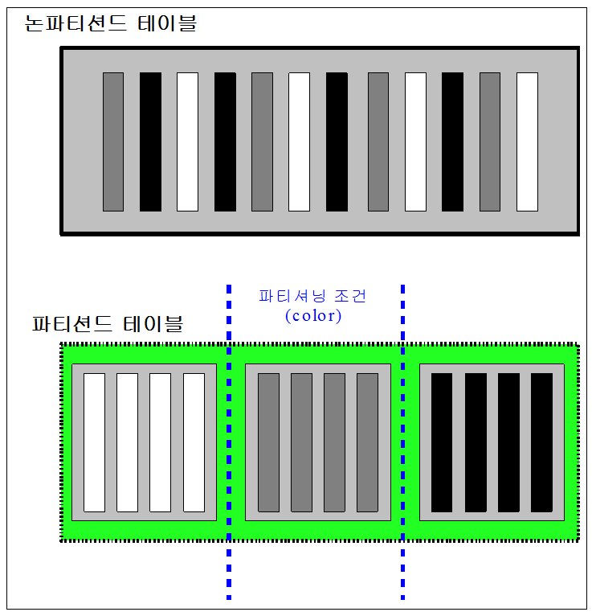
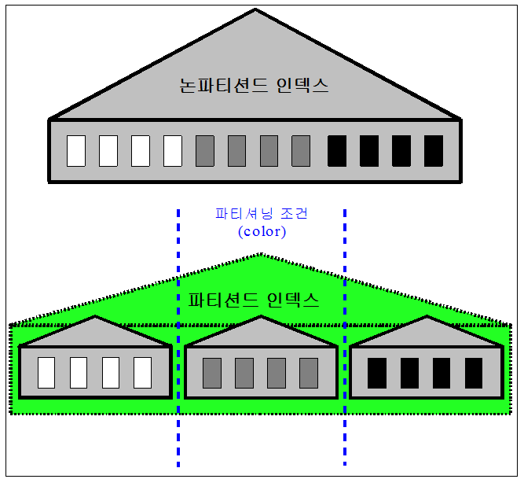
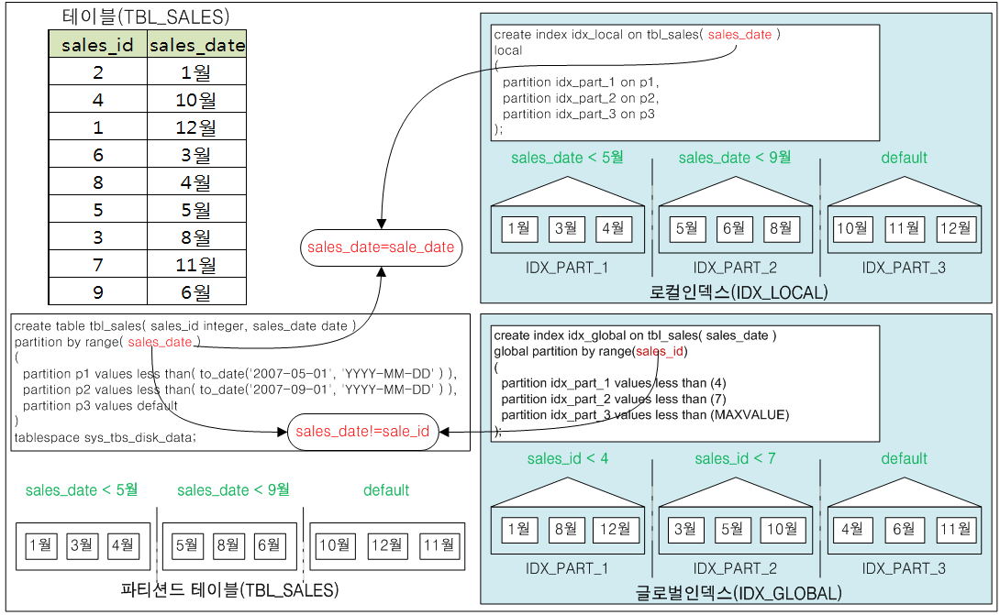
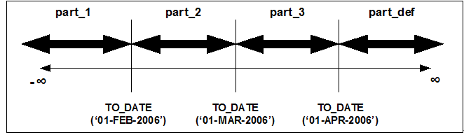
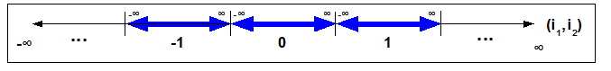
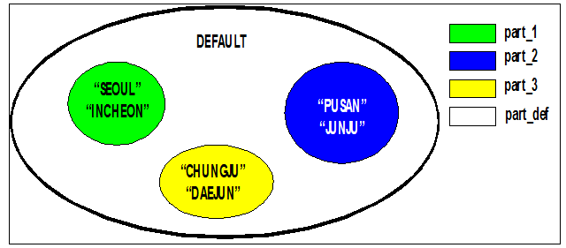
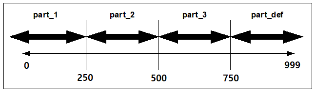

# 7.파티션드 객체

### 파티셔닝 정의

파티셔닝(partitioning)은 더 쉬운 관리를 위하여 대용량 데이터베이스 객체를 여러 개의 작은 조각으로 분할하는 것을 말한다.

파티셔닝으로 분할된 대용량 데이터베이스 객체를 “파티션드 객체 (partitioned object)”라고 하고, 파티션드 객체가 갖는 분할된 작은 조각을 “파티션 (partition)”이라고 한다.

#### 파티션드 객체와 논파티션드 객체 

일반 사용자(end user)가 파티션드 객체를 이용할 때 논파티션드 객체(non-partitioned object)와 차이를 알아채지 못한다. 즉, 사용자 입장에서는 파티션드 객체와 논파티션드 객체는 데이터베이스 객체로 인식될 뿐이지, 해당 객체의 파티션 유무는 인식하지 못하기 때문이다. 따라서 사용자는 객체의 파티션 유무에 관계없이 질의 및 DML(레코드 삽입, 삭제, 갱신) 등의 구문을 동일한 방법으로 사용할 수 있다.

파티션드 객체와 논파티션드 객체의 차이점을 데이터베이스 구조적 측면에서 살펴보면 다음과 같다.

##### 내부 구조

논파티션드 객체는 하나의 테이블스페이스에 종속된 객체로, 하나의 논파티션드 객체는 하나의 테이블스페이스에만 저장된다.

파티션드 객체는 다수의 테이블스페이스에 걸쳐 저장될 수 있다. 이는 [그림 7-1]으로 설명된다.


[그림 7‑1] 테이블스페이스, 파티션드 객체 및 논파티션드 객체의 관계

파티션드 객체는 내부적으로 다수의 파티션으로 이루어진다. 각 파티션은 논파티션드 객체와 같은 제약 조건을 가지며, 하나의 파티션은 하나의 테이블스페이스에만 종속된다.

이러한 다수의 테이블스페이스에 존재하는 파티션을 하나의 객체로 인식하게 만드는 것이 파티션드 객체이다. [그림 7-2]는 파티션드 객체의 내부구조를 보여준다.


[그림 7‑2] 파티션드 객체의 내부구조

##### 파티션드 객체의 장점

이런 구조상의 특징으로 인해 파티션드 객체는 다음과 같은 장점들을 갖는다.

- 데이터 로딩 및 인덱스 재구축(rebuilding)이 빠르다.
- 부분 삭제(partial delete)가 빠르다.
- 테이블 스캔(table scan) 및 인덱스 스캔(index scan)이 빠르다.
- 디스크 붕괴(disk failure)에 유연하다.

#### 파티션 키

파티션 키(Partition Key)는 테이블을 분할하는 기준이다. 파티션 키는 분할될 테이블의 하나 이상의 칼럼으로 구성된다. 이러한 칼럼들을 파티션 키 칼럼(partition key columns)이라고 한다.

파티션 키 칼럼은 반드시 대소 비교(\<, \>, =)가 가능한 데이터 타입이어야 하며, 이러한 칼럼만이 파티션 키 칼럼으로 선정될 수 있다.

예를 들어 레코드 삽입시, 삽입될 레코드가 어떤 파티션에 저장되어야 하는지 명확해야 한다. 이를 만족하기 위해서는 파티션 키 칼럼과 과련 조건간의 명확한 대소비교가 가능해야 한다. 따라서, BINARY, GEOMETRY, BLOB, 및 CLOB 등과 같은 대소 비교가 불가능한 타입은 파티션 키 칼럼이 될 수 없다.

### 파티션드 객체

데이터베이스 객체중 테이블과 인덱스는 파티션이 될 수 있는 객체이다.

테이블이 분할되는 경우 해당 테이블을 “파티션드 테이블 (partitioned table)”이라고 하며, 인덱스가 분할되는 경우는 “파티션드 인덱스 (partitioned index)”라고 한다. 이러한 파티션드 테이블과 파티션드 인덱스를 “파티션드 객체( partitioned object)”라고 한다.

파티션드 객체는 반드시 다음과 같은 규칙을 만족시켜야 한다.

```
non-partitioned_object ≡ ∑partition ………………… rule1
```

위의 규칙은 논파티션드 객체 (non-partitioned_object)는 이를 분할한 파티션의 합과 동치여야 함을 의미한다. 즉, 논파티션드 객체의 일부분만을 파티션시킬 수 없다.

#### 파티션드 테이블

“파티션드 테이블 (Partitioned Table)”은 파티셔닝 조건 (범위, 리스트, 해시)에 따라 다수의 파티션으로 분리한 대용량 테이블을 의미한다. 이는 [그림 7-3]로 설명된다.

[그림 7-3]은 논파티션드 테이블을 색깔(color)을 기준으로 분할하였으며, 결과적으로 파티션 3개로 구성된 파티션드 테이블이 된다.

파티션드 테이블은 구조적 측면에서 기존 데이터베이스 객체중 유니온 뷰(Union View)와 비슷한 개념을 갖는다. 유니온 뷰는 다수의 테이블을 하나의 객체로 인식하기 위해서 논리적으로 유니온 시킨 것뿐이며, 어떠한 물리적 공간을 차지하지는 않는다. 이와 마찬가지로 파티션드 테이블에 참여하는 파티션들이 물리적인 공간을 가지는 것뿐이지 파티션드 테이블 자체가 물리적 공간을 갖는 것은 아니다.

하지만 파티션드 테이블이 유니온 뷰와 규별되는 몇 가지 특징은 다음과 같다.

- 갱신 가능성  
  파티션드 테이블은 갱신이 가능하다. 반면 유니온 뷰는 개별 테이블을 통한 레코드 갱신은 가능하지만, 유니온 뷰를 통한 레코드 갱신은 불가능하다.
- 인덱스 구축 범위  
  파티션드 테이블에는 인덱스를 구축할 수 있다. 그러나 유니온 뷰는 개별 테이블에는 인덱스를 구축할 수 있지만, 유니온 뷰에는 인덱스를 구축할 수 없다.




[그림 7‑3] 파티션드 테이블과 논파티션드 테이블

결론적으로 파티션드 테이블은 레코드 갱신 및 인덱스 구축이 가능한 유니온 뷰 (updatable and indexable union view)라고 생각할 수 있다.

파티션드 테이블은 파티션들이 저장되는 매체의 종류에 따라서 다음과 같이 분류된다.

- 파티션드 메모리 테이블 (Partitioned Memory Table): 모든 파티션들이 메모리 테이블스페이스에 저장된 파티션드 테이블
- 파티션드 디스크 테이블 (Partitioned Disk Table): 모든 파티션들이 디스크 테이블스페이스에 저장된 파티션드 테이블

#### 파티션드 인덱스

파티션드 테이블을 위한 인덱스들을 다음과 같이 분류할 수 있다.

- 분할 여부에 따른 분류  
  파티션드 인덱스 vs. 논파티션드 인덱스
- 테이블과 인덱스 관계에 따른 분류  
  글로벌 인덱스 vs. 로컬 인덱스

##### 파티션드 인덱스와 논파티션드 인덱스

인덱스는 그 분할 여부에 따라 파티션드 인덱스와 논파티션드 인덱스로 구분된다.

“논파티션드 인덱스 (non-partitioned index)”는 파티션으로 분할되지 않은 인덱스를 의미하며, “파티션드 인덱스 (partitioned index)”는 파티션드 테이블과 마찬가지로 파티션 조건에 따라 분할된 대용량 인덱스를 의미한다. 이는 [그림 7-4]로 설명된다.




[그림 7‑4] 파티션드 인덱스와 논파티션드 인덱스

[그림 7-4]는 논파티션드 인덱스를 색깔(color)을 기준으로 분할하였으며, 결과적으로 파티션 3개로 구성된 파티션드 인덱스가 된다.

파티션 조건에 따라 분리된 파티션드 인덱스는 인덱스 파티션 키와 인덱스 키의 관계에 따라 프리픽스드 인덱스와 논프리픽스드 인덱스로 구분한다.

- 프리픽스드 인덱스 (Prefixed Index)  
  프리픽스드 인덱스는 인덱스 키의 첫번째 칼럼이 인덱스 파티션 키의 첫번째 칼럼과 동일하다.
- 논프리픽스드 인덱스 (Non-prefixed Index)  
  논프리픽스드 인덱스는 인덱스 키의 첫번째 칼럼이 인덱스 파티션 키의 첫번째 칼럼과 동일하지 않다.


[그림 7‑5] 프리픽스드 인덱스와 논프리픽스드 인덱스의 예

[그림 7-5]는 프리픽스드 인덱스와 논프리픽스드 인덱스의 차이를 sales_id와 sales_date로 이루어진 테이블을 사용해서 설명하고 있다.

위의 그림에서 인덱스들은 sales_date 칼럼에 의해서 분할된다. 각 인덱스는 어떠한 키로 구성되느냐에 따라 프리픽스드 인덱스 또는 논프리픽스드 인덱스로 분류된다.

그림에서 프리픽스드 인덱스는 sales_date를 키로 갖는다. 즉, 인덱스 파티션 키와 인덱스 키가 같은 칼럼 기반이다. 이러한 인덱스를 “프리픽스드 인덱스 (prefixed
index)”라고 한다. 반면, 그림에서의 논프리픽스드 인덱스는 sales_id로 정렬되어 있다. 이러한 인덱스는 인덱스 파티션 키와는 다른 칼럼에 의해서 정렬된 인덱스로 “논프리픽스드 인덱스 (non-prefixed index)”라고 한다.

프리픽스드와 논프리픽스드로 구분하는 이유는 유니크 (Unique) 속성과 관련이 있다. 프리픽스드 인덱스의 키는 인덱스 파티션 키와 동일하기 때문에, Altibase 서버는 유니크 검사시 파티션드 인덱스에 속한 모든 파티션들을 검색하지 않고도 유니크 검사를 할 수 있다. 그러나 논프리픽스드 인덱스의 경우에는 Altibase 서버는
파티션드 인덱스에 포함된 모든 파티션들을 검색해야 한다. [그림 7-6]이 이의 예를 보여준다.


[그림 7‑6] 논프리픽스드 인덱스를 이용한 유니크 검사의 예 (불가능함)

[그림 7-6]에서 인덱스 파티션 키는 sales_date칼럼이며 sales_id칼럼은 유니크 제약조건을 갖는다. sales_id칼럼을 인덱스 키로 갖는 논프리픽스드
인덱스(IDX_NON_PREFIX)가 구축된다면, 다음의 구문으로 레코드 삽입시 Altibase가 인덱스 IDX_NON_PREFIX를 이용해서 유니크 검사를 할 수 있을지 생각해보자:

```
INSERT INTO TBL_SALES VALUES(9, 1월);
```

우선 삽입하려는 레코드의 sales_date칼럼의 값이 “1월”이기 때문에, 키는 IDX_PART_1 파티션에 삽입될 것이다. 삽입시 IDX_PART_2 파티션 sales_id 칼럼에 9의 키 값이 있음에도 불구하고 IDX_PART_1 파티션에 정상적으로 삽입될 것이다. 따라서 Altibase 서버는 논프리픽스드 인덱스를 이용해서 유니크 검사를 할 경우에는 각 파티션내의 인덱스를 모두 검색해야만 한다.

##### 글로벌 인덱스와 로컬 인덱스

인덱스는 테이블 파티션 키와 인덱스 파티션 키의 관계에 따라 글로벌 인덱스와 로컬 인덱스로 구분된다. “글로벌 인덱스 (global index)”는 인덱스 파티션 키가 테이블 파티션 키와 일치하지 않는 인덱스를 의미한다 (index_partition_key != table_partition_key). “로컬 인덱스 (local index)”는 인덱스 파티션 키가 테이블 파티션 키와 일치하는 인덱스를 의미한다 (index_partition_key == table_partition_key).



[그림 7‑7] 로컬 인덱스와 글로벌 인덱스의 예

[그림 7-7]은 글로벌 인덱스와 로컬 인덱스의 차이를 sales_id 와 sales_date 칼럼으로 이루어진 테이블을 사용해서 설명하고 있다. 그림에서 인덱스들은 sales_date에 의해서 정렬되어 있고, 각 인덱스를 어떠한 인덱스 파티션 키로 분할하느냐에 따라 로컬 인덱스 또는 글로벌 인덱스로 분류된다.

아래 그림에서 로컬 인덱스는 sales_date칼럼을 기준으로 3개의 파티션으로 분할된다. 이렇게 인덱스 파티션 키 (sale_date)와 테이블 파티션 키 (sales_date)가 동일한 파티션드 인덱스를 로컬 인덱스라고 한다.

반면, 그림 하단의 글로벌 인덱스는 sales_id칼럼에 의해서 분할되어 있다. 즉, 인덱스 파티션 키 (sales_id)와 테이블 파티션 키(sales_date)가 동일하지 않다. 이런 유형의 파티션드 인덱스를 글로벌 인덱스라고 한다.

인덱스를 글로벌 또는 로컬 인덱스로 구분하는 이유는 테이블 파티션 키와 인덱스 파티션 키의 동치 여부에 따라 다른 특징을 갖기 때문이다.

테이블 파티션 키와 다른 칼럼을 기준으로 구축된 파티션드 인덱스는 글로벌 인덱스의 한 인덱스 파티션 내의 키들이 서로 다른 테이블 파티션들을 가리키고 있음을 의미한다. 이는 파티션드 테이블에 대한 변경 구문 (ALTER TABLE .... MERGE ...) 실행은 글로벌 인덱스의 재구축 (rebuild)으로 이어질수 있음을 의미한다.

반면 로컬 인덱스의 경우는 파티션드 테이블에 대한 변경 구문은 변경되는 파티션의 로컬 인덱스에만 영향을 미치기 때문에, 전체적인 동시성 효율을 떨어뜨리지 않는다.

##### 글로벌 논파티션드 인덱스

글로벌 논파티션드 인덱스는 논파티션드 인덱스와 비슷하게 동작한다. 즉, 파티션드 테이블에 인덱스 파티션 키 없이 테이블 전역적으로 생성된 인덱스이다.

아래 그림은 세 개의 파티션으로 분할되어 있는 tbl_sales 테이블에 인덱스 파티션 키를 지정하지 않고 글로벌 논파티션드 인덱스를 생성하는 것을 보여준다.


[그림 7‑8] 글로벌 논파티션드 인덱스의 예

##### 인덱스의 종류

지금까지 설명한 인덱스의 종류를 정리하면 아래 그림과 같다.


[그림 7‑9] 인덱스의 종류

현재 Altibase는 로컬 인덱스와 글로벌 논파티션드 인덱스만 지원한다. 글로벌 파티션드 인덱스는 지원하지 않는다. 이것을 디스크 테이블과 연관지어 정리하면 다음과 같다.

|                                      | 논파티션드 테이블 | 파티션드 테이블 |
| ------------------------------------ | ----------------- | --------------- |
| (파티션드)로컬 프리픽스드 인덱스     | X                 | O               |
| (파티션드)로컬 논프리픽스드 인덱스   | X                 | O               |
| (파티션드)글로벌 프리픽스드 인덱스   | X                 | X               |
| (파티션드)글로벌 논프리픽스드 인덱스 | X                 | X               |
| 글로벌 논파티션드 인덱스             | O                 | O               |

[표 7‑1] 디스크 테이블에 지원되는 인덱스의 종류

글로벌 논파티션드 인덱스만 논파티션드 테이블과 파티션드 테이블 위에 구축될 수 있으며, 로컬 프리픽스드 인덱스와 로컬 논프리픽스드 인덱스는 파티션드 테이블 위에 구축될 수 있다.

단 파티션드 메모리 테이블에는 글로벌 논파티션드 인덱스를 생성할 수 없다. 메모리 테이블에 생성할 수 있는 인덱스 종류는 아래의 표와 같다.

|                                      | 논파티션드 테이블 | 파티션드 테이블 |
| ------------------------------------ | ----------------- | --------------- |
| (파티션드)로컬 프리픽스드 인덱스     | X                 | O               |
| (파티션드)로컬 논프리픽스드 인덱스   | X                 | O               |
| (파티션드)글로벌 프리픽스드 인덱스   | X                 | X               |
| (파티션드)글로벌 논프리픽스드 인덱스 | X                 | X               |
| 글로벌 논파티션드 인덱스             | O                 | X               |

[표 7‑2] 메모리 테이블에 지원되는 인덱스의 종류

#### 하이브리드 파티션드 테이블( Hybrid Partitioned Table)

파티션드 테이블이 테이블스페이스의 저장공간(디스크/메모리)에 관계 없이 다른 테이블스페이스로 변환될 수 있다.

디스크의 파티션드 테이블에서 메모리/휘발성 파티션드 테이블로 변환될 때 칼럼의 타입을 fixed 또는 variable로 지정하더라도 fixed로 처리된다. 그러나 메모리 파티션드 테이블은 디스크 파티션드 테이블로 변환되더라도 타입이 그대로 적용된다. 또한 LOB 칼럼은 항상 variable로 처리되지만, IN ROW 절에 지정된 값에 따라 데이터들은 fixed 또는 variable로 저장된다.

##### 제약사항

- 글로벌 인덱스는 하이브리드 파티션드 테이블을 지원하지 않는다.
- 하이브리드 파티션드 테이블은 Direct Key Index와 JOIN, DISJOIN을 이용할 수 없다. 또한 ALTER TABLE MODIFY COLUMN 구문을 이용할 수 없다.

### 파티션 조건

본 절에서는 파티션 조건과 기본 파티션을 설명한다.

#### 파티션 전제조건

파티션 조건 (partition condition)은 파티션을 분할하는 기준을 의미한다. 이러한 기준은 다음과 같은 규칙을 준수해야 한다.

```
partition_conditioni ∩ partition_conditioni+1 = ∮…………rule2
```

위의 규칙은 파티션드 테이블을 위한 파티션 조건들간에 교집합이 존재해서는 안됨을 의미한다. 교집합이 존재한다는 것은 레코드가 어느 파티션으로 삽입되어야 하는지 명확하지 않다는 것이다. 따라서, 파티션드 객체 생성시 이러한 규칙을 만족하지 않으면 파티션 생성은 실패한다.

또한 파티션 조건은 어떠한 경우에도 항상 동일한 값을 표현해야 한다. 레코드가 t라는 시점에 A 파티션에 삽입되었다고 가정할 경우, 동일 레코드가 t+1시점에 삽입되는 경우에도 A파티션에 삽입되어야 한다. 이러한 조건을 만족시키기 위해서 파티션 조건에 기술되는 파티션 조건 값은 항상 상수 또는 결정가능한 내장 함수 (deterministic built-in function)여야 한다. 결정가능한 내장함수란 시점에 상관없이 동일한 값을 리턴하는 시스템 내부에서 제공하는 함수(non-user-defined function)를 의미한다.

#### 기본 파티션 

Altibase에서 파티션 조건은 다음과 같은 규칙을 항상 만족해야 한다.

```
column_domain ≡ ∪partition_condition ……………… rule3
```

위의 규칙은 파티션 조건에 참여하는 칼럼의 도메인 (column domain)이 파티션 조건들의 합집합과 동치관계여야 함을 의미한다. 이는 파티션드 테이블 생성시에 모든 파티션 조건들을 명시적으로 기술해야 함을 의미한다.

그러나 현실적으로 질의문을 기술하는 사용자가 모든 파티션 조건을 기술한다는 것은 불가능하기 때문에 Altibase에서는 기본 파티션 (default partition)이라는 개념을 제공한다.

[그림 7-10]에서는 3개의 파티션을 갖는 파티션드 객체를 예를 들어 기본 파티션을 설명하고 있다. 아래 구문에서 사용자는 P1및 P2파티션에 대한 파티션 조건 (partition_condition1, partition_condition2)을 명시하였으며, P3에 대해서 기본 파티션을 선언하였다. 이러한 경우, 삽입되는 레코드가 partition_condition1과 partition_condition2조건에 걸리지 않는다면 P3파티션에 삽입된다. 즉, 기본 파티션은 파티션 키 칼럼이 갖는 전체 도메인에서 사용자가 지정한 파티션 조건들을 뺀 나머지 도메인 부분과 같다.


[그림 7‑10] 기본 파티션 사용 예제

기본 파티션은 파티션드 객체 생성시 반드시 명시해야 한다. 만약 기본 파티션을 명시하지 않는다면 파티션드 객체 생성은 실패한다.

### 파티셔닝 방법

객체는 다음 네 가지 방법으로 분할될 수 있다: 범위 파티셔닝, 리스트 파티셔닝, 해시 파티셔닝, 해시를 사용한 범위 파티셔닝.

범위 파티셔닝은 객체를 파티션 키값의 범위(range)를 기준으로 분할하는 방법으로 선형적(linear) 범위로 파티션을 구성할 때 적합하다. 리스트 파티셔닝은 파티션 키값의 집합을 기준으로 분할하며 이산적(discrete)범위로 파티션을 구성하기에 적합하다. 해시 파티셔닝은 파티션 키값에 해당하는 해시(hash)값을 기준으로 분할하는 방법이다. 해시를 사용한 범위 파티셔닝은 파티션 키값에 해당하는 해시값을 기준으로 범위를 정해 분할하는 방법이다.

위 방법으로 생성된 각 파티션에 대해 다음과 같은 연산이 가능하다.

|                     | 범위 파티셔닝으로 생성된 파티션 | 리스트 파티셔닝으로 생성된 파티션 | 해시 파티셔닝으로 생성된 파티션 | **해시를 사용한 범위 파티션** |
| ------------------- | ------------------------------- | --------------------------------- | ------------------------------- | ----------------------------- |
| 테이블스페이스 변경 | ○                               | ○                                 | ○                               | ○                             |
| 추가                | △ ( 조건부 가능 )               | X                                 | ○                               | X                             |
| 병합                | X                               | X                                 | ○                               | X                             |
| 삭제                | ○                               | ○                                 | X                               | ○                             |
| 합병                | ○                               | ○                                 | X                               | ○                             |
| 이름 변경           | ○                               | ○                                 | ○                               | ○                             |
| 분할                | ○                               | ○                                 | X                               | ○                             |
| 레코드 삭제         | ○                               | ○                                 | ○                               | ○                             |

[표 7 3] 파티션 별 지원 연산

#### 범위 파티셔닝

범위 파티셔닝(range partitioning)은 분할할 때 날짜(DATE) 타입을 많이 이용하며, 이력 데이터(historical data)를 다루는 분야에서 사용된다.

파티션 정의시 사용할 수 있는 유일한 파티션 조건은 ‘LESS THAN’이다. 기본 파티션은 'DEFAULT' 절 사용으로 정의할 수 있으며 생략할 수 있다.

기본 파티션이 있는 파티션드 테이블에 기본 테이블을 삭제할 수 없고, 기본 파티션이 없는 파티션드 테이블에 기본 테이블을 추가할 수 없기 때문에 범위 파티셔닝 테이블을 생성 시 주의가 필요하다.

다음은 범위 파티셔닝의 예제이다.

```
CREATE TABLE part_table
(
    sales_date        DATE,
    sales_id            NUMBER,
    sales_city         VARCHAR(20),
    ....
) 
PARTITION BY RANGE(sales_date)
(
    PARTITION part_1 VALUES LESS THAN ( TO_DATE(‘01-FEB-2006’) ),
    PARTITION part_2 VALUES LESS THAN ( TO_DATE(‘01-MAR-2006’) ),
    PARTITION part_3 VALUES LESS THAN ( TO_DATE(‘01-APR-2006’) ),
    PARTITION part_def VALUES DEFAULT
) TABLESPACE SYS_TBS_DISK_DATA;
```

위의 예제는 part_table테이블을 생성하면서 범위 파티셔닝 방법을 이용하여 파티션 4개로 분할한다.

처음 세 개의 파티션은 각각 FEB, MAR, 및 APR이전의 데이터를 다루며, part_def라는 기본 파티션은 어떤 조건에도 포함되지 않는 데이터를 다룬다.

위의 예를 그래피컬 방식으로 표현하면 [그림 7-10]과 같다.




[그림 7‑11] 범위 파티션드 테이블의 파티션 영역

##### 다중칼럼 파티셔닝

다중칼럼 파티셔닝(Multicolumn Partitioning)은 다중칼럼으로 구성된 파티션 키를 이용하여 객체를 분할하는 것을 말한다. 다중칼럼 파티셔닝은 다중키를 갖는 인덱스와 동일한 개념을 갖는다.

다음 그림은 두 개 칼럼(i1, i2)으로 구성된 파티션 키를 1차원 형태로 표현한 것이다.




[그림 7‑12] 다중칼럼 파티셔닝의 파티션 영역

다음은 다중칼럼 파티셔닝을 SQL구문으로 예를 들어 설명하고 있다.

```
CREATE TABLE part_table
(
    sales_date        DATE,
    sales_id            NUMBER,
    sales_city         VARCHAR(20),
    ....
) 
PARTITION BY RANGE(sales_date, sales_id)
(
    PARTITION part_1 VALUES LESS THAN ( TO_DATE(‘01-FEB-2006’), 200),
    PARTITION part_2 VALUES LESS THAN ( TO_DATE(‘01-MAR-2006’), 100),
    PARTITION part_3 VALUES LESS THAN ( TO_DATE(‘02-MAR-2006’)),
    PARTITION part_4 VALUES LESS THAN ( TO_DATE(‘01-APR-2006’) ),
    PARTITION part_def VALUES DEFAULT
) TABLESPACE SYS_TBS_DISK_DATA;
```

위의 테이블 생성 구문을 그림으로 설명하면 다음과 같다.


[그림 7‑13] SQL 구문 예제의 파티션 영역

다음 표는 삽입될 레코드의 값에 따라 레코드가 삽입될 파티션과 해당 파티션에 삽입을 유도한 포함 조건이 무엇인지 보여주고 있다.

| 삽입될 레코드의 값(sales_date, sales_id) | 레코드가 삽입될 파티션 |
| ---------------------------------------- | ---------------------- |
| TO_DATE(‘15-JAN-2006’), 100              | part_1                 |
| TO_DATE(‘01-FEB-2006’), 100              | part_1                 |
| TO_DATE(‘01-FEB-2006’), 200              | part_2                 |
| TO_DATE(‘15-FEB-2006’), NULL             | part_2                 |
| TO_DATE(‘01-MAR-2006’), 50               | part_2                 |
| TO_DATE(‘01-MAR-2006’), NULL             | part_3                 |
| TO_DATE(‘15-MAR-2006’), 200              | part_4                 |
| NULL, 100                                | part_def               |
| NULL, NULL                               | part_def               |

##### 범위 파티션드 객체에 대한 연산

범위 파티션드 객체에 수행될 수 있는 연산의 종류는 6가지이다. 이 연산들은 파티션 분할, 파티션 삭제, 파티션 합병, 파티션 이름 변경, 파티션 레코드 삭제, 파티션 추가이다. 파티션 조건 변경은 현재는 지원되지 않는다. 

범위 파티션드 객체에 파티션이 추가되는 과정은 파티션 조건이 분할되는 과정과 동일하기 때문에 ‘SPLIT PARTITION’을 이용하도록 한다.

마찬가지로 파티션 삭제는 파티션 조건을 삭제하는 것과 동일하므로 ‘DROP PARTITION’을 사용하도록 한다. 파티션 삭제시, 삭제된 파티션 조건은 이웃한 파티션의 조건에 포함된다. 또한 레코드의 삭제 여부에 따라서 ‘DROP PARTITION’과 ‘MERGE PARTITION’으로 구분된다.

파티션 이름 변경은 ‘RENAME PARTITION’을 사용하면 된다. 파티션의 레코드를 삭제하려면 ‘TRUNCATE PARTITION’을 이용하도록 한다. 이는 파티션 내에 저장된 모든 레코드를 삭제한다.

###### 파티션 분할 (SPLIT PARTITION)

파티션 분할은 파티션드 객체가 갖는 한 파티션을 2개의 파티션으로 분할하는 연산이다. 파티션 분할은 분할 방식에 따라 다음의 2가지 경우로 나뉜다.

- 인플레이스 분할(In-place Split)  
  기존 파티션의 레코드 일부를 잘라 새로운 파티션에 이동하는 분할 방식으로, 기존 파티션의 내용이 변경된다.  
  새로운 파티션의 이름이 기존 파티션의 이름과 같고, 새 파티션이 생성될 테이블스페이스를 지정하지 않으면 인플레이스 분할 방식이 사용된다. ([그림
  7-14] 참조)
- 아웃플레이스 분할(Out-place Split)  
  기존 파티션의 내용은 변경되지 않는다. 대신 새로운 2개의 파티션을 생성하여, 기존 파티션의 레코드를 복사하는 분할 방식이다. 새로운 두 파티션의 이름을 기존 파티션의 이름과 다르게 지정했을 때 이 방식이 사용된다. 새 파티션 중 하나의 이름이 기존 파티션의 이름과 같더라도 그 파티션이 생성될 테이블스페이스를 지정한 경우에 사용된다. ([그림 7-15] 참조)

위의 아웃플레이스와 인플레이스 분할 방식은 성능과 효율성에서 차이가 날 수 있다. 인플레이스 분할시에는 기존 파티션이 새로운 두 파티션 중 하나와 같기 때문에 한 개의 새로운 파티션만이 생성된다. 따라서, 인플레이스 분할은 공간적인 측면에서 이득이다.

아웃플레이스 분할시에는 새로운 두 개의 파티션을 생성하고 각각의 파티션에 레코드 삽입 연산이 이루어진다. 인플레이스 분할에서의 레코드에 대한 연산은 이동 연산으로 이는 삽입과 삭제로 구성된다. MVCC 환경에서 레코드 삭제 연산은 레코드 삽입 연산에 비해 성능이 많이 떨어진다. 따라서, 인플레이스 분할은 저장 공간이 부족할 때 효율적이며, 아웃플레이스 분할은 저장 공간이 충분한 MVCC 환경에서 좋은 성능을 나타낸다.


[그림 7‑14] 범위 파티션드 객체에서 인플레이스 분할

위의 그림에서 보여준 예는 4개의 파티션을 갖는 파티션드 객체의 part_2를 part_2와 part_4로 분할하고 있다.

①새로운 파티션 part_4가 생성되며, ②기존 part_2에서 part_4로의 레코드 이동(MOVE: 삽입 & 삭제)이 진행된다. 마지막으로 ③part_2의 조건이 지정된 조건으로 축소된다.


[그림 7‑15] 범위 파티션드 객체에서 아웃플레이스 분할

위의 그림에서 보여준 예는 4개의 파티션을 갖는 파티션드 객체에서 part_2를 part_2와 part_4로 분할하고 있다. ①새로운 파티션 part_2와 part_4가 생성되며, ②part_2(old)에서 part_2(new)와 part_4로의 레코드 삽입이 진행된다. 마지막으로 ③part_2(old)가 물리적으로 삭제된다.

기본 파티션 분할시에는, INTO절 두 번째 파티션이 자동으로 기본 파티션으로 설정된다. 이는 INTO하위절에 기본 파티션을 지정할수 있는 구문을 지원하지 않기 때문이다.

###### 파티션 삭제(DROP PARTITION)

파티션 삭제는 파티션드 객체가 갖는 파티션들 중에 지정된 파티션을 삭제하는 연산이다. 파티션 삭제시 삭제될 파티션이 갖는 모든 레코드와 메타 정보들은 물리적으로 삭제된다. 또한 삭제된 파티션의 조건은 이웃한 파티션으로 흡수된다.


[그림 7‑16] 범위 파티션드 객체에서 파티션 삭제

위의 그림은 4개의 파티션을 갖는 파티션드 객체에서 part_2파티션이 삭제되는 과정을 보여주고 있다.

①part_2의 물리적 공간(레코드, 메타정보)이 삭제되고, ②이웃한 파티션(part_2의 조건을 포함할수 있는 조건을 가진 파티션)인 part_3으로 파티션 조건이 흡수된다.

###### 파티션 합병(MERGE PARTITION)

파티션 합병은 파티션드 객체가 갖는 파티션들 중 지정된 파티션 두 개를 하나의 파티션으로 합병하는 연산이다. 합병할 파티션들은 반드시 이웃해야 한다. 파티션 합병은 합병 방식에 따라 인플레이스 합병과 아웃플레이스 합병으로 나뉜다.

- 인플레이스 합병(In-place Merge)  
  기존의 두개 파티션이 하나의 파티션으로 합쳐지면서, 기존 파티션의 레코드가 여기에 삽입되는 방식이다. 새로운 파티션의 이름이 기존 파티션 중 하나의 이름과 같고, 새로운 파티션이 생성될 테이블스페이스를 지정하지 않은 경우에 사용된다. ([그림 7-17] 참조)
- 아웃플레이스 합병(Out-place Merge)  
  새로운 파티션이 추가로 생성되어 기존 파티션들의 레코드들이 새로운 파티션으로 복사되는 방식이다. 새로운 파티션의 이름이 기존 파티션의 이름과 다른 경우에 사용된다. 또한 새로운 파티션의 이름이 기존 파티션 중 하나의 이름과 같더라도 새로운 파티션이 생성될 테이블스페이스를 지정한 경우에 사용된다. ([그림 7-18] 참조)

인플레이스 합병과 아웃플레이스 합병은 성능과 효율성에서 차이가 날 수 있다. 인플레이스 합병은 새로운 파티션을 생성하지 않고, 레코드 삽입 연산만 하기 때문에 성능면에서 아웃플레이스 합병보다 유리하다.


[그림 7‑17] 범위 파티션드 객체에서의 인플레이스 합병

위의 그림은 4개의 파티션을 갖는 파티션드 객체의 part_2와 part_3를 part_3(old)로 합병하는 것을 보여주고 있다. ①기존 part_3의 조건이 확장되며, ②기존 part_2에서 part_3로의 레코드 삽입이 진행된다. 마지막으로 ③part_2가 물리적으로 삭제된다.


[그림 7‑18] 범위 파티션드 객체에서의 아웃플레이스 합병

[그림 7-18]은 4개의 파티션을 갖는 파티션드 객체의 part_2와 part_3를 part_3(new)로 합병하는 것을 설명하고 있다.

①새로운 파티션 part_3가 생성되며, ②기존 part_2와 part_3(old)에서 part_3(new)로 레코드 삽입이 진행된다. 마지막으로 ③part_2와 part_3(old)가 물리적으로 삭제된다.

###### 파티션 이름 변경(RENAME PARTITION)

파티션 조건은 변경되지 않으며, 파티션 이름만 변경된다

###### 파티션 레코드 삭제(TRUNCATE PARTITION)

파티션 레코드 삭제는 파티션 조건이 변경되지 않으며, 파티션에 저장되어 있는 모든 레코드들이 삭제된다.

###### 파티션 추가(ADD PARTITION)

파티션 추가는 한 개의 파티션을 추가하는 기능으로 기본 파티션이 생략된 범위 파티션드 테이블에서 사용할 수 있다.

#### 리스트 파티셔닝

리스트 파티셔닝(list partitioning)은 객체를 파티션 키 칼럼 값의 집합을 기준으로 분할하는 방법이다. 리스트 파티셔닝은 파티션 키 칼럼 값의 범위가 넓지 않을 경우(예: 1월 \~ 12월)에 자주 사용되는 분할 방법이다. 리스트 파티셔닝은 원칙적으로 파티션 칼럼으로 다중키를 지원하지 않는다.

범위 파티셔닝처럼 기본 파티션 생성을 위해서 DEFAULT 절이 지원된다.

다음은 리스트 파티셔닝의 예제이다.

```
CREATE TABLE part_table
(
    sales_date DATE,
    sales_id NUMBER,
    sales_city VARCHAR(20),
    ....
) 
PARTITION BY LIST(sales_city)
(
    PARTITION part_1 VALUES ( ‘SEOUL’ , ‘INCHEON’ ),
    PARTITION part_2 VALUES ( ‘PUSAN’ , ‘JUNJU’ ),
    PARTITION part_3 VALUES ( ‘CHUNGJU’ , ‘DAEJUN’ ),
    PARTITION part_def VALUES DEFAULT
) TABLESPACE SYS_TBS_DISK_DATA;
```

위의 예제에서, 테이블은 리스트 파티셔닝으로 분할되어 4개의 파티션을 갖는 파티션드 테이블 part_table이 생성된다. 처음 세 개의 파티션은 특정 도시별로 데이터를 관리하며, part_def라는 기본 파티션은 각 조건에 포함되지 않는 데이터를 관리한다. 이를 그림으로 표현하면 아래와 같다.




[그림 7‑19] 리스트 파티션드 테이블의 파티션 영역

##### 리스트 파티션드 객체에 대한 연산

리스트 파티션드 객체에 수행될 수 있는 연산의 종류는 5가지이다. 이 연산들은 파티션 분할, 파티션 삭제, 파티션 합병, 파티션 이름 변경, 파티션 레코드 삭제이다. SQL 구문은 범위 파티션드 객체를 위한 구문과 동일하다. 파티션 조건 변경은 지원되지 않는다.

###### 파티션 분할(SPLIT PARTITION)

리스트 파티셔닝은 범위 파티셔닝과 동일하게 인플레이스 분할과 아웃플레이스 분할을 지원한다. 파티션을 분할할 때 지정한 새로운 파티션 중 하나의 이름이 기존 파티션의 이름과 같을 경우, 테이블스페이스 지정 여부에 따라 인플레이스 분할이나 아웃플레이스 분할이 사용된다.


[그림 7‑20] 리스트 파티션드 객체에서의 인플레이스 분할

위의 그림에서 보여준 예는 4개의 파티션을 갖는 파티션드 객체에서 part_2를 part_2와 part_4로 분할하는 것을 설명하고 있다. ①새로운 파티션 part_4가 생성되며, ②기존 part_2에서 part_4로의 레코드 이동(MOVE: 삽입&삭제)이 진행된다. 마지막으로 ③part_2의 조건이 지정된 조건으로 축소({‘PUSAN’, ‘JUNJU’} -\> {‘JUNJU’})된다.


[그림 7‑21] 리스트 파티션드 객체에서의 아웃플레이스 분할

위의 그림 예는 4개의 파티션을 갖는 파티션드 객체에서 part_2를 part_2와 part_4로 분할하는 것을 설명하고 있다. ①새로운 파티션 part_2와 part_4가 생성되며, ②part_2(old)에서 part_2(new)와 part_4로의 레코드 삽입이 진행된다. 마지막으로 ③part_2(old)가 물리적으로 삭제된다.

###### 파티션 삭제(DROP PARTITION)

리스트 파티션드 객체에서의 파티션 삭제는 범위 파티션드 객체와 유사하며, 다만 삭제될 파티션의 파티션 조건이 이웃 파티션이 아닌 기본 파티션의 조건으로 흡수된다는 점만 다르다.


[그림 7‑22] 리스트 파티션드 객체에서 파티션 삭제

위의 그림에서 보여준 예는 4개의 파티션을 갖는 파티션드 객체에서 part_2를 삭제하는 것을 설명하고 있다. ①part_2가 갖는 물리적인 공간(레코드, 메타정보)이 삭제되고, ② part_2의 조건이 기본 파티션 part_def로 흡수된다.

###### 파티션 합병(MERGE PARTITION)

리스트 파티션드 객체에서의 파티션 합병은 범위 파티션드 객체와 동일하게 인플레이스 합병과 아웃플레이스 합병이 있다. 지정한 새로운 파티션의 이름이 합병할 파티션들 중 하나의 이름과 같을 경우, 테이블스페이스를 지정했는지에 따라 인플레이스 합병이나 아웃플레이스 합병이 사용된다.


[그림 7‑23] 리스트 파티션드 객체에서의 인플레이스 합병

위의 그림에서 보여준 예는 4개의 파티션을 갖는 파티션드 객체에서 part_2와 part_3를 part_3(old)로 합병하는 것을 설명하고 있다. ①기존 part_3의 조건이 확장되며, ②기존 part_2에서 part_3로 레코드 삽입이 진행된다. 마지막으로 ③part_2가 물리적으로 삭제된다.


[그림 7‑24] 리스트 파티션드 객체에서 아웃플레이스 합병

위의 그림에서 보여준 예는 4개의 파티션을 갖는 파티션드 객체에서 part_2와 part_3를 part_3(new)로 합병하는 것을 설명하고 있다. ①새로운 파티션 part_3가 생성되며, ②기존 part_2와 part_3(old)에서 part_3(new)로의 레코드 삽입이 진행된다. 마지막으로 ③part_2와 part_3(old)가 물리적으로 삭제된다.

###### 파티션 이름 변경(RENAME PARTITION)

파티션 조건은 변경되지 않으며, 파티션의 이름이 변경된다.

###### 파티션 레코드 삭제(TRUNCATE PARTITION)

파티션 조건은 변경되지 않으며, 파티션에 저장되어 있는 모든 레코드들이 삭제된다.

#### 해시 파티셔닝

해시 파티셔닝(Hash Partitioning)은 객체를 파티션 키의 해시(hash) 값을 기준으로 분할하는 방법이다. 파티션 키는 다중 칼럼으로 구성될 수 있다. 해시 파티셔닝은 관리의 용이성보다는 데이터의 고른 부하 분배를 위해 많이 사용되는 방법이다.

해시 파티셔닝은 해시의 특성으로 인해 일반적인 파티션 연산에 제한을 받는다. 범위 파티션과 리스트 파티션과 달리 해시 파티션에는 파티션 분할, 삭제, 합병(merge) 등의 작업을 수행할 수 없으며, 파티션 추가, 병합(coalesce)과 같은 해시 전용 작업은 수행이 가능하다.

범위 파티셔닝과 리스트 파티셔닝과 달리 해시 파티셔닝에는 기본 파티션이 지원되지 않는다. 이는 해시 함수 자체가 파티션 키의 모든 값을 수용할 수 있기 때문이다. 널(null) 파티션 키 값을 갖는 레코드가 삽입되는 위치는 널에 대한 해시 값에 의존한다. 널의 해시값은 고정된 상수지만, 데이터 타입마다 상이한 값을 갖는다. 널 파티션 키 값을 갖는 레코드는 칼럼의 타입에 따라 저장되는 위치가 변경될 수 있다.

다음은 해시 파티셔닝의 예제이다.

```
CREATE TABLE part_table
(
    sales_date        DATE,
    sales_id            NUMBER,
    sales_city         VARCHAR(20),
    ....
) 
PARTITION BY HASH(sales_id)
(
    PARTITION part_1,
    PARTITION part_2,
    PARTITION part_3,
    PARTITION part_4
) TABLESPACE SYS_TBS_DISK_DATA;
```

위 예제는 해시 파티셔닝을 이용해서 4개의 파티션을 갖는 테이블 part_table이 생성되는 것을 보여준다. 각 파티션은 해시 함수 HASH(sales_id, 4) 에 따라 나누어진 데이터를 관리한다. 위의 예를 도식화하면 [그림7-25]와 같다.


[그림 7‑25] 해시 파티션드 테이블의 파티션 영역

##### 해시 파티션드 객체에 대한 연산

해시 파티션드 객체에 수행될 수 있는 연산의 종류는 4가지이다. 이 연산들은 파티션 추가, 파티션 병합, 파티션 이름 변경, 파티션 레코드 삭제이다.

해시 파티션드 객체에 파티션을 추가하려면 ‘ADD PARTITION’을 이용한다. 파티션은 삭제하지만 그 데이터는 유지하려면 ‘COALESCE PARTITION’을 이용한다. 이 연산은 마지막 파티션을 삭제하고, 해당 파티션의 레코드는 기존 레코드들과 함께 파티션드 객체 전체를 재구성 (reorganization)한다. 파티션 이름을 변경하려면 ‘RENAME PARTITION’을 사용한다. 파티션 레코드를 삭제(파티션에 저장된 모든 레코드 삭제)하려면 ‘TRUNCATE PARTITION’을 이용한다.

###### 파티션 추가(ADD PARTITION)

해시 파티션드 객체에 파티션을 추가하는 것은 해시 키의 개수가 늘어남을 의미한다. 파티션의 추가는 기존의 모든 파티션에 영향을 미치게 된다. 해시 키가 변경되면 테이블의 레코드 전체가 변경된 파티션들로 재구성(reorganization)된다. 아래 그림은 이러한 파티션 추가를 설명하고 있다.


[그림 7‑26] 해시 파티션드 객체의 파티션 추가

위의 그림 예는 4개의 파티션을 갖는 파티션드 객체에서 part_5를 추가하는 것을 설명하고 있다. ①새로운 파티션 part_5가 생성되며, ②기존 파티션 4개의 레코드들이 기존 4개의 파티션과 1개의 새로 생성된 파티션으로 재분배된다.

###### 파티션 병합(COALESCE PARTITION)

해시 파티션드 객체의 파티션을 병합(Coalesce)하는 것은 해시 키의 개수가 줄어드는 것을 의미한다. 파티션의 병합은 기존의 모든 파티션에 영향을 미친다. 마지막 파티션이 삭제되고, 해당 파티션의 레코드가 기존의 레코드들과 함께 파티션드 객체 전체가 재구성(reorganization)된다. 파티션 병합을 할 때 삭제될 파티션 이름은 지정할 수 없다. 마지막 파티션부터 1개씩 삭제된다.

예를 들어 4개의 파티션(part_1, part_2, part_3, part_4)을 갖는 파티션드 객체를 병합하면 part_4가 삭제되고 3개의 파티션(part_1, part_2, part_3)을 갖는 파티션드 객체로 줄어든다. 아래 그림은 이러한 파티션 병합 과정을 설명하고 있다.


[그림 7‑27] 해시 파티션드 객체의 파티션 병합

위의 그림은 4개의 파티션을 갖는 파티션드 객체에서 파티션 병합하는 것을 설명하고 있다. ①기존 파티션 4개의 레코드들이 part_1, part_2, part_3으로 재분배되고, ②마지막 파티션 part_4가 삭제된다.

###### 파티션 이름 변경(RENAME PARTITION)

파티션 조건은 변경되지 않으며, 파티션의 이름이 변경된다.

###### 파티션 레코드 삭제(TRUNCATE PARTITION)

파티션 조건은 변경되지 않으며, 파티션에 저장되어 있는 모든 레코드들이 삭제된다.

#### 해시를 사용한 범위 파티셔닝

해시를 사용한 범위 파티셔닝(range partitioning using hash)은 객체를 파티션 키의 해시(hash)값을 기준으로 범위를 지정하여 분할하는 방법이다. 파티션 키는  단일 칼럼만 가능하다. 해시를 사용한 범위 파티셔닝은 데이터의 고른 부하 분배와 관리의 용이성을 위해 사용되는 방법이다.

해시 파티셔닝과 달리 해시를 사용한 범위 파티셔닝은 파티션 분할, 삭제, 합병이 가능하고 파티션 추가, 병합(coalesce)은 지원하지 않는다.

기본 동작은 범위 파티션과 같으며 기본 파티션을 지원한다. 다만 파티션 키는 단일 칼럼만 가능하고 해시 값의 범위(range)를 0 보다 크고 1000보다 작은 값만 설정할 수 있다.

다음은 해시를 사용한 범위 파티셔닝의 예제이다.

```
CREATE TABLE part_table
(
    sales_date        DATE,
    sales_id          NUMBER,
    sales_city        VARCHAR(20),
    ....
) 
PARTITION BY RANGE_USING_HASH(sales_id)
(
    PARTITION part_1 VALUES LESS THAN ( 250 ),
    PARTITION part_2 VALUES LESS THAN ( 500 ),
    PARTITION part_3 VALUES LESS THAN ( 750 ),
    PARTITION part_def VALUES DEFAULT
) TABLESPACE SYS_TBS_DISK_DATA;
```

위의 테이블 생성 구문을 그림으로 설명하면 다음과 같다.




[그림 7‑28] 해시 값을 사용한 범위 파티션드 테이블의 파티션 영역

해시를 사용한 범위 파티션드 객체에 대한 연산은 범위 파티션드 객체와 같다.

