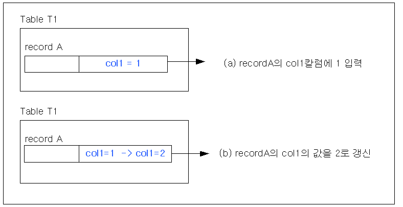
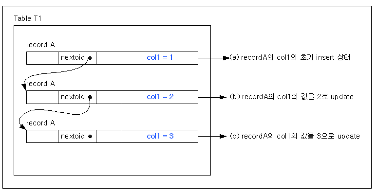
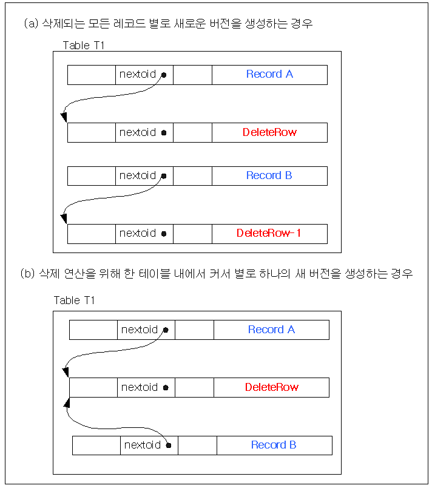
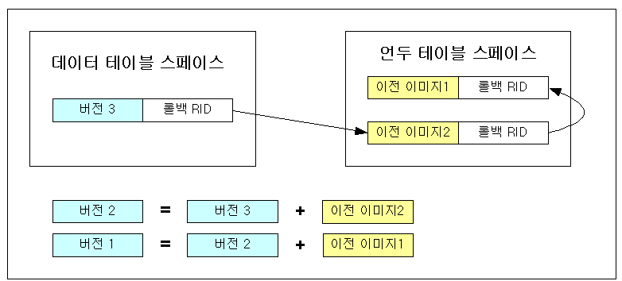

# 8.트랜잭션 관리

사용자 트랜잭션의 동시성을 제어하고 데이터의 일관성을 유지하는 것이 데이터베이스의 가장 기본적인 기능의 하나다. 이장에서는 Altibase의 트랜잭션 관리 기능에 대해서 알아보자.

### 트랜잭션

트랜잭션(Transaction)이란 하나 이상의 SQL 문장들로 이루어진 작업의 논리적인 단위를 말한다. 트랜잭션은 사용자에 의해 첫 SQL 구문의 실행으로 시작되고, 트랜잭션이 커밋 또는 롤백 될 때 끝난다. 커밋 또는 롤백은 명시적인 COMMIT 또는 ROLLBACK 구문으로 수행할 수도 있고, DDL 구문 실행으로 인해 암묵적으로 행해 질 수도 있다.

#### 트랜잭션의 정의

트랜잭션은 한 트랜잭션 내의 SQL 구문들이 논리적으로 그룹지어 있는 한 사용자에게 데이터 변경의 일관성을 보장해 준다. 한 트랜잭션에는 작업의 논리적 단위를 위해 필요한 모든 부분이 포함되어야 한다. 트랜잭션이 시작되기 전에 일관된 상태였던 참조되는 모든 테이블의 데이터는 트랜잭션이 끝나 후에도 일관된 상태로 유지되어야 한다.

은행에서 예금을 이체하는 작업이 트랜잭션의 대표적인 예가 될 수 있다. A 계좌에서 B 계좌로 \$100을 이체한다고 가정하면 다음과 같은 작업들이 이뤄져야 한다.

1. A 계좌에서 \$100의 금액을 감소시킨다.
2. B 계좌에 \$100의 금액을 증가시킨다.
3. A에서 B계좌로 이체한 사실을 작업내용에 기록한다.

일관된(Consistent) 상태의 데이터베이스에서 정상적인 트랜잭션이 수행되면, 데이터베이스는 여전히 일관된 상태로 되어야 한다. 만일, 위에서 열거한 트랜잭션의 세가지 작업 중 한 가지라도 정상적으로 수행되지 않으면, 데이터베이스의 무결성이 깨져서 A 계좌의 고객, B 계좌의 고객, 혹은 은행이 손해를 보는 경우가 발생할 것이다.

데이터베이스 무결성을 유지시키기 위해 정상적으로 수행되는 트랜잭션은 다음과 같은 ACID 특성을 만족해야 한다.

- 원자성 (Atomicity): 트랜잭션 내의 모든 구문(Statement)이 모두 반영되거나, 혹은 모두 반영되지 않아야 한다. 즉, 트랜잭션은 부분적으로 성공될 수 없다.
- 일관성 (Consistency): 트랜잭션의 수행으로 인해 데이터베이스의 무결성이 깨어져서는 안 된다.
- 격리성 (Isolation): 여러 개의 트랜잭션들이 동시에 수행될 때, 어떤 트랜잭션도 다른 트랜잭션의 결과에 영향을 받아서는 안된다.
- 영속성 (Durability): 일단 트랜잭션이 완료(Commit) 되면, 시스템 장애 같은 어떤 상황 하에서도 그 변경 내용을 영구적으로 유지할 수 있어야 한다.

#### 자율 트랜잭션 (Autonomous_Transaction) 

자율 트랜잭션 프라그마(Autonomous_Transaction Pragma) 구문을 사용하면 PSM 객체가 주 트랜잭션과 독립적으로 동작한다. 자율 트랜잭션은 자원을 공유하지 않으므로 락, 커밋, 복구 등의 동작이 독립적으로 수행된다.

자세한 정보는 [*Stored Procedures Manual*의 '프라그마'](https://github.com/ALTIBASE/Documents/blob/master/Manuals/Altibase_7.3/kor/Stored%20Procedures%20Manual.md#10%ED%94%84%EB%9D%BC%EA%B7%B8%EB%A7%88pragma)를 참조하기 바란다.

#### 트랜잭션 종료

트랜잭션은 다음의 하나가 발생할 때 종료될 것이다.

- 트랜잭션은 사용자가 SAVEPOINT절 없이 ROLLBACK 구문을 실행하거나, COMMIT 구문을 실행할 때 종료된다.
- 사용자가 DDL 구문을 실행할 때 트랜잭션은 커밋된다.
- 사용자가 Altibase 서버로부터의 연결을 해제하면 트랜잭션은 커밋된다.
- 사용자 세션이 비정상적으로 종료되면 현재 트랜잭션은 롤백된다.

#### 문장

문장(statement)은 트랜잭션 내에서 수행되는 SQL 문 하나 하나를 일컫는 말이다. 문장의 종류에는 다음과 같은 세 종류가 있다.

- DCL (Data Control Language): 데이터베이스의 상태나 프로퍼티 혹은 물리적 구성을 변경시키는 문장들이다.
- DDL (Data Definition Language): 데이터베이스의 논리적 구성 요소인 객체들(테이블, 인덱스, 시퀀스, 등)의 생성, 변경 및 삭제를 수행하는 문장들이다.
- DML (Data Manipulation Language): 데이터베이스 내에 저장되는 실제 데이터들의 삽입, 삭제, 변경 및 검색을 수행하는 문장들이다.

일반적으로 하나의 SQL 문이 하나의 문장이 되지만, 저장 프로시저나 함수 등이 호출되면 하나 이상의 하위 문장들이 수행된다.

문장의 수행도 역시 데이터베이스의 무결성을 해치지 않아야 한다. 문장 수행 중 에러가 발생하면 해당 문장에서 수행한 모든 작업이 이전 상태로 되돌려진다. 이를 위해, Altibase는 각 문장을 시작하기 전에 “암묵적 저장점(Implicit Save Point)”을 설정해 두고, 오류 발생시 이 지점까지의 복원을 수행한다.

#### 트랜잭션의 커밋

트랜잭션의 커밋(commit)이란 지금까지 트랜잭션 안에서 수행한 모든 SQL 문의 결과를 데이터베이스에 영구적으로 반영하면서 해당 트랜잭션을 종료하는 연산이다. 트랜잭션의 커밋은 데이터베이스의 상태를 이전의 무결한 상태에서 또 다른 무결한 상태로 전이시킨다.

트랜잭션이 커밋될 때, Altibase는 다음과 같은 작업을 수행한다.

- 트랜잭션 커밋 로그를 로그 파일에 기록한다.
- 트랜잭션의 수행으로 발생된 해제 가능한 자원들의 정보를 가비지 콜렉터(Garbage Collector)에게 넘겨준다.
- 트랜잭션의 상태를 커밋 상태(“committed”)로 변경시킨다.
- 트랜잭션 수행 중에 할당 받은 자원들(잠금, 임시 메모리 등)을 반환한다

#### 트랜잭션의 롤백

트랜잭션의 수행 도중에 치명적인 오류가 있어 더 이상 진행할 수 없는 경우에는 지금까지 수행해 왔던 모든 SQL 문들을 다시 되돌려서, 데이터베이스를 트랜잭션 수행 이전 상태로 바꿔야 한다. 이를 트랜잭션의 롤백이라고 한다.

트랜잭션의 롤백은 트랜잭션 수행 중에 기록한 각 로그들에 대한 보상(compensation) 연산을 수행함으로써 구현된다.

트랜잭션 롤백 시 Altibase는 다음과 같은 작업을 수행한다.

- 로그 레코드를 기록 순서와 반대로 읽어가며 보상 연산을 수행한다.
- 트랜잭션 롤백 로그를 기록한다.
- 삽입 등의 연산으로 할당 받았던 자원들을 다시 가비지 콜렉터에게 반환한다.
- 트랜잭션의 상태를 롤백 상태(“rolled back”)로 변경한다.
- 트랜잭션 수행 중에 할당받은 자원들(잠금, 임시 메모리 등)을 반환한다.

#### 명시적 저장점

하나의 긴 트랜잭션을 여러 개의 부분으로 나누어 관리하여야 하는 경우, 그 부분의 시작 지점에 명시적 저장점(Explicit Save Point)을 선언할 수 있다.

명시적 저장점은 이름을 가지므로, 한 트랜잭션 내에 여러 개가 선언될 수도 있다. 명시적 저장점 선언 이후 오류가 발생하여 선언한 지점으로 데이터베이스를 다시 복원을 해야 하는 경우에는, 해당 저장점으로의 롤백을 수행하면 된다.

명시적 저장점으로의 롤백이 수행되면 이후에 잡았던 테이블과 레코드 잠금 등의 자원들이 모두 해제되며, 해당 저장점 이후에 선언된 다른 저장점들은 모두 해제된다.

### 잠금(Lock) 

잠금의 목적은 데이터베이스 내에 존재하는 특정 객체에 대한 접근 권한을 설정하는 것이다.

Altibase는 데이터에 대한 동시 접근을 제어하기 위해 잠금을 사용한다. 데이터가 갱신될 때, 갱신이 완료될 때까지 그 데이터에는 잠금이 걸린다. 이는 시스템에서 데이터의 무결성을 보장하는 데 도움이 된다.

#### 잠금 모드

잠금은 그 사용 대상에 따라 테이블 레벨 잠금과 레코드 레벨 잠금으로 나뉜다.

##### 테이블 레벨 잠금 모드(Table Level Lock Modes)

| **잠금 모드** | **설명**                                                     | **기능**                                                     |
| ------------- | ------------------------------------------------------------ | ------------------------------------------------------------ |
| S             | Shared Lock (공유 락)                                        | 이 잠금의 소유자는 잠금을 획득한 테이블의 모든 레코드를 읽을 수 있다. 그 테이블을 읽기만 하는 다른 트랜잭션들과도 동시에 수행될 수 있다. |
| X             | Exclusive Lock (배타적 락)                                   | 이 잠금의 소유자는 잠금을 획득한 테이블의 모든 레코드를 읽고 갱신할 수 있다. 다른 어떤 트랜잭션도 그 테이블을 읽거나 갱신할 수 없다. |
| IS            | Intent Shared Lock (공유 락 의도)                            | 테이블 내의 어떤 레코드에 대한 공유 락 획득의 의도를 가지고 그 레코드가 속한 테이블에 대해 IS 락을 먼저 획득한다. 이 잠금의 소유자는 레코드에 대해 S 잠금을 획득한 후 그 레코드를 읽을 수 있다. |
| IX            | Intent Exclusive Lock (배타적 락 의도)                       | 테이블 내의 어떤 레코드에 대한 배타적 락 획득의 의도를 가지고 그 레코드가 속한 테이블에 대해 IX 락을 먼저 획득한다. 이 잠금의 소유자는 레코드에 대해 X 잠금을 획득한 후 그 레코드를 읽고 갱신할 수 있다. 서로 다른 레코드를 갱신하는 여러 트랜잭션들은 동시에 존재할 수 있다. |
| SIX           | Shared with Intent Exclusive Lock (배타적 락 의도를 가진 공유 락) | 이 잠금의 소유자는 잠금을 획득한 테이블의 모든 레코드를 읽을 수 있으며, 그 테이블에 대해 X 락을 획득한 후에는 그 테이블을 갱신할 수도 있다. 다른 트랜잭션은 그 테이블을 갱신할 수 없으며 읽기는 가능하다. |

[표 8‑1] 잠금 모드

##### 의사 모드 잠금(Intention Mode Lock) - IS, IX, SIX

잠금을 걸 수 있는 객체의 종류는 여러 가지가 있다. 그 객체들의 크기 또한 다양하다. 예를 들어 잠금을 걸 수 있는 객체는 데이터베이스 자체, 스키마, 테이블, 레코드, 칼럼 등이 될 수 있으며 이들의 크기는 다음 순서를 가진다.

데이터베이스 \> 스키마 \> 테이블 \> 레코드 \> 칼럼

이처럼 잠금을 걸 수 있는 대상이 되는 객체의 크기를 잠금 단위(granularity)라 한다. 잠금 단위가 큰 객체에 대해서만 잠금을 지원하는 경우 그만큼 동시성 제어가 떨어진다. 왜냐하면 한 트랜잭션이 실제 작업 대상이 되는 객체는 레코드이기 때문에 레코드 이상의 객체에 대해서만 잠금 단위를 지원하는 경우 한 트랜잭션이 테이블 내의 레코드 하나에 대해서만 연산을 수행하더라도 그 테이블의 다른 레코드에 대해서 연산을 하고자 하는 다른 트랜잭션은 먼저 시작한 트랜잭션이 끝나기를 기다려야 하기 때문이다.

따라서, 지원되는 잠금 단위는 최소 단위가 레코드인 것이 가장 효율적이다. 잠금의 최소 단위에 대해 잠금을 획득하기 위해서는 최소 단위보다 큰 객체에 대해서도 잠금을 획득해야 하며 이를 “잠금 단위 규약(lock granularity protocol)”이라 한다.

더 큰 객체에 대해 잠금을 획득할 경우에는 잠금 모드를 다양하게 주어 어떤 트랜잭션이 그 테이블에 대해 연산을 수행하고 있다 하더라도 동일한 레코드에 대해서 연산을 하지 않는 다른 트랜잭션도 그 테이블에 대해 연산을 수행할 수 있게 하는 것이 바람직하다. 이를 위하여 사용되는 것이 “의사 모드 잠금 (intention mode lock)”이다.

##### 잠금 호환성(Lock Compatibility)

잠금 호환성이란 이미 다른 트랜잭션이 해당 객체에 대해 잠금을 획득하고 있을 때 한 트랜잭션이 그 객체에 대해 특정 모드의 잠금을 요구하게 되는 경우 그 요구가 받아들여질 수 있는지의 여부를 결정하기 위해 사용되는 잠금 모드 간의 호환성을 의미한다.

<table>
    <tr>
    	<th></th>
        <th colspan="6">Granted Mode</th>
    </tr>
    <tr>
    	<td>Requested Mode</td>
        <td>NONE</td>
        <td>IS</td>
        <td>IX</td>
        <td>SIX</td>
        <td>S</td>
        <td>X</td>
    </tr>
    <tr>
    	<td>IS</td>
        <td>O</td>
        <td>O</td>
        <td>O</td>
        <td>O</td>
        <td>O</td>
        <td>-</td>
    </tr>
     <tr>
    	<td>IX</td>
        <td>O</td>
        <td>O</td>
        <td>O</td>
        <td>-</td>
        <td>-</td>
         <td>-</td>
    </tr>
     <tr>
    	<td>SIX</td>
        <td>O</td>
        <td>O</td>
        <td>-</td>
        <td>-</td>
        <td>-</td>
        <td>-</td>
    </tr>
     <tr>
    	<td>S</td>
        <td>O</td>
        <td>O</td>
        <td>-</td>
        <td>-</td>
        <td>O</td>
        <td>-</td>
    </tr>
    <tr>
    	<td>X</td>
        <td>-</td>
        <td>-</td>
        <td>-</td>
        <td>-</td>
        <td>-</td>
        <td>-</td>
    </tr>
</table>

[표 8‑2] 잠금 모드간의 호환성

##### 레코드 레벨 잠금 모드(Record Level Lock Modes)

DML 연산 중 삽입(INSERT), 삭제(DELETE), 갱신(UPDATE) 구문은 개별 레코드에 대한 X 잠금을 잡게 되고, 조회(SELECT)구문은 S 잠금을 잡게 된다.

| Lock Mode | 설명           | 기능                                            |
| --------- | -------------- | ----------------------------------------------- |
| S         | Shred Lock     | 레코드에 대해 조회 작업만 수행할 수 있다.       |
| X         | Exclusive Lock | 레코드에 대해 조회, 변경 작업을 수행할 수 있다. |

[표 8‑3] 레코드 레벨의 잠금 모드

일반적으로 레코드에 대한 S 잠금과 X 잠금은 서로 충돌하기 때문에 호환되지 않는다. 하지만 Altibase의 경우는 다중 버전 동시성 제어 기법(MVCC)을 사용하기 때문에 서로 충돌하지 않는다. 따라서 갱신 중인 레코드에 대한 조회와 조회중인 레코드에 대한 갱신이 모두 허용된다.

### 다중 버전 동시성 제어 기법

Altibase는 동시성 제어를 위해 다중 버전 동시성 제어 (MVCC, Multi-Version Concurrency Control) 기법을 사용한다. MVCC란 하나의 레코드에 대해 DML구문이 발생할 경우 그 레코드는 원래 상태 그대로 둔 채, 그 레코드의 복사본에 DML 구문을 실행하여 그 레코드의 새로운 버전을 만드는 것을 말한다. 이 방법으로 한 레코드에 대해 연산을 수행중인 어떤 트랜잭션은 그 레코드를 조회하는 다른 트랜잭션에게는 영향을 미치지 않게 된다.

MVCC 동시성 제어 기법은 메모리 테이블스페이스와 디스크 테이블스페이스에서의 특징이 서로 다르기 때문에 똑같이 구현될 수는 없다. Altibase는 메모리 테이블스페이스에 대해서는 “Out-place MVCC”라는 기법을, 그리고 디스크 테이블스페이스에 대해서는 “In-place MVCC”라는 기법을 사용한다. 이 두 가지 기법은 표면적으로 동일하게 동작을 하기 때문에, 사용자는 이 두 가지를 특별히 구분할 필요가 없다.

본 절에서는 MVCC 기법을 지원하기 위해 각 DML 구문 수행 시 내부적으로 수행되는 작업에 대해 간략하게 소개한다. 우선 MVCC 기법이 사용되지 않는 경우를 설명하고, Altibase의 메모리 테이블스페이스에서 사용되는 Out-place MVCC를 설명한 후, 디스크 테이블스페이스에서 사용되는 In-place MVCC를 설명한다. 마지막으로 MVCC를 사용할 때 주의해야 할 사항들에 대해 설명한다.

#### MVCC 기법을 사용하지 않는 경우의 갱신

MVCC 기법을 사용하는 경우와의 비교를 위해 MVCC 기법을 사용하지 않는 경우에 갱신 구문이 내부적으로 수행되는 방법에 대해 설명한다. 다음 그림은 MVCC 기법이 사용되지 않을 때 갱신 연산으로 인해 한 테이블의 레코드가 어떻게 변하는지를 나타낸다.

[그림 8‑1] MVCC 미 사용시의 트랜잭션 처리

위 그림의 (a)는 테이블 T1에 레코드 A가 최초로 삽입된 경우를 나타낸다. 이 레코드 A에 대해 col1의 값을 2로 수정한 경우 위 그림의 (b)에서와 같이 레코드 A의 원래 위치에서 수정이 됨으로써 T1에 할당된 공간은 변화가 없다. 삭제 구문의 경우도 갱신 구문과 마찬가지로 원래 레코드에 대해 삭제 연산이 수행된다.

위 그림과 같이 MVCC 기법을 사용하지 않는 경우에는 갱신 또는 삭제에 의해 테이블에 할당된 공간이 늘어나지 않으며 한 테이블에 할당된 공간이 늘어날 수 있는 경우는 오직 삽입 구문에 의한 경우뿐이다.

#### 메모리 테이블스페이스의 MVCC

Altibase의 메모리 테이블스페이스에서 사용되는 Out-place MVCC 기법은 갱신 연산이 발생 할 때마다 새로운 버전(version)의 레코드를 생성하고 이전 버전의 레코드과 연결 시킴으로써 구현된다.

##### 갱신(Update) 연산

다음 그림은 Out-place MVCC 기법을 사용하는 경우 갱신 구문의 수행 효과를 보여준다.

[그림 8‑2] MVCC 사용시의 트랜잭션 처리

그림의 (a)에서와 같이 테이블 T1에 레코드 A가 삽입된 상태에서 레코드 A의 col1의 값을 2로 갱신하는 경우 (b)에서와 같이 갱신을 위해 동일한 레코드를 하나 생성한 후 그 레코드에 대해 값을 2로 변경한다. 따라서, 테이블 T1의 공간은 갱신 전의 상태와 비교하여 하나의 슬롯(slot)을 더 차지하게 된다.

레코드 A의 새로운 버전이 추가로 생성되면 레코드 A의 원래 버전의 헤더내의 포인터를 이용하여 새로 추가된 레코드를 가리키게 한다. 이렇게 함으로써 동일한 레코드의 다른 버전들이 동시에 관리될 수 있다.

위 그림의 (b) 상태에서 다시 레코드 A에 대한 갱신 연산이 수행되면 위에서 설명한 바와 같이 추가로 하나의 레코드를 생성하여 그 레코드에 대해 갱신을 수행하게 된다. 그 결과 하나의 동일한 레코드에 대해 여러 번의 갱신 연산이 수행되면 갱신된 횟수만큼 동일한 레코드에 대한 버전이 생기게 된다.

그렇다면 갱신 연산 수행 횟수만큼 테이블 공간은 무한정 커지는가?

특정 레코드에 대해 갱신 연산을 수행하는 각 트랜잭션이 커밋되면, 가장 최근에 생긴 버전만 유효하며 이전 버전들은 데이터베이스에 저장되어 있을 필요가 없다. 이러한 불필요한 버전들은 가비지 콜렉터에 의해 Altibase 운용 중에 삭제가 되며 삭제된 레코드들이 차지하고 있던 테이블 내의 공간들은 이후 발생하는 삽입/갱신 문에 의해 다시 재사용된다. 따라서, 갱신 연산이 일어난 횟수만큼 레코드의 새로운 버전들이 생긴다 하더라도, 데이터베이스 공간이 무한정 커지지는 않는다.

##### 삭제 (Delete) 연산

삭제 연산도 갱신 연산과 마찬가지로 각 레코드에 대해 삭제 연산이 수행되면 하나의 새로운 버전이 생긴다. 삭제 연산의 경우 갱신 연산과 달리 삭제할 레코드에 대한 새로운 버전은 실제 아무런 데이터도 갖고 있지 않다. 따라서, 삭제 연산에 대한 새로운 버전은 삭제되는 레코드 별로 하나씩 생성할 필요가 없다. 삭제된 레코드들을 표시하는 한 개의 버전만 생성하는 것으로 충분하다.

다음 그림은 삭제 연산 수행 시 각 레코드 별로 버전을 생성하는 경우와 그렇지 않은 경우에 대해 테이블 내의 공간 활용도를 보여준다.

[그림 8‑3] MVCC 사용시의 삭제 트랜잭션

위 그림의 (a)는 각 레코드 별로 새로운 버전을 생성하는 경우이다. 한 트랜잭션이 하나의 삭제 구문을 이용하여 레코드 A, B를 삭제하는 경우 두 레코드에 대해 각각의 버전을 생성하므로 테이블 T1은 추가로 두 개의 레코드가 생성되었다.

위 그림의 (b)는 하나의 삭제 구문에 의해 여러 개의 레코드가 삭제되더라도 하나의 삭제 구문에 대해서는 하나의 새 버전만을 생성하는 경우이다. 위 그림에서 보여지는 것처럼 (b)의 경우가 불필요한 레코드 버전을 적게 만들기 때문에 공간 활용도가 훨씬 높다. Altibase는 위 그림의 (b)와 같은 방법으로 삭제 연산을 수행한다.

#### 디스크 테이블스페이스의 MVCC

Altibase의 디스크 테이블스페이스에서 사용되는 In-place MVCC 기법은 갱신 연산이 발생 할 때, 기존의 레코드에서 변경되는 칼럼들의 값을 언두 테이블스페이스에 존재하는 언두 페이지에 언두 로그 레코드라는 이름으로 기록하고, 변경 이후 값들을 기존 레코드의 해당 위치에 쓴다.

##### 삽입 연산

최초로 레코드가 삽입되면 Altibase는 데이터 테이블스페이스에 레코드를 위한 영역을 할당 받아 레코드를 만든다. Altibase는 또한 언두 테이블스페이스에 언두 로그 레코드를 위한 영역을 할당받아서 로그 레코드를 작성한다. 마지막으로 Altibase는 데이터 테이블스페이스의 실제 레코드에 있는 롤백 RID에 이 언두 로그 레코드의 위치를 기록하여 연결 시킨다.

##### 갱신 연산

최초로 삽입된 레코드인 버전1이 있다고 가정하자. 이 버전이 갱신되어 버전2가 되고, 다시 한번 갱신되어 현재 버전3이 되었을 경우의 상황은 다음 그림과 같이 된다.

[그림 8‑4] 디스크 테이블스페이스의 MVCC

위의 그림과 같이 데이터 테이블스페이스에는 항상 최신의 레코드 이미지가 존재한다. 만일 어떤 문장(statement)이 버전3이 커밋되기 전에 시작되었다면 그 문장은 버전3을 읽을 수 없으므로, 더 이전의 이미지인 버전2를 읽어 가야 한다. 이럴 경우에는, 해당 문장은 버전3의 이미지를 자신의 특정 버퍼에 복사한 후, 그 레코드의 롤백 RID가 가리키는 곳에 존재하는 이전 이미지2를 읽어다 버전3를 복사해 둔 곳에 반영하게 된다. 만일 이 버전2마저도 자신이 읽을 수 없는 버전이라면, 다시 그 과정을 반복하여 이전 이미지1을 반영시켜 버전1을 만들어 내게 된다.

만일 버전 1도 읽지 못하는 경우라면 이는 해당 문장이 레코드의 최초 삽입연산이 커밋되기 전에 시작된 것이므로 이 레코드를 없는 것으로 가정하고 무시하게 된다.

###### 언두 로그 레코드 영역의 해제

디스크 테이블스페이스의 경우, 단시간에 다량의 갱신연산이 발생하면 데이터 테이블스페이스의 크기는 별 차이가 없지만, In-place MVCC의 영향으로 언두 로그 레코드의 양이 많아져서 언두 테이블스페이스의 크기가 증가하게 된다. 언두 테이블스페이스의 크기는 최초 CREATE DATABASE 시에 설정되어 변경될 수 없으므로 언두 로그 레코드의 재사용이 필요하다. 언두 로그 레코드는 트랜잭션이 커밋될 때 언두 테이블스페이스 헤더에 등록되어 연결 리스트(linked list)로 관리되다가, 현재 시스템 내의 모든 트랜잭션이 해당 언두 로그 레코드를 참조할 필요가 없어지게 되면 바로 해제 된다. 반면 트랜잭션이 롤백이 되면 언두 로그 레코드들은 언두 테이블스페이스에 등록되지 않고 바로 해제 된다.

삽입 연산에 의해 생성된 언두 로그 레코드들은 갱신 및 삭제 연산에 의해 생성된 로그 레코드들과 따로 관리된다. 이는 삽입 연산에 의해 생성된 언두 로그 레코드들이 트랜잭션 커밋 시점에 바로 해제될 수 있게 하기 위해서이다.

##### 삭제 연산

삭제 연산도 갱신 연산과 동일한 방식으로 수행된다. 단, 삭제 연산에 의해 변경되는 정보는 레코드의 헤더에 삭제 플래그(delete flag)가 설정되는 것이므로, 언두 로그 레코드의 이전 이미지에는 레코드의 헤더 정보만 기록된다.

삭제된 레코드가 점유하던 공간은 바로 재사용되지 않는다. 먼저 해당 레코드에 대한 모든 인덱스의 키들이 삭제되고 실제 레코드가 삭제된 후에, 가비지 콜렉터가 해당 레코드에 대한 삭제 언두 로그 레코드를 삭제한다. 그 뒤에 삭제된 레코드가 점유하던 공간은 재사용 가능하게 된다.

#### In-place MVCC vs. Out-place MVCC

디스크 테이블스페이스에서의 In-place방식은 메모리 테이블스페이스의 Out-place와는 다른 레코드 버전 검사 방법을 사용한다. Out-place방식은 레코드의 새 버전을 생성했던 트랜잭션의 Commit SCN을 그 버전에 저장하고, 이를 이용하여 레코드 버전을 검사한다. 즉, 조회 트랜잭션은 자신의 SCN보다 작은 Commit SCN을 갖는 버전을 읽어 간다. 트랜잭션의 Commit SCN은 트랜잭션 커밋시에 설정되며, 해당 트랜잭션이 생성한 모든 버전에 기록된다.

그러나 디스크 테이블스페이스에서 트랜잭션의 Commit SCN을 설정하는 것은 그 트랜잭션이 생성한 모든 레코드 버전에 대한 접근을 필요로 하는데 이는 실질적으로 불가능하다. 왜냐하면, 디스크 입출력 비용으로 인하여 트랜잭션 성능이 심각하게 저하되기 때문이다. 따라서, 디스크 테이블스페이스를 위한 독특한 Commit SCN검사 방법이 필요하며, Altibase에서는 TSS를 이용하여 이를 해결한다.

TSS(Transaction Status Slot) 는 트랜잭션의 현재 상태를 표현하고 있는 일종의 레코드이다. 각 TSS에는 Commit SCN이 기록된다. 이러한 TSS는 언두 테이블스페이스에 영구적으로 기록되며, 더이상 사용되지 않는 불필요한 경우, Ager에 의해 삭제된다. 삭제된 TSS는 새로운 트랜잭션에 의해서 재사용된다.

커밋중인 트랜잭션은 자신이 생성한 모든 버전에 Commit SCN을 설정하지 않으며 자신과 관련된 TSS에만 Commit SCN을 설정한다. 또한 레코드 갱신 연산시 TSS 식별자가 해당 레코드에 기록되며, 기록된 TSS 식별자는 레코드 버전 검사를 하는 트랜잭션에 의해서 이용된다. 즉, 트랜잭션은 레코드의 TSS가 갖는 Commit SCN과 자신의 SCN을 비교하여, 자신의 SCN보다 작은 Commit SCN을 갖는 레코드만을 읽어간다.

#### MVCC 사용 시 주의사항

Altibase는 메모리와 디스크 테이블스페이스 모두를 MVCC 방식으로 동시성 제어 한다. MVCC는 기존의 전통적인 SVCC(Single Version Concurrency Control)과 달라서 아래와 같이 주의하여야 할 점들이 몇 가지 있다.

- **장시간 수행되는 트랜잭션에 의한 데이터베이스 크기 증가**  
  특정 트랜잭션이 너무 오랫동안 커밋되지 않고 수행되고 있으면, 이 트랜잭션이 이전 이미지들을 읽을 가능성이 있기 때문에 가비지 콜렉터가 다른 트랜잭션들이 작성한 이전 이미지 정보들(메모리 테이블은 이전 버전, 디스크 테이블은 언두 로그 레코드 정보)과 해당 레코드의 인덱스 키들을 삭제할 수 없게 된다. 이에 따라 메모리 테이블의 크기가 증가되고, 디스크의 언두 테이블스페이스 크기가 증가하게 된다. 또한, 해당 트랜잭션이 롤백할 때를 대비해서 로그 파일도 삭제하지 못하므로, 로그 파일이 존재하는 파일 시스템이 꽉 찰 가능성이 있다.
- **동시 수행 트랜잭션 과다로 인한 데이터베이스 크기 증가**  
  Altibase는 MVCC로 인해 생성된 이전 이미지 정보들의 해제를 가비지 콜렉터에게 맡기고 있다. 만일 동시에 수행되는 트랜잭션의 수가 해당 시스템의 CPU개수 보다 현저히 많을 경우에는 가비지 콜렉터가 이전 이미지 정보들을 삭제할 여유를 가지지 못해 데이터베이스 크기가 계속 늘어날 수 있다.
- **대량의 갱신 연산으로 인한 데이터베이스의 크기 증가**  
  한번에 대량의 이전 정보를 생성해야 하는 연산(bulk update)들이 자주 수행되면, 메모리 테이블은 그 크기가 커지며, 디스크 테이블은 언두 테이블스페이스가 커질 수 있다.
- **이전 이미지 정보 과다로 인한 성능 저하**  
  위에 열거한 내용들로 인하여 이전 이미지 정보가 데이터베이스 내에 너무 많이 남아있으면 실제로 목적하는 레코드를 찾는데 더 많은 비용이 들어 갈 수 있어서 전체적으로 성능이 느려질 소지가 있다.
- **Repeatable Read Vs. Consistent Read**  
  SVCC로 구현된 일반적인 DBMS들은 레코드를 읽었을 때 S 잠금이 잡히게 되므로 X 잠금과 충돌하여 읽는 동안 레코드가 변하지 않으므로, 데이터베이스의 격리도(Isolation Level)가 보통 Repeatable Read로 동작한다. 반면 Altibase는 검색 연산이 수행 중에도 동일 레코드에 대해 갱신 연산이 가능하여 Consistent Read가 기본적인 격리도가 된다. 따라서, 한 트랜잭션이 커밋되지 않고 같은 테이블을 여러 번 조회하면 매번 서로 다른 결과 집합을 얻을 수도 있다. 만일 이를 방지하려면 격리도를 Repeatable Read로 변경시키고 연산을 수행하거나, SELECT FOR UPDATE 구문을 사용하여 연산을 수행하여야 한다.

### 트랜잭션의 영속성 

일반적으로 트랜잭션이란 저장 객체(페이지 또는 레코드, DBMS마다 구현 차이가 있음)에 대한 일련의 조회와 갱신 작업의 독립된 작업 단위를 의미한다.

데이터베이스 관리 시스템은 성능향상을 위해서 여러 트랜잭션이 동시에 인터리빙(interleaving)해서 수행되도록 지원하고 있으며, 여러 트랜잭션이 어떤 순서로 수행되더라도 그 결과는 차례대로 하나씩 수행한 결과와 동일하도록 동시성 제어(concurrency control)를 해주고 있다.

따라서 예측하지 못한 모든 시스템 장애 상황에서도 모든 데이터를 정확하게 관리(crash recovery)하기 위해 다음과 같은 트랜잭션의 4가지 속성을 보장하도록 설계되어 있다.

- 원자성 (atomicity)
- 일관성 (consistency)
- 격리성 (isolation)
- 영속성 (durability)

#### 영속성의 개념

트랜잭션의 4가지 속성 중 영속성(durability)은 한 트랜잭션이 커밋된 후에 데이터베이스 객체에 대한 해당 변경 사항이 디스크에 반영(flush)되기 전에 시스템 장애가 발생하더라도, 해당 커밋된 트랜잭션은 보장되어야 한다는 속성이다.

데이터베이스 관리 시스템은 트랜잭션의 영속성을 지키기 위해 트랜잭션 로그(log) 즉, 데이터 변경 작업에 대한 정보가 기록된 리두 로그 레코드를 관리한다. 커밋된 트랜잭션에 의해 갱신된 내용이 디스크에 반영되기 전에 시스템 장애가 발생하면, 시스템 재구동시에 로그를 판독하여 변경된 내용을 복구하게 되는 것이다.

트랜잭션의 영속성은 트랜잭션의 처리 성능과 밀접한 관련이 있는 중요한 요소이다. 디스크 기반 DBMS에 비해 성능이 수십배 더 좋은 메모리 기반 DBMS에서 영속성을 보장하는 것은 디스크 기반 DBMS에 비해 성능에 미치는 영향이 훨씬 크다.

예를 들어, DBMS가 완벽한 트랜잭션 영속성을 제공하기 위해서는 모든 데이터베이스 갱신에 대한 로그 기록이 빠짐없이 디스크의 로그파일에 반영되어야 한다. 메모리 로그 버퍼에 존재하는 모든 로그들을 로그파일에 반영할 때는 디스크 I/O가 발생하게 되며, 이 때 발생하는 디스크 I/O는 트랜잭션 처리의 병목(bottleneck)으로 작용하게 되어 트랜잭션 처리 성능 저하의 원인으로 작용한다. 즉, 완벽한 트랜잭션 영속성과 트랜잭션 처리 성능 관계는 안정성과 성능이라는 상반되는 목표를 가지는 상충(tradeoff) 관계에 있다고 볼 수 있다.

Altibase는 트랜잭션의 영속성을 완벽하게 보장하고 있으며, 여러 시스템 상황에 따라서 고성능의 트랜잭션 처리를 제공하기 위해 트랜잭션 처리 성능과 트랜잭션 영속성의 균형을 조절할 수 있도록 트랜잭션 영속성 관리 방법을 지원한다.

#### 트랜잭션 영속성 관리 방법

Altibase는 트랜잭션의 영속성(durability)을 altibase.properties 파일의 COMMIT_WRITE_WAIT_MODE 프로퍼티와 LOG_BUFFER_TYPE 프로퍼티로 관리한다. COMMIT_WRITE_WAIT_MODE는 변경 로그가 디스크 로그 파일에 반영이 완료될 때까지 트랜잭션이 대기할 것인지 여부를 설정한다. 이 프로퍼티는 전체 시스템 또는 각 세션별로 설정될 수 있다.

LOG_BUFFER_TYPE는 변경 로그가 로그 파일에 기록될 때 사용될 로그 버퍼의 타입을 설정한다. 이 프로퍼티는 시스템 운영 중에 변경할 수 없다.

프로퍼티에 대한 보다 자세한 설명은 *General Reference*를 참조하기 바란다.

**트랜잭션이 로그가 디스크에 기록될 때까지 대기하지 않고 커널 로그 버퍼가 사용되는 경우 (Durability Level 3)**

[그림 8‑5] 트랜잭션이 로그가 디스크에 기록될 때까지 대기하지 않고 커널 로그 버퍼가 사용되는 경우의 영속성

COMMIT_WRITE_WAIT_MODE와 LOG_BUFFER_TYPE를 모두 0으로 설정한다. 영속성 프로퍼티의 기본값으로 운영체제 커널 영역의 로그 버퍼를 사용하여 변경 로그를 기록하며 변경 로그가 로그 파일에 반영될 때까지 트랜잭션이 대기하지는 않는다.

**트랜잭션이 로그가 디스크에 기록될 때까지 대기하지 않고 메모리 로그 버퍼가 사용되는 경우 (Durability Level 2)**

[그림 8‑6] 트랜잭션이 로그가 디스크에 기록될 때까지 대기하지 않고 메모리 로그 버퍼가 사용되는 경우의 영속성

COMMIT_WRITE_WAIT_MODE와 LOG_BUFFER_TYPE를 0과 1로 각각 설정한다. 트랜잭션은 변경 로그를 메모리 로그 버퍼에 기록하고 로그 플러시 쓰레드가 자체적으로 로그 버퍼에 있는 로그를 로그 파일에 플러시한다.

**트랜잭션이 로그가 디스크에 기록될 때까지 대기하고 커널 로그 버퍼가 사용되는 경우 (Durability Level 4)**

[그림 8‑7] 트랜잭션이 로그가 디스크에 기록될 때까지 대기하고 커널 로그 버퍼가 사용되는 경우의 영속성

COMMIT_WRITE_WAIT_MODE와 LOG_BUFFER_TYPE를 1과 0으로 각각 설정한다. 트랜잭션이 변경 로그를 운영체제 커널의 로그 버퍼에 기록하고 직접 커밋 로그를 로그 파일까지 반영한다.

**트랜잭션이 로그가 디스크에 기록될 때까지 대기하고 메모리 로그 버퍼가 사용되는 경우 (Durability Level 5)**

[그림 8‑8] 트랜잭션이 로그가 디스크에 기록될 때까지 대기하고 메모리 로그 버퍼가 사용되는 경우의 영속성

COMMIT_WRITE_WAIT_MODE와 LOG_BUFFER_TYPE를 모두 1로 설정한다. 트랜잭션이 변경 로그를 메모리의 로그버퍼에 기록하고 앞의 경우와 마찬가지로 직접 커밋 로그를 로그 파일까지 반영한다.

### 체크포인트

체크포인트(checkpoint)는 주기적으로 메모리 상의 데이터베이스의 내용을 백업 데이터 파일에 저장하는 것을 말한다. 체크포인트 수행은 시스템 장애로부터 데이터베이스 복구에 걸리는 시간을 줄이는데 그 목적이 있다.

Altibase는 데이터베이스를 안전하게 백업하여 관리하기 위해 퍼지 체크포인트 방식과 핑퐁 체크포인트 방식을 사용한다.

#### 메모리 DB의 체크포인트 

Altibase의 메모리 DB 체크포인트는 퍼지 체크포인트와 핑퐁 체크포인트를 함께 사용하여 트랜잭션의 성능뿐 아니라 데이터베이스의 안정성까지 고려하고 있다.

일반적인 데이터베이스는 데이터베이스의 일관성(consistency)을 유지하기 위해, 수정된 데이터 페이지가 디스크에 반영되기 전에 로그 레코드가 먼저 디스크에 기록되는 WAL(Write Ahead Logging) 프로토콜을 구현한다. WAL 프로토콜을 구현하기 위해서 데이터베이스 서버는 체크포인트 대상 페이지에 래치(latch)를 획득하여 로그와의 동시성을 제어한다. 이 과정에서 다른 트랜잭션들의 성능 저하가 발생할 수 있다.

하지만 Altibase는 체크포인트 대상 페이지에 래치를 획득하지 않고 체크포인트를 수행하여, 성능 저하를 해결하고 있다. 또한 체크포인트 도중 WAL 프로토콜을 지키지 않아서 발생할 수 있는 체크포인트 이미지 파일의 일관성 위배는 두 개의 체크포인트 이미지 파일을 유지하여 해결한다. 예를 들어 마지막으로 수행한 체크포인트 이미지 파일의 일관성이 깨진 상태로 Altibase 서버에 장애가 발생한 경우, 두 개의 체크포인트 이미지 파일 중 이전 이미지 파일을 사용해서 복구가 가능하다.

이렇게 두 개의 체크포인트 이미지 파일을 유지하여, 체크포인트를 할 때마다 각 이미지 파일에 번갈아 쓰는 것을 핑퐁 체크포인트(Ping-pong Checkpoint)라고 한다. 그리고 체크포인트 진행 중에 다른 트랜잭션들의 수행을 허용하는 것을 퍼지 체크포인트(Fuzzy Checkpoint)라고 한다. 퍼지 체크포인트를 수행하면 체크포인트 이미지 파일에는 커밋 또는 커밋되지 않은 트랜잭션들의 데이터가 혼재할 수 있다. "퍼지 체크포인트"는 이런 상태에서 유래된 이름이다.

#### 디스크 DB의 체크포인트

Altibase의 디스크 DB 체크포인트는 퍼지 체크포인트 방식을 사용하고 있으며, 다음의 특징을 갖는다.

- 체크포인트 진행 중에 다른 트랜잭션들이 시작되는 것을 막지 않는다.
- 체크포인트 수행 중에 모든 더티 페이지(Dirty Page)가 디스크에 반영되지 않을 수도 있다. 더티 페이지는 버퍼 교체 정책에 따라 디스크로 반영된다.

이러한 체크포인트 방식은 DBMS를 정지하지 않고도 수행이 가능하기 때문에, 대부분의 디스크 DBMS에서 사용된다.

하지만 장애로 인한 복구를 위해서는 진행 중이던 트랜잭션들의 시작 LSN과 더티 페이지들의 LSN 중 '최소(가장 오래된) LSN'을 포함하고 있는 로그 파일부터 그 뒤의 로그 파일들이 모두 필요하다. 따라서 퍼지 체크포인트 방식을 사용하는 디스크 DB는 디스크에 반영하지 않은 더티 페이지가 많을수록 복구에 더 많은 시간이 걸리고, 서버가 보존해야 할 로그 파일도 더 많아진다.

#### 체크포인트 동작

체크포인트가 발생하면 아래의 표에 설명한 단계별로 체크포인트가 시작되어 완료된다.

[CHECKPOINT-BEGIN]의 메시지가 나타나면 Altibase는 체크포인트 시작 로그를 기록하기 ([CHECKPOINT-step2])에 앞서, Restart Recovery를 위한 Redo 로그의 LSN을 계산하고 결정한다. 이 때 디스크 DB의 더티 페이지들이 플러시되고, 결정된 Recovery LSN은 로그앵커에 기록된다.

각 단계별 체크포인트 메시지는 \$ALTIBASE_HOME/trc/altibase_sm.log에 기록된다. 다음은 체크포인트 메시지를 요약한 표이다.

| 체크포인트 메시지                                     | 설명                                                         |
| ----------------------------------------------------- | ------------------------------------------------------------ |
| [CHECKPOINT-BEGIN]                                    | 체크포인트 시작                                              |
|                                                       | Database buffer의 더티 페이지 플러시 테이블스페이스 로그 앵커 동기화 |
| [CHECKPOINT-step2] Write BeginChkpt Log [0,1036171]   | 체크포인트 시작 로그 기록                                    |
| [CHECKPOINT-step3] Flush Dirty Page(s)                | 메모리 DB의 더티 페이지 플러시                               |
| [CHECKPOINT-step4] sync Database File                 | 메모리 데이터베이스 동기화(synchronization)                  |
|                                                       | 모든 테이블스페이스의 데이터 파일 헤더에 Redo LSN 기록       |
| [CHECKPOINT-step5] Write End_Chkpt Log [0,1037350]    | 체크포인트 종료 로그 기록                                    |
| [CHECKPOINT-step6] Sync Log File                      | 로그 파일 동기화                                             |
| [CHECKPOINT-step7] Check LogFiles that are not Needed | 더 이상 필요하지 않은 로그 파일 확인                         |
| [CHECKPOINT-step8] Update and Flush Log Anchor        | 로그 앵커 업데이트 및 플러시                                 |
| [CHECKPOINT-step9] Remove Online Log File             | 온라인 로그 파일 삭제                                        |
| [CHECKPOINT-END]                                      | 체크포인트 완료                                              |

아래의 그림은 체크포인트가 발생할 때 Altibase 프로세스 내에서 체크포인트를 수행하는 쓰레드들의 동작을 보여준다.

[그림 8‑9] 체크포인트 동작

#### 체크포인트 제어

체크포인트는 시간 조건이나 로그 조건 또는 사용자에 의해 임의로 발생시킬 수 있다.

##### 주기별 체크포인트

데이터베이스 운용 중 일정한 시간 간격으로 체크포인트가 수행되게 할 수 있다. 이 주기는 Altibase 프로퍼티 중 CHECKPOINT_INTERVAL_IN_SEC에 의해 결정된다. 프로퍼티에 관한 자세한 설명은 *General Reference*를 참고하라.

##### 로그 체크포인트

데이터베이스에 로그 파일이 생성된 횟수로 체크포인트를 발생시키는 방법이다. 이 횟수는 CHECKPOINT_INTERVAL_IN_LOG 프로퍼티에 의해 결정된다. 프로퍼티에 관한 자세한 설명은 *General Reference*를 참고하라.

##### 사용자 체크포인트

사용자가 "ALTER SYSTEM CHECKPOINT" 구문을 사용해서 임의로 체크포인트를 발생시킬 수 있다.

#### 체크포인트 관련 프로퍼티

아래는 체크포인트 수행과 관련된 프로퍼티이다. 각 프로퍼티에 대한 상세한 설명은 *General Reference*를 참고한다.

- CHECKPOINT_BULK_WRITE_PAGE_COUNT
- CHECKPOINT_BULK_WRITE_SLEEP_SEC
- CHECKPOINT_BULK_WRITE_SLEEP_USEC
- CHECKPOINT_BULK_SYNC_PAGE_COUNT
- CHECKPOINT_ENABLED
- CHECKPOINT_INTERVAL_IN_LOG
- CHECKPOINT_INTERVAL_IN_SEC
- DIRECT_IO_ENABLED
- DATABASE_IO_TYPE

