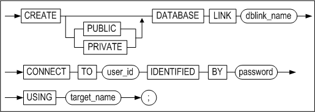
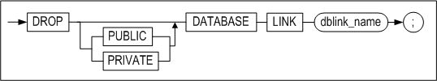
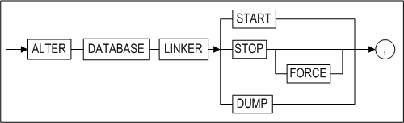

# 4.데이터베이스 링크 사용법

이 장에서는 데이터베이스 링크 제어를 위해 제공되는 SQL구문과 REMOTE 함수와 함께 데이터베이스 링크를 사용하는 방법에 대해 상세히 설명한다.

### CREATE DATABASE LINK

#### 구문

**create_database_link ::=**



#### 전제조건

SYS 사용자 또는 CREATE DATABASE LINK 시스템 권한을 가진 사용자만이 데이터베이스 링크 객체를 생성할 수 있다.

#### 설명

사용자는 CREATE DATABASE LINK 문으로 데이터베이스 링크 객체를 생성할 수 있다. 데이터베이스 링크 객체는 하나의 원격 서버만을 대상으로 한다.

##### PUBLIC\|PRIVATE

생성할 데이터베이스 링크 객체의 PUBLIC\|PRIVATE 속성을 지정한다. PUBLIC으로 지정하면 생성된 데이터베이스 링크 객체를 모든 사용자가 사용할 수 있으며, PRIVATE로 지정하면 데이터베이스 링크 객체를 생성한 사용자와 SYS 사용자만 사용할 수 있다. 지정하지 않을 경우, PUBLIC으로 생성된다.

##### dblink_name

생성할 데이터베이스 링크 객체의 이름을 명시한다. 데이터베이스 링크의 이름은 *SQL Reference* 1장의 "객체 이름 규칙"을 따라야 한다.

##### user_id/password

연결하고자 하는 원격 서버의 데이터베이스 사용자 이름과 암호를 지정한다. 여기에 지정된 사용자는 데이터베이스 링크로 접근하는 원격 서버의 대상 객체에 대한 접근 권한을 가지고 있어야 한다. 그렇지 않을 경우, 권한 관련 오류가 발생할 것이다.

사용자 이름과 암호는 기본적으로 대문자로 저장되므로, 대소문자 구분을 하거나 특수 문자를 사용하기 위해서는 쌍따옴표(")로 묶어서 사용한다.

##### target_name

AltiLinker 프로퍼티 파일에 TARGETS 프로퍼티에 명시한 원격 서버들 중 원하는 서버의 이름을 지정한다.

AltiLinker 프로퍼티 파일에 TARGETS 프로퍼티를 설정하는 자세한 방법은 3장의 "AltiLinker 프로퍼티 파일 설정"을 참조한다.

#### 예제

\<질의 1\> AltiLinker 프로퍼티 파일에 ‘Altibase’로 명시된 원격 데이터베이스 서버에 사용자 이름과 암호 applys/applys로 접속하는 데이터베이스 링크를 생성하려 한다. 생성자 자신만이 사용할 수 있는 link1이라는 이름의 데이터베이스 링크 객체를 생성하라.

```
CREATE PRIVATE DATABASE LINK link1 
CONNECT TO applys IDENTIFIED BY applys 
USING Altibase;
```

\<질의 2\> AltiLinker 프로퍼티 파일에 ‘Altibase’로 명시된 원격 데이터베이스 서버에 사용자 이름과 암호 applys/applys로 접속하는 데이터베이스 링크를 생성하려 한다. 시스템의 모든 사용자가 사용할 수 있는 link2라는 이름의 데이터베이스 링크 객체를 생성하라. 단, 사용자 이름과 암호가 소문자이다.

```
CREATE PUBLIC DATABASE LINK link2 
CONNECT TO "applys" IDENTIFIED by "applys" 
USING Altibase;
또는
CREATE DATABASE LINK link2 
CONNECT TO "applys" IDENTIFIED by "applys" 
USING Altibase;
```

### DROP DATABASE LINK

#### 구문

**drop_database_link ::=**



#### 전제조건

SYS 사용자이거나 DROP DATABASE LINK 시스템 권한을 가진 사용자만이 데이터베이스 링크 객체를 제거할 수 있다.

#### 설명

데이터베이스 링크 객체를 삭제한다.

##### dblink_name

제거할 데이터베이스 링크 객체의 이름을 명시한다.

> #### 주의사항
>
> 제거하고자 하는 데이터베이스 링크 객체가 사용 중이라면, 제거할 수 없다. 제거할 데이터베이스 링크 객체로 수행중인 질의가 없는 상태에서만 데이터베이스 링크 객체 제거가 가능하다. 데이터베이스 링크 객체에 대해 질의 수행 중인 경우에는 오류가 발생할 것이다.

#### 예제

\<질의 1\> dblink1이라는 이름의 PRIVATE 데이터베이스 링크 객체를 제거하라.

```
DROP PRIVATE DATABASE LINK dblink1;
```

\<질의 2\> dblink1이라는 이름의 PUBLIC 데이터베이스 링크 객체를 제거하라.

```
DROP PUBLIC DATABASE LINK dblink1;
또는
DROP DATABASE LINK dblink1;
```

### ALTER DATABASE LINKER

#### 구문

**alter_database_linker ::=**



#### 전제조건

SYS 사용자가 sysdba 관리자 모드로 접속해서 이 구문을 수행할 수 있다.

#### 설명

AltiLiker를 구동하거나 종료한다.

##### START

AltiLinker를 시작한다. 단, 실행 중인 AltiLinker 프로세스가 존재하지 않아야 한다.

##### STOP

AltiLinker를 종료한다. 단, AltiLinker 종료가 성공하려면 데이터베이스 링크를 사용하는 트랜잭션이 없어야 한다. 데이터베이스 링크를 사용하는 트랜잭션이 존재하면, 이 구문 실행은 실패한다.

##### STOP FORCE

데이터베이스 링크를 사용하는 트랜잭션이 존재하더라도, AltiLinker 프로세스를 강제로 종료한다.

##### DUMP

AltiLinker 프로세스 실행 중에 이 구문을 수행하면 AltiLinker프로세스 내의 쓰레드들이 현재 수행하고 있는 작업들이 파일로 출력된다. 출력 파일은 \$ALTIBASE_HOME/trc/altibase_lk_dump.log 로 고정되어 있으며, ALTER DATABASE LINKER DUMP 구문을 수행할 때마다 이 파일을 덮어쓴다.

#### 예제

```
iSQL(sysdba)> ALTER DATABASE LINKER START;
Alter success.
iSQL(sysdba)> ALTER DATABASE LINKER STOP;
Alter success.
iSQL(sysdba)> ALTER SESSION LINKER STOP FORCE;
Alter success.
iSQL(sysdba)> ALTER SESSION LINKER DUMP;
Alter success.
```

### ALTER SESSION

#### 구문

**close_database_link ::=**


#### 전제조건

모든 사용자가 이 구문을 수행할 수 있다.

#### 설명

Altibase 서버에서 AltiLinker로 연결하고 있는 링커 세션을 종료한다.

##### LINK ALL

모든 링커 세션을 종료한다.

##### LINK *dblink_name*

지정한 이름의 데이터베이스 링크 객체에 연결된 링커 세션들만 종료한다.

#### 예제

```
ALTER SESSION CLOSE DATABASE LINK ALL; 
ALTER SESSION CLOSE DATABASE LINK link1;
```

### SELECT

Altibase 데이터베이스 링크를 사용해서 원격 데이터베이스의 객체를 조회(SELECT)하는 방법은 위치 표시자(‘@’)를 사용하거나 pass-through 방식을 사용하는 두 가지가 있다.

Altibase 데이터베이스 링크는 pass-through 스타일의 REMOTE_TABLE 키워드를 사용할 것을 권장하고 있으며, 위치 표시자(‘@’)는 이전 버전과의 호환성을 위해 지원한다.

두 방식 모두 FROM 절에서만 데이터베이스 링크를 사용할 수 있다.

SELECT절에서 사용하는 문자열 표기법에 대한 자세한 설명은 General Reference의 "문자열 표기”를 참조한다.

#### 위치 표시자

위치 표시자 '@'를 사용하는 구문은 이전 버전과의 호환성을 유지하기 위해 지원된다.

위치 표시자를 사용하는 방법은 아래의 예제와 같이 ‘@’ 기호를 사용하여 해당 객체가 원격 서버에 존재하는 객체임을 표시하는 것이다.

```
SELECT * FROM t1@link1;
```

위치 표시자가 포함된 질의는 이전 버전과 마찬가지로 원격 서버에서 테이블의 모든 레코드를 로컬 서버로 가져온다. 따라서, 질의의 성격에 따라 REMOTE_TABLE 키워드를 사용하는 것이 처리 속도를 높일 수 있다.

예를 들어, 아래과 같이 위치 표시자를 사용한 질의는 원격 테이블의 모든 레코드를 로컬 서버로 가져오기 때문에, 네트워크 비용과 로컬 서버의 연산 비용, 그리고 경우에 따라 발생하는 디스크 I/O 비용까지 추가로 수반된다. 그러나, REMOTE_TABLE 키워드를 사용하면, 원격 서버에서 질의를 처리하고 로컬 서버는 결과로 하나의 레코드만 가져오기 때문에, 성능면에서 REMOTE_TABLE 키워드를 사용하는 것이 더 효과적이다.

```
테이블 명: T1
테이블 스키마:
C1 VARCHAR(1024),
C2 VARCHAR(1024),
C3 VARCHAR(1024),
...
C50 INTEGER,
...
C100 VARCHAR(1024),
전체 레코드 수: 1,000,000 (c50 칼럼값이 50 인 레코드는 1건)
```

1.  위치 표시자 사용:

```
SELECT c50, c100 FROM t1@link1 WHERE c50 = 50;
```

2. REMOTE_TABLE 키워드 사용:

```
SELECT * FROM REMOTE_TABLE( link1, 'select c50, c100 from t1 where c50 = 50' );
```

결론적으로, 데이터베이스 링크를 사용하여 동일한 결과를 가져오는 질의의 경우, 위치 표시자보다 REMOTE_TABLE 키워드를 사용할 것을 권장한다.

##### 예제

\<질의 1\> 위치 표시자를 사용해서 link1이 가리키는 원격 서버에 존재하는 t1 테이블 전체를 조회하라.

```
SELECT * FROM t1@link1;
```

\<질의 2\> 위치 표시자를 사용해서 원격 테이블의 a1, a2 칼럼을 조회하라.

```
SELECT a1, a2 FROM ( SELECT * FROM t1@link1 );
```

#### REMOTE_TABLE

pass-through 방식의 REMOTE_TABLE 키워드를 사용해서 원격 서버에서 SELECT 문을 수행할 수 있다.

REMOTE_TABLE 키워드를 사용하여 원격 서버에서 질의를 수행하면, 질의 결과가 메모리 버퍼에 저장된다. 저장된 질의 결과는 질의 처리기에 전달된 후 삭제된다. 만약 JOIN 연산과 같이 삭제된 결과에 반복적으로 접근해야하는 질의가 있다면, 원격 서버에서 질의를 다시 수행해야 한다.

REMOTE_TABLE 키워드를 사용하는 문법은 아래와 같다.

```
REMOTE_TABLE (
    dblink_name     IN VARCHAR,
    statement_text  IN VARCHAR )
```

dblink_name: 데이터베이스 링크 객체의 이름

statement_text: 원격 서버에서 수행할 SELECT 문

##### 예제

\<질의 1\> REMOTE_TABLE 키워드를 사용해서 link1이 가리키는 원격 서버에 존재하는 t1 테이블 전체를 조회하라.

```
SELECT * FROM REMOTE_TABLE( link1, 'select * from t1' );
```

\<질의 2\> REMOTE_TABLE 키워드를 사용해서 원격 테이블의 a1, a2 칼럼을 조회하라.

```
SELECT * FROM REMOTE_TABLE( link1, 'select a1, a2 from t1' );
```

#### REMOTE_TABLE_STORE

Altibase는 REMOTE_TABLE 키워드로 원격에서 질의 수행한 결과를 반복적으로 접근할 필요가 있을 때, 수행 결과를 디스크 임시 테이블에 저장하여 반복적으로 접근할 수 있도록 한다.

#### WHERE 절

데이터베이스 링크를 이용하여 원격 서버에 질의하는 경우에도 지역 서버에서 SELECT 문으로 질의할 때와 같은 방법으로 WHERE 절을 사용할 수 있다.

단, WHERE 절에는 위치 표시자 또는 REMOTE_TABLE 키워드의 사용이 허용되지 않으므로, FROM 절에 별칭(alias)을 명시하여 WHERE 절에서는 이 별칭을 사용하도록 한다.

##### 예제

\<질의 1\> link1이 가리키는 원격 서버의 t1테이블에서 칼럼 a1의 값이 100보다 큰 행을 검색하라.

```
SELECT * FROM REMOTE_TABLE( link1, 'select * from t1 where a1 > 100' );
또는
SELECT * FROM REMOTE_TABLE( link1, 'select * from t1' ) t1_alias
               WHERE t1_alias.a1 > 100;
또는
SELECT * FROM t1@link1 WHERE a1 > 100;
```

\<질의 2\> link1이 가리키는 원격 서버의 emp2 테이블과 지역 서버의 emp1 테이블에 저장된 모든 사원 중, rnd 부서에 근무하는 사원의 이름을 검색하라.

```
SELECT emp_name
FROM ( SELECT emp_no, emp_name FROM emp1
    UNION ALL
    SELECT emp_no, emp_name FROM REMOTE_TABLE( link1, 'select emp_no, emp_name from emp2' ) ) v1,
    dept
WHERE v1.emp_no = dept.emp_no AND dept.dept_name = 'rnd';
또는
SELECT emp_name
FROM ( SELECT emp_no, emp_name FROM emp1
    UNION ALL
    SELECT emp_no, emp_name FROM emp2@link1 ) v1,
    dept
WHERE v1.emp_no = dept.emp_no AND dept.dept_name = 'rnd';
```

#### 그 외의 SELECT 기능

데이터베이스 링크는 SELECT구문에 조인(join), 부질의(subquery), 집합 연산자(set operators), 집계 함수(aggregation functions)의 사용을 지원한다. 또한 DDL 또는 DML구문 내에 부질의 형태로 SELECT 문이 있는 경우, 이 부질의 구문에도 데이터베이스 링크를 사용할 수 있다.

##### 예제

\<질의 1\> link1이 가리키는 원격 서버의 t1테이블의 a1칼럼에서 중복을 제거한 값을 검색하라.

```
SELECT * FROM REMOTE_TABLE( link1, 'select distinct a1 from t1' );
또는  
SELECT DISTINCT a1 FROM t1@link1;
```

\<질의 2\> link1이 가리키는 원격 서버의 t_member 테이블과 t_dept 테이블을 조인하여 전체 사원의 부서를 알아내고, 부서 ID가 0보다 크거나 같은 값을 갖는 부서들을 부서 ID 별로 묶어 각 부서의 사원 수, 평균 나이를 구하라.

```
SELECT t1.dept_id, COUNT(*), AVG(age)
FROM REMOTE_TABLE( link1, 'select * from t_member' ) t1,
   REMOTE_TABLE( link1, 'select * from t_dept' ) t2,
WHERE t1.dept_id = t2.dept_id
GROUP BY t1.dept_id
HAVING t1.dept_id >= 0;
또는
SELECT t1.dept_id, COUNT(*), AVG(age)
FROM t_member@link1 t1,
   t_dept@link1 t2
WHERE t1.dept_id = t2.dept_id
GROUP BY t1.dept_id
HAVING t1.dept_id >= 0;
```

\<질의 3\> link1이 가리키는 원격 서버의 t_member와 t_dept 테이블을 조인하여 전체 사원을 알아내고, 이 사원들 중 나이가 30세보다 작은 사원 중에서 ID가 큰 순으로 세 명의 사원을 뽑아 이름, 나이, 전체 사원의 나이의 합을 구하라.

```
SELECT t1.name, t1.age
    ( SELECT * FROM REMOTE_TABLE( link1, 'select sum(age) from t_member' ) ) sum
FROM REMOTE_TABLE( link1, 'select dept_id, member_id, dept_name, age from t_member where age < 30' ) t1,
   REMOTE_TABLE( link1, 'select dept_id, dept_name, from t_dept' ) t2
WHERE t1.dept_id = t2.dept_id AND t1.age < 30
ORDER BY t1.member_id DESC LIMIT 3;
또는
SELECT t1.name, t1.age
    ( SELECT SUM(age) FROM t_member@link1 ) sum
FROM t_member@link1 t1,
    ( SELECT dept_name, dept_id FROM t_dept@link1 ) t2
WHERE t1.dept_id = t2.dept_id AND t1.age < 30
ORDER BY t1.member_id DESC LIMIT 3;
```

\<질의 4\> link1이 가리키는 원격 서버의 t2 테이블에서 이름과 나이를 가져와서 지역 서버의 t1테이블에 삽입하라.

```
INSERT INTO t1 SELECT * FROM REMOTE_TABLE( link1, 'select name, age from t2' );
또는
INSERT INTO t1 SELECT name, age FROM t2@link1;
```

### REMOTE_EXECUTE_IMMEDIATE

REMOTE_EXECUTE_IMMEDIATE 프로시저는 입력한 SQL문을 데이터베이스 링크를 통해 원격 서버에서 수행한다. SELECT를 제외한 DML문이나 DDL문, DCL문의 수행이 가능하다. 이 프로시저로는 파라미터 마커가 포함된 SQL문을 수행할 수 없다.

#### 구문

```
REMOTE_EXECUTE_IMMEDIATE (
    dblink_name     IN VARCHAR,
    statement_text  IN VARCHAR );
```

#### 파라미터

| 이름             | 입출력 | 데이터 타입 | 설명                          |
|------------------|--------|-------------|-------------------------------|
| *dblink_name*    | IN     | VARCHAR     | 데이터베이스 링크 객체의 이름 |
| *statement_text* | IN     | VARCHAR     | 원격 서버에서 수행할 SQL 구문 |

#### 반환값

프로시저이므로 반환값이 없다.

#### 예제

\<질의 1\> link1이 가리키는 원격 서버에 테이블 remote_t를 생성하고, 레코드를 삽입한 후 테이블을 제거한다.

```
exec REMOTE_EXECUTE_IMMEDIATE( 'link1', 'create table remote_t( c1 integer )' ); 
exec REMOTE_EXECUTE_IMMEDIATE( 'link1', 'insert into remote_t values (10)' ); 
exec REMOTE_EXECUTE_IMMEDIATE( 'link1', 'insert into remote_t values (20)' ); 
exec REMOTE_EXECUTE_IMMEDIATE( 'link1', 'insert into remote_t values (30)' ); 
exec REMOTE_EXECUTE_IMMEDIATE( 'link1', 'drop table remote_t' );
```

### 바인딩 지원 REMOTE 함수

이 절은 파라미터 바인딩을 지원하는 pass-through 방식의 REMOTE 함수를 기술한다.

#### REMOTE_ALLOC_STATEMENT

원격 서버에서 수행할 SQL문을 준비(prepare)한다. 이 함수는 저장 프로시저 또는 저장 함수 내에서만 사용할 수 있다.

##### 구문

```
BIGINT REMOTE_ALLOC_STATEMENT (
    dblink_name     IN VARCHAR,
    statement_text  IN VARCHAR );
```

##### 파라미터

| 이름             | 입출력 | 데이터 타입 | 설명                          |
|------------------|--------|-------------|-------------------------------|
| *dblink_name*    | IN     | VARCHAR     | 데이터베이스 링크 객체의 이름 |
| *statement_text* | IN     | VARCHAR     | 원격 서버에서 수행할 SQL 구문 |

##### 반환값

함수 수행에 성공하면 statement ID가 반환되고, 그렇지 않으면 음의 정수가 반환된다.

##### 예제

\<질의 1\> link1이 가리키는 원격 서버의 t1 테이블에 c1 칼럼의 값이 20인 레코드의 c2 칼럼 값을 구하는 저장 프로시저를 생성하라. 단, c1 칼럼 값의 조건 검색에 파라미터 바인딩을 사용하라.

```
EXEC REMOTE_EXECUTE_IMMEDIATE('link1', 'CREATE TABLE t1(c1 INTEGER, c2 FLOAT(38))');

EXEC REMOTE_EXECUTE_IMMEDIATE('link1', 'INSERT INTO t1 VALUES(20, 30.001)');

CREATE OR REPLACE PROCEDURE proc1()
AS
    statement_id    BIGINT;
    row_cnt         INTEGER;
    result          INTEGER;
    col_value       FLOAT(38);

BEGIN
    statement_id  := REMOTE_ALLOC_STATEMENT('link1', 'SELECT * FROM t1 where c1 = ?');

    result := REMOTE_BIND_VARIABLE( 'link1', statement_id, 1, '20' );

    IF result >= 0 THEN
        result := REMOTE_EXECUTE_STATEMENT('link1', statement_id );

        LOOP
            result := REMOTE_NEXT_ROW( 'link1', statement_id );
            EXIT WHEN result < 0;

            col_value := REMOTE_GET_COLUMN_VALUE_FLOAT( 'link1', statement_id, 2, 38 );
            SYSTEM_.PRINTLN(col_value);
        END LOOP;

        result := REMOTE_FREE_STATEMENT('link1', statement_id);
        IF result < 0 THEN
            SYSTEM_.PRINTLN('Free failed');
        END IF;
    END IF;
END;
/

```

#### REMOTE_BIND_VARIABLE

SQL 구문의 파라미터 마커에 값을 바인딩한다. 이 함수는 저장 프로시저 또는 저장 함수 내에서만 사용할 수 있다.

##### 구문

```
INTEGER REMOTE_BIND_VARIABLE (
    dblink_name        IN VARCHAR,
    statement_id       IN BIGINT,
    parameter_number   IN VARCHAR,
    value              IN VARCHAR );
```

##### 파라미터

| 이름               | 입출력 | 데이터 타입 | 설명                                                        |
|--------------------|--------|-------------|-------------------------------------------------------------|
| *dblink_name*      | IN     | VARCHAR     | 데이터베이스 링크 객체의 이름                               |
| *statement_id*     | IN     | BIGINT      | Statement ID                                                |
| *parameter_number* | IN     | INTEGER     | SQL 구문에서 값을 바인딩할 파라미터의 번호 순서. 1부터 시작 |
| *value*            | IN     | VARCHAR     | 바인딩할 값                                                 |

##### 반환값

음수가 반환되면 실패를 의미하고, 그렇지 않으면 성공을 의미한다.

##### 예제

REMOTE_ALLOC_STATEMENT의 예제를 참고하라.

#### REMOTE_EXECUTE_STATEMENT

준비된 SQL 구문을 원격 서버에서 수행한다. 이 함수는 저장 프로시저 또는 저장 함수 내에서만 사용할 수 있다.

##### 구문

```
INTEGER REMOTE_EXECUTE_STATEMENT (
    dblink_name        IN VARCHAR,
    statement_id       IN BIGINT );
```

##### 파라미터

| 이름           | 입출력 | 데이터 타입 | 설명                          |
|----------------|--------|-------------|-------------------------------|
| *dblink_name*  | IN     | VARCHAR     | 데이터베이스 링크 객체의 이름 |
| *statement_id* | IN     | BIGINT      | 수행할 Statement ID           |

##### 반환값

음수가 반환되면 실패를 의미한다. 음수가 아닌 값이 반환되면 DML문을 수행한 경우에는 영향을 받은 행의 개수를, DDL문이나 SELECT문의 경우에는 성공을 의미한다.

##### 예제

REMOTE_ALLOC_STATEMENT의 예제를 참고하라.

#### REMOTE_FREE_STATEMENT

수행이 완료된 구문을 해제한다. 이 함수는 저장 프로시저 또는 저장 함수 내에서만 사용할 수 있다.

##### 구문

```
INTEGER REMOTE_FREE_STATEMENT (
    dblink_name        IN VARCHAR,
    statement_id       IN BIGINT );
```

##### 파라미터

| 이름           | 입출력 | 데이터 타입 | 설명                          |
|----------------|--------|-------------|-------------------------------|
| *dblink_name*  | IN     | VARCHAR     | 데이터베이스 링크 객체의 이름 |
| *statement_id* | IN     | BIGINT      | Statement ID                  |

##### 반환값

음수가 반환되면 실패를, 음수가 아닌 값이 반환되면 성공을 의미한다.

##### 예제

REMOTE_ALLOC_STATEMENT의 예제를 참고하라.

#### REMOTE_GET_COLUMN_VALUE_CHAR

REMOTE_NEXT_ROW 함수로 행의 위치를 정한 다음, 행을 구성하는 칼럼들 중 CHAR 타입의 칼럼 값을 얻어 오기 위해 사용된다. 이 함수는 저장 프로시저 또는 저장 함수 내에서만 사용할 수 있다.

##### 구문

```
CHAR(char_size) REMOTE_GET_COLUMN_CHAR (
    dblink_name        IN VARCHAR,
    statement_id       IN BIGINT,
    column_number      IN INTEGER,
    char_size          IN INTEGER );
```

##### 파라미터

| 이름            | 입출력 | 데이터 타입 | 설명                               |
|-----------------|--------|-------------|------------------------------------|
| *dblink_name*   | IN     | VARCHAR     | 데이터베이스 링크 객체의 이름      |
| *statement_id*  | IN     | BIGINT      | 수행할 Statement ID                |
| *column_number* | IN     | INTEGER     | 행 내에서 칼럼의 순서. 1부터 시작. |
| *char_size*     | IN     | INTEGER     | 반환받을 CHAR 타입의 크기          |

##### 반환값

지정한 칼럼의 값이 반환된다.

#### REMOTE_GET_COLUMN_VALUE_VARCHAR

REMOTE_NEXT_ROW 함수로 행의 위치를 정한 다음, 행을 구성하는 칼럼들 중 VARCHAR 타입의 칼럼 값을 얻어 오기 위해 사용된다. 이 함수는 저장 프로시저 또는 저장 함수 내에서만 사용할 수 있다.

##### 구문

```
VARCHAR(char_size) REMOTE_GET_COLUMN_VARCHAR (
    dblink_name       IN VARCHAR,
    statement_id      IN BIGINT,
    column_number     IN INTEGER,
    varchar_size      IN INTEGER );
```

##### 파라미터

| 이름            | 입출력 | 데이터 타입 | 설명                               |
|-----------------|--------|-------------|------------------------------------|
| *dblink_name*   | IN     | VARCHAR     | 데이터베이스 링크 객체의 이름      |
| *statement_id*  | IN     | BIGINT      | 수행할 Statement ID                |
| *column_number* | IN     | INTEGER     | 행 내에서 칼럼의 순서. 1부터 시작. |
| *varchar_size*  | IN     | INTEGER     | 반환받을 VARCHAR 타입의 크기       |

##### 반환값

지정한 칼럼의 값이 반환된다.

#### REMOTE_GET_COLUMN_VALUE_FLOAT

REMOTE_NEXT_ROW 함수로 행의 위치를 정한 다음, 행을 구성하는 칼럼들 중 FLOAT 타입의 칼럼 값을 얻어 오기 위해 사용된다. 이 함수는 저장 프로시저 또는 저장 함수 내에서만 사용할 수 있다.

##### 구문

```
FLOAT(precision) REMOTE_GET_COLUMN_FLOAT (
    dblink_name       IN VARCHAR,
    statement_id      IN BIGINT,
    column_number     IN INTEGER,
    precision         IN INTEGER );
```

##### 파라미터

| 이름            | 입출력 | 데이터 타입 | 설명                               |
|-----------------|--------|-------------|------------------------------------|
| *dblink_name*   | IN     | VARCHAR     | 데이터베이스 링크 객체의 이름      |
| *statement_id*  | IN     | BIGINT      | 수행할 Statement ID                |
| *column_number* | IN     | INTEGER     | 행 내에서 칼럼의 순서. 1부터 시작. |
| *precision*     | IN     | INTEGER     | 반환받을 FLOAT 타입의 precision    |

##### 반환값

지정한 칼럼의 값이 반환된다.

##### 예제

REMOTE_ALLOC_STATEMENT의 예제를 참고하라.

#### REMOTE_GET_COLUMN_VALUE_SMALLINT

REMOTE_NEXT_ROW 함수로 행의 위치를 정한 다음, 행을 구성하는 칼럼들 중 SMALLILNT 타입의 칼럼 값을 얻어 오기 위해 사용된다. 이 함수는 저장 프로시저 또는 저장 함수 내에서만 사용할 수 있다.

##### 구문

```
SMALLINT REMOTE_GET_COLUMN_SMALLINT (
    dblink_name       IN VARCHAR,
    statement_id      IN BIGINT,
    column_number     IN INTEGER );
```

##### 파라미터

| 이름            | 입출력 | 데이터 타입 | 설명                               |
|-----------------|--------|-------------|------------------------------------|
| *dblink_name*   | IN     | VARCHAR     | 데이터베이스 링크 객체의 이름      |
| *statement_id*  | IN     | BIGINT      | 수행할 Statement ID                |
| *column_number* | IN     | INTEGER     | 행 내에서 칼럼의 순서. 1부터 시작. |

##### 반환값

지정한 칼럼의 값이 반환된다.

#### REMOTE_GET_COLUMN_VALUE_INTEGER

REMOTE_NEXT_ROW 함수로 행의 위치를 정한 다음, 행을 구성하는 칼럼들 중 INTEGER 타입의 칼럼 값을 얻어 오기 위해 사용된다. 이 함수는 저장 프로시저 또는 저장 함수 내에서만 사용할 수 있다.

##### 구문

```
INTEGER REMOTE_GET_COLUMN_INTEGER (
    dblink_name       IN VARCHAR,
    statement_id      IN BIGINT,
    column_number     IN INTEGER );
```

##### 파라미터

| 이름            | 입출력 | 데이터 타입 | 설명                               |
|-----------------|--------|-------------|------------------------------------|
| *dblink_name*   | IN     | VARCHAR     | 데이터베이스 링크 객체의 이름      |
| *statement_id*  | IN     | BIGINT      | 수행할 Statement ID                |
| *column_number* | IN     | INTEGER     | 행 내에서 칼럼의 순서. 1부터 시작. |

##### 반환값

지정한 칼럼의 값이 반환된다.

#### REMOTE_GET_COLUMN_VALUE_BIGINT

REMOTE_NEXT_ROW 함수로 행의 위치를 정한 다음, 행을 구성하는 칼럼들 중 BIGINT 타입의 칼럼 값을 얻어 오기 위해 사용된다. 이 함수는 저장 프로시저 또는 저장 함수 내에서만 사용할 수 있다.

##### 구문

```
BIGINT REMOTE_GET_COLUMN_BIGINT (
    dblink_name       IN VARCHAR,
    statement_id      IN BIGINT,
    column_number     IN INTEGER );
```

##### 파라미터

| 이름            | 입출력 | 데이터 타입 | 설명                               |
|-----------------|--------|-------------|------------------------------------|
| *dblink_name*   | IN     | VARCHAR     | 데이터베이스 링크 객체의 이름      |
| *statement_id*  | IN     | BIGINT      | 수행할 Statement ID                |
| *column_number* | IN     | INTEGER     | 행 내에서 칼럼의 순서. 1부터 시작. |

##### 반환값

지정한 칼럼의 값이 반환된다.

#### REMOTE_GET_COLUMN_VALUE_REAL

REMOTE_NEXT_ROW 함수로 행의 위치를 정한 다음, 행을 구성하는 칼럼들 중 REAL 타입의 칼럼 값을 얻어 오기 위해 사용된다. 이 함수는 저장 프로시저 또는 저장 함수 내에서만 사용할 수 있다.

##### 구문

```
REAL REMOTE_GET_COLUMN_REAL (
    dblink_name       IN VARCHAR,
    statement_id      IN BIGINT,
    column_number     IN INTEGER );
```

##### 파라미터

| 이름            | 입출력 | 데이터 타입 | 설명                               |
|-----------------|--------|-------------|------------------------------------|
| *dblink_name*   | IN     | VARCHAR     | 데이터베이스 링크 객체의 이름      |
| *statement_id*  | IN     | BIGINT      | 수행할 Statement ID                |
| *column_number* | IN     | INTEGER     | 행 내에서 칼럼의 순서. 1부터 시작. |

##### 반환값

지정한 칼럼의 값이 반환된다.

#### REMOTE_GET_COLUMN_VALUE_DOUBLE

REMOTE_NEXT_ROW 함수로 행의 위치를 정한 다음, 행을 구성하는 칼럼들 중 DOUBLE 타입의 칼럼 값을 얻어 오기 위해 사용된다. 이 함수는 저장 프로시저 또는 저장 함수 내에서만 사용할 수 있다.

##### 구문

```
DOUBLE REMOTE_GET_COLUMN_DOUBLE (
    dblink_name       IN VARCHAR,
    statement_id      IN BIGINT,
    column_number     IN INTEGER );
```

##### 파라미터

| 이름            | 입출력 | 데이터 타입 | 설명                               |
|-----------------|--------|-------------|------------------------------------|
| *dblink_name*   | IN     | VARCHAR     | 데이터베이스 링크 객체의 이름      |
| *statement_id*  | IN     | BIGINT      | 수행할 Statement ID                |
| *column_number* | IN     | INTEGER     | 행 내에서 칼럼의 순서. 1부터 시작. |

##### 반환값

지정한 칼럼의 값이 반환된다.

#### REMOTE_GET_COLUMN_VALUE_DATE

REMOTE_NEXT_ROW 함수로 행의 위치를 정한 다음, 행을 구성하는 칼럼들 중 DATE 타입의 칼럼 값을 얻어 오기 위해 사용된다. 이 함수는 저장 프로시저 또는 저장 함수 내에서만 사용할 수 있다.

##### 구문

```
DATE REMOTE_GET_COLUMN_DATE (
    dblink_name       IN VARCHAR,
    statement_id      IN BIGINT,
    column_number     IN INTEGER );
```

##### 파라미터

| 이름            | 입출력 | 데이터 타입 | 설명                               |
|-----------------|--------|-------------|------------------------------------|
| *dblink_name*   | IN     | VARCHAR     | 데이터베이스 링크 객체의 이름      |
| *statement_id*  | IN     | BIGINT      | 수행할 Statement ID                |
| *column_number* | IN     | INTEGER     | 행 내에서 칼럼의 순서. 1부터 시작. |

##### 반환값

지정한 칼럼의 값이 반환된다.

#### REMOTE_NEXT_ROW

REMOTE_EXECUTE_STATEMENT 함수로 SELECT 문을 수행한 경우, 결과 집합에서 행의 위치를 다음으로 이동한다. 이 함수는 저장 프로시저 또는 저장 함수 내에서만 사용할 수 있다.

##### 구문

```
INTEGER REMOTE_NEXT_ROW (
    dblink_name        IN VARCHAR,
    statement_id       IN BIGINT );
```

##### 파라미터

| 이름           | 입출력 | 데이터 타입 | 설명                          |
|----------------|--------|-------------|-------------------------------|
| *dblink_name*  | IN     | VARCHAR     | 데이터베이스 링크 객체의 이름 |
| *statement_id* | IN     | BIGINT      | 수행할 Statement ID           |

##### 반환값

음수가 반환되면 실패를 의미하고, 그렇지 않으면 성공을 의미한다.

##### 예제

REMOTE_ALLOC_STATEMENT의 예제를 참고하라.

### 일괄처리(Batch) 지원 REMOTE 함수

이 절은 Altibase 데이터베이스 링크가 일괄처리(Batch)할 수 있는 Remote함수와 관련 함수를 기술한다. 이 함수는 저장 프로시저 내에서만 사용할 수 있다. 일괄처리 방법으로 원격서버에 쿼리를 수행할 때는 아래와 같은 순서대로 사용할 것을 권장한다.

1.  REMOTE_ALLOC_STATEMENT_BATCH

2.  REMOTE_BIND_VARIABLE_BATCH

3.  REMOTE_ADD_BATCH

4.  REMOTE_EXECUTE_BATCH

5.  REMOTE_GET_RESULT_COUNT_BATCH

6.  REMOTE_GET_RESULT_BATCH

7.  REMOTE_FREE_STATEMENT_BATCH

#### IS_ARRAY_BOUND

배열 타입의 인자가 바인드 되었는지 확인한다.

##### 구문 

```
BOOLEAN variable: = IS_ARRAY_BOUND ();
```

##### 파라미터

없음

##### 반환값

배열 타입의 인자가 바인드 되면 TRUE를 반환하며, 그렇지 않으면 FALSE를 반환한다.

##### 예제

\<질의\> link1이 가리키는 원격 서버의 t1 테이블에 값을 삽입하는 저장 프로시저를 생성하라. 단, 데이터를 삽입 시 파라미터 바인딩을 사용하라.

```
iSQL> CREATE OR REPLACE PROCEDURE PROC1( A1 IN INTEGER, A2 IN INTEGER )
AS
    result INTEGER;
    i      INTEGER;
    count  INTEGER;
    sum    INTEGER := 0;
BEGIN
    PRINTLN('--- 0 ---');
    IF IS_ARRAY_BOUND() = TRUE THEN

    PRINTLN('--- 1 ---');
    /* First bound */
    IF IS_FIRST_ARRAY_BOUND() = TRUE THEN
    pkg1.stmtID := REMOTE_ALLOC_STATEMENT_BATCH( 'link1', 'insert into t1 values(?, ?)');
    PRINTLN('ALLOC BATCH');
    END IF;

    PRINTLN('--- 2 ---');
    /* Main Task */
    /* INSERT INTO T1 VALUES (A1, A2); */

    result := REMOTE_BIND_VARIABLE_BATCH( 'link1', pkg1.stmtID, 1, A1 );
    result := REMOTE_BIND_VARIABLE_BATCH( 'link1', pkg1.stmtID, 2, A2 );
    result := REMOTE_ADD_BATCH( 'link1', pkg1.stmtID );

    /* Last bound */
    IF IS_LAST_ARRAY_BOUND() = TRUE THEN
    result := REMOTE_EXECUTE_BATCH( 'link1', pkg1.stmtID );

    count := REMOTE_GET_RESULT_COUNT_BATCH( 'link1', pkg1.stmtID );
    FOR i IN 1 .. count LOOP
    result := REMOTE_GET_RESULT_BATCH( 'link1', pkg1.stmtID, i );
    sum := sum + result;
    END LOOP;
    PRINTLN('SUM is' || sum);

    result := REMOTE_FREE_STATEMENT_BATCH( 'link1', pkg1.stmtID );
    PRINTLN('FREE BATCH');
    END IF;
    PRINTLN('--- 3 ---');
    ELSE
    PRINTLN('NORMAL?');
    END IF;
END;
/
```

#### IS_FIRST_ARRAY_BOUND

배열 타입의 변수가 처음 바인드 되었는지 확인한다.

##### 구문 

```
BOOLEAN variable: = IS_FIRST_ARRAY_BOUND ();
```

##### 파라미터

없음

##### 반환값

배열 타입의 변수가 바인드 되었고 최초 수행이면 TRUE를 반환하고, 그렇지 않으면 FALSE를 반환한다.

##### 예제

IS_ARRAY_BOUND의 예제를 참고하라.

#### IS_LAST_ARRAY_BOUND

배열 타입의 변수가 마지막으로 바인드 되었는지 확인한다.

##### 구문 

```
BOOLEAN variable: = IS_LAST_ARRAY_BOUND ();
```

##### 파라미터

없음

##### 반환값

배열 타입의 변수가 바인드 되었고 마지막 수행이면 TRUE를 반환하고, 그렇지 않으면 FALSE를 반환한다.

##### 예제

IS_ARRAY_BOUND의 예제를 참고하라.

#### REMOTE_ADD_BATCH

일괄처리 방식으로 수행할 SQL문을 추가한다.

##### 구문 

```
INTEGER REMOTE_ADD_BATCH (
    dblink_name              IN VARCHAR,
    statement_id             IN BIGINT);
```

##### 파라미터

| 이름         | 입출력 | 데이터 타입 | 설명                          |
|--------------|--------|-------------|-------------------------------|
| dblink_name  | IN     | VARCHAR     | 데이터베이스 링크 객체의 이름 |
| statement_id | IN     | BIGINT      | Statement ID                  |

##### 반환값

음수를 반환하면 실패를 의미하고, 그렇지 않으면 성공을 의미한다.

##### 예제

IS_ARRAY_BOUND 의 예제를 참고하라.

#### REMOTE_ALLOC_STATEMENT_BATCH

일괄처리를 위한 함수이며, SQL문을 수행하기 위해 원격구문id(Statement ID)를 가져오는 함수이다.

##### 구문

```
BIGINT REMOTE_ALLOC_STATEMENT_BATCH (
    dblink_name        IN VARCHAR,
    statement_text     IN VARCHAR);
```

##### 파라미터

| 이름           | 입출력 | 데이터 타입 | 설명                          |
|----------------|--------|-------------|-------------------------------|
| dblink_name    | IN     | VARCHAR     | 데이터베이스 링크 객체의 이름 |
| statement_text | IN     | VARCHAR     | 원격 서버에서 수행할 SQL 구문 |

##### 반환값

성공하면 statement ID를 반환하고, 그렇지 않으면 음수를 반환하다.

##### 예제

IS_ARRAY_BOUND 의 예제를 참고하라.

#### REMOTE_BIND_VARIABLE_BATCH

일괄처리를 위한 함수이며, SQL구문의 파라미터 마커에 값을 바인딩한다.

##### 구문

```
INTEGER REMOTE_BIND_VARIABLE_BATCH (
    dblink_name              IN VARCHAR,
    statement_id             IN BIGINT,
    parameter_number         IN VARCHAR,
    value                    IN VARCHAR);
```

##### 파라미터

| 이름             | 입출력 | 데이터 타입 | 설명                                                         |
|------------------|--------|-------------|--------------------------------------------------------------|
| dblink_name      | IN     | VARCHAR     | 데이터베이스 링크 객체의 이름                                |
| statement_id     | IN     | BIGINT      | Statement ID                                                 |
| parameter_number | IN     | VARCHAR     | SQL 구문에서 값을 바인딩 할 파라미터의 번호 순서. 1부터 시작 |
| Value            | IN     | VARCHAR     | 바인딩 할 값                                                 |

##### 반환값

음수를 반환하면 실패를 의미하고, 그렇지 않으면 성공을 의미한다.

##### 예제

IS_ARRAY_BOUND 의 예제를 참고하라.

#### REMOTE_EXECUTE_BATCH

REMOTE_ALLOC_STATEMENT_BATCH 함수로 얻은 원격구문id(Statement ID)를 이 함수의 인자 값으로 사용하여 SQL문을 원격서버에 일괄처리 방식으로 실제 수행한다.

##### 파라미터

```
INTEGER REMOTE_STATEMENT_BATCH (
    dblink_name              IN VARCHAR,
    statement_id             IN BIGINT );
```

##### 파라미터

| 이름         | 입출력 | 데이터 타입 | 설명                          |
|--------------|--------|-------------|-------------------------------|
| dblink_name  | IN     | VARCHAR     | 데이터베이스 링크 객체의 이름 |
| statement_id | IN     | BIGINT      | Statement ID                  |

##### 반환값

음수를 반환하면 실패를 의미하고, 그렇지 않으면 성공을 의미한다.

##### 예제

IS_ARRAY_BOUND 의 예제를 참고하라.

#### REMOTE_FREE_STATEMENT_BATCH

일괄처리 방식으로 수행한 구문을 해제한다.

##### 구문

```
INTEGER REMOTE_FREE_STATEMENT_BATCH (
    dblink_name              IN VARCHAR,
    statement_id             IN BIGINT );
```

##### 파라미터

| 이름         | 입출력 | 데이터 타입 | 설명                          |
|--------------|--------|-------------|-------------------------------|
| dblink_name  | IN     | VARCHAR     | 데이터베이스 링크 객체의 이름 |
| statement_id | IN     | BIGINT      | Statement ID                  |

##### 반환값

음수를 반환하면 실패를 의미하고, 그렇지 않으면 성공을 의미한다.

##### 예제

IS_ARRAY_BOUND 의 예제를 참고하라.

#### REMOTE_GET_RESULT_COUNT_BATCH

REMOTE_EXECUTE_BATCH함수를 수행한 후에 일괄처리로 수행된 SQL구문의 개수를 확인한다.

##### 구문

```
INTEGER REMOTE_GET_RESULT_COUNT_BATCH (
    dblink_name              IN VARCHAR,
    statement_id             IN BIGINT);
```

##### 파라미터

| 이름         | 입출력 | 데이터 타입 | 설명                          |
|--------------|--------|-------------|-------------------------------|
| dblink_name  | IN     | VARCHAR     | 데이터베이스 링크 객체의 이름 |
| statement_id | IN     | BIGINT      | Statement ID                  |

##### 반환값

음수를 반환하면 실패를 의미하고, 그렇지 않으면 성공을 의미한다.

##### 예제

IS_ARRAY_BOUND 의 예제를 참고하라.

#### REMOTE_GET_RESULT_BATCH 

REMOTE_EXECUTE_BATCH 함수를 수행한 후에 일괄처리로 수행된 SQL구문의 갱신 결과를 확인한다

##### 구문

```
INTEGER REMOTE_GET_RESULT_BATCH (
    dblink_name              IN VARCHAR,
    statement_id             IN BIGINT,
    index                    IN INTEGER);
```

##### 파라미터

| 이름         | 입출력 | 데이터 타입 | 설명                                           |
|--------------|--------|-------------|------------------------------------------------|
| dblink_name  | IN     | VARCHAR     | 데이터베이스 링크 객체의 이름                  |
| statement_id | IN     | BIGINT      | Statement ID                                   |
| index        | IN     | INTEGER     | 일괄처리로 수행된 SQL 구문의 순서번호 (인덱스) |

##### 반환값

음수를 반환하면 실패를 의미하고, 그렇지 않으면 입력 파라미터인 인덱스가 가리키는 SQL 구문의 수행결과(row count)를 반환한다.

##### 예제

IS_ARRAY_BOUND의 예제를 참고하라.

### COMMIT FORCE DATABASE LINK

글로벌 트랜잭션에서 네트워크 장애가 발생하면, 원격 서버의 트랜잭션 커밋이 실패할 수 있다. 이 때 COMMIT FORCE DATABASE LINK 구문을 수행하면, 글로벌 트랜잭션을 커밋 실패로 처리하지 않고 커밋 가능한 서버에만 트랜잭션을 강제로 커밋한다.

DBLINK_GLOBAL_TRANSACTION_LEVEL프로퍼티가 2(Two-Phase Commit)로 설정되어 있을 때 이 구문을 수행하면 COMMIT을 수행한 것과 동일하다.

#### 구문

```
COMMIT FORCE DATABASE LINK;
```

#### 예제

```
iSQL> COMMIT FORCE DATABASE LINK;
```

### ROLLBACK FORCE DATABASE LINK

글로벌 트랜잭션에서 네트워크 장애가 발생하면, 원격 서버의 트랜잭션 롤백이 실패할 수 있다. 이 때 ROLLBACK FORCE DATABASE LINK 구문을 사용하면, 글로벌 트랜잭션 자체를 롤백 실패로 처리하는 대신, 롤백이 가능한 서버만이라도 트랜잭션을 강제로 롤백한다.

DBLINK_GLOBAL_TRANSACTION_LEVEL프로퍼티가 2(Two-Phase Commit)로 설정되어 있을 때 이 구문을 수행하면 ROLLBACK을 수행한 것과 동일하다.

#### 구문

```
ROLLBACK FORCE DATABASE LINK;
```

#### 예제

```
iSQL> ROLLBACk FORCE DATABASE LINK;
```


