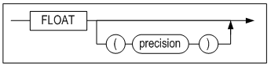
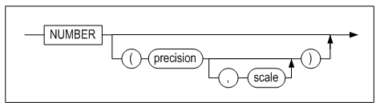

# 1.자료형

SQL을 사용하여 데이터베이스에 데이터를 저장, 변경하고 질의하기 위해서는 데이터베이스의 자료형에 대한 이해가 선행되어야 한다. 이 장에서는 Altibase가 지원하는 데이터형에 대해서 자세히 설명한다.

### 자료형의 개요

#### 데이터형의 종류

Altibase에서 지원하는 데이터형은 다음과 같다.

##### 문자형 데이터형

<table>
    <tr>
    	<td colspan="3"><pre>M : 정의된 칼럼 길이
L : 입력 문자열의 길이</pre>
</td>
    </tr>
    <tr>
    	<th>타 입</th>
        <th>Length</th>
        <th>Size</th>
    </tr>
    <tr>
    	<td>CHAR(M)</td>
        <td>1 ~ 32000</td>
        <td>M + 2</td>
    </tr>
    <tr>
    	<td>VARCHAR(M)</td>
        <td>1 ~ 32000</td>
        <td>length + 2<br>
여기서<br>
입력 값이 가변영역에 저장되면, length = L<br>
입력 값이 고정영역에 저장되면, length = M
</td>
    </tr>
     <tr>
    	<td>NCHAR(M)</td>
        <td>1 ~ 16000(UTF16)<br>
1 ~10666(UTF8)
</td>
        <td>M*2 + 2(UTF16)<br>
M*3 + 2(UTF8)
</td>
    </tr>
     <tr>
    	<td>NVARCHAR(M)</td>
        <td>1 ~ 16000(UTF16)<br>
1 ~ 10666(UTF8)
</td>
        <td>length*2 + 2(UTF16)<br>
length*3 + 2(UTF8)<br>
여기서:<br>
입력 값이 가변영역에 저장되면, length = L<br>
입력 값이 고정영역에 저장되면, length = M
</td>
    </tr>
    </table>


NCHAR와 NVARCHAR는 유니코드 문자형 타입이다. UTF16으로 인코딩된 문자열의 최대 길이는 UTF8로 인코딩된 문자열의 최대 길이와 다르다.

##### 숫자형 데이터형

<table>
    <tr>
        <td rowspan="12">Non-native</td>
        <th>타 입</th>
        <th>Precision</th>
        <th>Scale</th>
        <th>Size (bytes)</th>
        <th>비 고</th>
    </tr>
    <tr>
        <td>NUMERIC</td>
        <td>38</td>
        <td>0</td>
        <td rowspan="8">3+((precision)+2)/2</td>
        <td rowspan="8">*고정 소수점 숫자<br>
*DECIMAL은 NUMERIC과 동일한 데이터 타입이다.</td>
    </tr>
    <tr>
        <td>NUMERIC(p)</td>
        <td>1 ~ 38</td>
        <td>0</td>
    </tr>
    <tr>
        <td>NUMERIC(p,s)</td>
        <td>1 ~ 38</td>
        <td>-84 ~ 128</td>
    </tr>
    <tr>
        <td>DECIMAL</td>
        <td>38</td>
        <td>0</td>
    </tr>
    <tr>
        <td>DECIMAL(p)</td>
        <td>1 ~ 38</td>
        <td>0</td>
    </tr>
    <tr>
        <td>DECIMAL(p,s)</td>
        <td>1 ~ 38</td>
        <td>-84 ~ 128</td>
    </tr>
    <tr>     
        <td>NUMBER(p)</td>
        <td>1 ~ 38</td>
        <td>0</td>
    </tr>
      <tr>     
        <td>NUMBER(p,s)</td>
        <td>1 ~ 38</td>
        <td>-84 ~ 128</td>
    </tr>
    <tr>
    	<td>NUMBER</td>
        <td>38</td>
        <td>X</td>
        <td rowspan="3">3+((precision)+2)/2</td>
        <td rowspan="3">*부동 소수점 숫자</td>
    </tr>
    <tr>
    	<td>FLOAT</td>
        <td>38</td>
        <td>X</td>
    </tr>
    <tr>
    	<td>FLOAT(p)</td>
        <td>1 ~ 38</td>
        <td>X</td>
    </tr>
    <tr>
    	<td rowspan="6">Native</td>
        <th>타입</th>
        <th colspan="2">호환 C Type</th>
        <th>Size(bytes)</th>
        <th>비고</th>
    </tr>
    <tr>
    	<td>DOUBLE</td>
        <td colspan="2">double</td>
        <td>8</td>
        <td rowspan="2">*부동 소수점 숫자</td>
    </tr>
    <tr>
    	<td>REAL</td>
        <td colspan="2">float</td>
        <td>4</td>
    </tr>
    <tr>
    	<td>BIGINT</td>
        <td colspan="2">long<br>
또는 long long
</td>
        <td>8</td>
        <td rowspan="3">*정수형</td>
    </tr>
    <tr>
    	<td>INTEGER</td>
        <td colspan="2">int</td>
        <td>4</td>
    </tr> 
     <tr>
    	<td>SMALLINT</td>
        <td colspan="2">short</td>
        <td>2</td>
    </tr> 
</table>


###### 예제 

예제1. 고정 소수점 숫자 크기 계산 : ( 3 + ( ( p ) + 2 ) / 2 )

```
- NUMERIC  
  NUMERIC(38, 0): 크기 = 3 + 40/2 = 23 bytes

- NUMERIC(p) / NUMERIC(p, 0)  
  NUMERIC(10): 크기 = 3 + 12/2 = 9 bytes

- NUMERIC(p, s)  
  NUMERIC(10, 9): 크기 = 3 + 12/2 = 9 bytes
  
- DECIMAL: NUMERIC과 동일

- DECIMAL(p): NUMERIC(p)과 동일

- DECIMAL(p,s): NUMERIC(p,s)과 동일

- NUMBER(p): NUMERIC(p)과 동일

- NUMBER(p,s): NUMERIC(p,s)과 동일
```

예제2. 부동 소수점 숫자 크기 계산: ( 3 + ( ( p ) + 2 ) / 2 )

```
- FLOAT  
  FLOAT(38): 크기 = 3 + 40/2 = 23 bytes
  
- FLOAT(p)  
  FLOAT(20): 크기 = 3 + 22/2 = 14 bytes
  
- NUMBER: FLOAT과 동일
```

**날짜 데이터형**

| 타 입 | Size (byte) |
| ----- | ----------- |
| DATE  | 8           |

**이진 데이터형**

<table>
    <tr>
        <td colspan="3"><pre>M : 정의된 칼럼 길이
L : 입력 문자열의 길이</pre>
</td>
    </tr>
    <tr>
    	<th>타 입</th>
        <th>Length</th>
        <th>Size</th>
    </tr>
    <tr>
    	<td>BLOB/CLOB</td>
        <td></td>
        <td>1 ~ 4294967295</td>
    </tr>
    <tr>
    	<td>BYTE</td>
        <td>1 ~ 32000</td>
        <td>M + 2</td>
    </tr>
     <tr>
    	<td>NIBBLE</td>
        <td>1 ~ 254</td>
        <td>M/2 + 1</td>
    </tr>
     <tr>
    	<td>BIT</td>
        <td>1 ~ 64000</td>
        <td>M/8 + 4</td>
    </tr>
    <tr>
    	<td>VARBIT</td>
        <td>1 ~ 64000</td>
        <td>length/8 + 4<br>
여기서<br>
입력 값이 가변영역에 저장되면, length = L<br>
입력 값이 고정영역에 저장되면, length = M
</td>
    </tr>
    </table>


**공간 데이터형**

| 타 입    | Length       | Size (byte) |
| -------- | ------------ | ----------- |
| GEOMETRY | 8\~104857600 | length + 40 |

실제 레코드의 크기는 위에 각 데이터형 별로 명시된 크기(bytes)에서 헤더 정보 크기 만큼 추가된다. 헤더 정보는 운영체제에 따라 다를 수 있다.

#### NULL

행을 테이블에 삽입할 때 열의 값을 모르거나 값이 아직 결정되지 않은 경우, 즉 값이 존재 하지 않는 것을 나타내는 경우에 널(NULL)이 사용된다. 널(NULL)은 0 또는 공백과는 다르며, 비교연산이나 저장시 특별하게 취급된다.

NVL() 함수, IS NULL 조건, IS NOT NULL 조건을 제외한 수식 연산에 널이 포함되면, 최종 연산의 결과는 널이 된다. 즉, 수식에 널이 포함되면 비교 또는 연산이 의미가 없어지게 된다.

테이블 생성시 NOT NULL 또는 PRIMARY KEY로 정의되지 않은 모든 데이터 유형의 칼럼에는 널을 입력할 수 있다.

#### 묵시적 데이터 타입 변환 

서로 다른 데이터 타입에 대한 연산을 수행할 때 정확한 연산을 위해 데이터 타입이 변환되어 수행된다. 변환 방법은 묵시적인 방법과 명시적인 방법이 있다.

묵시적 변환이란, 타입이 다른 데이터를 연산할 때에는 내부적으로 데이터 타입을 변환하지만 데이터 타입의 속성은 유지되는 것을 의미한다. 같은 데이터 타입의 두 값을 비교 연산할 때, 어떤 변환 없이 직접 그 값에 대해 비교 연산이 수행된다. 그러나 비교되는 두 값의 데이터 타입이 다른 경우 한 쪽 값을 다른 값의 데이터 타입으로 변환한 후 비교 연산이 수행된다.

다음의 테이블은 묵시적 데이터 타입의 변환 가능한 행렬을 나타낸다 (O: 데이터 타입이 변환되어도 속성이 유지되는 것에 표시). 기존 테이블의 데이터 타입을 MODIFY 구문으로 변환하는 방법은 SQL Reference의 *modify_column_clause* 구문을 참조한다.

| 변환후 변환전 | char | var char | nchar | nvarchar | clob | big int | deci mal | dou ble | float | int eger | num ber | num eric | real | small int | date | blob | byte | varbyte | nibble | bit  | varbit | geometry |
| ------------- | ---- | -------- | ----- | -------- | ---- | ------- | -------- | ------- | ----- | -------- | ------- | -------- | ---- | --------- | ---- | ---- | ---- | ------- | ------ | ---- | ------ | -------- |
| char          | o    | o        | o     | o        |      | o       | o        | o       | o     | o        | o       | o        | o    | o         | o    |      |      |         |        |      |        |          |
| varchar       | o    | o        | o     | o        | o    | o       | o        | o       | o     | o        | o       | o        | o    | o         | o    |      |      |         |        |      |        |          |
| nchar         | o    | o        | o     | o        |      | o       | o        | o       | o     | o        | o       | o        | o    | o         | o    |      |      |         |        |      |        |          |
| nvarchar      | o    | o        | o     | o        | o    | o       | o        | o       | o     | o        | o       | o        | o    | o         | o    |      |      |         |        |      |        |          |
| clob          |      |          |       |          | o    |         |          |         |       |          |         |          |      |           |      |      |      |         |        |      |        |          |
| bigint        | o    | o        | o     | o        |      | o       | o        | o       | o     | o        | o       | o        | o    | o         |      |      |      |         |        |      |        |          |
| decimal       | o    | o        | o     | o        |      | o       | o        | o       | o     | o        | o       | o        | o    | o         |      |      |      |         |        |      |        |          |
| double        | o    | o        | o     | o        |      | o       | o        | o       | o     | o        | o       | o        | o    | o         |      |      |      |         |        |      |        |          |
| float         | o    | o        | o     | o        |      | o       | o        | o       | o     | o        | o       | o        | o    | o         |      |      |      |         |        |      |        |          |
| integer       | o    | o        | o     | o        |      | o       | o        | o       | o     | o        | o       | o        | o    | o         |      |      |      |         |        |      |        |          |
| number        | o    | o        | o     | o        |      | o       | o        | o       | o     | o        | o       | o        | o    | o         |      |      |      |         |        |      |        |          |
| numeric       | o    | o        | o     | o        |      | o       | o        | o       | o     | o        | o       | o        | o    | o         |      |      |      |         |        |      |        |          |
| real          | o    | o        | o     | o        |      | o       | o        | o       | o     | o        | o       | o        | o    | o         |      |      |      |         |        |      |        |          |
| smallint      | o    | o        | o     | o        |      | o       | o        | o       | o     | o        | o       | o        | o    | o         |      |      |      |         |        |      |        |          |
| date          | o    | o        | o     | o        |      |         |          |         |       |          |         |          |      |           | o    |      |      |         |        |      |        |          |
| blob          |      |          |       |          |      |         |          |         |       |          |         |          |      |           |      | o    |      |         |        |      |        |          |
| byte          |      |          |       |          |      |         |          |         |       |          |         |          |      |           |      | o    | o    | o       |        |      |        |          |
| varbyte       |      |          |       |          |      |         |          |         |       |          |         |          |      |           |      | o    | o    | o       |        |      |        |          |
| nibble        |      |          |       |          |      |         |          |         |       |          |         |          |      |           |      |      |      |         | o      |      |        |          |
| bit           |      |          |       |          |      |         |          |         |       |          |         |          |      |           |      |      |      |         |        | o    | o      |          |
| varbit        |      | o        |       |          |      |         |          |         |       |          |         |          |      |           |      |      |      |         |        | o    | o      |          |
| geometry      |      |          |       |          |      |         |          |         |       |          |         |          |      |           |      |      |      |         |        |      |        | o        |

##### 묵시적 데이터 타입 변환 규칙

테이블 t10 테이블에 bit 타입의 '1000'을 입력하면 integer '1000'으로 변환은 성공하지만, 데이터 타입의 속성이 달라지기 때문에 묵시적인 데이터 타입 변환이라고 볼 수 없다.

```
iSQL> create table t10 (i1 integer);
Create success.
iSQL> insert into t10 values (bit'1000');
1 row inserted.
iSQL> select * from t10;
I1
--------------
1000
1 row selected.
```

따라서 묵시적 데이터 타입의 변환은 아래와 같은 규칙을 따른다.

- 숫자형 데이터 타입과 문자형 데이터 타입의 비교 연산 또는 사칙 연산시, 문자형 데이터 타입을 숫자형 데이터 타입으로 변환하여 수행한다.
- 날짜형 데이터 타입과 문자형 데이터 타입의 비교 연산시, 문자형 데이터 타입을 날짜형 데이터 타입으로 변환하여 비교 연산을 수행한다.
- 데이터 타입의 변환이 불가능한 연산은 무효화 된다.
- 함수에서 사용되는 인자는 함수에서 정의된 인자의 데이터 타입으로 변환한다.
- 문자형 데이터 타입이나 십진 정밀도(decimal precision)를 사용하는 수치형 데이터 타입을 이진 정밀도(binary precision)를 사용하는 부동소수점 수치형 데이터 타입으로 변환하면 값이 손실될 수 있다.
- INSERT, UPDATE 실행시 INSERT, UPDATE 되는 칼럼의 데이터 타입으로 데이터형이 변환된다.

##### 예제

\<질의\> 숫자형 데이터 타입과 문자형 데이터 타입의 비교 연산시 문자형 데이터 타입 '10'은 숫자형 데이터로 변환된다.

```
iSQL> create table emp (empno integer, name varchar(10), hire_date date);
insert into emp values (10,'altibase', '10-nov-2015');

iSQL> select name from emp where empno = '10';
NAME
--------------
altibase
1 row selected.
```

\<질의\> 숫자형 데이터 타입과 문자형 데이터 타입 간 사칙연산시 문자형 데이터 타입 '10'은 숫자형 데이터 타입으로 변환된다.

```
iSQL> select empno + '10' from emp;
EMPNO+'10'
-------------------------
20
1 row selected.
```

\<질의\> 날짜형 데이터 타입과 문자형 데이터 타입의 비교 연산시 문자형 데이터 타입 '10-nov-2015'은 날짜형 데이터 타입으로 변환된다.

```
iSQL> select hire_date from emp where hire_date = '10-nov-2015';
HIRE_DATE
---------------
10-NOV-2015
1 row selected.
```

\<질의\> 숫자형 데이터 타입과 문자형 데이터 타입 간 사칙연산시 이진 데이터 타입은 숫자형 데이터 타입으로 변환할 수 없어 연산이 무효화된다.

```
iSQL> select empno + cast(12345 as nibble(6)) from emp;
[ERR-2100C : Conversion not applicable.
0001 : select EMPNO + CAST(12345 as NIBBLE(6)) from EMP
             ^                               ^
]
```

\<질의\> 함수 SUM에 문자형 데이터 타입 '10'을 인자로 받는 경우 숫자형 데이터로 변환된다.

```
iSQL> select sum('10') from dual;
SUM('10')
--------------
10
1 row selected.
```

\<질의\> 문자형 데이터 타입 '12.123456789'을 부동소수점 숫자형 데이터 타입인 float으로 변환하면, 유효 자릿수는 float(11)로 되어 값의 손실이 발생한다.

```
iSQL> select float'12.123456789' from dual;
FLOAT'12.123456789'
----------------------
12.1234568
1 row selected.
```

\<질의\> INSERT 되는 숫자형 데이터의 값은 INSERT 되는 칼럼의 데이터 유형에 맞게 변환되어 값이 INSERT 된다.

```
iSQL>  create table t1 ( i1 char(10), i2 integer, i3 double);
Create success.
iSQL>  insert into t1 values (integer'1020', char'1928', float'123.1234');
1 row inserted.
iSQL>     select * from t1;
I1          I2          I3
---------------------------------------------------
1020        1928        123.1234
1 row selected.
```

#### 명시적 데이터 타입 변환

명시적 데이터 타입 변환은 SQL 변환 함수 또는 아래와 같이 타입 캐스팅을 사용해서 명시적으로 수행될 수 있다. 데이터 타입을 변환하는 SQL 함수는 SQL Reference에서 설명한다.

##### 구문

```
datatype '문자 또는 상수 literal '
```

##### 예제

어떤 데이터 타입의 상수 데이터를 명시적으로 다른 데이터 타입으로 변환한다. 다음은 157.27의 숫자 값을 '157.27'의 문자열로 변환하는 예제이다.

```
CHAR '157.27'
```

#### 문자열 표기

SQL쿼리에서 문자열을 표기할 시에는 홀 따옴표(‘)로 문자열을 묶어서 사용한다. 홀 따옴표를 문자열로 표기할 시에는 홀 따옴표가 escape문자가 되므로 앞에 홀 따옴표를 붙여줘야 한다.

##### 예제

```
SELECT * FROM EMPLOYEE WHERE NAME = ’KIM’;
INSERT INTO EMPLOYEE VALUES (‘GILDONG’’’);//GILDONG’ 값을 삽입
SELECT * FROM REMOTE_TABLE(link1, ‘SELECT * FROM EMPLOYEE WHERE NAME=‘’KIM‘’’; //''는 쌍 따옴표가 아니라 홀 따옴표 두 개임
```

#### FIXED/VARIABLE 옵션

FIXED와 VARIABLE은 칼럼의 데이터가 어느 영역에 저장될 지를 지정하는 키워드이다.

한 레코드 전체가 연속된 공간에 저장될 때, 이 공간을 고정(FIXED) 영역이라고 한다. 칼럼들 중의 하나가 그 레코드의 나머지 연속된 고정 영역이 아닌 다른 분리된 공간에 저장될 때, 이 칼럼은 가변(VARIABLE) 영역에 저장된다고 말한다.

한 칼럼이 가변 영역에 저장될 때, 데이터 길이와 실제 데이터가 저장된 위치를 가리키는 포인터 같은 그 칼럼의 헤더 정보는 고정 영역에 저장된다. 반면 칼럼의 데이터는 가변 영역에 저장된다.

디스크 테이블스페이스에 테이블 생성시, 사용자가 FIXED 또는 VARIABLE을 지정하더라도 이는 무시되고 테이블의 모든 칼럼은 FIXED로 처리된다. 그러나 메모리 테이블스페이스에 테이블을 생성할 때는 사용자가 명시한 옵션이 그대로 사용된다.

그러나, 모든 LOB 데이터 타입 칼럼의 데이터는 항상 VARIABLE로 처리되고, 그 데이터는 IN ROW 절에 지정된 값에 따라서 고정 또는 가변 영역에 저장될 수 있다.

다음의 데이터 타입에 대해 VARIABLE을 지정할 수 있다.  
: CHAR, VARCHAR, NCHAR, NVARCHAR, BYTE, VARBATE, NIBBLE, BIT, VARBIT, BLOB, 및 CLOB

#### IN ROW 절

이 절은 가변 영역에 저장되는 칼럼 데이터에만 관련이 있다. 테이블 생성시 FIXED와 IN ROW 절이 모두 명시되면, IN ROW 절은 무시된다. VARIABLE로 지정된 칼럼에 데이터가 입력될 때, 데이터의 길이가 IN ROW 절에 명시된 값 이하이면 데이터는 고정 영역에 저장될 것이다. 반면 데이터의 길이가 IN ROW 절에 명시된 값보다 크면, 데이터는 가변 영역에 저장될 것이다.

여기서 “데이터의 길이”는 입력된 데이터의 길이가 아니고, 메모리 또는 디스크에 실제로 저장될 데이터의 길이를 의미하는데, 이는 입력 데이터의 길이보다 다소 크다. 예를 들어, 칼럼이 ‘VARCHAR(400) IN ROW 200’으로 정의 되었다면, 입력 데이터의 길이가 198 (데이터 저장시 2바이트가 추가로 더 필요하다) 이하일 때 데이터는 고정 영역에 저장될 것이다.

고정 영역에 저장되는 LOB 데이터의 기본 크기는 메모리 테이블을 위한 MEMORY_LOB_COLUMN_IN_ROW_SIZE 프로퍼티와 디스크 테이블을 위한 DISK_LOB_COLUMN_IN_ROW_SIZE 프로퍼티를 사용해서 지정할 수 있다. 또한, VARIABLE 옵션이 지정된 다른 데이터 타입의 칼럼을 위한 기본 크기는 MEMORY_VARIABLE_COLUMN_IN_ROW_SIZE 프로퍼티를 사용해서 명시할 수 있다. 이들 프로퍼티를 지정하면 테이블 생성시 각 칼럼에 반복적으로 IN ROW 절을 사용할 필요가 없다.

이들 프로퍼티에 대한 상세한 설명은 2장을 참고하기 바란다.

### 문자형 데이터 타입

문자 데이터 타입은 데이터베이스 문자 집합 또는 국가 문자 집합의 문자 데이터를 저장하는데 사용된다.

Altibase는 아래의 타입을 지원한다.

- CHAR
- VARCHAR
- NCHAR
- NVARCHAR

#### CHAR

##### 흐름도


**variable_clause::=**


**in_row_clause::=**


##### 구문

```
CHAR [(size)] [ FIXED | VARIABLE [IN ROW size] ]
```

##### 설명

명시된 크기(size)만큼 고정 길이를 가지는 문자형 데이터 타입이다. 명시된 전체 크기에 비해 입력 값의 길이가 작을 경우 뒷부분은 공백으로 채워진다.

CHAR 칼럼의 기본 크기는 1 바이트이며 최대 길이는 32000바이트이다.

FIXED 와 VARIABLE 절에 대한 자세한 설명은 앞서 기술한 "FIXED/VARIABLE 옵션"과 "IN ROW 절"을 참고한다.

#### VARCHAR

##### 흐름도


**variable_clause::=**


**in_row_clause::=**


##### 구문

```
VARCHAR [(size)] [ FIXED | VARIABLE [IN ROW size] ]
```

##### 설명

명시된 크기 내에서 가변 길이를 가지는 문자형 데이터 타입이다.

VARCHAR 칼럼의 기본 크기는 1 바이트이며 최대 길이는 32000바이트이다.

VARCHAR는 가변 길이 데이터 타입이다. 즉, 입력 데이터의 길이가 정의된 칼럼의 크기보다 작을 경우, 실제로 입력된 데이터만 저장된다. 반면, CHAR 데이터 타입의 경우 입력 데이터의 길이가 칼럼 크기보다 작으면 그 칼럼의 남는 공간은 공백으로 채워진다. 예를 들어, CHAR(10)으로 정의된 칼럼에 단어 "magic"이 입력되면, 이 데이터는 "magic_____"으로 저장될 것이다. 여기서 "_"은 공백을 나타낸다.

FIXED 와 VARIABLE 절에 대한 자세한 설명은 앞서 기술한 "FIXED/VARIABLE 옵션"과 "IN ROW 절"을 참고한다.

#### NCHAR

##### 흐름도


**variable_clause::=**


**in_row_clause::=**


##### 구문

```
NCHAR [(size)] [ FIXED | VARIABLE [IN ROW size] ]
```

##### 설명

명시된 길이만큼 고정 길이를 가지는 문자형 데이터 타입이다. 정의된 칼럼 크기에 비해 입력 값의 길이가 작을 경우, 남는 공간은 공백으로 채워진다.

NCHAR 칼럼의 문자 하나당 크기는 국가 문자 집합(national character set)이 UTF16인 경우에는 고정길이 2바이트이고(가변길이 없음), UTF8인 경우에는 가변길이 3바이트(고정길이 없음)이다. UFT16은 한 문자에 대해 고정 2바이트를 사용하는 반면, UTF8은 1\~3바이트까지 가변으로 사용하기 때문이다.

국가 문자 집합이 UTF16이면 최대 크기는 16000 bytes이다.

FIXED 와 VARIABLE 절에 대한 자세한 설명은 앞서 기술한 "FIXED/VARIABLE 옵션"과 "IN ROW 절"을 참고한다.

#### NVARCHAR

##### 흐름도


**variable_clause::=**


**in_row_clause::=**


##### 구문

```
NVARCHAR [(size)] [ FIXED | VARIABLE [IN ROW size] ]
```

##### 설명

명시된 길이 내에서 가변 길이를 가지는 유니코드 문자형 데이터 타입이다.

NVARCHAR 칼럼의 문자 하나당 크기는 국가 문자 집합(national character set)이 UTF16인 경우에는 고정길이 2바이트이고(가변길이 없음), UTF8인 경우에는 가변길이 3바이트(고정길이 없음)이다. UFT16은 한 문자에 대해 고정 2바이트를 사용하는 반면, UTF8은 1\~3바이트까지 가변으로 사용하기 때문이다.

나머지 속성은 VARCHAR와 동일하므로, 더 상세한 설명은 VARCHAR 타입을 참조한다.

FIXED 와 VARIABLE 절에 대한 자세한 설명은 앞서 기술한 "FIXED/VARIABLE 옵션"과 "IN ROW 절"을 참고한다.

### 숫자형 데이터 타입

Altibase는 다음의 숫자형 데이터 타입을 지원한다.

- BIGINT
- DECIMAL
- DOUBLE
- FLOAT
- INTEGER
- NUMBER
- NUMERIC
- REAL
- SMALLINT

#### BIGINT

##### 흐름도


##### 구문

```
BIGINT
```

##### 설명

8 바이트 정수형 데이터 타입이다.

C언어의 long(64 bit 시스템에서) 또는 long long(32 bit 시스템에서)과 동일하다.

범위: -2<sup>63</sup> + 1(-9223372036854775807) \~ 2<sup>63</sup> – 1(9223372036854775807)

#### DECIMAL

##### 흐름도


##### 구문

```
DECIMAL [(precision[, scale])]
```

##### 설명

DECIMAL은 NUMERIC 데이터 타입과 동일하다.

#### DOUBLE

##### 흐름도


##### 구문

```
DOUBLE
```

##### 설명

8 바이트 부동 소수점 숫자형 데이터 타입이다.

C언어의 double과 동일한 데이터 타입이다.

#### FLOAT

##### 흐름도



##### 구문

```
FLOAT [(precision)]
```

##### 설명

\-1E-120에서 1E+120까지 내의 부동 소수점 숫자 데이터 타입이다.

*Precision*은 정밀도 표시하기 위해 부동 소수점 숫자의 가수를 유효숫자 표기법으로 저장하는 데 사용되는 유효숫자의 자릿수이다.

*Precision*의 범위는 1에서 38까지이며, 39번째 자릿수에서 값이 반올림된다. *Precision*이 생략되면 기본값으로 38이 설정된다.

#### INTEGER

##### 흐름도


##### 구문

```
INTEGER
```

##### 설명

4 바이트 크기의 정수형 데이터 타입이다.

C언어의 int와 동일한 데이터 타입이다.

\-2,147,483,647에서 2,147,483,647까지의 정수값을 가질 수 있다.

#### NUMBER

##### 흐름도



##### 구문

```
NUMBER [(precision, scale)]
```

##### 설명

NUMERIC 데이터 타입의 alias이다. 단, *precision*과 *scale*이 명시되지 않으면 FLOAT데이터 타입과 동일하게 취급된다. FLOAT 데이터 타입은 39번째 자릿수에서 값이 반올림된다.

#### NUMERIC

##### 흐름도


##### 구문

```
NUMERIC [(precision, scale)]
```

##### 설명

NUMERIC은 Precision과 scale을 가지는 숫자형 데이터 타입으로 precision 만큼의 유효 숫자와 scale 만큼의 소수점 이하 정밀도를 가지는 고정 소수점형이다. FLOAT 데이터 타입이 실수를 표현하는 형식인 부동 소수점 형식인 반면 NUMERIC 데이터 타입은 precision과 scale이 모두 생략되면 precision은 38, scale은 0인 정수를 표현하는 고정 소수점형으로 사용된다.

- Precision은 1부터 38까지의 값을 명시할 수 있다.
- Scale은 -84에서 128까지의 값을 명시할 수 있다.
- Precision이 생략되면 기본값으로 38이 설정된다.
- Scale이 생략되면 기본값으로 0이 설정된다.

다음은 각각 정의된 NUMERIC 타입의 칼럼에 입력 값이 1234567.89일때의 변환된 값을 보여준다.

- NUMERIC =\> 1234568
- NUMERIC(9) =\> 1234568
- NUMERIC(9, 2) =\> 1234567.89
- NUMERIC(9, 1) =\> 1234567.9
- NUMERIC(6) =\> precision 초과
- NUMERIC(7, -2) =\> 1234500
- NUMERIC(7, 2) =\> precision 초과

#### REAL

##### 흐름도


##### 구문

```
REAL
```

##### 설명

4 바이트 크기의 부동 소수점형이다.

C언어의 float과 동일한 데이터 타입이다.

#### SMALLINT

##### 흐름도


##### 구문

```
SMALLINT
```

##### 설명

2 바이트 크기의 정수형 데이터 타입이다.

C언어의 short와 동일한 데이터 타입이다.

\-2<sup>15</sup> + 1(-32,767)에서 2<sup>15</sup> - 1(32,767) 까지의 정수값을 가질 수 있다.

#### 숫자형 데이터 형식

TO_CHAR 나 TO_NUMBER 등의 타입 변환 함수를 사용할 때 숫자형 데이터에 대하여 다음과 같이 형식을 지정할 수 있다. 숫자 데이터 형식은 하나 이상의 숫자를 표시하는 요소로 구성된다. 이장에서는 각각의 요소와 관련된 데이터 형식의 예를 설명한다.

##### , (쉼표)

###### 설명

지정한 위치에 쉼표를 출력한다. 쉼표는 여러 번 사용할 수 있다.

###### 제한사항

쉼표는 숫자의 끝, 마침표의 오른쪽, 또는 숫자의 맨 앞자리에 올 수 없다.

###### 예제

```
iSQL> SELECT TO_CHAR (1234, '99,99') FROM dual;
TO_CHAR (1234, '99,99')  
---------------------------
 12,34           
1 row selected.

iSQL> SELECT TO_NUMBER ( '12,34', '99,99') FROM dual;
TO_NUMBER ( '12,34', '99,99') 
--------------------------------
1234        
1 row selected.
```

##### . (마침표)

###### 설명

지정한 위치에 마침표를 추가로 반환한다.

###### 제한사항

한 숫자 내에서 마침표는 한번만 사용할 수 있다.

###### 예제

```
iSQL> SELECT TO_CHAR (1.234, '99.999') FROM dual;
TO_CHAR (1.234, '99.999')  
-----------------------------
  1.234          
1 row selected.

iSQL> SELECT TO_NUMBER ( '1.234', '99.999') FROM dual;
TO_NUMBER ( '1.234', '99.999') 
---------------------------------
1.234       
1 row selected.
```

##### \$

###### 설명

숫자 앞에 \$ 기호를 붙인다.

###### 예제

```
iSQL> SELECT TO_CHAR (123, '$9999') FROM dual;
TO_CHAR (123, '$9999')  
--------------------------
  $123           
1 row selected.

iSQL> SELECT TO_NUMBER ( '$0123', '09$99') FROM dual;
TO_NUMBER ( '$0123', '09$99') 
--------------------------------
123         
1 row selected.
```

##### 0(숫자 0)

###### 설명

정수 부분의 유효 자리수가 실제 숫자의 자리수 보다 많을 경우 실제 숫자 앞에 0을 채워서 반환한다. 그 외의 특성은 9와 같다.

###### 예제

```
iSQL> SELECT TO_CHAR (123, '0999') FROM dual;
TO_CHAR (123, '0999')  
-------------------------
 0123
```

##### 9(숫자 9)

###### 설명

출력할 숫자의 자릿수를 숫자 9를 이용해서 표시한다. 실제 숫자의 자릿수 보다 9의 개수가 더 많으면 앞에 공백문자를 출력하여 길이를 맞추고, 정수 부분의 9의 개수가 실제 숫자보다 더 적으면 숫자의 길이만큼 \#를 출력한다. \#의 개수는 사용자가 지정한 형식에 쓰인 문자의 개수 + 1(부호문자)이다.

9사이에 오는 마침표는 숫자의 정수 부분과 소수 부분을 구분하여 출력하게 한다.

첫 번째 인자에 소수가 있는데 사용자가 지정한 형식에 소수를 표현하는 부분이 없거나, 더 적으면 반올림해서 사용자가 지정한 형식의 소수 부분의 길이에 맞춘다.

###### 예제

```
iSQL> SELECT TO_CHAR (123, '99999') FROM dual;
TO_CHAR (123, '99999')  
--------------------------
   123

iSQL> SELECT TO_CHAR (123.55, '999') FROM dual;
TO_CHAR (123.55, '999')  
---------------------------
 124             
1 row selected.

iSQL> SELECT TO_CHAR (123.4567, '999999') FROM dual;
TO_CHAR (123.4567, '999999')  
--------------------------------
    123          
1 row selected.

iSQL> SELECT TO_CHAR (1234.578, '9999.99') FROM dual;
TO_CHAR (1234.578, '9999.99')  
---------------------------------
 1234.58         
1 row selected.

iSQL> SELECT TO_CHAR (1234.578, '999.99999') FROM dual;
TO_CHAR (1234.578, '999.99999')  
-----------------------------------
##########       
1 row selected.

iSQL> SELECT TO_NUMBER ( '123', '99999') FROM dual;
TO_NUMBER ( '123', '99999') 
------------------------------
123         
1 row selected.
iSQL> SELECT TO_NUMBER ( '1234.58', '9999.99') FROM dual;
TO_NUMBER ( '1234.58', '9999.99') 
------------------------------------
1234.58     
1 row selected.
```
##### FM

###### 설명

출력 문자열의 왼쪽 부분의 공백이나 0을 제거한다.

###### 예제

```
iSQL> select to_char(00123.100,'99999.999') from dual;
TO_CHAR(00123.100,'99999.999')
----------------------------------
   123.100
1 row selected.
iSQL> select to_char(00123.100,'FM99999.999') from dual;
TO_CHAR(00123.100,'FM99999.999')
------------------------------------
123.100
1 row selected.
```

##### B

###### 설명

결괏값이 0일 경우, 0을 공백(Blank)으로 반환한다.

###### 예제

```
iSQL> SELECT TO_CHAR (0.4, 'B9') FROM T1;
TO_CHAR (0.4, 'B9')  
-----------------------
                 
1 row selected.
```

##### C

###### 설명

ISO 통화 기호(NLS_ISO_CURRENCY 프로퍼티에 설정된 값)를 지정한 위치에 반환한다.

###### 예제

```
iSQL> SELECT TO_CHAR (4000, 'C9999') FROM dual;
TO_CHAR (4000, 'C9999')
---------------------------
 KRW4000
1 row selected.
```

##### D

###### 설명

소수점 문자(NLS_NUMERIC_CHARACTER 프로퍼티에 설정된 값)를 지정한 위치에 반환한다. 기본값은 마침표(.)이다.

###### 제한사항

숫자 형식을 명시할 때 한 개의 소수점 문자만 포함할 수 있다.

###### 예제

```
iSQL> SELECT TO_CHAR (24.06, '99D99') FROM dual;
TO_CHAR (24.06, '99D99')
----------------------------
 24.06
1 row selected.
iSQL> SELECT TO_CHAR (206, '999D99') FROM dual;
TO_CHAR (206, '999D99')
---------------------------
 206.00
1 row selected.
```

##### EEEE

###### 설명

입력 받은 숫자를 지수 표기법을 이용하여 표기한다.

###### 제한사항

EEEE는 항상 오른쪽 끝에 와야 한다. 단 S, PR, MI보다는 왼쪽에 오는 것이 가능하다. 쉼표와 같이 사용할 수 없다.  TO_NUMBER 함수에서 사용할 수 없다.

###### 예제

```
iSQL> SELECT TO_CHAR (1234, '9.9EEEE') FROM dual;
TO_CHAR (1234, '9.9EEEE')  
-----------------------------
  1.2E+03        
1 row selected.
```

##### G

###### 설명

그룹 구분자(NLS_NUMERIC_CHARACTER 프로퍼티에 설정된 값)를 지정한 위치에 반환한다. 하나의 숫자형 데이터 형식에 그룹 구분자를 여러 번 지정할 수 있다.

###### 제약사항

그룹 구분자는 하나의 숫자형 데이터 형식에서 소수점 문자 또는 마침표의 오른쪽에 올 수 없다.

###### 예제

```
iSQL> SELECT TO_CHAR (2534.3, '999G999D99') FROM dual;
TO_CHAR (2534.3, '999G999D99')
----------------------------------
   2,534.30
1 row selected.
```

##### L

###### 설명

지역 통화 기호(NLS_CURRENCY 프로퍼티에 설정된 값)를 지정한 위치에 반환한다.

###### 예제

```
iSQL> SELECT TO_CHAR (4000, 'L9999') FROM dual;
TO_CHAR (4000, 'L9999')
---------------------------
 ?4000
1 row selected.
```

##### MI

###### 설명

MI를 숫자 표현 형식의 오른쪽 끝에 사용하면 입력 받은 수가 음수일 경우 마이너스(-) 기호를 숫자 끝에 붙여서 반환한다. 양수일 경우에는 공백문자가 들어간다.

###### 제한사항

MI는 항상 숫자 형식 표현의 오른쪽 끝에 와야 한다. S, PR과 같이 사용할 수 없다.

###### 예제

```
iSQL> SELECT TO_CHAR (-123, '999MI') FROM dual;
TO_CHAR (-123, '999MI')  
---------------------------
123-             
1 row selected.

iSQL> SELECT TO_NUMBER ( '123-', '999MI') FROM dual;
TO_NUMBER ( '123-', '999MI') 
-------------------------------
-123        
1 row selected.
```

##### PR

###### 설명

PR를 숫자 표현 형식의 오른쪽 끝에 사용하면 입력 받은 수가 음수일 경우 마이너스 기호(-) 대신 \<숫자\> 형태로 출력된다.

###### 제한사항

PR은 항상 숫자 표현 형식의 오른쪽 끝에 와야 한다. S, MI와 같이 사용할 수 없다.

###### 예제

```
iSQL> SELECT TO_CHAR (-123, '999PR') FROM dual;
TO_CHAR (-123, '999PR')  
---------------------------
<123>            
1 row selected.

iSQL> SELECT TO_NUMBER ( '<123>', '999PR') FROM dual;
TO_NUMBER ( '<123>', '999PR') 
--------------------------------
-123        
1 row selected.
```

##### RN

###### 설명

입력 받은 수를 로마 숫자로 변환한다. 입력할 수 있는 수는 1부터 3999까지이다. 숫자 표현 형식을 소문자 rn으로 사용하면 로마 숫자가 소문자로 출력된다.

###### 제한사항

다른 숫자 형식과 같이 사용할 수 없다. TO_NUMBER 함수에서 사용할 수 없다.

###### 예제

```
iSQL> SELECT TO_CHAR (14, 'RN') FROM dual;
TO_CHAR (14, 'RN')  
----------------------
XIV              
1 row selected.
```

##### S

###### 설명

숫자 표현 형식의 처음이나 끝에 와서 입력 받은 수의 기호에 따라서 마이너스(-) 또는 플러스(+) 기호를 붙인다.

###### 제한사항

S는 숫자 표현 형식의 맨 앞이나 맨 뒤에만 올 수 있다. MI, PR과 같이 사용할 수
없다.

###### 예제

```
iSQL> SELECT TO_CHAR (123, 'S999.99') FROM dual;
TO_CHAR (123, 'S999.99')  
----------------------------
+123.00          
1 row selected.

iSQL> SELECT TO_CHAR (-123, '999.99S') FROM dual;
TO_CHAR (-123, '999.99S')  
-----------------------------
123.00-          
1 row selected.

iSQL> SELECT TO_NUMBER ( '+123', 'S999.99') FROM dual;
TO_NUMBER ( '+123', 'S999.99') 
---------------------------------
123         
1 row selected.

iSQL> SELECT TO_NUMBER ( '123.00-', '999.99S') FROM dual;
TO_NUMBER ( '123.00-', '999.99S') 
------------------------------------
-123        
1 row selected.
```

##### V

###### 설명

V 다음에 있는 9의 개수와 10을 곱하고 그 값을 인자로 받은 숫자와 곱한다. V 앞의 9의 개수는 첫 번째 인자의 유효숫자의 개수를 의미한다.

###### 제한사항

마침표와 같이 사용할 수 없다. TO_NUMBER 함수에서 사용할 수 없다.

###### 예제

```
iSQL> SELECT TO_CHAR (12, '99V99') FROM dual;
TO_CHAR (12, '99V99')  
-------------------------
 1200            
1 row selected.

iSQL> SELECT TO_CHAR (1200, '99V99') FROM dual;
TO_CHAR (1200, '99V99')  
---------------------------
######           
1 row selected.

iSQL> SELECT TO_CHAR (-123.456, '999V999EEEEMI') from dual;
TO_CHAR (-123.456, '999V999EEEEMI')  
---------------------------------------
 1235E+02-        
1 row selected.
```

##### XXXX

###### 설명

입력 받은 수를 16진수로 변환한다. 만약 정수가 아니라면 반올림하여 16진수로 변환한다. xxxx는 16진수 중 문자를 소문자로 반환한다.

###### 제한사항

다른 숫자 표현 형식과 같이 사용할 수 없다. 변환할 수는 0 이상이어야 한다.

###### 예제

```
iSQL> SELECT TO_CHAR (123, 'XXXX') FROM dual;
TO_CHAR (123, 'XXXX')  
-------------------------
7B               
1 row selected.

iSQL> SELECT TO_NUMBER ('ABC', 'XXXX') FROM dual;
TO_NUMBER ('ABC', 'XXXX') 
----------------------------
2748        
1 row selected.
```

### 날짜형 데이터 타입

날짜형 타입은 날짜와 시간 데이터를 저장하는데 사용된다.

#### DATE

**흐름도**


**구문**

```
DATE
```

**설명**

8바이트 크기의 날짜 값을 저장하는 데이터 타입이다.

저장할 수 있는 날짜의 범위는 시스템에 따라 다르다. 일반적으로 1년 1월 1일부터 9999년 12월 31일의 범위 내에서 사용 가능하다.

날짜 값은 날짜형 데이터 형식을 사용해서 다양한 포맷으로 출력할 수 있다.

#### 날짜형 데이터 형식

날짜형 데이터 타입의 데이터는 데이터베이스 내부적으로는 숫자형 데이터로 관리하지만 사용자는 TO_CHAR또는 TO_DATE 변환 함수 등을 사용해서 문자열로 표시할 수 있다. 변환 함수를 사용할 때 사용자는 보고자 하는 형식에 맞게 날짜형 데이터 형식 문자열을 지정해 주어야 한다.

날짜형 데이터 형식은 다음과 같은 기본요소들로 구성된다.

- AM, PM
- SCC, CC
- D, DD, DDD, DAY, DY
- HH, HH12, HH24
- MM, MON, MONTH
- MI
- Q
- SS, SSSSS, SSSSSS, SSSSSSSS, FF[1..6]
- WW, WW2, W, IW
- Y, YYY
- SYYYY, YYYY, YYY, YY, Y, RR, RRRR
- IYYY, IYY, IY, I

위의 기본 요소들과 함께 다음의 다음의 구두점과 특수 문자들도 날짜형 데이터 형식을 구성하는 요소이다.

- 하이픈(-)
- 슬래시(/)
- 쉼표(,)
- 마침표(.)
- 콜론(:)
- 홑따옴표(‘)

각각의 기본 요소들이 의미하는 바와 활용 예를 다음에서 살펴보자.

##### AM, PM

###### 설명

정오를 기준으로 오전/오후를 구분한다. (‘AM’ 또는 ‘PM’)

###### 예제

```
iSQL> SELECT TO_CHAR ( TO_DATE( '13', 'HH' ), 'AM' ) FROM dual;
TO_CHAR ( TO_DATE( '13', 'HH' ), 'AM' )  
-------------------------------------------
PM      
1 row selected.

iSQL> SELECT TO_DATE('1980-12-28 PM', 'YYYY-MM-DD AM') FROM dual;
TO_DATE('1980-12-28 PM', 'YYYY-MM-DD AM' 
-------------------------------------------
1980/12/28 12:00:00  
1 row selected.
```

##### SCC

###### 설명

세기를 표시한다.

- 4자리 년도 중 뒤의 2자리 값이 01\~99이면, 4자리 년도 중 앞의 두 자리의 값에 1을 더해서 반환한다.
- 4자리 년도 중 뒤의 2자리 값이 00이면, 4자리 년도 중 앞의 두 자리 값을 그대로 반환한다.

기원전은 년도 앞에 '-'가 표시된다.

- 년도가 0000인 경우 기원전 1년이며, -0001인 경우 기원전 2년이다.
- 0000\~ -0099는 -1세기이며, -01로 표시된다.

TO_DATE 함수에서는 인자로 사용할 수 없다.

###### 예제

```
iSQL> SELECT TO_CHAR ( '28-DEC-1980', 'SCC' ) FROM dual;
TO_CHAR ( '28-DEC-1980', 'SCC' )  
------------------------------------
 20 
1 row selected.

iSQL> SELECT TO_CHAR ( DATE'01-JAN-0001' - 1, 'SCC' ) FROM dual;
TO_CHAR ( DATE'01-JAN-0001' - 1, 'SCC' )  
--------------------------------------------
-01 
1 row selected.
```

##### CC

###### 설명

세기를 표시한다.

- 4자리 년도 중 뒤의 2자리 값이 01\~99이면, 4자리 년도 중 앞의 두 자리의 값에 1을 더해서 반환한다.
- 4자리 년도 중 뒤의 2자리 값이 00이면, 4자리 년도 중 앞의 두 자리 값을 그대로 반환한다.

TO_DATE 함수에서는 인자로 사용할 수 없다.

###### 예제

```
iSQL> SELECT TO_CHAR ( '28-DEC-1980', 'CC' ) FROM dual;
TO_CHAR ( '28-DEC-1980', 'CC' )  
-----------------------------------
20      
1 row selected.
```

##### D

###### 설명

일주일 중 몇 번째 날인지를 나타내는 1 \~ 7까지의 숫자이다. 일요일부터 1로 시작한다.

TO_DATE 함수에서 인자로 사용할 수 없다.

###### 예제

```
iSQL> SELECT TO_CHAR ( '28-DEC-1980', 'D' ) FROM dual;
TO_CHAR ( '28-DEC-1980', 'D' )  
----------------------------------
1    
1 row selected.
```

##### DAY

###### 설명

요일의 영문이름을 나타낸다. (SUNDAY, MONDAY,…)

TO_DATE 함수에서 사용할 수 없다.

###### 예제

```
iSQL> SELECT TO_CHAR ( '28-DEC-1980', 'DAY' ) FROM dual;
TO_CHAR ( '28-DEC-1980', 'DAY' )  
------------------------------------
SUNDAY     
1 row selected.
```

##### DD

###### 설명

한달 중 몇 번째 날인지를 나타낸다. (1 \~ 31)

###### 예제

```
iSQL> SELECT TO_CHAR ( '28-DEC-1980', 'DD' ) FROM dual;
TO_CHAR ( '28-DEC-1980', 'DD' )  
-----------------------------------
28      
1 row selected.

iSQL> SELECT TO_DATE( '1980-12-28', 'YYYY-MM-DD') FROM dual;
TO_DATE( '1980-12-28', 'YYYY-MM-DD') 
---------------------------------------
1980/12/28 00:00:00  
1 row selected.
```

##### DDD

###### 설명

일 년 중 몇 번째 날인지를 나타낸다. (1 \~ 366)

TO_DATE 함수에서 사용할 수 없다.

###### 예제

```
iSQL> SELECT TO_CHAR ( '28-DEC-1980', 'DDD' ) FROM dual;
TO_CHAR ( '28-DEC-1980', 'DDD' )  
------------------------------------
363        
1 row selected.
```

##### DY

###### 설명

요일의 이름을 약자로 나타낸다. (SUN, MON, TUE, …)

TO_DATE 함수에서 사용할 수 없다.

###### 예제

```
iSQL> SELECT TO_CHAR ( '28-DEC-1980', 'DY' ) FROM dual;
TO_CHAR ( '28-DEC-1980', 'DY' )  
-----------------------------------
SUN     
1 row selected.
```

##### FF [1..6]

###### 설명

FF다음의 1 \~ 6까지의 숫자를 이용하여 마이크로초의 자리 수를 나타낸다. (0 \~ 999999). FF 형식은 FF6과 같은 같은 결과를 반환한다.

TO_DATE 함수에서 사용할 수 없다.

###### 예제

```
iSQL> SELECT TO_CHAR ( SYSDATE, 'FF5' ) FROM dual;
TO_CHAR ( SYSDATE, 'FF5' )  
------------------------------
34528      
1 row selected.
```

##### HH, HH24

###### 설명

시간을 24시간 단위로 나타낸다.(0 \~ 23)

###### 예제

```
iSQL> SELECT TO_CHAR ( TO_DATE( '2008-12-28 17:30:29', 'YYYY-MM-DD HH:MI:SS' ), 'HH' ) FROM dual;
TO_CHAR ( TO_DATE( '2008-12-28 17:30:29'  
--------------------------------------------
17      
1 row selected.

iSQL> SELECT TO_CHAR ( TO_DATE( '2008-12-28 17:30:29', 'YYYY-MM-DD HH24:MI:SS' ), 'YYYY-MM-DD HH24:MI:SS' ) FROM dual;
TO_CHAR ( TO_DATE( '2008-12-28 17:30:29',
------------------------------------------
2008-12-28 17:30:29
1 row selected.
```

##### HH12

###### 설명

시간을 12시간 단위로 나타낸다.(1 \~ 12)

###### 예제

```
iSQL> SELECT TO_CHAR ( TO_DATE( '2008-12-28 17:30:29', 'YYYY-MM-DD HH:MI:SS' ), 'HH12' ) FROM dual;
TO_CHAR ( TO_DATE( '2008-12-28 17:30:29',
---------------------------------------------
05
1 row selected.

iSQL> SELECT TO_CHAR( TO_DATE ( '08-12-28 05:30:29', 'RR-MM-DD HH12:MI:SS' ), 'RR-MM-DD HH12:MI:SS') FROM dual;
TO_CHAR( TO_DATE ( '08-12-28 05:30:29', 'R
--------------------------------------------
08-12-28 05:30:29
1 row selected.
```

##### MI

###### 설명

분 (0 \~ 59)

###### 예제

```
iSQL> SELECT TO_CHAR ( TO_DATE( '1980-12-28 17:30:29', 'YYYY-MM-DD HH:MI:SS' ), 'HH' ) FROM dual;
TO_CHAR ( TO_DATE( '1980-12-28 17:30:29'  
--------------------------------------------
17      
1 row selected.

iSQL> SELECT TO_DATE ( '05-12-28 14:30:29', 'RR-MM-DD HH:MI:SS' ) FROM dual;
TO_DATE ( '05-12-28 14:30:29', 'RR-MM-DD 
-------------------------------------------
2005/12/28 14:30:29  
1 row selected.
```

##### MM

###### 설명

월 (01 \~ 12)

###### 예제

```
iSQL> SELECT TO_CHAR ( TO_DATE( '1980-12-28 17:30:29', 'YYYY-MM-DD HH:MI:SS' ), 'HH' ) FROM dual;
TO_CHAR ( TO_DATE( '1980-12-28 17:30:29'  
--------------------------------------------
17      
1 row selected.

iSQL> SELECT TO_DATE ( '05-12-28 14:30:29', 'RR-MM-DD HH:MI:SS' ) FROM dual;
TO_DATE ( '05-12-28 14:30:29', 'RR-MM-DD 
-------------------------------------------
2005/12/28 14:30:29  
1 row selected.

```

##### MON

###### 설명

월의 이름을 약자로 표시한다.( JAN, FEB, MAR, … )

###### 예제

```
SQL> SELECT TO_CHAR (TO_DATE ('1995-12-05', 'YYYY-MM-DD'), 'MON') FROM dual;
TO_
---
DEC
```

##### MONTH

###### 설명

월의 이름을 표시한다. (JANUARY, FEBRUARY, … )

###### 예제

```
iSQL> SELECT TO_CHAR ( '28-DEC-1980', 'Month' ) FROM dual;
TO_CHAR ( '28-DEC-1980', 'Month' )  
--------------------------------------
December         
1 row selected.

iSQL> SELECT TO_DATE ( '05-APRIL-28 14:30:29', 'RR-MONTH-DD HH:MI:SS' ) FROM dual;
TO_DATE ( '05-APRIL-28 14:30:29', 'RR-MO 
-------------------------------------------
2005/04/28 14:30:29  
1 row selected.
```

##### Q

###### 설명

분기를 표시한다. (1 \~ 4)

TO_DATE 함수에서 사용할 수 없다.

###### 예제

```
iSQL> SELECT TO_CHAR ( '28-DEC-1980', 'Q' ) FROM dual;
TO_CHAR ( '28-DEC-1980', 'Q' )  
----------------------------------
4    
1 row selected.
```

##### RM

###### 설명

로마 숫자로 월을 나타낸다. (I, II, III, IV,... )

###### 예제

```
iSQL> SELECT TO_CHAR ( '28-DEC-1980', 'RM' ) FROM dual;
TO_CHAR ( '28-DEC-1980', 'RM' )  
-----------------------------------
XII     
1 row selected.

iSQL> SELECT TO_DATE ('28-V-1980', 'DD-RM-YYYY') FROM dual;
TO_DATE ('28-V-1980', 'DD-RM-YYYY') 
--------------------------------------
1980/05/28 00:00:00  
1 row selected.
```

##### RR

###### 설명

년도를 두자리 정수로 표시한다. 날짜를 표기할 때, 두 자리만 표기한 경우 50미만인 경우에만 21세기라고 가정하여 2000을 더하고, 50 경우에는 1900을 더해서 연도를 표시한다. 따라서 표시 가능한 년도는 1950 \~ 2049까지 이다.

###### 예제

```
iSQL> SELECT TO_CHAR ( '28-DEC-80', 'RR' ) FROM dual;
TO_CHAR ( '28-DEC-80', 'RR' )  
---------------------------------
80      
1 row selected.

iSQL> SELECT TO_DATE ( '28-DEC-80', 'DD-MON-RR' ) FROM dual;
TO_DATE ( '28-DEC-80', 'DD-MON-RR' ) 
---------------------------------------
1980/12/28 00:00:00  
1 row selected.
```

##### RRRR

###### 설명

연도 (0 \~ 9999)

네자리, 두자리의 년도를 모두 입력으로 받아서, 숫자가 50미만인 경우 2000을 더하고, 50이상 100 미만인 경우 1900을 더해서 연도를 나타낸다. 4자리의 숫자인 경우 그대로가 년도로 표시된다.

###### 예제

```
iSQL> SELECT TO_CHAR ( '28-DEC-1980', 'RRRR' ) FROM dual;
TO_CHAR ( '28-DEC-1980', 'RRRR' )  
-------------------------------------
1980          
1 row selected.

iSQL> SELECT TO_CHAR ( '28-DEC-1980', 'DD-MON-RRRR' ) FROM dual;
TO_CHAR ( '28-DEC-1980', 'DD-MON-RRRR' )  
--------------------------------------------
28-DEC-1980                        
1 row selected.
```

##### SS

###### 설명

초 (0 \~ 59)

###### 예제

```
iSQL> SELECT TO_CHAR ( TO_DATE( '1980-12-28 17:30:29', 'YYYY-MM-DD HH:MI:SS' ), 'HH' ) FROM dual;
TO_CHAR ( TO_DATE( '1980-12-28 17:30:29'  
--------------------------------------------
17      
1 row selected.

iSQL> SELECT TO_DATE ( '05-12-28 14:30:29', 'RR-MM-DD HH:MI:SS' ) FROM dual;
TO_DATE ( '05-12-28 14:30:29', 'RR-MM-DD 
-------------------------------------------
2005/12/28 14:30:29  
1 row selected.
```

##### SSSSS

###### 설명

자정부터부터 현재까지 몇 초가 경과 되었는지 나타낸다. (0 \~ 86399)

###### 예제

```
iSQL> SELECT TO_CHAR ( TO_DATE( '1980-12-28 17:30:29', 'YYYY-MM-DD HH24:MI:SS' ), 'SSSSS' ) FROM dual;
TO_CHAR ( TO_DATE( '1980-12-28 17:30:29'  
--------------------------------------------
63029            
1 row selected.

iSQL> SELECT TO_DATE('1980-12-28 12345', 'YYYY-MM-DD SSSSS') FROM dual;
TO_DATE('1980-12-28 12345', 'YYYY-MM-DD  
-------------------------------------------
1980/12/28 03:25:45  
1 row selected.
```

##### SSSSSS

###### 설명

날짜 데이터 타입의 값의 마이크로초를 표시한다.(0 \~ 999999)

###### 예제

```
iSQL> SELECT TO_CHAR (SYSDATE, 'SSSSSS') FROM dual;
TO_CHAR (SYSDATE, 'SSSSSS')  
-------------------------------
490927              
1 row selected.  

iSQL> SELECT TO_CHAR ( TO_DATE('1980-12-28 123456', 'YYYY-MM-DD SSSSSS'), 'SSSSSS' ) FROM dual;
TO_CHAR ( TO_DATE('1980-12-28 123456', '  
--------------------------------------------
123456              
1 row selected.
```

##### SSSSSSSS

###### 설명

초 + 마이크로초를 나타낸다. 앞의 2개의 숫자는 초를 나타내고, 나머지 6개의 숫자가 마이크로초를 나타낸다. (0 \~ 59999999)

###### 예제

```
iSQL> SELECT TO_CHAR (SYSDATE, 'SSSSSSSS') FROM dual;
TO_CHAR (SYSDATE, 'SSSSSSSS')  
---------------------------------
48987403                  
1 row selected.  

iSQL> SELECT TO_DATE ( '12.345678', 'SS.SSSSSS') FROM dual;
TO_DATE ( '12.345678', 'SS.SSSSSS') 
--------------------------------------
2005/12/01 00:00:12  
1 row selected.

iSQL> SELECT TO_CHAR( TO_DATE( '12.345678', 'SS.SSSSSS'), 'SSSSSS') FROM dual;
TO_CHAR( TO_DATE( '12.345678', 'SS.SSSSS  
--------------------------------------------
345678              
1 row selected.
```

##### WW

###### 설명

일 년 중 몇 번째 주인지를 나타낸다. 1월 1일부터 그 주의 토요일까지가 그 해의 첫 번째 주이다. (1 \~ 54)

TO_DATE 함수에서 사용할 수 없다.

###### 예제

```
iSQL> SELECT TO_CHAR ( '28-DEC-1980', 'WW' ) FROM dual;
TO_CHAR ( '28-DEC-1980', 'WW' )  
-----------------------------------
53      
1 row selected.
```

##### WW2

###### 설명

요일과 상관없이 일 년 중 몇 번째 주인지를 나타낸다. 첫 번째 주는 1월 1일부터 시작하며, 7일 단위로 구분한다. (1\~53주)

TO_DATE 함수에서 사용할 수 없다.

###### 예제

```
iSQL> SELECT TO_CHAR ( '28-DEC-1980', 'WW2' ) FROM dual;
TO_CHAR ( '28-DEC-1980', 'WW2' )  
-----------------------------------
52      
1 row selected.
```

##### W

###### 설명

한 달 중 몇 번째 주인지를 나타낸다. 1일부터 그 주의 토요일까지가 그 달의 첫 번째 주이다. (1 \~ 6)

TO_DATE 함수에서 사용할 수 없다.

###### 예제

```
iSQL> SELECT TO_CHAR ( '28-DEC-1980', 'W' ) FROM dual;
TO_CHAR ( '28-DEC-1980', 'W' )  
----------------------------------
5    
1 row selected.
```

##### IW

###### 설명

ISO 8601에 따라 일 년 중 몇 번째 주인지를 나타낸다(1\~52 또는 1\~53). 주의 시작은 월요일이며, 첫 번째 주는 해당 연도의 첫 번째 목요일(1월 4일)을 포함한다.

TO_DATE 함수에서 사용할 수 없다.

- 2012.12.31(월) \~ 2013.01.06(일) : 2013년 01주
- 2014.12.29(월) \~ 2015.01.04(일) : 2015년 01주
- 2015.12.28(월) \~ 2016.01.03(일) : 2015년 53주
- 2016.12.26(월) \~ 2017.01.01(일) : 2016년 52주

###### 예제

```
iSQL> SELECT TO_CHAR ( '28-DEC-1980', 'IW' ) FROM dual;
TO_CHAR ( '28-DEC-1980', 'IW' )  
-----------------------------------
52       
1 row selected.
```

##### Y,YYY

###### 설명

연도를 나타내는 숫자 중 임의의 위치에 ,(comma)를 삽입할 수 있다. 맨 앞이나 뒤에 와도 상관 없다.

TO_DATE 함수에서 사용할 수 없다.

###### 예제

```
iSQL> SELECT TO_CHAR ( '28-DEC-1980', 'Y,YYY' ) FROM dual;
TO_CHAR ( '28-DEC-1980', 'Y,YYY' )  
--------------------------------------
1,980            
1 row selected.
```

##### SYYYY

###### 설명

네 자리 숫자를 그대로 연도로 간주한다. 기원전은 '-'가 표시된다 (-9999 \~ 9999).

년도가 0000인 경우 기원전 1년, -0001은 기원전 2년을 나타낸다.

###### 예제

```
iSQL> SELECT TO_CHAR ( '28-DEC-1980', 'SYYYY' ) FROM dual;
TO_CHAR ( '28-DEC-1980', 'SYYYY' )  
--------------------------------------
 1980     
1 row selected.

iSQL> SELECT TO_CHAR ( DATE'01-JAN-0000' - 1, 'SYYYY-MM-DD' ) FROM dual;
TO_CHAR ( DATE'01-JAN-0000' - 1, 'SYYYY-MM  
----------------------------------------------
-0001-12-31 
1 row selected.
```

##### YYYY

###### 설명

네 자리 숫자를 그대로 연도로 간주한다. (0 \~ 9999)

###### 예제

```
iSQL> SELECT TO_CHAR ( '28-DEC-1980', 'YYYY' ) FROM dual;
TO_CHAR ( '28-DEC-1980', 'YYYY' )  
-------------------------------------
1980          
1 row selected.

iSQL> SELECT TO_DATE ( '28-DEC-1980', 'DD-MON-YYYY' ) FROM dual;
TO_DATE ( '28-DEC-1980', 'DD-MON-YYYY' ) 
-------------------------------------------
1980/12/28 00:00:00  
1 row selected.
```

##### YY

###### 설명

연도의 마지막 숫자 2자리를 반환한다. 21세기라고 가정하고 2000을 더한 값을 연도로 간주한다. (2000 \~ 2099)

###### 예제1

```
iSQL> SELECT TO_CHAR ( '28-DEC-1980', 'YY' ) FROM dual;
TO_CHAR ( '28-DEC-1980', 'YY' )  
-----------------------------------
80      
1 row selected.

iSQL> SELECT TO_DATE ( '28-DEC-80', 'DD-MON-YY' ) FROM dual;
TO_DATE ( '28-DEC-80', 'DD-MON-YY' ) 
---------------------------------------
2080/12/28 00:00:00  
1 row selected.
```

###### 예제2

```
iSQL> CREATE TABLE timetbl(i1 INTEGER, t1 DATE, etc VARCHAR(10));
Create success.

iSQL> INSERT INTO timetbl VALUES (1, SYSDATE, 'Start');
1 row inserted.

iSQL> INSERT INTO timetbl VALUES (2, TO_DATE('2003-02-20 12:15:50', 'YYYY-MM-DD HH:MI:SS'), 'The end');
1 row inserted.

iSQL> SELECT TO_CHAR(T1, 'YYYY YY MM MON Mon mon DD HH MI SS SSSSSS D DDD') Date_format FROM timetbl WHERE I1 = 2;
DATE_FORMAT                                         
------------------------------------------------
2003 03 02 FEB Feb feb 20 12 15 50 000000 5 051     
1 row selected.
```

##### RR, RRRR, YY, YYYY 비교

각 형식 요소에 대한 설명을 참고한다.

- [YYYY]: 숫자를 그대로 연도로 간주

‘23-FEB-5’ : 0005년 2월 23일

‘23-FEB-05’ : 0005년 2월 23일

‘23-FEB-2005’:

‘23-FEB-95’ : 0095년 2월 23일

- [YY]: 2000 + YY

‘23-FEB-5’ :

‘23-FEB-05’ :

‘23-FEB-2005’: 에러

‘23-FEB-95’ :

- [RRRR]: 4자리 숫자를 그대로 연도로 간주, 숫자가 50 미만인 경우 2000을, 50 이상 100 미만인 경우 1900을 더한다.

‘23-FEB-5’ :

‘23-FEB-05’ :

‘23-FEB-2005’:

‘23-FEB-95’ :

‘23-FEB-100’: 0100년 2월 23일

‘23-FEB-0005’: 0005년 2월 23일

- [RR]: 숫자가 50 미만인 경우 2000을, 50 이상 100 미만인 경우 1900을 더한다.

‘23-FEB-5’ :

‘23-FEB-05’ :

‘23-FEB-2005’: 에러

‘23-FEB-95’ : 1995년 2월 23일

##### YYY

###### 설명

연도의 마지막 숫자 3자리를 반환한다. 21세기라고 가정하고 2000을 더한 값을 연도로 간주한다. (2000 \~ 2099)

##### Y

###### 설명

연도의 마지막 숫자를 반환한다. 21세기라고 가정하고 2000을 더한 값을 연도로 간주한다. (2000 \~ 2099)

##### IYYY, IYY, IY, I

###### 설명

ISO 8601 표준에 따른 연도를 나타낸다. 주의 시작은 월요일이며, 첫 번째 주는 해당 연도의 첫 번째 목요일을 포함한다.

IYYY는 ISO 표준 연도를 반환한다.
IYY는 ISO 표준 연도의 마지막 3자리를 반환한다.
IY는 ISO 표준 연도의 마지막 2자리를 반환한다.
I는 ISO 표준 연도의 마지막 1자리를 반환한다.

TO_DATE 함수에서 사용할 수 없다.

- 2012.12.31(월) \~ 2013.01.06(일) : 2013년
- 2014.12.29(월) \~ 2015.01.04(일) : 2015년
- 2015.12.28(월) \~ 2016.01.03(일) : 2015년
- 2016.12.26(월) \~ 2017.01.01(일) : 2016년

###### 예제

```
iSQL> SELECT TO_CHAR ( '1-JAN-2017', 'IYYY IYY IY I' ) FROM dual;
TO_CHAR('1-JAN-2017','IYYY IYY IY I')        
--------------------------------------------
2016 016 16 6                             
1 row selected
```

### 이진 데이터 타입

텍스트, 비디오, 및 공간 데이터 같은 비정형 데이터를 저장하는데 사용된다. Altibase는 다음의 이진 데이터 타입을 지원한다.

- BYTE
- VARBYTE
- NIBBLE
- BIT
- VARBIT

#### BYTE

##### 흐름도


**variable_clause::=**


**in_row_clause::=**


##### 구문

```
BYTE [(size)] [[FIXED |] VARIABLE ( IN ROW size ) ]
```

##### 설명

명시된 크기만큼 고정된 길이를 가지는 이진 데이터 타입이다. 정의된 크기보다 짧은 길이의 문자열을 입력하면 입력된 데이터의 오른쪽이 '0'으로 채워진다.

BYTE 칼럼의 기본 크기는 1 바이트이다. 최대 길이는 32000 바이트이다. 데이터는 ‘0FAE13’과 같이 알파벳과 숫자 문자의 조합을 사용해서 16진수 형식으로 표현 가능하다. 이 때 사용 가능한 문자는 0에서 9까지, A에서 F까지의 문자이다.

BYTE 칼럼에 입력 또는 검색 시 반드시 정의한 크기에 맞추어야 한다. 1바이트에 2개의 문자를 입력할 수 있다. 예를 들어 BYTE(3) 이라고 정의 하였으면 ‘000000’ 부터 ‘FFFFFF’ 까지의 값을 입력할 수 있다.

소문자 ‘a’부터 ‘f’를 입력할 경우 대문자로 변환되어 저장된다.

FIXED 와 VARIABLE 절에 대한 자세한 설명은 앞서 기술한 “FIXED/VARIABLE 옵션”과 “IN ROW 절”을 참고한다.

##### 예제

```
iSQL> CREATE TABLE T1 (I1 BYTE(1), I2 BYTE(5));
Create success.
iSQL> INSERT INTO T1 VALUES (BYTE'11', BYTE'0011');
1 row inserted.
iSQL> SELECT TO_CHAR(I1), TO_CHAR(I2) FROM T1;
TO_CHAR(I1)  TO_CHAR(I2)  
-----------------------------
11  0011000000  
1 row selected.
```

#### VARBYTE 

##### 흐름도


**variable_clause::=**


**in_row_clause::=**


##### 구문

```
VARBYTE [(size)] [[FIXED |] VARIABLE ( IN ROW size ) ]
```

##### 설명

가변 길이를 갖는 이진 데이터 타입이다. VARBYTE 칼럼의 기본 크기는 1바이트이며, 최대 길이는 32000바이트이다.

데이터는 ‘0FAE13’과 같이 알파벳과 숫자 문자의 조합을 사용해서 16진수 형식으로 표현 가능하다. 이 때 사용 가능한 문자는 0에서 9까지, A에서 F까지의 문자이다.

BYTE 칼럼에 입력 또는 검색 시 반드시 정의한 크기에 맞추어야 한다. 1바이트에 2개의 문자를 입력할 수 있다. 예를 들어 BYTE(3) 이라고 정의 하였으면 ‘000000’ 부터 ‘FFFFFF’ 까지의 값을 입력할 수 있다.

소문자 ‘a’부터 ‘f’를 입력할 경우 대문자로 변환되어 저장된다.

FIXED 와 VARIABLE 절에 대한 자세한 설명은 앞서 기술한 “FIXED/VARIABLE 옵션”과 “IN ROW 절”을 참고한다.

##### 예제

```
iSQL> CREATE TABLE T1 (I1 VARBYTE(1), I2 VARBYTE(5) );
Create success.
iSQL> INSERT INTO T1 VALUES (VARBYTE'11', VARBYTE'0011');
1 row inserted.
iSQL> SELECT TO_CHAR(I1), TO_CHAR(I2) FROM T1;
TO_CHAR(I1)  TO_CHAR(I2)  
-----------------------------
11  0011        
1 row selected.
```

#### NIBBLE

##### 흐름도


**variable_clause::=**


**in_row_clause::=**


##### 구문

```
NIBBLE [(size)] [[FIXED |] VARIABLE ( IN ROW size ) ]
```

##### 설명

명시된 크기만큼 가변 길이를 가지는 이진 데이터 타입이다.

NIBBLE 칼럼의 기본 크기는 한 개의 문자 크기이며, 최대 254nibbles까지 허용된다.

데이터는 알파벳과 숫자 문자의 조합을 사용해서 16진수 형식으로 표현 가능하다. 이 때 사용 가능한 문자는 0에서 9까지, A에서 F까지의 문자이다. BYTE와 달리 한 nibble에 한 개의 문자만을 입력할 수 있다.

예를 들어 NIBBLE(6) 이라고 정의 하였으면 ‘000000’ 부터 ‘FFFFFF’ 까지 입력할 수 있다.

소문자 ‘a’부터 ‘f’를 입력할 경우 대문자로 변환되어 저장된다.

FIXED 와 VARIABLE 절에 대한 자세한 설명은 앞서 기술한 “FIXED/VARIABLE 옵션”과 “IN ROW 절”을 참고한다.

#### BIT

##### 흐름도


**variable_clause::=**


**in_row_clause::=**


##### 구문

```
BIT [(size)] [[FIXED |] VARIABLE ( IN ROW size ) ]
```

##### 설명

고정 길이를 갖는 이진 데이터 타입으로, 데이터는 0과 1로만 이루어진다.

BIT 칼럼의 기본 크기는 1 비트이며, 최대 크기는 64000 비트이다.

정의된 크기보다 긴 문자열을 입력할 경우 'Invalid data type

length' 에러가 발생한다. 정의된 크기보다 짧은 길이의 문자열을 입력하면 입력 데이터의 오른쪽이 0으로 채워진다. 0과 1이외의 값이 입력될 경우 ‘Invalid literal’ 에러가 발생한다.

FIXED 와 VARIABLE 절에 대한 자세한 설명은 앞서 기술한 “FIXED/VARIABLE 옵션”과 “IN ROW 절”을 참고한다.

##### 예제

```
iSQL> CREATE TABLE T1 ( I1 BIT(1), I2 BIT(5) );
Create success.
iSQL> INSERT INTO T1 VALUES ( BIT'1', BIT'011' );
1 row inserted.
iSQL> SELECT TO_CHAR(I1), TO_CHAR(I2) FROM T1;
TO_CHAR(I1)  TO_CHAR(I2)
-----------------------------
1  01100
1 row selected.
iSQL> INSERT INTO T1 VALUES ( BIT'1111', BIT'011' );
[ERR-2100D : Invalid data type length]
iSQL> INSERT INTO T1 VALUES ( BIT'1', BIT'1234' );
[ERR-21011 : Invalid literal]
```

#### VARBIT

##### 흐름도


**variable_clause::=**


**in_row_clause::=**


##### 구문

```
VARBIT [(size)] [[FIXED |] VARIABLE ( IN ROW size ) ]
```

##### 설명

가변 길이를 갖는 이진 데이터 타입으로, 데이터는 0과 1로만 이루어진다.

BIT 칼럼의 기본 크기는 1Bit이며, 최대 크기는 64000비트이다. 정의된 크기보다 긴 문자열을 입력할 경우 ‘Invalid data type length’ 에러가 발생한다.

FIXED 와 VARIABLE 절에 대한 자세한 설명은 앞서 기술한 “FIXED/VARIABLE 옵션”과 “IN ROW 절”을 참고한다.

##### 예제

```
iSQL> CREATE TABLE T1 ( I1 VARBIT(1), I2 VARBIT(5) );
Create success.
iSQL> INSERT INTO T1 VALUES ( VARBIT'1', VARBIT'011' );
1 row inserted.
iSQL> SELECT TO_CHAR(I1), TO_CHAR(I2) FROM T1;
TO_CHAR(I1)  TO_CHAR(I2)
-----------------------------
1  011
1 row selected.
iSQL> INSERT INTO T1 VALUES ( VARBIT'1111', VARBIT'011' );
[ERR-2100D : Invalid data type length]
iSQL> INSERT INTO T1 VALUES ( VARBIT'1', VARBIT'1234' );
[ERR-21011 : Invalid literal]
```

### LOB 데이터 타입

#### 개요

LOB(Large Object) 데이터 타입은 대용량 데이터를 저장할 수 있는 데이터 타입이다. 하나의 LOB칼럼에 저장 가능한 데이터의 크기는 최대 4GB-1byte 이다. 테이블을 생성할 때 다른 타입들과 달리 사용자가 LOB 칼럼의 크기를 명시할 필요가 없다. 그리고 하나의 테이블에 하나 이상의 LOB 타입 칼럼을 정의할 수 있다.

LOB 데이터 타입은 이미지, 동영상 파일들과 같은 이진 데이터를 저장하는 BLOB(Binary Large Object)과 문자열 데이터를 저장하는 CLOB(Character Large Object)으로 구분된다.

#### LOB의 특징

Altibase가 제공하는 LOB은 다음과 같은 특징이 있다.

- 데이터 저장 기능
- 부분 읽기(Partial Read)
- 디스크 LOB 파티셔닝

##### 데이터 저장 기능

ODBC의 SQLPutLob 함수 또는 JDBC의 setBlob 또는 setClob 메소드를 이용하여 CLOB, BLOB 데이터를 저장할 수 있다.

##### 부분 읽기(Partial Read)

LOB 데이터의 특정 구간에 대한 데이터 조각을 읽는 기능이다. Altibase ODBC의 SQLGetLob 함수를 이용하여 특정 오프셋의 크기를 읽는다.

##### 디스크 LOB의 파티셔닝

디스크 LOB 데이터는 테이블이 속한 테이블스페이스가 아닌 다른 디스크 테이블스페이스로 저장이 가능하다. 이는 테이블 파티셔닝 방법과 유사하다.

#### LOB 칼럼의 저장

LOB 데이터는 대부분의 경우 레코드 영역 밖의 가변 영역에 저장된다. 또한 LOB 칼럼의 크기가 크지 않을 때에는 in row 옵션을 사용하여 레코드 영역(고정 영역) 안에 저장하기도 한다. 그러나 디스크 테이블의 LOB 데이터는 크기와 상관없이 항상 가변 영역에 저장된다.

가변 영역에 저장되는 LOB 칼럼의 데이터는 크기가 매우 크기 때문에, 레코드의 나머지가 속하는 테이블스페이스에 같이 저장되는 것은 공간 사용 측면에서 효율성이 떨어진다.

디스크 테이블의 경우 LOB 칼럼 데이터를 LOB 칼럼이 속한 테이블과 별도의 테이블스페이스에 저장할 수 있다. 그러나 메모리 테이블의 경우에는 LOB 칼럼 데이터를 별도로 저장할 수 없고 테이블과 동일한 테이블스페이스에만 저장할 수 있다.

#### BLOB

##### 흐름도


##### 구문

```
BLOB [ VARIABLE ( IN ROW size ) ]
```

##### 설명

BLOB은 이진형 대용량 데이터를 저장하기 위한 이진형 데이터 타입으로, 4GB-1byte 크기까지 저장 가능하다.

FIXED 와 VARIABLE 절에 대한 자세한 설명은 앞서 기술한 “FIXED/VARIABLE 옵션”과 “IN ROW 절”을 참고한다.

#### CLOB

##### 흐름도


##### 구문

```
CLOB [ VARIABLE ( IN ROW size ) ]
```

##### 설명

CLOB은 문자형 대용량 데이터를 저장하기 위한 문자형 데이터 타입으로, 4GB-1byte 크기까지 저장 가능하다.

FIXED 와 VARIABLE 절에 대한 자세한 설명은 앞서 기술한 “FIXED/VARIABLE 옵션”과 “IN ROW 절”을 참고한다.

#### 제한 사항

- 커서에서 LOB 타입 칼럼을 사용할 수 없다.
- 휘발성 테이블스페이스 또는 디스크 임시 테이블스페이스에 LOB 타입 칼럼을 사용할 수 없다.
- 폐기된 테이블스페이스의 LOB 타입 칼럼은 접근할 수 없다.
- 파티션 키 칼럼은 대소 비교가 가능해야 하기 때문에 LOB 타입 칼럼은 파티션 키 칼럼으로 사용될 수 없다.
-  LOB 타입 칼럼에는 인덱스를 생성할 수 없다.


### 공간 데이터 타입

Altibase에서 SQL로 사용할 수 있도록 지원하는 공간 데이터 타입은 Geometry 한가지 뿐이다. 이 Geometry 타입은 내부적으로 다음 7개의 하위 데이터 타입으로 이루어진다:

- Point
- LineString
- Polygon
- GeomCollection
- MultiPolygon
- MultiLineString
- MultiPoint

공간 데이터 타입에 관한 자세한 내용은 *Spatial SQL Reference* 를 참조한다

