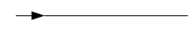

# 서문

#### Altibase 7.3

Altibase® Administration

## 목차

- [서문](#서문)
    - [이 매뉴얼에 대하여](#이-매뉴얼에-대하여)
- [1.성능 튜닝 소개](../Performance%20Tuning%20Guide/1.성능-튜닝-소개.md)
    - [성능 튜닝 개요](../Performance%20Tuning%20Guide/1.성능-튜닝-소개.md#성능-튜닝-개요)
    - [데이터베이스 서버 튜닝](../Performance%20Tuning%20Guide/1.성능-튜닝-소개.md#데이터베이스-서버-튜닝)
    - [SQL 튜닝](../Performance%20Tuning%20Guide/1.성능-튜닝-소개.md#sql-튜닝)
- [2.Altibase 서버 튜닝](../Performance%20Tuning%20Guide/2.Altibase-서버-튜닝.md)
    - [로그파일](../Performance%20Tuning%20Guide/2.Altibase-서버-튜닝.md#로그파일)
    - [체크포인트](../Performance%20Tuning%20Guide/2.Altibase-서버-튜닝.md#체크포인트)
    - [버퍼](../Performance%20Tuning%20Guide/2.Altibase-서버-튜닝.md#버퍼)
    - [서비스 쓰레드](../Performance%20Tuning%20Guide/2.Altibase-서버-튜닝.md#서비스-쓰레드)
    - [가비지 콜렉터](../Performance%20Tuning%20Guide/2.Altibase-서버-튜닝.md#가비지-콜렉터)
    - [SQL Plan Cache](../Performance%20Tuning%20Guide/2.Altibase-서버-튜닝.md#sql-plan-cache)
    - [CPU 사용률](../Performance%20Tuning%20Guide/2.Altibase-서버-튜닝.md#cpu-사용률)
- [3.쿼리 옵티마이저](../Performance%20Tuning%20Guide/3.쿼리-옵티마이저.md)
    - [쿼리 옵티마이저 개요](../Performance%20Tuning%20Guide/3.쿼리-옵티마이저.md#쿼리-옵티마이저-개요)
    - [쿼리 변환](../Performance%20Tuning%20Guide/3.쿼리-옵티마이저.md#쿼리-변환)
    - [논리적 실행 계획 생성](../Performance%20Tuning%20Guide/3.쿼리-옵티마이저.md#논리적-실행-계획-생성)
    - [물리적 실행 계획 생성](../Performance%20Tuning%20Guide/3.쿼리-옵티마이저.md#물리적-실행-계획-생성)
    - [옵티마이저 관련 프로퍼티](../Performance%20Tuning%20Guide/3.쿼리-옵티마이저.md#옵티마이저-관련-프로퍼티)
- [4.EXPLAIN PLAN 사용하기](../Performance%20Tuning%20Guide/4.EXPLAIN-PLAN-사용하기.md)
    - [EXPLAIN PLAN의 개요](../Performance%20Tuning%20Guide/4.EXPLAIN-PLAN-사용하기.md#explain-plan의-개요)
    - [Plan Tree 출력](../Performance%20Tuning%20Guide/4.EXPLAIN-PLAN-사용하기.md#plan-tree-출력)
    - [Plan Tree 읽기](../Performance%20Tuning%20Guide/4.EXPLAIN-PLAN-사용하기.md#plan-tree-읽기)
    - [Plan Tree 활용](../Performance%20Tuning%20Guide/4.EXPLAIN-PLAN-사용하기.md#plan-tree-활용)
    - [실행 노드](../Performance%20Tuning%20Guide/4.EXPLAIN-PLAN-사용하기.md#실행-노드)
- [5.옵티마이저와 통계정보](../Performance%20Tuning%20Guide/5.옵티마이저와-통계정보.md)
    - [통계정보의 개요](../Performance%20Tuning%20Guide/5.옵티마이저와-통계정보.md#통계정보의-개요)
    - [통계정보 관리](../Performance%20Tuning%20Guide/5.옵티마이저와-통계정보.md#통계정보-관리)
    - [자동 통계정보 수집(Auto Stats)](../Performance%20Tuning%20Guide/5.옵티마이저와-통계정보.md#자동-통계정보-수집auto-stats)
- [6.SQL 힌트](../Performance%20Tuning%20Guide/6.SQL-힌트.md)
    - [힌트의 개요](../Performance%20Tuning%20Guide/6.SQL-힌트.md#힌트의-개요)
    - [힌트의 종류](../Performance%20Tuning%20Guide/6.SQL-힌트.md#힌트의-종류)
- [7.SQL Plan Cache](../Performance%20Tuning%20Guide/7.SQL-Plan-Cache.md)
    - [SQL Plan Cache의 개요](../Performance%20Tuning%20Guide/7.SQL-Plan-Cache.md#sql-plan-cache의-개요)
    - [SQL Plan Cache 관리](../Performance%20Tuning%20Guide/7.SQL-Plan-Cache.md#sql-plan-cache-관리)
    - [Result Cache의 개요](../Performance%20Tuning%20Guide/7.SQL-Plan-Cache.md#result-cache의-개요)

### 이 매뉴얼에 대하여

이 매뉴얼은 Altibase를 효과적으로 사용하기 위한 튜닝 방법에 대하여 설명한다.

#### 대상 사용자

이 매뉴얼은 다음과 같은 Altibase 사용자를 대상으로 작성되었다.

-   데이터베이스 관리자

-   시스템 관리자

-   성능 관리자

다음과 같은 배경 지식을 가지고 이 매뉴얼을 읽는 것이 좋다.

-   컴퓨터, 운영 체제 및 운영 체제 유틸리티 운용에 필요한 기본 지식

-   관계형 데이터베이스 사용 경험 또는 데이터베이스 개념에 대한 이해

-   데이터베이스 서버 관리, 운영 체제 관리 또는 네트워크 관리 경험

#### 소프트웨어 환경

이 매뉴얼은 데이터베이스 서버로 Altibase 버전 7.3을 사용한다는 가정 하에 작성되었다.

#### 이 매뉴얼의 구성

이 매뉴얼은 다음과 같이 구성되어 있다.

-   제 1장 성능 튜닝 소개  
    이 장은 Altibase 성능 튜닝에 대한 개략적인 정보를 제공한다.

-   제 2장 Altibase 서버 튜닝  
    이 장은 Altibase 서버를 운영할 때 고려해야 하는 요소를 설명한다.

-   제 3 장 쿼리 옵티마이저  
    이 장은 옵티마이저의 구조를 살펴보고, 질의문이 최적화되기 위해 어떤 과정을 거치는지 설명한다.

-   제 4장 Explain Plan 사용하기  
    이 장은 Altibase 서버가 최적화된 질의를 실행하기 위해 수행하는 접근 경로를 나타내는 EXPLAIN PLAN에 대해 설명한다.

-   제 5장 옵티마이저와 통계정보  
    이 장은 쿼리를 최적화하는데 있어 통계정보가 왜 중요한지를 알아보고, 사용자가 통계정보를 수집하고 설정하는 방법을 설명한다.

-   제 6장 SQL 힌트  
    이 장은 사용자가 직접 SQL문의 실행 계획을 변경할 수 있는 SQL 힌트에 대해 설명한다.

-   제 7장 SQL Plan Cache  
    이 장은 Altibase의 SQL Plan Cache 기능에 대한 개념 및 특징에 대해 설명한다.

#### 문서화 규칙

이 절에서는 이 매뉴얼에서 사용하는 규칙에 대해 설명한다. 이 규칙을 이해하면 이 매뉴얼과 설명서 세트의 다른 매뉴얼에서 정보를 쉽게 찾을 수 있다. 여기서 설명하는 규칙은 다음과 같다.

-   구문 다이어그램

-   샘플 코드 규칙

##### 구문 다이어그램

이 매뉴얼에서는 다음 구성 요소로 구축된 다이어그램을 사용하여, 명령문의 구문을
설명한다.

| 구성 요소                               | 의미                                                         |
| --------------------------------------- | ------------------------------------------------------------ |
|  | 명령문이 시작한다. 완전한 명령문이 아닌 구문 요소는 화살표로 시작한다. |
|  | 명령문이 다음 라인에 계속된다. 완전한 명령문이 아닌 구문 요소는 이 기호로 종료한다. |
|  | 명령문이 이전 라인으로부터 계속된다. 완전한 명령문이 아닌 구문 요소는 이 기호로 시작한다. |
|  | 명령문이 종료한다.                                           |
|  | 필수 항목                                                    |
|  | 선택적 항목                                                  |
|  | 선택사항이 있는 필수 항목. 한 항목만 제공해야 한다.          |
|  | 선택사항이 있는 선택적 항목.                                 |
|  | 선택적 항목. 여러 항목이 허용된다. 각 반복 앞부분에 콤마가 와야 한다. |

##### 샘플 코드 규칙

코드 예제는 SQL, Stored Procedure, iSQL, 또는 다른 명령 라인 구문들을 예를 들어 설명한다.

아래 테이블은 코드 예제에서 사용된 인쇄 규칙에 대해 설명한다.

| 규칙         | 의미                                                                                | 예제                                                                                                    |
|--------------|-------------------------------------------------------------------------------------|---------------------------------------------------------------------------------------------------------|
| [ ]          | 선택 항목을 표시                                                                    | VARCHAR [(*size*)] [[FIXED \|] VARIABLE]                                                                |
| { }          | 필수 항목 표시. 반드시 하나 이상을 선택해야 되는 표시                               | { ENABLE \| DISABLE \| COMPILE }                                                                        |
| \|           | 선택 또는 필수 항목 표시의 인자 구분 표시                                           | { ENABLE \| DISABLE \| COMPILE } [ ENABLE \| DISABLE \| COMPILE ]                                       |
| . . .        | 그 이전 인자의 반복 표시 예제 코드들의 생략되는 것을 표시                           | SQL\> SELECT ename FROM employee; ENAME ------------------------ SWNO HJNO HSCHOI . . 20 rows selected. |
| 그 밖의 기호 | 위에서 보여진 기호 이 외에 기호들                                                   | EXEC :p1 := 1; acc NUMBER(11,2);                                                                        |
| 기울임 꼴    | 구문 요소에서 사용자가 지정해야 하는 변수, 특수한 값을 제공해야만 하는 위치         | SELECT \* FROM *table_name*; CONNECT *userID*/*password*;                                               |
| 소문자       | 사용자가 제공하는 프로그램의 요소들, 예를 들어 테이블 이름, 칼럼 이름, 파일 이름 등 | SELECT ename FROM employee;                                                                             |
| 대문자       | 시스템에서 제공하는 요소들 또는 구문에 나타나는 키워드                              | DESC SYSTEM_.SYS_INDICES_;                                                                              |

#### 관련 자료

자세한 정보를 위하여 다음 문서 목록을 참조하기 바란다.

-   Installation Guide

-   Getting Started Guide

-   SQL Reference

-   Stored Procedures Manual

-   iSQL User’s Manual

-   Utilities Manual

-   Error Message Reference

#### Altibase는 여러분의 의견을 환영합니다.

이 매뉴얼에 대한 여러분의 의견을 보내주시기 바랍니다. 사용자의 의견은 다음 버전의 매뉴얼을 작성하는데 많은 도움이 됩니다. 보내실 때에는 아래 내용과 함께 고객서비스포털(*http://support.altibase.com/kr/* )로 보내주시기 바랍니다.

-   사용 중인 매뉴얼의 이름과 버전

-   매뉴얼에 대한 의견

-   사용자의 성함, 주소, 전화번호

이 외에도 Altibase 기술지원 설명서의 오류와 누락된 부분 및 기타 기술적인 문제들에 대해서 이 주소로 보내주시면 정성껏 처리하겠습니다. 또한, 기술적인 부분과 관련하여 즉각적인 도움이 필요한 경우에도 고객서비스포털을 통해 서비스를 요청하시기 바랍니다.

여러분의 의견에 항상 감사드립니다.

