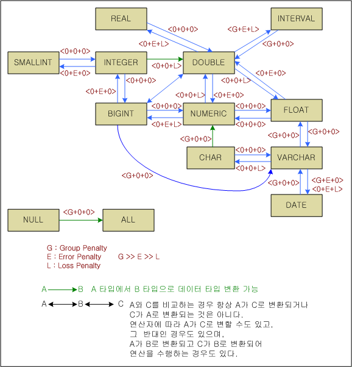
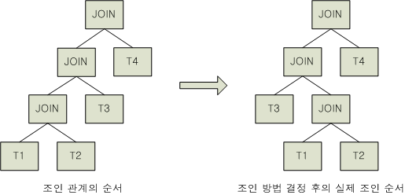
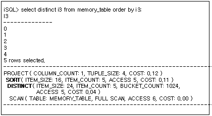

# 3.쿼리 옵티마이저

이 장은 옵티마이저의 구조를 살펴보고 질의문이 최적화되기 위해 어떤 과정을 거치는지 설명한다.

### 쿼리 옵티마이저 개요

쿼리 옵티마이저(Query optimizer)는 주어진 SQL문을 분석하여 가능한 실행 계획을 작성하고, 이에 대한 비용을 평가하여 가장 효율적인 실행 계획을 선택한다. 질의 성능의 대부분이 이 과정에서 결정되며, 복잡한 질의일수록 질의 최적화 과정의 정확성에 의해서 성능이 좌우된다.

#### 옵티마이저의 작업

질의문은 최적화 이전 단계에서 구문 분석(parsing)과 의미 분석(validation) 과정을 거친다. 이 과정에서 파싱 트리가 생성되는데, 옵티마이저는 이 파싱 트리로부터 각종 비용을 평가하여 효율적인 실행 계획 트리(plan tree)을 생성한다.

이러한 과정을 수행하는 옵티마이저의 구조는 다음과 같다.


[그림 3‑1] 옵티마이저 구조

옵티마이저는 크게 Query Rewriter, Logical Plan Generator, Physical Plan Generator로 구성된다. 각 구성요소의 역할은 다음과 같다.

-   Query Rewriter: 주어진 파스 트리를 이용하여 동일한 결과를 가지면서 최적화에 더 유리하도록 쿼리를 변환한다. Altibase가 사용하는 쿼리 변환 기법에 대해서는 아래의 "쿼리 변환" 절에서 상세히 설명한다.
    
-   Logical Plan Generator: 변형된 쿼리와 통계정보를 이용하여 실행 비용을 계산함으로써 최적화된 논리적 쿼리 플랜을 생성한다.
    
-   Physical Plan Generator: 최적화된 쿼리 플랜를 이용하여 물리적 실행 계획 트리를 생성한다.

쿼리 옵티마이저의 각 요소에 의해 수행되는 최적화 작업은 크게 아래와 같이 분류할 수 있다.

-   쿼리 변환

-   논리적 실행 계획 생성

-   물리적 실행 계획 생성

#### 옵티마이저에 영향을 미치는 요소

Altibase 쿼리 옵티마이저의 동작은 아래와 같은 요소들에 의해 영향을 받고 결과적으로 실행 계획에 차이가 생긴다.

-   SQL문과 조건절(predicates)의 형태

-   인덱스와 제약조건(constratints)

-   통계 정보

-   SQL 힌트

-   옵티마이저 관련 프로퍼티

통계 정보와 SQL 힌트에 대해서는 아래의 장에서 설명한다.

### 쿼리 변환

쿼리 처리 과정에서 옵티마이저는 파싱이 완료된 파스 트리를 의미적으로 동일하면서 최적화에 유리한 형태로 SQL 문을 재작성하는데, 이를 쿼리 변환이라고 한다.

Altibase 쿼리 옵티마이저는 아래와 같은 쿼리 변환 기법을 사용한다. 이 중 일부 기법은 Query Rewriter가 쿼리를 변환하는 단계에서 사용하지만, 일부는 Logical Plan Generator가 쿼리 플랜을 최적화하는 단계에서 사용한다.

-   공통 표현식 제거(Common Subexpression Elimination)

-   Constant Filter 우선 처리

-   View Merging

-   Subquery Unnesting

-   조건절 Pushdown(Predicate Pushdown)

-   조건절 이행(Transitive Predicate Generation)

#### 공통 표현식 제거(Common Subexpression Elimination)

동일한 조건식이 WHERE 절에 중복되어 존재하는 경우, 옵티마이저가 중복된 연산식을 하나로 합친다.

아래의 예제에서 OR 뒷부분의 ( department_id=60 ) 조건은 앞선 조건에 포함되어 있으므로 옵티마이저가 해당 조건을 삭제하게 된다.

```
SELECT department_id, salary
FROM   employee
WHERE  ( department_id = 60 AND salary = 4200 )
   OR  ( department_id = 60 );
```

아래의 예제에서는 salary = 4200 조건이 무의미하므로 옵티마이저가 해당 조건을 삭제하게 된다.

```
SELECT department_id, salary
FROM   employee
WHERE  ( department_id = 60 OR salary = 4200 )
  AND  ( department_id = 60 );
```


#### Constant Filter우선 처리

1 = 1 또는 1 \<\> 1과 같이 테이블이 소유한 값에 관계 없이 항상 TRUE 또는 FALSE를 결정하는 조건을 constant filter라고 한다.

Constant filter는 항상 같은 논리값을 갖기 때문에 질의 수행 과정에서 한 번만 비교하고 추가적인 비교 연산 비용이 발생하지 않는다. 즉, constant filter의 논리값이 FALSE인 경우에는 어떠한 검사도 추가적으로 발생하지 않으며, 테이블에 접근할 필요도 없다. 무의미해 보이는 constant filter도 다음과 같이 매우 다양한 용도로 활용할 수 있다.

그 예로 스키마만 구성하고 데이터는 구축하지 않는 경우에 constant filter를 활용할 수 있다. 다음과 같은 질의가 이에 해당하는 예이다.

```
CREATE TABLE T3 AS SELECT * FROM T1, T2 WHERE 1 <> 1;
```

위와 같이 T1과 T2 테이블의 데이터는 가지지 않으면서 모든 칼럼 정보를 가진 T3 테이블을 만들고 싶을 경우 constant filter를 사용하면 원하는 작업을 수행할 수 있다.

또한, 다음 예와 같이 검색 권한을 제한하는 용도로 활용할 수 있다.

```
SELECT * FROM T1, T2 WHERE T1.i1 = T2.a1 AND ? > 20;
```

위와 같이 나이값에 해당하는 호스트 변수를 지정하여 조건에 부합하지 않는 사용자가 질의를 수행하거나 결과값이 없는 질의의 수행으로 인한 부하 등을 방지할 수 있다.

이 외에도 옵티마이저는 다음과 같이 subquery를 포함하고 있는 조건절도 constant filter로 처리하여 한 번만 수행하고 subquery가 반복적으로 수행되지 않게 할 수 있다.

```
SELECT * FROM T1 WHERE EXISTS ( SELECT * FROM T2 WHERE T2.date = SYSDATE );
```

위의 예제에서 EXISTS 조건은 T1의 데이터와 전혀 관계 없는 constant filter이다.

#### View Merging

메인 쿼리에 포함된 뷰를 메인 쿼리와 머지하는 기법이다.

조건절과 조인만을 포함하는 단순 뷰(Simple View)의 경우, 사용자가 NO_MERGE 힌트를 사용하지 않는 한 옵티마이저가 View Merging을 수행한다.

아래는 emp_engineer 뷰와 departments 테이블을 조인하는 쿼리문이 뷰 Merging에 의해 변환되는 예제이다.

```
CREATE OR REPLACE VIEW emp_engineer
AS
SELECT eno, e_lastname, emp_job, salary, dno
FROM employees
WHERE emp_job='engineer';

SELECT e.eno, e.e_lastname, e.salary, d.dname, d.mgr_no
FROM emp_engineer e, departments d
WHERE d.dno=e.dno AND e.salary>=1500;
=>
SELECT e.eno, e.e_lastname, e.salary, d.dname, d.mgr_no
FROM employees e, departments d
WHERE d.dno=e.dno 
AND e.emp_job='engineer'
AND e.salary>=1500;
```

\* 관련 힌트: NO_MERGE

#### Subquery Unnesting

WHERE절에 포함된 부질의를 중첩된 부질의(Nested Subquery)이라고 한다. 부질의는 결과 집합을 한정하기 위해 주로 메인 쿼리(Main Query, 외부 질의)에 있는 칼럼을 참조하는 형태를 보인다. 이렇게 중첩된 부질의가 포함된 쿼리를 중첩되지 않은 조인 형태의 쿼리로 변환하는 것을 "Subquery Unnesting"이라고 한다.

아래는 중첩된 부질의를 포함하는 쿼리가 Subquery unnesting에 의해 변환되는 예제이다.

```
SELECT * FROM employees
WHERE dno IN (SELECT dno FROM departments)
=>
SELECT *
FROM (SELECT dno FROM departments) d, employees e
WHERE d.dno=e.dno;
```

\* 관련 힌트: UNNEST, NO_UNNEST

#### 조건절 Pushdown (Predicate Pushdown)

옵티마이저는 실행 비용 및 수학적 일치성 등을 고려하여 다양한 형태의 조건절 Pushdown을 고려한다. 옵티마이저가 사용하는 대표적인 조건절 Pushdown 기법은 다음과 같다.

-   뷰에 대한 조건절 Pushdown

-   Outer 조인에 대한 조건절 Pushdown

-   조인 조건 Pushdown

##### 뷰에 대한 조건절 Pushdown

뷰에 대한 조건절 Pushdown은 사용자 정의 뷰에 대하여 질의를 수행 시 메인 쿼리의 WHERE 절에 기술된 조건을 뷰의 내부로 밀어넣는 기법이다.

예를 들어, 다음과 같이 정의된 뷰와 이에 대한 질의가 있다고 하자.

```
CREATE VIEW V1(a1, a2) AS SELECT i1, i2 FROM T1 WHERE i2 > 20;
SELECT * FROM V1 WHERE a1 = 1;
```

옵티마이저는 해당 질의의 최적화 과정에서 뷰에 대한 조건절 Pushdown을 사용하는 것이 최적화에 유리하다고 판단하면, WHERE 절의 조건이 내부적으로 다음과 같은 형태로 처리되도록 결정한다. 이를 개념적으로 표현한 질의는 다음과 같다.

```
SELECT * FROM ( SELECT i1, i2 FROM T1  WHERE i2 > 20 AND i1 =1 ) V1;
```

즉, 위와 같이 질의를 변형시켜 T1.i1 칼럼의 인덱스를 활용할 수 있도록 한다. 그러나 옵티마이저가 항상 이런 종류의 Pushdown 을 사용하도록 결정하지는 않는다.

사용자가 뷰 내부의 구조를 파악하고 있다면 적절한 조건절을 사용하여, 옵티마이저가 뷰에 대한 Pushdown 기법을 선택하도록 할 수 있다. 또한 사용자는 힌트를 사용하여 옵티마이저가 명시적으로 뷰에 대한 조건절 Pushdown 기법을 선택하도록 할 수 있다. 그러나 뷰에 대한 조건절 Pushdown을 사용하는 것이 원래 질의보다 더 나은 성능을 반드시 보장하지는 않는다.

\* 관련 힌트: NO_PUSH_SELECT_VIEW, PUSH_SELECT_VIEW

##### Outer Join에 대한 조건절 Pushdown

FROM 절에 outer join이 사용된 경우 다양한 형태의 조건절 Pushdown이 가능하다. 이들 기법의 공통된 점은 WHERE 절에 기술된 조건을 outer join 의 조인 처리 이전에 수행되게 한다는 것이다.

예를 들어 다음과 같은 질의를 살펴 보자.

```
SELECT * FROM T1 LEFT OUTER JOIN T2 ON T1.i1 = T2.a1 WHERE T1.i1 = 1;
```

위 질의에 조건절 Pushdown 기법이 적용될 경우 개념적으로 다음과 같은 질의 형태로 처리된다.

```
SELECT * FROM (SELECT * FROM T1 WHERE T1.i1 = 1) T1 LEFT OUTER JOIN T2 ON T1.i1 = T2.a1;
```

즉, left outer join에 대한 조인 조건을 처리하기 전에 T1.i1 = 1 조건을 먼저 처리하여 T1의 결과 집합을 줄인다.

이러한 기법 역시 수학적 동치 여부 및 비용 평가를 통해 적용 여부가 결정된다. 예를 들어 다음의 세 질의는 경우에 따라 서로 다른 결과를 생성하며, 동일한 질의가 아니다.

```
SELECT * FROM T1 LEFT OUTER JOIN T2 ON T1.i1 = T2.a1 WHERE T2.a1 = 1;
SELECT * FROM T1 LEFT OUTER JOIN (SELECT * FROM T2 WHERE T2.a1 = 1) T2 ON T1.i1 = T2.a1;
SELECT * FROM T1 LEFT OUTER JOIN T2 ON T1.i1 = T2.a1 AND T2.a1 = 1;
```

옵티마이저는 수학적 동치인 상태에서 동일한 결과를 얻기 위해서 위의 질의를 다음과 같은 형태로 조건절 Pushdown을 적용한다.

```
SELECT *  FROM T1 LEFT OUTER JOIN 
(SELECT * FROM T2 WHERE T2.a1 = 1) T2 
ON T1.i1 = T2.a1
WHERE T2.a1 = 1;
```

Left outer join의 경우 WHERE 조건을 ON 절에 옮겨 처리하고 싶다면 다음과 같이 WHERE 절에 반드시 남겨 두어야 동일한 결과를 보장받을 수 있다.

```
SELECT *  FROM T1 LEFT OUTER JOIN T2 
ON T1.i1 = T2.a1 AND T2.a1 = 1
WHERE T2.a1 = 1;
```

위의 예제에서 알 수 있듯이, 사용자가 임의로 질의 조건을 추가하여 조건절 Pushdown과 유사한 효과를 기대할 수 있다. 하지만 조건을 추가하여 동일한 결과를 얻음과 동시에 성능까지 향상시킬 수 있는지 여부를 판단하는 것이 매우 중요하다.

##### 집합 연산자를 포함한 뷰에 대한 조건절 Pushdown

조건절 Pushdown은 특히 집합 연산을 통해 생성된 뷰를 처리할 때 매우 효과적이다. 예를 들어 다음과 같은 뷰와 이를 이용한 질의를 살펴 보자.

```
CREATE VIEW V1(a1, a2) AS ( SELECT m1, m2 FROM T2 UNION ALL SELECT x1, y1 FROM T3 );
SELECT * FROM T1, V1 WHERE T1.i1 = V1.a1 AND T1.i1 = 1;
```

위의 뷰 정의에서 T2.m1 과 T3.x1 칼럼에 모두 인덱스가 있다고 해도 해당 질의를 수행할 때 어떤 인덱스도 사용되지 않는다. 이 때 먼저 아래의 절에서 설명하는 '조건절 이행'을 통해 아래와 같이 V1.a1=1 조건절이 내부적으로 생성된다.

```
SELECT * FROM T1, V1 WHERE T1.i1 = V1.a1 AND T1.i1 = 1 AND V1.a1 = 1;
```

이 상태에서 조건절 Pushdown을 통해 쿼리가 다음과 같이 변환되어 T2.m1 과 T3.x1 칼럼의 인덱스를 모두 사용할 수 있게 된다.

```
SELECT * FROM T1, ( SELECT m1, m2 FROM T2 WHERE T2.m1 = 1 
  UNION ALL
  SELECT x1, y1 FROM T3 WHERE T3.x1 = 1 ) V1
  WHERE T1.i1 = V1.a1 AND T1.i1 = 1;
```

위와 같이 조건절의 적절한 기술은 옵티마이저가 보다 효율적인 실행 계획을 작성하는 데 도움을 주며, 사용자의 명시적인 조건절의 변경을 통해 성능 향상을 꾀할 수 있다. 그러나 이러한 조건절의 추가가 반드시 좋은 성능을 보장하지는 못하며, 경우에 따라 비교 연산 비용만 증가시킬 수 있음을 유념하여야 한다.

##### 조인 조건 Pushdown

메인 쿼리의 조건절에서 뷰와 관련된 조인 조건절을 뷰 안으로 밀어넣는(pushing) 기법이다.

\* 관련 힌트: PUSH_PRED

#### 조건절 이행(Transitive Predicate Generation)

조건절 이행 기법은 조인 조건과 단일 테이블 조건이 존재할 때 유사한 다른 단일 테이블 조건을 추가하여 성능을 향상시키는 기법이다.

예를 들어 다음과 같은 질의를 살펴보자.

```
SELECT * FROM T1, T2 WHERE T1.i1 = T2.a1 AND T1.i1 = 1;
```

해당 질의를 처리하기 위해 어떠한 인덱스도 사용할 수 없을 경우 다음과 같이 유사한 단일 테이블 조건을 추가하면, 성능 향상에 도움이 된다.

```
SELECT * FROM T1, T2 WHERE T1.i1 = T2.a1 AND T1.i1 = 1 AND T2.a1 = 1;
```

즉, T2 의 결과 집합의 크기를 줄임으로서 성능을 향상시킬 수 있다.

#### View Materialization기법

뷰에 대한 조건절 Pushdown과 상충되는 최적화 기법이 바로 view materialization 기법이다. 이는 뷰가 하나의 질의에서 반복해서 사용될 때 질의 처리 과정 중에 뷰의 결과를 임시로 저장하여 처리하는 기법이다.

예를 들어 다음과 같은 뷰의 정의와 관련 질의를 살펴 보자.

```
CREATE VIEW V1(a1, a2) AS SELECT i1, SUM(i2) FROM T1 GROUP BY i1;
SELECT * FROM V1 WHERE V1.a2 > (SELECT AVG(a2) FROM V1 WHERE a1 > 10 );
```

위와 같은 질의에 대하여 view materialization 기법이 사용되면, V1뷰의 결과는 임시로 저장되고 최상위 질의와 subquery는 이를 사용하게 된다. 즉, V1의 결과를 얻기 위하여 뷰를 정의한 질의를 반복하여 수행하지 않아도 되는 효과를 얻게 된다.

이러한 질의에 대하여 뷰에 대한 조건절 Pushdown 기법을 사용하도록 힌트를 주면 오히려 느린 성능을 얻을 수도 있으므로 사용자의 올바른 판단이 필요하다.

### 논리적 실행 계획 생성

옵티마이저는 쿼리 변환 과정을 거쳐 변형된 쿼리와 통계정보를 이용하여 논리적 실행 계획을 생성한다. 옵티마이저는 SQL구문이 접근하는 테이블, 인덱스, 파티션들의 저장 특성 같은 통계정보를 활용하여 비용을 계산한다. 비용이란 특정 플랜으로 쿼리를 수행하는데 필요할 것으로 예상되는 시간을 옵티마이저가 추정하여 하나의 수치로 표현한 것이다. 옵티마이저는 비용이 가장 낮은 액세스 방법, 조인 순서를 선택하여 논리적 실행 계획을 생성한다.

#### 정규화 (Normalization)

##### 정규화의 개념

사용자가 작성한 WHERE 조건절은 매우 다양한 형태로 표현된다. 옵티마이저는 다양한 조건 처리를 일관되고 효율적인 방법으로 처리하기 위해 사용자가 정의한 WHERE절을 정형화된 형태로 변경한다. 이러한 과정을 정규화라고 한다.

정규화는 AND, OR, NOT 등의 논리식을 사용해서 조건절을 확장하고 변형하는 과정이다. AND연산자를 최상위 논리식으로 표현하는 방법을 CNF (Conjunctive Normal Form)이라 하며, OR연산자를 최상위 논리식으로 표현하는 방법을 DNF (Disjunctive Normal Form)이라 한다.

CNF 정규화는 주어진 조건절을 AND연산자를 최상위로 하여 하위에 OR 논리 연산자가 구성되도록 재배치하는 것이다. 다음 예는 조건절이 CNF정규화를 사용해서 변환될 때 결과로 나타나는 구조를 보여준다.

```
WHERE (i1 = 1 AND i2 = 1) OR i3 = 1  
CNF: (i1 = 1 OR i3 = 1) AND (i2 = 1 OR i3 = 1)
```

DNF 정규화는 주어진 조건절을 OR 연산자를 최상위로 하여 하위에 AND 논리 연산자로만 구성되도록 재배치하는 과정이다. 다음 예는 조건절이 DNF 정규화를 사용해서 변환될 때 결과로 나타나는 구조를 보여준다.

```
WHERE (i1 = 1 OR i2 = 1) AND i3 = 1  
DNF: (i1 = 1 AND i3 = 1) OR (i2 = 1 AND i3 = 1)
```

즉, 옵티마이저는 주어진 조건절을 CNF로 변환했을 때의 실행 비용과, DNF로 변환했을 때의 실행 비용을 비교하여 보다 나은 정규화 형태를 선택하게 된다.

일반적으로 옵티마이저는 CNF 기반의 실행 계획을 선택하며, 일부의 경우 DNF 기반의 실행 계획을 선택한다. 예를 들어, 다음과 같은 질의를 살펴보자.

```
SELECT * FROM T1 WHERE i1 = 1 OR i2 = 1;
CNF 정규화: AND (i1 = 1 OR i2 = 1)
DNF 정규화: (i1 = 1 AND ) OR (i2 = 1 AND )
```

위의 조건절은 T1 테이블에 인덱스가 없거나 하나의 칼럼에만 인덱스가 있는 경우는 CNF로 처리된다. 즉, T1 테이블을 전체 스캔하여 질의를 처리하는 것이 가장 효율적이다.

그러나 i1과 i2 칼럼에 각각 인덱스가 있는 경우, DNF로 정규화하여 각각의 인덱스를 사용하여 (i1 = 1)의 결과와 (i2 = 1)의 결과를 따로 얻어 합치는 것이 보다 효율적이다.

이와 같이 동일한 조건식이더라도 인덱스의 유무에 따라 다른 타입의 정규화가 선택된다. 이는 옵티마이저가 각 경우의 실행 비용을 비교하여 결정하기 때문이다.

물론, WHERE 절에 논리 연산자가 없거나 OR 연산자가 존재하지 않는 경우라면 옵티마이저는 CNF 정규화만을 사용하게 되며, OR 연산자가 존재하는 경우에는 CNF와 DNF를 모두 구성하고 각각의 비용을 비교하여 실행 계획을 생성한다.

###### **사용자 튜닝**

정규화 과정은 조건절의 확장을 불가피하게 한다. 따라서 조건절 기술 시 정규화된 형태로 구성하는 것은 조건절의 확장을 방지하여 불필요한 비교 연산을 제거할 수 있다.

예를 들어, 다음 조건절은 CNF 또는 DNF로 수행이 가능하지만, 이는 질의 변경을 통해 CNF로만 동작하게 할 수 있다.

```
WHERE i1 = 1 OR i1 = 2 OR i1 = 3  
CNF 정규화: i1 IN (1, 2, 3)
```

유사한 예로 다음과 같은 질의는 CNF 또는 DNF로의 질의 변형을 통해 불필요한 정규화 과정을 제거하고 동일한 조건 비교를 방지하여 성능을 향상할 수 있다.

```
WHERE (i1 = 1 AND i2 = 1) OR (i1 = 2 AND i2 = 2)  
CNF 정규화: (i1, i2) IN ( (1,1), (2,2) )
```

```
WHERE (i1 = 1 AND i2 = 1) OR ( i3 = 1 AND i4 = 1)  
DNF 정규화: (i1, i2) = (1, 1) OR (i3, i4) = (1, 1)
```

물론 정규화 형태의 기술 시 테이블의 인덱스 정보 등을 반드시 고려하여야 한다. 사용자가 정규화 형태로 기술하여도, 옵티마이저가 사용자가 원하지 않는 정규화 형태를 선택할 수 있다. 이러한 경우 힌트를 사용하여 제어할 수 있는데, 이는 힌트를 설명한 절에서 자세히 설명한다.

#### 비용 계산 (Cost Estimation)

옵티마이저는 통계정보를 활용한 아래의 세가지 측정치를 고려하여 최적의 실행계획을 수립한다.

-   선택도(Selectivity)  
    전체 대상 로우 중에서 특정 조건절(predicate)에 의해 선택될 것으로 예상되는 로우의 비율이다. 옵티마이저는 선택도를 사용해서 카디널리티를 구하고 또 비용을 구함으로써 인덱스 사용 여부, 조인 순서와 방법 등을 결정한다. 따라서 선택도는 최적의 실행 계획을 수립하기 위한 기본 요소라고 할 수 있다.
    
-   카디널리티(Cardinality)  
    전체 대상 로우 중에서 선택될 것으로 예상되는 로우의 개수이다. (총 로우 수 \* 선택도)로 계산된다.
    
-   비용(Cost)  
    접근 비용(access cost)과 디스크 I/O 비용의 합으로 계산된다. 접근 비용은 인덱스 스캔 또는 풀 스캔 같은 액세스 방법에 의해 결정된다. 액세스 방법에 대한 자세한 설명은 아래의 '액세스 방법'을 참고한다.

#### 액세스 방법

액세스 방법이란 데이터베이스에서 데이터를 가져오는 방법을 말한다. 일반적으로 테이블에서 작은 수의 레코드를 가져오는 경우에는 인덱스를 사용하는 것이 더 효율적이고, 많은 수의 레코드에 접근하는 경우에는 전체 테이블 스캔이 더 효율적이다. Altibase는 아래의 액세스 방법을 사용한다.

-   전체 테이블 스캔(Full Table Scans)

-   인덱스 스캔

##### 전체 테이블 스캔

테이블의 모든 로우를 읽어서 선택 기준을 만족하지 않는 로우를 걸러낸다. 전체 테이블 스캔은 아래와 같은 경우에 사용된다.

-   인덱스가 없을 때

-   테이블에서 많은 양의 데이터에 접근할 때

\* 관련 힌트: FULL SCAN(*table*)

아래 예제는 전체 테이블 스캔이 사용되는 쿼리와 실행 계획을 보여준다.

```
iSQL> SELECT /*+ FULL SCAN(employees) */ eno, e_firstname, e_lastname, emp_job
 FROM employees 
 WHERE sex = 'F';
.
.
.
------------------------------------------------
PROJECT ( COLUMN_COUNT: 4, TUPLE_SIZE: 65 , COST: 0.18 )
 SCAN ( TABLE: EMPLOYEES, FULL SCAN, ACCESS: 20, COST: 0.14 )
------------------------------------------------
```


##### 인덱스 스캔

인덱스 스캔은 아래의 유형으로 구분된다.

-   인덱스 범위 스캔 (Index Range Scan)

-   인덱스 전체 스캔 (Index Full Scan)

\* 관련 힌트: INDEX, INDEX ASC, INDEX DESC, NO INDEX

###### **인덱스 범위 스캔**

인덱스 범위 스캔은 인덱스 트리의 루트에서 리프까지 수직적으로 탐색한 후에 리프들에서 필요한 범위만 스캔하는 방식이다.

Altibase에서는 이것을 'Key range 처리 방법'이라고도 표현한다. 인덱스 범위 스캔은 인덱스를 이용하여 조건에 부합하는 범위내의 데이터를 검색하는 방법이다. 즉, 조건을 만족하는 최소값의 위치와 최대값의 위치만을 결정하고 해당 조건에 대한 별도의 비교 없이 그 범위 내의 모든 데이터를 스캔한다. 따라서 이 방법은 범위 내의 데이터에 대한 별도의 비교 연산이 필요 없어 매우 우수한 성능을 보장한다.

인덱스를 구성하는 선두 칼럼이 아래와 같은 조건절에 사용된 경우 인덱스 범위 스캔이 사용될 수 있다.

-   c1 = value

-   c1 \< value

-   c1 \> value

데이터는 인덱스 칼럼 순으로 정렬되어 반환된다. 인덱스를 구성하는 칼럼들이 ORDER BY/GROUP BY절에 있는 경우, 옵티마이저가 불필요한 정렬을 피할 것이다.

아래 예제는 인덱스 범위 스캔이 사용되는 쿼리와 실행 계획을 보여준다.

```
iSQL> SELECT /*+ INDEX(employees, EMP_IDX1) */ eno, e_firstname, e_lastname, emp_job
 FROM employees 
 WHERE dno = 1003;
.
.
.
----------------------------------------------------------
PROJECT ( COLUMN_COUNT: 4, TUPLE_SIZE: 65, COST: 0.03 )
 SCAN ( TABLE: EMPLOYEES, INDEX: EMP_IDX1, RANGE SCAN, ACCESS: 4, COST: 0.00 )
----------------------------------------------------------
```


###### **인덱스 전체 스캔**

특정 범위만 탐색하는 인덱스 범위 스캔과 달리 리프 노드를 처음부터 끝까지 탐색하는 방식이다. 보통은 데이터 검색을 위한 최적의 인덱스가 없을 때 차선으로 선택된다. 데이터가 인덱스 키에 의해 정렬되므로 이 방식을 사용할 경우 옵티마이저가 별도의 정렬 작업을 하지 않아도 된다.

Altibase에서는 이것을 'Key filter 처리 방법'이라고도 표현한다. Key filter 처리 방법은 인덱스를 이용하여 범위 검색은 할 수 없으나, 인덱스의 리프 노드를 차례로 스캔하면서 저장되어 있는 키값으로 비교 연산을 수행하는 방법이다. 이 방법은 인덱스를 저장하고 있는 페이지만을 접근하여 비교함으로써 데이터 페이지에 대한 접근 횟수를 줄여 성능이 향상될 수 있다.

하지만 이러한 성능 향상 효과는 디스크 테이블에만 한정된다. 메모리 테이블의 인덱스는 키값을 저장하지 않기 때문에 filter 처리 방법과 비교하여 성능 향상의 효과가 없다.

Filter 처리 방법은 인덱스를 사용할 수 없는 조건절에 대한 처리 방법으로 데이터를 직접 읽어 비교 연산을 수행한다. WHERE절의 조건절을 처리하기 위해 다수의 filter를 사용해야 하는 경우, 옵티마이저는 각 filter에 대하여 예상되는 처리 비용을 비교하여 가장 비용이 적은 filter를 우선적으로 처리하여 비교 비용이 최소화되도록 filter의 처리 순서를 결정한다.

아래 예제는 인덱스 전체 스캔이 사용되는 쿼리와 실행 계획을 보여준다.

```
CREATE TABLE t1(c1 INT, c2 CHAR(10)) 
  TABLESPACE sys_tbs_disk_data;
CREATE INDEX t1_idx ON t1(c1);
INSERT INTO t1 VALUES(1,'a');
INSERT INTO t1 VALUES(2,'b');
INSERT INTO t1 VALUES(3,'c');

iSQL> SELECT * FROM t1 ORDER BY c1;
.
.
.
----------------------------------------------------------
PROJECT ( COLUMN_COUNT: 2, TUPLE_SIZE: 16, COST: 14.02 )
 SCAN ( TABLE: T1, INDEX: T1_IDX, FULL SCAN, ACCESS: 3, DISK_PAGE_COUNT: 64, COST: 14.00 )
----------------------------------------------------------
```


##### 인덱스 생성 시 고려 사항

주어진 조건절을 처리하는데 가장 효율적인 key range 검색을 하기 위해서는 인덱스가 있어야 한다. 그러나 인덱스를 생성하기 위해서는 다음과 같은 사항을 반드시 고려하여야 한다.

-   인덱스의 생성이 검색 연산의 성능을 향상시킬 수는 있으나, 인덱스를 관리하기 위한 저장 공간이 필요하여 시스템 자원을 추가로 소모할 수 있다. 또한 과도한 인덱스의 생성은 데이터를 삽입, 삭제, 또는 갱신할 때 관련 인덱스의 정보를 유지하기 위한 비용 발생으로 성능 저하를 유발할 수도 있다.
    
-   메모리 테이블은 거의 모든 질의 처리에 있어 인덱스를 이용한 검색 방법이 전체 테이블 스캔보다 우수한 성능을 보인다.
    
-   디스크 테이블의 경우 인덱스 스캔(index scan)이 전체 테이블 스캔(full table scan)보다 반드시 효과적인 것은 아니다. 전체 테이블 스캔이 데이터 페이지에 접근하는 패턴이 일정한 반면, 인덱스 스캔은 그 패턴이 일정하지 않아 경우에 따라 과도한 Disk I/O를 유발할 수 있기 때문이다. 따라서 디스크 테이블은 인덱스 스캔을 이용한 검색이 테이블의 전체 레코드 중 1/10 이하 또는 아주 작은 수의 레코드만을 선택하는 경우에 한해 인덱스를 생성할 것을 권고한다.

그러므로 질의 수행의 빈도수, 인덱스 사용에 따른 성능 향상, 갱신 질의(INSERT, DELETE, UPDATE)와 전체 시스템 성능간의 영향 등을 고려해서 인덱스를 생성해야 한다.

##### 옵티마이저의 인덱스 선택

옵티마이저는 주어진 조건과 해당 테이블의 인덱스를 이용하여 가장 효율적인 액세스 방법을 결정한다.

이 과정에서 옵티마이저는 다양한 통계 정보를 이용하여 각 인덱스의 사용에 따른 비용을 평가하며, 이 중 가장 효율적인 액세스 방법을 선택한다. 액세스 방법이 결정되면 옵티마이저는 각 조건들에 대하여 처리 방법(key range 처리, filter 처리 등)을 결정한다.

옵티마이저가 각 액세스 방법의 비용을 계산하기 위해 사용하는 개념적인 공식은 다음과 같다.

**Access cost + Disk I/O cost**

| 개념적인 Access cost 계산                                    |
| ------------------------------------------------------------ |
| Full scan    : T(R)                                          |
| Index Scan : log(T(R)) + T(R) * MAX(1/V(Index), selectivity) |

| 개념적인 Disk I/O cost 계산                                  |
| ------------------------------------------------------------ |
| Full scan    : B(R)                                          |
| Index Scan : <br/>Buffer Miss      : [T(R) / V(R.a)] * ( 1- M/B(R) )<br />No Buffer Miss : B(R) * ( 1 - (log V(R.a)/logT(R)) ) |

옵티마이저는 접근 비용(access cost)과 디스크 I/O 비용(disk I/O cost)을 모두 통합하여 계산한다. 메모리 테이블의 경우 디스크 페이지가 존재하지 않아 디스크 I/O 비용은 수식에 의하여 자동으로 계산되지 않는다.

옵티마이저는 각 인덱스에 대한 비용 계산 시 인덱스를 이용하여 처리할 수 있는 조건을 선택하고 이를 기반으로 비용을 계산한다. 이 때, 비용에 가장 큰 영향을 미치는 것이 인덱스에 관련된 조건의 효율성이다. 이를 조건의 선택도(selectivity)라고 한다.

조건의 선택도는 전체 레코드 중 조건에 의해 선택되는 레코드들의 비율을 의미한다. 즉, 조건의 선택도가 낮을수록 결과 레코드의 수가 줄어들어 성능을 향상시킬 수 있다.

예를 들어 다음과 같은 조건을 살펴 보자.

```
WHERE i1 = 1 AND i2 = 1
```

위의 조건에서 i1과 i2 칼럼에 각각 인덱스가 존재한다면 어떠한 인덱스를 선택할 것인가를 결정할 때 가장 중요한 요소는 해당 조건의 선택도이다. 예를 들어, i1 컬럼에 서로 다른 값의 종류가 100 [V(i1) = 100] 개가 있고, i2 칼럼에는 서로 다른 값의 종류가 1000 [V(i2) = 1000] 이라면 각 조건의 선택도는 다음과 같이 계산된다.

```
(i1 = 1)의 selectivity = 1/V(i1) = 1/100
(i2 = 1)의 selectivity = 1/V(i2) = 1/1000
```

즉, 해당 질의를 처리하기 위해 i2 칼럼의 인덱스를 사용하는 것이 보다 효율적인 액세스 방법이다.

위와 같은 개념의 액세스 선택 방법이 보편적으로 올바른 실행 계획을 작성한다. 그러나 이 역시 비용 계산에 의한 선택이기 때문에 모든 상황에 있어 항상 좋은 액세스 방법이 선택되는 것은 아니다.

예를 들어, 다음과 같은 질의를 살펴 보자.

```
SELECT * FROM soldier WHERE gender = 'female' AND rank = 'lieutenant';
```

위의 질의에서 gender와 rank 칼럼에 모두 인덱스가 있다고 할 때, 옵티마이저는 비용 계산을 통해 rank 칼럼에 대한 조건을 처리하기 위한 인덱스를 사용하는 것이 바람직하다고 판단할 것이다. 그러나, 사용자가 (gender = 'female') 의 조건을 만족하는 결과 집합이 아주 작다는 것을 알고 있다면, 힌트 등을 사용하여 인덱스 선택을 달리하는 것이 바람직하다.

##### Composite 인덱스의 활용

옵티마이저는 composite 인덱스를 사용할 때 조건절을 비교하여 최대한 많은 조건절을 key range 검색할 수 있도록 선택한다. 이 때 key range 검색으로 처리될 수 있는 조건이 많을수록 보다 나은 성능을 기대할 수 있다.

정의된 인덱스를 참조하는 조건절을 사용자가 어떻게 기술하는가에 따라 인덱스를 이용한 성능은 매우 차이가 나므로, composite 인덱스의 동작 원리를 이해하는 것은 SQL 튜닝에 매우 큰 도움이 된다.

예를 들어, 다음과 같은 composite 인덱스가 존재할 때 다양한 조건들이 어떻게 처리되는지를 살펴보자.

```
Composite index on T1(i1, i2, i3, i4)
WHERE i1 = 1 AND i2 = 1 AND i3 = 1 AND i4 = 1
```

위의 WHERE절에 포함되어 있는 모든 조건은 composite 인덱스를 이용하여 모두 key range 처리가 가능하다.

```
WHERE i1 = 1 AND i2 > 0 AND i3 = 1 AND i4 = 1
Key Range              : i1 = 1, i2 > 0
Filter(or Key filter)  : i3 = 1, i4 = 1
```

위의 예에서 key range 처리방법이 적용 가능한 조건절은 두 개로 결정되고 나머지는 filter로 처리된다. 이는 key range 처리는 최소값과 최대값을 결정할 수 있는 영역 내에서만 가능하기 때문에 부등호 연산 이후의 조건절은 key range 처리를 할 수 없다.

```
WHERE i1 = 1 AND i3 = 1 AND i4 = 1
Key Range      : i1 = 1
Filter         : i3 = 1, i4 = 1
```

위의 예에서는 모두 등호 연산을 사용하고 있지만, key range 처리가 가능한 조건은 하나뿐이다. 이는 composite 인덱스를 구성하고 있는 칼럼들의 순서에 모두 부합하는 조건이 있을 경우에만 key range처리가 가능하기 때문이다. 즉, i2 칼럼에 대한 조건이 없어 i3, i4 에 대한 조건은 key range처리를 할 수 없다.

위와 같이 composite 인덱스의 경우에는 조건들이 칼럼의 누락 없이 키 칼럼의 순서에 부합할 때와 해당 조건이 등호 연산으로 이루어져 있을 때 key range 처리를 사용하여 평가될 수 있다.

예를 들어 다음과 같은 질의가 빈번하게 사용되어 인덱스를 추가하려고 한다면 인덱스를 최대한 활용할 수 있도록 생성하는 것이 바람직하다.

```
WHERE i1 > 0 AND i2 = 1
```


-   바람직한 인덱스: Index on T1(i2, i1)  
    i2 와 i1 칼럼을 참조하는 조건들을 평가하기 위해 filer 없이 key range 처리가 사용될 수 있다.
    
-   부적절한 인덱스: Index on T1(i1, i2)  
    i1 칼럼을 참조하는 조건을 평가하는데는 key range 처리가 사용될 수 있으나, i2 칼럼을 참조하는 조건을 평가하기 위해서는 filter 처리가 사용된다. 그러므로 이 인덱스가 더 비효율적이다.

##### 인덱스와 비교 연산자

인덱스가 존재하고 해당 칼럼에 대한 조건이 존재한다고 해서 반드시 인덱스를 사용될 수 있는 것은 아니다.

즉, 조건절의 기술 형태와 비교 연산자의 종류에 따라 인덱스의 사용 가능 여부가 결정되므로 이에 대한 주의가 필요하다.

비교 연산자의 종류와 인덱스 사용 가능 여부는 다음과 같다.

<table style="width: 626px;">
<tbody>
<tr>
<td style="width: 113px;">
<p><strong>종류</strong></p>
</td>
<td style="width: 127px;">
<p><strong>비교 연산자</strong></p>
</td>
<td style="width: 148px;">
<p><strong>인덱스&nbsp;사용 가능 여부</strong></p>
</td>
<td style="width: 228px;">
<p><strong>비고</strong></p>
</td>
</tr>
<tr>
<td style="width: 113px;" rowspan="6">
<p>단순 비교</p>
</td>
<td style="width: 127px;">
<p>=</p>
</td>
<td style="width: 148px;">
<p>O</p>
</td>
<td style="width: 228px;">
<p>&nbsp;</p>
</td>
</tr>
<tr>
<td style="width: 127px;">
<p>!=</p>
</td>
<td style="width: 148px;">
<p>O</p>
</td>
<td style="width: 228px;">
<p>&nbsp;</p>
</td>
</tr>
<tr>
<td style="width: 127px;">
<p>&lt;&nbsp;</p>
</td>
<td style="width: 148px;">
<p>O</p>
</td>
<td style="width: 228px;">
<p>&nbsp;</p>
</td>
</tr>
<tr>
<td style="width: 127px;">
<p>&lt;=</p>
</td>
<td style="width: 148px;">
<p>O</p>
</td>
<td style="width: 228px;">
<p>&nbsp;</p>
</td>
</tr>
<tr>
<td style="width: 127px;">
<p>&gt;&nbsp;</p>
</td>
<td style="width: 148px;">
<p>O</p>
</td>
<td style="width: 228px;">
<p>&nbsp;</p>
</td>
</tr>
<tr>
<td style="width: 127px;">
<p>&gt;=</p>
</td>
<td style="width: 148px;">
<p>O</p>
</td>
<td style="width: 228px;">
<p>&nbsp;</p>
</td>
</tr>
<tr>
<td style="width: 113px;" rowspan="2">
<p>범위 비교</p>
</td>
<td style="width: 127px;">
<p>BETWEEN</p>
</td>
<td style="width: 148px;">
<p>O</p>
</td>
<td style="width: 228px;">
<p>&nbsp;</p>
</td>
</tr>
<tr>
<td style="width: 127px;">
<p>NOT BETWEEN</p>
</td>
<td style="width: 148px;">
<p>O</p>
</td>
<td style="width: 228px;">
<p>&nbsp;</p>
</td>
</tr>
<tr>
<td style="width: 113px;" rowspan="2">
<p>멤버 비교</p>
</td>
<td style="width: 127px;">
<p>IN</p>
</td>
<td style="width: 148px;">
<p>O</p>
</td>
<td style="width: 228px;">
<p>&nbsp;</p>
</td>
</tr>
<tr>
<td style="width: 127px;">
<p>NOT IN</p>
</td>
<td style="width: 148px;">
<p>O</p>
</td>
<td style="width: 228px;">
<p>&nbsp;</p>
</td>
</tr>
<tr>
<td style="width: 113px;" rowspan="2">
<p>패턴 비교</p>
</td>
<td style="width: 127px;">
<p>LIKE</p>
</td>
<td style="width: 148px;">
<p>O</p>
</td>
<td style="width: 228px;">
<p>가능: T1.i1 LIKE abc%</p>
<p>불가: T1.i1 LIKE %abc</p>
</td>
</tr>
<tr>
<td style="width: 127px;">
<p>NOT LIKE</p>
</td>
<td style="width: 148px;">
<p>X</p>
</td>
<td style="width: 228px;">
<p>&nbsp;</p>
</td>
</tr>
<tr>
<td style="width: 113px;" rowspan="2">
<p>NULL 비교</p>
</td>
<td style="width: 127px;">
<p>IS NULL</p>
</td>
<td style="width: 148px;">
<p>O</p>
</td>
<td style="width: 228px;">
<p>&nbsp;</p>
</td>
</tr>
<tr>
<td style="width: 127px;">
<p>IS NOT NULL</p>
</td>
<td style="width: 148px;">
<p>O</p>
</td>
<td style="width: 228px;">
<p>&nbsp;</p>
</td>
</tr>
<tr>
<td style="width: 113px;" rowspan="4">
<p>존재 비교</p>
</td>
<td style="width: 127px;">
<p>EXISTS</p>
</td>
<td style="width: 148px;">
<p>X</p>
</td>
<td style="width: 228px;">
<p>&nbsp;</p>
</td>
</tr>
<tr>
<td style="width: 127px;">
<p>NOT EXISTS</p>
</td>
<td style="width: 148px;">
<p>X</p>
</td>
<td style="width: 228px;">
<p>&nbsp;</p>
</td>
</tr>
<tr>
<td style="width: 127px;">
<p>UNIQUE</p>
</td>
<td style="width: 148px;">
<p>X</p>
</td>
<td style="width: 228px;">
<p>&nbsp;</p>
</td>
</tr>
<tr>
<td style="width: 127px;">
<p>NOT UNIQUE</p>
</td>
<td style="width: 148px;">
<p>X</p>
</td>
<td style="width: 228px;">
<p>&nbsp;</p>
</td>
</tr>
<tr>
<td style="width: 113px;" rowspan="6">
<p>Quantify ANY</p>
</td>
<td style="width: 127px;">
<p>=ANY</p>
</td>
<td style="width: 148px;">
<p>O</p>
</td>
<td style="width: 228px;">
<p>&nbsp;</p>
</td>
</tr>
<tr>
<td style="width: 127px;">
<p>!=ANY</p>
</td>
<td style="width: 148px;">
<p>O</p>
</td>
<td style="width: 228px;">
<p>&nbsp;</p>
</td>
</tr>
<tr>
<td style="width: 127px;">
<p>&lt;ANY</p>
</td>
<td style="width: 148px;">
<p>O</p>
</td>
<td style="width: 228px;">
<p>&nbsp;</p>
</td>
</tr>
<tr>
<td style="width: 127px;">
<p>&lt;=ANY</p>
</td>
<td style="width: 148px;">
<p>O</p>
</td>
<td style="width: 228px;">
<p>&nbsp;</p>
</td>
</tr>
<tr>
<td style="width: 127px;">
<p>&gt;ANY</p>
</td>
<td style="width: 148px;">
<p>O</p>
</td>
<td style="width: 228px;">
<p>&nbsp;</p>
</td>
</tr>
<tr>
<td style="width: 127px;">
<p>&gt;=ANY</p>
</td>
<td style="width: 148px;">
<p>O</p>
</td>
<td style="width: 228px;">
<p>&nbsp;</p>
</td>
</tr>
<tr>
<td style="width: 113px;" rowspan="6">
<p>Quantify ALL</p>
</td>
<td style="width: 127px;">
<p>=ALL</p>
</td>
<td style="width: 148px;">
<p>O</p>
</td>
<td style="width: 228px;">
<p>&nbsp;</p>
</td>
</tr>
<tr>
<td style="width: 127px;">
<p>!= ALL</p>
</td>
<td style="width: 148px;">
<p>O</p>
</td>
<td style="width: 228px;">
<p>&nbsp;</p>
</td>
</tr>
<tr>
<td style="width: 127px;">
<p>&lt; ALL</p>
</td>
<td style="width: 148px;">
<p>O</p>
</td>
<td style="width: 228px;">
<p>&nbsp;</p>
</td>
</tr>
<tr>
<td style="width: 127px;">
<p>&lt;= ALL</p>
</td>
<td style="width: 148px;">
<p>O</p>
</td>
<td style="width: 228px;">
<p>&nbsp;</p>
</td>
</tr>
<tr>
<td style="width: 127px;">
<p>&gt; ALL</p>
</td>
<td style="width: 148px;">
<p>O</p>
</td>
<td style="width: 228px;">
<p>&nbsp;</p>
</td>
</tr>
<tr>
<td style="width: 127px;">
<p>&gt;= ALL</p>
</td>
<td style="width: 148px;">
<p>O</p>
</td>
<td style="width: 228px;">
<p>&nbsp;</p>
</td>
</tr>
</tbody>
</table>
<p>&nbsp;</p>

[표 3‑1] 비교 연산자에 따른 인덱스 사용 여부

Geometry 데이터 타입 관련 비교 연산자는 다음과 같다. R-Tree 인덱스가 존재하는 경우에만 geometry 데이터 타입 칼럼에 정의된 인덱스를 사용할 수 있다.

<table style="width: 596px;">
<tbody>
<tr>
<td style="width: 115px;">
<p><strong>종류</strong></p>
</td>
<td style="width: 141px;">
<p><strong>비교 연산자</strong></p>
</td>
<td style="width: 166px;">
<p><strong>인덱스 사용&nbsp;가능 여부</strong></p>
</td>
<td style="width: 158px;">
<p><strong>비고</strong></p>
</td>
</tr>
<tr>
<td style="width: 115px;" rowspan="19">
<p>Geometry 비교</p>
</td>
<td style="width: 141px;">
<p>CONTAINS</p>
</td>
<td style="width: 166px;">
<p>O</p>
</td>
<td style="width: 158px;" rowspan="19">
<p>R-Tree index only</p>
</td>
</tr>
<tr>
<td style="width: 141px;">
<p>CROSSES</p>
</td>
<td style="width: 166px;">
<p>O</p>
</td>
</tr>
<tr>
<td style="width: 141px;">
<p>DISJOINT</p>
</td>
<td style="width: 166px;">
<p>O</p>
</td>
</tr>
<tr>
<td style="width: 141px;">
<p>DISTANCE</p>
</td>
<td style="width: 166px;">
<p>O</p>
</td>
</tr>
<tr>
<td style="width: 141px;">
<p>EQUALS</p>
</td>
<td style="width: 166px;">
<p>O</p>
</td>
</tr>
<tr>
<td style="width: 141px;">
<p>INTERSECTS</p>
</td>
<td style="width: 166px;">
<p>O</p>
</td>
</tr>
<tr>
<td style="width: 141px;">
<p>ISEMPTY</p>
</td>
<td style="width: 166px;">
<p>X</p>
</td>
</tr>
<tr>
<td style="width: 141px;">
<p>ISSIMPLE</p>
</td>
<td style="width: 166px;">
<p>X</p>
</td>
</tr>
<tr>
<td style="width: 141px;">
<p>NOT CONTAINS</p>
</td>
<td style="width: 166px;">
<p>X</p>
</td>
</tr>
<tr>
<td style="width: 141px;">
<p>NOT CROSSES</p>
</td>
<td style="width: 166px;">
<p>X</p>
</td>
</tr>
<tr>
<td style="width: 141px;">
<p>NOT EQUALS</p>
</td>
<td style="width: 166px;">
<p>X</p>
</td>
</tr>
<tr>
<td style="width: 141px;">
<p>NOT OVERLAPS</p>
</td>
<td style="width: 166px;">
<p>X</p>
</td>
</tr>
<tr>
<td style="width: 141px;">
<p>NOT RELATE</p>
</td>
<td style="width: 166px;">
<p>X</p>
</td>
</tr>
<tr>
<td style="width: 141px;">
<p>NOT TOUCHES</p>
</td>
<td style="width: 166px;">
<p>X</p>
</td>
</tr>
<tr>
<td style="width: 141px;">
<p>NOT WITHIN</p>
</td>
<td style="width: 166px;">
<p>X</p>
</td>
</tr>
<tr>
<td style="width: 141px;">
<p>OVERLAPS</p>
</td>
<td style="width: 166px;">
<p>O</p>
</td>
</tr>
<tr>
<td style="width: 141px;">
<p>RELATE</p>
</td>
<td style="width: 166px;">
<p>X</p>
</td>
</tr>
<tr>
<td style="width: 141px;">
<p>TOUCHES</p>
</td>
<td style="width: 166px;">
<p>O</p>
</td>
</tr>
<tr>
<td style="width: 141px;">
<p>WITHIN</p>
</td>
<td style="width: 166px;">
<p>O</p>
</td>
</tr>
</tbody>
</table>

[표 3‑2] Geometry 비교 연산자 사용 여부

위와 같이 인덱스가 존재하고 인덱스를 사용할 수 있는 비교 연산자라 하더라도 항상 인덱스가 사용될 수 있는 것은 아니다.

즉, 조건절의 형태에 따라 인덱스의 사용 가능 여부가 결정된다. 인덱스가 사용될 수 있는 조건절의 형태는 다음과 같다. (단, 조건절의 예제에서 해당 칼럼이 INTEGER 타입임을 가정한다.)

| 조건절의 형태                              | 가능한 예                             | 불가능한 예                           |
| ------------------------------------------ | ------------------------------------- | ------------------------------------- |
| 인덱스 사용이 가능한 비교 연산자여야 한다. | T1.i1 = 1                             | T1.i1 NOT LIKE a                      |
| 칼럼이 있어야한다.                         | T1.i1 = 1                             | 1 = 3                                 |
| 칼럼에 대한 연산이 없어야한다.             | T1.i1 = 1 + 1                         | T1.i1 + 1 = 3                         |
| 연산자의 한쪽에만 칼럼이 있어야한다.       | (T1.i1, T1.i2) = (1, 1) T1.i1 = T2.i1 | (T1.i1, 1) = (1, T1.i2) T1.i1 = T1.i2 |
| 칼럼의 타입(값)이 변경되지 않아야한다.     | T1.i1 = SMALLINT'1'                   | T1.i1 = 1.0                           |

[표 3‑3] 조건절에 따른 인덱스 사용 여부

위와 같이 인덱스를 사용하기 위해서는 조건절의 기술에 주의를 기울여야 한다. 특히 칼럼의 값에 대한 연산이나 타입 변환이 발생하지 않도록 주의하여야 한다.

인덱스 사용을 고려한 데이터 타입과 데이터 변환에 대한 설명은 다음 절(인덱스와 데이터 타입)에서 자세히 설명한다.

##### 인덱스와 데이터 타입

WHERE 절에서 참조하는 칼럼에 인덱스가 생성되어 있다고 해서 항상 인덱스 스캔이 가능한 것은 아니다. 데이터 타입과 데이터 변환에 따라 인덱스 스캔이 가능한 경우도 있고, 그렇지 않은 경우도 있다.

```
SELECT * FROM T1 WHERE T1.i1 = ?
```

위의 질의에서 i1 칼럼이 VARCHAR 타입이고 PRIMARY KEY인 경우, iSQL로 이 쿼리의 실행 계획을 확인하면 인덱스 스캔이 가능한 것으로 나타난다. 하지만 실제 변수를 바인딩할 때 INTEGER 등의 숫자형으로 바인딩을 하는 경우 칼럼 값을 숫자형으로 변환하여 비교해야 하므로 인덱스 스캔이 불가능하다.

따라서, iSQL에서 인덱스 스캔으로 수행되는 질의인지 확인하고, 실행 계획이 인덱스 스캔이 가능한 것으로 표시되는 경우에도 실제 응용 프로그램에서 바인딩하는 값과 칼럼의 데이터 타입을 확인해야 한다. 그렇지 않으면 응용 프로그램에서는 전체 테이블을 스캔(full table scan)하여 iSQL상에서의 실행 속도에 비해 현격한 속도 차이가 날 수도 있다.

데이터 타입과 인덱스 사용 가능 여부는 다음과 같다. 검은 부분으로 표시되는 부분(`O`)은 비교연산 수행시, 키 칼럼에 타입 변환이 발생하게 된다.

| VALUE (우)<br />\ <br />KEY(하) | CHAR | VARCHAR | SMALLINT | INTEGER | BIGINT | NUMERIC | FLOAT | REAL | DOUBLE | DATE | BLOB | NIBBLE | BYTE | GEOMETRY |
| ------------------------------- | ---- | ------- | -------- | ------- | ------ | ------- | ----- | ---- | ------ | ---- | ---- | ------ | ---- | -------- |
| CHAR                            | O    | `O`     | X        | X       | X      | X       | X     | X    | X      | X    | \-   | \-     | \-   | \-       |
| VARCHAR                         | O    | O       | X        | X       | X      | X       | X     | X    | X      | X    | \-   | \-     | \-   | \-       |
| SMALLINT                        | X    | X       | O        | `O`     | `O`    | `O`     | `O`   | `O`  | `O`    | \-   | \-   | \-     | \-   | \-       |
| INTEGER                         | X    | X       | O        | O       | `O`    | `O`     | `O`   | `O`  | `O`    | \-   | \-   | \-     | \-   | \-       |
| BIGINT                          | X    | X       | O        | O       | O      | `O`     | `O`   | `O`  | `O`    | \-   | \-   | \-     | \-   | \-       |
| NUMERIC                         | O    | O       | O        | O       | O      | O       | O     | `O`  | `O`    | \-   | \-   | \-     | \-   | \-       |
| FLOAT                           | O    | O       | O        | O       | O      | `O`     | O     | `O`  | `O`    | \-   | \-   | \-     | \-   | \-       |
| REAL                            | X    | X       | `O`      | `O`     | `O`    | `O`     | `O`   | O    | `O`    | \-   | \-   | \-     | \-   | \-       |
| DOUBLE                          | O    | O       | O        | O       | O      | O       | O     | O    | O      | \-   | \-   | \-     | \-   | \-       |
| DATE                            | O    | O       | \-       | \-      | \-     | \-      | \-    | \-   | \-     | O    | \-   | \-     | \-   | \-       |
| BLOB                            | \-   | \-      | \-       | \-      | \-     | \-      | \-    | \-   | \-     | \-   | O    | \-     | \-   | \-       |
| NIBBLE                          | \-   | \-      | \-       | \-      | \-     | \-      | \-    | \-   | \-     | \-   | \-   | O      | \-   | \-       |
| BYTE                            | \-   | \-      | \-       | \-      | \-     | \-      | \-    | \-   | \-     | \-   | \-   | \-     | O    | \-       |
| GEOMETRY                        | \-   | \-      | \-       | \-      | \-     | \-      | \-    | \-   | \-     | \-   | \-   | \-     | \-   | O        |

[표 3‑4] 데이터 타입에 따른 인덱스 사용 여부

데이터 타입은 다음과 같이 크게 계열과 숫자형 계열로 구분할 수 있으며, 각 계열에 속하는 데이터 타입들간의 비교는 모두 인덱스를 사용할 수 있다.

<table style="width: 634px;">
<tbody>
<tr>
<td style="width: 293px;" colspan="3">
<p style="text-align: center;"><strong>문자형 계열</strong></p>
</td>
<td style="width: 327px;">
<p>CHAR, VARCHAR</p>
</td>
</tr>
<tr>
<td style="width: 89px;" rowspan="4">
<p><strong>숫자형 계열</strong></p>
</td>
<td style="width: 95px;" rowspan="2">
<p>Native</p>
</td>
<td style="width: 109px;">
<p>정수형</p>
</td>
<td style="width: 327px;">
<p>BIGINT, INTEGER, SMALLINT</p>
</td>
</tr>
<tr>
<td style="width: 109px;">
<p>실수형</p>
</td>
<td style="width: 327px;">
<p>DOUBLE, REAL</p>
</td>
</tr>
<tr>
<td style="width: 95px;" rowspan="2">
<p>Non-Native</p>
<p>(지수형)</p>
</td>
<td style="width: 109px;">
<p>고정 소수점형</p>
</td>
<td style="width: 327px;">
<p>NUMERIC, DECIMAL, NUMBER(p), NUMBER(p,s)</p>
</td>
</tr>
<tr>
<td style="width: 109px;">
<p>부동 소수점형</p>
</td>
<td style="width: 327px;">
<p>FLOAT, NUMBER</p>
</td>
</tr>
</tbody>
</table>

즉, 계열에 속하는 CHAR, VARCHAR간의 비교 또는 숫자형 계열에 속하는 , 실수형, 지수형 간의 비교시에는 모두 인덱스 사용이 가능하다.

-   계열  
    char_column = VARCHAR’abc’  
    varchar_column = CHAR’abc’

-   숫자형 계열  
    integer_column = DOUBLE’1’  
    number_column = DOUBLE’1’  
    integer_column = NUMBER’1’

숫자형 계열의 서로 다른 데이터 타입간 비교 연산에 대해서는 다음의 변환표를 기준으로 변환하고 비교한다.

|        | 정수형 | 실수형 | 지수형 |
| ------ | ------ | ------ | ------ |
| 정수형 | 정수형 | 실수형 | 지수형 |
| 실수형 | 실수형 | 실수형 | 실수형 |
| 지수형 | 지수형 | 실수형 | 지수형 |

인덱스 칼럼에 변환이 발생하는 경우가 이에 해당되는데, 인덱스 칼럼의 값에 변환이 발생한다 할지라도, 이 비교 기준에 의해 내부적으로 인덱스 칼럼의 변환된 값으로 비교연산을 수행하게 된다. 그러므로, bigint_col = NUMERIC’1’과 같이 칼럼에 변환이 발생하는 인덱스 스캔은 bigint_col = BIGINT’1’과 같이 칼럼에 변환이 발생하지 않는 인덱스 스캔보다 수행속도가 느리게 된다.

이 외에 인덱스 스캔과 별도로 두 값을 비교하는 비교 연산자의 수행 성능은 비교 대상 데이터의 타입과 밀접한 관계가 있다. 같은 데이터 타입간의 비교일 경우에는 데이터 변환 비용이 없으므로 최적의 성능을 발휘하겠지만, 서로 다른 데이터 타입간의 비교라면 데이터 변환이 최소화되도록 해야 한다.

예를 들어 숫자형 타입과 타입을 비교할 경우 데이터 변환 비용만 고려한다면 FLOAT과 VARCHAR인 경우 가장 짧은 변환 경로를 가진다. 그러나 데이터 타입별로 데이터 저장 크기와 형식에 차이가 있으므로 이를 종합적으로 고려해 데이터 타입을 결정해야 한다.

다음은 데이터 타입 변환 경로를 도식화한 그림이다.



[그림 3‑2] 데이터 변환 타입 경로

위와 같이 인덱스가 사용될 수 있도록 조건절을 기술하는 것은 매우 중요하다. 조건절의 유형에 따라 성능에 영향을 미칠 수 있으므로 WHERE절의 기술 및 응용 프로그램의 작성 시 주의를 기울여야 한다.

옵티마이저는 개별 테이블에 대한 액세스 방법을 결정하면, 조인에 대한 처리를 수행한다. 이 때 개별 테이블에 대하여 결정된 액세스 방법은 절대적인 것이 아니며, 조인 처리 과정에서 재조정될 수도 있다.

#### 조인 순서

복잡한 질의의 경우 조인의 순서 및 조인의 처리 방법은 질의 성능에 가장 큰 영향을 미친다. 따라서 적절한 조인 순서와 조인 방법이 선택되었는지를 판단하고 조정하는 것은 질의 성능 향상에 큰 도움이 된다.

옵티마이저는 조인을 처리하기 위하여 다음과 같은 단계를 따른다.

1.  조인 조건을 이용한 조인의 그룹화

2.  각 그룹의 조인 관계 표현

3.  각 그룹의 조인 순서 결정

4.  각 조인의 조인 방법 결정

5.  그룹간의 조인 순서 및 조인 방법 결정

아래와 같이 힌트를 사용해서 조인 순서를 지시할 수 있다.

-   ORDERED 힌트

-   액세스 방법 관련 힌트에 조인 순서를 파라미터로 기입

-   조인 방법 관련 힌트에 조인 순서를 파라미터로 기입

이 절에서는 옵티마이저가 조인 순서를 결정하는 과정에 대하여 알아본다. 조인 순서는 조인 선택도를 이용한 Join greedy algorithm를 기반으로 결정된다.

##### 조인 그룹의 분류

조인 관계가 없는 테이블까지 모두 고려하여 조인 순서를 결정하는 것은 일반적으로 부하만 증가시킬 뿐 올바른 조인 순서를 결정하는데 큰 도움이 되지 않는다. 즉, 조인 관계가 있는 테이블끼리 하나의 그룹으로 묶어 처리하고 이후 각 그룹에 대한 조인 순서를 결정하는 것이 효율적이다.

예를 들어, 다음과 같은 질의를 살펴보자.

```
SELECT * FROM T1, T2, T3, T4, T5
WHERE T1.i1 = T2.a1 AND T2.a2 = T3.m1
AND T4.x1 = T5.z1;
```

조인 그룹의 분류: (T1, T2, T3), (T4, T5)

이와 같이 그룹 간에 조인 관계가 전혀 없도록 조인 그룹을 분류한 후, 각 조인 그룹에 대하여 다음과 같은 과정을 통하여 조인 순서를 결정한다.

##### 조인 관계의 구성

각 조인 그룹에 대하여 조인 관계를 구성하는 것은 조인 순서 결정 시 직접적인 조인 관계가 없는 테이블간의 비교 비용을 줄여 보다 효율적인 조인 순서를 결정하기 위함이다.

예를 들어 다음과 같은 질의를 살펴 보자.

```
SELECT * FROM T1, T2, T3, T4
WHERE T1.i1 = T2.a1 AND T2.a2 = T3.m2
AND T3.m3 = T4.x3;
```

위의 질의에서 조인 관계는 다음과 같이 표현될 수 있다.


옵티마이저는 위와 같이 조인 순서 결정 시 조인 관계만을 고려하여 비용을 평가함으로써 (T1, T4)와 같이 직접적인 조인 관계가 없는 테이블간의 조인이 우선적으로 결정되는 것을 방지한다.

조인 관계를 고려하는 것이 일반적으로 효율적인 조인 순서를 결정하는 데 도움이 되지만, 반드시 올바른 조인 순서를 결정하는 것은 아니다. 따라서 필요한 경우 사용자가 힌트를 지정하여 조인 순서를 제어할 수 있다.

##### 조인 관계의 순서 결정

옵티마이저는 위에서 생성한 조인 관계를 이용하여 각 조인 관계들 중 가장 효율적인 조인 관계 순서를 결정하게 된다.

조인 관계의 순서를 결정하는 방법은 조인 관계들 중 조인 선택도(selectivity)가 가장 효율적인 조인 관계를 우선 선택한다. 그리고 다시 선택된 관계로부터 관련된 조인 관계들 중에 효율적인 조인 관계를 선택하는 방식으로 결정된다.

그러나 조인 관계의 순서가 실제 조인 순서는 아니며, 실제 조인 순서는 조인 방법의 결정을 통해 완성된다.



[그림 3‑3] 조인 관계의 순서 결정

위의 그림에서 보듯이 이 과정에서의 조인 관계의 순서는 조인 관계의 깊이만을 결정할 뿐이다. 조인 관계 순서의 가장 중요한 요소는 조인의 선택도 (selectivity)이며, 두 테이블의 조합을 통해 생성되는 결과 집합의 원래 테이블 크기에 대한 비율을 의미한다. 즉, 조인 관계의 순서 결정시 조인을 통한 결과 집합의 대소를 비교하는 것이 아니라, 결과 집합의 크기가 원래 테이블의 레코드 개수에 비해서 얼마나 많이 줄어드는가를 기준으로 판단하게 된다.

옵티마이저는 조인의 선택도를 아래처럼 계산한다. 이 공식의 자세한 설명은 이 문서의 범위를 벗어난다.

| 개념적인 Join selectivity 계산                    |
| ------------------------------------------------- |
| [T(R) * T(S) / MAX[V(R.a), V(S.a)]/ [T(R) + T(S)] |

이와 같은 조인 관계 순서의 결정은 조인의 선택도에 따라 보다 효율적인 비율로 결과 집합을 줄일 수 있는 조인 관계를 우선적으로 선택하게 된다. 그리고 조인 방법 결정에 의하여 비교적 정확한 조인 순서가 결정된다.

예를 들어, 하나의 질의에 포함된 각 테이블의 레코드 개수와 조인으로 생성되는 결과의 개수가 다음과 같을 때를 살펴보자.

```
T(R) = 10, T(S) = 10, T(R JOIN S) = 10
T(T) = 1000, T(U) = 1000, T(T JOIN U) = 100
```

위의 예에서 테이블 R과 S를 조인한 결과의 개수가 T와 U를 조인한 결과의 개수보다 적지만, 오히려 결과 집합을 아주 큰 비율로 줄일 수 있는 T와 U의 관계가 더 중요한 조인 관계가 된다.

옵티마이저가 조인 관계를 이용하여 생성한 조인 순서가 모든 경우에 있어 항상 바람직함을 보장할 수는 없다. 이를 위해 조인 순서 힌트를 사용하여 조인 순서를 제어할 수 있다.

옵티마이저는 조인 관계의 순서를 결정한 후에 두 테이블간의 조인 방법을 결정하고 최종적으로 조인 순서를 결정한다.

#### 조인 방법

조인 관계의 순서가 결정되면, 옵티마이저는 두 테이블의 각 조인 관계에 대하여 조인 방법을 결정한다. 이 때, 각 조인 방법의 비용 비교를 통해 조인의 순서, 방향, 및 조인 방법을 결정한다.

Altibase가 지원하는 조인 방법은 다음과 같이 크게 네 가지 계열에 속한다.

-   Nested loop 조인 계열

-   Sort-based 조인 계열

-   Hash-based 조인 계열

-   Merge 조인 계열

각 계열 별 조인 방법 및 사용 가능한 조인의 종류 는 다음과 같다.

<table style="width: 619px;">
<tbody>
<tr>
<td style="width: 117px; text-align: center;" rowspan="2">
<p><strong>조인 계열</strong></p>
</td>
<td style="width: 213px; text-align: center;" rowspan="2">
<p><strong>조인 방법</strong></p>
</td>
<td style="width: 279px; text-align: center;" colspan="2">
<p><strong>조인 방향</strong></p>
</td>
</tr>
<tr>
<td style="width: 137px; text-align: center;">
<p><strong>Left=&gt;Right</strong></p>
</td>
<td style="width: 142px; text-align: center;">
<p><strong>Right=&gt;Left</strong></p>
</td>
</tr>
<tr>
<td style="width: 117px;" rowspan="5">
<p>Nested Loop</p>
</td>
<td style="width: 213px;">
<p>Full nested loop</p>
</td>
<td style="width: 137px;">
<p>C, I, S, A, L</p>
</td>
<td style="width: 142px;">
<p>C, I, R</p>
</td>
</tr>
<tr>
<td style="width: 213px;">
<p>Full store nested loop</p>
</td>
<td style="width: 137px;">
<p>C, I, S, A, L, F</p>
</td>
<td style="width: 142px;">
<p>C, I, R, F</p>
</td>
</tr>
<tr>
<td style="width: 213px;">
<p>Index nested loop</p>
</td>
<td style="width: 137px;">
<p>I, S, A, L</p>
</td>
<td style="width: 142px;">
<p>I, R</p>
</td>
</tr>
<tr>
<td style="width: 213px;">
<p>Anti outer nested loop</p>
</td>
<td style="width: 137px;">
<p>F</p>
</td>
<td style="width: 142px;">
<p>F</p>
</td>
</tr>
<tr>
<td style="width: 213px;">
<p>Inverse index nested loop</p>
</td>
<td style="width: 137px;">
<p>&nbsp;</p>
</td>
<td style="width: 142px;">
<p>S</p>
</td>
</tr>
<tr>
<td style="width: 117px;" rowspan="3">
<p>Sort-based</p>
</td>
<td style="width: 213px;">
<p>One pass sort join</p>
</td>
<td style="width: 137px;">
<p>I, S, A, L, F</p>
</td>
<td style="width: 142px;">
<p>I, R, F</p>
</td>
</tr>
<tr>
<td style="width: 213px;">
<p>Two pass sort join</p>
</td>
<td style="width: 137px;">
<p>I, S, A, L, F</p>
</td>
<td style="width: 142px;">
<p>I, R, F</p>
</td>
</tr>
<tr>
<td style="width: 213px;">
<p>Inverse sort join</p>
</td>
<td style="width: 137px;">
<p>&nbsp;</p>
</td>
<td style="width: 142px;">
<p>S, A</p>
</td>
</tr>
<tr>
<td style="width: 117px;" rowspan="3">
<p>Hash-based</p>
</td>
<td style="width: 213px;">
<p>One pass hash join</p>
</td>
<td style="width: 137px;">
<p>I, S, A, L, F</p>
</td>
<td style="width: 142px;">
<p>I, R, F</p>
</td>
</tr>
<tr>
<td style="width: 213px;">
<p>Two pass hash join</p>
</td>
<td style="width: 137px;">
<p>I, S, A, L, F</p>
</td>
<td style="width: 142px;">
<p>I, R, F</p>
</td>
</tr>
<tr>
<td style="width: 213px;">
<p>Inverse hash join</p>
</td>
<td style="width: 137px;">
<p>R</p>
</td>
<td style="width: 142px;">
<p>S, A, L</p>
</td>
</tr>
<tr>
<td style="width: 117px;" rowspan="2">
<p>Merge-based</p>
</td>
<td style="width: 213px;">
<p>Index merge join</p>
</td>
<td style="width: 137px;">
<p>I, S, A</p>
</td>
<td style="width: 142px;">
<p>I</p>
</td>
</tr>
<tr>
<td style="width: 213px;">
<p>Sort merge join</p>
</td>
<td style="width: 137px;">
<p>I, S, A</p>
</td>
<td style="width: 142px;">
<p>I</p>
</td>
</tr>
<tr>
<td style="width: 609px;" colspan="4">
<p>사용 가능한 조인의 종류</p>
<ul>
<li>&nbsp;C (Cartesian Product): 조인 관계를 갖지 않는 두 테이블의 조합</li>
<li>&nbsp;I (Inner Join): 조인 관계를 갖는 두 테이블의 일반적인 조인</li>
<li>&nbsp;S (Semi Join): Semi 조인 관계를 갖는 두 테이블의 조인</li>
<li>&nbsp;A (Anti Join): Anti 조인 관계를 갖는 두 테이블의 조인</li>
<li>&nbsp;L (Left outer join): Left outer 조인 관계를 갖는 두 테이블의 조인</li>
<li>&nbsp;R (Right outer join): Right outer 조인 관계를 갖는 두 테이블의 조인</li>
<li>&nbsp;F (Full outer join): Full outer 조인 관계를 갖는 두 테이블의 조인</li>
</ul>
<p>각 조인에 대한 자세한 설명은 <em>SQL Reference</em>에서 SELECT 구문의 설명을 참고한다.</p>
</td>
</tr>
</tbody>
</table>

[표 3‑5] 조인방법에 따른 사용 가능한 조인의 종류

옵티마이저는 위와 같은 다양한 조인 방법들 중 적용 가능한 조인 방법에 대한 비용 평가를 통해 가장 효과적인 조인 방법을 선택하고 조인의 방향을 결정한다. 조인 방법이 결정되면 기준 테이블 (driving table, outer table)은 왼쪽에 위치시키고, 반복 테이블 (driven table, inner table)은 오른쪽에 위치시킨다.

사용자는 실행 계획을 통해 어떠한 조인 방법이 선택되었는지 확인할 수 있으며, 힌트를 사용하여 조인 방법을 제어할 수 있다.

이 절에서는 각 조인 계열의 조인 방법에 대해 살펴본다.

##### Nested Loop 조인 계열

nested loop 조인 계열에는 다음과 같은 조인 방법들이 있다.

-   Full nested loop join

-   Full store nested loop join

-   Index nested loop join

-   Anti outer nested loop join

-   Inverse index nested loop join

Full nested loop join은 한 테이블의 모든 레코드를 다른 테이블의 모든 레코드와 조인하는 방법이다. 이 방법은 일반적으로 아래 쿼리와 같이 조인 관계가 존재하지 않는 두 테이블간의 조인시 사용될 가능성이 높다.

```
SELECT * FROM T1, T2;
```

Full store nested loop join은 반복 테이블(inner table)의 결과를 저장한 후 full nested loop join을 적용하는 방법이다. 이 방법은 조인 조건 외의 조건 처리에 의하여 결과 집합이 매우 줄어드는 경우 적용될 가능성이 높으며, 일반적으로 조인 그룹간의 Cartesian product (교차 조인)에 의하여 사용될 가능성이 높다.

```
SELECT * FROM T1, T2 WHERE T1.i1 = 1 AND T2.i1 = 1;
```

Index nested loop join은 인덱스를 이용하여 조인 조건을 처리하는 방법이다. 기준 테이블 (outer table)의 레코드 수가 적고 반복 테이블(inner table)에 인덱스가 존재하는 경우에 사용될 가능성이 높다.

```
Index on T2(i1)

SELECT * FROM T1, T2 WHERE T1.i1 = T2.i1 AND T1.i1 = 1;
```

Anti outer nested loop join 방법은 FULL OUTER JOIN의 처리를 위해서만 사용된다. 기준 테이블 (outer table)과 반복 테이블 (inner table) 모두 조인 조건에 해당하는 칼럼에 인덱스가 정의되어 있을 때 다른 조인 방법에 비해 이 방법이 선택될 가능성이 높다.

```
Index on T1(i1), Index on T2(i1)

SELELCT * FROM T1 FULL OUTER JOIN T2 ON T1.i1 = T2.i1;
```

Inverse index nested loop join 방법은 SEMI JOIN의 처리를 위해서만 사용된다. 기준 테이블(outer table)에 인덱스가 있고 반복 테이블(inner table)에는 인덱스가 없는 경우에 사용될 가능성이 높다. 특히 기준 테이블의 레코드 수가 반복 테이블보다 상대적으로 많을 때 더욱 유리하다. 하지만 반복 테이블에 인덱스가 존재한다면 Index nested loop join이 선택될 가능성이 높다.

```
Index on T1(i1)

SELECT * FROM T1 WHERE T1.i1 IN ( SELECT i1 FROM T2 );
```

각 조인의 수행 비용은 개략적으로 Access cost + Disk I/O cost로 계산된다.

\* 관련 힌트: USE_NL

##### Sort-based 조인 계열

Sort-based 조인 방법은 반복 테이블(inner table)을 정렬된 순서로 저장하고 조인 조건을 이용하여 범위 검색을 하는 방법이다. 일반적으로 이 방법은 아래와 같이 쿼리에 부등호 조인 조건이 사용되고 인덱스가 없을 때 선택될 가능성이 높다.

```
SELECT * FROM T1, T2 WHERE T1.i1 > T2.i1;
```

sort-based 조인 계열에는 다음과 같은 조인 방법들이 있다.

-   One-pass sort-based join

-   Two-pass sort-based join

-   Inverse sort-based join

One-pass sort-based 조인 방법은 반복 테이블(inner table)의 데이터 양이 적어 임시 공간 내에서 관리가 가능할 때 사용된다. 이 방법은 메모리 테이블이 반복 테이블(inner table)로 사용될 경우 항상 사용된다.

Two-pass sort-based 조인 방법은 반복 테이블(inner table)의 데이터 양이 방대하여 임시 공간의 범위 내에서 관리할 수 없을 때 사용된다. 이 방법은 디스크 I/O를 줄이기 위해 사용된다. 이 방법은 기준 테이블(outer table)과 반복 테이블(inner table)을 모두 정렬하여 임시 공간에 저장한다. 그런 다음 기준 테이블(outer table)의 데이터 정렬 순서로 조인 조건을 검사함으로써 반복 테이블(inner table)의 동일한 디스크 페이지 접근 확률을 높인다. 결국 디스크 I/O 비용이 줄어든다.

Inverse sort-based join은 SEMI JOIN 또는 ANTI JOIN의 처리를 위해서만 사용된다. 기준 테이블(outer table)보다 반복 테이블(inner table)이 상대적으로 클 경우 Inverse sort-based join을 사용하는 것이 실질적으로 유리할 수도 있지만, Altibase의 옵티마이저는 대부분 Inverse hash-based join을 선택한다. Inverse sort-based join은 조인 결과를 정렬해서 반환하기 때문에 추가 정렬을 하지 않아도 된다는 장점이 있다. Inverse sort-based join을 강제로 사용하고자 한다면 아래와 같이 힌트를 사용해야 한다.

```
SELECT * FROM T1 WHERE T1.i1 IN ( SELECT /*+ SORT_SJ */ i1 FROM T2 );
```

각 조인의 수행 비용은 개략적으로 Access cost + Disk I/O cost로 계산된다.

\* 관련 힌트: USE_SORT, USE_ONE_PASS_SORT, USE_TWO_PASS_SORT

##### Hash-based 조인 계열

Hash-based 조인 방법은 반복 테이블(inner table)을 hash 구조로 저장하고, 조인 조건을 이용하여 범위 검색을 하는 방법이다. 이 방법은 아래와 같이 쿼리의 조인 조건에 등호 연산자가 사용되고 인덱스가 없을 때 선택될 가능성이 높다.

```
SELECT * FROM T1, T2 WHERE T1.i1 = T2.i1;
```

hash-based 조인 계열에는 다음과 같은 조인 방법들이 있다.

-   One-pass hash-based join

-   Two-pass hash-based join

-   Inverse hash-based join

One-pass hash-based 조인 방법은 반복 테이블(inner table)의 데이터 양이 적어 임시 공간 내에서 관리가 가능할 때 사용된다. 메모리 테이블이 반복 테이블(inner table)로 사용될 경우에는 항상 이 방법이 사용된다.

Two-pass hash-based 조인 방법은 반복 테이블(inner table)의 데이터 양이 방대하여 임시 공간의 범위 내에서 관리할 수 없을 때 사용된다. 기준 테이블(outer table)과 반복 테이블은 모두 동일한 hash 함수를 사용하여 분할되어 임시 공간의 여러 테이블에 저장된다. 그런 다음, 각 임시 테이블끼리 조인 조건을 검사함으로써 반복 테이블(inner table)의 동일한 디스크 페이지 접근 확률을 높인다.

Inverse hash-based join은 SEMI JOIN, ANTI JOIN 또는 LEFT OUTER JOIN의 처리를 위해서만 사용되며, 기준 테이블(outer table)보다 반복 테이블(inner table)이 상대적으로 클 경우 선택될 확률이 높다.

각 조인의 수행 비용은 개략적으로 Access cost + Disk I/O cost로 계산된다.

\* 관련 힌트: USE_HASH, USE_ONE_PASS_HASH, USE_TWO_PASS_HASH

##### Merge 조인 계열

Merge 조인 방법은 두 테이블의 데이터가 정렬될 경우 매우 효율적인 방법이다. 이 방법에는 기준 테이블과 반복 테이블의 개념이 없으며 양쪽 테이블을 순차적으로 진행하면서 조인 조건을 검사한다.

Merge 조인이 사용되기 위해서는 양쪽 테이블이 모두 조인 키를 기준으로 정렬되어야 한다. 따라서 아래와 같이 각각의 테이블이 인덱스를 통해 정렬되어 있는 경우에 선택될 확률이 높다.

```
Index on T1(i1), Index on T2(a1)

SELECT * FROM T1, T2 WHERE T1.i1 = T2.a1;
```

Merge 조인의 수행 비용은 개략적으로 Access cost + Disk I/O cost로 계산된다.

\* 관련 힌트: USE_MERGE

### 물리적 실행 계획 생성

마지막으로 옵티마이저는 물리적 실행 계획 트리를 생성한다. 물리적 실행 계획 트리는 쿼리 프로세서의 실행기(Executor)가 쿼리를 수행하는 단위 작업인 실행 노드들로 구성되며, 실행기는 실행 계획 트리의 실행 노드들을 따라가며 쿼리를 수행한다.

실행 노드는 자식 노드의 개수와 중간 결과의 저장 여부에 따라 다음과 같이 구분된다.

-   단일 비저장 노드(Unary Non-materialization Node):  
    하나 이하의 자식 노드를 가지며, 해당 기능을 수행하기 위해 별도의 저장 공간을 필요로 하지 않고 하나의 레코드만을 관리하는 노드이다.

-   단일 저장 노드(Unary Materialization Node) :  
    하나 이하의 자식 노드를 가지며, 해당 기능을 수행하기 위해 별도의 저장 공간을 필요로 하는 노드이다.

-   이진 비저장 노드(Binary Non-materialization Node) :  
    두 개의 자식 노드를 가지며, 해당 기능을 수행하기 위해 별도의 저장 공간이 필요하지 않다.

-   이진 저장 노드(Binary Materialization Node) :  
    두 개의 자식 노드를 가지며, 해당 기능을 수행하기 위해 별도의 저장 공간을 필요로 한다.

-   다중 비저장 노드(Multiple Non-materialization Node) :  
    두 개 이상의 자식 노드를 가지며, 해당 기능을 수행하기 위해 별도의 저장 공간을 필요로 하지 않는다.

이러한 구분에 따라 Altibase에는 다음 표와 같은 물리 연산자가 존재한다. 각 실행 노드에 대한 상세한 설명은 EXPLAIN PLAN 장에서 설명한다.

<table style="width: 672px;">
<tbody>
<tr>
<td style="width: 70px; text-align: center;">
<p><strong>구분</strong></p>
</td>
<td style="width: 192px; text-align: center;">
<p><strong>노드 이름</strong></p>
</td>
<td style="width: 398px; text-align: center;">
<p><strong>기능</strong></p>
</td>
</tr>
<tr>
<td style="width: 70px;" rowspan="9">
<p>단일<br /> 비저장<br /> 노드</p>
</td>
<td style="width: 192px;">
<p>SCAN</p>
</td>
<td style="width: 398px;">
<p>다양한 액세스 방법을 사용해서 테이블에서 데이터 검색</p>
</td>
</tr>
<tr>
<td style="width: 192px;">
<p>FILTER</p>
</td>
<td style="width: 398px;">
<p>액세스 방법으로 filtering 되지 않는 데이터의 filtering 처리</p>
</td>
</tr>
<tr>
<td style="width: 192px;">
<p>PROJECT</p>
</td>
<td style="width: 398px;">
<p>프로젝션 처리</p>
</td>
</tr>
<tr>
<td style="width: 192px;">
<p>GROUPING</p>
</td>
<td style="width: 398px;">
<p>그룹 처리</p>
</td>
</tr>
<tr>
<td style="width: 192px;">
<p>AGGREGATION</p>
</td>
<td style="width: 398px;">
<p>Aggregation 연산 수행</p>
</td>
</tr>
<tr>
<td style="width: 192px;">
<p>VIEW</p>
</td>
<td style="width: 398px;">
<p>뷰 레코드 구성</p>
</td>
</tr>
<tr>
<td style="width: 192px;">
<p>VIEW-SCAN</p>
</td>
<td style="width: 398px;">
<p>임시 저장 뷰에 대한 검색</p>
</td>
</tr>
<tr>
<td style="width: 192px;">
<p>COUNT</p>
</td>
<td style="width: 398px;">
<p>특수 COUNT(*)의 처리</p>
</td>
</tr>
<tr>
<td style="width: 192px;">
<p>PARALLEL-QUEUE</p>
</td>
<td style="width: 398px;">
<p>병렬 질의 처리</p>
</td>
</tr>
<tr>
<td style="width: 70px;" rowspan="8">
<p>단일<br /> 저장<br /> 노드</p>
</td>
<td style="width: 192px;">
<p>SORT</p>
</td>
<td style="width: 398px;">
<p>레코드의 정렬</p>
</td>
</tr>
<tr>
<td style="width: 192px;">
<p>HASH</p>
</td>
<td style="width: 398px;">
<p>레코드의 해싱</p>
</td>
</tr>
<tr>
<td style="width: 192px;">
<p>GROUP-AGGREGATION</p>
</td>
<td style="width: 398px;">
<p>해싱 방식에 의한 그룹 구분과 aggregation 연산 수행</p>
</td>
</tr>
<tr>
<td style="width: 192px;">
<p>DISTINCT</p>
</td>
<td style="width: 398px;">
<p>해싱 방식에 의한 중복 제거</p>
</td>
</tr>
<tr>
<td style="width: 192px;">
<p>MATERIALIZATION</p>
</td>
<td style="width: 398px;">
<p>임시 저장 뷰의 관리</p>
</td>
</tr>
<tr>
<td style="width: 192px;">
<p>STORE</p>
</td>
<td style="width: 398px;">
<p>레코드의 저장</p>
</td>
</tr>
<tr>
<td style="width: 192px;">
<p>LIMIT-SORT</p>
</td>
<td style="width: 398px;">
<p>LIMIT 절을 위한 정렬</p>
</td>
</tr>
<tr>
<td style="width: 192px;">
<p>CONNECT BY</p>
</td>
<td style="width: 398px;">
<p>계층 질의의 처리</p>
</td>
</tr>
<tr>
<td style="width: 70px;" rowspan="7">
<p>이진<br /> 비저장<br /> 노드</p>
</td>
<td style="width: 192px;">
<p>JOIN</p>
</td>
<td style="width: 398px;">
<p>조인 처리</p>
</td>
</tr>
<tr>
<td style="width: 192px;">
<p>MERGE-JOIN</p>
</td>
<td style="width: 398px;">
<p>머지 조인 처리</p>
</td>
</tr>
<tr>
<td style="width: 192px;">
<p>LEFT-OUTER-JOIN</p>
</td>
<td style="width: 398px;">
<p>LEFT OUTER 조인 처리</p>
</td>
</tr>
<tr>
<td style="width: 192px;">
<p>FULL-OUTER-JOIN</p>
</td>
<td style="width: 398px;">
<p>FULL OUTER 조인 처리</p>
</td>
</tr>
<tr>
<td style="width: 192px;">
<p>ANTI-OUTER-JOIN</p>
</td>
<td style="width: 398px;">
<p>ANTI OUTER 조인 처리</p>
</td>
</tr>
<tr>
<td style="width: 192px;">
<p>CONCATENATION</p>
</td>
<td style="width: 398px;">
<p>자식 노드의 결과 조합</p>
</td>
</tr>
<tr>
<td style="width: 192px;">
<p>BAG-UNION</p>
</td>
<td style="width: 398px;">
<p>BAG UNION의 처리</p>
</td>
</tr>
<tr>
<td style="width: 70px;" rowspan="2">
<p>이진<br /> 저장 노드</p>
</td>
<td style="width: 192px;">
<p>SET-INTERSECT</p>
</td>
<td style="width: 398px;">
<p>SET INTERSECT 집합 연산 수행</p>
</td>
</tr>
<tr>
<td style="width: 192px;">
<p>SET-DIFFERENCE</p>
</td>
<td style="width: 398px;">
<p>SET DIFFERENCE 집합 연산 수행</p>
</td>
</tr>
<tr>
<td style="width: 70px;" rowspan="2">
<p>다중<br /> 비저장 노드</p>
</td>
<td style="width: 192px;">
<p>PARTITION-COORDINATOR</p>
</td>
<td style="width: 398px;">
<p>파티션드 테이블의 각 파티션에 대한 스캔을 관리하는 노드</p>
</td>
</tr>
<tr>
<td style="width: 192px;">
<p>PARALLEL-SCAN-COORDINATOR</p>
</td>
<td style="width: 398px;">
<p>자식 PARALLEL-QUEUE 노드들을 병렬로 수행하고 수행 결과를 취합</p>
</td>
</tr>
</tbody>
</table>


[표 3‑6] 실행 노드의 종류

#### 저장 노드의 특징

저장 노드(Materialization node)는 관련 연산을 수행하기 위하여 중간 결과를 저장하는 노드이다. 중간 결과는 임시 공간에 저장되는데, 이는 저장 매체의 종류에 따라 메모리 임시 공간 또는 디스크 임시 공간이 될 수 있다.

메모리 임시 공간은 시스템 커널로부터 직접 할당 받은 메모리 영역에 존재하며, 이는 질의 수행 후에 바로 제거된다. 디스크 임시 공간은 사용자에 의해 지정된 임시 테이블스페이스 영역에 존재하며, 이 데이터는 메모리 버퍼를 이용하여 관리된다. 이 또한 질의 수행 후에 바로 제거된다.

메모리 임시 공간 또는 디스크 임시 공간을 사용하게 되는 기준은 다음과 같다. 저장 노드의 하위 자식 노드들이 모두 메모리 테이블만을 사용하는 경우라면 메모리 임시 공간이 사용된다. 디스크 테이블이 하나 이상 포함되어 있는 경우에는 디스크 임시 공간이 사용된다. 이러한 기준은 힌트를 이용하여 변경할 수 있다.

임시 저장 공간은 생성 노드와 저장 공간에 따라 아래의 표[^1]와 같이 분류된다.

[^1]: 디스크 해쉬 저장 공간, 디스크 정렬 저장 공간, 메모리 정렬 저장 공간은 지원하지 않는다.
<table style="width: 602px;">
<tbody>
<tr>
<td style="width: 124px;">
<p>&nbsp;&nbsp;&nbsp;&nbsp;&nbsp;&nbsp;&nbsp;&nbsp; 생성노드(우)<br /> \
<br />저장공간(하)</p>
</td>
<td style="width: 189px;">
<p>해쉬(HASH)</p>
</td>
<td style="width: 271px;">
<p>정렬(SORT)</p>
</td>
</tr>
<tr>
<td style="width: 124px;">
<p>디스크</p>
</td>
<td style="width: 189px;">
<p>디스크 해쉬 저장 공간</p>
</td>
<td style="width: 271px;">
<p>디스크 정렬 저장 공간</p>
</td>
</tr>
<tr>
<td style="width: 124px;">
<p>메모리</p>
</td>
<td style="width: 189px;">
<p>메모리 해쉬 저장 공간</p>
</td>
<td style="width: 271px;">
<p>메모리 정렬 저장 공간</p>
</td>
</tr>
</tbody>
</table>
메모리 해쉬 저장 공간은 저장 방식에 따라 레코드를 버킷 리스트에 저장하고 탐색하는 버킷(Bucket) 방식과 레코드를 하나의 리스트에 저장하였다가 파티션으로 나눠 탐색하는 파티셔닝(Partitioning) 방식이 있다. 자세한 설명은 *General Reference*의 성능 관련 프로퍼티를 참조하기 바란다.

다음 예와 같이 쿼리에 메모리 테이블 또는 디스크 테이블이 사용되는지에 따라서 정렬이 다르게 다뤄지는 것을 실행 계획에서 확인할 수 있다.

아래의 질의의 실행 계획은 메모리 테이블에 대하여 중복 제거 및 정렬을 위하여 중간 결과를 저장하는 두 개의 저장 노드를 가지고 있다. 메모리 임시 공간이 사용되는 경우 디스크 페이지에 대한 정보를 별도로 갖지 않는다.



다음은 디스크 테이블에 대하여 중복 제거 및 정렬을 위하여 중간 결과를 저장하는 두 개의 저장 노드를 보이고 있다. 디스크 임시 공간이 사용되는 경우 디스크 페이지에 대한 정보를 갖는다. 즉, 실행 노드의 정보 중 DISK_PAGE_COUNT 정보의 유무를 통해 임시 공간의 저장 매체 정보(메모리인지 디스크인지)를 판단할 수 있다.


### 옵티마이저 관련 프로퍼티

아래는 옵티마이저의 동작에 영향을 미치는 Altibase 프로퍼티이다. 각 프로퍼티에 대한 상세한 설명은 *General Reference*의 2장에서 성능 관련 프로퍼티를 참조하기 바란다.

-   OPTIMIZER_FEATURE_ENABLE

-   OPTIMIZER_MODE

-   OPTIMIZER_UNNEST_AGGREGATE_SUBQUERY

-   OPTIMIZER_UNNEST_COMPLEX_SUBQUERY

-   OPTIMIZER_UNNEST_SUBQUERY

