# 4.EXPLAIN PLAN 사용하기

이 장은 Altibase 서버가 최적화된 질의를 실행하기 위해 수행하는 접근 경로를 나타내는 EXPLAIN PLAN에 대해 설명한다.

### EXPLAIN PLAN의 개요

ALTER SESSION SET EXPLAIN PLAN 구문을 사용하여 Altibase 데이터베이스 서버가 최적화된 질의를 실행하기 위해 수행하는 접근 경로를 볼 수 있다. 즉, EXPLAIN PLAN을 ON 또는 ONLY로 설정하고 SQL구문을 실행하면, 옵티마이저가 구문의 수행을 위해 결정한 실행 계획(execution plan, plan tree)을 반환한다. 사용자는 이 데이터를 활용해서 옵티마이저가 좀 더 효율적인 실행 계획을 선택하도록 쿼리를 튜닝하여 쿼리의 성능을 향상할 수 있다.

#### Plan Tree의 이해

많은 테이블들로부터 데이터를 검색하는 SQL문 실행시, 같은 결과 집합을 얻는 다양한 최적화 방법 (테이블을 조인하는 방법, 조인 순서, 그리고 접근 경로 등)이 사용될 수 있다. Altibase는 다음과 같은 다양한 요소들을 근거로 적합한 방법을 결정한다.

-   사용 가능한 인덱스들

-   SQL문 내에서의 테이블들과 열들의 순서

-   최적화 기법

EXPLAIN PLAN 프로퍼티를 적절히 설정하면 SQL문의 plan tree를 볼 수 있다. 사용자들은 plan tree를 검사해서 Altibase가 SQL문을 어떻게 실행하고 있는가를 정확하게 이해할 수 있다.

### Plan Tree 출력

실행 계획 트리는 iSQL을 통해서만 볼 수 있다. 실행 계획 트리는 SELECT 구문에 대해서만 제공된다. 이를 얻기 위해서는 SELECT 구문의 수행 전에 iSQL에서 다음 명령을 수행하여야 한다.

```
ALTER SESSION SET EXPLAIN PLAN = option;
```

option에는 ON, OFF, 또는 ONLY가 올 수 있다. 기본 설정값은 OFF이다.

-   ON  
    SELECT 문 실행 후 결과 레코드와 함께 Plan Tree의 정보를 보여준다. Plan tree에는 레코드 접근 횟수 및 튜플이 점유한 메모리 양, 비용 등이 출력된다.
    
-   ONLY  
    SELECT 문에 대해 Prepare 과정만 수행한 후, 실제 Execution 과정을 수행하지 않고 실행 계획 정보만 보여준다. 주 언어 변수 바인딩이 존재하는 SELECT 문 또는 실행 수행 시간이 오래 걸리는 질의에 대해 단순히 실행 계획만 확인려면 이 기능을 사용한다. EXPLAIN PLAN = ONLY인 경우 질의 실행 없이 실행 계획만 생성하므로, ACCESS 항목과 같이 실제 실행 후 그 값이 결정되는 항목들은 물음표(“??”)로 표시된다.
    
-   OFF  
    : SELECT문 실행 후 Plan Tree 정보는 보여주지 않고 결과 레코드만 보여준다.

사용자가 기술한 WHERE절에 존재하는 조건들의 처리 방법에 대한 정보 등 보다 자세한 정보가 필요한 경우는 다음 명령을 사용한다.

```
ALTER SYSTEM SET TRCLOG_DETAIL_PREDICATE = 1;
```

TRCLOG_DETAIL_PREDICATE 프로퍼티의 값을 1로 설정하면, 실행 계획 정보에 WHERE절의 조건들이 FIXED KEY RANGE, VARIABLE KEY RANGE, 또는 FILTER 등으로 자세하게 분류되어 표시된다. 따라서 사용자는 WHERE절을 복잡하게 사용한 경우 어떤 술어들이 인덱스 스캔을 통해 수행되는지 확인할 수 있다. 단, 특정 최적화 기법에 의해 질의가 변경된 경우는 이러한 정보가 출력되지 않을 수 있다.

다음은 쿼리 문의 실행 결과 출력 예이다.

```
iSQL> alter system set trclog_detail_predicate = 1;
Alter success.
iSQL> alter session set explain plan = on;
Alter success.
iSQL> select * from t1 where i1 = 1;
T1.I1       
--------------
1           
1 row selected.
```

[TRCLOG_DETAIL_PREDICATE = 1 이고 EXPLAIN PLAN = ON인 경우]   

```
PROJECT ( COLUMN_COUNT: 1, TUPLE_SIZE: 4, COST: 0.00 )
 SCAN ( TABLE: T1, INDEX: IDX1, RANGE SCAN, ACCESS: 1, COST: 0.00 )
  [ FIXED KEY ]
  AND
   OR
    I1 = 1
```

[TRCLOG_DETAIL_PREDICATE = 0 이고 EXPLAIN PLAN = ON인 경우]

```
 PROJECT ( COLUMN_COUNT: 1, TUPLE_SIZE: 4, COST: 0.00 )
 SCAN ( TABLE: T1, INDEX: IDX1, RANGE SCAN, ACCESS: 1, COST: 0.00 )
```

[TRCLOG_DETAIL_PREDICATE = 0 이고 EXPLAIN PLAN = ONLY인 경우]

```
 PROJECT ( COLUMN_COUNT: 1, TUPLE_SIZE: 4, COST: 0.00 )
 SCAN ( TABLE: T1, INDEX: IDX1, RANGE SCAN, ACCESS: ??, COST: 0.00 )
```


##### 예제

\<예제 1\> 실행 계획을 출력하도록 설정하라.

```
iSQL> ALTER SESSION SET EXPLAIN PLAN = ON;
iSQL> SELECT e_firstname, e_lastname 
 FROM employees 
 WHERE emp_job = 'programmer';
E_FIRSTNAME           E_LASTNAME
-----------------------------------------------
Ryu                   Momoi
Elizabeth             Bae
2 rows selected.
------------------------------------------------------------
PROJECT ( COLUMN_COUNT: 2, TUPLE_SIZE: 44, COST: 0.15 )
 SCAN ( TABLE: EMPLOYEES, FULL SCAN, ACCESS: 20, COST: 0.14 )
------------------------------------------------------------
```

\<예제 2\> 실행 계획을 출력하지 않도록 설정하라.

```
iSQL> ALTER SESSION SET EXPLAIN PLAN = OFF;
Alter success.
iSQL> SELECT e_firstname, e_lastname 
 FROM employees 
 WHERE emp_job = 'programmer';
E_FIRSTNAME           E_LASTNAME
-----------------------------------------------
Ryu                   Momoi
Elizabeth             Bae
2 rows selected.
```

\<예제 3\> 질의문은 실행하지 않고, 실행 계획만 출력하도록 설정하라.

```
iSQL> ALTER SESSION SET EXPLAIN PLAN = ONLY;
Alter success.
iSQL> SELECT e_firstname, e_lastname 
 FROM employees 
 WHERE emp_job = 'programmer';
E_FIRSTNAME           E_LASTNAME
-----------------------------------------------
No rows selected.
------------------------------------------------------------
PROJECT ( COLUMN_COUNT: 2, TUPLE_SIZE: 44, COST: 0.15 )
 SCAN ( TABLE: EMPLOYEES, FULL SCAN, ACCESS: ??, COST: 0.14 )
------------------------------------------------------------
```


### Plan Tree 읽기

Plan tree는 plan 노드들과 각 노드 간의 연결 관계로 이루어진다. EXPLAIN PLAN 결과에서는 이 관계를 나타내기 위해 자식 노드는 부모 노드보다 한 칸 첫머리가 안으로 들어가 출력된다. 또한 subquery는 ::SUB-QUERY BEGIN과 ::SUB-QUERY END 사이에 보여진다.

```
iSQL> SELECT c.c_lastname
    FROM customers c
    WHERE c.cno IN
      (SELECT /*+ no_unnest */ o.cno
      FROM orders o
      WHERE o.ono = 12310001);
C_LASTNAME
------------------------
Fedorov 
1 row selected.

    -----------------------------------------------
4   PROJECT ( COLUMN_COUNT: 1, TUPLE_SIZE: 22, COST: 0.20 )
3    SCAN ( TABLE: CUSTOMERS C, FULL SCAN, ACCESS: 20,
              COST: 0.19 )
      ::SUB-QUERY BEGIN
2     PROJECT ( COLUMN_COUNT: 1, TUPLE_SIZE: 3, COST: 0.04 )
1       SCAN ( TABLE: ORDERS O, INDEX: ODR_IDX2, 
                 RANGE SCAN, ACCESS: 29, COST: 0.04 )
      ::SUB-QUERY END
    -----------------------------------------------
```

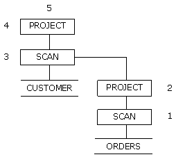

1.  orders 테이블에 있는 주문 번호(ono)를 인덱스를 이용하여 검색한다. 인덱스를 이용한 접근 회수는 20임을 알 수 있다. 인덱스가 생성되지 않은 열을 기준으로 orders 테이블을 조회한다면 조건에 만족하는 열들을 찾기 위해서 전체 orders 테이블을 스캔(full scan) 해야 할 것이다. 즉, 사용자는 full scan을 수행할 것인가, 인덱스를 사용해서 scan을 할 것인가를 plan 노드의 비용 정보를 비교해서 선택할 수 있다.
    
2.  orders 테이블에서 cno인 열을 찾아 열의 개수가 하나인 새로운 relation1을 만든다.
    
3.  c.cno = o.cno 조건을 만족하는 레코드를 검색하기 위해 전체 customer 테이블을 full scan 한다. access의 회수는 customer 테이블에 있는 레코드 개수(20)만큼이다.
    
4.  customer 테이블에서 cname인 열을 찾아 새로운 relation2를 만든다.

5.  relation2를 출력한다.

#### 실행 계획 트리의 해석

여기에서는 실행 계획을 해석하는 방법을 예제를 들어 간략히 설명한다. 각 실행 노드들이 트리 형태로 연결된 전체 실행 계획 트리를 따라가면서 실행 순서가 결정된다.


실행 계획 트리에서 하나의 노드는 한 행에 표시된다. 왼쪽으로 들여쓰기가 많이 되어 있는 노드일수록 하위 노드이며 가장 먼저 수행된다.

위 예제에서 가장 최상위 노드는 PROJ 노드이며 최하위 노드는 테이블 T1의 SCAN 노드와 테이블 T2의 SCAN 노드이다. T1 SCAN 노드와 T2 SCAN 노드와 같이 같은 크기만큼 들여쓰기가 되어 있는 노드들의 경우 먼저 나타나는 노드가 상위 노드의 왼쪽 노드에 해당한다.

레코드 fetch 요구는 TOP-DOWN으로 이루어지고 처리된 레코드는 BOTTOM-UP 방식으로 반환된다.

위의 예제에서 가장 먼저 데이터베이스에 접근하는 노드는 T1 SCAN 노드이고, 그 다음 T2 SCAN 노드, T3 SCAN 노드의 순서로 수행된다. 노드 옆에 명시한 숫자가 노드 수행 순서이다.

위의 예제에서 나타난 실행 계획을 트리 형태로 나타내면 다음 그림과 같다.

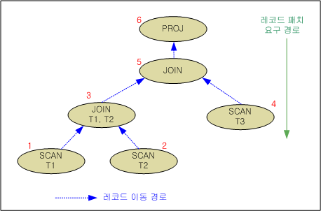

[그림 4‑1] 레코드 요구와 페치(fetch) 경로

### Plan Tree 활용

EXPLAIN PLAN 프로퍼티를 적절히 설정하면 SQL문을 직접 실행하지 않고도 plan tree를 볼 수 있다. 따라서 SQL문의 실행 방법을 볼 수 있을 뿐만 아니라, 다른 plan tree와 비교할 수도 있어 SQL문의 성능 향상에 도움이 될 수 있다.

Plan tree에서 다음과 같은 정보를 얻을 수 있다:

-   옵티마이저에 의해 생성된 실행 계획

-   Objects (테이블, 인덱스, 등)의 속성

-   사용된 index

-   사용된 조인 방법

-   최적화된 조인 순서

개선된 SQL문의 성능을 입증하는 방법은 다음과 같다.

-   새로운 SQL문을 실행하고 그 결과를 이전 SQL문의 실행 결과와 비교한다.

-   새로운 plan tree를 생성하고, 그것을 이전의 plan tree와 비교한다.

-   Object(테이블, 인덱스 등)의 속성들이 정확한가를 확인하기 위하여 속성들을 재검토한다.

### 실행 노드

이 절은 실행 계획 트리를 구성하는 각 실행 노드의 기능과 EXPLAIN PLAN으로 출력되는 형식, 해당 노드가 출력되는 쿼리 예제를 살펴본다.

#### AGGREGATION

##### 출력 형식

```
AGGREGATION ( ITEM_SIZE: item_size, GROUP_COUNT: group_count, COST: cost )
```


| 항목        | 설명                                |
|-------------|-------------------------------------|
| ITEM_SIZE   | 하나의 그룹을 위한 레코드 크기      |
| GROUP_COUNT | 실행 노드에 의해 생성된 그룹의 개수 |
| COST        | 추산 비용                           |

[표 4‑1] AGGREGATION 노드의 정보

##### 설명

AGGREGATION 실행 노드는 관계형 모델에서 aggregation 연산을 수행하는 노드이다. 하나의 자식 노드를 가지며 중간 결과를 저장하기 위한 별도의 공간을 사용하지 않는다. 동일 그룹의 레코드들에 대하여 aggregation을 수행한다.

이 노드는 다음과 같은 질의를 수행하는데 사용된다.

-   정렬 순서를 이용한 aggregation의 수행

-   DISTINCT를 포함하는 절의 aggregation 수행

###### **정렬 순서를 이용한 aggregation 수행**

이 노드가 정렬 순서를 이용한 aggregation 수행을 위해 사용될 경우 다음 예와 같은 실행 계획 정보가 출력된다. 아래의 예를 살펴 보면, GROUPING 실행 노드가 구분한 정보를 이용하여 AGGREGATION 노드가 SUM(i2)를 수행한다. 이 때 구성되는 레코드는 SUM(i2)와 GROUP BY i3를 사용해서 그룹화된다. 아래 예에서는 16byte의 크기의 레코드를 포함하는 그룹이 다섯 개가 구성되었음을 알 수 있다.


###### **DISTINCT를 포함하는 aggregation 수행**

Aggregation함수 내에 DISTINCT가 포함되어 있을 경우 중복 제거 작업이 필요하며 이 경우에 한해 중복 제거를 위한 저장 공간이 사용된다. 아래의 예에서 AGGREGATION 노드는 SUM(DISTINCT i2)를 처리하기 위해서 사용되었다.


##### 예제

총 부서의 수와 모든 사원들의 평균 급여를 출력하라.

```
iSQL> SELECT COUNT(DISTINCT dno), AVG(salary) FROM employees;
COUNT(DISTINCT DNO)  AVG(SALARY) 
------------------------------------
8                    1836.64706  
1 row selected.
-----------------------------------------------
PROJECT ( COLUMN_COUNT: 2, TUPLE_SIZE: 31, COST: 0.03 )
 AGGREGATION ( ITEM_SIZE: 72, GROUP_COUNT: 1, COST: 0.02 )
  SCAN ( TABLE: EMPLOYEES, FULL SCAN, ACCESS: 20, COST: 0.01 )
-----------------------------------------------
```


#### ANTI-OUTER-JOIN

##### 출력 형식

```
ANTI-OUTER-JOIN ( METHOD: method, COST: cost )
```


| 항목   | 설명      |
|--------|-----------|
| METHOD | 조인 방법 |
| COST   | 추산 비용 |

[표 4‑2] ANTI-OUTER-JOIN 노드의 정보

##### 설명

ANTI-OUTER-JOIN 노드는 관계형 모델에서 ANTI OUTER JOIN 조인 연산을 수행하는 노드이다. 이는 두 개의 자식 노드를 가지며, 별도의 중간 결과를 만들지 않으며 자식 노드들의 수행 흐름을 제어한다.

이 노드는 FULL OUTER JOIN만을 위해 사용되며, 아래와 같이 ON 조인 조건에서 참조되는 모든 칼럼에 대하여 인덱스를 사용할 수 있을 때 사용된다.

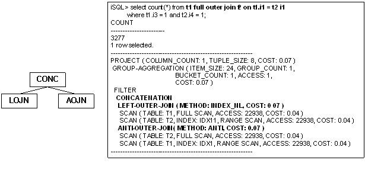

위의 예에서와 같이 FULL OUTER JOIN을 처리하기 위하여 ANTI-OUTER-JOIN 노드는 항상 LEFT-OUTER-JOIN 노드와 부모로 CONC 노드를 갖는다. 이 때, ON 절의 조인 조건은 LEFT-OUTER-JOIN과 ANTI-OUTER-JOIN에서 모두 처리된다.

##### 예제

부서의 위치와 상품을 모아 놓은 장소가 같은 곳의 부서 번호, 부서 이름, 상품
번호를 출력하라.

```
iSQL> CREATE INDEX dep_idx2 ON departments(dep_location);
Create success.
iSQL> CREATE INDEX gds_idx1 ON goods(goods_location);
Create success.
iSQL> SELECT d.dno, d.dname, g.gno
 FROM departments d FULL OUTER JOIN goods g
 ON d.dep_location = g.goods_location;
DNO         DNAME                           GNO
-----------------------------------------------------------
.
.
.
38 rows selected.
-----------------------------------------------------------
PROJECT ( COLUMN_COUNT: 3, TUPLE_SIZE: 46, COST: 0.29 )
 CONCATENATION
  LEFT-OUTER-JOIN ( METHOD: INDEX_NL, COST: 0.01 )
   SCAN ( TABLE: DEPARTMENTS D, FULL SCAN, ACCESS: 38, COST: 0.00 )
   SCAN ( TABLE: GOODS G, INDEX: GDS_IDX1, RANGE SCAN, ACCESS: 38, COST: 0.02 )
  ANTI-OUTER-JOIN( METHOD: ANTI, COST: 0.01 )
   SCAN ( TABLE: GOODS G, FULL SCAN, ACCESS: 38, COST: 0.02 )
   SCAN ( TABLE: DEPARTMENTS D, INDEX: DEP_IDX2, RANGE SCAN, ACCESS: 38, COST: 0.00 )
-----------------------------------------------------------
iSQL> DROP INDEX dep_idx2;
Drop success.
iSQL> DROP INDEX gds_idx1;
Drop success.
```


#### BAG-UNION

##### 출력 형식

```
BAG-UNION
```


##### 설명

BAG-UNION 노드는 관계형 모델에서 UNION ALL 연산을 수행하는 노드이다. 이는 두 개 이상의 자식 노드를 가지며, 별도의 중간 결과를 만들지 않으며 자식 노드들의 수행 흐름을 제어한다.

이 노드가 수행되는 예를 보면 다음과 같다.


위의 예를 보면 BAG-UNION 노드는 두 질의의 결과를 단순히 조합하여 UNION ALL을 처리한다.

##### 예제

직업이 판매원인 사원과 급여가 2000000 보다 큰 모든 사원의 이름과 급여를 출력하라.

```
iSQL> SELECT e_firstname, e_lastname, emp_job, salary 
 FROM employees 
 WHERE emp_job = 'SALES REP' 
 UNION ALL 
 SELECT e_firstname, e_lastname, emp_job, salary 
 FROM employees 
 WHERE salary > 2000;
E_FIRSTNAME           E_LASTNAME            EMP_JOB          SALARY
------------------------------------------------------------------------------
Farhad                Ghorbani              PL               2500
Elizabeth             Bae                   programmer       4000
Zhen                  Liu                   webmaster        2750
Yuu                   Miura                 PM               2003
Wei-Wei               Chen                  manager          2300
5 rows selected.
------------------------------------------------------------
PROJECT ( COLUMN_COUNT: 4, TUPLE_SIZE: 70, COST: 0.58 )
 VIEW ( ACCESS: 5, COST: 0.43 )
  BAG-UNION
   PROJECT ( COLUMN_COUNT: 4, TUPLE_SIZE: 70, COST: 0.18 )
    SCAN ( TABLE: EMPLOYEES, FULL SCAN, ACCESS: 20, COST: 0.14 )
   PROJECT ( COLUMN_COUNT: 4, TUPLE_SIZE: 70, COST: 0.26 )
    SCAN ( TABLE: EMPLOYEES, FULL SCAN, ACCESS: 20, COST: 0.14 )
------------------------------------------------------------
```


#### CONCATENATION

##### 출력 형식

```
CONCATENATION
```


##### 설명

CONCATENATION 실행 노드는 관계형 모델에서 concatenation 연산을 수행하는 노드이다. 이는 두개의 자식 노드를 가지며, 별도의 중간 결과를 만들지 않으며 자식 노드들의 수행 흐름을 제어한다.

이 노드는 FULL OUTER JOIN의 처리와 DNF 처리에서 사용된다. FULL OUTER JOIN에서의 사용은 ANTI-OUTER-JOIN 노드에서 이미 그 예를 설명하였으며, 여기서는 DNF로 처리 시에 CONCATENATION 노드가 사용되는 예를 살펴 본다.


여기서 (i1 = 1000) 조건은 왼쪽 SCAN 실행 노드에서 처리되며, (i2 = 100) 조건은 오른쪽 SCAN 실행 노드에서 처리된다. 이렇게 함으로서 IDX1 과 IDX2 인덱스가 모두 사용될 수 있으며 위 결과를 조합하기 위하여 CONCATENATION 실행 노드가 사용된다. FILTER 노드는 좌측 SCAN과 중복되는 결과를 제거하기 위하여 사용된다.

##### 예제

ANTI-OUTER-JOIN 노드의 예제를 참고하기 바란다.

#### CONNECT BY

##### 출력 형식

```
CONNECT BY ( ACCESS: acc_num, COST: cost )
```

| 항목   | 설명                 |
|--------|----------------------|
| ACCESS | 레코드에 접근한 횟수 |
| COST   | 추산 비용            |

[표 4‑3] 인덱스가 없는 CONNECT BY 노드의 정보


```
CONNECT BY (INDEX: index_name, ACCESS: acc_num, COST: cost )
```

| 항목   | 설명                   |
|--------|------------------------|
| INDEX  | 사용하는 인덱스의 이름 |
| ACCESS | 레코드에 접근한 횟수   |
| COST   | 추산 비용              |

[표 4‑4] 인덱스를 사용하는 CONNECT BY 노드의 정보

##### 설명

CONNECT BY 노드는 관계형 모델에 없는 특수한 연산으로 계층 질의를 수행하는 노드이다. 이 노드는 하나의 자식 노드를 가지며, 자식 노드는 항상 materialization 노드이다.

계층 질의 수행시 CONNECT BY 노드가 사용된 예는 다음과 같다.


##### 예제

ID 칼럼의 값이 0인 행을 루트로 하여 계층적으로 연결된 행들을 얻기 위한 계층적 질의문은 다음과 같다.

```
CREATE TABLE hier_order(id INTEGER, parent INTEGER);
INSERT INTO hier_order VALUES(0, NULL);
INSERT INTO hier_order VALUES(1, 0);
INSERT INTO hier_order VALUES(2, 1);
INSERT INTO hier_order VALUES(3, 1);
INSERT INTO hier_order VALUES(4, 1);
INSERT INTO hier_order VALUES(5, 0);
INSERT INTO hier_order VALUES(6, 0);
INSERT INTO hier_order VALUES(7, 6);
INSERT INTO hier_order VALUES(8, 7);
INSERT INTO hier_order VALUES(9, 7);
INSERT INTO hier_order VALUES(10, 6);

iSQL> SELECT id, parent, level FROM hier_order START WITH id = 0 CONNECT BY PRIOR id = parent ORDER BY level;
ID          PARENT      LEVEL
-------------------------------------------------
0                       1
1           0           2
5           0           2
6           0           2
2           1           3
3           1           3
4           1           3
7           6           3
10          6           3
8           7           4
9           7           4
11 rows selected.
------------------------------------------------------------
PROJECT ( COLUMN_COUNT: 3, TUPLE_SIZE: 16, COST: BLOCKED )
SORT ( ITEM_SIZE: BLOCKED, ITEM_COUNT: 11, ACCESS: 11, COST: BLOCKED )
CONNECT BY ( ACCESS: 23, COST: BLOCKED )
SCAN ( TABLE: SYS.HIER_ORDER, FULL SCAN, ACCESS: 22, COST: BLOCKED )
------------------------------------------------------------

```


#### COUNT

##### 출력 형식

1) 인덱스가 사용되는 경우:

```
COUNT (TABLE: tbl_name, INDEX: index_name, ACCESS: acc_num, DISK_PAGE_COUNT: num, COST: cost )
```

2) 인덱스가 사용되지 않는 경우:

```
COUNT (TABLE: tbl_name, FULL SCAN, ACCESS: acc_num, DISK_PAGE_COUNT: num, COST: cost )
```

| 항목            | 설명                                                          |
|-----------------|---------------------------------------------------------------|
| TABLE           | 접근하는 테이블의 이름                                        |
| INDEX           | 사용하는 인덱스의 이름                                        |
| ACCESS          | 레코드에 접근한 횟수                                          |
| DISK_PAGE_COUNT | 테이블의 디스크 페이지 개수. 메모리 테이블은 해당 정보가 없음 |
| COST            | 추산 비용                                                     |

[표 4‑4] COUNT 노드의 정보

##### 설명

COUNT 노드는 관계형 모델에서 GROUP BY절이 존재하지 않는 COUNT(\*) 연산을 특별히 처리하기 위한 실행 노드이다.

다음은 COUNT 노드가 사용된 예이다. 아래의 예를 살펴보면 인덱스를 사용함으로써 실제 데이터에는 접근하지 않고 COUNT(\*) 값을 획득하고 있음을 알수 있다.


##### 예제

사원의 총 수를 계산하라.

```
iSQL> SELECT COUNT(*) rec_count FROM employees;
REC_COUNT            
-----------------------
20                   
1 row selected.
-----------------------------------------------
PROJECT ( COLUMN_COUNT: 1, TUPLE_SIZE: 8, COST: 0.02 )
 COUNT ( TABLE: EMPLOYEES, FULL SCAN, ACCESS: 1, COST: 0.02 )
-----------------------------------------------
```


#### DISTINCT

##### 출력 형식

1) 중간 결과가 메모리에 저장되는 경우

```
DISTINCT ( ITEM_SIZE: item_size, ITEM_COUNT: item_count, BUCKET_COUNT: bucket_count, ACCESS: acc_num, COST: cost )
```

2) 중간 결과가 디스크에 저장되는 경우

```
DISTINCT ( ITEM_SIZE: item_size, ITEM_COUNT: item_count, DISK_PAGE_COUNT: page_count, ACCESS: acc_num, COST: cost )
```


| 항목            | 설명                                  |
|-----------------|---------------------------------------|
| ITEM_SIZE       | 중복 제거를 위한 레코드의 크기        |
| ITEM_COUNT      | 중복 제거된 레코드의 개수             |
| BUCKET_COUNT    | 해싱을 위한 버킷의 개수               |
| DISK_PAGE_COUNT | 임시 저장 테이블의 디스크 페이지 개수 |
| ACCESS          | 저장된 레코드에 대한 접근 횟수        |
| COST            | 추산 비용                             |

[표 4‑5] DISTINCT 노드의 정보

##### 설명

DISTINCT 노드는 관계형 모델에서 해싱 방식의 중복 제거 연산을 수행하는 노드이다. 이는 하나의 자식 노드를 가지며, 중간 결과를 저장하기 위하여 임시 공간을 사용한다.

DISTINCT 실행 노드는 매우 다양한 용도로 사용된다. 아래에서 각 용도별로 사용될 때의 실행 계획 트리를 살펴 본다.

###### **DISTINCT에서의 사용**

DISTINCT 노드는 DISTINCT를 처리하기 위하여 사용될 수 있다.

아래의 예는 DISTINCT를 처리하기 위하여 DISTINCT 노드가 사용된 것을 보여준다.


###### **UNION 에서의 사용**

DISTINCT 노드는 UNION을 처리하기 위하여 사용될 수 있다.

아래의 예제에서는 UNION을 처리하기 위하여 DISTINCT 노드가 중복 제거를 위해 사용되었다.


###### **Subquery key range를 위한 사용**

DISTINCT 노드는 subquery key range를 처리하기 위하여 사용될 수 있다. 중복 제거를 통해 동일한 값으로 인덱스를 이용한 검색이 발생하지 않도록 하기 위하여 사용된다.

아래의 예는 DISTINCT 실행 노드가 subquery key range을 처리하기 위하여 중복 제거를 위해 사용된 예이다. DISTINCT 실행 노드는 T2.i4 값의 중복 제거를 위해서 사용되었다.


##### 예제

상품 C111100001을 주문한 고객의 이름을 출력하라.

```
iSQL> SELECT DISTINCT customers.c_firstname||customers.c_lastname  cname
  FROM customers
  WHERE customers.cno IN
    (SELECT orders.cno
     FROM orders
     WHERE orders.gno = 'C111100001 ');
CNAME
--------------------------------------------
Estevan             Sanchez
Pierre              Martin
Phil                Dureault
Fyodor              Fedorov
4 rows selected.
------------------------------------------------------------
PROJECT ( COLUMN_COUNT: 1, TUPLE_SIZE: 42, COST: 0.10 )
 DISTINCT ( ITEM_SIZE: 64, ITEM_COUNT: 4, BUCKET_COUNT: 1024, ACCESS: 4, COST: 0.07 )
  SEMI-MERGE-JOIN ( METHOD: MERGE, COST: 0.03 )
   SCAN ( TABLE: CUSTOMERS, INDEX: __SYS_IDX_ID_153, RANGE SCAN, ACCESS: 17, COST: 0.01 )
   SORT ( ITEM_SIZE: 16, ITEM_COUNT: 4, ACCESS: 4, COST: 0.03 )
    SCAN ( TABLE: ORDERS $$1_$VIEW1_$ORDERS, INDEX: ODR_IDX3, RANGE SCAN, ACCESS: 4, COST: 0.00 )
------------------------------------------------------------
```


#### FILTER

##### 출력 형식

```
FILTER
```


##### 설명

FILTER 노드는 관계형 모델에서 검색(select)연산을 수행하는 물리적 개체이다. 하나의 자식 노드를 가지며 테이블에 직접 접근하지 않고 관련 조건을 검사한다.

FILTER 노드는 노드 이름 외에 별도의 정보를 포함하지 않는다. Filter에 의해 처리되는 조건 정보를 출력하기 위해서는 TRCLOG_DETAIL_PREDICATE 프로퍼티를 설정한다.

###### **FILTER 노드 정보의 출력**

다음 예를 보면 FILTER 노드는 이름만을 출력할 뿐 별도의 다른 정보를 출력하지 않는다. 이 예에서 FILTER 노드는 (having i2 \< 2) 조건을 처리하기 위하여 사용되었다.


이러한 정보를 확인하려면 TRCLOG_DETAIL_PREDICATE 프로퍼티를 1로 설정함으로써 가능하다. 아래와 같이 FILTER 노드가 (i2 \< 2) 조건을 처리하기 위하여 사용되었음을 확인할 수 있다.


##### 예제

2개 이상 주문된 상품의 상품번호와 주문양을 출력하라.

```
iSQL> SELECT gno, COUNT(*)
  FROM orders
  GROUP BY gno
  HAVING COUNT(*) > 2;
GNO         COUNT                
------------------------------------
A111100002  3                    
C111100001  4                    
D111100008  3                    
E111100012  3                    
4 rows selected.
-----------------------------------------------
PROJECT ( COLUMN_COUNT: 2, TUPLE_SIZE: 24, COST: 0.08 )
 FILTER
  AGGREGATION ( ITEM_SIZE: 16, GROUP_COUNT: 16, COST: 0.02 )
   GROUPING
    SCAN ( TABLE: ORDERS, INDEX: ODR_IDX3, FULL SCAN, ACCESS: 30, COST: 0.02 )
-----------------------------------------------
```


#### FULL-OUTER-JOIN

##### 형식

```
FULL-OUTER-JOIN ( METHOD: method, COST: cost )
```


| 항목   | 설명      |
|--------|-----------|
| METHOD | 조인 방법 |
| COST   | 추산 비용 |

[표 4‑6] FULL-OUTER-JOIN 노드의 정보

##### 설명

FULL-OUTER-JOIN 노드는 관계형 모델에서 FULL OUTER JOIN 연산을 수행하는 노드이다. 두개의 자식 노드를 가지며, 별도의 중간 결과를 만들지 않으며 자식 노드들의 수행 흐름을 제어한다.

FULL-OUTER-JOIN 실행 노드는 일반 조인과 마찬가지로 대부분의 조인 방법에 사용되며, 이는 JOIN 노드의 예를 참조한다. 여기서는 FULL-OUTER-JOIN 실행 노드가 사용되는 간단한 실행 계획 트리만을 살펴본다.


FULL OUTER JOIN의 특성 상 우측에 저장을 위한 노드가 생성되며, 위의 예에서 ON 조건은 SORT 노드에서 처리된다.

##### 예제

부서의 위치와 상품을 모아 놓은 장소가 같은 곳의 부서 번호, 부서 이름, 상품 번호를 출력하라.

```
iSQL> INSERT INTO departments VALUES(6002, 'headquarters', 'CE0002', 100);
1 row inserted.
iSQL> SELECT d.dno, d.dname, g.gno
FROM departments d FULL OUTER JOIN goods g
 ON d.dep_location = g.goods_LOCATION;
DNO         DNAME                           GNO
------------------------------------------------------------
                                            A111100001
                                            A111100002
                                            B111100001
                                            C111100001
                                            C111100002
                                            D111100001
                                            D111100002
                                            D111100003
                                            D111100004
                                            D111100005
                                            D111100006
                                            D111100007
                                            D111100008
                                            D111100009
                                            D111100010
                                            D111100011
                                            E111100001
                                            E111100002
                                            E111100003
                                            E111100004
6002        headquarters                    E111100005
                                            E111100006
                                            E111100007
                                            E111100008
                                            E111100009
                                            E111100010
                                            E111100011
                                            E111100012
                                            E111100013
                                            F111100001
1001        RESEARCH DEVELOPMENT DEPT 1
1002        RESEARCH DEVELOPMENT DEPT 2
1003        SOLUTION DEVELOPMENT DEPT
2001        QUALITY ASSURANCE DEPT
3001        CUSTOMERS SUPPORT DEPT
3002        PRESALES DEPT
4001        MARKETING DEPT
4002        BUSINESS DEPT
38 rows selected.
------------------------------------------------------------
PROJECT ( COLUMN_COUNT: 3, TUPLE_SIZE: 46, COST: 0.60 )
 FULL-OUTER-JOIN ( METHOD: HASH, COST: 0.29 )
  SCAN ( TABLE: GOODS G, FULL SCAN, ACCESS: 38, COST: 0.02 )
  HASH ( ITEM_SIZE: 24, ITEM_COUNT: 9, BUCKET_COUNT: 1024, ACCESS: 38, COST: 0.29 )
   SCAN ( TABLE: DEPARTMENTS D, FULL SCAN, ACCESS: 38, COST: 0.01 )
------------------------------------------------------------
```


#### GROUP-AGGREGATION

##### 출력 형식

1) 중간 결과가 메모리에 저장되는 경우

```
GROUP-AGGREGATION ( ITEM_SIZE: item_size, GROUP_COUNT: group_count, BUCKET_COUNT: bucket_count, ACCESS: acc_num, COST: cost )
```

2) 중간 결과가 디스크에 저장되는 경우

```
GROUP-AGGREGATION ( ITEM_SIZE: item_size, GROUP_COUNT: group_count, DISK_PAGE_COUNT: page_count, ACCESS: acc_num, COST: cost )
```


| 항목            | 설명                                           |
|-----------------|------------------------------------------------|
| ITEM_SIZE       | 그룹 연산을을 위해 해싱 되는 각 레코드의 크기  |
| GROUP_COUNT     | 그룹의 개수                                    |
| BUCKET_COUNT    | 해싱을 위한 버킷의 개수                        |
| DISK_PAGE_COUNT | 임시 저장 테이블을 구성하는 디스크 페이지 개수 |
| ACCESS          | 저장된 레코드에 대한 접근 횟수                 |
| COST            | 추산 비용                                      |

[표 4‑7] GRAG 노드의 정보

##### 설명

GROUP-AGGREGATION 노드는 관계형 모델에서 해싱 방식의 그룹 및 aggregation 연산을 수행하는 노드이다. 이 노드는 하나의 자식 노드를 가지며, 중간 결과를 저장하기 위하여 임시 공간을 사용한다.

아래의 예는 해싱 방식의 그룹화와 aggregation 연산을 처리하기 위하여 GROUP-AGGREGATION 노드가 사용된 경우이다. GROUP-AGGREGATION 노드는 GROUP BY i4와 AVG(i1), SUM(i2)를 처리하기 위하여 사용되었다.


##### 예제

각 부서내의 각 직위에 대해 지급되는 급여 총액을 출력하라. (여러 열에 GROUP BY 절을 사용)

```
iSQL> SELECT dno, emp_job, COUNT(emp_job) num_emp, SUM(salary) sum_sal FROM employees GROUP BY dno, emp_job;
DNO  EMP_JOB    NUM_EMP SUM_SAL 
-----------------------------------------------
.
.
.
16 rows selected.
------------------------------------------------------------
PROJECT ( COLUMN_COUNT: 4, TUPLE_SIZE: 55, COST: 0.80 )
 GROUP-AGGREGATION ( ITEM_SIZE: 56, GROUP_COUNT: 16, BUCKET_COUNT: 1024, ACCESS: 16, COST: 0.13 )
  SCAN ( TABLE: EMPLOYEES, FULL SCAN, ACCESS: 20, COST: 0.01 )
------------------------------------------------------------
```


#### GROUP-CUBE

##### 출력 형식

```
GROUP-CUBE ( ACCESS: acc_num, COST:  )
```

| 항목   | 설명                 |
| ------ | -------------------- |
| ACCESS | 레코드에 접근한 횟수 |
| COST   | 추산 비용            |

##### 설명

GROUP-CUBE 노드는 관계형 모델에서 CUBE 절을 처리하기 위한 노드이다.

CUBE는 GROUP BY 절과 함께 사용되며, 명시된 그룹화 칼럼들의 가능한 모든 조합으로 그룹화를 수행한다.

```sql
iSQL> select i1, i2, count( i3 ) from t1 group by cube(i1,i2);
I1          I2          COUNT(I3)
-------------------------------------------------
                        10
1           1           1
1           2           2
1           3           1
1           5           1
1           6           1
1                       6
2           6           1
2           7           1
2           9           2
2                       4
            1           1
            2           2
            3           1
            5           1
            6           2
            7           1
            9           2
18 rows selected.
------------------------------------------------------------
PROJECT ( COLUMN_COUNT: 3, TUPLE_SIZE: 16, COST: 185.09 )
 GROUP-CUBE ( ACCESS: 18, COST: 177.17 )
  SCAN ( TABLE: SYS.T1, FULL SCAN, ACCESS: 10, COST: 116.76 )
```


#### GROUP-ROLLUP

##### 출력 형식

```
GROUP-ROLLUP  ( ACCESS: acc_num, COST: cost )
```

| 항목   | 설명                 |
| ------ | -------------------- |
| ACCESS | 레코드에 접근한 횟수 |
| COST   | 추산 비용            |

##### 설명

GROUP-ROLLUP 노드는 관계형 모델에서 ROLLUP 절을 처리하기 위한 노드이다.

ROLLUP은 GROUP BY절의 확장 형태로, GROUP BY절에 의해서 그룹지어진 집합 결과에 대하여 그룹별 집계 정보를 반환하는 기능을 수행한다.

```sql
iSQL> select i1, i2, count( i3 ) from t1 group by rollup(i1,i2);
I1          I2          COUNT(I3)
-------------------------------------------------
1           1           1
1           2           2
1           3           1
1           5           1
1           6           1
1                       6
2           6           1
2           7           1
2           9           2
2                       4
                        10
11 rows selected.
------------------------------------------------------------
PROJECT ( COLUMN_COUNT: 3, TUPLE_SIZE: 16, COST: 152.90 )
 GROUP-ROLLUP ( ACCESS: 11, COST: 146.97 )
  SCAN ( TABLE: SYS.T1, FULL SCAN, ACCESS: 10, COST: 116.76 )
------------------------------------------------------------
```


#### GROUPING

##### 출력 형식

```
GROUPING
```

##### 설명

GROUPING 노드는 관계형 모델에서 정렬 기반의 중복 검사를 수행하는 물리적 개체이다. 하나의 자식 노드를 가지며 자식 노드로부터 반환되는 레코드를 이전에 반환된 레코드와 동일한 지 하나씩 반복해서 검사한다.

다음과 같은 질의를 수행하는 데 사용된다.

-   정렬 순서를 이용한 동일한 그룹 여부 판단

-   정렬 순서를 이용한 중복 제거

-   정렬 순서를 이용한 DISTINCT aggregation의 처리

###### **정렬 순서를 이용한 그룹화**

GROUPING 노드가 정렬 순서를 이용한 동일한 그룹 여부를 판단하기 위해서 사용되는 경우 다음과 같은 형태로 실행 계획이 출력된다. 아래의 예를 보면 GROUPING 노드가 (GROUP BY I3) 절을 처리하기 위해서 사용되었으며, GROUP BY를 처리하기 위하여 별도의 저장 공간을 사용하지 않고 처리되었음을 알 수 있다. 이는 앞서 최적화 과정의 정렬 순서를 이용한 GROUP BY의 처리를 통해 설명하였다.

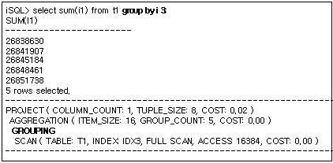

###### **정렬 순서를 이용한 중복 제거**

GROUPING 노드가 정렬 순서를 이용한 중복 제거를 위해서 사용되는 경우 다음과 같은 형태로 실행 계획이 출력된다. 아래의 실행 계획에서 GROUPING 노드는 (DISTINCT i3) 절을 처리하기 위해 사용되었으며, DISTINCT를 위해 별도의 저장 공간을 사용하지 않았음을 알 수 있다. 이는 앞서 최적화 과정에서 정렬 순서를 이용한 DISTINCT 최적화에서 설명하였다.


###### **정렬 순서를 이용한 DISTINCT aggregation 처리**

GROUPING 노드가 정렬 순서를 이용한 DISTINCT aggregation을 처리하기 위해서 사용되는 경우 다음과 같은 형태로 실행 계획이 출력된다. 아래의 예를 살펴보면 (COUNT(DISTINCT i2) )를 처리하는 과정에서 (DISTINCT i2) 절의 중복 제거를 위해서 GROUPING 노드가 사용되었다. 이는 앞서 최적화 과정에서 정렬 순서를 이용한 DISTINCT aggregation 최적화에서 설명하였다.


##### 예제

각 사원이 담당하는 고객들의 수와 각 고객에게 판매한 상품의 총 수를 출력하라.

```
iSQL> SELECT eno, COUNT(DISTINCT cno), SUM(qty) FROM orders GROUP BY eno;
ENO         COUNT(DISTINCT CNO)  SUM(QTY)
----------------------------------------------------------
12          8                    17870
19          6                    25350
20          8                    13210
3 rows selected.
-----------------------------------------------
PROJECT ( COLUMN_COUNT: 3, TUPLE_SIZE: 24, COST: 0.77 )
 AGGREGATION ( ITEM_SIZE: 32, GROUP_COUNT: 3, COST: 0.02 )
  GROUPING
   SCAN ( TABLE: ORDERS, INDEX: ODR_IDX1, FULL SCAN, ACCESS: 30, COST: 0.02 )
-----------------------------------------------
```


#### HASH

##### 출력 형식

1) 중간 결과가 메모리에 저장될 경우

```
HASH ( ITEM_SIZE: item_size, ITEM_COUNT: item_count, BUCKET_COUNT: bucket_count, ACCESS: acc_num, COST: cost )
```

2) 중간 결과가 디스크에 저장될 경우

```
HASH ( ITEM_SIZE: item_size, ITEM_COUNT: item_count, DISK_PAGE_COUNT: page_count, ACCESS: acc_num, COST: cost ) 
```


| 출력 항목       | 설명                                           |
|-----------------|------------------------------------------------|
| ITEM_SIZE       | 해싱을 위한 레코드의 크기                      |
| ITEM_COUNT      | 해싱에 포함된 레코드의 개수                    |
| BUCKET_COUNT    | 해싱을 위한 버킷의 개수                        |
| DISK_PAGE_COUNT | 임시 저장 테이블을 구성하는 디스크 페이지 개수 |
| ACCESS          | 저장된 레코드에 대한 접근 횟수                 |
| COST            | 추산 비용                                      |

[표 4‑8] HASH 노드의 정보

##### 설명

HASH 노드는 관계형 모델에서 해싱 연산을 수행하는 노드이다. 이 노드는 하나의 자식 노드를 가지며, 중간 결과를 저장하기 위하여 임시 공간을 사용한다.

HASH 노드는 매우 다양한 용도로 사용된다. 아래에서 각 용도별로 사용될 때의 실행 계획 트리를 살펴 본다.

###### **조인에서의 사용**

HASH 노드는 조인을 수행하기 위하여 사용될 수 있다.

아래의 예는 조인을 처리하기 위하여 HASH 노드가 생성된 경우이다. T1.i1 = T2.i1 조인 조건을 검사하기 위하여 hash-based 조인이 수행되는데, 이를 위해 HASH 노드가 생성되었다.


###### **Subquery 검색에서의 사용**

HASH 노드는 subquery와의 비교 연산을 수행하기 위하여 사용될 수 있다.

아래의 예는 i4 in ( select i4 from t2 ) 를 처리하기 위하여 HASH 실행 노드가 사용된 경우이다. HASH 노드는 t2.i4 값을 해싱하여 저장하고 각 t1.i4 에 부합하는 값이 HASH에 존재하는 지를 검사한다.


##### 예제

모든 부서 관리자의 이름과 부서 이름을 출력하라.

```
iSQL> ALTER SESSION SET EXPLAIN PLAN = OFF;
Alter success.
iSQL> CREATE TABLE dept2 TABLESPACE sys_tbs_disk_data 
AS SELECT * FROM department;
Create success.
iSQL> CREATE TABLE manager(
 eno INTEGER PRIMARY KEY,
 mgr_no INTEGER,
 mname VARCHAR(20),
 address VARCHAR(60))
 TABLESPACE sys_tbs_disk_data;
Create success.
iSQL> INSERT INTO manager VALUES(2, 1, 'HJNO', '11 Inyoung Bldg. Nonhyun-dong Kangnam-guSeoul, Korea');
1 row inserted.
iSQL> INSERT INTO manager VALUES(7, 2, 'HJMIN', '44-25 Youido-dong Youngdungpo-gu Seoul, Korea');
1 row inserted.
iSQL> INSERT INTO manager VALUES(8, 7, 'JDLEE', '3101 N. Wabash Ave. Brooklyn, NY');
1 row inserted.
iSQL> INSERT INTO manager VALUES(12, 7, 'MYLEE', '130 Gongpyeongno Jung-gu Daegu, Korea');
1 row inserted.
iSQL> ALTER SESSION SET EXPLAIN PLAN = ON;
Alter success.
iSQL> SELECT m.mname, d.dname
 FROM dept2 d, manager m
 WHERE d.mgr_no = m.mgr_no;
MNAME                 DNAME
---------------------------------------------------------
JDLEE                 BUSINESS DEPT
MYLEE                 BUSINESS DEPT
2 rows selected.
------------------------------------------------------------
PROJECT ( COLUMN_COUNT: 2, TUPLE_SIZE: 54, COST: 28.11 )
 JOIN ( METHOD: HASH, COST: 28.09 )
  SCAN ( TABLE: DEPT2 D, FULL SCAN, ACCESS: 9, DISK_PAGE_COUNT: 64, COST: 14.01 )
  HASH ( ITEM_SIZE: 32, ITEM_COUNT: 4, DISK_PAGE_COUNT: 64, ACCESS: 2, COST: 28.09 )
   SCAN ( TABLE: MANAGER M, FULL SCAN, ACCESS: 4, DISK_PAGE_COUNT: 64, COST: 14.00 )
------------------------------------------------------------
```


#### JOIN

##### 출력 형식

```
JOIN ( METHOD: method, COST: cost )
```


| 항목   | 설명      |
|--------|-----------|
| METHOD | 조인 방법 |
| COST   | 추산 비용 |

[표 4‑9] JOIN 노드의 정보

##### 설명

JOIN 노드는 관계형 모델에서 조인 연산을 수행하는 노드이다. 두개의 자식 노드를 가지며, 별도의 중간 결과를 만들지 않으며 자식 노드들의 수행 흐름을 제어한다.

JOIN 노드는 거의 모든 일반 조인 수행을 위하여 사용된다.

아래에서 다음과 같은 다양한 조인 방법들이 어떠한 형태의 실행 계획 트리로 출력되는지를 살펴본다.

-   Full nested loop join

-   Full store nested loop join

-   Index nested loop join

-   Inverse index nested loop join

-   One-pass sort join

-   Two-pass sort join

-   Inverse sort join

-   One-pass hash join

-   Two-pass hash join

-   Inverse hash join

아래의 예제에서 동일한 질의가 다양한 조인 방법으로 처리되며, 각 방법에 대한 실행 계획 트리의 정보를 보여준다.

좌측은 조인 수행 방법에 대한 실행 계획 트리의 일부를 그림으로 도식화한 것이며, 우측은 실제 실행 계획이다.

###### **Full nested loop join의 실행 계획 트리**

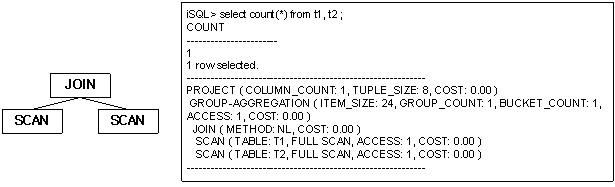

위의 실행 계획에서 조인 조건은 우측 SCAN 노드에서 처리된다. T2 테이블에 대한 반복적인 전체 검색을 통해 처리된다.

###### **Full store nested loop join의 실행 계획 트리**


위의 실행 계획에서 조인 조건은 JOIN 상위의 FILTER 노드에서 처리된다. T2 테이블에 대한 검색은 한 번만 이루어지며 그 결과를 저장한 후 반복적으로 전체 검색을 통해 처리된다.

###### **Index nested loop join의 실행 계획 트리**


위의 실행 계획에서 조인 조건은 우측 SCAN 노드에서 인덱스를 이용하여 처리된다.

###### **Inverse index nested loop join의 실행 계획 트리**


###### **One-pass sort join의 실행 계획 트리**

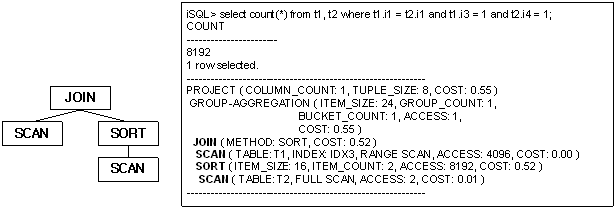

위의 실행 계획에서 조인 조건은 우측 SORT 노드에서 정렬된 데이터를 이용하여 처리된다.

###### **Two-pass sort join의 실행 계획 트리**


위의 실행 계획에서 조인 조건은 우측 SORT 노드에서 정렬된 데이터를 이용하여 처리되지만, 좌측에도 SORT 노드가 생성된다.

###### **Inverse sort join의 실행 계획 트리**

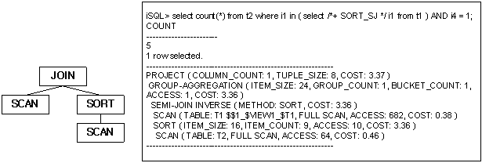

###### **One-pass hash join의 실행 계획 트리**


위의 실행 계획에서 조인 조건은 우측 HASH 노드에서 해싱된 데이터를 이용하여 처리된다.

###### **Two-pass hash join의 실행 계획 트리**


위의 실행 계획에서 조인 조건은 우측 HASH 노드에서 정렬된 데이터를 이용하여 처리되지만, 좌측에도 HASH 노드가 생성된다.

###### **Inverse hash join의 실행 계획 트리**


##### 예제

성(last name)이 ‘Marquez’인 직원의 직원 번호, 주문 번호, 상품 번호, 주문양을 출력하라.

```
iSQL> SELECT e.eno, ono, cno, gno, qty 
 FROM employees e, orders o 
 WHERE e.eno = o.eno 
 AND e.e_lastname = 'Marquez';
ENO         ONO                  CNO                  GNO         QTY
---------------------------------------------------------------------------
19          11290100             11                   E11110000   1500
19          12100277             5                    D111100008  2500
19          12300001             1                    D111100004  1000
19          12300005             4                    D111100008  4000
19          12300010             16                   D111100010  2000
19          12310004             5                    E111100010  5000
19          12310008             1                    D111100003  100
19          12310011             15                   E111100012  10000
19          12310012             1                    C111100001  250
9 rows selected.
------------------------------------------------------------
PROJECT ( COLUMN_COUNT: 5, TUPLE_SIZE: 40, COST: 0.30 )
 JOIN ( METHOD: INDEX_NL, COST: 0.15 )
  SCAN ( TABLE: EMPLOYEES E, FULL SCAN, ACCESS: 20, COST: 0.14 )
  SCAN ( TABLE: ORDERS O, INDEX: ODR_IDX1, RANGE SCAN, ACCESS: 9, COST: 0.02 )
------------------------------------------------------------
```


#### LEFT-OUTER-JOIN

##### 출력 형식

```
LEFT-OUTER-JOIN ( METHOD: method, SKIP RIGHT COUNT: count, COST: cost )
```

| 항목             | 설명                                                         |
| ---------------- | ------------------------------------------------------------ |
| METHOD           | 조인 방법                                                    |
| SKIP RIGHT COUNT | 오른쪽 읽기 skip 횟수<br/>- TRCLOG_DETAIL_INFORMATION = 1 일 때 출력<br/>- skip 횟수가 '0'인 경우 출력하지 않음 |
| COST             | 추산 비용                                                    |

[표 4‑10] LEFT-OUTER-JOIN 노드의 정보

##### 설명

LEFT-OUTER-JOIN 노드는 관계형 모델에서 LEFT OUTER JOIN 연산을 수행하는 노드이다. 이는 두개의 자식 노드를 가지며, 별도의 중간 결과를 만들지 않으며 자식 노드들의 수행 흐름을 제어한다.

LEFT-OUTER-JOIN 노드는 일반 조인과 마찬가지로 대부분의 조인 방법에 사용되며, 이는 JOIN 노드의 예를 참조한다. 여기서는 LEFT-OUTER-JOIN 실행 노드가 사용되는 간단한 실행 계획 트리만을 살펴본다.


##### 예제

모든 부서에 대한 부서 번호와 모든 사원 이름을 출력하라. (사원이 전혀 없는 부서 번호 5001도 출력된다.)

```
iSQL> INSERT INTO departments VALUES(5001, 'Quality Assurance', 'Mokpo', 22);
1 row inserted.
iSQL> SELECT d.dno, e.e_firstname, e.e_lastname FROM departments d LEFT OUTER JOIN employees e ON d.dno = e.dno ORDER BY d.dno;
DNO         E_FIRSTNAME           E_LASTNAME
------------------------------------------------------------
1001        Ken                   Kobain
1001        Wei-Wei               Chen
1002        Ryu                   Momoi
1002        Mitch                 Jones
1003        Elizabeth             Bae
1003        Zhen                  Liu
1003        Yuu                   Miura
1003        Jason                 Davenport
2001        Takahiro              Fubuki
3001        Aaron                 Foster
3002        Chan-seung            Moon
3002        Farhad                Ghorbani
4001        Xiong                 Wang
4001        Curtis                Diaz
4001        John                  Huxley
4002        Gottlieb              Fleischer
4002        Sandra                Hammond
4002        Alvar                 Marquez
4002        William               Blake
5001
20 rows selected.
------------------------------------------------------------
PROJECT ( COLUMN_COUNT: 3, TUPLE_SIZE: 46, COST: 0.20 )
 LEFT-OUTER-JOIN ( METHOD: INDEX_NL, COST: 0.01 )
  SCAN ( TABLE: DEPARTMENTS D, INDEX: __SYS_IDX_ID_170, FULL SCAN, ACCESS: 9, COST: 0.01 )
  SCAN ( TABLE: EMPLOYEES E, INDEX: EMP_IDX1, RANGE SCAN, ACCESS: 20, COST: 0.01 )
------------------------------------------------------------
```


#### LIMIT-SORT

##### 출력 형식

```
LIMIT-SORT ( ITEM_SIZE: item_size, ITEM_COUNT: item_count, STORE_COUNT: store_count, ACCESS: acc_num, COST: cost )
```

| 항목        | 설명                           |
|-------------|--------------------------------|
| ITEM_SIZE   | 정렬을 위한 저장 레코드의 크기 |
| ITEM_COUNT  | 사용된 레코드의 개수           |
| STORE_COUNT | 저장된 레코드의 개수           |
| ACCESS      | 저장된 레코드에 대한 접근 횟수 |
| COST        | 추산 비용                      |

[표 4‑11] LIMIT-SORT 노드의 정보

##### 설명

LIMIT-SORT 노드는 관계형 모델에서 제한된 정렬 연산을 수행하는 노드이다. 이는 하나의 자식 노드를 가지며, 중간 결과를 저장하기 위하여 임시 공간을 사용한다.

LIMIT-SORT 노드는 매우 다양한 용도로 사용된다. 아래에서 각 용도별로 사용될 때의 실행 계획 트리를 살펴 본다.

###### **ORDER BY에서의 사용**

LIMIT-SORT 노드는 LIMIT을 포함한 ORDER BY에 사용될 수 있다.

아래의 예는 LIMIT-SORT 노드가 ORDER BY를 위하여 사용된 경우이다. 실행 계획 정보를 살펴 보면, 3개의 저장 공간만 사용하여 16384건의 레코드에 대한 정렬을 수행함을 알 수 있다.


###### **Subquery 검색에서의 사용**

LIMIT-SORT 노드는 subquery 검색을 위하여 사용될 수 있다.

아래의 예는 LIMIT-SORT 노드가 일부 레코드만 정렬 저장하여 subquery 검색을 수행하고 있음을 보이고 있다. 여기서 LIMIT-SORT 노드는 질의 처리에 필요한 t2.i4 값 중 일부만을 저장하여 이에 대한 비교 연산의 비용을 줄이고 있다.

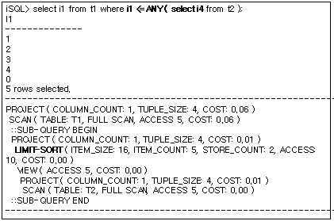

##### 예제

모든 사원의 이름, 부서 번호 및 급여를 표시하고 부서 번호와 급여를 기준(부서 번호는 올림차순, 그리고 급여는 내림차순으로)으로 정렬해서 상위 10개만 출력하라. (ORDER BY 절의 목록의 순서가 정렬 순서이다.)

```
iSQL> SELECT e_firstname, e_lastname, dno, salary 
 FROM employees 
 ORDER BY dno, salary DESC 
 LIMIT 10;
E_FIRSTNAME           E_LASTNAME            DNO         SALARY
-------------------------------------------------------------------------
Wei-Wei               Chen                  1001        2300
Ken                   Kobain                1001        2000
Ryu                   Momoi                 1002        1700
Mitch                 Jones                 1002        980
Elizabeth             Bae                   1003        4000
Zhen                  Liu                   1003        2750
Yuu                   Miura                 1003        2003
Jason                 Davenport             1003        1000
Takahiro              Fubuki                2001        1400
Aaron                 Foster                3001        1800
10 rows selected.
------------------------------------------------------------
PROJECT ( COLUMN_COUNT: 4, TUPLE_SIZE: 55, COST: 0.31 )
 LIMIT-SORT ( ITEM_SIZE: 16, ITEM_COUNT: 20, STORE_COUNT: 10, ACCESS: 10, COST: 0.14 )
  SCAN ( TABLE: EMPLOYEES, FULL SCAN, ACCESS: 20, COST: 0.01 )
------------------------------------------------------------
```


#### MATERIALIZATION

##### 출력 형식

```
MATERIALIZATION ( ACCESS: acc_num, COST: cost )
```

| 항목   | 설명                           |
|--------|--------------------------------|
| ACCESS | 저장된 레코드에 대한 접근 횟수 |
| COST   | 추산 비용                      |

[표 4‑12] MATERIALIZATION 노드의 정보

##### 설명

MATERIALIZATION 노드는 뷰에 대한 임시 저장 테이블을 생성하는 노드이다. 하나의 자식 노드를 가지며, 중간 결과를 저장하기 위하여 임시 공간을 사용한다.

##### 예제

자신이 속한 부서의 평균 급여보다는 많은 급여를 받고, 가장 높은 평균 급여를 갖는 부서의 평균 급여보다는 적게 받는 사원의 이름, 부서 번호, 급여를 출력하라.

```
iSQL> CREATE VIEW v1 AS 
 (SELECT dno, AVG(salary) avg_sal 
 FROM employees GROUP BY dno);
Create success.

iSQL> SELECT e_firstname, e_lastname, e.dno, e.salary 
 FROM employees e, v1 
 WHERE e.dno = v1.dno 
  AND e.salary > v1.avg_sal 
  AND e.salary < (SELECT MAX(avg_sal) 
  FROM v1);
E_FIRSTNAME           E_LASTNAME            DNO         SALARY
-------------------------------------------------------------------------
Wei-Wei               Chen                  1001        2300
Ryu                   Momoi                 1002        1700
John                  Huxley                4001        1900
Sandra                Hammond               4002        1890
Alvar                 Marquez               4002        1800
5 rows selected.
------------------------------------------------------------
PROJECT ( COLUMN_COUNT: 4, TUPLE_SIZE: 55, COST: 0.32 )
 JOIN ( METHOD: INDEX_NL, COST: 0.28 )
  VIEW-SCAN ( VIEW: V1, ACCESS: 9, COST: 0.01 )
   MATERIALIZATION ( ITEM_SIZE: 40, ITEM_COUNT: 9, COST: 0.00 )
    VIEW ( ACCESS: 9, COST: 0.00 )
     PROJECT ( COLUMN_COUNT: 2, TUPLE_SIZE: 25, COST: 0.21 )
      AGGREGATION ( ITEM_SIZE: 72, GROUP_COUNT: 9, COST: 0.01 )
       GROUPING
        SCAN ( TABLE: EMPLOYEES, INDEX: EMP_IDX1, FULL SCAN, ACCESS: 20, COST: 0.01 )
  SCAN ( TABLE: EMPLOYEES E, INDEX: EMP_IDX1, RANGE SCAN, ACCESS: 19, COST: 0.27 )
   ::SUB-QUERY BEGIN
   PROJECT ( COLUMN_COUNT: 1, TUPLE_SIZE: 23, COST: 0.03 )
    STORE ( ITEM_SIZE: 32, ITEM_COUNT: 1, ACCESS: 7, COST: 0.03 )
     VIEW ( ACCESS: 1, COST: 0.00 )
      PROJECT ( COLUMN_COUNT: 1, TUPLE_SIZE: 23, COST: 0.03 )
       GROUP-AGGREGATION ( ITEM_SIZE: 40, GROUP_COUNT: 1, BUCKET_COUNT: 1, ACCESS: 1, COST: 0.02 )
        VIEW-SCAN ( VIEW: V1, ACCESS: 9, COST: 0.01 )
   ::SUB-QUERY END
------------------------------------------------------------
```


#### MERGE-JOIN

##### 출력 형식

```
MERGE-JOIN ( METHOD: method, COST: cost )
```

| 항목   | 설명      |
|--------|-----------|
| METHOD | 조인 방법 |
| COST   | 추산 비용 |

[표 4‑13] MERGE-JOIN 노드의 정보

##### 설명

MERGE-JOIN 노드는 관계형 모델에서 머지 조인 연산을 수행하는 노드이다. 이는 두개의 자식 노드를 가지며, 별도의 중간 결과를 만들지 않으며 자식 노드들의 수행 흐름을 제어한다. MERGE-JOIN 실행 노드는 자식 노드로 SCAN, SORT, MERGE-JOIN 중 하나를 취한다.

MERGE-JOIN 노드는 일반 조인 수행을 위하여 사용되며, 좌우 자식 노드를 모두 정렬하거나 정렬된 순서를 이용하여 처리한다.

자식 노드의 종류에 따라 9가지의 머지 조인의 형태가 가능하며, 여기서는 대표적인 두 가지의 실행 계획 트리에 대해서만 살펴 본다.

###### **인덱스를 이용한 머지 조인**


위의 실행 계획에서 조인 조건은 MERGE-JOIN 노드에서 처리되며 기본 테이블과 반복 테이블의 개념 없이 조인 조건에 포함된 칼럼의 인덱스가 모두 사용된다.

###### **정렬을 이용한 머지 조인**


위의 실행 계획에서 조인 조건은 MERGE-JOIN 노드에서 처리되며 조인 조건에 포함된 칼럼을 기준으로 정렬한 후 이를 이용한다.

##### 예제

2010년 1월 1일 이전에 입사한 모든 사원의 사원번호, 이름, 소속된 부서의 부서 번호와 부서 이름을 출력하라. (두 테이블 모두 조인 술어와 관련된 칼럼에 인덱스가 존재하여야 한다. 인덱스 스캔을 하므로 이 노드의 좌, 우 노드들(SCAN node)로부터 dno 값으로 정렬되어 레코드가 반환된다. 따라서, 두 값의 대소 차이가 발생하는 이후의 레코드는 검색하지 않고 다시 같은 값을 가지는 레코들를 만날 때까지 두 테이블의 커서를 이동하여 검색한다.)

```
iSQL> SELECT /*+ use_merge(employees,departments) */e.eno, e_lastname, d.dno, dname 
 FROM employees e, departments d 
 WHERE e.dno = d.dno 
  AND TO_CHAR(join_date, 'YYYY-MM-DD HH:MI:SS') < '2010-01-01 00:00:00';
ENO         E_LASTNAME            DNO         DNAME
---------------------------------------------------------------------------
5           Ghorbani              3002        PRESALES DEPT
8           Wang                  4001        MARKETING DEPT
18          Huxley                4001        MARKETING DEPT
7           Fleischer             4002        BUSINESS DEPT
12          Hammond               4002        BUSINESS DEPT
20          Blake                 4002        BUSINESS DEPT
6 rows selected.
------------------------------------------------------------
PROJECT ( COLUMN_COUNT: 4, TUPLE_SIZE: 60, COST: 0.34 )
 MERGE-JOIN ( METHOD: MERGE, COST: 0.24 )
  SCAN ( TABLE: EMPLOYEES E, INDEX: EMP_IDX1, RANGE SCAN, ACCESS: 19, COST: 0.21 )
  SCAN ( TABLE: DEPARTMENTS D, INDEX: __SYS_IDX_ID_153, RANGE SCAN, ACCESS: 15, COST: 0.01 )
------------------------------------------------------------
```


#### PARALLEL-QUEUE

##### 출력 형식

```
PARALLEL-QUEUE ( TID: tid )
```


| 항목 | 설명                                 |
|------|--------------------------------------|
| TID  | 노드에서 실행되는 쓰레드의 식별 번호 |

[표 4‑14] PARALLEL-QUEUE 노드의 정보

##### 설명

PARALLEL-QUEUE는 병렬 질의를 수행하는 노드이다. 이 노드는 새로운 쓰레드로 하여금 하위 노드를 실행하게 하고, 실행 결과를 상위 노드로 전달한다.

다음은 PARALLEL-QUEUE 노드가 사용된 예이다. 아래의 예를 살펴보면 두 개의 PARALLEL-QUEUE 노드가 네 개의 SCAN 노드를 실행하는 것을 볼 수 있다. 각각의 PARALLEL-QUEUE 노드에 할당된 식별번호(TID)로 첫 번째 PARALLEL-QUEUE 노드가 파티션 P1, P3, P4 를 두 번째 PARALLEL-QUEUE 노드가 파티션 P2를 스캔한 것을 확인할 수 있다.


##### 예제1

```
iSQL> SELECT /*+ PARALLEL(t1 2) */ COUNT(i1) FROM t1;
COUNT(I1)            
-----------------------
500                 
1 row selected.
------------------------------------------------------------
PROJECT ( COLUMN_COUNT: 1, TUPLE_SIZE: 8, COST: 0.56 )
 GROUP-AGGREGATION ( ITEM_SIZE: 24, GROUP_COUNT: 1, BUCKET_COUNT: 1, ACCESS: 1, COST: 0.56 )
  PARTITION-COORDINATOR ( TABLE: T1, PARALLEL, PARTITION: 4/4, ACCESS: 500, COST: 0.28 )
   PARALLEL-QUEUE ( TID: 1 )
   PARALLEL-QUEUE ( TID: 2 )
   SCAN ( PARTITION: P4, FULL SCAN, ACCESS: 201, TID: 1, COST: 0.11 )
   SCAN ( PARTITION: P3, FULL SCAN, ACCESS: 100, TID: 1, COST: 0.06 )
   SCAN ( PARTITION: P2, FULL SCAN, ACCESS: 100, TID: 2, COST: 0.06 )
   SCAN ( PARTITION: P1, FULL SCAN, ACCESS: 99, TID: 1, COST: 0.06 )
------------------------------------------------------------
```


##### 예제2

```
iSQL> SELECT
         L_RETURNFLAG,
         L_LINESTATUS,
         SUM(L_QUANTITY) AS SUM_QTY,
         SUM(L_EXTENDEDPRICE) AS SUM_BASE_PRICE,
         SUM(L_EXTENDEDPRICE * (1 - L_DISCOUNT)) AS SUM_DISC_PRICE,
         SUM(L_EXTENDEDPRICE * (1 - L_DISCOUNT) * (1 + L_TAX)) AS SUM_CHARGE,
         AVG(L_QUANTITY) AS AVG_QTY,
         AVG(L_EXTENDEDPRICE) AS AVG_PRICE,
         AVG(L_DISCOUNT) AS AVG_DISC,
         COUNT(*) AS COUNT_ORDER
 FROM
         LINEITEM
 WHERE
         L_SHIPDATE <= DATE'01-DEC-1998' - INTERVAL'90'
 GROUP BY
         L_RETURNFLAG,
         L_LINESTATUS
 ORDER BY
         L_RETURNFLAG,
         L_LINESTATUS;
L_RETURNFLAG  L_LINESTATUS  SUM_QTY     SUM_BASE_PRICE SUM_DISC_PRICE         SUM_CHARGE             AVG_QTY                AVG_PRICE              AVG_DISC    COUNT_ORDER          
-----------------------------------------------------------------------------------------------------------------------------------------------------------------------------------------------
A  F  37474       56250004.9  53399385.5912999       55528109.501472        25.3545331529093       38058.1900405954       0.050866035 1478                
N  F  1041        1614635.42  1549641.9636           1608284.73514          27.3947368421053       42490.4057894737       0.042894737 38                  
N  O  75067       112774708   107204872.3929         111467221.663635       25.5590738849166       38397.9257643854       0.049673136 2937                
R  F  36470       54082045.8  51384368.3297          53497960.192278        25.0480769230769       37144.2622115385       0.050006868 1456                
4 rows selected.
------------------------------------------------------------
PROJECT ( COLUMN_COUNT: 10, TUPLE_SIZE: 120, COST: 97.21 )
 SORT ( ITEM_SIZE: 24, ITEM_COUNT: 4, ACCESS: 4, COST: 95.85 )
  GROUP-AGGREGATION ( ITEM_SIZE: 192, GROUP_COUNT: 4, BUCKET_COUNT: 1024, ACCESS: 4, COST: 95.83 )
   PARALLEL-QUEUE ( TID: 1 )
    SCAN ( TABLE: LINEITEM, FULL SCAN, ACCESS: 6000, TID: 1, COST: 60.33 )
------------------------------------------------------------
```


#### PARALLEL-SCAN-COORDINATOR

##### 출력 형식

```
PARALLE-SCAN-COORDINATOR( TABLE: table_name, ACCESS: acc_num )
```

| 항목   | 설명                   |
|--------|------------------------|
| TABLE  | 접근하는 테이블의 이름 |
| ACCESS | 레코드에 접근한 횟수   |

[표 4‑15] PARALLEL-SCAN-COORDINATOR 노드의 정보

##### 설명

PARALLEL-SCAN-COORDINATOR 노드는 병렬 질의 수행을 위해 사용되며, SCAN 노드 여러 개를 병렬로 수행한 후 그 결과를 수집하여 상위 노드에 전달한다.

다음은 PARALLEL-SCAN-COORDINATOR 노드가 사용된 예이다. 자식 노드를 병렬로 수행하고 그 결과를 수집하여 상위 노드로 전달한다.


##### 예제

```
SELECT /*+ PARALLEL(LINEITEM, 4) */
        L_RETURNFLAG,
        L_LINESTATUS,
        SUM(L_QUANTITY) AS SUM_QTY
FROM
        LINEITEM
WHERE
        L_SHIPDATE <= DATE'01-DEC-1998' - INTERVAL'90'
GROUP BY
        L_RETURNFLAG,
        L_LINESTATUS
ORDER BY
        L_RETURNFLAG,
        L_LINESTATUS;
L_RETURNFLAG  L_LINESTATUS  SUM_QTY     
--------------------------------------------
A  F  37474      
N  F  1041       
N  O  75067      
R  F  36470      
4 rows selected.
------------------------------------------------------------
PROJECT ( COLUMN_COUNT: 3, TUPLE_SIZE: 30, COST: 96.02 )
 SORT ( ITEM_SIZE: 24, ITEM_COUNT: 4, ACCESS: 4, COST: 95.90 )
  GROUP-AGGREGATION ( ITEM_SIZE: 48, GROUP_COUNT: 4, BUCKET_COUNT: 1024, ACCESS: 4, COST: 95.83 )
   PARALLEL-SCAN-COORDINATOR ( TABLE: SYS.LINEITEM, ACCESS: 5909 )
    PARALLEL-QUEUE ( TID: 1 )
     SCAN ( TABLE: SYS.LINEITEM, FULL SCAN, ACCESS: 1569, TID: 1, COST: 60.33 )
    PARALLEL-QUEUE ( TID: 2 )
     SCAN ( TABLE: SYS.LINEITEM, FULL SCAN, ACCESS: 1413, TID: 2, COST: 60.33 )
    PARALLEL-QUEUE ( TID: 3 )
     SCAN ( TABLE: SYS.LINEITEM, FULL SCAN, ACCESS: 1570, TID: 3, COST: 60.33 )
    PARALLEL-QUEUE ( TID: 4 )
     SCAN ( TABLE: SYS.LINEITEM, FULL SCAN, ACCESS: 1448, TID: 4, COST: 60.33 )
------------------------------------------------------------
```


#### PARTITION-COORDINATOR

##### 출력 형식

```
PARTITION-COORDINATOR( TABLE: table_name, PARALLEL, PARTITION: partition_acc_cnt, ACCESS: acc_num, COST: cost )
```

| 항목      | 설명                                                           |
|-----------|----------------------------------------------------------------|
| TABLE     | 접근하는 테이블의 이름                                         |
| PARALLEL  | 병렬 질의 실행 여부를 나타낸다. 병렬 질의일 경우에만 출력된다. |
| PARTITION | 접근하는 파티션의 개수                                         |
| ACCESS    | 레코드에 접근한 횟수                                           |
| COST      | 추산 비용                                                      |

[표 4‑16] PARTITION-COORDINATOR 노드의 정보

##### 설명

PARTITION- 노드는 파티션드 테이블의 각각의 파티션에 대한 스캔을 관리하는 노드이다. 여러 개의 자식 노드를 가지며, 파티션 필터링을 수행한다.

기본적인 PARTITION-COORDINATOR 노드가 수행되는 예는 다음과 같다. 자식 노드인 파티션에 대한 스캔 결과를 상위 노드로 전달한다.


병렬 질의를 통해 PARTITION-COORDINATOR 노드가 수행되는 예는 다음과 같다. PARTITION-COORDINATOR 노드에 PARALLEL 항목이 있는 것을 볼 수 있다. PARTITION-COORDINATOR 노드가 파티션을 스캔하는 자식 노드의 실행 결과를 상위 노드에 전달한다.


##### 예제 1

```
iSQL> CREATE TABLE t1 ( i1 INTEGER )
PARTITION BY RANGE ( i1 )
(
    PARTITION p1 VALUES LESS THAN ( 100 ),
    PARTITION p2 VALUES LESS THAN ( 200 ),
    PARTITION p3 VALUES DEFAULT
) TABLESPACE SYS_TBS_DISK_DATA;
Create success.

iSQL> INSERT INTO t1 VALUES ( 50 );
1 row inserted.
iSQL> INSERT INTO t1 VALUES ( 60 );
1 row inserted.
iSQL> INSERT INTO t1 VALUES ( 150 );
1 row inserted.
iSQL> INSERT INTO t1 VALUES ( 160 );
1 row inserted.
iSQL> alter session set explain plan = on;
Alter success.

iSQL> SELECT COUNT(*) FROM t1 WHERE i1 < 100;
COUNT
-----------------------
2
1 row selected.
--------------------------------------------------------
PROJECT ( COLUMN_COUNT: 1, TUPLE_SIZE: 8, COST: 14.02 )
 GROUP-AGGREGATION ( ITEM_SIZE: 24, GROUP_COUNT: 1, BUCKET_COUNT: 1, ACCESS: 1, COST: 14.02 )
  PARTITION-COORDINATOR ( TABLE: T1, PARTITION: 1/3, ACCESS: 2, COST: 14.01 )
   SCAN ( PARTITION: P1, FULL SCAN, ACCESS: 2, DISK_PAGE_COUNT: 64, COST: 14.01 )
--------------------------------------------------------
```


##### 예제 2

```
iSQL> SELECT /*+ PARALLEL(t1 3) */ COUNT(*) FROM t1 WHERE i1 < 160; 
COUNT
-----------------------
3
1 row selected. 
-------------------------------------------------------- 
PROJECT ( COLUMN_COUNT: 1, TUPLE_SIZE: 8, COST: 14.02 )
 GROUP-AGGREGATION ( ITEM_SIZE: 24, GROUP_COUNT: 1, BUCKET_COUNT: 1, ACCESS: 1, COST: 14.02 )
  PARTITION-COORDINATOR ( TABLE: T1, PARALLEL, PARTITION: 2/3, ACCESS: 2, COST: 14.01 )
   PARALLEL-QUEUE ( TID: 1 )
   PARALLEL-QUEUE ( TID: 2 )
   SCAN ( PARTITION: P1, FULL SCAN, ACCESS: 2, TID: 1, DISK_PAGE_COUNT: 64, COST: 14.01 )
   SCAN ( PARTITION: P2, FULL SCAN, ACCESS: 2, TID: 2, DISK_PAGE_COUNT: 64, COST: 14.01 )
-------------------------------------------------------- 
```


#### PROJECT

##### 출력 형식

```
PROJECT ( COLUMN_COUNT: col_count, TUPLE_SIZE: tuple_size, COST: cost )
```

| 항목         | 설명                                |
|--------------|-------------------------------------|
| COLUMN_COUNT | 프로젝션되는 칼럼의 개수            |
| TUPLE_SIZE   | 프로젝션으로 추출하는 레코드의 크기 |
| COST         | 추산 비용                           |

[표 4‑17] PROJECT 노드의 정보

##### 설명

PROJECT 노드는 관계형 모델에서 프로젝션(project)연산을 수행하는 물리적 개체이다. 하나의 자식 노드를 가지며 자식 노드의 결과 레코드로부터 필요한 칼럼만을 추출한다.

###### **PROJECT 노드의 출력**

PROJECT 노드는 질의의 최종 결과를 구성하는 노드이다. PROJECT 노드 정보는 다음과 같이 실행 계획 내에서 볼 수 있다. 질의 결과가 두 개의 칼럼으로 구성되며, 결과 레코드의 크기가 8 byte임을 알 수 있다.

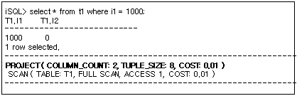

##### 예제

전 사원의 급여를 10% 인상 시 전 사원의 이름과 급여를 출력하라.

```
iSQL> SELECT e_firstname, e_lastname, salary * 1.1 FROM employees;
E_FIRSTNAME           E_LASTNAME            SALARY * 1.1
-------------------------------------------------------------
.
.
.
20 rows selected.
------------------------------------------------------------
PROJECT ( COLUMN_COUNT: 3, TUPLE_SIZE: 67, COST: 0.41 )
 SCAN ( TABLE: EMPLOYEES, FULL SCAN, ACCESS: 20, COST: 0.01 )
------------------------------------------------------------
```


#### SCAN

##### 출력 형식

1) 중간 결과가 메모리에 저장될 경우

```
SCAN ( TABLE: table_name, FULL SCAN, ACCESS: acc_num, TID: tid, COST: cost )

SCAN ( TABLE: table_name, INDEX: index_name, ACCESS: acc_num, TID: tid, COST: cost )
```

2) 중간 결과가 디스크에 저장될 경우

```
SCAN ( TABLE: table_name, FULL SCAN, ACCESS: acc_num, DISK_PAGE_COUNT: page_count, TID: tid, COST: cost )

SCAN ( TABLE: table_name, INDEX: index_name, ACCESS: acc_num, DISK_PAGE_COUNT: page_count, TID: tid, COST: cost )
```


| 항목            | 설명                                                  |
|-----------------|-------------------------------------------------------|
| TABLE           | 접근하는 테이블의 이름                                |
| INDEX           | 사용하는 인덱스의 이름                                |
| SCAN 방식       | FULL SCAN, RANGE SCAN [DESC] 또는 RID SCAN으로 구분됨 |
| ACCESS          | 레코드에 접근한 횟수                                  |
| DISK_PAGE_COUNT | 테이블의 디스크 페이지 개수                           |
| TID             | 쓰레드 식별번호, 병렬 질의일 경우에만 출력된다.       |
| COST            | 추산 비용                                             |

[표 4‑18] SCAN 노드의 정보

##### 설명

SCAN 노드는 관계형 모델에서 검색(select)연산을 수행하는 물리적인 개체이다. SCAN 노드는 자식 노드를 갖지 않으며 테이블에 직접 접근하여 해당 테이블에서 레코드를 가져온다.

SCAN 노드에서 검사되는 조건은 다음과 같이 5가지의 처리 방법으로 처리된다.

-   Fixed key range

-   Variable key range

-   Constant filter

-   Filter

-   Subquery filter

###### **메모리 테이블과 디스크 테이블**

메모리 테이블과 디스크 테이블은 서로 출력되는 정보가 약간 다르다. 디스크 테이블의 경우에만 해당 테이블이 소유한 디스크 페이지 개수가 출력된다.

아래는 메모리 테이블과 디스크 테이블의 SCAN 노드의 출력 정보를 비교한 것이다.

다음 예는 SYS 사용자의 기본 테이블스페이스가 SYS_TBS_MEMORY로 지정되어 있는 경우이며, 메모리 테이블의 SCAN 노드 정보를 보이고 있다.


다음 예는 명시적으로 SYS_TBS_DATA인 디스크 테이블스페이스에 생성된 테이블의 SCAN 노드 정보이다. 아래와 같이 디스크 테이블의 경우 테이블이 점유하고 있는 디스크 페이지의 개수를 보여준다.


###### **테이블 이름**

아래의 예에서와 같이 SCAN 노드가 접근하고 있는 테이블의 이름을 보여주며, 질의에 alias 이름을 지정할 경우 다음과 같이 출력된다.


###### **액세스 방법 및 레코드 액세스 횟수**

질의 튜닝에 있어 가장 중요한 정보는 전체 스캔을 하는 지 인덱스를 사용하는 지의 여부와 얼마나 많은 레코드 접근이 이루어졌는 지를 판단하는 것이다. 레코드 접근이 많을수록 성능 저하의 요인이 되므로 이에 대한 판단을 하는 것이 매우 중요하다.

다음은 전체 스캔에 의하여 해당 질의를 처리한 경우이다. WHERE절을 비교하기 위하여 레코드에 접근한 수를 보이고 있다.

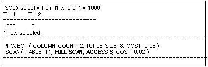

동일한 테이블에 대하여 다음과 같이 인덱스를 사용한 경우의 실행 계획 정보의 예는 다음과 같다. IDX1 인덱스를 사용하여 조건 비교를 위하여 한 건만 접근하고 있음을 알 수 있다.


동일한 조건에서 다른 칼럼에 대한 조건을 추가할 경우도 동일한 실행 계획이 생성됨을 알 수 있다.


이 때, T1.i2 칼럼에 인덱스를 추가하고 해당 인덱스를 사용하도록 질의를 수행하면 다음과 같은 실행 계획을 볼 수 있다. 동일한 질의임에도 불구하고 다른 인덱스를 사용하면 접근 효율이 떨어짐을 볼 수 있다.


아래와 같이 별도의 힌트를 주지 않을 경우, 옵티마이저는 비용 비교를 통해 보다 우수한 인덱스를 선택하게 된다.


위와 같이 SCAN 노드의 정보를 통해 올바른 액세스 방법이 선택되고 있는지를 확인하고, 인덱스가 없는 경우 질의에 따라 적절한 인덱스를 생성해 주는 것이 필요하다.

###### **TRCLOG_DETAIL_PREDICATE**

TRCLOG_DETAIL_PREDICATE 프로퍼티를 1로 지정하면 SCAN노드에서 조건들이 어떠한 방식으로 처리되는지에 대한 정보를 출력한다. 이 프로퍼티는 해당 조건이 인덱스를 사용하고 있는 지를 판단하는 데 있어 유용하게 사용될 수 있다.

다음과 같이 각 조건을 처리하기 위해 어떠한 방법을 사용하고 있는지를 알 수 있다. 즉, 아래의 예에서는 (i1 = 1000) 조건은 인덱스를 사용한 fixed key range로 처리되고, (i2 = 0) 조건은 filter로 처리됨을 알 수 있다.


다음은 동일한 질의를 처리하는데 다른 인덱스가 사용된 예제이다. IDX2 인덱스를 사용 시 인덱스를 사용하는 조건과 인덱스를 사용하지 않는 조건이 바뀌었음을 알 수 있다.


위와 같이 WHERE 절에 기술된 어떠한 조건이 인덱스를 사용하고 그렇지 않은 지를 판단하는 것 또한 질의 튜닝에 많은 도움을 준다. 단, 옵티마이저의 최적화 과정에서 질의 변경등이 발생할 경우 해당 정보가 출력되지 않을 수 있다.

##### 예제

예제1) 1980년 1월 1일 이전에 태어난 모든 사원들의 이름, 부서 번호, 생일을 출력하라.

```
iSQL> SELECT e_firstname, e_lastname, dno, birth 
 FROM employees 
 WHERE birth > '800101';
E_FIRSTNAME           E_LASTNAME            DNO         BIRTH
---------------------------------------------------------------------
Aaron                 Foster                3001        820730
Gottlieb              Fleischer             4002        840417
Xiong                 Wang                  4001        810726
Sandra                Hammond               4002        810211
Mitch                 Jones                 1002        801102
Jason                 Davenport             1003        901212
6 rows selected.
------------------------------------------------------------
PROJECT ( COLUMN_COUNT: 4, TUPLE_SIZE: 54, COST: 0.26 )
 SCAN ( TABLE: EMPLOYEES, FULL SCAN, ACCESS: 20, COST: 0.14 )
------------------------------------------------------------
```

예제2) 1980년 1월 1일 이전에 태어난 모든 사원들의 이름, 부서 번호, 생일을 출력하라. (인덱스를 이용하라.)

```
iSQL> CREATE INDEX emp_idx2 ON employees(birth);
Create success.
iSQL> SELECT e_firstname, e_lastname, dno, birth 
 FROM employees 
 WHERE birth > '800101';
E_FIRSTNAME           E_LASTNAME            DNO         BIRTH
---------------------------------------------------------------------
Mitch                 Jones                 1002        801102
Sandra                Hammond               4002        810211
Xiong                 Wang                  4001        810726
Aaron                 Foster                3001        820730
Gottlieb              Fleischer             4002        840417
Jason                 Davenport             1003        901212
6 rows selected.
------------------------------------------------------------
PROJECT ( COLUMN_COUNT: 4, TUPLE_SIZE: 54, COST: 0.11 )
 SCAN ( TABLE: EMPLOYEES, INDEX: EMP_IDX2, RANGE SCAN, ACCESS: 6, COST: 0.00 )
------------------------------------------------------------
```


#### VIEW

##### 출력 형식

```
VIEW ( view_name, ACCESS: acc_num, COST: cost )
```


| 항목    | 설명                                  |
|---------|---------------------------------------|
| 뷰 이름 | 뷰의 이름. 이름이 있는 경우에 출력됨. |
| ACCESS  | 뷰 레코드의 접근 회수                 |
| COST    | 추산 비용                             |

[표 4‑19] VIEW 노드의 정보

##### 설명

VIEW 노드는 관계형 모델에서 가상 테이블을 표현하기 위해 사용되는 노드이다. 이 노드는 사용자가 정의한 뷰를 표현하거나 집합 연산을 통해 생성되는 결과 집합을 하나의 테이블 개념으로 전환하는 역할을 한다.

사용자가 정의한 뷰에 대한 질의가 수행될 경우 생성되는 VIEW 노드의 출력 예는 아래와 같다. VIEW 노드의 하위 노드들은 사용자가 정의한 뷰의 SELECT문에 대한 실행 계획을 의미한다.


집합 연산이 사용된 질의에서도 VIEW 노드를 사용하게 되는 데, 그 예는 다음과 같다. VIEW 노드는 INTERSECT의 결과를 하나의 테이블의 개념으로 관리하기 위해 생성되었다. 이 경우 별도의 이름을 갖지 않는다.


##### 예제

자신이 속한 부서의 평균 급여보다 급여를 많이 받는 모든 사원의 이름, 급여, 부서 번호 및 그 부서의 평균 급여를 출력하라.

```
iSQL> SELECT e.e_firstname, e.e_lastname, e.salary, e.dno, v1.salavg 
 FROM employees e, 
 (SELECT dno, AVG(salary) salavg 
  FROM employees 
  GROUP BY dno) v1 
 WHERE e.dno = v1.dno 
 AND e.salary > v1.salavg;
E_FIRSTNAME           E_LASTNAME            SALARY      DNO     SALAVG
---------------------------------------------------------------------------
Wei-Wei               Chen                  2300        1001    2150
Ryu                   Momoi                 1700        1002    1340
Elizabeth             Bae                   4000        1003    2438.25
Zhen                  Liu                   2750        1003    2438.25
John                  Huxley                1900        4001    1550
Sandra                Hammond               1890        4002    1396.66667
Alvar                 Marquez               1800        4002    1396.66667
7 rows selected.
------------------------------------------------------------
PROJECT ( COLUMN_COUNT: 5, TUPLE_SIZE: 79, COST: 0.40 )
 JOIN ( METHOD: INDEX_NL, COST: 0.23 )
  VIEW ( ACCESS: 9, COST: 0.22 )
   PROJECT ( COLUMN_COUNT: 2, TUPLE_SIZE: 25, COST: 0.21 )
    AGGREGATION ( ITEM_SIZE: 72, GROUP_COUNT: 9, COST: 0.01 )
     GROUPING
      SCAN ( TABLE: EMPLOYEES, INDEX: EMP_IDX1, FULL SCAN, ACCESS: 20, COST: 0.01 )
  SCAN ( TABLE: EMPLOYEES E, INDEX: EMP_IDX1, RANGE SCAN, ACCESS: 19, COST: 0.01 )
------------------------------------------------------------
```


#### VIEW-SCAN

##### 출력 형식

```
VIEW-SCAN ( VIEW: view_name, ACCESS: acc_num, COST: cost )
```


| 항목   | 설명                  |
|--------|-----------------------|
| VIEW   | 뷰의 이름             |
| ACCESS | 뷰 레코드의 접근 회수 |
| COST   | 추산 비용             |

[표 4‑20] VIEW-SCAN 노드의 정보

##### 설명

VIEW-SCAN 노드는 관계형 모델에서 임시 저장 뷰에 대한 검색(SELECT) 연산을 수행한다. 하나의 자식 노드를 가지면, 이는 항상 MATERIALIZATION 실행 노드이다.

이 노드는 질의 최적화 과정에서 뷰의 결과를 저장 후 처리하는 것이 효율적이라 판단될 때 생성된다.

VIEW-SCAN 노드가 사용되는 예는 아래와 같다. 아래 질의에는 동일한 뷰에 대한 접근이 외부 질의와 부질의(subquery)에서 모두 등장한다. 옵티마이저는 최적화 과정에서 해당 뷰를 임시 저장하여 질의를 수행하는 것이 효율적이라고 판단해서, MATERIALIZATION 노드를 이용하여 저장한다. 아래는 저장된 뷰의 내용을 VIEW-SCAN 노드로 접근하고 있는 실행 계획을 나타낸다.


위의 실행 계획에서 (V1 X) 뷰에 대한 VIEW-SCAN 노드는 자식 노드를 갖지 않는 것으로 보인다. 그러나, 해당 VIEW-SCAN 노드는 MATERIALIZATION 노드를 자식 노드로 갖는다. 위 실행 계획의 일부를 도식화하면 아래 그림과 같다. (VSCN: VIEW-SCAN 노드, VMTR: MATERIALIZATION 노드)

위의 그림에서와 같이 VSCN(V1 X)와 VSCN(V1 Y) 실행 노드는 동일한 자식 노드를 갖고 있다.

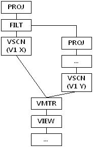

##### 예제

MATERIALIZATION 노드의 예제를 참고하기 바란다.

#### SET-DIFFERENCE

##### 출력 형식

1) 중간 결과가 메모리에 저장될 경우

```
SET-DIFFERENCE ( ITEM_SIZE: item_size, ITEM_COUNT: item_count, BUCKET_COUNT: bucket_count, ACCESS: acc_num, COST: cost )
```

2) 중간 결과가 디스크에 저장될 경우

```
SET-DIFFERENCE ( ITEM_SIZE: item_size, ITEM_COUNT: item_count, DISK_PAGE_COUNT: page_count, ACCESS: acc_num, COST: cost )
```


| 항목            | 설명                                  |
|-----------------|---------------------------------------|
| ITEM_SIZE       | 차집합을 위한 저장 레코드의 크기      |
| ITEM_COUNT      | 저장된 레코드의 개수                  |
| BUCKET_COUNT    | 해싱을 위한 버킷의 개수               |
| DISK_PAGE_COUNT | 임시 저장 테이블의 디스크 페이지 개수 |
| ACCESS          | 저장된 레코드에 대한 접근 횟수        |
| COST            | 추산 비용                             |

[표 4‑21] SET-DIFFERENCE 노드의 정보

##### 설명

SET-DIFFERENCE 노드는 관계형 모델에서 MINUS 연산을 수행하는 노드이다. 이는 두 개의 자식 노드를 가지며, 차집합을 얻기 위하여 중간 결과를 저장하여 처리한다.

SET-DIFFERENCE 노드가 MINUS를 위해 수행되는 예는 다음과 같다. 좌측 질의의 결과를 중복 제거하여 저장하고, 우측 질의의 결과를 이용하여 교집합을 구한 후 교집합에 포함되지 않은 결과만을 검색한다.


##### 예제

주문되지 않은 상품들의 상품번호를 출력하라.

```
iSQL> SELECT gno FROM goods
MINUS
SELECT gno FROM orders;
GNO
--------------
A111100001
B111100001
C111100002
E111100011
D111100001
D111100005
D111100006
D111100007
D111100009
E111100003
E111100004
E111100005
E111100006
E111100008
14 rows selected.
------------------------------------------------------------
PROJECT ( COLUMN_COUNT: 1, TUPLE_SIZE: 12, COST: 0.16 )
 VIEW ( ACCESS: 14, COST: 0.13 )
  SET-DIFFERENCE ( ITEM_SIZE: 32, ITEM_COUNT: 30, BUCKET_COUNT: 1024, ACCESS: 14, COST: 0.13 )
   PROJECT ( COLUMN_COUNT: 1, TUPLE_SIZE: 12, COST: 0.07 )
    SCAN ( TABLE: GOODS, FULL SCAN, ACCESS: 30, COST: 0.02 )
   PROJECT ( COLUMN_COUNT: 1, TUPLE_SIZE: 12, COST: 0.07 )
    SCAN ( TABLE: ORDERS, FULL SCAN, ACCESS: 30, COST: 0.02 )
------------------------------------------------------------
```


#### SET-INTERSECT

##### 출력 형식

1) 중간 결과가 메모리에 저장될 경우

```
SET-INTERSECT ( ITEM_SIZE: item_size, ITEM_COUNT: item_count, BUCKET_COUNT: bucket_count, ACCESS: acc_num, COST: cost )
```

2) 중간 결과가 디스크에 저장될 경우

```
SET-INTERSECT ( ITEM_SIZE: item_size, ITEM_COUNT: item_count, DISK_PAGE_COUNT: page_count, ACCESS: acc_num, COST: cost )
```


| 항목            | 설명                                  |
|-----------------|---------------------------------------|
| ITEM_SIZE       | 교집합을 위한 저장 레코드의 크기      |
| ITEM_COUNT      | 저장된 레코드의 개수                  |
| BUCKET_COUNT    | 해싱을 위한 버킷의 개수               |
| DISK_PAGE_COUNT | 임시 저장 테이블의 디스크 페이지 개수 |
| ACCESS          | 저장된 레코드에 대한 접근 횟수        |
| COST            | 추산 비용                             |

[표 4‑22] SET-INTERSECT 노드의 정보

##### 설명

SET-INTERSECT 노드는 관계형 모델에서 INTERSECT 연산을 수행하는 노드이다. 이는 두개의 자식 노드를 가지며, 교집합을 얻기 위하여 중간 결과를 저장하여 처리한다.

SET-INTERSECT 노드가 INTERSECT를 위해 수행되는 예는 다음과 같다. 좌측 질의의 결과 데이터를 중복 제거하여 저장하고, 우측 질의의 결과 데이터를 이용하여 교집합에 해당하는 결과를 검색하게 된다.


##### 예제

goods 테이블에서 한 번이라도 주문된 아이템의 목록을 출력하라.

```
iSQL> SELECT gno FROM goods INTERSECT SELECT gno FROM orders;
GNO
--------------
A111100002
E111100001
D111100008
D111100004
C111100001
E111100002
D111100002
D111100011
D111100003
D111100010
E111100012
F111100001
E111100009
E111100010
E111100007
E111100013
16 rows selected.
------------------------------------------------------------
PROJECT ( COLUMN_COUNT: 1, TUPLE_SIZE: 12, COST: 0.16 )
 VIEW ( ACCESS: 16, COST: 0.13 )
  SET-INTERSECT ( ITEM_SIZE: 32, ITEM_COUNT: 30, BUCKET_COUNT: 1024, ACCESS: 16, COST: 0.13 )
   PROJECT ( COLUMN_COUNT: 1, TUPLE_SIZE: 12, COST: 0.07 )
    SCAN ( TABLE: GOODS, FULL SCAN, ACCESS: 30, COST: 0.02 )
   PROJECT ( COLUMN_COUNT: 1, TUPLE_SIZE: 12, COST: 0.07 )
    SCAN ( TABLE: ORDERS, FULL SCAN, ACCESS: 30, COST: 0.02 )
------------------------------------------------------------
```


#### SORT

##### 출력 형식

1) 중간 결과가 메모리에 저장될 경우

```
SORT ( ITEM_SIZE: item_size, ITEM_COUNT: item_count, ACCESS: acc_num, COST: cost )
```

2) 중간 결과가 디스크에 저장될 경우

```
SORT ( ITEM_SIZE: item_size, ITEM_COUNT: item_count, DISK_PAGE_COUNT: page_count, ACCESS: acc_num, COST: cost )
```


| 항목            | 설명                                  |
|-----------------|---------------------------------------|
| ITEM_SIZE       | 정렬을 위한 레코드의 크기             |
| ITEM_COUNT      | 정렬에 포함된 레코드의 개수           |
| DISK_PAGE_COUNT | 임시 저장 테이블의 디스크 페이지 개수 |
| ACCESS          | 저장된 레코드에 대한 접근 횟수        |
| COST            | 추산 비용                             |

[표 4‑23] SORT 노드의 정보

##### 설명

SORT 노드는 관계형 모델에서 정렬 연산을 수행하는 물리적 개체이다. 하나의 자식 노드를 가지며, 중간 결과를 저장하기 위하여 임시 공간을 사용한다.

SORT 노드는 매우 다양한 용도로 사용된다. 아래에서 각 용도별로 사용될 때의 실행 계획 트리를 살펴본다.

###### **ORDER BY절에서의 사용**

ORDER BY 절이 존재하고 별도의 정렬이 필요한 경우 SORT 노드가 사용된다. 아래의 예에서 SORT 노드는 ORDER BY절을 처리하기 위하여 사용되었다.


###### **GROUP BY에서의 사용**

SORT 노드는 GROUP BY 절의 동일한 그룹을 분류하기 위한 정렬을 수행하기 위해 생성될 수 있다. 아래의 예는 GROUP BY i4 를 처리하기 위하여 SORT 노드가 생성된 경우이다.


###### **DISTINCT절에서의 사용**

SORT 노드는 DISTINCT 처리시 정렬 방식으로 중복 제거를 하기 위하여 사용될 수 있다. 아래의 예는 DISTINCT i4 를 처리하기 위하여 SORT 노드가 생성된 경우이다.

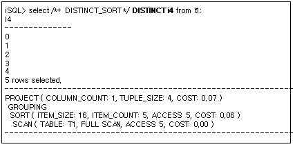

###### **조인에서의 사용**

SORT 노드는 조인을 수행하기 위하여 사용될 수 있다.

아래의 예는 조인을 처리하기 위하여 SORT 노드가 생성된 경우이다. T1.i1 = T2.i1 조인 조건을 검사하기 위한 sort-based 조인을 수행하기 위해 SORT 노드가 생성되었다.


##### 예제

월 급여가 \$1500 USD 이하인 직원의 이름, 업무, 입사일, 급여를 급여 순서로 정렬하라.

```
iSQL> SELECT e_firstname, e_lastname, emp_job, salary 
 FROM employees 
 WHERE salary < 1500 
 ORDER BY 4 DESC;
E_FIRSTNAME           E_LASTNAME            EMP_JOB          SALARY
----------------------------------------------------------------------------
Takahiro              Fubuki                PM               1400
Curtis                Diaz                  planner          1200
Jason                 Davenport             webmaster        1000
Mitch                 Jones                 PM               980
Gottlieb              Fleischer             manager          500
5 rows selected.
------------------------------------------------------------
PROJECT ( COLUMN_COUNT: 4, TUPLE_SIZE: 70, COST: 0.33 )
 SORT ( ITEM_SIZE: 16, ITEM_COUNT: 5, ACCESS: 5, COST: 0.22 )
  SCAN ( TABLE: EMPLOYEES, FULL SCAN, ACCESS: 20, COST: 0.14 )
------------------------------------------------------------

```


#### STORE

##### 출력 형식

```
STORE ( ITEM_SIZE: item_size, ITEM_COUNT: item_count, DISK_PAGE_COUNT: page_count, ACCESS: acc_num, COST: cost )
```


| 항목            | 설명                                                                    |
|-----------------|-------------------------------------------------------------------------|
| ITEM_SIZE       | 저장 레코드의 크기                                                      |
| ITEM_COUNT      | 저장에 포함된 레코드의 개수                                             |
| DISK_PAGE_COUNT | 임시 저장 공간의 디스크 페이지 개수. 메모리 임시 공간은 이 항목이 없음. |
| ACCESS          | 저장된 레코드에 대한 접근 횟수                                          |
| COST            | 추산 비용                                                               |

[표 4‑24] STORE 노드의 정보

##### 설명

STORE 노드는 질의의 일부 결과를 임시 저장하는 노드이다. 하나의 자식 노드를 가지며, 중간 결과를 저장하기 위하여 임시 공간을 사용한다.

STORE 노드는 매우 다양한 용도로 사용된다. 아래에서 각 용도별로 사용될 때의 실행 계획 트리를 살펴 본다.

###### **조인에서의 사용**

STORE 노드는 조인에 사용될 수 있다.

이 노드는 조인 조건이 없는 카티션 프로덕트(cartesian product)에 주로 사용된다. 이 노드가 일반적인 조인에 사용되더라도 조인 조건을 자체적으로 처리하지는 않는다.

아래의 예는 STORE 노드가 카티션 프로덕트를 위하여 사용된 경우이다. T1 테이블에 대한 검색이 완료된 결과를 저장함으로서 반복적인 인덱스 사용을 방지하는 효과를 얻을 수 있다.


#### WINDOW  SORT

##### 출력 형식

```
WINDOW SORT ( ITEM_SIZE:  item_size, ITEM_COUNT:  item_count, ACCESS: acc_num, SORT_COUNT: sort_count, COST: cost )
```

| 항목       | 설명                           |
| ---------- | ------------------------------ |
| ITEM_SIZE  | 저장 레코드의 크기             |
| ITEM_COUNT | 저장에 포함된 레코드의 개수    |
| ACCESS     | 저장된 레코드에 대한 접근 횟수 |
| SORT_COUNT | 정렬되는 레코드의 개수         |
| COST       | 추산 비용                      |

##### 설명

WINDOW-SORT 노드는 관계형 모델에서 윈도우 함수를 처리하기 위한 노드이다.

```sql
iSQL> select  i1, i3, count( i3 ) over ( partition by i1 order by i3 ROWS between UNBOUNDED PRECEDING and UNBOUNDED FOLLOWING) as count from t1;
I1          I3          COUNT
-------------------------------------------------
1           1           6
1           2           6
1           3           6
1           4           6
1           5           6
1           6           6
2           7           4
2           8           4
2           9           4
2           10          4
10 rows selected.
------------------------------------------------------------
PROJECT ( COLUMN_COUNT: 3, TUPLE_SIZE: 16, COST: 152.24 )
 WINDOW SORT ( ITEM_SIZE: 24, ITEM_COUNT: 10, ACCESS: 29, SORT_COUNT: 1, COST: 146.97 )
  SCAN ( TABLE: SYS.T1, FULL SCAN, ACCESS: 10, COST: 116.76 )
------------------------------------------------------------
```

