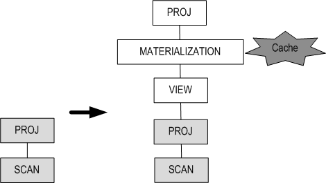

# 7.SQL Plan Cache

이 장은 Altibase의 SQL Plan Cache와 Result Cache 기능에 대한 개념 및 특징에 대해 설명한다.

### SQL Plan Cache의 개요

Altibase는 SQL Plan Cache를 사용하여 SQL 문 수행시 필요한 실행 계획(Execution Plan)을 세션 간에 공유한다. 공유된 실행 계획(SQL Plan)이 실행될 때에는 이전에 실행되었던 상황에 대한 정보(Execution Context)가 재사용될 수 있어 성능 향상을 기대할 수 있다.

#### Altibase SQL Plan Cache 구조


[그림 7‑1] Altibase 공유 캐쉬 구성도

Altibase는 모든 세션이 공유하는 캐쉬(cache) 영역을 가지고 있다. 캐쉬 영역은 SQL Plan Cache, Stored Procedure Cache, Meta Cache로 구성된다. 각각의 캐쉬에 저장되어 공유되는 내용은 다음과 같다.

-   Shared SQL Plan Cache  
    새로운 SQL 실행 계획이 생성될 때마다 실행 계획은 SQL Plan Cache 영역에 저장되며 모든 세션이 이를 공유하게 된다.
    
-   Stored Procedure Cache  
    저장 프로시저의 실행 계획이 새로 생성될 때 Stored Procedure Cache 영역에 저장되어 공유된다.
    
-   Meta Cache  
    데이터베이스 객체에 대한 모든 정보를 수록하고 있는 메타 데이터는 빠른 접근을 위해서 Meta Cache에 저장된다.

#### SQL Plan Cache의 특징

Altibase의 SQL Plan Cache는 다음과 같은 몇 가지 특징을 갖는다.

-   Direct Execution 위주의 환경에서 prepare 비용 감소 및 성능 향상  
    Direct Execution은 SQL문을 수행하는 가장 기본적인 방법이다.  
    Direct Execution 위주의 퀴리가 자주 발생하는 환경에서는 이미 prepare가 된 실행계획이 공유되어 재사용되기 때문에 prepare 비용을 줄일 수 있다.
    
-   Prepare Execution만 사용하는 환경에서 Prepare Memory의 대폭적인 절감  
    Prepare Execution은 반복적으로 수행되는 SQL 구문의 수행 비용을 줄일 수 있는 방법이다. 또한 Prepare Execute만 쓰는 환경에서는 prepare 비용 절감뿐 아니라 prepare에 필요한 메모리까지 줄일 수 있는 효과를 얻는다.
    
-   체크-인(check-in) 방식

-   SQL Plan Cache의 사용 및 참조횟수(frequency)를 고려한 교체 정책 사용

### SQL Plan Cache 관리

Altibase는 플랜 공유에 중점을 둔 체크-인 방식을 사용한다. 또한 SQL Plan Cache는 최근 사용도 뿐 아니라 참조 횟수까지 고려하여 교체하기 때문에 사용 목적에 맞게 프로퍼티를 조정하는 것이 필요하다.

#### SQL Plan Cache 정책 

-   SQL_PLAN_CACHE_SIZE에 정의된 크기 내에서 실행 계획이 등록된다.  
    Altibase는 프로퍼티 SQL_PLAN_CACHE_SIZE에서 정의한 Cache의 전체 크기 내에서 새로운 공유 Plan을 SQL Plan Cache에 등록한다. 만약 새로운 plan이 등록될 경우 SQL_PLAN_CACHE_SIZE 프로퍼티에서 정의한 크기를 넘는다면, 사용하지 않는 오래된 실행계획(Plan)이 있는지 확인하고, 이를 삭제하여 새로운 실행 계획을 등록한다. SQL_PLAN_CACHE_SIZE프로퍼티의 기본값은 64MB이지만, 사용자가 변경할 수 있다.
    
-   참조되는 실행 계획은 삭제할 수 없다.  
    SQL Plan Cache의 교체 정책은 최근 사용도 뿐 아니라 참조 횟수까지 고려한다. 또한 Cache가 부족할 경우에도 자주 참조되는 Plan Cache 객체는 보호된다. 만약 새로운 plan이 등록될 경우, SQL_PLAN_CACHE_SIZE에 정의한 크기를 초과할 뿐만 아니라 SQL Plan Cache내의 Plan들이 다른 구문들에 의해 참조되고 있다면, Cache 내의 어떠한 실행 계획도 삭제할 수 없다. 따라서 이런 경우 SQL Plan Cache에 새로운 plan은 등록되지 못하고, V\$SQL_PLAN_CACHE 성능 뷰의 CACHE_IN_FAIL_COUNT값이 증가한다.

#### SQL Plan Cache 제어문

Altibase는 기본적으로 교체 정책에 따라 서버가 자동으로 실행 계획을 관리한다. 하지만 관리자가 필요에 따라서 수동으로 관리할 수도 있다.

아래의 구문은 ALTER SYSTEM 구문을 사용하여 SQL PLAN CACHE를 초기화하는 제어문이다.

-   ALTER SYSTEM COMPACT SQL_PLAN_CACHE;  
    SQL PLAN CACHE에서 사용되지 않는 실행 계획을 삭제한다.

-   ALTER SYSTEM RESET SQL_PLAN_CACHE;  
    SQL PLAN CACHE에서 사용되지 않는 실행 계획을 삭제하고, 관련 통계 정보를 초기화한다.

각 SQL문에 대한 상세한 설명은 *SQL Reference* 를 참조한다.

#### SQL Plan Cache 사용 구문

모든 SQL문에 대한 실행 계획이 SQL Plan Cache에 저장되지는 않는다. Altibase는 아래 종류의 구문에 한해서 새로운 실행 계획이 생성되면 SQL Plan Cache에 저장하며 모든 세션이 이를 공유하게 된다. 각 구문에 대한 상세한 설명은 *SQL Reference* 를 참조한다.

-   SELECT (SELECT FOR UPDATE)

-   INSERT (INSERT SELECT)

-   UPDATE

-   DELETE

-   MOVE

-   ENQUEUE

-   DEQUEUE

#### SQL Plan Cache 관련 프로퍼티

SQL Plan Cache를 사용하기 위해서는 Altibase 프로퍼티 파일 내의 몇몇 프로퍼티를 사용 목적에 맞게 수정해야 한다. SQL Plan Cache과 관련된 프로퍼티는 다음과 같다. 각 프로퍼티에 대한 상세한 설명은 *General Reference* 를 참조한다.

-   SQL_PLAN_CACHE_BUCKET_CNT  
    해쉬 테이블(Hash Table)의 버킷 개수

-   SQL_PLAN_CACHE_HOT_REGION_LRU_RATIO  
    SQL Plan Cache의 LRU 리스트에서 자주 참조되고 있는 실행 계획을 두는 HOT 영역의 비율
    
-   SQL_PLAN_CACHE_PREPARED_EXECUTION_CONTEXT_CNT  
    실행 계획을 생성할 때 초기 생성하는 Execution Context의 개수

-   SQL_PLAN_CACHE_SIZE  
    SQL Plan Cache의 최대 크기

#### SQL Plan Cache 관련 성능 뷰

SQL Plan Cache와 관련된 성능 뷰를 확인하여 SQL Plan Cache에 관한 정보들을 확인할 수 있다. 각 성능 뷰에 대한 칼럼의 상세한 설명은 *General Reference* 를 참조한다.

-   V\$SQL_PLAN_CACHE  
    SQL Plan Cache의 현재 상태 및 통계 정보. 이 뷰를 통해 캐쉬에 있는 실행 계획이 어떻게 활용되었는지 확인 가능
    
-   V\$SQL_PLAN_CACHE_PCO  
    Plan Cache 객체에 대한 정보

-   V\$SQL_PLAN_CACHE_SQLTEXT  
    Plan Cache에 등록된 SQL에 대한 정보. V\$SQL_PLAN_CACHE_PCO와 조인하여 SQL 구문에 대한 활용률을 조회할 수 있다.

#### 제약사항

SQL Plan Cache에 등록된 실행 계획이 재사용되려면 SQL 문장의 형식뿐 아니라 인자 값도 반드시 같아야 한다. Altibase는 SQL Plan Cache가 파싱 비용을 완전히 제거하는 방식으로 구현되었기 때문에, 인자 값이 다르면 다른 SQL문으로 간주한다.

예를 들어 다음 두 문장은 SQL Plan Cache에서는 다른 것으로 간주된다.

```
INSERT INTO T1 VALUES(1,2);
INSERT INTO T1 VALUES(2,3);
```


따라서 아래와 같이 질의를 작성하여야 Plan Cache에 등록된 실행 계획이 사용되어 성능을 향상시킬수 있다.

```
INSERT INTO T1 VALUES(? , ?)
```


#### 예제

\<질의 1\> SQL Plan Cache의 실행계획이 얼마나 재사용되는지 조회하라.

```
iSQL> SELECT max_cache_size, cache_hit_count, cache_miss_count 
        FROM V$SQL_PLAN_CACHE;
MAX_CACHE_SIZE CACHE_HIT_COUNT CACHE_MISS_COUNT
-------------------------------------------------------------
67108864          67288             769437
```

CACHE_HIT_COUNT 비율보다 CACHE_MISS_COUNT 비율이 높다면, SQL_PLAN_CACHE_SIZE를 증가시키거나, PREPARE-EXECUTE 하는 구조로 변경하는 것을 권장한다.

\<질의 2\> SQL Plan Cache의 실행 계획이 재사용되지 않고 새로 실행계획이 생성되었는지 이유를 확인하라.

```
iSQL> SELECT create_reason, count(*) FROM v$sql_plan_cache_pco
        GROUP BY create_reason;
CREATE_REASON                 COUNT
------------------------------------------------------
CREATED_BY_CACHE_MISS         1241
CREATED_BY_PLAN_TOO_OLD       32
CREATED_BY_PLAN_INVALIDATION  16
```

CREATE_BY_CACHE_MISS의 값이 크다면 SQL Plan Cache의 크기가 작거나, literal SQL이 많이 사용되었을 가능성이 있다.

CREATE_BY_PLAN_INVALIDATION의 값이 크다면 객체(테이블, 인덱스) 정의에 대한 변경이 자주 일어났을 가능성이 있다.

\<질의 3\> SQL Plan Cache의 실행계획이 얼마나 활용되는지 조회하라.

```
iSQL> SELECT sql_text, child_pco_count, hit_count, rebuild_count
        FROM v$sql_plan_cache_sqltext a , v$sql_plan_cache_pco b 
        WHERE a.sql_text_id = b.sql_text_id 
        ORDER BY 2 DESC;
 SQL_TEXT            CHILD_PCO_COUNT     HIT_COUNT     REBUILD_COUNT 
-------------------------------------------------------------------- 
select * from t1   8                        0               7  
```

만약 CHILD_PCO_COUNT 값이 크다면, SQL이 동일하지만 객체 소유자가 다른지, 아니면 참조하는 객체가 자주 변경되는지를 확인한다.

### Result Cache의 개요

Result Cache는 처음 실행한 쿼리의 중간 결과 또는 최종 결과를 서버에 저장한 후, 동일한 쿼리가 다시 실행되면 결과를 재사용하는 기능이다.

Altibase는 중간 결과를 재 사용할 수 있는 Result Cache와 최종 결과를 재사용 할 수 있는 Top Result Cache를 사용할 수 있다.

#### Result Cache의 개념

중간 결과의 실행계획(execution plan, plan tree)을 서버에 저장하여 다음에 동일한 쿼리가 실행될 때 하위의 실행 계획을 생략할 수 있다. 저장된 실행 계획과 연관된 테이블의 변경이 없어야 한다. 관련 테이블이 변경되면, 서버에 저장된 값을 버리고 쿼리를 재실행한다.


###### **Result Cache 사용이 가능한 실행계획**

| 실행계획          | 내용                     |
| ----------------- | ------------------------ |
| SORT              | Order by, Join, Group by |
| DISTINCT          | Distinct                 |
| MATERIALIZATION   | View, Connect by         |
| GROUP-AGGREGATION | Group Aggregation        |
| GROUP-CUBE        | Group by cube            |
| GROUP-ROLLUP      | Group by rollup          |
| HASH              | Join                     |
| SET-DIFFERENCE    | Minus                    |
| SET-INTERSECT     | Intersect                |
| WINDOW-SORT       | Over clause              |
| LIMIT-SORT        | Limit                    |

#### Top Result Cache의 개념

기존의 실행 계획에 쿼리의 최종 결과가 저장된 실행계획을 추가하여 서버에 저장하면 다음에 동일한 쿼리가 실행될 때 하위의 실행 계획을 생략할 수 있다. Result Cache를 사용하려면 저장된 실행 계획과 연관된 테이블의 변경이 없어야 한다. 관련 테이블이 변경되면, 서버에 저장된 값을 버리고 쿼리를 재실행한다.



#### Result Cache 와 Top Result Cache 비교

<table style="width: 718px;">
<tbody>
<tr>
<td style="width: 167px;">
<p> </p>
</td>
<th> Result Cache </th>
<th>Top Result Cache</th>
</tr>
<tr>
<th style="width: 167px;">
<p>실행 계획</p>
</th>
<td style="width: 248px;">
<p>실행 계획이 변경되지 않는다.</p>
</td>
<td style="width: 293px;">
<p>실행 계획이 변경된다.</p>
</td>
</tr>
<tr>
<td style="width: 167px;">
<p>수행 속도</p>
</td>
<td style="width: 248px;">
<p>처음 수행속도는 캐시를 사용하기 전과 같다.</p>
</td>
<td style="width: 293px;">
<p>처음 수행속도는 최종결과를 추가된 실행계획에 저장하기 때문에 느려질 수 있다. 그러나 두 번째부터는 result cache보다 빨라질 수 있다.</p>
</td>
</tr>
<tr>
<td style="width: 167px;">
<p>캐시 범위</p>
</td>
<td style="width: 248px;">
<p>쿼리의 일부분만 캐시를 수행할 수 있다.</p>
</td>
<td style="width: 293px;">
<p>최종 결과에 대해서만 캐시를 수행할 수 있다.</p>
</td>
</tr>
<tr>
<td style="width: 167px;">
<p>테이블 변경에 대한 영향</p>
</td>
<td style="width: 541px;" colspan="2">
<p>쿼리에 사용된 테이블이 변경되면, 캐시 기능은 불필요하다.</p>
</td>
</tr>
</tbody>
</table>

#### Result Cache 관련 힌트

- RESULT_CACHE  
  \<질의\> T1 테이블을 i1로 정렬하여 중간 결과를 캐시한다.  

  ```
  SELECT /*+ RESULT_CACHE */ * FROM T1 ORDER BY i1;
  ```

- TOP_RESULT_CACHE  
  \<질의\> T1 테이블을 i1로 정렬하여 최종 결과를 캐시한다.  

  ```
  SELECT /*+ TOP_RESULT_CACHE */ * FROM T1 ORDER BY i1;
  ```


#### Result Cache 관련 프로퍼티

Altibase 프로퍼티 파일 내에 있는 몇 개의 프로퍼티를 사용 목적에 맞게 수정해야 한다. 각 프로퍼티에 대한 상세한 설명은 *General Reference* 를 참조한다.

-   RESULT_CACHE_ENABLE  
    Result Cache 기능을 사용 가능하도록 설정

-   RESULT_CACHE_MEMORY_MAXIUM  
    Result Cache나 Top Result Cache 기능에 의해 저장되는 메모리의 최대 크기

-   TOP_RESULT_CACHE_MODE  
    쿼리의 최종 결과를 캐시하여 사용 가능하도록 설정

#### 제약사항

Result cache는 아래의 경우 사용할 수 없다.

-   아래에 명시한 함수에서 사용할 수 없다.  
    Non-deterministic Function, RANDOM, RANDOM_STRING, SYS_GUID, SYS_GUID_STR, SYSDATE, SYSTIMESTAMP, UNIX_DATE, UNIX_TIMESTAMP
    
-   아래에 명시한 테이블과 성능 뷰에서 사용할 수 없다.  
    Temporary Table, Fixed Table, Disk Temp Table, Dump Table, DB링크에서 사용되는 원격 테이블
    
-   \_PROWID을 칼럼에 사용하였을 경우에 사용할 수 없다.

-   NO_PUSH_PROJECTION 힌트를 사용한 디스크 테이블에 사용할 수 없다.

-   REDUCE_TEMP_MEMORY 프로퍼티를 활성화하고 사용할 수 없다.

-   보안속성이 걸린 칼럼은 사용할 수 없다.

-   Prior 칼럼 또는 LOB 칼럼이 임시테이블에 사용되었을 경우에 사용할 수 없다.

-   디스크 파티션 테이블의 칼럼 값이 임시테이블에 사용되었을 경우에 사용할 수 없다.

#### 주의사항

Commit 모드에 따라 Result Cache를 사용할 수 있는 범위가 달라진다.

| 두 번째 세션(우) <br /> \ <br />첫 번째 세션(하) | AUTO COMMIT ON                         | AUTO COMMIT OFF                        |
| ------------------------------------------------ | -------------------------------------- | -------------------------------------- |
| AUTO COMMIT ON                                   | 사용 가능                              | 사용 불가<br />캐시를 해제한 후 재수행 |
| AUTO COMMIT OFF                                  | 사용 불가<br />캐시를 해제한 후 재수행 | 동일한 트랜잭션에서만 사용 가능        |

#### 예제

\<질의 1\> Result Cache를 사용하여 실행계획이 변경되었는지 확인한다.

```
iSQL> alter session set explain plan = on;
Alter success.
iSQL> alter system set trclog_detail_mtrnode = 1;
Alter success.
iSQL> SELECT /*+ RESULT_CACHE */ E.E_LASTNAME, E.ENO FROM EMPLOYEES E ORDER
    2 BY E.DNO, E.E_FIRSTNAME LIMIT 3;
E_LASTNAME            ENO
-------------------------------------
Kobain                3
Chen                  16
Jones                 13
3 rows selected.
-----------------------------------------------------------
PROJECT ( COLUMN_COUNT: 2, TUPLE_SIZE: 28, COST: 0.03 )
[ TARGET INFO ]
sTargetColumn[0] : [0, 1],sTargetColumn->arg[X, X]
sTargetColumn[1] : [0, 0],sTargetColumn->arg[X, X]
 LIMIT-SORT ( ITEM_SIZE: 16, ITEM_COUNT: 20, STORE_COUNT: 3, ACCESS: 3, COST: 0.02 )
 [ RESULT CACHE HIT: 0, MISS: 0, SIZE: 65536, STATUS: INIT ]
 [ myNode NODE INFO, SELF: 1, REF1: 0, REF2: -1 ]
 sMtrNode[0] : src[0, ROWPTR],dst[1, 0]
 sMtrNode[1] : src[0, *5],dst[1, 1]
 sMtrNode[2] : src[0, *2],dst[1, 2]
  SCAN ( TABLE: SYS.EMPLOYEES E, FULL SCAN, ACCESS: 20, COST: 0.02 )
  [ SELF NODE INFO, SELF: 0 ]
-----------------------------------------------------------
* AUTO STATISTICS USED: 2

iSQL> SELECT /*+ RESULT_CACHE */ E.E_LASTNAME, E.ENO FROM EMPLOYEES E ORDER BY E.DNO, E.E_FIRSTNAME LIMIT 3;
E_LASTNAME            ENO
-------------------------------------
Kobain                3
Chen                  16
Jones                 13
3 rows selected.
-----------------------------------------------------------
PROJECT ( COLUMN_COUNT: 2, TUPLE_SIZE: 28, COST: 0.03 )
[ TARGET INFO ]
sTargetColumn[0] : [0, 1],sTargetColumn->arg[X, X]
sTargetColumn[1] : [0, 0],sTargetColumn->arg[X, X]
 LIMIT-SORT ( ITEM_SIZE: 16, ITEM_COUNT: 20, STORE_COUNT: 3, ACCESS: 3, COST: 0.02 )
 [ RESULT CACHE HIT: 1, MISS: 0, SIZE: 65536, STATUS: HIT ]
 [ myNode NODE INFO, SELF: 1, REF1: 0, REF2: -1 ]
 sMtrNode[0] : src[0, ROWPTR],dst[1, 0]
 sMtrNode[1] : src[0, *5],dst[1, 1]
 sMtrNode[2] : src[0, *2],dst[1, 2]
  SCAN ( TABLE: SYS.EMPLOYEES E, FULL SCAN, ACCESS: 0, COST: 0.02 )
  [ SELF NODE INFO, SELF: 0 ]
-----------------------------------------------------------
* AUTO STATISTICS USED: 2
```

\<질의 2\> Top Result Cache를 사용하여 실행계획이 변경되었는지 확인한다.

```
iSQL> alter session set explain plan = on;
Alter success.
iSQL> alter system set trclog_detail_mtrnode = 1;
Alter success.
iSQL> SELECT /*+ TOP_RESULT_CACHE */ E.E_LASTNAME, E.ENO FROM EMPLOYEES E ORDER BY E.DNO, E.E_FIRSTNAME LIMIT 3;
E_LASTNAME            ENO
-------------------------------------
Kobain                3
Chen                  16
Jones                 13
3 rows selected.
-----------------------------------------------------------
PROJECT ( COLUMN_COUNT: 2, TUPLE_SIZE: 28, COST: 0.03 )
[ TARGET INFO ]
sTargetColumn[0] : [3, 0],sTargetColumn->arg[X, X]
sTargetColumn[1] : [3, 1],sTargetColumn->arg[X, X]
 MATERIALIZATION ( ITEM_SIZE: 40, ITEM_COUNT: 3, COST: 0.00 )
 [ RESULT CACHE HIT: 0, MISS: 0, SIZE: 65536, STATUS: INIT ]
 [ myNode NODE INFO, SELF: 3, REF1: 0, REF2: -1 ]
 sMtrNode[0] : src[2, 0],dst[3, 0]
 sMtrNode[1] : src[2, 1],dst[3, 1]
  VIEW ( ACCESS: 3, COST: 0.00 )
  [ MTRNODE INFO ]
  sNode[0] : [2, 0]
  sNode[1] : [2, 1]
   PROJECT ( COLUMN_COUNT: 2, TUPLE_SIZE: 28, COST: 0.03 )
   [ TARGET INFO ]
   sTargetColumn[0] : [0, 1],sTargetColumn->arg[X, X]
   sTargetColumn[1] : [0, 0],sTargetColumn->arg[X, X]
    LIMIT-SORT ( ITEM_SIZE: 16, ITEM_COUNT: 20, STORE_COUNT: 3, ACCESS: 3, COST: 0.02 )
    [ myNode NODE INFO, SELF: 1, REF1: 0, REF2: -1 ]
    sMtrNode[0] : src[0, ROWPTR],dst[1, 0]
    sMtrNode[1] : src[0, *5],dst[1, 1]
    sMtrNode[2] : src[0, *2],dst[1, 2]
     SCAN ( TABLE: SYS.EMPLOYEES E, FULL SCAN, ACCESS: 20, COST: 0.02 )
     [ SELF NODE INFO, SELF: 0 ]
-----------------------------------------------------------
* AUTO STATISTICS USED: 2
iSQL> SELECT /*+ TOP_RESULT_CACHE */ E.E_LASTNAME, E.ENO FROM EMPLOYEES E ORDER BY E.DNO, E.E_FIRSTNAME LIMIT 3;
E_LASTNAME            ENO
-------------------------------------
Kobain                3
Chen                  16
Jones                 13
3 rows selected.
-----------------------------------------------------------
PROJECT ( COLUMN_COUNT: 2, TUPLE_SIZE: 28, COST: 0.03 )
[ TARGET INFO ]
sTargetColumn[0] : [3, 0],sTargetColumn->arg[X, X]
sTargetColumn[1] : [3, 1],sTargetColumn->arg[X, X]
 MATERIALIZATION ( ITEM_SIZE: 40, ITEM_COUNT: 3, COST: 0.00 )
 [ RESULT CACHE HIT: 1, MISS: 0, SIZE: 65536, STATUS: HIT ]
 [ myNode NODE INFO, SELF: 3, REF1: 0, REF2: -1 ]
 sMtrNode[0] : src[2, 0],dst[3, 0]
 sMtrNode[1] : src[2, 1],dst[3, 1]
  VIEW ( ACCESS: 0, COST: 0.00 )
  [ MTRNODE INFO ]
  sNode[0] : [2, 0]
  sNode[1] : [2, 1]
   PROJECT ( COLUMN_COUNT: 2, TUPLE_SIZE: 28, COST: 0.03 )
   [ TARGET INFO ]
   sTargetColumn[0] : [0, 1],sTargetColumn->arg[X, X]
   sTargetColumn[1] : [0, 0],sTargetColumn->arg[X, X]
    LIMIT-SORT ( ITEM_SIZE: 0, ITEM_COUNT: 0, STORE_COUNT: 0, ACCESS: 0, COST: 0.02 )
    [ myNode NODE INFO, SELF: 1, REF1: 0, REF2: -1 ]
    sMtrNode[0] : src[0, ROWPTR],dst[1, 0]
    sMtrNode[1] : src[0, *5],dst[1, 1]
    sMtrNode[2] : src[0, *2],dst[1, 2]
     SCAN ( TABLE: SYS.EMPLOYEES E, FULL SCAN, ACCESS: 0, COST: 0.02 )
     [ SELF NODE INFO, SELF: 0 ]
-----------------------------------------------------------
* AUTO STATISTICS USED: 2
```

