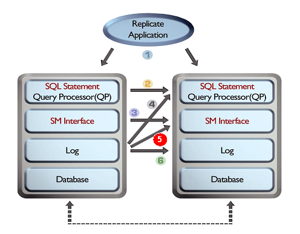

# 1.이중화 개요

이 장에서는 이중화와 관련한 용어 및 방식 등 이중화에 대한 기초 지식을 알려준다.

### 이중화 소개

데이터베이스 이중화 기능은 서비스를 수행하고 있는 서버의 데이터에 대한 백업 데이터베이스의 최신 데이터 유지와, 서버의 예기치 않은 종료가 발생했을 때 대체 서버를 이용하여 서비스를 재개할 수 있는 무정지 운영 환경을 제공하는 것을 목적으로 한다. 데이터베이스 이중화 기능의 올바른 운영을 위해 다음과 같은 순으로 설명한다.

-   이중화 개념 및 용어

-   Altibase 이중화 방식

-   이중화 대상 선정

-   이중화 모드

-   파티션드 테이블의 이중화

-   이중화와 DDL(Data Definition Language) 복제

-   이중화를 이용한 데이터 복구

#### 이중화 개념

Altibase 이중화 (Replication)는 운영중인 데이터베이스의 로그를 다른 데이터베이스로 전송하여 재실행하는 것을 기본 방식으로 취하고 있다. 즉, 지역 서버(local server)는 데이터베이스의 데이터 변경에 대한 트랜잭션 로그를 원격 서버로 전송하고, 원격 서버(remote server)는 받은 로그를 기반으로 자신의 데이터베이스에 데이터 변경을 재실행함으로써 양쪽 데이터베이스는 같은 데이터를 유지하게 된다.

Altibase는 이중화 중에 발생한 데이터 불일치를 확인하고 수정할 수 있도록 altiComp 유틸리티를 제공한다. 자세한 설명은 [***Utilities Manual**의 altiComp*](https://github.com/ALTIBASE/Documents/blob/master/Manuals/Altibase_7.3/kor/Utilities%20Manual.md#2alticomp)를 참고한다. 

또한, 이중화 관리를 위한 GUI 도구로 Replication Manager를 제공한다. 자세한 설명은 [***Replication Manager User's Manual***](https://github.com/ALTIBASE/Documents/blob/master/Manuals/Tools/Altibase_release/kor/Replication%20Manager%20User's%20Manual.md) 를 참고한다.

#### 이중화 관련 용어

-   **지역 서버 (Local Server) :**  
    이 매뉴얼에서 "지역 서버"는 항상 지역 노드를 일컫는다. 즉, 그 서버가 Active 또는 Standby 서버이든, 혹은 이중화 Sender 또는 Receiver 쓰레드 역할을 하든 상관없이 현재 작업을 수행하고 있는 서버 측을 의미한다.
    
-   **원격 서버 (Remote Server):**  
    상대편 이중화 노드를 말한다. 즉, 하나의 이중화 쌍에서 지역 서버와 원격 서버는 1:1 관계를 가진다.
    
-   **Active 서버 (Active Server):**  
    이중화로 연결되어 있는 데이터베이스 서버들 중 사용자에게 서비스를 제공하는 쪽, 즉 "주 트랜잭션"에 의해 데이터 변경 작업이 발생하는 노드이다.
    
-   **Standby 서버 (Standby Server) :**  
    변경 트랜잭션이 발생하지 않는 이중화 노드를 말한다. (SELECT DML 구문을 사용한 조회는 발생할 수 있다.)
    
-   **송신자 (Sender):**  
    트랜잭션에 의해 발생한 데이터 변경 정보를 원격 서버로 보내는 쓰레드다. 지역 서버의 이중화 대상 테이블에 DML 구문을 수행함으로써 생성되는 로그를 XLog 형태로 변환하여 원격 서버로 보낸다. XLog는 데이터의 변경 정보를 가지고 있다.
    
-   **수신자 (Receiver):**  
    XLog를 수신하는 쓰레드를 일컫는다. 적용자가 없을 경우 상대편 서버로부터 데이터 변경 정보를 가지고 있는 XLog를 받아서 자기 노드의 이중화 대상 객체에 반영하지만, 적용자가 있을 경우 적용자에게 XLog를 전달하여 이중화 대상 객체에 반영한다.
    
-   **적용자 (Applier):**  
    수신자가 송신자로부터 수신한 XLog를 스토리지 매니저에 반영하는 쓰레드를 적용자라고 일컫는다. 병렬 적용자 옵션을 설정하지 않은 경우 적용자는 생성되지 않으며 수신자가 적용자 역할을 담당한다.  
    그러나 병렬 적용자 옵션을 설정하면, 복수의 트랜잭션들을 여러 적용자가 처리할 수 있어 이중화 성능을 향상시킬 수 있다.
    
-   **선행 분석자(Ahead Analyzer):**  
    이중화 트랜잭션 그룹 옵션이 설정된 경우에 이중화 갭이 발생하면, 송신자보다 로그를 먼저 읽고 분석하여 이중화 트랜잭션 그룹을 만들어주는 쓰레드이다. 송신자는 이중화 트랜잭션 그룹을 참조하여 수신자에게 보내는 작업량을 줄여주기 때문에 이중화 갭을 해소하는데 효과적이다.
    
-   **송신 쓰레드 (Sender Thread):**  
    병렬 이중화가 아닌 경우에는 송신자 (Sender)와 같은 의미를 가진다. 즉, 하나의 송신 쓰레드와 하나의 수신 쓰레드만을 사용해서 이중화를 수행한다. 병렬 이중화를 사용하면 송신자는 여러개의 송신 쓰레드로 구성된다.
    
-   **수신 쓰레드 (Receiver Thread):**  
    병렬 이중화가 아닌 경우에는 수신자와 같은 의미를 가진다. 즉, 하나의 송신 쓰레드와 하나의 수신 쓰레드만을 사용해서 이중화를 수행한다. 병렬 이중화를 사용하면 수신자는 여러개의 수신 쓰레드로 구성된다.
    
-   **XSN:**  
    XLog의 식별 번호를 일컫는다. 리두 로그의 식별 번호인 SN과 혼동하지 말 것.

-   **지역 커밋 XSN (Local Commit XSN):**  
    송신자가 가장 최근에 읽어 온 커밋된 로그 레코드의 식별 번호이다. 이 식별 번호에 대응하는 트랜잭션이 원격 서버에도 커밋되었음을 보장하지는 않는다. 이 값은 V\$REPSENDER 성능 뷰의 COMMIT_XSN 칼럼을 조회해서 구할 수 있다.
    
-   **재시작 SN (Restart Sequence Number):**  
    이중화로 전송이 완료되지 않은 XLog에 해당하는 트랜잭션들의 시작 SN 중 가장 작은 리두 SN (XSN이 아님)을 일컫는다. 이중화가 재개될 때 XLog 전송을 재시작하는 위치가 된다.
    
-   **XLog:**  
    리두 로그를 이중화를 위한 논리적인 형태로 변형시킨 로그이다. 지역 서버의 이중화 송신 쓰레드가 XLog를 원격 서버의 이중화 수신 쓰레드에게 전송하고, 수신 쓰레드는 이 XLog를 원격 서버에 반영함으로써 지역 서버와 동일한 데이터를 가지게 된다.
    
-   **주 트랜잭션 (Master Transaction):**  
    Active 서버에서 사용자에서 서비스를 제공하는 중에 발생하는 트랜잭션이다. 즉, 이중화 대상 테이블에 변경 (INSERT, UPDATE, or DELETE) 연산을 실행하는 트랜잭션이다.
    
-   **복제 트랜잭션 (Replication Transaction):**  
    "주 트랜잭션"을 다른 쪽 서버에서 복제하는 트랜잭션이다. "복제 트랜잭션"은 이중화 대상 테이블에 변경 (INSERT, UPDATE, 또는 DELETE) 연산을 재현하는 트랜잭션으로 수신자가 XLog를 받을 때 발생한다.
    
-   **변경 연산 (Change Operation):**  
    INSERT, UPDATE 또는 DELETE DML 작업을 일컫는다. 이 용어는 데이터베이스 변경을 하지 않는 SELECT 연산과 구별하기 위해 필요하다.
    
-   **이중화 (Replication):**  
    객체를 가리키는 것이 아니고, 복제하는 개념과 행위를 가리킨다.

-   **동기화 (Synchronization):**  
    동기화는 지역 서버의 이중화 대상 테이블 또는 파티션의 모든 데이터를 원격 서버의 대응하는 테이블 또는 파티션과 일치하도록 하는 단방향의 작업이다. ALTER REPLICATION 구문을 SYNC 또는 SYNC ONLY 옵션과 함께 실행할 때 동기화가 수행된다.
    
-   **이중화 갭 (Replication Gap):**  
    이중화 갭은 개념상으로는 이중화 진행점이 데이터베이스의 현재 진행점과 얼마나 격차가 벌어졌는지를 나타내는 지표이다. 정량적인 용어로 보면, 이것은 가장 최근 리두 로그의 식별 번호 (XSN이 아님)와 현재 송신한 XLog에 대응하는 리두 로그의 식별 번호 사이의 차이이다.
    
-   **이중화 관리자 (Replication Manager):**  
    이중화 송신자와 수신자를 구동하거나 종료하는 Altibase 모듈이다.

-   **이중화 객체 (Replication Object):**  
    CREATE REPLICATION 구문으로 생성하는 객체로, 보통은 다른 노드에 존재하는 상대편 서버의 이중화 객체와 쌍을 이룬다.
    
-   **이중화 쌍 (Replication Pair):**  
    두 개의 다른 노드에 존재하는 서로 대응하는 이중화 객체들의 쌍을 일컫는다.

-   **이중화 대상 칼럼 (Replication Target Column):**  
    지역 서버와 원격 서버상의 서로 대응하는 이중화 대상 테이블의 칼럼으로, 이것을 명시적으로 지정할 수는 없다. 대신에 이중화 대상 테이블을 지정함으로써, 이중화 대상 칼럼들이 결정된다.
    
-   **이중화 대상 테이블 (Replication Target Table):**  
    서로 대응하는 이중화 노드간에 복제되는 테이블로, CREATE REPLICATION 또는 ALTER REPLICATION 구문을 사용해서 지정된다.
    
-   **이중화 대상 파티션 (Replication Target Partition):**  
    서로 대응하는 이중화 노드간에 복제되는 테이블 파티션으로, CREATE REPLICATION 또는 ALTER REPLICATION 구문을 사용해서 지정된다.
    
-   **EAGER 모드:**  
    두 가지 이중화 모드 중의 하나로, 성능보다 데이터 정합성을 우선시한다. 이 모드에서는 원격 서버로부터 복제 작업이 정상적으로 반영되고 커밋되었다는 메시지를 받기 전까지 지역 서버의 트랜잭션이 커밋되지 않는다.
    
-   **LAZY 모드:**  
    두 가지 이중화 모드 중의 하나로, 데이터 정합성보다 성능을 우선시한다. 이 모드에서는 원격 서버로부터 커밋 확인 메시지가 오기를 기다리지 않고 지역 서버의 트랜잭션이 커밋된다.
    
-   **병렬 이중화 (Parallel Replication):**  
    EAGER 모드에서 이중화 수행시 여러개의 송신 쓰레드와 수신 쓰레드를 사용하는 것을 일컫는다. "병렬 동기화"와 혼동하지 말 것.
    
-   **병렬 동기화 (Parallel Synchronization):**  
    동기화 작업 ("ALTER REPLICATION ... SYNC" 또는 "ALTER REPLICATION ... SYNC ONLY" 사용)을 수행하는데 여러개의 송신 쓰레드와 수신 쓰레드를 사용하는 것을 일컫는다. "병렬 이중화"와 혼동하지 말 것.

#### Altibase 이중화 방식

데이터베이스 이중화를 하기 위하여, 지역 서버는 데이터베이스에서 발생하는 데이터 변경 내용을 원격 서버로 전송하고, 원격 서버는 전송받은 내용을 자신의 데이터베이스에 반영하는 방법을 사용한다.

지역 서버와 원격 서버는 데이터베이스 서비스 쓰레드와 별도로 이중화 관리에 필요한 쓰레드를 구동한다. 지역 서버의 이중화 송신 쓰레드는 데이터베이스의 데이터 변경 내역을 원격 서버로 전송하며, 원격 서버의 이중화 수신 쓰레드는 전송받은 변경 내용을 데이터베이스에 반영시킨다.

또한 이중화 송수신 쓰레드는 대응 서버의 정상 및 비정상 종료를 자동 감지하며 이에 상응하는 작업을 수행한다.

그림 [1-1]은 이중화를 구현할 수 있는 다양한 방법을 보여주고 있다.

이 중 Altibase 이중화는 성능과 유연성을 고려하여 "5. (리두) 로그를 직접 실행가능한 논리적 구조로 변환"하는 방법을 사용한다.

[그림 1‑1] 이중화 방식의 기술적 검토

1.  응용 프로그램에서 처리  
    이 경우 성능 저하 및 데이터의 일치성을 보장하기 곤란하다. Altibase는 로그 기반으로 이중화를 처리하기 때문에, 응용 프로그램에서 명령문 기반으로 이중화를 처리하는 것은 동일한 질의를 중복 수행 또는 트랜잭션 수행 순서에 따라 일치성이 보장되기 어렵다.
    
2.  질의어 전송  
    QP 부하 가중 및 데이터 충돌(Conflict)에 대한 정당성 검사(Validation)의 어려움
    
3.  실행 계획 전송  
    전송량 증가로 인한 통신 부하 가중

4.  로그를 질의어로 치환  
    치환 및 질의 처리 비용 증가

5.  로그를 직접 실행가능한 논리적 구조로 치환  
    치환 비용은 요구되나 이중화 성능 향상

6.  로그 전송 및 회복 방법으로 반영  
    속도는 빠르나 ACTIVE-ACTIVE 불가

#### 이중화 서버 선정

Altibase 데이터베이스 이중화를 하기 위해서는 데이터베이스 서버들의 데이터베이스 캐릭터 셋과 내셔널 캐릭터 셋이 서로 동일해야 한다.

데이터베이스 캐릭터 셋은 V\$NLS_PARAMETERS 성능 뷰를 이용하여 확인할 수 있다.

#### 이중화 대상 선정

Altibase는 이중화 대상을 선정하는 기준으로 객체의 ‘이름’을 사용한다.

이중화를 생성할 때에는 이중화 대상이 되는 테이블 이름과 그 소유자 이름을 직접 지정해야 한다. 파티션드 테이블의 특정 파티션만 복제하려면, 파티션 이름과 파티션이 속한 테이블 이름 및 그 소유자 이름을 직접 지정해야 한다. 또한 이중화를 수행시 지역 서버와 원격 서버에서 이름이 같은 칼럼만 복제된다.

이중화 대상 칼럼은 V\$REPRECEIVER_COLUMN 성능 뷰를 통해 확인이 가능하다.

#### 이중화 모드 

Altibase는 이중화를 위해 LAZY와 EAGER 모드를 지원하고 있다.

이중화 모드 별로 성능, 이중화 밀림현상, 데이터 일관성 측면에서 아래 표에서 보는 것처럼 서로 다른 특징을 갖는다.

| 모드  | 성능 | 이중화 밀림 현상 | 데이터 일관성 |
|-------|------|------------------|---------------|
| LAZY  | 높음 | 발생 가능        | 낮음          |
| EAGER | 중간 | 발생 불가능      | 높음          |

##### LAZY 모드

LAZY 모드는 지역 서버에서 이중화 대상 테이블에 대한 DML을 수행하는 주 트랜잭션이 발생하면, 이중화의 송신 쓰레드가 주 트랜잭션이 기록한 로그를 수집하여 XLog로 가공하여 전송한다. 그리고 원격 서버의 수신 쓰레드는 XLog를 수신하여 복제 트랜잭션으로 DB에 반영하는 형태이다.

이처럼 서비스 트랜잭션 (주 트랜잭션)과 복제 트랜잭션이 완전히 별개로 동작하기 때문에 트랜잭션의 영향을 받지 않아 지역 서버의 성능이 우수하다.

그러나 송신 쓰레드가 언제나 주 트랜잭션을 따라가는 입장이기 때문에, 매우 바쁜(busy) 사이트 환경에서는 이중화가 밀리는 현상이 발생할 수 있다.

##### EAGER 모드

EAGER 모드는 지역 서버에서 발생한 주 트랜잭션과 관련된 모든 로그가 원격 서버에서도 정상적으로 반영된 것을 확인한 후에 지역 서버에서 커밋을 수행하고, 동시에 원격 서버에서도 복제 트랜잭션의 커밋을 수행하는 트랜잭션 동기화1 방식이다.

[1] 트랜잭션 동기화: 지역 서버에서 주 트랜잭션이 성공적으로 수행되었다

하더라도 원격 서버에서 데이터 충돌이 발생하면, 주 트랜잭션을 커밋할 수 없는 상태가 된다. 이 때에는 사용자가 명시적으로 그 트랜잭션을 철회 (롤백)해야, 다음 트랜잭션을 수행할 수 있게 된다. 그렇게 하지 않으면, 다음 트랜잭션을 Commit 할 수가 없기 때문에 변경 작업을 반영할 수 없게 된다. 서버 내부적으로 트랜잭션을 커밋하는 경우 (Autocommit 모드에서 또는 세션 종료시)에, 데이터 충돌에 의해 주 트랜잭션의 커밋이 실패한다면 자동으로 철회 한다. 결과적으로, 데이터 충돌을 발생시킨 주 트랜잭션과 복제트랜잭션은 모두 철회되어, 이중화에 의한 데이터 불일치가 발생하지 않도록 동작한다.

EAGER 모드의 이점은 트랜잭션을 동기화 하기 때문에 트랜잭션을 병렬로 복제할 수 있다는 점이다. 그러므로, EAGER 모드로 이중화를 수행할 때는 다수의 송신 쓰레드가 병렬로 복제를 수행한다. 병렬 쓰레드의 개수는 REPLICATION_EAGER_PARALLEL_FACTOR 프로퍼티로 설정할 수 있다.

트랜잭션 동기화로 인해 성능이 조금 떨어지는 단점이 있으나, 트랜잭션 발생이 매우 빈번한 사이트에서도 LAZY 모드처럼 이중화가 밀리는 현상이 발생하지는 않는다.

Eager 모드로 이중화를 사용하기 전에 'Eager 모드 이중화 제약조건'을 참조하기 바란다.

#### 파티션드 테이블의 이중화 

파티션드 테이블은 아래 그림과 같이 특정 파티션만 지정해서 이중화할 수 있다.

[그림 1‑2] 파티션드 테이블 이중화 구조

#### 이중화와 DDL(Data Definition Language) 복제

Altibase 이중화는 복제 대상이 되는 테이블의 칼럼 이름을 기준으로 복제를 수행하므로 테이블 스키마가 다른 테이블에 대해서도 복제가 가능하다. 이러한 이유로 테이블이 이중화 대상인 경우에도 스키마를 변경하는 일부 DDL을 수행할 수 있도록 허용한다. 

DDL을 수행하여 테이블 스키마가 달라진 경우에는 두 노드에 동일한 이름으로 존재하는 칼럼의 데이터만 복제되며, 다른 이름 혹은 한쪽에만 존재하는 칼럼은 복제되지 않는다.

테이블 스키마가 다른 상태에서 복제가 이뤄지는 경우에는 성능저하가 발생할 수 있으므로 DDL을 수행하여 테이블 스키마가 달라진 경우 양쪽 노드에서 동일한 스키마를 갖도록 동일한 DDL을 수행해 주는 것이 복제 성능에 유리하다.

이중화에 포함된 테이블에 대한 DDL 작업은 사용자의 선택에 따라 단일 노드에서 수행되거나 복제 될 수 있으며, DDL을 복제하는 경우 이중화 데이터를 모두 동기화 한 후 DDL이 복제된다.

DDL을 복제하는 경우 이중화 데이터를 동기화 하는 동안에는 Select를 제외한 DML은 수행될 수 없으므로 이중화가 밀려있는 경우 주의해서 사용해야한다.

#### 이중화 부가 기능

Altibase에서 제공하는 이중화 부가 기능은 아래와 같다. 부가 기능을 사용하는 방법 및 제약사항 등의 자세한 설명은 [이중화 부가기능](../Replication%20Manual/3.이중화-사용.md#sql-반영-모드)에서 설명한다.

-   복구 옵션  
    : 이중화를 진행중에 서버가 비정상 종료되면 서버간 데이터가 불일치하는 것을 방지하기 위해 이중화를 이용한 데이터 복구 기능
    
-   오프라인 옵션  
    : Active-Standby 이중화 환경에서 Active 서버에 장애가 발생하면, 오프라인 옵션을 사용하여 미전송된 로그를 Standby 서버에 반영할 수 있는 기능
    
-   이중화 갭 해소 옵션  
    : 이중화를 수행할 때 발생하는 이중화 갭을 해소하는 기능

-   병렬 적용자 옵션  
    : 송신자로부터 받은 XLog를 수신자가 병렬로 적용할 수 있는 기능

-   이중화 트랜잭션 그룹 옵션  
    : 이중화 갭이 발생하였을 때 전송해야 할 복수의 트랜잭션들을 하나의 트랜잭션처럼 그룹화하여 수신 쓰레드에 로그를 전송하는 기능
    
- 이중화 수신 전용 옵션

  : 이중화를 수신 전용 옵션으로 설정하는 기능.

> #### 주의 사항
>
> Altibase에서 이중화할 수 있는 객체는 테이블 또는 파티션이며, 양쪽 서버에서 대응하는 이중화 대상 아이템은 서로 종류가 동일해야 한다. 즉 테이블은 테이블로, 파티션은 파티션으로 이중화할 수 있지만, 서로 교차되는 이중화는 지원하지 않는다.
> 
> 이중화 객체에서 이중화 대상 테이블 또는 파티션을 삭제할 때에는 추가할 때 지정한 그대로 명시해야 한다. 예를 들어, 한 파티션드 테이블의 모든 파티션을 이중화 대상으로 추가했어도, 파티션드 테이블을 지정해서 이중화 대상에서 제외시키는 것은 불가능하고 파티션을 각각 지정해서 제외시킬 수 있다.

