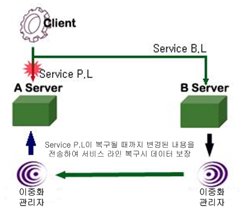

# 2.이중화 관리

이 장에서는 이중화 구동 순서와 이중화 구동 중 발생 가능한 여러 가지 장애 상황에 대하여 Altibase 이중화 기능이 어떻게 동작하는지에 대해서 설명한다.

### 이중화 순서


[그림 2‑1] 이중화 순서

1.  이중화 할 서버 결정  
    이중화 할 양쪽 서버의 데이터베이스 캐릭터 셋과 내셔널 캐릭터 셋은 서로 동일해야 한다.
    
2.  이중화 할 테이블 또는 파티션 결정  
    이중화 할 테이블은 반드시 프라이머리 키가 필요하다.

3.  이중화 생성(CREATE REPLICATION)  
    서버 A와 서버 B 양쪽에 같은 이름으로 이중화 생성을 해야한다.

4.  이중화 동작(ALTER REPLICATION)  
    이중화를 시작(start)하면 지역 서버에 이중화 송신 쓰레드가 생성되고, 원격
    서버의 이중화 관리자와 연결된다. 이 때 원격 서버 이중화 관리자는 이중화 수신 쓰레드를 생성한다.
    
5.  이중화 작업 개시

### 에러 발생과 해결

-   지역 또는 원격 서버의 비정상 종료

-   지역 서버와 원격 서버 사이의 통신 단절

-   서비스 라인 단절

#### 지역 서버의 비정상 종료


[그림 2‑2] 지역서버 장애 상황의 이중화

##### 서버 A의 비정상종료

서버 B의 이중화 수신 쓰레드는 종료되며, 이중화 송신 쓰레드는 주기적(60초)으로 서버 A로 접속을 시도한다.

##### 서버 A의 재구동 (이중화 송신 쓰레드는 원격 서버의 수신 쓰레드를 호출)

1.  서버 A의 이중화 송신 쓰레드는 자동으로 시작되어 서버 B로 이중화를 수행한다.

2.  서버 A의 이중화 수신 쓰레드는 서버 B의 이중화 송신 쓰레드로부터 구동되어 이중화를 수행한다.
    
3.  서버 B의 이중화 송신 쓰레드는 서버 A의 이중화 수신 쓰레드를 구동시킨다.

4.  서버 B의 이중화 수신 쓰레드는 서버 A의 이중화 송신 쓰레드로부터 시작되어 이중화를 수행한다.

#### 지역 서버와 원격 서버의 통신 단절


[그림 2‑3] 원격서버와 단절상황의 이중화

##### 지역 서버와 원격 서버의 통신 단절

1.  서버 A와 B의 이중화 수신 쓰레드는 반영되지 않은 각 트랜잭션을 롤백하고 종료한다.
    
2.  서버 A와 B의 이중화 송신 쓰레드는 재시작 SN을 기록하고 60초 주기로 상대 서버로 접속을 시도한다.

##### 링크의 복구

1.  서버 A와 B의 이중화 송신 쓰레드는 상대 이중화 수신 쓰레드를 깨우고 재시작 SN으로부터 XLog를 전송하여 이중화를 수행한다.
    
2.  서버 A와 B의 이중화 수신 쓰레드는 상대 이중화 송신 쓰레드의 접속에 의해 생성되어 이중화를 수행한다.

#### 서비스 라인 단절



[그림 2‑4] 서비스라인 장애 상황의 이중화

##### Primary Line 단절 

1.  백업라인(B.L)을 이용하여 서버 B에서 서비스를 받는다.

##### Primary Line 복원

1.  주라인(P.L)이 복원되면 다시 서버 A로 서비스를 받는다.

2.  주라인이 단절되어있는 동안에도 이중화 작업을 통해 서버 B에서 작업한 내용을 서버 A에 전송한다.

### 충돌 해결

#### 충돌

“데이터 충돌 (Data Conflict)”은 주 트랜잭션에 의한 변경 내용이 복제 트랜잭션에 의해 재현될 때 프라이머리 키 또는 제약 조건으로 인해 데이터 변경이 불가능한 상황을 일컫는 말이다.

지연 이중화 (Deferred Replication) 방식을 사용할 때, 데이터 충돌을 피하는 가장 좋은 방법은 각 데이터베이스에서 갱신하는 데이터 집합을 서로 다르게 두는 것이다.

아래는 3가지의 데이터 충돌과 각 충돌이 발생하는 이유이다.

##### INSERT 충돌

-   복제 트랜잭션이 프라이머리 키 칼럼에 이미 존재하는 값으로 INSERT를 시도할 때

-   복제 트랜잭션이 INSERT하려고 하는 테이블이 이미 다른 지역 트랜잭션에 의해 잠금 상태일 때, 복제 트랜잭션은 잠금을 획득하기 위해 기다려야 하는데, lock timeout때문에 INSERT 충돌이 발생할 수 있다.
    
-   복제 트랜잭션이 유일 키 제약 조건을 가지는 칼럼에 이미 존재하는 값으로 INSERT하려고 할 때

##### UPDATE 충돌

-   존재하지 않는 프라이머리 키 값으로 레코드 변경을 시도할 때

-   복제 트랜잭션이 변경하려 하는 레코드의 데이터가 주 트랜잭션에 의해 변경된 레코드의 이전 이미지 (Before Image: 변경되기 전의 데이터)와 다를 때
    
-   변경에 의해 중복된 유일 키 값이 생성될 때

##### DELETE 충돌

-   복제 트랜잭션이 존재하지 않는 프라이머리 키 값을 가지는 레코드를 삭제하려고 할 때
    
-   로컬 트랜잭션에 의해 이미 잠금 상태인 레코드를 삭제하려고 할 때, 복제 트랜잭션은 잠금을 획득하기 위해 기다려야 하는데, lock timeout때문에 DELETE 충돌이 발생할 수 있다.

일반적으로 2-PC(Phase-Commit)이나 3-PC를 사용하는 분산 DBMS와 달리 상용 DBMS에서의 이중화는 충돌에 대해 정확하게 데이터의 일관성을 보장할 방법이 없다. 분산 DBMS는 데이터 일관성을 보장하나, 2-PC또는 3-PC로 인한 성능 저하가 문제가 되며 시스템이나 네트워크의 장애에 대해서는 별도의 조치가 요구된다.

따라서, 상용 DBMS에서는 데이터의 일관성에 대한 제약을 완화하고 성능을 유지할 수 있는 지연 (Deferred, Asynchronous) 이중화 방식을 주로 사용한다.

#### 충돌 해결

“충돌 해결 (conflict resolution)”은 데이터 충돌을 제거하기 위한 여러 방법을 일컫는다. 지연 이중화 방식에서는 충돌을 막을 완전한 해결책이 존재할 수 없다. 단지 충돌이 발생하면, 충돌이 발생한 데이터에 대해서 서로 일치시키는 것으로 충돌을 해결할 뿐이다.

Altibase는 불가피한 경우에 충돌을 해결하기 위한 방법으로 User-Oriented Scheme, Master-Slave Scheme과 Timestamp-based Scheme을 사용한다.

Altibase는 충돌 해결 정책에 따라서 아래의 동작을 수행한다.

-   한 쪽 서버의 데이터를 다른 쪽 서버의 데이터에 일치시킨다.

-   문제 추적을 위해 충돌에 대한 정보 기록한다.

단, LOB 칼럼은 충돌 해결 대상에서 제외된다. LOB 칼럼은 이전 이미지를 로깅하지 않으며, 프라이머리 키와 유니크 키를 지정할 수 없어 충돌 감지를 할 수 없기 때문이다.

각각의 충돌 상황에 대한 정책은 아래에서 자세히 제시하고 있다.

CREATE REPLICATION 명령에 대한 상세한 설명은 *이중화 생성 (CREATE REPLICATION)*절을 참고하기 바란다.

#### User-Oriented Scheme

##### 구문

```
CREATE REPLICATION replication_name
WITH 'remote_host_ip', remote_host_port_no 
FROM user_name.table_name TO user_name.table_name
FROM user_name.table_name TO user_name.table_name,
… 
FROM user_name.table_name TO user_name.table_name;
```

##### 설명

-   INSERT 충돌  
    INSERT 충돌이 발생하면, INSERT는 실패하며 altibase_rp.log에 충돌 오류 메시지가 출력된다.  
    존재하는 레코드와 동일한 Key를 가진 데이터를 삽입하려는 경우 발생하는 충돌을 해결하는 정책을 설정하려면, REPLICATION_INSERT_REPLACE 프로퍼티를 사용하라.  
    * REPLICATION_INSERT_REPLACE=1: 충돌이 발생한 레코드를 삭제 후 삽입을 수행한다.
    * REPLICATION_INSERT_REPLACE=0: (기본 동작) 삭제하지 않고 삽입이 실패하여, 충돌 오류 메시지를 출력한다.
    
-   UPDATE 충돌  
    UPDATE 충돌이 발생하면, UPDATE는 실패하며 altibase_rp.log에 충돌 오류 메시지가 출력된다.  
    충돌 해결을 위해 REPLICATION_UPDATE_REPLACE 프로퍼티를 사용할 수 있다. 이전 이미지가 다른 데이터를 변경시키거나, 존재하지 않는 프라이머리 키로 변경하려 할 때 발생한다.  
    예를 들어, 현재 10이라는 데이터가 있는데 복제 트랜잭션은 20에서 30으로 바꾸라는 갱신이 발생한 경우, 상황에 따라 다음과 같은 정책을 사용할 수 있다.  
    REPLICATION_UPDATE_REPLACE=1 : 갱신함.  
    REPLICATION_UPDATE_REPLACE=0 : 갱신하지 않으며, 충돌 오류 메시지 출력
    
-   DELETE 충돌  
    DELETE 충돌이 발생하면, DELETE 는 실패하며 altibase_rp.log에 충돌 오류 메시지가 출력된다.

##### 정리

-   충돌 해결 정책은 상황별로 사용자의 판단에 따라 결정한다.

-   데이터 불일치를 해결하는 솔루션으로 altiComp 유틸리티를 제공한다. 자세한 내용은 *[**Utilities Manual**의 altiComp](https://github.com/ALTIBASE/Documents/blob/master/Manuals/Altibase_7.3/kor/Utilities%20Manual.md#2alticomp)*를 참조한다.

#### Master/Slave Scheme

##### 구문

```
CREATE REPLICATION replication_name {as master|as slave}
WITH 'remote_host_ip', remote_host_ port_no
FROM user_name.table_name TO user_name.table_name,
FROM user_name.table_name TO user_name.table_name,
… 
FROM user_name.table_name TO user_name.table_name;
```

##### 설명

- 구문에 AS MASTER 또는 AS SLAVE를 지정함으로써 Master 서버 인지 Slave서버 인지를 구분한다.
  
- 해당 서버가 Master인지 Slave인지에 대한 정보는 SYS_REPLICATIONS\_ 메타 테이블 내의 CONFLICT_RESOLUTION 칼럼에서 확인할 수 있다.
  
- 0: Master/Slave를 지정하지 않은 경우

- 1: Master로서 동작하는 경우

- 2: Slave로서 동작하는 경우

- 이중화 객체를 생성할 때 양쪽 서버에서 모두 Master 또는 Slave를 지정하지 않거나 서로 다르게 지정한 경우에만, 이중화 시작시 handshaking<sup>2</sup>에 성공하고 나머지 경우에는 실패한다. 즉, 한 서버는 Master로 지정하고 다른 한 서버는 어떠한 지정도 하지 않은 경우 이중화 시작 시 다음과 같은 오류 메시지를 볼 수 있다.
  
  [<sup>2</sup>] Handshaking 은 다른 쪽 서버가 살아있는지 또는 이중화를 시작하기 전에 지역 서버와 원격 서버 간의 복제할 객체 (테이블)에 대한 정보가 일치하는지를 확인하는 과정이다.

```
iSQL> ALTER REPLICATION rep1 START
[ERR-6100D : [Sender] Failed to handshake with the peer server (Master/Slave conflict resolution not allowed [1:0])]
```

##### Master/Slave 이중화 처리 방식

###### Master의 처리 방식

-   INSERT conflict: 반영하지 않는다.

-   UPDATE conflict: 반영하지 않는다.

-   DELETE conflict: 반영하지 않는다.

-   기타 상황: Slave로부터 전송된 XLog를 정상적으로 반영한다.

###### Slave의 처리 방식

-   INSERT conflict: 기존에 존재하는 레코드와 같은 프라이머리 키 값을 가지는 데이터 입력으로 인해 충돌이 발생한 것이라면, 존재하는 레코드를 삭제하고 새로운 레코드를 추가한다.  
    다른 이유로 인해 충돌이 발생했다면, INSERT는 실패하고 충돌 오류 메시지가 altibase_rp.log에 기록된다.
    
-   UPDATE conflict: 갱신하려고 하는 레코드의 값과 주 트랜잭션이 변경한 레코드의 이전 이미지가 서로 달라서 충돌이 발생한 것이라면, 충돌을 무시하고 무조건 반영한다.  
    다른 이유로 인해 충돌이 발생한 것이라면, UPDATE는 실패하고 충돌 오류 메시지가 altibase_rp.log에 기록된다.
    
-   DELETE conflict: 존재하지 않는 프라이머리 키 값으로 삭제를 시도해서 충돌이 발생한 것이라면, DELETE는 실패하고 충돌 오류 메시지는 기록되지 않는다.  
    다른 이유로 인해 충돌이 발생한 것이라면, DELETE는 실패하고 충돌 오류 메시지가 altibase_rp.log에 기록된다.
    
-   기타 상황: Master로 부터 전송된 XLog를 정상적으로 반영한다.

##### 예제

지역 서버의 IP 주소와 이중화 포트 번호는 각각 192.168.1.60, 25524이고, 원격 서버의 IP 주소와 이중화 포트 번호는 각각 192.168.1.12, 35524 이라고 하자. 또한 지역 서버와 원격 서버는 master와 slave 관계이며 두 서버간의 employees 테이블과 departments 테이블을 이중화 할 때 필요한 이중화 정의는 다음과 같다.

-   지역 서버의 경우 (IP: 192.168.1.60)

```
iSQL> CREATE REPLICATION rep1 AS MASTER
    WITH '192.168.1.12', 35524
    FROM sys.employees TO sys.employees,
    FROM sys.departments TO sys.departments;
Create success.
```

-   원격 서버의 경우 (IP: 192.168.1.12)

```
iSQL> CREATE REPLICATION rep1 AS SLAVE
    WITH '192.168.1.60', 25524
    FROM sys.employees TO sys.employees,
    FROM sys.departments TO sys.departments;
Create success.
```

해당 서버가 Master인지 Slave인지에 대한 정보는 SYS_REPLICATIONS\_ 메타 테이블 내의 CONFLICT_RESOLUTION 칼럼 값으로 확인할 수 있다. (0: 지정하지 않은 경우, 1: Master, 2: Slave)

```
iSQL> SELECT replication_name, conflict_resolution FROM system_.sys_replications_;
REPLICATION_NAME    CONFLICT_RESOLUTION
---------------------------------------------------------------------------
REP1                   1
1 row selected.
```

#### Timestamp-based Scheme

##### 구문

```
CREATE REPLICATION replication_name
WITH ‘remote_host_ip’, remote_host_port_no 
FROM user_name.table_name TO user_name.table_name,
FROM user_name.table_name TO user_name.table_name,
… 
FROM user_name.table_name TO user_name.table_name;
```

##### 설명

Active-Active 이중화 환경에서 양 서버의 데이터를 일관되게 유지시키기 위한 방법으로, Timestamp-based Scheme을 제공한다.

Timestamp-based Scheme을 사용하기 위해서는 다음과 같은 제약 조건을 가진다.

-   테이블에 TIMESTAMP 칼럼이 포함되어 있어야 한다.

-   REPLICATION_TIMESTAMP_RESOLUTION 프로퍼티의 값이 1이어야 한다.

Altibase는 테이블 기반 Timestamp-based Scheme을 지원하기 때문에 이중화 대상 테이블에 TIMESTAMP타입의 칼럼이 포함되어 있어도 REPLICATION_TIMESTAMP_RESOLUTION 프로퍼티를 0으로 설정하면 기존의 Conflict Resolution Scheme을 그대로 사용할 수 있다.

예를 들어, 사용자가 두 서버간의 foo 테이블과 bar 테이블을 아래와 같이 이중화 한다고 가정하면, foo 테이블의 경우는 REPLICATION_TIMESTAMP_RESOLUTION 프로퍼티의 값이 1인 경우에 한하여 Timestamp-based Scheme이 사용되고, bar 테이블의 경우는 기존의 Conflict Resolution Scheme이 사용된다.

```
CREATE TABLE foo (a DOUBLE PRIMARY KEY, b TIMESTAMP);
CREATE TABLE bar (a DOUBLE PRIMARY KEY, b CHAR(3));
CREATE REPLICATION rep WITH ’127.0.0.1’, 30300 FROM sys.foo TO sys.foo, FROM sys.bar TO sys.bar;
```

##### Timestamp-based 이중화 처리 방식

Altibase는 삽입(INSERT) 연산과 갱신(UPDATE) 연산에 대해서만 Timestamp-based Scheme을 지원한다.

###### 삽입

1.  삽입하고자 하는 데이터와 같은 키 값을 갖는 데이터가 이미 존재하면, 삽입할 데이터의 이후 이미지 (After-Image)의 TIMESTAMP 값과 이미 존재하는 데이터의 TIMESTAMP 값을 비교한다.
    
2.  삽입할 데이터의 이후 이미지 (After-Image)의 TIMESTAMP 값이 크거나 같으면 기존의 데이터를 삭제하고, 이후 이미지의 값을 추가한다.

###### 갱신

1.  주 트랜잭션에 의해 변경된 데이터의 이후 이미지의 TIMESTAMP 값과 갱신 대상 데이터의 TIMESTAMP 값을 비교한다.
    
2.  이후 이미지의 TIMESTAMP 값이 크거나 같으면 이후 이미지 값으로 갱신한다.

3.  갱신 수행 시 데이터의 이후 이미지의 TIMESTAMP 값이 그대로 유지된다. 즉, 시스템 시간 값을 사용하지 않는다.

> ##### 주의 사항
>
> -   테이블에 TIMESTAMP 칼럼 추가시 한 레코드 당 8바이트의 저장 공간이 추가적으로 필요하다.
>     
>-   이중화 되는 양 서버의 시간이 서로 같지 않는 경우, 데이터 불일치가 발생할 수 있다.
> 

### Eager 이중화 장애 복구 (Eager Replication Failback)

이 절에서는 Eager 모드의 이중화 환경에서 한 쪽 노드에 장애가 발생하고, 이 후 노드가 복구되면 양 쪽 서버의 데이터가 어떤 과정을 거쳐 동기화 되는지를 살펴본다.

Eager 모드로 이중화 환경을 구성하려면, 양 쪽 서버의 이중화 모두 Eager 모드로 생성하고 시작해야 한다. 그리고, Eager 모드의 이중화 환경에서 발생한 장애를 복구(failback)하려면, 복구 환경에서도 이중화가 Eager 모드로 동작 중이어야 한다.

Eager 모드의 이중화 환경에서의 장애시 데이터 복구는 크게 아래의 두 가지로 나눌 수 있다:

-   증분 동기화 (Incremental Sync)

-   일반 동기화 (Normal Sync)

#### 증분 동기화 (Incremental Sync)

Eager 모드의 이중화 환경에서 한 쪽 서버(서버 A)에 커밋 로그가 기록되고 상대편 서버(서버 B)로 commit 로그를 전송하지 못한 채, 서버 A에 장애(장비 문제, Altibase 서버 장애)가 발생할 수 있다. 이 경우 서버 A는 트랜잭션 commit을 실행한 애플리케이션에 오류를 반환하며, 서버 B는 commit 로그를 받지 못하기 때문에 해당 트랜잭션을 롤백할 것이다. 그리고 애플리케이션은 FailOver하여 서버 B에서 작업을 계속 진행할 것이다. 결국 서버 A와 서버 B에서 동일한 레코드의 데이터가 일치하지 않는 상황이 발생할 수도 있다.

이러한 데이터는 이후의 이중화 서비스에 영향을 미치게 되므로, 양쪽 노드의 불일치 데이터에 대한 장애 복구(failback) 과정이 필요하다. 이것을 증분 동기화(Incremental Sync)라고 하며, 복구 과정은 아래와 같다.

서버 A가 다시 온라인 상태가 되면, 양 쪽 서버의 SYS_REPLICATIONS\_ 메타 테이블의 REMOTE_FAULT_DETECT_TIME 칼럼 값(상대 편 노드의 장애를 감지한 시점)으로 판단하여, 각각 master 또는 slave가 된다. 즉, 더 늦은 시점의 값을 가진 서버가 master가 된다. 이 경우에는 서버 B가 master가 될 것이다. master와 slave가 결정되면, slave(서버 A)의 이중화 송신자는 재시작 SN부터 자신의 트랜잭션 로그를 분석하여 상대편으로 전송하지 않았을 것 같은 (즉, master 와 다를 수 있는) 데이터를 결정하고, master로부터 해당 데이터를 가져와서 동기화를 수행한다. Master의 이중화 송신자는 slave가 요청한 데이터를 전송해 주는 역할을 한다. 즉, 양 쪽 서버의 이중화 송신자(Sender)가 master와 slave로 동작하게 된다. 따라서, 증분 동기화가 성공적으로 완료되려면, 양 쪽 서버의 이중화 중 하나라도 stop 상태이면 안 된다.

그런 다음, 서버 A의 이중화 송신자는 재시작 SN을 최신으로 갱신한다. 이는 서버 A의 이중화 송신자가 위의 과정에서 이미 동기화된 데이터를 재전송하는 것을 방지하기 위해서이다.

증분 동기화는 REPLICATION_FAILBACK_INCREMENTAL_SYNC 프로퍼티 값을 조정하여 활성화 또는 비활성화 할 수 있으며, 이 프로퍼티는 양 쪽 노드의 서버에 동일한 값으로 설정되어 있어야 한다.

#### 일반 동기화 (Normal Sync)

서버는 증분 동기화를 완료 하거나 건너뛴 후, Eager 모드 이중화가 정상적으로 시작되기 전에, 장애 시간 동안 서버 B에서 서버 A로 전송하지 못했던 트랜잭션 로그에 대한 데이터를 동기화한다. 이러한 동기화를 일반 동기화(Normal Sync)라고 한다. 장애로 인해 전송하지 못했던 로그를 전송할 때에는, 이중화가 Lazy 모드로 전환하여 동작하며, 로그를 모두 전송하여 이중화 갭이 없어지면, 다시 Eager 모드로 전환하여 이중화가 시작된다.

REPLICATION_FAILBACK_INCREMENTAL_SYNC 프로퍼티 값이 1로 설정되어 있는 경우 위의 증분 동기화가 수행된 후에 일반 동기화가 수행될 것이고, 그렇지 않은 경우 증분 동기화 과정은 건너뛰고 바로 일반 동기화가 수행될 것이다.

### 병렬 이중화

병렬 이중화란 이중화 수행 시 여러 개의 송신 쓰레드와 수신 쓰레드를 사용하는 것을 일컫는다.

Altibase는 이중화 모드에 따라서 아래와 같이 병렬 이중화를 지원한다.

-   Lazy 모드: 이중화 부가기능으로 수신 병렬 이중화

-   Eager 모드: 프로퍼티를 조정하여 송신 병렬 이중화

Eager 모드에서 병렬 이중화는 복수의 송신 쓰레드를 관리하기 위해 REPLICATION_EAGER_PARALLEL_FACTOR 프로퍼티를 조정하여 사용할 수 있다. Eager 모드 이중화의 경우, 양 쪽 노드에서 모두 커밋 가능한 상태가 되었을 때 커밋이 수행되므로, 트랜잭션 단위의 병렬 복제가 가능하다. Altibase에서는 여러 개의 이중화 송신 쓰레드를 두어서 각 쓰레드가 하나의 트랜잭션을 처리하도록 하여 병렬 복제를 구현하고 있다. 이러한 병렬 이중화는 기존의 순서화된 동기 복제보다 빠른 성능을 제공한다.

Lazy 모드에서 병렬 이중화하는 방법은 [이중화 부가기능](../Replication%20Manual/3.이중화-사용.md#sql-반영-모드)에서 설명한다.

> #### 주의사항 
>
> 병렬 이중화를 사용할 경우, 복제되는 과정에서 트랜잭션의 순서가 뒤바뀌어 커밋 불가능한 상황이 발생할 수 있다. 그러므로 병렬 이중화를 사용하는 경우, 응용 프로그램은 커밋 실패가 반환되는 경우 롤백을 명시적으로 수행하도록 로직이 구현되어야 한다.

### 이중화 관련 성능 뷰

이중화 진행 모니터링을 하기 위해 다음의 성능뷰를 사용할 수 있다. 성능 뷰에 대한 자세한 내용은 *General Reference*를 참고한다.

-   V\$REPEXEC

-   V\$REPGAP

-   V\$REPGAP_PARALLEL

-   V\$REPLOGBUFFER

-   V\$REPOFFLINE_STATUS

-   V\$REPRECEIVER

-   V\$REPRECEIVER_COLUMN

-   V\$REPRECEIVER_PARALLEL

-   V\$REPRECEIVER_STATISTICS

-   V\$REPRECEIVER_TRANSTBL

-   V\$REPRECEIVER_TRANSTBL_PARALLEL

-   V\$REPRECOVERY

-   V\$REPSENDER

-   V\$REPSENDER_PARALLEL

-   V\$REPSENDER_STATISTICS

-   V\$REPSENDER_TRANSTBL

-   V\$REPSENDER_TRANSTBL_PARALLEL

-   V\$REPSYNC

