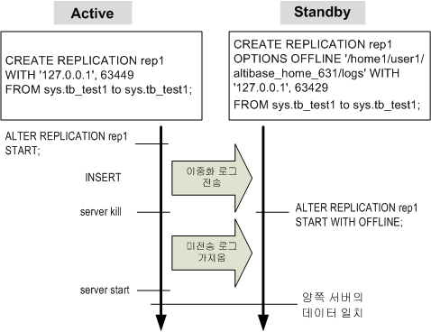

# 3.이중화 사용

### 이중화 제약조건 

이중화를 만들기 위해서는 여러가지 제약 조건이 있다. 이 조건을 만족하지 않을 경우 이중화를 사용할 수 없다.

#### 선행조건 

-   입력/수정/삭제 연산시 충돌(Conflict)이 발생하면 연산은 취소되고 에러 로그 파일에 메시지를 남긴다.
    
-   이중화 작업 도중 발생한 에러에 대해 부분 철회한다. 즉 여러 개의 데이터 입력 중 한 개의 중복 데이터가 있으면 중복 데이터만 취소하고 나머지는 완료할 수 있다.
    
-   복제 속도는 서비스 속도보다 매우 느릴 수 있다.

#### 데이터 제약조건

-   복제할 테이블에는 반드시 프라이머리 키가 존재해야 한다.

-   복제할 테이블의 프라이머리 키에 대한 수정이 없어야 한다.

-   양쪽 서버의 복제할 테이블은 칼럼 타입, NOT NULL, Check 제약조건, 유니크 인덱스, function-based 인덱스가 동일하지 않고, REPLICATION_SQL_APPLY_ENABLE가 1로 설정되어 있으면 SQL 반영 모드로 동작하여 성능이 저하될 수 있다.

#### 연결 제약조건

-   하나의 Altibase 데이터베이스에 가능한 이중화 연결의 최대 개수는 REPLICATION_MAX_COUNT 프로퍼티로 결정된다.
    
-   이중화로 연결할 데이터베이스는 서로 데이터베이스 캐릭터 셋과 내셔널 캐릭터 셋이 동일하게 설정되어야 한다. 현재 사용중인 캐릭터 셋은 V\$NLS_PARAMETERS의 NLS_CHARACTERSET과 NLS_NCHAR_CHARACTERSET으로 확인이 가능하다.

#### 이중화 대상 칼럼의 제약조건

-   복제 트랜잭션에서 INSERT할 때, 이중화 대상이 아닌 칼럼에는 널(NULL) 값을 입력한다.
    
-   이중화 대상 칼럼과 이중화 대상이 아닌 칼럼의 유니크 인덱스, Function-based 인덱스를 구성하면 SQL 반영 모드로 동작한다.

#### Eager 모드 이중화 제약조건

Eager 모드를 사용하기 위해 다음의 제약 조건을 따른다.

-   Eager 모드 이중화는 데이터 정합성을 위해 3 노드 이상에서는 권장하지 않는다.

-   원격 서버와 지역 서버 모두 Eager 모드 이중화를 사용하지 않으면, 데이터가 동기화되지 않는다.
    
-   Eager 모드 이중화를 사용 중에 네트워크 장애가 발생하면, 서버가 정상적으로 동작하더라도 데이터의 정합성을 보장받지 못한다. 네트워크 장애가 발생하면 상대방의 노드 장애로 판단하기 때문에 양쪽 노드에서 각각 데이터를 갱신하기 때문이다.
    
-   하나의 테이블은 Eager 모드 이중화에서 하나의 이중화에만 참여할 수 있다. 하나의 테이블이 두 개 이상의 Eager 이중화에 참여할 경우 장애가 발생하면 데이터가 불일치할 뿐 아니라 증분 동기화도 실패하기 때문이다.
    
-   Eager 모드 이중화에 참여하는 서버는 시간을 동기화해야 한다. 만약 두 시스템의 시간을 다르게 설정한 경우 장애가 발생시 장애를 감지하는 시차 때문에 비정상적인 동작을 할 수 있다.
    
-   Eager 모드 이중화에서 커밋된 로그가 디스크에 반영되기 전에 비정상 종료가 발생하면, 데이터가 유실될 수 있다. 이을 방지하기 위해 복구 옵션을 사용하거나 커밋 관련 프로퍼티(COMMIT_WRITE_WAIT_MODE, REPLICATION_COMMIT_WRITE_WAIT_MODE, REPLICATION_SYNC_LOG)의 값을 조정한다.
    
-   Eager 모드 이중화에서는 SQL 반영 모드를 사용할 수 없다.

#### 파티션드 테이블 제약조건

파티션드 테이블을 이중화하기 위해 다음의 제약조건을 만족시켜야 한다.

-   원격 서버와 지역 서버의 파티션 방법이 동일해야 한다.

-   범위나 리스트 파티션일 경우 파티션 조건이 동일해야 한다. 일부 파티션만 이중화하는 경우 그 파티션의 조건만 일치하면 된다. default 파티션의 경우에도 마찬가지이다.
    
-   해시 파티션일 경우 파티션의 개수가 동일해야 한다.

#### 이중화를 이용한 데이터 복구의 제약조건

이중화를 이용하여 데이터를 복구하기 위해서는 다음의 제약조건이 따른다.

-   지역 서버와 원격 서버가 모두 비정상 종료하는 경우에는 복구가 불가능하다.

-   충돌(Conflict)이 발생한 데이터는 복구가 불가능하다.

-   하나의 테이블은 두 개 이상의 이중화 객체에서 복구할 수 없다.

-   전송되지 않은 트랜잭션이 손실된 경우 데이터는 복구할 수 없다.

#### 이중화를 이용한 데이터 복구시 주의사항

-   Active-Active환경에서 양쪽 데이터베이스의 갱신하는 Data Set을 완전히 다르게 하지 않은 경우 (즉, 양쪽 서버에서 같은 레코드를 서로 다른 값으로 갱신하는 경우), 데이터 불일치가 발생할 수 있다.
    
-   네트워크에 이상이 발생하거나 사용자가 REPLICATION_RECOVERY_MAX_TIME프로퍼티에 복구를 명시적으로 포기한 경우에는 데이터가 복구되지 않을 수 있다.

#### 허용된 DDL 문

일반적으로 이중화 대상인 테이블은 데이터 정의어(DDL)를 수행할 수 없다. 그러나 다음의 몇 가지 DDL은 이중화와 상관없이 DDL 수행이 가능하다.

-   ALTER INDEX REBUILD PARTITION

-   GRANT OBJECT

-   REVOKE OBJECT

-   CREATE TRIGGER

-   DROP TRIGGER

> ##### 주의사항
>
> 이중화 대상 테이블에 허용된 DDL문을 수행하는 경우, 해당 테이블은 잠금(LOCK) 상태가 된다. 이 때 송신 쓰레드가 이중화 로그를 전송할 경우, 수신 쓰레드는 잠금 상태의 대상 테이블에 로그를 반영할 수 없을 것이다.

### 이중화 생성 (CREATE REPLICATION) 

이중화를 시작하기 전에 이중화에 관련된 정보를 사용해서 이중화 객체를 생성해야 한다.

#### 구문

```
CREATE [LAZY|EAGER] REPLICATION replication_name 
[FOR ANALYSIS | FOR PROPAGABLE LOGGING | FOR PROPAGATION | FOR ANALYSIS PROPAGATION] 
[AS MASTER|AS SLAVE] 
[OPTIONS options_name [option_name ... ] ] 
[WITH { ‘remote_host_ip’ | 'remote_host_name', remote_host_ port_no [USING conn_type [ib_latency]]}]
...
FROM user_name.table_name [PARTITION partition_name] TO user_name.table_name [PARTITION partition_name]
[,FROM user_name.table_name [PARTITION partition_name] TO user_name.table_name [PARTITION partition_name]
...;

```

#### 전제 조건

SYS 사용자만이 이중화 객체를 생성할 수 있다.

#### 설명

이중화를 수행하려면, 먼저 서로간에 통신으로 연결된 이중화 객체의 쌍으로 구성된 “이중화 쌍”이 설정되어야 한다.

이중화는 테이블 또는 파티션 단위로 수행된다. 양쪽 서버의 이중화 테이블 또는 파티션은 일대일로 매칭되어야 한다.

이중화 객체를 생성할 때 LAZY 또는 EAGER 모드중 하나를 기본 모드로 선택할 수 있다. 사용자가 세션에 이중화 모드를 지정하지 않은 경우 이중화 기본 모드로 동작할 것이다. 기본 모드를 지정하지 않으면 이중화는 LAZY 모드로 동작할 것이다.

- ***replication_name***  
  생성될 이중화 객체의 이름을 명시한다. 지역 서버와 원격 서버에 동일한 이름을 설정해야 한다.
  
- ***FOR ANALYSIS \| FOR ANALYSIS PROPAGATION***  
  log analyzer 용 이중화를 생성한다. 자세한 설명은 *Log Analyzer User’s Manual*을 참고한다.
  
- ***FOR PROPAGABLE LOGGING \| FOR PROPAGATION***  
  이중화 수신자가 전송받은 로그를 복제하기 위해 FOR PROPAGABLE LOGGING을 사용하여 로그를 기록한 후, 복제된 로그가 다른 원격 서버로 전송하기 위해 FOR PROPAGATION을 사용한다.
  
- ***as master 또는 as slave***  
  해당 서버가 Master 인지 Slave 인지를 지정한다. 만약 아무것도 지정하지 않으면 기존의 REPLICATION_INSERT_REPLACE 또는 REPLICATION_UPDATE_REPLACE 프로퍼티를 사용하는 방식과 동일하다. Handshaking시 다음의 조합일 경우에만 성공한다: 0과 0, 1과 2, 또는 2와 1. 다른 조합은 실패할 것이다. (0: 지정하지 않은 경우, 1: Master, 2: Slave)
  
- ***remote_host_ip | remote_host_name***  
  원격 서버의 IP 주소값이나 호스트 이름

- ***remote_host_port_no***  
  원격 서버 수신 쓰레드의 포트 번호. 즉, 원격 서버의 Altibase 프로퍼티의 REPLICATION_PORT_NO에 해당하는 값이다.
  
- ***conn_type***  
  원격 서버와의 통신 방법(TCP/ InfiniBand)이며, 기본값은 TCP이다.

- ***ib_latency***  
  rsocket의 RDMA_LATENCY 옵션값. conn_type이 IB인 경우에만 입력 가능하다.

- ***user_name***  
  이중화할 테이블의 소유자 이름

- ***table_name***  
  이중화할 테이블 이름

- ***partition_name***  
  이중화할 파티션 이름

- ***option_name***  
  이중화 객체에 대한 부가 기능 이름. 지원하는 부가 기능에 대한 자세한 설명은 [이중화 부가 기능](#sql-반영-모드)에서 설명한다.

#### 에러코드

*Error Message Reference*를 참고한다.

#### 예제

지역 서버의 IP 주소가 192.168.1.60 이고 이중화 포트 번호가 25524, 원격 서버의 IP 주소가 192.168.1.12 이고 이중화 포트 번호가 35524 이라고 하자. 두 서버간의 employees 테이블과 departments 테이블을 이중화 한다고 가정하면, 필요한 이중화 정의는 다음과 같다.

-   지역 서버의 경우 (IP: 192.168.1.60)

```
iSQL> CREATE REPLICATION rep1
    WITH '192.168.1.12', 35524
    FROM sys.employees TO sys.employees,
    FROM sys.departments TO sys.departments;
Create success.
```

-   원격 서버의 경우 (IP: 192.168.1.12)

```
iSQL> CREATE REPLICATION rep1
    WITH '192.168.1.60', 25524
    FROM sys.employees TO sys.employees,
    FROM sys.departments TO sys.departments;
Create success.
```

### 이중화 시작, 종료와 변경 (ALTER REPLICATION) 

이중화를 시작하는 방법은 START, QUICKSTART, SYNC 의 3가지 방법이 있다. SYNC에 대한 설명은 [이중화 동기화](#이중화-동기화sync)를 참고한다.

변경 가능한 이중화 속성은 아래와 같다.

* 이중화 테이블 및 파티션의 삭제
* 이중화 테이블 및 파티션의 추가
* 이중화 정보 리셋
* PROPAGABLE LOGGING 기능의 활성화 여부

#### 구문

```
ALTER REPLICATION replication_name START [RETRY];

ALTER REPLICATION replication_name QUICKSTART [RETRY];

ALTER REPLICATION replication_name STOP; 

ALTER REPLICATION replication_name RESET;

ALTER REPLICATION replication_name DROP TABLE 
FROM user_name.table_name [PARTITION partition_name] TO user_name.table_name [PARTITION partition_name];

ALTER REPLICATION replication_name ADD TABLE 
FROM user_name.table_name [PARTITION partition_name] TO user_name.table_name [PARTITION partition_name]

ALTER REPLICATION replication_name FLUSH [ALL] [WAIT timeout_sec];

ALTER REPLICATION replication_name SET PROPAGABLE LOGGING [ENABLE|DISABLE];
```

#### 전제 조건

SYS 사용자만이 이중화 동작을 변경할 수 있다.

#### 설명

-   START  
    가장 최근의 이중화 시점부터 이중화를 시작한다.

-   QUICKSTART  
    현재 로그의 위치부터 이중화를 시작한다.

-   START/QUICKSTART RETRY  
    RETRY 옵션으로 이중화를 START하거나 QUICKSTART하면, handshaking에 실패하더라도 지역 서버의 송신 쓰레드는 생성된다. 이 후에 지역 서버와 원격 서버간의 handshaking이 성공할 때 이중화가 시작된다.  
    즉, 첫 handshaking에서 실패하더라도 iSQL에서는 성공했다는 메시지를 보여준다. 그러므로 사용자는 트레이스 로그 또는 V\$REPSENDER 성능 뷰에서 실행 결과를 꼭 확인해야 한다.  
    RETRY 옵션 없이 이중화를 시작하면, 첫 handshaking에 실패할 경우 에러가 발생하고 실행은 중지된다.
    
-   STOP  
    이중화를 중지시킨다.

-   RESET  
    재시작 SN 등의 이중화 정보를 reset한다. 이중화가 중지된 상태에서만 수행할 수 있으며, 이중화 객체를 삭제한 후 다시 생성하는 것을 대신해서 사용할 수 있다.
    
-   DROP TABLE  
    특정 테이블 또는 파티션을 이중화 대상에서 제외시킨다. 이중화 대상 테이블에는 대부분의 DDL 문을 수행할 수 없기 때문에, 이 구문으로 이중화 대상에서 제외시킨 후에 그 테이블이나 파티션에 대해서 DDL문을 수행할 수 있다.
    
-   ADD TABLE  
    특정 테이블 또는 파티션을 이중화 대상에 추가한다. 

-   FLUSH  
    Flush를 실행한 세션은 이중화 송신 쓰레드가 현재 로그까지의 변경 내용이 상대방 서버에 전송 되도록 timeout_sec으로 지정한 시간 (초)만큼 기다린다. 만약, ALL옵션이 같이 사용되면 Flush를 실행한 세션은 현재 로그가 아닌 가장 최근 로그까지의 변경 내용이 상대방 서버에 전송 되도록 기다린다.
    
-   SET PROPAGABLE LOGGING [ENALBE|DISABLE]  
    ENABLE: 이중화 수신자가 전송받은 로그를 복제하기 위해 로그를 기록한다.  
    DISABLE: 이중화 수신자가 전송받은 로그에 대해서는 로그를 기록하지 않는다.

#### 에러코드

*Error Message Reference* 의 이중화(RP) 관련 에러 메시지를 참고 한다.

#### 예제

이중화 이름을 rep1 이라고 가정하고 이중화 시작은 다음 3가지 중 한가지를 선택할 수 있다.

-   지역 서버의 데이터를 원격 서버로 전송한 후에 이중화를 시작한다.

```
iSQL> ALTER REPLICATION rep1 SYNC;
Alter success. 
```

-   가장 최근에 수행한 rep1의 이중화 시점부터 rep1 이중화를 시작한다.

```
iSQL> ALTER REPLICATION rep1 START;
Alter success.
```

-   현재 시점부터 이중화를 시작한다.

```
iSQL> ALTER REPLICATION rep1 QUICKSTART;
Alter success.
```

양방향 이중화를 시작한 이후 이중화 진행 상태 확인은 다음과 같은 방법으로 할 수 있다.

(지역 서버에서 실행)

```
iSQL> SELECT rep_name, status, net_error_flag, sender_ip, sender_port,
             peer_ip, peer_port 
      FROM V$REPSENDER;
REP_NAME                                  STATUS               
------------------------------------------------------------------
NET_ERROR_FLAG       
-----------------------
SENDER_IP                                                         SENDER_PORT
---------------------------------------------------------------------------
PEER_IP                                                           PEER_PORT   
---------------------------------------------------------------------------
REP1                                      1                    
0                    
192.168.1.33                                                      11477       
192.168.1.34                                                      21300       
1 row selected.
```

(원격 서버에서 실행)

```
iSQL> SELECT rep_name, my_ip, my_port, peer_ip, peer_port 
      FROM V$REPRECEIVER;
REP_NAME                                  
--------------------------------------------
MY_IP                                                             MY_PORT     
---------------------------------------------------------------------------
PEER_IP                                                           PEER_PORT   
---------------------------------------------------------------------------
REP1                                      
192.168.1.33                                                      21300       
192.168.1.34                                                      7988        
1 row selected.
```

-   이중화를 중지한다.

```
iSQL> ALTER REPLICATION rep1 STOP;
Alter success.
```

-   이중화 대상에서 sys.employees 테이블을 제외시킨다.

```
iSQL> ALTER REPLICATION rep1 STOP;
Alter success.
iSQL> ALTER REPLICATION rep1 DROP TABLE FROM sys.employees TO sys.employees;
Alter success.
```

-   이중화 대상에 sys.employees 테이블을 추가한다.

```
iSQL> ALTER REPLICATION rep1 STOP;
Alter success.
iSQL> ALTER REPLICATION rep1 ADD TABLE FROM sys.employees TO sys.employees;
Alter success.
```

-   TIMER_THREAD_RESOLUTION 프로퍼티의 값이 1000000 마이크로 초로 설정되어 있는 경우, 이중화 송신자 별로 WAIT_NEW_LOG이벤트에 대한 대기 누적시간(초)을 알고 싶다면, 다음 쿼리를 실행한다.

```
iSQL> SELECT rep_name, avg(WAIT_NEW_LOG)/1000000 FROM x$repsender_statistics WHERE wait_new_log > 0 GROUP BY rep_name ORDER BY rep_name;
```

-   TIMER_THREAD_RESOLUTION 프로퍼티의 값이 1000000 마이크로 초로 설정되어 있는 경우, 이중화 수신자 별로 INSERT_ROW이벤트에 대한 대기 누적시간(초)을 알고 싶다면, 다음 쿼리를 실행한다.

```
iSQL> SELECT rep_name, avg(INSERT_ROW)/1000000 FROM x$repreceiver_statistics WHERE recv_xlog > 0 GROUP BY rep_name ORDER BY rep_name;
```

-   이중화 수신자가 받은 로그를 다시 복제하기 위해 Propagable Logging 기능을 활성화하여 로그를 기록한다.

```
iSQL> ALTER REPLICATION rep1 SET PROPAGABLE LOGGING ENABLE;
Alter success.
```

### 이중화 동기화(SYNC)

동기화는 지역 서버의 이중화 대상 테이블의 모든 데이터를 원격 서버의 대응하는 테이블의 데이터와 일치시키기 위해 수행하는 작업이다. Altibase의 동기화 기능을 이용하면, 원격 서버로의 데이터 동기화 완료 후 현재 로그부터 이중화가 시작된다. 만약, 데이터의 동기화만 진행하고 더이상 이중화를 이용하지 않을 경우는 SYNC ONLY를 이용한다.

Altibase의 동기화 기능은 특정 테이블 또는 파티션을 선택하여 동기화를 수행할 수 있으며, 병렬 동기화도 지원한다.

#### 구문

```
ALTER REPLICATION replication_name 
SYNC [PARALLEL parallel_factor] 
[TABLE user_name.table_name [PARTITION partition_name], … , user_name.table_name [PARTITION partition_name]];

ALTER REPLICATION replication_name 
SYNC ONLY [PARALLEL parallel_factor] 
[TABLE user_name.table_name [PARTITION partition_name], … , user_name.table_name [PARTITION partition_name]];
```

#### 전제 조건

SYS 사용자만이 이중화 객체를 동기화 할 수 있다.

#### 설명

- SYNC  
  지역 서버에 있는 이중화 대상 테이블의 모든 레코드를 원격 서버로 전송해서 동기화 한 후에 현재 로그부터 이중화 (복제)를 시작한다. 
  
- TABLE  
  SYNC 대상 테이블을 지정한다.

- PARTITION  
  SYNC 대상 파티션을 지정한다.

- PARALLEL  

  병렬 동기화를 수행하기 위해 사용한다.

  * *parallel_factor*

    *parallel_factor*는 생략 가능하며, 생략할 경우 1이 기본으로 사용된다.
    *parallel_factor*의 최대값은 CPU 개수 \* 2이며, 최대값을 초과해서 설정하여도 시스템의 CPU 개수 \* 2개의 쓰레드가 생성된다. 0 또는 음수값을 설정한 경우엔 오류 메세지가 나타난다.

    디스크테이블의 경우, *parallel_factor* 값을 디스크 테이블의 개수 이상으로 지정하는 것이 성능에 유리하다. 

- SYNC ONLY  
  SYNC와 마찬가지로 지역 서버에 있는 이중화 대상 테이블들의 모든 레코드를 원격 서버로 전송해서 동기화하지만, 동기화 이후에 이중화를 시작하지 않는 차이가 있다. 즉, SYNC ONLY를 수행한 경우 이중화를 다시 수행하려면 명시적으로 이중화 시작 구문(ALTER REPLICATION ... START)을 수행해야 한다.

#### 예제

* 지역 서버의 데이터를 원격 서버로 전송하여 동기화를 수행하고 이중화를 시작한다.

  ```
  iSQL> ALTER REPLICATION rep1 SYNC;
  Alter success.
  ```

* 특정 파티션의 동기화를 수행하고 이중화를 시작한다.

  ```
  iSQL> ALTER REPLICATION rep1 SYNC TABLE sys.t1 PARTITION p1;
  Alter success.
  ```

* 4개의 쓰레드를 이용하여 병렬로 동기화를 수행한다.

  ```
  iSQL> ALTER REPLICATION rep1 SYNC PARALLEL 4;
  Alter success.
  ```

#### 예외상황

-   동기화(SYNC) 작업중 이중화가 중단되는 경우

    동기화(SYNC) 작업중에 이중화를 중지하면 이중화할 데이터가 모두 원격 서버로 전송되었다는 것을 보장할 수 없다. 만약 동기화(SYNC) 중에 이중화를 중지한 경우, 다시 동기화(SYNC) 하기 위해서는 원격 서버의 이중화 대상 테이블의 모든 레코드를 삭제한 후 동기화(SYNC)를 다시 수행해야 한다.

-   REPLICATION_SYNC_LOCK_TIMEOUT

    동기화 후에 이중화가 시작될 로그를 결정하는 순간에 다른 트랜잭션이 동기화 대상 테이블의 데이터를 변경하는 것을 막기 위해서, 이중화 송신 쓰레드는 동기화를 시작하기 전에 일시적으로 동기화 테이블에 대한 공유 잠금(S Lock)을 획득한다. 따라서, 다른 트랜잭션이 동기화 대상 테이블에 변경을 하고 있을 때 SYNC를 시도하면, 이중화 송신 쓰레드는 REPLICATION_SYNC_LOCK_TIMEOUT 프로퍼티에 설정된 시간만큼 대기하다가 변경 트랜잭션이 끝나는 시점에 동기화를 시작한다. 변경 트랜잭션이 REPLICATION_SYNC_LOCK_TIMEOUT 프로퍼티에 설정된 시간 내에 완료되지 않으면 동기화는 실패한다. 
    
- 레코드의 충돌

  동기화 과정에서 원격 서버에 지역 서버의 레코드와 충돌이 발생하는 레코드가 있으면, 동기화가 실패한다. 

  이 경우 원격 서버의 데이터를 삭제한 후(TRUNCATE 수행), 다시 동기화(SYNC)를 수행할 것을 권장한다.

   만약, 원격 서버의 데이터를 삭제하지 않고 동기화를 하려는 경우, REPLICATION_SYNC_TUPLE_COUNT를 1로 설정하고 Altibase의 [충돌 해결 방법](../Replication%20Manual/2.이중화-관리.md#충돌-해결_1)을 확인하여 원하는 정책으로 설정하고 동기화를 수행한다. 그러나 REPLICATION_SYNC_TUPLE_COUNT 를 1로 설정하면, 동기화 성능저하가 있을수 있으므로 주의한다.

  > 주의 
  >
  > REPLICATION_SYNC_TUPLE_COUNT를 1로 설정하는 경우, 충돌 해결 정책에 따라서 동작한다. 충돌 해결 정책에서 기존의 데이터를 유지하도록 설정한 경우, 충돌이 발생한 레코드가 변경되지 않으므로 지역 서버의 데이터와 원격 서버의 데이터가 불일치 할 수 있으므로 주의 한다.
  >
  > 데이터의 불일치는 altiComp 유틸리티를 이용하여 해결 할 수 있다.

  - 충돌 해결 정책에 따른 동작

    동기화의 경우 Insert 충돌만 발생한다. 자세한 설명은 *2.이중화 관리-충돌 해결* 의 3가지 scheme를 참고한다.

    - User-Oriented Scheme

      REPLICATION_INSERT_REPLACE 프로퍼티를 1로 설정하면, 충돌이 발생한 데이터를 삭제한 다음 삽입하여 충돌을 해결한다.

      REPLICATION_INSERT_REPLACE 프로퍼티의 기본값은 0으로 현재 설정을 유지하는 경우, 충돌 발생 시 충돌 오류 메시지가 출력된다.
      
    - Master/Slave Scheme
    
      Master/Slave 설정이되어 있는 경우 동기화 수행 시 발생한 충돌은 *2.이중화 관리-충돌해결 의 Master/Slave 이중화 처리 방식*을 참고한다.
    
    - Timestamp-based Scheme
    
      REPLICATION_TIMESTAMP_RESOLUTION 프로퍼티를 1로 설정한 경우, *2.이중화 관리-충돌해결 의Timestamp-based 이중화 처리 방식*을 참고한다.


### 이중화 삭제 (DROP REPLICATION) 

#### 구문

```
DROP REPLICATION replication_name;
```

#### 전제 조건

SYS 사용자만이 이중화 객체를 삭제할 수 있다.

#### 설명

이중화 객체를 제거할 때 사용한다. 그러나 이중화가 개시(ALTER REPLICATION START)되어 있을 경우에는 사용할 수 없다.

이중화 작업을 제거하기 위해서는 이중화를 중지 (ALTER REPLICATION STOP)한 후에 가능하다.

#### 에러코드

*Error Message Reference*를 참고한다.

#### 예제

-   rep1 이름의 이중화 객체를 삭제하는 방법은 다음과 같다.

```
iSQL> ALTER REPLICATION rep1 STOP;
Alter success.
iSQL> DROP REPLICATION rep1;
Drop success.
```

-   만약 이중화를 종료하지 않고 이중화 객체를 삭제하면 다음과 같은 에러 메시지가 나타난다.

```
iSQL> DROP REPLICATION rep1;
[ERR-610FE : Replication has already started.]
```

### 이중화 대상 테이블에 DDL 실행

#### 허용되는 DDL 구문

Altibase에서는 이중화 대상 테이블에 대하여 다음의 세가지 종류의 DDL을 지원한다.

- ##### REPLICATION_DDL_ENABLE, REPLICATION_DDL_ENABLE_LEVEL 설정 없이 사용할 수 있는 DDL

  ```sql
  ALTER INDEX index_name AGING;
  ALTER TABLE table_name COMPACT;
  ```

- #####  REPLICATION_DDL_ENABLE_LEVEL = 0으로 설정한 경우, 사용할 수 있는 DDL

  - NOT NULL, NULL, Unique, function-base index가 있는 칼럼은 추가/삭제할 수 없다.
  - Unique, function-base 인덱스는 삭제할 수 없다.

  ```sql
  ALTER TABLE table_name ADD COLUMN ( column_name DATA_TYPE ); //NOT NULL, NULL, Unique, function-base index가 있는 칼럼은 추가할 수 없다.
  ALTER TABLE table_name DROP COLUMN column_name; // NOT NULL, NULL, Unique, function-base index가 있는 칼럼은 삭제할 수 없다.
  ALTER TABLE table_name ALTER COLUMN column_name SET DEFAULT;
  ALTER TABLE table_name ALTER COLUMN column_name DROP DEFAULT;

  ALTER TABLE table_name ALTER TABLESPACE tablespace_name;
  ALTER TABLE table_name ALTER PARTITION partition_name TABLESPACE;
  ALTER TABLE table_name TRUNCATE PARTITION partition_name;

  TRUNCATE TABLE table_name;

  CREATE INDEX index_name ON table_name ( column_name );
  DROP INDEX index_name; // Unique, function-base index는 삭제할 수 없다.
  ```

- ##### REPLICATION_DDL_ENABLE_LEVEL = 1로 설정한 경우, 사용할 수 있는 DDL

  ```sql
  ALTER TABLE table_name ADD COLUMN ( column_name DATA_TYPE NOT NULL );
  ALTER TABLE table_name ADD COLUMN ( column_name DATA_TYPE UNIQUE );
  ALTER TABLE table_name ADD COLUMN ( column_name DATA_TYPE LOCALUNIQUE );
  ALTER TABLE table_name ALTER COLUMN ( column_name NOT NULL );
  ALTER TABLE table_name ALTER COLUMN ( column_name NULL );
  ALTER TABLE table_name MODIFY COLUMN ( column_name DATA_TYPE );
  ALTER TABLE table_name MODIFY COLUMN ( column_name NULL );
  ALTER TABLE table_name MODIFY COLUMN ( column_name NOT NULL );
  ALTER TABLE table_name DROP COLUMN column_name; // NOT NULL, NULL, Unique, function-base index가 있는 칼럼도 삭제 가능
  
  ALTER TABLE table_name SPLIT PARTITION partition_name ( condition ) INTO ( PARTITION partition_name PARTITION partition_name );
  ALTER TABLE table_name MERGE PARTITIONS partition_name, partition_name INTO PARTITION partition_name;
  ALTER TABLE table_name DROP PARTITION partiton_name; 
  
  ALTER TABLE table_name ADD CONSTRAINT constraint_name UNIQUE ( column_name );
  ALTER TABLE table_name ADD CONSTRAINT constraint_name UNIQUE ( column_name ) LOCAL;
  ALTER TABLE table_name RENAME CONSTRAINT constraint_name TO constraint_name;
  ALTER TABLE table_name DROP CONSTRAINT constraint_name;  // Unique, Local Unique가 있는 것도 삭제 가능 
  
  CREATE UNIQUE INDEX index_name ON table_name ( column_name );
  CREATE INDEX index_name ON table_name ( expression );
  DROP INDEX index_name; // unique, function-base 인덱스가 있는 것도 삭제 가능
  ```

#### 설명

Altibase는 이중화 대상인 테이블에 대하여 DDL 문 실행이 가능하다. 그러나 DDL 문 실행을 하기 위해서는 우선 프로퍼티를 다음과 같이 설정해야 한다.

-   REPLICATION_DDL_ENABLE 프로퍼티를 1로 설정한다.
-   REPLICATION_DDL_ENABLE_LEVEL 프로퍼티를 LEVEL에 맞게 설정한다.
-   ALTER SESSION SET REPLICATION을 DEFAULT로 설정한다.
-   이중화 대상인 테이블에 SPLIT PARTITION과 MERGE PARTITION, DROP PARTITION을 수행하려면, 원격 서버에 REPLICATION_META_ITEM_COUNT_DIFF_ENABLE 프로퍼티를 1로 설정한다.   
    대상 테이블을 LOCK TABLE...IN EXCLUSIVE MODE UNTIL NEXT DDL 구문으로 잠금 설정해야 한다. 
    또한 지역 서버와 원격 서버의 파티션에 이중화 격차가 발생할 수 있으므로,  데이터가 다른지 여부를 확인하여야 한다.

이중화 대상인 파티션을 SPLIT, MERGE, DROP시 원격 서버에도 동일한 이름으로 파티션을 생성 하거나 
삭제 하여야 하며, 새로 생성된 되거나 삭제된 파티션은 자동으로 이중화 대상인 파티션으로 추가되거나 
제거된다.

#### 제약사항

이중화 복구 옵션이 지정된 테이블에는 DDL 문을 실행할 수 없다. 이 경우에 DDL 문을 실행하고 싶다면, 이중화를 삭제한 후 DDL문을 수행하면 된다. 또한, 이중화가 EAGER모드로 실행중일 때도 DDL문을 실행할 수 없다. 이 경우에는 이중화를 중지하고 DDL문을 수행한 후 이중화를 다시 시작해야 한다.

지원하는 DDL에 따라 제약사항이 다음과 같다.

-   ALTER TABLE table_name ADD COLUMN  
    외래 키를 추가할 수 없다.  
    압축 칼럼을 추가할 수 없다.
-   ALTER TABLE table_name DROP COLUMN  
    프라이머리 키를 삭제할 수 없다.  
    압축 칼럼을 삭제할 수 없다.
-   ALTER TABLE table_name [SPLIT \| MERGE \| DROP] PARTITION...  
    이중화가 구동 중에 수행할 수 없다.  
    해당 테이블을 잠금 설정(LOCK TABLE)한다.  
    이중화 대상 테이블은 지역 서버와 원격 서버간의 이중화 격차를 확인해야 한다. 이중화 격차를 해소하기 위해 DDL을 수행하기 전에 이중화의 FLUSH ALL 옵션을 수행한다.  
    MERGE 대상이 되는 파티션은 모두 이중화 객체에 존재해야 한다.  
    DROP PARTITION은 이중화 객체에 2개 이상의 파티션이나 테이블이 있어야 수행할 수 있다.  
    매뉴얼의 처리 순서와 다르게 처리할 경우 데이터 불일치가 발생할 수 있다.
-   TRUNCATE TABLE  
    압축 칼럼을 가지지 않는 테이블에 한해서 지원된다.

#### 예제

이중화 대상 테이블이 t1이라고 가정하고, 이중화 대상 테이블에 대하여 DDL 문 실행을 아래와 같이 사용한다.

-   TRUNCATE TABLE을 실행한다.

```
(SYS User)
iSQL> ALTER SYSTEM SET REPLICATION_DDL_ENABLE = 1;
Alter success.
(Table Owner)
iSQL> ALTER SESSION SET REPLICATION = DEFAULT;
Alter success.
iSQL> TRUNCATE TABLE t1;
Truncate success.
(SYS User)
iSQL> ALTER SYSTEM SET REPLICATION_DDL_ENABLE = 0;
Alter success.
```

- 테이블 T1에 있는 파티션 P2를 파티션 P3, P4로 분리하여 생성한다 (SPLIT TABLE).


```
(Local SYS User)
iSQL> ALTER SYSTEM SET REPLICATION_DDL_ENABLE = 1;
iSQL> ALTER SYSTEM SET REPLICATION_DDL_ENABLE_LEVEL = 1;
(Remote SYS User)
iSQL> ALTER SYSTEM SET REPLICATION_DDL_ENABLE = 1;
iSQL> ALTER SYSTEM SET REPLICATION_DDL_ENABLE_LEVEL = 1;
iSQL> ALTER SYSTEM SET REPLICATION_META_ITEM_COUNT_DIFF_ENABLE= 1;
(Local SYS User)
iSQL> ALTER SESSION SET REPLICATION = DEFAULT;
iSQL> AUTOCOMMIT OFF;
iSQL> LOCK TABLE T1 IN EXCLUSIVE MODE UNTIL NEXT DDL;
iSQL> ALTER REPLICATION REP1 FLUSH ALL;
iSQL> ALTER REPLICATION REP1 STOP;
iSQL> ALTER TABLE T1 SPLIT PARTITION P2 INTO (PARTITION P3, PARTITION P4 );
(Remote SYS User)
iSQL> ALTER SESSION SET REPLICATION = DEFAULT;
iSQL> AUTOCOMMIT OFF;
iSQL> LOCK TABLE T1 IN EXCLUSIVE MODE UNTIL NEXT DDL;
iSQL> ALTER REPLICATION REP1 FLUSH ALL;
iSQL> ALTER TABLE T1 SPLIT PARTITION P2 INTO (PARTITION P3, PARTITION P4 );
(Local SYS User)
iSQL> ALTER REPLICATION REP1 START;
iSQL> ALTER REPLICATION REP1 FLUSH ALL;
(Local SYS User)
iSQL> AUTOCOMMIT ON;
iSQL> ALTER SYSTEM SET REPLICATION_DDL_ENABLE = 0;
iSQL> ALTER SYSTEM SET REPLICATION_DDL_ENABLE_LEVEL = 0;
(Remote SYS User)
iSQL> AUTOCOMMIT ON;
iSQL> ALTER SYSTEM SET REPLICATION_DDL_ENABLE = 0;
iSQL> ALTER SYSTEM SET REPLICATION_DDL_ENABLE_LEVEL = 0;
iSQL> ALTER SYSTEM SET REPLICATION_META_ITEM_COUNT_DIFF_ENABLE= 0;
```

### 이중화 대상 테이블에 DDL 복제 실행

Altibase의 이중화는 DDL 복제 기능을 제공한다. DDL 복제 기능을 이용하면, 하나의 노드에서만 DDL을 수행하여도 다른노드에 DDL이 자동으로 수행된다. 이를 위해서는 아래의 사전 작업과 프로퍼티 설정이 필요하다. 자세한 절차는 아래에서 설명한다.

#### DDL 복제의 제약사항

DDL 복제를 하기위해서는 아래의 조건이 맞아야 수행할 수 있다.

1. DDL 복제를 위해서는 지역서버, 원격서버의 이중화 프로토콜 버전이 완전히 같아야 한다.
2. DDL 복제를 위해서는 지역서버, 원격서버의 이중화가 모두 시작되어 있어야 한다.
3. DDL 복제를 수행하는 테이블(파티션)명과 유저명이 이중화 지역서버, 원격서버 모두 동일해야 한다.
4. DDL 복제를 수행하는 테이블은 LAZY 모드 이중화에 포함된 테이블이어야 한다.
5. DDL 복제를 수행하는 테이블이 파티션드 테이블인 경우, 글로벌 논파티션드 인덱스가 있으면 DDL 복제를 실행할 수 없다.
6. Propagation 롤이 지정된 이중화에 포함된 테이블에는 DDL 복제를 실행할 수 없다.
7. 이중화 복구 옵션(RECOVERY)이 지정된 테이블에는 DDL 복제를 실행할 수 없다.

#### 사용방법

DDL을 수행할 서버를 지역서버로, DDL 복제가 자동으로 수행되는 서버를 원격서버로 명칭하고 사용방법을 소개한다.

##### 사용자 환경에서의 사전 작업

- 운영중인 서비스 옮기기

  **운영 중인 서비스 중 데이터를 갱신(I/D/U)하는 서비스들은 DDL을 수행할 서버(지역서버)에서 수행되도록 사전 조치를 해야한다.** 그렇지 않을 경우, 데이터 불일치가 발생할 수 있다. 

> **주의**
>
> DDL 복제를 실행할 때 데이터를 갱신(I/D/U)하는 서비스가 DDL을 수행하는 서버 이외에 다른 서버에서 수행되는 경우, 데이터 불일치가 발생할 수 있다.

- 원격서버의 이중화 갭 제거

  DDL구문을 수행할 테이블과 관련된 모든 이중화에 대해서 FLUSH를 수행한다.

```sql
ALTER REPLICATION Replication_name1 FLUSH;
ALTER REPLICATION Replication_name2 FLUSH;
ALTER REPLICATION Replication_name... FLUSH;
```

##### 사전 프로퍼티 설정 - 지역서버

DDL을 수행하기 위한 프로퍼티 설정은 SYS 사용자만 가능하다. DDL을 수행할 서버(지역서버)에서 아래의 프로퍼티 설정 구문을 수행한다. REPLICATION_DDL_ENABLE_LEVEL의 설정은 **"허용되는 DDL 구문"**를 참고 하여 설정한다.

```sql
ALTER SYSTEM SET REPLICATION_DDL_ENABLE=1;
ALTER SYSTEM SET REPLICATION_DDL_ENABLE_LEVEL=1;

--DDL을 수행할 TABLE의 사용자(Table Owner)로 접속하거나 SYS로 수행한다.
ALTER SESSION SET REPLICATION_DDL_SYNC=1;
ALTER SESSION SET REPLICATION=DEFAULT;
```

##### 사전 프로퍼티 설정 - 원격서버

DDL 복제가 실행될 서버(원격서버)에서 아래의 프로퍼티 설정 구문을 수행한다. 만약, REPLICATION_DDL_ENABLE_LEVEL을 1로 설정했다면, REPLICATION_SQL_APPLY_ENABLE도 반드시 1로 설정해야 한다.

```sql
ALTER SYSTEM SET REPLICATION_DDL_ENABLE=1;
ALTER SYSTEM SET REPLICATION_DDL_ENABLE_LEVEL=1;
ALTER SYSTEM SET REPLICATION_DDL_SYNC=1;
--REPLICATION_DDL_ENABLE_LEVEL가 0인경우, 아래 프로퍼티 설정은 생략해도 된다.
ALTER SYSTEM SET REPLICATION_SQL_APPLY_ENABLE=1;
```

##### DDL 구문 수행

DDL 구문을 수행하기 전에 **지역서버**에서 이중화 갭을 제거하기 위해서는 아래의 구문을 수행후 DDL을 수행해야 한다. 이 때, Replication_name1, Replication_name2는 DDL 구문 수행테이블과 관련된 모든 이중화 객체를 말한다.

```sql
ALTER REPLICATION Replication_name1 FLUSH;
ALTER REPLICATION Replication_name2 FLUSH;
ALTER REPLICATION Replication_name... FLUSH;
```

###### 허용하는 DDL 종류

허용하는 DDL 구문은 [**"이중화 대상 테이블에 허용되는 DDL 구문"**](../Replication%20Manual/3.이중화-사용.md#허용되는-ddl-구문)를 참고 한다.

###### 허용하지 않는 DDL 종류

- 프라이머리 키를 삭제할 수 없다.
- 외래키를 추가할 수 없다.
- 압축칼럼을 추가/삭제할 수 없다.
- 압축칼럼이 포함된 테이블에 대한 TRUNCATE는 수행할 수 없다.

>  **주의**
>
>  * DDL 복제가 진행되는 동안, DDL을 수행하는 테이블의 갱신은 일시적으로 제한 될 수 있다. 이런 경우, DDL 수행이 완료된 후에 재 시도하면 정상적으로 완료된다.
>   * 예를 들어 테이블 T1에 DDL 복제가 진행되는 동안에 INSERT INTO t1 VALUES...와 같은 DML 구문을 실행하면, [ERR-313D6 : Unable to update table or partition T1] 의 에러를 확인할 수 있다.

##### 사후 프로퍼티 원복

DDL 구문 수행이 완료되고, 더이상 수행할 DDL 구문이 없는 경우 위에서 변경했던 프로퍼티 설정을 원복해야 한다. 이 때, 지역서버에서는 DDL 처리와 관련된 이중화 갭이 존재할 수 있다. 이를 해결하기 위해서는 반드시 FLUSH를 수행해야 한다. 

- 지역 서버

  - DDL 처리와 관련된 이중화 갭 제거를 위해, 아래와 같이 FLUSH 구문을 수행한다.

  ```sql
  ALTER REPLICATION Replication_name1 FLUSH;
  ALTER REPLICATION Replication_name2 FLUSH;
  ALTER REPLICATION Replication_name... FLUSH;
  ```

  - FLUSH 구문 수행이 완료되면, 아래와 같이 프로퍼티 설정을 원복한다.

  ```sql
  ALTER SYSTEM SET REPLICATION_DDL_ENABLE=0;
  ALTER SYSTEM SET REPLICATION_DDL_ENABLE_LEVEL=0;
  ALTER SESSION SET REPLICATION_DDL_SYNC=0;
  ```

- 원격 서버

  ```sql
  ALTER SYSTEM SET REPLICATION_DDL_ENABLE=0;
  ALTER SYSTEM SET REPLICATION_DDL_ENABLE_LEVEL=0;
  ALTER SYSTEM SET REPLICATION_DDL_SYNC=0;
  ALTER SYSTEM SET REPLICATION_SQL_APPLY_ENABLE=0;
  ```


#### 예제

1. 이중화 대상 테이블을 t1이라고 가정하고, REPLICATION_DDL_ENABLE_LEVEL이 0인 환경에서 이중화 대상 테이블에 대하여 DDL 복제 실행은 아래와 같이 사용한다.

-   TRUNCATE TABLE을 실행한다.

  ```sql
  --사전 프로퍼티 설정
  (Remote SYS User)
  iSQL> ALTER REPLICATION rep1 FLUSH;
  iSQL> ALTER SYSTEM SET REPLICATION_DDL_ENABLE = 1;
  iSQL> ALTER SYSTEM SET REPLICATION_DDL_SYNC = 1;
  
  (Local SYS User)
  iSQL> ALTER SYSTEM SET REPLICATION_DDL_ENABLE = 1;
  iSQL> ALTER SESSION SET REPLICATION_DDL_SYNC = 1;
  iSQL> ALTER REPLICATION rep1 FLUSH;
  
  --DDL 구문 수행
  (Local Table Owner)
  iSQL> ALTER SESSION SET REPLICATION = DEFAULT;
  iSQL> TRUNCATE TABLE t1;
  
  --사후 프로퍼티 설정
  (Local SYS User)
  iSQL> ALTER REPLICATION rep1 FLUSH;
  iSQL> ALTER SYSTEM SET REPLICATION_DDL_ENABLE = 0;
  iSQL> ALTER SESSION SET REPLICATION_DDL_SYNC = 0;
  
  (Remote SYS User)
  iSQL> ALTER SYSTEM SET REPLICATION_DDL_ENABLE = 0;
  iSQL> ALTER SYSTEM SET REPLICATION_DDL_SYNC = 0;
  ```

2. 삼중화 환경에서 삼중화 대상 테이블이 t1이고 t1의 칼럼이 c1인 경우, t1에 대한 DDL 복제 실행은 아래의 예제를 참고 한다. (지역서버와 원격서버1과의 이중화, 지역서버와 원격서버 2와의 이중화, 원격서버1과 원격서버2와의 이중화를 각각 rep1, rep2, rep3으로 가정한다.)

-   ALTER TABLE t1 ALTER COLUMN ( c1 NOT NULL ) 을 실행한다.

  ```sql
  --사전 프로퍼티 설정
  (Remote1 SYS User)
  iSQL> ALTER REPLICATION Rep1 FLUSH;
  iSQL> ALTER REPLICATION Rep3 FLUSH;
  (Remote2 SYS User)
  iSQL> ALTER REPLICATION Rep2 FLUSH;
  iSQL> ALTER REPLICATION Rep3 FLUSH;
  
  (Local SYS User)
  iSQL> ALTER SYSTEM SET REPLICATION_DDL_ENABLE = 1;
  iSQL> ALTER SESSION SET REPLICATION_DDL_SYNC = 1;
  iSQL> ALTER SYSTEM SET REPLICATION_DDL_ENABLE_LEVEL = 1;
  (Remote1 SYS User)
  iSQL> ALTER SYSTEM SET REPLICATION_DDL_ENABLE = 1;
  iSQL> ALTER SYSTEM SET REPLICATION_DDL_SYNC = 1;
  iSQL> ALTER SYSTEM SET REPLICATION_DDL_ENABLE_LEVEL = 1;
  iSQL> ALTER SYSTEM SET REPLICATION_SQL_APPLY_ENABLE = 1;
  (Remote2 SYS User)
  iSQL> ALTER SYSTEM SET REPLICATION_DDL_ENABLE = 1;
  iSQL> ALTER SYSTEM SET REPLICATION_DDL_SYNC = 1;
  iSQL> ALTER SYSTEM SET REPLICATION_DDL_ENABLE_LEVEL = 1;
  iSQL> ALTER SYSTEM SET REPLICATION_SQL_APPLY_ENABLE = 1;
  
  (local SYS User)
  iSQL> ALTER REPLICATION Rep1 FLUSH;
  iSQL> ALTER REPLICATION Rep2 FLUSH;
  
  --DDL 구문 수행
  (Local Table Owner)
  iSQL> ALTER SESSION SET REPLICATION = DEFAULT;
  iSQL> ALTER TABLE t1 ALTER COLUMN ( c1 NOT NULL );
  
  --사후 프로퍼티 설정
  (local SYS User)
  iSQL> ALTER REPLICATION Rep1 FLUSH;
  iSQL> ALTER REPLICATION Rep2 FLUSH;
  iSQL> ALTER SYSTEM SET REPLICATION_DDL_ENABLE = 0;
  iSQL> ALTER SESSION SET REPLICATION_DDL_SYNC = 0;
  iSQL> ALTER SYSTEM SET REPLICATION_DDL_ENABLE_LEVEL = 0;
  
  (Remote1 SYS User)
  iSQL> ALTER SYSTEM SET REPLICATION_DDL_ENABLE = 0;
  iSQL> ALTER SYSTEM SET REPLICATION_DDL_SYNC = 0;
  iSQL> ALTER SYSTEM SET REPLICATION_DDL_ENABLE_LEVEL = 0;
  iSQL> ALTER SYSTEM SET REPLICATION_SQL_APPLY_ENABLE = 0;
  
  (Remote2 SYS User)
  iSQL> ALTER SYSTEM SET REPLICATION_DDL_ENABLE = 0;
  iSQL> ALTER SYSTEM SET REPLICATION_DDL_SYNC = 0;
  iSQL> ALTER SYSTEM SET REPLICATION_DDL_ENABLE_LEVEL = 0;
  iSQL> ALTER SYSTEM SET REPLICATION_SQL_APPLY_ENABLE = 0;
  ```

### SQL 반영 모드

지역(local) 서버와 원격(remote) 서버의 메타 정보가 다를 때 원격 서버에 XLog를 SQL로 변환하여 반영할 수 있다. SQL 모드로 원격 서버에 반영할 때 아래의 조건이면 가능하다.

-   REPLICATION_SQL_APPLY_ENABLE : 1

-   칼럼 정보  
    데이터 타입이 다를 경우  
    size, precision, scale이 다를 경우

-   제약 조건  
    check 제약 조건이 다를 경우  
    not null 제약 조건이 다를 경우

-   인덱스  
    유니크 인덱스나 Function-based 인덱스가 이중화 대상 칼럼과 이중화 대상이 아닌 칼럼으로 구성되어 있을 경우  
    유니크 인덱스의 구성 정보가 다를 경우  
    Function-based 인덱스의 구성 정보가 다를 경우

#### 제약 사항

-   LAZY 모드에서만 SQL 반영 모드로 동작한다.

-   테이블에 보안 칼럼이 존재하면 SQL 반영 모드로 동작하지 않는다.

> #### 주의 사항
>
> XLog를 SQL로 변환하여 반영하는 것은 복제 속도가 느리므로, 일시적으로만 사용할 것을 권고한다.

### 이중화 부가기능

Altibase는 이중화 부가 기능으로 다음의 기능을 제공한다. 이중화 부가 기능을 설정할 때에는 수행중인 이중화를 종료해야 한다.

-   복구 옵션(Recovery Option)

-   [오프라인 옵션](#오프라인-옵션offline-option)(Offline Option)

-   이중화 갭 해소 옵션(Replication Gapless Option)

-   병렬 적용자 옵션(Parallel Applier Option)

-   이중화 트랜잭션 그룹 옵션(Replicated Transaction Grouping Option)

-   이중화 수신 전용 옵션(Receive Only Option)

이중화 옵션의 상태는 SYS_REPLICATIONS\_ 메타 테이블의 OPTIONS 칼럼 값을 통해서 확인할 수 있다. 자세한 내용은 *General Reference*를 참고한다.

#### 복구 옵션(Recovery Option)

##### 구문

```
ALTER REPLICATION replication_name SET RECOVERY {ENABLE|DISABLE};
```

##### 설명

이중화를 진행중에 비정상 종료된 서버가 발생할 경우, 사용자는 복구 옵션을 사용하여 정상 운영중인 서버에서 수행된 주 트랜잭션 또는 복제 트랜잭션의 로그를 이용하여 데이터를 복구할 수 있다.

이 기능은 COMMIT_WRITE_WAIT_MODE 또는 REPLICATION_COMMIT_WRITE_WAIT_MODE 프로퍼티에서 트랜잭션의 로그가 디스크에 기록되지 않도록 설정하였을 때 유용한 옵션이다. 예를 들어 시스템이 비정상으로 종료되어 커밋된 트랜잭션이 사라질 수 있는데 이 경우 이중화 복구 옵션을 사용해서 데이터를 일치시킬수 있다.

그러나 이중화가 진행될 때에는 복구 옵션을 변경할 수 없다. 복구 옵션을 사용하지 않는 경우 시스템에서 유지하고 있는 복구 관련 자료는 모두 해제된다.

프로퍼티에 대한 자세한 설명은 *General Reference*를 참조한다.

##### 제약사항

-   오프라인 옵션과 동시에 사용할 수 없다.

##### 예제

이중화 이름을 rep1 이라고 가정하고, 이중화 복구 옵션을 아래와 같이 사용한다.

-   이중화 복구 옵션을 사용한다.

```
iSQL> ALTER REPLICATION rep1 SET RECOVERY ENABLE;
Alter success.
```

-   이중화 복구 옵션을 사용하지 않는다.

```
iSQL> ALTER REPLICATION rep1 SET RECOVERY DISABLE;
Alter success.
```

#### 오프라인 옵션(Offline Option)

##### 구문

```
ALTER REPLICATION replication_name 
SET OFFLINE ENABLE WITH 'log_dir';
ALTER REPLICATION replication_name SET OFFLINE DISABLE;
ALTER REPLICATION replication_name START WITH OFFLINE;
```

##### 설명

Active-Standby 이중화 환경에서, 서비스를 제공하는 Active 서버에서 장애가 발생하면 Standby 서버에 로그를 전송할 수 없게 된다. 이 때 오프라인 옵션을 사용하여 미전송된 로그를 Standby 서버에 반영할 수 있다. Active 서버에 장애가 발생하면 즉, Active 서버가 Standby 서버로 로그를 전송할 수 없는 상황이면, Standby 서버가 오프라인 옵션으로 Active 서버의 로그 파일에 직접 접근하여 미전송 로그를 가져와서 반영할 수 있다. 단, Active 서버가 Standby 서버 쪽으로 한번이라도 이중화를 수행한 적이 있는 경우에만, Standby 서버에서 오프라인 옵션을 사용할 수 있다.

-   log_dir  
    Active 서버의 로그 경로를 설정하여 Standby 서버가 직접 로그 파일에 접근하도록 한다.
    
-   START WITH OFFLINE  
    설정된 오프라인 경로를 이용하여 이중화를 수행한다. 오프라인 이중화는 일회성 작업으로써, 미전송된 로그를 모두 반영한 후 바로 종료된다. Standby 서버에서 수행 중이던 이중화(sender 및 receiver)는 이 명령어가 실행되면 자동으로 종료된다. 오프라인 이중화가 종료된 후에는 다시 이중화를 시작할 수 있다.
    
-   SET OFFLINE DISABLE  
    오프라인 이중화 옵션을 사용하지 못하도록 설정한다. 이중화가 중지되어 있는 상태에서만 이 구문을 수행할 수 있다.

아래는 오프라인 옵션의 사용 예시를 도식화한 그림이다.



[그림 3‑1] 오프라인 옵션 사용 예

##### 제약사항

- LAZY 모드로 이중화를 사용할 때에만 사용할 수 있다.

-   압축 테이블을 이중화 대상으로 가지는 replication 객체에 대해서는 오프라인 이중화를 지원하지 않는다.
    
- 복구 옵션과 동시에 사용할 수 없다.

-   오프라인 이중화가 시작하는 시점에 동일한 이중화 이름을 가진 수신 쓰레드(Receiver)는 종료된 상태여야 한다. 만약 해당 수신 쓰레드가 동작 중일 경우에는 이중화 오프라인이 이를 종료시킬 것이다.
    
-   오프라인 이중화가 디스크 이상으로 Active서버의 로그 경로에 접근하지 못할 경우에는 실패한다.
    
-   Active 서버와 Standby 서버의 로그 파일 크기는 동일해야 한다. 로그 파일 크기는 데이터베이스 생성 시에 정해지므로 오프라인 옵션을 사용하기 전에 이를 꼭 확인하여야 한다.
    
-   로그 파일을 사용자 임의로 변경(이름 변경, 다른 시스템에 로그 파일을 복제, 삭제)할 경우 비정상 종료와 같은 문제를 발생시킬 수 있다.
    
-   Standby 서버를 오프라인 이중화 시작 전에 재구동해서는 안 된다. 왜냐하면 Standby서버를 재시작하면 수신하지 못한 로그를 분석하는데 사용할 정보가 사라지기 때문이다.
    
- **Altibase 버전 및 이기종 간 오프라인 옵션 호환성**

  호환성 조건을 만족하지 않으면 오프라인 이중화를 시작하거나 오프라인 옵션으로 이중화 객체 생성 시 실패한다.

  - 바이너리 데이터베이스 버전(binary db version)이 Major, Minor, Patch 모두 같아야 한다. 

    바이너리 데이터베이스 버전은 2가지 방법으로 확인할 수 있다. 

    1. SELECT SM_VERSION FROM V$VERSION;
    2. altibase -v

  - 로그 파일 크기(LOG_FILE_SIZE)가 동일해야 한다.

    로그 파일 크기는 SELECT NAME, VALUE1 FROM V$PROPERTY WHERE NAME = 'LOG_FILE_SIZE'; 로 확인한다. 

  - 이기종 간 오프라인 이중화는 지원하지 않는다. OS와 CPU 타입 및 CPU 비트 수가 같아야 한다.

##### 예제

이중화 이름이 rep1이고, Active서버의 로그 경로가 active_server/altibase_home/logs일 때 오프라인 옵션은 아래와 같이 사용된다.

-   이중화 객체 생성시 오프라인 옵션을 설정한다.

```
iSQL>CREATE REPLICATION REP1 OPTIONS OFFLINE 'actiive_server/altibase_home/logs'
WITH '127.0.0.1',20300 FROM SYS.A TO SYS.B;
```

-   오프라인 이중화에서 사용할 로그 경로를 설정한다.

```
iSQL>ALTER REPLICATION REP1 SET OFFLINE ENABLE WITH 'active_server/altibase_home/logs';
```

-   설정된 오프라인 로그 경로를 이용하여 이중화를 수행한다.

```
iSQL>ALTER REPLICATION REP1 START WITH OFFLINE;
```

-   이중화 오프라인 옵션을 사용하지 않도록 설정한다.

```
iSQL>ALTER REPLICATION REP1 SET OFFLINE DISABLE;
```

#### 이중화 갭 해소 옵션(Replication Gapless Option) 

##### 구문

```
CREATE REPLICATION replication_name OPTIONS GAPLESS ...;
ALTER REPLICATION replication_name SET GAPLESS [ENABLE|DISABLE};
```

##### 설명

이중화를 수행할 때 발생하는 이중화 갭을 해소하는 옵션이다. 이중화 갭 해소(GAPLESS) 옵션을 설정하면, 현재 송신자가 프로퍼티 REPLICATION_GAPLESS_ALLOW_TIME에 설정한 시간이 지나도 이중화 갭이 해소가 안될 것으로 예상되면, 트랜잭션 커밋을 지연시켜 이중화 갭이 해소될 수 있는 시간을 확보한다. 이 때 너무 많은 시간을 이중화 갭 해소에 사용할 수 있으므로 프로퍼티 REPLICATION_GAPLESS_MAX_WAIT_TIME을 설정하여 프로퍼티 값 만큼 트랜잭션 커밋을 지연시킨다. 그러나 이 옵션을 사용할 때 이중화 갭 해소를 위한 트랜잭션 지연이 발생하므로 서비스 성능이 저하될 수 있다.

프로퍼티에 대한 자세한 설명은 *General Reference*를 참조한다.

##### 제약사항

-   LAZY 모드로 이중화를 사용할 때에만 사용할 수 있다.

##### 예제 

이중화 이름을 rep1 이라고 가정하고, rep1의 이중화 갭을 해소하기 위해 갭 해소 옵션을 사용한다.

-   이중화 갭 해소를 생성한다.

```
iSQL> CREATE REPLICATION rep1 OPTION GAPLESS;
WITH '192.168.1.12', 35524
FROM sys.employees TO sys.employees,
FROM sys.departments TO sys.departments;;
CREATE success.
```

-   이중화 갭 해소 옵션을 사용한다.

```
iSQL> ALTER REPLICATION rep1 SET GAPLESS ENABLE;
Alter success.
```

#### 병렬 적용자 옵션 (Parallel Applier Option)

##### 구문

```
CREATE REPLICATION replication_name OPTIONS PARALLEL receiver_applier_count [buffer_size]...;
ALTER REPLICATION replication_name SET PARALLEL receiver_applier_count [buffer_size];
```

##### 설명

병렬 적용자(Parallel Applier)는 스토리지 매니저에 반영하는 적용자를 여러 개 생성하여 이중화 성능을 향상시켜주는 옵션이다.

수신자가 송신자로부터 받은 XLog를 병렬로 처리할 수 있도록 적용자에게 트랜잭션 단위로 분배하고, 병렬로 DML 처리를 수행함으로써 이중화 성능이 향상된다.

그러나 병렬로 처리시 데이터의 정합성을 지켜주기 위하여 병렬 적용자들간에 트랜잭션 커밋 동기화 과정이 필요하다. 이런 동기화 과정에서 커밋을 하는 적용자 외에는 대기하므로, 동기화 과정이 적을수록 성능 향상을 기대할 수 있다. 또한 적용자가 병렬 처리할 수 있는 작업은 동시에 수행된 트랜잭션의 DML 이기 때문에 동시에 수행된 트랜잭션이 적용자의 숫자보다 적은 경우에는 오히려 적용자 관리가 불필요하기 때문에 성능 하락의 원인이 된다.

이 옵션은 긴 트랜잭션으로 구성된 이중화에 적합하다. 짧은 트랜잭션들로 구성된 이중화된 트랜잭션이 많은 경우 잦은 커밋 동기화 과정을 거치기 때문에 성능 하락을 가져올 수 있다. 따라서 긴 트랜잭션들로 구성된 이중화된 트랜잭션이 많은 경우 커밋 동기화 과정이 드물기 때문에 성능 향상이 가능하다.

*receiver_applier_count*는 병렬 적용자의 개수를 의미하며, 0\~512까지 입력할 수 있다. 만약 이 값을 0으로 설정하면, 적용 쓰레드가 0개이므로 병렬 적용자 없이 수신 쓰레드만 사용하고 적용자 역할을 대신 수행한다.

수신자와 적용자는 대기하는 큐를 이용하여 XLog를 전달한다. 이 때 수신할 수 있는 최대 XLog의 수는 프로퍼티 REPLICATION_RECEIVER_APPLIER_QUEUE_SIZE 값에 의해 설정된다. 프로퍼티에 대한 자세한 설명은 *General Reference*를 참조한다. 입력하지 않은 경우에는 아래 프로퍼티에 따라 값이 설정된다.

buffer_size는 큐의 초기 크기를 의미하며 0 \~ 1 TB까지 입력할 수 있다. 만약 이 값을 지정하지 않거나 병렬 적용자 큐의 수가 프로퍼티 REPLICATION_RECEIVER_APPLIER_QUEUE_SIZE 값보다 작다면 병렬 적용자 큐의 수는 프로퍼티 REPLICATION_RECEIVER_APPLIER_QUEUE_SIZE에 지정된 값으로 설정된다.

단위(K, M, G)를 입력하지 않았을 경우에는 Megabytes 단위로 인식한다.

##### 예제

```
iSQL> CREATE REPLICATION replication_name OPTIONS PARALLEL receiver_applier_count 100M...;
iSQL> ALTER REPLICATION replication_name SET PARALLEL receiver_applier_count 100;
```

##### 제약사항

-   LAZY 모드로 이중화를 사용할 때에만 사용할 수 있다.

#### 이중화 트랜잭션 그룹 옵션 (Replicated Transaction Grouping Option)

##### 구문

```
CREATE REPLICATION replication_name OPTIONS GROUPING...;
ALTER REPLICATION replication_name SET GROUPING [ENABLE|DISABLE];
```

##### 설명

복수의 트랜잭션들을 하나의 트랜잭션처럼 그룹화하여 수신 쓰레드에 이중화 로그를 전송하여 복제되는 트랜잭션의 수를 줄이는 옵션이다.

이 옵션을 설정하면, 이중화 갭이 발생하였을 때 송신자보다 로그를 먼저 분석하여 이중화 트랜잭션을 그룹화하기 위해 선행 분석(Ahead Analyzer) 쓰레드가 생성된다. 선행 분석 쓰레드는 REPLICATION_GROUPING_AHEAD_READ_NEXT_LOG_FILE 프로퍼티에 설정된 값만큼 송신자가 분석하고 있는 로그 파일 번호보다 큰 번호의 로그 파일을 읽어 분석을 시작한다. 이 때 하나의 이중화 트랜잭션 그룹으로 묶을 수 있는 최대 트랜잭션의 수는 REPLICATION_GROUPING_TRANSACTION_MAX_COUNT 프로퍼티에 의해 결정된다.

이중화 트랜잭션을 그룹화 할 때는 커밋과 롤백으로 나뉘어 그룹화한다. 커밋으로 그룹화 된 이중화 트랜잭션들의 로그들은 송신자에 의해 하나의 트랜잭션으로 변환하여 전송되지만, 롤백으로 그룹화 된 이중화 트랜잭션들의 로그들은 송신자가 전송하지 않는다.

프로퍼티에 대한 자세한 설명은 *General Reference*를 참조한다.

##### 제약사항

-   LAZY 모드로 이중화를 사용할 때에만 사용할 수 있다.

#### 이중화 수신 전용 옵션(Receive Only Option)

##### 구문

```
CREATE REPLICATION replication_name OPTIONS RECEIVE_ONLY FROM ...;
ALTER REPLICATION replication_name SET RECEIVE_ONLY {ON|OFF WITH { ‘remote_host_ip’ | 'remote_host_name', remote_host_port_no [USING conn_type [ib_latency]]}};
```

##### 설명

이중화를 수신 전용 옵션으로 설정하여 다른 노드로 변경 데이터를 전송하지 않도록 한다. 

수신 전용으로 이중화를 생성하면 로그를 읽지 않으므로 네트워크 장애 등의 이중화 이슈가 발생하여도 시스템에 영향을 주지 않는다.

##### 제약사항

-   복구 옵션(Recovery Option) 을 사용할 수 없다.
-   이중화 갭 해소 옵션(Replication Gapless Option) 을 사용할 수 없다.
-   이중화 트랜잭션 그룹 옵션(Replicated Transaction Grouping Option) 을 사용할 수 없다.
-   메타 로깅 옵션(Meta Logging Option) 을 사용할 수 없다.
-   DDL 복제를 사용할 수 없다.
-   Eager 모드에서 사용할 수 없다. 
-   기본 Replication 이외의 롤(Role)을 가진 이중화에서 사용할 수 없다.

##### 주의사항

* 수신 전용 옵션을 설정하기 위해서는 아래의 사전 작업이 필요하다.

  1. 이중화에 설정된 호스트 정보를 모두 제거 (ALTER REPLICATION ... DROP HOST ALL)
  2. 이중화의 재시작과 관련된 정보 초기화 (ALTER REPLICATION ... RESET)

  > 수신 전용 옵션을 설정하면, 기존의 이중화 설정 정보는 사라지므로, 추후에 수신 전용 옵션을 해제시에는 이중화 설정 정보를 다시 입력해야 한다.

##### 예제 

이중화 이름을 rep1이라고 가정하여, rep1을 수신 전용 옵션으로 생성하거나, 수신 전용옵션을 사용하도록 변경 및 수신 전용 옵션을 제거하는 예제이다.

-   이중화를 수신 전용 옵션으로 생성한다.

```
iSQL> CREATE REPLICATION rep1 OPTIONS RECEIVE_ONLY
FROM sys.employees TO sys.employees,
FROM sys.departments TO sys.departments;
Create success.
```

-   이중화를 수신 전용 옵션을 사용하도록 변경한다.

```
iSQL> ALTER REPLICATION rep1 DROP HOST ALL;
Alter success.
iSQL> ALTER REPLICATION rep1 RESET;
Alter success.
iSQL> ALTER REPLICATION rep1 SET RECEIVE_ONLY ON;
Alter success.
```

-   이중화 수신 전용 옵션을 제거한다.

```
iSQL> ALTER REPLICATION rep1 SET RECEIVE_ONLY OFF WITH '192.168.1.12',30300;
Alter success.
```

### 다중 IP 네트워크 환경에서의 이중화 

다중 IP 네트워크 환경에서의 이중화가 지원된다. 즉, 물리적인 두 개 이상의 네트워크 라인을 가진 두 호스트간의 이중화를 수행할 수 있다.

#### 원격 호스트 지정

##### 구문

```
CREATE REPLICATION replication_name {as master|as slave} 
WITH 'remote_host_ip' | 'remote_host_name', remote_port_no
     'remote_host_ip' | 'remote_host_name', remote_port_no …
FROM user.localtableA TO user.remotetableA,
FROM user.localtableB TO user.remotetableB, …, 
FROM user.localtableC TO user.remotetableC;

ALTER REPLICATION replication_name
ADD HOST ‘remote_host_ip‘ | ‘remote_host_name‘, remote_port_no [USING conn_type [ib_latency]];

ALTER REPLICATION replication_name
DROP HOST { {‘remote_host_ip‘ | ‘remote_host_name‘}, remote_port_no | ALL };

ALTER REPLICATION replication_name
SET HOST ‘remote_host_ip‘ | ‘remote_host_name‘, remote_port_no;
```

##### 설명

시스템의 높은 가용성을 보장하고 신속한 장애 극복을 위하여 이중화 객체를 생성할 때 다수의 물리적인 IP 주소나 호스트 이름을 부여할 수 있다. 즉, 이중화를 시작하면 송신 쓰레드는 첫 번째 IP 주소나 호스트 이름을 이용하여 peer에 접속하며 이중화 작업을 수행하는데, 만약 이러한 작업 과정에서 문제가 발생하면, 송신 쓰레드는 해당 연결에 대해 접속을 해제하고 나머지 IP 주소나 호스트 이름으로 연결을 다시 시도하여 통신을 수행한다.

-   CREATE REPLICATION  
    이중화 객체의 이름을 지정하고 WITH 절에는 이중화 상대 서버의 IP주소나 호스트 이름과 상대 서버 이중화 수신자의 서비스 포트를 다중으로 컴마 없이 리스트로 명시한다. FROM 절에는 지역 서버의 대상 테이블 소유자와 테이블 명을 TO 절에는 원격 서버의 대상 테이블 소유자와 테이블 명을 명시하며 콤마 리스트로 여러 개의 테이블을 지정할 수 있다.
    
-   ALTER REPLICATION (ADD HOST):  
    호스트를 추가한다. 이중화 중지 후 호스트를 추가 할 수 있다. 이 구문 수행 후에, 송신 쓰레드는 호스트를 추가 하기 전에 사용하던 IP 주소나 호스트 이름으로 다시 연결을 시도한다.
    
-   *conn_type*  
    원격 서버와의 통신 방법(TCP/ InfiniBand)이며, 기본값은 TCP이다.

-   *ib_latency*  
    rsocket의 RDMA_LATENCY 옵션값. conn_type이 IB인 경우에만 입력 가능하다.

-   ALTER REPLICATION (DROP HOST) :  
    호스트를 제거한다. 이중화 중지 후 호스트를 제거 할 수 있다. 이 구문 수행 후에, 송신 쓰레드는 맨 처음 IP 주소나 호스트 이름으로 연결을 시도한다.
    -   ALL 키워드를 이용하면 모든 호스트를 제거할 수 있다. 모든 호스트의 제거 후에는 이중화를 시작할 수 없다.
    
-   ALTER REPLICATION (SET HOST) :  
    특정 호스트를 현재 호스트로 지정한다. 이중화 중지 후 호스트를 지정 할 수 있다. 이 구문 수행 후에, 송신 쓰레드는 현재 지정된 호스트의 IP 주소나 호스트 이름으로 연결을 시도한다.

##### 예제

다음은 2개의 IP 주소 네트워크 환경인 지역 서버(IP: 192.168.1.51, PORT NO: 30570)와 원격 서버(‘IP: 192.168.1.154, PORT NO: 30570’, ‘IP: 192.168.2.154, PORT NO: 30570’)간에 employees 테이블과 departments 테이블에 이중화 생성 후 지역 서버와 원격 서버를 Active-Standby 모드로 이중화를 수행하는 예이다.

-   원격 서버 (Standby)에 이중화 생성

```
iSQL> CREATE REPLICATION rep1	
WITH '192.168.1.51', 30570	
FROM sys.employees TO sys.employees,
FROM sys.departments TO sys.departments;
Create success.
```

-   지역 서버 (Active)에 이중화 생성

```
iSQL> CREATE REPLICATION rep1
       WITH '192.168.1.154',30570 '192.168.2.154',30570
FROM sys.employees TO sys.employees,
FROM sys.departments TO sys.departments;
Create success.                               
	
iSQL> SELECT * FROM system_.sys_replications_;                               
```

\<- 메타 테이블을 이용하여 등록된 호스트 개수, 이중화 테이블 개수 등 이중화 관련 정보를 알 수 있다.

```
REPLICATION_NAME        LAST_USED_HOST_NO    HOST_COUNT  
------------------------------------------------------------------------
IS_STARTED  XSN         ITEM_COUNT  CONFLICT_RESOLUTION REPL_MODE   
------------------------------------------------------------------------
ROLE        OPTIONS     INVALID_RECOVERY REMOTE_FAULT_DETECT_TIME
-----------------------------------------------------------------------
REP1                    2                    2           
0           -1          2           0                   0           
0           0           0                        
1 row selected.

iSQL> SELECT * FROM system_.sys_repl_hosts_;
SYS_REPL_HOSTS_.HOST_NO SYS_REPL_HOSTS_.REPLICATION_NAME          
-----------------------------------------------
SYS_REPL_HOSTS_.HOST_IP                   SYS_REPL_HOSTS_.PORT_NO 
-----------------------------------------------
2           REP1                                      
192.168.1.154                             30570       
3           REP1                                      
192.168.2.154                             30570       
2 rows selected.
```

\<- 메타 테이블을 이용하여 원격 서버에 관련된 정보를 알 수 있다.

```
iSQL> ALTER REPLICATION rep1 START;
Alter success.
```

\<- 이중화 시작

```
iSQL> SELECT rep_name, status, net_error_flag, sender_ip, sender_port,
             peer_ip, peer_port
FROM V$REPSENDER;
REP_NAME                                  STATUS               
------------------------------------------------------------------
NET_ERROR_FLAG       
-----------------------
SENDER_IP                                                         SENDER_PORT
------------------------------------------------------------------------PEER_IP                                                           PEER_PORT   
------------------------------------------------------------------------REP1                                      1                    
0                    
192.168.1.51                                                      13718       
192.168.1.154                                                     30570       
1 row selected. 
```

\<- 이중화 시작후에 이중화 상태를 확인할 수 있다. 송신 쓰레드는 첫번째 IP와 PORT를 사용해서 peer에 연결한다.

!!!!!!!!!!!!! 네트워크 연결 단절 !!!!!!!!!!!!!!!

```
iSQL> SELECT rep_name, status, net_error_flag, sender_ip, sender_port,
             peer_ip, peer_port 
FROM V$REPSENDER;
REP_NAME                                  STATUS               
------------------------------------------------------------------
NET_ERROR_FLAG       
-----------------------
SENDER_IP                                                         SENDER_PORT
-----------------------------------------------------------------------
PEER_IP                                                           PEER_PORT   
-----------------------------------------------------------------------
REP1                                      1                    
0                    
192.168.1.51                                                      40009       
192.168.1.154                                                     30570       
1 row selected. 
```

\<- 네트워크 단절 후에 이중화 상태를 확인할 수 있다. 두 번째 IP와 PORT를 사용해서 재연결한 것을 볼 수 있다.

```
iSQL> ALTER REPLICATION rep1 STOP;
Alter success.
```

\<- 이중화 중지

```
iSQL> ALTER REPLICATION rep1 START;
Alter success.
```

\<- 이중화 시작

```
iSQL> SELECT rep_name, status, net_error_flag, sender_ip, sender_port,
             peer_ip, peer_port 
FROM V$REPSENDER;
REP_NAME                                  STATUS               
------------------------------------------------------------------
NET_ERROR_FLAG       
-----------------------
SENDER_IP                                                         SENDER_PORT
-----------------------------------------------------------------------
PEER_IP                                                           PEER_PORT   
-----------------------------------------------------------------------
REP1                                      1                    
0                    
192.168.1.51                                                      64351       
192.168.1.154                                                     30570       
1 row selected.
```

\<- 이중화 중지후에 다시 시작하면, 이중화 중지 전에 연결 되었던 IP와 PORT로 다시 연결하는 것을 볼 수 있다.

```
iSQL> ALTER REPLICATION rep1 ADD HOST '192.168.3.154',30570;
Alter success.
```

\<- 호스트 추가: 이중화 중지 후 수행 할 수 있다.

```
iSQL> ALTER REPLICATION rep1 DROP HOST '192.168.3.154',30570;
Alter success.
```

\<- 호스트 제거: 이중화 중지 후 수행 할 수 있다.

```
iSQL> ALTER REPLICATION rep1 SET HOST '192.168.1.154',30570;
Alter success.
```

\<- 호스트 지정: 이중화 중지 후 수행 할 수 있다.

```
iSQL> ALTER REPLICATION rep1 START;
Alter success.
```

\<- 이중화 시작: 새 호스트를 지정 했기 때문에 현재 지정된 IP와 PORT를 이용하여 접속하며 이중화 작업을 시작한다.

```
iSQL> SELECT rep_name, status, net_error_flag, sender_ip, sender_port, 
             peer_ip, peer_port 
FROM V$REPSENDER;
REP_NAME                                  STATUS               
------------------------------------------------------------------
NET_ERROR_FLAG       
-----------------------
SENDER_IP                                                         SENDER_PORT
-----------------------------------------------------------------------
PEER_IP                                                           PEER_PORT   -----------------------------------------------------------------------
REP1                                      1                    
0                    
192.168.1.51                                                      11477       
192.168.1.154                                                     30570       
1 row selected.
```

\<- 새로 지정한 IP 192.168.1.154 와 PORT 번호 30570을 사용해서 연결한 것을 확인할 수 있다.

#### 송신자 IP 주소 설정

송신자 IP 주소 설정은 이중화 연결에 사용할 송신자 IP 주소를 사용자가 지정하는 기능이다. 여러 IP 주소 중 특정 IP 주소를 송신자 IP 주소로 이중화 통신을 원할 때 사용할 수 있다. 이 기능은 Altibase 서버 프로퍼티 [REPLICATION_SENDER_IP](https://github.com/ALTIBASE/Documents/blob/master/Manuals/Altibase_7.3/kor/General%20Reference-1.Data%20Types%20%26%20Altibase%20Properties.md#replication_sender_ip)를 설정하여 사용한다.

##### 사용 방법

1. 지역 서버의 altibase.properties 파일에 REPLICATION_SENDER_IP 프로퍼티를 추가한다. 여기서 지역 서버는 ALTER REPLICATION *replication_name* START 구문으로 이중화를 시작하는 서버를 의미한다.

2. 송신자 IP 주소로 사용할 특정 IP 주소를 프로퍼티 값으로 입력한다. 

   IP 주소는 IPv4, IPv6, IPv6 확장 주소 형태로 입력한다. REPLICATION_SENDER_IP를 추가하여 여러 개의 IP 주소를 입력할 수 있다. 다수의 IP 주소를 입력하면, 이중화 시작 시 IP 주소를 순서대로 검사하며 사용할 수 있는 IP 주소를 선택한다. 수신자와 통신이 실패하면 altibase_rp.log에 에러 메시지를 남기고 다음 IP 주소로 재시도한다.

   *`여러 개의 IP 주소 설정 예시`*

   ~~~bash
   $ vi altibase.properties
   REPLICATION_SENDER_IP = 10.0.0.1
   REPLICATION_SENDER_IP = 0000:0000:0000:0000:0000:ffff:1400:0001
   ~~~

3. Altibase 서버를 재시작한다.

   REPLICATION_SENDER_IP는 읽기 전용 속성으로 변경 값을 적용하려면 Altibase 서버를 재시작해야 한다.

##### 제약사항

- 이중화 통신 방식 TCP에서만 사용할 수 있다.

- 이중화 객체 단위로 설정할 수 없다. 

  REPLICATION_SENDER_IP 프로퍼티는 모든 이중화 객체에 일괄적으로 적용된다. 

- 호스트네임으로 설정할 수 없다. 

  IP 주소 형식에 맞지 않는 값을 입력하면 Altibase 서버 구동이 실패한다.

##### 사용 예제

IP 주소가 2개씩 구성된 서버에서 송신자 IP 주소 설정 기능을 사용하여 이중화를 구성했을 때 망 구성에 따라 송신자 IP 주소가 어떻게 할당되었는지 보여주는 예제이다.

- ***각 서버의 IP 주소 구성***

  `A 서버` : 10.0.0.1, 20.0.0.1

  `B 서버` : 10.0.0.2, 20.0.0.2

- ***이중화 객체 생성***

  이중화 포트는 30300이라고 가정한다.

  `A 서버`

  ~~~sql
  CREATE REPLICATION rep1 WITH '10.0.0.2', 30300 FROM user1.t1 TO user1.t1;
  CREATE REPLICATION rep2 WITH '20.0.0.2', 30300 FROM user1.t2 TO user1.t2;  
  ~~~

  `B 서버`

  ~~~sql
  CREATE REPLICATION rep1 WITH '10.0.0.1', 30300 FROM user1.t1 TO user1.t1;
  CREATE REPLICATION rep2 WITH '20.0.0.1', 30300 FROM user1.t2 TO user1.t2;
  ~~~

- ***REPLICATION_SENDER_IP 설정***

  A 서버의 altibase.properties 설정은 아래와 같다.

  ~~~bash
  REPLICATION_SENDER_IP = 10.0.0.1
  REPLICATION_SENDER_IP = 20.0.0.1
  ~~~

- ***송신자 IP 주소 설정 상태***

  A 서버에서 이중화를 시작하고 송신자의 IP 주소를 확인해보자.

  `망 분리가 되지 않은 경우`

  먼저, A, B 서버의 모든 IP 주소가 서로 통신이 가능한 환경에서 설정된 송신자 IP 주소를 보자. 

  이중화 객체 REP1, REP2의 원격 서버 B (PEER_IP)와 통신할 수 있는 A 서버의 송신자 IP 주소로 10.0.0.1(SENDER_IP)가 선택되었다. REPLICATION_SENDER_IP의 첫 번째 IP 주소로 모두 통신이 가능하여 두 번째 IP 주소가 사용되지 않은 것을 볼 수 있다. 

  ~~~sql
  -- A 서버 송신자 정보 조회
  -- REP1, REP2 모두 SENDER_IP가 REPLICATION_SENDER_IP의 첫 번째 IP 주소가 선택
  iSQL> SELECT REP_NAME, SENDER_IP, SENDER_PORT, PEER_IP, PEER_PORT FROM V$REPSENDER;
  REP_NAME              SENDER_IP             SENDER_PORT PEER_IP               PEER_PORT   
  ------------------------------------------------------------------------------------------------
  REP1                  10.0.0.1              56016       10.0.0.2              30300       
  REP2                  10.0.0.1              56511       20.0.0.2              30300       
  2 row selected.
  ~~~

  `망 분리가 된 경우`

  A, B 서버가 10.0.0.x 대역끼리 통신하고  20.0.0.x 대역끼리 통신하도록 망 분리가 되어 있는 환경을 살펴보자.

  이중화 객체 REP1의 A 서버의 송신자 IP 주소로 10.0.0.1(SENDER_IP)가 선택되었고 이중화 객체 REP2의 SENDER_IP는 REPLICATION_SENDER_IP의 두 번째 값인 20.0.0.1 이 선택되었다. REPLICATION_SENDER_IP의 첫 번째 값 10.0.0.1로 B 서버의 20.0.0.2와 통신을 시도하였으나 실패하고 두 번째 IP 주소로 재시도하여 선택된 것이다. 

  ~~~sql
  -- A 서버 송신자 정보 조회
  -- REP1의 SENDER_IP는 REPLICATION_SENDER_IP의 첫 번째 IP 주소 선택, REP2의 SENDER_IP는 두 번째 IP 주소 선택
  iSQL> SELECT REP_NAME, SENDER_IP, SENDER_PORT, PEER_IP, PEER_PORT FROM V$REPSENDER;
  REP_NAME              SENDER_IP             SENDER_PORT PEER_IP               PEER_PORT   
  ------------------------------------------------------------------------------------------------
  REP1                  10.0.0.1              56016       10.0.0.2              30300       
  REP2                  20.0.0.1              56511       20.0.0.2              30300
  2 row selected.
  ~~~

  

### 이중화 관련 프로퍼티

이중화를 사용하기 위해서는 Altibase 프로퍼티 파일을 사용 목적에 맞게 수정해야 한다. 이중화와 관련된 프로퍼티는 다음과 같다. 각 프로퍼티에 대한 상세한 설명은 *General Reference*를 참조한다.

-   REPLICATION_ACK_XLOG_COUNT
-   REPLICATION_ALLOW_DUPLICATE_HOSTS
-   REPLICATION_BEFORE_IMAGE_LOG_ENABLE
-   REPLICATION_COMMIT_WRITE_WAIT_MODE
-   REPLICATION_CONNECT_RECEIVE_TIMEOUT
-   REPLICATION_CONNECT_TIMEOUT
-   REPLICATION_DDL_ENABLE
-   REPLICATION_DDL_ENABLE_LEVEL
-   REPLICATION_DDL_SYNC
-   REPLICATION_DDL_SYNC_TIMEOUT
-   REPLICATION_EAGER_PARALLEL_FACTOR
-   REPLICATION_EAGER_RECEIVER_MAX_ERROR_COUNT
-   REPLICATION_FAILBACK_INCREMENTAL_SYNC
-   REPLICATION_GAP_UNIT
-   REPLICATION_GAPLESS_ALLOW_TIME
-   REPLICATION_GAPLESS_MAX_WAIT_TIME
-   REPLICATION_GROUPING_AHEAD_READ_NEXT_LOG_FILE
-   REPLICATION_GROUPING_TRANSACTION_MAX_COUNT
-   REPLICATION_HBT_DETECT_HIGHWATER_MARK
-   REPLICATION_HBT_DETECT_TIME
-   REPLICATION_IB_LATENCY
-   REPLICATION_IB_PORT_NO
-   REPLICATION_INSERT_REPLACE
-   REPLICATION_KEEP_ALIVE_CNT
-   REPLICATION_LOCK_TIMEOUT
-   REPLICATION_LOG_BUFFER_SIZE
-   REPLICATION_MAX_COUNT
-   REPLICATION_MAX_LISTEN
-   REPLICATION_MAX_LOGFILE
-   REPLICATION_POOL_ELEMENT_COUNT
-   REPLICATION_POOL_ELEMENT_SIZE
-   REPLICATION_PORT_NO
-   REPLICATION_PREFETCH_LOGFILE_COUNT
-   REPLICATION_RECEIVE_TIMEOUT
-   REPLICATION_RECEIVER_APPLIER_ASSIGN_MODE
-   REPLICATION_RECEIVER_APPLIER_QUEUE_SIZE
-   REPLICATION_RECEIVER_APPLIER_YIELD_COUNT
-   REPLICATION_RECOVERY_MAX_LOGFILE
-   REPLICATION_RECOVERY_MAX_TIME
-   REPLICATION_SENDER_AUTO_START
-   REPLICATION_SENDER_COMPRESS_XLOG
-   REPLICATION_SENDER_ENCRYPT_XLOG
-   REPLICATION_SENDER_IP
-   REPLICATION_SENDER_SEND_TIMEOUT
-   REPLICATION_SENDER_SLEEP_TIME
-   REPLICATION_SENDER_SLEEP_TIMEOUT
-   REPLICATION_SENDER_START_AFTER_GIVING_UP
-   REPLICATION_SERVER_FAILBACK_MAX_TIME
-   REPLICATION_SQL_APPLY_ENABLE
-   REPLICATION_SYNC_APPLY_METHOD
-   REPLICATION_SYNC_LOCK_TIMEOUT
-   REPLICATION_SYNC_LOG
-   REPLICATION_SYNC_TUPLE_COUNT
-   REPLICATION_TIMESTAMP_RESOLUTION
-   REPLICATION_TRANSACTION_POOL_SIZE
-   REPLICATION_UPDATE_REPLACE
-   REPLICATION_META_ITEM_COUNT_DIFF_ENABLE

