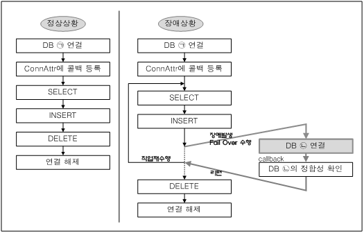

# 4.Fail-Over

데이터베이스 시스템을 운영 하는 도중, 장애가 발생하였을 때 이를 극복하고 장애에 관계없이 서비스를 계속할 수 있도록 Fail-Over 기능을 제공한다. 이 장은 Altibase에서 지원하는 Fail-Over의 기능과 사용 방법에 대해 설명한다.

### Fail-Over 의 개요

#### 개념

Fail-Over는 DBMS 운영 도중 장애가 발생하였을 때 이를 극복하고 장애가 발생하지 않은 것처럼 서비스를 계속할 수 있도록 하는 것을 의미한다.

발생 가능한 장애로는 DBMS 서버가 탑재된 장비 자체에서 장애가 발생하거나, 장비로 가는 네트워크 경로에서 장애가 발생하거나 DBMS의 소프트웨어 오류로 비정상 종료되어 장애가 발생하는 경우 등이 있다. Fail-Over는 장애의 종류와 관계 없이, 장애 발생시 다른 DBMS 서버로 접속할 수 있게 함으로써 응용 프로그램에서 장애 여부를 인식하지 못한 채 서비스를 계속할 수 있게 한다.

Fail-Over는 장애를 인식하는 시점에 따라 다음 2가지로 분류할 수 있다.

-   CTF (Connection Time Fail-Over)

-   STF (Service Time Fail-Over)

CTF는 DBMS 접속 시점에 장애를 인식하여 장애가 발생한 DBMS 대신 다른 가용 노드의 DBMS로 접속을 재시도하는 것을 의미한다.

STF는 DBMS 서비스하는 도중에 장애를 감지하여 다른 가용 노드의 DBMS에 다시 접속하여 세션의 프로퍼티를 복구해 주어, 사용자 응용 프로그램의 업무 로직이 계속 수행될 수 있도록 하는 것을 의미한다. STF는 DB접속에 대해서만 Fail-Over를 수행해 주기 때문에, 실패한 트랜잭션은 사용자에 의해 재처리되어야 한다.

이러한 Fail-Over에서 정확한 작업 결과를 얻기 위해, 장애 DBMS와 가용 DBMS 간의 데이터베이스의 정합성이 보장되어야 한다.

Altibase는 데이터베이스의 정합성을 보장하기 위해 오프라인 이중화 기능을 이용한 데이터베이스 복제 방법을 제공한다. 오프라인 이중화는 Standby 서버에서 Active 서버의 로그를 읽어 데이터베이스를 정합시키는 방법이다.

이중화 방법의 특성상, 데이터베이스의 정합성이 맞지 않는 경우가 발생할 수 있으므로 Fail-Over 콜백(Callback) 함수를 이용하여 정합성을 꼭 확인하기를 권장한다. Fail-Over 콜백에 대해서는 다음 절에서 자세히 설명한다.

Altibase의 Fail-Over설정은 응용프로그램에 Fail-Over속성을 등록함으로써 이루어지며, Fail-Over 콜백 함수를 사용하여 Fail-Over를 수행하기 전에 데이터베이스의 정합성을 확인할 수 있다.

응용프로그램에서 Fail-Over와 관련된 작업은 다음 3가지로 요약할 수 있다.

-   Fail-Over 연결 속성 등록

-   Fail-Over 콜백 함수 등록

-   콜백의 결과에 따른 업무 로직 처리

#### Fail-Over 수행 과정 

Fail-Over 등록 및 처리과정을 그림으로 나타내면 다음과 같다.



[그림 4‑1] Fail-Over 수행 과정

Fail-Over 콜백은 사용자가 등록하여야 하며, 등록하면 Fail-Over(STF) 과정에서 Altibase User Library(예를 들어, JDBC, CLI 라이브러리) 및 응용프로그램과 아래 그림처럼 통신하게 된다.

Fail-Over 콜백을 등록하지 않으면 응용프로그램과 통신 없이 Fail-Over를 수행하고, 진행 상항을 트레이스 로그(Trace log)에 남긴다. Altibase의 데이터베이스 복제 환경에서는 데이터베이스 정합성 확인(Fail-Over Validation)을 할 수 있도록 콜백을 꼭 사용할 것을 권장한다.


사용자가 데이터베이스에 연결(Connection)한 후 Conn Attr에 Fail-Over 콜백을 등록한다.

응용프로그램 로직을 수행한다.  
응용프로그램 수행 도중, DBMS가 탑재된 장비에서 장애가 발생하여 오류(네트워크 관련 오류 포함)를 수신하면, Fail-Over를 위해 Altibase 사용자 라이브러리(Altibase User Library)를 호출한다.

이 사용자 라이브러리는 등록된 Fail-Over 콜백에게 Fail-Over 시작 이벤트(FO_BEGIN)를 보낸다. Fail-Over 콜백에서는 Fail-Over를 계속 진행할지 여부를 반환(return)한다.

콜백에서 계속 진행(FO_GO)하기로 결정하면 수행하였던 SQL문을 해제(close statement)하고, 가용 서버을 찾아서 데이터베이스 접속 및 로그인을 한다. 그리고 이전 세션의 속성을 접속된 가용서버에서 복구한다(auto commit 모드, 최적화 모드, XA 연결 설정, 등).

4번 과정까지 완료하면, Fail-Over가 성공적으로 종료되었다는 이벤트(FO_END)를 Fail-Over 콜백에게 보낸다.

Fail-Over 콜백에서 데이터베이스 정합성 확인을 위한 질의(Fail-Over Validation)를 수행한다. 데이터베이스 이중화 환경에서는 정합성을 꼭 확인해야 한다.

### Fail-Over 사용 방법

#### Fail-Over 연결 속성 등록

Fail-Over 연결 속성을 등록하면, 장애가 발생하였을 때 Altibase가 이를 감지하고 연결 속성에 명시된 대로 Fail-Over 작업을 내부적으로 수행하게 된다.

속성 표시 방법은 다음 2가지가 있다.

-   API 의 연결 함수 호출에서 연결 속성 문자열(Connection String)로 명시

-   연결 설정 파일에 명시  
    altibase_cli.ini에 표시

##### 클라이언트 프로그램 내에서 연결 속성 문자열로 명시

응용 프로그램에서 연결 함수 실행 시에 다음과 같이 연결 문자열을 명시한다.

[JDBC]

```
Jdbc:Altibase://192.168.3.51:20300/mydb?AlternateServers=(192.168.3.54:20300,192.168.3.53:20300) &ConnectionRetryCount=3&ConnectionRetryDelay=3&SessionFailOver=on;
```

[ODBC, Embedded SQL]

```
DSN=192.168.3.51;UID=altibase;PWD=altibase;PORT_NO=20300;AlternateServers=(192.168.3.54:20300,192.168.3.53:20300);ConnectionRetryCount=3;ConnectionRetryDelay=5;SessionFailOver=on;
```

[PDO]

```
Server=192.168.3.51;Port=20300;AlternateServers=(192.168.3.54:20300,192.168.3.53:20300);ConnectionRetryCount=3;ConnectionRetryDelay=5;SessionFailOver=on
```

AlternateServer는 장애 발생시 접속하게 될 가용 서버를 나타내며, (IP Address1:Port1, IP Address2:Port2,...) 형식으로 기술한다.

ConnectionRetryCount는 가용 서버에 접속 실패 시, 접속 시도 반복 횟수이다. 생략할 수 있으며, 기본값은 1이다.

ConnectionRetryDelay는 가용 서버 접속 실패 시, 다시 접속을 시도하기 전에 대기하는 시간으로 초 단위이다. 생략할 수 있으며, 기본값은 1이다.

LoadBalance는 on 혹은 off 값을 갖을 수 있고, 기본값은 off 이다. 이 값이 on 인 경우에, 최초 접속시 접속가능 서버중 랜덤으로 접속시도한다. 그리고, session time failover시에는 접속되어있었던 서버에 먼저 접속 시도, 그 후 기존 접속 서버는 제외하고, 랜덤으로 접속시도 한다.

SessionFailOver는 STF (Service Time Fail-Over)를 할 것인지 여부를 나타낸다. 생략할 수 있으며, 기본값은 off이다.

##### 설정 파일에 연결 속성 명시

\$ALTIBASE_HOME/conf 또는 \$HOME 또는 해당 응용프로그램이 실행되는 디렉터리의 altibase_cli.ini 파일내의 Data Source 부분에 Fail-Over 연결 속성을 기술하고, 연결 함수의 연결 속성 문자열에 DataSource 이름을 명시한다.

```
[MyDataSource1]
Server=192.168.3.51
Port=20300
User=altibase
Password=altibase
DataBase = mydb
AlternateServers=(192.168.3.54:20300,192.168.3.53:20300)
ConnectionRetryCount=3
ConnectionRetryDelay=5
SessionFailOver = off
```

응용 프로그램에서 연결 함수의 연결 속성 문자열에 다음과 같이 표시한다.

-   JDBC  
    Connection URL을 다음과 같이 DataSource이름을 명시한다.

```
Jdbc:Altibase://MyDataSource1//
```

-   ODBC, Embedded SQL  
    DSN 속성에 DataSource 이름을 명시한다. odbc.ini도 altibase_cli.ini와 동일한 방법으로 설정한다.

```
DSN=MyDataSource1
```

-   PDO  
    DSN 속성에 DataSource 이름을 명시한다.

```
altibase:MyDataSource1
```

#### Fail-Over 성공 여부 확인

CTF (Connection Time Fail-Over)는 데이터베이스 연결이 되는지에 따라 성공 여부를 바로 알 수 있다. 반면 STF (Service Time Fail-Over)는 예외 상황이나 오류 확인을 통해서 파악할 수 있다.

예를 들어, JDBC를 사용하는 경우 SQLException을 catch하고 SQLException의 getSQLState() 메쏘드가 반환하는 값이 SQLStates.status배열의 SQLStates.ES_08FO01 요소의 값과 같으면 Fail-Over가 성공한 것이다.

CLI와 ODBC 경우는 SQLPrepare, SQLExecute, SQLFetch등에서 SQL_SUCCESS가 아닌 에러가 발생하면, SQLGetDiagRec에 statement 핸들을 넘기고, 이 함수의 5번째 인자에 반환되는 native 에러 코드 값이 ALTIBASE_FAILOVER_SUCCESS인 진단 레코드(diagnostic record)가 있으면 STF (Service Time Fail-Over)가 성공한 것으로 판단할 수 있다.

Embedded SQL의 경우는 EXEC SQL구문 수행 후, sqlca.sqlcode가 SQL_SUCCESS가 아니고 ALTIBASE_FAILOVER_SUCCESS이면 STF (Service Time Fail-Over)가 성공한 것이다.

PDO 경우 PDO::ALTIBASE_FAILOVER_SUCCESS이면 STF가 성공한 것으로 판단한다.

구체적인 확인 방법은 응용프로그램 형태별로 다음 절에서 설명한다.

#### Fail-Over 콜백 함수 작성 방법

Fail-Over 수행시에 데이터베이스의 정합성 확인을 위해 콜백 함수를 작성해야 한다. 응용 프로그램 형태별로 Fail-Over 콜백 작성 방법이 다르지만 기본 구조는 유사하며 다음과 같은 구조를 가진다.

-   Fail-Over 관련 자료구조 정의

-   Fail-Over 관련 이벤트에 따른 Fail-Over Callback 함수 본문 작성

-   Fail-Over 성공 여부 확인

자료구조 정의에서는 Fail-Over 이벤트를 정의하거나 정의된 인터페이스(header 파일)을 include한다.

콜백 함수 본문 작성 부분에는 Fail-Over 이벤트 즉 Fail-Over 시작이나 Fail-Over 종료와 같은 이벤트가 발생였을 때 필요한 작업들, 예를 들어 정합성 확인을 위한 코드를 구현한다.

Fail-Over가 성공적으로 끝나고 콜백 함수까지 성공적으로 실행되면 Fail-Over가 성공한 것으로 판단되며, 이것은 장애로 인해 중단된 서비스를 계속할 수 있다는 것을 의미한다.

구체적인 작성 방법은 응용프로그램 형태별로 다음 절에서 설명한다.

### JDBC에서 콜백 작성

#### Fail-Over 관련 콜백 인터페이스

JDBC 를 사용하는 응용프로그램에서 FailOver 콜백 함수를 작성하려면 Altibase JDBC 드라이버에서 제공하는 ABFailOverCallback 인터페이스를 구현하는 클래스를 작성해야 한다. ABFailOverCallback 인터페이스는 아래와 같이 정의되어 있다.

```
public interface ABFailOverCallback
{
	int FO_BEGIN	= 0;
	int FO_END	= 1;
	int FO_ABORT	= 2;
	int FO_GO	= 3;
	int FO_QUIT	= 4;

	int failOverCallback(Connection aConnection,
		   Object aAppContext,
		   int aFailOverEvent);
};
```

값의 의미는 다음과 같다.

-   FO_BEGIN  
    STF (Service Time FailOver)가 시작됨을 FailOver 콜백에게 알려주는 이벤트이다.
    
-   FO_END  
    STF가 성공하였음을 FailOver 콜백에게 알려주는 이벤트이다.

-   FO_ABORT  
    STF가 실패하였음을 FailOver 콜백에게 알려주는 이벤트이다.

-   FO_GO  
    사용자가 콜백 함수에서 라이브러리로 STF의 다음 과정을 진행하라는 의미로 반환하는 값이다.
    
-   FO_QUIT  
    사용자가 콜백 함수에서 라이브러리로 STF의 다음 과정을 진행하지 말라는 의미로 반환하는 값이다.
    
-   aAppContext  
    사용자가 저장하고자 하는 임의의 객체이며, 저장하고자 하는 객체가 없으면 null로 설정한다.

#### Fail-Over 관련 콜백 작성

ABFailOverCallback 인터페이스를 구현한 MyFailOverCallback 클래스를 작성해야 한다.

이 클래스에서 콜백 인터베이스에 정의된 이벤트 FO_BEGIN, FO_END에 대한 작업을 구현한다. 즉 각각의 Fail-Over이벤트가 발생했을 때, 필요한 작업들을 기술한다.

예를 들어 FO_BEGIN에서는 Fail-Over가 시작되기 전에 필요한 코드들을 기술하며, FO_END에서는 Fail-Over가 끝난 후 서비스를 재개하기 전에 필요한 코드들을 기술한다. 구체적으로 보면, FO_END에서는 가용 서버 간의 데이터베이스의 정합성을 확인하는 코드들을 기술한다.

```
public class MyFailOverCallback implements ABFailOverCallback
{
    public int failOverCallback(Connection aConnection,
                               Object    aAppContext,
                               int        aFailOverEvent)
    {
        Statement sStmt  = null;
        ResultSet sRes  =  null;

        switch (aFailOverEvent)
        {
            case ABFailOverCallback.FO_BEGIN:
                System.out.println(“FailOver Started .... “);
                break;

            case ABFailOverCallback.FO_END:
                try
                {
                    sStmt = aConnection.createStatement();
                }
                catch( SQLException ex1 )
                {
                    try
                    {
                        sStmt.close();
                    }
                    catch( SQLException ex3 )
                    {
                    }
                    return ABFailOverCallback.FO_QUIT;
                } //catch  SQLException ex1

                try
                {
                    sRes = sStmt.executeQuery("select 1 from dual");
                    while(sRes.next())
                    {
                        if(sRes.getInt(1) == 1 )
                        {
                            break;
                        }
                    }//while;
                }
                catch ( SQLException ex2 )
                {
                    try
                    {
                        sStmt.close();
                    }
                    catch( SQLException ex3 )
                    {
                    }
                    return ABFailOverCallback.FO_QUIT;
                }//catch
                break;
        }//switch
        return ABFailOverCallback.FO_GO;
    }
}
```

그리고 위에서 정의한 MyFailOverCallback 클래스를 이용하여 콜백 객체를 생성한다.

```
MyFailOverCallback sMyFailOverCallback = new MyFailOverCallback();
Properties sProp = new Properties();
String sURL = "jdbc:Altibase://192.168.3.51:20300+"/mydb?AlternateServers=(192.168.3.54:20300,192.168.3.53:20300)&connectionRetryCount=3&
connectionRetryDelay=10&sessionFailOver=on";
```

생성된 콜백 객체를 Connection 객체에 등록한다.

```
((ABConnection)sCon).registerFailOverCallback(sMyFailOverCallback,null);
```

#### Fail-Over 성공 여부 확인

Fail-Over 특히 STF (Service Time Fail-Over)의 성공 여부 확인은 SQLException를 통해서 파악할 수 있다. SQLException을 catch하고 SQLException의 getSQLState() 메쏘드가 반환하는 값이 SQLStates.status배열의 SQLStates.ES_08FO01 요소의 값과 같으면 Fail-Over가 성공한 것이다.

다음은 Fail-Over 성공 여부 확인 예제이다.

```
while(true)
{
    try
    {
        sRes = sStmt.executeQuery(“SELECT C1 FROM T1”);
        while( sRes.next() )
        {
            System.out.println( "VALUE : " + sRes.getString(1)  );
        }//while
        break;
    }
    catch ( SQLException e )
    {
        if(e.getSQLState().equals(SQLStates.status[SQLStates.ES_08FO01])  == true)
        {
            continue;
        }
        System.out.println( "EXCEPTION : " + e.getMessage() );
        break;
    }
}
```

#### WAS에 Fail-Over 연결 속성 전달

URL 부분에 다음과 같이 Fail-Over 속성을 추가한다.

```
"jdbc:Altibase://192.168.3.51:20300+"/mydb?AlternateServers=(128.1.3.53:20300,128.1.3.52:20300)&connectionRetryCount=3&connectionRetryDelay=10&sessionFailOver=on";
```

#### 예제

위에서 정의한 콜백 함수들을 사용하여 다음과 같은 형태로 응용프로그램을 작성한다. 설치된 Altibase 패키지에서 \$ALTIBASE_HOME/sample/JDBC/Fail-Over/FailOverCallbackSample.java를 참고한다.

Fail-Over가 끝난 후, SQLException의 getSQLState() 메쏘드가 반환하는 값이 SQLStates.status배열의 SQLStates.ES_08FO01 요소의 값과 같으면 Fail-Over가 성공한 것이므로 응용프로그램의 작업을 다시 수행하여 서비스를 재개하도록 한다.

```
class   FailOverCallbackSample
{

    public static void main(String args[])  throws Exception
    {
        //---------------------------------------------------
        // Initialization
        //---------------------------------------------------
        // AlternateServers가 가용노드 property이다.
        String sURL = "jdbc:Altibase://127.0.0.1:" +
args[0]+"/mydb?AlternateServers=(128.1.3.53:20300,128.1.3.52:20301)&
ConnectionRetryCount=100&ConnectionRetryDelay=100&SessionFailOver=on";
        
        try
        {
            Class.forName("Altibase.jdbc.driver.AltibaseDriver");
        }
        catch ( Exception e )
        {
            System.err.println("Can't register Altibase Driver\n");
            return;
        }

        //---------------------------------------------------
        // Test Body
        //---------------------------------------------------

        //-----------------------
        // Preparation
        //-----------------------

        Properties sProp = new Properties();
        Connection sCon;
        PreparedStatement  sStmt = null;
        ResultSet sRes = null ;
        sProp.put("user", "SYS");
        sProp.put("password", "MANAGER");
        
        MyFailOverCallback sMyFailOverCallback = new MyFailOverCallback();
        sCon = DriverManager.getConnection(sURL, sProp);

        //FailOverCallback을 등록한다.
        ((ABConnection)sCon).registerFailOverCallback(sMyFailOverCallback, null);

        // Session Fail-Over를 위하여 다음 같은 형식으로 프로그램밍해야 합니다.
        /*
          while (true)
          {
            try
            {
            
            }
            catch(  SQLException e)
            {
                //Fail-Over가 발생.
                if(e.getSQLState().equals(SQLStates.status[SQLStates.ES_08FO01])  == true)
                {
                    continue;
                }
                System.out.println( "EXCEPTION : " + e.getMessage() );
                break;

            }       
             break;
          } // while
        */
        
        while(true)
        {
            try 
            {
                sStmt = sCon.prepareStatement("SELECT C1 FROM T2   ORDER BY C1");
                sRes = sStmt.executeQuery();
                while( sRes.next() )
                {
                    System.out.println( "VALUE : " + sRes.getString(1)  );
                }//while
            }
            
            catch ( SQLException e )
            {
                //FailOver가 발생하였다.
                if(e.getSQLState().equals(SQLStates.status[SQLStates.ES_08FO01])  == true)
                {
                    continue;
                }
                System.out.println( "EXCEPTION : " + e.getMessage() );
                break;
            }
            break;

        }
        sRes.close();
        //---------------------------------------------------
        // Finalize
        //---------------------------------------------------
        
        sStmt.close();
        sCon.close();
    }
}
```

### SQLCLI

sqlcli.h에 선언되어 있는 Fail-Over 관련 상수와 구조체를 살펴보고, Fail-Over 콜백 등록 방법 및 예제를 설명한다.

#### 관련 자료구조

STF (Service Time Fail-Over)에서 사용자 응용프로그램과 CLI 라이브러리의 통신을 위한 FailOver 콜백 함수의 프로토타입은 다음과 같다.

```
typedef  SQLUINTEGER  SQL_API (*SQLFailOverCallbackFunc)
           (SQLHDBC         aDBC,
            void            *aAppContext,
            SQLUINTEGER     aFailOverEvent);
```

aDBC는 응용프로그램에서 SQLAllocHandle으로 생성한 SQLHDBC이다.

aAppConext는 사용자가 저장하고 싶은 임의의 객체이며, FailOver Callback Context 등록 시에 CLI 라이브러리에 전달되는 메모리 주소이다. STF (Service Time FailOver)에서 Fail-Over 콜백 호출 시 Fail-Over 콜백에게 다시 전달된다.

aFailOverEvent는 다음과 값이 올 수 있으며 의미는 다음과 같다.

-   ALTIBASE_FO_BEGIN: 0  
    STF(Service Time Fail-Over)가 시작되는 것을 Fail-Over 콜백에 알린다.

-   ALTIBASE_FO_END: 1  
    STF(Service Time Fail-Over)가 성공하였음을 Fail-Over 콜백에 알린다.

-   ALTIBASE_FO_ABORT: 2  
    STF가 실패하였음을 Fail-Over 콜백에 알린다.

-   ALTIBASE_FO_GO: 3  
    STF(Service Time Fail-Over)의 다음 과정을 진행하도록 Fail-Over 콜백에서 CLI 라이브러리에 전달한다.
    
-   ALTIBASE_FO_QUIT: 4  
    STF(Service Time Fail-Over)의 다음 과정을 진행하지 않도록 Fail-Over 콜백에서 CLI 라이브러리에 전달한다.

CLI응용프로그램에서 Fail-Over 콜백을 등록할 때 사용하는 자료 구조체 SQLFailOverCallbackContext는 다음과 같다.

```
typedef   struct SQLFailOverCallbackContext
{
    SQLHDBC                    mDBC;
    void                       *mAppContext;
    SQLFailOverCallbackFunc    mFailOverCallbackFunc;
}SQLFailOverCallbackContext;
```

mDBC는 CLI의 경우 NULL로 설정해도 된다.

mAppConext는 사용자가 저장하고 싶은 임의의 객체이며, 저장하고 싶은 객체가 없으면 NULL로 설정한다.

mFailOverCallbackFunc는 사용자가 정의한 FailOver 콜백 함수이다.

#### Fail-Over 등록

Fail-Over등록은 다음과 같이 SQLFailOverCallbackContext를 생성하고, DB Connect 성공 후에 FailOverCallbackContext 내용을 채운다.

다음은 Fail-Over 등록 예제이다.

```
SQLFailOverCallbackContext  sFailOverCallbackContext;
...... 중간 생략
 /* connect to server */
sRetCode = SQLDriverConnect(sDbc, NULL,
SQLCHAR*)”DSN=127.0.0.1;UID=unclee;PWD=unclee;PORT_NO=20300;
AlternateServers=(192.168.3.54:20300,192.168.3.53:20300);ConnectionRetryCount=3;
ConnectionRetryDelay=5;SessionFailOver=on;”),
SQL_NTS, NULL, 0, NULL, SQL_DRIVER_NOPROMPT);

sFailOverCallbackContext.mDBC = NULL;
sFailOverCallbackContext.mAppContext = NULL;
sFailOverCallbackContext.mFailOverCallbackFunc = myFailOverCallback;
sRetCode = SQLSetConnectAttr(sDbc,ALTIBASE_FAILOVER_CALLBACK,
                                 (SQLPOINTER)&sFailOverCallbackContext, 0);
```

myFailOverCallback함수는 다음과 같다.

```
SQLUINTEGER  myFailOverCallback(SQLHDBC aDBC,
void *aAppContext,
SQLUINTEGER aFailOverEvent)
{
    SQLHSTMT 	sStmt = SQL_NULL_HSTMT;
    SQLRETURN   	sRetCode;
    SQLINTEGER    	sVal;
    SQLLEN            	sLen;
    SQLUINTEGER 	sFailOverIntension = ALTIBASE_FO_GO;

    switch(aFailOverEvent)
    {
        case ALTIBASE_FO_BEGIN:                      // Fail-Over시작이다.
            break;
        case ALTIBASE_FO_END:
            sRetCode = SQLAllocStmt( aDBC,&sStmt);
            if(sRetCode != SQ_SUCCESS)
            {
                 printf("FailOver-Callback SQLAllocStmt Error ");
                 return ALTIBASE_FO_QUIT;
            } 
            sRetCode = SQLBindCol(sStmt, 1, SQL_C_SLONG , &sVal,0,&sLen);
            if(sRetCode != SQ_SUCCESS)
            {
                 printf("FailOver-Callback SQLBindCol");
                 return ALTIBASE_FO_QUIT;
             } 
            sRetCode =  SQLExecDirect(sStmt, (SQLCHAR *) "SELECT 1 FROM DUAL", 
                                          SQL_NTS);
            if(sRetCode != SQ_SUCCESS)
            {
                 printf("FailOVer-Callback SQLExecDirect");
                 return ALTIBASE_FO_QUIT;
            }
            while ( (sRetCode  = SQLFetch(sStmt)) != SQL_NO_DATA )
            {
                if(sRetCode != SQL_SUCCESS)
                {
                     printf("FailOver-Callback SQLBindCol");
                     sFailOverIntension =  ALTIBASE_FO_QUIT;
                     break;
                }
                printf("FailOverCallback->Fetch Value = %d \n",sVal );
                fflush(stdout);
            }

            sRetCode = SQLFreeStmt( sStmt, SQL_DROP );
            ATC_TEST(sRetCode,"SQLFreeStmt");
            break;

        default:
            break;
    }//switch 
    return  sFailOverIntension;
 }//myFailOverCallback
```

#### Fail-Over 성공 여부 확인

SQLPrepare, SQLExecute, SQLFetch등에서 SQL_SUCCESS가 아닌 에러가 발생하면, SQLGetDiagRec에 statement 핸들을 넘기고, 이 함수의 5번째 인자에 반환되는 native 에러 코드 값이 ALTIBASE_FAILOVER_SUCCESS인 진단 레코드가 있으면 STF (Service Time Fail-Over)가 성공한 것으로 판단할 수 있다.

다음은 STF(Service Time Fail-Over)의 성공 여부를 확인하는 예제 함수이다.

```
UInt isFailOverErrorEvent(SQLHSTMT aStmt)
{
    SQLRETURN 	rc;
    SQLSMALLINT 	sRecordNo;
    SQLCHAR     	sSQLSTATE[6];
    SQLCHAR     	sMessage[2048];
    SQLSMALLINT 	sMessageLength;
    SQLINTEGER  	sNativeError;
    UInt        	sRet = 0;
    sRecordNo = 1;
    while ((rc = SQLGetDiagRec(SQL_HANDLE_STMT,
                                 aStmt,
                                 sRecordNo,
                                 sSQLSTATE,
                                 &sNativeError,
                                 sMessage,
                                 sizeof(sMessage),
                                 &sMessageLength)) != SQL_NO_DATA)
    {
        sRecordNo++;
        if(sNativeError == ALTIBASE_FAILOVER_SUCCESS)
        {
            sRet = 1;
            break;
        }
    }
    return sRet;
}
```

다음은 SQLExecuteDirect호출에서 네트워크 오류가 발생하였을 때, STF(Service Time FailOver) 성공 여부를 확인하여 재실행하는 예제이다(prepare/execute 방식일 때는 prepare부터 다시 해야 한다).

```
retry:
    sRetCode = SQLExecDirect(sStmt, 
(SQLCHAR *) "SELECT C1 FROM T2 WHERE C2 > ? ORDER BY C1", 
SQL_NTS);
    if(sRetCode != SQL_SUCCESS)
    {
        if(isFailOverErrorEvent(sStmt) == 1)
        {
            goto retry;
        }
        else
        {
            printf(“Error While DirectExeute....”);
            exit(-1).
        }
    }
```

#### 예제

##### 환경설정

예제 실행을 위해, Test1이란 DataSource가 altibase_cli.ini에 다음과 같이 기술되어 있다.

```
[ Test1  ]
Server=192.168.3.53
Port=20300
User=altibase
Password= altibase
DataBase = mydb
AlternateServers=(192.168.3.54:20300,192.168.3.53:20300)
ConnectionRetryCount=3
ConnectionRetryDelay=5
SessionFailOver = on
```

그리고 FailOver 콜백 함수는 앞 예제에 기술한 myFailOverCallback을 사용한다.

STF(Service Time Fail-Over)이 발생하여 성공하면 SQLPrepare부터 다시 수행하여야 한다 (SQLDirectExecute경우는 prepare과정이 필요 없으며 SQLDirectExecute를 다시 수행한다).

Fetch중에 STF가 발생하면 SQLCloseCursor를 수행하고, Prepare부터 다시 수행해야 한다 (SQLDirectExecute경우는 prepare과정이 필요 없으며, SQLDirectExecute를 다시 수행하면 된다).

##### 샘플 코드

자세한 내용은 Altibase 패키지에서 $ALTIBASE_HOME/sample/SQLCLI/Fail-Over/FailOverCallbackSample.cpp를 참고한다.

```
#define ATC_TEST(rc, msg) if( ((rc)&(~1))!=0) { printf(msg); exit(1); }
//STF(Service Time FailOver) 성공 여부 판단함수.
UInt isFailOverErrorEvent(SQLHDBC aDBC,SQLHSTMT aStmt)
{
    SQLRETURN 	rc;
    SQLSMALLINT	sRecordNo;
    SQLCHAR   	sSQLSTATE[6];
    SQLCHAR   	sMessage[2048];
    SQLSMALLINT	sMessageLength;
    SQLINTEGER	sNativeError;
    UInt      		sRet = 0;
    sRecordNo = 1;

    while ((rc = SQLGetDiagRec(SQL_HANDLE_STMT, aStmt,
                                 sRecordNo, sSQLSTATE,
                                 &sNativeError,  sMessage,
                                 sizeof(sMessage),
                                 &sMessageLength)) != SQL_NO_DATA)
    {
        sRecordNo++;
        if(sNativeError == ALTIBASE_FAILOVER_SUCCESS)
        {
            sRet = 1;
            break;
        }
    }
    return sRet;
}

int main( SInt argc, SChar *argv[])
{
    SChar		sConnStr[BUFF_SIZE] = {0};
    SQLHANDLE   	sEnv  = SQL_NULL_HENV;
    SQLHANDLE   	sDbc  = SQL_NULL_HDBC;
    SQLHSTMT    	sStmt = SQL_NULL_HSTMT;
    SQLINTEGER  	sC2;
    SQLRETURN  	sRetCode;
    SQLINTEGER  	sInd;
    SQLINTEGER  	sValue;
    SQLLEN     	sLen;
    UInt        	sDidCreate = 0;
    SChar       	sBuff[BUFF_SIZE2];
    SChar       	sQuery[BUFF_SIZE];

    SQLFailOverCallbackContext  sFailOverCallbackContext;
    snprintf(sConnStr, sizeof(sConnStr), "DSN=Test1”);
    sprintf(sQuery,"SELECT C1 FROM T2  WHERE C2 > ? ORDER BY C1");
    sRetCode = SQLAllocHandle(SQL_HANDLE_ENV, NULL, &sEnv);
    ATC_TEST(sRetCode,"ENV");
    sRetCode = SQLAllocHandle(SQL_HANDLE_DBC, sEnv, &sDbc);
    ATC_TEST(sRetCode,"DBC");
    /* connect to server */
    sRetCode = SQLDriverConnect(sDbc, NULL, (SQLCHAR *)sConnStr,
                                    SQL_NTS, NULL, 0, NULL,
                                SQL_DRIVER_NOPROMPT);
    ATC_TEST(sRetCode,"SQLDriverConnect");
    sRetCode = SQLAllocStmt( sDbc,&sStmt);
    ATC_TEST(sRetCode,"SQLAllocStmt");
    sRetCode = SQLBindCol(sStmt, 1, SQL_C_CHAR , sBuff,BUFF_SIZE2,&sLen);
    ATC_TEST(sRetCode,"SQLBindCol");
    sRetCode = SQLBindParameter(sStmt, 1, SQL_PARAM_INPUT,
                                    SQL_C_SLONG, SQL_INTEGER,
                                    0, 0, &sC2, 0, NULL);
    ATC_TEST(sRetCode,"SQLBindParameter");
    sFailOverCallbackContext.mDBC = NULL;
    sFailOverCallbackContext.mAppContext = &sFailOverDirection;
    sFailOverCallbackContext.mFailOverCallbackFunc = myFailOverCallback;
    sRetCode = SQLSetConnectAttr(sDbc,ALTIBASE_FAILOVER_CALLBACK,
                                     (SQLPOINTER)&sFailOverCallbackContext,0);
    ATC_TEST(sRetCode,"SQLSetConnectAttr");
  retry:
    sRetCode = SQLPrepare(sStmt, (SQLCHAR *)sQuery, SQL_NTS);
    if(sRetCode != SQL_SUCCESS)
    {
        // STF가 성공하면 다시 prepare부터 다시 한다.
        if(isFailOverErrorEvent(sDbc,sStmt) == 1)
        {
            goto retry;
        }
        else
        {
            ATC_TEST(sRetCode,"SQLPrepare");
        }
    }
    sC2 = 0;
    sRetCode =  SQLExecute(sStmt);
    if(sRetCode != SQL_SUCCESS)
    {
         // STF가 성공하면 다시 prepare부터 다시 한다.
        if(isFailOverErrorEvent(sDbc,sStmt) == 1)
        {
            goto retry;
        }
        else
        {
            ATC_TEST(sRetCode,"SQLExecDirect");
        }
    }

    while ( (sRetCode  = SQLFetch(sStmt)) != SQL_NO_DATA )
    {
        if(sRetCode != SQL_SUCCESS)
        {
            if(isFailOverErrorEvent(sDbc,sStmt) == 1)
            {
                //Fetch중에서 STF가 발생하면 SQLCloseCursor를 반드시 해 주어야 한다. 
                SQLCloseCursor(sStmt);
                goto retry;
            }
            else
            {
                ATC_TEST(sRetCode,"SQLExecDirect");
            }
        }
        printf("Fetch Value = %s \n", sBuff);
        fflush(stdout);
    }
    sRetCode = SQLFreeStmt( sStmt, SQL_DROP );
    ATC_TEST(sRetCode,"SQLFreeStmt");
    sRetCode = SQLDisconnect(sDbc);
    ATC_TEST(sRetCode,"Disconnect()");
    sRetCode = SQLFreeHandle(SQL_HANDLE_DBC, sDbc);
    ATC_TEST(sRetCode,"Free HDBC");
    sRetCode = SQLFreeHandle(SQL_HANDLE_ENV, sEnv);
    ATC_TEST(sRetCode,"Free HENV");
}
```

### Embedded SQL

CLI와 동일한 Fail-Over 자료 구조를 사용하며, ESQLC(Embedded SQL in C) 응용프로그램이 구조적으로 CLI 프로그램과 유사하므로 여기에서는 ESQLC 에만 해당하는 부분을 설명한다.

#### Fail-Over 콜백 함수 등록

Embedded SQL 프로그램에는 CLI의 SQLHDBC를 바로 알 수 없기 때문에, Fail-Over콜백 함수 등록은 다음과 같이 한다.

FailOverCallbackContext를 호스트 변수 선언부에 선언한다.

```
EXEC SQL BEGIN DECLARE SECTION;
SQLFailOverCallbackContext sFailOverCallbackContext;
EXEC SQL END DECLARE SECTION;
```

FailOverCallbackContext를 채운다.

```
sFailOverCallbackContext.mDBC = NULL;
sFailOverCallbackContext.mAppContext = NULL;
sFailOverCallbackContext.mFailOverCallbackFunc = myFailOverCallback;
```

myFailOverCallback은 앞서 CLI Fail-Over예제에 나왔던 함수이며, CLI함수, Os함수로만 채워야 하며, Embedded SQL 구문을 사용하면 안 된다.

다음 Embedded SQL 구문으로 Fail-Over 콜백 함수를 등록한다.

```
EXEC SQL [AT CONNECTUON-NAME] REGISTER FAIL_OVER_CALLBACK :sFailOverCallbackContext;
```

#### Fail-Over 성공 여부 확인

EXEC SQL구문을 수행 후, sqlca.sqlcode가 SQL_SUCCESS가 아니고 sqlcode가 ALTIBASE_FAILOVER_SUCCESS이면 STF (Service Time Fail-Over)이 성공한 것이다.

다음은 STF(Service Time Fail-Over) 성공 여부 확인 예제이다.

```
re-execute:
    EXEC SQL INSERT INTO T1 VALUES( 1 );
    if (sqlca.sqlcode != SQL_SUCCESS)
    {
        if (sqlca.sqlcode == ALTIBASE_FAILOVER_SUCCESS)
        {
            goto re-execute;
        }//if
        else
        {
            printf("SQLCODE                : %d\n", SQLCODE);
            printf("sqlca.sqlerrm.sqlerrmc : %s\n", sqlca.sqlerrm.sqlerrmc);
            printf("%d rows inserted\n", sqlca.sqlerrd[2]);
             printf("%d times insert success\n\n", sqlca.sqlerrd[3]);
       }//else
    }
```

#### 예제 1

```
main()
{
    EXEC SQL BEGIN DECLARE SECTION;
    SQLFailOverCallbackContext sFailOverCallbackContext;
    char sUser[10];
    char sPwd[10];
    char sConnOpt[1024];
    EXEC SQL END DECLARE SECTION;

    strcpy(sUser, "SYS");
    strcpy(sPwd, "MANAGER");
    sprintf(sConnOpt,”DSN=127.0.0.1;UID=altibase;PWD= altibase;PORT_NO=20300;
          AlternateServers=(192.168.3.54:20300,192.168.3.53:20300);ConnectionRetryCount=3;
          ConnectionRetryDelay=5;SessionFailOver=on;”” );

    EXEC SQL CONNECT :sUser IDENTIFIED BY :sPwd USING : sConnOpt;

    if (sqlca.sqlcode != SQL_SUCCESS)
    {
        printf("SQLCODE                : %d\n", SQLCODE);
        printf("sqlca.sqlerrm.sqlerrmc : %s\n", sqlca.sqlerrm.sqlerrmc);
        return 0;
    }
    else
    {
        printf("CONNECTION SUCCESS\n");
    }

    //FailOverCallbackContext를 채운다.
    sFailOverCallbackContext.mDBC = NULL;
    sFailOverCallbackContext.mAppContext = NULL;
    sFailOverCallbackContext.mFailOverCallbackFunc = myFailOverCallback;
    // FailOverCallbackContext를 등록한다.
    EXEC SQL  REGISTER FAIL_OVER_CALLBACK :sFailOverCallbackContext;

re-execute:
    EXEC SQL INSERT INTO T1 VALUES( 1 );
    if (sqlca.sqlcode != SQL_SUCCESS)
    {
        if (SQLCODE == EMBEDED_ALTIBASE_FAILOVER_SUCCESS)
        {
              goto re-execute;
         }//if
         else
         {
             printf("SQLCODE                : %d\n", SQLCODE);
             printf("sqlca.sqlerrm.sqlerrmc : %s\n", sqlca.sqlerrm.sqlerrmc);
             printf("%d rows inserted\n", sqlca.sqlerrd[2]);
             printf("%d times insert success\n\n", sqlca.sqlerrd[3]);
            return 0;
        }//else
    }
    EXEC  SQL DISCONNECT;
}
```

#### 예제 2

Cursor를 사용하는 경우에 대한 예제이다. Cursor를 사용하다가 Fail-Over가 발생하면 EXEC SQL CLOSE RELEASE Cursor 를 수행하고, EXEC SQL DECLARE CURSOR 구문을 재 수행하여 가용 서버에 다시 Prepare를 수행하도록 한다.

```
retry:
   EXEC SQL DECLARE CUR1 CURSOR FOR SELECT C1 FROM T2 ORDER BY C1;
    if (sqlca.sqlcode == SQL_SUCCESS)
   {
         printf("DECLARE CURSOR SUCCESS.!!! \n");
    }
   else
   {
        if( SQLCODE  == EMBEDED_ALTIBASE_FAILOVER_SUCCESS)
        {
             printf("Fail-Over  SUCCESS !!! \n");
             goto retry;
        }
        else
        {
             printf("Error : [%d] %s\n\n", SQLCODE, sqlca.sqlerrm.sqlerrmc);
             return(-1);
        }
    }
    EXEC SQL OPEN CUR1;
    if (sqlca.sqlcode == SQL_SUCCESS)
    {
        printf("DECLARE CURSOR SUCCESS !!!\n");
    }
    else
    {
        if( SQLCODE  == EMBEDED_ALTIBASE_FAILOVER_SUCCESS)
        {
            printf("Fail-Over SUCCESS !!! \n");
            /* cursor OPEN시 Fail-Over가 발생하면 Cursor를 close release까지
               해주어야 합니다. */
            EXEC SQL CLOSE RELEASE CUR1;
            goto retry;
        }
        else
        {
             printf("Error : [%d] %s\n\n", SQLCODE, sqlca.sqlerrm.sqlerrmc);
             return(-1);
        }
    } //else 

    while(1)
    {
         EXEC SQL FETCH CUR1 INTO :sC1;
         if (sqlca.sqlcode == SQL_SUCCESS)
         {
              printf("Fetch Value = %s \n",sC1);
         }
         else if (sqlca.sqlcode == SQL_NO_DATA)
         {
              break;
         }
         else
         {
              if(SQLCODE == EMBEDED_ALTIBASE_FAILOVER_SUCCESS)
              {
                   printf("DECLARE CURSOR SUCCESS !!!");
                   /* fetch 시 Fail-Over가 발생하면 Cursor를 close release까지
                      해주어야 합니다.  */
                   EXEC SQL CLOSE RELEASE CUR1;
                   goto retry;
              }
              else
              {
                   printf("Error : [%d] %s\n\n", SQLCODE, sqlca.sqlerrm.sqlerrmc);
                   return(-1);
              }//else
         }//else
    }//while

    EXEC SQL CLOSE CUR1;
```

### PDO에서 콜백 작성

#### Fail-Over 콜백 등록

PDO를 사용하는 응용프로그램에서 FailOver 콜백을 등록하려면 다음 메소드를 이용한다.

```
...
public bool PDO::setFailoverCallback(string $callback, mixed $app_context)
...
```

-   \$callback  
    콜백으로 등록하는 함수 이름이다.

-   \$app_context  
    콜백으로 받아서 사용할 임의의 변수이다. \$app_context로 전달한 변수는 콜백 함수에서 \$context 인자로 전달받는다. 이 값은 사용자 콜백을 수행할 때 참고하기 위한 것이기 때문에 필요없다면 사용하지 않아도 된다. 
    콜백 등록에 성공하면 TRUE, 실패하면 FALSE를 반환한다.

#### Fail-Over 콜백 관련 인터페이스

POD를 사용하는 응용프로그램에서 FailOver 콜백 함수를 아래와 같이 정의한다.

```
function focbfunnc($db, $context, $event)
{
    // ...

    return PDO::ALTIBASE_FO_GO;
}
```

-   \$db  
    FailOver가 발생하는 PDO 객체이다.

-   \$context  
    콜백에서 참고할 임의의 값이며, 콜백을 등록할 때 지정할 수 있다.

-   \$event  
    \$event에 올 수 있는 값은 아래와 같다.

| event                  | 설명     |
|------------------------|----------|
| PDO::ALTIBASE_FO_BEGIN | STF 시작 |
| PDO::ALTIBASE_FO_END   | STF 성공 |
| PDO::ALTIBASE_FO_ABORT | STF 실패 |

-   콜백은 다음 중 하나를 반환해야 한다.

| 반환값                | 설명     |
|-----------------------|----------|
| PDO::ALTIBASE_FO_GO   | STF 진행 |
| PDO::ALTIBASE_FO_QUIT | STF 중단 |

#### Fail-Over 등록

FailOver 콜백은 연결을 성공한 후 지정하며, 예제는 다음과 같다.

```
function focbfunc($db, $context, $event) {
    switch ($event) {
        case PDO::ALTIBASE_FO_BEGIN:
            if ($context == 1) {
                return PDO::ALTIBASE_FO_QUIT;
            }
            // ...
            break;

        case PDO::ALTIBASE_FO_END:
            // ...
            break;

        // ...
    }

    return PDO::ALTIBASE_FO_GO;
}

// ...

$db->setFailoverCallback('focbfunc', $appctx);
```

#### Fail-Over 성공 여부 확인

Failover가 발생한 경우 Driver-specific error code가 PDO::ALTIBASE_FAILOVER_SUCCESS이면 STF에 성공한 것이다.

Failover는 연결까지만 보장하므로, 반드시 STF 성공여부를 확인한 후 수행을 재시도해야 한다.

아래는 STF 성공 여부 확인과 재시도를 하는 예제이다.

```
FailoverRetry:
try {
    $stmt = $db->prepare("SELECT c1 FROM T2 WHERE c2 ? ORDER BY c1");
    $stmt->bindParam(1, $sC2);

    $sC2 = 0;

    $stmt->execute();

    while (($row = $stmt->fetch()) !== FALSE) {
        // ...
    }
}
catch (PDOException $ex) {
    $errInfo = $ex->errorInfo;
    if ($errInfo[1] == PDO::ALTIBASE_FAILOVER_SUCCESS) {
        goto FailoverRetry;
    }
    else {
        // ...
    }
}
```

