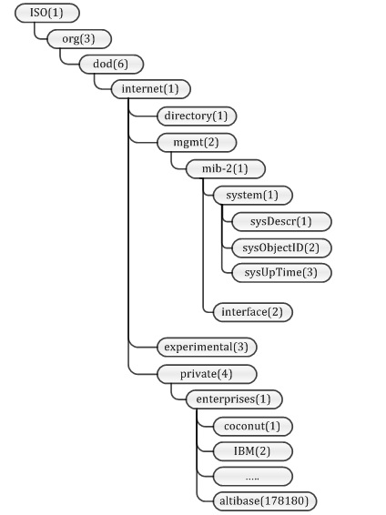
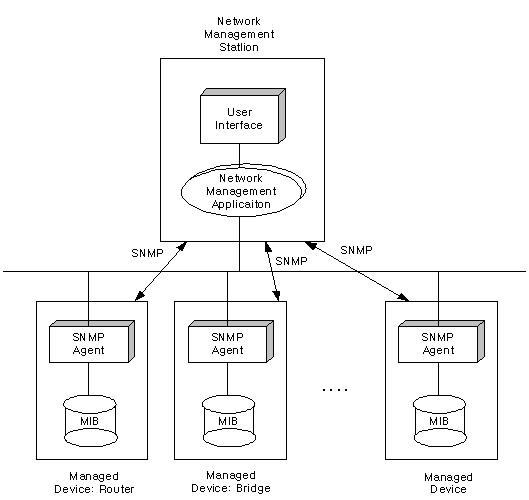
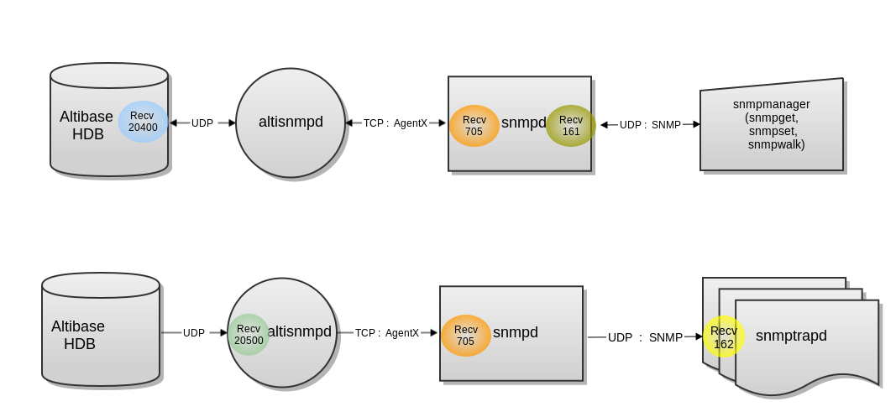

# 1.SNMP 개요

이 장에서는 Simple Network Management Protocol(SNMP)의 개요와 ALTIBASE-MIB의
구성에 대해 설명한다.

### SNMP란

#### SNMP 개요

SNMP(Simple Network Management Protocol)는 네트워크 장비의 상태 및 프로세스 상태
등을 관리자에게 전달해 줄 수 있는 프로토콜이다.

SNMP가 사용되기 전에는 ICMP를 이용하여 네트워크에 연결된 각각의 호스트가
작동하고 있는지, 작동한다면 어느정도의 응답시간을 가지고 작동하는지 등의 간단한
정보를 얻었다. ICMP를 이용한 가장 유용한 도구는 아마도 ping 프로그램일 것이다.

그러나 인터넷의 사용이 보편화되고 네트워크에 연결된 호스트의 수가 증가하자
네트워크 구성 역시 복잡해졌다. ICMP만으로는 네트워크 관리를 효율적으로 사용할 수
없게되면서, 몇가지 프로토콜에 대한 연구가 진행되었다. SGMP, HEMS, CMIP/SMIS 등이
제안되게 되었다. 이 중에서 SGMP를 발전시킨 SNMP가 사실상 네트워크 관리를 위한
표준적인 프로토콜로 자리잡게 되었다.

SNMP는 SGMP를 기반으로 HEMS의 MIB를 수용하여 탄생하게 되었다.

#### MIB의 구조 및 OID

SNMP는 MIB를 관리한다. MIB(Management Information Base)는 관리되어야 할 객체의
분류된 정보를 의미한다. 관리되어야 할 객체는 시스템 정보, 네트워크 사용량,
네트워크 인터페이스 정보 등이 있다. SNMP Agent는 트래픽을 모니터링하고 그 통계
정보를 자신의 MIB에 저장한다. MIB에 기술된 변수들은 NMS(Network Management
System) 또는 SNMP 관리자에 의해 수정될 수 있다.

아래는 MIB의 일반적인 구조이다. MIB 객체들은 관리의 편의성을 위해 Tree 구조를
가진다.

데이터를 요청할 때에는 아래와 같이 한다.

```
ISO.org.dod.internet.mgmt.mib-2.system.sysDescr
```

하지만 실제로 데이터를 요청을 할 때는 아래와 같이 숫자로 요청하게 된다.

```
1.3.6.1.2.1.1.1
```

각각의 MIB는 숫자로 나타낼 수 있으며, 이와 같은 숫자를 OID라고 한다.

MIB는 IANA(Internet Assigned Number Authority)라는 단체에서 관리하며 표준으로
사용하고 있다. 표준적인 MIB를 구현하기 위해서는 IANA에서 OID를 부여받아야 한다.
이러한 방식으로 전체 네트워크 상에서 여러 가지 MIB들이 중복되지 않고 사용되게
된다.



[그림 1‑1] MIB의 일반적 구조

#### ALTIBASE-MIB

알티베이스는 IANA에 enterprises(1)<sup>1</sup>에 altibase(17180)라는 OID를 등록하여
사용하고 있다.

[<sup>1</sup>]MIB는 계층적 구조를 가짐으로 필요에 따라서 확장하여 사용할 수 있다. 회사내에서만 사용 

가능하거나 제한된 네트워크 영역의 네트워크 상황을 관제하는 제품을 위한 MIB를 추가하여야 할 경우가 

생길 수 있다. 이런 경우에는 사설로 MIB를 만들어서, private(4)의 enterprises(1)에 정의하여 사용할 수 있다.


[그림 1‑2] ALTIBASE-MIB

ALTIBASE-MIB는 그림과 같이 altiTrap, altiPropertyTable, altiStatus로 분류된다.
각각의 MIB는 아래의 정보를 갖고 있으며, 자세한 설명은 다른 장에서 설명한다.

-   altiTrap MIB : 알티베이스에 특정한 상황이 발생하였을 때 트랩(Trap)에서
    사용되는 OID를 정의한다.

-   altiPropertyTable MIB: 알티베이스의 환경설정을 읽어오거나 변경할 수 있다.

-   altiStatus MIB: 알티베이스의 상태를 파악할 수 있다.

#### SNMP 관련 용어 

SNMP 기능과 관련한 주요 용어를 설명한다.



[그림 1‑3] SNMP 구성도

-   **SNMP**((Simple Network Management Protocol))  
    : 네트워크를 관리하기 위한 프로토콜로써, 관리자에게 네트워크 장비의 상태 및
    프로세스 상태 등을 관리자에게 전달한다.

-   **MIB** (Management Information Base)  
    : SNMP가 네트워크를 감시하고 제어하기 위해 사용되는 객체를 체계적으로 분류한
    것이다. 관리 대상인 객체는 시스템 정보, 네트워크 사용량, 네트워크 인터페이스
    정보 등이 있으며, MIB 객체들은 관리하기 편하도록 Tree구조로 되어있다.

-   **OID**  
    : 데이터를 요청할 때에는 MIB를 숫자로 나타낼 수 있다. OID는 표준적인 MIB를
    구현하기 위해 IANA(Internet Assigned Number Authority) 기구에서 OID 숫자를
    부여받는다.

-   **ALTIBASE-MIB**  
    : 알티베이스는 enterprises(1) 하위에 altibase(17180)라는 OID를 등록하여
    사용하고 있다.

-   **SNMP 에이전트**  
    : SNMP 에이전트는 감시 대상의 객체에 snmpd, snmptrapd를 설치하여 관리 정보를
    수집하고, 관리자에게 전달한다.

-   **snmpd**  
    : SNMP 마스터 에이전트 데몬이다.

-   **snmptrapd**  
    : SNMP 트랩을 위한 데몬이다.

-   **altisnmpd**  
    : Altibase 서버에 설치되는 SNMP 서브 에이전트 데몬이다.

### Altibase SNMP 구조

SNMP가 네트워크에서 어떻게 관리하는지 이해한다.



[그림 1‑4] Altibase-SNMP 구조

위의 그림은 SNMPManager를 이용해 알티베이스 MIB를 가져오는 구조이다. (포트번호는
net-snmp가 기본) Sync 방식이며 SNMPManager에서 UDP 161 포트로 요청을 보내면
snmpd에서 다시 TCP 705 포트로 altisnmpd에 요청을 전달한다. altisnmpd는
최종적으로 UDP 20400 포트로 Altibase에 요청을 전달하고 응답을 받아 snmpd에게
전달하고 최종적으로 snmpmanager에게 전달한다.

아래 그림은 Altibase에서 발생한 Trap이 snmpd에 전달되는 구조를 설명한다. A-sync
방식으로, Altibase에서 UDP 20500 포트로 트랩을 altisnmpd 전달하면, altisnmpd에서
다시 TCP 705 포트로 snmpd에 트랩을 전달한다. snmpd는 최종적으로 UDP 162 포트로
snmptrapd에 트랩을 전달한다.

Altibase와 altisnmpd간에는 알티베이스 자체 프로토콜을 사용했고 altisnmpd와
snmpd간에는 Master Agent/Sub Agent간에 통신을 위한 표준 프로토콜인 AgentX를
사용한다.

snmpd와 snmpmanager, snmptrapd간에는 표준 프로토콜인 SNMP를 사용한다.

