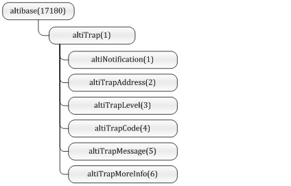

# 6.트랩(Trap)

이 장에서는 Altibase에 특정한 상황이 발생하였을 때 트랩(Trap)을 이용하여
관리자에게 전송될 OID를 설명한다.

### altiTrap

altiTrap은 트랩을 이용해 전송될 OID를 기술한 MIB이다.



[그림 6‑1] altiTrap MIB

altiTrap MIB는 altibase(171780)의 하부에 (1)번 OID를 가지는 altiTrap은 트랩을
이용하여 전달될 OID들을 정의하고 있다. Altibase는 트랩의 OID는 Altibase의 Port
번호, 레벨, 트랩 코드, 메시지와 추가적인 정보들이 정의되어 있다.

#### altiNotification MIB(1)

##### OID

1.3.6.1.4.1.17180.1.1

##### Syntax

```
OBJECT { altiTrapAddress, altiTrapLevel, altiTrapCode, altiTrapMessage,
altiTrapMoreInfo }
```

##### 설명

altiNotification은 5개의 MIB를 포함하는 객체(notification)형으로 트랩을 전송하기
위해서 사용한다.

##### 예제

```
# snmptrapd -f -P
2014-10-24 13:30:46 localhost [127.0.0.1]:
SNMPv2-MIB::sysUpTime.0 = Timeticks: (1017350) 2:49:33.50
SNMPv2-MIB::snmpTrapOID.0 = OID: SNMPv2-SMI::private
ALTIBASE-MIB::altiTrapAddress = STRING: 52473
ALTIBASE-MIB::altiTrapLevel = STRING: 3
ALTIBASE-MIB::altiTrapCode = STRING: 10000001
ALTIBASE-MIB::altiTrapMessage = STRING: Altibase is running.
ALTIBASE-MIB::altiTrapMoreInfo = STRING:
```

#### altiTrapAddress MIB(2)

##### OID

1.3.6.1.4.1.17180.1.2

##### Syntax

```
DisplayString
```

##### 설명

altiTrapAddress는 알티베이스의 포트 번호를 나타내며, 트랩이 어떤 Altibase에서
발생하였는지 구별하기 위해서 사용된다.

#### altiTrapLevel(3)

##### OID

1.3.6.1.4.1.17180.1.3

##### Syntax

```
DisplayString
```

##### 설명

altiTrapLevel은 트랩의 중요도를 나타낸다. 레벨이 나타내는 의미는 아래와 같다.

1: 매우 중요하고 위급한 상황

2: 주요한 상황

3: 일상적으로 발생할 수 있는 상황

#### altiTrapCode(4)

##### OID

1.3.6.1.4.1.17180.1.4

##### Syntax

```
DisplayString
```

##### 설명

Altibase에서 발생하는 트랩을 구분하기 위해서 코드를 사용된다. 트랩 코드에 대한
자세한 설명은 [트랩 코드](#트랩-코드)에서 설명한다.

#### altiTrapMessage(5)

##### OID

1.3.6.1.4.1.17180.1.5

##### Syntax

```
DisplayString
```

##### 설명

Altibase에서 발생하는 트랩에 대한 설명이다.

#### altiTrapMoreInfo(6)

##### OID

1.3.6.1.4.1.17180.1.6

##### Syntax

```
DisplayString
```

##### 설명

Altibase에서 발생하는 트랩에 대한 추가적인 설명이다.

### 트랩 코드

Altibase에서 발생할 수 있는 트랩 코드(altiTrapCode)와 트랩 레벨(altiTrapLevel)을
설명한다.

#### Altibase Running Status

##### Code

10000001

##### Level

3

##### 설명

Altibase가 현재 실행중이면 발생하는 코드이다.

##### 예제

```
# snmptrapd -f -P
2014-10-24 13:30:46 localhost [127.0.0.1]:
SNMPv2-MIB::sysUpTime.0 = Timeticks: (1017350) 2:49:33.50
SNMPv2-MIB::snmpTrapOID.0 = OID: SNMPv2-SMI::private
ALTIBASE-MIB::altiTrapAddress = STRING: 52473
ALTIBASE-MIB::altiTrapLevel = STRING: 3
ALTIBASE-MIB::altiTrapCode = STRING: 10000001
ALTIBASE-MIB::altiTrapMessage = STRING: Altibase is running.
ALTIBASE-MIB::altiTrapMoreInfo = STRING:
```

#### Altibase UnRunning Status

##### Code

10000002

##### Level

3

##### 설명

Altibase가 현재 실행중이 아닐 때 발생하는 코드이다.

##### 예제

```
# snmptrapd -f -P

2014-10-24 13:33:38 localhost [127.0.0.1]:
SNMPv2-MIB::sysUpTime.0 = Timeticks: (1034562) 2:52:25.62
SNMPv2-MIB::snmpTrapOID.0 = OID: SNMPv2-SMI::private
ALTIBASE-MIB::altiTrapAddress = STRING: 52473
ALTIBASE-MIB::altiTrapLevel = STRING: 1
ALTIBASE-MIB::altiTrapCode = STRING: 10000002
ALTIBASE-MIB::altiTrapMessage = STRING: Altibase is not running.
ALTIBASE-MIB::altiTrapMoreInfo = STRING:
```

#### Altibase Subagent Running Status

##### Code

10000003

##### Level

3

##### 설명

Altibase의 서브 에이전트(altisnmpd)가 실행중일 때 발생하는 코드이다.

##### 예제

```
# snmptrapd -f -P

2014-10-24 13:40:24 localhost [127.0.0.1]:
SNMPv2-MIB::sysUpTime.0 = Timeticks: (1075187) 2:59:11.87
SNMPv2-MIB::snmpTrapOID.0 = OID: SNMPv2-SMI::private
ALTIBASE-MIB::altiTrapAddress = STRING: 22082
ALTIBASE-MIB::altiTrapLevel = STRING: 3
ALTIBASE-MIB::altiTrapCode = STRING: 10000003
ALTIBASE-MIB::altiTrapMessage = STRING: Altisnmpd is running.
ALTIBASE-MIB::altiTrapMoreInfo = STRING: coldstart
```

#### Altibase Subagent UnRunning Status

##### Code

10000004

##### Level

3

##### 설명

Altibase의 서브 에이전트(altisnmpd)가 실행중아 아닐 때 발생하는 코드이다.

##### 예제

```
# snmptrapd -f -P

2014-10-24 13:40:23 localhost [127.0.0.1]:
SNMPv2-MIB::sysUpTime.0 = Timeticks: (1075030) 2:59:10.30
SNMPv2-MIB::snmpTrapOID.0 = OID: SNMPv2-SMI::private
ALTIBASE-MIB::altiTrapAddress = STRING: 21947
ALTIBASE-MIB::altiTrapLevel = STRING: 1
ALTIBASE-MIB::altiTrapCode = STRING: 10000004
ALTIBASE-MIB::altiTrapMessage = STRING: Altisnmpd is not running.
ALTIBASE-MIB::altiTrapMoreInfo = STRING: nsNotifyShutdown
```

#### Session Query Timeout

##### Code

10000101

##### Level

2

##### 설명

altiPropertyAlarmQueryTimeout이 1이고, Altibase의 세션에서 쿼리 타임아웃이
발생했을 때 발생한다.

##### 예제

```
# snmptrapd -f -P

2014-10-24 14:00:01 localhost [127.0.0.1]:
SNMPv2-MIB::sysUpTime.0 = Timeticks: (1192924) 3:18:49.24
SNMPv2-MIB::snmpTrapOID.0 = OID: SNMPv2-SMI::private
ALTIBASE-MIB::altiTrapAddress = STRING: 52473
ALTIBASE-MIB::altiTrapLevel = STRING: 2
ALTIBASE-MIB::altiTrapCode = STRING: 10000101
ALTIBASE-MIB::altiTrapMessage = STRING: [Notify : Query Timeout] Session Closed by Server : Session ID = 2
ALTIBASE-MIB::altiTrapMoreInfo = STRING: Please check altibase_boot.log
```

#### Session Fetch Timeout

##### Code

10000102

##### Level

2

##### 설명

altiPropertyAlarmFetchTimeout이 1이고, Altibase의 세션에서 Fetch timeout이
발생했을 때 발생한다.

##### 예문

```
# snmptrapd -f -P

2014-10-24 14:00:01 localhost [127.0.0.1]:
SNMPv2-MIB::sysUpTime.0 = Timeticks: (1192924) 3:18:49.24
SNMPv2-MIB::snmpTrapOID.0 = OID: SNMPv2-SMI::private
ALTIBASE-MIB::altiTrapAddress = STRING: 52473
ALTIBASE-MIB::altiTrapLevel = STRING: 2
ALTIBASE-MIB::altiTrapCode = STRING: 10000102
ALTIBASE-MIB::altiTrapMessage = STRING: [Notify : Fetch Timeout] Session Closed by Server : Session ID = 2
ALTIBASE-MIB::altiTrapMoreInfo = STRING: Please check altibase_boot.log
```

#### Session Utrans Timeout

##### Code

10000103

##### Level

2

##### 설명

altiPropertyAlarmUtransTimeout이 1이고, Altibase의 세션에서 Utrans timeout이
발생했을 때 발생한다.

##### 예제

```
# snmptrapd -f -P

2014-10-24 14:12:01 localhost [127.0.0.1]:
SNMPv2-MIB::sysUpTime.0 = Timeticks: (1192924) 3:18:49.24
SNMPv2-MIB::snmpTrapOID.0 = OID: SNMPv2-SMI::private
ALTIBASE-MIB::altiTrapAddress = STRING: 52473
ALTIBASE-MIB::altiTrapLevel = STRING: 2
ALTIBASE-MIB::altiTrapCode = STRING: 10000103
ALTIBASE-MIB::altiTrapMessage = STRING: [Notify : Utrans Timeout] Session Closed by Server : Session ID = 2
ALTIBASE-MIB::altiTrapMoreInfo = STRING: Please check altibase_boot.log
```

#### Too Many Continuous Query Failure

##### Code

10000201

##### Level

2

##### 설명

altiPropertyAlarmSessionFailureCount에 설정한 횟수 이상으로 Query 실행 오류가
연속적으로 발생하면 트랩이 발생한다.

##### 예제

```
# snmptrapd -f -P

2014-10-24 14:12:01 localhost [127.0.0.1]:
SNMPv2-MIB::sysUpTime.0 = Timeticks: (1192924) 3:18:49.24
SNMPv2-MIB::snmpTrapOID.0 = OID: SNMPv2-SMI::private
ALTIBASE-MIB::altiTrapAddress = STRING: 52473
ALTIBASE-MIB::altiTrapLevel = STRING: 2
ALTIBASE-MIB::altiTrapCode = STRING: 10000103
ALTIBASE-MIB::altiTrapMessage = STRING: [Notify : Session Failure]  Session Failed Continuously : Session ID = 2, Count = 3
ALTIBASE-MIB::altiTrapMoreInfo = STRING: Please check altibase_boot.log 
```

