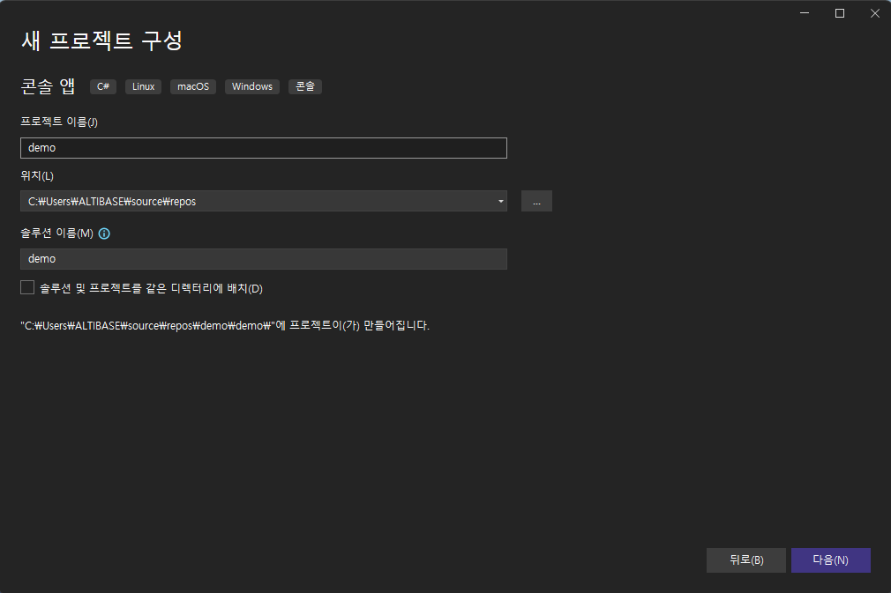

# 6.Altibase ADO.NET

## Altibase ADO.NET 개요

Altibase ADO.NET은 .NET Core 기반의 애플리케이션에서 Altibase 서버에 접근할 수 있게 도와주는 드라이버이다.

Altibase ADO.NET은 마이크로소프트의 ADO.NET API를 Altibase에서 사용할 수 있도록 구현한 것이다. .NET Core 개발자는 ADO.NET을 이용하여 DBMS와 같은 데이터 소스에 접근하여 명령을 수행하고 데이터를 조회하며, 결과를 가공하여 다시 데이터 소스에 반영할 수 있다. 


마이크로소프트의 ADO.NET에 관한 보다 자세한 내용은 마이크로소프트의 [.NET 문서](https://learn.microsoft.com/ko-kr/dotnet/)를 참고한다.

### 요구사항
- Altibase CLI 라이브러리
  
  Altibase ADO.NET은 CLI 라이브러리로 Altibase 서버에 접속한다. 아래 CLI 라이브러리는 Altibase ADO.NET NuGet 패키지에 포함되어 있다.
  - Linux x86-64  : libdotnet_sl.so
  - Windows x64 : dotnet_sl.dll
- Altibase 7.3.0.0.5 이상
- .NET Core 3.1

### 지원 OS

Altibase ADO.NET이 지원하는 OS는 .NET Core 3.1의 지원 OS중에서 Altibase 7.3 클라이언트가 지원하는 OS이다.

- [.NET Core 3.1 - Supported OS versions](https://github.com/dotnet/core/blob/main/release-notes/3.1/3.1-supported-os.md#net-core-31---supported-os-versions)
- [Altibase 7.3 클라이언트의 지원 OS](https://github.com/ALTIBASE/Documents/blob/master/Technical%20Documents/kor/Supported%20Platforms.md#altibase-73-server--client)

Altibase ADO.NET NuGet 패키지에 원하는 OS의 CLI 라이브러리가 포함되어 있지 않다면 [Altibase 고객 지원 센터](http://support.altibase.com/kr/)로 문의한다. 


##  Altibase ADO.NET 사용

.NET Core 개발자가  Altibase ADO.NET을 사용하여 개발할 때 알아야 할 사용 방법에 대해 설명한다.

### Altibase ADO.NET 다운로드

[NuGet 사이트](https://www.nuget.org/packages/Altibase.Data.AltibaseClient)를 통해 Altibase.Data.AltibaseClient.nupkg를 제공한다.


### .NET Core 응용 프로그램 컴파일

Altibase ADO.NET을 사용한 애플리케이션은 아래 2가지 방법으로 컴파일할 수 있다.


>  **dotnet CLI에서 컴파일하는 방법**

1️⃣ dotnet CLI에서 NuGet 소스를 조회하는 명령을 수행한다.

~~~c
[user@ /] dotnet nuget list source
등록된 소스:
  1.  nuget.org [사용]
      https://api.nuget.org/v3/index.json
~~~

2️⃣ 프로젝트 파일 내 \<PackageReference> 항목에 Altibase ADO.NET NuGet 패키지 종속성을 지정한다.

~~~c#
<Project Sdk="Microsoft.NET.Sdk" DefaultTargets="Build" xmlns="http://schemas.microsoft.com/developer/msbuild/2003">
  <PropertyGroup>
    <OutputType>exe</OutputType>
    <TargetFramework>netcoreapp3.1</TargetFramework>
  </PropertyGroup>
  <ItemGroup>
    /* Altibase ADO.NET NuGet 패키지 종속성을 지정 */
    <PackageReference Include="Altibase.Data.AltibaseClient" />
  </ItemGroup>
  <ItemGroup>
    <Compile Include="demo.cs" />
  </ItemGroup>
</Project>
~~~

3️⃣ 프로젝트를 빌드한다.

~~~
[user@ /] dotnet build demo.csproj
~~~


>  **IDE 환경에서 컴파일하는 방법**

IDE(Integrated Development Environment) 환경에서 Altibase ADO.NET을 등록하는 방법이다. 아래는 MS Visual Studio에서 수행한 예이다.

1️⃣ 새 프로젝트를 생성한다.




2️⃣ NuGet 패키지 관리자 창에서 패키지 소스 nuget.org를 선택하고 Altibase.Data.AltibaseClient를 검색하여 설치한다.


### Altibase ADO.NET 사용 선언

.NET Core 기반의 애플리케이션에서 Altibase ADO.NET의 클래스들을 사용하려면, 먼저 아래와 같이 선언해야 한다.

~~~c#
using Altibase.Data.AltibaseClient;
~~~


### 연결 설정

이 절에서는 .NET Core 응용 프로그램에서 Altibase 서버에 접속하는 방법을 설명한다. 

#### 연결 문자열 (Connection String)

Altibase 서버에 접속하기 위한 연결 문자열의 형태는 다음과 같다. 

~~~c#
Server=127.0.0.1;PORT=20300;User=sys;Password=manager;connection_properties=value;...
~~~

#### 연결 속성 정보

위의 기본 연결 속성 외에 연결 문자열에서 사용할 수 있는 연결 속성을 설명한다. 각 연결 속성의 설명은 아래의 형식으로 작성되어 있다.

- 기본값 : 연결 설정을 명시하지 않았을 때 기본적으로 사용되는 값
- 값의 범위 : 설정 가능한 값
- 필수 여부 : 반드시 설정해야 하는지 여부
- 설정 범위 : 
  Altibase 서버에 연결된 이후에 설정한 속성의 영향 범위에 따라 시스템과 세션으로 구분한다.
  - 시스템 : 설정한 속성이 다른 세션에 영향을 준다.
  - 세션 : 설정한 속성은 해당 세션에만 영향을 준다.
  - N/A : 이 속성은 Altibase 서버에 연결하는 과정에만 영향을 준다.
- 설명: 연결 속성에 대한 설명

##### application name

- 기본값 : .NET Altibase Data Provider
- 값의 범위 : 임의의 문자열
- 필수 여부 : 선택
- 설정 범위 : 세션
- 설명 : 세션의 애플리케이션 정보를 나타낸다. V$SESSION의 CLIENT_APP_INFO 칼럼에 출력되는 값이다.

##### connection life time

- 기본값 : 0
- 값의 범위 : [0 ~ 2<sup>31</sup>(2147483648)]
- 필수 여부 : 선택
- 설정 범위 : 세션
- 설명 : 
  연결을 사용하지 않을 때 연결 풀에서 제거할 것인지 설정한다. 단위는 초(sec)이다. 
  0은 연결을 제거하지 않고 0이 아니면 설정 값 동안 연결을 사용하지 않으면 연결 풀에서 연결을 제거한다.

##### connection timeout

- 기본값 : 15
- 값의 범위 : [0 ~ 2<sup>31</sup>(2147483648)]
- 필수 여부 : 선택
- 설정 범위 : N/A
- 설명 : 
  Altibase 서버에 대한 연결을 대기하는 시간으로, 단위는 초(sec)이다. 
  0은 연결될 때까지 무한정 기다리고 0이 아닌 값은 설정 값 동안 연결되지 않으면 연결이 실패한다.

##### data source

- 기본값 : 설명 참고
- 값의 범위 : 임의의 문자열
- 필수 여부 : 선택
- 설정 범위 : N/A
- 설명 : 
  데이터 소스의 이름을 나타내며 아래의 조건에 따라 사용되는 값이 달라진다.
  - 연결 속성 `server`의 값이 존재하면, `data source`의 값은 무시된다.
  - 연결 속성 `server`의 값이 없고 `data source`의 값과 같은 ODBC 데이터 원본이 있으면 ODBC 데이터 원본의 DSN(data source name)이 사용된다.
  - 연결 속성 `server`의 값이 없고 `data source`의 값과 같은 ODBC 데이터 원본이 없으면 서버의 IP 또는 호스트 이름을 사용한다.

##### encoding

- 기본값 : 없음
- 값의 범위 :  [Altibase에서 지원하는 문자 집합](https://github.com/ALTIBASE/Documents/blob/master/Manuals/Altibase_7.3/kor/Getting%20Started%20Guide.md#%EC%A7%80%EC%9B%90%ED%95%98%EB%8A%94-%EC%BA%90%EB%A6%AD%ED%84%B0-%EC%85%8B)
- 필수 여부 : 선택
- 설정 범위 : 세션
- 설명 : 클라이언트의 문자 집합을 설정한다.

##### enlist 

- 기본값 :  true
- 값의 범위 : [true | false]
- 필수 여부 : 선택
- 설정 범위 : 세션
- 설명 : 암시적 트랜잭션 처리 여부를 설정한다. true는 암시적인 방식으로 false는 명시적인 방식으로 트랜잭션에 참여한다.

##### max pool size

- 기본값 : 100
- 값의 범위 : [0 ~ 2<sup>31</sup>(2147483648)]
- 필수 여부 : 선택
- 설정 범위 : N/A
- 설명 : 특정 연결 문자열에 대해 연결 풀에서 허용된 최대 연결 수를 설정한다.

##### min pool size 

- 기본값 : 0
- 값의 범위 : [0 ~ 2<sup>31</sup>(2147483648)]
- 필수 여부 : 선택
- 설정 범위 : N/A
- 설명 : 특정 연결 문자열에 대해 연결 풀에서 허용된 최소 연결 수를 설정한다. 연결 풀이 최초 생성될 때 이 설정 값만큼 연결이 생성된다. 

##### nchar literal replace

- 기본값 : false
- 값의 범위 : [true | false]
- 필수 여부 : 선택
- 설정 범위 : 세션
- 설명 : 질의문에서 내셔널 캐릭터셋을 가지는 상수 문자열의 사용 여부를 결정한다. true는 내셔널 캐릭터셋을 가지는 상수 문자열을 사용하고 false는 사용하지 않는다.

##### password

- 기본값 : 없음
- 값의 범위 : 데이터베이스 사용자 비밀번호
- 필수 여부 : 필수
- 설정 범위 : N/A
- 설명 : Altibase 서버에 접속할 데이터베이스 사용자의 비밀번호를 입력한다.

##### persist security info 

- 기본값 :  false
- 값의 범위 : [true | false]
- 필수 여부 : 선택
- 설정 범위 : N/A
- 설명 : 연결 정보에서 문자열을 가져올 때 비밀번호를 포함할지 설정한다. true는 비밀번호를 포함하고 false는 포함하지 않는다.

##### pooling

- 기본값 :  true
- 값의 범위 : [true | false]
- 필수 여부 : 선택
- 설정 범위 : N/A
- 설명 : 연결 풀링을 사용할 것인지 설정한다. true는 연결 풀링을 사용하고 false는 사용하지 않는다.

##### port 

- 기본값 :  20300
- 값의 범위 : [0~65535]
- 필수 여부 : 선택
- 설정 범위 : N/A
- 설명 : Altibase 서버의 서비스 포트 번호를 입력한다.

##### prefer ipv6 

- 기본값 :  false
- 값의 범위 : [true | false]
- 필수 여부 : 선택
- 설정 범위 : N/A
- 설명 : 연결 속성 `server`에 호스트명을 입력하면, 이 속성 값에 따라 호스트명을 IPv4 주소 또는 IPv6 주소로 변환한다. true는 호스트명을 IPv6 주소로 변환하고 false는 호스트명을 IPv4 주소로 변환하다.

##### server

- 기본값 :  localhost
- 값의 범위 : 임의의 문자열
- 필수 여부 : 선택
- 설정 범위 : N/A
- 설명 : Altibase 서버의 IP 주소 또는 호스트명을 입력한다.

##### transaction timeout

- 기본값 : 서버의 설정값
- 값의 범위 :  [0 ~ 2<sup>31</sup>(2147483648)]
- 필수 여부 : 선택
- 설정 범위 : 세션
- 설명 : 변경 연산(UPDATE, INSERT, DELETE)을 수행하는 트랜잭션의 수행 시간을 제한한다. 단위는 초(sec)이다. 0은 변경 트랜잭션의 수행 시간을 제한하지 않는다. 0이 아닐 경우, 변경 트랜잭션의 수행 시간이 설정값을 초과하면 세션 연결을 해제하고 트랜잭션을 철회한다.

##### user id 또는 uid

- 기본값 :  
- 값의 범위 : 임의의 문자열
- 필수 여부 : 필수
- 설정 범위 : N/A
- 설명 : Altibase 서버에 접속하려는 데이터베이스 사용자 이름을 입력한다.


### 연결 풀링

애플리케이션이 데이터베이스 서버에 연결하는 과정은 여러 단계를 거치므로 시간이 많이 걸리며, 같은 과정을 여러 번 진행할 수 있다. ADO.NET에서는 연결하고 닫히는 횟수를 최소화하기 위해 연결 풀링(Connection Pooling)을 제공한다.

연결 풀링은 연결에 필요한 소유권을 유지한다. 이를 위해 풀러는 연결 요청을 받으면 연결 풀에서 사용 가능한 연결이 있는지 확인하고 연결을 할당하거나 새로운 연결을 연결 풀에 생성해서 할당한다. 연결이 닫힐 때에도 연결을 바로 해제하지 않고 연결 풀에 반환한다.

#### 연결 풀 만들기

연결이 처음 열리면 연결 풀과 연결 문자열(Connection String)을 연결하는 일치 알고리즘에 따라 연결 풀이 생성된다. 연결이 열릴 때 연결 문자열이 기존 연결 풀과 정확하게 일치하지 않으면 새로운 연결 풀이 생성된다. 연결 문자열의 연결 속성이나 대소문자 및 공백에 차이가 있어도 다른 풀로 인식한다. 연결 문자열에 연결 속성 `min pool size`를 0이 아닌 값으로 설정하면 해당 값만큼 연결 풀이 자동으로 생성된다. 이 연결 속성을 설정하지 않았다면 기본값이 0이므로 자동 생성되는 연결은 없다.

#### 연결 할당 및 추가

연결을 요청받으면 연결 문자열과 일치하는 연결 풀을 확인하여 연결을 할당하거나, 일치하는 연결 풀이 없으면 연결 풀을 생성하여 연결한다. 

연결은 연결 속성 `max pool size`의 값만큼 생성할 수 있다. 생성된 연결이 이 값을 초과하는 경우, 연결 속성 `connection life time` 값을 초과하여 제거되는 연결이 발생할 때까지 대기한다.

예외가 발생한 연결은 자동으로 제거되며, 명시적으로 연결을 닫으면 연결이 제거되는 것이 아니라 연결 풀로 회수된다.

#### 연결 제거

응용 프로그램에서 명시적으로 연결을 닫거나 제거하지 않으면 연결 풀러는 정기적으로 연결 풀을 검사하여 연결을 제거한다. 연결은 연결 속성 `connection life time`에서 설정한 시간 동안 사용되지 않을 경우 제거되며, `min pool size`의 값만큼 최소한의 연결을 남겨두고 회수된다. 그리고 예외가 발생한 연결도 제거된다. 

#### 연결 풀 지우기

AltibaseConnection 클래스에서 풀을 지우는 메소드는 ClearPool과 ClearAllPools이 있다. ClearPool 메소드는 지정된 연결 풀을 지우며, ClearAllPools 메소드는 모든 연결 풀을 지운다.

#### 제약 사항

연결은 Altibase 서버 프로퍼티 [MAX_CLIENT](https://github.com/ALTIBASE/Documents/blob/master/Manuals/Altibase_7.3/kor/General_Reference-1.Data%20Types%20%26%20Altibase%20Properties.md#max_client)이상 생성할 수 없으므로, 연결 속성 `max pool size` 및 `min pool size` 설정 시 MAX_CLIENT를 고려해야 한다.


### 트랜잭션 처리

Altibase ADO.NET에서 트랜잭션 처리는 AltibaseTransaction 객체를 사용하거나 CommittableTransaction 객체를 쓰는 방법이 있다.

#### AltibaseTransaction 객체

AltibaseTransaction 객체는 아래 예제와 같이 AltibaseConnection.BeginTransaction() 메소드로 트랜잭션 객체를 얻는다.

이 방법은 로컬 트랜잭션으로만 사용할 수 있다.

~~~c#
AltibaseConnection sConn = new AltibaseConnection(sConnStr); sConn.Open();

// 트랜잭션 시작
AltibaseTransaction sTrans = sConn.BeginTransaction();
AltibaseCommand sCmd = sConn.CreateCommand();

// 트랜잭션 작업 ...

// TODO

// 트랜잭션 끝
sTrans.Commit();
~~~

#### CommitableTransaction 객체

CommitableTransaction 객체는 트랜잭션에 암시적 또는 명시적으로 참여할 수 있다. Altibase ADO.NET에서 암시적인 방식으로 트랜잭션에 참여하려면 접속 문자열에 연결 설정 `enlist`를 설정하지 않거나 `enlist=true`라고 설정한다. 명시적인 참여는 접속 문자열에 `enlist=false`로 설정한다.

#### 분산 트랜잭션

Altibase ADO.NET은 AltibaseConnection.EnlistDistributedTransaction 메소드로 명시적으로 분산 트랜잭션에 참여할 수 있으나 .NET Core 3.1에서 분산 트랜잭션을 지원하지 않으므로 Altibase ADO.NET도 로컬 트랜잭션만 지원한다. 


### 배열 바인딩

Altibase ADO.NET은 배열 바인딩(Array Binding)을 지원한다. 이는 배열 형태의 데이터에 대하여 파라미터 바인딩이 가능하다는 것을 의미하며 일반적인 바인딩보다 적은 네트워크 비용으로 여러 개의 열을 처리하므로 속도 향상을 기대할 수 있다.

배열 바인딩 순서는 다음과 같다.

1️⃣ 바인드하려는 변수들을 모두 배열로 선언한다. 

배열 크기는 AltibaseCommand 클래스의 ArrayBindCount 값보다 크거나 같아야 한다.

2️⃣ 배열 변수들을 파라미터에 바인드한다. 

바인드하는 칼럼이 CHAR, VARCHAR, BLOB 타입이면, AltibaseParameter 클래스의 ArrayBindSize를 배열 요소 중 가장 큰 것과 같은 크기로 설정해야 한다.

3️⃣ AltibaseCommand 클래스의 ArrayBindCount 값을 설정한다.

예) 한 번에 100개씩 입력하려면 `ArrayBindCount = 100;` 

4️⃣ 질의문을 실행한다.

#### 주의 사항

배열 바인딩할 때 다음 사항을 주의해야 한다.

- ArrayBindCount의 유효 범위는 1부터 65535까지이다. 배열 크기를 무조건 크게 잡는다고 속도가 빨라지는 것은 아니므로 적당한 크기로 바인딩한다.
- CHAR, VARCHAR, BLOB 타입은 배열 단일 요소의 데이터 크기가 ArrayBindSize를 넘으면 에러가 발생한다.
- NCHAR, NVARCHAR 타입은 ArrayBindSize 값을 byte가 아닌 문자 수로 설정해야 한다.
- BLOB 타입은 응응 프로그램에서 배열 타입으로 Object[]를 쓰고, 배열 원소는 byte[]를 사용한다.
  - 예시 
    ~~~c#
    byte[] var1; 
    byte[] var2; 
    Object[] var = new Object[2] {var1, var2};
    ~~~
- CLOB, BYTE, NIBBLE, BIT, VARBIT, GEOMETRY 타입의 배열 바인딩은 지원하지 않는다.

#### 제약 사항

입력(Input) 파라미터만 배열 바인딩을 지원한다. 출력(Output)이나 입출력 공용 파라미터의 배열 바인딩은 지원하지 않는다.


### 데이터베이스 스키마 정보 검색

GetSchema() 메소드로 MetadataCollections, DataSourceInformation, DataTypes, Restrictions, ReservedWords와 같은 공통 스키마 외에 Altibase의 메타 테이블을 조회할 수 있다.

| 스키마              | 메타 테이블              | 설명                                                         |
| :------------------ | :----------------------- | :----------------------------------------------------------- |
| Users               | SYS_USERS_               | 데이터베이스 사용자 정보를 저장하는 메타 테이블              |
| Tables              | SYS_TABLES_              | 테이블 정보를 저장하는 메타 테이블                           |
| Views               | SYS_VIEWS_               | 뷰 정보를 저장하는 메타 테이블                               |
| Sequences           | V$SEQ                    | 시퀀스 정보를 저장하는 성능 뷰                               |
| Synonyms            | SYS_SYNONYMS_            | 시노님 정보를 저장하는 메타 테이블                           |
| Indexes             | SYS_INDICES_             | 인덱스 정보를 기록하고 있는 메타 테이블                      |
| Columns             | SYS_COLUMNS_             | 칼럼 정보를 저장하는 메타 테이블                             |
| Constraints         | SYS_CONSTRAINTS_         | 제약 조건 정보를 저장하는 메타 테이블                        |
| Procedures          | SYS_PROCEDURES_          | 저장 프로시저 및 함수 정보를 저장하는 메타 테이블            |
| ProcedureParameters | SYS_PROC_PARAS_          | 저장 프로시저 및 함수의 파라미터 정보를 저장하는 메타 테이블 |
| IndexColumns        | SYS_INDEX_COLUMNS_       | 인덱스 칼럼 정보를 저장하는 메타 테이블                      |
| ConstraintColumns   | SYS_CONSTRAINT_ COLUMNS_ | 제약 조건 칼럼 정보를 저장하는 메타 테이블                   |
| Triggers            | SYS_TRIGGERS_            | 트리거 정보를 저장하는 메타 테이블                           |

Altibase에서 지원하는 데이터베이스 스키마와 관련 메타 테이블에 관한 설명은 아래 매뉴얼을 참고한다.

- [Altibase 7.3 Administrator's Manual - 5.데이터베이스 객체 및 권한](https://github.com/ALTIBASE/Documents/blob/master/Manuals/Altibase_7.3/kor/Administrator's%20Manual.md#5%EB%8D%B0%EC%9D%B4%ED%84%B0%EB%B2%A0%EC%9D%B4%EC%8A%A4-%EA%B0%9D%EC%B2%B4-%EB%B0%8F-%EA%B6%8C%ED%95%9C)
- [Altibase 7.3 General Reference - 2.The Data Dictionary](https://github.com/ALTIBASE/Documents/blob/master/Manuals/Altibase_7.3/kor/General_Reference-2.The%20Data%20Dictionary.md)


## Altibase ADO.NET API

Altibase ADO.NET에서 구현한 ADO.NET API 중 대표적인 클래스와 제약 사항 그리고 지원하지 않는 API를 설명한다.

### 지원 인터페이스

#### 연결 및 질의 실행, 결과 검색

Altibase ADO.NET은 Altibase 서버로의 연결 및 질의을 실행하고 결과를 검색하는 기능을 제공한다. 이 기능들은 아래 4개의 클래스에 기반하고 있다. 각 클래스들의 하위 메소드 기능은 마이크로소프트의 [.NET Core 3.1 API 문서](https://learn.microsoft.com/ko-kr/dotnet/api/?view=netcore-3.1)를 참고한다.

| 클래스              | 설명                                                         |
| :------------------ | :----------------------------------------------------------- |
| AltibaseConnection  | Altibase 서버로 연결을 설정하고 트랜잭션을 시작할 수 있다.   |
| AltibaseCommand     | Altibase 서버에서 질의문을 실행하고 매개변수를 표시할 수 있다. |
| AltibaseDataReader  | Altibase 서버에서 명령을 수행한 결과를 가져와 출력할 수 있다. |
| AltibaseDataAdapter | DataSet에 데이터를 채우고 데이터베이스에 저장된 데이터를 갱신할 수 있다. |

#### 예외 및 트랜잭션 처리

Altibase ADO.NET은 예외 처리 및 저장 프로시저 실행과 트랜잭션 처리 등을 위해 다음 클래스들을 제공한다.

| 클래스              | 설명                                                         |
| :------------------ | :----------------------------------------------------------- |
| AltibaseException   | 데이터베이스 오류나.NET Core에서 받은 클라이언트 오류를 출력할 수 있다. |
| AltibaseParameter   | SQL 명령 및 저장 프로시저에 대한 입력, 출력 파라미터를 정의한다. |
| AltibaseTransaction | 데이터베이스에서 트랜잭션 관련 명령을 수행할 수 있다.        |

#### 기본 구현

다음은 ADO.NET 클래스 중 기본 구현을 그대로 상속받은 API 목록이다. 

| ADO.NET API 클래스 | Altibase ADO.NET 클래스 | 구분   |                               |
| :----------------- | :---------------------- | ------ | ----------------------------- |
| Dbproviderfactory  | AltibaseFactory         | 메소드 | CreateCommandBuilder          |
|                    |                         | 메소드 | CreateConnectionStringBuilder |
| Dbdatareader       | AltibaseDataReader      | 메소드 | GetProviderSpecificFieldType  |
|                    |                         | 메소드 | GetProviderSpecificValue      |
|                    |                         | 메소드 | GetProviderSpecificValues     |
|                    |                         | 속성   | VisibleFieldCount             |
| Dbdataadapter      | AltibaseDataAdapter     | 메소드 | GetBatchedRecordsAffected     |

#### 지원 인터페이스의 주의 사항

- ADO.NET에서는 칼럼 이름의 대소문자를 구별한다.
  
  Altibase는 테이블을 생성할 때 칼럼 이름을 큰따옴표("")로 감싸지 않으면 전부 대문자로 변환하는 것에 유의한다. 인터페이스를 사용할 때 칼럼 이름의 대소문자를 올바르게 입력해야 정확한 값을 가져올 수 있다. 
  
- AltibaseDataReader.GetValue() 메소드는 숫자 데이터를 System.Decimal 형식으로 변환하다.

  이로 인해, GetValue()로 가져온 데이터가 NUMBER, NUMERIC, FLOAT, DECIMAL 데이터 타입이고 System.Decimal로 표현할 수 있는 범위를 넘어가면 데이터 손실이 발생할 수 있다. 

- Altibase ADO.NET은 다중 질의문의 실행을 지원하지 않는다. 여러 개의 질의문을 한 번에 실행하려면 저장 프로시저를 사용해야 한다.

### 지원하지 않는 인터페이스

아래 표는 Altibase ADO.NET에서 지원하지 않는 인터페이스 목록이다. 지원하지 않는 인터페이스를 사용하면 NotImplementedException에러가 발생한다.

| ADO.NET API 클래스  | Altibase ADO.NET 클래스      | 구분   | 구성 요소                                                    |                    |
| --------------------- | :--------------------------- | :----- | :----------------------------------------------------------- | :----------------- |
| DbConnection          | AltibaseConnection           | 메소드 | ChangeDatabase                                               |                    |
|                       |                              | 속성   | DataSource                                                   |                    |
|                       |                              | 속성   | ServerVersion                                                |                    |
| DbCommand             | AltibaseCommand              | 메소드 | Cancel                                                       |                    |
|                       |                              | 속성   | CommandTimeout                                               |                    |
|                       |                              | 속성   | CommandType                                                  |                    |
| DbDataReader          | AltibaseDataReader           | 메소드 | GetData                                                      |                    |
|                       |                              | 메소드 | GetDbDataReader                                              |                    |
|                       |                              | 속성   | Depth                                                        | 항상 0을 반환한다. |
|                       |                              | 속성   | HasRows                                                      |                    |
| DbDataAdapter         | AltibaseDataAdapter          | 메소드 | AddToBatch(IDbCommand command)                               |                    |
|                       |                              | 메소드 | CrearBatch                                                   |                    |
|                       |                              | 메소드 | ExecuteBatch                                                 |                    |
|                       |                              | 메소드 | GetBatchedParameter                                          |                    |
|                       |                              | 메소드 | InitializeBatching                                           |                    |
|                       |                              | 메소드 | TerminateBatching                                            |                    |
| DbDataSourceEnumerator                 |  | 클래스 |  |             |
| DbProviderFactory     | AltibaseFactory              | 메소드 | CreateDataSourceEnumerator |                    |
| DbParameter           | AltibaseParameter            | 메소드 | ResetDbType                                                  |                    |
| DbParameterCollection | AltibaseParameterCollection  | 메소드 | AddRange                                                     |                    |

## Altibase ADO.NET 데이터 타입

테이블 칼럼이나 파라미터의 데이터 타입을 선언하기 위해서 AltibaseDbType 클래스가 사용된다. 

아래 표에서 AltibaseDbType 클래스, Altibase 서버의 데이터 타입과 호환되는 .NET Core 데이터 타입을 확인할 수 있다.

| AltibaseDbType 클래스 | Altibase의 데이터 타입 | .NET Core   |
| :-------------------- | :--------------------- | :---------- |
| BigInt                | BIGINT                 | Int64       |
| BitArray              | BIT                    | BitArray[]  |
| Blob                  | BLOB                   | Byte[]      |
| Binary                | BYTE                   | Byte[]      |
| Char                  | CHAR                   | String      |
| Clob                  | CLOB                   | String      |
| DateTime              | DATE                   | DateTime    |
| Decimal               | DECIMAL                | Decimal     |
| Double                | DOUBLE                 | Double      |
| Float                 | FLOAT                  | Decimal     |
| Geometry              | GEOMETRY               | Byte[]      |
| Integer               | INT                    | Int32       |
| NChar                 | NCHAR                  | String      |
| NibbleArray           | NIBBLE                 | NibbleArray |
| Number                | NUMBER                 | Decimal     |
| Numeric               | NUMERIC                | Decimal     |
| NVarChar              | NVARCHAR               | String      |
| Real                  | REAL                   | Float       |
| SmallInt              | SMALLINT               | Int16       |
| VarBitArray           | VARBIT                 | BitArray[]  |
| VarChar               | VARCHAR                | String      |

> [!TIP] 
>
> 질의문에서 내셔널 캐릭터를 포함하는 상수 문자열을 사용하려면, 해당 문자열 바로 앞에 ‘N’을 붙이면 된다.


## Altibase ADO.NET 예제

### DDL과 DML 단순 예제

AltibaseConnection 클래스를 사용하여 ALTIBASE HDB 에 접근하여 test_goods 테이블을 생성하고 데이터를 삽입한 후 검색한다.

```c#
using Altibase.Data.AltibaseClient;

class ConnectionTest
{
 static void Main(string[] args)
 {
   string sConnectionString = "Server=127.0.0.1;PORT=20091;User=sys;Password=manager";
   AltibaseConnection conn = new AltibaseConnection(sConnectionString);
   try
   {
     conn.Open(); // This connects to the database
     AltibaseCommand command = new AltibaseCommand("drop table test_goods", conn);
     try
     {
       command.ExecuteNonQuery(); // This executes a query
     }
     catch (Exception ex) {}
	 
     command.CommandText =
           "create table test_goods (
            gno char(10),
            gname char(20),
            location char(9),
            stock integer,
            price numeric(10, 2))";
     command.ExecuteNonQuery(); // This executes a query
	 
     command.CommandText = "insert into test_goods values ('A111100001','IM-300','AC0001',1000,78000)";
     command.ExecuteNonQuery(); //This executes a query
	 
     command.CommandText = "insert into test_goods values ('A111100002','IM-310','DD0001',100,98000)";
     command.ExecuteNonQuery(); //This executes a query
	 
     command.CommandText = "insert into test_goods values ('B111100001','NT-H5000','AC0002',780,35800)";
     command.ExecuteNonQuery(); //This executes a query
	 
     command.CommandText = "select * from test_goods";
     AltibaseDataReader dr = command.ExecuteReader();
	 
     Console.WriteLine(" GNO GNAME LOCATION STOCK PRICE");
     Console.WriteLine("===================================================================================");
     while (dr.Read())
     {
       for (int i = 0; i < dr.FieldCount; i++)
       {
         Console.Write("\t{0}", dr[i]);
       }
       // This outputs the retrieved data
       Console.WriteLine();
     }
   }
   catch (Exception ex)
   {
   Console.WriteLine(ex.ToString());
   }
   conn.Close(); // This closes the connection to the database
 }
} 
```

 실행결과

```c#
GNO        GNAME    LOCATION STOCK PRICE
==================================================
A111100001 IM-300   AC0001   1000  78000
A111100002 IM-310   DD0001   100   98000
B111100001 NT-H5000 AC0002   780   35800
```

### 벌크 복사 예제

AltibaseBulkCopy를 이용해서 *bulkcopy_source* 테이블에서 *bulkcopy_destination* 테이블로 데이터를 복사한다.

```c#
using System;
using System.Data;
using Altibase.Data.AltibaseClient;

class Program
{
 static void Main(string[] args)
 {
   if (args.Length != 2)
   {
     Console.WriteLine("\t[NOT PASSED]: Invalid argument");
     return;
   }
   string connectionString = GetConnectionString(args);
   using (AltibaseConnection sourceConnection = new AltibaseConnection(connectionString))
   {
     sourceConnection.Open();
     // Perform an initial count on the destination table.
     AltibaseCommand commandRowCount = new AltibaseCommand( "SELECT COUNT(*) FROM BULKCOPY_DESTINATION;",sourceConnection);
     long countStart = System.Convert.ToInt32(commandRowCount.ExecuteScalar());
     Console.WriteLine("Starting row count = {0}", countStart);
     // Get data from the source table as a AltibaseDataReader.
     AltibaseCommand commandSourceData = new AltibaseCommand("SELECT A1, A2, A3, A4 FROM BULKCOPY_SOURCE;",sourceConnection);
     AltibaseDataReader reader = commandSourceData.ExecuteReader();
     // Open the destination connection. In the real world you would
     // not use AltibaseBulkCopy to move data from one table to the other
     // in the same database. This is for demonstration purposes only.
     using (AltibaseConnection destinationConnection =  new AltibaseConnection(connectionString))
     {
       destinationConnection.Open();
       // Set up the bulk copy object.
       // Note that the column positions in the source
       // data reader match the column positions in
       // the destination table so there is no need to
       // map columns.
       using (AltibaseBulkCopy bulkCopy = new AltibaseBulkCopy(destinationConnection))
       {
         bulkCopy.DestinationTableName = "BULKCOPY_DESTINATION";
         try
         {
           // Write from the source to the destination.
           bulkCopy.WriteToServer(reader);
         }
         catch (Exception ex)
         {
           Console.WriteLine(ex.Message);
         }
         finally
         {
           // Close the AltibaseDataReader. The AltibaseBulkCopy
           // object is automatically closed at the end
           // of the using block.
           reader.Close();
         }
       }
       // Perform a final count on the destination
       // table to see how many rows were added.
       long countEnd = System.Convert.ToInt32(commandRowCount.ExecuteScalar());
       Console.WriteLine("Ending row count = {0}", countEnd);
       Console.WriteLine("{0} rows were added.", countEnd - countStart);
     }
   }
 }
 private static string GetConnectionString(string[] args)
 // To avoid storing the sourceConnection string in your code,
 // you can retrieve it from a configuration file.
 {
   return "Server=" + args[0] + ";" + "PORT=" + args[1] + ";" + "User=sys;Password=manager";
 }
}
```

### 연결 풀링 예제

ADO.NET에서 연결 풀링를 사용하는 예제는 다음과 같다.

```c#
static void Main(string[] sArgs)
{
 AltibaseConnection cn = new AltibaseConnection();
 AltibaseConnection cn2 = new AltibaseConnection();
 AltibaseCommand cmd = new AltibaseCommand();
 string cnStr = "Server=127.0.0.1;Port=20300;User=user;Password=pwd;Pooling=true;Min Pool Size=0;Max Pool Size=10";
 
 cn.ConnectionString = cnStr;
 cn.Open();
 
 Console.WriteLine("Successfully Connected.");
 
 cmd.Connection = cn;
 cmd.CommandText = "SELECT TO_CHAR(SYSDATE, 'YYYY-MM-DDHH:MI:SS') FROM DUAL";
 
 AltibaseDataReader dr = cmd.ExecuteReader();
 while (dr.Read())
 {
  Console.WriteLine(dr[0].ToString());
 }
 dr.Close();
 cn.Close();
 cn2.ConnectionString = cnStr;
 .NET Data Provider 55
 cn2.Open(); // Pooled Connection
 cn2.Close();
}
```

### 배열 바인딩 예제

~~~c#
using System;
using System.Data;
using Altibase.Data.AltibaseClient;

class ArrayBind
{
 static void Main()
 {
  AltibaseConnection con = new AltibaseConnection();
  con.ConnectionString = "DSN=127.0.0.1;UID=sys;PWD=manager;NLS_USE=KO16KSC5601";
  con.Open();
  Console.WriteLine("Connected successfully");
  // table: create table t1 (c1 int, c2 varchar(12));
  // 3 records
  const int arrayBindCount = 3;
  int[] c1 = new int[arrayBindCount] { 100, 200, 300};
  String[] c2 = new String[arrayBindCount] { "APPLE", "ORANGE", "GRAPE" };
  AltibaseCommand cmd = new AltibaseCommand();
  cmd.Connection = con;
  
  //=====================================================
  // bind parameters
  //=====================================================
   cmd.CommandText = "insert into t1 values (?, ?)";
   AltibaseParameter prm1 = new AltibaseParameter("c1", DbType.Int32);
   prm1.Direction = ParameterDirection.Input;
   prm1.Value = c1;
   AltibaseParameter prm2 = new AltibaseParameter("c2", DbType.AnsiString);
   prm2.Direction = ParameterDirection.Input;
   prm2.Value = c2;
   prm2.ArrayBindSize = 12; // max element size in bytes
   cmd.Parameters.Add(prm1);
   cmd.Parameters.Add(prm2);
 
  //=====================================================
  // execute INSERT
  //=====================================================
  cmd.ArrayBindCount = arrayBindCount;
  cmd.ExecuteNonQuery();
 
  //=====================================================
  // SELECT
  //=====================================================
  IDataReader sDataReader = null;
  cmd.Parameters.Clear();
  cmd.CommandText = "select * from t1";
  sDataReader = cmd.ExecuteReader();
  while (sDataReader.Read())
  {
   for (int i = 0; i < sDataReader.FieldCount; i++)
   {
   Console.Write("[" + sDataReader.GetValue(i) + "] ");
   }
   Console.WriteLine();
  }
  sDataReader.Close();
  con.Close();
  con.Dispose();
 }
}
~~~