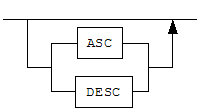

# 목차

- [서문](#서문)
  - [이 매뉴얼에 대하여](#이-매뉴얼에-대하여)
- [1.PHP Interface](#1php-interface)
  - [Altibase PHP 모듈 참고 사항](#altibase-php-모듈-참고-사항)
  - [PHP 연동을 위한 ODBC 매니저 설치](#php-연동을-위한-odbc-매니저-설치)
  - [ODBC 연결을 위한 PHP 함수](#odbc-연결을-위한-php-함수)
- [2.PDO 드라이버](#2pdo-드라이버)
  - [설치 및 설정](#설치-및-설정)
  - [제약 및 주의사항](#제약-및-주의사항)
  - [사용 방법](#사용-방법)
  - [사용 예제](#사용-예제)
- [3.XA Interface](#3xa-interface)
  - [XA 개요](#xa-개요)
  - [XA 인터페이스](#xa-인터페이스)
  - [XA 사용](#xa-사용)
  - [XA 사용시 제약사항](#xa-사용시-제약사항)
  - [JDBC 분산 트랜잭션](#jdbc-분산-트랜잭션)
  - [XA를 사용한 애플리케이션의 문제 해결](#xa를-사용한-애플리케이션의-문제-해결)
- [4.iLoader API](#4iloader-api)
  - [iLoader API 개요](#iloader-api-개요)
  - [iLoader API 사용](#iloader-api-사용)
  - [iLoader API 데이터 구조체](#iloader-api-데이터-구조체)
  - [iLoader API](#iloader-api)
- [5.CheckServer API](#5checkserver-api)
  - [CheckServer API 개요](#checkserver-api-개요)
  - [CheckServer API 사용](#checkserver-api-사용)
  - [CheckServer API 데이터 구조체](#checkserver-api-데이터-구조체)
  - [CheckServer API](#checkserver-api)
- [6.Altibase ADO.NET](#6altibase-adonet)
    - [Altibase ADO.NET 개요](#Altibase-ADONET-개요)
    - [Altibase ADO.NET 사용](#Altibase-ADONET-사용)
    - [Altibase ADO.NET API](#Altibase-ADONET-API)
    - [Altibase ADO.NET 데이터 타입](#Altibase-ADONET-데이터-타입)
    - [Altibase ADO.NET 예제](#Altibase-ADONET-예제)

 

서문
====

## 이 매뉴얼에 대하여

이 매뉴얼은 API 사용법에 대해 설명한다.

### 대상 사용자

이 매뉴얼은 다음과 같은 Altibase 사용자를 대상으로 작성되었다.

-   데이터베이스 관리자

-   성능 관리자

-   데이터베이스 사용자

-   응용 프로그램 개발자

-   기술지원부

다음과 같은 배경 지식을 가지고 이 매뉴얼을 읽는 것이 좋다.

-   컴퓨터, 운영 체제 및 운영 체제 유틸리티 운용에 필요한 기본 지식

-   관계형 데이터베이스 사용 경험 또는 데이터베이스 개념에 대한 이해

-   컴퓨터 프로그래밍 경험

-   데이터베이스 서버 관리, 운영 체제 관리 또는 네트워크 관리 경험

### 소프트웨어 환경

이 매뉴얼은 데이터베이스 서버로 Altibase 버전 7.3을 사용한다는 가정 하에 작성되었다.

### 이 매뉴얼의 구성

이 매뉴얼은 다음과 같이 구성되어 있다.

-   제 1 장 PHP Interface  
    이 장은 PHP에서 ODBC 함수를 이용하여 Altibase와 연동하는 방법을 설명한다.

-   제 2 장 PDO 드라이버  
    이 장은 Altibase PDO 드라이버를 설치하고 이를 사용하여 Altibase와 연동하는 방법을 설명한다.
    
-   제 3 장 XA Interface  
    이 장은 XA 표준을 소개하고, 분산 트랜잭션의 기본 개념과 XA 인터페이스를 설명한다. 그리고 ODBC, Embedded SQL, JDBC 프로그램에서 글로벌 트랜잭션을 사용하여 Altibase에 접근하는 방법에 대해 설명한다.
    
-   제 4 장 iLoader API  
    이 장은 Altibase 서버로부터 데이터를 다운로드 또는 서버로 데이터를 업로드하는 응용프로그램을 작성할 수 있는 인터페이스인 Altibase iLoader API를 소개한다.
    
-   제 5 장 CheckServer API  
    이 장은 Altibase 서버가 비정상 종료했는지를 감시하는 응용프로그램을 작성하기 위해 사용하는 인터페이스인 Altibase CheckServer API를 소개한다.
    
-   제 6장 Altibase ADO.NET
    
    이 장은 .NET Core 기반의 애플리케이션에서 Altibase 서버에 접근할 수 있게 도와주는 드라이버인 Altibase ADO.NET의 사용 방법과 Altibase ADO.NET으로 사용할 수 있는 ADO.NET API를 소개한다.
    

### 문서화 규칙

이 절에서는 이 매뉴얼에서 사용하는 규칙에 대해 설명한다. 이 규칙을 이해하면 이 매뉴얼과 설명서 세트의 다른 매뉴얼에서 정보를 쉽게 찾을 수 있다.

여기서 설명하는 규칙은 다음과 같다.

-   구문 다이어그램

-   샘플 코드 규칙

#### 구문 다이어그램

이 매뉴얼에서는 다음 구성 요소로 구축된 다이어그램을 사용하여, 명령문의 구문을 설명한다.

| 구성 요소                       | 의미                                                         |
| ------------------------------- | ------------------------------------------------------------ |
|  | 명령문이 시작한다. 완전한 명령문이 아닌 구문 요소는 화살표로 시작한다. |
|  | 명령문이 다음 라인에 계속된다. 완전한 명령문이 아닌 구문 요소는 이 기호로 종료한다. |
|  | 명령문이 이전 라인으로부터 계속된다. 완전한 명령문이 아닌 구문 요소는 이 기호로 시작한다. |
|  | 명령문이 종료한다.                                           |
|  | 필수 항목                                                    |
|  | 선택적 항목                                                  |
|  | 선택사항이 있는 필수 항목. 한 항목만 제공해야 한다.          |
|  | 선택사항이 있는 선택적 항목                                  |
|  | 선택적 항목. 여러 항목이 허용된다. 각 반복 앞부분에 콤마가 와야 한다. |

#### 샘플 코드 규칙

코드 예제는 SQL, Stored Procedure, iSQL 또는 다른 명령 라인 구문들을 예를 들어 설명한다.

아래 테이블은 코드 예제에서 사용된 인쇄 규칙에 대해 설명한다.

| 규칙         | 의미                                                         | 예제                                                         |
| ------------ | ------------------------------------------------------------ | ------------------------------------------------------------ |
| [ ]          | 선택 항목을 표시                                             | VARCHAR [(*size*)] [[FIXED \|] VARIABLE]                     |
| { }          | 필수 항목 표시. 반드시 하나 이상을 선택해야 되는 표시        | { ENABLE \| DISABLE \| COMPILE }                             |
| \|           | 선택 또는 필수 항목 표시의 인자 구분 표시                    | { ENABLE \| DISABLE \| COMPILE } [ ENABLE \| DISABLE \| COMPILE ] |
| . . .        | 그 이전 인자의 반복 표시 예제 코드들의 생략되는 것을 표시    | SQL\> SELECT ename FROM employee;  ENAME  SWNO  HJNO  HSCHOI  . . . 20 rows selected. |
| 그 밖에 기호 | 위에서 보여진 기호 이 외에 기호들                            | EXEC :p1 := 1; acc NUMBER(11,2);                             |
| 기울임 꼴    | 구문 요소에서 사용자가 지정해야 하는 변수, 특수한 값을 제공해야만 하는 위치 지정자 | SELECT \* FROM *table_name*; CONNECT *userID*/*password*;    |
| 소문자       | 사용자가 제공하는 프로그램의 요소들, 예를 들어 테이블 이름, 칼럼 이름, 파일 이름 등 | SELECT ename FROM employee;                                  |
| 대문자       | 시스템에서 제공하는 요소들 또는 구문에 나타나는 키워드       | DESC SYSTEM_.SYS_INDICES_;                                   |

### 관련 자료

자세한 정보를 위하여 다음 문서 목록을 참조하기 바란다.

-   Installation Guide

-   Administrator’s Manual

-   Replication Manual

-   CLI User's Manual

-   Precompiler User’s Manual

-   ODBC User's Manual

-   iSQL User’s Manual

-   Utilities Manual

-   Error Message Reference

### Altibase는 여러분의 의견을 환영합니다.

이 매뉴얼에 대한 여러분의 의견을 보내주시기 바랍니다. 사용자의 의견은 다음 버전의 매뉴얼을 작성하는데 많은 도움이 됩니다. 보내실 때에는 아래 내용과 함께 고객서비스포털(*http://support.altibase.com/kr/* )로 보내주시기 바랍니다.

-   사용 중인 매뉴얼의 이름과 버전

-   매뉴얼에 대한 의견

-   사용자의 성함, 주소, 전화번호

이 외에도 Altibase 기술지원 설명서의 오류와 누락된 부분 및 기타 기술적인 문제들에 대해서 이 주소로 보내주시면 정성껏 처리하겠습니다. 또한, 기술적인 부분과 관련하여 즉각적인 도움이 필요한 경우에도 고객서비스포털을 통해 서비스를 요청하시기 바랍니다.

여러분의 의견에 항상 감사드립니다.

