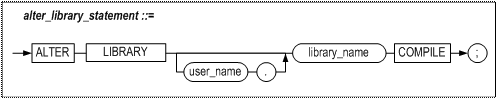
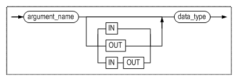
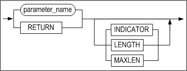

# 3.외부 프로시저용 SQL문

이 장은 Altibase에서 외부 프로시저를 사용하기 위해 지원하는 SQL문을 설명한다.


### CREATE LIBRARY statement

#### 구문


#### 설명

외부 라이브러리 객체를 새로 생성하거나 이미 생성되어 있는 외부 라이브러리를
새로운 외부 라이브러리로 변경한다.

##### library_name

라이브러리 객체의 이름을 명시한다.

##### file_name

동적 라이브러리 파일 이름을 명시한다. 이 파일은 \$ALTIBASE_HOME/lib에 위치해야
한다. 단, 해당 디렉토리에 사용자가 명시한 파일이 없더라도 라이브러리 객체는
생성된다. 동적 라이브러리 파일의 존재 유무는 외부 프로시저가 실행될 때 검사되며,
만약 존재하지 않을 경우 해당 외부 프로시저 객체는 'INVALID' 상태로 전이한다.

#### 예제
~~~~~~~~~~~~~~~~~~~~~~~~~~~~~~~~~~~~~~~~~~~~~~
CREATE OR REPLACE LIBRARY lib1 AS 'shlib.so';
~~~~~~~~~~~~~~~~~~~~~~~~~~~~~~~~~~~~~~~~~~~~~~


### ALTER LIBRARY statement

#### 구문



#### 설명

라이브러리 객체를 컴파일한다.

외부 프로시저용 언어로 C 또는 C++만 지원하는 현재로서는, 이 구문을 실행하여도
서버에서 아무런 동작이 일어나지 않는다. 추후 다른 언어 지원을 위해 예약된
구문이다.

#### 예제
~~~~~~~~~~~~~~~~~~~~~~~~~~~~~~~~~~~~~~~~~~~~~~
ALTER LIBRARY lib1 COMPILE;
~~~~~~~~~~~~~~~~~~~~~~~~~~~~~~~~~~~~~~~~~~~~~~


### DROP LIBRARY statement

#### 구문


#### 설명

데이터베이스에서 외부 라이브러리 객체를 삭제한다.

삭제하려는 라이브러리 객체에 포함된 외부 프로시저가 실행 중이어도, 해당
라이브러리 객체는 삭제된다. 단, 데이터베이스에서 라이브러리 객체만 삭제될 뿐,
연관된 동적 라이브러리 파일이 삭제되지는 않는다.

#### 예제
~~~~~~~~~~~~~~~~~~~~~~~~~~~~~~~~~~~~~~~~~~~~~~
DROP LIBRARY lib1;
~~~~~~~~~~~~~~~~~~~~~~~~~~~~~~~~~~~~~~~~~~~~~~


### CREATE PROCEDURE statement

#### 구문

**create_procedure ::=**


**argument_list ::=**


**argument_declaration ::=**



**call_spec ::=**


**parameter_list ::=**


**parameter_declaration::=**


#### 설명

외부 프로시저를 새로 생성하거나, 이미 생성되어 있는 외부 프로시저를 새로운 외부
프로시저로 변경한다.

##### procedure_name

외부 프로시저 객체의 이름을 명시한다.

##### argument_list

인자는 생략할 수 있으며, 인자를 명시할 경우엔 인자의 명칭, 데이터 타입 및 입출력
구분을 명시해야 한다. 사용 가능한 입출력 유형은 다음 세가지 중의 하나이고 생략
시에 IN이 기본값이 된다.

-   IN: 프로시저 호출시 입력값이 주어지는 입력 인자

-   OUT: 프로시저 실행 후 출력 값을 반환하는 인자

-   INOUT: 입출력 공용 인자로 프로시저 호출시 입력값이 주어지고, 실행 후에 출력
    값을 반환한다.

외부 프로시저가 실행될 때, IN 인자를 사용해서 프로시저에 값을 전달하고,
프로시저는 OUT인자를 사용해서 호출한 루틴에 값을 반환한다.

##### call_spec

사용자 함수 이름과 라이브러리 객체의 이름, 파라미터들을 지정하고, internal mode 또는 external mode를 설정 할 수 있다. 만약 EXTERNAL, INTERNAL을 명시하지 않으면, EXTERNAL 모드로 동작한다.

> 사용자 함수 이름과 라이브러리 객체를 명시하는 순서는 상관이 없으나, 각각 한번씩만 명시해야 한다.

##### func_name

해당 외부 프로시저에 대응하는 사용자 정의 함수 이름을 명시한다.

##### lib_name

해당 외부 프로시저에 대응하는 사용자 함수를 포함하는 외부 라이브러리 객체의
이름을 명시한다.

##### parameter_list

외부 프로시저 객체의 인자들을 이에 대응하는 사용자 정의 함수의 인자들로 할당하기
위해 명시하는 절이다. 이 절의 인자 이름은 argument_list의 인자 이름을 그대로
사용하는 것이 일반적이다.

아래의 속성을 이용하여 각 파라미터에 대해 추가적인 정보를 사용자 정의 함수로
전달할 수 있다. 속성과 함께 명시되는 속성 파라미터는 실제 파라미터를 보조하는
역할을 할 뿐, 외부 프로시저 객체의 인자와는 관계가 없다.

| 속성 이름 | IN 경우 자료형 | INOUT/ OUT/ RETURN 경우 자료형 | 설명                                                                                                                                                              |
|-----------|----------------|--------------------------------|-------------------------------------------------------------------------------------------------------------------------------------------------------------------|
| INDICATOR | short          | short \*                       | 해당 파라미터의 값이 NULL인지 아닌지를 나타낸다. 다음의 값 중 하나를 가질 수 있다. ALTIBASE_EXTPROC_IND_NULL ALTIBASE_EXTPROC_IND_NOTNULL                         |
| LENGTH    | long long      | long long \*                   | 해당 파라미터 값의 길이를 바이트 단위로 나타낸다. 문자열의 경우 문자의 개수가 아니라 바이트 개수임에 주의하라. 문자열이 아닌 경우, 해당 자료형의 크기를 나타낸다. |
| MAXLEN    | \-             | long long                      | 해당 파라미터의 버퍼 크기를 나타낸다. IN 모드 파라미터의 경우 이 속성 파라미터를 명시할 수 없다.                                                                  |

아래 예제에서 PARAMETERS 절은 사용자 정의 함수로 전달되는 인자들과 인자들의
속성을 지정한다.
~~~~~~~~~~~~~~~~~~~~~~~~~~~~~~~~~~~~~~~~~~~~~~~~~~~~~~~~~~~~~~~~~~
CREATE OR REPLACE PROCEDURE proc1(

a1 IN CHAR(30),

a2 OUT CHAR(30) )

AS

LANGUAGE C

LIBRARY lib1

NAME "str_uppercase"

PARAMETERS( a1, a1 LENGTH, a2 );

/
~~~~~~~~~~~~~~~~~~~~~~~~~~~~~~~~~~~~~~~~~~~~~~~~~~~~~~~~~~~~~~~~~~
위 프로시저에서 PARAMETER 절의 인자들로 보아, str_uppercase 함수의 프로토타입은
아래와 같을 것이다.

```
extern "C" void str_uppercase( char* str1, long long str1_len, char* str2 );
```

#### 예제
~~~~~~~~~~~~~~~~~~~~~~~~~~~~~~~~~~~~~~~~~~~~~~~~~~~~~~~~~~~~~~~~~~
create or replace procedure proc1( a1 in char(30), a2 out char(30) )

as

language c

library lib1

name "str_uppercase"

parameters( a1, a1 LENGTH, a2 )

;

/
~~~~~~~~~~~~~~~~~~~~~~~~~~~~~~~~~~~~~~~~~~~~~~~~~~~~~~~~~~~~~~~~~~


### DROP PROCEDURE statement

#### 구문


#### 설명

데이터베이스에서 외부 프로시저 객체를 삭제한다.

삭제하고자 하는 외부 프로시저가 실행 중이라면, 삭제되지 않고 오류가 발생한다.

#### 예제

~~~~~~~~~~~~~~~~~~~~~~~~~~~~~~~~~~~~~~~~~~~~~~~~~~~~~~~~~~~~~~~~~~
DROP PROCEDURE proc1;
~~~~~~~~~~~~~~~~~~~~~~~~~~~~~~~~~~~~~~~~~~~~~~~~~~~~~~~~~~~~~~~~~~


### CREATE FUNCTION

#### 구문

**create_function ::=**


**argument_list ::=**


**argument_declaration ::=**


**call_spec ::=**


**parameter_list ::=**


**parameter_declaration::=**



#### 설명

외부 함수를 새로 생성하거나 이미 생성되어 있는 외부 함수를 새로운 외부 함수로
변경한다.

##### function_name

외부 함수 객체의 이름을 명시한다.

##### argument_list

CREATE PROCEDURE statement 절을 참고하라.

##### call_spec

사용자 함수 이름과 라이브러리 객체의 이름, 파라미터들을 지정하고, internal mode 또는 external mode를 설정 할 수 있다. 만약 EXTERNAL, INTERNAL을 명시하지 않으면, EXTERNAL 모드로 동작한다.

> 사용자 함수 이름과 라이브러리 객체를 명시하는 순서는 상관이 없으나, 각각 한번씩만 명시해야 한다.

##### func_name

해당 외부 프로시저에 대응하는 사용자 정의 함수 이름을 명시한다.

##### lib_name

해당 외부 프로시저에 대응하는 사용자 함수를 포함하는 외부 라이브러리 객체의
이름을 명시한다.

##### parameter_list

CREATE PROCEDURE statement 절을 참고하라.

##### RETURN

외부 함수의 반환값을 가져오는 파라미터임을 명시하는 키워드이다. RETURN 뒤에 함수
파라미터와 마찬가지로 속성 파라미터를 추가로 명시할 수 있다. 속성 파라미터에
대해서는 CREATE PROCEDURE 구문의 설명을 참고하기 바란다.

제약 사항:

-   RETURN 절은 함수의 인자에 대한 파라미터를 모두 명시한 다음 마지막에 명시해야
    한다. 그렇지 않으면 오류가 발생한다.

-   RETURN 뒤에 속성 파라미터를 명시하지 않으면, RETURN 자체를 명시하지 않은
    것과 차이가 없다. 즉, (a, b, RETURN)과 (a, b)는 동일하다.


### DROP FUNCTION

#### 구문


#### 설명

데이터베이스에서 외부 함수 객체를 삭제한다.

삭제하려는 외부 함수가 실행 중이라면, 삭제되지 않고 오류가 발생한다.

#### 예제

~~~~~~~~~~~~~~~~~~~~~~~~~~~~~~~~~~~~~~~~~~~~~~~~~~~~~~~~~~~~~~~~~~
DROP FUNCTION func1;
~~~~~~~~~~~~~~~~~~~~~~~~~~~~~~~~~~~~~~~~~~~~~~~~~~~~~~~~~~~~~~~~~~


### EXECUTE

#### 구문

**execute_procedure_statement::=**


**execute_function_statement::=**


**parameter_notation::=**


#### 설명

외부 프로시저 또는 외부 함수를 실행한다.

##### parameter_notation

파라미터에 값을 전달하는 방식은 아래와 같다.

-   위치기반(Positional) : 기본적인 전달 방식으로, 정의된 파라미터의 위치에 맞춰
    값이 입력된다.

-   이름기반(Name-based) : 정의된 파라미터의 이름을 입력하고 화살표(=\>) 뒤에
    값을 입력하는 방식이다. 파라미터의 순서에 관계없이 값을 전달할 수 있다.

-   혼합(Mixed): 위치기반과 이름기반 방식을 함께 사용할 수 있다. 그러나 반드시
    위치기반 전달 방식을 먼저 입력해야 한다.

#### 예제

~~~~~~~~~~~~~~~~~~~~~~~~~~~~~~~~~~~~~~~~~~~~~~~~~~~~~~~~~~~~~~~~~~
var var1 char(30);

var var2 char(30);

exec :var1 := 'hello world';

exec proc1( var1, var2 );

print var2;
~~~~~~~~~~~~~~~~~~~~~~~~~~~~~~~~~~~~~~~~~~~~~~~~~~~~~~~~~~~~~~~~~~
