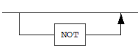

# 목차

- [서문](#서문)
  - [이 매뉴얼에 대하여](#이-매뉴얼에-대하여)
- [1.JDBC 시작하기](#1jdbc-시작하기)
  - [JDBC 드라이버 설치](#jdbc-드라이버-설치)
  - [데이터베이스에 연결하기](#데이터베이스에-연결하기)
  - [연결 정보](#연결-정보)
  - [Statement와 ResultSet 다루기](#statement와-resultset-다루기)
  - [JDBC Connection Failover](#jdbc-connection-failover)
- [2.기본 기능](#2기본-기능)
  - [IPv6 접속](#ipv6-접속)
  - [Statement, PreparedStatement 및 CallableStatement](#statement-preparedstatement-및-callablestatement)
  - [내셔널 캐릭터 셋 사용](#내셔널-캐릭터-셋-사용)
- [3.고급 기능](#3고급-기능)
  - [자동 생성 키](#자동-생성-키)
  - [타임아웃](#타임아웃)
  - [DataSource](#datasource)
  - [Connection Pool](#connection-pool)
  - [Multiple ResultSet](#multiple-resultset)
  - [JDBC와 Failover](#jdbc와-failover)
  - [JDBC Escapes](#jdbc-escapes)
  - [ResultSet 사용하기](#resultset-사용하기)
  - [Atomic Batch](#atomic-batch)
  - [Date, Time, Timestamp](#date-time-timestamp)
  - [GEOMETRY](#geometry)
  - [LOB](#lob)
  - [Autocommit 제어](#autocommit-제어)
  - [BIT, VARBIT](#bit-varbit)
  - [JDBC 로깅](#jdbc-로깅)
  - [Hibernate](#hibernate)
  - [SQL Plan](#sql-plan)
- [4.Tips & Recommendation](#4tips--recommendation)
  - [성능을 위한 팁](#%성능을-위한-팁)
- [5.에러 메시지](#5에러-메시지)
  - [SQL States](#sql-states)
- [6.JDBC 4.2 API References](#6jdbc-42-api-references)
    - [java.sql.Connection](#javasqlconnection)
    - [java.sql.Wrapper](#javasqlwrapper)
    - [java.sql.Driver](#javasqldriver)
    - [java.sql.Statement](#javasqlstatement)
    - [java.sql.PreparedStatement](#javasqlpreparedstatement)
    - [java.sql.CallableStatement](#javasqlcallablestatement)
    - [java.sql.PooledConnection](#javasqlpooledconnection)
    - [java.sql.ResultSet](#javasqlresultset)
    - [java.sql.CommonDataSource](#javasqlcommondatasource)
    - [java.sql.DatabaseMetaData](#javasqldatabasemetadata)
    - [java.sql.Blob](#javasqlblob)
    - [java.sql.Clob](#javasqlclob)
    - [java.sql.Types](#javasqltypes)
    - [java.sql.DriverAction](#javasqldriveraction)
    - [java.sql.SQLTypes](#javasqlsqltypes)
    - [Java 8 Time API](#java-8-time-api)
- [A.부록: 데이터 타입 맵핑](#a부록-데이터-타입-맵핑)
  - [데이터 타입 맵핑](#데이터-타입-맵핑)
  - [Java 데이터형을 데이터베이스 데이터형으로 변환하기](#java-데이터형을-데이터베이스-데이터형으로-변환하기)
  - [데이터베이스 데이터형을 Java 데이터형으로 변환하기](#데이터베이스-데이터형을-Java-데이터형으로-변환하기)

 

서문
====

### 이 매뉴얼에 대하여

이 매뉴얼은 Altibase가 제공하는 JDBC 드라이버의 사용법에 대해 설명한다.
Altibase의 JDBC 드라이버는 JDBC 사양을 대부분 준수하나, 경우에 따라서 사양에서
벗어난 방식으로 동작한다. JDBC를 이용해서 애플리케이션을 작성하기 전에, 본
매뉴얼을 참고하여 JDBC 사양과 다른 부분에 대한 지식을 습득할 것을 권고한다.

#### 대상 사용자

이 매뉴얼은 다음과 같은 Altibase 사용자를 대상으로 작성되었다.

-   데이터베이스 관리자

-   성능 관리자

-   데이터베이스 사용자

-   응용 프로그램 개발자

-   기술지원부

다음과 같은 배경 지식을 가지고 이 매뉴얼을 읽는 것이 좋다.

-   자바 프로그래밍 언어

-   SQL

-   Stored Procedure

-   Altibase에 대한 이해

#### 소프트웨어 환경

이 매뉴얼은 데이터베이스 서버로 Altibase 버전 7.3를 사용한다는 가정 하에
작성되었다.

#### 이 매뉴얼의 구성

이 매뉴얼은 다음과 같이 구성되어 있다.

-   제 1장 시작하기  
    이 장에서는 Altibase의 JDBC 드라이버를 이용하는 기본적인 방법을 기술한다.

-   제 2 장 기본 기능  
    이 장에서는 Altibase의 JDBC 드라이버를 사용해서 데이터베이스의 객체를 다루는
    기본적인 방법을 설명한다.

-   제 3 장 고급 기능  
    이 장에서는 Altibase의 JDBC 드라이버가 제공하는 보다 향상된 기능과 그
    사용법을 설명한다.

-   제 4 장 Tips & Recommendation  
    이 장은 Altibase의 JDBC 드라이버를 효율적으로 사용하기 위한 방법을 제시한다.

-   제 5장 에러 메시지  
    이 장은 Altibase의 JDBC 드라이버를 사용하면서 발생할 수 있는 SQL State를
    기술한다.

-   제 6장 JDBC 4.2 API References  
    이 장은 Altibase의 JDBC 드라이버가 지원하는 JDBC 4.2 스펙 API에 대해 기술한다.

-   부록 A. 데이터 타입 맵핑  
    Altibase의 데이터 타입과 JDBC 표준 데이터 타입, Java 데이터 타입간에 호환
    여부를 기술한다.

#### 문서화 규칙

이 절에서는 이 매뉴얼에서 사용하는 규칙에 대해 설명한다. 이 규칙을 이해하면 이
매뉴얼과 설명서 세트의 다른 매뉴얼에서 정보를 쉽게 찾을 수 있다.

여기서 설명하는 규칙은 다음과 같다.

-   구문 다이어그램

-   샘플 코드 규칙

##### 구문 다이어그램

이 매뉴얼에서는 다음 구성 요소로 구축된 다이어그램을 사용하여, 명령문의 구문을
설명한다.

| 구성 요소                        | 의미                                                         |
| -------------------------------- | ------------------------------------------------------------ |
|  | 명령문이 시작한다. 완전한 명령문이 아닌 구문 요소는 화살표로 시작한다. |
|  | 명령문이 다음 라인에 계속된다. 완전한 명령문이 아닌 구문 요소는 이 기호로 종료한다. |
|  | 명령문이 이전 라인으로부터 계속된다. 완전한 명령문이 아닌 구문 요소는 이 기호로 시작한다. |
|  | 명령문이 종료한다.                                           |
|  | 필수 항목                                                    |
|  | 선택적 항목                                                  |
|  | 선택사항이 있는 필수 항목. 한 항목만 제공해야 한다.          |
|  | 선택사항이 있는 선택적 항목                                  |
|  | 선택적 항목. 여러 항목이 허용된다. 각 반복 앞부분에 콤마가 와야 한다. |

##### 샘플 코드 규칙

코드 예제는 SQL, Stored Procedure, iSQL 또는 다른 명령 라인 구문들을 예를 들어
설명한다.

아래 테이블은 코드 예제에서 사용된 인쇄 규칙에 대해 설명한다.

| 규칙         | 의미                                                         | 예제                                                         |
| ------------ | ------------------------------------------------------------ | ------------------------------------------------------------ |
| [ ]          | 선택 항목을 표시                                             | VARCHAR [(*size*)] [[FIXED \|] VARIABLE]                     |
| { }          | 필수 항목 표시. 반드시 하나 이상을 선택해야 되는 표시        | { ENABLE \| DISABLE \| COMPILE }                             |
| \|           | 선택 또는 필수 항목 표시의 인자 구분 표시                    | { ENABLE \| DISABLE \| COMPILE } [ ENABLE \| DISABLE \| COMPILE ] |
| . . .        | 그 이전 인자의 반복 표시 예제 코드들의 생략되는 것을 표시    | SQL\> SELECT ename FROM employee; ENAME  ----------------------- SWNO  HJNO  HSCHOI  . . . 20 rows selected. |
| 그 밖에 기호 | 위에서 보여진 기호 이 외에 기호들                            | EXEC :p1 := 1; acc NUMBER(11,2);                             |
| 기울임 꼴    | 구문 요소에서 사용자가 지정해야 하는 변수, 특수한 값을 제공해야만 하는 위치 | SELECT \* FROM *table_name*; CONNECT *userID*/*password*;    |
| 소문자       | 사용자가 제공하는 프로그램의 요소들, 예를 들어 테이블 이름, 칼럼 이름, 파일 이름 등 | SELECT ename FROM employee;                                  |
| 대문자       | 시스템에서 제공하는 요소들 또는 구문에 나타나는 키워드       | DESC SYSTEM_.SYS_INDICES_;                                   |

#### 관련 자료

자세한 정보를 위하여 다음 문서 목록을 참조하기 바란다.

-   Administrator’s Manual

-   Replication Manual

-   Spatial SQL Reference

#### Altibase는 여러분의 의견을 환영합니다.

이 매뉴얼에 대한 여러분의 의견을 보내주시기 바랍니다. 사용자의 의견은 다음
버전의 매뉴얼을 작성하는데 많은 도움이 됩니다. 보내실 때에는 아래 내용과 함께
고객서비스포털(http://support.altibase.com/kr/ )로 보내주시기 바랍니다.

-   사용 중인 매뉴얼의 이름과 버전

-   매뉴얼에 대한 의견

-   사용자의 성함, 주소, 전화번호

이 외에도 Altibase 기술지원 설명서의 오류와 누락된 부분 및 기타 기술적인
문제들에 대해서 이 주소로 보내주시면 정성껏 처리하겠습니다. 또한, 기술적인
부분과 관련하여 즉각적인 도움이 필요한 경우에도 고객서비스포털을 통해 서비스를
요청하시기 바랍니다.

여러분의 의견에 항상 감사드립니다.

