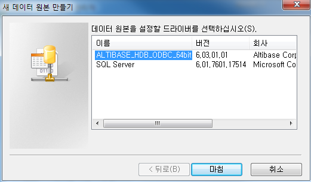

# 2.설치 및 설정

이 장은 Altibase ODBC 드라이버를 설치하고 설정하는 방법을 설명한다.

### 설치

본 절에서는 Altibase ODBC 드라이버를 설치하는 방법에 대해서 기술한다.

#### 유닉스 계열

유닉스 계열의 경우 Altibase 서버 또는 클라이언트 패키지를 설치할 때 ODBC
드라이버도 함께 설치된다. Altibase 서버 또는 클라이언트 패키지를
설치하는 방법은 *Installation Guide*를 참조한다.

64비트 패키지를 설치하면 아래와 같은 32비트와 64비트 ODBC 드라이버가
모두 \$ALTIBASE\_HOME/lib에 설치될 것이다.

libaltibase\_odbc-64bit-ul32.so: SQLLEN의 크기가 32비트

libaltibase\_odbc-64bit-ul64.so: SQLLEN의 크기가 64비트

64비트 패키지에 두 개의 드라이버가 포함된 이유는 다음과 같다. 64비트
ODBC Driver Manager들은 SQLLEN 타입의 크기를 64bit로 정의하고 있다.
그러나, 유닉스 계열에서 사용 가능한 ODBC Driver Manager 중의 하나인
unixODBC가 버전과 컴파일 옵션에 따라 SQLLEN의 크기를 32bit 또는 64bit로
정의하기 때문에, 모두를 수용하기 위해 Altibase는 두 개의 드라이버를
제공한다. unixODBC를 사용하는 경우 SQLLEN 크기가 일치하는 드라이버를
선택하여 사용하기 바란다.

32비트 패키지를 설치하면 아래의 파일이 \$ALTIBASE\_HOME/lib에 위치하게
된다.

```
libaltibase_odbc.so
```

HP 운영 체제의 경우 위와 동일한 파일 이름에 확장자만 sl이다.

### 설정

본 절에서는 ODBC 드라이버를 설정하는 방법에 대해서 기술한다.

#### 유닉스 계열

유닉스에서 ODBC 드라이버를 사용하기 위해서는 먼저 ODBC Driver Manager를
설치해야 한다. 유닉스용 ODBC Driver Manager는 unixODBC Driver Manager와
iODBC Driver Manager가 있다. 각 Driver Manager에 대한 자세한 내용은 아래
링크를 참조한다.

-   http://www.unixodbc.org/

-   http://www.iodbc.org/

##### DSN 추가

ODBC 애플리케이션에서 접근하려는 데이터베이스에 대한 DSN을 추가한다.
\[데이터 원본(ODBC)\]의 사용자 DSN 또는 시스템 DSN 탭에서 \"추가\"를
누르면 아래의 대화상자가 나타난다. Altibase용 ODBC 드라이버를 선택하고
\"마침\"을 누른다.



\"Altibase Connection Config\" 창이 나타나면 아래의 속성들을 입력한다.


-   Windows DSN Name: 데이터 원본의 이름을 입력한다.

-   host (name or IP): 접속할 Altibase 서버가 위치하는 장비의 호스트
    이름 또는 IP 주소를 입력한다. 

-   Port (default 20300): Altibase 서버의 listening 포트 번호를
    입력한다. altibase.properties 파일에서 PORT\_NO 값을 확인하거나
    ALTIBASE\_PORT\_NO 환경변수 값을 확인한다.

-   User: 데이터베이스 사용자 이름을 입력한다.

-   Password: 데이터베이스 사용자 비밀번호를 입력한다.

-   Database: 데이터베이스 이름을 입력한다.

-   NLS\_USE: 클라이언트의 캐릭터셋을 입력한다.

\"Test Connection\"을 눌러서 접속이 정상적으로 되는지 확인할 수 있다.
\"OK\"를 누른 후 DSN 탭에서 방금 입력한 이름으로 데이터 원본이 추가된
것을 확인할 수 있다.

