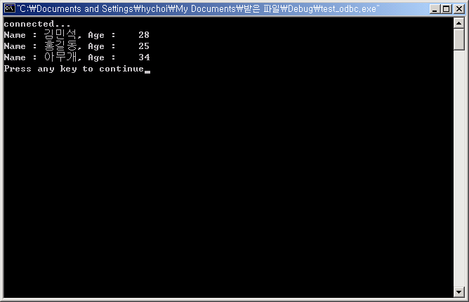

# 3.ODBC 프로그래밍

이 장은 Altibase ODBC 드라이버를 사용해서 ODBC 애플리케이션을 작성하는
방법을 예제와 함께 설명한다.

### 연결 문자열 (Connection String)

Altibase ODBC를 사용하여 ODBC 애플리케이션을 작성할 때 DSN을 사용하는
대신에 연결 문자열을 사용할 수도 있다. 연결 문자열은 아래의 속성으로
구성된다.

| 속성           | 설명                                                         |
| -------------- | ------------------------------------------------------------ |
| DRIVER         | ODBC 드라이버의   이름. ODBC 데이터 원본 관리자 창에서 확인할 수 있다. |
| User           | 데이터베이스 사용자 이름                                     |
| Password       | 데이터베이스 사용자 비밀번호                                 |
| Server         | 접속할 Altibase 서버의 IP 주소                               |
| PORT           | Altibase 서버의 listening 포트 번호                          |
| NLS_USE        | 클라이언트의 캐릭터셋                                        |
| LongDataCompat | ON 또는 OFF   BLOB 같은 대용량   데이터를 사용할 경우 ON으로 설정하길 권장한다. 디폴트는 OFF이다. |

다음은 위의 속성들을 이용해서 구성한 연결 문자열의 예이다.
~~~~~~~~~~~~~~~~~~~~~~~~~~~~~~~~~~~~~~~~~~~~~~~~~~~~~~~~~~~~~~~~~~~~~~~~
"DRIVER=ALTIBASE_HDB_ODBC_64bit;User=SYS;Password=xxx;Server=127.0.0.1;PORT=20300;NLS_USE=US7ASCII;LongDataCompat=OFF"
~~~~~~~~~~~~~~~~~~~~~~~~~~~~~~~~~~~~~~~~~~~~~~~~~~~~~~~~~~~~~~~~~~~~~~~~
### 기본 프로그래밍 예제

ODBC애플리케이션에서 Altibase 서버에 접속하고 종료하는 예제 코드과
애플리케이션 수행결과는 다음과 같다.

##### 예제

```
/* test_odbc.cpp */
#include <windows.h>
#include <sql.h>
#include <sqlext.h>
#include <stdio.h>
#include <stdlib.h>

#define SQL_LEN 1000
#define MSG_LEN 1024

SQLHENV     henv;
SQLHDBC     hdbc;
SQLHSTMT    hstmt;
SQLRETURN   retcode;

void execute_err(SQLHSTMT stat, char* q)
{
    printf("Error : %s\n",q);
    SQLINTEGER errNo;
    SQLSMALLINT msgLength;
    SQLTCHAR errMsg[MSG_LEN];

    if (SQL_SUCCESS == SQLError ( henv, hdbc, stat, NULL, &errNo, errMsg, MSG_LEN, &msgLength ))
    {
    	printf(" Error : # %lld, %s\n", errNo, errMsg);
    }

    SQLFreeStmt(stat, SQL_DROP);
    if (SQL_ERROR == SQLDisconnect(hdbc))
    {
    	printf("disconnect error\n");
    }

    SQLFreeConnect(hdbc);
    SQLFreeEnv(henv);

    exit (1);
}

void main()
{
    char    *DSN, *DBNAME, *USERNAME, *PASSWD, *PORTNO;
    char    query[SQL_LEN], name[21];
    int     age;

    SQLCHAR constr[100];
    SQLINTEGER len;
    DSN = "ALTIBASE"; // Domain Server Name

    /* Environment 을 위한 메모리를 할당 */
    if(SQLAllocEnv(&henv) == SQL_ERROR)
    {
        printf("AllocEnv error!!\n");
		exit(1);
    }
    
    /* Connection 을 위한 메모리를 할당 */
    if(SQLAllocConnect(henv, &hdbc) == SQL_ERROR)
    {
    printf("AllocDbc error!!\n");
    SQLINTEGER errNo;
    SQLSMALLINT msgLength;
    SQLTCHAR errMsg[MSG_LEN];

    if (SQL_SUCCESS == SQLError ( henv, NULL, NULL, NULL, &errNo, 
    errMsg, MSG_LEN, &msgLength ))
    {
    printf(" Error : # %lld, %s\n", errNo, errMsg);
    }
    exit(1);
    }

    /* Connection을 형성 */
    sprintf((char*)constr,
     "DSN=%s", DSN);

    if ( SQLDriverConnect(hdbc, NULL, constr, SQL_NTS, NULL, 0, NULL, 
    SQL_DRIVER_COMPLETE))
    {
        printf("DBNAME = %s\n", DBNAME);
        printf("USERNAME = %s\n", USERNAME);
        printf("Connection error!!\n");
        SQLINTEGER errNo;
        SQLSMALLINT msgLength;
        SQLTCHAR errMsg[MSG_LEN];

        if (SQL_SUCCESS == SQLError ( henv, hdbc, NULL, NULL, &errNo, 
        errMsg, MSG_LEN, &msgLength )) 
        {
            printf(" Error : # %lld, %s\n", errNo, errMsg);
        }

        SQLFreeConnect(hdbc);
        SQLFreeEnv(henv);
        exit(1);
    }
    printf("connected...\n");

    /* statement을 위한 메모리를 할당 */
    if ( SQLAllocStmt(hdbc, &hstmt) == SQL_ERROR )
    {
        printf("AllocStmt error!!\n");
        SQLDisconnect(hdbc);
        SQLFreeConnect(hdbc);
        SQLFreeEnv(henv);
        exit(1);
    }
                
    /* 쿼리수행 */
    sprintf(query,"DROP TABLE TEST001");
    SQLExecDirect(hstmt,(SQLTCHAR*)query, SQL_NTS);

    sprintf(query,"CREATE TABLE TEST001 ( name varchar(20), age number(3) )");
    if (SQL_ERROR == SQLExecDirect(hstmt,(SQLTCHAR*)query, SQL_NTS))
    {
        execute_err(hstmt, query);
    }

    /* statement를 준비하고 변수를 바인드한다. */
    sprintf(query,"INSERT INTO TEST001 VALUES( ?, ? )");
    if (SQL_ERROR == SQLPrepare(hstmt, (SQLTCHAR*)query, SQL_NTS))
    {
        execute_err(hstmt, query);
    }

    if (SQL_ERROR == SQLBindParameter(hstmt, 1, SQL_PARAM_INPUT,
SQL_C_CHAR, SQL_CHAR, 0, 0, name,
19, &len))
    {
        printf("SQLBindParameter error!!! ==> %s \n",query);
        exit(1);
    }

    if (SQL_ERROR == SQLBindParameter(hstmt, 2, SQL_PARAM_INPUT, 
SQL_C_SLONG, SQL_NUMERIC, 0, 0,
&age, 0, &len))
    {
        printf("SQLBindParameter error!!! ==> %s \n",query);
        exit(1);
    }

    /* 준비된 statement를 수행 */
    sprintf(name, "김민석");
    age = 28;
    if (SQL_ERROR == SQLExecute(hstmt))
    {
        execute_err(hstmt, query);
    }

    sprintf(name, "홍길동");
    age = 25;
    if (SQL_ERROR == SQLExecute(hstmt))
    {
        execute_err(hstmt, query);
    }

    sprintf(name, "아무개");
    age = 34;
    if (SQL_ERROR == SQLExecute(hstmt))
    {
        execute_err(hstmt, query);
    }

    sprintf(query,"SELECT * FROM TEST001");
    if (SQL_ERROR == SQLExecDirect(hstmt,(SQLTCHAR*)query, SQL_NTS))
    {
        execute_err(hstmt, query);
    }

    /* Select의 결과값을 변수에 저장 */
    if (SQL_ERROR == SQLBindCol(hstmt, 1, SQL_C_CHAR, name, 21, &len)) 
    {
        printf("SQLBindCol error!!!\n");
        exit(1);
    }

    if (SQL_ERROR == SQLBindCol(hstmt, 2, SQL_C_SLONG,&age, 0, &len)) 
    {
        printf("SQLBindCol error!!!\n");
        exit(1);
    }

    while ( SQLFetch(hstmt) == SQL_SUCCESS) 
	// 결과값이 있는 동안 결과값을 받아 화면에 출력 */
    {
        printf("Name : %5s, Age : %5ld\n",name,age);
    }
    
    /* 모든 handle을 해제하고 접속을 종료 */
    SQLFreeStmt(hstmt, SQL_DROP);
    SQLDisconnect(hdbc);
    SQLFreeConnect(hdbc);
    SQLFreeEnv(henv);
}
```

**실행결과**

Visual C++에서 컴파일 후 생성된 exe 파일을 실행시키면 다음과 같은 결과를
볼 수 있다.



### LOB 사용 예제

이 절은 Altibase ODBC 드라이버를 사용해서 LOB 데이터를 조작하는 방법을
예제를 통해 살펴본다.

Altibase의 LOB Locator 특성상 세션의 자동커밋을 해제한
상태(Non-autocommit)에서 LOB 데이터를 조작해야 한다. 자세한 내용은
*Altibase CLI Manual*에서 3장 LOB 인터페이스를 참조한다.

또한 다음과 같이 연결 문자열에서 LongDataCompat 속성을 ON으로 설정해야
한다.

```
"DSN=ALTIBASE;LongDataCompat=ON"
```

또는

```
"DRIVER=ALTIBASE_HDB_ODBC_64bit;User=SYS;Password=xxx;Server=127.0.0.1;PORT=20300;NLS_USE=US7ASCII;LongDataCompat=ON"
```

아래는 C\#에서 BLOB 데이터를 테이블에 삽입하고 조회하는 예제이다.
~~~~~~~~~~~~~~~~~~~~~~~~~~~~~~~~~~~~~~~~~~~~~~~~~~~~~~~~~~
FileStream fs = new FileStream("c:\\test.dat", FileMode.Open, FileAccess.Read); 
Byte[] blob = new byte[fs.Length]; 
fs.Read(blob, 0, System.Convert.ToInt32(fs.Length)); 
fs.Close(); 

OdbcTransaction tx = cn.BeginTransaction(); 
cmd.Transaction = tx; 

cmd.CommandText = "INSERT INTO T1 (C1, C2) VALUES (?, ?)"; 
cmd.Parameters.Add("C1", OdbcType.Int); 
cmd.Parameters.Add("C2", OdbcType.Binary); 

cmd.Parameters[0].Value = 1; 
cmd.Parameters[1].Value = blob; 

cmd.ExecuteNonQuery(); 
tx.Commit(); 

// BLOB SELECT 
cmd.CommandText = "SELECT binary_length(C2), C2 FROM T1"; 

tx = cn.BeginTransaction(); 
cmd.Transaction = tx; 
OdbcDataReader dr = cmd.ExecuteReader(); 
int len; 

while (dr.Read()) 
{ 
    len = dr.GetInt32(0); 
    Byte[] ff = new Byte[len]; 
    dr.GetBytes(1, 0, ff, 0, len); 

    fs = new FileStream("c:\\test.dat", FileMode.CreateNew, FileAccess.Write); 
    fs.Write(ff, 0, len); 
    fs.Close(); 
}

~~~~~~~~~~~~~~~~~~~~~~~~~~~~~~~~~~~~~~~~~~~~~~~~~~~~~~~~~~

