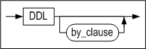
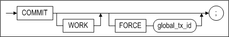

# 5.데이터 제어어

이장에서는 사용자 세션 제어와 트랜잭션을 제어하는 SQL문에 대해서 설명한다.

### ALTER REPLICATION 

#### 구문

**alter_replication_dcl ::=**


#### 설명

CREATE REPLICATION 구문으로 이중화 생성 후 이중화의 동작을 제어하는 구문이다.
이중화에 관한 자세한 내용은 *Replication Manual* 을 참고한다.

*STOP*

이중화를 중지한다.

*FLUSH*

이 구문이 실행된 세션은 이중화 송신 쓰레드에 의해서 현재 로그(FLUSH구문이 실행된
시점의 로그)까지 변경 내용이 상대방 서버에 전송되도록 *wait_time* 초 만큼
기다린다.

만약 ALL옵션이 함께 사용되면, 구문이 실행된 세션은 현재 로그가 아닌 가장 최근
로그까지의 변경 내용이 상대방 서버에 전송되도록 기다린다.

#### 예제

- 이름이 rep1인 이중화 객체의 이중화를 중지하라.

  \<질의\> 이중화를 중지하라.

  ```
  iSQL> ALTER REPLICATION rep1 STOP;
  Alter success.
  ```


### ALTER SESSION 

#### 구문

**alter_session::=**


[set_transaction_clause::=](#set_transaction)

**alter_session_set_clause::=**


**replication_mode_set_clause::=**


**dblink_session_close_clause::=**


#### 설명

현재 세션(Session)의 속성을 변경하는 구문이다.

*alter_session_set_clause*

alter_session_set_clause 절의 property_name과 property\_ value에 관한 자세한
내용은 Altibase 매뉴얼 중 *General Reference*의 Altibase 프로퍼티 장을 참조한다.

*replication_mode_set_clause*

*replication*\_*mode_set_clause*는 현재 세션에서 수행하는 트랜잭션을 위한 이중화
모드 속성을 설정하는 절이다.

DEFAULT를 명시하면 이중화는 이중화 객체 생성시 기본모드로 채택된 모드로 동작할
것이다. 그러나 NONE을 명시하면 세션에서 수행되는 모든 DDL, DML, DCL 문이 이중화
대상에서 제외된다.

이중화 모드에 대한 보다 자세한 내용은 *Replication Manual*을 참조한다.

*dblink_session \_close_clause*

사용자가 서버에 접속하면 서버에는 세션이 생성된다. 이 세션에서 데이터베이스
링크를 사용하면, 데이터베이스 링크 작업을 위한 데이터베이스 링크 세션이
사용자에게 할당된 세션내에 생성된다. 그리고 이 사용자 세션이 종료될 때,
데이터베이스 링크 세션도 같이 종료된다. 그런데 데이터베이스 링크 작업을 한번
수행한 후, 이 사용자 세션을 종료하지 않은 채로 계속 유지한다면, 불필요한
데이터베이스 링크 세션이 남아있게 된다.

이 경우 이 절을 사용하여 데이터베이스 링크 세션을 정리할 수 있다.

*set_transaction_clause*

현재 세션에서 수행되는 트랜잭션에 read only, read/write 또는 고립화 수준(isolation level)을 설정할 수 있다. 자세한
내용은 이 매뉴얼의 [SET TRANSACTION](#set_transaction) 구문을 참조한다.

#### 예제

\<질의\> 현재 세션은 그냥두고 데이터베이스 링크 세션만 종료한다.

```
iSQL> ALTER SESSION CLOSE DATABASE LINK ALL;
```


### ALTER SYSTEM 

#### 구문

**alter_system ::=**


**alter_system_set_clause ::=**


#### 설명

Altibase의 시스템 프로퍼티를 변경하는 구문이다. SYS 사용자 또는 ALTER SYSTEM
권한을 가진 사용자만이 ALTER SYSTEM 문의 모든 기능을 수행할 수 있다.

*CHECKPOINT*

체크포인트를 수행하는 옵션이다.

*MEMORY COMPACT*

메모리 콤팩션을 수행하는 구문이다. 이 구문은 IBM AIX플랫폼에서만 동작한다.

*START/STOP FLUSHER integer*

Altibase 플러셔를 구동하거나 정지시키는 구문이다. 정수값의 플러셔 ID는
V\$FLUSHER 성능 뷰를 통해서 조회할 수 있다.

*ARCHIVE LOG START/STOP*

START를 실행하면 아카이브로그 쓰레드가 시작되고, STOP하면 종료된다. Altibase가
아카이브로그 모드로 운영중일때만 이 구문을 실행할 수 있다.

Altibase가 아카이브로그 모드로 운영중인지 여부는 V\$LOG 또는 V\$ARCHIVE 성능
뷰에서 확인이 가능하다. 아카이브로그 모드에 대한 자세한 내용은 *Administrator’s
Manual*의 10장 백업 및 복구를 참고한다.

*SWITCH LOGFILE*

로그파일을 강제로 아카이브하는 구문이다. 현재 로그파일이 꽉 차지 않았더라도, 이
구문을 실행하면 Altibase는 사용중이던 로그파일을 닫고 다음 로그파일에 로깅을
계속한다.

이 구문은 sysdba모드로만 수행할 수 있다.

*SET alter_system_set_clause*

Altibase 프로퍼티 값을 변경하는 구문이다. 프로퍼티에 대한 자세한 내용은 *General
Reference*의 Altibase 프로퍼티를 참조한다.

*FLUSH BUFFER_POOL*

버퍼에 있는 모든 페이지를 디스크로 내리고, 버퍼를 비운다.

이 구문은 sysdba모드로만 수행할 수 있다. 사용할 때는 반드시 주의를 기울여야
한다. 이 구문을 수행할 경우 버퍼에 있는 모든 페이지가 삭제되기 때문에, 다음에
수행되는 질의문은 접근하는 모든 페이지에 대해서 버퍼 미스(Buffer Miss, 버퍼에서
레코드를 찾는 데 실패하는 것을 말함)를 발생시킨다.

*COMPACT SQL_PLAN_CACHE*

SQL Plan Cache에서 사용되지 않는 실행 계획을 삭제한다.

*RESET SQL_PLAN_CACHE*

SQL Plan Cache에 사용되지 않는 실행 계획을 삭제하고 Plan Cache 관련 통계 정보를
초기화한다.

*START \| STOP \| RELOAD AUDIT*

감사(Auditing)를 시작 또는 중지하거나, 감사 조건을 재적용하는 구문이다.

*RELOAD ACCESS LIST*

IP 패킷의 접근을 허용하거나 차단하는 목록을 갱신한다. sysdba 관리자 모드로만 이
구문을 수행할 수 있다. ACCESS_LIST_FILE 프로퍼티에 설정된 파일의 목록으로 ACCESS
LIST를 구성한다. ACCESS LIST에 대한 자세한 내용은 ACCESS_LIST 프로퍼티를
참조한다.

#### 예제

\<질의\> 플러셔 1번을 중지시킨다.

```
iSQL> ALTER SYSTEM STOP FLUSHER 1;
```

\<질의\> 아카이브로그 모드일 경우 아카이브 로그 쓰레드를 시작시킨다.

```
iSQL> ALTER SYSTEM ARCHIVE LOG START;
```


### AUDIT

#### 구문

**audit ::=**


**audit_operation_clause ::=**


**by_clause ::=**


**audit_object_clause ::=**


**ddl_clause ::=**



#### 전제 조건

SYS 사용자만이 이 구문으로 감사 조건을 설정할 수 있다.

#### 설명

Altibase 서버 내에서 실행되고 있는 특정 구문 또는 모든 구문을 실시간으로
추적하고, 로그를 남기는 것을 감사(Audit)라고 한다. 이 구문을 사용해서 감사
조건을 설정할 수 있다.

*audit_operation_clause*

이 절은 Altibase 서버에서 특정한 SQL 구문이 수행되는 것을 감사하도록 지정한다.

이 절의 sql_statement_type에는 감사 대상 작업을 지정한다. 콤마(,)로 연결해서
여러 개를 명시할 수도 있다. 지정 가능한 감사 작업은 다음과 같다.

- SELECT
- INSERT
- UPDATE
- DELETE
- MOVE
- MERGE
- ENQUEUE
- DEQUEUE
- LOCK
- EXEC or EXECUTE
- COMMIT
- ROLLBACK
- SAVEPOINT
- CONNECT
- DISCONNECT
- ALTER SESSION
- ALTER SYSTEM

ALL은 위에 나열한 모든 구문에 대해 감사할 것을 지정한다.

*by_clause*

특정 사용자가 실행하는 구문을 감사할 것을 지정한다.

*audit_object_clause*

이 절은 Altibase 서버에서 특정 객체에 대해 특정한 작업이 수행되는 것을
감사하도록 지정한다.

이 절에는 감사 대상 작업을 콤마(,)로 연결해서 명시할 수 있다. 아래는 감사 대상이
될 수 있는 작업 별로 지정 가능한 객체의 종류와, 각 경우에 감사 내역은 무엇인지를
나타낸 표이다.

| 작업         | 객체 종류 | 감사 내역                               |
| ------------ | --------- | --------------------------------------- |
| SELECT       | TABLE     | 대상 테이블 객체에 수행되는 SELECT 구문 |
| INSERT       | TABLE     | 대상 테이블 객체에 수행되는 INSERT 구문 |
| UPDATE       | TABLE     | 대상 테이블 객체에 수행되는 UPDATE 구문 |
| DELETE       | TABLE     | 대상 테이블 객체에 수행되는 DELETE 구문 |
| MOVE         | TABLE     | 대상 테이블 객체에 수행되는 MOVE 구문   |
| MERGE        | TABLE     | 대상 테이블 객체에 수행되는 MERGE 구문  |
| ENQUEUE      | QUEUE     | 대상 큐 객체에 수행되는 ENQUEUE 구문    |
| DEQUEUE      | QUEUE     | 대상 큐 객체에 수행되는 DEQUEUE 구문    |
| LOCK         | TABLE     | 대상 테이블 객체에 수행되는 LOCK 구문   |
| EXEC/EXECUTE | PROCEDURE | 대상 프로시저 객체를 실행하는 구문      |

ALL은 객체 유형에 대해서 수행 가능한 모든 SQL 구문을 감사할 것을 지정한다. 단,
위의 표에 나열한 구문에 한해서이다.

*object_name*

감사 대상이 되는 객체 이름을 명시한다. 지정할 수 있는 객체의 종류는 테이블, 뷰,
큐, 시퀀스, 저장 프로시저 및 저장 함수이다.

*ddl_clause*

이 절은 Altibase 서버에서 DDL 구문이 수행되는 것을 감사하도록 지정한다.

*BY ACCESS \| SESSION*

BY ACCESS를 지정하면 조건에 부합하는 구문 또는 작업에 대해 각각 하나의 감사
로그가 기록된다. 예를 들어 BY ACCESS를 지정하여 감사를 진행하면 한 세션에서
동일한 SQL 구문이 10회 실행된 경우 감사 로그도 10개가 기록된다.

BY SESSION은 1 prepare - n execute 구조에서 중복 로그를 방지하기 위해 하나의 감사 로그만 기록된다.
또한 마지막에 수행된 구문의 통계 로그는 해당 구문이 종료되는 시점에 기록된다.

둘 중 하나도 지정하지 않으면 BY SESSION이 디폴트이다.

감사 대상이 CONNECT, DISCONNECT, DDL 경우에는 BY ACCESS\|SESSION을 지원하지
않는다.

*WHENEVER [NOT] SUCCESSFUL*

WHENEVER SUCCESSFUL을 지정하면 성공하는 SQL구문과 작업만 감사한다.

WHENEVER NOT SUCCESSFUL을 지정하면 실패하는 SQL구문과 작업만 감사한다.

이 절을 생략하면 Altibase는 성공이나 실패에 상관없이 감사를 수행한다.

'BY SESSION WHENEVER SUCCESSFUL'로 지정한 경우, 한 세션에서 수행된 동일한 SQL
구문들이 모두 성공적으로 수행되는 경우에만 그 구문에 대한 로그가 기록된다.

'BY SESSION WHENEVER NOT SUCCESSFUL'로 지정한 경우, 한 세션에서 수행되는 동일한
SQL 구문들 중 하나라도 실패할 경우에 그 구문에 대한 로그가 기록된다.

#### 주의 사항

AUDIT 구문으로 감사 조건을 설정하여도, 서버의 감사 작업에 새로운 조건들이 바로
적용되는 것은 아니다. 운영 중인 서버에 새로운 감사 조건들이 적용되기 위해서는
아래의 구문을 사용해서 감사를 재시작하거나 감사 조건들을 RELOAD해야 한다.

```
ALTER SYSTEM STOP AUDIT;
ALTER SYSTEM START AUDIT;
ALTER SYSTEM RELOAD AUDIT;
```


#### 예제

\<질의1\> 사용자 user1의 friends 테이블에 대한 INSERT, UPDATE 또는 DELETE문 수행
중 실패한 경우에 대한 정보를 모두 기록하라.

```
iSQL> AUDIT insert, update, delete ON user1.friends BY ACCESS WHENEVER NOT
SUCCESSFUL;
```

\<질의2\> 사용자 user1의 friends 테이블에 대한 DDL문 수행들이 세션에서 모두
성공한 경우에 로그를 기록하라.

```
iSQL> AUDIT all ON user1.friends BY SESSION WHENEVER SUCCESSFUL;
```

\<질의3\> Altibase 서버에 대해 수행되는 모든 CONNECT, DISCONNECT 구문의 실패
정보를 기록하라.

```
iSQL> AUDIT connect, disconnect WHENEVER NOT SUCCESSFUL;
Audit success.
```

\<질의4\> Altibase 서버 내에서 수행되는 모든 INSERT 구문에 대한 정보를 세션
단위로 기록하라.

```
iSQL> AUDIT insert;
Audit success.
```

\<질의5\> 사용자 user1이 수행하는 모든 DDL 구문에 대한 로그를 기록하라.

```
iSQL> AUDIT DDL BY user1;
Audit success.
```


### COMMIT 

#### 구문

**commit::=**



#### 설명

현재의 트랜잭션을 데이터베이스에 명시적으로 커밋하는 구문이다.

AUTOCOMMIT 모드가 FALSE일때 사용할 수 있다.

*WORK*

WORK 키워드는 표준 SQL을 준수하도록 한다.

*FORCE global_tx_id*

XA환경에서 트랜잭션이 in-doubt 상태가 될 경우에 이를 강제로 커밋하는 구문이다.

global_tx_id는 글로벌 트랜잭션의 포맷(format) 아이디, 글로벌 트랜잭션(global
transaction) 아이디, 브랜치 수식자(branch qualifier)를 문자열로 나타낸 것이다.

#### 주의 사항

AUTOCOMMIT 모드 시에 이 문장을 수행할 수 없다.

#### 예제

다음 구문은 트랜잭션이 이전에 수행한 모든 명령들을 데이터베이스에 반영한다..

```
iSQL> COMMIT;
Commit success.
```


### DELAUDIT

#### 구문

**delaudit ::=**


**delaudit_user_clause ::=**


**delaudit_object_clause ::=**


#### 전제 조건

SYS 사용자만이 이 구문으로 감사 조건을 삭제할 수 있다.

#### 설명

Altibase 서버 내에서 감사를 하기 위해 설정한 감사 조건을 삭제하는 구문이다.

*delaudit_user_clause*

AUDIT ... BY *user_name* 구문으로 설정한 구문 감사와 DDL 감사 조건들 중 지정한
사용자 이름과 일치하는 것을 삭제한다.

ALL

BY *user_name*절 없이 설정한 구문 감사 조건과 DDL 감사 조건을 일괄적으로
삭제한다. 객체 감사 조건은 삭제되지 않는다.

*delaudit_object_clause*

특정 객체에 대해 설정된 감사 조건을 삭제한다.

#### 주의 사항

DELAUDIT 구문이 실행되면, SYS_AUDIT_OPTS_에서 감사 조건들이 삭제된다.

감사가 이미 시작되어 있는 경우에는 이 구문을 실행할 수 없다. 만약 감사가
시작되어 있는 상태에서 감사 조건을 삭제할 경우 에러가 발생하며, ALTER SYSTEM
STOP AUDIT으로 감사를 종료 후 삭제한다.

#### 예제

\<질의1\> 사용자 user1에 대한 감사 조건을 삭제한다. 구문 실행 후에,
SYS_AUDIT_OPTS_에서 감사 조건이 삭제된 것을 확인할 수 있다.

```
iSQL> DELAUDIT by user1;
Audit success.
iSQL> SELECT * from SYSTEM_.SYS_AUDIT_OPTS_;
No rows selected.
```

\<질의 2\> 구문 감사가 시작된 후에, DELAUDIT을 실행하면 에러가 발생한다. 감사를
종료 후 삭제할 수 있다.

```
iSQL> alter system start audit;
Alter success.
iSQL> delaudit by user1;
[ERR-313B2 : Audit has already started.]
iSQL> alter system stop audit;
Alter success.
iSQL> delaudit by user1;
Audit success.
```


### NOAUDIT

#### 구문

**noaudit ::=**


**audit_operation_clause ::=**


**by_clause ::=**


**audit_object_clause ::=**


**ddl_clause ::=**


#### 전제 조건

SYS 사용자만이 이 구문으로 감사 조건을 해제할 수 있다.

#### 설명

NOAUDIT 구문은 이전에 AUDIT 구문으로 설정한 감사 조건을 해제하기 위해 사용된다.

*audit_operation_clause*

이 절은 특정 SQL 구문에 대한 감사를 중지하기 위해 사용된다.

sql_statement_type에는 중지할 감사 작업을 지정한다. 지정 가능한 감사 작업에
대해서는 AUDIT 구문의 설명을 참고하라.

ALL은 이전에 AUDIT ALL 구문으로 설정한 모든 구문에 대한 감사를 중지하기 위해
사용된다.

*audit_object_clause*

이 절은 특정 객체에 대한 감사 조건을 해제하기 위해 사용된다.

sql_operation에는 ON 절에 명시한 객체에 대해 감사를 중지할 SQL 작업을 지정하면
된다. 지정 가능한 SQL 작업에 대해서는 AUDIT 구문의 설명을 참고하라.

ALL은 객체 유형에 대해서 수행 가능한 모든 SQL 구문을 지정하는 것과 동일한 역할을
한다.

ddl_clause

이 절은 DDL 구문에 대한 감사를 중지하도록 지정한다.

*WHENEVER [NOT] SUCCESSFUL*

WHENEVER SUCCESSFUL은 SQL 구문과 객체에 대한 작업이 성공하는 것에 대한 감사를
중지할 것을 지정한다.

WHENEVER NOT SUCCESSFUL은 SQL 구문과 객체에 대한 작업이 실패하는 것에 대한
감사를 중지할 것을 지정한다.

이 절을 생략하면 성공 또는 실패 여부에 상관없이 지정한 구문 또는 객체에 대한
작업을 감사하는 것을 중지할 것을 지정한다.

#### 주의 사항

NOAUDIT 구문으로 어떤 감사 조건을 해제하여도, 서버의 감사 작업에 바로 적용되는
것은 아니다. 운영 중인 서버에 감사 조건의 해제가 적용되기 위해서는 아래의 구문을
사용해서 감사를 재시작하거나 감사 조건들을 RELOAD해야 한다.

```
ALTER SYSTEM STOP AUDIT;
ALTER SYSTEM START AUDIT;
ALTER SYSTEM RELOAD AUDIT;
```


#### 예제

\<질의1\> 테이블 friends에서 SELECT 구문의 성공에 대한 감사를 해제하라.

```
iSQL> NOAUDIT select ON friends WHENEVER SUCCESSFUL;
Audit success.
```

\<질의2\> SELECT 구문에 대한 감사를 해제하라.

```
iSQL> NOAUDIT select;
Audit success.
```

\<질의3\> DDL 문에 대한 감사를 해제하라.

```
iSQL> NOAUDIT DDL;
Audit success.
```


### SAVEPOINT

#### 구문

**savepoint::=**


#### 설명

저장점을 생성하는 구문이다. 저장점의 생성은 지금까지 실행된 트랜잭션 처리의
결과를 임시로 저장하는 것을 의미한다. 즉, 저장점은 트랜잭션 내에서 롤백할 지점을
명시적으로 지정한 것이다. 저장점은 AUTOCOMMIT 모드가 FALSE 일 때 유효하다.

#### 주의 사항

자동반영(AUTOCOMMIT) 모드일 때 사용할 수 없다.

#### 예제

```
iSQL> AUTOCOMMIT OFF;
Set autocommit off success.
iSQL> CREATE TABLE savept(num INTEGER);
Create success.
iSQL> INSERT INTO savept VALUES(1);
1 row inserted.
iSQL> SAVEPOINT sp1;
Savepoint success.
iSQL> INSERT INTO savept VALUES(2);
1 row inserted.
iSQL> SELECT * FROM savept;
SAVEPT.NUM 
--------------
1 
2 
2 rows selected.
```

저장점 sp1 지점까지 트랜잭션을 롤백한다.

```
iSQL> ROLLBACK TO SAVEPOINT sp1;
Rollback success.
iSQL> SELECT * FROM savept;
SAVEPT.NUM 
--------------
1 
1 row selected.
iSQL> COMMIT;
Commit success.
```


### ROLLBACK 

#### 구문

**rollback ::=**


#### 설명

*ROLLBACK (TO SAVEPOINT)*

현재의 트랜잭션을 모두 롤백하거나 (이전에 정의한) 저장점까지 부분 롤백하는
구문이다.

*FORCE global_tx_id*

XA환경에서 “in-doubt”상태의 트랜잭션을 강제로 롤백하는 구문이다.

global_tx_id는 글로벌 트랜잭션의 포맷(format) 아이디, 글로벌 트랜잭션(global
transaction) 아이디, 브랜치 수식자(branch qualifier)를 문자열로 나타낸 것이다.

#### 주의 사항

이 구문은 AUTOCOMMIT 모드일 때는 사용할 수 없다.

#### 예제

```
iSQL> AUTOCOMMIT OFF;
Set autocommit off success.
iSQL> UPDATE employees SET salary = 2300 WHERE eno = 3;
1 row updated.
iSQL> SAVEPOINT emp3_sal;
Savepoint success.
iSQL> DELETE FROM employees WHERE eno = 19;
1 row deleted.
iSQL> SAVEPOINT emp19_ret;
Savepoint success.
iSQL> INSERT INTO employees(eno, e_lastname, e_firstname, salary, sex) VALUES(21, 'Templeton', 'Kimmie', 3000, 'F');
1 row inserted.
iSQL> SAVEPOINT emp21_join;
Savepoint success.
iSQL> UPDATE employees SET salary = 2200 WHERE eno=18;
1 row updated.
iSQL> SELECT eno, e_lastname, e_firstname, salary FROM employees WHERE eno in (3, 18, 19, 21);
ENO         E_LASTNAME            E_FIRSTNAME           SALARY
-------------------------------------------------------------------------
3           Kobain                Ken                   2300
18          Huxley                John                  2200
21          Templeton             Kimmie                3000
3 rows selected.
```

저장점 emp21_join 지점까지 트랜잭션을 롤백한다.

```
iSQL> ROLLBACK TO SAVEPOINT emp21_join;
Rollback success.
iSQL> SELECT eno, e_lastname, e_firstname, salary FROM employees WHERE eno in (3, 18, 19, 21);
ENO         E_LASTNAME            E_FIRSTNAME           SALARY
-------------------------------------------------------------------------
3           Kobain                Ken                   2300
18          Huxley                John                  1900
21          Templeton             Kimmie                3000
3 rows selected.
```

저장점 emp19_ret 지점까지 트랜잭션을 롤백한다.

```
iSQL> ROLLBACK TO SAVEPOINT emp19_ret;
Rollback success.
iSQL> SELECT eno, e_lastname, e_firstname, salary FROM employees WHERE eno in (3, 18, 19, 21);
ENO         E_LASTNAME            E_FIRSTNAME           SALARY
-------------------------------------------------------------------------
3           Kobain                Ken                   2300
18          Huxley                John                  1900
2 rows selected.
```

첫 번째 UPDATE 문, 첫번째 DELETE문과 마지막 DML문 (두 번째 INSERT문)에 의해
수행된 모든 변경을 커밋한다. 모든 다른 DML 문들의 변경사항은 COMMIT 되기 전에
롤백되어 사라졌다. 또한 저장점 emp21_join은 더 이상 유효하지 않다.

```
iSQL> ROLLBACK TO SAVEPOINT emp21_join;
[ERR-11016 : Savepoint not found]
iSQL> INSERT INTO employees(eno, e_lastname, e_firstname, sex, join_date) VALUES(22, 'Chow', 'May', 'F', TO_DATE('2011-11-19 00:00:00', 'YYYY-MM-DD HH:MI:SS'));
1 row inserted.
iSQL> COMMIT;
Commit success.
iSQL> SELECT eno, e_lastname, e_firstname, salary FROM employees;
ENO         E_LASTNAME            E_FIRSTNAME           SALARY
-------------------------------------------------------------------------
1           Moon                  Chan-seung
2           Davenport             Susan                 1500
4           Foster                Aaron                 1800
5           Ghorbani              Farhad                2500
6           Momoi                 Ryu                   1700
7           Fleischer             Gottlieb              500
8           Wang                  Xiong
9           Diaz                  Curtis                1200
10          Bae                   Elizabeth             4000
11          Liu                   Zhen                  2750
12          Hammond               Sandra                1890
13          Jones                 Mitch                 980
14          Miura                 Yuu                   2003
15          Davenport             Jason                 1000
16          Chen                  Wei-Wei               2300
17          Fubuki                Takahiro              1400
18          Huxley                John                  1900
20          Blake                 William
3           Kobain                Ken                   2300
22          Chow                  May                   0
20 rows selected.
iSQL> COMMIT;
Commit success.
```


### SET TRANSACTION 

#### 구문

<a name="set_transaction"><a/>

**set_transaction ::=**


#### 설명

SET TRANSACTION 구문은 현재 세션에서 수행되는 트랜잭션에 read only, read/write
또는 고립화 수준(isolation level)을 설정할 수 있다.

고립화 수준을 READ COMMITTED 또는 SERIALIZABLE로 설정하면 행 수준 잠금과
다중버전 제어기법의 조합을 통하여 높은 수준의 데이터 일관성, 동시성 그리고
성능을 제공한다.

SET TRANSACTION 구문에 의해 수행된 동작들은 다른 사용자들이나 다른 트랜잭션이
아닌 오로지 현재 트랜잭션에만 영향을 미친다.

다음과 같은 3개의 고립화 수준 중 하나를 설정할 수 있다.

*READ COMMITTED*

테이블 내의 커밋된 데이터에 대해 읽기를 허용하며, 커밋되지 않은 데이터에
대해서는 이전 버전의 값을 읽도록 동작한다. Altibase의 기본 고립화 수준은 READ
COMMITTED이다.

*REPEATABLE READ*

트랜잭션이 읽어간 데이터에 대해 그 트랜잭션이 완료될 때까지 잠금을 걸어서, 해당
데이터에 대한 다른 트랜잭션의 변경을 금지한다. 이러한 동작은 반복적으로 그 값을
다시 읽었을 때도 항상 같은 값이 반환될 것을 보장한다. 그러나 잠금이 걸려 있는
상태에서도 읽어간 검색 범위안에 포함되는 새로운 레코드를 다른 트랜잭션이
삽입하는 것은 가능하다. 이러한 레코드는 잠금을 걸고 있는 읽기 트랜잭션에 의한
최초 조회시에는 보이지 않았지만 삽입 이후에는 보일 것이다. 이를 “Phantom
Reads”라고 한다.

*SERIALIZABLE*

이는 가장 높은 고립화 수준이다. 이는 한번 SELECT하여 가져간 모든 데이터에
공유잠금을 걸뿐만 아니라, 그 검색 범위안에 있는 모든 키 값에 대해서도 잠금을
걸게 된다. 이는 “phantom reads”를 방지하는 효과를 내어 트랜잭션의
독립성(isolation)을 보장한다.

#### 주의 사항

현재 세션이 AUTOCOMMIT 모드일 경우에는 이 구문을 사용할 수 없다.

활성화된 트랜잭션이 있을 경우에는 이 구문을 사용할 수 없다.

#### 예제

```
iSQL> AUTOCOMMIT OFF;
Set autocommit off success.

iSQL> SET TRANSACTION ISOLATION LEVEL READ COMMITTED;
Command execute success.

iSQL> SET TRANSACTION ISOLATION LEVEL REPEATABLE READ;
Command execute success.

```


| Transaction A                                                | Time Point | Transaction B                                                |
| ------------------------------------------------------------ | ---------- | ------------------------------------------------------------ |
| iSQL\> AUTOCOMMIT OFF; Set autocommit off success.           |            | iSQL\> AUTOCOMMIT OFF; Set autocommit off success.           |
| iSQL\> SET TRANSACTION READ ONLY; Command execute success.   | 1          |                                                              |
| iSQL\> SELECT e_last name FROM employees WHERE eno = 20; E_LASTNAME ------------------------ Blake 1 row selected. | 2          |                                                              |
|                                                              | 3          | iSQL\> UPDATE employees SET e_lastname = 'Jung' WHERE eno = 20; 1 row updated. |
| iSQL\> SELECT e_lastname FROM employees WHERE eno = 20; E_LASTNAME ------------------------ Blake 1 row selected. | 4          |                                                              |
|                                                              | 5          | iSQL\> commit; Commit success.                               |
| iSQL\> SELECT e_lastname FROM employees WHERE eno = 20; E_LASTNAME ------------------------ Jung 1 row selected. | 6          |                                                              |

