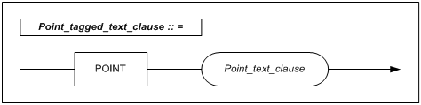
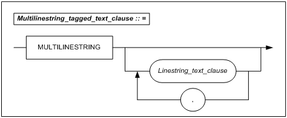
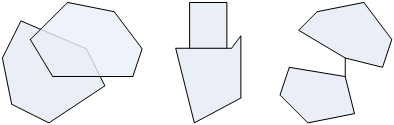
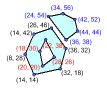
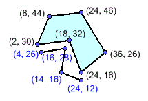
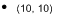
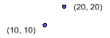
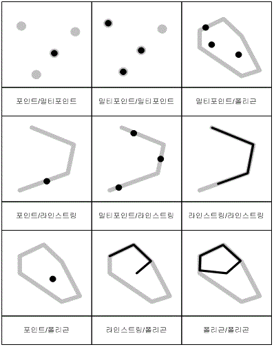

# 2.공간 질의어

본 장에서는 Altibase에서 지원하는 공간 데이터에 대한 데이터 타입, 공간 질의어,
공간 함수 및 연산자 등에 대하여 설명한다.

Altibase에서 제공하는 Spatial SQL은 ISO SQL/MM 공간 표준 규격과 GIS
국제표준단체인 Open Geospatial Consortium(OGC)의 “Simple Features Specification
for SQL” 규격을 준수한다.

‘Simple Features Specification for SQL”은 표준 SQL을 확장하였기 때문에 사용자는
기존의 SQL 사용 방식과 유사하게 공간 질의어를 사용할 수 있다.

### GEOMETRY 데이터 타입 

Spatial SQL을 사용하여 데이터베이스에 공간 데이터를 조작하기 위해서는 공간
데이터 타입에 대한 이해가 필요하다. 이 절에서는 공간 데이터 타입에 대하여
설명한다.

공간 데이터 타입을 SQL 형식으로 정의할 때 현재 지원되는 타입은 GEOMETRY 이다.
GEOMETRY 타입은 내부적으로 다음과 같은 7가지 서브 타입을 갖는다.

-   POINT

-   LINESTRING

-   POLYGON

-   MULTIPOINT

-   MULTILINESTRING

-   MULTIPOLYGON

-   GEOMETRYCOLLECTION

다음 그림은 GEOMETRY 데이터 타입과 GEOMETRY 데이터 타입을 구성하는 7가지 서브
타입들간의 관계를 표현한 것이다.


[그림 2‑1] GEOMETRY 데이터 타입 관계

아래는 7가지 서브 타입에 대한 설명이다.

-   POINT: 공간상의 한 점을 X, Y 좌표 값을 이용하여 표현

-   LINESTRING: 2개 이상의 POINT로 구성  
    LINESTRING 은 닫힘 여부(끝 두 점이 같은 점인지 여부)에 따라서 닫히지 않은
    LINE과 닫혀진 LINEARRING으로 나뉜다. LINE과 LINEARRING은 공간 객체의 형태를
    표현하는 용어로서 별도의 타입을 의미하지는 않는다.

-   POLYGON: 1개 이상의 LINEARRING으로 구성

-   MULTIPOINT: 1개 이상의 POINT로 구성되는 MULTIPOINT

-   MULTILINESTRING: 1개 이상의 LINESTRING으로 구성

-   MULTIPOLYGON: 1개 이상의 POLYGON으로 구성

-   GEOMETRYCOLLECTION: 앞서 설명한 공간 객체들의 조합

위에서 기술한 7가지 서브 타입 외에 내부적으로 EMPTY 타입을 추가적으로 지원한다.
EMPTY 타입은 공간 객체들간의 연산에 의해서만 생성되는 타입이다. 연산의 결과로
GEOMETRY 타입을 반환하는 연산자의 경우 결과가 없을 때 EMPTY 타입의 공간 객체를
반환한다.

#### 서브 타입의 분류 기준

다음 [표 2-1]은 GEOMETRY 데이터 타입의 7가지 서브 타입을 구분하는 분류 기준에
대하여 설명한다.

| 서브 타입      | 구성 요소                                        | 차원       | 심플?          | 클로즈드? | 내부                  | 경계                                                     | 외부 |
| -------------- | ------------------------------------------------ | ---------- | -------------- | --------- | --------------------- | -------------------------------------------------------- | ---- |
| 포인트         | 1개의 점                                         | 0          | O              | X         | 점                    | Ø<sup>1</sup>                                            | 면   |
| 라인스트링     | 2개 이상의 점                                    | 1          | \*<sup>2</sup> | \*        | 선분                  | 클로즈드인 경우엔 Ø, 아닌 경우엔 양 끝점                 | 면   |
| 폴리곤         | 1개 이상의 심플하며 클로즈드한 LineString        | 2          | O<sup>3</sup>  | O         | 면                    | 내부 링과 외부 링을 구성하는 LineString                  | 면   |
| 멀티포인트     | 1개 이상의 점                                    | 0          | \*             | X         | 점                    | Ø                                                        | 면   |
| 멀티라인스트링 | 1개 이상의 LineString                            | 1          | \*             | \*        | 선분                  | 클로즈드한 경우엔 Ø, 아닌 경우엔 양 끝점                 | 면   |
| 멀티폴리곤     | 1개 이상의 Polygon                               | 2          | O              | O         | 면                    | 모든 공간 객체의 내부 링과 외부 링을 구성하는 LineString | 면   |
| 공간객체콜렉션 | GeometryCollection을 제외한 2개 이상의 공간 객체 | 최대 2차원 | \*             | \*        | 모든 공간 객체의 내부 | 모든 공간 객체의 경계                                    | 면   |

[<sup>1</sup>] 결과의 값이 없는 공집합을 가리키는 기호이다.

[<sup>2</sup>] 이 기호는 결과가 조건을 만족할 수도 그렇지 않을 수도 있다는 것을 의미한다.

[<sup>3</sup>] 심플하지 않은 Polygon의 경우 타입의 정의에 위배되어 삽입될 수 없다.

[표 2‑1] Geometry 데이터 타입의 서브 타입

#### POINT

##### 구문




​                                                       POINT( x y )

​                                                       x : x 좌표 값

​                                                       y : y 좌표 값

##### 설명

좌표 공간에서 한 점의 위치를 표현한다. 포인트는 1개의 점을 요소로 갖는 0차원의
공간 객체로서 심플 (Simple) 하며 클로즈드 (Closed)하지 않다. 공간 객체의 내부는
점 자신이며, 경계 (Boundary)는 없고 외부는 점을 제외한 면이다.

##### 특징

한 점은 x－좌표값과 y－좌표값을 가진다.

##### 예제

```
CREATE TABLE building ( id INTEGER, obj GEOMETRY ) ;
INSERT INTO building VALUES (1, GEOMETRY'POINT( 10 10 ) ') ;
INSERT INTO building VALUES (2, GEOMFROMTEXT('POINT(20 20)'));
INSERT INTO building VALUES (3, POINTFROMTEXT('POINT( 100 100 )')) ;
INSERT INTO building VALUES (4, GEOMETRY'POINT EMPTY');
INSERT INTO building VALUES (5, GEOMFROMTEXT('POINT EMPTY'));
INSERT INTO building VALUES (6, POINTFROMTEXT('POINT EMPTY'));
```

#### MULTIPOINT

##### 구문


​                                                                         MULTIPOINT(x1 y1 [, xn yn ])

​                                                                          x<sub>n</sub> : x 좌표의 n번 째 값

​                                                                          y<sub>n</sub> : y 좌표의 n번 째 값

##### 설명

1개 이상의 점을 요소로 갖는 0차원의 공간 객체로서 클로즈드하지 않다. 공간 객체의
내부는 멀티포인트를 구성하는 점이며, 경계는 없고 외부는 점을 제외한 면이다.

##### 특징

멀티포인트의 두 점이 동일한 좌표 값을 갖지 않으면 심플하다고 한다.

##### 제약 조건

멀티포인트의 요소는 점으로 제한되며, 이 점들은 연결되거나 순서를 갖지 않는다.

##### 예제

```
CREATE TABLE building ( id INTEGER, obj GEOMETRY ) ;
INSERT INTO building VALUES (1, GEOMETRY'MULTIPOINT( 10 10, 20 20 )') ;
INSERT INTO building VALUES (2, GEOMFROMTEXT('MULTIPOINT( 10 20, 20 30 ) ')) ;
INSERT INTO building VALUES (3, MPOINTFROMTEXT('MULTIPOINT( 100 100, 150 150 )')) ;
INSERT INTO building VALUES (4, GEOMETRY'MULTIPOINT EMPTY');
INSERT INTO building VALUES (5, GEOMFROMTEXT('MULTIPOINT EMPTY'));
INSERT INTO building VALUES (6, MPOINTFROMTEXT('MULTIPOINT EMPTY'));
```

#### LINESTRING

다음은 라인스트링 객체를 텍스트 형식으로 표현한 것이다.

##### 구문


​                                                           LINESTRING( x1 y1 , x2 y2 [, xn yn ])

​                                                            x<sub>n</sub> : x 좌표의 n번 째 값

​                                                            y<sub>n</sub> : y 좌표의 n번 째 값

##### 설명

라인스트링은 2개 이상의 점을 요소로 가지며 서로 직선으로 연결된 1차원의 공간
객체이다. 공간 객체의 내부는 라인스트링 자신인 선분이며, 외부는 선분을 제외한
면이다. 경계는 선분이 클로즈드한 경우에는 없고, 그렇지 않다면 양 끝점이다.

##### 특징

클로즈드하고 심플한 라인스트링을 선형링 (LinearRing)이라 한다.

다음 [그림 2-2]에서 라인스트링(3)은 클로즈드하고 심플한 선형링이며,
라인스트링(4)은 클로즈드하지만 심플하지 않은 라인스트링으로 선형링이 아니다.


[그림 2‑2] 라인스트링의 예

##### 예제

```
CREATE TABLE road ( id INTEGER, obj GEOMETRY ) ;
INSERT INTO road VALUES (1, GEOMETRY'LINESTRING( 0 18, 10 21, 16 23, 28 26, 44 31 )') ;
```


```
INSERT INTO road VALUES (2, GEOMFROMTEXT('LINESTRING( 30 31, 56 34, 70 24 )')) ;
```


```
INSERT INTO road VALUES (3, LINEFROMTEXT('LINESTRING( 70 38, 32 12, 36 36 )')) ;
```


```
INSERT INTO road VALUES (4, GEOMETRY'LINESTRING EMPTY');
INSERT INTO road VALUES (5, GEOMFROMTEXT('LINESTRING EMPTY'));
INSERT INTO road VALUES (6, LINEFROMTEXT('LINESTRING EMPTY'));
```

#### MULTILINESTRING

##### 구문



​                                           MULTILINESTRING( (x1 y1, x2 y2 [, xn yn ] ) [, (x1 y1, x2 y2 [, xn yn ] ) ] )

​                                            x<sub>n</sub> : x 좌표의 n번 째 값

​                                             y<sub>n</sub> : y 좌표의 n번 째 값

##### 설명

멀티라인스트링은 1개 이상의 라인스트링을 요소로 갖는 1차원의 공간 객체이다. 공간
객체의 내부는 멀티라인스트링을 구성하는 선분이며, 외부는 라인스트링을 제외한
면이다. 경계는 라인스트링이 클로즈드한 경우에는 없고, 그렇지 않다면 양 끝점이다.

##### 특징

멀티라인스트링의 모든 요소가 클로즈드하면, 그 멀티라인스트링도 클로즈드하며,
이것의 경계는 없다. (그림 2-3의 (3))

다음 [그림2-3]에서 멀티라인스트링에 대한 경계는 (1)은 {s1, e2}, (2)는 {s1, e1},
(3)은 ϕ이다.


[그림 2‑3] 멀티라인스트링의 예

##### 예제

```
CREATE TABLE road ( id INTEGER, obj GEOMETRY ) ;
INSERT INTO road VALUES (1, GEOMETRY'MULTILINESTRING(( 10 48, 10 21, 10 0 ), (16 0, 16 23, 16 48) )') ;
```


```
INSERT INTO road VALUES (2, GEOMFROMTEXT('MULTILINESTRING(( 38 48, 44 41, 41 36, 44 31, 52 18 ), ( 60 10, 58 30, 52 36))')) ;
```


```
INSERT INTO road VALUES (3, MLINEFROMTEXT('MULTILINESTRING(( 14 24, 28 28, 34 36 ), ( 56 38, 48 36, 56 16, 68 24 ))')) ;
```


```
INSERT INTO road VALUES (4, GEOMETRY'MULTILINESTRING EMPTY');
INSERT INTO road VALUES (5, GEOMFROMTEXT('MULTILINESTRING EMPTY'));
INSERT INTO road VALUES (6, MLINEFROMTEXT('MULTILINESTRING EMPTY'));
```

#### POLYGON

다음은 POLYGON 객체를 텍스트 형식으로 표현한 것이다.

##### 구문


​                                                            POLYGON( (x1 y1, x2 y2, x3 y3 [, xn yn ])[, (x1 y1, x2 y2, x3 y3 [, xn yn ] ) ]  )

​                                                            x<sub>n</sub> : x 좌표의 n번 째 값

​                                                             y<sub>n</sub> : y 좌표의 n번 째 값

##### 설명

공간상의 면을 표현하는 공간 객체이다. 폴리곤은 1개 이상의 심플하며 클로즈드한
라인스트링을 요소로 갖는 2차원의 공간 객체로서 반드시 심플하고 클로즈드하여야
한다. 공간 객체의 내부는 폴리곤이 이루는 면이며, 외부는 폴리곤의 내부를 제외한
면이다. 경계는 폴리곤을 구성하는 라인스트링이다. 예를 들어, 외부링과 내부링으로
구성된 폴리곤의 경우, 경계는 각 라인스트링이다.

##### 특징

-   폴리곤은 1개의 외부 경계와 0 또는 그 이상의 내부 경계로 정의되는 표면이다.

-   폴리곤은 클로즈드하고 심플한 공간 객체다.

-   폴리곤의 경계는 내부와 외부 경계에 해당하는 선형링 (LinearRing)이다.

다음 [그림 2-4]는 적합한 폴리곤의 예이다.


[그림 2‑4] 폴리곤의 예

##### 제약조건

폴리곤의 경계를 이루는 두 링(라인스트링)은 교차할 수 없으며, 폴리곤의 경계인
링은 접선(tangent)으로 만날 수도 없다. 오직 두 링을 구성하는 한 점에서만 만날 수
있다.

```
∀ P ∈ Polygon, ∀ c1, c2 ∈ P.Boundary(), c1 ≠ c2, ∀p, q ∈ Point,
p, q ∈ c1, p ≠ q, [p ∈ c2 ⇒ q ∈ c2]
```

폴리곤의 내부링과 폴리곤의 외부는 연결되어서는 안된다.

폴리곤은 튀어나온 선분을 요소로 가지지 못하며, 점은 따로 떨어져서 존재할 수
없다.

```
∀ P ∈ Polygon, P = Closure(Interior(P))
```

폴리곤의 내부는 서로 연결되어 있는 하나의 면(Surface)이어야 한다.

다음 [그림 2-5]는 위의 제약조건을 만족하지 못하여 폴리곤으로 표현될 수 없는
객체를 보여준다.


[그림 2‑5] 폴리곤으로 표현될 수 없는 공간 객체의 예

##### 예제

```
CREATE TABLE lake ( id INTEGER, obj GEOMETRY ) ;
INSERT INTO lake VALUES (1, GEOMETRY'POLYGON(( 14 42, 18 18, 36 12, 58 24, 34 24, 36 44, 24 56, 14 42 ))') ;
```


```
INSERT INTO lake VALUES (2, GEOMFROMTEXT('POLYGON(( 14 42, 18 18, 36 12, 58 24, 34 24, 36 44, 24 56, 14 42 ), ( 20 39, 28 27, 30 35, 28 41, 22 45, 20 39 ))')) ;
```


```
INSERT INTO lake VALUES (3, POLYFROMTEXT('POLYGON(( 8 6, 22 4, 38 14, 34 36, 22 46, 17 44, 22 28, 16 22, 8 28, 2 27, 4 26, 8 6 ))')) ;
```


```
INSERT INTO lake VALUES (4, GEOMETRY'POLYGON EMPTY');
INSERT INTO lake VALUES (5, GEOMFROMTEXT('POLYGON EMPTY'));
INSERT INTO lake VALUES (6, POLYFROMTEXT('POLYGON EMPTY'));
```

#### MULTIPOLYGON

##### 구문


​                                        MULTIPOLYGON( ( (x1 y1, x2 y2, x3 y3 [, xn yn ]) [, (x1 y1, x2 y2, x3 y3 [, xn
​                                         yn ] ) ] ) [ ( (x1 y1, x2 y2, x3 y3 [, xn yn ]) [, (x1 y1, x2 y2, x3 y3 [, xn yn
​                                         ] ) ] ) ] ) )

##### 설명

멀티폴리곤은 폴리곤들을 요소로 가지는 다중 객체이다. 멀티폴리곤은 1개 이상의
폴리곤을 요소로 갖는 2차원의 공간 객체로서 심플하고 클로즈드하다. 공간 객체의
내부는 멀티폴리곤이 이루는 면이며, 외부는 폴리곤을 제외한 면이다. 그리고 경계는
멀티폴리곤을 구성하는 각 라인스트링이다. 예를 들어, 외부링과 내부링으로 구성된
멀티폴리곤의 경우, 각 라인스트링이 경계이다.

##### 특징

-   멀티폴리곤은 클로즈드하고 심플한 공간 객체이다.

-   멀티폴리곤의 경계는 라인스트링의 집합이다.

다음 [그림 2-6]은 멀티폴리곤에 대한 예를 보여준다. 세 번째 멀티폴리곤은 외부
폴리곤과 내부 폴리곤으로 구성된 것이 아니라, 하나가 다른 하나의 위쪽에 있는 두
개의 폴리곤으로 구성되어 있다.


[그림 2‑6] 멀티폴리곤의 예

##### 제약 조건

멀티폴리곤을 구성하는 2개 폴리곤의 내부의 교집합은 공집합이다.

```
∀ M ∈ MultiPolygon, ∀ Pi, Pj ∈ M.Geometries(), i≠ j, Interior(Pi) ∩ Interior(Pj) = Ø
```

멀티폴리곤의 경계인 2개의 링은 점으로만 접촉할 수 있고, 접촉한 점은 각 폴리곤의
구성하는 점이어야 한다.

```
∀ M ∈ MultiPolygon, ∀ Pi, Pj ∈ M.Geometries(), ∀ ci ∈ Pi.Boundaries(), cj ∈ Pj.Boundaries() ,ci ∩ cj = {p1, ....., pk │ pi ∈ Point, 1 <= i <= k}
```

멀티폴리곤은 튀어나온 선분은 요소로 가지지 못하며, 점은 따로 떨어져서 존재할 수
없다.

```
∀ M ∈ MultiPolygon, M = Closure(Interior(M))
```

다음 [그림 2-7]은 위의 제약조건을 만족하지 못하여 멀티폴리곤으로 표현될 수 없는
예를 보여준다.



[그림 2‑7] 멀티폴리곤으로 표현될 수 없는 공간 객체의 예

##### 예제

```
CREATE TABLE lake ( id INTEGER, obj GEOMETRY ) ;
INSERT INTO lake VALUES (1, GEOMETRY'MULTIPOLYGON(((8 6, 22 4, 38 14, 34 36, 22 46, 17 44, 22 28, 16 22, 8 28, 2 27, 4 26, 8 6 )), (( 4 35, 8 31, 14 41, 14 53, 10 55, 8 45, 4 43, 4 35 )))') ;
```


```
INSERT INTO lake VALUES (2, GEOMFROMTEXT('MULTIPOLYGON((( 8 28, 14 14, 32 18, 36 32, 26 46, 14 42, 8 28 ), ( 18 30, 20 20, 28 26, 22 38, 18 30 )), (( 24 54, 36 38, 44 44, 42 52, 34 56, 24 54 )))')) ;
```



```
INSERT INTO lake VALUES (3, MPOLYFROMTEXT('MULTIPOLYGON((( 8 34, 6 12, 26 6, 34 26, 16 26, 8 34 )), (( 8 35, 22 36, 34 27, 38 36, 24 48, 8 35 )))')) ;
```


```
INSERT INTO lake VALUES (4, GEOMETRY'MULTIPOLYGON EMPTY');
INSERT INTO lake VALUES (5, GEOMFROMTEXT('MULTIPOLYGON EMPTY'));
INSERT INTO lake VALUES (6, MPOLYFROMTEXT('MULTIPOLYGON EMPTY'));
```

#### GEOMETRYCOLLECTION

##### 구문


​                                         GEOMETRYCOLLECTION( Point \| LineString \| Polygon \| MultiPoint \|
​                                         MultiLineString \| MultiPolygon, [Point \| LineString \| Polygon \| MultiPoint
​                                         | MultiLineString \| MultiPolygon ] )

-   Point : Point type 객체

-   LineString : LineString type 객체

-   Polygon : Polygon type 객체

-   MultiPoint : MultiPoint type 객체

-   MultiLineString : MultiLineString type 객체

-   MultiPolygon : MultiPolygon type 객체

##### 설명

공간객체콜렉션은 하나 또는 그 이상의 공간 객체의 집합으로 이루어진 공간
객체이다. 공간 객체 콜렉션은 공간객체콜렉션을 제외한 2개 이상의 공간 객체를
요소로 갖는 최대 2차원의 공간 객체이며, 공간 객체의 내부는 구성하는 모든
공간객체의 내부이며, 경계는 구성하는 모든 공간객체의 경계이며, 외부는 공간
객체를 제외한 면이다.

##### 제약 조건

공간객체콜렉션을 구성하는 각 공간 객체의 제약조건을 따른다.

##### 예제

```
CREATE TABLE test1 ( id INTEGER, obj GEOMETRY ) ;
INSERT INTO test1 VALUES (1, GEOMETRY'GEOMETRYCOLLECTION( POINT( 6 16 ), LINESTRING( 4 26, 16 28, 14 16, 24 12 ))') ;
```


```
INSERT INTO test1 VALUES (2, GEOMFROMTEXT('GEOMETRYCOLLECTION( LINESTRING( 4 26, 16 28, 14 16, 24 12 ), POLYGON(( 2 30, 18 32, 24 16, 36 26, 24 46, 8 44, 2 30 )))')) ;
```



```
INSERT INTO test1 VALUES (3, GEOMCOLLFROMTEXT ('GEOMETRYCOLLECTION (POINT( 6 22 ), LINESTRING( 4 54, 4 38, 8 28, 10 16, 18 8, 28 4 ), POLYGON(( 8 44, 12 32, 16 16, 24 12, 34 16, 32 34, 26 44, 16 54, 8 44 ), ( 16 38, 20 30, 22 20, 28 22, 26 32, 20 42, 16 38 )))')) ;
```


```
INSERT INTO test1 VALUES (4, GEOMETRY'GEOMETRYCOLLECTION EMPTY');
INSERT INTO test1 VALUES (5, GEOMFROMTEXT('GEOMETRYCOLLECTION EMPTY'));
INSERT INTO test1 VALUES (6, GEOMCOLLFROMTEXT('GEOMETRYCOLLECTION EMPTY'));
```

### GEOMETRY 표현 형식

GEOMETRY 데이터 타입을 표현하기 위하여 Altibase는 5가지 방법을 제공한다.

-   WKT(Well-Known Text) 형식: 공간 객체를 문자와 숫자로 표현하여 SQL등에서 직접
    사용될 수 있는 텍스트 형식이다. 문법이 간결하고 읽기 쉽도록 디자인 되어
    있다.

-   WKB(Well-Known Binary) 형식: 공간 객체를 이진형태로 표현한 것으로 GEOMETRY
    데이터 전송 및 연산에 효율적으로 디자인되어 있다.
   
-   EWKT(Extended Well-Known Text) 형식: WKT 형식에 공간 객체를 표현하는 SRID(Spatial Reference Identifier) 정보가 추가된 것이다.

-   EWKB(Extended Well-Known Binary) 형식: WKB 형식에 공간 객체를 표현하는 SRID(Spatial Reference Identifier) 정보가 추가된 것이다.

-   내부 이진 형식: Altibase 내부에 저장되는 이진 형태로서 내부관리 및 공간
    연산에 효율적으로 디자인되어 있으며, C-API를 이용하여 조작할 수 있다. 제
    3장에서 C-API에 대하여 설명한다.

#### WKT (Well-Known Text) 

WKT(Well-known Text)는 공간 객체를 문자와 숫자로 표현하기 위한 형식이다.  WKT 형식으로 공간 객체를 표현하는 경우, 객체의 SRID는 0으로 간주된다. WKT는
다음과 같은 BNF(Backus Naur Form) 형태로 정의된다.

```
<Geometry Tagged Text> : =
<Point Tagged Text>
｜ <LineString Tagged Test>
｜ <Polygon Tagged Test>
｜ <MultiPoint Tagged Test>
｜ <MultiLineString Tagged Test>
｜ <MultiPolygon Tagged Test>
｜ <GeometryCollection Tagged Test>
<Point Tagged Test> : = POINT <Point Text>
<LineString Tagged Text> : = LINESTRING <LineString Test>
<Polygon Tagged Text> := POLYGON <Polygon Text>
<Multipoint Tagged Text> : = MULTIPOINT (Multipoint Text>
<MultiLineString Tagged Text> : = MULTILINESTRING (MultiLineString Text>
<MultiPolygon Tagged Text> : = MULTIPOLYGON <MultiPolygon Text>
<GeometryCollection Tagged Test> : = GEOMETRYCOLLECTION <GeometryCollection Text>
<Point Text> : = ( <Point> )
<Point> : = <x> <y>
<x> : = double precision literal
<y> : = double precision literal
<LineString Text> : = ( <Point > {, <Point > }＊)
<Polygon Text> : = ( <LineString Text > {, < LineString Text > }＊)
<MultiPoint Text> : = ( <Point Text > {, <Point Text > }＊)
<MultiLineString Text> : = ( <LineString Test > {, < LineString Text > }＊)
<MultiPolygon Text> : = ( < Polygon Text > {, < Polygon Text > }＊)
<GeometryCollection Text> : = ( <Geometry Tagged Text > {, <Geometry Tagged Text> }＊)
```

| 형식               | WKT 표현                                                                                 | 설명                                              |
|--------------------|------------------------------------------------------------------------------------------|---------------------------------------------------|
| Point              | POINT (10 10)                                                                            | 한 점                                             |
| LineString         | LINESTRING (10 10, 20 20, 30 40)                                                         | 3점을 갖는 라인스트링                             |
| Polygon            | POLYGON ( (10 10, 10 20, 20 20, 20 15, 10 10) )                                          | 1개의 외부링과 0개의 내부링으로 된 폴리곤         |
| MultiPoint         | MULTIPOINT (10 10, 20 20)                                                                | 2점을 갖는 멀티포인트                             |
| MultiLineString    | MULTILINESTRING ((10 10, 20 20), (15 15, 30 15))                                         | 2개의 라인스트링을 갖는 멀티라인스트링            |
| MultiPolygon       | \`MULTIPOLYGON (((10 10, 10 20, 20 20, 20 15, 10 10)), ((60 60, 70 70, 80 60, 60 60 ) )) | 2개의 폴리곤을 갖는 멀티폴리곤                    |
| GeometryCollection | \`GEOMETRYCOLLECTION ( POINT (10 10), POINT (30 30), LINESTRING (15 15, 20 20))          | 2점과 하나의 라인스트링으로 구성된 공간 객체 모음 |

##### 예제

다음은 예제는 WKT 표현 형식의 공간 데이터를 좌표 평면에 표현한 것이다.

- Point

  

- LineString

  

- Polygon

  

- MultiPoint

  

- MultiLineString

  

- MultiPolygon

  

- GeometryCollection

  

#### WKB (Well-Known Binary)

WKB(Well-Known Binary)는 공간 객체를 이진 형태로 표현하기 위한 형식이다. WKB 형식으로 공간 객체를 표현하는 경우, 객체의 SRID는 0으로 간주된다.

OGC 표준에서 권고하는 이진 형태이며, 서로 다른 공간 DBMS간의 데이터 호환을
위하여 사용한다.

공간 객체의 WKB 형식은 unsigned int와 double타입 데이터로 구성되는 숫자들로 공간
객체를 표현하고, 바이트 순서(Endian)는 이진법 표준들(NDR, XDR) 중 하나를 따른다.

XDR (External Data Representation)은 Big Endian이고 NDR (Network Data
Representation)은 Little Endian이다. Unsigned Integer는 32비트 데이터 타입으로
범위[0, 4294967295] 안에서 양의 정수로 사용한다. Double은 64비트 double
precision 데이터 타입으로 IEEE 754 double precision 포맷을 사용하여, double
precision 숫자로 표현한다.

공간 객체에 대한 WKB 표현은 아래에 서술되어 있다. 기본 타입은 점(Point)으로 두
개의 double형 숫자로 표현된다. 다른 공간 객체들에 대한 표현은 점(Point) 또는
점(Point)을 사용하여 정의된 다른 공간 객체의 표현들을 사용하여 구성한다.

```
/ / Basic Type definitions
/ / byte : 1 byte
/ / unit32 : 32 bit unsigned integer (4 bytes)
/ / double : double precision number (8 bytes)
/ / Building Blocks : Point, LinearRing

Point {
double x ;
double y ;
} ;

LinearRing {
unit32 numPoints ;
Point points{numPoints} ;
}

enum wkbGeometryType {
wkbPoint = 1,
wkbLineString = 2,
wkbPolygon = 3,
wkbMultiPoint = 4,
wkbMultiLineString = 5,
wkbMultiPolygon = 6,
wkbGeometryCollection = 7
} ;

enum wkbByteorder {
wkbXDR = 0 ;	/ / Big Endian
wkbNDR = 1 ;	/ / Little Endian
} ;

WKBPoint {
byte byteOrder ;
unit32 wkbType ; 		/ / 1
Point point ;
}
WKBLineString {
byte byteOrder ;
unit32 wkbType ; 		/ / 2
unit32 numPoints ;
Point points{numPoints} ;
}

WKBPolygon {
byte byteOrder ;
unit32 wkbType ; 		/ / 3
unit32 numRings ;
LinearRing rings{numRings} ;
}

WKBMultiPoint {
byte byteOrder ;
unit32 wkbType ; 		/ / 4
unit32 num_wkbPoints ;
WKBPoint WKBpoints{num_wkbPoints} ;
}

WKBMultiLineString {
byte byteOrder ;
unit32 wkbType ; 		/ / 5
unit32 num_wkbLineStrings ;
WKBLineString WKBLineStrings{num_wkbLineStrings} ;
}

WKBMultiPolygon {
byte byteOrder ;
unit32 wkbType ; 		/ / 6
unit32 num_wkbPolygons ;
WKBPolygon wkbPolygons{num_wkbPolygons} ;
}

WKBGeometry {
union {
WKBPoint point ;
WKBLineString linestring ;
WKBPolygon polygon ;
WKBGeometryCollection collection ;
WKBMultiPoint mpoint ;
WKBMultiLineString mlinestring ;
WKBMultiPolygon mpolygon ;
}
} ;

WKBGeometryCollection {
byte byte_order ;
unit32 wkbType ; 		/ / 7
unit32 num_wkbGeometries ;
WKBGeometry wkbGeometries{num_wkbGeometries} ;
} ;
```


[그림 2‑8] WKB 구조 예

위의 예제에서 바이트 순서로 Little Endian(NDR)을 사용하며, 1개의 외부 링과 1개의
내부 링을 가진 폴리곤을 표현한다. 외부링과 내부링은 각각 3개의 포인트로
구성된다.


#### EWKT (Extended Well-Known Text)

EWKT는 WKT 형식에 추가적으로 SRID 정보를 표기한 것이다. SRID 정보의 표기를 제외하면 표기법은 WKT 형식과 동일하다. EWKT 형식은 OpenGIS 표준안이 아니며, EWKT 형식을 사용해 기술한 공간 데이터의 예시는 다음과 같다.

| 형식               | EWKT 표현 | SRID                                                                                 | 설명                                              |
|--------------------|------------------------------------------------------------------------------------------|-------|--------------------------------------------|
| Point              | SRID=4326;POINT(10 10)                                                                            | 4326 | 한 점; SRID는 4326                                             |
| LineString         | SRID=100;LINESTRING(10 10, 20 20, 30 40)                                                         | 100 | 3점을 갖는 라인스트링; SRID는 100                             |
| Polygon            | SRID=-999;POLYGON( (10 10, 10 20, 20 20, 20 15, 10 10) )                                          | -999 | 1개의 외부링과 0개의 내부링으로 된 폴리곤; SRID는 -999          |
| MultiPoint         | SRID=0;MULTIPOINT(10 10, 20 20)                                                                | 0 | 2점을 갖는 멀티포인트; SRID는 0     |

#### EWKB (Extended Well-Known Binary)

EWKB는 WKB 형식에 추가적으로 SRID 정보를 표기한 것이다. SRID 정보의 표기를 제외하면 표기법은 WKB 형식과 동일하다. 
EWKB 형식은 OpenGIS 표준안이 아니다. EWKB 형식의 표기방법은 WKB 형식과 거의 같으나, 바이트 순서(1바이트; NDR, XDR 중 하나)와 GEOMETRY 데이터 타입(4바이트; POINT, MULTIPOINT 등)을 표기한 이후 4바이트 크기의 SRID를 표기한다는 점에 차이가 있다. SRID 표기 이후에는 WKB 형식과 마찬가지로 객체 정보를 이진 형태로 표기한다.

### 데이터 정의어

이 절에서는 데이터베이스 오브젝트를 생성하기 위해서 사용하는 SQL DDL 문장의
문법과 특징을 사용 예제를 들어서 설명하고 있다. 본 절에서 설명하는 내용은
GEOMETRY 데이터 타입에 관련된 부분만을 설명한다. 보다 자세한 문법 및 특징은 *SQL
Reference* 을 참조한다.

#### 테이블 생성

##### 구문

```
CREATE TABLE table_name (
    column_name GEOMETRY [(precision)] [(SRID srid)]);
```

##### 설명

*precision* 생성될 칼럼의 최대 크기(Bytes 단위)를 명시한다. 최소 16Bytes, 최대
100MBytes까지 지정할 수 있으며, 명시하지 않을 경우 기본값으로 32,000 Bytes을
갖는다. 저장 공간이 precision보다 큰 공간객체 데이터는 삽입할 수 없다.

srid 생성될 칼럼의 SRID를 명시한다. 4바이트의 signed integer를 사용할 수 있으며, 지정하지 않으면 기본값 0이 된다.

CREATE TABLE 구문에 대한 자세한 설명은 *SQL Reference* 을 참조하기 바란다.

> ##### 주의 사항
>
> GEOMETRY Column은 다음의 제약 사항을 갖는다.
>
> -   PRIMARY KEY로 사용할 수 없다
>
> -   UNIQUE constraint를 지정할 수 없다.
>

##### 예제

칼럼 id와 GEOMETRY 칼럼 obj를 갖는 테이블을 생성한다.

```
iSQL> CREATE TABLE t1 ( id INTEGER, obj GEOMETRY ) ;
Create success.
```

칼럼 id와 최대 128 Bytes의 크기를 갖는 GEOMETRY 칼럼 obj를 갖는 테이블을
생성한다.

```
iSQL> CREATE TABLE t2 ( id INTEGER, obj GEOMETRY (128) ) ;
Create success.
```

정수형 칼럼 id와 SRID 100을 갖는 GEOMETRY 칼럼 obj를 갖는 테이블을 생성한다.

```
iSQL> CREATE TABLE t3 ( id INTEGER, obj GEOMETRY SRID 100) ;
Create success.
```

#### 인덱스 생성

##### 구문

```
CREATE INDEX index_name ON table_name ( column_name ) [INDEXTYPE IS RTREE];
```

##### 설명

칼럼의 타입이 GEOMETRY일 경우에는 INDEXTYPE을 명시하지 않아도 RTREE가 생성 된다.
BTREE를 명시하면, 에러가 발생한다.

CREATE INDEX 구문에 대한 자세한 설명은 *SQL Reference* 을 참조하기 바란다.

> ##### 주의 사항
>
> -   GEOMETRY Column을 인덱스 키로 지정할 경우 다음의 제약 사항을 갖는다.
>
> -   UNIQUE Option은 사용할 수 없다.
>
> -   GEOMETRY 칼럼을 포함한 복합키의 생성은 지원하지 않는다.
>
> -   RTREE 인덱스는 GEOMETRY 칼럼에만 생성된다.
>

##### 예제

t1 테이블에서 GEOMETRY 칼럼 obj에 대한 RTREE 인덱스 idx_t1를 생성한다.

```
iSQL> CREATE INDEX idx_t1 ON t1 ( obj ) ;
Create success.
```

t2 테이블에서 GEOMETRY 칼럼 obj에 대한 RTREE 인덱스 idx_t2를 생성한다.

```
iSQL> CREATE INDEX idx_t2 ON t2 ( obj ) INDEXTYPE IS RTREE ;
Create success.
```

t3 테이블에서 GEOMETRY 타입이 아닌 칼럼 id에 대한 RTREE 인덱스 idx_t3를
생성한다.

```
iSQL> CREATE INDEX idx_t3 ON t3 ( id ) INDEXTYPE IS RTREE ;
[ERR-31246 : cannot create index on the datatype.]
```

### 공간 함수

본 절에서는 Altibase에서 제공하는 공간 함수에 대하여 설명한다.

#### 공간 함수의 구성

Altibase에서 제공하는 공간 함수는 각 함수의 특징에 따라 다음과 같이 분류한다.

-   기본 함수  
    GEOMETRY의 특성과 기본 속성 등을 알아보기 위한 함수

-   공간 분석 함수  
    GEOMETRY 타입의 데이터를 이용한 각종 분석 작업을 수행하기 위한 함수

-   공간 객체 생성 함수  
    Altibase 내부 저장 형식이 아닌 WKT, WKB, EWKT, EWKB 형식을 이용하여 공간 객체를
    생성하는 함수

### 기본 함수

#### DIMENSION

##### 구문

```
DIMENSION( GEOMETRY )
```

##### 설명

어떤 공간 객체를 표현하기 위하여 필요한 최소 차원을 반환한다.

공간 객체가 EMPTY인 경우에는 -1을, 포인트 및 멀티포인트의 경우에는 0을 반환하며, 라인스트링 및 멀티라인스트링의 경우에는 1을, 폴리곤 및 멀티폴리곤인 경우에는 2를 반환한다.

여러 개의 서로 다른 타입의 공간객체를 요소로 갖는 공간객체콜렉션의 경우에는 각 요소들의 차원 중 가장 큰 차원 수를 반환한다.

ST_DIMENSION은 DIMENSION과 같은 함수이다.

##### 반환 타입

```
INTEGER
```

##### 예제

```
iSQL> SELECT F1, DIMENSION(F2) FROM TB1;
F1          DIMENSION(F2) 
-----------------------------
100                     
101         0           
102         0           
103         1           
104         1           
105         2           
106         2           
107         2           
108         1           
109         -1          
10 rows selected.
```

#### GEOMETRYTYPE

##### 구문

```
GEOMETRYTYPE( GEOMETRY )
```

##### 설명

GEOMETRY 객체의 서브 타입 이름을 반환한다.

서브 타입 이름은 문자열 형식으로 다음과 같다.

- NULL

- EMPTY<sup>4</sup>

  [<sup>4</sup>] 연산의 결과로서만 만들어질 수 있는 타입으로 사용자에 의해서는 만들어질 수 없다.

- POINT

- LINESTRING

- POLYGON

- MULTIPOINT

- MULTILINESTRING

- MULTIPOLYGON

- GEOMETRYCOLLECTION

ST_GEOMETRYTYPE은 GEOMETRYTYPE과 같은 함수이다.

##### 반환 타입

```
VARCHAR
```

##### 예제

```
iSQL> SELECT F1, GEOMETRYTYPE(F2) FROM TB1;
F1          GEOMETRYTYPE(F2)                  
-------------------------------------------------
100                                           
101         POINT                             
102         MULTIPOINT                        
103         LINESTRING                        
104         MULTILINESTRING                   
105         POLYGON                           
106         POLYGON                           
107         MULTIPOLYGON                      
108         GEOMETRYCOLLECTION                
109         EMPTY                             
10 rows selected.
```

#### ENVELOPE

##### 구문

```
ENVELOPE( GEOMETRY )
```

##### 설명

공간 객체에 대한 최소 경계 사각형(Minimum Boundary Rectangle: MBR)을 폴리곤 형태로 반환한다. 폴리곤은 경계 박스 (MINX, MINY), (MAXX, MINY), (MAXX, MAXY), (MINX, MAXY), (MINX, MINY)의 모서리 점에 의해 정의된다.

ST_ENVELOPE는 ENVELOPE와 같은 함수이다.

##### 반환 타입

```
GEOMETRY
```

##### 예제

```
iSQL> SELECT F1, ASTEXT(ENVELOPE(F2)) FROM TB1 WHERE GEOMETRYTYPE(F2) = 'POLYGON';
F1          
--------------
ASTEXT(ENVELOPE(F2)) 
---------------------------------------------------------------
105         
POLYGON((0 0, 0 10, 10 10, 10 0, 0 0))
106         
POLYGON((3 5, 3 9, 7 9, 7 5, 3 5))
2 rows selected.
```

#### ASTEXT

##### 구문

```
ASTEXT( GEOMETRY[,precision] ) 
```

##### 설명

공간 객체를 WKT(Well-Known Text) 표현 형태로 반환한다.

Precision을 이용하여 WKT의 최대길이를 제어할 수 있다. 기본값은 256 bytes이며, 최소 32, 최대 32000까지 사용할 수 있다.

ST_ASTEXT는 ASTEXT와 같은 함수이다.

##### 반환 타입

```
VARCHAR
```

##### 예제

```
iSQL> SELECT F1, ASTEXT(F2) FROM TB1;
F1          
--------------
ASTEXT(F2) 
100         
101         
POINT(1 1) 
102         
MULTIPOINT(1 1, 2 2) 
103         
LINESTRING(1 1, 2 2) 
104         
MULTILINESTRING((1 1, 2 2), (3 3, 4 5)) 
105         
POLYGON((0 0, 10 0, 10 10, 0 10, 0 0)) 
106         
POLYGON((3 5, 7 5, 7 9, 3 9, 3 5), (4 6, 4 8, 6 8, 6 6, 4 6))
107         
MULTIPOLYGON(((1 1, 2 1, 2 2, 1 2, 1 1)), ((3 3, 3 5, 5 5, 5 3, 3 3))) 
108         
GEOMETRYCOLLECTION( POINT(1 1) , LINESTRING(2 2, 3 3) ) 
109         
EMPTY 
10 rows selected.
```

#### ASBINARY

##### 구문

```
ASBINARY( GEOMETRY )
```

##### 설명

공간 객체를 WKB(Well-Known Binary) 표현 형태로 반환한다.

ST_ASBINARY는 ASBINARY와 같은 함수이다.

##### 반환 타입

```
BINARY
```

##### 예제<sup>5</sup>

[<sup>5</sup>] ASBINARY함수는 GEOMETRY를 binary 형식으로 반환하는 함수이므로 콘솔에서는 그 내용을 확인할 수 없어 WKT로 변환하는 ASTEXT함수를 이용하여 결과를 출력하였다.

```
iSQL> SELECT F1, ASTEXT(GEOMFROMWKB(ASBINARY(F2))) FROM TB1;
F1          
--------------
ASTEXT(GEOMFROMWKB(ASBINARY(F2))) 
100         

101         
POINT(1 1) 
102         
MULTIPOINT(1 1, 2 2) 
103         
LINESTRING(1 1, 2 2) 
104         
MULTILINESTRING((1 1, 2 2), (3 3, 4 5)) 
105         
POLYGON((0 0, 10 0, 10 10, 0 10, 0 0))
106         
POLYGON((3 5, 7 5, 7 9, 3 9, 3 5), (4 6, 4 8, 6 8, 6 6, 4 6))
107         
MULTIPOLYGON(((1 1, 2 1, 2 2, 1 2, 1 1)), ((3 3, 3 5, 5 5, 5 3, 3 3))) 
108         
GEOMETRYCOLLECTION( POINT(1 1) , LINESTRING(2 2, 3 3) ) 
109         

10 rows selected.
```

#### ASEWKT

##### 구문

```
ASEWKT( GEOMETRY[,precision] ) 
```

##### 설명

공간 객체를 EWKT(Extended Well-Known Text) 표현 형태로 반환한다.
Precision을 이용하여 WKT의 최대 길이를 제어할 수 있다. 기본값은 256 bytes이며, 최소 32, 최대 32000까지 사용할 수 있다.

ST_ASEWKT는 ASEWKT와 같은 함수이다.

##### 반환 타입

```
VARCHAR
```

##### 예제
```
iSQL> SELECT F1, ASEWKT(F2, 40) FROM TB1;
F1          ASEWKT(F2, 40)                            
---------------------------------------------------------
1           SRID=0;POINT(2 2)                         
2           SRID=100;POINT(2 2)                       
3           SRID=101;POINT(2 2)                       
4           SRID=102;POINT(2 2)                       
5           SRID=103;POINT(2 2)                       
5 rows selected.
```

#### ASEWKB

##### 구문

```
ASEWKB( GEOMETRY ) 
```

##### 설명

공간 객체를 EWKB(Extended Well-Known Binary) 표현 형태로 반환한다.

ST_ASEWKB는 ASEWKB와 같은 함수이다.

##### 반환 타입

```
BINARY
```

##### 예제
```
iSQL> SELECT F1, ASEWKT(GEOMFROMEWKB(ASEWKB(F2)), 40) FROM TB1;
F1          ASEWKT(GEOMFROMEWKB(ASEWKB(F2)), 40)      
---------------------------------------------------------
1           SRID=0;POINT(2 2)                         
2           SRID=100;POINT(2 2)                       
3           SRID=101;POINT(2 2)                       
4           SRID=102;POINT(2 2)                       
5           SRID=103;POINT(2 2)                       
5 rows selected.
```

#### ISEMPTY

##### 구문

```
ISEMPTY( GEOMETRY )
```

##### 설명

공간 객체가 좌표값을 갖지 않는 경우 1을 반환한다. 그렇지 않으면 0을 반환한다.

ST_ISEMPTY는 ISEMPTY와 같은 함수이다.

##### 반환 타입

```
INTEGER
```

##### 예제

```
iSQL> SELECT F1, ISEMPTY(F2) FROM TB1;
F1          ISEMPTY(F2) 
---------------------------
100                     
101         0           
102         0           
103         0           
104         0           
105         0           
106         0           
107         0           
108         0           
109         1           
10 rows selected.
```

#### ISSIMPLE

##### 구문

```
ISSIMPLE( GEOMETRY )
```

##### 설명

공간 객체가 교차점이나 접촉점과 같은 예외적인 점들을 갖지 않을 경우 1을 반환한다. 그렇지 않으면 0을 반환한다.

포인트, 폴리곤 및 멀티폴리곤은 항상 심플하다. 라인스트링은 선분이 서로 교차하지 않는 경우 심플하다. 멀티포인트는 구성 요소인 두 포인트가 동일한 좌표 값을 갖지 않는 경우 심플하다. 구성 요소인 모든 라인스트링이 심플하고 멀티라인스트링의 경계에 있는 점에서만 교차가 발생하는 멀티라인스트링은 심플하다.

ST_ISSIMPLE은 ISSIMPLE과 같은 함수이다.

##### 반환 타입

```
INTEGER
```

##### 예제

```
iSQL> SELECT F1, ISSIMPLE(F2) FROM TB1;
F1          ISSIMPLE(F2) 
----------------------------
100                     
101         1           
102         1           
103         1           
104         1           
105         1           
106         1           
107         1           
108         1           
109         1           
10 rows selected.
```

#### ISVALID

##### 구문

```
ISVALID( GEOMETRY )
```

##### 설명

어떤 GEOMETRY 객체가 유효한지 여부를 검사하는 함수이다.

공간 객체가 공간객체의 제약조건을 만족하면 1, 아니면 0이 반환된다.

유효하지 않은 객체를 DBMS에 삽입하는 것은 에러가 발생할 수도, 원하지 않는 결과를 가져올 수도 있으니 주의한다.

ST_ISVALID는 ISVALID와 같은 함수이다.

##### 반환 타입

```
INTEGER
```

##### 예제

```
iSQL> SELECT F1, ISVALID(F2) FROM TB1;
F1          ISVALID(F2) 
-----------------------------
100         1            
101         1          
102         1           
103         1           
104         1           
105         1           
106         1           
107         1           
108         1          
109         1          
10 rows selected.
```

#### ISVALIDHEADER

##### 구문

```
ISVALIDHEADER( GEOMETRY )
```

##### 설명

어떤 GEOMETRY 객체의 헤더 정보만 검사하여 객체가 유효한지 판단하는 함수이다.

공간 객체가 공간객체의 제약조건을 만족하면 1, 아니면 0이 반환된다.

유효하지 않은 객체를 DBMS에 삽입하는 것은 에러가 발생할 수도, 원하지 않는 결과를 가져올 수도 있으니 주의한다.

ST_ISVALIDHEADER는 ISVALIDHEADER와 같은 함수이다.

##### 반환 타입

```
INTEGER
```

##### 예제

```
iSQL> SELECT F1, ISVALIDHEADER(F2) FROM TB1;
F1          ISVALIDHEADER(F2) 
-----------------------------
100         1            
101         1          
102         1           
103         1           
104         1           
105         1           
106         1           
107         1           
108         1          
109         1          
10 rows selected.
```

#### BOUNDARY

##### 구문

```
BOUNDARY( GEOMETRY )
```

##### 설명

공간 객체의 경계를 반환한다.

포인트, 멀티포인트, 클로즈드한 라인스트링 또는 클로즈드한 멀티라인스트링이거나 EMPTY 객체인 경우에는 EMPTY를 반환한다. 하나 이상의 내부링을 가지고 있는 폴리곤이거나 멀티폴리곤의 경우에는 다중 객체를 반환한다.

ST_BOUNDARY는 BOUNDARY와 같은 함수이다.

##### 반환 타입

```
GEOMETRY
```

##### 예제

```
iSQL> SELECT F1, ASTEXT(BOUNDARY(F2)) FROM TB1;
F1          
--------------
ASTEXT(BOUNDARY(F2)) 
---------------------------------------------------------
100         

101         
EMPTY 
102         
EMPTY 
103         
MULTIPOINT(1 1, 2 2) 
104         
MULTIPOINT(1 1, 2 2, 3 3, 4 5)
105         
LINESTRING(0 0, 10 0, 10 10, 0 10, 0 0) 
106         
MULTILINESTRING((3 5, 7 5, 7 9, 3 9, 3 5), (4 6, 4 8, 6 8, 6 6, 4 6)) 
107         
MULTILINESTRING((1 1, 2 1, 2 2, 1 2, 1 1), (3 3, 3 5, 5 5, 5 3, 3 3)) 
108         
EMPTY 
109         
EMPTY 
10 rows selected.
```

#### X. COORDX

##### 구문

```
X( GEOMETRY )
or
COORDX( GEOMETRY )
```

##### 설명

GEOMETRY object의 subtype이 포인트일 경우 x좌표 값을 반환한다.

GEOMETRY가 포인트가 아닐 경우에는 에러를 출력한다.

ST_X, COORDX는 X와 같은 함수이다.

##### 반환 타입

```
DOUBLE
```

##### 예제

```
iSQL> SELECT F1, COORDX(F2) FROM TB1 WHERE GEOMETRYTYPE(F2) = 'POINT';
F1          COORDX(F2)             
--------------------------------------
101         1                      
1 row selected.

iSQL> SELECT F1, X(F2) FROM TB1;
F1          X(F2)                  
--------------------------------------
100                                
101         1                      
[ERR-A1019 : Not applicable object type]
2 rows selected.
```

#### Y, COORDY

##### 구문

```
Y( GEOMETRY )
or
COORDY( GEOMETRY )
```

##### 설명

GEOMETRY object의 subtype이 포인트일 경우 y좌표 값을 반환한다.

GEOMETRY가 포인트가 아닐 경우에는 에러를 출력한다.

ST_Y, COORDY는 Y와 같은 함수이다.

##### 반환 타입

```
DOUBLE
```

##### 예제

```
iSQL> SELECT F1, COORDY(F2) FROM TB1 WHERE GEOMETRYTYPE(F2) = 'POINT';
F1          COORDY(F2)             
--------------------------------------
101         1                      
1 row selected.

iSQL> SELECT F1, Y(F2) FROM TB1;
F1          Y(F2)                  
--------------------------------------
100                                
101         1                      
[ERR-A1019 : Not applicable object type]
2 rows selected.
```

#### MINX 

##### 구문

```
MINX( GEOMETRY )
```

##### 설명

최소경계다각형의 최소 X 좌표값을 반환한다. GEOMETRY객체가 포인트(POINT) 타입인 경우, 그 포인트의 X 좌표값을 반환한다.

참고) MINX, MINY, MAXX, MAXY 함수와 MIN, MAX 함수를 이용하여 질의 결과값의 최소경계다각형의 좌표값을 얻을 수 있다.

~~~
SELECT MIN(MINX(F2)), MIN(MINY(F2)), MAX(MAXX(F2)), MAX(MAXY(F2) FROM TB1;
~~~

ST_MINX는 MINX와 같은 함수이다.

##### 반환 타입

```
DOUBLE
```

##### 예제

```
iSQL> SELECT F1, MINX(F2) FROM TB1;
F1          MINX(F2) 
-----------------------------
100                     
101         1            
102         1            
103         1            
104         1            
105         0            
106         3            
107         1            
108         1            
109
10 rows selected.
```

#### MINY

##### 구문

```
MINY( GEOMETRY )
```

##### 설명

최소경계다각형의 최소 Y좌표값을 반환한다. GEOMETRY 객체가 포인트(POINT) 타입인 경우, 그 포인트의 Y좌표값을 반환한다.

ST_MINY는 MINY와 같은 함수이다.

##### 반환 타입

```
DOUBLE
```

##### 예제

```
iSQL> SELECT F1, MINY(F2) FROM TB1;
F1          MINY(F2) 
-----------------------------
100                     
101         1            
102         1            
103         1            
104         1            
105         0            
106         5            
107         1            
108         1            
109
10 rows selected.
```

#### MAXX

##### 구문

```
MAXX( GEOMETRY )
```

##### 설명

최소경계다각형의 최대 X좌표값을 반환한다. GEOMETRY 객체가 포인트(POINT) 타입인 경우, 그 포인트의 X좌표값을 반환한다.

ST_MAXX는 MAXX와 같은 함수이다.

##### 반환 타입

```
DOUBLE
```

##### 예제

```
iSQL> SELECT F1, MAXX(F2) FROM TB1;
F1          MAXX(F2) 
-----------------------------
100 
101         1            
102         2            
103         2            
104         4            
105         10           
106         7            
107         5            
108         3            
109
10 rows selected.
```

#### MAXY

##### 구문

```
MAXY( GEOMETRY )
```

##### 설명

최소경계다각형의 최대 Y좌표값을 반환한다. GEOMETRY 객체가 포인트(POINT) 타입인 경우, 그 포인트의 Y좌표값을 반환한다.

ST_MAXY는 MAXY와 같은 함수이다.

##### 반환 타입

```
DOUBLE
```

##### 예제

```
iSQL> SELECT F1, MAXY(F2) FROM TB1;
F1          MAXY(F2) 
-----------------------------
100 
101         1            
102         2            
103         2            
104         5            
105         10           
106         9            
107         5            
108         3            
109
10 rows selected.
```

#### GEOMETRYLENGTH

##### 구문

```
GEOMETRYLENGTH( GEOMETRY )
```

##### 설명

라인스트링 또는 멀티라인스트링의 길이를 반환한다.

GEOMETRY가 라인스트링이나 멀티라인스트링이 아닐 경우에는 에러를 출력한다.

ST_LENGTH는 GEOMETRYLENGTH와 같은 함수이다.

##### 반환 타입

```
DOUBLE
```

##### 예제

```
iSQL> SELECT F1, GEOMETRYLENGTH(F2) FROM TB1 WHERE GEOMETRYTYPE(F2) = 'LINESTRING' OR GEOMETRYTYPE(F2) = 'MULTILINESTRING';
SELECT F1, GEOMETRYLENGTH(F2) FROM TB1;F1          GEOMETRYLENGTH(F2)     
--------------------------------------
103         1.4142135623731        
104         3.65028153987288       
2 rows selected.

iSQL> SELECT F1, GEOMETRYLENGTH(F2) FROM TB1;
F1          GEOMETRYLENGTH(F2)     
--------------------------------------
100                                
[ERR-A1019 : Not applicable object type]
1 row selected.
```

#### STARTPOINT

##### 구문

```
STARTPOINT( GEOMETRY )
```

##### 설명

라인스트링의 시작점을 반환한다.

GEOMETRY가 라인스트링이 아닐 경우에는 에러를 출력한다.

ST_STARTPOINT는 STARTPOINT와 같은 함수이다.

##### 반환 타입

```
GEOMETRY
```

##### 예제

```
iSQL> SELECT F1, ASTEXT(STARTPOINT(F2)) FROM TB1 WHERE GEOMETRYTYPE(F2) = 'LINESTRING';
F1          
--------------
ASTEXT(STARTPOINT(F2)) 
-------------------------------------------------
103         
POINT(1 1) 
1 row selected.

iSQL> SELECT F1, ASTEXT(STARTPOINT(F2)) FROM TB1;
F1          
--------------
ASTEXT(STARTPOINT(F2)) 
----------------------------------------------
100         

[ERR-A1019 : Not applicable object type]
1 row selected.
```

#### ENDPOINT

##### 구문

```
ENDPOINT( GEOMETRY )
```

##### 설명

라인스트링의 끝점을 반환한다.

GEOMETRY가 라인스트링이 아닐 경우에는 에러를 출력한다.

ST_ENDPOINT는 ENDPOINT와 같은 함수이다.

##### 반환 타입

```
GEOMETRY
```

##### 예제

```
iSQL> SELECT F1, ASTEXT(ENDPOINT(F2)) FROM TB1 WHERE GEOMETRYTYPE(F2) = 'LINESTRING';
F1          
--------------
ASTEXT(ENDPOINT(F2)) 
----------------------------------------------
103         
POINT(2 2) 
SELECT F1, ASTEXT(ENDPOINT(F2)) FROM TB1;
1 row selected.

iSQL> SELECT F1, ASTEXT(ENDPOINT(F2)) FROM TB1;
F1          
--------------
ASTEXT(ENDPOINT(F2)) 
----------------------------------------------
100         

[ERR-A1019 : Not applicable object type]
1 row selected.
```

#### ISCLOSED

##### 구문

```
ISCLOSED( GEOMETRY )
```

##### 설명

라인스트링이 클로즈드한 경우, 즉 아래의 식을 만족하면 1을 반환한다.

```
StartPoint(geometry) = EndPoint(geometry)
```

그렇지 않으면 0을 반환한다.

GEOMETRY가 라인스트링이나 멀티라인스트링이 아닐 경우에는 에러를 출력한다.

ST_ISCLOSED는 ISCLOSED와 같은 함수이다.

##### 반환 타입

```
INTEGER
```

##### 예제

```
iSQL> SELECT F1, ISCLOSED(F2) FROM TB1 WHERE GEOMETRYTYPE(F2) = 'LINESTRING' OR GEOMETRYTYPE(F2) = 'MULTILINESTRING';
F1          ISCLOSED(F2) 
----------------------------
103         0           
104         0           
2 rows selected.

iSQL> SELECT F1, ISCLOSED(F2) FROM TB1;
F1          ISCLOSED(F2) 
----------------------------
100                     
[ERR-A1019 : Not applicable object type]
1 row selected.
```

#### ISRING

##### 구문

```
ISRING( GEOMETRY )
```

##### 설명

인자인 라인스트링이나 멀티라인스트링이 클로즈드하며 심플한 경우 1을 반환한다.
라인스트링이 클로즈드한지 테스트하는 식은 아래와 같다.

```
StartPoint(geometry) = EndPoint(geometry)
```

그렇지 않으면 0을 반환한다.

GEOMETRY가 라인스트링이나 멀티라인스트링이 아닐 경우에는 에러를 출력한다.

ST_ISRING은 ISRING과 같은 함수이다.

##### 반환 타입

```
INTEGER
```

##### 예제

```
iSQL> SELECT F1, ISRING(F2) FROM TB1 WHERE GEOMETRYTYPE(F2) = 'LINESTRING' OR GEOMETRYTYPE(F2) = 'MULTILINESTRING';
F1          ISRING(F2)  
---------------------------
103         0           
104         0           
2 rows selected.

iSQL> SELECT F1, ISRING(F2) FROM TB1;
F1          ISRING(F2)  
---------------------------
100                     
[ERR-A1019 : Not applicable object type]
1 row selected.
```

#### ST_ISCOLLECTION

##### 구문

```
ST_ISCOLLECTION( GEOMETRY )
```

##### 설명

인자로 받은 공간 객체가 MULTIPOINT, MULTILINESTRING, MULTIPOLYGON, GEOMETRYCOLLECTION이면 1을 반환하고, 그렇지 않으면 0을 반환한다. 


##### 반환 타입

```
INTEGER
```

##### 예제

```
iSQL> SELECT ST_ISCOLLECTION(GEOMETRY'POINT(1 1)'); 
ST_ISCOLLECTION(GEOMETRY'POINT(1 1)') 
----------------------------------------
0           
1 row selected.

iSQL> SELECT ST_ISCOLLECTION(GEOMETRY'MULTIPOINT(1 1)');
ST_ISCOLLECTION(GEOMETRY'MULTIPOINT(1 1)') 
---------------------------------------------
1           
1 row selected.

iSQL> SELECT ST_ISCOLLECTION(GEOMETRY'GEOMETRYCOLLECTION(POINT(1 1), LINESTRING(2 2, 3 3))');  
ST_ISCOLLECTION(GEOMETRY'GEOMETRYCOLLECTIO 
---------------------------------------------
1           
1 row selected.
```

#### NUMPOINTS

##### 구문

```
NUMPOINTS( GEOMETRY )
```

##### 설명

공간 객체를 구성하는 점의 수를 반환한다.

ST_NUMPOINTS는 NUMPOINTS와 같은 함수이다.

##### 반환 타입

```
INTEGER
```

##### 예제

```
iSQL> select f1, numPoints(f2) from TB1;
F1          NUMPOINTS(F2) 
-----------------------------
100                    
101         1           
102         2           
103         2           
104         4           
105         5           
106         10          
107         10          
108         3           
[ERR-A1019 : Inapplicable object type]
9 rows selected.
```

#### POINTN

##### 구문

```
POINTN( GEOMETRY, N )
```

##### 설명

라인스트링을 구성하는 N 번째 점을 반환한다.

*N*이 1보다 작거나 라인스트링의 점의 수보다 클 경우에는 에러를 출력한다.
GEOMETRY가 라인스트링이 아닐 경우에는 에러를 출력한다.

ST_POINTN는 POINTN과 같은 함수이다.

##### 반환 타입

```
GEOMETRY
```

##### 예제

```
iSQL> SELECT F1, ASTEXT(POINTN(F2, 2)) FROM TB1 WHERE GEOMETRYTYPE(F2) = 'LINESTRING';
F1          
--------------
ASTEXT(POINTN(F2, 2)) 
---------------------------------------
103         
POINT(2 2) 
1 row selected.

iSQL> SELECT F1, ASTEXT(POINTN(F2, 1)) FROM TB1;
F1          
--------------
ASTEXT(POINTN(F2, 1)) 
---------------------------------------
100         

[ERR-A1019 : Not applicable object type]
1 row selected.
```

#### AREA

##### 구문

```
AREA( GEOMETRY )
```

##### 설명

표면의 면적을 반환한다.

GEOMETRY가 폴리곤이나 멀티폴리곤이 아닐 경우에는 에러를 출력한다.

ST_AREA는 AREA와 같은 함수이다.

##### 반환 타입

```
DOUBLE
```

##### 예제

```
iSQL> SELECT F1, AREA(F2) FROM TB1 WHERE GEOMETRYTYPE(F2) = 'POLYGON';
F1          AREA(F2)               
--------------------------------------
105         100                    
106         12                     
2 rows selected.

iSQL> SELECT F1, AREA(F2) FROM TB1;
F1          AREA(F2)               
--------------------------------------
100                                
[ERR-A1019 : Not applicable object type]
1 row selected.
```

#### CENTROID

##### 구문

```
CENTROID( GEOMETRY )
```

##### 설명

폴리곤에 대한 수학적 무게 중심점을 반환한다.

결과가 입력된 폴리곤이나 멀티폴리곤의 표면상에 없을 수도 있다.

GEOMETRY가 폴리곤이나 멀티폴리곤이 아닐 경우에는 에러를 출력한다.

ST_CENTROID는 CENTROID와 같은 함수이다.

##### 반환 타입

```
GEOMETRY
```

##### 예제

```
iSQL> SELECT F1, ASTEXT(CENTROID(F2)) FROM TB1 WHERE GEOMETRYTYPE(F2) = 'POLYGON' OR GEOMETRYTYPE(F2) = 'MULTIPOLYGON';
F1          
--------------
ASTEXT(CENTROID(F2)) 
-----------------------------------------
105         
POINT(5 5) 
106         
POINT(5 7) 
107         
POINT(2.75 2.75) 
3 rows selected.

iSQL> SELECT F1, ASTEXT(CENTROID(F2)) FROM TB1;
F1          
--------------
ASTEXT(CENTROID(F2))
-----------------------------------------
100         
 
[ERR-A1019 : Not applicable object type]
1 row selected.
```

#### POINTONSURFACE

##### 구문

```
POINTONSURFACE( GEOMETRY )
```

##### 설명

폴리곤 내부 또는 경계(boundary) 위에 있다고 보증되는 한 점을 반환한다.

GEOMETRY가 폴리곤이나 멀티폴리곤이 아닐 경우에는 에러를 출력한다.

ST_POINTONSURFACE는 POINTONSURFACE와 같은 함수이다.

##### 반환 타입

```
GEOMETRY
```

##### 예제

```
iSQL> SELECT F1, ASTEXT(POINTONSURFACE(F2)) FROM TB1 WHERE GEOMETRYTYPE(F2) = 'POLYGON' OR GEOMETRYTYPE(F2) = 'MULTIPOLYGON';
F1          
--------------
ASTEXT(POINTONSURFACE(F2)) 
--------------------------------------------------
105         
POINT(5 5) 
106         
POINT(3.5 7) 
107         
POINT(1.5 1.5) 
3 rows selected.

iSQL> SELECT F1, ASTEXT(POINTONSURFACE(F2)) FROM TB1;
F1          
--------------
ASTEXT(POINTONSURFACE(F2))                                                                                                                                                                                                                                        
--------------------------------------------------
100         
                                                                                                                                                                                                                                                                  
[ERR-A1019 : Not applicable object type]
1 row selected.
```

#### EXTERIORRING

##### 구문

```
EXTERIORRING( GEOMETRY )
```

##### 설명

폴리곤의 외부링을 반환한다. 폴리곤에 내부링이 없을 경우 반환된 값은 폴리곤의 경계(Boundary)와 동일하다.

GEOMETRY가 폴리곤이 아닐 경우에는 에러를 출력한다.

ST_EXTERIORRING는 EXTERIORRING과 같은 함수이다.

##### 반환 타입

```
GEOMETRY
```

##### 예제

```
iSQL> SELECT F1, ASTEXT(EXTERIORRING(F2)) FROM TB1 WHERE GEOMETRYTYPE(F2) = 'POLYGON';
F1          
--------------
ASTEXT(EXTERIORRING(F2))                                                                                                                                                                                                                                          
--------------------------------------------
105         
LINESTRING(0 0, 10 0, 10 10, 0 10, 0 0)
106         
LINESTRING(3 5, 7 5, 7 9, 3 9, 3 5)
2 rows selected.

iSQL> SELECT F1, ASTEXT(EXTERIORRING(F2)) FROM TB1;
F1          
--------------
ASTEXT(EXTERIORRING(F2))                                                                                                                                                                                                                                          
--------------------------------------------
100         
                                                                                                                                                                                                                                                                  
[ERR-A1019 : Not applicable object type]
1 row selected.
```

#### NUMINTERIORRING

##### 구문

```
NUMINTERIORRING( GEOMETRY )
```

##### 설명

폴리곤을 구성하는 내부 링의 개수를 반환한다. 폴리곤에 내부링이 없을 경우 0을 반환한다.

GEOMETRY가 폴리곤이 아닐 경우에는 에러를 출력한다.

ST_NUMINTERIORRING은 NUMINTERIORRING과 같은 함수이다.

##### 반환 타입

```
INTEGER
```

##### 예제

```
iSQL> SELECT F1, NUMINTERIORRING(F2) FROM TB1 WHERE GEOMETRYTYPE(F2) = 'POLYGON';
F1          NUMINTERIORRING(F2) 
-----------------------------------
105         0           
106         1           
2 rows selected.

iSQL> SELECT F1, NUMINTERIORRING(F2) FROM TB1;
F1          NUMINTERIORRING(F2) 
-----------------------------------
100                     
[ERR-A1019 : Not applicable object type]
1 row selected.
```

#### INTERIORRINGN

##### 구문

```
INTERIORRINGN( GEOMETRY, N )
```

##### 설명

폴리곤의 N번째 내부 링을 반환한다.

*N*이 1보다 작거나 내부링의 갯수보다 클 경우에는 에러를 출력한다.

GEOMETRY가 폴리곤이 아닐 경우에는 에러를 출력한다.

ST_INTERIORRINGN는 INTERIORRINGN과 같은 함수이다.

##### 반환 타입

```
GEOMETRY
```

##### 예제

```
iSQL> SELECT F1, ASTEXT(INTERIORRINGN(F2, 1)) FROM TB1 WHERE GEOMETRYTYPE(F2) = 'POLYGON' AND NUMINTERIORRING(F2) > 0;
F1          
--------------
ASTEXT(INTERIORRINGN(F2, 1))                                                                                                                                                                                                                                      
-------------------------------------------------
106         
LINESTRING(4 6, 4 8, 6 8, 6 6, 4 6)
1 row selected.

iSQL> SELECT F1, ASTEXT(INTERIORRINGN(F2, 1)) FROM TB1;
F1          
--------------
ASTEXT(INTERIORRINGN(F2, 1))                                                                                                                                                                                                                                      
-------------------------------------------------
100         
                                                                                                                                                                                                                                                                  
[ERR-A1019 : Not applicable object type]
1 row selected.
```

#### NUMGEOMETRIES

##### 구문

```
NUMGEOMETRIES( GEOMETRY )
```

##### 설명

공간객체콜렉션에서 공간(GEOMETRY) 객체의 개수를 반환한다.

GEOMETRY가 다중객체나 공간객체콜렉션이 아닐 경우에는 에러를 출력한다.

ST_NUMGEOMETRIES는 NUMGEOMETRIES와 같은 함수이다.

##### 반환 타입

```
INTEGER
```

##### 예제

```
iSQL> SELECT F1, NUMGEOMETRIES(F2) FROM TB1 WHERE GEOMETRYTYPE(F2) = 'GEOMETRYCOLLECTION';
F1          NUMGEOMETRIES(F2) 
---------------------------------
108         2           
1 row selected.

iSQL> SELECT F1, NUMGEOMETRIES(F2) FROM TB1;
F1          NUMGEOMETRIES(F2) 
---------------------------------
100                     
[ERR-A1019 : Not applicable object type]
1 row selected.
```

#### GEOMETRYN

##### 구문

```
GEOMETRYN( GEOMETRY, N )
```

##### 설명

공간객체콜렉션에서 N번째의 공간 객체를 반환한다.

*N*이 1보다 작거나 공간 객체의 갯수보다 클 경우에는 에러를 출력한다. GEOMETRY가 다중객체나 공간객체콜렉션이 아닐 경우에는 에러를 출력한다.

ST_GEOMETRYN은 GEOMETRYN과 같은 함수이다.

##### 반환 타입

```
GEOMETRY
```

##### 예제

```
iSQL> SELECT F1, ASTEXT(GEOMETRYN(F2, 1)) FROM TB1 WHERE GEOMETRYTYPE(F2) = 'GEOMETRYCOLLECTION';
F1          
--------------
ASTEXT(GEOMETRYN(F2, 1))                                                                                                                                                                                                                                          
108         
POINT(1 1)                                                                                                                                                                                                                                                        
1 row selected.

iSQL> SELECT F1, ASTEXT(GEOMETRYN(F2, 1)) FROM TB1;
F1          
--------------
ASTEXT(GEOMETRYN(F2, 1))                                                                                                                                                                                                                                          
100         
                                                                                                                                                                                                                                                                  
[ERR-A1019 : Not applicable object type]
1 row selected.
```

### 공간 분석 함수

#### DISTANCE

##### 구문

```
DISTANCE( GEOMETRY1, GEOMETRY2 )
```

##### 설명

두 공간 객체상에 존재하는 두 점 사이의 최단 거리를 반환한다.

ST_DISTANCE는 DISTANCE와 같은 함수이다.

##### 반환 타입

```
DOUBLE
```

##### 예제

```
iSQL> SELECT TB1.F1, TB2.F1, DISTANCE(TB1.F2, TB2.F2) 
FROM TB1, TB2 WHERE TB1.F1 + 100 = TB2.F1;
F1          F1          DISTANCE(TB1.F2, TB2.F2)
-----------------------------------------------------
100         200
101         201         12.7279220613579
102         202         11.3137084989848
103         203         11.3137084989848
104         204         7.81024967590665
105         205         2
106         206         1
107         207         7.07106781186548
108         208         9.89949493661167
109         209         0
10 rows selected.
```

#### BUFFER

##### 구문

```
BUFFER( GEOMETRY, NUMBER )
```

##### 설명

입력한 공간 객체로부터의 거리(*NUMBER* 인자)가 같거나 작은 모든 점들을 포함하는 공간 객체를 반환한다.

GEOMETRY 입력인자로 GEOMETRYCOLLECTION 객체를 사용할 수 없으며, 거리값(*NUMBER* 인자)은 0보다 커야 한다.

ST_BUFFER는 BUFFER와 같은 함수이다.

##### 반환 타입

```
GEOMETRY
```

##### 예제

```
iSQL> SELECT F1, ASTEXT(BUFFER(F2, 10)) FROM TB1 
WHERE GEOMETRYTYPE(TB1.F2) = 'GEOMETRYCOLLECTION';
[ERR-A1019 : Not applicable object type]

iSQL> SELECT F1, ASTEXT(BUFFER(F2, 10)) FROM TB1 
WHERE DIMENSION(F2) = 0;
  F1         ASTEXT(BUFFER(F2, 10))                                                                                                                                                                                                                                    
  -----------------------------------
  101
  POLYGON((11 1, 9.660254 6, 6 9.660254, 1 11, -4 9.660254, 
-7.660254 6, -9 1, -7.660254 -4, -4 -7.660254, 1 -9, 
6 -7.660254,   9.660254 -4, 11 1))                                                                                                         
  102
  POLYGON((2 12, -3 10.66025, -4 9.660254, -6.660254 7, 
-7.660254 6, -9 1, -7.660254 -4, -4 -7.660254, 1 -9, 
6 -7.660254, 9.66  0254 -4, 10.66025 -3, 12 2, 10.66025 7, 
7 10.66025, 2 12))                                                                  
  2 rows selected.
```

#### CONVEXHULL

##### 구문

```
CONVEXHULL( GEOMETRY )
```

##### 설명

공간 객체의 볼록 폐곡선(Convexhull)을 표현하는 공간 객체를 반환한다.

입력 GEOMETRY는 GEOMETRYCOLLECTION 객체를 사용할 수 없다.

ST_CONVEXHULL는 CONVEXHULL과 같은 함수이다.

##### 반환 타입

```
GEOMETRY
```

##### 예제

```
iSQL> SELECT F1, ASTEXT(CONVEXHULL(F2)) FROM TB1
      WHERE GEOMETRYTYPE(TB1.F2) = 'GEOMETRYCOLLECTION';
[ERR-A1019 : Not applicable object type]

iSQL> SELECT F1, ASTEXT(CONVEXHULL(F2)) FROM TB1
      WHERE GEOMETRYTYPE(TB1.F2) = 'POLYGON';
F1          
--------------
ASTEXT(CONVEXHULL(F2))
------------------------------------------
105
POLYGON((0 10, 0 0, 10 0, 10 10, 0 10))
106
POLYGON((3 9, 3 5, 7 5, 7 9, 3 9))
2 rows selected.
```

#### INTERSECTION

##### 구문

```
INTERSECTION( GEOMETRY1, GEOMETRY2 )
```

##### 설명

GEOMETRY1과 GEOMETRY2의 교집합에 해당하는 공간객체를 반환한다.

GEOMETRY1과 GEOMETRY2는 GEOMETRYCOLLECTION 객체를 사용할 수 없다.

ST_INTERSECTION은 INTERSECTION과 같은 함수이다.

##### 반환 타입

```
GEOMETRY
```

##### 예제

```
iSQL> SELECT TB1.F1, TB2.F1,  
        ASTEXT(INTERSECTION(TB1.F2, TB2.F2)) FROM TB1, TB2
        WHERE GEOMETRYTYPE(TB1.F2) != 'GEOMETRYCOLLECTION';
F1          F1          
---------------------------
ASTEXT(INTERSECTION(TB1.F2, TB2.F2))
------------------------------------------------------------------------------
101         200

101         201
EMPTY
101         202
EMPTY
101         203
EMPTY
101         204
EMPTY
101         205
EMPTY
101         206
EMPTY
101         207
EMPTY
[ERR-A1019 : Not applicable object type]
8 rows selected.

iSQL> SELECT TB1.F1, TB2.F1, 
        ASTEXT(INTERSECTION(TB1.F2, TB2.F2))
       FROM TB1, TB2
       WHERE GEOMETRYTYPE(TB1.F2) = 'POLYGON'
          AND GEOMETRYTYPE(TB2.F2) = 'POLYGON';
F1          F1          
---------------------------
ASTEXT(INTERSECTION(TB1.F2, TB2.F2))
---------------------------------------------------------------
105         205
POLYGON((10 10, 2 10, 2 2, 10 2, 10 10))
105         206
POLYGON((9 5, 8 5, 8 3, 9 3, 9 5), (8.8 3.2, 8.2 3.2, 8.2 4.8, 8.8 4.8, 8.8 3.2))
106         205         
POLYGON((7 9, 3 9, 3 5, 7 5, 7 9), (6 6, 4 6, 4 8, 6 8, 6 6))
106         206         
EMPTY
4 rows selected.
```

#### UNION

##### 구문

```
UNION( GEOMETRY1, GEOMETRY2 )
```

##### 설명

두 공간 객체의 합집합에 해당하는 공간 객체를 반환한다. GEOMETRY1과 GEOMETRY2는 
GEOMETRYCOLLECTION을 사용할 수 없으며, 두 공간 객체는 같은 차원을 가져야 한다.

ST_UNION은 UNION과 같은 함수이다.

##### 반환 타입

```
GEOMETRY
```

##### 예제

```
iSQL> SELECT ASTEXT(UNION(TB1.F2, TB2.F2)) FROM TB1, TB2
      WHERE DIMENSION(TB1.F2) = 1 AND DIMENSION(TB2.F2) = 2;
[ERR-A1019 : Not applicable object type]

iSQL> SELECT ASTEXT(UNION(TB1.F2, TB2.F2)) FROM TB1, TB2
      WHERE GEOMETRYTYPE(TB1.F2) = 'POLYGON'
        AND GEOMETRYTYPE(TB2.F2) = 'POLYGON';
ASTEXT(UNION(TB1.F2, TB2.F2))
--------------------------------------------------
POLYGON((12 12, 2 12, 2 10, 0 10, 0 0, 10 0, 10 2, 12 2, 12 12))
POLYGON((10 10, 0 10, 0 0, 10 0, 10 10))
POLYGON((12 12, 2 12, 2 2, 12 2, 12 12))
MULTIPOLYGON(((8 3, 9 3, 9 5, 8 5, 8 3), (8.2 3.2, 8.2 4.8, 8.8 4.8, 8.8 3.2, 8.2 3.2)), ((3 5, 7 5, 7 9, 3 9, 3 5), (4 6, 4 8, 6 8, 6 6, 4 6)))
4 rows selected.
```

#### DIFFERENCE

##### 구문

```
DIFFERENCE( GEOMETRY1, GEOMETRY2 )
```

##### 설명

두 공간 객체의 차집합에 해당하는 공간객체를 반환한다.

두 공간 객체의 차집합은 GEOMETRY2에 포함되지 않는 GEOMETRY1의 일부분을 의미한다.

GEOMETRY1과 GEOMETRY2는 GEOMETRYCOLLECTION을 사용할 수 없으며, 두 공간 객체는 같은 차원을 가져야 한다.

ST_DIFFERENCE는 DIFFERENCE와 같은 함수이다.

##### 반환 타입

```
GEOMETRY
```

##### 예제

```
iSQL> SELECT ASTEXT(DIFFERENCE(TB1.F2, TB2.F2)) FROM TB1, TB2
      WHERE DIMENSION(TB1.F2) = 1 AND DIMENSION(TB2.F2) = 2;
[ERR-A1019 : Not applicable object type]

iSQL> SELECT ASTEXT(DIFFERENCE(TB1.F2, TB2.F2)) FROM TB1, TB2
      WHERE GEOMETRYTYPE(TB1.F2) = 'POLYGON'
        AND GEOMETRYTYPE(TB2.F2) = 'POLYGON';
ASTEXT(DIFFERENCE(TB1.F2, TB2.F2))
----------------------------------------------------------------
POLYGON((2 10, 0 10, 0 0, 10 0, 10 2, 2 2, 2 10))
MULTIPOLYGON(((8.8 4.8, 8.2 4.8, 8.2 3.2, 8.8 3.2, 8.8 4.8)), ((10 10, 0 10, 0 0, 10 0, 10 10), (9 3, 8 3, 8 5, 9 5, 9 3)))
EMPTY
POLYGON((7 9, 3 9, 3 5, 7 5, 7 9), (6 6, 4 6, 4 8, 6 8, 6 6))
4 rows selected.
```

#### SYMDIFFERENCE

##### 구문

```
SYMDIFFERENCE( GEOMETRY1, GEOMETRY2 )
```

##### 설명

두 공간 객체의 교집합을 제외한 공간 객체를 반환한다. GEOMETRY2에 포함되지 않는GEOMETRY1의 부분과 GEOMETRY1에 포함되지 않는 GEOMETRY2의 부분을 반환한다.

GEOMETRY1과 GEOMETRY2는 GEOMETRYCOLLECTION을 사용할 수 없으며, 두 공간 객체는 같은 DIMENSION을 가져야 한다.

ST_SYMDIFFERENCE는 SYMDIFFERENCE와 같은 함수이다.

##### 반환 타입

```
GEOMETRY
```

##### 예제

```
iSQL> SELECT ASTEXT(SYMDIFFERENCE(TB1.F2, TB2.F2)) 
        FROM TB1, TB2
      WHERE DIMENSION(TB1.F2) = 1 AND DIMENSION(TB2.F2) = 2;
[ERR-A1019 : Not applicable object type]

iSQL> SELECT ASTEXT(SYMDIFFERENCE(TB1.F2, TB2.F2))  
        FROM TB1, TB2
      WHERE GEOMETRYTYPE(TB1.F2) = 'POLYGON'
        AND GEOMETRYTYPE(TB2.F2) = 'POLYGON';
ASTEXT(SYMDIFFERENCE(TB1.F2, TB2.F2))
-----------------------------------------------------------------------
MULTIPOLYGON(((12 12, 2 12, 2 10, 10 10, 10 2, 12 2, 12 12)), ((2 10, 0 10, 0 0, 10 0, 10 2, 2 2, 2 10)))
MULTIPOLYGON(((8.8 4.8, 8.2 4.8, 8.2 3.2, 8.8 3.2, 8.8 4.8)), ((10 10, 0 10, 0 0, 10 0, 10 10), (9 3, 8 3, 8 5, 9 5, 9 3)))
MULTIPOLYGON(((6 8, 4 8, 4 6, 6 6, 6 8)), ((12 12, 2 12, 2 2, 12 2, 12 12), (7 5, 3 5, 3 9, 7 9, 7 5)))
MULTIPOLYGON(((7 9, 3 9, 3 5, 7 5, 7 9), (6 6, 4 6, 4 8, 6 8, 6 6)), ((9 5, 8 5, 8 3, 9 3, 9 5), (8.8 3.2, 8.2 3.2, 8.2 4.8, 8.8 4.8, 8.8 3.2)))
4 rows selected.
```

#### SRID

##### 구문

```
SRID( GEOMETRY )
```

##### 설명

공간 객체의 SRID를 반환한다.

ST_SRID는 SRID와 같은 함수이다.

##### 반환 타입

```
INTEGER
```

##### 예제

```
iSQL> SELECT F1, SRID(F2) FROM TB1;
F1          SRID(F2)    
---------------------------
1           0           
2           100         
3           101         
4           102         
5           103         
5 rows selected.
```

#### SETSRID

##### 구문

```
SETSRID( GEOMETRY, INTEGER )
```

##### 설명

공간 객체의 SRID를 변경한다.

##### 반환 타입

```
GEOMETRY
```

##### 예제

```
iSQL> SELECT F1, SRID(F2) FROM TB1;
F1          SRID(F2)    
---------------------------
1           0           
2           100         
3           101         
4           102         
5           103         
5 rows selected.


iSQL> INSERT INTO TB1 SELECT F1, SETSRID(F2, 9999) FROM TB1;
5 rows inserted.
iSQL> SELECT F1, SRID(F2) FROM TB1;
F1          SRID(F2)    
---------------------------
1           0           
2           100         
3           101         
4           102         
5           103         
1           9999        
2           9999        
3           9999        
4           9999        
5           9999        
10 rows selected.
```

### 공간 객체 생성 함수

#### GEOMFROMTEXT

##### 구문

```
GEOMFROMTEXT( WKT[, srid])
```

##### 설명

*WKT*<sup>6</sup> (Well-Known Text) 형태로 공간 객체를 입력 받아 GEOMETRY 객체를 생성한다.

[<sup>6</sup>] WKT (Well-Known Text)에 대한 자세한 문법은 GEOMETRY 표현 형식을 참조한다.

WKT로 표현 가능한 공간 객체는 모두 입력이 허용된다.

WKT의 문법이 잘못되었을 경우 에러를 출력한다.

객체 생성 시 SRID를 명시한다. 명시하지 않은 경우 객체의 SRID는 0 이다.

ST_GEOMFROMTEXT, ST_GEOMETRYFROMTEXT는 GEOMFROMTEXT와 같은 함수이다.

##### 반환 타입

```
GEOMETRY
```

##### 예제

```
iSQL> INSERT INTO TB3 VALUES (101, GEOMFROMTEXT('GEOMETRYCOLLECTION(POINT(10 10), POINT(30 30), LINESTRING(15 15, 20 20))'));
1 row inserted.

iSQL> SELECT ID, ASTEXT(OBJ) FROM TB3;
ID          
--------------
ASTEXT(OBJ)
-------------------------                                                                                                                                                                                                                                                       
101         
GEOMETRYCOLLECTION( POINT(10 10) , POINT(30 30) , LINESTRING(15 15, 20 20) )                                                                                                                                                                                      
1 row selected.

iSQL> INSERT INTO TB3 VALUES (102, GEOMFROMTEXT('POLYGON((10 10, 10 20, 20 20, 20 15, 10))'));
[ERR-A101A : Parsing error of well-known-text]

iSQL> SELECT ASEWKT(GEOMFROMTEXT('POINT(1 1)', 100)) AS OBJ FROM DUAL;
OBJ
-------------------------------------
SRID=100;POINT(1 1)
1 row selected.
```

#### POINTFROMTEXT

##### 구문

```
POINTFROMTEXT( WKT[, srid] )
```

##### 설명

WKT(Well-Known Text) 형태로 공간 객체를 입력 받아 포인트 객체를 생성한다.
포인트가 아닌 공간 객체를 표현한 WKT이거나 문법이 잘못된 경우 에러를 출력한다.

WKT의 값이 NULL인 경우에는 NULL을 반환한다.

객체 생성 시 SRID를 명시한다. 명시하지 않은 경우 객체의 SRID는 0 이다.

ST_POINTFROMTEXT는 POINTFROMTEXT와 같은 함수이다.

##### 반환 타입

```
GEOMETRY
```

##### 예제

```
iSQL> INSERT INTO TB3 VALUES (102, POINTFROMTEXT('POINT(10 10)'));
1 row inserted.

iSQL> SELECT ID, ASTEXT(OBJ) FROM TB3 WHERE GEOMETRYTYPE(OBJ) = 'POINT';
ID          
--------------
ASTEXT(OBJ)                                                                                                                                                                                                                                                       
102         
POINT(10 10)                                                                                                                                                                                                                                                      
1 row selected.

iSQL> INSERT INTO TB3 VALUES (103, POINTFROMTEXT('GEOMETRYCOLLECTION( POINT(10 10), POINT(30 30), LINESTRING(15 15, 20 20))'));
[ERR-A1019 : Not applicable object type]

iSQL> SELECT ASEWKT(POINTFROMTEXT('POINT(1 1)', 100)) AS OBJ FROM DUAL;
OBJ
-------------------------------------
SRID=100;POINT(1 1)
1 row selected.
```

#### LINEFROMTEXT

##### 구문

```
LINEFROMTEXT( WKT[, srid] )
```

##### 설명

WKT(Well-Known Text) 형태로 공간 객체를 입력받아 라인스트링 객체를 생성한다.

라인스트링이 아닌 공간 객체를 표현한 WKT이거나 문법이 잘못된 경우 에러를 출력한다.

WKT의 값이 NULL인 경우에는 NULL을 반환한다.

객체 생성 시 SRID를 명시한다. 명시하지 않은 경우 객체의 SRID는 0 이다.

ST_LINEFROMTEXT는 LINEFROMTEXT와 같은 함수이다.

##### 반환 타입

```
GEOMETRY
```

##### 예제

```
iSQL> INSERT INTO TB3 VALUES (103, LINEFROMTEXT('LINESTRING(10 10, 20 20, 30 40)'));
1 row inserted.

iSQL> SELECT ID, ASTEXT(OBJ) FROM TB3 WHERE GEOMETRYTYPE(OBJ) = 'LINESTRING';
ID          
--------------
ASTEXT(OBJ)                                                                                                                                                                                                                                                       
103         
LINESTRING(10 10, 20 20, 30 40)                                                                                                                                                                                                                                   
1 row selected.

iSQL> INSERT INTO TB3 VALUES (104, LINEFROMTEXT('MULTIPOLYGON(((10 10, 10 20, 20 20, 20 15, 10 10)), ((60 60, 70 70, 80 60, 60 60)))'));
[ERR-A1019 : Not applicable object type]

iSQL> SELECT ASEWKT(LINEFROMTEXT('LINESTRING(10 10, 20 20, 30 40)', 100) ) FROM DUAL;
OBJ
-------------------------------------
SRID=100;LINESTRING(10 10, 20 20, 30 40)
1 row selected.
```

#### POLYFROMTEXT

##### 구문

```
POLYFROMTEXT( WKT[, srid] )
```

##### 설명

WKT(Well-Known Text) 형태로 공간 객체와 SRID를 입력 받아 폴리곤 객체를 생성한다.

폴리곤이 아닌 공간 객체를 표현한 WKT이거나 문법이 잘못된 경우 에러를 출력한다.

WKT의 값이 NULL이거나 SRID의 값이 NULL인 경우에는 NULL을 반환한다.

객체 생성 시 SRID를 명시한다. 명시하지 않은 경우 객체의 SRID는 0 이다.

ST_POLYFROMTEXT는 POLYFROMTEXT와 같은 함수이다.

##### 반환 타입

```
GEOMETRY
```

##### 예제

```
iSQL> INSERT INTO TB3 VALUES (104, POLYFROMTEXT('POLYGON((10 10, 10 20, 20 20, 20 15, 10 10))'));
1 row inserted.

iSQL> SELECT ID, ASTEXT(OBJ) FROM TB3 WHERE GEOMETRYTYPE(OBJ) = 'POLYGON';
ID          
--------------
ASTEXT(OBJ)                                                                                                                                                                                                                                                       
104         
POLYGON((10 10, 10 20, 20 20, 20 15, 10 10))                                                                                                                                                                                                                      
1 row selected.

iSQL> INSERT INTO TB3 VALUES (105, POLYFROMTEXT('MULTILINESTRING((10 10, 20 20), (15 15, 30 15))'));
[ERR-A1019 : Not applicable object type]

iSQL> INSERT INTO TB3 VALUES (120, POLYFROMTEXT('POLYGON((10 10, 10 20, 20 20, 20 15, 10 10))', 100));
1 row inserted.

iSQL> SELECT ID, ASEWKT(OBJ) FROM TB3;
ID          ASEWKT(OBJ)
---------------------------------------------------------------------------------------------------------------------
104         SRID=0;POLYGON((10 10, 10 20, 20 20, 20 15, 10 10))
120         SRID=100;POLYGON((10 10, 10 20, 20 20, 20 15, 10 10))
2 rows selected.

iSQL> SELECT ASEWKT(POLYFROMTEXT('POLYGON((10 10, 10 20, 20 20, 20 15, 10 10))', 100)) AS OBJ FROM DUAL;
OBJ
-------------------------------------
SRID=100;POLYGON((10 10, 10 20, 20 20, 20 15, 10 10))
1 row selected.
```

#### ST_POLYGONFROMTEXT

##### 구문

```
ST_POLYGONFROMTEXT( TEXT[, srid] )
```

##### 설명

WKT(Well-Known Text) 형태 또는 EWKT(Extended Well-Known Text) 형태의 공간 객체와 SRID를 입력 받아 폴리곤 객체를 생성한다.

WKT의 값이 NULL이거나 SRID의 값이 NULL인 경우에는 NULL을 반환한다.

POLYFROMTEXT와 달리 폴리곤이 아닌 공간 객체를 표현한 WKT또는 EWKT인 경우에는 NULL을 반환한다.

WKT 형태 또는 EWKT 형태가 문법이 잘못된 경우 에러를 출력한다.

생성된 객체의 SRID를 명시할 수 있다. 명시하지 않은 경우 WKT 형태인 경우 객체의 SRID는  0,

EWKT 형태인 경우 EWKT의 SRID로 생성한다.

##### 반환 타입

```
GEOMETRY
```

##### 예제

```
iSQL> INSERT INTO TB3 VALUES (121, ST_POLYGONFROMTEXT('POLYGON((10 10, 10 20, 20 20, 20 15, 10 10))'));
1 row inserted.
iSQL> INSERT INTO TB3 VALUES (122, ST_POLYGONFROMTEXT('POLYGON((10 10, 10 20, 20 20, 20 15, 10 10))', 100));
1 row inserted.
iSQL> INSERT INTO TB3 VALUES (123, ST_POLYGONFROMTEXT('MULTILINESTRING((10 10, 20 20), (15 15, 30 15))'));
1 row inserted.
iSQL> INSERT INTO TB3 VALUES (124, ST_POLYGONFROMTEXT('SRID=100;POLYGON((10 10, 10 20, 20 20, 20 15, 10 10))'));
1 row inserted.

iSQL> SELECT ID, ASEWKT(OBJ) FROM TB3;
ID          ASEWKT(OBJ)
---------------------------------------------------------------------------------------------------------------------
121         SRID=0;POLYGON((10 10, 10 20, 20 20, 20 15, 10 10))
122         SRID=100;POLYGON((10 10, 10 20, 20 20, 20 15, 10 10))
123
124         SRID=100;POLYGON((10 10, 10 20, 20 20, 20 15, 10 10))
4 rows selected.
```

#### MPOINTFROMTEXT

##### 구문

```
MPOINTFROMTEXT( WKT[, srid] )
```

##### 설명

WKT(Well-Known Text) 형태로 공간 객체를 입력 받아 멀티포인트 객체를 생성한다.

멀티포인트가 아닌 공간 객체를 표현한 WKT이거나 문법이 잘못된 경우 에러를 출력한다.

WKT의 값이 NULL인 경우에는 NULL을 반환한다.

객체 생성 시 SRID를 명시한다. 명시하지 않은 경우 객체의 SRID는 0 이다.

ST_MPOINTFROMTEXT는 MPOINTFROMTEXT와 같은 함수이다.

##### 반환 타입

```
GEOMETRY
```

##### 예제

```
iSQL> INSERT INTO TB3 VALUES (105, MPOINTFROMTEXT('MULTIPOINT(10 10, 20 20)'));
1 row inserted.

iSQL> SELECT ID, ASTEXT(OBJ) FROM TB3 WHERE GEOMETRYTYPE(OBJ) = 'MULTIPOINT';
ID          
--------------
ASTEXT(OBJ)                                                                                                                                                                                                                                                       
105         
MULTIPOINT(10 10, 20 20)                                                                                                                                                                                                                                          
1 row selected.

iSQL> INSERT INTO TB3 VALUES (106, MPOINTFROMTEXT('LINESTRING(10 10, 20 20, 30 40)'));
[ERR-A1019 : Not applicable object type]


iSQL> SELECT ASEWKT( MPOINTFROMTEXT('MULTIPOINT(10 10, 20 20)', 100) ) AS OBJ FROM DUAL;
OBJ
-------------------------------------
SRID=100;MULTIPOINT(10 10, 20 20)
1 row selected.
```

#### MLINEFROMTEXT

##### 구문

```
MLINEFROMTEXT( WKT[, srid] )
```

##### 설명

WKT(Well-Known Text) 형태로 공간 객체를 입력받아 멀티라인스트링 객체를 생성한다.

멀티라인스트링이 아닌 공간 객체를 표현한 WKT이거나 문법이 잘못된 경우 에러를 출력한다.

WKT의 값이 NULL인 경우에는 NULL을 반환한다.

객체 생성 시 SRID를 명시한다. 명시하지 않은 경우 객체의 SRID는 0 이다.

ST_MLINEFROMTEXT는 MLINEFROMTEXT와 같은 함수이다.

##### 반환 타입

```
GEOMETRY
```

##### 예제

```
iSQL> INSERT INTO TB3 VALUES (106, MLINEFROMTEXT('MULTILINESTRING((10 10, 20 20), (15 15, 30 15))'));
1 row inserted.

iSQL> SELECT ID, ASTEXT(OBJ) FROM TB3 WHERE GEOMETRYTYPE(OBJ) = 'MULTILINESTRING';
ID          
--------------
ASTEXT(OBJ)                                                                                                                                                                                                                                                       
106         
MULTILINESTRING((10 10, 20 20), (15 15, 30 15))                                                                                                                                                                                                                   
1 row selected.
iSQL> INSERT INTO TB3 VALUES (107, MLINEFROMTEXT('POINT(10 10)'));
[ERR-A1019 : Not applicable object type]


iSQL> SELECT ASEWKT(MLINEFROMTEXT('MULTILINESTRING((10 10, 20 20), (15 15, 30 15))', 100))AS OBJ FROM DUAL;
OBJ
-------------------------------------
SRID=100;MULTILINESTRING((10 10, 20 20), (15 15, 30 15))
1 row selected.
```

#### MPOLYFROMTEXT

##### 구문

```
MPOLYFROMTEXT( WKT[, srid] )
```

##### 설명

WKT(Well-Known Text) 형태로 공간 객체를 입력 받아 멀티폴리곤 객체를 생성한다.

멀티폴리곤이 아닌 공간 객체를 표현한 WKT이거나 문법이 잘못된 경우 에러를 출력한다.

WKT의 값이 NULL인 경우에는 NULL을 반환한다.

객체 생성 시 SRID를 명시한다. 명시하지 않은 경우 객체의 SRID는 0 이다.

ST_MPOLYFROMTEXT는 MPOLYFROMTEXT와 같은 함수이다.

##### 반환 타입

```
GEOMETRY
```

##### 예제

```
iSQL> INSERT INTO TB3 VALUES (107, MPOLYFROMTEXT('MULTIPOLYGON(((10 10, 10 20, 20 20, 20 15, 10 10)), ((60 60, 70 70, 80 60, 60 60)))'));
1 row inserted.

iSQL> SELECT ID, ASTEXT(OBJ) FROM TB3 WHERE GEOMETRYTYPE(OBJ) = 'MULTIPOLYGON';
ID          
--------------
ASTEXT(OBJ)                                                                                                                                                                                                                                                       
107         
MULTIPOLYGON(((10 10, 10 20, 20 20, 20 15, 10 10)), ((60 60, 70 70, 80 60, 60 60)))                                                                                                                                                                               
1 row selected.

iSQL> INSERT INTO TB3 VALUES (108, MPOLYFROMTEXT('MULTIPOINT(10 10, 20 20)'));
[ERR-A1019 : Not applicable object type]


iSQL> SELECT ASEWKT(MPOLYFROMTEXT('MULTIPOLYGON(((10 10, 10 20, 20 20, 20 15, 10 10)), ((60 60, 70 70, 80 60, 60 60)))',100)) AS OBJ FROM DUAL;
OBJ
-------------------------------------
SRID=100;MULTIPOLYGON(((10 10, 10 20, 20 20, 20 15, 10 10)), ((60 60, 70 70, 80 60, 60 60)))
1 row selected.
```

#### GEOMCOLLFROMTEXT

##### 구문

```
GEOMCOLLFROMTEXT( WKT[, srid] )
```

##### 설명

WKT(Well-Known Text) 형태로 공간 객체를 입력 받아 공간 객체 콜렉션 객체를 생성한다.

공간 객체 콜렉션이 아닌 공간 객체를 표현한 WKT이거나 문법이 잘못된 경우 에러를 출력한다.

WKT의 값이 NULL인 경우에는 NULL을 반환한다.

객체 생성 시 SRID를 명시한다. 명시하지 않은 경우 객체의 SRID는 0 이다.

ST_GEOMCOLLFROMTEXT는 GEOMCOLLFROMTEXT와 같은 함수이다.

##### 반환 타입

```
GEOMETRY
```

##### 예제

```
iSQL> INSERT INTO TB3 VALUES (108, GEOMCOLLFROMTEXT('GEOMETRYCOLLECTION(POINT(10 10), POINT(30 30), LINESTRING(15 15, 20 20))'));
1 row inserted.

iSQL> SELECT ID, ASTEXT(OBJ) FROM TB3 WHERE GEOMETRYTYPE(OBJ) = 'GEOMETRYCOLLECTION';
ID          
--------------
ASTEXT(OBJ)                                                                                                                                                                                                                                                       
101         
GEOMETRYCOLLECTION( POINT(10 10) , POINT(30 30) , LINESTRING(15 15, 20 20) )                                                                                                                                                                                      
108         
GEOMETRYCOLLECTION( POINT(10 10) , POINT(30 30) , LINESTRING(15 15, 20 20) )                                                                                                                                                                                      
2 rows selected.

iSQL> INSERT INTO TB3 VALUES (109, GEOMCOLLFROMTEXT('POLYGON((10 10, 10 20, 20 20, 20 15, 10 10))'));
[ERR-A1019 : Not applicable object type]

iSQL> SELECT ASEWKT(GEOMCOLLFROMTEXT('GEOMETRYCOLLECTION(POINT(10 10), POINT(30 30), LINESTRING(15 15, 20 20))',100)) AS OBJ FROM DUAL;
OBJ
---------------------------------------------
SRID=100;GEOMETRYCOLLECTION( POINT(10 10) , POINT(30 30) , LINESTRING(15 15, 20 20) )
1 row selected.
```

#### ST_GEOMETRY

##### 구문

```
ST_GEOMETRY( WKT )
```

##### 설명

*WKT*<sup>6</sup> (Well-Known Text) 형태로 공간 객체를 입력 받아 GEOMETRY 객체를 생성한다.

WKT로 표현 가능한 공간 객체는 모두 허용한다.

공간 객체 콜렉션이 아닌 공간 객체를 표현한 WKT이거나 문법이 잘못된 경우 에러를 출력한다.

WKT의 값이 NULL인 경우에는 NULL을 반환한다. 생성한 객체의 SRID는 0 이다

##### 반환 타입

```
GEOMETRY
```

##### 예제

```
iSQL> INSERT INTO TB3 VALUES (110, ST_GEOMETRY('MULTIPOLYGON(((10 10, 10 20, 20 20, 20 15, 10 10)), ((60 60, 70 70, 80 60, 60 60)))'));
1 row inserted.

iSQL>  SELECT ID, ASTEXT(OBJ) FROM TB3 WHERE ID = 110;
ID             ASTEXT(OBJ)
---------------------------------------------------------------------------------------------------
110            MULTIPOLYGON(((10 10, 10 20, 20 20, 20 15, 10 10)), ((60 60, 70 70, 80 60, 60 60)))
1 row selected.
```

#### GEOMFROMWKB

##### 구문

```
GEOMFROMWKB( WKB )
```

##### 설명

*WKB*<sup>7</sup> (Well-Known Binary) 형태로 공간 객체를 입력 받아 GEOMETRY 객체를 생성한다.

[<sup>7</sup>] WKB (Well-Known Binary)에 대한 자세한 문법은 GEOMETRY 표현 형식을 참조한다.

##### 반환 타입

```
GEOMETRY
```

#### POINTFROMWKB

##### 구문

```
POINTFROMWKB( WKB )
```

##### 설명

WKB(Well-Known Binary) 형태로 공간 객체를 입력받아 포인트 객체를 생성한다.

포인트가 아닌 공간 객체를 표현한 WKB이거나 문법이 잘못된 경우 에러를 출력한다.

ST_POINTFROMWKB는 POINTFROMWKB와 같은 함수이다.

##### 반환 타입

```
GEOMETRY
```

#### LINEFROMWKB

##### 구문

```
LINEFROMWKB( WKB )
```

##### 설명

WKB(Well-Known Binary) 형태로 공간 객체를 입력 받아 라인스트링 객체를 생성한다.

라인스트링이 아닌 공간 객체를 표현한 WKB이거나 문법이 잘못된 경우 에러를 출력한다.

ST_LINEFROMWKB는 LINEFROMWKB와 같은 함수이다.

##### 반환 타입

```
GEOMETRY
```

#### ST_LINESTRINGFROMWKB

##### 구문

```
ST_LINESTRINGFROMWKB( WKB[, SRID] )
```

##### 설명

WKB(Well-Known Binary) 형태 또는 EWKB(Extended Well-Known Binary) 형태의 공간 객체와 SRID를 입력 받아 LINESTRING 객체를 생성한다.

WKB의 값이 NULL이거나 SRID의 값이 NULL인 경우에는 NULL을 반환한다.

LINESTRING이 아닌 공간 데이터 타입을 표현한 WKB 또는 EWKB인 경우에는 NULL을 반환한다.

WKB 형태 또는 EWKB 형태가 문법이 잘못된 경우 에러를 출력한다.

SRID를 입력하지 않으면 생성된 객체의 SRID는 0이다.

##### 반환 타입

```
GEOMETRY
```

#### POLYFROMWKB

##### 구문

```
POLYFROMWKB( WKB )
```

##### 설명

WKB(Well-Known Binary) 형태로 공간 객체를 입력 받아 폴리곤 객체를 생성한다.

폴리곤이 아닌 공간 객체를 표현한 WKB이거나 문법이 잘못된 경우 에러를 출력한다.

ST_POLYFROMWKB는 POLYFROMWKB와 같은 함수이다.

##### 반환 타입

```
GEOMETRY
```

#### MPOINTFROMWKB

##### 구문

```
MPOINTFROMWKB( WKB )
```

##### 설명

WKB(Well-Known Binary) 형태로 공간 객체를 입력 받아 멀티포인트 객체를 생성한다.

멀티포인트가 아닌 공간 객체를 표현한 WKB이거나 문법이 잘못된 경우 에러를 출력한다.

ST_MPOINTFROMWKB는 MPOINTFROMWKB와 같은 함수이다.

##### 반환 타입

```
GEOMETRY
```

#### MLINEFROMWKB

##### 구문

```
MLINEFROMWKB( WKB )
```

##### 설명

WKB(Well-Known Binary) 형태로 공간 객체를 입력 받아 멀티라인스트링 객체를
생성한다.

멀티라인스트링이 아닌 공간 객체를 표현한 WKB이거나 문법이 잘못된 경우 에러를
출력한다.

##### 반환 타입

```
GEOMETRY
```

#### MPOLYFROMWKB

##### 구문

```
MPOLYFROMWKB( WKB )
```

##### 설명

WKB(Well-Known Binary) 형태로 공간 객체를 입력 받아 멀티폴리곤 객체를 생성한다.

멀티폴리곤이 아닌 공간 객체를 표현한 WKB이거나 문법이 잘못된 경우 에러를 출력한다.

ST_MPOLYFROMWKB는 MPOLYFROMWKB와 같은 함수이다.

##### 반환 타입

```
GEOMETRY
```

#### GEOMCOLLFROMWKB

##### 구문

```
GEOMCOLLFROMWKB( WKB )
```

##### 설명

WKB(Well-Known Binary) 형태로 공간 객체를 입력 받아 공간객체콜렉션 객체를 생성한다.

공간객체콜렉션이 아닌 공간 객체를 표현한 WKB이거나 문법이 잘못된 경우 에러를 출력한다.

ST_GEOMCOLLFROMWKB는 GEOMCOLLFROMWKB와 같은 함수이다.

##### 반환 타입

```
GEOMETRY
```

#### RECTFROMTEXT

##### 구문

```
RECTFROMTEXT( WKT )
```

##### 설명

WKT(Well-Known Text) 형태로 RECTANGLE 공간 객체를 입력 받아 폴리곤 객체를 생성한다. RECTANGLE이 아닌 공간 객체를 표현한 WKT이거나 문법이 잘못된 경우 에러를 출력한다.

WKT의 값이 NULL인 경우에는 NULL을 반환한다.

RECTANGLE은 두 점(좌하단, 우상단)으로 직사각형을 표현한다. RECTANGLE은 폴리곤 객체로 저장된다. RECTANGLE(x1 y1, x2 y2)은 POLYGON((x1 y1, x2 y1, x2 y2, x1 y2, x1 y1))과 동일하다.

ST_RECTFROMTEXT는 RECTFROMTEXT와 같은 함수이다.

##### 반환 타입

```
GEOMETRY
```

##### 예제

```
iSQL> INSERT INTO TB3 VALUES (104, RECTFROMTEXT('RECTANGLE(10 10, 20 20)'));
1 row inserted.
iSQL> SELECT ID, ASTEXT(OBJ) FROM TB3 WHERE GEOMETRYTYPE(OBJ) = 'POLYGON';
ID
--------------
ASTEXT(OBJ)
----------------------------------------------------------------------------
104
POLYGON((10 10, 20 10, 20 20, 10 20, 10 10))
1 row selected.
iSQL> INSERT INTO TB3 VALUES (105, RECTFROMTEXT('MULTILINESTRING((10 10, 20 20), (15 15, 30 15))'));
[ERR-A1019 : Inapplicable object type
0001 : INSERT INTO TB3 VALUES (105, RECTFROMTEXT('MULTILINESTRING((10 10, 20 20), (15 15, 30 15))'))
^  ^
]
```

#### RECTFROMWKB

##### 구문

```
RECTFROMWKB( WKB )
```

##### 설명

WKB(Well-Known Binary) 형태로 RECTANGLE 공간 객체를 입력 받아 폴리곤 객체를 생성한다. RECTANGLE이 아닌 공간 객체를 표현한 WKB이거나 문법이 잘못된 경우 에러를 출력한다.

RECTANGLE은 두 점(좌하단, 우상단)으로 직사각형을 표현한다. RECTANGLE은 폴리곤 객체로 저장된다. RECTANGLE(x1 y1, x2 y2)은 POLYGON((x1 y1, x2 y1, x2 y2, x1 y2, x1 y1))과 동일하다.

ST_RECTFROMWKB는 RECTFROMWKB와 같은 함수이다.

##### 반환 타입

```
GEOMETRY
```

##### 예제

RECTANGLE(1 1, 3 3)에 해당하는 WKB로 폴리곤 객체를 생성한다.

```
iSQL> INSERT INTO TB3 VALUES ( 106, RECTFROMWKB(BINARY'0108000000000000000000F03F000000000000F03F00000000000008400000000000000840') );
1 row inserted.
iSQL> SELECT ID, ASTEXT(OBJ) FROM TB3 WHERE GEOMETRYTYPE(OBJ) = 'POLYGON';
ID
--------------
ASTEXT(OBJ)
----------------------------------------------------------------------------
106
POLYGON((1 1, 3 1, 3 3, 1 3, 1 1))
1 row selected.
```


#### GEOMFROMEWKT 

##### 구문

```
GEOMFROMEWKT( EWKT )
```

##### 설명

EWKT(Extended Well-Known Text) 형태로 공간 객체를 입력 받아 GEOMETRY 객체를 생성한다.
EWKT로 표현 가능한 공간 객체는 모두 입력이 허용된다.
EWKT의 문법이 잘못된 경우 에러를 출력한다.

ST_GEOMFROMEWKT는 GEOMFROMEWKT와 같은 함수이다.

##### 반환 타입

```
GEOMETRY
```

##### 예제
```
iSQL> INSERT INTO TB3 VALUES(101, GEOMFROMEWKT('SRID=101;GEOMETRYCOLLECTION(POINT(10 10), POINT(30 30), LINESTRING(15 15, 20 20))'));
1 row inserted.
iSQL> SELECT ID, ASEWKT(OBJ) FROM TB3;
ID          
--------------
ASEWKT(OBJ)                                                                                                                                                                                                                                                       
--------------------------------------------------------------------------------------------------------------------------------------------------------------------------------------------------------------------------------------------------------------------
101         
SRID=101;GEOMETRYCOLLECTION( POINT(10 10) , POINT(30 30) , LINESTRING(15 15, 20 20) )                                                                                                                                                                             
1 row selected.
 
 
iSQL> INSERT INTO TB3 VALUES(101, GEOMFROMEWKT('POINT(10 10), SRID=4326'));
[ERR-A101A : Error parsing well-known-text 
0001 : INSERT INTO TB3 VALUES(101, GEOMFROMEWKT('POINT(10 10), SRID=102'))
                                  ^                                      ^
]
```

#### GEOMFROMEWKB 

##### 구문

```
GEOMFROMEWKB( EWKB )
```

##### 설명

EWKB(Extended Well-Known Binary) 형태로 공간 객체를 입력 받아 GEOMETRY 객체를 생성한다.

ST_GEOMFROMWKB, ST_GEOMFROMEWKB, GEOMFROMWKB는 GEOMFROMEWKB와 같은 함수이다. 

##### 반환 타입

```
GEOMETRY
```

#### ST_MAKEPOINT

##### 구문

```

ST_MAKEPOINT( x, y )
```

##### 설명

x, y 값을 입력 받아 POINT 공간 객체를 반환한다.

##### 반환 타입

```
GEOMETRY
```

##### 예제

```
iSQL> SELECT ASTEXT( ST_MAKEPOINT( 1, 1 ) ) FROM DUAL;        
ASTEXT(ST_MAKEPOINT(1,1))                 
--------------------------------------------
POINT(1 1)                                
1 row selected.

```

#### ST_POINT

##### 구문

```
ST_POINT( x, y )
```

##### 설명

ST_MAKEPOINT와 동일하다.

##### 반환 타입

```
GEOMETRY
```

##### 예제

```
iSQL> SELECT ASTEXT( ST_POINT( 1, 1 ) ) FROM DUAL;        
ASTEXT(ST_POINT(1,1))                 
--------------------------------------------
POINT(1 1)                                
1 row selected.

```

#### ST_MAKELINE

##### 구문

```
ST_MAKELINE( GEOMETRY1, GEOMETRY2 )
```

##### 설명

Point, MultiPoint, LineString 객체를 입력 받아 LineString 객체를 생성한다. 

##### 반환 타입

```
GEOMETRY
```

##### 예제

```
iSQL> SELECT ASTEXT( ST_MAKELINE( GEOMETRY'POINT(1 1)', GEOMETRY'POINT(2 2)' ) ) AS GEOM FROM DUAL;
GEOM                                                
------------------------------------------------------
LINESTRING(1 1, 2 2)                                
1 row selected.
 
iSQL> SELECT ASTEXT( ST_MAKELINE( GEOMETRY'LINESTRING(1 1, 2 2)', 
    2 GEOMETRY'LINESTRING(3 3, 4 4)' ) ) AS GEOM
    3 FROM DUAL;
GEOM                                                                                                                                                                                                                                                              
------------------------------------------------------
LINESTRING(1 1, 2 2, 3 3, 4 4)                                                                                                                                                                                                                                    
1 row selected.
```

#### ST_MAKEPOLYGON

##### 구문

```
ST_MAKEPOLYGON( GEOMETRY )
```

##### 설명

LineString 객체를 입력 받아 Polygon 객체를 생성한다. 이 때 LineString은 반드시 Ring 형태여야 한다. 

##### 반환 타입

```
GEOMETRY
```

##### 예제

```
iSQL> SELECT ASTEXT( ST_MAKEPOLYGON( GEOMETRY'LINESTRING( 0 0, 1 1, 1 0, 0 0 ) ' ) ) AS GEOM FROM DUAL; 
GEOM                                                                                                                                                                                                                                                              
------------------------------------------------------
POLYGON((0 0, 1 1, 1 0, 0 0))                                                                                                                                                                                                                                     
1 row selected.
```

#### ST_POLYGON

##### 구문

```
ST_POLYGON( GEOMETRY, SRID )
```

##### 설명

ST_MAKEPOLYGON과 유사하다. LineString과 SRID를 입력 받아 SRID를 갖는 Polygon 객체를 생성한다.  

##### 반환 타입

```
GEOMETRY
```

##### 예제

```
iSQL> SELECT ST_ASEWKT( ST_POLYGON( GEOMETRY'LINESTRING( 2 2, 3 2, 3 3, 2 3, 2 2 ) ', 4326 ) ) AS GEOM FROM DUAL;
GEOM                                                                                                                                                                                                                                                              
------------------------------------------------------
SRID=4326;POLYGON((2 2, 3 2, 3 3, 2 3, 2 2))                                                                                                                                                                                                                      
1 row selected.
```

#### ST_COLLECT

##### 구문

```
ST_COLLECT( GEOMETRY1, GEOMETRY2 );
```

##### 설명

Geometry 객체들을 입력 받아 GeometryCollection 객체를 생성한다. 이때 입력값의 타입이 동일하면 결과값은 MULTIPOINT, MULTILINESTRING, MULTIPOLYGON이 되고, 동일하지 않으면 GeometryCollection이 된다.

##### 반환 타입

```
GEOMETRY
```

##### 예제

```
iSQL> SELECT ASTEXT( ST_COLLECT( GEOMETRY'POINT( 1 1 )', GEOMETRY'POINT( 2 2 )' ) ) AS GEOM FROM DUAL;
GEOM                                                                              
------------------------------------------------------------------------------------
MULTIPOINT(1 1, 2 2)                                                              
1 row selected.
 
iSQL> SELECT ASTEXT( ST_COLLECT( GEOMETRY'LINESTRING( 1 1, 2 2 )', GEOMETRY'LINESTRING( 3 3, 4 4 )' ) ) AS GEOM FROM DUAL;
GEOM                                                                              
------------------------------------------------------------------------------------
MULTILINESTRING((1 1, 2 2), (3 3, 4 4))                                           
1 row selected.
 
iSQL> SELECT ASTEXT( ST_COLLECT( GEOMETRY'POLYGON( ( 0 0, 1 1, 1 0, 0 0 ) )', GEOMETRY'POLYGON( ( 10 10, 2 2, 2 0, 10 10 ) )' ) ) AS GEOM FROM DUAL;
GEOM                                                                              
------------------------------------------------------------------------------------
MULTIPOLYGON(((0 0, 1 1, 1 0, 0 0)), ((10 10, 2 2, 2 0, 10 10)))                  
1 row selected.
 
iSQL> SELECT ASTEXT( ST_COLLECT( GEOMETRY'POINT( 1 1 )', GEOMETRY'LINESTRING( 1 1, 2 2 )' ) ) AS GEOM FROM DUAL;
GEOM                                                                              
------------------------------------------------------------------------------------
GEOMETRYCOLLECTION( POINT(1 1) , LINESTRING(1 1, 2 2) )                           
1 row selected.
```

#### ST_MAKEENVELOPE

##### 구문

```
ST_MAKEENVELOPE( X1, Y1, X2, Y2[, SRID=0] )
```

##### 설명

입력한 Double 형 변수 4개에 해당하는 LINESTRING( X1 Y1, X2 Y2 )를 ENVELOPE 수행한 결과인 POLYGON( X1 Y1, X2 Y1, X2 Y2, X1 Y2, X1 Y1 )로 반환한다.
SRID를 입력한 경우 생성된 공간 객체의 SRID로 설정된다. 만약 SRID를 입력하지 않은 경우 생성된 공간객체의 SRID는 0이다.

MAKEENVELOPE는 ST_MAKEENVELOPE와 같은 함수이다.

##### 반환 타입

```
GEOMETRY
```

##### 예제

```
iSQL> SELECT ASEWKT( ST_MAKEENVELOPE( 10.9351, 49.3866, 11.201, 49.5138 ) ) AS POL FROM DUAL;
POL
----------------------------------------------------------------------------------------------------------------------------
SRID=0;POLYGON((10.9351 49.3866, 11.201 49.3866, 11.201 49.5138, 10.9351 49.5138, 10.9351 49.3866))
1 row selected.

iSQL> SELECT ASEWKT( ST_MAKEENVELOPE( 10.9351, 49.3866, 11.201, 49.5138, 104 ) ) AS POL FROM DUAL;
POL
----------------------------------------------------------------------------------------------------------------------------
SRID=104;POLYGON((10.9351 49.3866, 11.201 49.3866, 11.201 49.5138, 10.9351 49.5138, 10.9351 49.3866))
1 row selected.
```

#### ST_REVERSE

##### 구문

```
ST_REVERSE(GEOMETRY)
```

##### 설명

입력한 공간 객체의 포인트를 역순으로 변경한다.
공간 객체가 EMPTY이면 NULL을 반환한다.
포인트이면 입력한 공간 객체와 같은 공간 객체를 반환하고 다수의 객체면 객체마다 포인트를 역순으로 변경한다.

REVERSE는 ST_REVERSE와 같은 함수이다.

##### 반환 타입

```
GEOMETRY
```

##### 예제

```
iSQL> SELECT ASTEXT( ST_REVERSE(GEOMETRY'LINESTRING( 2 2, 3 2, 3 3, 2 3, 2 4 )') ) AS LS FROM DUAL;
LS
------------------------------------------------------------------------------------
LINESTRING(2 4, 2 3, 3 3, 3 2, 2 2)
1 row selected.
```

#### ST_TRANSFORM

##### 구문

```
GEOMETRY ST_Transform( GEOMETRY, INTEGER to_srid );
GEOMETRY ST_Transform( GEOMETRY, VARCHAR to_proj4text );
GEOMETRY ST_Transform( GEOMETRY, VARCHAR from_proj4text, VARCHAR to_proj4text );
GEOMETRY ST_Transform( GEOMETRY, VARCHAR from_proj4text, INTEGER to_srid );
```

##### 설명

GEOMETRY 객체가 입력된 좌표계로 변환되어 새롭게 생성된다.
입출력 좌표계는 SRID 또는 PROJ4TEXT 문자열로 입력될 수 있다.

##### 반환 타입

```
GEOMETRY
```

##### 제약 조건

이 함수는 Intel 환경의 Linux 운영체제에서만 사용할 수 있다.

입력된 인자가 하나라도 NULL인 경우, NULL을 반환한다.

입력된 GEOMETRY 객체가 EMPTY인 경우, EMPTY GEOMETRY 객체를 반환한다.

입출력 SRID가 동일한 경우, 반환된 GEOMETRY 객체는 입력된 GEOMETRY 객체와 동일하다.

입출력 좌표계로 SRID가 입력된 경우, SPATIAL_REF_SYS 테이블에 해당하는 SRID의 Spatial Reference System 메타 데이터가 존재해야 한다.

PROJ4TEXT 문법은 PROJ 라이브러리 버전 4 형식만 지원한다.

출력 좌표계가 PROJ4TEXT인 경우, 반환된 GEOMETRY 객체의 SRID는 0으로 설정된다.

입력 좌표계가  PROJ4TEXT이며 입력된 GEOMETRY 객체의 SRID가 0인 경우, 반환된 GEOMETRY 객체의 SRID는 0으로 설정된다.

##### 예제

```
iSQL> SELECT ST_ASEWKT(ST_TRANSFORM(ST_POINTFROMTEXT('POINT(958003.59712966 1948254.75875841)', 5178), 4326 )) AS GEOMETRY;
GEOMETRY                                                                                                                           
-------------------------------------------------------------------------------------------
SRID=4326;POINT(127.0246 37.5326)                                                                                                                 
1 row selected.

iSQL> SELECT ST_ASEWKT(ST_TRANSFORM(ST_POINTFROMTEXT('POINT(958003.59712966 1948254.75875841)', 5178), '+PROJ=LONGLAT +ELLPS=WGS84 +DATUM=WGS84 +NO_DEFS' )) AS GEOMETRY;
GEOMETRY                                                                                                                             
-------------------------------------------------------------------------------------------
SRID=0;POINT(127.0246 37.5326)                                                                                                                  
1 row selected.

iSQL> SELECT ST_ASEWKT(ST_TRANSFORM(ST_POINTFROMTEXT('POINT(958003.59712966 1948254.75875841)'), '+PROJ=TMERC +LAT_0=38 +LON_0=127.5 +K=0.9996 +X_0=1000000 +Y_0=2000000 +ELLPS=BESSEL +UNITS=M +NO_DEFS', '+PROJ=LONGLAT +ELLPS=WGS84 +DATUM=WGS84 +NO_DEFS' )) AS GEOMETRY;
GEOMETRY                                                                                                                             
--------------------------------------------------------------------------------------------
SRID=0;POINT(127.0246 37.5326)                                                                                                                  
1 row selected.

iSQL> SELECT ST_ASEWKT(ST_TRANSFORM(ST_POINTFROMTEXT('POINT(958003.59712966 1948254.75875841)'), '+PROJ=TMERC +LAT_0=38 +LON_0=127.5 +K=0.9996 +X_0=1000000 +Y_0=2000000 +ELLPS=BESSEL +UNITS=M +NO_DEFS', 4326 )) AS GEOMETRY;
GEOMETRY                                                                                                                              
--------------------------------------------------------------------------------------------
SRID=0;POINT(127.0246 37.5326)                                                                                                                  
1 row selected.
```

### Dimensionally Extended Nine Intersection Model(DE－9IM) 

본 절에서는 Altibase에서 제공하는 공간 관계 연산자에 대하여 설명한다.

#### 공간 관계 연산과 Dimensionally Extended Nine Intersection Model(DE－9IM) 

DE-9IM은 두 개의 공간 객체간의 공간 관계를 정의하는 수학적인 접근 방식으로 OGC
“Simple Features” specification에 의해 명세화 되었다. 이 모델은 두 공간 객체
간의 내부, 경계, 외부 간의 교차(intersection)를 수행하여 두 공간 객체 간의
관계를 분류한다.

DE-9IM에 의해 기술된 공간 관계에는 “Equals”, “Disjoint”, “Intersects”,
“Touches”, “Crosses”, “Within”, “Contains”, “Overlaps”이 있다.

각각에 대해서는 다음 절에서 상세히 설명한다.

이 모델은 두 공간 객체간의 교차의 결과로 나올 수 있는 객체들의 차원을 고려하여,
두 공간 객체 사이의 공간 관계를 그의 내부, 경계, 외부의 교차 쌍으로 나타낸다.
즉, 두 공간 객체 a, b의 공간 관계는 3 X 3의 행렬로 결과를 나타낸다.

주어진 공간 객체가 a일 때, I(a), B(a), E(a)는 각각 내부, 경계, 외부를 나타낸다.
dim(x)는 두 공간 객체 사이의 관계의 차원이다. 반환 되는 값은 -1, 0, 1 또는 2중의
하나일 것이다. dim(x)가 -1값을 갖는 경우는 두 공간 객체가 서로 교차하지 않을
때이다.

예를 들어 두 폴리곤의 경계의 교차는 포인트와 라인스트링으로 구성될 수 있다. 이
때 dim(B(a)∩B(b))은 포인트(차원 0)와 라인스트링(차원 1)의 차원 중에서 큰 값인
1을 반환한다.

다음 [표 2-2]는 차원적으로 확장된 9개의 교차 (DE－9IM) 행렬을 보여준다.

|      | 내부               | 경계               | 외부               |
|------|--------------------|--------------------|--------------------|
| 내부 | dim( I(a) ∩ I(b) ) | dim( I(a) ∩ B(b) ) | dim( I(a) ∩ E(b) ) |
| 경계 | dim( B(a) ∩ I(b) ) | dim( B(a) ∩ B(b) ) | dim( B(a) ∩ E(b) ) |
| 외부 | dim( E(a) ∩ I(b) ) | dim( E(a) ∩ B(b) ) | dim( E(a) ∩ E(b) ) |

[표 2‑2] DE－9IM

공간 관계 연산자에서 반환된 결과는 DE-9IM에 의해 허용된 값을 나타내는 패턴
행렬과 비교하여 테스트할 수 있다.

패턴 행렬에는 각각의 교차에 대해 허용하는 값이 들어 있으며, 그 값은 다음 중
하나일 거이다.

T 교차가 존재하여야 한다.

```
dim ∈ (0, 1, 2)
```

F 교차가 존재하지 않아야 한다.

```
dim = -1
```

> \* 교차의 존재 유무는 중요하지 않다.
>

```
dim ∈ (-1, 0, 1, 2)
```

0 교차가 존재하여야 하며, 차원은 0이어야 한다.

```
dim = 0
```

1 교차가 존재하여야 하며, 차원은 1이어야 한다.

```
dim = 1
```

2 교차가 존재하여야 하며, 차원은 2이어야 한다.

```
dim = 2
```

예를 들어 두 개의 공간 객체가 서로 교차하지 않는다는 것을 테스트하는 DISJOINT
연산자에 대응하는 패턴 행렬은 다음과 같다.

|              | I(geometry2) | B(geometry2) | E(geometry2) |
|--------------|--------------|--------------|--------------|
| I(geometry1) | F            | F            | \*           |
| B(geometry1) | F            | F            | \*           |
| E(geometry1) | \*           | \*           | \*           |

[표 2‑3] DISJOINT 연산자를 위한 패턴 행렬

두 공간 객체가 DISJOINT관계이려면, 두 공간 객체의 내부와 경계가 서로 교차하지
않아야 하며, 다른 조건은 상관 없다. 이를 패턴 행렬의 문자열로 나타내면
“FF\*FF\*\*\*\*”로 표현할 수 있으며, RELATE 연산자를 이용하여 테스트할 수 있다.

다음 [그림 2-9]과 표는 두 개의 중첩된 폴리곤 (a)와 (b)에 대한 DE－9IM 패턴
행렬의 예를 보여주고 있다.


[그림 2‑9] 중첩된 두 개의 폴리곤

|      | I(b) | B(b) | E(b) |
|------|------|------|------|
| I(a) | 2    | 1    | 2    |
| B(a) | 1    | 0    | 1    |
| E(a) | 2    | 1    | 2    |

DE-9IM에 의해 정의된 공간 객체간의 관계는 8가지가 존재하며, 이들의 정의는
다음[표 2-4]와 같다.

| 연산               | 정의                                                                        |
|--------------------|-----------------------------------------------------------------------------|
| DISJOINT( a, b )   | a ∩ b = Ø                                                                   |
| TOUCHES( a, b )    | (I(a) ∩ I(b) = Ø) ∧ (a ∩ b) ≠ Ø                                             |
| WITHIN( a, b )     | (a ∩ b = a) ∧ (I(a) ∩ E(b) ≠ Ø)                                             |
| CONTAINS( a, b )   | WITHIN( b, a )                                                              |
| OVERLAPS( a, b )   | (dim(I(a)) = dim(I(b)) = dim(I(a) ∩ I(b))) ∧ (a ∩ b ≠ a) ∧ (a ∩ b ≠ b)      |
| CROSSES( a, b )    | (dim(I(a) ∩ I(b) \< max(dim(I(a)), dim(I(b)))) ∧ (a ∩ b ≠ a) ∧ (a ∩ b ≠ b)  |
| INTERSECTS( a, b ) | NOT DISJOINT( a, b )                                                        |
| EQUALS( a, b )     | (dim(I(a)) = dim(I(b))) ∧ (dim(B(a)) = dim(B(b))) ∧ (dim(E(a)) = dim(E(b))) |

[표 2‑4] 공간 관계 연산의 정의

#### 공간 관계 연산과 대응하는 패턴 행렬

Altibase는 DE-9IM에 정의된 공간 관계를 테스트할 수 있는 연산자들을 제공한다.

##### DISJOINT

두 공간 객체가 서로 교차하지 않는지를 테스트하는 연산자이다. 연산자의 정의 및
RELATE 연산시 사용할 수 있는 DE－9IM 패턴 행렬 문자열은 다음과 같다.

```
DISJOINT(a, b) 
⇔ (I(a) ∩ I(b) = Ø) ∧ (I(a) ∩ B(b) = Ø) ∧ (B(a) ∩ I(b) = Ø) ∧ (B(a) ∩ B(b) = Ø) 
⇔ RELATE(a, b, ‘FF＊FF＊＊＊＊’)
```


[그림 2‑10] DISJOINT 관계에 대한 공간 객체의 예

##### TOUCHES

두 공간 객체가 한 점 이상에서 서로 접촉하는지를 테스트하는 연산자이다. 연산자의
정의 및 RELATE 연산시 사용할 수 있는 DE－9IM 패턴 행렬 문자열은 다음과 같다.

```
TOUCHES(a, b) 
⇔ (I(a) ∩ I(b) = Ø) ∧ (B(a) ∩ I(b) ≠ Ø) ∨ (I(a) ∩ B(b) ≠ Ø) ∨ (B(a) ∩ B(b) ≠ Ø)) 
⇔ RELATE (a, b, ‘FT＊＊＊＊＊＊＊’) ∨ RELATE (a, b, ‘F＊＊T＊＊＊＊＊’) ∨ RELATE (a, b, ‘F＊＊＊T＊＊＊＊’)
```


[그림 2‑11] TOUCHES 관계에 대한 공간 객체의 예

##### WITHIN

첫 번째 공간객체가 완전히 두 번째 공간 객체에 포함되는지를 테스트하는
연산자이다. 연산자의 정의 및 RELATE 연산시 사용할 수 있는 DE－9IM 패턴 행렬
문자열은 다음과 같다.

```
WITHIN(a, b) 
⇔ (I(a) ∩ I(b) ≠ Ø) ∧ (I(a) ∩ E(b) =Ø) ∧ (B(a) ∩ E(b) =Ø)) 
⇔ RELATE (a, b, ‘TF＊F＊＊＊＊＊’)
```



[그림 2‑12] WITHIN 관계에 대한 공간 객체의 예

회색 공간 객체는 공간 객체 a를 나타내고, 검은색 공간 객체는 공간 객체 b를
나타낸다.

##### CONTAINS

두번째 공간 객체가 첫번째 공간 객체에 완전히 포함되는지를 테스트하는 연산자이다.
연산자의 정의는 다음과 같다. 이 연산자는 WITHIN연산자의 반대이다.

```
CONTAINS(a, b) ⇔ WITHIN(b, a)
```


[그림 2‑13] CONTAINS 관계에 대한 공간 객체의 예

검은색 공간 객체는 공간 객체 a를 나타내고, 회색 공간 객체는 공간 객체 b를
나타낸다. 모든 경우 공간 객체 a는 공간 객체 b를 포함한다.

##### OVERLAPS

같은 차원을 가지는 두 공간객체가 서로간에 일부를 포함하면서 그 외의 일부는
포함되지 않는지를 테스트하는 연산자이다. OVERLAPS의 관계는 폴리곤과 폴리곤,
라인스트링과 라인스트링, 포인트와 포인트의 상황에 따라 구분하여 정의한다.

먼저, 라인스트링과 라인스트링의 경우는 다음과 같다.

```
OVERLAPS(a, b) 
⇔ (dim(I(a) ∩ I(b) = 1) ∧ (I(a) ∩ E(b)≠ Ø) ∧ (E(a) ∩ I(b) ≠ Ø)) 
⇔ RELATE (a, b, ‘1＊T＊＊＊T＊＊’)
그 외의 경우에는 다음과 같이 정의한다.
OVERLAPS(a, b) 
⇔ (I(a) ∩ I(b) ≠ Ø) ∧ (I(a) ∩ E(b)≠ Ø) ∧ (E(a) ∩ I(b) =Ø)) 
⇔ RELATE (a, b, ‘T＊T＊＊＊T＊＊’)
```


[그림 2‑14] OVERLAPS 관계에 대한 공간 객체의 예

##### CROSSES

두 공간 객체들이 교차하는지를 테스트하는 연산자이다. 특별히 라인스트링 간의
교차도 테스트할 수 있다. CROSSES의 관계는 포인트와 라인스트링, 포인트와 폴리곤,
라인스트링과 라인스트링, 라인스트링과 폴리곤의 상황에 따라 구분하여 정의한다.

먼저, 라인스트링과 라인스트링의 경우는 다음과 같다.

```
CROSSES(a, b) 
⇔ (dim(I(a) ∩ I(b)) = 0 
⇔ RELATE (a, b, ‘0＊＊＊＊＊＊＊＊’)
```

그 외의 경우는 다음과 같이 정의한다.

```
CROSSES(a, b) 
⇔ (I(a) ∩ I(b) ≠ Ø) ∧ (I(a) ∩ E(b) ≠ Ø) 
⇔ RELATE (a, b, ‘T＊T＊＊＊＊＊＊’)
```


[그림 2‑15] CROSSES 관계에 대한 공간 객체의 예

##### INTERSECTS

연산자의 정의는 다음과 같다.

```
INTERSECTS(a, b) ⇔！ DISJOINT(a, b)
```

##### EQUALS

두 공간 객체가 위상적으로 동일한지를 테스트하는 연산자이다.


[그림 2‑16] EQUALS 관계에 대한 공간 객체의 예

### Altibase 공간 관계 연산자

본 절에서는 Altibase에서 제공하는 공간 관계 연산자에 대하여 설명한다.

#### EQUALS

##### 구문

```
EQUALS( GEOMETRY1, GEOMETRY2 )
```

##### 설명

두 개의 공간 객체가 위상적으로 서로 같은 경우 TRUE를 반환하며, 그렇지 않으면 FALSE를 반환한다.

ST_EQUALS는 EQUALS와 같은 함수이다.

##### 반환 타입

```
BOOLEAN
```

##### 예제

```
iSQL> SELECT a.F1, b.F1 FROM TB1 a, TB1 b WHERE EQUALS(a.F2, b.F2);
F1          F1
---------------------------
101         101
102         102
103         103
104         104
105         105
106         106
107         107
108         108
8 rows selected.
```

#### NOTEQUALS

##### 구문

```
NOTEQUALS( GEOMETRY1, GEOMETRY2 )
```

##### 설명

EQUALS 연산자의 반대이다.

##### 반환 타입

```
BOOLEAN
```

##### 예제

```
iSQL> SELECT a.F1, b.F1 FROM TB1 a, TB1 b WHERE NOTEQUALS(a.F2, b.F2) AND GEOMETRYTYPE(a.F2) = 'POLYGON';
F1          F1
---------------------------
105         100
105         101
105         102
105         103
105         104
105         106
105         107
105         108
105         109
106         100
106         101
106         102
106         103
106         104
106         105
106         107
106         108
106         109
18 rows selected.
```

#### DISJOINT

##### 구문

```
DISJOINT( GEOMETRY1, GEOMETRY2 )
```

##### 설명

두 공간 객체의 교차가 없을 경우 TRUE를 반환하며, 그렇지 않은 경우 FALSE을 반환한다. 이 연산자는 INTERSECTS가 반환하는 값과 정반대의 값을 반환한다.

ST_DISJOINT는 DISJOINT와 같은 함수이다.

##### 반환 타입

```
BOOLEAN
```

##### 예제

```
iSQL> SELECT TB1.F1, TB2.F1 FROM TB1, TB2 WHERE DISJOINT(TB1.F2, TB2.F2) AND GEOMETRYTYPE(TB1.F2) = 'POLYGON';
F1          F1          
---------------------------
105         207         
105         208         
105         209         
106         201         
106         202         
106         203         
106         204         
106         206         
106         207         
106         208         
106         209         
11 rows selected.
```

#### INTERSECTS

##### 구문

```
INTERSECTS( GEOMETRY1, GEOMETRY2 )
```

##### 설명

두 개의 공간 객체가 서로 교차를 하면 TRUE를 반환하며, 그렇지 않으면 FALSE를 반환한다.

이 연산자는 DISJOINT가 반환하는 값과 정반대의 값을 반환한다.

ST_INTERSECTS는 INTERSECTS와 같은 함수이다.

##### 반환 타입

```
BOOLEAN
```

##### 예제

```
iSQL> SELECT TB1.F1, TB2.F1 FROM TB1, TB2 WHERE INTERSECTS(TB1.F2, TB2.F2) ;
F1          F1          
---------------------------
102         205         
103         205         
104         205         
105         201         
105         202         
105         203         
105         204         
105         205         
105         206         
106         205         
107         205         
108         205         
12 rows selected.
```

#### TOUCHES

##### 구문

```
TOUCHES( GEOMETRY1, GEOMETRY2 )
```

##### 설명

두 공간 객체가 한 점 이상에서 서로 접촉하면 TRUE를 반환하며, 그렇지 않으면 FALSE를 반환한다.

ST_TOUCHES는 TOUCHES와 같은 함수이다.

##### 반환 타입

```
BOOLEAN
```

##### 예제

```
iSQL> SELECT TB1.F1, TB2.F1 FROM TB1, TB2 WHERE TOUCHES(TB1.F2, TB2.F2);
F1          F1          
---------------------------
102         205         
103         205         
105         201         
105         202         
105         203         
105         204         
108         205         
7 rows selected.
```

#### NOTTOUCHES

##### 구문

```
NOTTOUCHES( GEOMETRY1, GEOMETRY2 )
```

##### 설명

TOUCHES 연산자의 반대이다.

##### 반환 타입

```
BOOLEAN
```

##### 예제

```
iSQL> SELECT TB1.F1, TB2.F1 FROM TB1, TB2 WHERE NOTTOUCHES(TB1.F2, TB2.F2) AND GEOMETRYTYPE(TB1.F2) = 'POLYGON';
F1          F1
---------------------------
105         200
105         201
105         202
105         203
105         204
105         205
105         206
105         207
105         208
105         209
106         200
106         201
106         202
106         203
106         204
106         205
106         206
106         207
106         208
106         209
20 rows selected.
```

#### CROSSES

##### 구문

```
CROSSES( GEOMETRY1, GEOMETRY2 )
```

##### 설명

서로 다른 차원을 갖는 두 공간 객체들이 교차하면 TRUE를 반환하고, 그렇지 않으면 FALSE를 반환한다.

특별히 라인스트링 간의 교차도 테스트할 수 있다.

ST_CROSSES는 CROSSES와 같은 함수이다. 

##### 반환 타입

```
BOOLEAN
```

##### 예제

```
iSQL> SELECT a.F1, b.F1 FROM TB1 a, TB1 b WHERE CROSSES(a.F2, b.F2);
F1          F1          
---------------------------
102         108         
1 row selected.
```

#### NOTCROSSES

##### 구문

```
NOTCROSSES( GEOMETRY1, GEOMETRY2 )
```

##### 설명

CROSSES 연산자의 반대이다.

##### 반환 타입

```
BOOLEAN
```

##### 예제

```
iSQL> SELECT a.F1, b.F1 FROM TB1 a, TB1 b WHERE NOTCROSSES(a.F2, b.F2) AND GEOMETRYTYPE(a.F2) = 'POLYGON';
F1          F1
---------------------------
105         100
105         101
105         102
105         103
105         104
105         105
105         106
105         107
105         108
105         109
106         100
106         101
106         102
106         103
106         104
106         105
106         106
106         107
106         108
106         109
20 rows selected.
```

#### WITHIN

##### 구문

```
WITHIN( GEOMETRY1, GEOMETRY2 )
```

##### 설명

첫 번째 공간 객체가 두 번째 공간 객체에 완전히 포함되면 TRUE를 반환하고, 그렇지 않으면 FALSE를 반환한다.

ST_WITHIN는 WITHIN과 같은 함수이다.

##### 반환 타입

```
BOOLEAN
```

##### 예제

```
iSQL> SELECT TB1.F1, TB2.F1 FROM TB1, TB2 WHERE WITHIN(TB1.F2, TB2.F2);
F1          F1          
---------------------------
106         205         
1 rows selected.
```

#### NOTWITHIN

##### 구문

```
NOTWITHIN( GEOMETRY1, GEOMETRY2 )
```

##### 설명

WITHIN 연산자의 반대이다.

##### 반환 타입

```
BOOLEAN
```

##### 예제

```
iSQL> SELECT TB1.F1, TB2.F1 FROM TB1, TB2 WHERE NOTWITHIN(TB1.F2, TB2.F2) AND GEOMETRYTYPE(TB1.F2) = 'POLYGON';
F1          F1
---------------------------
105         200
105         201
105         202
105         203
105         204
105         205
105         207
105         208
105         209
106         200
106         201
106         202
106         203
106         204
106         205
106         206
106         207
106         208
106         209
19 rows selected.
```

#### CONTAINS

##### 구문

```
CONTAINS( GEOMETRY1, GEOMETRY2 )
```

##### 설명

첫 번째 공간 객체가 두 번째 공간 객체를 완전히 포함하면 TRUE를 반환하고, 그렇지 않으면 FALSE를 반환한다.

ST_CONTAINS는 CONTAINS와 같은 함수이다.

##### 반환 타입

```
BOOLEAN
```

##### 예제

```
iSQL> SELECT TB1.F1, TB2.F1 FROM TB1, TB2 WHERE CONTAINS(TB1.F2, TB2.F2);
F1          F1          
---------------------------
105         206         
1 row selected.
```

#### NOTCONTAINS

##### 구문

```
NOTCONTAINS( GEOMETRY1, GEOMETRY2 )
```

##### 설명

CONTAINS 연산자의 반대이다.

##### 반환 타입

```
BOOLEAN
```

##### 예제

```
iSQL> SELECT a.F1, b.F1 FROM TB1 a, TB1 b WHERE NOTCONTAINS(a.F2, b.F2) AND GEOMETRYTYPE(a.F2) = 'POLYGON';
F1          F1
---------------------------
105         100
105         101
105         102
105         104
105         106
105         107
105         108
105         109
106         100
106         109
10 rows selected.
```

#### OVERLAPS

##### 구문

```
OVERLAPS( GEOMETRY1, GEOMETRY2 )
```

##### 설명

두 공간객체가 같은 차원을 가지면서 서로 간에 일부를 포함하고 그 외의 일부는 포함되지 않는지를 테스트하는 연산자이다. 조건을 만족하면 TRUE를 반환하고, 그렇지 않으면 FALSE를 반환한다.

ST_OVERLAPS는 OVERLAPS와 같은 함수이다.

##### 반환 타입

```
BOOLEAN
```

##### 예제

```
iSQL> SELECT TB1.F1, TB2.F1 FROM TB1, TB2 WHERE OVERLAPS(TB1.F2, TB2.F2);
F1          F1          
---------------------------
105         205         
107         205 
3 rows selected.
```

#### NOTOVERLAPS

##### 구문

```
NOTOVERLAPS( GEOMETRY1, GEOMETRY2 )
```

##### 설명

OVERLAPS 연산자의 반대이다.

##### 반환 타입

```
BOOLEAN
```

##### 예제

```
iSQL> SELECT TB1.F1, TB2.F1 FROM TB1, TB2 WHERE NOTOVERLAPS(TB1.F2, TB2.F2) AND GEOMETRYTYPE(TB1.F2) = 'POLYGON';
F1          F1
---------------------------
105         200
105         201
105         202
105         203
105         204
105         205
105         206
105         207
105         208
105         209
106         200
106         201
106         202
106         203
106         204
106         208
106         209
17 rows selected.
```

#### RELATE

##### 구문

```
RELATE( GEOMETRY1, GEOMETRY2 , patterns ) 
```

##### 설명

두 공간 객체가 주어진 패턴 행렬 문자열의 조건을 만족하면 TRUE를 반환하고, 그렇지 않으면 FALSE를 반환한다.

ST_RELATE는 RELATE와 같은 함수이다.

##### 반환 타입

```
BOOLEAN
```

##### 예제

```
iSQL> SELECT TB1.F1, TB2.F1 FROM TB1, TB2 WHERE RELATE(TB1.F2, TB2.F2, 'T**F*****'); 
F1          F1 
--------------------------- 
105         206   
1 rows selected. 

iSQL> SELECT TB1.F1, TB2.F1 FROM TB1, TB2 WHERE RELATE(TB1.F2, TB2.F2, 'T*T***T**'); 
F1          F1           
--------------------------- 
104         205 
105         205 
107         205 
3 rows selected.
```

#### NOTRELATE

##### 구문

```
NOTRELATE( GEOMETRY1, GEOMETRY2 , patterns ) 
```

##### 설명

RELATE 연산자의 반대이다.

##### 반환 타입

```
BOOLEAN
```

##### 예제

```
iSQL> SELECT TB1.F1, TB2.F1 FROM TB1, TB2 WHERE NOTRELATE(TB1.F2, TB2.F2, 'T*T***T**')  AND GEOMETRYTYPE(TB1.F2) = 'POLYGON';
F1          F1
---------------------------
105         201
105         202
105         203
105         204
105         205
105         206
105         207
105         208
105         209
106         201
106         209
11 rows selected.
```

#### ISMBRINTERSECTS

##### 구문

```
ISMBRINTERSECTS( GEOMETRY1, GEOMETRY2 ); 
```

##### 설명

두 개의 공간 객체의 최소 경계 사각형(Minimum Boundary Rectangle: MBR)이 서로 교차를 하면 TRUE를 반환하며, 그렇지 않으면 FALSE를 반환한다.

ST_ISMBRINTERSECTS, ISMBBINTERSECTS는 ISMBRINTERSECTS와 같은 함수이다.

##### 반환 타입

```
BOOLEAN
```

##### 예제

```
iSQL> SELECT TB1.F1, TB2.F1 FROM TB1, TB2 WHERE ISMBRINTERSECTS(TB1.F2, TB2.F2) ;
F1          F1          
---------------------------
102         205         
103         205         
104         205         
105         201         
105         202         
105         203         
105         204         
105         205         
105         206         
105         207         
105         208         
106         205         
107         205         
108         205         
14 rows selected.
```

#### ISMBRWITHIN

##### 구문

```
ISMBRWITHIN( GEOMETRY1, GEOMETRY2 ); 
```

##### 설명

첫 번째 공간 객체의 최소 경계 사각형(Minimum Boundary Rectangle: MBR)이 두 번째 공간 객체에 완전히 포함되면 TRUE를 반환하고, 그렇지 않으면 FALSE를 반환한다.

ST_ISMBRWITHIN, ISMBBWITHIN은 ISMBRWITHIN과 같은 함수이다.

##### 반환 타입

```
BOOLEAN
```

##### 예제

```
iSQL> SELECT TB1.F1, TB2.F1 FROM TB1, TB2 WHERE ISMBRWITHIN(TB1.F2, TB2.F2);
F1          F1          
---------------------------
106         205         
1 rows selected.  
```

#### ISMBRCONTAINS

##### 구문

```
ISMBRCONTAINS( GEOMETRY1, GEOMETRY2 ); 
```

##### 설명

첫 번째 공간 객체의 최소 경계 사각형(Minimum Boundary Rectangle: MBR)이 두 번째 공간 객체를 완전히 포함하면 TRUE를 반환하고, 그렇지 않으면 FALSE를 반환한다.

ST_ISMBRCONTAINS, ISMBBCONTAINS는 ISMBRCONTAINS와 같은 함수이다.

##### 반환 타입

```
BOOLEAN
```

##### 예제

```
iSQL> SELECT TB1.F1, TB2.F1 FROM TB1, TB2 WHERE ISMBRCONTAINS(TB1.F2, TB2.F2);
F1          F1          
---------------------------
105         201         
105         206         
2 rows selected.
```


