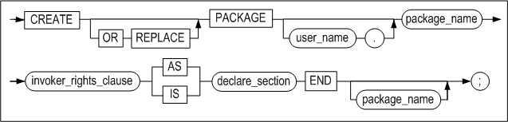
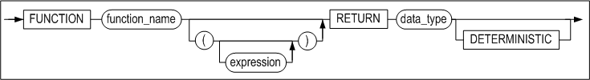
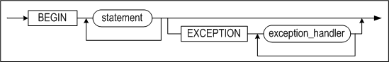

# 11.저장 패키지

이 장은 저장 패키지를 생성하고 사용하는 방법을 설명한다.

### 개요

패키지(package)는 저장 프로시저에서 사용되는 사용자 정의 타입, 변수, 상수, 서브
프로그램(procedure 또는 function), 커서 및 예외(exception)을 그룹화한 객체이다.
패키지는 패키지 스펙(package specification)과 패키지 바디(package body)로
이루어진다. 패키지는 하나의 스펙을 가지며, 패키지 스펙은 사용자 정의 타입을
정의하거나, 변수, 상수, 서브 프로그램(procedure 또는 function), 커서 또는
예외(exception)를 선언한다. 또한 패키지의 서브 프로그램을
다중정의(overloading)하여 사용할 수 있다. 선언된 객체는 패키지 외부에서 참조할
수 있다. 즉, 패키지 스펙을 애플리케이션 프로그래밍 인터페이스(API)로 보아도
무방하다.

패키지 스펙에 커서나 서브프로그램이 포함되어 있다면, 해당 패키지에 대해 반드시
패키지 바디를 생성해야 한다. 이 패키지 바디에는 커서를 위한 쿼리와
서브프로그램을 위한 코드를 정의해야 한다. 패키지 바디에도 객체를 선언하고 정의할
수 있지만, 이렇게 선언된 객체는 패키지 외부에서 접근이 불가능하다.

마지막으로 패키지 바디는 초기화 부분과 예외 처리 부분을 포함할 수 있다. 이
초기화 부분은 세션 별로 최초 패키지 실행 시 한 번만 실행된다. 패키지 바디는
사용자의 직접적인 접근이 불가능하며, 그 내용이 변하더라도 패키지 스펙에는 영향을
주지 않는다. 패키지 바디는 패키지의 내부 객체가 참조될 때 실제로 실행되는
부분이며, 패키지 스펙은 이러한 내용을 외부로부터 보호하는 역할을 한다. 패키지는
세션 별로 최초 실행 시 메모리에 로딩되어, 해당 세션이 종료되기 전까지 유지된다.

#### 특징

-   모듈화  
    한 업무와 관련된 타입, 변수, 상수, 커서, 예외 및 서브프로그램 등의 객체를
    모듈화하는 것이 가능하다.

-   응용프로그램 작성 용이  
    모듈화를 함으로써 응용프로그램 작성과 유지보수가 쉬워진다.

-   정보 보호  
    패키지 바디는 패키지 스펙을 통해서만 접근이 가능하기 때문에 상세한 구현
    내용을 숨길 수 있다. 따라서, 패키지 바디에 대해서는 외부로부터의 접근을
    막아서 정보 보호가 가능하다.

-   성능 향상  
    최초로 패키지를 실행할 때 패키지를 세션에 로딩해 두기 때문에, 동일한
    세션에서 반복 호출 시 실행 속도가 빠르다.

#### 구조

하나의 패키지는 패키지 스펙과 패키지 바디로 구성된다. 패키지 스펙과 바디의
선언부(declaration section)에는 타입, 변수, 상수, 커서, 예외 및 서브프로그램
등을 선언할 수 있으며, 바디에는 선언된 객체를 구체적으로 정의할 수 있다.

패키지 바디의 초기화 부분은 선택적인 기능으로써, 세션 별로 최초 패키지 실행 시
한 번만 실행된다. 초기화 부분은 패키지 내에서 선언되거나 참조되는 변수들의 값을
셋팅하기 위해 주로 사용된다. 또한, 패키지 바디에는 예외 처리 부분도 기술될 수
있다.

아래 그림은 패키지 스펙과 바디의 구조를 도식화한 것이다.


#### 제약 사항

-   패키지 내에 정의된 커서는 서브프로그램이 실행되는 동안 유지된다. 즉,
    서브프로그램의 실행이 종료되면 커서는 묵시적으로 닫힌다.


### CREATE PACKAGE

#### 구문

##### create_package ::=



##### invoker_rights_clause::=


##### declare_section ::=


##### procedure_declaration ::=


##### function_declaration ::=



#### 기능

패키지 스펙을 생성하거나 이미 생성되어 있는 패키지 스펙을 대체한다.

##### invoker_rights_clause

패키지를 실행할 때 생성자(DEFINER)권한으로 실행할지 실행자(CURRENT_USER)
권한으로 실행할지 명시할 수 있다. 이 절을 생략하면 생성자 권한으로 패키지가
실행된다.

-   AUTHID CURRENT_USER  
    패키지 사용자가 소유한 객체를 참조하여 패키지를 실행한다.

-   AUTHID DEFINER  
    패키지 생성자( DEFINER)의 객체를 참조하여 생성자 권한으로 실행한다.

##### declare_section

사용자 정의 타입을 정의하거나, 변수, 상수, 서브 프로그램(프로시저 또는 함수),
커서 및 예외를 선언한다. *type_definition*의 문법은 6장의 "사용자 정의 타입의
정의"절을 참고하고, variable, constant, cursor, 및 exception 선언절의 문법은
3장의 "[지역 변수 선언](#지역-변수-선언)"절을 참고하기 바란다.

#### 예제

##### 예제 1

사용자 정의 타입, 변수, 프로시저, 및 함수를 포함하는 패키지 스펙을 생성하는
예제이다.

```
CREATE OR REPLACE PACKAGE pkg1 AS
TYPE rec1 IS RECORD(c1 INTEGER, c2 INTEGER);
v1 rec1;
v2 INTEGER;
PROCEDURE proc1;
FUNCTION func1 RETURN INTEGER;
END;
/
```


##### 예제 2 (AUTHID CURRENT_USER)

###### **객체 생성: user1**

```
iSQL> connect user1/user1;
Connect success.

iSQL> create table t1( c1 integer );
Create success.

iSQL> insert into t1 values ( 1 );
1 row inserted.

iSQL> create or replace package pkg1 authid current_user as
     var1 integer;
     procedure sub1;
     end;
     /
Create success.

iSQL> create or replace package body pkg1 as
     procedure sub1 as
     begin
     select c1 into var1 from t1;
     println( var1 );
     end;
     end;
     /
Create success.

iSQL> select package_name , package_type , authid
      from system_.sys_packages_
      where package_name = 'PKG1';
PACKAGE_NAME     
----------------------------
PACKAGE_TYPE AUTHID      
----------------------------
PKG1                                                                                                                              
6           1          
PKG1                                                                                                                              
7           1          
2 rows selected.
```


###### **객체 생성: user2**

```
iSQL> connect user2/user2;
Connect success.

iSQL> create table t1( c1 integer );
Create success.

iSQL> insert into t1 values ( 100 );
1 row inserted.
```


###### **패키지 실행: user1**

```
iSQL> exec pkg1.sub1;
1
Execute success.
```


###### **패키지 실행: user2**

```
iSQL> exec user1.pkg1.sub1;
100
Execute success.
```


##### 예제 3 (AUTHID DEFINER)

###### **객체 생성: user1**

```
iSQL> connect user1/user1;
Connect success.

iSQL> create table t1( c1 integer );
Create success.

iSQL> insert into t1 values ( 1 );
1 row inserted.


iSQL> create or replace package pkg1 authid definer as
     var1 integer;
     procedure sub1;
     end;
     /
Create success.

iSQL> create or replace package body pkg1 as

     procedure sub1 as
     begin
     select c1 into var1 from t1;
     println( var1 );
     end;

     end;
     /
Create success.

iSQL> select package_name , package_type , authid
    2 from system_.sys_packages_
    3 where package_name = 'PKG1';
PACKAGE_NAME                                                                                                                      
------------------------------------------------------------------------------------------------------------------------------------
PACKAGE_TYPE AUTHID      
----------------------------
PKG1                                                                                                                              
6           0          
PKG1                                                                                                                              
7           0          
2 rows selected.
```


###### **객체 생성: user2**

```
iSQL> connect user2/user2;
Connect success.

iSQL> create table t1( c1 integer );
Create success.

iSQL> insert into t1 values ( 100 );
1 row inserted.
```


###### **패키지 실행: user1**

```
iSQL> exec pkg1.sub1;
1
Execute success.
```


###### **패키지 실행: user2**

```
iSQL> exec user1.pkg1.sub1;
1
Execute success.
```


### CREATE PACKAGE BODY

#### 구문

##### create_package_body ::=


##### initialize_section::=



##### declare_section ::=


#### 기능

패키지 바디를 생성하거나 이미 생성되어 있는 패키지 바디를 대체한다.

##### declare_section

패키지 스펙에 선언된 모든 커서 및 서브프로그램을 정의한다. 패키지 스펙의 각
서브프로그램 선언과 대응하는 패키지 바디의 정의가 일치해야 한다.

패키지 내부에서만 참조할 수 있는 객체를 선언하고 정의할 수도 있다.
*type_definition*의 문법은 6장의 "사용자 정의 타입의 정의"절을 참고하고,
variable, constant, cursor, 및 exception 선언절의 문법은 3장의 "[지역 변수
선언](#지역-변수-선언)"절을 참고하기 바란다. 프로시저와 함수 정의 문법은 2장의
"CREATE PROCEDURE" 및 "CREATE FUNCTION" 절을 참고하라.

##### initialize_section

패키지의 초기화 및 예외 처리를 작성하는 부분이다. 어떤 세션에서 패키지를 최초로
호출할 때 *initialize_section*이 실행되며, 이 후에 같은 세션에서 그 패키지를
반복 호출하면 이 부분은 실행되지 않는다.

#### 예제

\<예제1\> 패키지 스펙을 생성하지 않은 채로 패키지 바디를 생성하여 오류가
발생하는 예제이다.

```
iSQL> select * from system_.sys_packages_ where package_name = 'PKG2';
No rows selected.

iSQL> create or replace package body pkg2 as
      v1 integer;
      procedure proc1 as
      begin
      v1 := 1;
      end;
      end;
      /
[ERR-313BE : Package specification not found. ]
```

\<예제2\> 아래는 패키지 스펙과 패키지 바디를 정상적으로 생성하는 예제이다.

```
CREATE OR REPLACE PACKAGE pkg1 AS
TYPE rec1 IS RECORD(c1 INTEGER, c2 INTEGER);
v1 rec1;
v2 INTEGER;
PROCEDURE proc1;
FUNCTION func1 RETURN INTEGER;
END;
/

iSQL> create or replace package body pkg1 as
type rec2 is record(c3 integer, c4 integer);
v3 rec1;
v4 rec2;
v5 integer;
procedure proc1 as
  begin
  v5 := 1;
  v2 := 2;
end;
function func1 return integer as
  begin
  return v2;
end;
end;
/
Create success.
```

\<예제3\> 아래는 initialize_section을 갖는 패키지 바디를 생성해서 실행하는
예제이다. 최초 호출 시에만 initialize_section이 실행되는 것을 확인할 수 있다.

```
create or replace package pkg1 as
v1 integer;
procedure proc1;
end;
/
create or replace package body pkg1 as
v2 integer;
procedure proc1 as
v3 integer;
begin
  v3 := v1 + v2;
  println(v3);
  println('statement 1');
end;
begin
  v1 := 100;
  v2 := 31;
  println('statement 2');
end;
/

iSQL> exec pkg1.proc1;
statement 2
131
statement 1
Execute success.
iSQL> exec pkg1.proc1;
131
statement 1
Execute success.
```

\<예제4\> 아래는 패키지 서브프로그램의 이름이 같지만 데이터 타입을 다르게
다중정의(overloading)하여 사용하는 예제이다.

```
iSQL> create or replace package pkg1 as
function func return varchar(10);
function func(p1 in varchar ) return varchar(10);
function func(p1 in number ) return varchar(10);
function func(p1 in date ) return varchar(10);
end;
/
Create success.

iSQL> create or replace package body pkg1 as
function func return varchar(10) is
begin
return 'none';
end;
function func(p1 in varchar ) return varchar(10) is
begin
return 'varchar';
end;
function func(p1 in number ) return varchar(10) is
begin
return 'number';
end;
function func(p1 in date ) return varchar(10) is

begin
return 'date';
end;
end;
/
Create success.
```


#### 주의 사항

-   패키지 바디를 생성하기 위해서는 먼저 패키지 스펙을 생성해야 한다.

-   패키지 스펙에 선언된 프로시저나 함수를 하나도 빠뜨리지 않고 패키지 바디에
    정의해야 한다.

-   패키지의 서브프로그램을 다중정의(overloading)하여 사용할 때, 원하지 않는
    서브프로그램이 수행되는 것을 방지하려면 CAST 또는 TO_DATE와 같은 함수로
    데이터 타입을 일치시켜야 한다.

### ALTER PACKAGE

#### 구문

##### alter_package ::=


#### 기능

패키지 스펙 또는 패키지 바디 또는 패키지를 명시적으로 재컴파일한다. 패키지를
컴파일하면, 패키지를 구성하는 변수, 커서, 사용자 정의 타입 및 서브프로그램도
같이 컴파일된다.

#### 예제

```
iSQL> alter package pkg1 compile;
Alter success.

iSQL> alter package pkg1 compile specification;
Alter success.

iSQL> alter package pkg1 compile body;
Alter success.

iSQL> alter package pkg1 compile package;
Alter success.
```


### DROP PACKAGE

#### 구문

##### drop_package ::=


#### 기능

패키지를 삭제하는 구문이다. 이 구문으로 패키지 바디만 선택적으로 삭제하거나
패키지 전체를 삭제할 수 있다.

#### 예제

```
iSQL> drop package body pkg1;
Drop success.

iSQL> drop package pkg1;
Drop success.
```


### EXECUTE

#### 구문

##### execute_procedure_statement ::=


##### execute_function_statement ::=


#### 기능

패키지 내의 프로시저 또는 함수를 실행한다.

#### 예제

```
create or replace package pkg1 as
v1 integer;
procedure proc1;
function func1 return integer;
end;
/

create or replace package body pkg1 as
procedure proc1 as
begin
println(v1);
end;

function func1 return integer as
begin
return 1;
end;
end;
/

iSQL> exec pkg1.v1 := pkg1.func1;
Execute success.

iSQL> exec pkg1.proc1;
1
Execute success.
```


