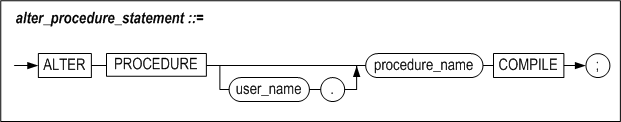
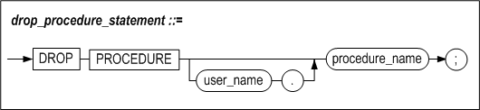
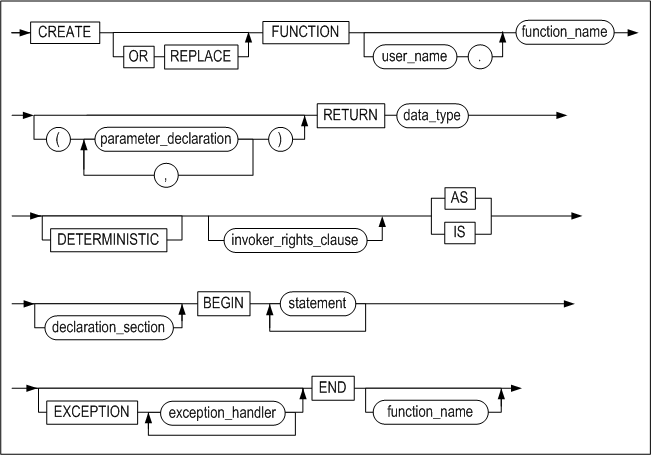

# 2.저장 프로시저 SQL문

### 개요

#### 저장 프로시저 SQL문

아래 표는 저장 프로시저, 함수와 타입 세트를 생성하고 관리하는 데 사용하는 DDL문을 보여준다.

CREATE TYPESET 과 DROP TYPESET 구문에 대한 설명은 7장 타입 세트를 참고하기 바란다.

<table>
    <tr>
        <th>종류</th><th>관련문장</th><th>설명</th>
	</tr>
    <tr>
        <TD rowspan="3">생성</TD><TD>CREATE [OR REPLACE] PROCEDURE문</TD><TD>새로운 저장 프로시저를 생성하거나 이미 생성된 저장 프로시저의 정의를 변경하는 문장이다.</TD>
    </tr>
    <TR>
        <TD>CREATE [OR REPLACE] FUNCTION 문</TD><TD>새로운 저장 함수를 생성하거나 이미 생성된 저장 함수의 정의를 변경하는 문장이다.</TD>       
    </TR>
    <TR>
        <TD>CREATE [OR REPLACE] TYPESET 문</TD><TD>타입 세트를 생성 또는 변경하는 문장이다.</TD>
    </TR>
    <TR>
        <TD rowspan="2">변경</TD><TD>ALTER PROCEDURE 문</TD><TD>이 구문은 저장 프로시저를 재컴파일하여  프로시저를 유효한 상태로 변경하고자 할 때 사용한다.</TD>
    </TR>
    <TR>
        <TD>ALTER FUNCTION 문</TD><TD>ALTER PROCEDURE문과 동일하다.</TD>
    </TR>
    <TR>
        <TD rowspan="3">삭제</TD><TD>DROP PROCEDURE 문</TD><TD>생성된 저장 프로시저를 삭제하는 문장이다.</TD>
    </TR>
    <TR>
    	<TD>DROP FUNCTION 문</TD><TD>생성된 저장 함수를 삭제하는 문장이다.</TD>
    </TR>
    <TR>
        <TD>DROP TYPESET 문</TD><TD>생성된 타입 세트를 삭제하는 문장이다.</TD>
    </TR>  
    <TR>
        <TD rowspan="2">실행</TD> <TD>EXECUTE 문</TD><TD>저장 프로시저 또는 저장 함수를 실행하는 문장이다.</TD>        
    </TR>
    <TR>
     	<TD>function_name</TD><TD>SQL문 내에서 호출할 때 이름으로 참조할 수 있다.</TD>        
    </TR>
</table>

#### 데이터 타입

저장 프로시저에서는 다음과 같은 데이터 타입을 지원한다.

-   SQL 데이터 타입

-   BOOLEAN 타입

-   FILE_TYPE  
    저장 프로시저 내에서만 사용 가능하며, 파일 제어를 위한 타입이다. 자세한
    내용은 11장의 “파일 제어”를 참조한다.

-   사용자 정의 타입  
    저장 프로시저 내에서만 사용 가능하며, RECORD 및 ASSOCIATIVE ARRAY를
    지원한다. 자세한 내용은 6장 “사용자 정의 타입”을 참조한다.

##### SQL 데이터 타입

SQL 구문에서 사용 가능한 데이터 타입 모두 PSM (저장 프로시저, 저장 함수)에서
사용할 수 있다. 각 데이터 타입에 대한 자세한 내용은 *General Reference*의
"데이터 타입" 장을 참조한다.

아래 표에 나열한 SQL 데이터 타입은 SQL과 PSM에서 사용 가능한 최대 크기가 다르다.

| 데이터 타입 | SQL에서 최대 크기            | PSM에서 최대 크기                                            |
| ----------- | ---------------------------- | ------------------------------------------------------------ |
| CHAR(M)     | 32000                        | 65534                                                        |
| VARCHAR(M)  | 32000                        | 65534                                                        |
| NCHAR(M)    | 16000 (UTF-16) 10666 (UTF-8) | 32766 (UTF-16) 21843 (UTF-8)                                 |
| NVARCHAR(M) | 16000 (UTF-16) 10666 (UTF-8) | 32766 (UTF-16) 21843 (UTF-8)                                 |
| BLOB        | 2GB - 1                      | 100MB <br />LOB_OBJECT_BUFFER_SIZE 프로퍼티에 의해 결정 <br />(기본값: 32KB) |
| CLOB        | 2GB - 1                      | 100MB <br />LOB_OBJECT_BUFFER_SIZE 프로퍼티에 의해 결정 <br />(기본값: 32KB) |

SQL에서 CHAR, VARCHAR, NCHAR, NVARCHAR 타입의 크기를 지정하지 않으면 크기는
1이다.

저장 프로시저와 저장 함수에서 파라미터 또는 반환 값의 데이터 타입을CHAR, NCHAR,
NVARCHAR, VARCHAR로 설정한 경우, 데이터 타입의 크기를 지정하지 않으면 아래
프로퍼티에 설정된 크기로 사용된다.

-   PSM_CHAR_DEFAULT_PRECISION

-   PSM_NCHAR_UTF8_DEFAULT_PRECISION

-   PSM_NCHAR_UTF16_DEFAULT_PRECISION

-   PSM_NVARCHAR_UTF8_DEFAULT_PRECISION

-   PSM_NVARCHAR_UTF16_DEFAULT_PRECISION

-   PSM_VARCHAR_DEFAULT_PRECISION

각 프로퍼티에 대한 자세한 설명은 General Reference를 참고 한다.

##### BOOLEAN 타입

BOOLEAN 타입은 저장 프로시저 또는 저장 함수에서만 사용 가능하며, TRUE 또는
FALSE, NULL 값만 가질 수 있다.

BOOLEAN 변수는 다음과 같이 선언할 수 있다.

```
variable_name BOOLEAN;
```

BOOLEAN 타입은 SQL 데이터 타입 중 어느 것과도 호환되지 않으므로 사용시 아래와
같은 제약이 있다.

-   테이블 칼럼에 BOOLEAN 값을 입력할 수 없다.

-   테이블 칼럼의 값을 BOOLEAN 변수에 fetch할 수 없다.

-   BOOLEAN 타입을 반환하는 저장 함수나 내장 함수를 SQL문에 사용할 수 없다.

-   BOOLEAN 값은 출력 함수(PRINT, PUT 등)의 인자로 전달할 수 없다.

BOOLEAN 타입은 아래와 같이 사용할 수 있다.

```
done BOOLEAN;
...
done := TRUE;
done := FALSE;
done := NULL;
...
IF done = TRUE THEN
...
IF done = FALSE THEN
...
IF done THEN
...
IF done is NULL THEN
...
```


### CREATE PROCEDURE

#### 구문

create_procedure::=


parameter_declaration::=


invoker_rights_clause::=


#### 기능

저장 프로시저를 새로 생성하거나 이미 생성되어 있는 저장 프로시저를 새로운 저장
프로시저로 변경하는 기능을 수행한다.

##### parameter_declaration

인자는 생략할 수 있으며, 인자를 명시할 경우엔 인자의 명칭, 데이터 타입 및 입출력
구분을 명시해야 한다. 사용 가능한 입출력 구분 값은 다음 세가지 중의 하나이고
생략 시에 IN이 기본값이 된다. 인자가 OUT 또는 INOUT인 경우에는 DEFAULT
expression은 정의할 수 없다.

-   IN: 프로시저 호출시 입력값으로 주어지는 입력 인자

-   OUT: 프로시저 실행 후 출력 값을 반환하는 인자

-   INOUT: 입출력 공용 인자로 프로시저 호출시 입력값을 줄 수 있고, 실행 후에
    출력 값을 반환할 수 있다

저장 프로시저가 실행될 때, IN 인자를 사용해서 프로시저에 값을 전달하고,
프로시저는 OUT인자를 사용해서 호출한 루틴에 값을 반환한다.

IN 인자는 저장 프로시저 내에서 상수처럼 동작하므로, 프로시저 내에서 할당문을
사용해 인자에 값을 대입할 수 없으며 SELECT문의 INTO 절에도 사용할 수 없다.

인자를 전달하는 방법은 값(value)을 전달하는 방법과 NOCOPY옵션을 사용하여
참조(reference)값을 전달하는 방법이 있다. NOCOPY옵션은 ASSOCIATIVE ARRAY타입만
지원한다.

인자는 기본 값을 가질 수 있다. 저장 프로시저가 호출될 때 기본값이 정의된 인자에
값을 넘겨 주지 않을 경우, 기본 값이 사용된다.

##### invoker_rights_clause

프로시저를 실행할 때 생성자(DEFINER)권한으로 객체를 참조할 것인지
실행자(CURRENT_USER) 권한으로 참조할 것인지 명시할 수 있다. 이 절을 생략하면
AUTHID DEFINER가 기본으로 설정된다.

-   AUTHID CURRENT_USER  
    프로시저 사용자가 소유한 객체를 참조하여 프로시저를 실행한다.

-   AUTHID DEFINER  
    프로시저 생성자의 객체를 참조하여 프로시저를 생성한 사용자(DEFINER) 권한으로
    실행한다.

##### declaration_section

3장의 “[지역 변수 선언](#지역-변수-선언)”절 참고

##### data_type

3장의 “[지역 변수 선언](#지역-변수-선언)”절 참고

##### Exception Handler

9장 “[Exception Handler](#exception-handler-2)” 참고

##### CREATE PROCEDURE 문의 실행

저장 프로시저 생성 구문은 텍스트 편집기에서 작성해서 iSQL에 붙여넣거나, iSQL에서
직접 한 라인씩 입력할 수도 있다.

각 SQL문, 저장 프로시저 제어문, 그리고 블록 (END)의 끝에 세미콜론(“;”)을
입력한다.

iSQL에서 CREATE PROCEDURE문을 실행할 때는 마지막 END; 문의 다음 라인에 반드시
슬래시(“/”)를 입력해야 프로시저 생성문이 실행된다. CREATE PROCEDURE문 실행 시
컴파일 오류가 발생하지 않고 블록이 성공적으로 컴파일 되면 “Create Success”
메시지가 출력된다.

저장 프로시저 바디 부분에 대해서는 다음 장에서부터 각각 블록, 흐름 제어문, 커서,
Exception Handler 부분으로 구분해서 설명한다.

#### 예제

##### 예제1 (IN 인자 사용)

```
CREATE TABLE t1 (i1 INTEGER UNIQUE, i2 INTEGER, i3 INTEGER);
INSERT INTO t1 VALUES (1,1,1);
INSERT INTO t1 VALUES (2,2,2);
INSERT INTO t1 VALUES (3,3,3);
INSERT INTO t1 VALUES (4,4,4);
INSERT INTO t1 VALUES (5,5,5);
SELECT * FROM t1;

CREATE OR REPLACE PROCEDURE proc1
(p1 IN INTEGER, p2 IN INTEGER, p3 IN INTEGER)
AS
  v1 INTEGER;
  v2 t1.i2%type;
  v3 INTEGER;
BEGIN
  SELECT *
  INTO v1, v2, v3
  FROM t1
  WHERE i1 = p1 AND i2 = p2 AND i3 = p3;

  IF v1 = 1 AND v2 = 1 AND v3 = 1 THEN
    UPDATE t1 SET i2 = 7 WHERE i1 = v1;
  ELSIF v1 = 2 AND v2 = 2 AND v3 = 2 THEN
    UPDATE t1 SET i2 = 7 WHERE i1 = v1;
  ELSIF v1 = 3 AND v2 = 3 AND v3 = 3 THEN
    UPDATE t1 SET i2 = 7 WHERE i1 = v1;
  ELSIF v1 = 4 AND v2 = 4 AND v3 = 4 THEN
    UPDATE t1 SET i2 = 7 WHERE i1 = v1;
  ELSE
    DELETE FROM t1;
  END IF;
  INSERT INTO t1 VALUES (p1+10, p2+10, p3+10);
END;
/

iSQL> EXEC proc1 (2,2,2);
Execute success.
iSQL> SELECT * FROM t1;
T1.I1       T1.I2       T1.I3       
----------------------------------------
1           1           1           
3           3           3           
4           4           4           
5           5           5           
2           7           2           
12          12          12          
6 rows selected.
```


##### 예제2 (기본값이 있는 인자 사용)

```
CREATE TABLE t1 (i1 INTEGER, i2 INTEGER, i3 INTEGER);

CREATE OR REPLACE PROCEDURE proc1
(p1 IN INTEGER DEFAULT 1, p2 IN INTEGER DEFAULT 1, p3 IN INTEGER DEFAULT 1)
AS
BEGIN
  INSERT INTO t1 VALUES (p1, p2, p3);
END;
/

EXEC proc1;
SELECT * FROM t1;
EXEC proc1(2);
SELECT * FROM t1;
EXEC proc1(3,3);
SELECT * FROM t1;
EXEC proc1(4,4,4);

iSQL> SELECT * FROM t1;
T1.I1       T1.I2       T1.I3       
----------------------------------------
1           1           1           
2           1           1           
3           3           1           
4           4           4           
4 rows selected.
```


##### 예제3

```
CREATE OR REPLACE PROCEDURE proc1
(emp_id INTEGER, amount NUMBER(10,2))
AS
BEGIN
  UPDATE employees SET salary = salary + amount
  WHERE eno = emp_id;
END;
/

iSQL> EXEC proc1(15, '250');
Execute success.

iSQL> SELECT * FROM employees WHERE eno=15;
ENO         E_LASTNAME            E_FIRSTNAME           EMP_JOB          
------------------------------------------------------------------------------
EMP_TEL          DNO         SALARY      SEX  BIRTH   JOIN_DATE    STATUS  
-----------------------------------------------------------------------------------
15          Davenport             Jason                 webmaster        
0119556884       1003        1250        M  901212               H  
1 row selected.

```


##### 예제4 (출력, 입출력 인자 사용)

```
CREATE TABLE t4(i1 INTEGER, i2 INTEGER);
INSERT INTO t4 VALUES(1,1);
INSERT INTO t4 VALUES(1,1);
INSERT INTO t4 VALUES(1,1);
INSERT INTO t4 VALUES(1,1);
INSERT INTO t4 VALUES(1,1);

CREATE OR REPLACE PROCEDURE proc1(a1 OUT INTEGER, a2 IN OUT INTEGER)
AS
BEGIN
  SELECT COUNT(*) INTO a1 FROM t4 WHERE i2 = a2;
END;
/

iSQL> VAR t3 INTEGER;
iSQL> VAR t4 INTEGER;
iSQL> EXEC :t4 := 1;
Execute success.
iSQL> EXEC proc1(:t3, :t4);
Execute success.
iSQL> PRINT t3;
NAME                 TYPE                 VALUE
-----------------------------------------------
T3                   INTEGER              5
```


##### 예제5

```
CREATE OR REPLACE PROCEDURE proc1(p1 INTEGER, p2 IN OUT INTEGER, p3 OUT INTEGER)
AS
BEGIN
  p2 := p1;
  p3 := p1 + 100;
END;
/

iSQL> VAR v1 INTEGER;
iSQL> VAR v2 INTEGER;
iSQL> VAR v3 INTEGER;
iSQL> EXEC :v1 := 3;
Execute success.
iSQL> EXEC proc1(:v1, :v2, :v3);
Execute success.
iSQL> PRINT VAR;
[ HOST VARIABLE ]
-----------------------------------------------
NAME                 TYPE                 VALUE
-----------------------------------------------
V1                   INTEGER              3
V2                   INTEGER              3
V3                   INTEGER              103
```


##### 예제6 (입출력 인자 사용)

```
CREATE TABLE t3(i1 INTEGER);
INSERT INTO t3 VALUES(1);
INSERT INTO t3 VALUES(1);
INSERT INTO t3 VALUES(1);

CREATE OR REPLACE PROCEDURE proc1(a1 IN OUT INTEGER)
AS
BEGIN
  SELECT COUNT(*) INTO a1 FROM t3 WHERE i1 = a1;
END;
/

iSQL> VAR p1 INTEGER;
iSQL> EXEC :p1 := 1;
Execute success.
iSQL> EXEC proc1(:p1);
Execute success.
iSQL> PRINT p1;
NAME                 TYPE                 VALUE
-----------------------------------------------
P1                   INTEGER              3
```


##### 예제7

```
CREATE OR REPLACE PROCEDURE proc1(p1 INTEGER, p2 IN OUT INTEGER, p3 OUT INTEGER)
AS
BEGIN
  p2 := p1 + p2;
  p3 := p1 + 100;
END;
/
iSQL> VAR v1 INTEGER;
iSQL> VAR v3 INTEGER;
iSQL> EXEC :v1 := 3;
Execute success.
iSQL> EXEC :v2 := 5;
Execute success.
iSQL> EXEC proc1(:v1, :v2, :v3);
Execute success.
iSQL> PRINT VAR;
[ HOST VARIABLE ]
-----------------------------------------------
NAME                 TYPE                 VALUE
-----------------------------------------------
V1                   INTEGER              3
V2                   INTEGER              8
V3                   INTEGER              103
```


##### 예제8 (입출력 인자에서 NOCOPY옵션 사용)

```
iSQL> CREATE TYPESET TYPE1 AS
TYPE ARR_TYPE IS TABLE OF INTEGER INDEX BY INTEGER;
END;
/
Create success.
iSQL> CREATE OR REPLACE PROCEDURE PRINT_PROC( P1 IN NOCOPY TYPE1.ARR_TYPE )
AS
BEGIN
FOR I IN P1.FIRST() .. P1.LAST() LOOP
PRINTLN(P1[I]);
END LOOP;
END;
/
Create success.
iSQL> CREATE OR REPLACE PROCEDURE PROC1
AS
VAR1 TYPE1.ARR_TYPE;
BEGIN
FOR I IN 1 .. 10 LOOP
VAR1[I] := I;
END LOOP;
PRINT_PROC(VAR1);
END;
/
Create success.
iSQL> EXEC PROC1;
1
2
3
4
5
6
7
8
9
10
Execute success.
```


##### 예제9 (AUTHID CURRENT_USER)

```
객체 생성: user1
iSQL> connect user1/user1;
Connect success.

iSQL> create table t1( c1 integer );
Create success.

iSQL> insert into t1 values ( 1 );
1 row inserted.

iSQL> create or replace procedure proc1 authid current_user as
     var1 integer;
     begin
     select c1 into var1 from t1;
     println( var1 );
     end;
     /
Create success.

iSQL> select proc_name , object_type , authid
     from system_.sys_procedures_
     where proc_name ='PROC1';

PROC_NAME                                                               
----------------------------------------------------
OBJECT_TYPE AUTHID      
---------------------------------------------------
PROC1                                                                     
0           1          
1 row selected.

iSQL> connect user2/user2;
Connect success.

iSQL> create table t1( c1 integer );
Create success.

iSQL> insert into t1 values ( 100 );
1 row inserted.

객체 생성: user2
iSQL> connect user2/user2;
Connect success.

iSQL> create table t1( c1 integer );
Create success.

iSQL> insert into t1 values ( 100 );
1 row inserted.

프로시저 실행: user1
iSQL> exec proc1;
1
Execute success.

프로시저 실행: user2
iSQL> exec user1.proc1;
100
Execute success.

```


##### 예제10 (AUTHID DEFINER)

```
객체 생성: user1iSQL> connect user1/user1;
Connect success.

iSQL> create table t1( c1 integer );
Create success.

iSQL> insert into t1 values ( 1 );
1 row inserted.

iSQL> create or replace procedure proc1 authid definer as
     var1 integer;
     begin
     select c1 into var1 from t1;
     println( var1 );
     end;
     /
Create success.

iSQL> select proc_name , object_type , authid
     from system_.sys_procedures_
     where proc_name ='PROC1';
PROC_NAME                                                           
----------------------------------------------------------------
OBJECT_TYPE AUTHID      
---------------------------
PROC1                                                                            
0           0          
1 row selected.
iSQL> connect user2/user2;
Connect success.

iSQL> create table t1( c1 integer );
Create success.

iSQL> insert into t1 values ( 100 );
1 row inserted.

객체 생성: user2
iSQL> connect user2/user2;
Connect success.

iSQL> create table t1( c1 integer );
Create success.

iSQL> insert into t1 values ( 100 );
1 row inserted.

프로시저 실행: user1
iSQL> exec proc1;
1
Execute success.

프로시저 실행: user2
iSQL> exec user1.proc1;
1
Execute success.

```


### ALTER PROCEDURE

#### 구문



#### 기능

사용자가 명시적으로 저장 프로시저를 컴파일 할 때 사용된다.
저장 프로시저가 생성된 이후 해당 프로시저에서 참조하는 테이블, 시퀀스등의 데이터 오브젝트 혹은 호출하는 다른 저장 프로시저, 저장 함수의 정의가 변경되면 이 프로시저는 실행할 수 없는 상태가 되며, 이를 무효한(invalid) 상태라고 한다.
무효한 상태의 저장 프로시저가 호출되면, Altibase 서버가 자동으로 재컴파일 한다. 그러나 런타임 시에 컴파일하는 것은 심각한 성능 이슈를 야기할 수 있으므로, 프로시저가 무효한 상태가 되면 ALTER PROCEDURE 문을 이용하여 수동으로 컴파일 하는것을 권장한다.

#### 예제

```
CREATE TABLE t1 (i1 NUMBER, i2 VARCHAR(10), i3 DATE);
Create success.
CREATE OR REPLACE PROCEDURE proc1
(p1 IN NUMBER, p2 IN VARCHAR(10), p3 IN DATE)
AS
BEGIN
  IF p1 > 0 then
    INSERT INTO t1 VALUES (p1, p2, p3);
  END IF;
END;
/
Create success.

iSQL> EXECUTE proc1 (1, 'seoul', '20-JUN-2002');
Execute success.
iSQL> EXECUTE proc1 (-3, 'daegu', '21-APR-2002');
Execute success.
iSQL> SELECT * FROM t1;
T1.I1       T1.I2       T1.I3                
-----------------------------------------------
1           seoul       20-JUN-2002
1 row selected.

iSQL> select PROC_NAME, STATUS from system_.sys_procedures_ where proc_name = 'PROC1' and user_id = user_id();
PROC_NAME
------------------------------------------------------------------------------------------------------------------------------------
STATUS
--------------
PROC1
0
1 row selected

iSQL> alter table t1 modify column (i3 date default sysdate);
Alter success.

iSQL> select PROC_NAME, STATUS from system_.sys_procedures_ where proc_name = 'PROC1' and user_id = user_id();
PROC_NAME
------------------------------------------------------------------------------------------------------------------------------------
STATUS
--------------
PROC1
1
1 row selected.


iSQL> alter procedure proc1 compile;
Alter success.

iSQL> select PROC_NAME, STATUS from system_.sys_procedures_ where proc_name = 'PROC1' and user_id = user_id();
PROC_NAME
------------------------------------------------------------------------------------------------------------------------------------
STATUS
--------------
PROC1
0
1 row selected.

iSQL> EXECUTE proc1 (2, 'incheon', SYSDATE);
Execute success.
iSQL> SELECT * FROM t1;
T1.I1       T1.I2       T1.I3
-----------------------------------------
1           seoul       20-JUN-2002
2           incheon     27-APR-2023
2 rows selected.
```


### DROP PROCEDURE

#### 구문



#### 기능

데이터베이스에서 저장 프로시저를 삭제하는 구문이다.

삭제하고자 하는 프로시저를 다른 저장 프로시저에서 참조하고 있다 하더라도, 그
프로시저는 삭제된다.

삭제되고 없는 저장 프로시저나 함수가 호출될 때 Altibase는 오류 코드를 반환한다.

#### 예제

```
DROP PROCEDURE proc1;
```


### EXECUTE

#### 구문

##### execute_procedure_statement::=


##### execute_function_statement::=


##### parameter_notation::=


#### 기능

저장 프로시저 또는 저장 함수를 실행한다.

##### parameter_notation

파라미터에 값을 전달하는 방식은 아래와 같다.

-   위치기반(Positional) : 기본적인 전달 방식으로, 정의된 파라미터의 위치에 맞춰
    값이 입력된다.

-   이름기반(Name-based) : 정의된 파라미터의 이름을 입력하고 화살표(=\>) 뒤에
    값을 입력하는 방식이다. 파라미터의 순서에 관계없이 값을 전달할 수 있다.

-   혼합(Mixed): 위치기반과 이름기반 방식을 함께 사용할 수 있다. 그러나 반드시
    위치기반 전달 방식을 먼저 입력해야 한다.

#### 예제

\<질의\>

```
CREATE OR REPLACE PROCEDURE proc1(eid INTEGER, amount NUMBER(10,2))
AS
  current_salary NUMBER(10,2);
BEGIN
  SELECT salary
  INTO current_salary
  FROM employees
  WHERE eno = eid;

  UPDATE employees
  SET salary = salary + amount
  WHERE eno = eid;
END;
/

iSQL> SELECT * FROM employees WHERE eno = 15;
ENO         E_LASTNAME            E_FIRSTNAME           EMP_JOB          
------------------------------------------------------------------------------
EMP_TEL          DNO         SALARY      SEX  BIRTH   JOIN_DATE    STATUS  
-----------------------------------------------------------------------------------
15          Davenport             Jason                 webmaster        
0119556884       1003        501000      M  901212               H  
1 row selected.

iSQL> EXEC proc1(15, 333333);
Execute success.
iSQL> SELECT * FROM employees WHERE eno = 15;
ENO         E_LASTNAME            E_FIRSTNAME           EMP_JOB          
------------------------------------------------------------------------------
EMP_TEL          DNO         SALARY      SEX  BIRTH   JOIN_DATE    STATUS  
-----------------------------------------------------------------------------------
15          Davenport             Jason                 webmaster        
0119556884       1003        834333      M  901212               H  
1 row selected.
<질의>
iSQL> EXEC proc1(amount => 333333, eid => 15);
Execute success.

iSQL> SELECT * FROM employees WHERE eno = 15;
ENO         E_LASTNAME            E_FIRSTNAME           EMP_JOB          
------------------------------------------------------------------------------
EMP_TEL          DNO         SALARY      SEX  BIRTH   JOIN_DATE    STATUS  
-----------------------------------------------------------------------------------
15          Davenport             Jason                 webmaster        
0119556884       1003        834333      M  901212               H  
1 row selected.
```


### CREATE FUNCTION

#### 구문

create_function::=



parameter_declaration::=


invoker_rights_clause::=


#### 기능

저장 함수를 새로 생성하거나 이미 생성되어 있는 저장 함수를 대체한다.

##### parameter_declaration

CREATE PROCEDURE절의 “parameter_declaration” 참고

##### RETURN data_type

저장 함수는 저장 프로시저와 달리 실행 후 하나의 값을 반환한다. 그러므로 반드시
반환 데이터 타입을 명시해야 한다.

##### DETERMINISTIC

동일한 파라미터 값으로 함수를 호출하면, 항상 같은 결과가 반환됨을 표시한다.
DETERMINISTIC으로 선언한 함수는 Check Constraint와 함수 기반
인덱스(Function-Based Index)에서 사용할 수 있다. 이 옵션을 생략하면,
non-deterministic 함수로 선언된다.

##### invoker_rights_clause

함수를 실행할 때 생성자(DEFINER)권한으로 객체를 참조할 것인지
실행자(CURRENT_USER) 권한으로 참조할 것인지 명시할 수 있다. 이 절을 생략하면
생성자 권한으로 함수가 실행된다.

-   AUTHID CURRENT_USER  
    함수 사용자가 소유한 객체를 참조하여 함수를 실행한다.

-   AUTHID DEFINER  
    함수 생성자의 객체를 참조하여 생성자(DEFINER) 권한으로 함수를 실행한다.

##### Declaration Section

3장의 “[지역 변수 선언](#지역-변수-선언)” 절 참고

##### Data Types

3장의 “[지역 변수 선언](#지역-변수-선언)” 절 참고

##### Exception Handler

9장 Exception Handler 참고

##### CREATE FUNCTION 문의 실행

CREATE PROCEDURE절의 “CREATE PROCEDURE문의 실행” 참고

#### 예제

##### 예제 1

```
CREATE TABLE t1(
  seq_no INTEGER,
  user_id VARCHAR(9),
  rate NUMBER,
  start_date DATE,
  end_date DATE);
INSERT INTO t1 VALUES(0, '000000500', 200.50, '23-May-2002', '23-Apr-2002');
INSERT INTO t1 VALUES(0, '000000501', 190, '23-Nov-2002', '23-Dec-2002');
INSERT INTO t1 VALUES(0, '000000523', 100, '12-Dec-2001', '12-Jan-2001');
INSERT INTO t1 VALUES(0, '000000532', 100, '11-Dec-2001', '11-Jan-2002');
INSERT INTO t1(seq_no, user_id, start_date, end_date) VALUES(0, '000000524', '30-Oct-2001', '30-Nov-2001');
INSERT INTO t1 VALUES(0, '000000524', 200.50, '30-Apr-2002', '30-May-2002');
INSERT INTO t1 VALUES(0, '000000524', 200.50, '30-Apr-2002', '30-May-2002');
INSERT INTO t1 VALUES(1, '000000524', 100, '30-Apr-2002', '30-May-2002');
INSERT INTO t1 VALUES(1, '000000524', 115.0, '19-Jan-2002', '19-Mar-2002');
INSERT INTO t1 VALUES(0, '000000502', 120.0, '27-Jan-2002', '27-Feb-2002');
INSERT INTO t1 VALUES(1, '000000504', 150.0, '26-Nov-2001', '26-Dec-2001');

iSQL> SELECT * FROM t1;
T1.SEQ_NO   T1.USER_ID  T1.RATE     T1.START_DATE        
------------------------------------------------------------
T1.END_DATE          
-----------------------
0           000000500  200.5       2002/05/23 00:00:00  
2002/04/23 00:00:00  
0           000000501  190         2002/11/23 00:00:00  
2002/12/23 00:00:00  
0           000000523  100         2001/12/12 00:00:00  
2001/01/12 00:00:00  
0           000000532  100         2001/12/11 00:00:00  
2002/01/11 00:00:00  
0           000000524              2001/10/30 00:00:00  
2001/11/30 00:00:00  
0           000000524  200.5       2002/04/30 00:00:00  
2002/05/30 00:00:00  
0           000000524  200.5       2002/04/30 00:00:00  
2002/05/30 00:00:00  
1           000000524  100         2002/04/30 00:00:00  
2002/05/30 00:00:00  
1           000000524  115         2002/01/19 00:00:00  
2002/03/19 00:00:00  
0           000000502  120         2002/01/27 00:00:00  
2002/02/27 00:00:00  
1           000000504  150         2001/11/26 00:00:00  
2001/12/26 00:00:00  
11 rows selected.

CREATE OR REPLACE FUNCTION get_rate
(p1 IN CHAR(30), p2 IN CHAR(30), p3 IN VARCHAR(9))
RETURN NUMBER
AS
  v_rate NUMBER;
BEGIN
  SELECT NVL(SUM(rate), 0)
  INTO v_rate
  FROM (SELECT rate
        FROM t1
        WHERE start_date = TO_DATE(p1)
          AND end_date = TO_DATE(p2)
          AND user_id = '000000' || p3
          AND seq_no = 0);
  RETURN v_rate;
END;
/

iSQL> VAR res NUMBER;
iSQL> EXECUTE :res := get_rate('30-Apr-2002', '30-May-2002', '524');
Execute success.
iSQL> PRINT res;
NAME                 TYPE                 VALUE
-----------------------------------------------
RES                  NUMBER               401
```


##### 예제 2 (AUTHID CURRENT_USER)

###### **객체 생성: user1**

```
iSQL> connect user1/user1;
Connect success.

iSQL> create table t1( c1 integer );
Create success.

iSQL> insert into t1 values ( 1 );
1 row inserted.

iSQL> create or replace function func1 return integer authid current_user as
     cursor cur1 is select c1 from t1;
     var1 integer;
     begin
     open cur1;
     fetch cur1 into var1;
     close cur1;
     return var1;
     end;
     /
Create success.

iSQL> select proc_name , object_type , authid
    2 from system_.sys_procedures_
    3 where proc_name = 'FUNC1';
PROC_NAME                                                                                                                         
------------------------------------------------------------------------------------------------------------------------------------
OBJECT_TYPE AUTHID      
---------------------------
FUNC1                                                                                                                             
1           1          
1 row selected.
```


###### **객체 생성: user2**

```
iSQL> connect user2/user2;
Connect success.

iSQL> create table t1( c1 integer );
Create success.

iSQL> insert into t1 values ( 100 );
1 row inserted.

```


###### **함수 실행: user1**

```
iSQL> var a integer;

iSQL> exec :a := func1;
Execute success.

iSQL> print a
NAME                 TYPE                 VALUE
-------------------------------------------------------
A                    INTEGER              1


iSQL> select func1 from dual;
FUNC1       
--------------
1          
1 row selected.

```


###### **함수 실행: user2**

```
iSQL> var a integer;

iSQL> exec :a := user1.func1;
Execute success.

iSQL> print a
NAME                 TYPE                 VALUE
-------------------------------------------------------
A                    INTEGER              100


iSQL> select user1.func1 from dual;
USER1.FUNC1
--------------
100        
1 row selected.

```


##### 예제 3 (AUTHID DEFINER)

###### **객체 생성: user1**

```
iSQL> connect user1/user1;
Connect success.

iSQL> create table t1( c1 integer );
Create success.

iSQL> insert into t1 values ( 1 );
1 row inserted.

iSQL> create or replace function func1 return integer authid definer as
      cursor cur1 is select c1 from t1;
      var1 integer;
      begin
      open cur1;
      fetch cur1 into var1;
      close cur1;
      return var1;
      end;
      /
Create success.

iSQL> select proc_name , object_type , authid
      from system_.sys_procedures_
      where proc_name ='FUNC1';
PROC_NAME                                                                                                                         
-------------------------------------------------------------------------------
OBJECT_TYPE AUTHID      
---------------------------
FUNC1                                                                                                                             
1           0          
1 row selected.
```


###### **객체 생성: user2**

```
iSQL> connect user2/user2;
Connect success.

iSQL> create table t1( c1 integer );
Create success.

iSQL> insert into t1 values ( 100 );
1 row inserted.
```


###### **함수 실행: user1**

```
iSQL> var a integer;

iSQL> exec :a := func1;
Execute success.

iSQL> print a
NAME                 TYPE                 VALUE
-------------------------------------------------------
A                    INTEGER              1


iSQL> select func1 from dual;
FUNC1       
--------------
1          
1 row selected.
```


###### **함수 실행: user2**

```
iSQL> var a integer;

iSQL> exec :a := user1.func1;
Execute success.


iSQL> print a
NAME                 TYPE                 VALUE
-------------------------------------------------------
A                    INTEGER              1


iSQL> select user1.func1 from dual;
USER1.FUNC1
--------------
1          
1 row selected.
```


#### 주의 사항

제약조건(constraint) 또는 함수 기반 인덱스(Function-based Index)가 사용하는
함수의 경우, 함수의 반환값이 바뀌면 안되기 때문에 함수를 재정의하는 것 자체가
불가능하다. 또한 함수 기반 인덱스가 기반하는 함수 내에서 호출되는 함수를
변경하거나 제거하면, 함수 기반 인덱스가 생성되어 있는 테이블에 대한 DML이 실패할
수 있으므로 사용자의 주의가 필요하다.

### ALTER FUNCTION

#### 구문


#### 기능

저장 프로시저와 마찬가지로, 저장 함수 생성 후에 함수 내에서 참조하는 데이터베이스 객체의 정의가 변경되어 현재 이 저장 함수의 실행 계획으로는 더 이상 실행할 수 없는 경우에 이 저장 함수는 무효한 상태라고 한다.

ALTER FUNCTION문은 저장 함수를 명시적으로 재 컴파일 하여 유효한 상태의 실행 계획을 다시 생성하기 위해 사용된다.

더 자세한 설명은 ALTER PROCECURE 절을 참고한다.

#### 예제

```
ALTER FUNCTION get_dept_name COMPILE;
```


### DROP FUNCTION

#### 구문


#### 기능

저장 함수를 삭제하는 구문이다.

삭제하고자 하는 저장 함수를 다른 저장 프로시저 또는 저자 함수에서 참조하고 있다
하더라도, 그 저장 함수는 삭제된다.

이미 삭제된 저장 함수를 참조하고 있던 임의의 저장 프로시저 또는 저장 함수가
실행될 때 Altibase는 오류를 출력한다.

#### 예제

```
DROP FUNCTION get_dept_name;
```


#### 주의 사항

제약조건(constraints) 또는 함수 기반 인덱스가 참조하는 함수는 삭제가 불가능하다.


