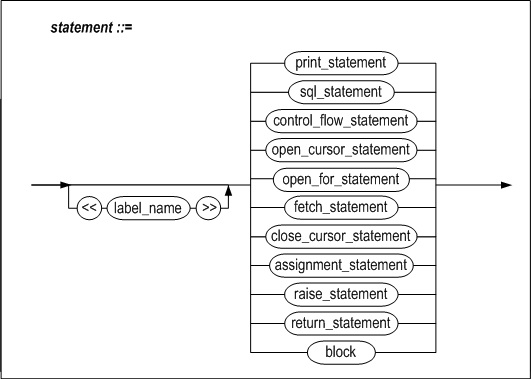
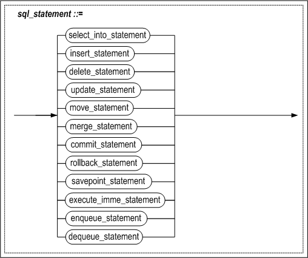
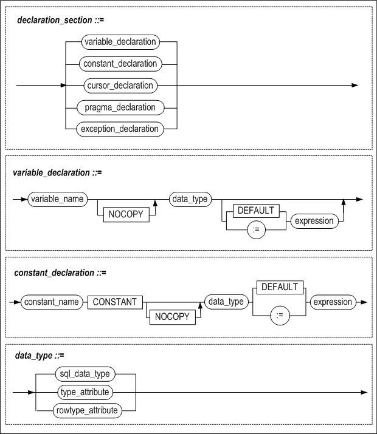
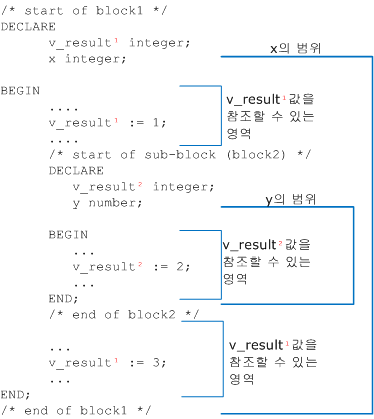
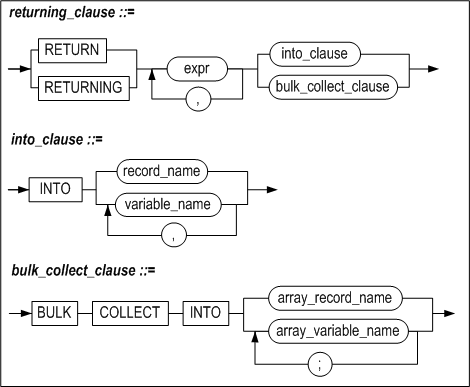
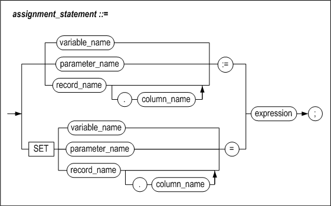
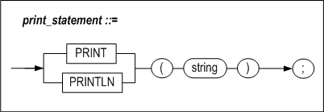

# 3.저장 프로시저 블록

저장 프로시저와 저장 함수는 한 개 이상의 블록으로 구성된다. 이 장에서는 블록을
사용해서 저장 프로시저 내에 절차화된 프로그램을 작성하는 방법을 설명한다.

### 저장 프로시저 블록

#### 구문


 

 

 

블록은 크게 선언부(Declare Section), 블록 바디(Block Body), 예외 처리부(Exception Handler Section)의 세 부분으로 나뉘어진다.

DECLARE, BEGIN, EXCEPTION 등의 키워드 뒤에는 세미콜론을 사용하지 않지만 END 및 기타 모든 프로시저 내의 명령문 뒤에는 세미콜론이 있어야 한다.

저장 프로시저의 코드에 주석 처리를 할 수 있다. 단일 행 주석에는 ‘--‘를 문장 앞에 붙이고, 여러 행을 주석 처리 할 경우는 ‘/\*’와 ‘\*/’ 사이에 주석 처리할 문장이 놓이도록 작성한다.

저장 프로시저 헤더 없이 독립적으로 저장 프로시저 블록을 사용할 수 있다. 이를 익명 블록(anonymous block)라고 한다. 익명 블록은 7.1.0.2.3 버전부터 지원하며 아래와 같은 특징이 있다.

- PSM 객체를 생성 및 데이터베이스에 저장하지 않는다.
- RETURN 절의 값을 반환하지 않는다.
- 저장 프로시저와 달리 INPUT, OUTPUT, INOUTPUT 용도의 바인드 변수(bind variables)를 사용할 수 있다.

```
iSQL> VAR OUT1 OUTPUT INTEGER;
iSQL> VAR INOUT1 INOUTPUT INTEGER;
iSQL> EXEC :INOUT1 := 1;

iSQL> DECLARE
    VAR1 INTEGER;
BEGIN
    VAR1 := :INOUT1;
    :OUT1 := VAR1;
    :INOUT1 := VAR1 + 1;
END;
/
Execute success.

iSQL> PRINT VAR;
[ HOST VARIABLE ]
-------------------------------------------------------
NAME                 TYPE                 VALUE
-------------------------------------------------------
OUT1                 INTEGER              1
INOUT1               INTEGER              2
```

이 장에서는 선언부와 블록 바디에 사용할 수 있는 구문 중 SELECT INTO문, 변수
할당문, LABEL문, PRINT문, RETURN문에 대해서 설명한다.

저장 프로시저 내에서 사용 가능한 흐름 제어문, 커서 관련문, 예외 처리에 관련된
내용은 다음 장에서 순서대로 설명하고 있다. 그 외 SQL문들에 대한 자세한 내용은
*SQL Reference*을 참조한다.

#### 선언부

선언부는 메인 블록에서는 AS와 BEGIN 키워드 사이에 위치하며, 하위 블록에서는
DECLARE와 BEGIN 키워드 사이에 위치한다. 해당 블록 내에서 사용하는 지역 변수,
커서와 사용자 정의 예외 등을 선언한다.

이 장에서는 지역 변수만을 설명한다. 커서와 예외 처리는 5장 커서와 9장 예외
처리에서 각각 설명한다.

#### 블록 바디

BEGIN과 END사이의 부분으로 SQL문과 흐름 제어문을 포함한다.

블록 바디 내에 기술 가능한 SQL문과 흐름 제어문은 다음과 같다.

-   DML 문: SELECT/INSERT/DELETE/UPDATE/MOVE/MERGE/ENQUEUE/DEQUEUE

-   트랜잭션 처리문: COMMIT/ROLLBACK/SAVEPOINT

-   흐름 제어문: IF, CASE, FOR, LOOP, WHILE, EXIT, CONTINUE, NULL

-   할당문

-   출력문: PRINT, RETURN

-   커서 관련문: OPEN, FETCH, CLOSE, Cursor FOR LOOP

-   동적 SQL문: EXECUTE IMMEDIATE

-   예외처리 구문: RAISE, RAISE_APPLICATION_ERROR

저장 프로시저의 장점 중 하나는 SQL문과 달리 블록을 사용하여 명령문을 중첩할 수
있다는 점이다. 명령문을 사용할 수 있는 위치에는 블록을 중첩할 수 있으므로,
명령문을 블록으로 만들어서 중첩시키면 된다.

#### 예외처리부

EXCEPTION과 END 사이의 부분으로 저장 프로시저 또는 함수 실행 중에 오류가
발생했을 때 처리할 루틴을 기술한다.

### 지역 변수 선언

#### 구문




#### 기능

##### variable_name

변수의 이름을 명시할 때 사용된다.

변수의 이름은 하나의 블록 범위 내에서 유일해야 한다.

칼럼과 같은 이름을 가지는 변수를 SQL 문장 내에서 사용할 경우, 이것은 칼럼 명으로
인식된다. 다음의 예에서 eno는 칼럼 명으로 인식되어 employees테이블의 모든
레코드가 삭제된다.

```
DECLARE
eno INTEGER := 100;
BEGIN
DELETE FROM employees WHERE eno = eno;
…

```

다음과 같은 방법으로 모호성을 없앨 수 있다.

```
<<del_block>>
DECLARE
eno INTEGER := 100;
BEGIN
DELETE FROM employees WHERE eno = del_block.eno;

```

블록 이름에 관한 설명은 이 장의 “LABEL” 절을 참고한다.

##### pragma declaration

10장의 프라그마(Pragma) 절을 참조한다.

##### data_type

변수의 데이터 타입을 명시한다. 저장 프로시저 내에서 사용 가능한 데이터 타입은
아래와 같다.

-   SQL문에서 사용할 수 데이터 타입: 2장의 "[데이터 타입](#데이터-타입)" 참조

-   BOOLEAN 타입: 2장의 "[데이터 타입](#데이터-타입)" 참조

-   %TYPE 속성을 사용해서 이미 데이터 타입이 지정된 칼럼이나 변수와 같은 타입
    사용

-   %ROWTYPE 속성을 사용해서 여러 개의 칼럼이 모인 레코드 타입을 정의

-   사용자 정의 타입: 6장“[사용자 정의 타입](#사용자-정의-타입)" 참조

%TYPE과 %ROWTYPE 속성은 테이블 정의가 변경될 때마다 저장 프로시저 내에서 코드를
변경해야 하는 번거로움을 예방한다. 즉, 칼럼의 데이터 타입이 변경될 때,
%TYPE속성을 사용해서 정의된 변수는 자동으로 변경된 타입에 맞추어 진다. 이는
데이터의 독립성을 실현하고 유지 보수 비용을 낮추는데 기여한다.

##### CONSTANT

이 옵션은 특정 변수를 값을 할당할 수 없는 상수로 사용하고자 하는 경우에 사용할
수 있다. 이렇게 정의된 변수는 읽기 전용변수로만 사용할 수 있다.

다음과 같이 max_val을 선언하면 max_val에는 임의의 값을 할당할 수 없고 선언 시
할당한100의 값을 가지는 상수처럼 취급된다.

```
max_val CONSTANT integer := 100;
```


##### NOCOPY

지역 변수의 NOCOPY옵션은 매개 변수의 NOCOPY옵션의 동작과 동일하다. 즉, 변수를
선언할 때 NOCOPY옵션을 명시하면 값이 변수에 할당될 때 주소만 복사된다.
NOCOPY옵션은 ASSOCIATIVE ARRAY 또는 VARRAY 구조의 하위 배열에 접근할 때 사용된다.

##### DEFAULT

다음과 같이 변수 선언 시 초기값을 설정할 때 사용된다.

```
curr_val INTEGER DEFAULT 100;
count_val INTEGER := 0;
```


##### Cursor Declaration

5장의 “[커서](#커서)” 절 참조

##### Exception Declaration

9장의 “[예외 처리](#예외-처리)” 절 참조

##### 중첩 블록 및 변수의 범위

선언부에 명시한 변수들의 영향력은 자신이 선언된 BLOCK문의 BEGIN에서 시작되고
END에서 종료된다.

만약 block2가 block1 내에 정의되어 있고 각각의 블록 내에 같은 이름을 가지는
v_result 변수를 선언하였다면, block2의 밖에서 사용되는 v_result는 block1 에
정의된 변수를 참조하고 block2내에서 사용된 v_result는 block2에서 선언한
변수이다.

아래에 block2 (중첩 블록)에 있는 변수 y는 block1 (외부 블록)에 있는 변수 x를
참조할 수 있지만, 변수 x는 변수 y를 참조할 수 없다. 중첩 블록 내에 외부 블록에
있는 변수 x와 동일한 이름이 주어지면 그 값은 중첩 블록 내에서만 유효하다.




##### 제약 조건

다음과 같은 기능은 변수 선언부에서 지원하지 않는 기능들이다.

-   변수에 NOT NULL 속성을 지정할 수 없다.

- 여러 개의 변수들을 한꺼번에 선언할 수 없다. 즉 다음과 같이 선언할 수 없다.

  ```
  i, j, k INTEGER;
  ```


#### 예제

##### %TYPE 사용

```
DECLARE
my_title books.title%TYPE;
```

my_title은 books테이블의 title 칼럼과 같은 데이터 타입을 가지는 변수로 정의된다.

##### %ROWTYPE 사용

```
DECLARE
dept_rec departments%ROWTYPE
```

dept_rec은 레코드 타입의 변수로서 departments 테이블 또는 departments 라는
이름의 커서와 동일한 레코드 타입을 가지게 된다.

##### 예제 1

CONSTANT와 %ROWTYPE 을 사용해서 변수를 선언하는 예제이다.

```
CREATE TABLE t1(i1 INTEGER, i2 INTEGER);

CREATE OR REPLACE PROCEDURE proc1
AS
  v1 constant INTEGER := 1;
  v2 constant t1.i1%TYPE := 1;
BEGIN
  INSERT INTO t1 VALUES (v1, v2);
END;
/

EXEC proc1;
iSQL> SELECT * FROM t1;
T1.I1       T1.I2       
---------------------------
1           1           
1 row selected.

--DROP TABLE t1;
CREATE TABLE t1 (i1 INTEGER, i2 INTEGER, i3 INTEGER);
INSERT INTO t1 VALUES(1,1,1);

CREATE OR REPLACE PROCEDURE proc1
AS
  r1 t1%ROWTYPE;
BEGIN
  INSERT INTO t1 VALUES(3,3,3);
  <<s>>
  DECLARE
    r1 t1%ROWTYPE;

  BEGIN
    SELECT i1, i2, i3 INTO s.r1.i1, s.r1.i2, s.r1.i3 FROM t1 WHERE i1 = 1;
    INSERT INTO t1 VALUES (s.r1.i1, s.r1.i2, s.r1.i3);
  END;

END;
/

iSQL> EXEC proc1;
Execute success.
iSQL> SELECT * FROM t1;
T1.I1       T1.I2       T1.I3       
----------------------------------------
1           1           1           
3           3           3           
1           1           1           
3 rows selected.

```


##### 예제 2

%ROWTYPE 속성을 사용하는 예제이다.

```
CREATE TABLE emp(
    eno INTEGER,
    ename CHAR(10),
    emp_job CHAR(15),
    join_date DATE,
    salary NUMBER(10,2),
    dno BYTE(2));

CREATE TABLE emp401(
    eno INTEGER,
    ename CHAR(10),
    emp_job CHAR(15),
    join_date DATE,
    leave_date DATE,
    salary NUMBER(10,2),
    dno BYTE(2),
    fund NUMBER(10,2) DEFAULT 0);

INSERT INTO emp VALUES (10, 'DKLEE', 'ENGINEER', '01-Jul-2000', 30000000, BYTE'D001');
INSERT INTO emp VALUES (20, 'SWMYUNG', 'MANAGER', '01-Nov-1999', 50000000, BYTE'C002');

CREATE OR REPLACE PROCEDURE proc1(p1 INTEGER)
AS
BEGIN
  DECLARE
    emp_rec emp%ROWTYPE;
  BEGIN
    SELECT * INTO emp_rec
    FROM emp
    WHERE eno = p1;
    INSERT INTO emp401(eno, ename, emp_job, join_date, leave_date, salary, dno)
      VALUES(emp_rec.eno, emp_rec.ename, emp_rec.emp_job, emp_rec.join_date, sysdate, emp_rec.salary, emp_rec.dno);
  END;
END;
/

iSQL> EXEC proc1(10);
Execute success.
iSQL> SELECT * FROM emp401;
EMP401.ENO  EMP401.ENAME  EMP401.EMP_JOB   EMP401.JOIN_DATE     
-----------------------------------------------
EMP401.LEAVE_DATE    EMP401.SALARY EMP401.DNO  EMP401.FUND
-----------------------------------------------
10          DKLEE       ENGINEER         2000/07/01 00:00:00  
2005/01/27 16:26:26  30000000    D001  0           
1 row selected.

```


##### 예제 3

NOCOPY 옵션을 사용하는 예제이다.

```
iSQL>create or replace procedure proc1
as
      type arr_type is table of INTEGER index by INTEGER;
      var1 arr_type;
      var2 arr_type;
      var3 NOCOPY arr_type;
    begin
      for i in 1 .. 5 loop
        var1[i] := i;
      end loop;
      var2 := var1;
      var3 := var1;
    end;
/
Create success.
iSQL>  exec proc1;
Execute success.
iSQL> create or replace procedure proc2
    as
      type arr_type_1d is table of INTEGER index by INTEGER;
      type arr_type_2d is table of arr_type_1d index by INTEGER;
      var_2d arr_type_2d;
      var_1d NOCOPY arr_type_1d;
    begin
      for i in 1 .. 5 loop
        var_1d := var_2d[i];  
        for j in 1 .. 5 loop
          var_1d[j] := i * j;
        end loop;
      end loop;
      for i in 1 .. 5 loop
        var_1d := var_2d[i];
        for j in 1 .. 5 loop
          println(var_1d[j]);
        end loop;
      end loop;
    end;
    /
Create success.
iSQL> exec proc2;
1
2
3
4
5
2
4
6
8
10
3
6
9
12
15
4
8
12
16
20
5
10
15
20
25
Execute success.

```


### SELECT INTO

#### 구문


*select_list*와 *rest_of_select_statement*는 SELECT 구문의 문법과 동일하므로 *SQL Reference*을 참고한다.

#### 기능

저장 프로시저에서 SELECT 문을 사용할 경우, SELECT문은 INTO 절을 포함해야 한다.

저장 프로시저 또는 함수 내에서 INTO 절을 가지는 SELECT 문은 하나의 레코드만
검색할 수 있다. INTO 절이 사용된 SELECT 구문이 여러 행을 반환하거나 한 행도
반환하지 않으면 오류가 발생한다.

SELECT 절의 *select_list*와 INTO 절의 상응하는 *variable_name*은 개수가 동일해야
하며 호환 가능한 데이터 타입이어야 한다. %ROWTYPE속성으로 정의한 변수를 INTO
절에 사용하는 경우에도 %ROWTYPE변수 내의 칼럼의 개수와 *select_list*의 칼럼의
개수가 동일해야 하며, 상응하는 칼럼의 데이터 타입은 호환 가능해야 한다.

저장 프로시저는 표준 예외 사항이 발생하는 경우 오류를 발생 시킨다. NO_DATA_FOUND
및 TOO_MANY_ROWS 등의 예외 사항을 사용하여 블록의 예외 처리부에서 오류를 처리할
수 있다. 예외 처리에 대한 상세한 설명은 9장 예외 처리를 참조한다.

##### BULK COLLECT 절

한번에 한 레코드씩 가져오는 INTO 절과 달리, BULK COLLECT 절은 SELECT 문의 수행
결과를 한꺼번에 가져온다. INTO 뒤에는 아래 두 종류의 바인드 변수를 지정할 수
있다.

-   array_record_name  
    SELECT 문이 반환하는 레코드들을 저장할 RECORD 타입의 associative array
    변수 또는 VARRAY 변수를 지정한다.

-   array_variable_name  
    SELECT 리스트의 각 칼럼에 대해 배열 변수를 지정한다. 각 배열 변수의 데이터
    타입은 SELECT 리스트 내에서 대응하는 칼럼의 데이터 타입과 호환되어야 하며,
    배열 변수의 개수는 SELECT 리스트의 칼럼 개수와 동일해야 한다.

BULK COLLECT 절을 사용해서 질의문의 결과 집합을 한번에 배열로 가져오는 것이
loop문을 사용해서 결과 행을 한 건씩 가져오는 것보다 더 효율적이다.

#### 예제

##### 예제 1

```
CREATE TABLE t1(i1 INTEGER, i2 INTEGER, i3 INTEGER);
INSERT INTO t1 VALUES(1,1,1);

CREATE OR REPLACE PROCEDURE proc1
AS
  v1 INTEGER;
  r1 t1%ROWTYPE;
BEGIN
  INSERT INTO t1 VALUES (3,3,3);
  <<s>>
  DECLARE
    v1 proc1.r1.i1%TYPE;
    r1 t1%ROWTYPE;
  BEGIN
    SELECT i1,i2,i3
    INTO s.r1.i1, s.r1.i2, s.r1.i3
    FROM t1  
    WHERE i1 = 1;

    INSERT INTO t1 VALUES(s.r1.i1, s.r1.i2, s.r1.i3);
  END;
END;
/

iSQL> EXEC proc1;
Execute success.
iSQL> SELECT * FROM t1;
T1.I1       T1.I2       T1.I3       
----------------------------------------
1           1           1           
3           3           3           
1           1           1           
3 rows selected.

```


##### 예제 2

```
CREATE TABLE t1 (i1 INTEGER, i2 INTEGER, i3 INTEGER);
INSERT INTO t1 VALUES(100, 100, 100);

CREATE SEQUENCE seq1;

CREATE SEQUENCE seq2;

CREATE SEQUENCE seq3;

CREATE OR REPLACE PROCEDURE proc1
AS
BEGIN
  <<seq1>>
  DECLARE
   nextval INTEGER;
  BEGIN
   nextval := 10;
    INSERT INTO t1 VALUES (seq1.NEXTVAL,0,0);
  END;
END;
/

CREATE OR REPLACE PROCEDURE proc2
AS
BEGIN
  INSERT INTO t1 VALUES (seq1.NEXTVAL, seq2.NEXTVAL, seq3.NEXTVAL);
  INSERT INTO t1 VALUES (seq1.NEXTVAL, seq2.NEXTVAL, seq3.NEXTVAL);
  INSERT INTO t1 VALUES (seq1.NEXTVAL, seq2.NEXTVAL, seq3.NEXTVAL);
END;
/   

CREATE OR REPLACE PROCEDURE proc3
AS
  v1 INTEGER;
  v2 INTEGER;
  v3 INTEGER;
BEGIN
  SELECT seq1.currval, seq2.NEXTVAL, seq3.NEXTVAL
  INTO v1, v2, v3 FROM t1 WHERE i1 = 100;
  INSERT INTO t1 VALUES (v1, v2, v3);

  SELECT seq1.currval, seq1.NEXTVAL, seq1.currval
  INTO v1, v2, v3 FROM t1 WHERE i1 = 100;
  INSERT INTO t1 VALUES (v1, v2, v3);

  SELECT seq1.currval, seq2.NEXTVAL, seq3.NEXTVAL
  INTO v1, v2, v3 FROM t1 WHERE i1 = 100;
  INSERT INTO t1 VALUES (v1, v2, v3);
END;
/

EXEC proc1;
SELECT * FROM t1;
EXEC proc2;
SELECT * FROM t1;
EXEC proc3;
SELECT * FROM t1;
EXEC proc2;
SELECT * FROM t1;
EXEC proc3;

iSQL> SELECT * FROM t1;
T1.I1       T1.I2       T1.I3       
----------------------------------------
100         100         100         
10          0           0           
1           1           1           
2           2           2           
3           3           3           
3           4           4           
4           4           4           
4           5           5           
5           6           6           
6           7           7           
7           8           8           
7           9           9           
8           8           8           
8           10          10          
14 rows selected.

```


##### 예제 3

```
CREATE TABLE t1(i1 INTEGER, i2 INTEGER, i3 INTEGER);

CREATE TABLE t2(i1 INTEGER, i2 INTEGER, i3 INTEGER);
INSERT INTO t1 VALUES (1,1,1);
INSERT INTO t1 VALUES (2,2,2);

CREATE OR REPLACE PROCEDURE proc1
AS
  v1 INTEGER;
  r1 t1%ROWTYPE;
BEGIN
  SELECT i1 INTO v1 FROM t1 WHERE i1 = 1;
  SELECT * INTO r1 FROM t1 WHERE i1 = 1;
  INSERT INTO t2 VALUES (v1, r1.i2, r1.i3);
  <<s>>
  DECLARE
    r1 t1%ROWTYPE;
  BEGIN
    SELECT i1, i2, i3 INTO s.r1.i1, s.r1.i2, s.r1.i3
    FROM t1 WHERE i1 = 2;
    INSERT INTO t2 VALUES (s.r1.i1, s.r1.i2, s.r1.i3);
  END;
END;
/

iSQL> EXEC proc1;
Execute success.
iSQL> SELECT * FROM t2;
T2.I1       T2.I2       T2.I3       
----------------------------------------
1           1           1           
2           2           2           
2 rows selected.

```


##### 예제 4

```
CREATE TABLE t3(i1 INTEGER);

CREATE OR REPLACE PROCEDURE proc1
AS
  max_qty orders.qty%TYPE;
BEGIN
  SELECT MAX(qty)
  INTO max_qty
  FROM orders;

  INSERT INTO t3 VALUES(max_qty);
END;
/

iSQL> exec proc1;
Execute success
iSQL> SELECT * FROM t3;
T3.I1       
--------------
10000       
1 row selected.

```


##### 예제 5

```
CREATE TABLE delayed_processing(
  cno CHAR(14),
  order_date DATE);

CREATE OR REPLACE PROCEDURE proc1
AS
  de_cno CHAR(14);
  de_order_date DATE;
BEGIN
  INSERT INTO delayed_processing

  SELECT cno, order_date
  INTO de_cno, de_order_date
  FROM orders
  WHERE processing = 'D';

END;
/
iSQL> EXEC proc1;
Execute success.
iSQL> SELECT * FROM delayed_processing;
DELAYED_PROCESSING.CNO  DELAYED_PROCESSING.ORDER_DATE
-----------------------------------------------
7610011000001  2000/11/29 00:00:00  
7001011001001  2000/11/29 00:00:00  
2 rows selected.

```


##### 예제 6

```
create table t1(i1 int,i2 int);
insert into t1 values(1,1);
insert into t1 values(2,2);
insert into t1 values(3,3);

CREATE OR REPLACE PROCEDURE proc1
AS
  type myvarchararr is table of varchar(10) index by integer;
  v2 myvarchararr;
BEGIN
  SELECT i2 BULK COLLECT INTO v2 FROM t1;
  FOR i IN v2.first() .. v2.last() LOOP
    println('v2['||i||']='||v2[i]);
  END LOOP;
END;
/

iSQL> EXEC proc1();
v2[1]=1
v2[2]=2
v2[3]=3
Execute success.

```


### RETURNING INTO 절

#### 구문



#### 기능

RETURNING INTO 절은 그 절이 속해 있는 DELETE, INSERT, 또는 UPDATE 문의 실행으로
영향을 받은 레코드 값을 저장할 변수를 명시한다. 변수는 개별적인 변수이거나 배열
변수일 수 있다.

##### expr

각 expr는 DML 문에 의해 영향을 받는 칼럼의 이름이거나 칼럼 타입과 호환되는
데이터 표현식이어야 한다.

##### into_clause

INTO 절은 변경된 레코드의 값들이 각 값에 대응하는 variable_name 변수로 저장될
것을 지시한다.

##### variable_name

각 variable_name은 조회된 expr 값을 저장할 PSM 변수이다. RECORD 타입의 변수를
사용하는 경우를 제외하면, 변수의 개수는 expr 리스트의 expr 개수와 동일해야 한다.
PSM 변수의 타입은 대응하는 expr의 타입과 호환되어야 한다.

##### record_name

구문이 반환하는 행을 저장할 RECORD 타입 변수의 이름이다.

##### bulk_collect_clause

한번에 한 레코드씩 가져오는 INTO 절과 달리, BULK COLLECT 절은 구문이 반환하는
행들을 한꺼번에 가져온다. INTO 뒤에는 아래 두 종류의 바인드 변수를 지정할 수
있다.

-   array_record_name  
    RECORD 타입의 associative array 변수 또는 VARRAY 변수를 지정한다.

-   array_variable_name  
    expr 리스트의 각 칼럼에 대응하는 배열 변수를 지정한다. 각 배열 변수의 데이터
    타입은 expr 리스트 내에서 대응하는 칼럼의 데이터 타입과 호환되어야 하며,
    배열 변수의 개수는 expr 리스트의 칼럼 개수와 동일해야 한다.

#### 예제

##### 예제 1

```
iSQL> create table employees ( eno integer, ename varchar(20));
Create success.

iSQL> create or replace procedure proc1
as
  x1 integer;
  x2 varchar(30);
begin
      insert into employees values (1, 'jake') return eno, ename into x1, x2;
      println( 'x1='||x1||', x2='||x2);
end;
/
Create success.

iSQL> exec proc1;
x1=1, x2=jake
Execute success.

```


##### 예제 2

```
iSQL> create table employees ( eno integer, ename varchar(20));
Create success.
iSQL> create or replace procedure proc1
as
  type myintarr is table of integer index by integer;
  type myvarchararr is table of varchar(30) index by integer;

  v1 myintarr;
  v2 myvarchararr;

begin
      insert into employees values (1, 'jake') return eno, ename bulk collect into v1, v2;
      for i in v1.first() .. v1.last() loop
      println( 'v1['||i||']='||v1[i] );
      end loop;
      for i in v2.first() .. v2.last() loop
      println( 'v2['||i||']='||v2[i] );
      end loop;
end;
/
Create success.
iSQL> exec proc1;
v1[1]=1
v2[1]=jake
Execute success.

```


##### 예제 3

```
iSQL> create table employees ( eno integer, ename varchar(20));
Create success.
iSQL> create or replace procedure proc1
as
  type myrec is record( i1 integer, i2 varchar(30) );
  type myrecarr is table of myrec index by integer;

  r1 myrecarr;
  s1 myrec;

begin
    insert into employees values (1, 'jake') return eno, ename bulk collect into r1;
    for i in r1.first() .. r1.last() loop
    s1 := r1[i];
    println( 'r1['||i||'].eno='||s1.i1||', r1['||i||'].ename='||s1.i2 );
    end loop;
end;
/
Create success.
iSQL> exec proc1;
r1[1].eno=1, r1[1].ename=jake
Execute success.

```


##### 예제 4

```
create table employees ( eno integer, ename varchar(20));
insert into employees values (1, 'jake');
insert into employees values (2, 'nikita');
insert into employees values (3, 'dana');

iSQL> create or replace procedure proc1
as
  x1 integer;
  x2 varchar(30);
begin
      delete from employees where eno = 1 return eno, ename into x1, x2;
      println( 'x1='||x1||', x2='||x2);
end;
/
Create success.
iSQL> exec proc1;
x1=1, x2=jake
Execute success.

```


##### 예제 5

```
create table employees ( eno integer, ename varchar(20));
insert into employees values (1, 'no1.jake');
insert into employees values (1, 'no2.jake');
insert into employees values (1, 'no3.jake');

iSQL> create or replace procedure proc1
as
  type myintarr is table of integer index by integer;
  type myvarchararr is table of varchar(30) index by integer;

  v1 myintarr;
  v2 myvarchararr;

begin
      delete from employees where eno = 1 return eno, ename bulk collect into v1, v2;

      for i in v1.first() .. v1.last() loop
      println( 'v1['||i||']='||v1[i] );
      end loop;
      for i in v2.first() .. v2.last() loop
      println( 'v2['||i||']='||v2[i] );
      end loop;

end;
/
Create success.
iSQL> exec proc1;
v1[1]=1
v1[2]=1
v1[3]=1
v2[1]=no1.jake
v2[2]=no2.jake
v2[3]=no3.jake
Execute success.

```


##### 예제 6

```
create table employees ( eno integer, ename varchar(20));
insert into employees values (1, 'no1.jake');
insert into employees values (1, 'no2.jake');
insert into employees values (1, 'no3.jake');

iSQL> create or replace procedure proc1
as
  type myrec is record( i1 integer, i2 varchar(30) );
  type myrecarr is table of myrec index by integer;

  r1 myrecarr;
  s1 myrec;

begin
    delete from employees where eno = 1 return eno, ename bulk collect into r1;
    for i in r1.first() .. r1.last() loop
    s1 := r1[i];
    println( 'r1['||i||'].eno='||s1.i1||', r1['||i||'].ename='||s1.i2 );
    end loop;
end;
/
Create success.
iSQL> exec proc1;
r1[1].eno=1, r1[1].ename=no1.jake
r1[2].eno=1, r1[2].ename=no2.jake
r1[3].eno=1, r1[3].ename=no3.jake
Execute success.

```


##### 예제 7

```
create table employees ( eno integer, ename varchar(20));
insert into employees values (1, 'jake');
insert into employees values (2, 'nikita');
insert into employees values (3, 'dana');

iSQL> create or replace procedure proc1
as
  x1 integer;
  x2 varchar(30);
begin
      update employees set ename = 'mikhaila' where eno = 1 return eno, ename into x1, x2;
      println( 'x1='||x1||', x2='||x2);
end;
/
Create success.
iSQL> exec proc1;
x1=1, x2=mikhaila
Execute success.

```


##### 예제 8

```
create table employees ( eno integer, ename varchar(20));
insert into employees values (1, 'no1.jake');
insert into employees values (1, 'no2.jake');
insert into employees values (1, 'no3.jake');

iSQL> create or replace procedure proc1
as
  type myintarr is table of integer index by integer;
  type myvarchararr is table of varchar(30) index by integer;

  v1 myintarr;
  v2 myvarchararr;

begin
      update employees set eno = 5, ename = 'mikhaila' where eno = 1 return eno, ename bulk collect into v1, v2;

      for i in v1.first() .. v1.last() loop
      println( 'v1['||i||']='||v1[i] );
      end loop;
      for i in v2.first() .. v2.last() loop
      println( 'v2['||i||']='||v2[i] );
      end loop;

end;
/
Create success.
iSQL> exec proc1;
v1[1]=5
v1[2]=5
v1[3]=5
v2[1]=mikhaila
v2[2]=mikhaila
v2[3]=mikhaila
Execute success.

```


##### 예제 9

```
create table employees ( eno integer, ename varchar(20));
insert into employees values (1, 'no1.jake');
insert into employees values (1, 'no2.jake');
insert into employees values (1, 'no3.jake');

iSQL> create or replace procedure proc1
as
  type myrec is record( i1 integer, i2 varchar(30) );
  type myrecarr is table of myrec index by integer;

  r1 myrecarr;
  s1 myrec;

begin
    update employees set eno = 5, ename = 'mikhaila' where eno = 1 return eno, ename bulk collect into r1;
    for i in r1.first() .. r1.last() loop
    s1 := r1[i];
    println( 'r1['||i||'].eno='||s1.i1||', r1['||i||'].ename='||s1.i2 );
    end loop;
end;
/
Create success.
iSQL> exec proc1;
r1[1].eno=5, r1[1].ename=mikhaila
r1[2].eno=5, r1[2].ename=mikhaila
r1[3].eno=5, r1[3].ename=mikhaila
Execute success.

```


### 할당문

#### 구문



#### 기능

지역변수, OUT 또는 IN/OUT 형의 인자에 값을 할당하고자 할 때 사용하는 할당문이다.

다음의 두 가지 방법을 사용해서 변수 또는 인자에 값을 할당할 수 있다.

-   “:=” 연산자 사용  
    *variable_name* := value;  
    *parameter_name* := value;

-   SET 키워드 사용  
    SET *variable_name* = value;  
    SET *parameter_name* = value;

%ROWTYPE속성을 사용해서 정의된 RECORD 타입 변수의 각 칼럼 값은
*record_variable_name*.*field_name*으로 참조할 수 있다.

#### 예제

##### 예제 1

```
CREATE TABLE t1(i1 INTEGER, i2 INTEGER, i3 INTEGER);

CREATE OR REPLACE PROCEDURE proc1
AS
  i INTEGER;
BEGIN
  i := 5;

  WHILE i <= 10 LOOP
    INSERT INTO t1 VALUES (i, i+1, i+2);
    i := i + 1;
  END LOOP;

END;
/

iSQL> EXEC proc1;
Execute success.
iSQL> SELECT * FROM t1;
T1.I1       T1.I2       T1.I3       
----------------------------------------
5           6           7           
6           7           8           
7           8           9           
8           9           10          
9           10          11          
10          11          12          
6 rows selected.

```


##### 예제 2

```
CREATE TABLE t1(i1 INTEGER, i2 INTEGER, i3 INTEGER);

CREATE OR REPLACE FUNCTION plus20(p1 IN INTEGER)
RETURN INTEGER
AS
  v1 INTEGER;
BEGIN
  v1 := p1 + 20;
  RETURN v1;
END;
/

CREATE OR REPLACE PROCEDURE proc1
AS
  v1 INTEGER;
  in_arg INTEGER;
BEGIN
  in_arg := 80;
  v1 := plus20(in_arg);
  INSERT INTO t1 VALUES (v1, v1, v1);
END;
/

iSQL> EXEC proc1;
Execute success.
iSQL> SELECT * FROM t1;
T1.I1       T1.I2       T1.I3       
----------------------------------------
100         100         100         
1 row selected.

```


### LABEL

LABLE문은 저장 프로시저 내부의 특정 위치에 명칭을 지정하는데 사용된다. LABEL은
블록 내에 다음과 같이 지정할 수 있다.

\<\< User_defined_label_name \>\>

#### 기능

사용자가 정의한 LABEL 명은 다음 3가지 경우에 사용된다.

-   같은 이름의 여러 변수들의 범위를 제한하거나, 변수 이름과 칼럼 이름이 같아서
    발생하는 모호성을 없애기 위한 경우

-   중첩된 LOOP에서 빠져나오고 싶은 경우

-   GOTO 문장을 사용하는 경우

#### 제약조건

1. 동일 블록 내에 같은 이름의 LABEL이 존재하면 안 된다. 아래 예제의 경우
    LABEL1이 동일 블록 내에 두 번 지정되어 컴파일 시 에러가 출력된다.

  ```
  CREATE OR REPLACE PROCEDURE PROC1
  AS
      V1 INTEGER;
  BEGIN
      <<LABEL1>>
      V1 := 1;
      <<LABEL1>>   
      V1 := V1 + 1;
  …
  ```


2. 같은 이름을 가지는 변수의 범위를 제한하기 위하여 사용하는 경우, 반드시
    DECLARE 문 위에 LABEL을 선언해야 한다. 단, LABEL을 여러 개 선언하는 것은
    허용된다. 아래 예제에서는 (1)에서 선언한 변수 V1이 2번 참조된다.

  ```
  CREATE OR REPLACE PROCEDURE PROC1
  AS
      V1 INTEGER;
  BEGIN
      <<LABEL1>>    --- LABLE 지정
      <<LABEL2>>
       DECLARE
              V1 INTEGER; .......(1)
       BEGIN
              <<LABEL3>>
              DECLARE
                  V1 INTEGER; ......(2)
              BEGIN    
                  LABEL1.V1 := 1;   -- (1)의 V1 참조
                  LABEL2.V1 := 2;   -- (1)의 V1 참조
                  LABEL3.V1 := 3;   -- (2)의 V1 참조
              END;
         END;
  END;
  /
  아래 예제의 경우 DECLARE문 위에 LABEL을 지정하지 않아서 에러가 나게 된다.
  CREATE OR REPLACE PROCEDURE PROC1
  AS
      V1 INTEGER;
  BEGIN
      <<LABEL1>>
       V1 := 1;
       DECLARE
           V1 INTEGER;
        BEGIN
            LABEL1.V1 := 1;   --- ERROR.
  ```


3. 2의 경우와 유사하게 중첩된 LOOP에서 빠져나올 때 사용하는 경우 반드시 LOOP
    시작 직전에 LABEL을 선언해야 한다. LOOP전에 LABEL을 여러 개 선언하는 것은
    허용된다.

  ```
  CREATE OR REPLACE PROCEDURE PROC1
  AS
      V1 INTEGER;
  BEGIN
       V1 := 0;
      <<LABEL1>>
      <<LABEL2>>
       FOR I IN 1 .. 10 LOOP
            V1 := V1 + 1;
             FOR I IN 1 .. 10 LOOP
                  V1 := V1 + 1;
                  EXIT LABEL1 WHEN V1 = 30;
              END LOOP;
        END LOOP;
  END;
  /
  ```

  아래 예제는 한 LABEL이 LOOP 시작 직전에 선언되지 않은 경우이다. 이 LABEL을 이용해서는 중첩된
  LOOP를 빠져나올 수 없으므로, 저장 프로시저 컴파일 시 에러가 발생하게 된다.

  ```
  CREATE OR REPLACE PROCEDURE PROC1
  AS
      V1 INTEGER;
  BEGIN
      <<LABEL1>>
       V1 := 0;
      <<LABEL2>>
       FOR I IN 1 .. 10 LOOP
            V1 := V1 + 1;
             FOR I IN 1 .. 10 LOOP
                  V1 := V1 + 1;
                EXIT LABEL1 WHEN V1 = 30; -- ERROR
            END LOOP;
        END LOOP;
  END;
  /
  ```


### PRINT

#### 구문



#### 기능

PRINT구문은 저장 프로시저 실행 시에 사용자가 원하는 텍스트를 해당 프로시저를
호출한 클라이언트에게 출력한다.

PRINT 구문은 주로 디버깅 및 테스트 목적으로 사용하도록 Altibase가 제공하는
시스템 프로시저이다.

PRINTLN은 PRINT와 동일하나 출력 메시지의 마지막에 개행 문자 (“\\n”)를 붙여서
출력한다.

PRINT, PRINTLN의 소유자는 SYSTEM_이므로 사용 시 아래처럼 이를 명시해도 된다:

```
SYSTEM_.PRINTLN(‘Hello World’);
```

그러나 이들에 대한 PUBLIC시노님이 기본적으로 생성되어 있기 때문에 SYSTEM_을 굳이
명시하지 않아도 된다.

##### String

클라이언트로 출력할 문자열을 기술한다.

사용자 메시지 출력 시 문자열과 함께 변수 값 등을 출력하고 싶은 경우에는 예제2와
같이 문자열 연결 연산자인 “\|\|” 를 사용해서 하나의 문자열로 만들어서 출력하면
된다.

#### 예제

##### 예제1

```
CREATE OR REPLACE PROCEDURE proc1
AS
  v1 BIGINT;
BEGIN
  v1 := BIGINT'9223372036854775807';
  system_.println ('1');
  system_.println (v1);
  system_.println ('2');
END;
/

iSQL> EXEC proc1;
1
9223372036854775807
2
Execute success.
```


##### 예제2

```
CREATE OR REPLACE PROCEDURE proc1
AS
  eno_count INTEGER;
BEGIN
  SELECT COUNT(eno) INTO eno_count FROM employees;
  println('The NUMBER of Employees: ' || eno_count);
END;
/

iSQL> EXEC proc1;
The NUMBER of Employees: 20
Execute success.
```


##### 예제3

다음 예제는 쿼리 결과를 형식에 맞춰 출력하기 위해 PRINT와 PRINTLN구문과 함께
loop를 사용하는 방법을 보여준다.

```
CREATE OR REPLACE PROCEDURE showProcedures
AS
  CURSOR c1 IS
    SELECT SYSTEM_.sys_procedures_.proc_name, decode(SYSTEM_.sys_procedures_.object_TYPE, 0, 'Procedure',1,'Function')
    FROM system_.sys_procedures_ ;

  v1 CHAR(40);
  v2 CHAR(20);
BEGIN
  OPEN c1;
  SYSTEM_.PRINTLN('--------------------------');
  SYSTEM_.PRINT('Proc_Name');
  SYSTEM_.PRINTLN('    Procedure/Function');
  SYSTEM_.PRINTLN('--------------------------');

LOOP
    FETCH C1 INTO v1, v2;
    EXIT WHEN C1%NOTFOUND;
    PRINT(' ');
    PRINT(v1);
    PRINTLN(v2);
END LOOP;

  PRINTLN('------------------------');
  CLOSE c1;
END;
/

iSQL> EXEC showProcedures;
-----------------------------------------------
Proc_Name                           Procedure/Function
-----------------------------------------------

 PRINT                                   Procedure
 PRINTLN                                 Procedure
.
.

 SHOWPROCEDURES                          Procedure
-----------------------------------------------
Execute success.
```


### RETURN

#### 구문


#### 기능

저장 프로시저의 수행을 도중에 중단 하거나, 저장 함수에서 값을 반환하고 수행을
중단하려 하는 경우에 사용하는 제어문이다.

저장 프로시저는 RETURN문에 반환할 값을 지정하게 되면 에러가 발생한다. 반면 저장
함수는 항상 값을 반환해야 하기 때문에 RETURN 문에 반환할 값을 명시하여야 한다.

##### expression

저장 함수의 경우에 반환할 값을 기술한다. 반환 값은 연산식의 형태로도 기술할 수
있다.

#### 예제

##### 예제1

```
CREATE TABLE t1(i1 INTEGER, i2 INTEGER, i3 INTEGER);

INSERT INTO t1 VALUES(1,1,1);

CREATE OR REPLACE FUNCTION times_half(p1 IN INTEGER)
RETURN INTEGER
AS
BEGIN
  RETURN p1 / 2;
END;
/

iSQL> SELECT times_half(times_half(8)) FROM t1;
TIMES_HALF(TIMES_HALF(8))
----------------------------
2           
1 row selected.
```


##### 예제2

```
CREATE TABLE t1(i1 INTEGER, i2 INTEGER, i3 INTEGER);

INSERT INTO t1 VALUES(1,1,1);
INSERT INTO t1 VALUES(10,10,10);
INSERT INTO t1 VALUES(100,100,100);

CREATE OR REPLACE FUNCTION max_all_val
RETURN INTEGER
AS
  v1 INTEGER;
BEGIN
  SELECT MAX(i1) INTO v1 FROM t1;
  RETURN v1;
END;
/

iSQL> SELECT max_all_val FROM t1;
MAX_ALL_VAL
--------------
100         
100         
100         
3 rows selected.
```


##### 예제3

```
CREATE TABLE t4(i1 INTEGER, i2 INTEGER);

INSERT INTO t4 VALUES(3, 0);
INSERT INTO t4 VALUES(2, 0);
INSERT INTO t4 VALUES(1, 0);
INSERT INTO t4 VALUES(0, 0);

CREATE OR REPLACE FUNCTION func_plus_10(p1 INTEGER)
RETURN INTEGER
AS
BEGIN
  RETURN p1+10;
END;
/

iSQL> SELECT func_plus_10(i1) FROM t4;
FUNC_PLUS_10(I1)
-------------------
13          
12          
11          
10          
4 rows selected.
```


### INSERT 확장

#### 구문


#### 기능

INSERT 구문의 저장 프로시저 확장 기능이다.

저장 프로시저 내에서 테이블 또는 특정 파티션에 새로운 레코드를 삽입할 때 레코드 타입 변수의 값을 삽입하는 구문이다.

[SQL Reference INSERT](https://github.com/ALTIBASE/Documents/blob/master/Manuals/Altibase_7.3/kor/SQL3.md#insert)에서 single_table_insert절과 values_clause 절을 위에 정의한 구문으로 대체하여 확장기능을 실행할 수 있다.

##### single_table_insert

single_table_insert 절은 한 개의 레코드를 한 개의 테이블에 삽입하기 위해 사용된다.

INSERT 확장 기능은 삽입할 칼럼 이름을 명시할 수 없으므로 주의해야 한다.

##### record_name

명시한 테이블에 삽입할 레코드 변수의 이름이다. RECORD 타입과 ROWTYPE 타입의 변수를 명시한다.

레코드 변수의 칼럼의 개수와 테이블의 칼럼의 개수가 동일해야 한다. 또한 레코드 타입 내부에 정의한 칼럼은 명시한 테이블 칼럼의 타입과 순서대로 정확히 일치하거나 호환이 가능해야 한다. 만약 테이블의 칼럼에 NOT NULL 제약조건이 있으면 대응되는 레코드의 칼럼에 NULL 값을 사용할 수 없다.

#### 예제

##### 예제1

프로시저에서 레코드 타입 변수 r1을 테이블 t1에 삽입하는 예제이다.

```
CREATE TABLE t1(
    i1 INTEGER,
    i2 INTEGER,
    i3 INTEGER );

CREATE OR REPLACE PROCEDURE proc1
AS
    r1 t1%ROWTYPE;
BEGIN
    FOR i IN 1 .. 5 LOOP
        r1.i1 := i+10;
        r1.i2 := i+20;
        r1.i3 := i+30;
        INSERT INTO t1 VALUES r1;
    END LOOP;
END;
/

iSQL> EXEC proc1();
Execute success.
iSQL> SELECT * FROM t1;
I1          I2          I3          
----------------------------------------
11          21          31         
12          22          32         
13          23          33         
14          24          34         
15          25          35
5 rows selected.

```

##### 예제2

ORDER 테이블의 행을 삭제할 때, 트리거 내부에서 OLD ROW 레코드 타입 변수의 값을  log_tbl 테이블에 삽입하는 예제이다.

```
CREATE TABLE log_tbl (
  ONO            BIGINT,
  ORDER_DATE     DATE,
  ENO            INTEGER,
  CNO            BIGINT,
  GNO            CHAR(10),
  QTY            INTEGER,
  ARRIVAL_DATE   DATE,
  PROCESSING     CHAR(1) );

CREATE TRIGGER del_trigger
AFTER DELETE ON orders
REFERENCING OLD ROW old_row
FOR EACH ROW
AS BEGIN
INSERT INTO log_tbl VALUES old_row;
END;
/

iSQL> DELETE FROM orders WHERE processing = 'D';
2 rows deleted.

iSQL> SELECT * FROM log_tbl;
ONO                  ORDER_DATE   ENO         CNO                  
------------------------------------------------------------------------
GNO         QTY         ARRIVAL_DATE PROCESSING  
------------------------------------------------------
11290011             29-NOV-2011  12          17                  
E111100001  1000        05-DEC-2011  D  
11290100             29-NOV-2011  19          11                 
E111100001  500         07-DEC-2011  D  
2 rows selected.

```


### UPDATE 확장

#### 구문


#### 기능

UPDATE 구문의 저장 프로시저 확장 기능이다.

저장 프로시저 내에서 테이블 또는 특정 파티션의 레코드를 레코드 타입 변수의 값으로 변경하는 구문이다.

[SQL Reference UPDATE](https://github.com/ALTIBASE/Documents/blob/master/Manuals/Altibase_7.3/kor/SQL3.md#update)에서 set_cluase_list 절을 위에 정의한 구문으로 대체하여 확장기능을 실행할 수 있다.

##### record_name

변경할 레코드 변수의 이름이다. RECORD 타입과 ROWTYPE 타입의 변수를 명시한다.

레코드 변수의 칼럼의 개수와 명시한 테이블의 칼럼의 개수가 동일해야 한다. 또한 레코드 타입 내부에 정의한 칼럼은 명시한 테이블 칼럼의 타입과 순서대로 정확히 일치하거나 호환이 가능해야 한다. 만약 테이블의 칼럼에 NOT NULL 제약조건이 있으면 대응되는 레코드의 칼럼에 NULL 값을 사용할 수 없다.

#### 예제

##### 예제1

programmer 직업을 가진 직원의 월급을 갱신하라. 프로시저 내부에서 레코드 타입 변수의 값을 삽입하는 예제이다.

```
CREATE OR REPLACE PROCEDURE proc1 as
    TYPE TYPE_REC IS RECORD( eno INTEGER, SALARY NUMBER(10,2) );
    TYPE TYPE_ARR IS TABLE OF TYPE_REC INDEX BY INTEGER;
    emps TYPE_ARR;
    idx  INTEGER;
BEGIN
    SELECT ENO, SALARY BULK COLLECT INTO emps FROM EMPLOYEES WHERE EMP_JOB = 'programmer';

    FOR idx IN emps.FIRST() .. emps.LAST() LOOP
        emps[idx].SALARY := emps[idx].SALARY * 1.02;

        UPDATE (SELECT ENO, SALARY FROM EMPLOYEES)
            SET ROW = emps[idx]
            WHERE ENO = emps[idx].eno;
    END LOOP;
END;
/

iSQL> SELECT * FROM EMPLOYEES WHERE EMP_JOB = 'programmer';
ENO         E_LASTNAME            E_FIRSTNAME           EMP_JOB          
------------------------------------------------------------------------------
EMP_TEL          DNO         SALARY      SEX  BIRTH   JOIN_DATE    STATUS  
-----------------------------------------------------------------------------------
6           Momoi                 Ryu                   programmer       
0197853222       1002        1700        M  790822  09-SEP-2010  H  
10          Bae                   Elizabeth             programmer       
0167452000       1003        4000        F  710213  05-JAN-2010  H  
2 rows selected.
iSQL> EXEC PROC1();
Execute success.

iSQL> SELECT * FROM EMPLOYEES WHERE EMP_JOB = 'programmer';
ENO         E_LASTNAME            E_FIRSTNAME           EMP_JOB          
------------------------------------------------------------------------------
EMP_TEL          DNO         SALARY      SEX  BIRTH   JOIN_DATE    STATUS  
-----------------------------------------------------------------------------------
6           Momoi                 Ryu                   programmer       
0197853222       1002        1734        M  790822  09-SEP-2010  H  
10          Bae                   Elizabeth             programmer       
0167452000       1003        4080        F  710213  05-JAN-2010  H  
2 rows selected.

```


