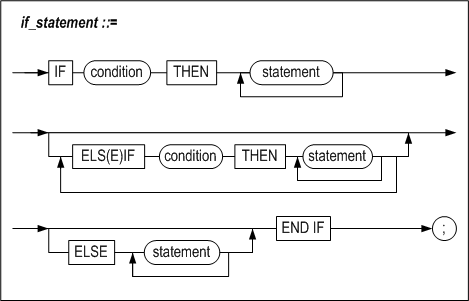

# 4.흐름 제어

### 개요

이 장은 저장 프로시저 바디 내에서의 흐름 제어 방법을 설명한다.

#### 구문


저장 프로시저에서 사용할 수 있는 흐름 제어문은 다음과 같다.

-   조건 분기문인 IF문과 CASE문

-   조건을 만족할 때 반복 수행하는 LOOP문, WHILE문과 FOR문

-   반복 수행문의 흐름을 제어하는 EXIT문와 CONTINUE문

-   아무것도 수행하지 않음을 명시적으로 나타낼 수 있는 NULL문

-   특정 위치로 이동할 수 있는 GOTO문

#### 제약 사항

부질의(subquery)가 포함된 조건은 IF문 또는 CASE문의 조건으로 사용될 수 없다. 단,
아래의 조건은 예외이다:

-   EXIST (subquery)

-   NOT EXIST (subquery)

### IF

#### 구문



#### 기능

조건을 만족하는 경우와 그렇지 않은 경우에 따라 처리 흐름을 분기하는 조건
분기문이다. IF절은 조건은 검사해서 true이면 THEN절로 제어를 이동하고,
false이거나 NULL이면 ELSE절로 제어를 이동한다.

##### condition

조건절에는 SQL문의 WHERE절에서 사용 가능한 모든 술어(predicate)들을 사용할 수
있다. 지원하는 술어들에 대한 상세 내용은 *SQL Reference*의 SELECT 구문을
참조한다.

##### ELS(E)IF

ELS(E)IF절의 경우 이전의 IF문의 조건과는 다른 조건을 명시할 수 있다.

ELSIF는 한 단어이며 하나의 IF문 내에 여러 개의 ELS(E)IF절을 사용할 수 있다.

##### ELSE

앞서IF와 ELS(E)IF에서 열거된 모든 조건을 만족하지 않는 경우 ELSE절의 문장이
수행된다. ELSE절은 명시하거나, 하나의 IF문 내에 한번만 기술 가능하다.

##### 중첩 IF 문

IF문은 다른 IF문 내에 중첩되어 기술할 수 있다. 즉, IF문은 다른 IF, ELS(E)IF 또는
ELSE 문의 결과로 수행되는 일련의 작업 내에 포함될 수 있다. 각 IF 문은 END IF로
종료해야 한다.

#### 예제

##### 예제1

```
CREATE OR REPLACE PROCEDURE proc1
AS
  CURSOR c1 IS SELECT eno, emp_job, salary FROM employees;
  emp_id employee.eno%TYPE;
  e_job employee.emp_job%TYPE;
  e_salary employee.salary%TYPE;
BEGIN
  OPEN c1;
  LOOP
    FETCH c1 INTO emp_id, e_job, e_salary;
    EXIT WHEN c1%NOTFOUND;

    IF e_salary IS NULL THEN
      IF e_job = 'CEO' THEN
        e_salary := 5000;
      ELSIF e_job = 'MANAGER' THEN
        e_salary := 4500;
      ELSIF e_job = 'ENGINEER' THEN
        e_salary := 4300;
      ELSIF e_job = 'PROGRAMMER' THEN
        e_salary := 4100;
      ELSE
        e_salary := 4000;
      END IF;

      UPDATE employees SET salary = e_salary WHERE eno = emp_id;
    END IF;

  END LOOP;
  CLOSE c1;
END;
/

iSQL> SELECT eno, emp_job FROM employees WHERE salary IS NULL;
ENO         EMP_JOB          
--------------------------------
1           CEO              
8           manager          
20          sales rep         
3 rows selected.
iSQL> EXEC proc1;
Execute success.
iSQL> SELECT eno, emp_job, salary FROM employees
WHERE eno=1 OR eno=8 OR eno=20;
ENO         EMP_JOB          SALARY      
---------------------------------------------
1           CEO              5000     
8           manager          4500     
20          sales rep         4000     
3 rows selected.
```


##### 예제2

```
CREATE TABLE t1 (i1 VARCHAR(20), i2 NUMBER, i3 DATE);
CREATE TABLE t2 (i1 VARCHAR(20), i2 NUMBER, i3 DATE);

INSERT INTO t1 VALUES ('21-JUL-2001', 2, '01-JUL-2000');
INSERT INTO t2 VALUES (NULL,NULL,'01-FEB-1990');
INSERT INTO t2 VALUES (NULL,NULL,'02-FEB-1990');

CREATE OR REPLACE FUNCTION func2
(p1 IN DATE, p2 IN CHAR(30))
RETURN NUMBER
AS
BEGIN
  RETURN (TO_NUMBER(TO_CHAR(p1, 'dd')) + TO_NUMBER(p2));
END;
/
CREATE OR REPLACE FUNCTION func1
(p1 IN DATE, p2 IN DATE)
RETURN DATE
AS
BEGIN
  IF p1 >= p2 THEN
    RETURN add_months(p1, 3);
  ELSE
    RETURN add_months(p1, 4);
  END IF;
END;
/

CREATE OR REPLACE PROCEDURE proc1
AS
  v1  VARCHAR(20);
  v2  NUMBER;
  v3  DATE;
BEGIN
  SELECT i1, func2(TO_DATE(i1), TO_CHAR(i3, 'yyyy')), i3
  INTO v1,v2,v3 FROM t1 WHERE i2 = 2;
  INSERT INTO t2 VALUES (v1,v2,v3);

  IF v2 not in (2001, 2002, 2003) AND v1 = '21-JUL-2001' THEN
    UPDATE t2
    SET i1 = func1(v1, '17-JUL-2001'),
        i2 = nvl(i2, 10)
    WHERE i3 = '01-FEB-1990';

    UPDATE t2
    SET i1 = func1(v1, '27-JUL-2001'),
        i2 = nvl(i2, 10*2)
    WHERE i3 = '02-FEB-1990';
  END IF;

END;
/

iSQL> EXEC proc1;
Execute success.
iSQL> SELECT * FROM t2;
T2.I1                 T2.I2       T2.I3                
-----------------------------------------------
21-JUL-2001           2021        2000/07/01 00:00:00  
21-OCT-01             10          1990/02/01 00:00:00  
21-NOV-01             20          1990/02/02 00:00:00  
3 rows selected.

```


##### 예제3

```
CREATE TABLE payroll(
  eno INTEGER,
  bonus NUMBER(10, 2));

CREATE OR REPLACE PROCEDURE proc1
AS
BEGIN
  DECLARe
    CURSOR c1 IS
      SELECT DISTINCT(eno), SUM(qty) FROM orders GROUP BY eno;
      emp_id orders.eno%TYPE;
      sum_qty orders.qty%TYPE;
      bonus NUMBER(10, 2);
    BEGIN
      OPEN c1;
      IF c1%ISOPEN THEN
        LOOP
          FETCH c1 INTO emp_id, sum_qty;
          EXIT WHEN c1%NOTFOUND;
          IF sum_qty > 25000 THEN
            bonus := 1000;
          ELSIF sum_qty > 15000 THEN
            bonus := 500;
          ELSE
            bonus := 200;
          END IF;

        INSERT INTO payroll VALUES(emp_id, bonus);
      END LOOP;
    END IF;
  END;
END;
/

iSQL> EXEC proc1;
Execute success.
iSQL> SELECT DISTINCT(eno), SUM(qty) sum FROM orders GROUP BY eno;
ENO         SUM                  
------------------------------------
12          17870                
19          25350                
20          13210                
3 rows selected.
iSQL> SELECT * FROM payroll;
PAYROLL.ENO PAYROLL.BONUS
-----------------------------
12          500         
19          1000        
20          200         
3 rows selected.

```


### CASE

#### 구문


#### 기능

특정 변수의 값에 따라서 처리 경로를 결정하는 조건 분기문이다.

IF문과 동일한 기능이지만 CASE문을 사용하면 프로그램의 가독성을 높일 수 있다.
CASE문은 위의 다이어그램에서 보여 주 듯이 다음 두 가지가 있다.

-   *case_statement_1*: 조건식이 참일 때에 특정한 문장을 수행하는 방식

-   *case_statemen_2*: 하나의 변수가 특정한 값이 되었을 때에 특정한 문장을
    수행하는 방식

단, 하나의 CASE문에서 이 두 가지 방식을 혼용할 수 없다.

CASE 절을 모두 만족하지 못하면 ELSE절의 문장을 수행하게 되며, ELSE절이 없는
경우에는 어떠한 문장도 수행하지 않는다.

##### condition

검사할 조건을 기술한다. SELECT 구문의 WHERE절과 같이 술어 문으로 명시한다.

##### case_variable

저장 프로지저의 처리를 분기시키는 기준이 되는 변수명을 기술한다.

##### when_value

*case_variable* 변수와 비교할 실제 상수 값을 기술한다.

##### ELSE

CASE 조건식이 모두 거짓이 되었을 때 수행해야 할 처리 구문을 ELSE 절에 기술한다.
ELSE절은 없어도 상관 없으며 하나의 CASE문에 한번 사용 가능하다.

조건식이 모두 거짓이 되었음에도 ELSE절이 없을 경우 CASE문은 어떠한 문장도
수행하지 않고 지나간다.

#### 예제

##### 예제1

```
CREATE OR REPLACE PROCEDURE proc1
AS
  CURSOR c1 IS SELECT eno, emp_job, salary FROM employees;
  emp_id employees.eno%TYPE;
  e_job employees.emp_job%TYPE;
  e_salary employees.salary%TYPE;
BEGIN
  OPEN c1;

  LOOP
    FETCH c1 INTO emp_id, e_job, e_salary;
    EXIT WHEN c1%NOTFOUND;

    IF e_salary IS NULL THEN
      CASE
        WHEN e_job = 'CEO' THEN e_salary := 5000;
        WHEN e_job = 'MANAGER' THEN e_salary := 4500;
        WHEN e_job = 'ENGINEER' THEN e_salary := 4300;
        WHEN e_job = 'PROGRAMMER' THEN e_salary := 4100;
        ELSE e_salary := 4000;
      END CASE;
      UPDATE employees SET salary = e_salary WHERE eno = emp_id;
    END IF;

  END LOOP;

  CLOSE c1;
END;
/

iSQL> EXEC proc1;
Execute success.
iSQL> SELECT eno, emp_job, salary FROM employees
WHERE eno=1 OR eno=8 OR eno=20;
ENO         EMP_JOB          SALARY      
---------------------------------------------
1           CEO              5000     
8           manager          4500     
20          sales rep         4000     
3 rows selected.

```


##### 예제2

```
@SCHEMA.SQL

CREATE OR REPLACE PROCEDURE PROC1
AS
  CURSOR C1 IS SELECT ENO, EMP_JOB, SALARY FROM EMPLOYEES;
  EMP_ID EMPLOYEES.ENO%TYPE;
  E_JOB EMPLOYEES.EMP_JOB%TYPE;
  E_SALARY EMPLOYEES.SALARY%TYPE;
BEGIN
  OPEN C1;

  LOOP
    FETCH C1 INTO EMP_ID, E_JOB, E_SALARY;
    EXIT WHEN C1%NOTFOUND;

    IF E_SALARY IS NULL THEN
      CASE E_JOB
        WHEN 'CEO' THEN E_SALARY := 5000;
        WHEN 'MANAGER' THEN E_SALARY := 4500;
        WHEN 'ENGINEER' THEN E_SALARY := 4300;
        WHEN 'PROGRAMMER' THEN E_SALARY := 4100;
        ELSE E_SALARY := 4000;
      END CASE;
      UPDATE EMPLOYEES SET SALARY = E_SALARY WHERE ENO = EMP_ID;
    END IF;

  END LOOP;

  CLOSE C1;
END;
/

ISQL> SELECT ENO, EMP_JOB FROM EMPLOYEES WHERE SALARY IS NULL;
ENO         EMP_JOB          
--------------------------------
1           CEO              
8           MANAGER          
20          SALES REP         
3 ROWS SELECTED.
ISQL> EXEC PROC1;
EXECUTE SUCCESS.
ISQL> SELECT ENO, EMP_JOB, SALARY FROM EMPLOYEES WHERE ENO=1 OR ENO=8 OR ENO=20;
ENO         EMP_JOB          SALARY      
---------------------------------------------
1           CEO              5000     
8           MANAGER          4500     
20          SALES REP         4000     
3 ROWS SELECTED.

```


### LOOP

#### 구문


#### 기능

LOOP구문은 조건을 따로 지정하지 않고 반복적으로 구문(들)을 수행하고자 하는
경우에 사용된다.

그러나 LOOP 구문에서 EXIT문을 사용하지 않게 되면 무한 LOOP에 빠져서 시스템에
문제를 일으킬 수 있으므로 주의한다.

#### 예제

```
CREATE TABLE item(id INTEGER, counter NUMBER(2));

CREATE OR REPLACE PROCEDURE proc1
AS
BEGIN
  DECLARE
    v_id item.id%TYPE := 501;
    v_counter NUMBER(2) := 1;
  BEGIN
    LOOP
      INSERT INTO item VALUES(v_id, v_counter);
      v_counter := v_counter + 1;
      EXIT WHEN v_counter > 10;
    END LOOP;
  END;
END;
/

iSQL> EXEC proc1;
Execute success.
iSQL> SELECT * FROM item;
ITEM.ID     ITEM.COUNTER
----------------------------
501         1           	
501         2           
…          
501         9           
501         10          
10 rows selected.

```


### WHILE LOOP

#### 구문


#### 기능

조건이 참인 경우만 LOOP을 수행하고자 할 때 사용하는 반복문이다. 만약 처음부터 이
조건이 참이 아니면, WHILE문은 한 번도 수행되지 않는다.

##### condition

LOOP을 수행할 지의 여부를 결정하는 조건절을 명시한다. 조건절에는 SQL문의
WHERE절에서 사용 가능한 모든 술어(predicate)들을 사용할 수 있다.

#### 예제

```
CREATE TABLE t1(i1 INTEGER, i2 INTEGER, i3 INTEGER);

CREATE OR REPLACE PROCEDURE proc1
AS
  v1 INTEGER;
BEGIN
  v1 := 1;

  WHILE v1 < 3 LOOP
    v1 := v1 + 1;
    INSERT INTO t1 VALUES (v1, v1, v1);
    IF v1 = 2 THEN
      CONTINUE;
    END IF;
  END LOOP;

END;
/

iSQL> EXEC proc1;
Execute success.
iSQL> SELECT * FROM t1;
T1.I1       T1.I2       T1.I3       
----------------------------------------
2           2           2           
3           3           3           
2 rows selected.

```


### FOR LOOP

#### 구문


#### 기능

FOR LOOP문은 일정 횟수만큼 반복해서 구문(들)을 수행하고자 할 때 사용된다. 두
개의 점 (“..”)을 사용해서 범위를 지정할 수 있는데 이는 FOR loop에 진입하기 전에
한 번만 체크된다. 범위의 작은 값과 큰 값을 같은 값으로 지정하면, loop내부는 한
번만 실행된다.

##### counter_name

일정한 값만큼 증가, 혹은 감소시킬 변수를 하나 기술한다. 이 변수는 블록의
선언부에 선언할 필요가 없다. 또한 이 변수의 범위는 LOOP과 END LOOP으로 둘러싸여
있는 문장들에만 한정된다. FOR LOOP내에서 이 변수에 새로운 값을 할당할 수 없다.

##### REVERSE

REVERSE 모드를 지정하면 *counter_name* 변수의 값을 *upper_bound*에서
*lower_bound*까지 감소시키면서 FOR 문을 수행한다.

##### lower_bound

*counter_name* 변수가 가질 수 있는 값 중 가장 작은 값이다. 정수형 또는 정수형과
호환성이 있는 표현식을 지정하여야 한다.

여기에는 지역변수를 사용할 수도 있으나, 이 값은 FOR 문이 맨 처음으로 실행될 때에
딱 한번 그 값을 계산하여 저장해 두고 사용하므로, 추후 해당 지역변수를 변경하여도
FOR문의 동작에는 영향을 미치지 않는다.

여기에 실수형을 명시하면 반올림된 정수값으로 변환된다.

##### upper_bound

*counter_name* 변수가 가질 수 있는 값 중 가장 큰 값이다. *lower_bound*와
마찬가지로 정수형 또는 정수형과 호환성이 있는 표현식을 지정하여야 한다. 정수형이
아닌 수를 명시하면 반올림된 정수값으로 변환된다.

만약 FOR 문이 맨 처음으로 수행될 때 *upper_bound*가 *lower_bound*보다 작으면
어떠한 에러도 내지 않고 단지 FOR 문을 건너 뛰고 다음 문장을 수행한다.

*lower_bound* 처럼, 여기에는 지역변수를 사용할 수도 있으나, 이 값은 FOR 문이 맨
처음으로 실행될 때에 딱 한번 그 값을 계산하여 저장해 두고 사용하므로, 추후 해당
지역변수를 변경하여도 FOR문의 동작에는 영향을 미치지 않는다.

##### step_size

증가 또는 감소시킬 값을 지정한다. 생략하면 기본적으로 FOR 문은 *counter_name*
변수를 1씩 증, 혹은 감소 시킨다.

단, *step size*는 1보다 작을 수 없다. 정수형이 아닌 수를 명시한 경우에는
반올림된 정수값으로 변환된다.

#### 예제

##### 예제1

```
CREATE TABLE t6(i1 INTEGER, sum INTEGER);

CREATE OR REPLACE PROCEDURE proc1
AS
  v1 INTEGER;
  sum INTEGER := 0;
BEGIN
  FOR i IN 1 .. 50 LOOP
    v1 := 2 * i - 1;
    sum := sum + v1;
    INSERT INTO t6 VALUES(v1, sum);
  END LOOP;
END;
/

iSQL> EXEC proc1;
Execute success.
iSQL> SELECT * FROM t6;
T6.I1       T6.SUM      
---------------------------
1           1           
3           4           
5           9
…        
97          2401        
99          2500        
50 rows selected.
```


##### 예제2

```
CREATE OR REPLACE PROCEDURE proc1
AS
  eno_count INTEGER;
BEGIN
  SELECT COUNT(eno) INTO eno_count FROM employees;
  FOR i IN 1 .. eno_count LOOP
    UPDATE employees SET salary = salary * 1.2 WHERE eno = i;
  END LOOP;
END;
/

iSQL> SELECT eno, salary FROM employees WHERE eno in (11,12,13);
ENO         SALARY      
---------------------------
11          2750     
12          1890     
13          980      
3 rows selected.

iSQL> EXEC proc1;
Execute success.
iSQL> SELECT eno, salary FROM employees WHERE eno IN (11,12,13);
ENO         SALARY      
---------------------------
11          3300     
12          2268     
13          1176     
3 rows selected.

```


##### 예제3

```
CREATE TABLE t1(i1 INTEGER, i2 INTEGER, i3 INTEGER);

CREATE OR REPLACE PROCEDURE proc1
AS
BEGIN
  <<a>>
  INSERT INTO t1 VALUES (1,1,1);
  IF 1 = 1 THEN
    NULL;
  END IF;
  <<b>>
  FOR v1 IN 1 .. 3 LOOP
    <<c>>
    FOR v1 IN 1 .. 3 LOOP
      INSERT INTO t1 VALUES (b.v1, b.v1, c.v1);
    END LOOP;
  END LOOP;
END;    
/

iSQL> EXEC proc1;
Execute success.
iSQL> SELECT * FROM t1;
T1.I1       T1.I2       T1.I3       
----------------------------------------
1           1           1           
1           1           1           
1           1           2           
1           1           3           
2           2           1           
2           2           2           
2           2           3           
3           3           1           
3           3           2           
3           3           3           
10 rows selected.

--#####################
--	reverse
--#####################

CREATE TABLE t6(i1 INTEGER, sum INTEGER);

CREATE OR REPLACE PROCEDURE proc1
AS  
  sum INTEGER := 0;
BEGIN
  FOR i IN reverse 1 .. 100 LOOP
    sum := sum + i;
    INSERT INTO t6 VALUES(i, sum);
  END LOOP;
END;
/

iSQL> EXEC proc1;
Execute success.
iSQL> SELECT * FROM t6;
T6.I1       T6.SUM      
---------------------------
100         100         
99          199         
98          297
…
3           5047        
2           5049        
1           5050        
100 rows selected.

--#####################
--	step
--#####################

CREATE TABLE t6(i1 INTEGER, sum INTEGER);

CREATE OR REPLACE PROCEDURE proc1
AS  
  sum INTEGER := 0;
BEGIN
  FOR i IN 1 .. 100 STEP 2 LOOP
    sum := sum + i;
    INSERT INTO t6 VALUES(i, sum);
  END LOOP;
END;
/

iSQL> EXEC proc1;
Execute success.
iSQL> SELECT * FROM t6;
T6.I1       T6.SUM      
---------------------------
1           1           
3           4           
5           9
…
97          2401        
99          2500        
50 rows selected.
```


### EXIT

#### 구문


#### 기능

EXIT문을 감싸고 있는 가장 가까운 LOOP 문을 빠져나간다. 그러나 *label_name*이
명시적으로 주어진 경우에는 *label_name*이 정의된 LOOP을 빠져나간다.

LOOP문 내부가 아닌 다른 블록에서 EXIT문을 사용하면 오류가 발생한다.

```
<<outer>>
LOOP
  ...
  LOOP
    ...
    EXIT outer WHEN ...  -- EXIT both LOOPs
  END LOOP;
  ...
END LOOP outer;

EXIT WHEN count > 100;

IF count > 100 THEN  
  EXIT;
END IF;
```

EXIT문은 아래의 LOOP문 내에서 사용 가능하다.

-   LOOP

-   WHILE LOOP

-   FOR LOOP

-   CURSOR FOR LOOP

##### label_name

EXIT문을 감싸고 있는 가장 가까운 LOOP가 아닌 그보다 더 바깥의 LOOP으로
빠져나가야 하는 경우, 해당 LOOP의 바로 앞에 LABEL을 정의하고 그 이름을 여기에
명시한다.

##### WHEN condition

특정 조건이 참인 경우 루프를 빠져나갈 수 있도록 WHEN 절에 조건식을 지정할 수
있다. 조건절에는 SELECT문의 WHERE절에서 사용 가능한 모든 술어들을 사용할 수
있다.

EXIT 문을 만나서 WHEN 절에 명시된 조건이 참이면 저장 프로시저는 가장 가까운
루프나 지정된 LABEL 블록문을 빠져 나가서 그 다음 문장을 수행한다.

EXIT WHEN은 간단한 IF 구문과 유사하다. 다음의 두 문장들은 동일한 기능을 한다.

```
EXIT WHEN count > 100;

IF count > 100 THEN  
   EXIT;
END IF;
```


#### 예제

```
CREATE TABLE stock(
  gno BYTE(5) primary key,
  stock INTEGER,
  price numeric(10,2));

CREATE OR REPLACE PROCEDURE proc1
AS
  CURSOR c1 IS SELECT gno, stock, price FROM goods;
  rec1 c1%ROWTYPE;
BEGIN
  OPEN c1;
  LOOP
    FETCH c1 INTO rec1;
    IF c1%found THEN
      IF rec1.stock > 0 AND rec1.stock < 1000 THEN
        INSERT INTO stock VALUES(rec1.gno, rec1.stock, rec1.price);
      END IF;
    ELSIF c1%NOTFOUND THEN
      EXIT;
    END IF;
  END LOOP;
  CLOSE c1;
END;
/

iSQL> EXEC proc1;
Execute success.
iSQL> SELECT * FROM stock;
STOCK.GNO   STOCK.STOCK STOCK.PRICE
----------------------------------------
A111100002  100         98000       
B111100001  780         35800       
D111100003  650         45100       
E111100001  900         2290.54     
E111100006  900         2338.62     
5 rows selected.

--#####################
--	EXIT WHEN
--#####################

CREATE OR REPLACE PROCEDURE proc1
AS
  CURSOR c1 IS SELECT gno, stock, price FROM goods;
  rec1 c1%ROWTYPE;
BEGIN
  OPEN c1;
  IF c1%ISOPEN THEN
    LOOP
      FETCH c1 INTO rec1;
      EXIT WHEN c1%NOTFOUND;
      IF rec1.stock > 0 AND rec1.stock < 1000 THEN
        INSERT INTO stock VALUES(rec1.gno, rec1.stock, rec1.price);
      END IF;
    END LOOP;
  END IF;
  CLOSE c1;
END;
/

iSQL> EXEC proc1;
Execute success.
iSQL> SELECT * FROM stock;
STOCK.GNO   STOCK.STOCK STOCK.PRICE
----------------------------------------
A111100002  100         98000       
B111100001  780         35800       
D111100003  650         45100       
E111100001  900         2290.54     
E111100006  900         2338.62     
5 rows selected.
```


### CONTINUE

#### 구문


#### 기능

현재 CONTINUE문을 감싸고 있는 LOOP에서 CONTINUE문 이후의 문장들을 전부 무시하고
LOOP의 맨 처음으로 되돌아간다.

CONTINUE문을 사용할 수 있는 LOOP문은 다음과 같다.

-   WHILE

-   FOR

-   CURSOR FOR

LOOP문 내부가 아닌 다른 곳에서 CONTINUE문을 사용하면 오류가 발생한다.

#### 예제

```
CREATE TABLE t8(i1 INTEGER, mathpower INTEGER default 0);

INSERT INTO t8(i1) VALUES(7);
INSERT INTO t8(i1) VALUES(3);
INSERT INTO t8(i1) VALUES(20);
INSERT INTO t8(i1) VALUES(15);
INSERT INTO t8(i1) VALUES(6);
INSERT INTO t8(i1) VALUES(1);
INSERT INTO t8(i1) VALUES(9);

CREATE OR REPLACE PROCEDURE proc1
AS
BEGIN
  DECLARE
    CURSOR c1 IS SELECT i1 FROM t8;
    rec c1%ROWTYPE;
  BEGIN
    OPEN c1;
    LOOP
      FETCH c1 INTO rec;
      EXIT WHEN c1%NOTFOUND;

      IF power(rec.i1, rec.i1) > 50000 THEN
        continue;
      ELSE
        UPDATE t8 SET mathpower = power(rec.i1, rec.i1)
        WHERE i1 = rec.i1;
      END IF;
    END LOOP;
    CLOSE c1;
  END;
END;
/

iSQL> EXEC proc1;
Execute success.
iSQL> SELECT * FROM t8;
T8.I1       T8.MATHPOWER
----------------------------
7           0           
20          0           
15          0           
9           0           
3           27          
6           46656       
1           1           
7 rows selected.
```


### GOTO

#### 구문


#### 기능

지정된 LABEL로 제어를 이동하는 분기문이다.

##### label_name

제어를 이동할 LABEL의 이름이다.

#### 제약 사항

GOTO는 다음과 같은 제약사항을 가진다.

- IF 나 CASE 블록 내에서 사용될 때, THEN, ELS(E)IF, ELSE 또는 WHEN 문에
  해당하는 블록 안으로 이동할 수 없다. 따라서 아래 예제의 경우 에러를
  출력한다.

  ```
  CREATE OR REPLACE PROCEDURE PROC1
  AS
      V1 INTEGER;
  BEGIN
      V1 := 1;
      IF V1 = 1 THEN
          GOTO LABEL1;
      ELSE
          <<LABEL1>>
          PRINTLN(V1);
      END IF;
  END;
  /
  [ERR-3120F : Illegal GOTO statement.
  In PROC1
  0007 :     GOTO LABEL1;
                 ^     ^
  ]
  ```


- 외부 블록에서 내부 블록으로 이동할 수 없다. 모든 BEGIN/END 블록 및 LOOP
  문장에 이 제약 조건이 적용된다.

  ```
  CREATE OR REPLACE PROCEDURE PROC1
  AS
      V1 INTEGER;
  BEGIN
      V1 := 1;
      DECLARE
          V2 INTEGER;
      BEGIN
          <<LABEL1>>
          V2 := 1;
      END;
      GOTO LABEL1;
  END;
  /
  [ERR-3120F : Illegal GOTO statement.
  In PROC1
  0012 :   GOTO LABEL1;
               ^     ^
  ]
  ```


#### 예제

\<예제 1\> 예외 처리부에서 분기하는 경우, 그 예외 처리부가 속한 블록으로는 분기할 수
없다. 따라서 다음의 예제1은 에러를 반환한다.

```
CREATE OR REPLACE PROCEDURE PROC1
AS
    E1 EXCEPTION;
BEGIN
    RAISE E1;
    <<LABEL1>>
    PRINTLN('END');
    EXCEPTION
        WHEN E1 THEN
        GOTO LABEL1;
END;
/
[ERR-3120F : Illegal GOTO statement.
In PROC1
0010 :       GOTO LABEL1;
                 ^     ^
]
```


\<예제 2\> 그러나, 예외 처리부로부터 그 상위 블록으로의 분기는 가능하다. 예제2 의 경우 V1이
5가 될 때까지 EXCEPTION을 4번 발생시키고 정상으로 종료한다.

```
CREATE OR REPLACE PROCEDURE PROC1
AS
    E1 EXCEPTION;
    V1 INTEGER;
BEGIN
    V1 := 1;
    <<LABEL1>>
    V1 := V1 + 1;
    PRINTLN('BLOCK1');
    BEGIN
        PRINTLN('BLOCK2');
        PRINTLN(V1);
        IF V1 = 5 THEN
            PRINTLN('goto label2 '||v1);
            GOTO LABEL2;
        ELSE
            RAISE E1;
        END IF;
        EXCEPTION
            WHEN E1 THEN
            PRINTLN('goto label1 '|| v1);
            GOTO LABEL1;
    END;
    <<LABEL2>>
    PRINTLN('BLOCK1 AFTER BLOCK2');
END;
/

iSQL> EXEC PROC1;
BLOCK1
BLOCK2
2
goto label1 2
BLOCK1
BLOCK2
3
goto label1 3
BLOCK1
BLOCK2
4
goto label1 4
BLOCK1
BLOCK2
5
goto label2 5
BLOCK1 AFTER BLOCK2
Execute success.
```


### NULL

#### 구문


#### 기능

NULL문은 흐름에 영향을 미치지 않고 아무것도 수행하지 않고 다음으로 넘어감을
명시적으로 나타내기 위해서 사용한다. 프로그램의 가독성을 높이기 위해서 사용한다.

#### 예제

```
CREATE OR REPLACE PROCEDURE bonus (amount NUMBER(10,2))
AS
  CURSOR c1 IS SELECT eno, sum(qty) FROM orders group by eno;
  order_eno orders.eno%TYPE;
  order_qty orders.qty%TYPE;
BEGIN
  OPEN c1;
  LOOP
    FETCH c1 INTO order_eno, order_qty;
    EXIT WHEN c1%NOTFOUND;
    IF order_qty > 20000 THEN
      UPDATE employees SET salary = salary + amount
      WHERE eno = order_eno;
    ELSE
      NULL;
    END IF;
  END LOOP;
  CLOSE c1;
END;
/

iSQL> SELECT e.eno, salary, sum(qty)
FROM employees e, orders o
WHERE e.eno = o.eno
group by e.eno, salary;
ENO         SALARY      SUM(QTY)             
-----------------------------------------------
12          1890        17870                
19          1800        25350                
20                      13210                
3 rows selected.
iSQL> EXEC bonus(75);
Execute success.
iSQL> SELECT eno, salary FROM employees WHERE eno = 19;
ENO         SALARY      
---------------------------
19          1875     
1 row selected.
```


