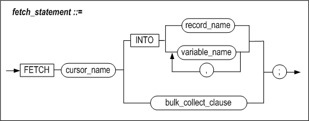
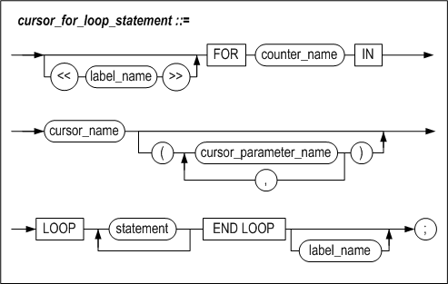
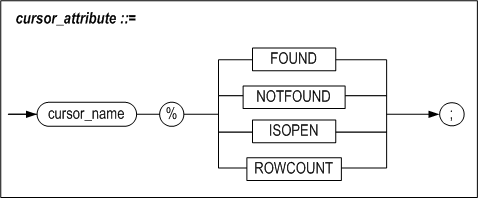

# 5.커서

이 장은 커서를 관리하고 사용하는 방법을 설명한다.


### 커서의 개요

저장 프로시저 내에서 테이블의 레코드를 읽어 오는 방법에는 SELECT INTO문을
사용하는 방법과 커서를 사용하는 방법이 있다.

SELECT INTO문의 경우 결과 레코드의 수는 반드시 한 개여야 하고 그 이외의 경우
오류가 발생한다. 따라서 여러 개의 레코드를 검색해야 할 경우 커서를 사용해야
한다.

#### 커서 선언

커서는 저장 프로시저 블록의 선언부에 커서명과 함께 수행할 SELECT문을 정의해야
한다. 이는 선언된 후에, 아래 2가지 방법 중의 하나로 관리될 수 있다.

-   OPEN, FETCH, CLOSE 사용

-   Cursor FOR LOOP 사용

#### OPEN, FETCH와 CLOSE로 커서 관리하기

커서는 블록 바디 내에서 OPEN, FETCH, CLOSE 문을 사용해서 관리할 수 있다.
OPEN문은 커서를 초기화하는데 사용된다. FETCH문은 레코드를 반복적으로 가져오는데
사용된다. 마지막으로 CLOSE문은 커서를 해제한다.

##### OPEN

커서를 사용하기 위해서 커서와 관련된 모든 리소스들을 초기화 하는 단계이다. 커서
정의 시에 사용자 파라미터를 지정한 경우 OPEN 구문에서 파라미터의 값을 전달해야
한다.

##### FETCH

커서의 SELECT문을 만족하는 결과 집합으로부터 한 번에 한 레코드씩 가져와서 사용자
변수에 저장한다. 별도의 변수에 각 칼럼을 저장할 수도 있고, 전체 레코드를
%ROWTYPE을 사용해서 정의한 RECORD 타입 변수에 저장할 수도 있다.

RECORD 타입 변수에 대한 설명은 [6장 사용자 정의 타입](#6사용자-정의-타입)을 참고하기 바란다.

##### CLOSE

사용이 끝난 커서의 리소스를 해제한다. OPEN문을 사용해서 열어둔 커서는 해당
프로시저가 종료되기 전에 반드시 CLOSE문을 사용해서 닫아야 한다.

#### Cursor FOR LOOP 로 커서 관리하기

커서의 OPEN, FETCH, CLOSE 단계를 한번에 수행하는 LOOP문의 하나이다. 결과
레코드가 존재하지 않을 때까지 LOOP를 반복 수행한다. 커서에 대해서 명시적으로
OPEN문이나 CLOSE문을 사용할 필요가 없는 경우에 편리한 구문이다.

### CURSOR

#### 구문


#### 기능

커서를 정의한다. CURSOR구문에서는 커서명과 커서가 레코드를 가져오는 데 사용할
SELECT문을 명시해야 한다.

##### cursor_name

OPEN, FETCH, CLOSE 및 Cursor FOR LOOP에서 참조할 커서의 이름을 지정한다.

##### cursor_parameter_declaration

커서의 SELECT문에 인자가 필요한 경우, 프로시저의 파라미터를 지정하는 문법과 같은
방법으로 파라미터들을 지정할 수 있다. 이 인자들은 다음과 같은 제약이 있다.

-   커서 인자는 SELECT문 안에서만 사용할 수 있다

-   %ROWTYPE 은 사용할 수 없다.

-   커서 인자는 OUT 또는 IN/OUT 인자일 수 없다.

이 파라미터들은 커서 OPEN이나 커서 FOR문으로부터 값을 받아서 SELECT문을 수행하게
된다.

```
DECLARE
  CURSOR c1 IS
    SELECT empno, ename, job, sal
    FROM emp
    WHERE sal > 2000;
  CURSOR c2
    (low INTEGER DEFAULT 0,
    high INTEGER DEFAULT 99) IS
    SELECT ......;
```


##### data_type

3장의 “지역 변수 선언” 절을 참고한다.

#### 예제

```
CREATE TABLE highsal
 (eno INTEGER, e_firstname CHAR(20), e_lastname CHAR(20), salary NUMBER(10,2));

CREATE OR REPLACE PROCEDURE proc1
AS
BEGIN
  DECLARE
   CURSOR c1 IS
     SELECT eno, e_firstname, e_lastname, salary FROM employees
   WHERE salary IS not NULL
   ORDER BY salary desc;
   emp_first CHAR(20);
   emp_last CHAR(20);
   emp_no INTEGER;
   emp_sal NUMBER(10,2);
  BEGIN
   OPEN c1;
   FOR i IN 1 .. 5 LOOP
     FETCH c1 INTO emp_no, emp_first, emp_last, emp_sal;
     EXIT WHEN c1%NOTFOUND;
     INSERT INTO highsal VALUES(emp_no, emp_first, emp_last, emp_sal);
   END LOOP;
   CLOSE c1;
 END;
END;
/
iSQL> EXEC proc1;
EXECUTE success.
iSQL> SELECT * FROM highsal;
ENO         E_FIRSTNAME           E_LASTNAME            SALARY
-------------------------------------------------------------------------
10          Elizabeth             Bae                   4000
11          Zhen                  Liu                   2750
5           Farhad                Ghorbani              2500
16          Wei-Wei               Chen                  2300
14          Yuu                   Miura                 2003
5 rows selected.
```


### OPEN

#### 구문


#### 기능

이 구문은 커서를 초기화하고, 쿼리를 수행하여 결과 집합을 결정하는 데 사용된다.
이 후에 FETCH문을 사용해서 데이터를 가져올 수 있다.

이 구문을 실행하면 Altibase는 커서 사용에 필요한 모든 리소스들을 할당한다.

이미 OPEN된 커서를 다시 OPEN하려고 시도하면 CURSOR_ALREADY_OPEN 에러가 발생한다.

##### cursor_name

OPEN 하고자 하는 커서의 이름을 지정한다.

이 커서는 블록의 선언부에 선언되어 있어야 한다.

##### cursor_parameter_name

커서에 사용자 파라미터가 명시된 경우 전달할 값을 지정한다. 인자를 가지는 커서의
경우, 아래와 같이 선언한다.

```
DECLARE
 CURSOR c1(pname VARCHAR(40), pno INTEGER) IS
  SELECT empno, ename, job, sal
  FROM emp
  WHERE eame = pname;
BEGIN
 OPEN c1;
 ......
END;
```

인자가 존재하는 경우 다음과 같이 커서 OPEN시 값을 넘겨준다.

```
OPEN c1(emp_name, 100);
OPEN c1('mylee', 100);
OPEN c1(emp_name, dept_no);
```


#### 예제

##### 예제1

```
CREATE TABLE mgr
(mgr_eno INTEGER, mgr_first CHAR(20), mgr_last CHAR(20), mgr_dno SMALLINT);

CREATE OR REPLACE PROCEDURE proc1
AS
BEGIN
 DECLARE
  CURSOR emp_cur IS
   SELECT eno, e_firstname, e_lastname, dno FROM employees
   WHERE emp_job = 'manager';
   emp_no employees.eno%TYPE;
   emp_first employees.e_firstname%TYPE;
   emp_last employees.e_lastname%TYPE;   
   emp_dno employees.dno%TYPE;
 BEGIN
  OPEN emp_cur;
  LOOP
   FETCH emp_cur INTO emp_no, emp_first, emp_last, emp_dno;
   EXIT WHEN emp_cur%NOTFOUND;
   INSERT INTO mgr VALUES(emp_no, emp_first, emp_last, emp_dno);
  END LOOP;
  CLOSE emp_cur;
 END;
END;
/
iSQL> EXEC proc1;
Execute success.
iSQL> select * from mgr;
MGR.MGR_ENO MGR.MGR_FIRST         MGR.MGR_LAST          MGR.MGR_DNO
-------------------------------------------------------------------------
7           Gottlieb              Fleischer             4002
8           Xiong                 Wang                  4001
16          Wei-Wei               Chen                  1001
3 rows selected.
```


##### 예제2

```
CREATE TABLE t1(i1 INTEGER, i2 INTEGER, i3 INTEGER);

CREATE TABLE t2(i1 INTEGER, i2 INTEGER, i3 INTEGER);

INSERT INTO t1 VALUES(1,1,1);
INSERT INTO t1 VALUES(2,2,2);
INSERT INTO t1 VALUES(30,30,30);
INSERT INTO t1 VALUES(50,50,50);

CREATE OR REPLACE PROCEDURE proc1
AS
 CURSOR c1(k1 INTEGER, k2 INTEGER, k3 INTEGER) IS
  SELECT * FROM t1
  WHERE i1 <= k1 AND i2 <= k2 AND i3 <= k3;
BEGIN
 FOR rec1 IN c1(2,2,2) LOOP
  INSERT INTO t2 VALUES (rec1.i1, rec1.i2, rec1.i3);
 END LOOP;
END;
/
iSQL> SELECT * FROM t2;
T2.I1      T2.I2      T2.I3
----------------------------------------
No rows selected.
iSQL> EXEC proc1;
EXECUTE success.
iSQL> SELECT * FROM t2;
T2.I1      T2.I2      T2.I3
----------------------------------------
1          1          1
2          2          2
2 rows selected.
```


### FETCH

#### 구문




#### 기능

OPEN된 커서로부터 하나의 행을 가져와서 INTO절에 명시된 변수에 그 값을 저장한다.

이 때, 커서의 SELECT문에 명시한 칼럼들에 상응하는 사용자변수를 각각 나열해서
칼럼 별로 각각 저장하거나, RECORD 타입 변수명만 명시해서 커서로부터 가져온 한
행을 RECORD 타입 변수에 저장되도록 할 수도 있다.

FETCH문에 RECORD타입 변수를 사용하는 데는 다음과 같은 제약이 있다.

-   가져온 한 행을 저장하는데 오직 한 개의 RECORD 타입 변수만 사용할 수 있다.

-   SELECT문에서 가져오는 모든 칼럼들을 한 RECORD 타입 변수에 저장할 수 있어야
    한다.

-   RECORD 타입 변수는 일반 변수와 섞어서 사용할 수 없다.

만약 OPEN되지 않은 커서로부터 FETCH를 하려고 시도하면 INVALID_CURSOR 오류가
발생한다.

##### cursor_name

FETCH 하고자 하는 커서의 이름을 지정한다. 이 커서는 블록의 선언부에 선언되어
있어야 한다.

##### record_name

커서의 SELECT 문이 반환하는 레코드를 받을 RECORD 타입 변수명을 지정한다. 이때
사용되는 RECORD 타입 변수는 SEELCT구문의 select list와 칼럼의 개수가 같고 타입이
순서대로 정확히 일치해야 한다.

따라서 커서의 SELECT문이 한 테이블의 모든 칼럼을 가져오는 경우, 그 테이블에 대해
%ROWTYPE속성을 사용해서 선언한 RECORD 타입 변수를 주로 사용하게 된다.

##### variable_name

값을 저장할 변수의 이름이다. 이 변수들의 개수는 커서의 SELECT 문에서 명시한
칼럼의 개수와 동일해야 한다. 또한 나열한 변수의 순서대로 상응하는 칼럼의 타입과
각각 일치해야 한다.

```
LOOP
  FETCH c1 INTO my_name, my_empno, my_deptno;
  EXIT WHEN c1%NOTFOUND;
END LOOP;
```


##### fetch_bulk_collect_clause

LIMIT 구문을 사용하면 BULK COLLECT절에서 반환되는 행의 개수를 조정할 수 있다.
BULK COLLECT절의 자세한 설명은 SELECT INTO구문의 BULK COLLECT절 설명을 참조한다.

#### 예제

##### 예제 1

```
CREATE TABLE emp_temp(eno INTEGER, e_firstname CHAR(20), e_lastname CHAR(20));
CREATE OR REPLACE PROCEDURE proc1
AS
BEGIN
 DECLARE
 CURSOR c1 IS SELECT eno, e_firstname, e_lastname FROM employees;
  emp_rec c1%ROWTYPE;
 BEGIN
  OPEN c1;
  LOOP
   FETCH c1 INTO emp_rec;
   EXIT WHEN c1%NOTFOUND;
   INSERT INTO emp_temp
   VALUES(emp_rec.eno, emp_rec.e_firstname, emp_rec.e_lastname);
  END LOOP;
  CLOSE c1;
 END;
END;
/
iSQL> select eno, e_firstname, e_lastname from emp_temp;
ENO         E_FIRSTNAME           E_LASTNAME
------------------------------------------------------------
1           Chan-seung            Moon
2           Susan                 Davenport
3           Ken                   Kobain
.
.
.
18          John                  Huxley
19          Alvar                 Marquez
20          William               Blake
20 rows selected.
```


##### 예제 2

```
iSQL> create table emp_temp(eno integer, e_firstname char(20), e_lastname char(20));
Create success.iSQL> select * from emp_temp;
EMP_TEMP.ENO EMP_TEMP.E_FIRSTNAME  EMP_TEMP.E_LASTNAME
-------------------------------------------------------------
1             Chan-seung              Moon
2             Susan                    Davenport
3             Ken                      Kobain
4             John                     Huxley
5             Alvar                    Marquez
6             William                  Blake
6 rows selected.

iSQL> create or replace procedure proc1 as
type emp_rec is record(eno integer, e_firstname char(20), e_lastname char(20));
type emp_arr is table of emp_rec index by integer;
cursor c1 is select * from emp_temp;
arr1 emp_arr;
begin
open c1;
loop
fetch c1 bulk collect into arr1 limit 4;
exit when c1%NOTFOUND;
println('count : '|| arr1.count());
end loop;
close c1;
end;
/
iSQL>exec proc1;
count : 4
count : 2
Execute success.
```


### CLOSE

#### 구문


#### 기능

열려있는 커서를 닫고 해당 커서에 할당된 리소스를 해제한다.

커서가 열려있지 않았거나, 이미 닫힌 커서를 닫으려고 하면 INVALID_CURSOR 에러가
발생한다.

사용자가 커서를 명시적으로 CLOSE하지 않아도 커서가 선언된 블록을 빠져나가게 되면
자동으로 CLOSE 되지만, 커서를 CLOSE 한다는 것은 커서와 관련된 모든 리소스를
시스템에 반납한다는 것을 의미하므로, 사용이 끝난 커서는 즉시 CLOSE해주는 것이
바람직하다.

##### cursor_name

CLOSE하고자 하는 커서의 이름을 명시한다.

#### 예제

```
CLOSE c1;
```


### Cursor FOR LOOP

#### 구문



#### 기능

커서 열기, 결과 가져오기와 커서 닫기를 자동으로 처리하는 기능을 한다.

Cursor FOR LOOP은 블록 선언부에 선언한 커서를 이용하여, 한 번의 LOOP를 수행할
때마다 쿼리 실행 결과를 한 행씩 반환한다. 이 때 하나의 행은 RECORD타입의 변수에
저장되고 루프안에서 이를 자유롭게 사용할 수 있다.

##### label\_ name

EXIT문이나 CONTINUE문에서 LOOP을 지칭하는데 필요한 LABEL을 명시할 수 있다.

##### counter_name

커서를 이용하여 FETCH된 하나의 행이 저장될 RECORD타입의 변수명을 지정한다. 이
변수는 블록의 선언부에 선언되어 있지 않아도 FETCH된 행이 가지는 칼럼의 개수와
타입에 맞춰서 자동으로 생성된다.

이렇게 생성된 변수는 *counter_name*.*column_name* 형식으로 참조할 수 있다. 이때
*column_name*은 SELECT구문의 select list 에 존재하는 칼럼의 이름과 동일하다.
따라서 select list에 연산식을 사용한 경우는 해당 연산식에 별칭 (alias)를
지정하여 참조 가능하도록 만들어야 한다.

##### cursor_name

루프 안에서 사용하게 될 커서의 이름를 지정한다. 이 커서는 블록의 선언부에
선언되어 있어야 한다.

##### cursor_parameter_name

OPEN절의 “cursor_parameter_name”을 참조한다.

#### 예제

```
CREATE TABLE emp_temp(eno INTEGER, e_firstname CHAR(20), e_lastname CHAR(20));

CREATE OR REPLACE PROCEDURE proc1
AS
BEGIN
  DECLARE
    CURSOR c1 IS SELECT eno, e_firstname, e_lastname FROM employees;
  BEGIN
    FOR emp_rec IN c1 LOOP
      INSERT INTO emp_temp VALUES(emp_rec.eno, emp_rec.e_firstname, emp_rec.e_lastname);
    END LOOP;
  END;
END;
/

iSQL> EXEC proc1;
Execute success.
iSQL> SELECT * FROM emp_temp;
ENO         E_FIRSTNAME           E_LASTNAME
------------------------------------------------------------
1           Chan-seung            Moon
2           Susan                 Davenport
.
.
.
19          Alvar                 Marquez
20          William               Blake
20 rows selected.
```


### 커서 속성

저장 프로시저 내에서 커서와 관련된 수행 도중 커서의 상태를 파악하기 위해서
Altibase가 관리하고 있는 속성값들을 참조할 수 있다.

#### 구문



#### 기능

특정 커서의 속성을 참조할 수 있다. 정수형을 반환하는 ROWCOUNT커서 속성을
제외하고, 커서 속성은 커서의 상태를 나타내는 BOOLEAN형의 표현식이다.

커서의 현재 상태에 따라 각각의 속성 값은 TRUE또는 FALSE일 수 있다.

사용자는 DECLARE 구문에 직접 정의한 커서의 속성 값뿐만 아니라 시스템에서 정의한
암시적 커서의 속성 값도 참조할 수 있다. 암시적 커서는 DELETE, UPDATE, INSERT와
한 건의 레코드가 반환되는 SELECT INTO 구문을 위해 선언된다. 이는 가장 최근에
수행된 SQL 구문에 해당하는 커서의 속성 값을 갖는다.

##### %FOUND

커서에 명시한 SELECT문의 조건을 만족하는 행이 존재하는지 여부를 나타낸다. 단,
다음의 경우에는 조건을 만족하는 행의 존재 여부에 상관없이 %FOUND의 값이 무조건
FALSE 이다.

-   열지 않은 커서

-   FETCH 를 한번도 하지 않은 커서

-   이미 닫은 커서

암시적 커서의 경우는 DELETE, UPDATE, INSERT문의 수행 결과로 1건 이상이 영향을
받거나, SELECT INTO의 반환되는 레코드가 1건 이상일 때, %FOUND의 값은 TRUE가
된다.

그러나 SELECT INTO의 반환되는 레코드가 2건 이상일 때에는 %FOUND를 검사하기 전에
TOO_MANY_ROWS 예외가 발생하므로, 이 경우 %FOUND 커서 속성이 아닌 예외로 처리해야
한다.

%FOUND속성의 값은 다음과 같이 참조할 수 있다.

```
DELETE FROM emp;
  IF SQL%FOUND THEN     -- delete succeeded
    INSERT INTO emp VALUES ( ...... );
  ......
  END IF;
```


##### %NOTFOUND

커서에 명시한 SELECT문의 조건을 만족하는 행이 존재하는지 여부를 나타낸다. 항상
%FOUND와 반대의 값을 가진다.

암시적 커서의 경우는 DELETE, UPDATE, INSERT 구문이 성공적으로 수행되었으나
영향을 받은 레코드가 하나도 없거나, 또는 SELECT INTO가 반환하는 레코드가 하나도
없을 때, %NOTFOUND의 값이 TRUE로 된다. 그러나 SELECT INTO가 반환하는 레코드가
없을 때는 %NOTFOUND 속성을 검사하기 전에 NO_DATA_FOUND 예외가 발생하므로,
%NOTFOUND 커서 속성이 아닌 예외로 처리해야 한다.

%NOTFOUND속성의 값은 다음과 같이 참조할 수 있다.

```
DELETE FROM emp;
  IF SQL%NOTFOUND THEN
  ......
  END IF;
```


##### %ISOPEN

커서가 열렸는지 여부를 나타낸다. 커서를 닫으면 이 값은 FALSE가 된다.

%ISOPEN의 값은 다음과 같이 참조할 수 있다.

```
OPEN c1;  -- CURSOR OPEN
  IF c1%ISOPEN THEN     
  ......
  END IF;
```


##### %ROWCOUNT

커서를 사용하여 현재 몇 개의 행을 FETCH 하였는지를 나타낸다.

주의할 점은 %ROWCOUNT는 커서의 SELECT문을 만족하는 행의 수가 아니라, FETCH를
성공할 때마다 1씩 증가한다는 것이다. FETCH 를 한번도 하지 않은 커서의 경우
%ROWCOUNT는 0이다.

열기 전의 커서와 닫은 이후의 커서에 대해 속성을 참조하면 INVALID_CURSOR 에러를
반환한다.

```
DELETE FROM emp;
  IF SQL%ROWCOUNT > 10 THEN     
  ......
  END IF;
```


#### 예제

##### 예제1

```
CREATE TABLE t1(i1 INTEGER, i2 INTEGER, i3 INTEGER);

CREATE TABLE t3(i1 INTEGER);
INSERT INTO t1 VALUES(2,2,2);

CREATE OR REPLACE PROCEDURE proc1
AS
  v1 INTEGER;
BEGIN
  SELECT i1 INTO v1 FROM t1 WHERE i1 = 2;
  IF SQL%found THEN
    INSERT INTO t1 SELECT * FROM t1;

    v1 := SQL%ROWCOUNT;
    INSERT INTO t3 VALUES(v1);
  END IF;
END;
/

iSQL> EXEC proc1;
Execute success.
iSQL> SELECT * FROM t3;
T3.I1       
--------------
1           
1 row selected.
```


##### 예제2

```
CREATE TABLE t1(i1 INTEGER, i2 INTEGER, i3 INTEGER);

CREATE TABLE t2(i1 INTEGER, i2 INTEGER, i3 INTEGER);

CREATE TABLE t3(i1 INTEGER);
INSERT INTO t1 VALUES(1,1,1);
INSERT INTO t1 VALUES(1,1,1);
INSERT INTO t1 VALUES(1,1,1);

CREATE OR REPLACE PROCEDURE proc1
AS
  CURSOR c1 IS SELECT * FROM t1;
  v1 INTEGER;
  v2 INTEGER;
  v3 INTEGER;
BEGIN
  OPEN c1;

  IF c1%ISOPEN  THEN
    LOOP
      FETCH c1 INTO v1, v2, v3;
        IF c1%FOUND THEN
          INSERT INTO t2 VALUES (v1, v2, v3);
        ELSIF c1%NOTFOUND THEN
          EXIT;
        END IF;
    END LOOP;
  END IF;

    v1 := c1%ROWCOUNT;
    INSERT INTO t3 VALUES (v1);
  CLOSE c1;
END;
/

iSQL> EXEC proc1;
Execute success.
iSQL> SELECT * FROM t1;
T1.I1       T1.I2       T1.I3       
----------------------------------------
1           1           1           
1           1           1           
1           1           1           
3 rows selected.
iSQL> SELECT * FROM t2;
T2.I1       T2.I2       T2.I3       
----------------------------------------
1           1           1           
1           1           1           
1           1           1           
3 rows selected.
iSQL> SELECT * FROM t3;
T3.I1       
--------------
3           
1 row selected.
```


##### 예제3

```
CREATE TABLE emp_temp(eno INTEGER, e_firstname CHAR(20), e_lastname CHAR(20));

CREATE OR REPLACE PROCEDURE proc1
AS
BEGIN
 DECLARE
  CURSOR c1 IS SELECT eno, e_firstname, e_lastname FROM employees;
   emp_rec c1%ROWTYPE;
 BEGIN
  OPEN c1;

  LOOP
   FETCH c1 INTO emp_rec;
   EXIT WHEN c1%ROWCOUNT > 10 OR c1%NOTFOUND;
   INSERT INTO emp_temp
   VALUES(emp_rec.eno, emp_rec.e_firstname, emp_rec.e_lastname);
  END LOOP;

  CLOSE c1;
 END;
END;
/
iSQL> EXEC proc1;
EXECUTE success.
iSQL> SELECT * FROM emp_temp;
ENO         E_FIRSTNAME           E_LASTNAME
------------------------------------------------------------
1           Chan-seung            Moon
2           Susan                 Davenport
3           Ken                   Kobain
4           Aaron                 Foster
5           Farhad                Ghorbani
6           Ryu                   Momoi
7           Gottlieb              Fleischer
8           Xiong                 Wang
9           Curtis                Diaz
10          Elizabeth             Bae
10 rows selected.
```


