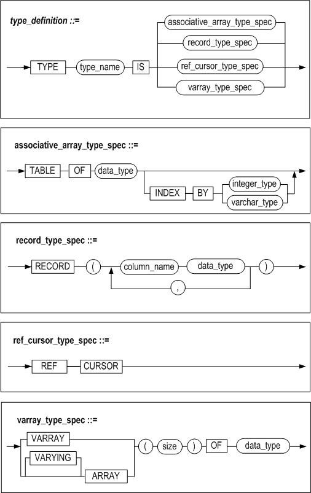
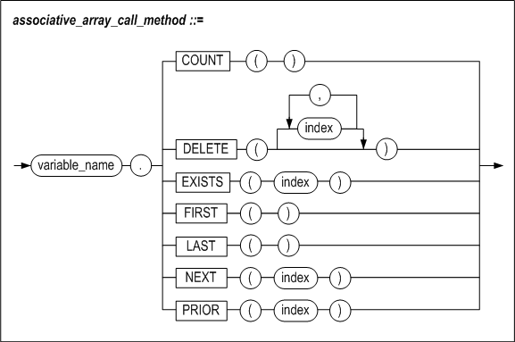
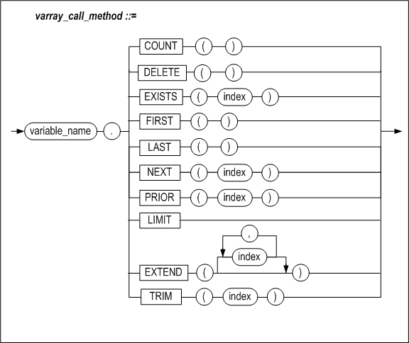

# 6.사용자 정의 타입

이 장에서는 저장 프로시저와 저장 함수에서 사용할 수 있는 사용자 정의 타입에
대해서 설명하고 있다.


### 개요

사용자 정의 타입인 RECORD 타입, Associative Arrays, VARRAY는 데이터를 논리적 단위로
구성하여 처리하는 기능을 제공한다. 이들 타입은 저장 프로시저나 함수의 인자 또는 리턴 타입으로 사용될 수 있다. 하지만, 클라이언트로는 해당 타입의 값을 전송할 수 없다. 현재 precompiler(apre)에서 제한적으로 Associative Array와 VARRAY 는 지원한다.

#### RECORD타입

RECORD타입은 칼럼의 집합으로 이루어진 사용자 정의 데이터 타입이다. 이를 이용하여
각각의 서로 다른 종류의 데이터들을 논리적 단위로 구성하여 처리할 수 있다. 예를
들어 이름 , 급여, 부서 등의 서로 다른 데이터들을 ‘사원’ 이라는 하나의 데이터로
처리하는 경우 하나의 RECORD 타입으로 묶어 처리할 수 있다. 블록안에 정의된
RECORD타입의 범위는 지역적이다. 즉, 그 타입을 정의한 블록 내에서만 사용할 수
있다.

RECORD타입의 정의는 6장의 “사용자 정의 타입의 정의” 절을 참고한다. 정의하는
방법을 제외한 다른 사용방법은 %ROWTYPE속성을 사용해서 선언하는 RECORD 타입
변수와 동일하다.

#### Associative Arrays

Associative Array는 해시 테이블과 유사하다. Associative Array는 키-값 쌍의
집합이다. 각 키는 유일한 값이어야 하고, 키에 상응하는 값에 접근할 때 사용된다.
다음의 문법으로 접근할 수 있다.

```
variable_name[index] 
또는
variable_name(index)
```

키 (*index*)의 데이터 타입은 INTEGER 또는 VARCHAR이어야 한다. Associative
Array를 이용하여 데이터의 개수와 상관없이 동일한 타입의 데이터들을 하나의 단위로
묶어 처리를 할 수 있다. 예를 들어 사원들중 사원번호 1\~100까지의 사원 데이터를
처리하는 경우 100개의 데이터를 하나의 Associative Array로 처리할 수 있다.

Associative Array의 선언 방법은 6장의 “사용자 정의 타입의 정의” 절을 참고한다.

Associative Array변수의 배열 요소 접근을 위해서는 다음과 같이 대괄호( [ ] ) 또는
소괄호(())를 사용한다.

예1) V1[ 1 ] := 1;

예2) V2( 1 ) := 1;

#### VARRAY

VARRAY 타입은 동일한 데이터 타입의 연속된 데이터를 저장할 수 있는 ARRAY 형식의 사용자 정의 데이터 타입이다.

VARRAY의 키(index)는 INTEGER 타입이며, 타입을 선언할 때 설정한 size 만큼 사용할 수 있다. 키는 1부터 시작하며 최대 2,147,483,647개까지 설정할 수 있다.

각 VARRAY 변수마다 VARRAY_MEMORY_MAXIMUM 프로퍼티로 설정한 메모리 크기 내에서 사용할 수 있다. 프로퍼티에 대한 자세한 정보는 *General Reference*를 참고 한다.

VARRAY의 선언 방법은 6장의 "사용자 정의 타입의 정의" 절을 참고한다.

VARRAY 변수를 사용하려면 생성자를 통해서 초기화를 해야 한다. 아래와 같이 생성자로 변수를 초기화할 수 있다.

```
variable_name := type_name( ); 
또는 
variable_name := type_name( 초기값1, 초기값2, ..., 초기값*N* );
```

초기화를 한 다음 확장을 통해서 사용할 공간을 확보해야 한다. 확장은 1씩 할 수도 있고, 여러 개를 한 번에 확장할 수 있다. 변수를 확장하는 방법은 6장의 "VARRAY 관련 함수" 절의 EXTEND 함수를 참고한다.

VARRAY 변수를 BULK COLLECT절에 사용하는 경우는 초기화 및 확장을 하지 않고 사용할 수 있다. BULK COLLECT 절에서 VARRAY 타입 변수를 사용한 예제는 6장의 "저장 프로시저내에서 사용자 정의 타입 변수의 사용"에서 VARRAY 타입 예제을 참고 한다.

VARRAY 변수의 배열 요소 접근 방법은 Associative Array와 동일하다. 차이점은 VARRAY 변수는 ARRAY 중간의 요소를 삭제할 수 없다. VARRAY 변수는 전체를 삭제하거나, 제일 마지막 요소부터 삭제할 수 있다. 배열 요소의 삭제 방법은 6장의 "VARRAY 관련 함수" 절의 TRIM 함수와 DELETE 함수를 참고한다.

#### REF CURSOR (커서 변수)

커서 변수는 다중 레코드를 검색하는 동적 SQL문에서 사용할 수 있는 변수이다.
이러한 커서 변수는 특정 질의문에 종속되지 않기 때문에 커서보다 훨씬 유연하다.
저장 프로시저 또는 함수간 인자로 전달이 가능하고, 클라이언트로도 전달할 수 있다.

커서와 다른 점은 커서는 항상 선언시에 명시한 질의문만 참조할 수 있지만, 커서
변수는 커서 OPEN 시에 다른 질의문을 참조할 수 있다는 점이다.


### 사용자 정의 타입의 정의

#### 구문



##### type_name

사용자 정의 타입의 이름을 명시한다.

##### associative_array_type_spec

data_type으로 이루어진 Associative Array 타입을 정의한다. INDEX BY 절을 생략하면
기본 데이터 타입은 INTEGER 이다.

##### record_type_spec

data_type으로 이루어진 RECORD 타입을 정의한다. data_type에는 SQL구문에서 사용
가능한 어떤 데이터 타입도 올 수 있다.

##### ref_cursor_type_spec

REF CURSOR 타입을 정의한다.

##### varray_type_spec

data_type으로 이루어진 VARRAY 타입을 정의한다. size에 최대 구성요소의 개수를 설정한다. size는 최대  2,147,483,647개까지 설정할 수 있다.

#### 예제

##### 예제1

이름 (VARCHAR(20)), 부서 (INTEGER), 봉급 (NUMBER(8))을 갖는 이름이 employee인
RECORD 타입을 정의하라.

```
DECLARE
TYPE employee IS RECORD( name VARCHAR(20),
 dept  INTEGER,
 salary  NUMBER(8));
…
BEGIN
…
```


##### 예제2

VARCHAR(20)을 구성 요소로 하고 INTEGER타입을 인덱스로 하는 이름이 namelist인
Associative Array를 정의하라.

```
DECLARE
TYPE namelist IS TABLE OF VARCHAR(20)
 INDEX BY INTEGER;
…
BEGIN
…
```


##### 예제3

사용자 정의 RECORD타입인 employee를 구성 요소로 가지고 VARCHAR(10) 타입을
인덱스로 하는 employeelist 라는 이름의 Associative Array를 정의하라.

```
DECLARE
TYPE employee IS RECORD( name VARCHAR(20),
  dept INTEGER,
  salary NUMBER(8));
TYPE employeelist IS TABLE OF employee
  INDEX BY VARCHAR(10));
…
BEGIN
…
```

##### 예제4

사용자 정의 RECORD타입인 employee를 구성 요소로 가지고, 100개의 최대 구성 요소를 갖는 employeelist 라는 이름의 VARRAY를 정의하라.

```
DECLARE
TYPE employee IS RECORD( name VARCHAR(20),
  dept INTEGER,
  salary NUMBER(8) );
TYPE employeelist IS VARRAY(100) OF employee;
…
BEGIN
…
```

### Associative Array 관련 함수

#### 구문



#### 기능

Associative array 변수의 배열 요소 관리를 위한 여러가지 함수를 제공한다. 이
함수들은 SQL 함수와 달리 ()를 생략할 수 없다.

##### COUNT

Associative array의 구성 요소의 개수를 반환한다.

##### DELETE

DELETE()는 모든 구성 요소를 제거하고 제거된 구성 요소의 개수를 반환한다.

DELETE(n)은 n에 해당하는 요소를 제거하고 제거된 구성 요소의 개수를 반환한다.

DELETE(m, n)은 범위 m부터 n에 속하는 모든 구성 요소를 제거하고 제거된 구성
요소의 개수를 반환한다. m의 값이 n보다 크면, 아무것도 제거되지 않는다. 값이
같으면, 한 요소만 제거될 것이다.

##### EXISTS

EXISTS(n) 은 n에 해당하는 구성 요소가 존재하는지 검사해서 존재하면 boolean 값
TRUE를 그렇지 않으면 FALSE를 반환한다.

##### FIRST

정수 값으로 색인화된 경우, 가장 작은 index번호를 반환한다. 문자열로 색인화된
경우, 가장 낮은 키 값을 반환한다. 구성 요소가 하나도 없으면 NULL을 반환한다.

##### LAST

정수 값으로 색인화된 경우, 가장 큰 index번호를 반환한다. 문자열로 색인화된 경우,
가장 높은 키 값을 반환한다. 구성 요소가 하나도 없으면 NULL을 반환한다.

##### NEXT

NEXT(n)은 n의 다음 index번호를 반환한다. VARCHAR 키를 갖는 배열의 경우, 키
문자열들을 바이너리 값 기준으로 정렬하여 바로 다음 키 값을 반환한다. 다음
index가 없으면 NULL을 반환한다.

##### PRIOR

PRIOR(n)은 n의 이전 index번호를 반환한다. VARCHAR 키를 갖는 배열의 경우, 키
문자열들을 바이너리 값 기준으로 정렬하여 바로 앞의 키 값을 반환한다. 이전
index가 없으면 NULL을 반환한다.

#### 예제

##### 예제1

Associative array변수 V1의 요소를 삭제

```
CREATE OR REPLACE PROCEDURE PROC1(
    P1 IN VARCHAR(10),
    P2 IN VARCHAR(10) )
AS
    TYPE MY_ARR IS TABLE OF INTEGER
    INDEX BY VARCHAR(10);
    V1 MY_ARR;
    V2 INTEGER;
BEGIN
    V1['FSDGADS'] := 1;
    V1['AA'] := 2;
    V1['7G65'] := 3;
    V1['N887K'] := 4;
    V1['KU'] := 5;
    V1['34'] := 6;

    PRINTLN( 'V1 COUNT IS : '||V1.COUNT() );

    V2 := V1.DELETE(P1, P2);
    PRINTLN( 'DELETED COUNT IS : '||V2);
    PRINTLN( 'V1 COUNT IS : '||V1.COUNT() );
END;
/
```

실행 결과

EXEC PROC1('005T34', 'BC35'); -- 이 범위에 포함되는 인덱스를 가지는 요소는
V1['34'], V1['7G65'], V1['AA']으로 총 3개가 지워져야 한다.

```
V1 COUNT IS : 6      
DELETED COUNT IS : 3  
V1 COUNT IS : 3           
Execute success.
```


##### 예제2

Associative array변수 V1을 오름차순과 내림차순으로 출력해라.

```
CREATE OR REPLACE PROCEDURE PROC1
AS
  TYPE MY_ARR1 IS TABLE OF INTEGER INDEX BY INTEGER;
  V1 MY_ARR1;
V1_IDX INTEGER;
 BEGIN

  V1[435754] := 1;
  V1[95464]  := 2;
  V1[38]     := 3;
  V1[57334]  := 4;
  V1[138]    := 5;
  V1[85462]  := 6;

  PRINTLN( 'ASCENDING ORDER V1');

  V1_IDX := V1.FIRST();

  LOOP
    IF V1_IDX IS NULL
    THEN
      EXIT;
    ELSE
      PRINTLN( 'V1 IDX IS : '||V1_IDX||' VALUE IS : '||V1[V1_IDX] );
      V1_IDX := V1.NEXT(V1_IDX);
    END IF;
  END LOOP;

  PRINTLN( 'DESCENDING ORDER V1');

  V1_IDX := V1.LAST();

  LOOP
    IF V1_IDX IS NULL
    THEN
      EXIT;
    ELSE
      PRINTLN( 'V1 IDX IS : '||V1_IDX||' VALUE IS : '||V1[V1_IDX] );
      V1_IDX := V1.PRIOR(V1_IDX);
    END IF;
  END LOOP;
END;
/
```

실행 결과

```
EXEC PROC1;

ASCENDING ORDER V1
V1 IDX IS : 38 VALUE IS : 3
V1 IDX IS : 138 VALUE IS : 5
V1 IDX IS : 57334 VALUE IS : 4
V1 IDX IS : 85462 VALUE IS : 6
V1 IDX IS : 95464 VALUE IS : 2
V1 IDX IS : 435754 VALUE IS : 1
DESCENDING ORDER V1
V1 IDX IS : 435754 VALUE IS : 1
V1 IDX IS : 95464 VALUE IS : 2
V1 IDX IS : 85462 VALUE IS : 6
V1 IDX IS : 57334 VALUE IS : 4
V1 IDX IS : 138 VALUE IS : 5
V1 IDX IS : 38 VALUE IS : 3
Execute success.
```

### VARRAY 관련 함수

#### 구문



#### 기능

VARRAY 변수의 배열 요소 관리를 위한 여러가지 함수를 제공한다. 이 함수들은 ()를 생략할 수 없다.

##### COUNT

VARRAY의 구성 요소의 개수를 반환한다.

##### DELETE

DELETE()는 VARRAY의 모든 구성 요소를 제거하고 제거된 구성 요소의 개수를 반환한다.

##### LIMIT

VARRAY의 최대 구성 요소의 개수를 반환한다. 최대 구성 요소의 개수는 VARRAY 타입을 정의할 때 지정한 size이다.

##### EXTEND

VARRAY변수를 최대 구성 요소 개수 내에서 확장하고, 확장한 구성 요소의 개수를 반환한다. 최대 구성 요소 개수를 넘으면 오류를 반환한다.

EXTEND()는 VARRAY 변수를 1 확장한다.

EXTEND(n)은 VARRAY 변수를 n 확장한다.

EXTEND(m, n)은 VARRAY 변수를 m확장하면서 n번째 요소를 복제한다.

##### TRIM

VARRAY변수의 마지막부터 구성 요소를 제거하고 제거된 구성 요소의 개수를 반환한다.

TRIM()은 VARRAY 변수의 마지막 구성 요소를 1개 제거한다.

TRIM(n)은 VARRAY 변수의 마지막 n개의 구성 요소를 제거한다.

##### EXISTS

EXISTS(n) 은 n에 해당하는 구성 요소가 존재하는지 검사하여, 존재하면 boolean 값 TRUE를 그렇지 않으면 FALSE를 반환한다.

##### FIRST

VARRAY 변수의 경우 항상 1을 반환한다. 다만, 구성 요소가 하나도 없으면 NULL을 반환한다.

##### LAST

VARRAY 변수의 경우 가장 큰 index번호를 반환하는데, 이는 구성요소의 개수와 동일하다. 다만, 구성 요소가 하나도 없으면 NULL을 반환한다.

##### NEXT

NEXT(n)은 n의 다음 index번호를 반환한다. 다음 index가 없으면 NULL을 반환한다.

##### PRIOR

PRIOR(n)은 n의 이전 index번호를 반환한다. 이전 index가 없으면 NULL을 반환한다.

#### 예제

##### 예제1

VARRAY 변수 V1의 요소를 삭제

```
CREATE OR REPLACE PROCEDURE PROC1( ) AS
    TYPE MY_ARR IS VARRAY(10) OF INTEGER;
    V1 MY_ARR;
    V2 INTEGER;
BEGIN
    V1 := MY_ARR( );
    V2 := V1.EXTEND( V1.LIMIT( ) );
 
    FOR I IN 1 .. V1.LIMIT( ) LOOP
      V1(I) := I;
    END LOOP;
    PRINTLN( 'V1 COUNT IS : '||V1.COUNT() );
 
    V2 := V1.TRIM( );
    PRINTLN( 'DELETED COUNT IS : '||V2);
    PRINTLN( 'V1 COUNT IS : '||V1.COUNT() );
 
    FOR I IN V1.FIRST() .. V1.LAST() LOOP
      PRINTLN( 'V1(' || I || ') : ' || V1(I) );
    END LOOP;
 
    V2 := V1.TRIM(3);
    PRINTLN( 'DELETED COUNT IS : '||V2);
    PRINTLN( 'V1 COUNT IS : '||V1.COUNT() );
 
    FOR I IN V1.FIRST() .. V1.LAST() LOOP
      PRINTLN( 'V1(' || I || ') : ' || V1(I) );
    END LOOP;
 
    V2 := V1.DELETE( );
    PRINTLN( 'DELETED COUNT IS : '||V2);
    PRINTLN( 'V1 COUNT IS : '||V1.COUNT() );
END;
/
```

실행 결과

TRIM( )은 마지막 1개, TRIM(3)은 마지막 3개, DELETE는 나머지 구성 요소를 제거한다.

```
EXEC PROC1;
 
V1 COUNT IS : 10
DELETED COUNT IS : 1
V1 COUNT IS : 9
V1(1) : 1
V1(2) : 2
V1(3) : 3
V1(4) : 4
V1(5) : 5
V1(6) : 6
V1(7) : 7
V1(8) : 8
V1(9) : 9
DELETED COUNT IS : 3
V1 COUNT IS : 6
V1(1) : 1
V1(2) : 2
V1(3) : 3
V1(4) : 4
V1(5) : 5
V1(6) : 6
DELETED COUNT IS : 6
V1 COUNT IS : 0
Execute success.
```

### 저장 프로시저내에서 사용자 정의 타입 변수의 사용

여기서는 사용자 정의 타입을 저장 프로시저 내에서 사용할 때의 규칙 및 예제를
다룬다. 사용자 정의 타입을 파라미터 및 리턴값으로 사용하는 부분은 7장 타입
세트를 참고한다.

#### 타입 호환성

```
L_VALUE := R_VALUE;
```

위와 같은 할당문에 사용될 때 사용자 정의 타입의 타입 호환성을 살펴보면 다음과
같다.

| L_VALUE의 타입    | R_VALUE의 타입    | 호환성                                                       |
| ----------------- | ----------------- | ------------------------------------------------------------ |
| RECORD 타입       | RECORD 타입       | 같은 이름을 갖는 동일한 레코드 타입간에만 호환된다. <br />레코드 타입의 내부 구조가 같은 다른 레코드 타입은 서로 호환되지 않는다. |
| RECORD 타입       | %ROWTYPE          | 내부에 정의된 칼럼의 개수만 동일하면 호환된다.               |
| %ROWTYPE          | RECORD 타입       | 내부에 정의된 칼럼의 개수만 동일하면 호환된다.               |
| Associative Array | Associative Array | 동일한 타입 (즉, 같은 이름의 타입) 간에만 호환된다.          |
| VARRAY            | VARRAY            | 동일한 타입 (즉, 같은 이름의 타입) 간에만 호환된다.          |

다음 예제와 같이 사용자 정의 타입은 그 내부 구조가 동일하다 하더라도 할당문은
실패하게 된다.

##### 예제1

RECORD 타입 변수의 할당

```
CREATE OR REPLACE PROCEDURE PROC1
AS
TYPE emp_rec_type1 IS RECORD (
                 name    VARCHAR(20),
                 job_id  VARCHAR(10),
                 salary  NUMBER(8) );

TYPE emp_rec_type2 IS RECORD (
                 name    VARCHAR(20),
                 job_id  VARCHAR(10),
                 salary  NUMBER(8) );

v_emp1 emp_rec_type1;
v_emp2 emp_rec_type2;
BEGIN
     v_emp1.name := 'smith';
     v_emp1.job_id := 'RND1069';
     v_emp1.salary := '10000000';

     v_emp2 := v_emp1;    -- 실패.
```

두 변수가 같은 내부 구조이지만 각각 다른 타입이므로 할당은 실패한다. 그러나
아래처럼 타입이 일치하는 요소간의 할당은 가능하다.

v_emp2.name := v_emp1.name;

#### RECORD 타입 변수 예제

##### 예제1

사원의 이름, 급여, 부서를 저장하는 RECORD타입의 변수를 생성한다.

```
iSQL> CREATE OR REPLACE PROCEDURE PROC1
AS
TYPE emp_rec_type IS RECORD (
name VARCHAR(20),
job_id VARCHAR(10),
salary NUMBER(8) );
v_emp emp_rec_type;
BEGIN
v_emp.name := 'smith';
v_emp.job_id := 'RND1069';
v_emp.salary := '10000000';
PRINTLN('NAME : '||v_emp.name||' '||
          'JOB ID : '||v_emp.job_id||' '||
          'SALARY : '||v_emp.salary );
END;
/
```


#### ASSOCIATIVE ARRAY 타입 예제

##### 예제 1

사원번호가 1에서 20사이에 속한 사원의 이름을 출력한다.

```
iSQL> CREATE OR REPLACE PROCEDURE PROC1
AS
TYPE emp_array_type IS TABLE OF VARCHAR(20) INDEX BY INTEGER;
v_emp emp_array_type;
BEGIN
FOR I IN 1 .. 20 LOOP
SELECT e_lastname INTO v_emp[I] FROM employees WHERE eno = I;
END LOOP;
FOR I IN v_emp.FIRST() .. v_emp.LAST() LOOP
PRINTLN( v_emp[I] );
END LOOP;
END;
/
iSQL>  EXEC PROC1;
Moon
Davenport
Kobain
Foster
Ghorbani
Momoi
Fleischer
Wang
Diaz
Bae
Liu
Hammond
Jones
Miura
Davenport
Chen
Fubuki
Huxley
Marquez
Blake
Execute success.
```


##### 예제 2

사원번호가 1에서 20 사이에 속한 사원의 이름, 급여, 부서를 출력한다.

```
iSQL> CREATE OR REPLACE PROCEDURE PROC1
AS
TYPE emp_rec_type IS RECORD (
         first_name VARCHAR(20),
         last_name VARCHAR(20),
                emp_job VARCHAR(15),
         salary NUMBER(8) );
TYPE emp_array_type IS TABLE OF emp_rec_type
 INDEX BY INTEGER;
v_emp emp_array_type;
BEGIN
FOR I IN 1 .. 20 LOOP
 SELECT e_firstname, e_lastname, emp_job, salary INTO v_emp[I]
 FROM employees
 WHERE eno = I;
END LOOP;
FOR I IN v_emp.FIRST() .. v_emp.LAST() LOOP
PRINTLN( v_emp[I].first_name||' '||
v_emp[I].last_name||' '||
v_emp[I].emp_job||' '||
v_emp[I].salary );
END LOOP;
END;
/
Create success.
iSQL> EXEC PROC1;
Chan-seung           Moon                 CEO
Susan                Davenport            designer 1500
Ken                  Kobain               engineer 2000
Aaron                Foster               PL 1800
Farhad               Ghorbani             PL 2500
Ryu                  Momoi                programmer 1700
Gottlieb             Fleischer            manager 500
Xiong                Wang                 manager
Curtis               Diaz                 planner 1200
Elizabeth            Bae                  programmer 4000
Zhen                 Liu                  webmaster 2750
Sandra               Hammond              sales rep 1890
Mitch                Jones                PM 980
Yuu                  Miura                PM 2003
Jason                Davenport            webmaster 1000
Wei-Wei              Chen                 manager 2300
Takahiro             Fubuki               PM 1400
John                 Huxley               planner 1900
Alvar                Marquez              sales rep 1800
William              Blake                sales rep
Execute success.
```

#### VARRAY 타입 예제

##### 예제 1

사원번호가 1에서 20 사이에 속한 사원의 이름을 출력한다.

```
iSQL> CREATE OR REPLACE PROCEDURE PROC1
AS
TYPE emp_array_type IS VARRAY(20) OF VARCHAR(20);
v_emp emp_array_type;
BEGIN
  SELECT e_lastname BULK COLLECT INTO v_emp FROM employees WHERE eno BETWEEN 1 AND 20;
 
  FOR I IN v_emp.FIRST() .. v_emp.LAST() LOOP
    PRINTLN( v_emp[I] );
  END LOOP;
END;
/
Create success.
 
iSQL> EXEC PROC1;
Moon
Davenport
Kobain
Foster
Ghorbani
Momoi
Fleischer
Wang
Diaz
Bae
Liu
Hammond
Jones
Miura
Davenport
Chen
Fubuki
Huxley
Marquez
Blake
Execute success.
```

##### 예제 2

사원번호가 1에서 20 사이에 속한 사원의 이름, 급여, 부서를 출력한다.

```

iSQL> CREATE OR REPLACE PROCEDURE PROC1
AS
TYPE emp_rec_type IS RECORD (
         first_name VARCHAR(20),
         last_name VARCHAR(20),
                emp_job VARCHAR(15),
         salary NUMBER(8) );
TYPE emp_array_type IS VARRAY(20) OF emp_rec_type;
v_emp emp_array_type;
BEGIN
 SELECT e_firstname, e_lastname, emp_job, salary BULK COLLECT INTO v_emp
 FROM employees
 WHERE eno BETWEEN 1 AND 20;
  FOR I IN v_emp.FIRST() .. v_emp.LAST() LOOP
    PRINTLN( v_emp[I].first_name||' '||
      v_emp[I].last_name||' '||
      v_emp[I].emp_job||' '||
      v_emp[I].salary );
  END LOOP;
END;
/
Create success.
 
 
iSQL> EXEC PROC1;
Chan-seung           Moon                 CEO
Susan                Davenport            designer 1500
Ken                  Kobain               engineer 2000
Aaron                Foster               PL 1800
Farhad               Ghorbani             PL 2500
Ryu                  Momoi                programmer 1700
Gottlieb             Fleischer            manager 500
Xiong                Wang                 manager
Curtis               Diaz                 planner 1200
Elizabeth            Bae                  programmer 4000
Zhen                 Liu                  webmaster 2750
Sandra               Hammond              sales rep 1890
Mitch                Jones                PM 980
Yuu                  Miura                PM 2003
Jason                Davenport            webmaster 1000
Wei-Wei              Chen                 manager 2300
Takahiro             Fubuki               PM 1400
John                 Huxley               planner 1900
Alvar                Marquez              sales rep 1800
William              Blake                sales rep
Execute success.
```


#### 중첩 RECORD 타입 변수

##### 예제

사원 이름을 저장하는 RECORD 타입을 생성하고 이 타입과 부서와 급여를 저장하는
중첩 RECORD 타입 변수를 생성한다.

```
iSQL> CREATE OR REPLACE PROCEDURE PROC1
AS
TYPE emp_name_type IS RECORD ( first_name VARCHAR(20),last_name VARCHAR(20) );
TYPE emp_rec_type IS RECORD ( name emp_name_type,d_num NUMBER(8),salary NUMBER(8) );
TYPE emp_array_type IS TABLE OF emp_rec_type INDEX BY INTEGER;
v_emp emp_array_type;
v_emp_name emp_name_type;
BEGIN
FOR I IN 1 .. 10 LOOP
SELECT e_firstname, e_lastname INTO v_emp_name FROM employees WHERE eno = I;
SELECT dno, salary INTO v_emp[i].d_num, v_emp[I].salary FROM employees WHERE eno = I;
v_emp[I].name := v_emp_name;
END LOOP;
FOR I IN v_emp.FIRST() .. v_emp.LAST() LOOP
v_emp_name := v_emp[I].name;
PRINTLN( v_emp_name.first_name || ' ' ||
v_emp_name.last_name || ' ' ||
v_emp[I].d_num || ' ' ||
v_emp[I].salary );
END LOOP;
END;
/
Create success.
iSQL> EXEC PROC1;
Chan-seung           Moon                 3002
Susan                Davenport             1500
Ken                  Kobain               1001 2000
Aaron                Foster               3001 1800
Farhad               Ghorbani             3002 2500
Ryu                  Momoi                1002 1700
Gottlieb             Fleischer            4002 500
Xiong                Wang                 4001
Curtis               Diaz                 4001 1200
Elizabeth            Bae                  1003 4000
Execute success.
```


#### 다차원 ASSOCIATIVE ARRAY 타입 변수 예제

##### 예제

고객 이름과 주문 번호를 저장하는 다차원 associative array 타입의 변수를
생성한다.

```
iSQL> CREATE OR REPLACE PROCEDURE PROC1
AS
TYPE order_array_type IS TABLE OF INTEGER INDEX BY INTEGER;
TYPE customer_order_rec_type IS RECORD ( first_name VARCHAR(20), last_name VARCHAR(20), orders order_array_type );
TYPE customer_order_array_type IS TABLE OF customer_order_rec_type;
v_cust_order customer_order_array_type;
v_order_array NOCOPY order_array_type;
BEGIN
FOR I IN 1 .. 5 LOOP
v_order_array := v_cust_order[I].orders;
SELECT c_firstname, c_lastname INTO v_cust_order[I].first_name, v_cust_order[I].last_name FROM customers WHERE cno = I;
SELECT ono BULK COLLECT INTO v_order_array FROM orders WHERE cno = I;
END LOOP;
FOR i in 1 .. 5 LOOP
println ( v_cust_order[I].first_name || ' ' || v_cust_order[I].last_name );
v_order_array := v_cust_order[I].orders;
FOR J IN v_order_array.FIRST() .. v_order_array.LAST() LOOP
PRINTLN ( '   order no : ' || v_order_array[J] );
END LOOP;
END LOOP;
END;
/
Create success.
iSQL> EXEC PROC1;
Estevan              Sanchez
   order no : 12300001
   order no : 12310008
   order no : 12310012
Pierre               Martin
   order no : 12300002
   order no : 12310006
Gabriel              Morris
   order no : 11290007
   order no : 12300012
Soo-jung             Park
   order no : 12300005
James                Stone
   order no : 12100277
   order no : 12310004
   order no : 12310009
Execute success
```


#### 다차원 VARRAY 타입 변수 예제

##### 예제

고객 이름과 주문 번호를 저장하는 다차원 VARRAY 타입의 변수를 생성한다.

```
iSQL> CREATE OR REPLACE PROCEDURE PROC1
AS
TYPE order_array_type IS VARRAY(5) OF INTEGER;
TYPE customer_order_rec_type IS RECORD ( first_name VARCHAR(20), last_name VARCHAR(20), orders order_array_type );
TYPE customer_order_array_type IS VARRAY(5) OF customer_order_rec_type;
v_cust_order customer_order_array_type;
v_order_array NOCOPY order_array_type;
ret INTEGER;
BEGIN
  v_cust_order := customer_order_array_type();
  FOR I IN 1 .. 5 LOOP
    ret := v_cust_order.extend();
    v_cust_order[I].orders := order_array_type();
    v_order_array := v_cust_order[I].orders;
    SELECT c_firstname, c_lastname INTO v_cust_order[I].first_name, v_cust_order[I].last_name FROM customers WHERE cno = I;
    SELECT ono BULK COLLECT INTO v_order_array FROM orders WHERE cno = I;
  END LOOP;
  FOR i in 1 .. 5 LOOP
    println ( v_cust_order[I].first_name || ' ' || v_cust_order[I].last_name );
    v_order_array := v_cust_order[I].orders;
    FOR J IN v_order_array.FIRST() .. v_order_array.LAST() LOOP
      PRINTLN ( '   order no : ' || v_order_array[J] );
    END LOOP;
  END LOOP;
END;
/
Create success.
 
iSQL> EXEC PROC1;
Estevan              Sanchez
   order no : 12300001
   order no : 12310008
   order no : 12310012
Pierre               Martin
   order no : 12300002
   order no : 12310006
Gabriel              Morris
   order no : 11290007
   order no : 12300012
Soo-jung             Park
   order no : 12300005
James                Stone
   order no : 12100277
   order no : 12310004
   order no : 12310009
Execute success.
```


### REF CURSOR

저장 프로시저는 동적 SQL의 실행으로 얻은 결과 집합 (Result set)을 커서 변수(REF
CURSOR)를 통해서 클라이언트에게 전달할 수 있다.

OPEN FOR 문으로 커서 변수를 열고 질의를 실행한 후, 커서를 OUT인자를 통해서
클라이언트로 전달하면 클라이언트는 결과집합에 접근할 수 있게 된다. 여러 개의
커서를 전달하면, 클라이언트에서는 다중 결과 집합에 접근이 가능하다. 커서 변수를
열기 위한 OPEN FOR 구문을 제외하고, 기존의 커서 관련 구문을 그대로 이용할 수
있다.

커서 변수는 저장 프로시저의 OUT또는 IN/OUT 인자로만 전달할 수 있고, 저장
함수에서 RETURN 문으로는 반환할 수 없다.

저장 프로시저에서 OPEN된 상태로 커서 변수가 클라이언트로 전달되어야
클라이언트에서 결과집합을 FETCH할 수 있다. 즉, 커서 상태가 CLOSE 상태로 전달될
경우 결과집합을 사용할 수 없다.

저장 프로시저에서 UPDATE, INSERT 문을 실행할 경우, 영향 받은 레코드 수(Affected
Row Count)는 반환하지 않는다.

클라이언트에서 커서 변수로 결과집합을 받는 방법은 클라이언트의 형태에 따라
달라진다. 커서 변수를 이용하여 결과 집합을 클라이언트로 전달하는 것은 Altibase
CLI와 JDBC 애플리케이션에서만 가능하다. Embedded SQL (Altibase Precompiler
(APRE))에서는 커서 변수를 통해 프로시저의 결과 집합을 받을 수 없다.

#### 예제

REF CURSOR를 이용한 저장 프로시저를 생성한다.

1. 테이블 emp와 staff을 생성하고 값을 입력한다.

   ```
   CREATE TABLE EMP (ENO INTEGER, ENAME CHAR(20), DNO INTEGER);
   CREATE TABLE STAFF (NAME CHAR(20), DEPT CHAR(20), JOB CHAR(20), SALARY INTEGER);

   INSERT INTO EMP VALUES (10, 'DULGI PAPA', 100);
   INSERT INTO EMP VALUES (20, 'KUNHAN' , 200);
   INSERT INTO EMP VALUES (30, 'OKASA' , 300);

   INSERT INTO STAFF VALUES ('DULGI PAPA' , '100' , 'PAPA', 100);
   INSERT INTO STAFF VALUES ('SHINCHA' , '200' , 'ENGINEER' , 200);
   INSERT INTO STAFF VALUES ('JI HYUNG', '300', '', 0);
   ```

2. REF CUR인 사용자 정의 타입 MY_CUR 를 정의하고, 이를 포함하는 타입세트 MY_TYPE를
   정의한다.CREATE TYPESET MY_TYPE

   ```
   CREATE TYPESET MY_TYPE
   AS
     TYPE MY_CUR IS REF CURSOR;
   END;
   /
   ```

3. MY_CUR타입의 OUT 인자 P1과 P2, INTEGER 타입의 IN 인자 SAL을 가지는 저장
   프로시저 PROC1을 생성한다.

   ```
   CREATE OR REPLACE PROCEDURE PROC1 (P1 OUT MY_TYPE.MY_CUR, P2 OUT MY_TYPE.MY_CUR, SAL IN INTEGER)
   AS
     SQL_STMT  VARCHAR2(200);
   BEGIN
     SQL_STMT := 'SELECT NAME,DEPT,JOB FROM STAFF WHERE SALARY > ?';
     OPEN P1 FOR 'SELECT ENO, ENAME, DNO FROM EMP';
     OPEN P2 FOR SQL_STMT USING SAL;
   END;
   /
   ```


4. 데이터베이스 서버에 연결한 후, 프로시저 PROC1을 실행한다.

   ```
   SQLRETURN execute_proc()
   {
     SQLCHAR errMsg[MSG_LEN];
     char sql[1000];
     SQLHSTMT     stmt = SQL_NULL_HSTMT;
   
     int sal;
     int sal_len;
     int eno;
     int eno_len;
     int dno;
     int dno_len;
     SQLCHAR ename[ENAME_LEN+1];
     SQLCHAR name[NAME_LEN+1];
     SQLCHAR dept[DEPT_LEN+1];
     SQLCHAR job[JOB_LEN+1];
   
     int job_ind;
   
     SQLRETURN rc = SQL_SUCCESS;
   
     if (SQL_ERROR == SQLAllocStmt(dbc, &stmt))
     {
         printf("SQLAllocStmt error!!\n");
         return SQL_ERROR;
     }
   
   /* 실행할 SQL 문을 준비 */
     sprintf(sql, "EXEC proc1(?)");
     if ( SQLPrepare(stmt,(SQLCHAR *)sql,SQL_NTS) == SQL_ERROR )
     {
       printf("ERROR: prepare stmt\n");
     }
     else
     {
       printf("SUCCESS: prepare stmt\n");
     }
   
   /* 변수 sal에 100을 할당 */
     sal = 100;
   
     /* SQL 문장에 매개변수(sal)를 연결시킴 */
     if ( SQLBindParameter( stmt,
                            1,
                            SQL_PARAM_INPUT,
                            SQL_C_SLONG,
                            SQL_INTEGER,
                            0,
                            0,
                            &sal,
                            0,
                            NULL) == SQL_ERROR )
     {
       printf("ERROR: Bind Parameter\n");
     }
     else
     {
       printf("SUCCESS: 1 Bind Parameter\n");
     }
   
   /* SQL 문장 실행, 프로시져 PROC1을 실행해서 'SELECT eno, ename, dno FROM emp'의 결과값은 P1에 'SELECT name,dept,job FROM staff WHERE salary > ?'(USING SAL)의 결과값은 P2에 가져온다  */
   if (SQL_ERROR == SQLExecute(stmt))
     {
       printf("ERROR: Execute Procedure\n");
     }
   
   /* 'SELECT eno, ename, dno FROM emp'의 결과값을 변수(eno, ename, dno)에 저장 */
     if (SQL_ERROR == SQLBindCol(stmt, 1, SQL_C_SLONG, &eno, 0, (long *)&eno_len))
     {
       printf("ERROR: Bind 1 Column\n");
     }
     if (SQL_ERROR == SQLBindCol(stmt, 2, SQL_C_CHAR, ename, sizeof(ename), NULL))
     {
       printf("ERROR: Bind 2 Column\n");
     }
     if (SQL_ERROR == SQLBindCol(stmt, 3, SQL_C_SLONG, &dno, 0, (long *)&dno_len))
     {
       printf("ERROR: Bind 3 Column\n");
     }
   
   /* P1에 결과값이 있는 동안 결과값을 받아 화면에 출력 */
     while (SQL_SUCCESS == rc)
     {
       rc = SQLFetch(stmt);
       if (SQL_SUCCESS == rc)
       {
         printf("Result Set 1 : %d,%s,%d\n" ,eno, ename, dno);
       }
       else
       {
         if (SQL_NO_DATA == rc)
         {
     break;
         }
         else
         {
            printf("ERROR: SQLFetch [%d]\n", rc);
            execute_err(dbc, stmt, sql);
            break;
         }
       }
     }
   
   /* 다음 결과(P2)로 이동 */
     rc = SQLMoreResults(stmt);
     if (SQL_ERROR == rc)
     {
       printf("ERROR: SQLMoreResults\n");
     }
     else
   {
   
   /* 'SELECT name,dept,job FROM staff WHERE salary > ?'(USING SAL)의 결과값을 변수(name, dept, job)에 저장 */
   
      if (SQL_ERROR == SQLBindCol(stmt, 1, SQL_C_CHAR, name, sizeof(name), NULL))
      {
     printf("ERROR: Bind 1 Column\n");
      }
      if (SQL_ERROR == SQLBindCol(stmt, 2, SQL_C_CHAR, dept, sizeof(dept), NULL))
      {
     printf("ERROR: Bind 2 Column\n");
      }
      if (SQL_ERROR == SQLBindCol(stmt, 3, SQL_C_CHAR, job, sizeof(job), (long *)&job_ind))
      {
     printf("ERROR: Bind 3 Column\n");
      }
   
   /* P2에 결과값이 있는 동안 결과값을 받아 화면에 출력 */
      while (SQL_SUCCESS == rc)
      {
     rc = SQLFetch(stmt);
     if (SQL_SUCCESS == rc)
     {
       if( job_ind == -1 )
          printf("Result Set 2 : %s,%s,NULL\n" ,name, dept);
       else
          printf("Result Set 2 : %s,%s,%s\n" ,name, dept, job);
     }
     else
     {
       if (SQL_NO_DATA == rc)
       {
        break;
       }
       else
       {
       printf("ERROR: SQLFetch [%d]\n", rc);
       execute_err(dbc, stmt, sql);
       break;
       }
     }
      }
     }
   
     if (SQL_ERROR == SQLFreeStmt( stmt, SQL_DROP ))
     {
       printf("sql free stmt error\n");
     }
   }    
   
   ```


