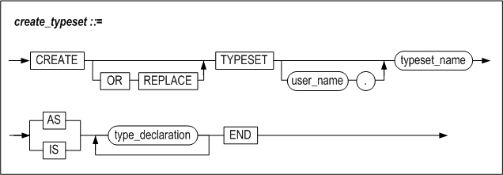
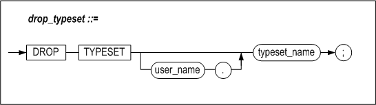

# 7.타입 세트

이 장에서는 타입 세트를 정의하고 사용하는 방법에 대해 설명한다.


### 개요

타입 세트(Type Set)는 저장 프로시저에서 사용하는 사용자 정의 타입들을 한 곳에
모아서 관리하도록 해주는 데이터베이스 객체(Object)이다.

#### 특징

##### 사용자 정의 타입의 공유

사용자 정의 타입들을 한 곳에서 관리하므로 각각의 저장 프로시저 내에서 동일한
구조의 사용자 정의 타입을 중복해서 선언하지 않아도 된다.

##### 사용자 정의 타입을 인자 또는 리턴값으로 사용

동일한 타입세트에 속해 있는 타입은 인자 또는 리턴값으로 프로시저 간 전달이
가능하다. 단, 클라이언트로는 전송할 수 없다.

##### 데이터 타입들을 논리적 단위로 통합 관리

타입세트는 저장 프로시저와 저장 함수에서 사용하는 타입들을 데이터의 논리적
단위로 통합 관리하기 용이하게 해 준다.

##### 결과 집합 전달

저장 프로시저 내부에서 실행된 SQL문의 결과 집합을 REF CURSOR 타입을 사용하여
클라이언트로 전달할 수 있다.

#### 구조

아래 그림과 샘플 코드에서처럼, 타입 세트를 사용하면 여러 저장 프로시저에서
사용하는 사용자 정의 타입을 공유하고 관리하는 것이 가능하며, 데이터 이동이
용이하다.


##### TYPESET 1

사용자 정의 타입 emp_rec_type과 emp_arr_type 을 typeset_1안에 정의한다.

```
CREATE TYPESET typeset_1
AS
TYPE emp_rec_type IS RECORD (
                 name    VARCHAR(20),
                 job_id  VARCHAR(10),
                 salary  NUMBER(8) );

TYPE emp_arr_type IS TABLE OF emp_rec_type
       INDEX BY INTEGER;
END;
/
```


##### PROCEDURE 1

저장 프로시저 procedure_1에서 emp_arr_type을 OUT 인자로 하는 procedure_2를
호출한다.

```
CREATE PROCEDURE procedure_1
AS
V1 typeset_1.emp_arr_type;
BEGIN
  procedure_2( V1 );
  PRINTLN(V1[1].name);
PRINTLN(V1[1].job_id);
PRINTLN(V1[1].salary);

END;
/
```


##### PROCEDURE 2

저장 프로시저 procedure_2의 OUT 인자에 function_3의 반환값을 할당한다.

```
CREATE PROCEDURE procedure_2
( P1 OUT typeset_1.emp_arr_type )
AS
V1 typeset_1.emp_rec_type;
BEGIN
V1 := function_3();
P1[1] := V1;
END;
/
```


##### FUNCTION 3

typeset_1.emp_rec_type타입의 값을 반환한다.

```
CREATE FUNCTION function_3
RETURN typeset_1.emp_rec_type
AS
  V1 typeset_1.emp_rec_type;
BEGIN
V1.name := 'Smith';
V1.job_id := 1010;
V1.salary := 200;

RETURN V1;
END;
/
```


### CREATE TYPESET

#### 구문



#### 전제 조건

SYS 사용자 또는 CREATE PROCEDURE, CREATE ANY PROCEDURE 시스템 권한을 가진
사용자만 실행 가능하다.

#### 설명

저장 프로시저에서 사용할 사용자 정의 타입을 포함하는 타입 세트를 정의한다. 타입
세트 내에서 정의한 타입은 프로시저의 INPUT / OUTPUT 인자로 사용할 때 용이하다.

##### user_name

생성될 타입 세트의 소유자 이름을 명시한다. 생략하면 Altibase는 현재 세션에
연결된 사용자의 스키마에 타입 세트를 생성한다

##### typeset_name

타입 세트의 이름이다.

##### type_declaration

6장 사용자 정의 타입에서 “사용자 정의 타입의 정의”절을 참고한다.

#### 예제

##### 예제1

my_typeset이란 이름의 타입 세트를 생성한다.

```
CREATE TYPESET my_typeset
AS
TYPE emp_rec_type IS RECORD(
      name VARCHAR(20), id INTEGER );
TYPE emp_arr_type IS TABLE OF emp_rec_type
       INDEX BY INTEGER;
END;
/
```


##### 예제2

my_typeset을 이용하는 프로시저 my_proc1을 생성한다.

```
CREATE PROCEDURE my_proc1
AS
V1 my_typeset.emp_rec_type;
V2 my_typeset.emp_arr_type;
BEGIN
V1.name := 'jejeong';
V1.id    := 10761;
V2[1]    := V1;

V1.name := 'ehkim';
V1.id    := 11385;
V2[2]    := V1;

V1.name := 'mslee';
V1.id    := 13693;
V2[3]    := V1;

PRINTLN('NAME : '||V2[1].name||
          '  ID : '||V2[1].id );
PRINTLN('NAME : '||V2[2].name||
          '  ID : '||V2[2].id );
PRINTLN('NAME : '||V2[3].name||
          '  ID : '||V2[3].id );
END;
/
```

결과

```
iSQL> exec my_proc1;
NAME : jejeong  ID : 10761
NAME : ehkim  ID : 11385
NAME : mslee  ID : 13693
Execute success.
```


### DROP TYPESET

#### 구문



#### 전제 조건

SYS 사용자이거나 객체의 생성자 또는 DROP ANY PROCEDURE 시스템 권한을 가진
사용자만 실행 가능하다.

#### 설명

명시된 타입 세트를 제거한다. 제거된 타입 세트를 사용하던 저장 프로시저는
유효하지 않은(Invalid) 상태가 된다.

##### user_name

제거될 타입 세트의 소유자 이름을 명시한다. 생략하면 Altibase는 제거될 타입
세트가 현재 세션에 연결된 사용자의 스키마에 속한 것으로 간주한다.

##### typeset_name

타입 세트의 이름이다.

#### 예제

my_typeset이란 이름의 타입 세트를 삭제한다.

```
DROP TYPESET my_typeset;
```


