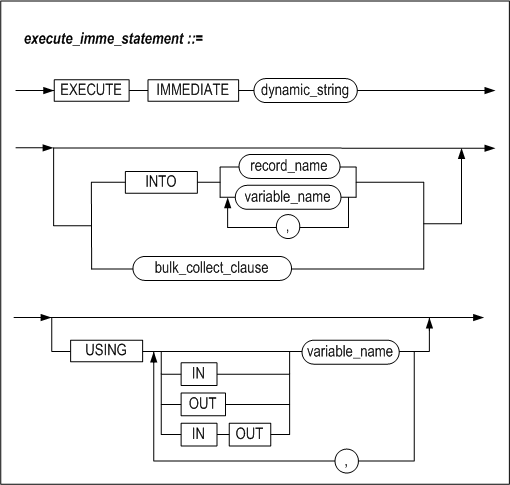
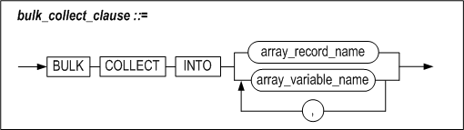
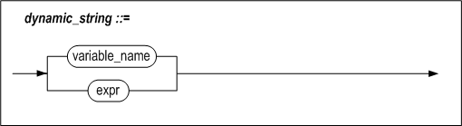
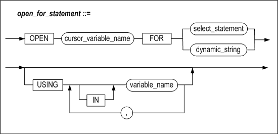

# 8.동적 SQL

이 장에서는 저장 프로시저와 저장 함수에서 동적 SQL을 사용하는 방법을 설명한다.


### 동적 SQL의 개요

동적 SQL(Dynamic SQL)은 실행 시간에 사용자가 원하는 질의를 만들어서 실행하는
것이다.

일반적인 저장 프로시저의 SQL 실행 방법은 정적인(Static) 방법으로, 저장
프로시저가 최초로 실행될 때 SQL문의 실행계획이 생성된다. 그러나 저장 프로시저를
실행할 때 결정되는 SQL 구문은 동적 SQL을 사용해야 한다.

#### 동적 SQL의 실행

아래 다이어그램은 정적 SQL과 동적 SQL이 포함된 저장 프로시저를 생성하고 실행할
때 Altibase 내부에서 이를 수행하는 과정을 비교하고 있다.


[그림 8‑1] 정적 SQL과 동적 SQL의 실행 과정 비교

[그림 8- 1]의 왼쪽 저장 프로시저는 ‘DELETE FROM T1’ 문을 정적으로 처리한 것이고,
오른쪽 저장 프로시저는 동일한 DELETE 문을 EXECUTE IMMEDIATE를 사용하여 동적으로
처리한 것이다.

전자는 프로시저가 최초로 실행되는 시점에 DELETE문에 대한 실행계획이 만들어져
Plan Cache에 저장되고, 반복 호출 시 Plan Cache에서 실행계획을 찾아서 수행
(EXECUTE)한다. 후자도 마찬가지로 프로시저가 최초로 호출되는 시점에 DELETE 문에
대해 실행계획이 생성되어 Plan Cache에 저장된다.

#### 특징

동적 SQL의 장점은 저장 프로시저 실행 시에 SQL문을 사용자 마음대로 변경하여
실행시킬 수 있다는 것이다. 또한 SQL문의 종류에 관계없이 DBMS가 지원하는 SQL은
무엇이든 실행시킬 수 있다.

동적 SQL은 다음의 상황에서 유용하다.

-   쿼리할 테이블의 이름이 실행시에 결정 될 때

-   상황에 따라 질의의 힌트나 조건절의 조건 연산자를 바꾸어 실행할 필요가 있을
    때

-   DDL과 DML구문이 빈번하게 일어나서 저장 프로시저 내의 SQL문을 그 때 그때
    최적화할 필요가 있을 때

-   실행 비용이 최적화 비용보다 큰 SQL을 자주 실행할 필요가 있을 때

-   재활용성 가능성이 높은 저장 프로시저가 필요할 때

단, 동적 SQL문은 문장의 생성, 삭제 및 바인딩 비용이 매우 크므로 정적 SQL과
비교해서 낮은 성능을 보일 수 있다. 동적 SQL문의 사용은 응용프로그램 구조를
유연하게 하는 반면 성능을 저하시킬 수 있다.

### EXECUTE IMMEDIATE

동적으로 DDL, DCL, DML 및 단일 레코드를 결과로 반환하는 SELECT 질의를 실행하기
위해 사용한다.

#### 구문







#### 설명

##### dynamic_string

실행할 질의문을 가지는 문자열이다.

##### INTO

INTO절은 SELECT ... INTO 구문과 마찬가지로 가져온 결과 집합을 저장할 변수들을
명시한다.

##### bulk_collect_clause

BULK COLLECT 절은 SELECT 문의 수행 결과를 한꺼번에 가져온다. INTO 뒤에는
SELECT문이 반환하는 레코드들을 저장하기 위해 RECORD 타입 변수의 배열 또는
레코드의 각 칼럼에 대응하는 호스트 변수의 배열이 칼럼 개수만큼 와야 한다.

BULK COLLECT 절을 사용해서 질의문의 결과 집합을 한번에 배열로 가져오는 방법이
loop문을 사용해서 결과 행을 한 건씩 가져오는 것보다 더 효율적이다.

##### USING

USING절은 실행 시에 SQL구문에 바인드할 인자를 명시하는데 사용된다. 인자는 SQL문
내의 물음표 (“?”) 위치에 보이는 순서대로 바인드 된다. IN, OUT, IN/OUT 인자를
지정할 수 있다.

#### 예제

다음은 DML문을 동적 SQL을 사용해서 실행하는 예제이다.

```
CREATE PROCEDURE fire_emp(v_emp_id INTEGER) AS
BEGIN
  EXECUTE IMMEDIATE
  'DELETE FROM employees WHERE eno = ?'
    USING v_emp_id;
END;
/

CREATE PROCEDURE insert_table (
      table_name  VARCHAR(100),
      dept_no     NUMBER,
      dept_name   VARCHAR(100),
      location    VARCHAR(100))
AS
      stmt    VARCHAR2(200);
BEGIN
   stmt := 'INSERT INTO ' || table_name ||
           ' values (?, ?, ?)';
   EXECUTE IMMEDIATE stmt
           USING dept_no, dept_name, location;
END;
/
```

EXECUTE IMMEDIATE dynamic_string 구문은 해당 질의문을 Direct-Execute 방식으로
실행한다. USING 뒤에 나오는 변수는 바인드할 인자이다. DDL 및 DCL의 경우도 DML과
마찬가지로 EXECUTE IMMEDIATE를 사용하여 실행할 수 있다.

#### 제약사항

저장 프로시저 내에서 동적 SQL 형태로 사용 가능한 질의문은 다음과 같다.

-   DML  
    SELECT, INSERT, UPDATE, DELETE, MOVE, MERGE, LOCK TABLE, ENQUEUE, DEQUEUE

-   DDL  
    CREATE, ALTER, DROP

-   DCL  
    ALTER SYSTEM, ALTER SESSION, COMMIT, ROLLBACK

동적 SQL사용을 지원하지 않는 구문은 다음과 같다.

-   iSQL을 통해서만 실행할 수 있는 구문

-   SELECT \* FROM tab;

-   DESC table_name

-   SET TIMING

-   SET AUTOCOMMIT

-   CONNECT

-   DISCONNECT

### OPEN FOR

이 구문은 커서변수 (REF CURSOR)를 초기화하고 쿼리를 수행하여 결과 집합을
결정하는 데 사용된다. 결과 집합의 데이터는 FETCH 문을 사용해서 가져올 수도 있고,
저장 프로시저의 인자를 사용해서 클라이언트로 전달할 수도 있다. USING 절을
이용하여 인자를 바인딩할 수도 있다.

#### 구문



#### 설명

##### cursor_variable_name

REF CURSOR 타입의 커서 변수의 이름이다.

##### select_statement

select_statement는 실행될 질의문이다. SELECT구문만 사용할 수 있으며 USING 절과
함께 사용할 수 없다.

##### dynamic_string

dynamic_string은 실행될 질의문이다. 문자열 형태의 SELECT 구문만 사용할 수 있다.

##### USING

USING 절은 실행 시에 SQL구문에 바인드할 인자를 명시하는 데 사용된다. 인자는
SQL문 내의 물음표 (“?”) 위치에 보이는 순서대로 바인드 된다.

#### 예제

다음은 여러 행을 가져오는 동적 SQL문의 실행 결과를 클라이언트로 전달하기 위해서,
프로시저 내부에서 REF CURSOR타입의 커서 변수를 사용하는 예제이다.

클라이언트로 전달된 커서변수를 통하여 결과집합을 FETCH하는 방법은 Precompiler
User's Manual, CLI User's Manual, API User's Manual 을 참고한다.

```
CREATE OR REPLACE PROCEDURE fetch_employee
AS
  TYPE MY_CUR IS REF CURSOR;
  emp_cv MY_CUR;
  emp_rec employees%ROWTYPE;
  stmt VARCHAR2(200);
  v_job VARCHAR2(10) := 'webmaster';
BEGIN
  stmt := 'SELECT * FROM employees WHERE emp_job = ?';
  OPEN emp_cv FOR stmt USING v_job;
  LOOP
    FETCH emp_cv INTO emp_rec;
    EXIT WHEN emp_cv%NOTFOUND;
    PRINTLN('[Name]: ' || emp_rec.e_firstname || emp_rec.e_lastname ||
            ' [Job Id]: ' || emp_rec.emp_job);
  END LOOP;
  CLOSE emp_cv;
END;
/
```


