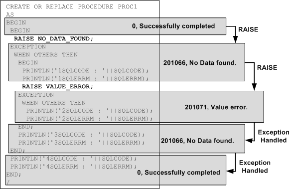

# 9.예외 처리

### 개요

저장 프로시저 수행 중에 발생하는 예외 (Exception)는 예외 처리부에서 각 예외 별로
지정하여 처리할 수 있다.

#### 종류

Altibase 저장 프로시저에서 발생하는 예외에는 두 가지 종류가 있다.

-   시스템 정의 예외 (System-defined Exception)

-   사용자 정의 예외 (User-defined Exception)

저장 프로시저가 지원하는 예외에는 와 사용자가 임의로 정의하여 사용할 수 있는 가
있다.

##### 시스템 정의 예외

시스템 정의 예외는 Altibase 내에 미리 정의해 둔 것으로, 저장 프로시저의 선언부에
따로 선언할 필요가 없다.

발생 가능한 몇몇 시스템 정의 예외는 다음과 같다.

| 예외 이름           | 발생 원인                                                                                                                                                                              |
|---------------------|----------------------------------------------------------------------------------------------------------------------------------------------------------------------------------------|
| CURSOR_ALREADY_OPEN | 이미 열려 있는 커서를 닫지 않고 다시 열려고 하는 경우 발생한다. Cursor FOR LOOP의 경우 내부에서 묵시적으로 커서가 열리므로 루프 내에서 OPEN문을 사용하여 명시적으로 커서를 열 수 없다. |
| DUP_VAL_ON_INDEX    | Unique 인덱스가 정의된 칼럼에 중복된 값을 입력하려 하는 경우 발생한다.                                                                                                                 |
| INVALID_CURSOR      | 열려 있지 않은 커서를 사용해서 FETCH 또는 CLOSE하려는 경우 등과 같이, 현재 커서 상태에서 수행할 수 없는 작업을 수행하려 하는 경우에 발생한다.                                          |
| NO_DATA_FOUND       | SELECT 문에 의해 반환된 데이터가 한 건도 없을 때 발생한다.                                                                                                                             |
| TOO_MANY_ROWS       | SELECT INTO문은 하나의 레코드만 반환해야 하는데 둘 이상의 레코드가 반환된 경우 발생한다.                                                                                               |

##### 사용자 정의 예외

사용자정의 예외는 사용자가 명시적으로 선언한 것으로, RAISE문을 사용해서
의도적으로 발생시켜야 한다.

```
DECLARE
  comm_missing  EXCEPTION;    -- DECLARE user defined EXCEPTION
BEGIN
  ......
  RAISE comm_missing;   -- raising EXCEPTION
  ......
  EXCEPTION
    WHEN comm_missing THEN ......
```

사용자정의 예외를 시스템 정의 예외와 같은 이름으로 정의할 경우, 사용자 정의
예외가 시스템 정의 예외보다 우선된다. 즉, 예외 처리부 내에서 사용자 정의 예외로
간주될 것이다.

#### 예외 선언

시스템 정의 예외의 경우 시스템 내부에 예외 이름이 정의되어 있으므로 명시적으로
선언할 필요가 없다.

반면에, 사용자 정의 예외의 경우 선언부에 명시적으로 그 이름을 정의한 후 사용해야
한다.

#### 예외 발생

시스템 정의 예외는 명시적으로 발생시킬 필요가 없다. 저장 프로시저 수행 도중
시스템 정의 예외가 발생하면 그 예외를 처리하는 Exception Handler가 존재하는지
확인한다. 존재할 경우 자동으로 그 쪽으로 분기해서 Exception Handler에 정의된
작업을 처리한다.

반면, 사용자 정의 예외의 경우 저장 프로시저 내에서 명시적으로 예외를 발생시켜야
한다. 사용자 정의 예외는 RAISE문을 사용해서 발생시킬 수 있다.

#### 예외 처리부

사용자 정의 예외 및 시스템 정의 예외가 발생할 경우 처리할 작업들을 여기에
정의한다.

### EXCEPTION

#### 구문


#### 설명

사용자 정의 예외를 정의한다

##### exception_name

한 블록 내에서 유일한 이름이어야 한다. 자신이 선언된 블록의 BEGIN와 END 문
범위내에서 유효하다.

#### 예제

```
DECLARE
  error_1   EXCEPTION;
  error_2   EXCEPTION;
  error_3   EXCEPTION;
```


### RAISE

#### 구문


#### 설명

이 구문은 명시적으로 예외를 발생시키기 위해 사용된다. 예외가 발생하면 발생한
예외에 해당하는 exception handler의 루틴으로 제어가 넘어간다.

##### exception_name

발생시키고자 하는 예외 이름을 지정한다.

이 이름은 블록 선언부에 선언되어 있는 예외 또는 시스템 정의 예외의 이름이어야
한다.

선언되지 않은 예외를 여기에 명시하면, 저장 프로시저 컴파일은 실패한다. 저장
프로시저 실행 시 예외가 발생했는데 해당하는 exception handler가 존재하지 않을
경우에는, 저장 프로시저의 수행을 중단하고 오류를 돌려 준다.

사용자 정의 예외의 경우 외부 블록과 내부 블록에 같은 예외 이름을 정의할 수도
있다. 이 경우 모호함을 없애기 위해서 각 블록에 LABEL을 붙이고 RAISE문에서는 예외
이름 앞에 LABEL 명을 명시하여 사용하면 된다.

외부 블록에서 선언된 예외는 내부 블록에서 선언된 예외에 해당하는 exception
handler내에서 발생시킬 수 있다.

예외 명을 지정하지 않아도 되는 경우는 exception handler안에서만 사용되는
경우로서 이때는 앞서 발생한 예외를 다시 한번 발생시킨다.

#### 예제

##### 예제 1

다음은 VALUE_ERROR 예외를 예외 처리부에서 처리하고, 같은 예외를 다시 발생시키는
예제이다.

```
CREATE OR REPLACE PROCEDURE PROC1
AS
BEGIN
  RAISE VALUE_ERROR;
  EXCEPTION
    WHEN VALUE_ERROR THEN
      PRINTLN('VALUE ERROR CATCHED. BUT RE-RAISE.');
      RAISE;
END;
/
iSQL> EXEC PROC1;
VALUE ERROR CATCHED. BUT RE-RAISE.        
[ERR-3116F : Value error
0004 :   RAISE VALUE_ERROR;
        ^                 ^
]
```


##### 예제2

다음은 예제 1의 PROC1에서 발생한 예외를 처리하는 예제이다

```
CREATE OR REPLACE PROCEDURE PROC2
AS
BEGIN
  PROC1;
  EXCEPTION
    WHEN OTHERS THEN
    PRINTLN('EXCEPTION FROM PROC1 CATCHED.');
    PRINTLN('SQLCODE : '||SQLCODE);
END;
/
iSQL> EXEC PROC2;
VALUE ERROR CATCHED. BUT RE-RAISE.
EXCEPTION FROM PROC1 CATCHED.
SQLCODE : 201071
Execute success.
```


### RAISE_APPLICATION_ERROR

사용자 정의 에러코드 및 에러 메시지를 가지고 예외를 발생시킨다. 에러코드는
990000부터 991000까지의 범위로, 1001 개의 사용자 에러코드가 지원된다.

#### 구문

```
RAISE_APPLICATION_ERROR (
	errcode INTEGER,
    errmsg VARCHAR(2047) );
```

#### 파라미터

| 이름    | 입출력 | 데이터 타입 | 설명                                                      |
|---------|--------|-------------|-----------------------------------------------------------|
| errcode | IN     | INTEGER     | 사용자 정의 에러 코드 (990000 에서 991000 까지 사용 가능) |
| errmsg  | IN     | VARCHAR     | 사용자 정의 에러 메시지 텍스트                            |

#### 설명

이 프로시저는 사용자가 정의한 에러 코드와 에러메시지를 가지는 예외를 발생시킨다.

#### 예제

다음은 사용자 정의 에러를 발생시키는 예제이다. 단, iSQL에서 에러코드는 16진수
값으로 표시된다.

```
CREATE OR REPLACE PROCEDURE PROC1
AS
BEGIN
    RAISE_APPLICATION_ERROR( 990000,
	 'This is my error msg. ' );
END;
/
iSQL> EXEC PROC1;
[ERR-F1B30 : This is my error msg.
at "SYS.PROC1", line 4]
```


### 사용자 정의 예외

사용자가 직접 RAISE문을 사용해서 예외를 발생시키는 경우는 다음 2가지 경우이다.

-   사용자가 정의한 예외를 처리하는 경우

-   시스템이 정의한 예외을 처리하는 경우

#### 사용자 정의 예외의 에러코드

사용자가 정의한 예외를 처리하는 경우, SQLCODE의 값은 항상 **201232**로 고정되어
있다**.**

```
CREATE OR REPLACE PROCEDURE PROC1
AS
    E1 EXCEPTION;
BEGIN
    RAISE E1;
EXCEPTION
WHEN E1 THEN
    PRINTLN('SQLCODE: ' || SQLCODE);  -- 에러코드 출력
    PRINTLN('SQLERRM: ' || SQLERRM);  -- 에러메시지 출력
END;
/

iSQL> EXEC PROC1;
SQLCODE: 201232
SQLERRM: User-Defined Exception.
Execute success.
```

만약 이 예외를 예외 처리부에서 사용자 정의 예외로 처리하지 않는 경우, 발생하는
에러는 다음과 같다. 즉 사용자 정의 예외를 위한 exception handler가 없다는
의미이다.

```
CREATE OR REPLACE PROCEDURE PROC1
AS
    E1 EXCEPTION;
BEGIN
    RAISE E1;
END;
/

iSQL> EXEC PROC1;
[ERR-31157 : Unhandled exception : E1]
```

사용자 정의 예외가 예외 처리부에서 처리될 때는 항상 다음의 에러 코드를 가진다.

| Exception Name | Error Code(integer) | Error Code(hexadecimal) | Error Section                          |
| -------------- | ------------------- | ----------------------- | :------------------------------------- |
|                | 201232              | 31210                   | qpERR_ABORT_QSX_USER_DEFINED_EXCEPTION |

#### 시스템 정의 예외의 에러코드

시스템 정의 예외가 발생하는 경우에는 다음과 같이 시스템에 지정된 에러코드가
출력된다.

```
CREATE OR REPLACE PROCEDURE PROC1
AS
BEGIN
    RAISE NO_DATA_FOUND;
EXCEPTION
WHEN NO_DATA_FOUND THEN
    PRINTLN('SQLCODE: ' || SQLCODE);  -- 에러코드 출력
    PRINTLN('SQLERRM: ' || SQLERRM);  -- 에러메시지 출력
END;
/
iSQL> EXEC PROC1;
SQLCODE: 201066
SQLERRM: No data found.
at "SYS.PROC1", line 4
Execute success.
```

다음과 같이 시스템 정의 예외의 경우에는 별도의 예외처리를 예외 처리부에서 하지
않더라도 이미 정의된 에러코드가 출력되는 것을 볼 수 있다.

```
CREATE OR REPLACE PROCEDURE PROC1
AS
BEGIN
    RAISE NO_DATA_FOUND;
END;
/

iSQL> EXEC PROC1;
[ERR-3116A : No data found.
at "SYS.PROC1", line 4]
```

참고로 많이 사용되는 시스템 정의 예외의 에러코드는 다음과 같다. 각 예외의 원인에
대해서는 앞서 설명한 “시스템 정의 예외” 절을 참고하기 바란다.

| Exception Name        | Error Code (integer) | Error Code (hexadecimal) | Error Section                           |
|-----------------------|----------------------|--------------------------|-----------------------------------------|
| "CURSOR_ALREADY_OPEN" | 201062               | 31166                    | qpERR_ABORT_QSX_CURSOR_ALREADY_OPEN     |
| "DUP_VAL_ON_INDEX"    | 201063               | 31167                    | qpERR_ABORT_QSX_DUP_VAL_ON_INDEX        |
| "INVALID_CURSOR"      | 201064               | 31168                    | qpERR_ABORT_QSX_INVALID_CURSOR          |
| "NO_DATA_FOUND"       | 201066               | 3116A                    | qpERR_ABORT_QSX_NO_DATA_FOUND           |
| "TOO_MANY_ROWS        | 201070               | 3116E                    | qpERR_ABORT_QSX_TOO_MANY_ROWS           |
| "INVALID_PATH"        | 201237               | 31215                    | qpERR_ABORT_QSX_FILE_INVALID_PATH       |
| "INVALID_MODE"        | 201235               | 31213                    | qpERR_ABORT_QSX_INVALID_FILEOPEN_MODE   |
| "INVALID_FILEHANDLE"  | 201238               | 31216                    | qpERR_ABORT_QSX_FILE_INVALID_FILEHANDLE |
| "INVALID_OPERATION"   | 201239               | 31217                    | qpERR_ABORT_QSX_FILE_INVALID_OPERATION  |
| "READ_ERROR"          | 201242               | 3121A                    | qpERR_ABORT_QSX_FILE_READ_ERROR         |
| "WRITE_ERROR"         | 201243               | 3121B                    | qpERR_ABORT_QSX_FILE_WRITE_ERROR        |
| "ACCESS_DENIED"       | 201236               | 31214                    | qpERR_ABORT_QSX_DIRECTORY_ACCESS_DENIED |
| "DELETE_FAILED"       | 201240               | 31218                    | qpERR_ABORT_QSX_FILE_DELETE_FAILED      |
| "RENAME_FAILED"       | 201241               | 31219                    | qpERR_ABORT_QSX_FILE_RENAME_FAILED      |

모든 에러 코드 리스트는 Error Message Reference를 참조한다.

### SQLCODE와 SQLERRM

SQLCODE, SQLERRM은 SQL문 수행 시 발생한 예외에 해당하는 에러코드와 메시지를
얻어와서 이에 대한 적절한 대응을 하기 위해 Exception Handler에서 사용된다.

SQLCODE, SQLERRM에 에러가 세팅 되는 경우는 다음과 같다.

-   저장 프로시저 실행 도중 에러가 발생한 경우

-   사용자 정의 예외가 발생한 경우

-   시스템 정의 예외가 발생한 경우

-   사용자가 RAISE_APPLICATION_ERROR로 자신이 정의한 에러를 발생시킨 경우

-   Exception Handler 내에서 다시 RAISE하는 경우

위와 같은 경우 기존의 SQLCODE와 SQLERRM는 새로 발생한 에러코드와 에러메시지로
변경된다.

또한, Exception Handler가 정상적으로 동작한 후에는 SQLCODE와 SQLERRM의 값은 예외
발생 이전의 에러코드와 에러메시지로 원복 되는데, 이는 LIFO (last in, first out)
스택의 원리로 동작하기 때문이다.

따라서, 한번 발생한 예외로 인해 SQLCODE와 SQLERRM에 셋팅된 값은 그 블록의 상위
블록으로 제어가 넘어가지 않는 한 스택에 계속 남아있게 된다.

다음의 예제를 보면,

```
CREATE OR REPLACE PROCEDURE PROC1
AS
BEGIN
  BEGIN
    RAISE NO_DATA_FOUND;
  EXCEPTION
    WHEN OTHERS THEN
      BEGIN
        PRINTLN('1SQLCODE : '||SQLCODE);
        PRINTLN('1SQLERRM : '||SQLERRM);
        RAISE VALUE_ERROR;
      EXCEPTION
        WHEN OTHERS THEN
          PRINTLN('2SQLCODE : '||SQLCODE);
          PRINTLN('2SQLERRM : '||SQLERRM);
      END;
    PRINTLN('3SQLCODE : '||SQLCODE);
    PRINTLN('3SQLERRM : '||SQLERRM);
  END;
  PRINTLN('4SQLCODE : '||SQLCODE);
 PRINTLN('4SQLERRM : '||SQLERRM);
END;
/
```

위 예제의 경우 다음과 같은 결과를 출력한다.

```
iSQL> EXEC PROC1;
1SQLCODE : 201066
1SQLERRM : No data found.
at "SYS.PROC1", line 5
2SQLCODE : 201071
2SQLERRM : Value error
at "SYS.PROC1", line 11
3SQLCODE : 201066
3SQLERRM : No data found.
at "SYS.PROC1", line 5
4SQLCODE : 0
4SQLERRM : Successfully completed
Execute success.
```

이를 도식화하면 SQLCODE, SQLERRM의 범위는 다음과 같음을 알 수 있다.



### Exception Handler

#### 구문


#### 기능

Exception Handler에는 예외가 발생했을 때의 처리 루틴을 기술한다.

예외가 발생했을 때, Altibase는 어느 exception handler에 제어를 넘길 것인지
결정한다. Exception Handler를 찾아내는 규칙은 다음과 같다.

-   현재 블록부터 시작하여 현재 블록을 포함하고 있는 바깥 블록들로 예외의 이름이
    같은 Exception Handler를 찾는다. 도중에 어느 한 블록에서라도 OTHERS 핸들러를
    만나게 되면 OTHERS 핸들러에서 예외처리를 하게 된다.

-   맨 바깥블록까지 Exception Handler가 발견되지 않는다면, 사용자에게 “Unhandled
    Exception” 에러를 출력하고 프로시저의 수행은 즉시 중지된다.

발생한 에러를 확인하기 위해 exception handler에서 SQLCODE와 SQLERRM을 사용할 수
있다. 즉, SQLCODE는 Altibase 에러코드 번호를 반환하고, SQLERRM은 대응하는 에러
메시지를 반환하다.

SQLCODE와 SQLERRM은 SQL구문에서 직접 사용할 수는 없다. 대신에 그 값을 지역
변수에 대입하고 그 변수를 SQL 구문에서 사용하면 된다.

##### exception name

처리 하고자 하는 시스템 정의 예외 또는 사용자 정의 예외의 이름을 기술한다.

예외 발생시에 동일한 처리를 하고자 하는 예외들을 OR로 묶어서 하나의 루틴으로
처리할 수 있다.

##### others

이전에 기술된 모든 Exception Handler에서 현재 발생한 예외를 처리하지 못할 경우
최종적으로 OTHERS 루틴에서 처리된다.

#### 예제

##### 예제1

```
CREATE TABLE t1(i1 INTEGER, i2 INTEGER, i3 INTEGER);

CREATE TABLE t2(i1 INTEGER, i2 INTEGER, i3 INTEGER);
INSERT INTO t1 VALUES(1,1,1);
INSERT INTO t1 VALUES(2,2,2);

CREATE OR REPLACE PROCEDURE proc1
AS
BEGIN
  DECLARE
    CURSOR c1 IS SELECT * FROM t1;
      v1 INTEGER;
      v2 INTEGER;
      v3 INTEGER;
  BEGIN
    -- OPEN c1;

    FETCH c1 INTO v1, v2, v3;
    INSERT INTO t2 VALUES (v1, v2, v3);

    CLOSE c1;

  EXCEPTION
    WHEN INVALID_CURSOR THEN
    INSERT INTO t2 VALUES (-999, -999, -999);

  END;

END;
/

iSQL> EXEC proc1;
Execute success.

iSQL> SELECT * FROM t2;
T2.I1       T2.I2       T2.I3       
----------------------------------------
-999        -999        -999        
1 row selected.
```


##### 예제2

```
CREATE TABLE t1(i1 INTEGER, i2 INTEGER, i3 INTEGER);

CREATE OR REPLACE PROCEDURE proc1(p1 IN INTEGER)
AS
  v1 INTEGER;
  err1 EXCEPTION;
BEGIN
  IF p1 < 0 THEN
    RAISE err1;
  END IF;

  SELECT i1 INTO v1 FROM t1;

EXCEPTION
  WHEN NO_DATA_FOUND OR TOO_MANY_ROWS THEN
    INSERT INTO t1 VALUES(1,1,1);
  WHEN OTHERS THEN
    INSERT INTO t1 VALUES(0,0,0);

END;
/

iSQL> EXEC proc1(1);
Execute success.
iSQL> SELECT * FROM t1;
T1.I1       T1.I2       T1.I3       
----------------------------------------
1           1           1           
1 row selected.
iSQL> EXEC proc1(-8);
Execute success.
iSQL> SELECT * FROM t1;
T1.I1       T1.I2       T1.I3       
----------------------------------------
1           1           1           
0           0           0           
2 rows selected.
```


##### 예제3

```
CREATE TABLE t1(i1 INTEGER NOT NULL);

CREATE OR REPLACE PROCEDURE proc1
AS
  code INTEGER;
  errm VARCHAR(200);
BEGIN
  INSERT INTO t1 VALUES(NULL);
EXCEPTION
WHEN OTHERS THEN

-- 변수 code에 SQLCODE 에러코드 값 대입
 code := SQLCODE;

-- 변수 errm에 SQLERRM 에러 메시지 저장

errm := SUBSTRING(SQLERRM, 1, 200);
  system_.println('SQLCODE : ' || code);
  system_.println('SQLERRM : ' || errm);
END;
/

iSQL> EXEC proc1;
SQLCODE : 200820
SQLERRM : Unable to insert (or update) NULL into NOT NULL column.
at "SYS.PROC1", line 6
Execute success.
```


