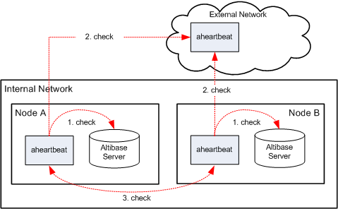

# 1.Altibase Heartbeat 소개

이 장은 Altibase Heartbeat의 개요와 기본적인 동작을 설명한다.

### Altibase Heartbeat 개요

Altibase Heartbeat는 분산 데이터베이스 환경에서 각 데이터베이스 노드의 장애를
감지하고, DBA가 장애에 대한 조치를 할 수 있도록 제공되는 유틸리티이다.
aheartbeat[^1]는 Altibase 서버들이 이중화로 연결되어 구성된 환경에서 사용할 수
있다.

[^1]: aheartbeat: Altibase Heartbeat 유틸리티의 실행 바이너리 파일 이름이다.

따라서 본 문서에서는 Altibase Heartbeat과 aheartbeat가 혼용되어 사용된다.

#### Altibase Heartbeat 구성요소

Altibase Heartbeat는 아래의 세가지 주요 요소로 구성된다.

-   aheartbeat 프로세스

-   로컬 노드 failover 수행 파일

-   리모트 노드 failover 수행 파일

##### aheartbeat 프로세스

aheartbeat는 백그라운드에 수행되면서 총 2종류의 장애를 감지한다. 하나는 자기
노드의 Altibase 서버에 주기적으로 접속을 시도하여 데이터베이스의 장애를
감지한다. 그리고 다른 노드의 aheartbeat과 주기적으로 접속을 시도하여 네트워크
장애를 감지한다.

##### 로컬 노드 failover 수행 파일

로컬 노드 failover 수행 파일은 aheartbeat가 같은 노드의 데이터베이스 서버의
장애를 감지한 후에 failover를 위해 실행하는 파일이다. 이 파일은 실행이 가능한
바이너리 또는 스크립트 파일일 수 있다.

##### 리모트 노드 failover 수행 파일

리모트 노드 failover 수행 파일은 aheartbeat가 다른 노드의 장애를 감지한 후에
failover를 위해 실행하는 파일이다. 이 파일은 실행이 가능한 바이너리 또는
스크립트 파일일 수 있다.

### Altibase Heartbeat의 기본 동작

이 절에서는 Altibase Heartbeat가 분산 데이터베이스 환경에서 동작하는 기본 과정을
설명한다. 아래 그림은 다수의 Altibase를 Altibase Heartbeat와 함께 구성한
기본적인 분산 데이터베이스 환경을 도식화한 그림이다.

그림 1-1 Altibase Heartbeat의 동작

그림에서 보듯이 aheartbeat는 자신이 속한 노드의 Altibase 서버 프로세스를
감시해서 데이터베이스 장애를 감지(그림에서 1번 check)한다. 그리고 다른 노드의
aheartbeat 프로세스를 감시해서 노드 장애(그림에서 3번 check) 또는 외부 네트워크
장애(그림에서 2번 check)를 감지한다.

만약 노드 A에 있는 Altibase 서버에 장애가 발생한 경우 aheartbeat들이 어떻게
동작할 것인지 살펴본다.

1.  노드 A의 aheartbeat가 Altibase 서버의 장애 감지

2.  노드 A의 aheartbeat가 로컬 노드 failover 수행 파일을 실행하고, aheartbeat는
    스스로 종료

3.  노드 B의 aheartbeat는 노드 A의 aheartbeat가 없어졌음을 감지하고 노드 A의
    Altibase 서버에 장애가 발생했음을 인지하여, 리모트 노드 failover 수행 파일을
    실행.

