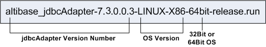

# 2.설치와 설정

이 장에서는 Adapter for JDBC를 설치하고 사용환경을 설정하는 방법을 설명한다.

### 설치전 작업

jdbcAdapter를 설치하고 실행하기 위해서는 다음의 시스템 요구사항을 만족해야 한다.
또한 jdbcAdpater가 올바르게 작동하려면 몇가지 시스템 환경 설정도 필요하다.

시스템 요구사항에 대해 보다 자세히 알고 싶으면, Altibase
고객서비스포털( <http://support.altibase.com/kr/> )로 연락 바란다.

#### 운영체제

현재 아래의 운영체제에서 jdbcAdapter를 지원한다.

-   LINUX
-   AIX 
-   HP-UX

#### 데이터베이스 버전

-   Altibase : 버전 6.5.1 이상
-   OTHER DB : JDBC v4.2 이하를 지원하는 데이터베이스 중 Altibase와 동일한 DML 구문을 사용하는 데이터베이스
-   OTHER DB로 사용 가능이 확인된 데이터베이스
    -   Altibase
    -   Oracle
    -   MariaDB

#### 데이터베이스 문자집합

데이터를 저장하기 위한 기본 캐릭터셋이다.

#### 국가 문자집합

데이터베이스 문자집합이 지원하지 않는 언어에 해당하는 데이터는 NCHAR 또는
NVARCHAR 타입을 사용해서 저장할 수 있다.

#### JDBC 드라이버 설치

jdbcAdapter를 사용하기 위해 jdbcAdapter가 동작하는 장비에 JDBC 드라이버를
설치한다. 이 때 설치하는 JDBC 드라이버는 복제대상 데이터베이스의 벤더가 제공하는
것이다. 예를 들어 복제대상 데이터베이스가 오라클이라면 오라클 홈페이지에서
Oracle 데이터베이스 서버 버전과 일치하는 버전의 JDBC 드라이버를 다운로드하여
설치한다.

#### JRE 설치

jdbcAdapter v7.3은 JRE 8 버전 이상에서 동작하는 응용 프로그램이므로, jdbcAdapter가 운영될 장비에 8 버전 이상의 JRE가 설치되어 있어야 한다.

jdbcAdapter가 접속할 원격 데이터베이스의 JDBC 드라이버가 8 버전 이상의 JRE에서
동작한다면, 해당 JDBC 드라이버와 호환되는 버전의 JRE를 설치해야 한다.

JRE 설치 후에는 JAVA_HOME과 CLASSPATH 등의 환경 변수를 설정해야 한다. 아래는
유닉스 계열 OS에서 JRE 관련 환경 변수를 설정하는 예제이다.

```
$ export JAVA_HOME=JRE가 설치된 경로
$ export CLASSPATH=${JAVA_HOME}/lib:${CLASSPATH}
$ export PATH=${JAVA_HOME}/bin:${PATH}
$ export LD_LIBRARY_PATH=$JAVA_HOME/jre/lib/amd64/server:${ LD_LIBRARY_PATH )
```

### 설치

DISPLAY 환경변수 설정이 올바르게 되어 있다면 jdbcAdapter 인스톨러를 GUI모드로
실행할 수도 있다. 이 매뉴얼은 GUI모드로 수행하는 것을 가정하여 jdbcAdapter
설치에 대해 기술하였다. 또한 디스플레이 설정이 적절히 되어 있지 않거나 GUI를
사용할 수 없을 경우에는, 텍스트 모드로 jdbcAdapter를 설치하는 것도 가능하다.

#### jdbcAdapter 설치

jdbcAdapter는 원본 DB의 Altibase 서버 계정이 아닌 다른 사용자 계정에 설치하는
것을 권장한다.

1.  첫 번째 작업은 jdbcAdapter를 운영할 시스템에 맞는 jdbcAdapter 인스톨러의
    버전을 결정하는 것이다. 아래의 그림은 jdbcAdapter 인스톨러의 명명 규칙을
    보여준다.



2. 인스톨러를 실행하면 다이얼로그 박스가 나타난다. 설치하려는jdbcAdapter의
   버전을 확인한 후, “Forward” 버튼을 누른다.

3. 다음 다이얼로그 박스에서는jdbcAdapter를 설치할 디렉터리를 선택한다. 기본으로
   설치하고 있는 사용자 계정의 홈 디렉터리 내에 jdbcAdapter라는 디렉터리를
   생성하게 된다.

4. jdbcAdapter를 사용하려면 Altibase Log Analyzer (ALA) 프로퍼티 설정을
   다음처럼 해야 한다. 프로퍼티에 대한 자세한 설명은 이 장의 뒷 부분에 있는
   “ALA 프로퍼티”절을 참고한다.

-   ALA_SENDER_IP: Altibase가 설치된 장비의 IP 주소이다. Altibase와
    jdbcAdapter가 같은 장비에서 실행되는 것을 가정하여 기본값은 127.0.0.1이다.

-   ALA_RECEIVER_PORT: jdbcAdapter가 데이터를 수신하기 위해 사용하는포트
    번호이다. 1024에서 65536사이의 값으로 설정해야 한다.

-   ALA_REPLICATION_NAME: Altibase에 존재하는 이중화 객체의 이름이다.

-   ALA_XLOG_POOL_SIZE: XLog 풀의 최대 크기를 설정한다. 기본값은 100,000 XLog
    개수이다.

-   ALA_SOCKET_TYPE: ALA가 사용할 통신 소켓 타입을 설정한다. jdbcAdapter는
    TCP/IP와 UNIX Domain소켓을 지원한다.

-   ALA_LOGGING_ACTIVE: ALA가 트레이스 로그를 남길 것인지 여부를 지정한다. 이
    프로퍼티 값이 1이면 트레이스 로그를 남긴다. 기본값은 1이다.

5. 다음 다이얼로그 박스에서는 Altibase 프로퍼티 설정을 해야 한다. 프로퍼티에
   대한 자세한 설명은 이 장의 뒷 부분에 있는 “제약조건 확인용 프로퍼티”절을
   참고한다.

-   ALTIBASE_USER: Altibase에 접근할 사용자의 이름이다.

-   ALTIBASE_PASSWORD: Altibase에 접근할 사용자 계정의 암호이다.

-   ALTIBASE_IP: Altibase가 설치된 장비의 IP 주소이다. Altibase 와 jdbcAdapter가
    같은 장비에서 작동하는 것을 가정하여, 이 프로퍼티의 기본값은 127.0.0.1이다.

-   ALTIBASE_PORT: Altibase 서버가 대기하고 있는 포트 번호이다. 1024에서
    65536사이의 값으로 설정해야 한다.

6. jdbcAdapter를 사용하려면 Other DB 프로퍼티를 적절히 설정해야 한다.
   프로퍼티에 대한 자세한 설명은 이 장의 뒷 부분에 있는 “외부 데이터베이스의
   프로퍼티”와 “DML 관련 프로퍼티”절을 참고한다.

-   OTHER_DATABASE_USER: 데이터를 전송할 대상이 되는 Other DB에 접근할 사용자의
    이름이다.

-   OTHER_DATABASE_PASSWORD: 데이터를 전송할 대상이 되는 Other DB에 접근할
    사용자의 암호이다.

-   OTHER_DATABASE_SKIP_INSERT: “Yes”를 선택하면, Altibase에서 실행된 INSERT
    구문은 Other DB에 적용되지 않는다.

-   OTHER_DATABASE_SKIP_UPDATE: “Yes”를 선택하면, Altibase에서 실행된 UPDATE
    구문은 Other DB에 적용되지 않는다.

-   OTHER_DATABASE_SKIP_DELETE: “Yes”를 선택하면, Altibase에서 실행된 DELETE
    구문은 Other DB에 적용되지 않는다.

-   OTHER_DATABASE_GROUP_COMMIT: 복수의 트랜잭션을 한 번에 처리하는 기능이다.

-   OTHER_DATABASE_BATCH_DML_MAX_SIZE: "Batch DML"은 여러 개의 DML 구문을 일괄
    처리하는 것을 의미한다. 이 프로퍼티는 최대 몇 개의 DML 구문을 일괄 처리 할것
    인지를 지정한다. Batch DML기능을 사용하지 않으려면, 이 프로퍼티를 1로
    설정한다.

-   OTHER_DATABASE_SET_USER_TO_TABLE : Other DB에 DML을 적용할 때 타겟 테이블의
    사용자를 XLog Sender에서 지정한 사용자로 한다. 기능을 사용하지 않으려면 이
    프로퍼티를 0으로 설정한다.

-   OTHER_DATABASE_JDBC_MAX_HEAP_SIZE : JVM에서 사용하는 Heap의 Max Size를
    설정한다.

-   OTHER_DATABASE_JDBC_DRIVER_PATH : Other DB를 위한 JDBC 드라이버 경로를
    지정한다

-   OTHER_DATABASE_JDBC_DRIVER_CLASS : Other DB JDBC 드라이버 클래스 이름을
    설정한다

-   OTHER_DATABASE_JDBC_CONNECTION_URL : Other DB의 연결 URL을 지정한다

7. jdbcAdapter의 사용과 관련된 모든 프로퍼티의 설정이 끝나면, 설정된 값을
   보여주는 다이얼로그 박스가 나타난다. 모든 프로퍼티가 올바로 설정되었는지
   확인하고 “Forward”를 클릭한다.

8. “Ready to Install” 다이얼로그 박스에서 “Forward”를 누르면, 설치를 시작한다.

9. jdbcAdapter가 설치되는 동안, 다음의 두 환경 변수가 설정된다. 시스템에 새로운
   환경 변수가 적용되게 하려면, 로그아웃 후에 다시 로그인 해야한다.

-   JDBC_ADAPTER_HOME: 이 환경 변수는 설치 과정의 앞 단계에서 지정한 jdbcAdapter
    홈 디렉터리를 값으로 갖게 된다.

-   PATH: 이 환경 변수에는 \$JDBC_ADAPTER_HOME/bin 경로가 추가된다.

10. 성공적으로 설치가 완료된 후에, 완료 다이얼로그 박스가 나타난다.

### 설치 후 작업

#### 환경 변수 설정

jdbcAdapter 설치 후 환경 변수 설정, 라이브러리 경로 추가 및 데이터베이스
문자집합과 국가 문자집합 설정을 해야 한다.

환경 변수 설정에 대한 자세한 설명은 이 장의 뒷 부분에 있는 “설정” 절을 참고한다.

-   JDBC_ADAPTER_HOME  
    이 환경변수는 jdbcAdapter 설치 시에 자동으로 설정된다.

-   ALTIBASE_NLS_USE  
    이 환경변수에는 Altibase에서 사용하는 문자 집합을 지정한다. 문자 집합에 대한
    자세한 설명은 *Getting Started Guide*를 참고한다.

#### 설치 디렉터리 확인

jdbcAdapter 설치가 완료 후 bin, conf, msg 및 trc 디렉터리가 \$JDBC_ADAPTER_HOME
디렉터리 아래에 생성되었는지 확인한다. 각 디렉터리의 구조와 역할은 다음과 같다.

-   bin 디렉터리  
    이 디렉터리에는 jdbcAdapter (Adapter for JDBC)와 oaUtility (Adapter for JDBC
    유틸리티) 실행 파일과 내부적으로 사용되는 파일들이 위치한다.

-   conf 디렉터리  
    이 디렉터리에는 jdbcAdapter 프로퍼티 설정을 저장하는 jdbcAdapter.conf 파일이
    위치한다.

-   msg 디렉터리  
    jdbcAdapter 설치 중 에러가 발생하면, 트레이스 로그에 에러 메시지가
    기록되는데, 이 디렉터리 내의 메시지 파일에 있는 에러 메지지가 사용된다.

-   trc 디렉터리  
    jdbcAdapter는 이 디렉터리의 파일에 트레이스 로그를 기록한다.

### 설정

jdbcAdapter를 사용하려면 다음의 환경 변수를 설정해야 한다.

#### JDBC_ADAPTER_HOME

jdbcAdapter가 설치된 디렉터리를 설정하는 환경변수이다. 이 환경 변수는
jdbcAdapter 설치 중에 자동으로 설정된다.

#### ALTIBASE_NLS_USE

ALA에서 사용하기 위한 Altibase에서 사용하는 문자 집합을 지정한다. 문자 집합에
대한 자세한 내용은 *Getting Started Guide \> 다국어 지원*을 참고한다.

### 프로퍼티

jdbcAdapter 프로퍼티들은 ALTIBASE Log Analyzer와 JDBC가 사용하고, jdbcAdapter의
동작방식을 결정하기 위해서도 사용된다.

프로퍼티 파일은 \$JDBC_ADPATER_HOME/conf 디렉터리에 존재하는
jdbcAdapter.conf이다.

jdbcAdapter에 사용되는 프로퍼티들은 아래처럼 분류된다.

-   ALA 프로퍼티

-   제약조건 확인용 프로퍼티

-   데이터를 보낼 대상이 되는 다른 데이터베이스의 프로퍼티

-   DML 관련 프로퍼티

#### ALA 프로퍼티

jdbcAdapter가 Altibase Log Analyzer (ALA)를 사용하기 위해서는 다음의 프로퍼티를
설정해야 한다. ALA 프로퍼티에 대한 더 자세한 설명은 *Log Analyzer User’s Manual*
을 참고한다.

##### ALA_SENDER_IP

XLog 송신자의 IP 주소를 지정하는 프로퍼티이다. Altibase가 설치된 서버 장비의 IP
주소를 설정하도록 한다.

-   기본 값: 127.0.0.1

##### ALA_RECEIVER_PORT

XLog 콜렉터가 XLog를 수신하기 위해 사용하는 포트 번호를 지정하는 프로퍼티이다.
jdbcAdpater가 대기하고 있는 포트 번호를 지정하도록 한다.

-   범위: 1024 – 65535

##### ALA_SENDER_REPLICATION_PORT 

Altibase 서버에 ALA 이중화 객체가 구동되어 있는 상태에서 Adapter를 구동할 때 ALA
이중화 송신자와 접속되는 방식을 지정한다.

-   기본 값: 0

-   범위: 0 \~ 65535

-   0: ALA 이중화 객체의 송신자가 접속을 시도할때까지 Adapter 가 대기한다.
    (Altibase 서버의 REPLICATION_SENDER_SLEEP_TIMEOUT 속성값에 의존한다).

-   1 이상: 해당 포트번호로 Adapter가 이중화 송신자와 직접 접속을 시도한다

##### ALA_RECEIVE_XLOG_TIMEOUT (단위: 초)

XLog 콜렉터가 XLog를 수신하기 위해 대기하는 시간을 지정하는 프로퍼티이다.

-   기본 값: 300

-   범위: 1 – 4294967294

##### ALA_REPLICATION_NAME

XLog 송신자로 사용되는 이중화 객체의 이름을 지정하는 프로퍼티이다. Altibase 내에
생성된 이중화 객체의 이름과 동일하다.

##### ALA_SOCKET_TYPE

Altibase Log Analyzer가 사용할 소켓의 종류를 지정하는 프로퍼티이다.
jdbcAdapter는 TCP/IP와 UNIX Domain 소켓을 지원한다. 그러다 Unix Domain 소켓을
사용하려면, Altibase와 jdbcAdapter가 같은 장비에 위치해야 한다.

-   TCP: TCP/IP 소켓 사용 (기본값)

-   UNIX: UNIX Domain 소켓 사용

##### ALA_XLOG_POOL_SIZE (단위: 개수)

jdbcAdapter가 할당할 수 있는 XLog의 개수이다.

jdbcAdapter에는 원본DB의 트랜잭션이 커밋되기 전의 레코드 변경 작업 내용이 XLog로
각각 쌓인다. 만약, 원본DB에 발생하는 트랜잭션이 다수의 레코드를 변경시키는
경우에는 jdbcAdapter가 할당할 수 있는 XLog가 부족하여 정상적으로 복제할 수 없다.
따라서, 원본DB의 트랜잭션 유형에 따라서 이 프로퍼티 값을 조정해야 한다.

ALA Sender가 원본DB에서 Sync작업을 수행하는 경우에는
REPLICATION_SYNC_TUPLE_COUNT프로퍼티에 설정한 개수로 커밋이 수행된다. 따라서,
ALA_XLOG_POOL_SIZE 프로퍼티 값이 REPLICATION_SYNC_TUPLE_COUNT 값보다 작다면
할당해야 하는 XLog가 부족하여 sync작업이 진행되지 않으므로 프로퍼티 값을 더 크게
설정해야 된다.

-   기본 값: 100,000

-   범위: 1 – 2147483647

##### ALA_LOGGING_ACTIVE

Altibase Log Analyzer가 트레이스 로그를 출력할 것인지를 지정하는 프로퍼티이다.

-   0: 트레이스 로그를 출력하지 않는다.

-   1: 트레이스 로그를 출력한다 (기본값)

#### 제약조건 확인용 프로퍼티

##### ALTIBASE_USER

Altibase에 접속할 사용자의 이름을 지정하는 프로퍼티이다.

##### ALTIBASE_PASSWORD

Altibase에 접속할 사용자 계정의 암호를 지정하는 프로퍼티이다.

##### ALTIBASE_IP

Altibase가 설치된 서버 장비의 IP 주소를 지정하는 프로퍼티이다.

-   기본 값: 127.0.0.1

##### ALTIBASE_PORT

Altibase가 대기하고 있는 포트 번호를 지정하는 프로퍼티이다.

-   범위: 1024 – 65535

##### ADAPTER_ERROR_RESTART_COUNT (단위: 횟수)

Adapter의 모든 오류에 대한 부가적인 동작을 지정한다.

-   기본 값: 0

-   범위: 0 \~ 65535

-   0: Adapter를 종료하면서 에러메세지를 출력한다

-   1 이상: "Adapter 재시작 및 연동대상 DBMS 접속/레코드 반영" 을 지정된
    횟수만큼 수행한다. 지정된 횟수를 초과하면 Adapter를 종료하면서 에러메세지를
    출력한다.

##### ADAPTER_ERROR_RESTART_INTERVAL (단위: 초)

ADAPTER_ERROR_RESTART_COUNT에 지정한 값 만큼 재시도할 때의 간격을 지정한다.

-   기본 값: 0
-   범위: 0 \~ 65535
-   0: 간격을 두지않고 바로 재시도한다.

##### ADAPTER_LOB_TYPE_SUPPORT

LOB 데이터 타입의 지원 여부를 결정하는 프로퍼티이다.

-   기본 값: 0
-   0: LOB 데이터 타입을 지원하지 않는다.
-   1: LOB 데이터 타입을 지원한다.

#### 외부 데이터베이스의 프로퍼티

jdbcAdapter에서 데이터를 보낼 대상이 되는 Other DB를 사용하기 위해서는 다음의
프로퍼티들을 설정해야 한다.

##### OTHER_DATABASE_USER

데이터를 보낼 대상이 되는 Other DB에 접속할 사용자 계정의 이름을 지정하는
프로퍼티이다.

##### OTHER_DATABASE_PASSWORD

데이터를 보낼 대상이 되는 Other DB에 접속할 사용자 계정의 암호를 지정하는
프로퍼티이다.

##### OTHER_DATABASE_JDBC_MAX_HEAP_SIZE (단위: Mega Bytes)

JVM이 사용하는 Heap의 최대 크기를 설정한다.

-   기본 값: 2048

-   범위: 0 – 10240

-   JVM이 Heap의 최대 크기를 자동으로 설정하게 하려면, 이 프로퍼티를 0으로
    지정한다.

##### OTHER_DATABASE_JDBC_DRIVER_PATH 

Other DB용 JDBC 드라이버 경로를 지정한다.

##### OTHER_DATABASE_JDBC_DRIVER_CLASS 

Other DB 용 JDBC Driver 클래스 이름을 설정한다.

##### OTHER_DATABASE_JDBC_CONNECTION_URL 

Other DB의 연결 URL을 지정한다.

#### DML 관련 프로퍼티

Altibase에서 실행된 DML 구문들을 데이터를 보낼 대상이 되는 Other DB에도 적용할지
여부를 결정하는 프로퍼티들이다.

##### OTHER_DATABASE_GROUP_COMMIT

복수의 트랜잭션을 한 번에 처리할 수 있다. 원본 Altibase 서버에서 커밋을 하여도,
대상 Tagert DB는 일정한 수준의 트랜잭션이 모일 때까지 커밋을 연기한다. 따라서
전체 성능은 향상될 수 있지만 개별 트랜잭션의 응답 시간은 지연될 수 있다.

-   기본 값: 1

-   0: 그룹 커밋을 하지 않는다.

-   1: 그룹 커밋을 한다.

##### OTHER_DATABASE_BATCH_DML_MAX_SIZE (단위: 개수)

“Batch DML”은 같은 종류인 복수의 DML 구문을 일괄 처리하는 것을 의미한다. 이는
네트워크 비용을 줄임으로써 성능 향상을 가져온다.

-   기본 값: 10
-   범위: 1 – 32767

이 프로퍼티는 다음의 특성을 가진다.

-   OTHER_DATABASE_GROUP_COMMIT 프로퍼티를 켜면 성능이 향상된다.
-   현재 이 프로퍼티는 INSERT 와 DELETE 구문에만 영향을 준다.
-   Batch DML을 끄려면, 이 프로퍼티를 1로 지정한다.
-   LOB 인터페이스를 사용하여 LOB 데이터를 변경한 경우 Batch DML 기능은 동작하지 않는다.

##### OTHER_DATABASE_ERROR_RETRY_COUNT (단위: 횟수)

레코드를 반영할 때 오류가 발생할 경우 재시도 횟수를 의미한다.

단, LOB 데이터를 포함한 XLog는 오류가 발생할 경우 재시도 대상에서 제외된다.

-   기본 값: 0

-   범위: 0 \~ 65535

-   0: 재시도하지 않는다.

##### OTHER_DATABASE_ERROR_RETRY_INTERVAL (단위: 초)

레코드를 반영할 때 오류가 발생할 경우 재시도 간격을 의미한다.

-   기본 값: 0

-   범위: 0 \~ 65535

-   0: 간격을 두지 않고 즉시 재시도한다.

##### OTHER_DATABASE_SKIP_ERROR 

레코드를 반영할 때 오류가 발생하여 OTHER_DATABASE_ERROR_RETRY_COUNT 만큼
OTHER_DATABASE_ERROR_RETRY_TIME 간격으로 재시도하였는데도 실패하면, 해당
레코드의 반영을 포기할 것인지 여부를 지정한다.

단, LOB 관련 XLog 처리 중 오류 발생 시 해당 프로퍼티 값과 상관 없이 레코드 반영을 포기하지 않고 Adapter를 종료한다.

-   기본 값: 1
-   0: Adapter를 종료하면서 에러메시지를 출력한다. (해당 레코드 반영을 포기하지
    않는다.)
    단, dbms_skip_error_include.list에 포함된 에러가 발생한 레코드는 반영을 포기하고
    다음 레코드부터 반영한다. 
-   1: 다음 레코드부터 반영한다. (해당 레코드 반영을 포기한다.)
    단, dbms_skip_error_exclude.list에 포함된 에러가 발생한 레코드는 Adpater를
    종료한다.

dbms_skip_error_include.list와  dbms_skip_error_exclude.list에 포함되는 에러값은
SQLSTATE 표준의 에러값이다.

##### OTHER_DATABASE_SKIP_INSERT

Altibase에서 실행된 INSERT 구문을 데이터를 보낼 대상이 되는 Other DB에도
실행할지 여부를 결정하는 프로퍼티이다. 이 프로퍼티를 1로 지정하면 Altibase에서
실행된 INSERT 구문이 Other DB에는 실행되지 않는다.

-   기본 값: 0

-   0: 구문 실행을 생략하지 않는다. 즉, 정상적으로 구문을 실행한다.

-   1: 구문 실행을 생략한다.

##### OTHER_DATABASE_SKIP_UPDATE

Altibase에서 실행된 UPDATE 구문을 데이터를 보낼 대상이 되는 Other DB에도
실행할지 여부를 결정하는 프로퍼티이다. 이 프로퍼티를 1로 지정하면 Altibase에서
실행된 UPDATE 구문이 Other DB에는 실행되지 않는다.

-   기본 값: 0

-   0: 구문 실행을 생략하지 않는다. 즉, 정상적으로 구문을 실행한다.

-   1: 구문 실행을 생략한다.

##### OTHER_DATABASE_SKIP_DELETE

Altibase에서 실행된 DELETE 구문을 데이터를 보낼 대상이 되는 Other DB에도 실행할
지 여부를 결정하는 프로퍼티이다. 이 프로퍼티를 1로 지정하면 Altibase에서 실행된
DELETE 구문이 Other DB에는 실행되지 않는다.

-   기본 값: 0

-   0: 구문 실행을 생략하지 않는다. 즉, 정상적으로 구문을 실행한다.

-   1: 구문 실행을 생략한다.

##### OTHER_DATABASE_SET_USER_TO_TABLE 

Other DB에 DML 수행시 반영 테이블의 사용자를 XLog Sender에서 지정한 사용자로
설정한다.

-   기본 값: 0

-   0: 사용자 지정을 하지 않는다.

-   1: 사용자 지정을 한다.

#### 프로퍼티 제약조건

프로프티 값을 설정할 때 스페이스 또는 탭을 사용할 수 없다. 또한 특수 문자를
포함한 문자를 함께 사용하기 위해서는 해당 프로퍼티 값을 큰따옴표("")로 처리해야
한다.

