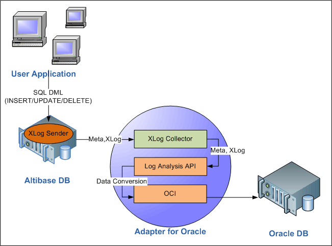

# 1.소개

이 장은 Adapter for Oracle 의 개념과 Altibase에서 변경된 데이터가 오라클 데이터베이스에 쓰여지는 동작 구조를 설명한다.

### Adapter for Oracle

Altibase Adapter for Oracle (이하 “oraAdapter”라 칭한다)은 Altibase에서 변경된 데이터를 오라클 DB로 적용시키는 유틸리티이다. 이는 Altibase에서 제공하는 Altibase Log Analysis API로 구현되었다.

#### 구조와 개념

사용자가 Altibase에서 변경된 데이터를 오라클 DB로 복제하기 위해서는 아래 그림에 보이는 것처럼 먼저 Altibase, oraAdapter, 및 오라클을 설치해야 한다.

oraAdapter는 Altibase Log Analysis API (이하 ALA 라 칭한다)와 Oracle Call Interface (OCI)를 사용해서 구현되었다. ALA는 Altibase에서 변경된 데이터를 받을 때 사용되고, OCI는 오라클 DB로 데이터를 쓸 때 사용된다. ALA에 대한 자세한 설명은 Log Analyzer User’s Manual을 참고하기 바란다.

아래 그림은 oraAdapter가 어떻게 Altibase에서 오라클 DB로 데이터를 복제하는지를 보여준다.

그림 1-1 Adapter for Oracle의 구조

1.  사용자가 데이터를 삽입하거나 수정할 때, Altibase 서버내의 XLog 송신자는 XLog와 메타 정보를 생성해서 XLog 콜렉터에게 보낸다. 메타 정보는 handshaking 시에만 전송한다.
    
2.  oraAdapter 내에 존재하는 XLog 콜렉터는 XLog와 메타 정보를 사용자에게 제공하기 위해 ALA를 사용한다. ALA 호출에 실패하면, 트레이스 로그가 trc 디렉터리의 파일에 기록된다.
    
3.  oraAdapter는 획득한 데이터를 오라클 DB로 적용할 수 있도록 변환하기 위해 ALA를 사용한다.
    
4.  oraAdapter는 변환된 데이터를 OCI를 사용하여 오라클 DB로 적용한다.

#### 용어

##### XLog

리두 로그를 논리적인 형태로 변환한 로그이다. 변경 DML (INSERT/UPDATE/DELETE) 구문과 관련된 트랜잭션의 이력을 저장한다.

##### XLog 송신자

XLog 송신자는 액티브 리두 로그를 분석하여 XLog 형태로 변환하고 이를 XLog 콜렉터에게 전달한다.

XLog 송신자는 handshaking과 XLog 전송을 주로 담당한다.

##### XLog 콜렉터

XLog 콜렉터는 메타 데이터와 XLog를 XLog 송신자로부터 받는다. XLog 콜렉터는 메타 데이터, XLog 큐, 트랜잭션 테이블 및 XLog 풀을 가지고 있다.

##### Handshaking

Handshaking은 XLog 송신자가 XLog 콜렉터에게 XLog를 보내기 전에 프로토콜 버전과 메타 데이터를 확인하는 작업이다.

##### Log Analysis API

Altibase에서 제공하는 인터페이스로써, oraAdapter를 구현할 때 사용된다. 이는 주로 XLog와 XLog를 해석하는데 사용되는 메타 정보를 구하는데 사용된다.

##### OCI

Oracle Call Interface (OCI)는 오라클 데이터베이스에 접근하도록 오라클에서 제공하는 C언어 API이다.

##### XLog 풀

XLog 풀은 XLog 저장을 위해 미리 할당된 메모리 공간이다.

