# 1.DBeaver

이 장은 DBeaver  개요, 시스템 요구사항, 설치 및 제거 방법, 그리고 Altibase 데이터베이스 시스템 연결하는 방법에 대해 소개한다.

### 개요 

DBeaver Community는 DBeaver 사에서 제공하는 무료 데이터베이스 툴이다. 80가지 이상의 데이터베이스 시스템에 연결하여 데이터 조작, 데이터베이스 객체 관리 기능, SQL 편집기, SQL Plan 뷰어, 데이터베이스 연결 세션 모니터링 등의 기능을 제공한다.

Altibase에서 제공하는 DBeaver 패키지는 기존 호환되는 데이터베이스 시스템과 더불어 Altibase에 연결 및 앞서 기술한 다양한 기능들을 제공한다. 

DBeaver 상세 매뉴얼은 https://github.com/dbeaver/dbeaver/wiki 를 참조한다.

### 시스템 요구사항

#### 소프트웨어 요구 사항

##### 호환되는 DBeaver 버전

Altibase와 호환되는 DBeaver 버전을 열거한다.

* DBeaver 23.3.3 이상

##### 호환되는 Altibase 서버 버전

DBeaver와 호환되는 Altibase 서버 버전을 열거한다.

- Altibase 7.1.0 이상

### 설치 및 제거

DBeaver 공식 다운로드 사이트 https://dbeaver.io/download/ 에서 내려받을 수 있다. 자세한 설치 및 제거 방법은 해당 사이트의 설명을 참조한다.

### Altibase 데이터베이스 시스템 연결

#### 1. 새 데이터베이스 연결

[ 데이터베이스 ] → [ 새 데이터베이스 연결 ]


#### 2. Altibase database 선택

All 또는 SQL에서 Altibase를 선택 후 [ Next > ] 버튼을 클릭한다.


#### 3. 데이터베이스 접속 정보 입력

Host, Port, Database/Schema, Username, Password에 연결하고자 하는 데이터베이스 접속 정보를 입력한다.


데이터베이스 접속 정보 입력을 마치고 [Finish] 를 클릭하면, Database 목록에 입력한 데이터베이스 연결 정보(mydb)가 추가된다. 


#### 4. JDBC 드라이버 파일 다운로드

처음 Altibase 연결 정보를 등록한 경우, Altibase JDBC 드라이버 파일이 있어야 연결이 가능하다. 인터넷에 접속 가능한 환경인 경우, '4.1 JDBC 드라이버 다운로드'를 참고한다. 인터넷 접속이 불가능한 환경이거나 수동으로 JDBC 드라이버를 등록하려는 경우는 '4.2 수동으로 JDBC 드라이버 등록' 을 참고한다.

##### 4.1 JDBC 드라이버 다운로드

Database Navigator 에 추가된 Altibase 연결 정보(mydb)를 더블 클릭하면, Altibase의 JDBC 드라이버 파일을 다운로드 할 수 있는 Driver settings 창이 열린다. 다운로드하려는 JDBC 드라이버를 선택한 다음, [Download]를 클릭한다.


다운로드가 완료되면 데이터베이스 연결이 수행된다. 이 작업은 최초 한번만 수행하면 된다.

##### 4.2 수동으로 JDBC 드라이버 등록

사용자가 JDBC 드라이버를 직접 등록할 수 있다. 이를 위해, 데이터베이스 접속 정보 입력 창 하단 [Driver Settings] 버튼을 클릭한다.


Libraries 탭의 [Add File]을 클릭한다.


사용할 Altibase JDBC 드라이버 파일을 선택하여 추가한 후 [Classpath] 버튼을 클릭한다.

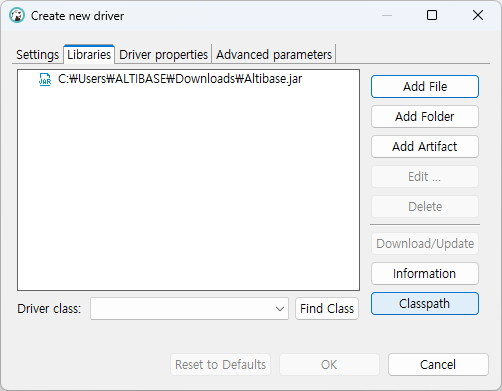

Global libraries 에 사용할 JDBC 드라이버 파일 위치를 추가하고 [Apply and Close] 를 클릭한다.


설정이 완료되었다면 [OK] 버튼을 클릭하고, 마지막으로 [Finish] 버튼을 클릭하여 설정을 완료한다.

#### 5. 데이터베이스 연결 완료

Database Navigator 탭에서 등록된 데이터베이스 연결 정보 목록을 확인할 수 있다.

목록의 데이터베이스 연결 정보를 더블 클릭하면 연결을 시도하며, 성공적으로 연결되면 아이콘에 초록색 체크 표시가 나타난다.


필요시 mydb 데이터베이스 연결 정보 이름을 원하는 이름으로 변경할 수 있다.


### FAQ

#### LOB 타입 데이터 조회가 안됩니다.

DBeaver는 Auto-Commit이 기본값으로 설정되어 있다. Altibase LOB 타입 데이터를 조회하기 위해서는 커밋 모드를 Auto-Commit에서 Manual Commit으로 변경해야 한다.

다음과 같이 세 가지 방법으로 해당 설정을 변경할 수 있다.

1. 툴바에서 버튼 아이콘을 눌러 Manual Commit으로 전환한다.

   

| 버튼 아이콘                           | 커밋 모드                 |
| ------------------------------------- | ------------------------- |
|  | Auto-Commit (자동 커밋)   |
|  | Manual Commit (수동 커밋) |


2. 커밋 모드 목록에서 Manual Commit을 선택한다.

   


3. 메뉴에서 Auto-commit 기본 설정 옵션을 해제한다. 이 설정을 적용하려면 데이터베이스에 다시 연결을 해야한다.

   [ 윈도우 ] → [ 설정 ]

   

   [ 연결 ] → [ 연결 유형 ]에서 "Auto-commit by default" 체크 박스를 해제

   [ Apply and Close ] 클릭 → 데이터베이스에 재접속

   

> [!NOTE]
>
> Manual Commit 모드에서는 테이블 수정 시 반드시 명시적으로 커밋 또는 롤백해야 한다.
>
> 

참조: https://dbeaver.com/docs/dbeaver/Auto-and-Manual-Commit-Modes/

#### SYSTEM_ 스키마가 보이지 않습니다.

DBeaver는 기본값으로 시스템 객체를 보여주지 않도록 설정되어 있다. SYSTEM_ 스키마를 보기 위해서는 "Show system objects" 옵션을 설정해야 한다.

데이터베이스 연결의 [ Connection View ] → [ Show system objects ] 옵션을 선택한다.


데이터베이스에 다시 연결하면 SYSTEM_ 스키마의 테이블과 뷰를 볼 수 있다.

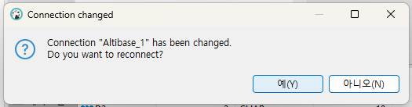

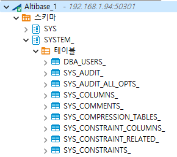

####  객체에 대해 정확하지 않은 DDL이 출력됩니다.

정확한 Altibase 객체의 DDL을 조회하기 위해서는 반드시 SYS 계정으로 DBMS_METADATA 패키지를 설치해야 한다.

DBMS_METADATA 패키지를 설치하기 위해서는 SYS 계정으로 Altibase에 접속하여 아래 구문을 수행해야 한다.

```
$ cd $ALTIBASE_HOME
$ is -f ./packages/dbms_metadata.sql
$ is -f ./packages/dbms_metadata.plb
```

예)

다음은 큐 객체 Q1을 생성하는 구문 예제이다.

   ```
CREATE QUEUE q1(40) MAXROWS 100000;
   ```

위 구문을 수행하고 DBeaver에서 Q1 객체의 DDL을 조회하면 결과가 아래와 같이 비정상적으로 출력될 수 있다.

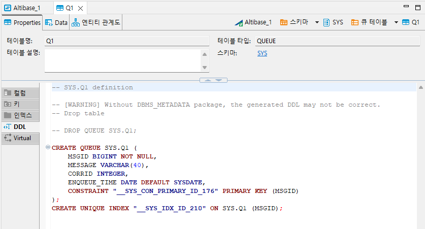

정확한 DDL 구문 출력을 위해 DBMS_METADATA 패키지를 설치한다.

```
$ cd $ALTIBASE_HOME
$ is -f ./packages/dbms_metadata.sql
$ is -f ./packages/dbms_metadata.plb
```

설치 후 DBeaver에서 대상 Altibase에 다시 연결하면, Q1 객체의 정확한 DDL을 조회할 수 있다.


#### 쿼리 실행 계획을 어디서 확인해야 하나요?

쿼리 실행 계획은 SQL script 창에 쿼리를 입력한 후, Explain Execution Plan 아이콘을 클릭하여 확인할 수 있다.

연결된 데이터베이스의 [ SQL 편집기 ] → [ 새 SQL 편집기 ] 를 클릭한다.


SQL Script 창에 쿼리를 입력 후 "Explain Execution Plan" 아이콘을 클릭하면 쿼리 실행 계획을 확인할 수 있다.


>  [!NOTE] 
>
>  쿼리 실행 계획의 기본 옵션 값은 Explain Plan Only이다.

#### 쿼리 실행 계획을 EXPLAIN_PLAN = ON으로 수행하고 싶습니다.

DBeaver Altibase Plugin에서는 각각의 접속마다 Explain plan을 ONLY 또는 ON으로 지정할 수 있다. 기본값은 ONLY이다.

Explain plan 설정값을 변경하는 방법은 다음의 두 가지가 있다.

1. 접속된 데이터베이스의 설정값을 변경한다.

   데이터베이스 연결을 클릭한다.

   

   [ 파일 ] → [ 설정 ]

   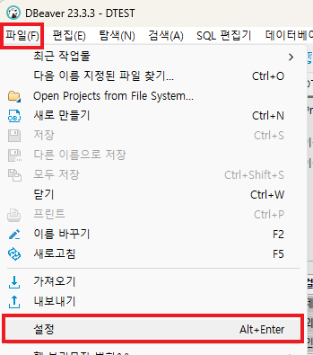

   Altibase settings → Datasource settings → Explain Plan 설정 값을 선택한다.

   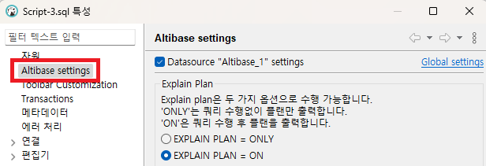

2. 스크립트 창에서 Preferences를 호출한다.

   스크립트 창의 Preferences 호출 버튼을 클릭한다.

   

   Altibase settings → Datasource settings → Explain Plan 설정 값을 선택한다.

   

#### 서버 출력(PSM PRINTLN 출력) 내용을 보고 싶습니다.

서버 출력 내용을 보기 위해서는 연결된 데이터베이스의 "Enable DBMS Output" 옵션을 설정해야 한다.

데이터 베이스 연결을 클릭한다.


[ 파일 ] → [ 설정 ]


[ Altibase settings ] → [ Datasource settings ] → 기타에서 "Enable DBMS Output"을 선택한다.

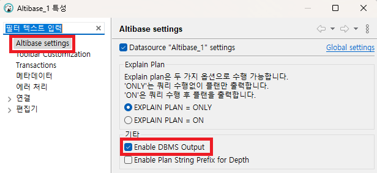

설정을 변경한 데이터베이스 연결의 SQL script 창에서 서버 출력 내용보기 버튼을 클릭한다. 이후 SQL문을 수행하면 서버 출력 내용이 Output 창에 출력된다.

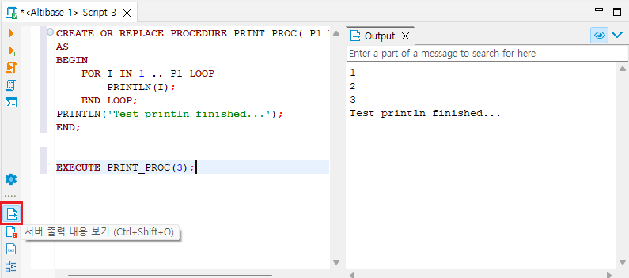

#### DATE 타입의 마이크로 초가 보이지 않습니다.

DBeaver의 Timestamp 출력 형식은 'yyyy-MM-dd HH:mm:ss.SSS'로 밀리 세컨드 초(소수점 뒤 3자리)까지 표현되는 반면, Altibase의 DATE 타입은 마이크로 초(소수점 뒤 6자리)까지 표현할 수 있다.

 DBeaver 기본 설정에 따른 DATE 타입 데이터 조회 결과는 아래와 같다.


DATE 타입을 마이크로 초 단위까지 출력하기 위해서는 DBeaver의 데이터 타입 설정을 변경해야 한다. 설정 변경 위치는 다음과 같다.

[ 윈도우 ] → [ 설정 ]


[ 편집기 ] → [ 데이터 편집기 ] → [ 데이터 포맷 ] → [ Datasource settings ]을 클릭한다.


설정을 변경할 데이터베이스 연결을 선택하고 [ Select ]를 클릭한다.


DATE 타입을 마이크로 초까지 볼 수 있도록 설정을 변경하는 방법은 두 가지가 있다.

1. 데이터 타입 Value Settings 변경

   [ Datasource settings ] → [ Format ] 의 Type을 Timestamp로 설정하고 Value 값을 'yyyy-MM-dd HH:mm.ss.SSSSSS'로 변경 후 [ Apply and Close ]를 클릭한다.

   

   DATE 타입 데이터를 조회하면 아래와 같이 0을 포함하여 소수점 뒤 6자리까지 고정된 자리수를 표시한다.

   

2. 데이터 포맷 Disable date/time formatting 옵션 설정

   [ Datasource settings ] → [ Settings ] 에서 "Disable date/time formatting" 옵션을 선택하고 [ Apply and Close ]를 클릭한다.

   

   DATE 타입 데이터를 조회하면 아래와 같이 소수점 뒤 6자리까지 유효한 숫자를 표시한다.

   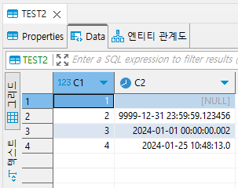

참조: https://dbeaver.com/docs/dbeaver/Managing-Data-Formats/

#### CHAR 타입 수정 시 "Invalid data type length" 에러 메시지가 표시됩니다.

DBeaver Data Editor는 데이터 수정 시 기본으로 INSERT 구문을 수행한다. Data Editor로 데이터를 수정한 후 저장 하기 전에 수정된 데이터가 칼럼 크기를 초과하지 않는지 확인해야 한다.

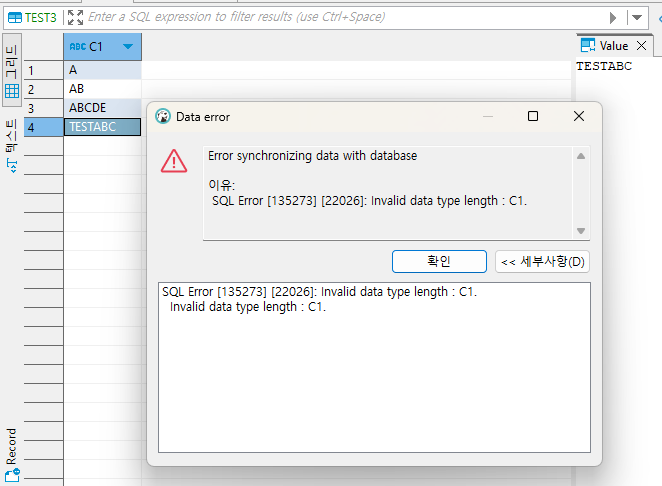

#### 이진 데이터 타입을 Hex로 보고 싶습니다.

DBeaver의 기본 설정은 이진 데이터 타입을 String 타입으로 인코딩하여 보여준다. 이진 데이터 타입을 Hex 타입으로 보기 위해서는 설정을 변경해야 한다.


데이터 베이스 연결을 클릭한다.


[ 파일 ] → [ 설정 ]


[ 편집기 ] → [ 데이터 편집기 ] → [ 편집기 ] → Binary data에서 Binary data formatter 설정을 String에서 Hex로 변경한 후 [ Apply and Close ]를 클릭한다.


테이블 하단의 [ Refresh ] 버튼을 누르면 이진 타입 데이터를 Hex 타입으로 보여준다.


참조: https://dbeaver.com/docs/dbeaver/Data-View-and-Format/

#### DBeaver Data Editor에서 이진 타입 데이터 수정이 안됩니다.

DBeaver에서 이진 타입 데이터를 수정하기 위해서는 Data Editor에서 "Value" 창에 수정할 데이터를 입력해야 한다. 그리드 창의 셀에 직접 데이터를 입력하게 되면 해당 값이 이진값으로 변환되어 저장된다. 


#### 이진 데이터 타입 중 BIT, VARBIT, NIBBLE은 DBeaver에서 어떻게 처리되나요?

DBeaver에서 이진 데이터는 바이트 단위로 처리된다. 이진 데이터 타입 중 BIT, VARBIT, NIBBLE은 바이트 단위보다 작게 설정될 수 있기 때문에 부득이하게 숫자형, 문자형으로 처리한다.

#### 이전에 설정했던 DBeaver 설정을 완전히 지우고 다시 설치하고 싶습니다.

이전 DBeaver 설정을 완전히 지우고 다시 설치하고자 할 경우 DBeaver 앱 및 사용자 데이터를 완전히 제거 후 다시 설치해야 한다.

아래 OS 종류에 따른 기본 DBeaver workspace의 폴더 위치를 확인하고 DBeaver 데이터를 완전히 제거한다.

| OS 종류 | Default location of DBeaver workspace                        |
| ------- | ------------------------------------------------------------ |
| Windows | `%APPDATE$\DBeaverData`                                      |
| MacOS   | `~/Library/DBeaverData/`                                     |
| Linux   | `$XDG_DATA_HOME/DBeaverData/` ($XDG_DATA_HOME=`~/.local/share` if not set) |

참조: https://dbeaver.com/docs/dbeaver/Workspace-Location/

#### SQL Editor에서 Auto commit off를 기본 설정으로 사용하고 싶습니다

DBeaver는 auto commit on을 기본으로 설정하고 있다.

Auto commit off를 상시 기본 설정으로 사용하고 싶다면,

1. 특정 연결을 클릭 → 오른쪽 마우스 클릭 → Edit Connection 메뉴 클릭 또는 F4 버튼을 눌러 설정 화면을 연다.
2. Connection settings → Initialization → Connection → Auto-commit 체크 박스를 꺼 준다.

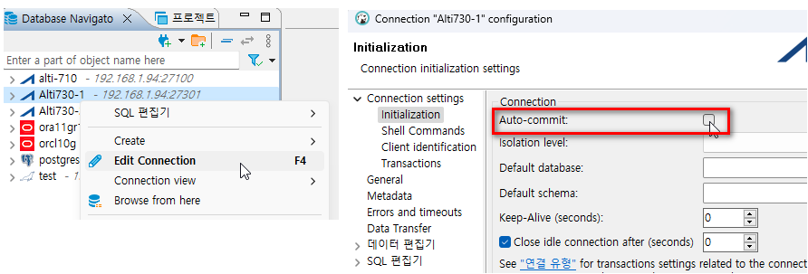


일시적으로 auto-commit 모드를 변경하고 싶은 경우는 아래 그림처럼 트랜잭션 버튼을 눌러 설정 변경이 가능하다.

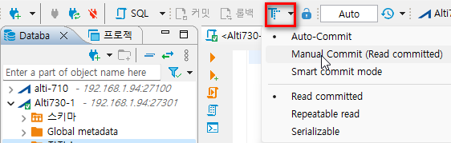


