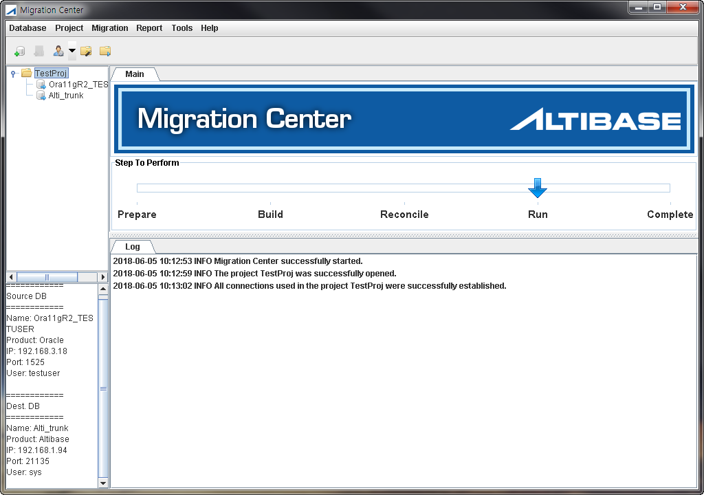

# 2.Migration Center 시작하기

이 장은 먼저 사용자들이 Migration Center를 좀 더 능률적이고 효율적으로 실행하는
데 도움이 되는 기본 개념을 소개한다. 그런 후에, Migration Center를 GUI모드와 CLI
모드로 사용하는 방법을 간략하게 설명하고 사용자 편의를 위해 제공되는 도구를
설명한다. 이 장은 다음의 절로 구성된다.

- Migration Center 이해하기

- 사용자 인터페이스 이해하기

- 도구

### Migration Center 이해하기

이 절은 용어를 소개하고 Migration Center로 작업하는 전반적인 과정을 설명한다.

- 용어

- 기본 개념

#### 용어

##### 프로젝트

Migration Center 프로젝트는 마이그레이션의 모든 면을 기술하는 기본 작업
단위이다. 이것은 무엇을 마이그레이션할 지, 어디에서 어디로 마이그레이션할 지(즉,
어떤 종류의 데이터베이스 또는 데이터 파일), 그리고 데이터베이스 객체와 테이블
데이터를 어떻게 마이그레이션할 지를 포함한다. 마이그레이션 옵션에 관한 상세한
내용은 이 매뉴얼의 "A. 부록: 마이그레이션 옵션"에서 제공한다. 프로젝트는
언제든지 오직 한 개만 열 수 있다.

#### 기본 개념

Migration Center를 사용하여 마이그레이션을 수행하는 전반적인 과정은
"준비(Prepare)", "구축(Build)", "조정(Reconcile)", "실행(Run)" 및 "검증(Data
Validation)" 의 다섯 단계로 구성된다.

##### 준비(Prepare) 단계

"준비" 단계는 실제 마이그레이션 프로젝트에 대한 암묵적인 단계이다. "준비" 단계의
최종 상태는 모든 데이터베이스 연결이 설정된 프로젝트가 열려 있는 것이다. 최종
"준비" 단계 상태로 가려면, 사용자는 운영중인 데이터베이스 연결 정보를
추가하거나, 기존의 마이그레이션 프로젝트를 열거나, 사전에 구성된 데이터베이스
연결을 사용해서 새로운 마이그레이션 프로젝트를 생성하거나, 또는 데이터베이스와의
연결을 설정해야 한다.

##### 구축(Build) 단계

"구축" 단계는 원본 및 대상 데이터베이스의 현재 상태에 대한 초기 조사를 수행한다.
데이터베이스와의 연결을 통해 원본 및 대상 데이터베이스의 데이터베이스 객체에
관한 정보를 가져오고, 이 정보를 프로젝트 디렉터리에 저장한다. 이렇게 수집된
정보가 다른 단계에서 사용되기 때문에, 여기에는 가장 최신의 상태가 반영되어야
한다. "실행" 단계 전에 원본 데이터베이스에서 어떤 메타 정보가 변경된다면, 변경
사항들까지 통합하기 위해 "구축"에서 "실행" 단계까지 모두 재수행 되어야 한다.

##### 조정(Reconcile) 단계

"조정" 단계는 현재 상태에 대해 완벽한 마이그레이션 계획을 구성한다. 이
단계에서는 원본 및 대상 데이터베이스 시스템 간의 데이터 타입 및 테이블 스페이스
등의 차이를 조정하는 것이 대부분이다. 이 단계에서 사용자는 원본
데이터베이스로부터 데이터 추출시에 사용할 SELECT문과 대상 데이터베이스에 실행할
DDL문을 편집할 수 있다. 예를 들어, 사용자는 원본 데이터베이스의 어떤 테이블이
대상 데이터베이스의 어떤 테이블스페이스로 복사될지를 명시할 수 있다.

마이그레이션 옵션에 변경이 가해지면 이 단계가 재수행되는 점을 염두에 두기
바란다.

##### 실행(Run) 단계

"실행" 단계는 "조정" 단계에서 도출된 계획을 실행한다. 이 단계에서 직접 또는
간접적으로 스키마와 데이터가 마이그레이션 된다.

마이그레이션 옵션에서 Migration Type를 "DB" to "DB"로 설정했다면, Migration
Center는 대상 데이터베이스에 데이터베이스 객체를 생성한다(스키마 마이그레이션).
그 다음에 원본 데이터베이스에서 대상 데이터베이스로 데이터를 복사한다(데이터
마이그레이션).

마이그레이션 옵션에서 Migration Type를 "DB" to "File"로 설정했다면, 마이그레이션
하는 동안 SQL 스크립트 파일이 생성된다. 그러나 기본 마이그레이션 과정은
동일하다.

##### 검증(Validation) 단계

"검증" 단계는 "실행" 단계에서 이관된 데이터를 원본 데이터베이스와 데이터가
일치하는지 검사를 수행한다. "구축" 단계를 "Build User"로 수행했다면 Primary
Key가 있는 모든 테이블을 대상으로 데이터의 일치 여부를 검사한다. "구축" 단계를
"Build Table"로 수행했다면 마이그레이션한 테이블 중 Primary Key가 있는 테이블을
대상으로 데이터의 일치 여부를 검사한다.

검증 과정에서 원본과 다른 데이터는 CSV 형식으로 저장된다. 차이가 나는 데이터는
"FILESYNC" 메뉴 또는 명령으로 대상 데이터베이스에 반영할 수 있다. 또한 "검증"
단계에서 소요되는 시간을 줄이기 위해, 기본적으로 데이터 샘플링 기능이
사용된다.만약 샘플링 데이터 대신에 전체 데이터를 검증하고 싶으면 "Migration
Options"의 "Data Validation Options" 항목들 중 "Data Sampling"을 "No"로 변경하면
된다.

### 사용자 인터페이스 이해하기

이 절은 Migration Center에서 제공하는 사용자 인터페이스인 GUI 모드와 CLI 모드에
대해 간략히 설명한다. 각 모드 별 상세 사용법은 'GUI 모드 퀵 가이드' 및 'CLI 모드
퀵 가이드'에서 좀 더 상세한 설명을 제공한다.

#### 그래픽 사용자 인터페이스(GUI) 모드

GUI 모드는 사용자 친화적인 인터페이스로 Migration Center의 기본 인터페이스이다.
GUI 모드를 사용하면 마이그레이션 전 과정을 직관적으로 수행할 수 있으며, 특히
"조정" 단계와 옵션 변경에서 섬세한 조작이 가능하다. 클라이언트 컴퓨터에서
서버까지 자바 스윙 (Java Swing)을 지원하는 플랫폼이면 어느 곳이든 GUI 모드로
수행가능하다.

Migration Center GUI는 아래 그림과 같이 네 개의 창으로 이루어져 있다. 왼쪽
상단부터 시작하여 시계 방향으로 각각 "프로젝트(Project)", "정보(Information)",
"로그(Log)", "DB 속성(DB Properties)" 창이다.

##### 프로젝트 창

프로젝트 창은 프로젝트 중심의 뷰를 제공한다. 프로젝트 창은 열려 있는 프로젝트와
원본 및 대상 데이터베이스 연결을 보여준다. 한번에 오직 하나의 프로젝트만
프로젝트 창에 열 수 있다.

##### 정보 창

이 창은 프로젝트에 대한 간단한 뷰를 제공한다. 현재의 진행 상황 및 남아 있는
단계를 보여준다.

##### 로그 창

이 창에는 Migration Center에서 수행된 작업의 결과가 발생한 순서대로 출력된다.
이는 Migration Center가 설치된 디렉토리 아래의 "log"라는 하위 디렉토리에
저장되는 로그로부터 사용자가 관심 있을 만한 정보를 선별한다.

##### DB 속성 창

이 창은 프로젝트에 설정된 원본 데이터베이스와 대상 데이터베이스에 대한 정보를
보여준다.

#### 명령어 인터페이스(CLI) 모드

CLI 모드를 사용하는 주된 이유는 빠른 "실행" 단계를 수행하기 위해서다.
마이그레이션 중 가장 많은 시간이 소요되는 "실행" 단계는, "조정" 단계를 거쳐
변환된 스키마를 생성하고 원본 데이터베이스로부터 가져온 데이터를 대상
데이터베이스에 입력하는 것이다. 데이터베이스가 설치된 서버에서 CLI 모드로 "실행"
단계를 수행하는 것이 클라이언트 컴퓨터에서 GUI 모드로 "실행" 단계를 수행하는
것에 비해 통신 비용을 감소시켜 데이터 전송 속도를 높일 수 있다.

"준비"에서 "조정" 단계까지 GUI 모드에서 수행 후 "실행"과 "검증" 단계만 CLI
모드로 수행하면, GUI 모드의 편리함과 CLI 모드의 빠른 성능, 두가지 장점을 모두
이용할 수 있다.

CLI 모드로 사용하는 또다른 이유는 GUI 모드가 허용되지 않는 환경에서
마이그레이션을 수행하기 위한 것이다. 마이그레이션 전 과정을 CLI 모드로
수행가능하지만, CLI 환경이 지닌 한계로 인한 제약점 또한 가지고 있다. 예를 들어,
CLI 모드에서는 사용자가 임의로 "조정" 단계를 수행할 수 없으며 기본 값으로만
수행가능하다.

### 도구

이 절은 Migration Center 에 포함되어 있는 두 가지 유틸리티에 대해 그 사용법을
소개한다.

#### PSM Converter for File

PSM Converter for File은 오라클의 PL/SQL을 Altibase PSM으로 변환한다. 이 도구는
오라클 PL/SQL 구문이 들어있는 SQL 파일을 읽어서 Altibase PSM으로 전환한 다음,
결과를 미리 정의한 SQL 파일에 기록한다. 이 파일은 HTML 형식의 보고서 파일과 함께
제공된다. 이 도구의 기능은 내부적으로 마이그레이션 조정 단계에서의 "PSM
Converter"와 동일하다. 이 도구의 변환 규칙에 대한 상세한 내용은 "D. 부록: PSM
변환기 규칙 목록"을 참고하기 바란다.

PSM Converter for File는 메인 메뉴의 Tools -\> PSM Converter for File로 실행할
수 있다.

#### Generate Migration Error Report

Generate Migration Error Report는 Migration Center에서 발생하는 문제를 보고하는
유틸리티이다. 프로젝트를 연 후에, 이 도구를 실행하면 로그 파일, 리비전 번호 같은
문제 추적 정보를 수집하여 zip 파일을 생성한다. 사용자는 이 zip 파일을 첨부하여
Altibase 고객서비스포털에 고객 등록 정보와 함께 보내기만 하면 된다.

이 툴은 메인 메뉴의 Tools -\> Generate Migration Error Report로 실행할 수 있다.

 

