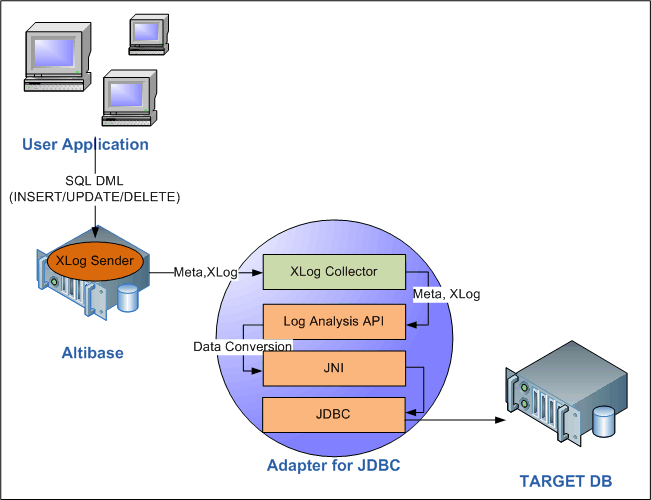

# 1.소개

이 장은 Adapter for JDBC의 개념과 구조, 그리고 Altibase에서 변경된 데이터가 다른
데이터베이스에 복제되는 동작 구조를 설명한다.

### Adapter for JDBC

Altibase Adapter for JDBC(이하 'jdbcAdapter'라 칭한다)는 Altibase에서 변경된
데이터를 JDBC를 지원하는 다른 데이터베이스에 적용하는 유틸리티이다. 이는
Altibase 에서 제공하는 Altibase Log Analysis API를 이용하여 구현되었다.

#### 구조와 개념

사용자가 Altibase에서 변경된 데이터를 다른 데이터베이스(Other DB)로 복제하기
위해서는 아래 그림에 보이는 것처럼 먼저 Altibase, jdbcAdapter 및 사용하려는
JDBC를 지원하는 타사의 데이터베이스를 설치해야 한다.

jdbcAdapter는 Altibase Log Analysis API (이하 ALA라 칭한다)와 Java data base
connectivity (JDBC)를 사용하여 구현되었다. ALA는 Altibase에서 변경된 데이터를
수신할 때 사용되고, JDBC는 데이터를 보낼 대상이 되는 다른 데이터베이스로
데이터를 전송할 때 사용된다. ALA에 대한 자세한 설명은 *Log Analyzer User’s
Manual*을 참고하기 바란다.

아래 그림은 jdbcAdapter가 어떻게 Altibase에서 다른 데이터베이스로 데이터를
복제하는지를 보여준다.

[그림 1] Adapter for JDBC의 구조

1.  사용자가 데이터를 삽입하거나 수정할 때, Altibase 서버 내의 XLog 송신자는
    XLog와 메타 정보를 생성하여 XLog 콜렉터에게 전송한다. 메타 정보는
    handshaking 시에만 전송한다.

2.  jdbcAdapter 내에 존재하는 XLog 콜렉터는 XLog와 메타 정보를 사용자에게
    제공하기 위해 ALA를 사용한다. ALA 호출에 실패하면, 트레이스 로그가 trc
    디렉터리의 파일에 기록된다.

3.  jdbcAdapter는 획득한 데이터를 다른 데이터베이스에 적용하기 위해 ALA를
    사용하여 데이터를 변환한다.

4.  jdbcAdapter는 변환된 데이터를 JNI를 통해 JDBC를 사용하여 다른 데이터베이스에
    적용한다.

#### 용어

##### XLog

리두 로그를 논리적인 형태로 변환한 로그이다. 변경 DML (INSERT/UPDATE/DELETE)
구문과 관련된 트랜잭션의 이력을 저장한다.

##### XLog 송신자

XLog 송신자는 액티브 리두 로그를 분석하여 XLog 형태로 변환하고 이를 XLog
콜렉터에게 전달한다.

XLog 송신자는 handshaking과 XLog 전송을 주로 담당한다.

##### XLog 콜렉터

XLog 콜렉터는 메타 데이터와 XLog를 XLog 송신자로부터 받는다.

XLog 콜렉터는 메타 데이터, XLog 큐, 트랜잭션 테이블 및 XLog 풀을 가지고 있다.

##### Handshaking

Handshaking은 XLog 송신자가 XLog 콜렉터에게 XLog를 보내기 전에 프로토콜 버전과
메타 데이터를 확인하는 작업이다.

##### Log Analysis API

Altibase가 제공하는 인터페이스로써, jdbcAdapter를 구현할 때 사용된다. 주로
XLog와 XLog를 해석하는데 사용되는 메타 정보를 구하는데 사용된다.

