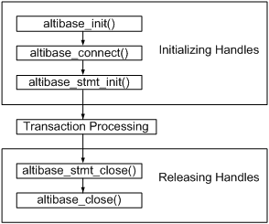

# 1.Altibase C 인터페이스 소개

이 장은 Altibase C 인터페이스가 무엇인지 소개하고 기본적인 사용법에 대해서
설명한다.

### Altibase C 인터페이스란?

Altibase C 인터페이스(Altibase C Interface, 앞으로 ACI 라 칭함)는 클라이언트
응용 프로그램에서 Altibase에 접근하기 위해 사용할 수 있는 C 함수이다. C 언어로
클라이언트 응용 프로그램 작성시 ACI를 이용할 수 있다. ACI를 이용해서 Altibase에
연결, 데이터를 조회 또는 조작할 수 있다.

#### ACI vs. CLI

Altibase CLI는 ODBC 표준 인터페이스인 반면, ACI는 Altibase 전용 인터페이스이다.
따라서 ACI를 사용하면 동일한 SQL문을 수행할 때 ODBC보다 적은 수의 함수를
호출하기 때문에 사용이 용이하다.

### ACI 사용 방법

이 절은 ACI를 이용한 응용 프로그램 작성에 필요한 사전 지식을 제공한다.

#### 기본 사용법

ACI 응용 프로그램은 일반적으로 다음의 3단계로 구성된다.

-   초기 설정

-   트랜잭션 처리

-   종료

위 단계에 더해서, 오류 발생시에는 진단 메시지를 확인하는 단계가 추가될 수 있다



#### 초기 설정

이 단계에서는 연결 핸들 및 명령문 핸들을 할당하고 초기화한다. 핸들은 이전 단계의
실행 결과에 관한 정보를 저장하고 있는 메모리 포인터이며, 한 단계에서 다음
단계로의 전이는 적절한 핸들을 전달함으로써 이루어진다. ACI 응용 프로그램 작성을
위해 제공되는 핸들의 종류는 다음과 같다.

##### ALTIBASE 핸들

ALTIBASE 핸들은 ACI가 관리하는 연결과 관련된 정보를 저장하는 메모리 포인터이다.
이 정보에는 연결 상태와 트랜잭션의 상태가 포함된다. 응용 프로그램에서는 각
연결별로 ALTIBASE 핸들을 생성하고 초기화해야 하며, 이 핸들을 이용해서 Altibase로
연결을 시도할 수 있다. 또한, 이 핸들을 사용해서 Altibase에 대해 SQL문을 수행할
수도 있다.

##### ALTIBASE_STMT 핸들

Prepare-Execution 방식으로 SQL문을 수행하려면 ALTIBASE_STMT핸들을 사용해야 한다.
하나의 연결 핸들에 대해 최대 1024개의 ALTIBASE_STMT핸들이 할당될 수 있다.

#### 트랜잭션 처리

다음의 도식은 트랜잭션을 처리하기 위해서 함수가 호출되는 일반적인 절차를
보여준다.


#### 종료

이 단계에서는 핸들과 핸들이 참조하는 정보가 저장된 메모리를 해제하며,
응용프로그램을 종료한다.

#### 진단

진단이란 응용 프로그램 내에서 ACI 함수 호출시 발생한 오류나 경고 상태를 확인하는
것을 말한다. ACI 함수 호출의 반환 값을 검사해서 함수가 성공적으로 수행되었는지
여부를 확인할 수 있다. 함수별 반환값은 3장의 각 함수에 대한 설명을 참고하라.

함수가 성공적으로 수행되지 못한 경우, 진단 메시지가 생성된다. 진단 메시지를
확인하기 위해서, 다음의 함수를 사용할 수 있다. 함수 호출시 사용된 핸들의 종류에
따라서 사용할 수 있는 진단 함수가 달라진다.

<table>
	<tr>
		<td>핸들 타입</td>
		<td>ALTIBASE</td>
		<td>ALTIBASE_STMT</td>
		<td>설명</td>
	</tr>
	<tr>
		<td rowspan="3">함수</td>
		<td>altibase_errno()</td>
		<td>altibase_stmt_errno()</td>
		<td>에러 코드 조회</td>
	</tr>
	<tr>
		<td>altibase_error()</td>
		<td>altibase_stmt_error()</td>
		<td>에러 메시지 조회</td>
	</tr>
	<tr>
		<td>altibase_sqlstate()</td>
		<td>altibase_stmt_sqlstate()</td>
		<td>SQLSTATE 코드 조회</td>
	</tr>
</table>


함수 반환값이 ALTIBASE_SUCCESS, ALTIBASE_NO_DATA_FOUND 및
ALTIBASE_INVALID_HANDLE이 아닌 경우에만 진단 메시지를 조회할 수 있다.

##### 진단 메시지

진단 메시지 중 SQLSTATE 코드는 5개의 알파벳과 숫자로 이루어진 문자열이다. 첫 두
문자는 클래스를 가리키며, 뒤의 세 문자는 하위 클래스를 가리킨다. ACI 진단
메시지는 X/Open SQL CAE 명세를 준수한다.

> #### 주의사항
>
> -   멀티 쓰레드 프로그램을 작성할 때, 쓰레드별로 환경 핸들, 연결 핸들을 각각
>     할당해야 한다.
>
> -   Altibase 클라이언트 라이브러리는 신호 처리를 하지 않는다. 따라서 외부 원인에
>     의해 네트워크 접속이 종료된 경우, SIGPIPE 신호를 받아 진행중인 응용
>     프로그램이 강제로 종료될 수 있다.  
>     이러한 강제 종료를 막기 위해서는 SIGPIPE 신호를 사용자 응용 프로그램에서
>     처리해야 한다. SIGPIPE 신호 처리를 처리하는 함수 내에서 Altibase 클라이언트
>     라이브러리 함수를 호출하면 프로그램이 멈출 수도 있으므로, 신호 처리 함수
>     작성에 주의해야 한다. 하지만 신호 처리가 끝난 후에는 Altibase 클라이언트
>     라이브러리 함수를 호출하는 것이 가능하다.
>

### 클라이언트 응용 프로그램 빌드

이 절은 클라이언트 응용 프로그램을 빌드하는 데 필요한 헤더 파일과 라이브러리
파일에 대해 기술한다.

#### 헤더 파일

응용 프로그램 작성 시에 포함되고, 컴파일시에 참조되는 헤더 파일은 alticapi.h로,
이는 \$ALTIBASE_HOME/include 디렉토리에 존재한다.

컴파일시에는 컴파일 명령어에 다음의 옵션을 사용하라:

```
-I$ALTIBASE_HOME/include
```

#### 라이브러리 파일

응용 프로그램을 빌드하려면, 컴파일된 오브젝트 파일을 Altibase가 제공하는 ACI
라이브러리 및 ODBC 라이브러리와 함께 링크해야 한다. 이들 라이브러리는 아래의
파일들이며, \$ALTIBASE_HOME/lib 디렉토리에 존재한다.

-   libalticapi.a

-   libodbccli.a

링크시에는 링크 명령어에 다음의 옵션을 사용하라:

```
-L$ALTIBASE_HOME/lib -lalticapi -lodbccli
```

