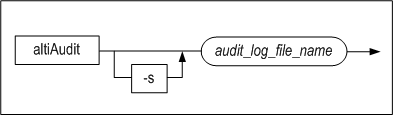
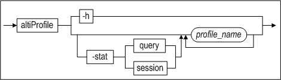
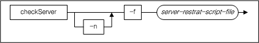
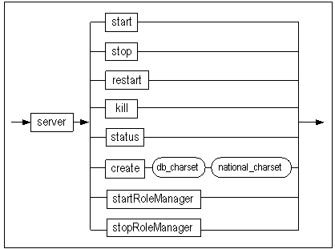

# 5.기타 Utilities

## altiAudit

### 개요

감사가 Altibase 서버에서 수행 중이라면, \$ALTIBASE_HOME/trc 디렉토리에 기본적으로 감사 로그 파일이 생성되고 로그가 기록될 것이다. 감사 로그 파일의 위치는 AUDIT_LOG_DIR 프로퍼티로 변경 가능하다. 이 파일에는 사용자가 읽을 수 없는 바이너리 형태의 감사 로그가 기록되어 있다. altiAudit 유틸리티는 감사 로그 파일을 문자 형태로 변환하여 출력함으로써 사용자가 감사 로그를 분석할 수 있게 한다.

```
altiAudit [-s] {audit_log_file_name}
```


### 구문



### 설명

서버가 남긴 감사 로그를 문자 형태로 변환하여 출력한다.

\-s 옵션을 사용해서 CSV 형태로 출력할 수도 있다.

### 사용예

아래는 감사 로그를 일반 텍스트 형태로 출력하는 명령어이다.

```
$ altiAudit $ALTIBASE_HOME/trc/alti-1366989680-0.aud
```

아래와 같은 형태의 결과가 출력된다.

```
[2015/03/05 14:59:29]
Session Info 
  User Name        = SYS
  Session ID       = 1                   
  Client IP        = 127.0.0.1
  Client Type      = CLI-64LE
  Client App Info  = isql
  Action           = INSERT
  Auto Commit      = 1                        (0:non-autocommit 1:autocommit)
 
Query Info 
  Statement ID      = 65540               
  Transaction ID    = 150657              
  Execute result    = 4                       (0:failure 1:rebuild 2:retry 3:queue empty 4:success)
  Fetch result      = 2                       (0:failure 1:success 2:no result set)
  Success count     = 1                   
  Failure count     = 0                   
  Return code       = 0x02000
  Processed row     = 1                   
  Used memory       = 0                       bytes
  XA flag           = 0                       (0:non-XA 1:XA)
 
Query Elapsed Time 
  Total time        = 0                   
  Soft prepare time = 0                   
  Parse time        = 0                   
  Validation time   = 0                   
  Optimization time = 0                   
  Execution time    = 0                   
  Fetch time        = 0                   
 
SQL 
--------------------------------------------------------------------------------
insert into t1 values ('aaaa', 1)
-------------------------------------------------------------------------------- 

```

아래는 감사 로그를 CSV 형태로 출력하는 명령어이다.

```
$ altiAudit -s $ALTIBASE_HOME/trc/alti-1366989680-0.aud
```

아래와 같이 CSV 형태의 결과가 출력된다.

```
1425535169,SYS,1,127.0.0.1,CLI-64LE,isql,INSERT,1,65540,150657,4,2,1,0,1,0,0,0,0,0,0,0,0,0,"insert
into t1 values ('aaaa', 1)"
```


### 출력 항목

출력 항목과 의미는 아래 표와 같다.

| 필드 이름              | 타입    | 설명                                                         |
| ---------------------- | ------- | ------------------------------------------------------------ |
| **Session Info**       |         |                                                              |
| User Name              | 문자열  | 세션에 접속한 사용자 이름                                    |
| Session ID             | INTEGER | 세션 ID                                                      |
| Client IP              | 문자열  | 클라이언트 IP 주소                                           |
| Client Type            | 문자열  | 접속한 클라이언트의 타입                                     |
| Client App Info        | 문자열  | 애플리케이션 정보                                            |
| Action                 | 문자열  | 실행된 구문의 종류                                           |
| Auto Commit            | INTEGER | 0: Non-auto commit mode 1: auto commit mode                  |
| **Query Info**         |         |                                                              |
| Statement ID           | INTEGER | Statement ID                                                 |
| Transaction ID         | INTEGER | 트랜잭션 ID                                                  |
| Execute result         | INTEGER | 수행 결과 0: failure 1: rebuild 2: retry 3: query empty 4: success |
| Fetch result           | INTEGER | Fetch 결과 0: failure 1: success 2: no result set            |
| Success count          | INTEGER | 감사 조건에 부합하는 구문이 성공한 횟수이다. BY SESSION 조건일 경우, 감사 조건에 부합하는 구문의 수행에 성공한 횟수의 누적 값이다. BY ACCESS 조건일 경우, 감사 조건에 부합하는 구문이 성공적으로 수행된 경우 1이 표시된다. |
| Failure count          | INTEGER | 감사 조건에 부합하는 구문이 실패한 횟수이다. BY SESSION 조건일 경우, 감사 조건에 부합하는 구문의 수행에 실패한 횟수의 누적 값이다. BY ACCESS 조건일 경우, 감사 조건에 부합하는 구문의 수행이 실패한 경우 1이 표시된다. |
| Return code            | INTEGER | 감사 조건에 부합하는 구문이 수행된 결과 코드이다. BY ACCESS 조건일 경우에만, 수행 결과가 표시된다. |
| Processed row          | INTEGER | 처리된 레코드의 개수                                         |
| Used memory            | INTEGER | 사용된 메모리 (향후 확장 예정)                               |
| XA flag                | INTEGER | 0: Non-XA 1: XA                                              |
| **Query Elapsed Time** |         |                                                              |
| Total time             | BIGINT  | 쿼리 수행에 소요된 총 시간                                   |
| Soft prepare time      | BIGINT  | Prepare 수행에 소요된 시간                                   |
| Parse time             | BIGINT  | 파싱 수행에 소요된 시간                                      |
| Validation time        | BIGINT  | 정당성 검사에 소요된 시간                                    |
| Optimization time      | BIGINT  | 최적화 수행에 소요된 시간                                    |
| Execution time         | BIGINT  | 실행에 소요된 시간                                           |
| Fetch time             | BIGINT  | Fetch 수행에 소요된 시간                                     |
| **SQL**                |         |                                                              |
|                        | 문자열  | 실행된 SQL 구문                                              |

## altibase

### 개요

‘altibase’는 Altibase의 모든 서비스를 관장하는 서버 프로세스를 실행하는 파일이다.

```
altibase {-v|n}
```


### 구문


### 파라미터

| 파라미터 | 설명                                                |
|----------|-----------------------------------------------------|
| \-v      | 설치되어 있는 Altibase 제품의 버전 정보를 출력한다. |
| \-n      | Altibase를 포그라운드에서 수행한다.                 |

### 설명

‘altibase’는 Altibase의 모든 서비스를 관장하는 서버 프로세스의 실행 가능(executable) 파일이다.

Altibase를 구동하거나 종료하기 위해 이 커맨드를 직접 사용하면 안 된다. 대신에 iSQL에 SYSDBA 모드로 접속한 뒤, 구동이나 종료 명령을 사용하거나 server 커맨드를 사용해야 한다. server 커맨드는 실제로 Altibase 구동과 종료에 관련된 일련의 명령을 묶어놓은 쉘 스크립트이다. 관련 내용은 본 문서의 server 항목을 참조한다.

보다 자세한 Altibase의 구동 및 종료에 관한 내용은 *iSQL User’s Manual*이나 *Getting Started Guide* 를 참조한다.

iSQL로 구동된 Altibase 서버 프로세스는 백그라운드에서 운영된다. 반면, 쉘 프롬프트에서 altibase 커맨드를 -n옵션으로 수행할 경우 Altibase는 포그라운드에서 구동된다. 이는 Altibase 디버깅을 위한 용도로만 사용되며, 실 운영 시에는 사용하지 않도록 한다.

\-v 옵션으로 altibase 커맨드를 실행하면 현재 설치된 Altibase 제품의 버전 정보를 출력한다.

### 참고사항

Getting Started Guide

Administrator’s Manual

iSQL User’s Manual


## altierr

### 개요

altierr은 Altibase 서버 에러 코드에 대한 상세한 설명을 검색하여 출력하는 유틸리티이다. 에러 번호나 에러 메시지 패턴을 이용하여 검색이 가능하다.

```
altierr {-w keyword pattern | [-n] error number}
```


### 구문


### 파라미터

| 파라미터 | 설명                                                         |
| -------- | ------------------------------------------------------------ |
| \-w      | 지정한 검색 패턴을 포함하는 에러 메시지를 찾는다. <br />검색 패턴을 포함하는 모든 에러 메시지를 출력한다. |
| \-n      | 에러 번호를 사용하여 검색한다. 에러 번호는 16진수/양의 정수/음의 정수 형태로 입력 가능하다. <br />에러 코드와 정확히 일치하는 레코드만 검색된다. <br />에러 번호를 사용하여 검색할 경우 파라미터(“-n”)를 생략할 수 있다. |

### 설명

altierr은 Altibase 서버의 에러 코드 번호나 에러 메시지에 포함된 문자열을 이용하여 에러에 대한 상세한 설명을 검색하고 출력해 주는 유틸리티이다.

에러 상세 설명에는 에러 코드 번호, 에러 코드 문자열, 에러 설명, 에러가 발생한 원인, 그리고 에러에 대한 조치 사항이 포함된다.

Altibase 서버는 에러 상황 발생시 해당 코드를 “ERR-{에러번호}” 형태로 altibase_boot.log에 출력한다. 여기에서 에러 번호는 16진수 값으로, 해당 에러에 대한 상세 설명을 검색하기 위해 altierr을 다음과 같이 사용할 수 있다.

```
For ‘ERR-00015’
$ altierr 0x00015
$ altierr –w 00015
$ altierr 21
```

C/C++ Precompiler나 ODBC로 작성된 애플리케이션의 경우 SQL 관련 기능 수행 시 SQLCODE나 ODBC 함수의 리턴 코드에 에러 코드가 설정이 된다. 이 때 설정되는 에러 코드는 음의 정수 값이 설정되며, 해당 에러에 대한 상세 설명을 검색하기 위해 다음과 같이 altierr을 사용할 수 있다.

```
For -266286
$ altierr -266286
$ altierr 266286
$ altierr 0x4102E
```

altierr은 에러 메시지에 포함된 키워드를 이용한 검색을 지원하며, 이 경우 여러 개의 레코드가 검색될 수 있다. 키워드 패턴을 이용한 검색은 다음과 같다.

```
$ altierr –w connect
$ altierr –w “does not”
```


### 참고 사항

Error Message Reference 참조

## altipasswd

### 개요

altipasswd는 $ALTIBASE_HOME/conf/syspassword 파일을 변경한다. 데이터베이스가 서비스 상태가 아닐때는 SYSDBA 옵션으로 iSQL을 구동하여 관리자 작업을 수행하는데, 이때 syspassword 파일을 읽어 sys 계정의 패스워드를 체크한다. 따라서, 데이터베이스 상에서 ALTER USER 문으로 sys 암호를 변경하는 경우, altipasswd로 syspassword 파일의 암호도 동일하게 변경해야 한다. 데이터베이스내의 sys 암호와 syspassword 암호가 동일하게 유지되지 않으면, 데이터베이스 구동, 종료 등 SYSDBA 작업을 할 때 오류가 발생하게 된다.

```
altipasswd
```


### 구문


### 설명

SYS 사용자의 암호를 변경한다.

### 사용예

SYS 사용자의 암호 “manager”를 “manager1234”로 변경한다면 쉘 프롬프트 상에서 다음과 같이 수행한다.

```
$ altipasswd
Previous Password : manager
New Password : manager1234
Retype New Password : manager1234
```


## altiProfile

### 개요

Altibase 서버 내에서 수행되는 작업과 서버의 상태 정보를 파일로 기록하여 분석할 수 있다. 서버가 남긴 상태 파일을 프로파일이라 하며 altiProfile은 이 프로파일을 문자 형태로 변환하여 출력하거나, STATEMENT 관련 데이터만 추출하여 통계 정보를 구축하여 출력한다. 이 정보를 사용하여 사용자는 시스템의 상태를 분석할 수 있다.

```
altiProfile [-stat query|session] {profile_name [profile_name2 [profile_name3] ...}
```


### 구문



### 파라미터

| 파라미터             | 설명                                                         |
| -------------------- | ------------------------------------------------------------ |
| \-h                  | 도움말을 출력한다.                                           |
| \-stat query/session | 서버가 남긴 프로파일에서 STATEMENT의 통계 정보를 구축하여, 텍스트와 CSV 형태의 파일로 출력한다. <br />구축되는 통계 정보에 대한 자세한 설명은 아래의 "사용 방법"을 참고하기 바란다. |

### 설명

서버가 남긴 프로파일을 문자 형태로 변환하거나, STATEMENT 관련 데이터만 추출하여 통계 정보를 구축한다.

### 사용예

```
iSQL> ALTER SYSTEM SET QUERY_PROF_FLAG = 1;
Alter success.
iSQL> ALTER SYSTEM SET TIMED_STATISTICS = 1;
Alter success.
iSQL> 	 --(Execute an SQL query here.)

$ cd $ALTIBASE_HOME/trc
$ altiProfile alti-1286503704-0.prof

$ altiProfile -stat query $ALTIBASE_HOME/trc/*.prof
```


### 사용 방법

서버의 상태 및 작업 내용을 기록하려면 QUERY_PROF_FLAG 프로퍼티를 0보다 큰 값으로 설정하여야 한다. QUERY_PROF_FLAG 프로퍼티의 값에 따라 다음의 정보들이 기록된다.

| 값   | 이름           | 설명                                                         |
| ---- | -------------- | ------------------------------------------------------------ |
| 0    |                | 기록하지 않음                                                |
| 1    | [STATEMENT]    | SQL 문이 실행될 때마다 실행된 SQL문, 실행시간, 실행정보, 색인 및 디스크 접근 정보 출력. <br />단, 실행시간이 제대로 출력되게 하려면 TIMED_STATISTICS 프로퍼티를 1로 설정해야 한다. <br />TIMED_STATISTICS 프로퍼티에 대한 자세한 설명은 *General Reference*를 참조하기 바란다. |
| 2    | [BIND]         | SQL 문이 실행될 때마다 BIND 파라미터 출력                    |
| 4    | [PLAN]         | SQL 문이 실행될 때마다 실행계획 출력                         |
| 8    | [SESSION STAT] | 3초마다 세션 정보 출력(V\$SESSTAT 정보)                      |
| 16   | [SYSTEM STAT]  | 3초마다 시스템 정보 출력(V\$SYSSTAT 정보)                    |
| 32   | [MEMORY STAT]  | 3초마다 메모리 정보 출력(V\$MEMSTAT 정보)                    |

위의 값을 조합하여 원하는 정보를 기록하도록 설정한다. 예를 들어, 프로퍼티를 1+4+32=37로 설정하면 SQL 문이 실행될 때마다 SQL 문의 실행정보와 실행계획을 출력하고 3초마다 메모리 정보를 출력한다.

프로퍼티가 설정되면, 서버는 alti-\#시간-\#번호.prof 이름의 파일에 정보를 남긴다. 사용자는 altiProfile 명령어로 상태 파일을 변환하여 분석할 수 있다.

##### 통계 정보 출력

altiProfile은 -stat 옵션을 사용해서 실행된 SQL문에 대한 통계 정보를 구축하고 출력할 수 있다. 이 정보는 튜닝 대상이 되는 SQL문을 찾는데 도움이 된다.

\-stat query 옵션을 실행하여 구축되는 통계 정보는 아래와 같다.

-   COUNT: QUERY가 실행된 횟수

-   AVG: QUERY 수행에 걸린 평균 시간 (microseconds 단위)

-   TOTAL: QUERY 수행에 걸린 시간 합계 (microseconds 단위)

-   MIN: QUERY 수행에 걸린 최소 시간 (microseconds 단위)

-   MAX: QUERY 수행에 걸린 최대 시간 (microseconds 단위)

-   SUCCESS: QUERY 실행에 성공한 횟수

-   FAIL: QUERY 실행에 실패한 횟수

-   QUERY: 수행된 SQL문

\-stat session 옵션으로 수행한다면, query 옵션을 실행하여 구축되는 통계 정보에 SESSION ID가 추가된다.

아래는 \$ALTIBASE_HOME/trc 디렉토리에 생성된 모든 프로파일을 분석하여 SQL문 별로 통계 정보를 구축하는 altiProfile 실행 예제이다.

```
$ altiProfile -stat query $ALTIBASE_HOME/trc/*.prof

### Processing [/altibase_home/trc/alti-1423543095-0.prof]...
100% [====================]

### Writing CSV File [alti-prof-stat-1423543711.csv]...

### Writing TEXT File [alti-prof-stat-1423543711.txt]...

### Successfully done.

```

위에 실행 로그를 살펴보면, 통계 정보는 CSV 형식과 텍스트 형식의 파일로 저장된다. 출력된 파일의 이름은 'alti-prof-stat-\#시간.csv'과 'alti-prof-stat-\#시간.txt'로 자동 생성된다.

다음은 텍스트 파일의 내용이다. 통계 정보는 TOTAL 값으로 정렬되어 출력된다.


```
$cat alti-prof-stat-1423543711.txt
COUNT      AVG          TOTAL         MIN         MAX    SUCCESS  FAIL   QUERY
===========================================================================================================
     5     0.003730     0.018650     0.003035     0.004640     5     0    DROP VIEW REVENUE
     5     0.003523     0.017616     0.003004     0.003745     5     0    CREATE VIEW REVENUE (
...

```

다음은 CSV 파일의 내용이다. 텍스트 파일과 동일한 내용이 CSV 형식으로 출력된다. CSV 형식의 파일은 excel 같은 스프레드시트 애플리케이션을 사용해서 사용자가 원하는 포맷으로 가공할 수 있다.

```
$ cat alti-prof-stat-1423543711.csv
COUNT,AVG,TOTAL,MIN,MAX,SUCCES,FAIL,QUERY
5,  0.003730,  0.018650,  0.003035,  0.004640,5,0,"DROP VIEW REVENUE"
5,  0.003523,  0.017616,  0.003004,  0.003745,5,0,"CREATE VIEW REVENUE (
...

```


### 주의 사항

프로파일링 기능을 동작시킬 경우, 서버 내에서 실행되는 모든 SQL 문에 대해 실행 정보를 기록하며 또한 매 3초마다 세션 및 시스템 정보 등 서버의 상태를 기록하므로 시스템에 부하를 줄 수 있다.

또한 프로파일링 기능을 설정할 때 프로파일이 커져 디스크가 꽉 찰 수 있으므로 신중해야 한다.

### 출력항목

다음과 같은 형식으로 출력된다.

```
[STATEMENT]
..
[BIND]
..
[PLAN]
..
[SESSION STAT]
..
[SYSTEM STAT]
..
[MEMORY STAT]
..

```

각 정보는 아래와 같은 형식으로 출력된다.

##### [STATEMENT]

다음의 표는 실행한 STATEMENT에 대한 정보를 나타낸다.

| 필드 이름                              | 값           | 설명                                                       |
| -------------------------------------- | ------------ | ---------------------------------------------------------- |
| SQL                                    | 문자열       | 실행된 SQL 문                                              |
| **User Info**                          |              |                                                            |
| User ID                                | INTEGER      | 사용자 식별자                                              |
| Client PID                             | BIGINT       | 클라이언트 프로세스 아이디                                 |
| Client Type                            | VARCHAR(40)  | 접속한 클라이언트의 타입                                   |
| Client AppInfo                         | VARCHAR(128) | 클라이언트의 정보 문자열                                   |
| **Elapsed Time for this SQL statemen** |              |                                                            |
| Total                                  | BIGINT       | 총 쿼리 수행 시간                                          |
| Parse                                  | BIGINT       | 파싱 수행 시간                                             |
| Valid                                  | BIGINT       | 정당성 검사 수행 시간                                      |
| Optim                                  | BIGINT       | 최적화 수행 시간                                           |
| Execu                                  | BIGINT       | 실행 수행 시간                                             |
| Fetch                                  | BIGINT       | Fetch 수행 시간                                            |
| **Query Execute Info**                 |              |                                                            |
| EXECUTE Result                         | INTEGER      | 0: failure 1: rebuild 2: retry 3: queue empty 4: success   |
| Optimizer Mode                         | BIGINT       | 최적화 모드                                                |
| Cost Mode                              | BIGINT       | 최적화 비용                                                |
| Used Memory                            | BIGINT       | 향후 확장 예정                                             |
| SUCCESS SUM                            | BIGINT       | 실행 성공 횟수의 총합                                      |
| FAILURE SUM                            | BIGINT       | 실행 실패 횟수의 총합                                      |
| PROCESSED ROW                          | BIGINT       | 처리된 레코드 개수                                         |
| **Result Set Info**                    |              |                                                            |
| FETCH Result                           | INTEGER      | 0: failure 1: success 2: no results                        |
| **Index Access Info**                  |              |                                                            |
| Memory Full Scan Count                 | BIGINT       | 메모리 테이블에 대한 Full Scan이 발생한 횟수               |
| Memory Index Scan Count                | BIGINT       | 메모리 테이블에 대한 Index Scan이 발생한 횟수              |
| Disk Full Scan Count                   | BIGINT       | 디스크 테이블에 대한 Full Scan이 발생한 횟수               |
| Disk Index Scan Count                  | BIGINT       | 디스크 테이블에 대한 Iindex Scan이 발생한 횟수             |
| **Disk Access Info**                   |              |                                                            |
| READ DATA PAGE                         | BIGINT       | 질의 수행 시 디스크 페이지에 대한 읽기 연산 횟수           |
| WRITE DATA PAGE                        | BIGINT       | 사용하지 않음                                              |
| GET DATA PAGE                          | BIGINT       | 질의 수행 시 디스크 페이지에 대한 버퍼 접근 횟수           |
| CREATE DATA PAGE                       | BIGINT       | 질의 수행 시 디스크 페이지 생성 횟수                       |
| READ UNDO PAGE                         | BIGINT       | 질의 수행 시 UNDO 영역 디스크 페이지에 대한 읽기 연산 횟수 |
| WRITE UNDO PAGE                        | BIGINT       | 사용하지 않음                                              |
| GET UNDO PAGE                          | BIGINT       | 질의 수행 시 UNDO 영역 디스크 페이지에 대한 버퍼 접근 횟수 |
| CREATE UNDO PAGE                       | BIGINT       | 질의 수행 시 UNDO 영역 디스크 페이지 생성 횟수             |

##### [BIND]

SQL 문에 바인드 되는 변수들에 대한 정보이다.

##### [PLAN]

실행된 SQL 문의 실행 계획이 출력된다. 실행 계획에 관한 자세한 내용은 *Performance Tuning Guide*를 참고한다.

##### [SESSION STAT]

매 3초마다 V\$SESSTAT 정보가 출력된다. V\$SESSTAT의 자세한 내용은 *General Reference* 의 성능 뷰 부분을 참고한다.

##### [SYSTEM STAT]

매 3초마다 V\$SYSSTAT 정보가 출력된다. V\$SYSSTAT의 자세한 내용은 *General Reference*의 성능 뷰 부분을 참고한다.

##### [MEMORY STAT]

매 3초마다 V\$MEMSTAT 정보가 출력된다. V\$MEMSTAT의 자세한 내용은 *General Reference*의 성능 뷰 부분을 참고한다.

## altiwrap

### 개요

altiwrap은 PSM(Persistent Stored Module)으로 작성된 코드 프로그램을 암호화할 수 있는 유틸리티이다. altiwrap을 사용하여 코드를 암호화하면 다른 개발자에게 저장 프로시저 및 저장 함수 등의 PSM 코드가 노출되는 것을 방지할 수 있다.

```
altiwarp {--iname input_file} [--oname output_file]
```


### 구문


### 파라미터

| 파라미터 | 설명                                                         |
| -------- | ------------------------------------------------------------ |
| \-h/--h  | 도움말을 출력한다.                                           |
| \--iname | 암호화 할 파일의 이름을 지정한다. 파일의 확장자를 생략하면, '.sql'로 인식한다. |
| \--oname | 코드 프로그램이 암호화되어 저장될 파일의 이름을 지정한다. <br />파일의 확장자를 생략하면, '.plb'로 저장된다. |

### 설명

altiwrap을 실행하여 개발자가 작성한 저장 프로시저 및 저장 함수의 코드 프로그램을 암호화하여, 다른 개발자 또는 경쟁사에 노출되는 것을 방지할 수 있다.

Altibase가 암호화할 수 있는 구문은 아래와 같다.

-   CREATE [OR REPLACE] PROCEDURE

-   CREATE [OR REPLACE] FUNCTION

-   CREATE [OR REPLACE] TYPESET

-   CREATE [OR REPLACE] PACKAGE

-   CREATE [OR REPLACE] PACKAGE BODY

### 주의 사항

-   코드 프로그램이 암호화 된 후에는 프로그램을 변경할 수 없다. 프로그램을 변경할 때에는 암호화 전의 원본 프로그램에서 변경한 후 다시 암호화해야 한다.
    
-   트리거(trigger)는 암호화할 수 없다.

-   암호화된 프로그램 코드는 구문(syntax) 및 시맨틱(semantic)의 오류를 검사하지 못한다.

### 사용예제

altiwrap을 사용하여 sample1.sql 파일을 암호화한 후, 암호화된 파일을 출력한다.

아래는 sample1.sql 파일이다.

```
iSQL> create or replace procedure proc1 as
type arr1 is table of char(30) index by integer;
v1 arr1;
begin
v1[0] := 'create or replace';
v1[1] := 'typeset';
v1[2] := 'is';
v1[3] := 'success';
println( v1[0] || v1[1] || v1[2] || v1[3] || '!' );
end;
/
```

sample1.sql 파일을 암호화한다.

```
$ altiwrap --iname sample1.sql --oname --sample1.plb
```

암호화된 코드 프로그램을 isql에서 실행하면 된다.

```
iSQL> @sample1.plb
iSQL> create or replace procedure proc1 WRAPPED
'MjQz
MTk2
AAhjcmVhdGUgb3IgcmVwbGFjZSBwcm9jZWR1cqQBAAQxIGFzCnR5cGUgYXJyMSBpcyB0YWJsQAYAAWYgY2hhcigzMCkgaW5kZXggYnlAAQZ0ZWdlcjsKdjGYBQAEOwpiZWdpbgp2MVswXSA6PSAnY3JlYSu5ASdyBVsxtAN/DHNldK0CMq4CaXO5ATO4AQNzdWNjZXNsAgZwcmludGxuKCC2C3x8YAFACaABVAegAVwGDHx8ICchJyApOwplbmQ7ChEAADVBRDlBRkIzMDE0MzI1Q0U0MzY1RjYxNEI2NkYwQzRDREMzMTdDQTU=
';
/
Create success.
iSQL> exec proc1;
create or replace typeset is success!
Execute success.
```


## awrite

### 개요

로그 파일을 생성할 때 사용되는 시스템 콜의 응답 시간을 출력한다. 출력 값은 LOG_CREATE_METHOD 프로퍼티에서 시스템 콜을 결정하는데 참고된다.

### 구문


### 설명

write()와 fallocate() 시스템 콜의 응답 시간을 출력한다.

### 사용예

아래와 같은 결과를 출력한다.

```
$ awrite
fallocate to expand file size to 1GB
 Elapsed Time ==>            2.564 seconds
write to expand file size to 1GB
 Elapsed Time ==>            4.020 seconds
```


## checkServer

### 개요

Altibase 프로세스를 감시하며, 프로세스가 비정상 종료하면 지정된 스크립트 파일을 실행한다.

```
checkServer [-n] {-f server-restart-script-file}
```


### 구문



### 파라미터

| 파라미터 | 설명                                                                                |
|----------|-------------------------------------------------------------------------------------|
| \-n      | checkServer를 foreground에서 수행 파라미터 생략시 checkServer는 background에서 수행 |
| \-f      | Altibase 종료시 실행할 스크립트 파일의 이름                                         |

### 설명

checkServer는 주기적으로 Altibase 프로세스가 실행 중인지를 검사하여 Altibase 프로세스가 종료 되었을 경우 사용자가 지정한 스크립트를 수행한다.

Altibase가 비정상 종료 되었을 경우 Altibase 재구동 스크립트를 수행하는 것이 일반적이며, 재구동 스크립트는 다음과 같은 형식으로 작성할 수 있다.

-   Altibase 구동 스크립트 ‘restart.sh’

```
#! /bin/sh
${ALTIBASE_HOME}/bin/server start
```

checkServer는 구동시 \$ALTIBASE_HOME/trc 디렉토리에 checkServer.pid와 checkServer.log 파일을 생성한다. checkServer.pid파일은 또 다른 checkServer가 동시에 수행되지 못하도록 하는 락의 역할을 하며 checkServer.log에는 checkServer의 동작 상태가 주기적으로 기록된다.

checkServer를 ‘kill -9’등의 방법으로 강제 종료했을 경우에 checkServer.pid 파일이 디렉터리에 계속 남아있게 되어 checkServer를 다시 수행할 수 없게 된다. 이 때는 checkServer.pid파일을 삭제하면 checkServer를 정상적으로 시작할 수 있다.

checkServer를 종료하기 위해선 반드시 killCheckServer 유틸리티를 이용한다.

### 주의 사항

checkServer는 Altibase 서버가 “server stop” 커맨드를 사용하지 않고 종료된 경우에만, 지정한 재시작 스크립트를 실행한다. “server stop” 커맨드를 사용하여 Altibase 서버를 정상 종료하는 경우, checkServer 프로세스도 역시 종료되어, 재시작 스크립트를 실행하지 않게 된다. 이것은 checkServer가 “server stop” 커맨드를 사용하여 종료하는 것만 정상 종료라고 판단하기 때문이다.

### 사용예

쉘 프롬프트 상에서 다음과 같이 수행한다.

```
$ checkServer –f restart.sh &
```


## dumpbi

### 개요

dumpbi는 이진 형식으로 저장된 backupinfo 파일의 백업 정보를 문자 형식으로 보여준다.

```
dumpbi  <backupinfo_file_name>
```


### 구문


### 설명

backupinfo 파일의 내용을 텍스트 형식으로 보여준다.

### 사용예

쉘 프롬프트 상에서 다음과 같이 수행한다.

```
$ dumpbi backupinfo
```


### 출력 항목

dumpbi는 backupinfo 의 백업 정보를 다음과 같은 섹션으로 구분하여 출력한다.

##### [BACKUO INFO FILE HDR]

| 필드 이름              | 값(단위 바이트)                 | 설명                                                         |
| ---------------------- | ------------------------------- | ------------------------------------------------------------ |
| Backup info slot count | 0 \~ unsigned int 타입의 최대값 | 저장되어 있는 backupinfo slot의 수<br />(= 현재까지 백업된 파일의 수) |
| Last backup LSN        | FileNo, Offset                  | 가장 최근에 수행된 백업 시점의 LSN<br />(유효한 backupinfo 파일인지 검증하기 위한 값) |
| Database name          | 문자열                          | 데이터베이스 이름                                            |

##### [BACKUP INFO SLOT]

| 필드 이름                     | 값(단위 바이트)                                              | 설명                                                         |
| ----------------------------- | ------------------------------------------------------------ | ------------------------------------------------------------ |
| Slot index                    | 0 \~ unsigned int 타입의 최대값                              | slot의 순번                                                  |
| Begin backup time             | YYYY-MM-DD HH:MM:SS                                          | 백업 시작 일시                                               |
| End backup time               | YYYY-MM-DD HH:MM:SS                                          | 백업 완료 일시                                               |
| Incremental backup chunk cnt  | 0 \~ unsigned int 타입의 최대값                              | 데이터파일에서 변경된 페이지를 포함한 incremental chunk의 수<br />(= 백업된 incremental chunk의 수) |
| Incremental backup chunk size | 0 \~ unsigned int 타입의 최대값                              | 백업이 수행될 당시의 INCREMENTAL_BACKUP_CHUNK_SIZE의 값      |
| Backup target                 | 1: DATABASE <br />2: TABLESPACE                              | 백업 대상                                                    |
| Backup level                  | 1: level 0 <br />2: level 1                                  | 백업 레벨                                                    |
| Backup Type                   | 1: full backup <br />2: differentail backup <br />3: cumulative backup | 백업 유형                                                    |
| Tablespace ID                 | 0 \~ unsigned short 타입의 최대값                            | 백업 대상 데이터파일이 속한 테이블스페이스의 ID              |
| File ID                       | 0 \~ unsigned short 타입의 최대값                            | 백업 대상 데이터파일의 ID                                    |
| Original file size            | 0 \~ unsigned long 타입의 최대값                             | 백업된 시점의 데이터파일 크기                                |
| Backup Tag                    | 문자열                                                       | 백업 태그 이름                                               |
| Backup file name              | 문자열                                                       | 백업 파일의 경로와 이름                                      |

## dumpct

### 개요

dumpct는 이진 형식으로 저장된 changeTracking 파일의 정보를 문자 형식으로 보여준다.

```
dumpct  <changeTracking_file_name>
```


### 구문


### 설명

changeTracking 파일의 내용을 텍스트 형식으로 보여준다.

### 사용예

쉘 프롬프트 상에서 다음과 같이 수행한다.

```
$ dumpct changeTracking
```


### 출력

dumpct는 changeTracking 파일 내의 변경 추적 정보를 다음과 같은 

[^]: 

으로 구분하여 출력한다.

##### [CHANGE TRACKING FILE HDR]

| 필드 이름                    | 값(단위 바이트)                 | 설명                                                                                                                                                  |
|------------------------------|---------------------------------|-------------------------------------------------------------------------------------------------------------------------------------------------------|
| Change tracking body count   | 0 \~ unsigned int 타입의 최대값 | changeTracking 파일이 가진 body의 수 (changeTracking 파일은 header와 body로 나뉜다. body의 크기는 10Mbytes이며 공간이 부족하면 바디 단위로 확장된다.) |
| Icremental backup chunk size | 0 \~ unsigned int 타입의 최대값 | changeTracking 파일 생성시점의 INCREMENTAL_BACKUP_CHUNK_SIZE 프로퍼티 값                                                                              |
| Last flush LSN               | FileNo, Offset                  | 메모리상의 변경된 데이터가 파일로 기록된 시점의 LSN                                                                                                   |
| Database name                | 문자열                          | 데이터베이스 이름                                                                                                                                     |

##### [CHANGE TRACKING FILE BODY]

| 필드 이름                     | 값(단위 바이트)                   | 설명                                    |
| ----------------------------- | --------------------------------- | --------------------------------------- |
| Change tracking body ID       | 0 \~ unsigned int 타입의 최대값   | body의 ID                               |
| Flush LSN                     | FileNo, Offset                    | body가 flush 된 시점의 LSN(파일 검증용) |
| **Datafile descriptor slot**  |                                   |                                         |
| Slot ID                       | 0 \~ unsigned int 타입의 최대값   | slot의 ID                               |
| Tracking state                | 0: 추적 비활성화 1: 추적 활성화   | 데이터파일 변경 사항 추적 상태          |
| Tablespace type               | 0: memory TBS 1: disk TBS         | 테이블스페이스 유형                     |
| Page size                     | 0 \~ unsigned int 타입의 최대값   | 페이지 크기                             |
| Bitmap extent count           | 0 \~ unsigned short 타입의 최대값 | 할당된 비트맵 익트텐트 개수             |
| Current tracking list ID      | 0 \~ unsigned short 타입의 최대값 | 현재 추적중인 bitmap extent list의 ID   |
| **Differential0 BmpExt list** |                                   |                                         |
| List                          | 0 \~ unsigned int 타입의 최대값   | bitmap extent list에 매달린 block ID    |
| Hint                          | 0 \~ unsigned int 타입의 최대값   |                                         |
| **Differential1 BmpExt list** |                                   |                                         |
| List                          | 0 \~ unsigned int 타입의 최대값   | bitmap extent list에 매달린 block ID    |
| Hint                          | 0 \~ unsigned int 타입의 최대값   |                                         |
| **Cumulative BmpExt list**    |                                   |                                         |
| List                          | 0 \~ unsigned int 타입의 최대값   | bitmap extent list에 매달린 block ID    |
| Hint                          | 0 \~ unsigned int 타입의 최대값   |                                         |
| Tablespace ID                 | 0 \~ unsigned short 타입의 최대값 | 데이터파일이 속한 테이블스페이스의 ID   |
| File ID                       | 0 \~ unsigned short 타입의 최대값 | 데이터파일의 ID                         |

## dumpdb

### 개요

dumpdb는 메모리 체크포인트 이미지 파일로부터 메모리 테이블스페이스에 대한 정보를 출력하거나 또는 메모리 테이블스페이스의 증분 백업 파일의 내용을 문자 형식으로 보여주는 유틸리티이다.

```
dumpdb {-j job_number } [-i pingpong_number] [-o] [-f file_name] [-s] [-p] [-d]
```


### 구문


### 파라미터

| 파라미터            | 설명                                                         |
| ------------------- | ------------------------------------------------------------ |
| \-j job_number      | 어떤 정보를 출력할 것인지를 지정한다. 지정 가능한 값과 각 값에 대해 추가로 지정할 수 있는 인자는 다음과 같다. <br />0: META (-s -f) <br />1: TABLESPACE (-s -f) 2: TABLESPACE-FLI (-s -d) <br />3: TABLESPACE-FREE-PAGE-LIST (-s) <br />4: TABLE (-o -d)<br />5: TABLE-ALLOC-PAGE-LIST (-o) <br />6: PAGE (-s -p -d) <br />7: INCREMENTAL_BACKUP_META (-f) |
| \-i pingpong_number | 체크포인트 이미지 파일의 핑퐁 번호이다. 생략하면 0이 사용된다. |
| \-o                 | 분석할 객체의 ID를 지정한다.                                 |
| \-f file_name       | 체크포인트 이미지 파일의 이름을 지정한다.                    |
| \-s                 | 분석할 테이블스페이스의 ID를 지정한다.                       |
| \-p                 | 분석할 페이지의 ID를 지정한다.                               |
| \-d                 | 정보를 상세히 출력한다.                                      |

### 설명

메모리 체크포인트 이미지 파일을 분석하여 메타 헤더, 페이지 등의 정보를 텍스트 형태로 출력하거나 또는 메모리 테이블스페이스의 증분 백업 파일에서 백업 정보를 텍스트 형태로 출력한다.

이 유틸리티는 디스크에 저장된 체크포인트 이미지 파일을 분석하기 때문에, Altibase 서버가 구동 중이 아니더라도 이 유틸리티를 수행하여 데이터베이스에 생성되어 있는 스키마를 확인할 수 있다.

하지만 DDL 직후 서버가 비정상 종료되어 갱신된 스키마가 디스크에 기록되지 못하면 해당 정보를 확인할 수 없다.

### 사용예

쉘 프롬프트 상에서 다음과 같이 수행한다.

```
$ dumpdb -j 1
$ dumpdb -j 1 -s 0
$ dumpdb -j 2
$ dumpdb -j 3
$ dumpdb -j 4
$ dumpdb -j 4 -d
$ dumpdb -j 4 -o 65536
$ dumpdb -j 5 -o 65536
$ dumpdb -j 6 -s 0 -p 4
```

\<예제 1\> 다음은 메모리 테이블스페이스에 관한 정보를 출력한다. –s 인자를 추가하여 특정 테이블스페이스에 관한 정보만 출력할 수도 있다.

```
$ dumpdb -j 1
```

\<예제 2\> 다음은 메모리 테이블스페이스의 FreeListInfo(FLI) 페이지에 관한 정보를 출력한다. –s 인자를 추가하여 특정 테이블스페이스에 관한 정보만 출력할 수 있고, -d 인자를 추가해서 FLI 페이지의 유효하지 않은 부분도 출력할 수 있다.

```
% dumpdb -j 2
```

\<예제 3\> 다음은 메모리 테이블스페이스의 FreePage들을 출력한다. –s 인자를 추가하여 특정 테이블스페이스에 관한 정보만 출력할 수도 있다.

```
% dumpdb -j 3
```

\<예제 4\> 다음은 데이터베이스에 생성되어 있는 모든 객체 정보를 출력한다. –o 인자(아래 예제에서 SelfOID 항목)를 추가하여 특정 객체에 관한 정보만 상세히 출력할 수도 있다. –d 인자를 추가해서 객체의 칼럼 정보와 인덱스 정보 등도 출력할 수 있다.

```
% dumpdb -j 4
```

\<예제 5\> 다음은 데이터베이스에 생성되어 있는 모든 객체의 정보를 칼럼 정보와 인덱스 정보 등과 함께 출력한다.

```
% dumpdb -j 4 -d
```

\<예제 6\> 다음은 특정 테이블의 스키마와 데이터를 출력한다.

```
% dumpdb -j 4 -o 65568
```

\<예제 7\> 다음은 특정 테이블이 사용하는 페이지 목록을 출력한다.

```
% dumpdb -j 5 -o 65568
```

\<예제 8\> 다음은 메모리 데이터베이스의 특정 페이지를 출력한다.

```
% dumpdb –j 6 -s 0 -p 4
```

\<예제 9\> 다음은 증분 백업 파일에 대해 dumpdb를 수행하여 백업 정보를 출력한다.

```
% dumpdb -j 7 -f SYS_TBS_MEM_DATA-0-0_TAG_MONDAY.ibak
dumpdb: Release 6.3.1.0.0 - Production on Oct 31 2012 22:12:21
(c) Copyright 2001 ALTIBase Corporation.  All rights reserved.
 
[BEGIN CHECKPOINT IMAGE HEADER]
Binary DB Version             [ 6.2.1 ]
Redo LSN       [ 1, 5867599 ]
Create LSN     [0, 1385 ]
DataFileDescSlot ID           [ 1, 1 ] 
 
//백업파일에 저장된 incremental backup정보
  [BEGIN BACKUPFILE INFORMATION]
 
        Begin Backup Time             [ 2012_11_06 23:18:43 ]
        End Backup Time               [ 2012_11_06 23:18:44 ]
        IBChunk Count                 [ 0 ]
        Backup Target                 [ DATABASE ]
        Backup Level                  [ LEVEL0 ]
        Backup Type                   [ FULL ]
        TableSpace ID                 [ 1 ]
        File ID                       [ 0 ]
        Backup Tag Name               [ MONDAY ]
        Backup File Name              [ /backup_dir/TAG_MONDAY/SYS_TBS_MEM_DATA-0-0_TAG_MONDAY.ibak ]
 
  [END BACKUPFILE INFORMATION]
 
[END CHECKPOINT IMAGE HEADER]
 
Dump complete.
```


### 출력 항목

다음의 표는 증분 백업 파일에 대해 dumpdb 유틸리티를 실행하여 출력되는 항목들에 한하여 설명한다.

| 필드 이름           | 설명                                                                                                                                            |
|---------------------|-------------------------------------------------------------------------------------------------------------------------------------------------|
| Binary DB Version   | 데이터 파일의 버전                                                                                                                              |
| Redo LSN            | 미디어 복구를 위한 Redo LSN. 로그 앵커의 Redo LSN값이 데이터 파일의 Redo LSN보다 크면, 이 항목에 출력되는 Redo LSN 부터 미디어 복구가 필요하다. |
| Create LSN          | 체크포인트 이미지 생성 시점의 LSN                                                                                                               |
| DataFileDescSlot ID | 메모리 체크포인트 이미지와 묶여있는 ChangeTracking의 DataFileDescSlot ID                                                                        |

## dumpddf

### 개요

dumpddf는 데이터 파일의 헤더 정보 또는 데이터 파일 내의 특정 페이지를 출력한다. 또는 증분 백업 파일에 대해 dumpddf를 수행하면 백업 파일의 헤더 정보와 백업 정보가 출력된다.

```
dumpddf {-f datafile_name} {-m | -p pid}
```


### 구문


### 파라미터

| 파라미터 | 설명                                                                                                                    |
|----------|-------------------------------------------------------------------------------------------------------------------------|
| \-f      | 정보를 얻고 싶은 데이터 파일의 이름 이 옵션은 반드시 입력해야 한다. 생략하면 dumpddf는 에러 메시지를 출력하고 종료한다. |
| \-m      | 데이터 파일의 헤더 정보를 출력한다.                                                                                     |
| \-p      | 정보를 얻고 싶은 데이터 파일내의 페이지 ID                                                                              |

### 설명

데이터 파일의 헤더의 정보 또는 데이터 파일 내의 특정 페이지를 텍스트 형태로 출력한다. 지정한 페이지가 테이블이나 인덱스의 페이지이면 논리적으로 구성하여 출력한다.

### 사용예

쉘 프롬프트 상에서 다음과 같이 수행한다.

```
$ dumpddf –f datafile –m
$ dumpddf –f datafile –p page_id
```


### 출력 항목

다음은 dumpddf의 출력 예이다.

```
[BEGIN DATABASE FILE HEADER]
Binary DB Version             [ 5.4.1 ]
Redo LSN                      [0, 734497 ]
Create LSN                    [0, 1886 ]
MustRedo LSN                  [0, 0 ]
```

출력 내용 중, 필드들은 다음과 같은 의미를 갖는다.

| 필드 이름           | 설명                                                                                                                           |
|---------------------|--------------------------------------------------------------------------------------------------------------------------------|
| Binary DB Version   | 데이터 파일의 버전                                                                                                             |
| Redo LSN            | 미디어 복구를 위한 Redo LSN. 로그앵커의 Redo LSN값이 데이터 파일의 Redo LSN보다 크면, 이 Redo LSN 부터 미디어 복구가 필요하다. |
| Create LSN          | 데이터 파일 생성 시점의 LSN                                                                                                    |
| MustRedo LSN        | 미디어 복구 시 이 Redo LSN까지 수행해야 한다.                                                                                  |
| DataFileDescSlot ID | Disk datafile과 묶여있는 ChangeTracking의 DataFileDescSlot ID                                                                  |

다음은 증분 백업 파일을 dumpddf로 출력한 예이다.

```
% dumpddf -m -f system001.dbf_TAG_MONDAY.ibak
-----------------------------------------------------------------
     Altibase Client Dump Disk Database File utility.
     Release Version 6.3.1.0.0
     Copyright 2000, ALTIBASE Corporation or its subsidiaries.
     All Rights Reserved.
-----------------------------------------------------------------
[BEGIN DATABASE FILE HEADER]
 
Binary DB Version             [ 6.2.1 ]
Redo LSN                      [1, 5867599 ]
Create LSN                    [0, 1914 ]
MustRedo LSN                  [0, 0 ]
DataFileDescSlot ID           [ 1, 2 ]
 
[BEGIN BACKUPFILE INFORMATION] -->백업파일에 저장된 incremental backup정보
 
        Begin Backup Time             [ 2012_11_06 23:18:44 ]
        End Backup Time               [ 2012_11_06 23:18:46 ]
        IBChunk Count                 [ 0 ]
        Backup Target                 [ DATABASE ]
        Backup Level                  [ LEVEL0 ]
        Backup Type                   [ FULL ]
        TableSpace ID                 [ 2 ]
        File ID                       [ 0 ]
        Backup Tag Name               [ MONDAY ]
        Backup File Name              [ /backup_dir/TAG_MONDAY/system001.dbf_TAG_MONDAY.ibak ]
 
  [END BACKUPFILE INFORMATION]
 
[END DATABASE FILE HEADER]

```


## dumpla

### 개요

dumpla는 이진 형식으로 저장된 loganchor 파일의 내용을 문자 형식으로 보여준다.

loganchor는 Altibase의 물리적인 저장 정보(테이블스페이스, 데이터 파일)와 복구를 위해 필요한 정보들이 저장되는 파일이다. Altibase는 데이터베이스 생성 시(CREATE DATABASE 실행 시)에 이 파일을 생성하고 altibase.properties에 설정된 세 개의 LOGANCHOR_DIR 디렉토리에 loganchor\#(\#은 1, 2, 3)의 이름으로 저장, 관리한다. 세 개의 파일은 모두 같은 내용으로 파일이 손상될 경우를 대비해 복사본을 유지하는 것이다. 데이터베이스 생성 시에 현재 데이터베이스에 존재하는 테이블스페이스와 이에 속한 데이터 파일, 그리고 복구 관련 정보들이 저장된다. 데이터베이스 구동 시에 이 정보들을 이용하여 데이터베이스를 메모리에 적재하고 서비스를 준비한다.

```
dumpla <loganchor_file_name>
```


### 구문


### 설명

loganchor 파일의 내용을 텍스트 형식으로 보여준다.

### 사용예

쉘 프롬프트 상에서 다음과 같이 수행한다.

```
$ dumpla loganchor0
```


### 출력 항목

dumpla는 loganchor의 내용을 다음과 같은 섹션으로 구분하여 출력한다.

##### [LOGANCHOR ATTRIBUTE SIZE]

현재 Loganchor에 어떤 데이터들이 얼마만큼의 공간을 사용하고 있는지를 나타낸다. 내용은 다음과 같다.

| 필드 이름                  | 값(단위 바이트)                 | 설명                                                                                    |
|----------------------------|---------------------------------|-----------------------------------------------------------------------------------------|
| Loganchor Static Area      | 0 \~ unsigned int 타입의 최대값 | Loganchor에 고정적으로 들어가는 정보의 크기를 나타낸다. 주로 복구 시 필요한 정보들이다. |
| Tablespace Attribute       | 0 \~ unsigned int 타입의 최대값 | 저장된 Tablespace Attribute의 크기                                                      |
| Checkpoint Path Attribute  | 0 \~ unsigned int 타입의 최대값 | 저장된 Checkpoint Path의 크기                                                           |
| Checkpoint Image Attribute | 0 \~ unsigned int 타입의 최대값 | 저장된 Checkpoint Image Attribute의 크기                                                |
| Disk Datafile Attribute    | 0 \~ unsigned int 타입의 최대값 | 저장된 Disk Datafile Attribute의 크기                                                   |

##### [LOGANCHOR HEADER]

데이터베이스의 버전 및 체크포인트 Log Sequence Number (LSN) 등의 loganchor Header 정보를 나타낸다. LSN에 대한 자세한 설명은 “dumplf 의 출력”절을 참고하기 바란다.

| 필드 이름                         | 값                                   | 설명                                                                                                                                                                                                                      |
|-----------------------------------|--------------------------------------|---------------------------------------------------------------------------------------------------------------------------------------------------------------------------------------------------------------------------|
| Binary DB Version                 | Major.minor.patch ex) 6.2.1          | 현재 Loganchor를 생성한 데이터베이스 실행 파일의 데이터베이스 버전이다.                                                                                                                                                   |
| Archivelog Mode                   | Archivelog \|No-Archivelog           | 데이터베이스가 아카이브 모드로 운영 중인지를 나타낸다.                                                                                                                                                                    |
| Transaction Segment Entry Count   |                                      |                                                                                                                                                                                                                           |
| Begin Checkpoint LSN              | FileNo, Offset                       | Begin Checkpoint의 LSN을 나타낸다.                                                                                                                                                                                        |
| End Checkpoint LSN                | FileNo, Offset                       | End Checkpoint의 LSN을 나타낸다.                                                                                                                                                                                          |
| Disk Redo LSN                     | FileNo, Offset                       | DRDB의 Redo 시작 위치를 나타낸다.                                                                                                                                                                                         |
| LSN for Recovery from Replication | FileNo, Offset                       | 이중화를 이용한 복구 시 이 LSN부터 시작한다.                                                                                                                                                                              |
| Server Status                     | SERVER_SHUTDOWN \|SERVER_STARTED     | 서버의 상태를 기록한다. 서버 시작 시 이 값이 SERVER_STARTED로 바뀌고 종료 시 SERVER_SHUTDOWN으로 바뀐다. 서버 시작 시에 이 값이 SERVER_STATED로 되어있다면 이전에 서버가 비정상 종료한 것이므로 재구동시 복구를 수행한다. |
| End LSN                           | FileNo, Offset                       | 서버가 정상 종료한 후 재구동시 첫 번째 기록되는 로그의 LSN                                                                                                                                                                |
| ResetLog LSN                      | FileNo, Offset                       | 불완전 복구시 설정된 Reset LSN                                                                                                                                                                                            |
| Last Created Logfile Num          | 0 \~ unsigned int 타입의 최대값      | 가장 최근에 생성된 로그 파일 번호                                                                                                                                                                                         |
| Delete Logfile(s) Range           | 삭제되는 첫 번째 \~ 마지막 파일 번호 | 가장 최근에 삭제된 로그 파일의 범위. 체크포인트 완료 후 더 이상 필요 없는 파일을 삭제하는데 이 때 지워지는 파일의 범위를 기록한다.                                                                                        |
| Update And Flush Count            | 0 \~ unsigned int 타입의 최대값      | logAnchor 파일이 변경되고 플러시된 횟수                                                                                                                                                                                   |
| New Tablespace ID                 | 0 \~ unsigned int 타입의 최대값      | 새로운 테이블스페이스 식별자. 테이블스페이스가 생성될 경우 이 값을 자신의 테이블스페이스 식별자로 사용하고 이 값을 증가시킨다.                                                                                            |

##### [TABLESPACE ATTRIBUTE]

메모리 테이블스페이스 정보를 나타낸다. 내용은 다음과 같다.

| 필드 이름                   | 값                                         | 설명                                                                                                                                                                                                                                     |
|-----------------------------|--------------------------------------------|------------------------------------------------------------------------------------------------------------------------------------------------------------------------------------------------------------------------------------------|
| Tablespace ID               | 0 \~ unsigned int 타입의 최대값            | 테이블스페이스 식별자                                                                                                                                                                                                                    |
| Tablespace Name             | 문자열 ex) SYS_TBS_MEM_DIC                 | 테이블스페이스 이름                                                                                                                                                                                                                      |
| New Database File ID        | 0 \~ unsigned int 타입의 최대값            | 테이블스페이스에서 새로 파일이 추가될 때 파일이 가지게 될 파일의 식별자                                                                                                                                                                  |
| Extent Management           | FREE EXTENT BITMAP TABLESPACE              | 디스크 테이블스페이스의 extent가 어떤 방식으로 관리되는지를 나타낸다. 현재는 FREE EXTENT BITMAP TABLESPACE만 지원한다. FREE EXTENT BITMAP TABLESPACE를 enable하면, 디스크 테이블스페이스의 free extents를 관리하는데 bitmaps을 사용한다. |
| Tablespace Status           | 아래 TABLESPACE ATTRIBUTE 설명 참조        | 테이블스페이스의 현재 상태를 나타낸다.                                                                                                                                                                                                   |
| Tablespace Type             | 0 \~ 8 아래 TABLESPACE ATTRIBUTE 설명 참조 | 테이블스페이스의 타입                                                                                                                                                                                                                    |
| Checkpoint Path Count       | Checkpoint Path 개수                       | 체크포인트 이미지 파일들의 경로. 메모리 테이블스페이스에만 적용된다.                                                                                                                                                                     |
| Autoextend Mode             | AutoExtend \|Non-AutoExtend                | 테이블스페이스가 자동으로 크기가 확장되는지 여부를 가리킨다. 메모리 테이블스페이스에만 적용된다.                                                                                                                                         |
| Shared Memory Key           | 0 \~ unsigned int 타입의 최대값            | 데이터베이스가 공유 메모리 버전이면 이 때 공유 메모리에 데이터베이스가 사용한 공유 메모리의 키                                                                                                                                           |
| Stable Checkpoint Image Num | 0\|1                                       | 체크포인트가 완료된 체크포인트 이미지의 파일 번호 메모리 테이블스페이스에만 적용된다.                                                                                                                                                    |
| Init Size                   | 0 \~ unsigned int 타입의 최대값            | 초기 크기(Mbyte)                                                                                                                                                                                                                         |
| Next Size                   | 0 \~ unsigned int 타입의 최대값            | 자동 확장되는 증가분의 크기(Mbyte)                                                                                                                                                                                                       |
| Maximum Size                | 0 \~ unsigned int 타입의 최대값            | 최대 크기                                                                                                                                                                                                                                |
| Split File Size             | 0 \~ unsigned int 타입의 최대값            | 메모리 테이블스페이스는 파일을 이 크기 단위로 생성한다. 예를 들어 테이블스페이스가 1G이고, Split file size가 100MB이면 10개의 파일이 생성된다.                                                                                           |

[TABLESPACE ATTRIBUTE] 내용 중 Tablespace Status의 의미는 다음과 같다.

| 값                   | 설명                                                       |
|----------------------|------------------------------------------------------------|
| OFFLINE              | 오프라인 상태                                              |
| ONLINE               | 온라인 상태                                                |
| INCONSISTENT         | 비일관적인 상태                                            |
| CREATING             | 생성 중                                                    |
| DROPPING             | 삭제를 수행한 트랜잭션이 아직 커밋하지 않아 삭제 중인 상태 |
| DROP_PENDING         | 삭제를 수행한 트랜잭션이 커밋 이후 Pending 연산 중인 상태  |
| DROPPED              | 삭제된 상태                                                |
| DISCARDED            | Discard된 상태                                             |
| BACKUP               | 백업 중                                                    |
| SWITCHING_TO_OFFLINE | OFFLINE으로 바뀌고 있는 중                                 |
| SWITCHING_TO_ONLINE  | ONLINE으로 바뀌고 있는 중                                  |

[TABLESPACE ATTRIBUTE] 내용 중 Tablespace Type의 의미는 다음과 같다.

| 값 | 설명                     |
|----|--------------------------|
| 0  | MEMORY SYSTEM DICTIONARY |
| 1  | MEMORY SYSETM DATA       |
| 2  | MEMORY USER DATA         |
| 3  | DISK SYSTEM DATA         |
| 4  | DISK USER DATA           |
| 5  | DISK SYSTEM TEMP         |
| 6  | DISK USER TEMP           |
| 7  | DISK SYSTEM UNDO         |
| 8  | VOLATILE USER DATA       |

##### [MEMORY CHECKPOINT PATH ATTRIBUTE]

메모리 테이블스페이스의 체크포인트 저장 경로를 나타낸다. 내용은 다음과 같다.

| 필드 이름       | 값                              | 설명                          |
|-----------------|---------------------------------|-------------------------------|
| Tablespace ID   | 0 \~ unsigned int 타입의 최대값 | 테이블스페이스 식별자         |
| Checkpoint Path | 문자열                          | 체크포인트 이미지 파일의 경로 |

##### [MEMORY CHECKPOINT IMAGE ATTRIBUTE]

메모리 테이블스페이스의 체크포인트 이미지 정보를 나타낸다. 내용은 다음과 같다.

| 필드 이름                          | 값                              | 설명                                                                    |
|------------------------------------|---------------------------------|-------------------------------------------------------------------------|
| Tablespace ID                      | 0 \~ unsigned int 타입의 최대값 | 테이블스페이스 식별자                                                   |
| File Number                        | 0 \~ unsigned int 타입의 최대값 | 파일 번호                                                               |
| Create LSN                         | \< FileNo, Offset\>             | 데이터 파일 생성 시점의 LSN                                             |
| Create On Disk (PingPong 0)        | Created\|None                   | 0번 체크포인트 이미지 파일 생성 유무                                    |
| Create On Disk (PingPong 1)        | Created\|None                   | 1번 체크포인트 이미지 파일 생성 유무                                    |
| ChangeTracking DataFileDescSlot ID | 0 \~ unsigned int 타입의 최대값 | Memory checkpoint image와 묶여있는 ChangeTracking의 DataFileDescSlot ID |

##### [DISK DATABASE FILE ATTRIBUTE]

디스크 테이블스페이스의 데이터 파일 저장 경로를 나타낸다. 내용은 다음과 같다.

| 필드 이름                          | 값                                          | 설명                                                          |
|------------------------------------|---------------------------------------------|---------------------------------------------------------------|
| Tablespace ID                      | 0 \~ unsigned int 타입의 최대값             | 테이블스페이스 식별자                                         |
| Database File ID                   | 0 \~ unsigned int 타입의 최대값             | 데이터 파일 식별자                                            |
| Database File Path                 | 문자열                                      | 데이터 파일의 경로                                            |
| Create LSN                         | \< FileNo, Offset\>                         | 데이터 파일이 생성된 시점의 시스템 로그의 마지막 LSN          |
| Database File Status               | 아래 DISK_DATABASE_FILE_ATTRIBUTE 설명 참조 | 파일의 상태                                                   |
| Autoextend Mode                    | AutoExtend\| Non-AutoExtend                 | 자동 확장 설정 여부                                           |
| Create Mode                        | 0\|1                                        | 0: 재사용 1: 새로 생성한 파일                                 |
| Initialize Size                    | 0 \~ unsigned int 타입의 최대값             | 초기 크기(MByte)                                              |
| Current Size                       | 0 \~ unsigned int 타입의 최대값             | 현재 크기(MByte)                                              |
| Next Size                          | 0 \~ unsigned int 타입의 최대값             | 확장 단위 크기(MByte)                                         |
| Maximum Size                       | 0 \~ unsigned int 타입의 최대값             | 최대 크기(MByte)                                              |
| ChangeTracking DataFileDescSlot ID | 0 \~ unsigned int 타입의 최대값             | Disk datafile과 묶여있는 ChangeTracking의 DataFileDescSlot ID |

[DISK DATABASE FILE ATTRIBUTE] 내용 중 Database File Status의 의미는 다음과
같다.

| 값           | 설명                    |
|--------------|-------------------------|
| OFFLINE      | 오프라인 상태           |
| ONLINE       | 온라인 상태             |
| CREATING     | 생성 중                 |
| BACKUP_BEGIN | 백업을 시작한 상태      |
| BACKUP_END   | 백업을 종료 중인 상태   |
| DROPPING     | 삭제 중인 상태          |
| RESIZING     | 크기를 바꾸고 있는 상태 |
| DROPPED      | 삭제된 상태             |

다음은 dumpla의 출력 결과 중 일부분을 예로 보인 것이다.

```
[ DISK DATABASE FILE ATTRIBUTE ]
Tablespace ID                  [ 2 ]
Database File ID               [ 0 ]
Database File Path C:\altibase_home\dbs\system001.dbf]
Create LSN                     [0, 4443 ]
Database File Status           [ ONLINE ]
Autoextend Mode                [ Non-Autoextend ]
Create Mode                    [ 0 ]
Initialize Size                [10 MBytes(1280 Pages)]
Current Size                   [10 MBytes(1280 Pages)]
Next Size                      [0 MBytes(0 Pages)]
Maximum Size                   [0 MBytes(0 Pages)]
```


##### [Change Tracking ATTRIBUTE]

changeTracking 파일에 대한 정보를 나타낸다. 내용은 다음과 같다.

| 필드 이름                     | 값                                     | 설명                                                |
|-------------------------------|----------------------------------------|-----------------------------------------------------|
| Last Flush LSN                | FileNo, Offset                         | 메모리상의 변경된 데이터가 파일로 기록된 시점의 LSN |
| Change Tracking Manager State | 문자열 ex) CHANGE TRACKING MGR ENABLED | 페이지 변경 추적 기능의 상태                        |
| Change Tracking File Name     | 문자열                                 | 변경 추적 파일의 경로                               |

##### [Backup Info ATTRIBUTE]

backupinfo 파일에 대한 정보를 나타낸다. 내용은 다음과 같다.

| 필드 이름                    | 값                                     | 설명                                                  |
|------------------------------|----------------------------------------|-------------------------------------------------------|
| Delete Archivelog File Range | FileNo, Offset                         | 삭제해도 완전 복구가 가능한 아카이브 로그 파일의 번호 |
| Last Backup LSN              | FileNo, Offset                         | 최근에 수행된 백업 시점의 LSN                         |
| Before Backup LSN            | FileNo, Offset                         | 최근에 수행된 백업이전에 수행된 LSN                   |
| Backup Info Manager State    | 문자열 예) BACKUP INFO MGR INITIALIZED | 백업 정보 파일 관리자의 상태                          |
| Backup Directory Path        | 문자열 예) /backup_dir/                | 백업 경로                                             |
| Backup Info File Name        | 문자열                                 | 백업 정보 파일 이름                                   |

## dumplf

### 개요

Altibase는 복구를 위해서 트랜잭션이 변경 연산(INSERT, DELETE, UPDATE 등)을 수행할 때, 데이터베이스 영역(DB File)외의 별도 파일에 로그를 남긴다. 이 로그는 IO 최소화를 위해서 이진(binary) 형식으로 기록되어 있다. 이 로그가 기록되는 로그 파일은 altibase.properties의 LOG_DIR 프로퍼티에 설정되는 디렉토리에 logfile\#(\#은 로그파일 번호로 계속 증가한다) 형태로 저장된다.

dumplf는 이 로그 파일의 내용을 텍스트 형식으로 변환해서 보여주는 유틸리티이다. 이 로그를 통해서 데이터베이스에 수행된 연산의 종류 및 변경 연산을 수행하는 트랜잭션의 빈도를 측정할 수 있다.

```
dumplf {-f log_file_name} [-t transaction_id][-s] [-l][-S lsn [-F path] [-g]]
```


### 구문


### 파라미터

| 파라미터 | 설명                                                                                                                                                         |
|----------|--------------------------------------------------------------------------------------------------------------------------------------------------------------|
| \-f      | 출력할 로그 파일의 이름                                                                                                                                      |
| \-t      | 출력할 로그에 해당하는 트랜잭션 ID                                                                                                                           |
| \-s      | 로그 파일의 헤더만 출력하고자 할 때 명시                                                                                                                     |
| \-l      | 로그의 유형 (LT 필드) 또는 서브로그유형 (OPTYPE 과 UTYPE 필드)과 관련된 정보만 출력                                                                          |
| \-S      | MMDB에서 INSERT, UPDATE, DELETE, COMMIT, ROLLBACK의 로그 개수를 출력한다. 특정 lsn을 입력하면 해당 lsn 이후의 로그만, '0,0'을 입력하면 전체 로그를 보여준다. |
| \-F      | 로그를 분석할 대상 경로를 지정할 수 있으며, 생략할 경우 \$ALTIBASE_HOME/logs 의 경로를 분석한다.                                                             |
| \-g      | 테이블의 오브젝트 ID별 통계가 전체 통계 정보와 함께 출력된다. 생략하면 전체 통계 정보만 출력된다.                                                            |

### 설명

로그 파일의 내용을 텍스트 형식으로 변환해서 보여준다.

### 사용예

쉘 프롬프트 상에서 다음과 같이 수행한다.

```
$ dumplf -f logfile0
```


### 출력 항목

다음은 dumplf의 출력 예이다.

```
LSN=<0,820>, COMP:N, MAGIC:820, TID: 6400,BE: N, REP: Y, ISVP: N, ISVP_DEPTH: 0 PLSN=<0,739>, LT: SMR_LT_MEMTRANS_COMMIT, SZ: 45
```

로그 파일의 내용 중, 필드들은 다음과 같은 의미를 갖는다.

| 필드 이름               | 값                                                                             | 설명                                                                                                                                                                                      |
|-------------------------|--------------------------------------------------------------------------------|-------------------------------------------------------------------------------------------------------------------------------------------------------------------------------------------|
| LSN                     | 형식: ( FileNo, Offset) 각 값의 범위: 0 - unsigned int 타입의 최대값 ,         | 로그의 sequence number로 로그의 물리적인 위치를 표시한다. LSN은 파일 번호, 오프셋으로 구성된다.                                                                                           |
| COMP                    | Y\|N                                                                           | Y: 로그가 압축(compress)되었음 N: 압축되지 않음                                                                                                                                           |
| MAGIC                   | 0 - unsigned short 타입의 최대값                                               | 로그 레코드가 유효하다는 것을 나타내기 위해서 로그 LSN의 로그 파일 번호와 오프셋으로 이 값을 만들고 Redo, Undo시 로그를 읽었을 때 이 값이 현재 로그의 LSN과 동일한지 검사한다.            |
| TID                     | 0 - unsigned int 타입의 최대값                                                 | 트랜잭션 식별자                                                                                                                                                                           |
| BE                      | Y\|N                                                                           | Y : Begin Transaction Log                                                                                                                                                                 |
| REP                     | Y\|N                                                                           | Y: 이중화가 걸려있는 경우 Sender가 Standby로 보내거나 참조하는 로그이다. N: Sender는 이 로그를 무시한다                                                                                   |
| ISVP                    | Y\|N                                                                           | Y: 묵시적 저장점 (Implicit Savepoint) 로그. 문장(Statement) 시작 후 처음으로 찍힌 로그이다. 트랜잭션이 문장을 수행했을 때 오류가 발생하면 이 로그까지 부분 철회(Partial Rollback)을 한다. |
| ISVP_DEPTH              | 0 - 255                                                                        | 어떤 SQL 구문이 다른 구문 내에 중첩되었을 때 묵시적 저장점의 중첩 깊이                                                                                                                    |
| PLSN                    | 형식: (FileNo, Offset) 각 값의 범위: 0 - unsigned int 타입의 최대값            | Previous Log LSN으로 이 값을 이용하여 같은 트랜잭션이 기록한 로그들끼리 체인(Chain)으로 연결되어 있다.                                                                                    |
| LT                      | 문자열                                                                         | 로그의 유형을 나타낸다. 자세한 내용은 아래 로그 유형에 대한 표를 참고한다.                                                                                                                |
| SZ                      | 0 - unsigned int 타입의 최대값                                                 | 로그 크기 (단위: bytes)                                                                                                                                                                   |
| RdSz                    | 0 - unsigned int 타입의 최대값                                                 | 로그 레코드의 크기 (단위: bytes)                                                                                                                                                          |
| DMIOff                  | 0 - unsigned int 타입의 최대값                                                 | 논리적 로그의 위치. 트랜잭션 언두 또는 이중화에서 사용한다.                                                                                                                               |
| TableOID                | 0 - unsigned int 타입의 최대값                                                 | 테이블의 오브젝트 ID                                                                                                                                                                      |
| OID                     | 0 - unsigned int 타입의 최대값                                                 | 테이블을 제외한 모든 오브젝트의 ID. 레코드 오브젝트도 포함한다.                                                                                                                           |
| ContType                | 0, 1                                                                           | 이중화를 위해 사용하는 내부 값                                                                                                                                                            |
| OPTYPE                  | LogTypeName\<LogTypeNumber\>                                                   | Nested Top Action (NTA) 로그의 작업 유형                                                                                                                                                  |
| AFTER                   | SZ: \<size\>, Value: \<value\>                                                 | 로그 레코드의 변경 후 이미지 (after image)                                                                                                                                                |
| BEFORE                  | SZ: \<size\>, Value: \<value\>                                                 | 로그 레코드의 변경 전 이미지 (before image)                                                                                                                                               |
| UTYPE                   | LogTypeName\<LogTypeNumber\>                                                   | UPDATE 로그의 작업 유형                                                                                                                                                                   |
| UPOS                    | 형식: (SPACEID:\<SpaceID\>, PID:\<PageID\>, OFFSET:\<Offset\> =\> OID:\<OID\>) | 변경된 객체의 주소. 또한 변경 작업 동안 발생한 정보도 포함한다.                                                                                                                           |
| SPACEID                 | 0 - unsigned short 타입의 최대값                                               | 변경된 객체를 포함하고 있는 테이블스페이스의 ID                                                                                                                                           |
| PID                     | 0 - unsigned int 타입의 최대값                                                 | 변경된 객체를 포함하고 있는 페이지의 ID                                                                                                                                                   |
| Offset                  | 0 - unsigned int 타입의 최대값                                                 | 변경된 객체를 포함하고 있는 페이지 내에서의 offset                                                                                                                                        |
| FLISlot PrevPID NextPID | 형식: (\<BeforePID\> =\> \<AfterPID\>)                                         | 메모리 테이블스페이스를 관리하기 위해 사용하는 내부 값                                                                                                                                    |
| ESLSN                   | 형식: (FileNo, Offset) 각 값의 범위: 0 - unsigned int 타입의 최대값            | 복구 수행 시 시작할 LSN                                                                                                                                                                   |
| Lob Locator             | 0 - unsigned long 타입의 최대값                                                | 이중화에서 LOB타입과 관련해서 내부적으로 사용하는 값                                                                                                                                      |

dumplf의 결과 중 LT (Log Type: 로그 유형)의 의미는 다음과 같다.

| 값                        | 설명                                        |
|---------------------------|---------------------------------------------|
| SMR_LT_DUMMY              | Dummy 로그                                  |
| SMR_LT_CHKPT_BEGIN        | Checkpoint Begin 로그                       |
| SMR_LT_DIRTY_PAGE         | Dirty Page 로그                             |
| SMR_LT_CHKPT_END          | Checkpoint End 로그                         |
| SMR_LT_MEMTRANS_COMMIT    | Memory Transaction Commit 로그              |
| SMR_LT_MEMTRANS_ABORT     | Memory Transaction Abort 로그               |
| SMR_LT_DSKTRANS_COMMIT    | Disk Transaction Commit 로그                |
| SMR_LT_DSKTRANS_ABORT     | Disk Transaction Abort 로그                 |
| SMR_LT_SAVEPOINT_SET      | Savepoint Set 로그                          |
| SMR_LT_SAVEPOINT_ABORT    | Savepoint Abort Begin 로그                  |
| SMR_LT_XA_PREPARE         | XA Prepare 로그                             |
| SMR_LT_TRANS_PREABORT     | Abort Begin 로그                            |
| SMR_LT_DDL                | DDL (Data Definition Language) 로그         |
| SMR_LT_XA_SEGS            | XA Prepare Transaction Segment Information  |
| SMR_LT_LOB_FOR_REPL       | 이중화를 위한 LOB 로그                      |
| SMR_LT_UPDATE             | MMDB(Main Memory Database) Update 로그      |
| SMR_LT_NTA                | MMDB NTA(Nested Top Action) 로그            |
| SMR_LT_COMPENSATION       | Compensation 로그                           |
| SMR_LT_DUMMY_COMPENSATION | Dummy Compensation 로그                     |
| SMR_LT_FILE_BEGIN         | File Begin 로그                             |
| SMR_LT_FILE_TBS_UPDATE    | Tablespace Update 로그                      |
| SMR_LT_FILE_END           | File End 로그                               |
| SMR_DLT_READONLY          | DRDB(Disk Resident Database) Redo Only 로그 |
| SMR_DLT_UNDOABLE          | DRDB Undo 로그                              |
| SMR_DLT_NTA               | DRDB NTA 로그                               |
| SMR_DLT_COMPENSATION      | DRDB Compensation 로그                      |
| SMR_DLT_REF_NTA           | DRDB Reference NTA 로그                     |
| SMR_LT_TABLE_META         | 이중화를 위한 테이블 메타 로그              |

OPTYPE 과 UTYPE 에 가능한 로그 타입 이름

| 값                                                           | 설명                                                         |
| ------------------------------------------------------------ | ------------------------------------------------------------ |
| SMR_OP_SMM_PERS_LIST_ALLOC <br />SMR_OP_SMC_FIXED_SLOT_ALLOC <br />SMR_OP_SMC_VAR_SLOT_ALLOC <br />SMR_OP_SMC_FIXED_SLOT_FREE <br />SMR_OP_SMC_VAR_SLOT_FREE | MMDB의 페이지와 슬롯에 관련된 로그                           |
| SMR_OP_CREATE_TABLE <br />SMR_OP_CREATE_INDEX <br />SMR_OP_DROP_INDEX <br />SMR_OP_ALTER_TABLE <br />SMR_OP_SMM_CREATE_TBS <br />SMR_OP_INSTANT_AGING_AT_ALTER_TABLE <br />SMR_OP_SMC_TABLEHEADER_ALLOC | MMDB에서 DDL 구문 수행과 관련된 로그                         |
| SMR_MEM_LOB_CURSOR_OPEN <br />SMR_DISK_LOB_CURSOR_OPEN <br />SMR_LOB_CURSOR_CLOSE <br />SMR_PREPARE4WRITE <br />SMR_FINISH2WRITE | MMDB에서 LOB 데이터 제어와 관련된 로그                       |
| SDR_OP_SDP_CREATE_TABLE_SEGMENT <br />SDR_OP_SDP_CREATE_LOB_SEGMENT <br />SDR_OP_SDP_CREATE_INDEX_SEGMENT <br />SDR_OP_SDP_ADD_LOB_PAGE_TO_AGINGLIST <br />SDR_OP_SDC_ALLOC_UNDO_PAGE <br />SDR_OP_SDPTB_ALLOCATE_AN_EXTENT_FROM_TBS <br />SDR_OP_SDPTB_ALLOCATE_AN_EXTDIR_FROM_LIST <br />SDR_OP_SDPTB_RESIZE_GG <br />SDR_OP_SDPST_ALLOC_PAGE <br />SDR_OP_SDPSF_ALLOC_PAGE <br />SCT_UPDATE_MRDB_CREATE_TBS <br />SCT_UPDATE_MRDB_CREATE_CIMAGE_FILE <br />SCT_UPDATE_MRDB_DROP_TBS <br />SCT_UPDATE_MRDB_ALTER_AUTOEXTEND <br />SCT_UPDATE_MRDB_ALTER_TBS_ONLINE <br />SCT_UPDATE_MRDB_ALTER_TBS_OFFLINE <br />SCT_UPDATE_DRDB_CREATE_TBS <br />SCT_UPDATE_DRDB_DROP_TBS <br />SCT_UPDATE_DRDB_ALTER_TBS_ONLINE <br />SCT_UPDATE_DRDB_ALTER_TBS_OFFLINE <br />SCT_UPDATE_DRDB_CREATE_DBF <br />SCT_UPDATE_DRDB_DROP_DBF <br />SCT_UPDATE_DRDB_EXTEND_DBF <br />SCT_UPDATE_DRDB_SHRINK_DBF <br />SCT_UPDATE_DRDB_AUTOEXTEND_DBF <br />SCT_UPDATE_DRDB_ALTER_DBF_ONLINE <br />SCT_UPDATE_DRDB_ALTER_DBF_OFFLINE <br />SCT_UPDATE_VRDB_CREATE_TBS <br />SCT_UPDATE_VRDB_DROP_TBS <br />SCT_UPDATE_VRDB_ALTER_AUTOEXTEND <br />SCT_UPDATE_COMMON_ALTER_ATTR_FLAG | 테이블스페이스와 세그먼트에 관련된 로그                      |
| SDR_OP_SDPST_UPDATE_WMINFO_4DPATH <br />SDR_OP_SDPST_UPDATE_MFNL_4DPATH <br />SDR_OP_SDPST_UPDATE_BMP_4DPATH <br />SDR_OP_SDPSF_ADD_PIDLIST_PVTFREEPIDLIST_4DPATH <br />SDR_OP_SDPSF_MERGE_SEG_4DPATH <br />SDR_OP_SDPSF_UPDATE_HWMINFO_4DPATH <br />SDR_OP_SDP_DPATH_ADD_SEGINFOSET | DRDB에서 Direct Page Insert를 위한 페이지 관리와 관련된 로그 |
| SDR_OP_SDN_INSERT_KEY_WITH_NTA <br />SDR_OP_SDN_DELETE_KEY_WITH_NTA | DRDB에서 B-tree 인덱스를 위한 NTA 로그                       |
| SDR_OP_STNDR_INSERT_KEY_WITH_NTA <br />SDR_OP_STNDR_DELETE_KEY_WITH_NTA | DRDB에서 R-tree 인덱스를 위한 NTA 로그                       |
| SDR_SDP_1BYTE <br />SDR_SDP_2BYTE <br />SDR_SDP_4BYTE <br />SDR_SDP_8BYTE <br />SDR_SDP_BINARY | 물리적 DRDB 로그                                             |
| SDR_SDP_PAGE_CONSISTENT <br />SDR_SDP_INIT_PHYSICAL_PAGE <br />SDR_SDP_INIT_LOGICAL_HDR <br />SDR_SDP_INIT_SLOT_DIRECTORY <br />SDR_SDP_FREE_SLOT <br />SDR_SDP_FREE_SLOT_FOR_SID <br />SDR_SDP_RESTORE_FREESPACE_CREDIT <br />SDR_SDP_RESET_PAGE <br />SDR_SDP_WRITE_PAGEIMG <br />SDR_SDP_WRITE_DPATH_INS_PAGE | DRDB의 페이지와 슬롯에 관련된 로그                           |
| SDR_SDPST_INIT_SEGHDR <br />SDR_SDPST_INIT_BMP <br />SDR_SDPST_INIT_LFBMP <br />SDR_SDPST_INIT_EXTDIR <br />SDR_SDPST_ADD_RANGESLOT <br />SDR_SDPST_ADD_SLOTS <br />SDR_SDPST_ADD_EXTDESC <br />SDR_SDPST_ADD_EXT_TO_SEGHDR <br />SDR_SDPST_UPDATE_WM <br />SDR_SDPST_UPDATE_MFNL <br />SDR_SDPST_UPDATE_PBS <br />SDR_SDPST_UPDATE_LFBMP_4DPATH <br />SDR_SDPSC_INIT_SEGHDR <br />SDR_SDPSC_INIT_EXTDIR <br />SDR_SDPSC_ADD_EXTDESC_TO_EXTDIR <br />SDR_SDPTB_INIT_LGHDR_PAGE <br />SDR_SDPTB_ALLOC_IN_LG <br />SDR_SDPTB_FREE_IN_LG | DRDB를 위한 세그먼트와 테이블스페이스에 관련된 로그          |
| SDR_SDC_INSERT_ROW_PIECE <br />SDR_SDC_INSERT_ROW_PIECE_FOR_UPDATE <br />SDR_SDC_INSERT_ROW_PIECE_FOR_DELETEUNDO <br />SDR_SDC_UPDATE_ROW_PIECE <br />SDR_SDC_OVERWRITE_ROW_PIECE <br />SDR_SDC_CHANGE_ROW_PIECE_LINK <br />SDR_SDC_DELETE_FIRST_COLUMN_PIECE <br />SDR_SDC_ADD_FIRST_COLUMN_PIECE <br />SDR_SDC_DELETE_ROW_PIECE_FOR_UPDATE <br />SDR_SDC_DELETE_ROW_PIECE SDR_SDC_LOCK_ROW | DRDB의 테이블 레코드 관리에 관련된 로그                      |
| SDR_SDC_UPDATE_LOBDESC <br />SDR_SDC_UPDATE_LOBDESC_KEY <br />SDR_SDC_LOB_WRITE_PIECE <br />SDR_SDC_LOB_WRITE_PIECE4DML <br />SDR_SDC_INIT_LOBPAGE <br />SDR_SDC_LOB_PAGE_TO_AGING_LIST | DRDB에서 LOB 타입 사용에 관련된 로그                         |
| SDR_SDC_PK_LOG                                               | DRDB에서 이중화를 위한 프라이머리 키 사용에 관련된 로그      |
| SDR_SDC_INIT_CTL <br />SDR_SDC_EXTEND_CTL <br />SDR_SDC_BIND_CTS <br />SDR_SDC_UNBIND_CTS <br />SDR_SDC_BIND_ROW <br />SDR_SDC_UNBIND_ROW <br />SDR_SDC_ROW_TIMESTAMPING <br />SDR_SDC_DATA_SELFAGING | DRDB에서 레코드를 위한 MVCC 관련된 로그                      |
| SDR_SDC_BIND_TSS <br />SDR_SDC_UNBIND_TSS <br />SDR_SDC_SET_INITSCN_TO_TSS <br />SDR_SDC_INIT_TSS_PAGE <br />SDR_SDC_INIT_UNDO_PAGE <br />SDR_SDC_INSERT_UNDO_REC<br /> | DRDB에서 Trasaction Status Slots (TSS)과 언두 레코드에 관련된 로그 |
| SDR_SDN_INSERT_INDEX_KEY <br />SDR_SDN_FREE_INDEX_KEY <br />SDR_SDN_INSERT_UNIQUE_KEY <br />SDR_SDN_INSERT_DUP_KEY <br />SDR_SDN_DELETE_KEY_WITH_NTA <br />SDR_SDN_FREE_KEYS <br />SDR_SDN_COMPACT_INDEX_PAGE | DRDB에서 B-tree 인덱스 관련된 로그                           |
| SDR_SDN_MAKE_CHAINED_KEYS <br />SDR_SDN_MAKE_UNCHAINED_KEYS <br />SDR_SDN_KEY_STAMPING <br />SDR_SDN_INIT_CTL <br />SDR_SDN_EXTEND_CTL <br />SDR_SDN_FREE_CTS | DRDB에서 B-tree 인덱스 키를 위한 MVCC에 관련된 로그          |
| SDR_STNDR_MAKE_CHAINED_KEYS <br />SDR_STNDR_MAKE_UNCHAINED_KEYS <br />SDR_STNDR_KEY_STAMPING | DRDB에서 R-tree 인덱스 관련된 로그                           |
| SMR_PHYSICAL                                                 | MMDB에서 물리적 로그                                         |
| SMR_SMM_MEMBASE_SET_SYSTEM_SCN <br />SMR_SMM_MEMBASE_ALLOC_PERS_LIST <br />SMR_SMM_MEMBASE_ALLOC_EXPAND_CHUNK <br />SMR_SMM_PERS_UPDATE_LINK <br />SMR_SMM_PERS_UPDATE_NEXT_FREE_PAGE_LINK <br />SMR_SMM_MEMBASE_INFO | MMDB에서 기본 정보와 관련된 로그                             |
| SMR_SMC_TABLEHEADER_INIT <br />SMR_SMC_TABLEHEADER_UPDATE_INDEX <br />SMR_SMC_TABLEHEADER_UPDATE_COLUMNS <br />SMR_SMC_TABLEHEADER_UPDATE_INFO <br />SMR_SMC_TABLEHEADER_SET_NULLROW <br />SMR_SMC_TABLEHEADER_UPDATE_ALL <br />SMR_SMC_TABLEHEADER_UPDATE_ALLOCINFO <br />SMR_SMC_TABLEHEADER_UPDATE_FLAG <br />SMR_SMC_TABLEHEADER_SET_SEQUENCE <br />SMR_SMC_TABLEHEADER_UPDATE_TABLE_COLUMN_COUNT <br />SMR_SMC_TABLEHEADER_UPDATE_TABLE_SEGMENT <br />SMR_SMC_TABLEHEADER_UPDATE_FLAG_FOR_MEDIA_RECV <br />SMR_SMC_TABLEHEADER_SET_SEGSTOATTR <br />SMR_SMC_TABLEHEADER_SET_INSERTLIMIT <br />SMR_SMC_INDEX_SET_FLAG <br />SMR_SMC_INDEX_SET_SEGATTR <br />SMR_SMC_INDEX_SET_SEGSTOATTR <br />SMR_SMC_INDEX_SET_DROP_FLAG | MMDB에서 테이블 헤더와 인덱스 헤더에 관련된 로그             |
| SMR_SMC_PERS_INIT_FIXED_PAGE <br />SMR_SMC_PERS_INIT_FIXED_ROW <br />SMR_SMC_PERS_UPDATE_FIXED_ROW <br />SMR_SMC_PERS_UPDATE_FIXED_ROW_NEXT_FREE<br />SMR_SMC_PERS_UPDATE_FIXED_ROW_NEXT_VERSION <br />SMR_SMC_PERS_SET_FIX_ROW_DROP_FLAG <br />SMR_SMC_PERS_SET_FIX_ROW_DELETE_BIT <br />SMR_SMC_PERS_INIT_VAR_PAGE <br />SMR_SMC_PERS_UPDATE_VAR_ROW_HEAD <br />SMR_SMC_PERS_UPDATE_VAR_ROW <br />SMR_SMC_PERS_SET_VAR_ROW_FLAG <br />SMR_SMC_PERS_SET_VAR_ROW_NXT_OID <br />SMR_SMC_PERS_WRITE_LOB_PIECE <br />SMR_SMC_PERS_INSERT_ROW <br />SMR_SMC_PERS_UPDATE_INPLACE_ROW <br />SMR_SMC_PERS_UPDATE_VERSION_ROW<br /> SMR_SMC_PERS_DELETE_VERSION_ROW | MMDB에서 테이블 레코드와 관련된 로그                         |

MVCC와 관련된 자세한 설명은 *Administrator’s Manual* 을 참고하기 바란다.

## dumptrc 

### 개요

Altibase 서버가 비정상 종료될 때 \$ALTIBASE_HOME/trc 디렉토리에 기록되는 트레이스 로그 파일을 사용자가 식별할 수 있는 형태로 변환하여 출력한다.

```
dumptrc [-h |[-p file_path][-c [-s]]
[-a|-i file_name [-i file_name]..|-e file_name [-e file_name]..] [-n file_count] [-x] |-f |-v]
```


### 구문


### 파라미터

| 파라미터 | 설명                                                         |
| -------- | ------------------------------------------------------------ |
| \-h      | 도움말을 출력한다. 파라미터를 생략하거나 다른 파라미터와 중복하여 사용할 경우 도움말이 우선한다. |
| \-p      | 트레이스 로그 파일을 가져오는 경로를 지정한다. 경로를 지정하지 않으면 기본적으로 \$ALTIBASE_HOME/trc 디렉토리의 로그 파일을 가져온다. |
| \-c      | altibase_error.log에 기록된 ALTIBASE 프로세스 콜 스택을 사용자가 식별할 수 있는 함수명으로 변환하여 출력한다. 콜 스택의 주소를 함수명으로 변경하지 않으려면 -s 옵션를 사용한다. 파라미터 -a, -i, -e, -n과 함께 사용하지 않으면 콜 스택만 기록된다. |
| \-s      | 트레이스 로그에 기록된 콜 스택만을 출력하고 함수명으로 변경하지 않는다. |
| \-a      | 트레이스 로그 파일의 전부를 정렬하여 출력한다.               |
| \-i      | 지정하는 트레이스 로그 파일을 출력한다. 복수의 로그 파일이 출력 가능하다. '-e' 파라미터와 함께 사용할 수 없다. |
| \-e      | 지정한 트레이스 로그 파일을 제외한 모든 파일을 출력한다. 반복하여 복수의 로그 파일을 제거할 수 있으며, '-i' 파라미터와 함께 사용할 수 없다. |
| \-n      | 한 번에 출력할 로그의 개수를 지정한다. 1\~127개의 로그를 출력할 수 있으며, 지정하지 않으면 10개의 로그가 출력된다. |
| \-f      | 트레이스 로그 파일이 기록될 때마다 추가되는 로그 메세지를 출력한다. |
| -x       | altibase버전과 dumptrc버전이 틀린 경우도 콜 스택을 출력한다. |
| \-v      | dumptrc의 버전을 출력한다.                                   |

### 설명

프로세스 콜 스택에는 Altibase 종료 당시 수행되던 Altibase 내부 모듈에 대한 정보가 기록된다. dumptrc를 이용하여 가져올 수 있는 트레이스 로그 파일은 \$ALTIBASE_HOME/trc 디렉터리에 기록되는 아래의 파일들을 사용할 수 있다.

-   ERROR : altibase_error.log
-   SERVER : altibase_boot.log
-   SM : altibase_sm.log
-   RP : altibase_rp.log
-   QP : altibase_qp.log
-   JOB : altibase_job.log
-   DK : altibase_dk.log
-   DR : altibase_dr.log
-   XA : altibase_xa.log
-   MM : altibase_mm.log
-   RP_CONFLICT : altibase_rp_conflict.log
-   DUMP : altibase_dump.log
-   TRC : altibase_trace.log
-   SNMP : altibase_snmp.log
-   CM : altibase_cm.log
-   MISC : altibase_misc.log
-   SD : altibase_sd.log

만약 \$ALTIBASE_HOME/trc가 아닌 다른 경로에 있는 트레이스 로그 파일을 출력할 때에는 '-p'를 사용하여 경로를 변경할 수 있다.

Altibase 서버가 비정상 종료할 경우, 프로세스 콜 스택을 dumptrc로 변환하여 Altibase 기술서비스 팀에 송부하면, 보다 빨리 문제를 해결할 수 있을 것이다.

### 주의 사항

 Altibase의 실행 파일의 버전과 dumptrc의 버전이 동일해야 정확한 콜 스택 정보를 확인할 수 있다.버전이 틀릴 경우는 잘못된 값이 나올 수 있기 때문에 기본적으로 경고메시지를 보여주고 콜 스택을 출력하지 않는다. 버전이 틀릴때도 강제로 콜스택을 출력하기 위해서는 -x옵션을 사용하면 된다.

### 사용예

altibase_error.log와 altibase_boot.log를 묶어서 출력한다.

```
$ dumptrc -i server -i error
[2015/10/21 17:29:42 55C][PID:32702][Thread-2]
  ==> Initialize Disaster Recovery Manager  
[2015/10/21 17:29:42 55D][PID:32702][Thread-2]
  ... [SUCCESS] 
[2015/10/21 17:29:42 55E][PID:32702][Thread-2]
  ==> Initialize MMX Service  
[2015/10/21 17:29:42 55F][PID:32702][Thread-2]
  ... [SUCCESS] 
[2015/10/21 17:29:42 560][PID:32702][Thread-2]
  ==> Initialize Audit Service  
[2015/10/21 17:29:42 561][PID:32702][Thread-2]
  ... [SUCCESS] 
[2015/10/21 17:29:42 562][PID:32702][Thread-2]
  ==> Initialize Job Manager  
[2015/10/21 17:29:42 563][PID:32702][Thread-2]
  ... [SUCCESS] 
[2015/10/21 17:29:42 564][PID:32702][Thread-2]
--- STARTUP Process SUCCESS ---
[2015/10/21 17:30:51 57B] Dump of Stack
SIGNAL INFORMATION ==============================
Signal 6(SIGABRT) caught.
    Sent by process : 2331
    Sent by user    : 1000
BEGIN-DUMP ======================================
===== SERVER =====
ALTIBASE hdb
    Product version  : 7.3.0.0.0
    CPU              : X86
    Operating System : x86_64-unknown-linux-gnu
    Process ID       : 32698
    Thread No        : 0
END-DUMP ========================================
BEGIN-STACK [CRASH] =============================
Caller[0] 00000000011E0EBF
Caller[1] 0000000000426CFE
Caller[2] 00007FD306FD4CB0
Caller[3] 00007FD30609F763
Caller[4] 000000000042F66F
Caller[5] 00000000004213CE
Caller[6] 000000000041D1E0
Caller[7] 00007FD305FD376D
Caller[8] 00000000004206BD
END-STACK =======================================
10 logs printed.
```

error.log만 제외하고 출력한다.

```
$ dumptrc -e error
[2015/10/21 17:29:48 571][PID:32702][Thread-2]
[EXEC_DDL_BEGIN : DROP TABLE T1]
[2015/10/21 17:29:48 572][PID:32702][Thread-2]
[EXEC_DDL_END : SUCCESS]
[2015/10/21 17:29:49 573][PID:32702][Thread-2]
[EXEC_DDL_BEGIN : CREATE TABLE T1 ( I1 INTEGER )]
[2015/10/21 17:29:49 574][PID:32702][Thread-2]
[EXEC_DDL_END : SUCCESS]
[2015/10/21 17:29:49 575][PID:32702][Thread-2]
[EXEC_DDL_BEGIN : DROP TABLE T1]
[2015/10/21 17:29:49 576][PID:32702][Thread-2]
[EXEC_DDL_END : SUCCESS]
[2015/10/21 17:29:53 577][PID:32702][Thread-2]
[EXEC_DDL_BEGIN : CREATE TABLE T1 ( I1 INTEGER )]
[2015/10/21 17:29:53 578][PID:32702][Thread-2]
[EXEC_DDL_END : SUCCESS]
[2015/10/21 17:29:53 579][PID:32702][Thread-2]
[EXEC_DDL_BEGIN : DROP TABLE T1]
[2015/10/21 17:29:53 57A][PID:32702][Thread-2]
[EXEC_DDL_END : SUCCESS]
10 logs printed.
```

콜 스택과 altibase_boot.log, altibase_sm.log을 함께 출력하되 상위 20개 로그
출력한다.

```
$ dumptrc -c -i error -i server -i sm -n 20
=================================================
= Callstack Information 0
=================================================
[2015/10/21 17:29:42 551][PID:32702][Thread-2]
  ==> Initialize Security Module  
[2015/10/21 17:29:42 552][PID:32702][Thread-2]
  ... [SUCCESS] 
...
[2015/10/21 17:29:42 564][PID:32702][Thread-2]
--- STARTUP Process SUCCESS ---
[2015/10/21 17:30:51 57B] Dump of Stack
SIGNAL INFORMATION ==============================
Signal 6(SIGABRT) caught.
    Sent by process : 2331
    Sent by user    : 1000
BEGIN-DUMP ======================================
===== SERVER =====
ALTIBASE hdb
    Product version  : 7.3.0.0.0
    CPU              : X86
    Operating System : x86_64-unknown-linux-gnu
    Process ID       : 32698
    Thread No        : 0
END-DUMP ========================================
BEGIN-STACK [CRASH] =============================
Caller[0] 00000000011E0EBF  => iduStack::dumpStack(iduSignalDef const*, siginfo*, ucontext*)
Caller[1] 0000000000426CFE  => mmmSignalHandler
Caller[2] 00007FD306FD4CB0  => not found
Caller[3] 00007FD30609F763  => not found
Caller[4] 000000000042F66F  => mmtSessionManager::run()
Caller[5] 00000000004213CE  => mmi::serverStart(int, int)
Caller[6] 000000000041D1E0  => main
Caller[7] 00007FD305FD376D  => not found
Caller[8] 00000000004206BD  => _start
END-STACK =======================================
20 logs printed.

```

다른 디렉토리의 trc 로그에서 콜 스택을 가져와서 출력한다.

```
$ dumptrc -p ./altibase_home/trc -c -n 20

Path : ./altibase_home/trc
=================================================
= Callstack Information 0
=================================================
[2015/10/21 17:29:45 568][PID:32702][Thread-2]
[EXEC_DDL_END : SUCCESS]
[2015/10/21 17:29:45 569][PID:32702][Thread-2]
[EXEC_DDL_BEGIN : DROP TABLE T1]
...
[2015/10/21 17:30:51 57B] Dump of Stack
SIGNAL INFORMATION ==============================
Signal 6(SIGABRT) caught.
    Sent by process : 2331
    Sent by user    : 1000
BEGIN-DUMP ======================================
===== SERVER =====
ALTIBASE hdb
    Product version  : 7.3.0.0.0
    CPU              : X86
    Operating System : x86_64-unknown-linux-gnu
    Process ID       : 32698
    Thread No        : 0
END-DUMP ========================================
BEGIN-STACK [CRASH] =============================
Caller[0] 00000000011E0EBF  => iduStack::dumpStack(iduSignalDef const*, siginfo*, ucontext*)
Caller[1] 0000000000426CFE  => mmmSignalHandler
Caller[2] 00007FD306FD4CB0  => not found
...
Caller[8] 00000000004206BD  => _start
END-STACK =======================================
20 logs printed.

```


## killCheckServer

### 개요

killCheckServer는 실행 중인 checkServer를 종료한다.

```
killCheckServer
```


### 구문


### 설명

killCheckServer는 실행 중인 checkServer를 종료한다.

server stop 또는 server kill 명령을 사용해서 Altibase 서버를 종료할 경우, checkServer가 동작 중이라면 서버 종료 전에 먼저 server 스크립트 내에서 killCheckServer가 checkServer의 동작을 동작을 멈추도록 되어 있다. 그리고, \$ALTIBASE_HOME/trc 디렉토리의 killCheckServer.log 파일에 killCheckServer 수행 결과가 아래와 같이 기록된다.

- checkServer가 동작 중일 때:

  ```
  checkServer killed.
  ```


- checkServer가 동작 중이 아닐 때:

  ```
  ERROR CODE : -27
  ```


그러나, 사용자가 직접 killCheckServer 명령어를 실행할 경우에는 killCheckServer.log에 수행 결과가 기록되지 않는다.

### 사용예

쉘 프롬프트 상에서 다음과 같이 수행한다.

```
$ killCheckServer
```


## server

### 개요

Altibase 데이터베이스의 생성, 구동 및 종료시키기 위한 쉘 스크립트이다.

```
server { start | stop | restart | kill | status | create db_charset national_charset | startRoleManager | stopRoleManager } 
```


### 구문



### 파라미터

| 파라미터         | 설명                                                                      |
|------------------|---------------------------------------------------------------------------|
| start            | Altibase 프로세스를 구동한다.                                             |
| stop             | Altibase 프로세스를 종료한다.                                             |
| restart          | Altibase 프로세스를 재구동한다.                                           |
| kill             | Altibase 프로세스를 강제 종료한다.                                        |
| status           | 데이터베이스 내의 테이블 목록을 출력한다.                                 |
| create           | 크기 10M, 노아카이브 로그로 입력된 캐릭터 셋으로 데이터베이스를 생성한다. |
| startRoleManager | Altibase 프로세스를 Disaster Recovery의 역할 관리자로서 구동한다.         |
| stopRoleManager  | 역할 관리자를 종료한다.                                                   |

### 설명

Altibase의 구동 및 종료, 데이터베이스 생성은 iSQL상에서 SQL 구문으로 수행해야 한다. Altibase는 사용자 편의를 위해 관리자가 자주 사용하는 이러한 구문들을 묶어서 쉘 스크립트 파일 형태로 제공한다.

server 스크립트가 제공하는 기능은 다음과 같다.

-   Altibase 프로세스의 구동

-   Altibase 프로세스의 종료

-   Altibase 프로세스의 재구동

-   Altibase 프로세스의 강제 종료

-   “SELECT \* FROM TAB;” 결과 출력

-   Altibase 데이터베이스 생성

-   Altibase 프로세스를 역할 관리자로 구동

-   역할 관리자 종료

Altibase 관리를 위한 SQL 구문에 대한 자세한 내용은 *SQL Reference*를 참조한다.

### 사용예

사용 방법은 다음과 같다.

```
$ server start
$ server restart
$ server stop
$ server status
$ server kill
$ server create ksc5601 utf16
$ server startRoleManager
$ server stopRoleManager
```


### 참고사항

*Administrator’s Manual*, *SQL Reference*를 참고하기 바란다.
