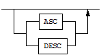

---
hide:
  - footer
  - toc
---
# Altibase 7.3 매뉴얼

-   :octicons-desktop-download-16:{ .lg .middle } __Getting started__

    ---

    어쩌구저쩌구 시작하기

    [Getting Started Guide](Admin/Getting%20Started%20Guide/1.Altibase-설치.md) 
    [Installation Guide](Admin/Installation%20Guide/1.Altibase-패키지-인스톨러.md) 
    [Release Note](https://github.com/ALTIBASE/Documents/blob/master/ReleaseNotes/kor/Altibase_7_3_0_0_1_Release_Notes.md)

-   :material-database:{ .lg .middle } __Administration__

    ---

    데이터베이스 관리자 용 알티베이스 기능 설명

    [Administrator's Manual](Admin/Administrator's%20Manual/1.Altibase-소개.md) 
    [Replication Manual](Admin/Replication%20Manual/1.이중화-개요.md) 
    [Performance Tuning Guide](Admin/Performance%20Tuning%20Guide/1.성능-튜닝-소개.md) 
    ... and more

-   :material-language-csharp:{ .lg .middle } __Developer__

    ---

    알티베이스를 더 개발해보세용

    [Stored Procedures Manual](Developer/Stored%20Procedures%20Manual/1.저장-프로시저.md) 
    [Altibase C Interface Manual](Developer/Altibase%20C%20Interface%20Manual/1.Altibase-C-인터페이스-소개.md) 
    [API User's Manual](Developer/API%20User's%20Manual/1.PHP-Interface.md) 
    [... and more]()

-   :octicons-tools-16:{ .lg .middle } __Tools within Pakages__

    ---

    내장 툴 매뉴얼

    [Utilities Manual](https://soyoon-choi-mkdocs-trial.readthedocs-hosted.com/ko/7.3/Version-dependent%20Tools/Utilities%20Manual/1.aexport/) 
    [iSQL User's Manual](https://soyoon-choi-mkdocs-trial.readthedocs-hosted.com/ko/7.3/Version-dependent%20Tools/iSQL%20User%27s%20Manual/1.iSQL-%EC%9D%B4%EC%9A%A9%EB%B0%A9%EB%B2%95/) 
    [iLoader User's Manual](https://soyoon-choi-mkdocs-trial.readthedocs-hosted.com/ko/7.3/Version-dependent%20Tools/iLoader%20User%27s%20Manual/1.iLoader-%EA%B0%9C%EC%9A%94/) 
    [... and more]()

-   :octicons-link-external-16:{ .lg .middle } __External Tools__

    ---

    다운로드 받아야 하는 외장 툴

    [Altibase 3rd Party Connector Guide](https://soyoon-choi-mkdocs-trial.readthedocs-hosted.com/ko/7.3/Tools/Altibase%203rd%20Party%20Connector%20Guide/1.DBeaver/) 
    [Migration Center User's Manual](https://soyoon-choi-mkdocs-trial.readthedocs-hosted.com/ko/7.3/Tools/Migration%20Center%20User%27s%20Manual/1.Migration-Center-%EC%86%8C%EA%B0%9C/) 
    [altiShapeLoader User's Manual](https://soyoon-choi-mkdocs-trial.readthedocs-hosted.com/ko/7.3/Tools/altiShapeLoader%20User%27s%20Manual/1.-altiShapeLoader-%EC%86%8C%EA%B0%9C/) 
    [... and more]()

-   :fontawesome-solid-book:{ .lg .middle } __References__

    ---

    레퍼런스 매뉴얼

    [SQL Reference](https://soyoon-choi-mkdocs-trial.readthedocs-hosted.com/ko/7.3/Developer/SQL%20Reference/1.Altibase-SQL-%EC%86%8C%EA%B0%9C/) 
    [Data Types & Properties](https://soyoon-choi-mkdocs-trial.readthedocs-hosted.com/ko/7.3/Admin/General_Reference-1.Data%20Types%20%26%20Altibase%20Properties/0.%20%EC%84%9C%EB%AC%B8/) 
    [Data Dictionary](https://soyoon-choi-mkdocs-trial.readthedocs-hosted.com/ko/7.3/Admin/General_Reference-2.The%20Data%20Dictionary/0.%EC%84%9C%EB%AC%B8/) 
    [Error Message](https://soyoon-choi-mkdocs-trial.readthedocs-hosted.com/ko/7.3/Admin/Error%20Message%20Reference/1.ID-Error-Code/)

## 구문 다이어그램

| 구성 요소                     | 의미                                                         |
| ----------------------------- | ------------------------------------------------------------ |
|  | 명령문이 시작한다. 완전한 명령문이 아닌 구문 요소는 화살표로 시작한다. |
|  | 명령문이 다음 라인에 계속된다. 완전한 명령문이 아닌 구문 요소는 이 기호로 종료한다. |
|  | 명령문이 이전 라인으로부터 계속된다. 완전한 명령문이 아닌 구문 요소는 이 기호로 시작한다. |
|  | 명령문이 종료한다.                                           |
|  | 필수 항목                                                    |
|  | 선택적 항목                                                  |
|  | 선택사항이 있는 필수 항목. 한 항목만 제공해야 한다.          |
|  | 선택사항이 있는 선택적 항목                                  |
|  | 선택적 항목. 여러 항목이 허용된다. 각 반복 앞부분에 콤마가 와야 한다. |

## 샘플 코드 규칙

아래 테이블은 코드 예제에서 사용된 인쇄 규칙에 대해 설명한다.

| 규칙         | 의미                                                         | 예제                                                         |
| ------------ | ------------------------------------------------------------ | ------------------------------------------------------------ |
| [ ]          | 선택 항목을 표시                                             | VARCHAR [(*size*)][[FIXED \|] VARIABLE]                      |
| { }          | 필수 항목 표시. 반드시 하나 이상을 선택해야 되는 표시        | { ENABLE \| DISABLE \| COMPILE }                             |
| \|           | 선택 또는 필수 항목 표시의 인자 구분 표시                    | { ENABLE \| DISABLE \| COMPILE } [ ENABLE \| DISABLE \| COMPILE ] |
| . . .        | 그 이전 인자의 반복 표시 예제 코드들의 생략되는 것을 표시    | SQL\> SELECT ename FROM employee;  ENAME   -----------------------  SWNO   HJNO   HSCHOI   .  .  .  20 rows selected. |
| 그 밖에 기호 | 위에서 보여진 기호 이 외에 기호들                            | EXEC :p1 := 1; acc NUMBER(11,2);                             |
| 기울임 꼴    | 구문 요소에서 사용자가 지정해야 하는 변수, 특수한 값을 제공해야만 하는 위치 | SELECT \* FROM *table_name*;  CONNECT *userID*/*password*; |
| 소문자       | 사용자가 제공하는 프로그램의 요소들, 예를 들어 테이블 이름, 칼럼 이름, 파일 이름 등 | SELECT ename FROM employee;                                  |
| 대문자       | 시스템에서 제공하는 요소들 또는 구문에 나타나는 키워드       | DESC SYSTEM_.SYS_INDICES_;                                   |

## Altibase는 여러분의 의견을 환영합니다.

이 매뉴얼에 대한 여러분의 의견을 보내주시기 바랍니다. 사용자의 의견은 다음 버전의 매뉴얼을 작성하는데 많은 도움이 됩니다. 보내실 때에는 아래 내용과 함께 [고객서비스포털]( ttp://support.altibase.com/kr/)로 보내주시기 바랍니다.

-   사용 중인 매뉴얼의 이름과 버전

-   매뉴얼에 대한 의견

-   사용자의 성함, 주소, 전화번호

이 외에도 Altibase 기술지원 설명서의 오류와 누락된 부분 및 기타 기술적인 문제들에 대해서 이 주소로 보내주시면 정성껏 처리하겠습니다. 또한, 기술적인 부분과 관련하여 즉각적인 도움이 필요한 경우에도 고객서비스포털을 통해 서비스를 요청하시기 바랍니다.

여러분의 의견에 항상 감사드립니다.